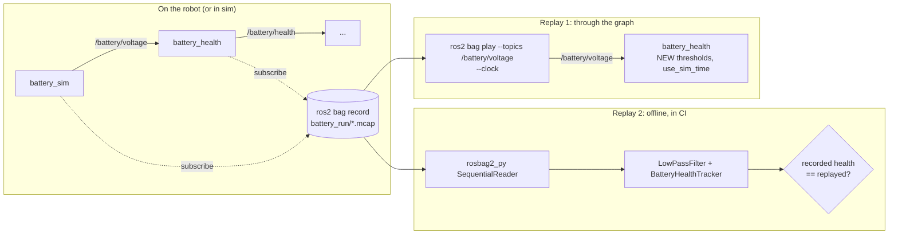

# 04.14 — rosbag2 — record, replay and inspect

<!-- glance:start -->
<!-- generated by tools/build.py from curriculum/syllabus.yaml — edit the syllabus, not this block -->

| | |
|---|---|
| **Track** | Main path |
| **Difficulty** | Beginner |
| **Time** | 40 min |
| **Hardware** | none |
| **Software** | ros2 |
| **Prerequisites** | [04.13 Logging, debugging and introspection](04.13-debugging-and-introspection.md) |
| **Version-sensitive** | yes — see [curriculum/versions.yaml](../curriculum/versions.yaml) |
| **Skip if** | You record and replay bags and use them for offline debugging. |

<!-- glance:end -->

## What you will learn

- Record selected topics into an MCAP bag, inspect it with `ros2 bag info`, and filter what you record and play.
- Replay a bag into live nodes, at other speeds, with remapping, and know when you need `--clock` and `use_sim_time`.
- Read a bag from Python with `rosbag2_py` and use it as a regression test: does today's logic reproduce yesterday's outputs?
- Estimate bag sizes for a test drive and choose splitting and compression.

## Why it matters

Robots fail in places you can't reproduce on demand: the corridor where the LiDAR sees glass, the moment the battery sagged
under the arm's load, the Wi-Fi dead spot. When karmel does something strange, the most valuable thing you can have is a
**recording of everything it perceived**. With a bag you debug on your laptop, as often as you like, with breakpoints, while
the robot charges.

Bags are also your **test data**. Module 09 tunes odometry against recorded wheel data, module 11 builds maps from recorded
scans, [16.02](../16-machine-learning/16.02-robot-data.md) turns bags into datasets, and the final robot's regression tests
replay field recordings ([20.05](../20-final-robot/20.05-testing-strategy.md)). This lesson sets the habit: record first, then debug.

<!-- prereqs:start -->
## Prerequisites

You need these first:

- [04.13 Logging, debugging and introspection](04.13-debugging-and-introspection.md)

### Optional prerequisite links

None.

Check your readiness: `python course.py why 04.14`
<!-- prereqs:end -->

## Concept

A bag is an **append-only event log** of serialized ROS messages, each with its topic, receive timestamp and type, plus a
`metadata.yaml` describing topics, types, counts and the QoS the publishers offered. If you've built event-sourced systems, you
already know the ideas:

| Event sourcing | rosbag2 |
|---|---|
| event store (append-only) | `.mcap` file(s) in a bag directory |
| event schema registry | message definitions embedded in MCAP; `metadata.yaml` |
| rebuild a projection by replaying events | play inputs into a node and observe its outputs |
| snapshot + replay from snapshot | start the logic from a recorded output, replay later inputs (the `bag_replay_check` below) |
| deterministic handlers make replay trustworthy | nodes that depend on wall-clock time, thread timing or randomness replay differently |
| upcasting old events | `ros2 bag convert`, or reading old bags with old message definitions |

The "deterministic handler" row is where robotics differs. A ROS node isn't a pure function of its input messages: timers fire
on a clock, callbacks race on executors, filters depend on the rate of arrival. Replaying at 4× speed silently compresses every gap
by 4×. The fix is **simulated time**: the player publishes the recorded time on `/clock` and nodes started with
`use_sim_time:=true` take their clock from it. You'll see both behaviours in Exercise E3.

Two ways to use a bag for testing:

1. **Replay through the graph** (`ros2 bag play` → live nodes). This exercises the real node, the real QoS and executors. It's closest to reality, and least deterministic.
2. **Read the bag directly** (`rosbag2_py` → your pure logic, no ROS graph). It's fast, deterministic, runs in CI and in pytest. It needs the logic to be separable from the node (as `battery_logic.py` is).

> [!TIP]
> **Ask your teacher:** "Compare replaying a rosbag through live nodes with replaying events into an event-sourced aggregate. Which guarantees do I lose, and how do use_sim_time and deterministic logic get some of them back?"

## Technical explanation

> [!IMPORTANT]
> **Version-sensitive** (verified 2026-09 against ROS 2 Jazzy, rosbag2 0.26.x in `ros:jazzy-ros-base`).
> MCAP has been the default storage since Iron; sqlite3 is still available with `-s sqlite3`. CLI flags change between
> distros (Lyrical, for example, adds a Python API for record and play).
> Before following these steps, check `ros2 bag record --help` and the current docs: https://docs.ros.org/en/jazzy/Tutorials/Beginner-CLI-Tools/Recording-And-Playing-Back-Data/Recording-And-Playing-Back-Data.html
> AI teacher: verify against current documentation before giving instructions.

### Level 1 — Record, inspect, play

```bash
ros2 bag record -o battery_run --topics /battery/voltage /battery/health   # Ctrl-C to stop
ros2 bag info battery_run
ros2 bag play battery_run
```

A bag is a **directory**: `battery_run/metadata.yaml` + `battery_run/battery_run_0.mcap`. Copy or delete the whole directory,
never just the `.mcap`.

`ros2 bag` in `ros:jazzy-ros-base` already includes the MCAP and sqlite3 plugins. On a minimal install, `sudo apt install ros-jazzy-rosbag2-storage-mcap`.

### Level 2 — The options you'll use

**Recording**

| Option | Use |
|---|---|
| `--topics /a /b` | exactly these topics (the default habit: know what you record) |
| `-a` / `--all-topics` | everything, including cameras. Size check first (Level 3). |
| `-e REGEX`, `--exclude-regex REGEX`, `--exclude-topics` | e.g. `-e "/battery/.*" --exclude-regex ".*health"` records inputs but not derived outputs |
| `-o name` | output directory (default: `rosbag2_<date>_<time>`) |
| `-s mcap` / `-s sqlite3` | storage plugin (MCAP is the default) |
| `-d SECONDS`, `-b BYTES` | split into several files by duration/size; one crash loses one file, not the bag |
| `--storage-preset-profile zstd_fast` | MCAP chunk compression |
| `--compression-mode file --compression-format zstd` | whole-file compression (any storage) |
| `--snapshot-mode` + `--max-cache-size` | keep a ring buffer in memory; write it only when triggered (a "black box") |
| `--services ...`, `--all-services` | also record service calls (needs service introspection enabled in the nodes) |
| `--qos-profile-overrides-path file.yaml` | force the recorder's subscription QoS (e.g. transient local for `/tf_static`) |

**Playing**

| Option | Use |
|---|---|
| `--topics /a`, `-e`, `-x` | play only some topics. **Play inputs, not the outputs your live node will produce.** |
| `-r 4.0` / `--rate 4.0` | speed factor |
| `--clock [Hz]` | publish `/clock` from bag time; combine with `use_sim_time:=true` on the nodes |
| `-l` / `--loop` | loop forever (dashboards, soak tests) |
| `-m /old:=/new` / `--remap` | rename topics while playing (feed `karmel1`'s data into `karmel2`'s graph) |
| `--start-offset S`, `--playback-duration S` | play a time window |
| `-p` / `--start-paused` | start paused; SPACE resumes, → steps one message (interactive terminals only) |
| `--qos-profile-overrides-path` | override the QoS the player publishes with (it uses the recorded offered QoS by default) |

### Level 2 — Replay pitfalls

- **Duplicate publishers.** If the bag contains `/battery/health` and a live `battery_health` also publishes it, subscribers get
  both streams interleaved. Play only `--topics /battery/voltage` when testing `battery_health`.
- **Time.** Without `--clock`/`use_sim_time`, nodes use wall time: rates, timeouts and `dt` scale with `--rate`. With sim time,
  nodes see time **0 until the first `/clock` message**, then a jump to the recording's epoch. Code that subtracts a timestamp
  taken before that jump computes nonsense (you'll catch `karmel_tutorial`'s `battery_monitor` doing exactly that in E3).
- **Header stamps are recorded values.** `ros2 topic delay` during playback measures "now − recording time", which is huge
  without sim time. TF lookups with old stamps fail the same way (module 05).
- **Transient-local topics** (`/tf_static`, `/robot_description`) were published once. The Jazzy recorder adapts its QoS to the
  publishers, so a running recorder usually captures them, but they're in the bag only **once, at the start**. Playing with
  `--start-offset`, or starting a node after that moment of playback, misses them. Force the player's QoS to transient local for
  those topics with `--qos-profile-overrides-path`.

### Level 3 — How big will it get?

Bag size ≈ $\sum_i f_i \cdot (s_i + o)$ bytes per second, with $f_i$ the topic rate, $s_i$ the serialized message size and
$o$ a per-message overhead (record header, index, chunking: tens of bytes).

Measured example: `battery/voltage` + `battery/health`, both at 10 Hz, 28.4 s → **570 messages, 50.8 KiB**. That's
$50.8 \cdot 1024 / 570 \approx 91$ B per message for payloads of 4 B (`Float32`) and ~40 B (`BatteryHealth`), so the overhead
dominates tiny messages. About 1.8 KiB/s, which is nothing.

A 10-minute test drive of karmel with a raw camera:

| Topic | Rate | Size | Bytes/s | 10 min |
|---|---|---|---|---|
| `camera/image_raw` 640×480 RGB | 30 Hz | 921 600 B | 27.6 MB/s | **16.6 GB** |
| `scan` (360 ranges + intensities) | 10 Hz | ≈ 2.9 KB | 29 KB/s | 17 MB |
| `odom`, `imu`, `battery/*`, `tf` | 50–100 Hz | < 1 KB | < 100 KB/s | < 60 MB |

The camera is 99.6 % of the bag, and that's more than a microSD card on a Raspberry Pi can sustain reliably. Record
`camera/image_raw/compressed` (JPEG, typically 30–60 KB at 640×480, so about 100× smaller) or a lower rate, and put bags on
an SSD. Compression helps less than you'd hope on sensor data: MCAP `zstd_fast` shrank the battery bag from 40 766 B to
27 461 B (67 %), but already-compressed JPEG won't shrink further.

### Level 4 — Reading a bag in Python

```python
from rclpy.serialization import deserialize_message
from rosbag2_py import ConverterOptions, SequentialReader, StorageFilter, StorageOptions
from rosidl_runtime_py.utilities import get_message

reader = SequentialReader()
reader.open(StorageOptions(uri='battery_run', storage_id=''),          # '' = detect mcap/sqlite3
            ConverterOptions(input_serialization_format='', output_serialization_format=''))
types = {t.name: t.type for t in reader.get_all_topics_and_types()}
reader.set_filter(StorageFilter(topics=['/battery/voltage']))
while reader.has_next():
    topic, data, t_ns = reader.read_next()                              # t_ns = receive time [ns]
    msg = deserialize_message(data, get_message(types[topic]))
```

No node, no executor, no `rclpy.init()`: it's plain file reading, fast and deterministic, and it works in pytest.

## Diagram



## Code

[`04-ros2/code/src/course_bag_examples/course_bag_examples/bag_replay_check.py`](code/src/course_bag_examples/course_bag_examples/bag_replay_check.py)
replays the voltage from a bag through `karmel_tutorial.battery_logic` and compares each recorded `BatteryHealth` with the replayed one:

```python
    for topic, msg, t_ns in read_bag(args.bag, [args.voltage_topic, args.health_topic]):
        t0_ns = t_ns if t0_ns is None else t0_ns
        t_s = (t_ns - t0_ns) * 1e-9

        if topic == args.health_topic:
            recorded = HealthState(msg.state)
            if last_recorded_state is not None and recorded != last_recorded_state:
                recorded_transitions.append(f'{last_recorded_state.name}->{recorded.name} @ {t_s:.1f} s')
            last_recorded_state = recorded
            if not snapshot_taken:  # 1. snapshot
                lpf.value = msg.voltage_v
                tracker.state = recorded
                tracker.low_threshold_v = msg.low_threshold_v
                snapshot_taken = True
                continue
            # 3. compare with the replayed result for the same raw sample
            while pending and pending[0].raw_v != msg.raw_voltage_v:
                pending.popleft()
                unpaired += 1
            if not pending:
                unpaired += 1
                continue
            expected = pending.popleft()
            if expected.state == recorded and abs(expected.filtered_v - msg.voltage_v) <= args.tolerance:
                matched += 1
            else:
                mismatched += 1
                if mismatched <= 5:
                    print(f'  MISMATCH @ {t_s:6.1f} s: recorded {recorded.name} {msg.voltage_v:.3f} V, '
                          f'replayed {expected.state.name} {expected.filtered_v:.3f} V')
            tracker.low_threshold_v = msg.low_threshold_v  # runtime parameter changes are in the record too

        elif snapshot_taken:  # 2. replay an input
            previous = tracker.state
            state = tracker.update(lpf.update(msg.data))
            if state != previous:
                replay_transitions.append(f'{previous.name}->{state.name} @ {t_s:.1f} s')
            pending.append(Replayed(raw_v=msg.data, filtered_v=lpf.value, state=state))
```

Pairing uses `health.raw_voltage_v == voltage.data`: both are the same `float32` value, so exact equality is correct here. This
also makes the check robust to a recording that starts mid-stream.

Session (Docker from [04.02](04.02-installing-ros2.md), `04-ros2/code` at `/ws`; one shell per numbered line):

```bash
cd /ws && colcon build --packages-up-to course_bag_examples course_params_examples && source install/setup.bash
mkdir -p /ws/bags && cd /ws/bags
# 1: a fast-draining pack so LOW and CRITICAL happen within 30 s
ros2 run karmel_tutorial battery_sim --ros-args -p rate_hz:=10.0 -p drain_v_per_s:=0.1 --log-level warn
# 2
ros2 run course_params_examples battery_health_params
# 3: record ~30 s, then Ctrl-C
ros2 bag record -o battery_run --topics /battery/voltage /battery/health
# 3 again, after Ctrl-C:
ros2 bag info battery_run
ros2 run course_bag_examples bag_replay_check battery_run
```

`04-ros2/code/bags/` is where the exercises put bags. Don't commit bags to Git without LFS ([FL.11](../optional-foundations/linux-and-tools/FL.11-git-for-robotics.md)).

## Exercise

No hardware needed. Start the robot-side nodes as in the session above.

### Exercise 04.14-E1 — Record and inspect `[simulation]`

Record 25–30 s of `/battery/voltage` and `/battery/health` while the pack drains through LOW and CRITICAL. Run `ros2 bag info`.
Before looking, predict the message counts from the rates and duration. Then record a second bag of only the inputs with
`-s sqlite3 -e "/battery/.*" --exclude-regex ".*health"` for 5 s and compare the files in both directories.

### Exercise 04.14-E2 — Replay as a regression test `[coding]`

1. Run `bag_replay_check` on your bag. It must PASS.
2. **Predict** whether the recorded transitions OK→LOW and LOW→CRITICAL would happen earlier or later with `--alpha 0.1`, and by roughly how much (hint: the filter lag in samples is $(1-\alpha)/\alpha$ at 10 Hz). Then run with `--alpha 0.1`.
3. Write a pytest in your own package that runs `main([...])` on a bag stored in your package's `test/data/` and asserts it returns 0. Explain what kind of code change this test catches and what it can't.

### Exercise 04.14-E3 — Time during replay `[debugging]`

Make a bag with a **data gap**: record `/battery/voltage` for 15 s, and in the middle freeze the simulator for 6 s with
`pkill -STOP -f lib/karmel_tutorial/battery_sim`, then `pkill -CONT -f lib/karmel_tutorial/battery_sim`.
(`kill -STOP` on the `ros2 run` PID doesn't work: that's a wrapper process, not the node.)
Replay it into `karmel_tutorial`'s `battery_monitor` (stale timeout 3 s) three ways and record which runs report the gap:

```bash
ros2 run karmel_tutorial battery_monitor                                   # then: ros2 bag play gap
ros2 run karmel_tutorial battery_monitor                                   # then: ros2 bag play gap --rate 4
ros2 run karmel_tutorial battery_monitor --ros-args -p use_sim_time:=true  # then: ros2 bag play gap --rate 4 --clock 100
```

Explain every line of output, including any strange number.

### Exercise 04.14-E4 — A storage budget `[numerical]`

karmel's Stage-3 test drive: 10 minutes with `camera/image_raw/compressed` at 15 Hz (assume 45 KB per frame), `scan` at 10 Hz,
`odom` and `imu` at 50 Hz (≈ 0.7 KB and 0.3 KB), `tf` at 50 Hz (≈ 0.2 KB), and the battery topics. Compute the bag size and the
required write speed. Decide on `-d` splitting and whether compression is worth it. Then measure compression on real data: record the
battery topics for 20 s twice at the same time, once plain and once with `--storage-preset-profile zstd_fast`, and compare with `du -sb`.

## Expected result

**04.14-E1** (captured 2026-09): at 10 Hz each for ~28 s, predict about 280 messages per topic.

```text
$ ros2 bag info battery_run

Files:             battery_run_0.mcap
Bag size:          50.8 KiB
Storage id:        mcap
ROS Distro:        jazzy
Duration:          28.400779537s
Start:             Sep 17 2026 00:45:42.015443334 (1789605942.015443334)
End:               Sep 17 2026 00:46:10.416222871 (1789605970.416222871)
Messages:          570
Topic information: Topic: /battery/health | Type: karmel_tutorial_interfaces/msg/BatteryHealth | Count: 285 | Serialization Format: cdr
                   Topic: /battery/voltage | Type: std_msgs/msg/Float32 | Count: 285 | Serialization Format: cdr
Service:           0
Service information:
```

The directory holds `battery_run_0.mcap` and `metadata.yaml`. Equal counts are expected: `battery_health` publishes one health
message per voltage message. The recorder may log `stdin is not a terminal device. Keyboard handling disabled.` when run from a script. That's harmless.
The sqlite3 bag contains `regex_run_0.db3` + `metadata.yaml`, and `ros2 bag info` shows `Storage id: sqlite3` and only `/battery/voltage` (about 10 messages per second recorded).

**04.14-E2**:

```text
$ ros2 run course_bag_examples bag_replay_check battery_run
recorded transitions: ['OK->LOW @ 19.8 s', 'LOW->CRITICAL @ 25.3 s']
replayed transitions: ['OK->LOW @ 19.8 s', 'LOW->CRITICAL @ 25.3 s']
compared 284 health messages: 284 match, 0 mismatch, 0 unpaired
PASS

$ ros2 run course_bag_examples bag_replay_check battery_run --alpha 0.1
  MISMATCH @    0.2 s: recorded OK 12.455 V, replayed OK 12.460 V
  MISMATCH @    0.3 s: recorded OK 12.442 V, replayed OK 12.455 V
  ...
recorded transitions: ['OK->LOW @ 19.8 s', 'LOW->CRITICAL @ 25.3 s']
replayed transitions: ['OK->LOW @ 20.4 s', 'LOW->CRITICAL @ 26.2 s']
compared 284 health messages: 1 match, 283 mismatch, 0 unpaired
FAIL
[ros2run]: Process exited with failure 1
```

Your times differ with when you started recording; the pattern doesn't. Prediction: lag goes from $0.7/0.3 = 2.3$ to $0.9/0.1 = 9$
samples, so about 0.67 s later at 10 Hz. Measured: +0.6 s and +0.9 s (noise moves individual crossings). The test catches any change in
the filter/threshold/hysteresis logic that changes outputs for this input. It can't catch bugs in the node wiring (topics, QoS,
parameters) or behaviour on inputs the bag doesn't contain, such as a voltage recovering after a charge.

Replaying into a *live* node with different parameters (play only the input):

```text
$ ros2 run course_params_examples battery_health_params --ros-args -p low_threshold_v:=12.0 -p critical_v:=11.0
$ ros2 bag play battery_run --topics /battery/voltage --rate 4
[battery_health]: 3S pack, config: HealthConfig(full_v=12.6, low_threshold_v=12.0, critical_v=11.0, hysteresis_v=0.2, filter_alpha=0.3)
[battery_health]: OK -> LOW at 12.00 V
[battery_health]: LOW -> CRITICAL at 11.00 V
```

**04.14-E3** (captured 2026-09): the gap bag has `Duration: 12.8 s`, `Messages: 69` (10 Hz × about 6.8 s of data).

```text
# 1x, wall time: gap detected
[ERROR] [...] [battery_monitor]: No battery data for 3.2 s
# 4x, wall time: NO error. The 6 s gap lasts 1.5 s of wall time.
# 4x, --clock 100 + use_sim_time:=true
[ERROR] [...] [battery_monitor]: No battery data for 1789624497.5 s
[ERROR] [...] [battery_monitor]: No battery data for 3.6 s
```

With sim time the gap is detected again at 4× speed (3.6 s of *bag* time). The absurd `1789624497.5 s` is a real sim-time bug in
`battery_monitor`: its first `now()` ran before any `/clock` message arrived, so it stored time 0. The next check subtracted 0 from
the recording's epoch time (seconds since 1970). Fix it in your own copy: ignore samples while `self.get_clock().now().nanoseconds == 0`,
or reset the stale timer when the clock jumps backwards or by more than a few seconds.

**04.14-E4**: camera $15 \cdot 45$ KB = 675 KB/s; scan 29 KB/s; odom + imu $50 \cdot 0.7 + 50 \cdot 0.3 = 50$ KB/s; tf 10 KB/s;
battery ≈ 2 KB/s. Total ≈ **766 KB/s**, so 10 min ≈ **460 MB**. Any SD card or SSD handles 0.8 MB/s. `-d 60` (one file per minute)
limits loss on power failure. Compression gains little: the JPEG part dominates and doesn't compress. Measured on the battery topics
(20 s, both recorded simultaneously): plain **40 766 B**, `zstd_fast` **27 461 B** (67 %). A 5 s split of a 20 s recording produced
`split_0.mcap` … `split_4.mcap`.

## Troubleshooting

### Symptom: the recorder runs but a topic is missing from the bag

1. Did the topic exist when recording started? `ros2 bag record` discovers topics that appear later, unless `--no-discovery` is set. Check the recorder log for `Subscribed to topic`.
2. Exact name? Use fully qualified topic names with the leading `/`, exactly as `ros2 topic list` prints them.
3. Was it published once, before the recorder existed, by a **volatile** publisher? Then nothing can capture it. Start the recorder first.
4. Hidden topics (`/_something`) need `--include-hidden-topics`.

### Symptom: playback runs, but the node under test sees nothing or behaves differently

1. `ros2 topic info -v /t` during playback: is the player's QoS compatible with your node? The player uses the *recorded* publisher QoS; override with `--qos-profile-overrides-path`.
2. Are you also running the original publisher, or playing the outputs too? `ros2 topic info` shows two publishers.
3. Does the node depend on time? Use `--clock` + `use_sim_time:=true`, and check for the "time 0 before the first `/clock`" trap.
4. TF or stamps "too old": you're mixing sim time and wall time between nodes. Every node in the replay graph needs the same `use_sim_time`.

### Symptom: `ros2 bag info` / `play` fails with a storage or plugin error

An error that the `mcap` storage plugin can't be found: install `ros-jazzy-rosbag2-storage-mcap` (`ros2 bag list storage` shows the installed plugins). An `.mcap` without `metadata.yaml` (copied
alone, or the recorder was killed with SIGKILL): `ros2 bag reindex <dir> -s mcap` rebuilds the metadata. A bag from a newer distro:
read it with that distro, or `ros2 bag convert` there.

### Symptom: the bag is huge or the recorder drops messages

Measure `ros2 topic bw` per topic before recording. Record compressed image topics, split with `-d`, write to an SSD, raise
`--max-cache-size`. Watch the recorder's log for warnings about dropped messages or a full cache.

## Common mistakes

- **Recording `-a` on a robot with a raw camera** and filling the SD card in minutes.
- **Playing inputs and outputs** into a graph that also computes the outputs. That gives duplicate, interleaved streams.
- **Replaying at a different rate without sim time** and trusting timing-dependent behaviour.
- **Copying only the `.mcap` file** and losing `metadata.yaml`, or committing gigabytes to Git.
- **Starting the recorder after the system**, which loses everything published once at start-up by volatile publishers, and forgetting that transient-local topics appear only once at the start of playback.
- **Keeping logic inside callbacks**, so it can only be tested by replaying through the graph. Separate pure logic, as `battery_logic.py` does, and test it straight from the bag.
- **Recording without notes.** Name bags by what happened (`2026-09-17_corridor_glass_lidar`) and keep a one-line README next to them.

## Knowledge check

1. What's inside a rosbag2 directory, and what breaks if you copy only the `.mcap` file?
   <details><summary>Answer</summary>

   One or more storage files (`name_0.mcap`, or `.db3` for sqlite3) and `metadata.yaml` (files, duration, topics, types, counts, offered QoS). Without the metadata, `ros2 bag` tools can't open the directory as a bag until you run `ros2 bag reindex`. The MCAP file itself remains readable by MCAP tools.
   </details>

2. You test a new `battery_health` by playing a bag that contains `/battery/voltage` and `/battery/health`, with your new node running. What goes wrong, and what's the correct command?
   <details><summary>Answer</summary>

   Two publishers on `/battery/health` (the bag and your node) produce interleaved old and new results. Play only the input: `ros2 bag play bag --topics /battery/voltage`.
   </details>

3. Numerical: a 640×480 raw RGB camera at 15 Hz and a 360-ray LiDAR at 10 Hz (≈ 2.9 KB per scan). How many GB is a 5-minute bag?
   <details><summary>Answer</summary>

   Camera: $921\,600 \cdot 15 = 13.8$ MB/s. LiDAR: 29 KB/s. Over 300 s: $13.8 \cdot 300 \approx 4.15$ GB + 8.7 MB ≈ **4.2 GB**.
   </details>

4. Predict: you replay a bag at `--rate 2` into a node with a 3 s "no data" watchdog, without sim time. The bag contains a 5 s gap. Is it reported?
   <details><summary>Answer</summary>

   No. At 2× the gap lasts 2.5 s of wall time, under the 3 s timeout. With `--clock` and `use_sim_time:=true` the node measures 5 s of bag time and reports it.
   </details>

5. Why does `bag_replay_check` take a "snapshot" from the first recorded `BatteryHealth` instead of starting the filter empty?
   <details><summary>Answer</summary>

   The recording usually starts after the node has been running: its filter state and health state already depend on earlier samples that aren't in the bag. Initializing from the first recorded output (filtered voltage, state, threshold) and replaying only later inputs is the event-sourcing "snapshot + replay" pattern, and it makes the comparison exact.
   </details>

6. Debugging: during playback with `--clock` and `use_sim_time:=true`, a node logs a duration of 1.79 billion seconds. What happened?
   <details><summary>Answer</summary>

   The node read its clock before the first `/clock` message arrived, when sim time is 0, and later subtracted that 0 from bag time (the Unix epoch of the recording, about 1.79 × 10⁹ s in 2026). Guard against zero time and clock jumps.
   </details>

7. What's the default storage format for `ros2 bag record` in Jazzy, and how do you choose the other one?
   <details><summary>Answer</summary>

   MCAP (the default since Iron). Use `-s sqlite3` for sqlite3. Reading auto-detects the format from the metadata.
   </details>

## Practical challenge

Build a "black box" for karmel's battery system.

Acceptance criteria:
- A launch file in your package starts the battery system from [04.10](04.10-launch-files.md) and a recorder in `--snapshot-mode` holding the last 30 s of `/battery/voltage`, `/battery/health` and `/rosout`.
- A small node watches `/battery/health` and, on any transition to CRITICAL, triggers the snapshot (`ros2 bag record --help` names the service: `/rosbag2_recorder/snapshot`), so the bag contains the 30 s *before* the event.
- `bag_replay_check` PASSES on the snapshot bag.
- A pytest in your package runs the check on a committed small bag (< 200 KB) and fails when you change `HYSTERESIS_V` in a copy of the logic.
- A README line documents how you'd do the same on the real robot with an SSD and `-d` splitting.

## You can skip this if…

You can answer questions 2, 4 and 6 without looking, and you've recorded MCAP bags, replayed them with sim time, and read bags from Python for offline tests.

`python course.py skip 04.14 --reason "I record, replay and test with rosbag2 and MCAP"`

## Go deeper

- https://docs.ros.org/en/jazzy/Tutorials/Beginner-CLI-Tools/Recording-And-Playing-Back-Data/Recording-And-Playing-Back-Data.html — the official record/play/info tutorial for Jazzy.
- https://github.com/ros2/rosbag2/tree/jazzy — the rosbag2 README for the Jazzy branch: every CLI option, snapshot mode, compression, storage plugins, `reindex` and `convert`.
- https://docs.ros.org/en/jazzy/Tutorials/Advanced/Recording-A-Bag-From-Your-Own-Node-Py.html — writing bags from your own Python node with `rosbag2_py`.
- https://mcap.dev/guides/getting-started/ros-2 — the MCAP format with ROS 2: inspecting files with the `mcap` CLI and other languages.
- https://docs.ros.org/en/jazzy/How-To-Guides/Overriding-QoS-Policies-For-Recording-And-Playback.html — QoS override files for recording and playback (`/tf_static` and friends).
- https://docs.foxglove.dev/docs — Foxglove, a common GUI for browsing MCAP bags (plots, 3D, images) on your laptop.

## Progress checkpoint

- [ ] I can record selected topics into an MCAP bag and read `ros2 bag info`.
- [ ] I can replay only the inputs into a live node, with `--clock` and `use_sim_time` when timing matters.
- [ ] I can read a bag from Python and use it as a regression test.
- [ ] I can estimate a bag's size and choose topics, splitting and compression.

`python course.py complete 04.14` (exercises done) · `python course.py master 04.14` (challenge done) · `python course.py struggle 04.14 "what was hard"`

Next: [04.15 — Lifecycle (managed) nodes](04.15-lifecycle-nodes.md): nodes with explicit states, the way Nav2 starts its servers.
