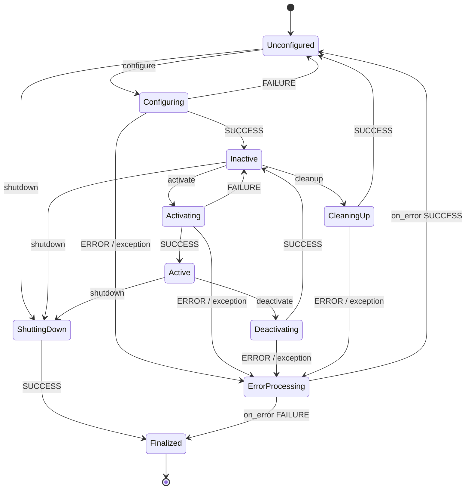

# 04.15 — Lifecycle (managed) nodes

<!-- glance:start -->
<!-- generated by tools/build.py from curriculum/syllabus.yaml — edit the syllabus, not this block -->

| | |
|---|---|
| **Track** | Main path |
| **Difficulty** | Intermediate |
| **Time** | 45 min |
| **Hardware** | none |
| **Software** | ros2, rclpy |
| **Prerequisites** | [04.12 Executors, callback groups and timing](04.12-executors-and-callbacks.md) |
| **Skip if** | You can explain the lifecycle states Nav2 relies on. |

<!-- glance:end -->

## What you will learn

- Name the four primary lifecycle states and the transitions between them, and say what belongs in each transition callback.
- Drive a managed node through configure, activate, deactivate, cleanup and shutdown with `ros2 lifecycle`.
- Convert an ordinary node into an rclpy `LifecycleNode` with a lifecycle publisher and a subscription that exists only while active.
- Bring up lifecycle nodes in order from a launch file, as Nav2's lifecycle manager does.
- Explain why Nav2 uses lifecycle nodes and what its lifecycle manager and bonds add.

## Why it matters

Until now a node started doing its job the moment its process started: `battery_health` subscribed, published and judged the
battery immediately, whether or not its configuration made sense and whether or not the rest of the system was ready. That's
fine for four nodes. For Nav2 it isn't. `amcl` shouldn't localize before `map_server` has loaded the map. The controller shouldn't
send `cmd_vel` before the costmaps have seen a scan. When you pause navigation, the servers should stop *acting* without
throwing away their loaded maps and plugins.

Nav2's servers are **lifecycle (managed) nodes**, and `nav2_lifecycle_manager` configures and activates them in a fixed order. When you
bring up Nav2 in [12.06](../12-navigation/12.06-nav2-architecture.md) and [12.07](../12-navigation/12.07-nav2-in-simulation.md) and
something stays "inactive", you'll need to read those states. The same pattern is how karmel's own drivers should behave: configure (open
the serial port, check parameters), activate (enable the motors), deactivate (stop the motors, keep the port).

<!-- prereqs:start -->
## Prerequisites

You need these first:

- [04.12 Executors, callback groups and timing](04.12-executors-and-callbacks.md)

### Optional prerequisite links

None.

Check your readiness: `python course.py why 04.15`
<!-- prereqs:end -->

## Concept

A lifecycle node has an explicit **state machine**, controlled from outside through standard services. You've used this pattern before:

| Lifecycle node | .NET / Kubernetes |
|---|---|
| constructor: declare parameters, allocate nothing heavy | DI container constructs the service |
| `on_configure`: read parameters, validate, allocate (open ports, load maps, create publishers) | `IHostedService` setup; failing `ValidateOnStart` stops the host |
| **inactive**: configured, ready, not acting | pod started but **not ready**: the readiness probe fails, no traffic |
| `on_activate`: start acting (subscribe, publish, enable motors) | `StartAsync`; readiness probe turns green |
| `on_deactivate`: stop acting, keep resources | pod removed from the Service endpoints (draining), process kept |
| `on_cleanup`: release resources, back to unconfigured | `StopAsync` + `Dispose`, ready to reconfigure |
| `on_shutdown` → **finalized** | termination; only destruction is left |
| lifecycle manager (Nav2) | the orchestrator bringing services up in dependency order, with health checks |

Three things make this worth the extra code:

1. **Deterministic bring-up.** An external manager decides the order and waits for each node to *report* it reached a state. No
   `sleep(5)` in launch files, no "hope the map is loaded by now".
2. **Fail before acting.** A bad configuration makes `configure` fail. The node stays unconfigured and never publishes nonsense.
3. **Pause and reconfigure without restarting processes.** Deactivate → change parameters → cleanup → configure → activate.
   Loaded maps, TF buffers and plugin instances survive a deactivate.

> [!TIP]
> **Ask your teacher:** "Map the ROS 2 lifecycle states onto Kubernetes pod phases, readiness probes and IHostedService StartAsync/StopAsync, and show me where the analogy breaks."

## Technical explanation

### Level 1 — States and transitions

**Primary states** (stable, where the node waits): `unconfigured` [1], `inactive` [2], `active` [3], `finalized` [4].

**Transition states** (while a callback runs): `configuring`, `cleaningup`, `activating`, `deactivating`, `shuttingdown`, `errorprocessing`.

| Transition (id) | From → To (on SUCCESS) | Your callback | Typical work |
|---|---|---|---|
| `configure` [1] | unconfigured → inactive | `on_configure` | read and validate parameters, create publishers, open devices, load files |
| `activate` [3] | inactive → active | `on_activate` | create subscriptions/timers, activate lifecycle publishers, enable actuators |
| `deactivate` [4] | active → inactive | `on_deactivate` | stop timers/subscriptions, stop actuators, keep resources |
| `cleanup` [2] | inactive → unconfigured | `on_cleanup` | release everything `on_configure` created |
| `shutdown` [5], [6], [7] | unconfigured / inactive / active → finalized | `on_shutdown` | release everything, whatever state you were in |

Each callback returns a `TransitionCallbackReturn`:

- `SUCCESS` goes to the goal state.
- `FAILURE` goes back to the state you started from (a "clean no": for example, invalid parameters).
- `ERROR`, or an **uncaught exception**, goes to `errorprocessing`, which calls `on_error`. If that returns SUCCESS, the node lands in `unconfigured`; otherwise it's `finalized`.

The transition ids differ per starting state: shutdown is 5 from unconfigured, 6 from inactive, 7 from active. That's why
`ros2 lifecycle list /node` shows ids next to labels.

### Level 2 — What rclpy manages for you, and what it doesn't

`rclpy.lifecycle.LifecycleNode` (Jazzy) gives you:

- the services `~/change_state`, `~/get_state`, `~/get_available_states`, `~/get_available_transitions`, `~/get_transition_graph` and the topic `~/transition_event`
- **lifecycle publishers** (`create_lifecycle_publisher`): `publish()` is **silently dropped** unless the publisher has been activated. `super().on_activate(state)` activates all of them; `super().on_deactivate(state)` deactivates them.

It doesn't manage:

- **subscriptions, timers, service servers**: they run whenever the executor spins. Create them in `on_activate` and destroy them in
  `on_deactivate` (the course code does this), or check the state at the top of the callback.
- **parameters**: always settable. The pattern is to declare in `__init__` and *read* in `on_configure`, so a change takes effect
  after cleanup + configure.
- **logging of exceptions**: in Jazzy's rclpy, an exception raised inside a transition callback is converted to `ERROR`
  **without any log line**. The CLI just says `Transitioning failed`. Catch exceptions yourself and log them.

In C++ (`rclcpp_lifecycle::LifecycleNode`, which Nav2's servers use through `nav2_util::LifecycleNode`) the model is the same, with more managed entity types.

### Level 2 — Who triggers the transitions

- **By hand**: `ros2 lifecycle set /node configure` (debugging, this lesson).
- **From launch**: `launch_ros.actions.LifecycleNode` + `EmitEvent(ChangeState(...))` + `RegisterEventHandler(OnStateTransition(...))`.
  It's event-driven: "when the node reports `inactive`, emit `activate`".
- **By a manager node**: Nav2's `nav2_lifecycle_manager` takes an ordered `node_names` list and, with `autostart: true`, configures
  them all in order, then activates them all in order. Its service `~/manage_nodes` (`nav2_msgs/srv/ManageLifecycleNodes`) accepts
  `STARTUP`, `PAUSE`, `RESUME`, `RESET`, `SHUTDOWN`, `CONFIGURE` and `CLEANUP`. In Jazzy's `nav2_bringup/launch/navigation_launch.py` the managed list
  starts with `controller_server`, `smoother_server`, `planner_server`, `behavior_server`, … and ends with `docking_server`.
- **Bonds**: after bring-up, the manager holds a *bond* (a heartbeat connection) with each server. If a server stops answering for
  `bond_timeout` (default 4.0 s), the manager transitions **all** its nodes down, so Nav2 doesn't keep driving with half its servers.

### Level 3 — Numbers: what a 4 s bond timeout means for a moving robot

Detection latency is bounded by the timeout $T_b$. A robot moving at speed $v$ can travel

$$d = v \cdot T_b$$

before the lifecycle manager reacts. karmel's max speed is 0.5 m/s (`labs/config/karmel.yaml`). With Nav2's default
$T_b = 4.0$ s: $d = 0.5 \cdot 4.0 = 2.0$ m. That's across a room. So the lifecycle manager isn't a safety mechanism; it's
an *availability* mechanism. Safety comes from the layers that react faster: the base driver's `cmd_vel` timeout
(`cmd_vel_timeout` 0.5 s gives $0.5 \cdot 0.5 = 0.25$ m) and the Pico's firmware watchdog (300 ms gives 0.15 m), which work even when
every ROS process is dead ([SAFETY.md](../SAFETY.md)). Lowering `bond_timeout` to 0.5 s would shorten detection to 0.25 m but cause
false shutdowns whenever the Pi is briefly overloaded. Nav2's docs recommend keeping it above 0.3 s even for all-local discovery.

### Level 4 — `battery_health` as a lifecycle node

`course_lifecycle_examples/lifecycle_battery_health` keeps the node name, topics and parameters of `battery_health_params` from
[04.09](04.09-parameters.md), and reuses its `HealthConfig` validation:

- `__init__` declares parameters and allocates nothing
- `on_configure` validates (FAILURE on invalid), then builds the filter, tracker and lifecycle publisher
- `on_activate` creates the subscription and activates the publisher
- `on_deactivate` destroys the subscription and deactivates the publisher
- `on_cleanup` / `on_shutdown` release everything

## Diagram



## Code

[`04-ros2/code/src/course_lifecycle_examples/course_lifecycle_examples/lifecycle_battery_health.py`](code/src/course_lifecycle_examples/course_lifecycle_examples/lifecycle_battery_health.py):

```python
class LifecycleBatteryHealth(LifecycleNode):

    def __init__(self) -> None:
        super().__init__('battery_health')
        for name, default in HealthConfig().__dict__.items():
            self.declare_parameter(name, default)
        self._pub: LifecyclePublisher | None = None
        self._sub: Subscription | None = None
        self._config: HealthConfig | None = None
        self._filter: LowPassFilter | None = None
        self._tracker: BatteryHealthTracker | None = None
        self.get_logger().info('created (unconfigured): nothing allocated, nothing subscribed')

    # unconfigured -> inactive
    def on_configure(self, state: LifecycleState) -> TransitionCallbackReturn:
        config = HealthConfig(**{n: float(self.get_parameter(n).value) for n in HealthConfig.names()})
        problems = config.problems()
        if problems:
            self.get_logger().error('configure FAILED: ' + '; '.join(problems))
            return TransitionCallbackReturn.FAILURE
        self._config = config
        self._filter = LowPassFilter(alpha=config.filter_alpha)
        self._tracker = BatteryHealthTracker(low_threshold_v=config.low_threshold_v, critical_v=config.critical_v,
                                             hysteresis_v=config.hysteresis_v)
        self._pub = self.create_lifecycle_publisher(BatteryHealth, 'battery/health', 10)
        self.get_logger().info(f'on_configure: {config}')
        return TransitionCallbackReturn.SUCCESS

    # inactive -> active
    def on_activate(self, state: LifecycleState) -> TransitionCallbackReturn:
        self._sub = self.create_subscription(Float32, 'battery/voltage', self._on_voltage, 10)
        self.get_logger().info('on_activate: subscribed to battery/voltage, publishing battery/health')
        return super().on_activate(state)  # activates the lifecycle publisher(s)

    # active -> inactive
    def on_deactivate(self, state: LifecycleState) -> TransitionCallbackReturn:
        self.destroy_subscription(self._sub)
        self._sub = None
        self.get_logger().info('on_deactivate: unsubscribed; configuration kept')
        return super().on_deactivate(state)  # deactivates the lifecycle publisher(s)

    # inactive -> unconfigured
    def on_cleanup(self, state: LifecycleState) -> TransitionCallbackReturn:
        self._release()
        self.get_logger().info('on_cleanup: released publisher and state')
        return TransitionCallbackReturn.SUCCESS

    # unconfigured / inactive / active -> finalized
    def on_shutdown(self, state: LifecycleState) -> TransitionCallbackReturn:
        self._release()
        self.get_logger().info(f'on_shutdown (from {state.label})')
        return TransitionCallbackReturn.SUCCESS

    def _release(self) -> None:
        if self._sub is not None:
            self.destroy_subscription(self._sub)
            self._sub = None
        if self._pub is not None:
            self.destroy_lifecycle_publisher(self._pub)
            self._pub = None
        self._config = self._filter = self._tracker = None
```

The launch file that plays "lifecycle manager" for one node,
[`launch/lifecycle_battery.launch.py`](code/src/course_lifecycle_examples/launch/lifecycle_battery.launch.py):

```python
def generate_launch_description() -> LaunchDescription:
    autostart = LaunchConfiguration('autostart')

    health = LifecycleNode(package='course_lifecycle_examples', executable='lifecycle_battery_health',
                           name='battery_health', namespace='', output='screen')

    configure = EmitEvent(event=ChangeState(
        lifecycle_node_matcher=matches_action(health), transition_id=Transition.TRANSITION_CONFIGURE),
        condition=IfCondition(autostart))

    activate_when_inactive = RegisterEventHandler(OnStateTransition(
        target_lifecycle_node=health, goal_state='inactive',
        entities=[
            LogInfo(msg='battery_health is inactive (configured) -> activating'),
            EmitEvent(event=ChangeState(
                lifecycle_node_matcher=matches_action(health), transition_id=Transition.TRANSITION_ACTIVATE)),
        ]), condition=IfCondition(autostart))

    return LaunchDescription([
        DeclareLaunchArgument('autostart', default_value='true', choices=['true', 'false'],
                              description='configure and activate battery_health automatically'),
        Node(package='karmel_tutorial', executable='battery_sim', name='battery_sim',
             ros_arguments=['--log-level', 'warn'], output='screen'),
        activate_when_inactive,  # register the handler BEFORE the node can reach inactive
        health,
        configure,
    ])
```

`launch_ros.actions.LifecycleNode` requires an explicit `namespace` argument (use `''` for none).

Build (Docker from [04.02](04.02-installing-ros2.md), `04-ros2/code` at `/ws`):

```bash
cd /ws && colcon build --packages-up-to course_lifecycle_examples && source install/setup.bash
```

## Exercise

No hardware needed.

### Exercise 04.15-E1 — Walk the state machine `[simulation]`

Start `ros2 run karmel_tutorial battery_sim --ros-args -p rate_hz:=10.0` and `ros2 run course_lifecycle_examples lifecycle_battery_health`.
Before each command, **predict** the resulting state and whether `/battery/health` is published. Check with `ros2 lifecycle get`,
`ros2 topic info /battery/voltage` (subscription count) and `ros2 topic hz /battery/health`:

```bash
ros2 lifecycle nodes
ros2 lifecycle get /battery_health
ros2 lifecycle list /battery_health
ros2 lifecycle set /battery_health activate
ros2 lifecycle set /battery_health configure
ros2 lifecycle set /battery_health activate
ros2 lifecycle set /battery_health deactivate
ros2 lifecycle set /battery_health cleanup
ros2 lifecycle set /battery_health shutdown
```

In a separate shell, run `ros2 topic echo /battery_health/transition_event` during the sequence.

### Exercise 04.15-E2 — Configuration that fails cleanly `[debugging]`

From `unconfigured`, run `ros2 param set /battery_health low_threshold_v 10.0` and then `configure`. Note the state and the log. Fix the
parameter and configure again. Then, in a scratch copy of the node, make `on_configure` raise `RuntimeError('serial port /dev/ttyACM0 not found')`
instead of returning FAILURE, and repeat. Compare what an operator sees in the two cases.

### Exercise 04.15-E3 — Ordered bring-up from launch `[predict]`

Predict the state of `/battery_health` a few seconds after each command, then check:

```bash
ros2 launch course_lifecycle_examples lifecycle_battery.launch.py
ros2 launch course_lifecycle_examples lifecycle_battery.launch.py autostart:=false
```

What would happen if `activate_when_inactive` were placed **after** `configure` in the `LaunchDescription` list, and why is "before" the robust choice?

### Exercise 04.15-E4 — A two-node mini lifecycle manager `[coding]`

In your own package, write `battery_lifecycle_manager`, an ordinary rclpy node with parameters `node_names` (string array, ordered) and
`autostart` (bool). On start (if `autostart`) it configures every node in order and then activates every node in order, using
`lifecycle_msgs/srv/ChangeState` and `lifecycle_msgs/srv/GetState` clients **asynchronously** ([04.12](04.12-executors-and-callbacks.md)). If any
transition fails, it logs which node failed and shuts all already-configured nodes down in reverse order. Test it with two
`lifecycle_battery_health` instances in namespaces `a` and `b`, where `b` has an invalid `low_threshold_v`.

## Expected result

**04.15-E1** (captured 2026-09, ROS 2 Jazzy):

```text
$ ros2 lifecycle nodes
/battery_health
$ ros2 lifecycle get /battery_health
unconfigured [1]
$ ros2 lifecycle list /battery_health
- configure [1]
	Start: unconfigured
	Goal: configuring
- shutdown [5]
	Start: unconfigured
	Goal: shuttingdown
$ ros2 topic info /battery/voltage
Type: std_msgs/msg/Float32
Publisher count: 1
Subscription count: 0
$ ros2 lifecycle set /battery_health activate
Unknown transition requested, available ones are:
- configure [1]
- shutdown [5]
$ ros2 lifecycle set /battery_health configure
Transitioning successful
$ ros2 lifecycle get /battery_health
inactive [2]
$ ros2 topic info /battery/health
Type: karmel_tutorial_interfaces/msg/BatteryHealth
Publisher count: 1
Subscription count: 0
$ ros2 lifecycle set /battery_health activate
Transitioning successful
$ ros2 topic info /battery/voltage
Type: std_msgs/msg/Float32
Publisher count: 1
Subscription count: 1
$ ros2 topic hz /battery/health
average rate: 9.994
	min: 0.099s max: 0.102s std dev: 0.00081s window: 11
$ ros2 lifecycle set /battery_health deactivate
Transitioning successful
$ ros2 topic hz /battery/health
(no output: the publisher still exists, but nothing is published)
$ ros2 lifecycle set /battery_health cleanup
Transitioning successful
$ ros2 lifecycle set /battery_health shutdown
Transitioning successful
$ ros2 lifecycle get /battery_health
finalized [4]
```

Node log:

```text
[INFO] [...] [battery_health]: created (unconfigured): nothing allocated, nothing subscribed
[INFO] [...] [battery_health]: on_configure: HealthConfig(full_v=12.6, low_threshold_v=10.5, critical_v=9.9, hysteresis_v=0.2, filter_alpha=0.3)
[INFO] [...] [battery_health]: on_activate: subscribed to battery/voltage, publishing battery/health
[INFO] [...] [battery_health]: on_deactivate: unsubscribed; configuration kept
[INFO] [...] [battery_health]: on_cleanup: released publisher and state
[INFO] [...] [battery_health]: on_shutdown (from unconfigured)
```

In inactive, the *publisher* is visible in the graph (created in configure) but there's no subscription yet. The node process keeps
running when finalized: only destroying it is left. `transition_event` shows two events per transition, for example
`start_state: unconfigured → goal_state: configuring`, then `configuring → inactive`.

**04.15-E2**:

```text
$ ros2 param set /battery_health low_threshold_v 10.0
Set parameter successful
$ ros2 lifecycle set /battery_health configure
Transitioning failed
$ ros2 lifecycle get /battery_health
unconfigured [1]
[ERROR] [...] [battery_health]: configure FAILED: low_threshold_v (10.00 V) must be >= critical_v + hysteresis_v (9.90 + 0.20 V)
$ ros2 param set /battery_health low_threshold_v 11.0
$ ros2 lifecycle set /battery_health configure
Transitioning successful
```

The parameter set is accepted, because this lifecycle version declares parameters without an on-set validator: validation happens at
configure. With the raised exception, the CLI shows the same `Transitioning failed` and state `unconfigured [1]`, but **the node's log
is empty**. Jazzy's rclpy swallows the exception (ERROR → errorprocessing → default `on_error` → unconfigured). The operator has no idea why.
Always catch, log and return FAILURE (or ERROR) yourself.

**04.15-E3**: with the default, `ros2 lifecycle get /battery_health` prints `active [3]` and the launch log shows:

```text
[INFO] [battery_sim-1]: process started with pid [901]
[INFO] [lifecycle_battery_health-2]: process started with pid [902]
[lifecycle_battery_health-2] [INFO] [...] [battery_health]: created (unconfigured): nothing allocated, nothing subscribed
[lifecycle_battery_health-2] [INFO] [...] [battery_health]: on_configure: HealthConfig(full_v=12.6, low_threshold_v=10.5, critical_v=9.9, hysteresis_v=0.2, filter_alpha=0.3)
[INFO] [launch.user]: battery_health is inactive (configured) -> activating
[lifecycle_battery_health-2] [INFO] [...] [battery_health]: on_activate: subscribed to battery/voltage, publishing battery/health
```

With `autostart:=false`: `unconfigured [1]`, and `ros2 topic info /battery/voltage` shows `Subscription count: 0`. Registering the
handler after `configure` may appear to work, because the configure transition usually takes longer than launch needs to process the next
action. But it's a race: an event handler must exist *before* the event it waits for can happen, the same rule as subscribing
before publishing a one-shot event.

**04.15-E4**: with a valid `a` and invalid `b`, your manager logs `a` configured, `b` configure failed, and `a` shut down (or cleaned
up). `ros2 lifecycle get /a/battery_health` ends `finalized [4]` (or `unconfigured [1]`, per your design) and `/b/battery_health`
`unconfigured [1]`. With both valid: both `active [3]` in order a then b, visible in the timestamps of the `transition_event` topics. Your
node must stay responsive to `ros2 param get` during bring-up, which proves the service calls don't block its executor.

## Troubleshooting

### Symptom: the node runs, but nothing is published and there's no error

1. `ros2 lifecycle get /node`. Is it `unconfigured` or `inactive`? Lifecycle publishers drop messages silently until activated.
2. If a launch file or manager should have activated it: search the launch log for the transition messages. Did `configure` fail?
3. Did your `on_activate` call `super().on_activate(state)`? Without it, lifecycle publishers stay deactivated even though the state says `active`.

### Symptom: `Transitioning failed` with nothing in the log

An exception in a transition callback (swallowed in rclpy), or a FAILURE path that doesn't log. Wrap callback bodies in
`try/except Exception` with `self.get_logger().error(...)`, or run the node in a debugger and break on exceptions.

### Symptom: `Unknown transition requested, available ones are: ...`

You asked for a transition not valid from the current state (for example `activate` from `unconfigured`). The message lists what's
possible. Check `ros2 lifecycle get` first.

### Symptom: callbacks still fire while the node is inactive

Subscriptions, timers and services aren't lifecycle-managed in rclpy. Create them in `on_activate` and destroy them in
`on_deactivate`, or guard each callback.

### Symptom: Nav2 servers stay inactive and the lifecycle manager reports a failure

Find the first node in `node_names` that failed: the lifecycle manager's log names the node whose transition failed. Check that node's log for its `on_configure` error (usually a parameter, a missing map file or a missing TF). Check `ros2 lifecycle get`
for each server. Details in [12.07](../12-navigation/12.07-nav2-in-simulation.md).

## Common mistakes

- **Doing work in the constructor** (opening ports, subscribing). It defeats the state machine: the node acts before it's configured.
- **Forgetting `super().on_activate(state)` / `super().on_deactivate(state)`**, so lifecycle publishers never turn on or off.
- **Assuming subscriptions and timers are managed.** In rclpy they aren't.
- **Letting exceptions escape transition callbacks**, which produces silent failures.
- **Not releasing in `on_cleanup` what `on_configure` created**, so a second configure creates duplicate publishers.
- **Treating the lifecycle manager or bonds as a safety stop.** Detection takes seconds; motor safety lives in the driver and firmware watchdogs.
- **Mixing lifecycle and plain nodes in a bring-up order** and expecting the plain ones to wait. They start acting immediately.

## Knowledge check

1. Name the four primary states and the transition that leads into each of the last three.
   <details><summary>Answer</summary>

   `unconfigured` (start), `inactive` (via `configure`, or `deactivate` from active), `active` (via `activate`), `finalized` (via `shutdown`). `cleanup` also leads back to `unconfigured`.
   </details>

2. What happens when `on_configure` returns `FAILURE`, and what happens when it raises an exception, in Jazzy's rclpy?
   <details><summary>Answer</summary>

   `FAILURE`: back to `unconfigured`, no error processing. Exception: treated as `ERROR`, the node enters `errorprocessing` and runs `on_error`; the default returns SUCCESS, so it ends in `unconfigured`. The exception isn't logged by rclpy.
   </details>

3. Your lifecycle node is `active`, but `ros2 topic hz` on its output shows nothing. The subscription callback runs (you see debug logs). What's the most likely bug?
   <details><summary>Answer</summary>

   `on_activate` doesn't call `super().on_activate(state)`, so the lifecycle publisher was never activated and `publish()` drops every message silently.
   </details>

4. Numerical: karmel drives at 0.3 m/s. Nav2's lifecycle manager uses `bond_timeout: 4.0`, the base driver has `cmd_vel_timeout: 0.5` s and the Pico watchdog is 300 ms. If the controller server freezes, how far can the robot roll before each layer reacts, and which one actually stops it?
   <details><summary>Answer</summary>

   Bond: $0.3 \cdot 4.0 = 1.2$ m. Driver timeout: $0.3 \cdot 0.5 = 0.15$ m. Pico watchdog (only if the driver itself also stops sending): $0.3 \cdot 0.3 = 0.09$ m. A frozen controller stops publishing `cmd_vel`, so the **driver timeout** stops the robot after about 0.15 m. The bond later takes the rest of Nav2 down.
   </details>

5. Why does Nav2's lifecycle manager configure **all** nodes before activating **any**?
   <details><summary>Answer</summary>

   So that every server has validated its configuration and allocated its resources (maps, costmaps, plugins) before any of them starts acting. If one fails to configure, nothing has moved yet, and active nodes never depend on a peer that turns out to be unconfigurable.
   </details>

6. Predict: from `active`, you change `filter_alpha` with `ros2 param set`, then run `deactivate` and `activate`. Does the new value take effect in `lifecycle_battery_health`?
   <details><summary>Answer</summary>

   No. The node reads parameters only in `on_configure`. Deactivate/activate keeps the configuration. You need `deactivate` → `cleanup` → `configure` → `activate`.
   </details>

7. Compare `inactive` with a Kubernetes pod whose readiness probe fails. One similarity, one difference.
   <details><summary>Answer</summary>

   Similarity: the process is running and initialized but not serving; an orchestrator decides when it becomes ready. Difference: a pod becomes ready by itself when its probe passes, while a lifecycle node only becomes active when something *commands* the transition. Also, deactivating a ROS node is an explicit command, not traffic draining.
   </details>

## Practical challenge

Make a lifecycle version of `drive_distance_server` from [04.08](04.08-actions.md) in your own package, the way a real base controller should behave.

Acceptance criteria:
- `on_configure` validates `max_speed_m_s` and `max_distance_m` (from [04.09](04.09-parameters.md)) and creates the `cmd_vel` lifecycle publisher; invalid values return FAILURE with a logged reason.
- The action server exists only while `active`: goals sent while `inactive` are rejected or the server isn't advertised. Document which, and show `ros2 action list` in both states.
- `on_deactivate` during an executing goal aborts the goal, publishes one zero `cmd_vel`, and returns SUCCESS within 200 ms.
- No callback raises out of a transition. A forced exception in configure is logged with its message.
- Your mini lifecycle manager from E4 brings up `lifecycle_battery_health` first and the drive server second, and a `PAUSE`-like command (your own service) deactivates the drive server first, then battery health.

## You can skip this if…

You can answer questions 2, 3 and 5 without looking, and you've written a lifecycle node with a lifecycle publisher and brought nodes up in order from a launch file or a lifecycle manager.

`python course.py skip 04.15 --reason "I write lifecycle nodes and understand Nav2's lifecycle manager"`

## Go deeper

- https://design.ros2.org/articles/node_lifecycle.html — the design article: every state, transition and the reasoning behind managed nodes.
- https://docs.ros.org/en/jazzy/Tutorials/Demos/Managed-Nodes.html — the official C++ demo with `ros2 lifecycle` walkthrough.
- https://github.com/ros2/demos/tree/jazzy/lifecycle_py — the Python lifecycle demo for Jazzy (talker, listener, service client).
- https://docs.nav2.org/jazzy/configuration_and_development/configuration_guide/core_servers/configuring_lifecycle_manager/ — Nav2 lifecycle manager parameters: `node_names`, `autostart`, `bond_timeout`, respawn.
- https://docs.nav2.org/jazzy/getting_started/navigation_concepts/ — where lifecycle nodes and the manager sit in Nav2's architecture.

## Progress checkpoint

- [ ] I can name the lifecycle states and transitions and what belongs in each callback.
- [ ] I can drive a managed node with `ros2 lifecycle` and read `transition_event`.
- [ ] I can write an rclpy `LifecycleNode` with a lifecycle publisher and state-dependent subscriptions.
- [ ] I can bring up lifecycle nodes in order from launch, and explain Nav2's lifecycle manager and bonds.

`python course.py complete 04.15` (exercises done) · `python course.py master 04.15` (challenge done) · `python course.py struggle 04.15 "what was hard"`

Next: [04.16 — Your physical robot in ROS 2](04.16-your-robot-as-ros2-node.md): `cmd_vel` in, telemetry out, on karmel.
