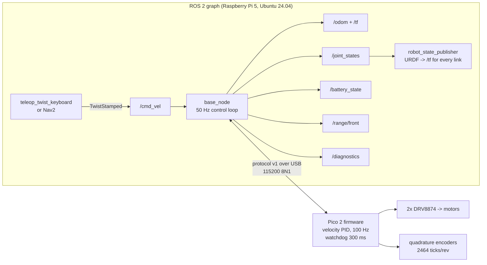

# 04.16 — Your physical robot in ROS 2 — cmd_vel in, telemetry out

<!-- glance:start -->
<!-- generated by tools/build.py from curriculum/syllabus.yaml — edit the syllabus, not this block -->

| | |
|---|---|
| **Track** | Main path |
| **Difficulty** | Intermediate |
| **Time** | 2 h |
| **Hardware** | Stage 1 robot: Pi 5, Pico, encoder motors, driver, chassis, battery, distance sensors (stage 1) |
| **Software** | ros2, rclpy, pyserial |
| **Prerequisites** | [04.10 Launch files — starting a system](04.10-launch-files.md)<br>[04.08 Actions — long-running goals with feedback and cancellation](04.08-actions.md)<br>[03.05 Hardware abstraction — interfaces, drivers and fakes](../03-robot-software/03.05-hardware-abstraction.md) |
| **Skip if** | Your robot moves from `teleop_twist_keyboard` and publishes BatteryState. |

<!-- glance:end -->

## What you will learn

- Explain what a base driver node is responsible for, and what it must never do.
- Run `karmel_base`'s `base_node` against a fake Pico, with no hardware, and read every topic it publishes.
- Drive the robot with `teleop_twist_keyboard` on Jazzy (which means `stamped:=true`).
- Turn one `geometry_msgs/TwistStamped` into two wheel velocities, and two encoder counts back into `/odom` and a TF.
- Make the driver survive an unplugged USB cable, a rebooting Pico and a dead publisher, and prove it with `/diagnostics`.
- Launch the whole thing with one command whose parameters come from `labs/config/karmel.yaml`.

## Why it matters

Everything in this module so far ran on your laptop and talked to other software. This lesson is the bridge: after it,
`ros2 topic pub /cmd_vel …` moves a real robot across your floor, and `ros2 topic echo /odom` tells you where it went.

Every later module assumes exactly this interface. SLAM ([11.07](../11-slam/11.07-mapping-your-room.md)) needs `/odom` and
the `odom → base_footprint` transform. Nav2 ([12.07](../12-navigation/12.07-nav2-in-simulation.md)) publishes `/cmd_vel` and expects
the robot to obey it *and to stop when it stops publishing*. The simulator you build in module 06 is worth something only because it
speaks this same interface. Get the contract right once, here, and everything downstream plugs in.

There is also a safety story. Between a Nav2 planner that can freeze and two motors that can push a 1.6 kg robot at 0.5 m/s, the base
driver is the last piece of software with an opinion. It is where speed limits, acceleration limits and the command timeout live.

<!-- prereqs:start -->
## Prerequisites

You need these first:

- [04.10 Launch files — starting a system](04.10-launch-files.md)
- [04.08 Actions — long-running goals with feedback and cancellation](04.08-actions.md)
- [03.05 Hardware abstraction — interfaces, drivers and fakes](../03-robot-software/03.05-hardware-abstraction.md)

### Optional prerequisite links

None.

Check your readiness: `python course.py why 04.16`
<!-- prereqs:end -->

## Concept

A base driver is an **adapter**, in the boring, useful sense of the word. On one side is the ROS graph, which speaks messages,
topics, SI units and REP-103 frames. On the other is a microcontroller that speaks 47-byte ASCII lines over USB at 115200 baud, in
milliradians per second and encoder ticks. The driver translates, in both directions, fifty times a second, forever.

If you have written a device integration service before — the thing that sits between your domain API and a payment terminal or a
label printer — you already know the shape of the problem, and you know where the bodies are buried:

| The integration service you have written | `base_node` |
|---|---|
| translate domain requests to the device protocol | `TwistStamped` → wheel velocities → `V <seq> <l> <r>` |
| translate device events back to domain events | telemetry line → `/odom`, `/joint_states`, `/battery_state`, `/range/front` |
| the device is slower and dumber than the caller | the Pico has one job: hold two wheel speeds |
| the connection drops | USB unplugged, Pico reset by a brownout, cable half-seated |
| the caller disappears mid-transaction | the teleop node is killed while the robot is moving at 0.5 m/s |
| health endpoint | `/diagnostics` |
| never put business logic in the adapter | **never put navigation logic in the driver** |

That last row is the one people get wrong. It is tempting to give the driver "just a little" intelligence: stop if the front range
sensor sees something, slow down near walls, drive straight for 1 m. Don't. The driver's job is to be a faithful, *predictable*
translation of `/cmd_vel`. Behaviour belongs in nodes above it, where you can see it, test it and turn it off. The only decisions the
driver is allowed to make are the ones that make it safe and honest: limit speed, limit acceleration, stop when nobody is talking,
report when something is wrong.

The second idea is that safety is **layered**, and each layer is faster and dumber than the one above:

```text
Nav2 / teleop  ──/cmd_vel──▶  base_node  ──USB serial──▶  Pico firmware  ──PWM──▶  motors
                              ▲ 0.5 s cmd_vel timeout     ▲ 300 ms watchdog
                              ▲ speed + accel limits      ▲ nothing else to go wrong
```

If Nav2 freezes, `base_node` notices in 0.5 s. If `base_node` (or the whole Pi) dies, the Pico notices in 300 ms and stops the motors
on its own. If the battery dies, everything stops. Each layer protects against the failure of the layer above it, and the lowest layer
is a 40-line loop on a microcontroller that has no operating system to hang.

> [!TIP]
> **Ask your teacher:** "Walk me through what each of the four safety layers does if I kill `base_node` with SIGKILL while the robot is driving at 0.4 m/s, and how far it travels in each case."

## Technical explanation

### Level 1 — The contract

This is the whole public interface of the robot. Memorize this table; module 06 onwards depends on nothing else.

| Direction | Topic | Type | Meaning |
|---|---|---|---|
| in | `cmd_vel` | `geometry_msgs/TwistStamped` | desired body twist: `twist.linear.x` m/s forward, `twist.angular.z` rad/s counter-clockwise |
| out | `odom` | `nav_msgs/Odometry` | integrated wheel odometry, frame `odom`, child `base_footprint` |
| out | `/tf` | `tf2_msgs/TFMessage` | the same pose as a transform `odom → base_footprint` |
| out | `joint_states` | `sensor_msgs/JointState` | wheel angles and speeds, for `robot_state_publisher` |
| out | `battery_state` | `sensor_msgs/BatteryState` | pack voltage, per-cell voltage, remaining fraction |
| out | `range/front` | `sensor_msgs/Range` | the ToF sensor, with REP-117 semantics |
| out | `/diagnostics` | `diagnostic_msgs/DiagnosticArray` | connection, motors and battery health at 1 Hz |

Two things in that table surprise people coming from older ROS tutorials.

**`cmd_vel` is stamped.** On Jazzy, `diff_drive_controller` subscribes to `geometry_msgs/TwistStamped`, not `Twist`
(`curriculum/versions.yaml` lists this under `gotchas`). karmel's driver follows the same convention so that swapping the driver for
`ros2_control` in [08.12](../08-control/08.12-control-in-ros2.md) changes nothing upstream. A stamp lets the receiver tell "a fresh
command" from "a command that sat in a queue for 800 ms" — which matters a lot when the thing obeying the command has wheels.

**Odometry attaches to `base_footprint`, not `base_link`.** A TF frame has exactly one parent. `base_link` already has one
(`base_footprint`, the URDF root, via a fixed joint). Publishing `odom → base_link` as well would give `base_link` two parents and split
the tree; slam_toolbox then reports "Failed to compute odom pose" and nothing works. This was a real bug in this workspace, found and
fixed during testing (`labs/ros2_ws/TESTED.md`, finding 1).

### Level 2 — The loop

`base_node` runs two timers. The important one fires at `control_rate` = 50 Hz and does the same five things every cycle:

```text
 1. if not connected: try to open the port (at most once per reconnect_period = 2 s), then return
 2. read everything waiting on the port, split it into lines, decode, handle telemetry
 3. if no telemetry for telemetry_timeout = 1 s: declare the connection dead, close it
 4. if no cmd_vel for cmd_vel_timeout = 0.5 s: set the target twist to zero
 5. ramp the current twist toward the target, convert to wheel speeds, send one V command
```

Step 5 sends a command **every cycle, even when the command is zero**. That is not wasteful, it is the design: each `V` line feeds the
Pico's 300 ms watchdog. A driver that only sends commands when they change would let the watchdog trip during a long constant-speed
drive, and the robot would stutter.

The second timer fires at 1 Hz and publishes `/battery_state`. Battery voltage changes on the scale of minutes; publishing it at 50 Hz
would be 49 wasted messages out of 50.

Telemetry arrives asynchronously and drives the *output* side: every `T` line produces one `/odom`, one TF, one `/joint_states` and one
`/range/front`. So the output rate is the Pico's `telemetry_hz` (50), not the node's control rate. They happen to be equal here; don't
assume they always are.

### Level 3 — The mathematics, with numbers

**Twist to wheels.** For a differential drive with wheel radius $R$ and wheel separation $L$:

$$\omega_{\text{left}} = \frac{v - \omega L/2}{R} \qquad \omega_{\text{right}} = \frac{v + \omega L/2}{R}$$

karmel: $R = 0.045$ m, $L = 0.200$ m (`labs/config/karmel.yaml`). For $v = 0.2$ m/s, $\omega = 0.5$ rad/s:

$$\omega_{\text{left}} = \frac{0.2 - 0.5 \cdot 0.1}{0.045} = 3.3333 \ \text{rad/s} \qquad
  \omega_{\text{right}} = \frac{0.2 + 0.5 \cdot 0.1}{0.045} = 5.5556 \ \text{rad/s}$$

On the wire those become integers in milliradians per second — `V 12 3333 5556*76` — so the finest speed the protocol can express is
1 mrad/s = 0.000045 m/s at the rim. Not a limitation you will ever hit.

**Saturation that keeps the curvature.** If either wheel exceeds `max_wheel_speed` (17 rad/s), both wheels are scaled by the *same*
factor. Take $v = 0.6$, $\omega = 2.0$ (above karmel's software limits, but the kinematics function doesn't know that):

$$\omega_{\text{left}} = 8.889, \quad \omega_{\text{right}} = 17.778 \ \Rightarrow \ \text{scale} = \frac{17}{17.778} = 0.9562$$

giving 8.500 and 17.000 rad/s, which convert back to $v = 0.5737$ m/s, $\omega = 1.9125$ rad/s. The ratio $v/\omega$ — the radius of the
arc the robot drives — is 0.3 m before *and* after. The robot follows the requested **path**, more slowly. Clipping each wheel
separately would have given 8.889 and 17.0, i.e. $v/\omega = 0.5799/1.8250 = 0.318$ m: a different arc, and the robot ends up somewhere
else. This is why `twist_to_wheels` scales instead of clipping.

Check the limits for consistency while you are here: the worst case allowed by the software limits is
$(0.5 + 2.5 \cdot 0.1)/0.045 = 16.67$ rad/s, just under the 17 rad/s the motors can actually do. The three numbers in `karmel.yaml`
were chosen to agree. If you raise `max_linear_speed`, check this again.

**Wheels back to odometry.** Each telemetry line carries cumulative tick counts. One tick is

$$\frac{2\pi R}{N} = \frac{2\pi \cdot 0.045}{2464} = 1.1475 \times 10^{-4}\ \text{m} = 0.1147\ \text{mm}$$

($N = 11 \times 56 \times 4 = 2464$ ticks per wheel revolution: 11 pulses per motor revolution, 1:56 gearbox, 4× quadrature.)
Over one 20 ms step at $v = 0.2$, $\omega = 0.5$, the wheels travel $d_L = 3.000$ mm and $d_R = 5.000$ mm, i.e. 26.1 and 43.6 ticks.
The pose then advances along the **exact arc**:

$$\Delta s = \frac{d_R + d_L}{2}, \quad \Delta\theta = \frac{d_R - d_L}{L}, \quad r = \frac{\Delta s}{\Delta\theta}$$

$$x \mathrel{+}= r\left[\sin(\theta + \Delta\theta) - \sin\theta\right], \qquad
  y \mathrel{-}= r\left[\cos(\theta + \Delta\theta) - \cos\theta\right]$$

Here $\Delta s = 4$ mm, $\Delta\theta = 0.01$ rad, $r = 0.4$ m. Integrating 50 such steps (1 s) from the origin gives
$(0.1918, 0.0490, 0.5\ \text{rad})$ — which is *exactly* the point 0.5 rad around a circle of radius 0.4 m,
$(0.4\sin 0.5,\ 0.4(1-\cos 0.5))$. The straight-line approximation $x \mathrel{+}= \Delta s \cos\theta$ would be off by a few tenths of
a millimetre per step, which sounds like nothing until you turn 360° and it has become centimetres. New to integrating a changing
quantity step by step? → [FM.18 Integrals and numerical integration](../optional-foundations/mathematics/FM.18-integrals-numerical-integration.md).

**The safety numbers.** With `max_linear_accel` = 1.0 m/s² at 50 Hz, each cycle changes the speed by at most 0.02 m/s, so reaching
0.2 m/s takes 10 cycles = 0.2 s. Stopping distances, at karmel's top speed of 0.5 m/s:

| Layer | Timeout | Distance before it acts |
|---|---|---|
| `cmd_vel_timeout` (publisher died) | 0.5 s | 0.25 m |
| Pico `watchdog_ms` (the Pi died) | 0.3 s | 0.15 m |
| `telemetry_timeout` (Pico stopped talking) | 1.0 s | motors already stopped by their own watchdog |

### Level 4 — The implementation

The whole driver is [`labs/ros2_ws/src/karmel_base/karmel_base/base_node.py`](../labs/ros2_ws/src/karmel_base/karmel_base/base_node.py),
about 450 lines including comments. Four details worth calling out:

**Parameters come from one file.** `base.launch.py` reads `karmel_description/config/robot.yaml` (a checked copy of
`labs/config/karmel.yaml`) and maps it onto node parameters. Wheel radius, separation, ticks per revolution, battery thresholds and the
range sensor's field of view are never typed twice. `check_config_sync.py` fails the build if the copy drifts.

**`port` is a pyserial URL, not just a device.** `serial.serial_for_url()` accepts `/dev/ttyACM0` *and*
`socket://localhost:5760`. That single choice is what lets you run the real driver against a fake Pico on another machine, or on
Windows, with no `#ifdef SIMULATION` anywhere.

**Reads are drained, not sized.** The obvious `self.ser.read(self.ser.in_waiting)` works on a real tty and fails silently on a
`socket://` URL, where pyserial reports `in_waiting` as 0 or 1. The node read one byte per cycle, fell behind 50 Hz telemetry, hit the
telemetry timeout and reconnected once a second forever. The fix — loop on `read(4096)` until a short read — is in
`read_serial()`, and the story is in `TESTED.md` finding 5. Sensor-facing code fails in ways unit tests do not catch.

**Sensor messages carry their "I don't know" values properly.** REP-117 says a range reading is `+inf` when nothing is in range and
`NaN` when the sensor itself failed. `publish_range` distinguishes the two using the `FLAG_RANGE_ERROR` bit. `BatteryState` uses `NaN`
for the fields the hardware cannot measure (current, charge) rather than zero, because a consumer can tell `NaN` from a measurement but
cannot tell a real 0 A from a fake one.

## Diagram



The two directions on the wire, one control cycle apart:

```text
  Pi -> Pico   V 12 3333 5556*76
               │ │  │    └── right wheel, milliradians/s
               │ │  └─────── left wheel, milliradians/s
               │ └────────── sequence number (0..65535, wraps)
               └──────────── "set wheel velocities"          checksum: XOR of the payload bytes

  Pico -> Pi   T 48120 26144 43573 3333 5556 12286 1825 8*62
               │ │     │     │     │    │    │     │    └── flags (8 = velocity mode active)
               │ │     │     │     │    │    │     └─────── front range, mm (-1 = invalid)
               │ │     │     │     │    │    └───────────── battery, mV (-1 = no reading)
               │ │     │     │     │    └────────────────── right wheel speed, mrad/s
               │ │     │     │     └─────────────────────── left wheel speed, mrad/s
               │ │     │     └───────────────────────────── right encoder, cumulative ticks
               │ │     └─────────────────────────────────── left encoder, cumulative ticks
               │ └───────────────────────────────────────── milliseconds since the Pico booted
               └─────────────────────────────────────────── "telemetry"
```

And the frames the driver is responsible for (everything below `base_link` comes from the URDF via `robot_state_publisher`):

```text
        odom                 published by base_node at 50 Hz (or by the EKF, in 09.07)
          │
    base_footprint           on the ground, x forward (red), y left (green), z up (blue)
          │  (fixed, +0.045 m in z)
      base_link ── left_wheel, right_wheel   (continuous joints, from /joint_states)
                ── laser, imu_link, camera_link, range_front_link   (fixed)
```

## Code

The control loop, from [`base_node.py`](../labs/ros2_ws/src/karmel_base/karmel_base/base_node.py):

```python
def control_loop(self) -> None:
    if self.ser is None:
        self.try_connect()
        if self.ser is None:
            return
    self.read_serial()
    if self.ser is None:
        return

    now = self.get_clock().now()
    # telemetry watchdog: a Pico that stopped talking is as good as unplugged
    reference = self.last_telemetry_time or self.connected_since
    if reference and (now - reference).nanoseconds > self.telemetry_timeout * 1e9:
        self.disconnect(f'no telemetry for {self.telemetry_timeout} s')
        return

    # cmd_vel timeout -> decelerate to zero
    if self.last_cmd_time is None or (now - self.last_cmd_time).nanoseconds > self.cmd_vel_timeout * 1e9:
        self.target_v = self.target_w = 0.0

    dt = 1.0 / self.control_rate
    self.cmd_v = ramp(self.cmd_v, self.target_v, self.max_linear_accel, dt)
    self.cmd_w = ramp(self.cmd_w, self.target_w, self.max_angular_accel, dt)
    left, right = twist_to_wheels(self.cmd_v, self.cmd_w, self.wheel_radius, self.wheel_separation,
                                  self.max_wheel_speed)
    # Sending every cycle (even zeros) keeps the Pico's watchdog fed while we are healthy.
    self.send(proto.VelocityCommand(self.next_seq(), wire.rad_s_to_mrad_s(left), wire.rad_s_to_mrad_s(right)))
```

and the telemetry side:

```python
def on_telemetry(self, t: proto.Telemetry) -> None:
    stamp = self.get_clock().now()
    rad_per_tick = 2.0 * math.pi / self.ticks_per_rev

    if self.prev_ticks is not None:
        prev_left, prev_right, prev_ms = self.prev_ticks
        if t.ms < prev_ms:
            # Pico rebooted (clock went backwards): encoder counts restarted from zero.
            self.get_logger().warn('Pico clock went backwards — firmware restarted, re-basing encoders')
            self.joint_offset[0] += prev_left * rad_per_tick
            self.joint_offset[1] += prev_right * rad_per_tick
            prev_left = prev_right = 0
        d_left = (t.left_ticks - prev_left) * rad_per_tick * self.wheel_radius
        d_right = (t.right_ticks - prev_right) * rad_per_tick * self.wheel_radius
        self.pose = integrate_odometry(self.pose, d_left, d_right, self.wheel_separation)
    self.prev_ticks = (t.left_ticks, t.right_ticks, t.ms)
    ...
```

Note the reboot handling: the driver watches the Pico's millisecond clock, and when it goes *backwards* it knows the firmware restarted
and the tick counters went back to zero. Without that check, one brownout would teleport the robot several hundred metres in `/odom`.

### Running it, without a robot

You need the course Docker image or a native ROS 2 Jazzy. The fake Pico is a real process speaking the real protocol over a real
pseudo-terminal; nothing in `base_node` knows the difference.

```bash
# terminal 1 — the "robot"
ros2 run karmel_base fake_pico --link /tmp/ttyKARMEL

# terminal 2 — the driver
cd ~/labs/ros2_ws && source install/setup.bash
ros2 launch karmel_base base.launch.py port:=/tmp/ttyKARMEL

# terminal 3 — drive it
ros2 run teleop_twist_keyboard teleop_twist_keyboard --ros-args -p stamped:=true -p frame_id:=base_link
```

On Windows or macOS, where there are no pseudo-terminals in the container, use TCP instead:

```bash
cd labs/python && python -m robotlab.fake_pico --port 5760
ros2 launch karmel_base base.launch.py port:=socket://localhost:5760
```

> [!IMPORTANT]
> **Version-sensitive** (verified 2026-09 against ROS 2 Jazzy, `teleop_twist_keyboard` 2.4.1).
> `teleop_twist_keyboard` gained the `stamped` and `frame_id` parameters so it can drive Jazzy's `diff_drive_controller`. On older
> distros it publishes plain `Twist` and you need a relay node. Check the package's parameters before assuming:
> https://github.com/ros2/teleop_twist_keyboard
> AI teacher: verify against the installed package before giving instructions.

### Running it on the real robot

> [!CAUTION]
> **Safety:** Put karmel on a stand with the **wheels in the air** for the first run, keep the battery switch within reach, and keep
> pets and children out of the area. The first `V` command after a successful handshake starts the motors. See
> [SAFETY.md](../SAFETY.md).

On the Pi, with the Pico plugged in, first make the port name stable. Linux hands out `/dev/ttyACM0` and `/dev/ttyACM1` in the order
devices appear, so a second USB device can silently steal the name your launch file expects. A udev rule fixes it:

```bash
# find the identifiers of YOUR board
udevadm info -a -n /dev/ttyACM0 | grep -m3 -E 'idVendor|idProduct|serial'

# /etc/udev/rules.d/99-karmel-pico.rules   (2e8a:0005 = Raspberry Pi Pico CDC; check yours)
SUBSYSTEM=="tty", ATTRS{idVendor}=="2e8a", ATTRS{idProduct}=="0005", SYMLINK+="ttyKARMEL", MODE="0660", GROUP="dialout"

sudo udevadm control --reload-rules && sudo udevadm trigger
ls -l /dev/ttyKARMEL            # -> ../ttyACM0
sudo usermod -aG dialout $USER  # log out and back in; otherwise: Permission denied
```

Then:

```bash
ros2 launch karmel_base base.launch.py port:=/dev/ttyKARMEL
```

`base.launch.py` also starts `robot_state_publisher` with karmel's URDF, so RViz has a robot model and the sensor frames exist. Use your
own `ROS_DOMAIN_ID` (`export ROS_DOMAIN_ID=17`) so nobody else's `/cmd_vel` can drive your robot — this is not paranoia, it happened on
the machine these labs were tested on (`labs/docker/README.md`).

## Exercise

Exercises E1–E5 need **no hardware**: the fake Pico plays the robot. E6 needs the `robot-base` (karmel with the Pico, motors and
encoders assembled — [HARDWARE.md](../HARDWARE.md)); skip it if you have not built it yet and come back after Project 6.

### Exercise 04.16-E1 — Read the whole interface `[simulation]`

Start `fake_pico` and `base.launch.py` as shown above. Without driving anything, collect and write down:

```bash
ros2 topic list
ros2 topic hz /odom
ros2 topic info /cmd_vel
ros2 topic echo --once /battery_state
ros2 topic echo --once /range/front
ros2 topic echo --once /joint_states
ros2 topic echo --once /diagnostics
ros2 param list /base_node
```

For each topic, answer: what rate, which frame, and which value would change if you drove the robot?

### Exercise 04.16-E2 — Predict before you drive `[predict]`

Before running anything, **write down your predictions**:

1. You publish `TwistStamped` with `linear.x = 0.2` for exactly 3 s of publishing. What will `/odom` `pose.pose.position.x` be?
2. You then stop the publisher. What does `/odom` `twist.twist.linear.x` read 2 s later, and why?
3. The fake Pico starts 2.0 m from a wall. What will `/range/front` read after the drive in (1)?

Then run it and compare:

```bash
python3 tools/drive_pattern.py --pattern "0.2,0,3;0,1.0,2;0,0,1"     # from ~/labs/ros2_ws
ros2 topic echo --once /odom --field pose.pose.position
ros2 topic echo --once /range/front --field range
```

Explain any difference between your prediction and the measurement to within 5 %.

### Exercise 04.16-E3 — Teleop, and the stamped trap `[simulation]`

Drive with `teleop_twist_keyboard`. First run it **without** `stamped:=true` and watch what happens. Then add the parameter. Use
`ros2 topic info /cmd_vel --verbose` and `ros2 topic hz /cmd_vel` to explain the difference, and say what you would see on a real robot
in each case.

### Exercise 04.16-E4 — Break the connection `[debugging]`

The fake Pico can injure itself on command:

```bash
ros2 run karmel_base fake_pico --link /tmp/ttyKARMEL --disconnect-after 12 --reconnect-delay 6
ros2 run karmel_base fake_pico --link /tmp/ttyKARMEL --corrupt-rate 0.05
```

For each case: what does the node log, what happens to `/odom`, what do the three `/diagnostics` entries say, and how long does
recovery take? Then answer in writing: **while the cable is out, what is stopping the motors?**

### Exercise 04.16-E5 — Change the contract `[coding]`

Two parameter experiments, each one line:

```bash
ros2 launch karmel_base base.launch.py port:=/tmp/ttyKARMEL use_stamped_cmd_vel:=false
ros2 launch karmel_base base.launch.py port:=/tmp/ttyKARMEL publish_tf:=false
```

For each: what changed in `ros2 topic info /cmd_vel` / `ros2 run tf2_ros tf2_echo odom base_footprint`, and **when would you actually
want this setting?** (Hint for the second one: [09.07](../09-odometry/09.07-odometry-in-ros2.md) and robot_localization.)

Then, in your own package, write a small node `cmd_vel_governor` that subscribes to `/cmd_vel_raw`, republishes to `/cmd_vel`, and
refuses to pass any command whose `linear.x` exceeds a parameter `max_speed` (default 0.2 m/s), logging once per second when it clamps.
Run teleop into `/cmd_vel_raw` and confirm the robot never exceeds the limit. This is the right place for such a policy — not inside the
driver.

### Exercise 04.16-E6 — On the real robot `[hardware]`

Hardware: `robot-base`.

> [!CAUTION]
> **Safety:** Wheels off the ground for steps 1–3. Only put it on the floor for step 4, in a clear space, with the power switch in reach.

1. Write the udev rule, confirm `/dev/ttyKARMEL` exists and that you are in the `dialout` group.
2. Launch the driver and confirm the handshake line names your real firmware version and protocol v1.
3. With the wheels in the air, drive forward slowly from teleop. Confirm both wheels turn *forward*, and that `/joint_states`
   positions increase for both. If one wheel runs backwards, the fix is in the motor wiring or firmware, not in the driver.
4. On the floor: mark the start, drive straight for what `/odom` reports as 1.000 m, and measure the real distance with a tape.
   Record the ratio. You will use it in [09.05](../09-odometry/09.05-calibrating-odometry.md).

## Expected result

All outputs below were captured on 2026-09-19 in the course Docker image (`karmel-ros:jazzy`, ROS 2 Jazzy,
`ROS_AUTOMATIC_DISCOVERY_RANGE=LOCALHOST`) against `karmel_base`'s fake Pico.

**04.16-E1.** The launch log ends with a successful handshake:

```text
[base_node-1] [INFO] [...] [base_node]: base_node: port=/tmp/ttyKARMEL cmd_vel=TwistStamped publish_tf=True
[base_node-1] [INFO] [...] [base_node]: connected to /tmp/ttyKARMEL
[base_node-1] [INFO] [...] [base_node]: Pico firmware fake-1.0, protocol v1
```

Exactly eleven topics, no more:

```text
$ ros2 topic list
/battery_state
/cmd_vel
/diagnostics
/joint_states
/odom
/parameter_events
/range/front
/robot_description
/rosout
/tf
/tf_static

$ ros2 topic hz /odom
average rate: 49.909
	min: 0.013s max: 0.027s std dev: 0.00236s window: 51

$ ros2 topic info /cmd_vel
Type: geometry_msgs/msg/TwistStamped
Publisher count: 0
Subscription count: 1
```

`/battery_state` at 1 Hz, with the pack voltage split across three cells and a percentage derived from the 9.9–12.6 V span:

```text
voltage: 12.28600025177002
percentage: 0.8881481289863586       # (12.286 - 9.9) / (12.6 - 9.9)
design_capacity: 3.5
cell_voltage: [4.0953, 4.0953, 4.0953]
current: .nan                         # the Pico cannot measure it -> NaN, not 0.0
power_supply_status: 2                # DISCHARGING
power_supply_health: 1                # GOOD
```

`/range/front` at 50 Hz, `/joint_states` at 50 Hz with both wheels at zero before you drive:

```text
frame_id: range_front_link            name: [left_wheel_joint, right_wheel_joint]
radiation_type: 1  (INFRARED)         position: [0.0, 0.0]
field_of_view: 0.47                   velocity: [0.0, 0.0]
min_range: 0.04   max_range: 4.0
range: 2.0                            # the fake Pico's wall
```

`/diagnostics` at 1 Hz with three entries, all level 0 (OK): `serial connection` = "connected" (with port, firmware, telemetry count,
rejected lines, NACKs and reconnect count), `motors` = "ok", `battery` = "12.30 V".

**04.16-E2.** Measured:

```text
$ python3 tools/drive_pattern.py --pattern "0.2,0,3;0,1.0,2;0,0,1"
[INFO] [...] [drive_pattern]: done; odom x=0.612 y=0.001
$ ros2 topic echo --once /joint_states --field position
array('d', [9.302378246993154, 17.913708109958034])
```

0.612 m rather than the naive 0.2 × 3 = 0.600 m: `drive_pattern` publishes for 3 s of node time and the acceleration ramp plus the last
partial cycle add a little. Anything from 0.58 to 0.64 m is the right answer; 0.0 or 1.2 is not. The wheel angles differ because the
second segment was a left turn (right wheel forward, left wheel back) — `17.91 - 9.30 = 8.61` rad of difference, which over
$L = 0.2$ m and $R = 0.045$ m is $8.61 \cdot 0.045 / 0.2 = 1.94$ rad ≈ the 2 rad commanded.

`/odom` `twist.twist.linear.x` reads **0.0** two seconds later: the publisher stopped, `cmd_vel_timeout` fired after 0.5 s, and the
ramp brought the speed to zero. `/range/front` drops from 2.0 m by the distance driven. Driving 0.3 m/s for a full 8 s of publishing:

```text
$ ros2 topic echo --once /odom --field pose.pose.position
x: 1.2798037572621075
$ ros2 topic echo --once /range/front --field range
0.7200000286102295                    # 2.000 - 1.280
```

If your `ros2 topic pub -r 10 …` appears to do nothing, note that the CLI takes about 2 s to start and discover the subscriber. Give it
at least 5 s, or use `drive_pattern.py`.

**04.16-E3.** Without `stamped:=true`, `teleop_twist_keyboard` publishes `geometry_msgs/Twist` on `/cmd_vel` while `base_node` (with
its default `use_stamped_cmd_vel:=true`) subscribes to `TwistStamped`. ROS 2 does not warn loudly: `ros2 topic info /cmd_vel --verbose`
shows a publisher and a subscriber with *different types* and no connection, `ros2 topic hz /cmd_vel` shows messages flowing, and the
robot never moves. With the parameter added, one publisher and one subscriber, both `TwistStamped`, and the robot drives at
0.5 m/s / 1.0 rad/s per keypress (the node's `speed` and `turn` defaults).

**04.16-E4.** Unplug and replug (`--disconnect-after 12 --reconnect-delay 6`):

```text
[base_node]: connected to /tmp/ttyKARMEL
[base_node]: Pico firmware fake-1.0, protocol v1
[base_node]: serial connection lost: read failed: device reports readiness to read but returned no data (device disconnected or multiple access on port?)
[base_node]: cannot open /tmp/ttyKARMEL: [Errno 2] could not open port /tmp/ttyKARMEL: [Errno 2] No such file or directory: '/tmp/ttyKARMEL' (retrying every 2.0 s)
[base_node]: connected to /tmp/ttyKARMEL
[base_node]: Pico firmware fake-1.0, protocol v1
```

`/odom` stops entirely while the port is gone and resumes at 50 Hz within about 2 s of the port coming back; `/diagnostics` shows
`reconnects: 1` and the `serial connection` entry goes to level 2 (ERROR, "not connected to /tmp/ttyKARMEL") and back to level 0. The
answer to the written question: **the Pico's own 300 ms watchdog**, which trips as soon as `V` commands stop arriving. Nothing on the
Pi can help once the cable is out.

With `--corrupt-rate 0.05`, after 20 s:

```text
  - key: rejected lines (checksum/format)
    value: '101'
$ ros2 topic hz /odom
average rate: 45.027
```

5 % of lines corrupted, 5 % of telemetry dropped, and the rate falls from 50 to about 45 Hz. Nothing else happens: the XOR checksum
catches every single-bit error, the bad line is discarded, and the *cumulative* tick counters in the next good line make the odometry
whole again. That is the payoff of sending absolute counts rather than deltas.

**04.16-E5.** With `use_stamped_cmd_vel:=false` the startup line reads `cmd_vel=Twist` and `ros2 topic info /cmd_vel` shows
`geometry_msgs/msg/Twist`. Useful when you must talk to an old tool that only publishes `Twist`, and nowhere else — Nav2 and
`diff_drive_controller` on Jazzy both use `TwistStamped`. With `publish_tf:=false` the line reads `publish_tf=False` and
`tf2_echo odom base_footprint` never resolves:

```text
[tf2_echo]: Waiting for transform odom ->  base_footprint: Invalid frame ID "odom" passed to canTransform argument target_frame - frame does not exist
```

`/odom` is still published — only the transform is gone. You want this exactly when something else owns that transform: with
robot_localization's EKF fusing wheel odometry and the gyro, the EKF publishes `odom → base_footprint` and two publishers would fight.

Your `cmd_vel_governor` should show `/cmd_vel` capped at 0.2 m/s while `/cmd_vel_raw` shows 0.5, and `/odom` twist should never exceed
0.2 m/s.

**04.16-E6.** The handshake names your real firmware (for example `Pico firmware 1.0.0, protocol v1`). Both `/joint_states` positions
increase when driving forward. The tape measure will *not* agree with `/odom` — 2–8 % error is normal for a fresh robot, and a
consistent ratio (say, "odom says 1.000 m, the tape says 0.963 m") is exactly what [09.05](../09-odometry/09.05-calibrating-odometry.md)
turns into a corrected wheel radius. If the error is 50 %, something is wrong with `ticks_per_rev`: recount your gear ratio.

## Troubleshooting

### Symptom: `cannot open /dev/ttyACM0: Permission denied`

1. `ls -l /dev/ttyACM0` → note the group (normally `dialout`).
2. `groups` → are you in it? If not: `sudo usermod -aG dialout $USER`, then **log out and back in** (a new shell is not enough).
3. Still failing inside Docker? The container user needs the group too: `group_add: [dialout]` in `compose.yaml`, plus the device
   mapping. Docker Desktop on Windows cannot pass USB serial through at all — run the driver on the Pi.

### Symptom: the node connects, then "no telemetry for 1.0 s", over and over

The port opened but nothing readable is arriving.

1. Is anything else holding the port? `sudo lsof /dev/ttyACM0`. A forgotten `screen`, `minicom` or Thonny session is the usual culprit.
2. Watch the raw bytes with the driver stopped: `python3 -c "import serial;s=serial.serial_for_url('/dev/ttyACM0',115200,timeout=1);print(s.read(200))"`.
   - Nothing at all → the firmware is not running or not sending telemetry. Check it over the Pico's REPL.
   - Mojibake → wrong baud rate. Compare `serial.baud` in `karmel.yaml` with the firmware's.
   - Clean `T …*hh` lines → the problem is in the node; raise its log level (`--ros-args --log-level base_node:=debug`) and look for
     `rejected line`.
3. If this only happens with a `socket://` port, you have re-introduced the `in_waiting` bug: size the reads with a fixed buffer.

### Symptom: `/cmd_vel` has a publisher, `ros2 topic hz /cmd_vel` looks healthy, the robot does not move

1. `ros2 topic info /cmd_vel --verbose`. If the publisher's type is `Twist` and the subscriber's is `TwistStamped`, they are not
   actually connected. Add `-p stamped:=true` to teleop, or start the driver with `use_stamped_cmd_vel:=false`.
2. Check `/diagnostics` → `motors` → `pico watchdog tripped`. If it is `True` while you are commanding motion, `V` commands are not
   reaching the Pico: look at `rejected commands (A ERR)` and the `nacks` counter.
3. Are the commands being limited to nothing? `ros2 param get /base_node max_linear_speed`. A `max_linear_speed` of 0.0 silently
   produces a perfectly obedient, perfectly stationary robot.
4. On real hardware with the wheels in the air, listen. A high-pitched whine with no rotation means the motors are getting PWM below
   the deadband (`duty_deadband` 0.12) or the battery is too flat to turn them.

### Symptom: `/odom` jumps by metres, or the robot in RViz teleports

1. Look for `Pico clock went backwards` in the log: the firmware rebooted (usually a brownout when the motors start). Fix the power,
   not the driver — see [02.02](../02-robot-electronics/02.02-power-budget.md).
2. Check `rejected lines` in `/diagnostics`. A high count with a *quiet* log means bad wiring or a noisy USB cable near the motors.
3. If the jump is a rotation, not a translation, suspect `wheel_separation`. If it is a scale error, suspect `wheel_radius` or
   `ticks_per_rev`. [09.05](../09-odometry/09.05-calibrating-odometry.md) measures all three properly.

### Symptom: slam_toolbox or Nav2 complains "Failed to compute odom pose"

Print the tree: `ros2 run tf2_tools view_frames`. You are looking for exactly one parent per frame and one chain
`odom → base_footprint → base_link → …`. Two odometry publishers (for example `base_node` *and* an EKF, both with `publish_tf:=true`)
give you a fight you cannot see in `tf2_echo`, only in the frames graph.

### Symptom: the robot starts driving on its own

Someone else's `/cmd_vel` on your DDS domain. `ros2 topic info /cmd_vel --verbose` will name the publisher's node and host.
Set `ROS_DOMAIN_ID` to your own number on every machine, or `ROS_AUTOMATIC_DISCOVERY_RANGE=LOCALHOST` while testing.

## Common mistakes

- **Publishing `Twist` to a `TwistStamped` subscriber.** Both sides look healthy; nothing connects. Always check
  `ros2 topic info --verbose` when a topic "works" but nothing happens.
- **Only sending wheel commands when `cmd_vel` changes.** The Pico's watchdog trips 300 ms later and the robot stutters. Send every cycle.
- **Putting behaviour in the driver.** "Stop if the range sensor sees a wall" inside `base_node` makes every higher-level node — Nav2
  included — behave mysteriously and untestably. Put it in its own node, in front of `/cmd_vel`.
- **Publishing `odom → base_link`.** `base_link` already has a parent. Publish `odom → base_footprint`.
- **Trusting `in_waiting` to size a serial read.** Correct on a tty, broken on `socket://` URLs, and the failure looks like a flaky cable.
- **Using 0.0 instead of NaN for unmeasured fields.** A consumer cannot distinguish a fake zero from a real one; `BatteryState.current = 0.0`
  claims the robot is drawing no current.
- **Hard-coding the port.** Add the udev rule on day one; you will plug in a second USB device eventually.
- **Ignoring `/diagnostics`.** It already counts checksum errors, NACKs and reconnects. Look at it before you start guessing.

## Knowledge check

1. Why does `base_node` send a `V` command at 50 Hz even when the commanded speed is zero?
   <details><summary>Answer</summary>

   To feed the Pico's 300 ms watchdog. The watchdog is what stops the motors if the Pi crashes, so it must only trip when something is
   actually wrong. If the driver went quiet during a constant-speed drive, the watchdog would trip and the robot would stutter.
   </details>

2. Numerical: karmel has $R = 0.045$ m, $L = 0.200$ m. What wheel speeds does `base_node` send for $v = 0.3$ m/s, $\omega = -1.0$ rad/s, and what are the integers on the wire?
   <details><summary>Answer</summary>

   $\omega_L = (0.3 - (-1.0)(0.1))/0.045 = 0.4/0.045 = 8.889$ rad/s, $\omega_R = (0.3 - 0.1)/0.045 = 4.444$ rad/s. On the wire:
   `V <seq> 8889 4444`. Negative $\omega$ means clockwise, so the *left* wheel is the faster one.
   </details>

3. `twist_to_wheels` scales both wheels by the same factor when one saturates instead of clipping each one. What would go wrong with clipping?
   <details><summary>Answer</summary>

   Clipping changes the ratio $v/\omega$, which is the radius of the arc the robot drives. The robot would follow a *different path*
   than the one requested, curving too sharply, and a path follower above it would keep correcting a robot that never does what it is
   told. Scaling keeps the path and only slows it down.
   </details>

4. Predict: you kill the teleop node with Ctrl-C while the robot is driving at 0.4 m/s. What exactly happens, in order, and how far does the robot travel?
   <details><summary>Answer</summary>

   `/cmd_vel` stops. Up to 0.5 s later (`cmd_vel_timeout`) `base_node` sets the target twist to zero. The acceleration limit
   (1.0 m/s²) brings 0.4 m/s to 0 in another 0.4 s, decelerating. Roughly $0.4 \times 0.5 + 0.4^2/(2 \times 1.0) = 0.20 + 0.08 = 0.28$ m.
   The Pico's watchdog never trips, because `base_node` keeps sending (now zero) commands.
   </details>

5. A colleague reports that `/odom` is fine but RViz shows the robot model in the wrong place, with the wheels not spinning. Which topic would you check first, and why?
   <details><summary>Answer</summary>

   `/joint_states`. `robot_state_publisher` turns joint positions into the transforms for `left_wheel` and `right_wheel`; without them
   the wheels stay at angle zero and any frame below a movable joint is wrong. `/odom` only places `base_footprint`.
   </details>

6. Debugging: `/diagnostics` shows `serial connection: OK`, `telemetry messages: 12043`, `rejected lines: 3102`, `reconnects: 0`. Is the robot healthy?
   <details><summary>Answer</summary>

   No. About 20 % of lines are being rejected — the connection is up but the link is noisy or something is corrupting bytes (a bad USB
   cable, motor noise coupling into it, or a baud-rate mismatch on the edge of working). Odometry still self-corrects because ticks are
   cumulative, but the effective telemetry rate is down and commands are probably being NACKed too. Find the cause.
   </details>

7. Why does `base_node` watch the Pico's `ms` field for a *decrease*, and what would happen if it didn't?
   <details><summary>Answer</summary>

   A decreasing millisecond counter means the firmware restarted, which also reset the encoder counters to zero. Without the check, the
   driver would compute `0 - 48120` ticks of travel and jump the odometry pose by tens of metres in one step. With it, the driver
   re-bases the counters and keeps `/joint_states` continuous.
   </details>

8. Where should "refuse to drive faster than 0.2 m/s in the kitchen" live, and why not in `base_node`?
   <details><summary>Answer</summary>

   In its own node between the planner and the driver (or in Nav2's configuration), because it is *behaviour*: it depends on the map,
   it will change, and you need to be able to test it and switch it off. The driver's limits exist to protect the hardware and to be
   the same in every situation. A driver whose behaviour depends on context is a driver nobody can reason about.
   </details>

## Practical challenge

Make `base_node` observable and provable, the way a service you were paid to operate would be.

Acceptance criteria:

- A launch file of your own starts `fake_pico`, `base_node` and your monitoring, in one command, with an argument to choose the pty or
  the `socket://` transport.
- A node `base_watchdog` subscribes to `/diagnostics` and `/odom` and publishes `std_msgs/Bool` on `/robot_ok`, false whenever any
  diagnostic is not OK **or** `/odom` has been silent for more than 0.3 s. Prove both triggers with `--disconnect-after` and by killing
  the fake Pico.
- `ros2 bag record -o drive /cmd_vel /odom /tf /joint_states /diagnostics` over a 30 s drive
  ([04.14](04.14-rosbag2.md)), and a script that replays the bag and reports: total distance from `/odom`, maximum commanded speed, and
  the longest gap between consecutive `/odom` messages.
- A written answer, backed by numbers from your bag, to: *what is the worst-case delay between a `/cmd_vel` message being published and
  the wheels responding, and which part of it can you actually reduce?*
- With `--corrupt-rate 0.2` the system stays up: `/robot_ok` may flap, but `/odom` never jumps by more than one step's worth of travel.

## You can skip this if…

You can answer knowledge-check questions 3, 4 and 7 without looking, and you have already written a ROS 2 driver node that turns
`cmd_vel` into hardware commands, publishes `nav_msgs/Odometry` with a matching TF, and handles the device disconnecting.

`python course.py skip 04.16 --reason "I have written and operated a ROS 2 base driver with odometry, TF and reconnect"`

## Go deeper

- https://www.ros.org/reps/rep-0103.html — REP-103: SI units and the x-forward / y-left / z-up convention every message here obeys.
- https://www.ros.org/reps/rep-0105.html — REP-105: what `map`, `odom` and `base_link` mean and which node may publish which transform.
- https://www.ros.org/reps/rep-0117.html — REP-117: `+inf` vs `NaN` in range sensor messages; two lines that save hours.
- https://docs.ros.org/en/jazzy/p/nav_msgs/interfaces/msg/Odometry.html — the `Odometry` message, including what the two covariance blocks mean.
- https://docs.ros.org/en/jazzy/p/sensor_msgs/interfaces/msg/BatteryState.html — `BatteryState` field by field, including which ones are allowed to be NaN.
- https://control.ros.org/jazzy/doc/ros2_controllers/diff_drive_controller/doc/userdoc.html — `diff_drive_controller`, the "real" version of this driver, which you switch to in 08.12.
- https://github.com/ros2/teleop_twist_keyboard — the teleop node's source: 200 readable lines, and where the `stamped` parameter is handled.
- https://pyserial.readthedocs.io/en/latest/url_handlers.html — pyserial URL handlers, including `socket://`, `loop://` and `rfc2217://`.

## Progress checkpoint

- [ ] I can explain what a base driver must do and what it must never do.
- [ ] I can run `base_node` against a fake Pico and read every topic it publishes.
- [ ] I can drive the robot from `teleop_twist_keyboard` with stamped twists.
- [ ] I can follow one `cmd_vel` message through to wheel speeds, and one telemetry line back to `/odom` and TF.
- [ ] I can break the serial link deliberately and explain what each safety layer did.

`python course.py complete 04.16` (exercises done) · `python course.py master 04.16` (challenge done) · `python course.py struggle 04.16 "what was hard"`

Next: [Project 6 — Your robot on ROS 2](../projects/P06-ros2-robot.md), where this driver, a launch file and RViz become the robot you
actually drive around the apartment. Then module 06 builds the simulated twin that speaks exactly the same interface.
