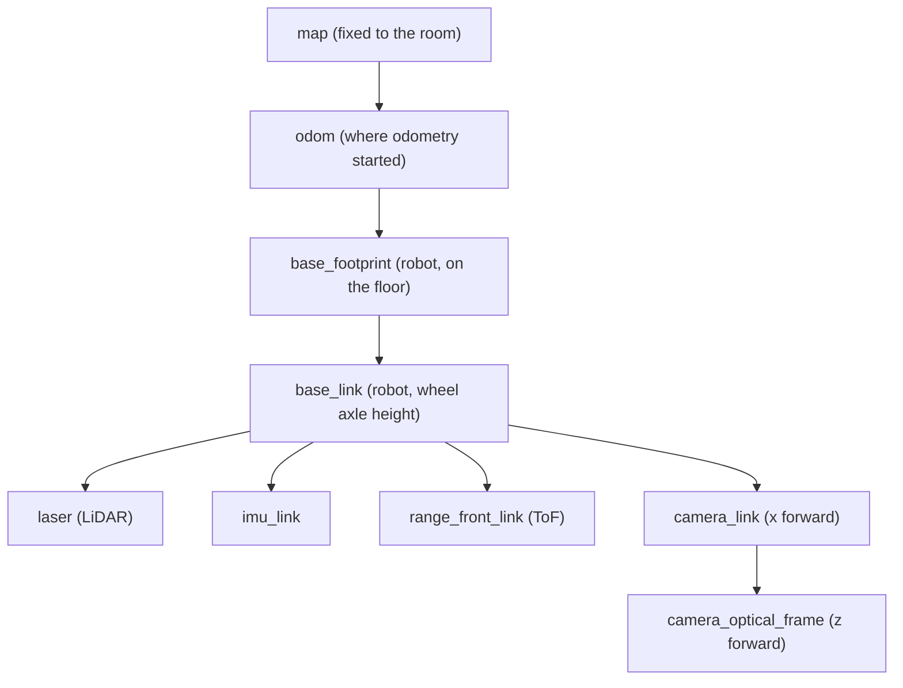

# 05.01 — Why frames? "The camera sees a bottle — where is it relative to the robot?"

<!-- glance:start -->
<!-- generated by tools/build.py from curriculum/syllabus.yaml — edit the syllabus, not this block -->

| | |
|---|---|
| **Track** | Main path |
| **Difficulty** | Beginner |
| **Time** | 35 min |
| **Hardware** | none |
| **Software** | none |
| **Prerequisites** | [04.04 Topics — writing publishers and subscribers in Python](../04-ros2/04.04-topics-publishers-subscribers.md) |
| **Optional prerequisites** | [FM.04 Cartesian and polar coordinates](../optional-foundations/mathematics/FM.04-coordinate-systems.md)<br>[FM.05 Vectors from zero](../optional-foundations/mathematics/FM.05-vectors.md) |
| **Skip if** | You already use transforms between frames confidently. |

<!-- glance:end -->

## What you will learn

- Explain why a coordinate like `(0.05, -0.02, 0.60)` is meaningless until you say which frame it is in.
- Name the frames every mobile robot has (world/map, robot/base_link, one per sensor) and say where their origins are on karmel.
- Convert a sensor reading into the robot frame when the sensor is only shifted (not rotated) relative to the robot.
- Predict, without formulas, roughly where a detected object lands in the map when the robot is rotated.
- Draw frames, a robot and a detected point with `frames_lab.py` and read the picture.

## Why it matters

karmel's camera reports a bottle at `x=0.05, y=-0.02, z=0.60`. The navigation stack wants a goal in the **map**. The arm (module 14) wants a target relative to its **shoulder**. The obstacle avoider wants it relative to the **robot's centre**. Those are four different sets of numbers for one physical bottle. Every robotics bug report that says "the robot drives to the wrong place", "the laser scan is rotated", or "the object appears on the ceiling" is a frame bug.

The rest of module 05 builds the tools: poses ([05.02](05.02-pose-in-2d.md)), transforms ([05.03](05.03-rigid-transforms-2d.md), [05.04](05.04-homogeneous-transforms.md)), 3D rotations ([05.05](05.05-rotations-in-3d.md)), the ROS naming conventions ([05.06](05.06-frame-conventions-rep103-rep105.md)) and TF2, the ROS library that does it at runtime ([05.07](05.07-tf2-broadcast-listen.md)). This lesson is the "why", with the one running example we carry through the whole module.

<!-- prereqs:start -->
## Prerequisites

You need these first:

- [04.04 Topics — writing publishers and subscribers in Python](../04-ros2/04.04-topics-publishers-subscribers.md)

### Optional prerequisite links

New to any of these? Take the foundation lesson first; skip it if you already know it.

- [FM.04 Cartesian and polar coordinates](../optional-foundations/mathematics/FM.04-coordinate-systems.md)
- [FM.05 Vectors from zero](../optional-foundations/mathematics/FM.05-vectors.md)

Check your readiness: `python course.py why 05.01`
<!-- prereqs:end -->

## Concept

### A coordinate is an answer to "measured from where, along which directions?"

Say "the coffee shop is 200 m ahead and 50 m to the left." That is only useful if the listener knows **where you are standing** and **which way you are facing**. Someone at the other end of the street, facing the other way, needs different numbers for the same coffee shop.

A **coordinate frame** is exactly that: an origin (where you stand) plus three perpendicular axes (which way is forward, left and up). A **coordinate** is only meaningful together with its frame. In ROS every message that carries geometry has a `header.frame_id` for this reason. You met the header in [04.04](../04-ros2/04.04-topics-publishers-subscribers.md). Now it starts to matter.

The software analogy: a timestamp without a time zone. `14:00` is a bug waiting to happen. `14:00+03:00` is data. A position without a frame is `14:00`.

### The frames on karmel

```text
                                      z up
                                      ▲   camera_link (0.10, 0, 0.10)
               laser (0, 0, 0.12)     │  ┌─┐  looks forward along +x
                   ┌───┐              │  │◉│
     ┌─────────────┴───┴──────────────┴──┴─┴───┐  ToF: range_front_link (0.125, 0, 0.05)
     │                karmel                    ▐▌
     └──(O)─────────────+──────────────────(O)──┘
                  base_link origin: centre between the wheels
   ──────────────────────────────────────────────────── floor
```

- **map** — fixed to the room. The origin is some corner the mapping algorithm chose. It never moves.
- **base_link** — fixed to the robot. Origin at the midpoint between the drive wheels, x forward, y left, z up. It moves with the robot.
- **laser**, **camera_link**, **range_front_link**, **imu_link** — one frame per sensor, fixed to the sensor. Each sensor measures in its own frame, because that is the only thing it can know. A LiDAR has no idea where the robot's centre is.

All offsets above come from [`labs/config/karmel.yaml`](../labs/config/karmel.yaml). Your robot will differ by a few millimetres, and you will measure yours.

### The question, three times

"Where is the bottle?" has a different correct answer per frame:

| Asked by | Frame | Answer (you will compute these exactly in 05.03–05.04) |
|---|---|---|
| The camera driver | camera optical frame | `(0.05, -0.02, 0.60)` |
| The obstacle avoider | base_link | `(0.70, -0.05, 0.12)` |
| The navigation stack | map | `(2.05, 1.70, 0.165)` |

Same bottle. Three sets of numbers. All correct. A **transform** is the recipe that converts one into another, and the whole module is about writing and chaining those recipes.

> [!TIP]
> **Ask your teacher:** "Give me three everyday examples of the same position described in two different frames, then map each one to a robot situation."

## Technical explanation

### Level 1 — Intuition: shift, then turn

Converting a point from a sensor frame to the robot frame answers two questions:

1. **Where is the sensor's origin in the robot frame?** (a shift, the *translation*)
2. **Which way are the sensor's axes pointing in the robot frame?** (a turn, the *rotation*)

If the sensor axes point the same way as the robot's, only step 1 matters and you just add the offset.

### Level 2 — Practical: pure translation (sensor axes aligned with the robot)

karmel's ToF distance sensor sits at $(0.125, 0, 0.05)$ in base_link and looks straight forward. It reads $0.40$ m. In the sensor's own frame the obstacle is at $(0.40, 0, 0)$. In base_link:

$$p_{\text{base\_link}} = p_{\text{sensor}} + t_{\text{sensor in base\_link}} = (0.40, 0, 0) + (0.125, 0, 0.05) = (0.525, 0, 0.05)$$

So the obstacle is 0.525 m ahead of the wheel axle, not 0.40 m. A rule written as "stop when the obstacle is 0.45 m from the axle" but fed raw ToF readings stops 12.5 cm too early. Mount the sensor behind the axle instead and the same mistake makes the robot stop too late.

The LiDAR is at $(0, 0, 0.12)$: directly above base_link. A return at range $r = 1.5$ m and bearing $\beta = 30°$ (counter-clockwise from the laser's forward axis) is, in the laser frame,

$$(r\cos\beta,\ r\sin\beta,\ 0) = (1.5\cdot 0.8660,\ 1.5\cdot 0.5,\ 0) = (1.299,\ 0.750,\ 0)$$

and in base_link $(1.299, 0.750, 0.12)$. In a top view the laser and base_link coincide, so for 2D navigation you can almost forget the laser frame. Almost: see Exercise E5 for a LiDAR mounted backwards.

> [!NOTE]
> New to polar coordinates or $\cos$/$\sin$ as components? → [FM.04 Cartesian and polar coordinates](../optional-foundations/mathematics/FM.04-coordinate-systems.md) and [FM.03 Trigonometry](../optional-foundations/mathematics/FM.03-trigonometry.md). Vectors → [FM.05](../optional-foundations/mathematics/FM.05-vectors.md). Skip them if you already know them.

### Level 2 — Practical: when the robot is rotated

Now put karmel in the room at $x=2.0$, $y=1.0$ in the map, facing **+y** (90° counter-clockwise from the map's x axis). The LiDAR point $(1.299, 0.750)$ in base_link means "1.299 m ahead, 0.750 m to the left". In the map, "ahead" is now +y and "left" is now −x. So:

- 1.299 m ahead → $+1.299$ in map y
- 0.750 m left → $-0.750$ in map x
- plus the robot's own position $(2.0, 1.0)$

$$p_{\text{map}} = (2.0 - 0.750,\ 1.0 + 1.299) = (1.250,\ 2.299)$$

Adding the offsets **without** turning them first gives $(3.299, 1.750)$, a point 2.1 m away from the real one. That is the classic "my map is smeared" bug. [05.03](05.03-rigid-transforms-2d.md) turns "ahead becomes +y" into a rotation matrix so it works for any angle, not just 90°.

### Level 3 — Mathematics preview

Every conversion in this module has the same shape: rotate the point into the new frame's directions, then add where the old frame's origin is.

$$p_{\text{to}} = R\,p_{\text{from}} + t$$

$R$ is a rotation (a 2×2 or 3×3 matrix) and $t$ is a translation vector. For the ToF sensor, $R$ is the identity and $t=(0.125, 0, 0.05)$, which gives $(0.525, 0, 0.05)$ as above. For the robot turned 90°, $R$ maps $(1, 0)\to(0, 1)$ and $(0, 1)\to(-1, 0)$, and $t=(2.0, 1.0)$: $R\,(1.299, 0.750) + t = (-0.750, 1.299) + (2.0, 1.0) = (1.250, 2.299)$.

### Level 4 — Implementation: why ROS keeps a tree of frames

A robot has dozens of frames: every wheel, every sensor, the arm's links, the gripper, the map, the odometry origin. Keeping every pairwise conversion is $O(n^2)$ recipes that go stale. ROS instead stores **one transform per edge** of a tree (sensor→robot, robot→odometry origin, odometry origin→map) and chains them on request. Ask "bottle in map" and TF2 walks camera → base_link → odom → map for you ([05.07](05.07-tf2-broadcast-listen.md)). The software analogy is a normalized schema: store each fact once and join at query time.

The camera is the odd one: cameras use an **optical frame** with z forward, x right, y down, because that matches image pixels (u to the right, v down). That is why the camera's `(0.05, -0.02, 0.60)` means "0.60 m in front, 5 cm right, 2 cm up". [05.06](05.06-frame-conventions-rep103-rep105.md) explains the convention, [05.04](05.04-homogeneous-transforms.md) computes the conversion exactly.

## Diagram

The karmel frame tree you will build by the end of 05.07. Arrows point from parent to child: each arrow is one stored transform.



Top view of the running example (the robot at (2.0, 1.0) facing +y):

```text
 y (map)
  ▲
  │          ● LiDAR return: (1.299, 0.750) in base_link
2 ┤         ╱          = (1.250, 2.299) in map
  │        ╱
  │       ╱   ● bottle: (0.70, -0.05) in base_link = (2.05, 1.70) in map
  │      ╱   ╱
1 ┤     ╱  ▲x_base (forward = map +y)
  │   y_base ◄─■ karmel at (2.0, 1.0), heading 90°
  │
  └──┬────────┬────────┬──► x (map)
 map 0        1        2
```

## Code

The module ships two files, both tested with `python -m pytest 05-frames-and-transforms/code`:

- [`code/frames_math.py`](code/frames_math.py) — small SE(2)/SE(3) helpers in numpy (you will learn every function in 05.02–05.05).
- [`code/frames_lab.py`](code/frames_lab.py) — draws frames, points and transform chains to PNG files. It uses matplotlib's headless `Agg` backend, so it works over SSH, in Docker and on Windows. Open the PNG to look at it.

List the scenes and draw the two used in this lesson (Windows: `py` instead of `python`):

```bash
python 05-frames-and-transforms/code/frames_lab.py list
python 05-frames-and-transforms/code/frames_lab.py laser-point
python 05-frames-and-transforms/code/frames_lab.py bottle-2d
```

Output:

```text
wrote frames_out\laser-point.png
wrote frames_out\bottle-2d.png
```

`laser-point.png` has two panels: the LiDAR return drawn in base_link (the robot sits at the origin, pointing right) and the same return drawn in map (the robot sits at (2, 1), pointing up). The point label shows `p_base_link (1.299, 0.750)` on the left and `p_map (1.250, 2.299)` on the right.

The drawing helpers are reusable. This is the core of what the scene does, and it is the template for your exercise scripts:

```python
"""05-frames-and-transforms/code/ex_05_01_laser.py — one LiDAR return in base_link and map."""
import math

import numpy as np

from frames_lab import draw_frame, draw_point, draw_ray, draw_robot, new_side_by_side, save
from frames_math import se2, transform_points

T_map_base_link = se2(2.0, 1.0, math.radians(90))    # the robot in the map (05.03 explains se2)
T_base_link_laser = se2(0.0, 0.0, 0.0)               # the LiDAR is above base_link

r, bearing = 1.5, math.radians(30)
p_laser = np.array([r * math.cos(bearing), r * math.sin(bearing)])
p_base_link = transform_points(T_base_link_laser, p_laser)
p_map = transform_points(T_map_base_link @ T_base_link_laser, p_laser)
print("laser:", p_laser.round(3), "base_link:", p_base_link.round(3), "map:", p_map.round(3))

fig, (ax_robot, ax_map) = new_side_by_side(["in base_link", "in map"], ["base_link", "map"])
draw_robot(ax_robot, np.eye(3))
draw_frame(ax_robot, np.eye(3), "base_link")
draw_ray(ax_robot, T_base_link_laser, p_base_link)
draw_point(ax_robot, p_base_link, "hit")
draw_frame(ax_map, np.eye(3), "map", 0.5)
draw_robot(ax_map, T_map_base_link)
draw_frame(ax_map, T_map_base_link, "base_link")
draw_point(ax_map, p_map, "hit")
for ax in (ax_robot, ax_map):
    ax.set_xlim(-0.5, 4.0)
    ax.set_ylim(-1.0, 2.5)
save(fig, "ex_05_01_laser")
```

Save it in `05-frames-and-transforms/code/` (so the imports resolve) and run `python 05-frames-and-transforms/code/ex_05_01_laser.py`:

```text
laser: [1.299 0.75 ] base_link: [1.299 0.75 ] map: [1.25  2.299]
wrote frames_out\ex_05_01_laser.png
```

## Exercise

All exercises need hardware: none.

### Exercise 05.01-E1 — The ToF stop distance `[predict]`

karmel stops when an obstacle is closer than 0.45 m **to the wheel axle** (base_link origin). The ToF sensor at $(0.125, 0, 0.05)$ reads 0.36 m. **Predict** before computing: stop or not? Then compute the obstacle in base_link. What threshold should the code compare the raw ToF reading against?

### Exercise 05.01-E2 — A LiDAR return, by hand `[numerical]`

The LiDAR (at $(0, 0, 0.12)$ in base_link) reports a return at range 2.0 m, bearing −45° (to the right). Compute it in the laser frame, in base_link, and in the map for the robot at $(2.0, 1.0)$ facing +y. Use the "ahead becomes +y, left becomes −x" reasoning, no matrices.

### Exercise 05.01-E3 — Draw it and check yourself `[coding]`

Copy the script from the Code section, change the return to range 2.0 m, bearing −45°, and run it. Open the PNG. Check your E2 numbers against the labels. Then change the robot's heading to 180° (facing −x) and **predict** where the point moves in the map panel before re-running.

### Exercise 05.01-E4 — The bottle, qualitatively `[predict]`

The camera optical frame has z forward, x right, y down. The camera reports the bottle at $(0.05, -0.02, 0.60)$. Without formulas, answer: how far in front of the camera is it? Left or right? Above or below the lens? Then, using that the camera is at $(0.10, 0, 0.10)$ in base_link, estimate the bottle in base_link. Run `frames_lab.py bottle-2d` and compare with the top views.

### Exercise 05.01-E5 — The backwards LiDAR `[debugging]`

A classmate mounted the LiDAR turned around (cable pointing forward, so the laser's +x points to the robot's back) and kept the software unchanged. A wall is 1.0 m **in front** of the robot. At what bearing does the LiDAR report the wall? Where does the unchanged software (which assumes laser = base_link) put the wall in base_link? What single piece of information fixes it?

## Expected result

- **05.01-E1:** Predict "stop": $0.36 + 0.125 = 0.485$ m, which is *more* than 0.45 m, so **don't stop yet**. In base_link the obstacle is at **(0.485, 0, 0.05)**. The raw threshold is $0.45 - 0.125 =$ **0.325 m**. The trap is comparing sensor-frame numbers against a base_link rule.
- **05.01-E2:** laser frame **(1.414, −1.414, 0)**. base_link **(1.414, −1.414, 0.12)**. Map: 1.414 ahead → +1.414 in y; 1.414 to the right = −1.414 left → +1.414 in x. Result **(3.414, 2.414)** in map (z 0.12 above base_link).
- **05.01-E3:** The labels read `p_base_link (1.414, -1.414)` and `p_map (3.414, 2.414)`. With heading 180° "ahead" is −x and "left" is −y, so the point moves to $(2.0 - 1.414, 1.0 + 1.414) =$ **(0.586, 2.414)**.
- **05.01-E4:** 0.60 m in front (z), 0.05 m to the right (x positive = right), 0.02 m **above** the optical axis (y negative = up). In base_link: forward $0.10 + 0.60 = 0.70$, left $-0.05$, up $0.10 + 0.02 = 0.12$, so **(0.70, −0.05, 0.12)**. The `bottle-2d.png` panels show `(0.600, -0.050)` in camera_link, `(0.700, -0.050)` in base_link and `(2.050, 1.700)` in map.
- **05.01-E5:** The wall is behind the laser's own +x, so it appears at bearing **180°** (range 1.0). The software puts it at **(−1.0, 0)**: behind the robot. The robot would happily drive into a wall it "sees" behind itself. The fix is the laser's **orientation** in base_link (yaw = 180°), which is part of the base_link→laser transform ([05.03](05.03-rigid-transforms-2d.md) Exercise E4).

## Troubleshooting

### Symptom: detected objects are in the right place when the robot faces +x, wrong otherwise

1. Make the robot face +x in the map (heading 0). If positions are now right, the translation is fine and the rotation is missing: you are adding offsets without turning them.
2. Face +y (90°). If points are mirrored or rotated by exactly 90°, check the sign of the angle (counter-clockwise is positive, REP-103).
3. If only far points are wrong, check degrees vs radians in your trig.

### Symptom: points are off by a constant few centimetres

1. Compare the error with the sensor offsets in `karmel.yaml` (0.10, 0.125, 0.12 m). An error equal to an offset means that translation was forgotten or applied twice.
2. Check the direction: sensor-to-robot **adds** the sensor position; robot-to-sensor **subtracts** it (after rotation). Half of all offset bugs are a flipped direction.

### Symptom: `frames_lab.py` fails with `ModuleNotFoundError: frames_math`

1. Your script must live in `05-frames-and-transforms/code/` or that folder must be on `PYTHONPATH`.
2. Check `python -c "import numpy, matplotlib"` works in the same environment.

## Common mistakes

- **Numbers without a frame.** A variable named `bottle_pos` is a bug magnet. Name it `bottle_in_base_link` or `p_base_link`. The frame is part of the type.
- **Adding before rotating.** Translation offsets are expressed in the *target* frame's directions only after rotation. Adding raw offsets works only when both frames face the same way.
- **Forgetting sensor offsets because "they are small".** 10–12 cm is a quarter of karmel's length and more than a typical doorway margin.
- **Assuming the camera's z is up.** Camera optical frames have z forward. A point cloud "on the ceiling" is almost always this.
- **Mixing degrees and radians.** ROS and numpy use radians. Convert once, at the edge.

## Knowledge check

1. What two things define a coordinate frame?
   <details><summary>Answer</summary>

   An origin (a point) and a set of perpendicular axes (directions for x, y, z). A coordinate means nothing until you know both.
   </details>

2. The ToF sensor at $(0.125, 0, 0.05)$ in base_link reads 1.20 m straight ahead. Where is the obstacle in base_link?
   <details><summary>Answer</summary>

   $(1.20 + 0.125, 0, 0.05) = (1.325, 0, 0.05)$. The sensor faces forward, so only a translation is needed.
   </details>

3. karmel is at $(2.0, 1.0)$ in the map facing +y. An object is 1.0 m straight ahead of base_link. Where is it in the map?
   <details><summary>Answer</summary>

   Ahead is +y in the map, so $(2.0, 2.0)$.
   </details>

4. Why does each sensor report data in its own frame rather than in base_link?
   <details><summary>Answer</summary>

   The sensor only knows its own geometry. It has no idea where it is mounted. The mounting (sensor → base_link) is a property of the robot, stored once in the robot description, so the same driver works on any robot.
   </details>

5. Predict: the robot turns in place from heading 0° to 90°. Does the bottle's position in **base_link** change? In **map**?
   <details><summary>Answer</summary>

   The bottle did not move, so its **map** coordinates stay the same. Its **base_link** coordinates change, because base_link rotated: something that was ahead is now to the right.
   </details>

6. Debugging: points from the camera appear 0.6 m above the robot, floating in the air. What is the most likely cause?
   <details><summary>Answer</summary>

   Optical-frame data (z forward) is being treated as if it were in a z-up frame such as camera_link. The forward distance 0.60 m becomes a height. The `frame_id` should be `camera_optical_frame` and the camera_link→optical rotation must be in the tree.
   </details>

7. Why does ROS store a tree of transforms instead of every pair of frames?
   <details><summary>Answer</summary>

   $n$ frames need only $n-1$ edges in a tree; any pair is found by chaining along the path. Storing all pairs is $O(n^2)$ and inconsistent as soon as one mount changes.
   </details>

## Practical challenge

Write `ex_05_01_scan.py` that generates a fake 360-beam LiDAR scan of a square room (walls at $x = \pm 2$, $y = \pm 2$ in the map; range = distance along each beam to the first wall), with karmel at $(0.5, -0.5)$ facing 30°. Convert every return to base_link and to map using only "shift then turn" reasoning (you may use `math.cos`/`math.sin`, not `frames_math.transform_points`). Draw both panels with `frames_lab`.

**Acceptance criteria:** in the map panel the returns form a square with corners at $(\pm 2, \pm 2)$ within 1 mm; in the base_link panel the square is rotated by −30° and shifted; changing the heading moves the base_link picture but not the map picture.

## You can skip this if…

You answer knowledge-check questions 3, 5 and 6 correctly without looking and solve Exercise E5 in under five minutes.

`python course.py skip 05.01 --reason "I already reason in frames"`

## Go deeper

- REP-103, Standard Units of Measure and Coordinate Conventions: https://www.ros.org/reps/rep-0103.html — the axis conventions (x forward, y left, z up; optical frames) used throughout.
- ROS 2 Jazzy, Introduction to tf2: https://docs.ros.org/en/jazzy/Tutorials/Intermediate/Tf2/Introduction-To-Tf2.html — a two-turtle demo of frames following each other; worth running once you reach 05.07.
- ROS 2 Jazzy, tf2 concepts: https://docs.ros.org/en/jazzy/Concepts/Intermediate/About-Tf2.html — why ROS keeps a time-stamped tree of frames.
- Modern Robotics (Lynch & Park), book home: https://hades.mech.northwestern.edu/index.php/Modern_Robotics — chapter 3 is the rigorous treatment of rigid-body positions; free PDF and short videos.

## Progress checkpoint

- [ ] I never write down a position without its frame.
- [ ] I can list karmel's frames and where each origin is.
- [ ] I convert a reading from an aligned sensor into base_link by adding the offset.
- [ ] I can say roughly where a point lands in the map when the robot is rotated.
- [ ] I produced and read `laser-point.png` and `bottle-2d.png`.

`python course.py complete 05.01` (exercises done) · `python course.py master 05.01` (challenge done) · `python course.py struggle 05.01 "what was hard"`

Next: [05.02 — Position, orientation and pose in 2D](05.02-pose-in-2d.md).
