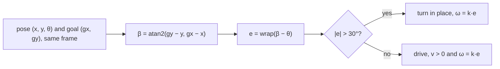

# 05.02 — Position, orientation and pose in 2D (x, y, θ)

<!-- glance:start -->
<!-- generated by tools/build.py from curriculum/syllabus.yaml — edit the syllabus, not this block -->

| | |
|---|---|
| **Track** | Main path |
| **Difficulty** | Beginner |
| **Time** | 45 min |
| **Hardware** | none |
| **Software** | python, numpy |
| **Prerequisites** | [05.01 Why frames? "The camera sees a bottle — where is it relative to the robot?"](05.01-why-frames.md) |
| **Optional prerequisites** | [FM.02 Angles, degrees and radians](../optional-foundations/mathematics/FM.02-angles-and-radians.md)<br>[FM.03 Trigonometry: sin, cos, tan and atan2](../optional-foundations/mathematics/FM.03-trigonometry.md)<br>[FM.04 Cartesian and polar coordinates](../optional-foundations/mathematics/FM.04-coordinate-systems.md) |
| **Skip if** | You never forget to wrap angles and use atan2 instinctively. |

<!-- glance:end -->

## What you will learn

- Describe a planar robot's pose as $(x, y, \theta)$ in a named frame, with the REP-103 sign conventions.
- Wrap any angle to $(-\pi, \pi]$ and explain why unwrapped headings make robots spin the long way round.
- Compute the bearing to a target with `atan2` and the signed heading error the robot must turn.
- Average headings correctly (circular mean) instead of averaging the numbers.
- Draw poses, a bearing and a heading error with `frames_lab.py` and check them by eye.

## Why it matters

Every mobile-robot algorithm in this course carries a 2D pose. Odometry integrates it ([09.03](../09-odometry/09.03-dead-reckoning-integration.md)). Localization estimates it ([10.06](../10-localization/10.06-extended-kalman-filter.md)). Go-to-goal controllers and Nav2 compare it to a goal ([12.05](../12-navigation/12.05-local-planning-obstacle-avoidance.md)). The angle part, $\theta$, is where the bugs live: 359° and −1° are the same heading, but a controller that subtracts them tells the robot to turn a full circle. A Kalman filter that averages 179° and −179° concludes the robot faces 0°, exactly the wrong way.

For karmel's running example, a pose answers "the robot is at (2.0, 1.0) facing +y", and a bearing answers "the bottle is 4° to my right, turn a little clockwise".

<!-- prereqs:start -->
## Prerequisites

You need these first:

- [05.01 Why frames? "The camera sees a bottle — where is it relative to the robot?"](05.01-why-frames.md)

### Optional prerequisite links

New to any of these? Take the foundation lesson first; skip it if you already know it.

- [FM.02 Angles, degrees and radians](../optional-foundations/mathematics/FM.02-angles-and-radians.md)
- [FM.03 Trigonometry: sin, cos, tan and atan2](../optional-foundations/mathematics/FM.03-trigonometry.md)
- [FM.04 Cartesian and polar coordinates](../optional-foundations/mathematics/FM.04-coordinate-systems.md)

Check your readiness: `python course.py why 05.02`
<!-- prereqs:end -->

## Concept

### Position is where; orientation is which way; pose is both

A delivery driver's app shows a dot (position) and an arrow (orientation). The dot alone can't tell you whether "turn left" is north or south. The arrow is what makes directions usable. A **pose** is the dot plus the arrow.

On a flat floor the pose needs three numbers:

- $x, y$ — position, in metres, measured along the axes of some frame (usually `map` or `odom`).
- $\theta$ — **heading** (also called yaw): the angle from that frame's +x axis to the robot's forward direction, **counter-clockwise positive**, in **radians**.

"Counter-clockwise positive" is not arbitrary. With x forward and y left (REP-103), z points up, and the right-hand rule around z gives counter-clockwise. So a positive angular velocity turns karmel **left**. Every ROS package, every `cmd_vel`, every odometry message agrees on this.

### Angles live on a circle, not on a line

Headings are like clock times: 23:00 plus 2 hours is 01:00, not 25:00. And "how far from 23:00 to 01:00" is 2 hours forward, not 22 hours back. Angles behave the same way:

- **Wrapping**: 190° and −170° are the same heading. The course keeps headings in $(-\pi, \pi]$, i.e. (−180°, 180°].
- **Differences**: the error from −178° to 175° is −7° (turn 7° clockwise), not +353°.
- **Averages**: the average of 170° and −170° is 180°, not 0°.

Numbers on a line lie to you near ±180°. The fix is always the same: wrap after every subtraction or addition, and average unit vectors instead of numbers.

> [!TIP]
> **Ask your teacher:** "Give me ten pairs of headings in degrees and ask me for the wrapped difference, including pairs that straddle ±180°."

## Technical explanation

### Level 1 — The pose of karmel

```text
 y (map)
  ▲
  │        ▲ forward (θ = 90°)
1 ┤  ◄─────■  karmel: pose (2.0, 1.0, π/2) in map
  │  left
  │
  └───────────────┬────► x (map)
                  2
```

The same robot in the same place has a different pose in a different frame. In `odom` it might be $(0.3, -0.1, 1.52)$. A pose without a frame is as meaningless as a point without one ([05.01](05.01-why-frames.md)).

> [!NOTE]
> New to radians or atan2? → [FM.02 Angles and radians](../optional-foundations/mathematics/FM.02-angles-and-radians.md) and [FM.03 Trigonometry](../optional-foundations/mathematics/FM.03-trigonometry.md). Skip them if you already know them.

### Level 2 — Practical: the four operations you need every day

**1. Wrap.** Bring any angle into $(-\pi, \pi]$:

$$\operatorname{wrap}(a) = \pi - \big((\pi - a) \bmod 2\pi\big)$$

where $\bmod$ returns a value in $[0, 2\pi)$ (Python's `%` does that for a positive divisor). Examples: $\operatorname{wrap}(190°) = -170°$, $\operatorname{wrap}(-270°) = 90°$, $\operatorname{wrap}(540°) = 180°$, $\operatorname{wrap}(-180°) = +180°$, $\operatorname{wrap}(7.0\ \text{rad}) = 0.7168$ rad (41.07°).

The half-open interval matters: exactly $\pm\pi$ both map to $+\pi$, so two equal headings compare equal.

**2. Bearing.** The direction from the robot at $(x, y)$ to a target $(g_x, g_y)$, in the same frame:

$$\beta = \operatorname{atan2}(g_y - y,\ g_x - x)$$

For karmel at $(2.0, 1.0)$ and the bottle at $(2.05, 1.70)$ in map: $\beta = \operatorname{atan2}(0.70, 0.05) = 85.91°$. Distance $= \sqrt{0.05^2 + 0.70^2} = 0.7018$ m.

**3. Heading error.** How much to turn, positive = left:

$$e = \operatorname{wrap}(\beta - \theta)$$

For the bottle: $e = \operatorname{wrap}(85.91° - 90°) = -4.09°$. Turn 4.09° clockwise (right). This is exactly what [05.01](05.01-why-frames.md) found geometrically: the bottle is 5 cm right of the robot's centreline.

For a goal at $(1.0, 0.0)$, behind and to the left: $\beta = \operatorname{atan2}(-1, -1) = -135°$, and $e = \operatorname{wrap}(-135° - 90°) = \operatorname{wrap}(-225°) = +135°$. Turn left 135°, not right 225°.

**4. Integrate.** Turning at $\omega = 0.5$ rad/s for 10 s from $\theta = 2.5$ rad gives $2.5 + 5.0 = 7.5$ rad, wrapped to **1.2168 rad (69.72°)**. Wrap after every integration step. Otherwise the heading grows without bound, and sooner or later some consumer (a logger, a plot, a controller someone else wrote) compares it with a wrapped angle and gets nonsense.

### Level 3 — Mathematics: headings as unit vectors

The clean way to think of a heading is the unit vector $h = (\cos\theta, \sin\theta)$. Two angles are equal exactly when their vectors are equal, which is why wrapping is safe. Two consequences you will use:

**Circular mean.** Average the vectors, then take the angle:

$$\bar\theta = \operatorname{atan2}\Big(\sum_i \sin\theta_i,\ \sum_i \cos\theta_i\Big)$$

For headings 350°, 10°, 20°: the naive mean is $380/3 = 126.67°$ (pointing backward!), while $\bar\theta = 6.70°$. For 170° and −170°: naive 0°, circular 180°.

**The heading error without wrapping.** The signed angle from $h_1$ to $h_2$ is $\operatorname{atan2}(h_1 \times h_2,\ h_1 \cdot h_2) = \operatorname{atan2}(\sin(\theta_2-\theta_1), \cos(\theta_2-\theta_1))$, which is automatically in $(-\pi, \pi]$. From −178° to 175°: $\operatorname{atan2}(\sin(353°), \cos(353°)) = -7°$.

**Bearing in the robot frame.** Another way to get the heading error: express the target in **base_link** (how to do that in general is [05.03](05.03-rigid-transforms-2d.md)) and take $\operatorname{atan2}(y_{\text{base}}, x_{\text{base}})$. For the goal $(1.0, 0.0)$ in map, its base_link coordinates are $(-1.0, 1.0)$: behind and to the left, and $\operatorname{atan2}(1.0, -1.0) = 135°$. Same answer, no wrapping needed, because the rotation is already baked in. This is how real controllers are usually written.

### Level 4 — Implementation notes

- Store $\theta$ in radians, wrapped, as a `float`. Convert to degrees only for printing.
- `math.atan2(y, x)`: **y first**. `atan2(-0.0, -1.0)` is $-\pi$ while `atan2(0.0, -1.0)` is $+\pi$ (IEEE signed zero). Wrap before comparing.
- The course library already implements this: [`labs/python/robotlab/geometry.py`](../labs/python/robotlab/geometry.py) has `wrap_angle`, `angle_diff(a, b)` $= \operatorname{wrap}(a-b)$ and an immutable `SE2(x, y, theta)` that wraps $\theta$ on construction. Use it in labs; this lesson's `pose_tools.py` exists so you can see every line.
- In ROS 2, a planar pose travels as `geometry_msgs/Pose2D`-like fields only in a few places. Mostly you get a full 3D `geometry_msgs/Pose` with a **quaternion**. For a flat robot the heading is `yaw_from_quat` in [`frames_math.py`](code/frames_math.py); [05.05](05.05-rotations-in-3d.md) explains quaternions.

## Diagram

```text
     heading error = wrap(bearing − θ)

                       ★ goal (3.0, 2.0)
                     ╱
                   ╱   bearing β = atan2(2.0 − (−1.0), 3.0 − 0.5) = 50.19°
       θ = 120°  ╱
          ▲    ╱
           ╲ ╱ e = wrap(50.19° − 120°) = −69.81°  (turn right)
            ■ robot (0.5, −1.0)
   ─────────┼──────────────────► x
```



## Code

[`code/pose_tools.py`](code/pose_tools.py) (tested by `code/test_pose_tools.py`):

```python
"""05.02 — poses, wrapping and bearings. Standard library only."""
from __future__ import annotations

import math
from dataclasses import dataclass


def wrap_angle(a: float) -> float:
    """Wrap to (-pi, pi]. Same result as robotlab.geometry.wrap_angle."""
    return math.pi - ((math.pi - a) % (2.0 * math.pi))


@dataclass(frozen=True)
class Pose2D:
    x: float        # m, in the frame named by the variable (e.g. robot_in_map)
    y: float        # m
    theta: float    # rad, counter-clockwise from the frame's +x axis, wrapped to (-pi, pi]

    def __post_init__(self) -> None:
        object.__setattr__(self, "theta", wrap_angle(self.theta))


def bearing_to(pose: Pose2D, gx: float, gy: float) -> float:
    """Direction from the robot's position to (gx, gy), measured in the same frame as the pose."""
    return math.atan2(gy - pose.y, gx - pose.x)


def heading_error(pose: Pose2D, gx: float, gy: float) -> float:
    """How much to turn (positive = left/CCW) to face the goal. Always in (-pi, pi]."""
    return wrap_angle(bearing_to(pose, gx, gy) - pose.theta)


def circular_mean(angles: list[float]) -> float:
    """Mean direction: average the unit vectors, not the numbers."""
    return math.atan2(sum(math.sin(a) for a in angles), sum(math.cos(a) for a in angles))


if __name__ == "__main__":
    deg = math.degrees
    for a in (190, -270, 540, -180, 360):
        print(f"wrap({a:5d} deg) = {deg(wrap_angle(math.radians(a))):7.2f} deg")
    print(f"wrap(7.0 rad)   = {wrap_angle(7.0):.4f} rad")

    robot = Pose2D(2.0, 1.0, math.radians(90))
    bottle = (2.05, 1.70)
    print(f"bottle: bearing {deg(bearing_to(robot, *bottle)):.2f} deg, "
          f"turn {deg(heading_error(robot, *bottle)):+.2f} deg, "
          f"distance {math.hypot(bottle[0] - robot.x, bottle[1] - robot.y):.4f} m")
    print(f"goal (1, 0): turn {deg(heading_error(robot, 1.0, 0.0)):+.2f} deg")

    theta = 2.5
    for _ in range(100):                  # 10 s of turning at 0.5 rad/s, dt = 0.1 s
        theta = wrap_angle(theta + 0.5 * 0.1)
    print(f"after 10 s at 0.5 rad/s from 2.5 rad: {theta:.4f} rad ({deg(theta):.2f} deg)")

    headings = [math.radians(a) for a in (350, 10, 20)]
    print(f"naive mean {deg(sum(headings) / 3):.2f} deg, circular mean {deg(circular_mean(headings)):.2f} deg")
```

Run `python 05-frames-and-transforms/code/pose_tools.py`:

```text
wrap(  190 deg) = -170.00 deg
wrap( -270 deg) =   90.00 deg
wrap(  540 deg) =  180.00 deg
wrap( -180 deg) =  180.00 deg
wrap(  360 deg) =    0.00 deg
wrap(7.0 rad)   = 0.7168 rad
bottle: bearing 85.91 deg, turn -4.09 deg, distance 0.7018 m
goal (1, 0): turn +135.00 deg
after 10 s at 0.5 rad/s from 2.5 rad: 1.2168 rad (69.72 deg)
naive mean 126.67 deg, circular mean 6.70 deg
```

Draw poses as frames, plus the bearing arc for the example in the Diagram section:

```bash
python 05-frames-and-transforms/code/frames_lab.py poses
```

`frames_out/poses.png` shows the robot at $(0.5, -1.0)$ with its red x axis pointing up-left at 120°, a dotted line to the goal star, a purple arc sweeping clockwise from the heading to the bearing, and the text `bearing = 50.19°`, `error = wrap(bearing − θ) = -69.81°`. Three extra frames show headings 180° (red arrow pointing left), −90° (pointing down) and 45°.

## Exercise

All exercises need hardware: none.

### Exercise 05.02-E1 — Wrap by hand `[numerical]`

Wrap to $(-180°, 180°]$ without a computer: 270°, −190°, 725°, −540°, 180°, −180°. Then wrap 10.0 rad to $(-\pi, \pi]$ (give radians and degrees). Check with `wrap_angle`.

### Exercise 05.02-E2 — Turn toward the bottle, then toward the door `[numerical]`

karmel is at $(2.0, 1.0, 90°)$ in map. (a) The bottle is at $(2.05, 1.70)$: bearing, heading error, distance. (b) The door is at $(-1.0, 3.0)$: bearing and heading error. (c) Which way does the robot turn for each?

### Exercise 05.02-E3 — The spinning robot `[debugging]`

This controller works most of the time, but when the robot faces about −178° and the goal bearing is about 175° it spins almost a full turn:

```python
error = bearing - theta          # both in radians, from atan2 and odometry
omega = 1.5 * error
```

Compute `error` in degrees for $\theta = -178°$, $\beta = 175°$. Fix the code. What is `omega` before and after the fix?

### Exercise 05.02-E4 — Averaging compass readings `[predict]`

Five heading estimates arrive from five scan matches: 178°, −179°, 179°, −177°, 180°. **Predict** the naive mean and the circular mean before computing. Then compute both with `circular_mean`.

### Exercise 05.02-E5 — Draw a heading error `[coding]`

Write `ex_05_02_turn.py` in `05-frames-and-transforms/code/` that draws karmel at $(2.0, 1.0, 90°)$, the bottle at $(2.05, 1.70)$ and the door at $(-1.0, 3.0)$, with a line from the robot to each and the heading error printed next to each target. Use `new_axes_2d`, `draw_robot`, `draw_frame`, `draw_point` and `save` from `frames_lab`. Inspect the PNG: does each error's sign match the side the target is on?

## Expected result

- **05.02-E1:** 270° → **−90°**; −190° → **170°**; 725° → **5°**; −540° → **180°**; 180° → **180°**; −180° → **180°**. 10.0 rad → **−2.5664 rad (−147.04°)**.
- **05.02-E2:** (a) bearing **85.91°**, error **−4.09°**, distance **0.7018 m**. (b) $\operatorname{atan2}(2.0, -3.0) =$ bearing **146.31°**, error **+56.31°**. (c) Bottle: small right (clockwise) turn. Door: left (counter-clockwise) turn of 56.31°.
- **05.02-E3:** Unwrapped `error` = 175 − (−178) = **353°**, so `omega` = 1.5 × 6.161 = **9.24 rad/s** (left, the long way; karmel's limit of 2.5 rad/s saturates it and it spins almost a full turn). Fixed: `error = wrap_angle(bearing - theta)` = **−7°** (−0.1222 rad), `omega` = **−0.183 rad/s** (a gentle right turn).
- **05.02-E4:** Naive mean **36.2°** (nonsense: it points almost 150° away from every estimate). Circular mean **≈ −179.8°** (≈ 180.2°, i.e. facing −x). All five estimates agree within 3° of 180°; only the numbers disagreed.
- **05.02-E5:** The PNG shows the bottle almost straight ahead (error −4.09°, just right of the red x arrow) and the door up-left (error +56.31°). Positive errors are on the green (left, +y of base_link) side of the robot, negative on the right.

<details><summary>Reference solution for 05.02-E5</summary>

```python
"""05-frames-and-transforms/code/ex_05_02_turn.py"""
import math

from frames_lab import draw_frame, draw_point, draw_robot, new_axes_2d, save
from frames_math import se2
from pose_tools import Pose2D, heading_error

robot = Pose2D(2.0, 1.0, math.radians(90))
T_map_base_link = se2(robot.x, robot.y, robot.theta)
fig, ax = new_axes_2d("heading errors from karmel", "map", xlim=(-1.5, 3.5), ylim=(-0.5, 3.5))
draw_robot(ax, T_map_base_link)
draw_frame(ax, T_map_base_link, "base_link")
for name, (gx, gy) in {"bottle": (2.05, 1.70), "door": (-1.0, 3.0)}.items():
    e = math.degrees(heading_error(robot, gx, gy))
    ax.plot([robot.x, gx], [robot.y, gy], ":", color="0.4")
    draw_point(ax, (gx, gy), f"{name} e={e:+.2f}°")
save(fig, "ex_05_02_turn")
```
</details>

## Troubleshooting

### Symptom: the robot sometimes spins a full circle before driving off

1. Log `theta`, `bearing` and `error` in degrees. If `|error| > 180°` ever appears, the error is not wrapped.
2. If `error` is wrapped but the robot still spins, check the **odometry** heading: an unwrapped heading that has grown to, say, 12 rad is fine only if every consumer wraps.
3. Check the sign of $\omega$ on the real robot: command `+0.5 rad/s` and confirm it turns **left** (REP-103). If it turns right, the base driver has a sign error and every controller will fight it.

### Symptom: a filter or average of headings jumps by ~180°

1. Look at the raw inputs. If they straddle ±180°, the average of the numbers is the problem.
2. Replace it with a circular mean, or average the angle *differences* relative to the first sample after wrapping each difference.

### Symptom: bearings are off by exactly 90° or mirror-imaged

1. `atan2(dx, dy)` instead of `atan2(dy, dx)` gives $90° - \beta$.
2. `atan2(y - gy, x - gx)` (robot minus goal) gives $\beta \pm 180°$.
3. Degrees passed to `math.cos`: `math.cos(90)` is −0.448, not 0.

## Common mistakes

- **Subtracting headings without wrapping.** Every `a - b` on angles must be followed by `wrap_angle`.
- **Averaging angles as numbers.** Use unit vectors.
- **Wrapping to [0, 2π) in one place and (−π, π] in another.** Pick one (the course uses (−π, π]) and wrap at the boundary of every module.
- **Clockwise-positive thinking.** Compass bearings (0° = north, clockwise) are not robot headings (0° = +x, counter-clockwise). Convert once if a sensor gives compass bearings: $\theta = \operatorname{wrap}(90° - \text{compass})$ when the map's +x is east and +y is north.
- **A pose without a frame.** `pose` is not a name. `robot_in_map`, `goal_in_odom` are.

## Knowledge check

1. What are the three numbers of a 2D pose, their units, and which direction is positive for the angle?
   <details><summary>Answer</summary>

   $x$ and $y$ in metres, $\theta$ in radians measured from the frame's +x axis, counter-clockwise positive (REP-103: z up, right-hand rule), wrapped to $(-\pi, \pi]$.
   </details>

2. Wrap −200° and 380°.
   <details><summary>Answer</summary>

   −200° → 160°. 380° → 20°.
   </details>

3. The robot at $(0, 0, 0°)$ sees a target at $(-2, -0.1)$. Heading error?
   <details><summary>Answer</summary>

   $\operatorname{atan2}(-0.1, -2) = -177.14°$, so turn right 177.14°. (Left 182.86° would also get there, but wrapping picks the shorter turn.)
   </details>

4. Predict: two scan matchers report headings 1° and 359°. What does the naive average say, and what is the right answer?
   <details><summary>Answer</summary>

   Naive: 180° (the opposite direction). Circular mean: 0°.
   </details>

5. Why does `wrap_angle` return $+\pi$ for both $\pi$ and $-\pi$?
   <details><summary>Answer</summary>

   So that one heading has exactly one representation in the half-open interval $(-\pi, \pi]$. Otherwise two equal headings could compare unequal.
   </details>

6. Debugging: after a long test your odometry heading reads 6285.4 rad. The go-to-goal controller wraps its error and works, but the check `if abs(theta - wall_heading) < 0.2` never fires. Why?
   <details><summary>Answer</summary>

   6285.4 rad is 1000 full turns plus 2.2 rad. The controller wraps, the check doesn't, so it compares 6285.4 with a heading near 2.2 and always sees a huge difference. Wrap $\theta$ on every integration step so every consumer sees $(-\pi, \pi]$, and wrap every difference.
   </details>

7. A target is at $(-1.0, 1.0)$ in **base_link**. What is the heading error, and why don't you need to wrap?
   <details><summary>Answer</summary>

   $\operatorname{atan2}(1.0, -1.0) = 135°$: turn left 135°. In base_link the robot's heading is 0 by definition, and atan2 already returns a value in $(-\pi, \pi]$.
   </details>

## Practical challenge

Implement a go-to-goal controller `step(pose, goal, dt) -> pose` that computes the heading error with `wrap_angle`, turns in place while $|e| > 30°$ (at $\omega = 2.0\,e$ clamped to ±2.5 rad/s), otherwise drives with $v = \min(0.3, 0.5\,d)$ and $\omega = 2.0\,e$. Integrate with $x \mathrel{+}= v\cos\theta\,dt$, $y \mathrel{+}= v\sin\theta\,dt$, $\theta = \operatorname{wrap}(\theta + \omega\,dt)$ at $dt = 0.05$ s. Start at $(2.0, 1.0, 179°)$ and visit, in order, $(0.0, 1.0)$, $(0.0, -1.0)$, $(3.0, -1.0)$, $(2.0, 1.0)$. Plot the path with `frames_lab` and print the total absolute turn angle.

**Acceptance criteria:** every goal is reached within 0.05 m; no single in-place turn exceeds 180°; replacing `wrap_angle(beta - theta)` with `beta - theta` visibly produces at least one turn of more than 180° in the plot, and you can say which goal causes it and why.

## You can skip this if…

You answer knowledge-check questions 3, 4 and 7 correctly without looking and fix Exercise E3 in under two minutes.

`python course.py skip 05.02 --reason "I wrap angles and use atan2 instinctively"`

## Go deeper

- REP-103, Standard Units of Measure and Coordinate Conventions: https://www.ros.org/reps/rep-0103.html — radians, counter-clockwise positive rotation, x forward / y left / z up.
- Wikipedia, atan2: https://en.wikipedia.org/wiki/Atan2 — definition, quadrants, and argument-order differences between languages.
- Python `math` module: https://docs.python.org/3/library/math.html — `atan2`, `hypot`, `remainder` and the behaviour of `%` on floats.
- Wikipedia, Circular mean: https://en.wikipedia.org/wiki/Circular_mean — the unit-vector average and its caveats when headings spread widely.
- Modern Robotics (Lynch & Park), book home: https://hades.mech.northwestern.edu/index.php/Modern_Robotics — chapter 3 introduces planar configurations before generalizing to 3D.

## Progress checkpoint

- [ ] I describe a pose as $(x, y, \theta)$ in a named frame with CCW-positive radians.
- [ ] I wrap every angle sum and difference to $(-\pi, \pi]$.
- [ ] I compute bearings with `atan2(dy, dx)` and heading errors with `wrap(β − θ)`.
- [ ] I average headings with a circular mean.
- [ ] I drew and checked `poses.png` and my own heading-error plot.

`python course.py complete 05.02` (exercises done) · `python course.py master 05.02` (challenge done) · `python course.py struggle 05.02 "what was hard"`

Next: [05.03 — 2D rigid transforms: rotate, translate, compose, invert](05.03-rigid-transforms-2d.md).
