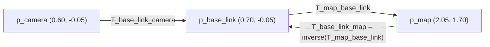

# 05.03 — 2D rigid transforms — rotate, translate, compose, invert

<!-- glance:start -->
<!-- generated by tools/build.py from curriculum/syllabus.yaml — edit the syllabus, not this block -->

| | |
|---|---|
| **Track** | Main path |
| **Difficulty** | Intermediate |
| **Time** | 1 h |
| **Hardware** | none |
| **Software** | python, numpy |
| **Prerequisites** | [05.02 Position, orientation and pose in 2D (x, y, θ)](05.02-pose-in-2d.md) |
| **Optional prerequisites** | [FM.07 Matrices and matrix multiplication](../optional-foundations/mathematics/FM.07-matrices.md)<br>[FM.08 Matrices as transformations and basis vectors](../optional-foundations/mathematics/FM.08-matrices-as-transformations.md) |
| **Skip if** | You can compose and invert 2D transforms and explain the notation T_a_b. |

<!-- glance:end -->

## What you will learn

- Read and write the notation `T_a_b` (${}^{a}T_{b}$) without ever getting the direction wrong, and check a chain by "cancelling" inner frame names.
- Build a 2D rotation matrix from the idea "its columns are the child's axes seen from the parent".
- Transform a point from one frame to another: rotate, then translate.
- Compose two transforms (sensor on robot, robot in map) and invert one (map seen from the robot), by hand and in code.
- Explain why transform composition does not commute, and spot a wrong-order bug from its symptoms.

## Why it matters

[05.01](05.01-why-frames.md) solved "sensor → robot → map" with arguments like "ahead becomes +y". That works for 90°. karmel will be at 37.4°, then −149°, fifty times a second. You need a recipe that works for every angle, chains any number of frames, and can run backwards ("where is the charging dock, as seen from the robot?"). That recipe is the **rigid transform**. Odometry updates ([09.03](../09-odometry/09.03-dead-reckoning-integration.md)), scan matching ([11.04](../11-slam/11.04-scan-matching-icp.md)), AMCL's map→odom correction ([05.06](05.06-frame-conventions-rep103-rep105.md)) and every TF2 lookup ([05.07](05.07-tf2-broadcast-listen.md)) are compositions and inversions of exactly these objects.

This lesson also fixes the **notation used everywhere else in the course**. Learn it once, use it forever.

<!-- prereqs:start -->
## Prerequisites

You need these first:

- [05.02 Position, orientation and pose in 2D (x, y, θ)](05.02-pose-in-2d.md)

### Optional prerequisite links

New to any of these? Take the foundation lesson first; skip it if you already know it.

- [FM.07 Matrices and matrix multiplication](../optional-foundations/mathematics/FM.07-matrices.md)
- [FM.08 Matrices as transformations and basis vectors](../optional-foundations/mathematics/FM.08-matrices-as-transformations.md)

Check your readiness: `python course.py why 05.03`
<!-- prereqs:end -->

## Concept

### A transform is a pose and a converter at the same time

"The camera is 10 cm in front of the robot's centre, facing the same way." That sentence is two things:

1. **A pose**: where the camera frame *is*, described from the robot frame: $(0.10, 0, 0°)$.
2. **A converter**: a machine that takes a point in camera coordinates and returns it in robot coordinates (add 10 cm to x).

They are the same object. The pose of frame b expressed in frame a **is** the converter from b-coordinates to a-coordinates. This is the single most useful fact in the module, and the notation is built around it.

### The notation (used in every lesson from here on)

> [!IMPORTANT]
> **`T_a_b`** (in formulas ${}^{a}T_{b}$) is **the pose of frame b expressed in frame a**, which is the same thing as **the transform that maps point coordinates from b to a**.
>
> | Rule | Code | Math |
> |---|---|---|
> | Apply to a point | `p_a = T_a_b @ p_b` | ${}^{a}p = {}^{a}T_{b}\;{}^{b}p$ |
> | Compose (inner names cancel) | `T_a_c = T_a_b @ T_b_c` | ${}^{a}T_{c} = {}^{a}T_{b}\;{}^{b}T_{c}$ |
> | Invert (swap the names) | `T_b_a = inverse(T_a_b)` | ${}^{b}T_{a} = ({}^{a}T_{b})^{-1}$ |
>
> Read `T_map_base_link` as "base_link, as seen from map". The same convention is used by `robotlab.geometry.SE2` (`world_T_robot @ robot_T_sensor == world_T_sensor`), by URDF joints (`<origin>` is `T_parent_child`), and by TF2: `buffer.lookup_transform(target_frame="map", source_frame="base_link", ...)` returns `T_map_base_link`.

The "cancel" rule is a type checker you run in your head. `T_map_base_link @ T_base_link_camera` has adjacent names `base_link`, `base_link`: they cancel, leaving `T_map_camera`. `T_base_link_camera @ T_map_base_link` puts `camera` next to `map`: it doesn't type-check, and it is a bug even though numpy will happily multiply it.

Short symbols keep formulas readable: $M$ = map, $B$ = base_link, $C$ = camera_link, $L$ = laser.

> [!TIP]
> **Ask your teacher:** "Give me eight chains like T_odom_laser = ? @ ? or p_camera = ? @ p_map, and let me fill in the blanks using the cancel rule."

## Technical explanation

### Level 1 — Intuition: rotate first, then translate

To express a point of frame b in frame a:

1. **Rotate** its coordinates by b's heading, so "ahead of b" becomes the matching direction in a.
2. **Translate** by b's origin in a.

Rotating first matters: the offsets inside b are measured along b's axes, and only after rotation do they point along a's axes.

### Level 2 — Practical: the formulas and karmel's numbers

> [!NOTE]
> New to matrices or matrix multiplication? → [FM.07 Matrices](../optional-foundations/mathematics/FM.07-matrices.md) and [FM.08 Matrices as transformations](../optional-foundations/mathematics/FM.08-matrices-as-transformations.md). Skip them if you already know them.

A 2D transform ${}^{a}T_{b}$ is three numbers $(x, y, \theta)$: b's origin and heading in a. With $c = \cos\theta$, $s = \sin\theta$:

**Rotation matrix**

$$R(\theta) = \begin{bmatrix} c & -s \\ s & c \end{bmatrix}$$

Its **first column** $(c, s)$ is b's x axis drawn in a; its **second column** $(-s, c)$ is b's y axis drawn in a. For $\theta = 90°$: $R = \begin{bmatrix} 0 & -1 \\ 1 & 0 \end{bmatrix}$. b's x axis points along a's +y, b's y axis along a's −x. That is "ahead becomes +y, left becomes −x" from 05.01, now as a matrix.

**Apply**

$${}^{a}p = R(\theta)\,{}^{b}p + t, \qquad t = (x, y)$$

karmel in the map: ${}^{M}T_{B} = (2.0, 1.0, 90°)$. The bottle in base_link (top view) is ${}^{B}p = (0.70, -0.05)$:

$${}^{M}p = \begin{bmatrix} 0 & -1 \\ 1 & 0 \end{bmatrix}\begin{bmatrix} 0.70 \\ -0.05 \end{bmatrix} + \begin{bmatrix} 2.0 \\ 1.0 \end{bmatrix} = \begin{bmatrix} 0.05 \\ 0.70 \end{bmatrix} + \begin{bmatrix} 2.0 \\ 1.0 \end{bmatrix} = \begin{bmatrix} 2.05 \\ 1.70 \end{bmatrix}$$

**Compose** ${}^{a}T_{c} = {}^{a}T_{b}\,{}^{b}T_{c}$, with ${}^{a}T_{b} = (x_1, y_1, \theta_1)$ and ${}^{b}T_{c} = (x_2, y_2, \theta_2)$:

$$x = x_1 + c_1 x_2 - s_1 y_2, \qquad y = y_1 + s_1 x_2 + c_1 y_2, \qquad \theta = \operatorname{wrap}(\theta_1 + \theta_2)$$

The translation of the second transform is **rotated by the first**, then added. The angles simply add.

The camera on karmel: ${}^{B}T_{C} = (0.10, 0, 0°)$. Then

$${}^{M}T_{C} = {}^{M}T_{B}\,{}^{B}T_{C}: \quad x = 2.0 + 0\cdot 0.10 - 1\cdot 0 = 2.00,\quad y = 1.0 + 1\cdot 0.10 + 0 = 1.10,\quad \theta = 90°$$

The camera is at $(2.00, 1.10)$ in the map, facing +y. The bottle in camera_link, $(0.60, -0.05)$, lands at $(2.00 + 0.05, 1.10 + 0.60) = (2.05, 1.70)$. The same answer as going through base_link, as it must be.

**Invert** ${}^{b}T_{a} = ({}^{a}T_{b})^{-1}$:

$$x' = -c\,x - s\,y, \qquad y' = s\,x - c\,y, \qquad \theta' = -\theta$$

The map seen from karmel: ${}^{B}T_{M} = (-0\cdot 2.0 - 1\cdot 1.0,\ 1\cdot 2.0 - 0\cdot 1.0,\ -90°) = (-1.0, 2.0, -90°)$. The map origin is 1 m behind the robot and 2 m to its left, and the map's x axis points to the robot's right. Check it on the picture in 05.01: facing +y at (2, 1), the point (0, 0) is indeed behind (smaller y) and to the left (smaller x).

Use it to bring the bottle back: ${}^{B}p = {}^{B}T_{M}\,{}^{M}p = R(-90°)(2.05, 1.70) + (-1.0, 2.0) = (1.70, -2.05) + (-1.0, 2.0) = (0.70, -0.05)$. Round trip closed.

### Level 3 — Mathematics: where the formulas come from

**Apply.** A point with coordinates $(u, v)$ in b is "$u$ steps along b's x axis and $v$ steps along b's y axis, starting at b's origin". In frame a, b's origin is $t$, b's x axis is $(c, s)$ and its y axis is $(-s, c)$:

$${}^{a}p = t + u\begin{bmatrix} c \\ s \end{bmatrix} + v\begin{bmatrix} -s \\ c \end{bmatrix} = t + \underbrace{\begin{bmatrix} c & -s \\ s & c \end{bmatrix}}_{R}\begin{bmatrix} u \\ v \end{bmatrix}$$

So the columns of $R$ are b's axes in a. No memorization needed.

**Compose.** Apply twice: ${}^{a}p = R_1({R_2\,{}^{c}p + t_2}) + t_1 = (R_1R_2)\,{}^{c}p + (R_1t_2 + t_1)$. So the composed rotation is $R_1R_2 = R(\theta_1+\theta_2)$ and the composed translation is $R_1t_2 + t_1$. That is the compose formula above.

**Invert.** Solve ${}^{a}p = R\,{}^{b}p + t$ for ${}^{b}p$. Rotation matrices are **orthonormal**: $R^{-1} = R^{\mathsf T} = R(-\theta)$. So ${}^{b}p = R^{\mathsf T}\,{}^{a}p - R^{\mathsf T}t$: the inverse has rotation $R^{\mathsf T}$ and translation $-R^{\mathsf T}t$. Numerically for $\theta = 90°$, $t = (2, 1)$: $-R^{\mathsf T}t = -\begin{bmatrix} 0 & 1 \\ -1 & 0\end{bmatrix}\begin{bmatrix} 2 \\ 1\end{bmatrix} = -\begin{bmatrix} 1 \\ -2\end{bmatrix} = \begin{bmatrix} -1 \\ 2\end{bmatrix}$. Matches.

A common wrong guess is "the inverse of $(x, y, \theta)$ is $(-x, -y, -\theta)$". That is only true when $\theta = 0$. For karmel it would give $(-2, -1, -90°)$ instead of $(-1, 2, -90°)$: a 3.2 m error.

**Order matters.** Rotations in 2D commute, but the translations don't: $R_1t_2 + t_1 \ne R_2t_1 + t_2$ in general. Take $A = (1, 0, 0°)$ "move 1 m along x" and $B = (0, 0, 90°)$ "turn left 90°":

- $A\,B = (1.0, 0.0, 90°)$: move, then turn. You end at $x=1$, facing +y.
- $B\,A = (0.0, 1.0, 90°)$: turn, then move 1 m **along your new x**. You end at $y=1$.

With karmel, the wrong order ${}^{B}T_{C}\,{}^{M}T_{B}$ gives $(2.10, 1.00, 90°)$ instead of $(2.00, 1.10, 90°)$: the camera offset got applied along the **map's** x, not the robot's forward direction. The error is exactly the offset (14 cm here), and it rotates with the robot. That "a small error that changes direction as the robot turns" is the fingerprint of a wrong-order bug.

### Level 4 — Implementation: poses that move

A transform is also a **motion**. Right-multiplying moves in the child's own frame; left-multiplying moves in the parent's frame:

- ${}^{M}T_{B}\;\Delta$ with $\Delta = (0.5, 0, -30°)$: drive 0.5 m **forward** (in base_link), then turn 30° right. karmel goes from $(2.0, 1.0, 90°)$ to $(2.0, 1.5, 60°)$. This is exactly an odometry update ([09.03](../09-odometry/09.03-dead-reckoning-integration.md)): wheel encoders measure $\Delta$ in the robot frame.
- $\Delta\;{}^{M}T_{B}$: move 0.5 m along **map x** and rotate the whole picture about the map origin. Rarely what you want.

Relative poses fall out of the same algebra. Robot A at ${}^{M}T_{A} = (2.0, 1.0, 90°)$ and robot B at ${}^{M}T_{B'} = (3.0, 1.0, 180°)$. "B as seen from A" is ${}^{A}T_{B'} = ({}^{M}T_{A})^{-1}\,{}^{M}T_{B'} = (0.0, -1.0, 90°)$: B is 1 m to A's right and turned 90° left relative to A. `robotlab.geometry.SE2.between` computes exactly this.

## Diagram

```text
   compose:  T_map_camera = T_map_base_link @ T_base_link_camera
                         (names: map·base_link ⟶ base_link·camera ⟶ map·camera)

  y(map)
   ▲             ◉ camera_link (2.00, 1.10, 90°)
   │             ▲ ← T_base_link_camera = (0.10, 0, 0°): 10 cm FORWARD of the robot
   │     y_B ◄───■ base_link (2.0, 1.0, 90°)
 1 ┤            ╱
   │          ╱  T_map_base_link
   │        ╱
   │      ╱
   ■────╱─────────────► x(map)
  map

   invert:  T_base_link_map = (−1.0, 2.0, −90°)
            "the map origin is 1 m behind me and 2 m to my left;
             the map's x axis points to my right"
```



## Code

[`code/transforms_2d_demo.py`](code/transforms_2d_demo.py) computes the running example three ways and prints them side by side: the closed-form formulas above, 3×3 matrices from [`code/frames_math.py`](code/frames_math.py) (the matrix form is [05.04](05.04-homogeneous-transforms.md)'s topic; here just trust `se2(x, y, θ)` and `@`), and the course library [`robotlab.geometry.SE2`](../labs/python/robotlab/geometry.py). The by-hand part:

```python
def compose_by_hand(a: tuple[float, float, float], b: tuple[float, float, float]):
    """T_a_b (x1, y1, th1) composed with T_b_c (x2, y2, th2) -> T_a_c."""
    x1, y1, th1 = a
    x2, y2, th2 = b
    c, s = math.cos(th1), math.sin(th1)
    return (x1 + c * x2 - s * y2, y1 + s * x2 + c * y2, fm.wrap_angle(th1 + th2))


def invert_by_hand(a: tuple[float, float, float]):
    """T_a_b -> T_b_a."""
    x, y, th = a
    c, s = math.cos(th), math.sin(th)
    return (-c * x - s * y, s * x - c * y, fm.wrap_angle(-th))


def apply_by_hand(a: tuple[float, float, float], p: tuple[float, float]):
    """p_a = T_a_b @ p_b."""
    x, y, th = a
    c, s = math.cos(th), math.sin(th)
    return (x + c * p[0] - s * p[1], y + s * p[0] + c * p[1])
```

Run `python 05-frames-and-transforms/code/transforms_2d_demo.py`:

```text
by hand   T_map_camera    (+2.0000, +1.1000, +90.00 deg)
by hand   T_base_map      (-1.0000, +2.0000, -90.00 deg)
by hand   bottle in map   (+2.0500, +1.7000)
matrix    T_map_camera    (+2.0000, +1.1000, +90.00 deg)
matrix    T_base_map      (-1.0000, +2.0000, -90.00 deg)
matrix    bottle in map   [2.05 1.7 ]
matrix    bottle back in base_link [ 0.7  -0.05]
robotlab  T_map_camera    (+2.0000, +1.1000, +90.00 deg)
robotlab  bottle in map   [2.05 1.7 ]
WRONG ORDER T_base_camera @ T_map_base (+2.1000, +1.0000, +90.00 deg)
T_a_b (robot b seen from robot a) (+0.0000, -1.0000, +90.00 deg)
after moving in base_link (+2.0000, +1.5000, +60.00 deg)
```

`test_transforms_2d_demo.py` checks the by-hand formulas against matrices on 100 random transforms.

Now look at it:

```bash
python 05-frames-and-transforms/code/frames_lab.py compose
python 05-frames-and-transforms/code/frames_lab.py bottle-2d
```

`compose.png`, left panel: map, base_link and camera_link frames with a purple dashed arrow for `T_map_base_link`, a short cyan arrow for `T_base_link_camera` (pointing along the robot's red x axis, i.e. map +y) and the text `T_map_camera = (2.00, 1.10, 90°)`. Right panel: the same world drawn **from base_link**: the robot at the origin facing right, and the map frame at $(-1, 2)$ with its red x axis pointing **down** (−90°).

## Exercise

All exercises need hardware: none. Put your scripts in `05-frames-and-transforms/code/` so the imports resolve.

### Exercise 05.03-E1 — Compose and apply by hand `[numerical]`

karmel is at ${}^{M}T_{B} = (1.5, -0.5, 30°)$. The ToF sensor is at ${}^{B}T_{T} = (0.125, 0, 0°)$ (top view) and reads an obstacle 0.40 m ahead: ${}^{T}p = (0.40, 0)$. Compute ${}^{M}T_{T}$ and ${}^{M}p$ with the formulas and a calculator, 4 decimals. Check with `transforms_2d_demo.compose_by_hand`.

### Exercise 05.03-E2 — Invert and verify `[numerical]`

Invert ${}^{a}T_{b} = (3.0, -2.0, 135°)$ by hand. Then verify that composing it with the original gives $(0, 0, 0°)$ in both orders. Why must both orders give the identity?

### Exercise 05.03-E3 — Write your own SE(2) and test it against the course library `[coding]`

Without looking at `transforms_2d_demo.py`, write a frozen dataclass `Pose2` with `compose`, `inverse` and `apply` using only `math`. Write a pytest test that, for 200 random poses and points, compares all three against `robotlab.geometry.SE2` (`a @ b`, `.inverse()`, `.apply(p)`). Add one test that `a.compose(a.inverse())` is the identity.

### Exercise 05.03-E4 — The backwards LiDAR, fixed `[debugging]`

The LiDAR from 05.01-E5 is mounted turned around: ${}^{B}T_{L} = (0, 0, 180°)$. With karmel at $(2.0, 1.0, 90°)$ the LiDAR reports a wall at range 1.0 m, bearing 180°. (a) Compute the hit in laser, base_link and map using the transforms. (b) Compute where it lands if the software uses ${}^{B}T_{L} = (0, 0, 0°)$. (c) Draw both with `frames_lab` (`draw_frame` for laser with its real orientation). Which one matches a wall in front of the robot?

### Exercise 05.03-E5 — Which order is right? `[predict]`

Without computing, **predict** which of these is karmel's camera position in the map when karmel is at $(2.0, 1.0, 90°)$: `T_map_base_link @ T_base_link_camera` or `T_base_link_camera @ T_map_base_link`. Use the cancel rule, then the picture. Then compute both and describe the wrong one's error in words: size, and direction relative to the robot.

### Exercise 05.03-E6 — Two robots `[numerical]`

Robot A at ${}^{M}T_{A} = (2.0, 1.0, 90°)$ sees robot B 1.5 m straight ahead, facing back at A. (a) Write ${}^{A}T_{B}$. (b) Compute ${}^{M}T_{B}$. (c) Compute ${}^{B}T_{A}$ two ways: by inverting ${}^{A}T_{B}$ and by $({}^{M}T_{B})^{-1}\,{}^{M}T_{A}$.

## Expected result

- **05.03-E1:** ${}^{M}T_{T} =$ **(1.6083, −0.4375, 30°)**. ${}^{M}p =$ **(1.9547, −0.2375)**. (Check: the obstacle is $0.525$ m ahead of base_link along 30°: $1.5 + 0.525\cos30° = 1.9547$, $-0.5 + 0.525\sin 30° = -0.2375$.)
- **05.03-E2:** ${}^{b}T_{a} =$ **(3.5355, 0.7071, −135°)**. Both products give (0, 0, 0°) up to ~1e-16. A transform and its inverse undo each other in either order: going b→a→b and a→b→a both leave points unchanged.
- **05.03-E3:** All 200 comparisons pass with `pytest.approx`. Typical first-attempt failures: angle not wrapped (fails for sums past ±180°), inverse translation written as $(-x, -y)$.
- **05.03-E4:** (a) laser **(−1.0, 0.0)** → base_link **(1.0, 0.0)** → map **(2.0, 2.0)**: 1 m ahead of a robot facing +y. (b) base_link **(−1.0, 0.0)** → map **(2.0, 0.0)**: 1 m behind. (c) The correct PNG shows the laser frame's red axis pointing to the robot's back and the hit in front of the robot. The transformed-with-yaw-180° version is right.
- **05.03-E5:** The cancel rule accepts only `T_map_base_link @ T_base_link_camera` (**(2.00, 1.10, 90°)**). The other gives **(2.10, 1.00, 90°)**: the 0.10 m offset applied along map +x, which is the robot's **right**. The error is 0.14 m and rotates with the robot's heading (zero error only when the robot faces +x).
- **05.03-E6:** (a) ${}^{A}T_{B} =$ **(1.5, 0.0, 180°)**. (b) ${}^{M}T_{B} =$ **(2.0, 2.5, −90°)** (B faces −y, back toward A). (c) Both give **(1.5, 0.0, 180°)** (up to −0.0): symmetric, as expected for two robots facing each other.

<details><summary>Reference solution for 05.03-E3</summary>

```python
"""05-frames-and-transforms/code/test_my_pose2.py"""
from __future__ import annotations

import math
import sys
from dataclasses import dataclass
from pathlib import Path

import numpy as np
import pytest

sys.path.insert(0, str(Path(__file__).resolve().parents[2] / "labs" / "python"))
from robotlab.geometry import SE2, wrap_angle  # noqa: E402


@dataclass(frozen=True)
class Pose2:
    x: float
    y: float
    theta: float

    def compose(self, o: Pose2) -> Pose2:
        c, s = math.cos(self.theta), math.sin(self.theta)
        return Pose2(self.x + c * o.x - s * o.y, self.y + s * o.x + c * o.y,
                     wrap_angle(self.theta + o.theta))

    def inverse(self) -> Pose2:
        c, s = math.cos(self.theta), math.sin(self.theta)
        return Pose2(-c * self.x - s * self.y, s * self.x - c * self.y, wrap_angle(-self.theta))

    def apply(self, p: tuple[float, float]) -> tuple[float, float]:
        c, s = math.cos(self.theta), math.sin(self.theta)
        return (self.x + c * p[0] - s * p[1], self.y + s * p[0] + c * p[1])


def test_against_robotlab() -> None:
    rng = np.random.default_rng(0)
    for _ in range(200):
        a = (*rng.uniform(-5, 5, 2), rng.uniform(-4, 4))
        b = (*rng.uniform(-5, 5, 2), rng.uniform(-4, 4))
        p = tuple(rng.uniform(-3, 3, 2))
        mine, ref = Pose2(*a).compose(Pose2(*b)), SE2(*a) @ SE2(*b)
        assert (mine.x, mine.y) == pytest.approx((ref.x, ref.y))
        assert wrap_angle(mine.theta - ref.theta) == pytest.approx(0.0, abs=1e-9)
        inv = Pose2(*a).inverse()
        assert (inv.x, inv.y, inv.theta) == pytest.approx(SE2(*a).inverse().as_tuple())
        assert Pose2(*a).apply(p) == pytest.approx(tuple(SE2(*a).apply(np.array(p))))


def test_identity() -> None:
    a = Pose2(3.0, -2.0, math.radians(135))
    i = a.compose(a.inverse())
    assert (i.x, i.y, i.theta) == pytest.approx((0.0, 0.0, 0.0), abs=1e-12)
```

Run: `python -m pytest 05-frames-and-transforms/code/test_my_pose2.py`
</details>

## Troubleshooting

### Symptom: transformed points are right when the robot faces +x, wrong at other headings

1. Set the heading to 0 and re-run. If correct now, the rotation of the translation is missing: you wrote $t_1 + t_2$ instead of $t_1 + R_1 t_2$.
2. Set the heading to 90° and transform the point $(1, 0)$. It must land at $t + (0, 1)$. If it lands at $t + (0, -1)$, the sign of $s$ in $R$ is flipped (you built $R(-\theta)$, often from copying a "passive rotation" formula).
3. Still wrong? Check degrees vs radians.

### Symptom: the error is small, constant in size, and turns with the robot

That is a wrong-order composition (Level 3). Write the frame names under every factor and apply the cancel rule. Each `@` must join two equal names.

### Symptom: the inverse "almost" works

1. Test `T @ inverse(T)` on a transform with $\theta \ne 0$. If it isn't the identity, the inverse translation is wrong: it must be $-R^{\mathsf T}t$, not $-t$.
2. If you used `np.linalg.inv` on a 3×3 matrix and see `1e-16` noise, that is fine. If you see `1e-3`, the matrix wasn't a valid rigid transform (for example built from degrees).

## Common mistakes

- **`T_a_b` read backwards.** "The transform from a to b" is ambiguous in English. Say "pose of b in a" or "maps b to a" and the direction is never ambiguous.
- **Composing in the wrong order.** numpy never complains. Use the cancel rule, or `frames_math.chain` which checks frame names for you.
- **Inverting by negating.** $(-x, -y, -\theta)$ is not the inverse unless $\theta = 0$.
- **Forgetting to wrap the composed angle.** $\theta_1 + \theta_2$ can leave $(-\pi, \pi]$.
- **Mixing "move the robot" and "change the frame".** Right-multiply for motion in the robot's frame (odometry). Left-multiply only if the motion really is expressed in the parent frame.

## Knowledge check

1. What does `T_odom_base_link` mean, in both of its readings?
   <details><summary>Answer</summary>

   The pose of base_link expressed in odom (where the robot is relative to where odometry started), and the transform that maps point coordinates from base_link into odom.
   </details>

2. Fill in the blank: `T_map_laser = T_map_odom @ ____ @ T_base_link_laser`.
   <details><summary>Answer</summary>

   `T_odom_base_link`. The names must cancel pairwise: map·odom, odom·base_link, base_link·laser.
   </details>

3. Invert $(0, 2, 90°)$.
   <details><summary>Answer</summary>

   $c = 0$, $s = 1$: $x' = -0\cdot0 - 1\cdot 2 = -2$, $y' = 1\cdot 0 - 0\cdot 2 = 0$, $\theta' = -90°$. So $(-2, 0, -90°)$. Check: a frame at (0, 2) facing +y sees the origin 2 m behind it, i.e. at $(-2, 0)$.
   </details>

4. Why are the columns of $R(\theta)$ the child frame's axes?
   <details><summary>Answer</summary>

   Apply $R$ to $(1, 0)$ and $(0, 1)$, the child's unit axes in child coordinates. The results are the first and second columns, which are those same axes expressed in the parent.
   </details>

5. Predict: karmel at $(0, 0, 0°)$ executes $\Delta = (1, 0, 90°)$ twice by right-multiplication. Where is it?
   <details><summary>Answer</summary>

   After one: $(1, 0, 90°)$. After two: $x = 1 + 0\cdot1 - 1\cdot0 = 1$, $y = 0 + 1\cdot 1 + 0 = 1$, $\theta = 180°$. So $(1, 1, 180°)$: forward, turn left, forward, turn left.
   </details>

6. Debugging: a colleague computes a landmark's map position as `T_base_link_map @ p_base_link`. The results look plausible near the map origin and wrong elsewhere. What is wrong?
   <details><summary>Answer</summary>

   The cancel rule fails: `T_base_link_map @ p_base_link` puts `map` next to `base_link`. They need `T_map_base_link @ p_base_link`. They used the inverse. Near the origin with small headings the two can look similar.
   </details>

7. Is ${}^{a}T_{b}\,{}^{b}T_{c} = {}^{b}T_{c}\,{}^{a}T_{b}$ in 2D? Give a concrete counterexample or a reason.
   <details><summary>Answer</summary>

   No. $(1, 0, 0°)$ then $(0, 0, 90°)$ gives $(1, 0, 90°)$; the other order gives $(0, 1, 90°)$. The rotations commute, the translations do not, because the second translation is rotated by the first rotation.
   </details>

## Practical challenge

karmel drives a loop and records one LiDAR return of the same bottle from four poses:

| Pose in map $(x, y, \theta)$ | Return in laser: range, bearing |
|---|---|
| $(0.0, 0.0, 0°)$ | 2.2361 m, 26.57° |
| $(2.0, 0.0, 90°)$ | 1.0 m, 0.0° |
| $(3.0, 2.0, 180°)$ | 1.0 m, 0.0° |
| $(1.0, 1.5, -45°)$ | 1.1180 m, 18.43° |

The LiDAR is at ${}^{B}T_{L} = (0, 0, 0°)$. Write a script that transforms every return into map with `robotlab.geometry.SE2` (compose `T_map_base_link @ T_base_link_laser`, then `.apply`), prints the four map positions and their spread, and draws the robot poses, rays and bottle estimates with `frames_lab`. Then re-run as if the LiDAR were mounted backwards, ${}^{B}T_{L} = (0, 0, 180°)$, with every bearing shifted by 180° (what that LiDAR would really report), and show the bottle estimates don't change.

**Acceptance criteria:** three of the four returns land within 1 mm of the same map point (which one?), and you identify the inconsistent reading and by how much it is off; the PNG shows three rays converging and one missing; the backwards-mount run prints identical map positions.

## You can skip this if…

You answer knowledge-check questions 2, 5 and 6 correctly without looking and can invert $(1.5, -0.5, 30°)$ by hand in under three minutes.

`python course.py skip 05.03 --reason "I compose and invert 2D transforms with the T_a_b notation"`

## Go deeper

- Modern Robotics (Lynch & Park), book home: https://hades.mech.northwestern.edu/index.php/Modern_Robotics — chapter 3.1–3.3: rotation matrices and rigid-body motions in the plane and in space, with videos.
- 3Blue1Brown, Essence of Linear Algebra: https://www.youtube.com/playlist?list=PLZHQObOWTQDPD3MizzM2xVFitgF8hE_ab — episodes 3–4 show "columns are where the basis vectors land" and why matrix order matters.
- Solà, Deray, Atchuthan, "A micro Lie theory for state estimation in robotics" (arXiv:1812.01537): https://arxiv.org/abs/1812.01537 — the notation-heavy but definitive treatment of SE(2)/SE(3) as groups; read section I–II after 05.04.
- ROS 2 Jazzy, tf2 concepts: https://docs.ros.org/en/jazzy/Concepts/Intermediate/About-Tf2.html — the same parent/child convention as runtime infrastructure.

## Progress checkpoint

- [ ] I read `T_a_b` as "pose of b in a / maps b to a" and apply the cancel rule automatically.
- [ ] I build $R(\theta)$ from "columns are the child's axes".
- [ ] I transform points, compose and invert 2D transforms by hand and in code.
- [ ] I can recognise a wrong-order bug from its symptoms.
- [ ] My own SE(2) passes tests against `robotlab.geometry.SE2`.

`python course.py complete 05.03` (exercises done) · `python course.py master 05.03` (challenge done) · `python course.py struggle 05.03 "what was hard"`

Next: [05.04 — Homogeneous transforms in 2D and 3D](05.04-homogeneous-transforms.md).
