# 05.04 — Homogeneous transforms in 2D and 3D

<!-- glance:start -->
<!-- generated by tools/build.py from curriculum/syllabus.yaml — edit the syllabus, not this block -->

| | |
|---|---|
| **Track** | Main path |
| **Difficulty** | Intermediate |
| **Time** | 1 h |
| **Hardware** | none |
| **Software** | python, numpy |
| **Prerequisites** | [05.03 2D rigid transforms — rotate, translate, compose, invert](05.03-rigid-transforms-2d.md) |
| **Optional prerequisites** | [FM.09 2D/3D transformations and homogeneous coordinates](../optional-foundations/mathematics/FM.09-homogeneous-coordinates.md) |
| **Skip if** | You work with 4×4 transforms and transform chains routinely. |

<!-- glance:end -->

## What you will learn

- Pack a rotation and a translation into one 3×3 (2D) or 4×4 (3D) homogeneous matrix and apply it with a single matrix product.
- Chain four 4×4 transforms to take the camera's bottle from `camera_optical_frame` to `map`, and get the exact numbers.
- Invert a 4×4 transform in closed form and use it to answer "where is the map origin as seen by the camera?".
- Tell points ($w=1$) from directions ($w=0$) and transform velocities correctly.
- Transform a whole LiDAR scan with one vectorized call, and check and repair a rotation matrix that is no longer orthonormal.

## Why it matters

In [05.03](05.03-rigid-transforms-2d.md) composing needed a special formula ("rotate the second translation, then add"). With four or five frames in a chain, and in 3D, those formulas become unreadable. Homogeneous coordinates turn every rigid transform into a plain matrix, so a chain of frames is a chain of matrix products. That is the representation behind URDF, TF2 (internally), MoveIt, OpenCV's extrinsics, every forward-kinematics routine of the arm module ([14.04](../14-robotic-arm/14.04-forward-kinematics.md)) and "from detection to map position" ([13.16](../13-computer-vision/13.16-detection-to-map-position.md)).

This lesson computes karmel's running example exactly: a bottle seen by the camera, through `camera_optical_frame → camera_link → base_link → base_footprint → map`. Lesson [05.10](05.10-object-from-camera-to-map.md) repeats it with live TF2.

<!-- prereqs:start -->
## Prerequisites

You need these first:

- [05.03 2D rigid transforms — rotate, translate, compose, invert](05.03-rigid-transforms-2d.md)

### Optional prerequisite links

New to any of these? Take the foundation lesson first; skip it if you already know it.

- [FM.09 2D/3D transformations and homogeneous coordinates](../optional-foundations/mathematics/FM.09-homogeneous-coordinates.md)

Check your readiness: `python course.py why 05.04`
<!-- prereqs:end -->

## Concept

### The trick: one extra coordinate that is always 1

A rigid transform does two things: rotate (a matrix multiply) and translate (an addition). Matrix multiplication alone can't add a constant: any matrix sends $(0, 0)$ to $(0, 0)$. The fix is to write every point with one extra coordinate, $w = 1$: $(x, y) \to (x, y, 1)$. Now a 3×3 matrix can use that last "1" to add the translation. The matrix does the rotation and the translation in one product.

An analogy from software: it's like turning an operation `f(x) = a*x + b` into a pure linear map on a pair `(x, 1)`. The composition of many such operations becomes simple multiplication, and a pipeline of transforms becomes one pre-multiplied matrix you can cache.

### Points and directions

The same extra coordinate also tells points from directions:

- A **point** (the bottle, a LiDAR hit, a robot position) has $w = 1$. It gets rotated **and** translated.
- A **direction** (a velocity, an axis, a surface normal) has $w = 0$. It gets rotated only. Moving the robot 2 m doesn't change which way "forward at 0.2 m/s" points.

> [!TIP]
> **Ask your teacher:** "Show me why a velocity must not be translated, with karmel driving forward at 0.2 m/s while standing at (2, 1) in the map."

## Technical explanation

### Level 1 — The shapes

| | 2D (SE(2)) | 3D (SE(3)) |
|---|---|---|
| Matrix | $3 \times 3$ | $4 \times 4$ |
| Layout | $\begin{bmatrix} R_{2\times2} & t_{2\times1} \\ 0\ 0 & 1\end{bmatrix}$ | $\begin{bmatrix} R_{3\times3} & t_{3\times1} \\ 0\ 0\ 0 & 1\end{bmatrix}$ |
| Point | $(x, y, 1)$ | $(x, y, z, 1)$ |
| Direction | $(x, y, 0)$ | $(x, y, z, 0)$ |

SE(2) and SE(3) ("special Euclidean group") are just the names for "all rigid transforms in 2D/3D". The notation is unchanged from 05.03: ${}^{a}T_{b}$ (`T_a_b`) is the pose of b in a and maps points from b to a.

> [!NOTE]
> New to homogeneous coordinates? → [FM.09 2D/3D transformations and homogeneous coordinates](../optional-foundations/mathematics/FM.09-homogeneous-coordinates.md). Skip it if you already know it.

### Level 2 — Practical: 2D first

karmel in the map, ${}^{M}T_{B} = (2.0, 1.0, 90°)$:

$${}^{M}T_{B} = \begin{bmatrix} 0 & -1 & 2.0 \\ 1 & 0 & 1.0 \\ 0 & 0 & 1 \end{bmatrix}, \qquad {}^{M}T_{B}\begin{bmatrix} 0.70 \\ -0.05 \\ 1 \end{bmatrix} = \begin{bmatrix} 0\cdot0.70 + (-1)(-0.05) + 2.0 \\ 1\cdot0.70 + 0 + 1.0 \\ 1 \end{bmatrix} = \begin{bmatrix} 2.05 \\ 1.70 \\ 1 \end{bmatrix}$$

The bottle in base_link lands at $(2.05, 1.70)$ in the map, same as 05.03, but with one product instead of "rotate, then add". With $w=0$ instead, $(0.70, -0.05, 0) \to (0.05, 0.70, 0)$: rotated, not moved.

Composition is now literally matrix multiplication: ${}^{M}T_{C} = {}^{M}T_{B}\,{}^{B}T_{C}$ and the 05.03 compose formula is what falls out of multiplying the blocks: $\begin{bmatrix} R_1 & t_1 \\ 0 & 1\end{bmatrix}\begin{bmatrix} R_2 & t_2 \\ 0 & 1\end{bmatrix} = \begin{bmatrix} R_1R_2 & R_1t_2 + t_1 \\ 0 & 1\end{bmatrix}$.

### Level 2 — Practical: the full 3D chain for the bottle

The four transforms, all `T_parent_child`, all from [`labs/config/karmel.yaml`](../labs/config/karmel.yaml) and karmel's URDF:

| Factor | What it is | Value |
|---|---|---|
| ${}^{M}T_{F}$ `T_map_base_footprint` | the robot's pose on the floor (from localization) | $(2.0, 1.0, 0)$, yaw 90° |
| ${}^{F}T_{B}$ `T_base_footprint_base_link` | base_link is one wheel radius above the floor | $(0, 0, 0.045)$ |
| ${}^{B}T_{C}$ `T_base_link_camera_link` | the camera mount | $(0.10, 0, 0.10)$ |
| ${}^{C}T_{K}$ `T_camera_link_camera_optical_frame` | optical axes: z forward, x right, y down | $(0,0,0)$, rotation below |

The optical rotation needs no trigonometry: its **columns are the optical axes written in camera_link** (the 05.03 rule, now in 3D). Optical x (right) is camera_link $-y$ $= (0, -1, 0)$. Optical y (down) is $-z = (0, 0, -1)$. Optical z (forward) is $+x = (1, 0, 0)$. So

$$R_{CK} = \begin{bmatrix} 0 & 0 & 1 \\ -1 & 0 & 0 \\ 0 & -1 & 0 \end{bmatrix}$$

[05.05](05.05-rotations-in-3d.md) shows this is roll −90°, yaw −90° in URDF terms, and [05.06](05.06-frame-conventions-rep103-rep105.md) explains why optical frames exist.

**Step 1 — optical → base_link.** ${}^{B}T_{K} = {}^{B}T_{C}\,{}^{C}T_{K}$. Since ${}^{B}T_{C}$ has no rotation, the product keeps $R_{CK}$ and the translation $(0.10, 0, 0.10)$:

$${}^{B}T_{K} = \begin{bmatrix} 0 & 0 & 1 & 0.10 \\ -1 & 0 & 0 & 0 \\ 0 & -1 & 0 & 0.10 \\ 0 & 0 & 0 & 1 \end{bmatrix}, \qquad {}^{B}T_{K}\begin{bmatrix} 0.05 \\ -0.02 \\ 0.60 \\ 1 \end{bmatrix} = \begin{bmatrix} 0.60 + 0.10 \\ -0.05 \\ 0.02 + 0.10 \\ 1\end{bmatrix} = \begin{bmatrix} 0.70 \\ -0.05 \\ 0.12 \\ 1\end{bmatrix}$$

**Step 2 — base_link → map.** ${}^{M}T_{B} = {}^{M}T_{F}\,{}^{F}T_{B}$ is yaw 90° with translation $(2.0, 1.0, 0.045)$:

$${}^{M}T_{B} = \begin{bmatrix} 0 & -1 & 0 & 2.0 \\ 1 & 0 & 0 & 1.0 \\ 0 & 0 & 1 & 0.045 \\ 0 & 0 & 0 & 1 \end{bmatrix}, \qquad {}^{M}T_{B}\begin{bmatrix} 0.70 \\ -0.05 \\ 0.12 \\ 1 \end{bmatrix} = \begin{bmatrix} 0.05 + 2.0 \\ 0.70 + 1.0 \\ 0.12 + 0.045 \\ 1\end{bmatrix} = \begin{bmatrix} 2.05 \\ 1.70 \\ 0.165 \\ 1\end{bmatrix}$$

**The whole chain as one matrix**, ${}^{M}T_{K} = {}^{M}T_{F}\,{}^{F}T_{B}\,{}^{B}T_{C}\,{}^{C}T_{K}$:

$${}^{M}T_{K} = \begin{bmatrix} 1 & 0 & 0 & 2.000 \\ 0 & 0 & 1 & 1.100 \\ 0 & -1 & 0 & 0.145 \\ 0 & 0 & 0 & 1 \end{bmatrix}$$

Read it: the camera's optical centre is at $(2.000, 1.100, 0.145)$ in the map. Its optical x (right) points along map +x, optical y (down) along map −z, optical z (forward) along map +y: the robot faces +y. Everything checks.

### Level 3 — Mathematics: inverse, and why not `np.linalg.inv`

$$\begin{bmatrix} R & t \\ 0 & 1\end{bmatrix}^{-1} = \begin{bmatrix} R^{\mathsf T} & -R^{\mathsf T}t \\ 0 & 1\end{bmatrix}$$

Check by multiplying: $\begin{bmatrix} R & t \\ 0 & 1\end{bmatrix}\begin{bmatrix} R^{\mathsf T} & -R^{\mathsf T}t \\ 0 & 1\end{bmatrix} = \begin{bmatrix} RR^{\mathsf T} & -RR^{\mathsf T}t + t \\ 0 & 1\end{bmatrix} = \begin{bmatrix} I & 0 \\ 0 & 1\end{bmatrix}$.

"Where is the map origin, seen by the camera?" is ${}^{K}T_{M}$ applied to $(0, 0, 0)$, which is just its translation $-R^{\mathsf T}t$:

$$-R_{MK}^{\mathsf T}\,t = -\begin{bmatrix} 1 & 0 & 0 \\ 0 & 0 & -1 \\ 0 & 1 & 0\end{bmatrix}\begin{bmatrix} 2.0 \\ 1.1 \\ 0.145\end{bmatrix} = -\begin{bmatrix} 2.0 \\ -0.145 \\ 1.1\end{bmatrix} = \begin{bmatrix} -2.000 \\ 0.145 \\ -1.100\end{bmatrix}$$

In optical terms: 2 m to the camera's **left** (negative x), 0.145 m **below** it (positive y is down), 1.1 m **behind** it (negative z). Sanity-check with the picture: facing +y at $(2, 1.1)$, the map origin is behind and to the left, on the floor.

Prefer the closed form over `np.linalg.inv`:

- It is exact for any rigid transform and cheaper (no general elimination).
- It keeps the result a valid rigid transform. A generic inverse of a slightly broken matrix returns a slightly broken inverse and hides the problem.

**When a rotation stops being a rotation.** A valid $R$ satisfies $R^{\mathsf T}R = I$ and $\det R = +1$. Two ways to break it:

1. **Rounding.** Copy a rotation matrix with 2 decimals from a log or a spreadsheet. For $R$ = rpy(0.1, 0.2, 35°), rounding gives $\max|R^{\mathsf T}R - I| = 0.0097$ and $\det R = 1.0023$. Rotating a point 10 m away and back with $R^{\mathsf T}$ misses by **8.6 cm**.
2. **Accumulation.** Multiplying $10^5$ small rotations in float64 leaves $\max|R^{\mathsf T}R - I| \approx 4.6\times10^{-12}$: negligible. In float32, or when each step comes from noisy measurements, it matters.

The repair is to project back onto the nearest rotation with the SVD: $R = U\Sigma V^{\mathsf T} \Rightarrow R_{\text{fixed}} = UV^{\mathsf T}$. For the rounded matrix that brings $\det$ to 1.000000000 and the 10 m round-trip error to $6\times10^{-15}$ m.

### Level 4 — Implementation: batches, chains and names

**Batches.** numpy stores points as rows, shape $(N, 3)$. Rather than appending a 1 to each and multiplying $N$ times, use the block form directly:

```python
p_a = p_b @ T_a_b[:3, :3].T + T_a_b[:3, 3]      # (N, 3) in, (N, 3) out
```

That is `frames_math.transform_points`. For a 360-beam scan it measured 0.012 ms against 7.8 ms for a Python loop of 4×4 products when this lesson was written: about 600× faster, and the ratio grows with $N$. A depth camera produces 300 000 points per frame; only the batched form keeps up.

**Chains with names.** A chain of anonymous matrices hides wrong-order bugs. `frames_math.chain` takes `(parent, child, T)` triples and refuses to multiply if adjacent names don't match. That is the cancel rule from 05.03, enforced in code, and it's what TF2 does for you at runtime.

**The course library.** `robotlab.geometry.SE2` ([`labs/python/robotlab/geometry.py`](../labs/python/robotlab/geometry.py)) exposes `as_matrix()` (the 3×3 form) and `SE2.from_matrix()`, so 2D code can switch between the $(x, y, \theta)$ and matrix views.

## Diagram

```mermaid
flowchart LR
    K["camera_optical_frame<br/>bottle (0.05, -0.02, 0.60)"] -- "T_camera_link_camera_optical_frame<br/>rotation only" --> C["camera_link<br/>(0.60, -0.05, 0.02)"]
    C -- "T_base_link_camera_link<br/>+(0.10, 0, 0.10)" --> B["base_link<br/>(0.70, -0.05, 0.12)"]
    B -- "T_base_footprint_base_link<br/>+(0, 0, 0.045)" --> F["base_footprint<br/>(0.70, -0.05, 0.165)"]
    F -- "T_map_base_footprint<br/>yaw 90°, +(2.0, 1.0, 0)" --> M["map<br/>(2.05, 1.70, 0.165)"]
```



```text
 side view of karmel (x forward →, z up ↑), camera_link and camera_optical_frame share an origin

            camera_link          camera_optical_frame
              z ▲                    ╳ x (right, into the page)
                │                    │
                ●──► x               ●──► z (forward)
                                     │
                                     ▼ y (down)
   z=0.145 in map ─ camera origin ─────────────────● bottle, 0.60 m ahead, 0.02 m higher
   z=0.045 ─ base_link ─┐
   z=0     ─ base_footprint (floor)
```

## Code

[`code/homogeneous_demo.py`](code/homogeneous_demo.py) builds the chain with `frames_math.chain` (names checked), applies it with a homogeneous point, inverts it, shows points vs directions, transforms a 360-beam scan in one call, and demonstrates re-orthonormalization. The chain:

```python
def karmel_bottle_chain() -> dict[str, np.ndarray]:
    s = fm.karmel_static_transforms()
    T_map_base_footprint = fm.se3_from_se2(fm.se2(2.0, 1.0, math.radians(90)))  # robot pose
    T_map_optical = fm.chain([
        ("map", "base_footprint", T_map_base_footprint),
        ("base_footprint", "base_link", s[("base_footprint", "base_link")]),
        ("base_link", "camera_link", s[("base_link", "camera_link")]),
        ("camera_link", "camera_optical_frame", s[("camera_link", "camera_optical_frame")]),
    ])
    T_base_link_optical = s[("base_link", "camera_link")] @ s[("camera_link", "camera_optical_frame")]
    return {
        "T_map_base_link": T_map_base_footprint @ s[("base_footprint", "base_link")],
        "T_base_link_optical": T_base_link_optical,
        "T_map_optical": T_map_optical,
        "T_base_link_laser": s[("base_link", "laser")],
    }
```

`karmel_static_transforms()` in [`code/frames_math.py`](code/frames_math.py) builds each mount with `se3_from_xyz_rpy(x, y, z, roll, pitch, yaw)`, which means exactly what a URDF `<origin xyz rpy>` means.

Run `python 05-frames-and-transforms/code/homogeneous_demo.py` (a few seconds; the drift loop does 100 000 products). Timings differ on your machine:

```text
T_base_link_optical =
 [[ 0.   0.   1.   0.1]
 [-1.   0.   0.   0. ]
 [ 0.  -1.   0.   0.1]
 [ 0.   0.   0.   1. ]]
T_map_optical =
 [[ 1.     0.     0.     2.   ]
 [ 0.     0.     1.     1.1  ]
 [ 0.    -1.     0.     0.145]
 [ 0.     0.     0.     1.   ]]
bottle in base_link: [ 0.7  -0.05  0.12]
bottle in map:       [2.05  1.7   0.165]
closed-form inverse == np.linalg.inv: True
map origin in camera_optical_frame: [-2.     0.145 -1.1  ]
velocity in map (w=0): [0.  0.2 0. ]
same numbers as a point (w=1), WRONG for a velocity: [2.    1.2   0.045]
360 points: loop 7.82 ms, batched 0.012 ms, equal: True
beam 0 (bearing -180 deg) in map: [ 2.    -1.     0.165]  beam 180 (bearing 0) in map: [2.    3.    0.165]
after 1e5 products: max |R^T R - I| = 4.6e-12, det = 1.000000000005
after SVD re-orthonormalization:   max |R^T R - I| = 6.7e-16
```

See the chain in 3D:

```bash
python 05-frames-and-transforms/code/frames_lab.py chain-3d
```

`chain-3d.png`: the left panel shows map at the origin and base_link at $(2, 1)$ with a dashed line between them and an orange dashed line to the bottle label `(2.050, 1.700, 0.165)`. The right panel zooms in on the robot: base_footprint on the floor, base_link 4.5 cm above it, and camera_link and camera_optical_frame sharing one origin, with visibly different axes (camera_link's red x and optical frame's blue z both point toward the bottle).

## Exercise

All exercises need hardware: none. Put scripts in `05-frames-and-transforms/code/`.

### Exercise 05.04-E1 — A 3×3 by hand `[numerical]`

Write the 3×3 homogeneous matrix for ${}^{M}T_{B} = (1.5, -0.5, 30°)$ (4 decimals). Multiply it by the point $(0.525, 0, 1)$ and by the direction $(0.3, 0, 0)$ (karmel's velocity, 0.3 m/s forward). Compare the point with 05.03-E1.

### Exercise 05.04-E2 — The ToF chain in 3D `[numerical]`

The ToF sensor frame `range_front_link` is at $(0.125, 0, 0.05)$ in base_link, no rotation. It reads 0.40 m. With karmel at yaw 90°, $(2.0, 1.0)$ in the map (base_link 0.045 m above base_footprint), write ${}^{M}T_{T}$ as a 4×4 and compute the obstacle in the map.

### Exercise 05.04-E3 — Everything relative to the camera `[coding]`

Using `frames_math`, compute in `camera_optical_frame`: (a) the origin of base_link, (b) the point on the floor 0.5 m in front of base_footprint, i.e. $(0.5, 0, 0)$ in base_footprint. Interpret each answer in words (left/right, up/down, ahead/behind). Why is (b) useful for a camera that wants to see the floor?

### Exercise 05.04-E4 — Point or direction? `[predict]`

karmel at ${}^{M}T_{B}$ from the lesson. **Predict** before computing, for each quantity, whether to use $w = 1$ or $w = 0$ and what the map result is: (a) the LiDAR's position $(0, 0, 0.12)$; (b) the robot's forward axis $(1, 0, 0)$; (c) gravity as the IMU would measure it in base_link, $(0, 0, 9.81)$ m/s²; (d) the bottle. Then compute them.

### Exercise 05.04-E5 — A second robot pose, same code `[coding]`

Change the robot pose in `karmel_bottle_chain` to $(1.5, -0.5, 30°)$, keep the bottle reading, and print the bottle in map. Then draw a top view with `frames_lab` showing the robot, the camera_link frame and the bottle for **both** poses in one PNG. The camera sees the same reading from two different places: are the two bottles at the same map position? Why is that expected?

### Exercise 05.04-E6 — The rounded matrix `[debugging]`

A teammate pasted this camera mount rotation from a calibration printout into a config (2 decimals):

```text
[[ 0.80 -0.55  0.22]
 [ 0.56  0.83  0.03]
 [-0.20  0.10  0.98]]
```

(a) Compute $\max|R^{\mathsf T}R - I|$ and $\det R$. (b) Transform $(10, 0, 0)$ with $R$ and back with $R^{\mathsf T}$; how far is the result from $(10, 0, 0)$? (c) Repair it with the SVD and repeat. (d) What should the config have stored instead?

## Expected result

- **05.04-E1:** $\begin{bmatrix} 0.8660 & -0.5000 & 1.5 \\ 0.5000 & 0.8660 & -0.5 \\ 0 & 0 & 1\end{bmatrix}$. Point → **(1.9547, −0.2375, 1)**, the same as 05.03-E1's obstacle. Direction → **(0.2598, 0.1500, 0)**: the velocity rotated by 30°, not moved.
- **05.04-E2:** ${}^{M}T_{T} = \begin{bmatrix} 0 & -1 & 0 & 2.0 \\ 1 & 0 & 0 & 1.125 \\ 0 & 0 & 1 & 0.095 \\ 0 & 0 & 0 & 1\end{bmatrix}$. Obstacle **(2.000, 1.525, 0.095)** in map.
- **05.04-E3:** (a) **(0.0, 0.1, −0.1)**: base_link is directly **below** the camera (0.1 m, +y is down) and 0.1 m **behind** it (−z). (b) **(0.0, 0.145, 0.4)**: straight ahead of the lens, 0.4 m forward and 0.145 m below its optical axis. A camera needs to tilt down by $\operatorname{atan2}(0.145, 0.4) = 19.9°$ to centre that floor point; [05.05](05.05-rotations-in-3d.md) adds tilt to the mount.
- **05.04-E4:** (a) point, **(2.0, 1.0, 0.165)**. (b) direction, **(0, 1, 0)**: the robot faces map +y. (c) direction, **(0, 0, 9.81)**: yaw doesn't change vertical vectors. (d) point, **(2.05, 1.70, 0.165)**. Predicting (a) with $w = 0$ would give $(0, 0, 0.12)$: the LiDAR would "be" at the map origin.
- **05.04-E5:** Bottle at **(2.1312, −0.1933, 0.165)** for the second pose. The two bottles are at different map positions. That is expected: the reading is relative to the camera, so a different robot pose means a different physical bottle location. (If the same physical bottle were seen from both poses, the readings would differ, not the map positions.)
- **05.04-E6:** (a) **0.0097** and **1.0023**. (b) Off by **0.086 m** (8.6 cm) at 10 m. (c) After $UV^{\mathsf T}$: det **1.000000**, error **~6e-15 m**; the repaired matrix differs from the true rotation by at most 0.0027 per entry. (d) Store the rotation as roll/pitch/yaw or a quaternion (4+ significant digits) and build the matrix at load time ([05.05](05.05-rotations-in-3d.md)).

<details><summary>Reference solution for 05.04-E6</summary>

```python
import numpy as np

R = np.array([[0.80, -0.55, 0.22], [0.56, 0.83, 0.03], [-0.20, 0.10, 0.98]])
p = np.array([10.0, 0.0, 0.0])
print("orthogonality error", np.abs(R.T @ R - np.eye(3)).max(), "det", np.linalg.det(R))
print("round trip error [m]", np.linalg.norm(R.T @ (R @ p) - p))
U, _, Vt = np.linalg.svd(R)
R_fixed = U @ Vt
print("fixed: det", np.linalg.det(R_fixed), "round trip error [m]", np.linalg.norm(R_fixed.T @ (R_fixed @ p) - p))
```
</details>

## Troubleshooting

### Symptom: the chain result is off by a constant few centimetres in z

1. Compare the error with the static offsets: 0.045 (base_footprint→base_link), 0.10 (camera height), 0.12 (LiDAR height). An error of exactly one of them means a hop is missing or duplicated. Forgetting base_footprint→base_link gives the bottle at $z = 0.120$ instead of $0.165$.
2. Print the chain as names. Use `frames_math.chain` so a skipped frame raises instead of silently multiplying.

### Symptom: points from the camera land on the ceiling or in the floor

1. Transform the unit vector $(0, 0, 1)$ of the optical frame to base_link with $w=0$. It must be $(1, 0, 0)$ (forward). If it is $(0, 0, 1)$ (up), the optical rotation is missing.
2. Check the rotation's columns against "x right, y down, z forward".

### Symptom: `np.linalg.inv` and the closed-form inverse disagree

1. Check `R.T @ R ≈ I` and `det(R) ≈ 1`. If not, the "rotation" is broken (degrees, rounding, a scale factor, or a mirrored axis with det = −1).
2. Repair with the SVD, or better, rebuild it from angles or a quaternion.

### Symptom: a batched transform gives garbage but the loop works

1. Check shapes: points must be $(N, 3)$ rows, and the row form is `p @ R.T + t` (note the **transpose**). `p @ R + t` rotates the wrong way.
2. Make sure you didn't pass a 4×4 with $(N, 2)$ points or a 3×3 with $(N, 3)$ points; `frames_math.transform_points` raises on that.

## Common mistakes

- **Translating directions.** Velocities, axes, normals and gravity use $w = 0$ (`rotate_vectors`).
- **`p @ R + t` on row vectors.** That applies $R^{\mathsf T}$. Rows need `p @ R.T + t`.
- **Skipping a frame "because it's small".** base_footprint→base_link is 4.5 cm; still an error.
- **Storing matrices with few decimals.** Store angles or quaternions; build matrices at load time.
- **Using `np.linalg.inv` everywhere.** It works but hides broken rotations. The closed form is exact and documents intent.
- **Anonymous matrices.** `T1 @ T2 @ T3` is unreviewable. Name them `T_parent_child`.

## Knowledge check

1. Why can't a 2×2 matrix represent a translation, and how does the homogeneous form fix it?
   <details><summary>Answer</summary>

   Any matrix maps the zero vector to zero, but a translation moves the origin. Appending a constant 1 gives the matrix a column that multiplies that 1, which adds the translation.
   </details>

2. Write the 4×4 for "move 0.10 m along x and 0.10 m along z, no rotation".
   <details><summary>Answer</summary>

   $\begin{bmatrix} 1&0&0&0.10 \\ 0&1&0&0 \\ 0&0&1&0.10 \\ 0&0&0&1\end{bmatrix}$ — karmel's `T_base_link_camera_link`.
   </details>

3. The optical frame's rotation in camera_link has columns $(0,-1,0)$, $(0,0,-1)$, $(1,0,0)$. What do those columns mean?
   <details><summary>Answer</summary>

   They are the optical frame's x, y, z axes written in camera_link: x points right ($-y$), y points down ($-z$), z points forward ($+x$).
   </details>

4. Predict: you transform karmel's velocity $(0.2, 0, 0)$ from base_link to map with $w=1$ while the robot is at $(2.0, 1.0, 90°)$. What do you get and what does a controller do with it?
   <details><summary>Answer</summary>

   $(2.0, 1.2, 0.045)$: a "velocity" of 2.3 m/s in a nonsense direction. A controller would saturate and drive away. With $w=0$ you get $(0, 0.2, 0)$.
   </details>

5. Invert $\begin{bmatrix} 0&-1&0&2 \\ 1&0&0&1 \\ 0&0&1&0 \\ 0&0&0&1\end{bmatrix}$.
   <details><summary>Answer</summary>

   $R^{\mathsf T} = \begin{bmatrix} 0&1&0 \\ -1&0&0 \\ 0&0&1\end{bmatrix}$, $-R^{\mathsf T}t = -(1, -2, 0) = (-1, 2, 0)$. The 3D version of 05.03's $(-1, 2, -90°)$.
   </details>

6. Debugging: your transformed point cloud is a mirror image of the room. `np.linalg.det(R)` prints `-1.0`. What happened?
   <details><summary>Answer</summary>

   The matrix is a reflection, not a rotation. Typically one axis sign was flipped by hand (for example writing the optical y axis as $(0,0,1)$ instead of $(0,0,-1)$). Rebuild it so the columns form a right-handed set ($x \times y = z$).
   </details>

7. Why is `frames_math.chain([("map","base_link",A), ("camera_link","camera_optical_frame",B)])` an error rather than a product?
   <details><summary>Answer</summary>

   base_link ≠ camera_link: the base_link→camera_link hop is missing. Multiplying anyway gives a plausible-looking but wrong transform.
   </details>

## Practical challenge

Build `ex_05_04_depth.py`: generate a synthetic depth image for karmel's camera ($640\times480$, horizontal FOV 1.20 rad from `karmel.yaml`) looking at a flat wall 1.5 m in front of the camera, perpendicular to the robot's forward direction. Back-project every pixel to a 3D point in `camera_optical_frame` with the pinhole relations $x = (u - c_x)z/f$, $y = (v - c_y)z/f$, $z = 1.5$, where $f = (640/2)/\tan(0.60)$, $c_x = 320$, $c_y = 240$ ([13.05](../13-computer-vision/13.05-pinhole-camera-model.md) explains them). Transform all 307 200 points to map with one `transform_points` call, for the robot at $(2.0, 1.0, 90°)$.

**Acceptance criteria:** every map point has $y = 1.100 + 1.500 = 2.600$ within 1e-9 m (the wall is a plane at constant map y); the $z$ values span about −0.62 to +0.91 m, centred within a few millimetres of the camera height 0.145 m; the whole transform takes under 50 ms; a `frames_lab` 3D plot of every 1000th point shows a vertical rectangle in front of the robot, not a horizontal one.

## You can skip this if…

You answer knowledge-check questions 4, 5 and 6 correctly without looking and can compute Exercise E2 by hand in under five minutes.

`python course.py skip 05.04 --reason "I work with 4x4 transforms and chains routinely"`

## Go deeper

- Modern Robotics (Lynch & Park), book home: https://hades.mech.northwestern.edu/index.php/Modern_Robotics — section 3.3, homogeneous transformation matrices, with the same "columns are axes" reading; free PDF and videos.
- 3Blue1Brown, Essence of Linear Algebra: https://www.youtube.com/playlist?list=PLZHQObOWTQDPD3MizzM2xVFitgF8hE_ab — episode 4 (matrix multiplication as composition) and episode 5 (3D transformations).
- Solà, Deray, Atchuthan, "A micro Lie theory for state estimation in robotics": https://arxiv.org/abs/1812.01537 — SE(3) as a group; needed once you do estimation on poses (module 10–11).
- NumPy linear algebra (`svd`, `det`, `inv`): https://numpy.org/doc/stable/reference/routines.linalg.html — the functions used for checks and re-orthonormalization.
- ROS 2 Jazzy, tf2 concepts: https://docs.ros.org/en/jazzy/Concepts/Intermediate/About-Tf2.html — TF2 does exactly these chains, with timestamps.

## Progress checkpoint

- [ ] I build 3×3 and 4×4 homogeneous transforms and apply them with one product.
- [ ] I computed the bottle through the full karmel chain: (0.70, −0.05, 0.12) in base_link, (2.05, 1.70, 0.165) in map.
- [ ] I invert rigid transforms in closed form.
- [ ] I use $w = 0$ for directions and batch-transform point clouds.
- [ ] I can detect and repair a non-orthonormal rotation matrix.

`python course.py complete 05.04` (exercises done) · `python course.py master 05.04` (challenge done) · `python course.py struggle 05.04 "what was hard"`

Next: [05.05 — 3D rotations in practice: matrices, roll-pitch-yaw and quaternions](05.05-rotations-in-3d.md).
