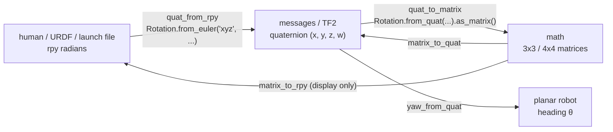

# 05.05 — 3D rotations in practice — matrices, roll-pitch-yaw and quaternions

<!-- glance:start -->
<!-- generated by tools/build.py from curriculum/syllabus.yaml — edit the syllabus, not this block -->

| | |
|---|---|
| **Track** | Main path |
| **Difficulty** | Intermediate |
| **Time** | 1 h 15 min |
| **Hardware** | none |
| **Software** | python, numpy, scipy |
| **Prerequisites** | [05.04 Homogeneous transforms in 2D and 3D](05.04-homogeneous-transforms.md) |
| **Optional prerequisites** | [FM.10 Rotation matrices](../optional-foundations/mathematics/FM.10-rotation-matrices.md)<br>[FM.11 Euler angles, roll-pitch-yaw and gimbal lock](../optional-foundations/mathematics/FM.11-euler-angles.md)<br>[FM.12 Quaternions without the mysticism](../optional-foundations/mathematics/FM.12-quaternions.md) |
| **Skip if** | You convert between RPY, matrices and quaternions without sign or order bugs. |

<!-- glance:end -->

## What you will learn

- Predict which way a positive roll, pitch or yaw turns karmel, and why rotation order matters in 3D.
- Convert ROS roll-pitch-yaw (fixed axes x-y-z, the same as intrinsic Z-Y-X) to a matrix and back, and write the matching `scipy` call without guessing.
- Read and build quaternions, get the yaw of a planar robot out of one, and compose them in the right order.
- Keep quaternion component order straight: ROS and scipy use (x, y, z, w); many other libraries use (w, x, y, z).
- Recognise gimbal lock and the three classic rotation bugs (sequence string, degrees, component order) from their symptoms.

## Why it matters

2D had one angle. 3D has three, and every tool picks a different way to write them. karmel's URDF writes the camera optical frame as `rpy="-1.5708 0 -1.5708"`. TF2 sends it as the quaternion `(-0.5, 0.5, -0.5, 0.5)`. The IMU driver publishes a quaternion ([07.06](../07-sensors/07.06-imu-in-ros2.md)). Odometry gives you a quaternion when all you want is a heading ([09.07](../09-odometry/09.07-odometry-in-ros2.md)). A tilted camera needs a pitch. An arm's gripper needs all three ([14.04](../14-robotic-arm/14.04-forward-kinematics.md)). These are all the same few rotations written differently, and a mistake in one argument order sends the robot the wrong way while every number looks reasonable.

This lesson is about getting conversions right in practice. The deeper "why" of Euler angles and quaternions is in the foundations.

> [!NOTE]
> New to rotation matrices, Euler angles or quaternions? → [FM.10 Rotation matrices](../optional-foundations/mathematics/FM.10-rotation-matrices.md), [FM.11 Euler angles and gimbal lock](../optional-foundations/mathematics/FM.11-euler-angles.md), [FM.12 Quaternions without the mysticism](../optional-foundations/mathematics/FM.12-quaternions.md). Skip them if you already know them.

<!-- prereqs:start -->
## Prerequisites

You need these first:

- [05.04 Homogeneous transforms in 2D and 3D](05.04-homogeneous-transforms.md)

### Optional prerequisite links

New to any of these? Take the foundation lesson first; skip it if you already know it.

- [FM.10 Rotation matrices](../optional-foundations/mathematics/FM.10-rotation-matrices.md)
- [FM.11 Euler angles, roll-pitch-yaw and gimbal lock](../optional-foundations/mathematics/FM.11-euler-angles.md)
- [FM.12 Quaternions without the mysticism](../optional-foundations/mathematics/FM.12-quaternions.md)

Check your readiness: `python course.py why 05.05`
<!-- prereqs:end -->

## Concept

### Three ways to write "which way is it pointing"

Think of three serializations of the same object:

- **Rotation matrix** (3×3): the columns are the child's axes seen from the parent (the 05.03 rule, unchanged). Unambiguous, great for math, 9 numbers for 3 degrees of freedom, and easy to break by rounding (05.04).
- **Roll, pitch, yaw** (3 angles): human-friendly. "Tilted down 15°" is one number. But ambiguous: which axes, in which order, fixed or moving? And it breaks down at pitch ±90° (gimbal lock).
- **Quaternion** (4 numbers, unit length): the storage and transport format. No gimbal lock, cheap to compose and interpolate, but unreadable by humans and with two competing component orders.

The practical workflow is: **humans write rpy, the wire carries quaternions, the math uses matrices.** Convert at the edges with a library, never by hand-copying numbers.

### What the three angles mean on karmel (REP-103: x forward, y left, z up)

Rotations are positive by the right-hand rule: thumb along the axis, fingers curl in the positive direction.

- **Yaw** (about z, up): positive turns **left**. The only one a flat robot uses.
- **Pitch** (about y, left): positive tips the **nose down**. Counter-intuitive, and the source of many sign bugs with tilted cameras and ramps.
- **Roll** (about x, forward): positive lifts the **left side up** (right side down).

> [!TIP]
> **Ask your teacher:** "Hold up your right hand as REP-103 axes and walk me through positive roll, pitch and yaw for a robot, a drone and a camera."

## Technical explanation

### Level 1 — Order matters in 3D

In 2D, turning 30° then 60° equals turning 60° then 30°. In 3D it doesn't. Take a frame, rotate it 90° about z, then 90° about y (both about the **fixed** parent axes):

- $R_z(90°)\,R_y(90°)$: the child's x axis ends up pointing **down**, $(0, 0, -1)$.
- $R_y(90°)\,R_z(90°)$: the child's x axis ends up pointing **left**, $(0, 1, 0)$.

Same two rotations, different result. That is why every Euler-angle convention must say which order and which axes. `python 05-frames-and-transforms/code/frames_lab.py rpy` draws both in the bottom-right panels of `rpy.png`.

### Level 2 — Practical: the ROS roll-pitch-yaw convention

ROS (URDF `rpy`, `tf2::Quaternion::setRPY`, `static_transform_publisher --roll --pitch --yaw`) uses:

$$R = R_z(\text{yaw})\;R_y(\text{pitch})\;R_x(\text{roll})$$

Two equivalent readings of that one formula:

- **Fixed (extrinsic) axes, right to left:** roll about the parent's x, then pitch about the parent's y, then yaw about the parent's z. "Fixed XYZ".
- **Moving (intrinsic) axes, left to right:** yaw about z, then pitch about the *new* y, then roll about the *newest* x. "Intrinsic ZYX", the aircraft convention.

With $c_\alpha = \cos\alpha$, $s_\alpha = \sin\alpha$:

$$R_x(r) = \begin{bmatrix} 1 & 0 & 0 \\ 0 & c_r & -s_r \\ 0 & s_r & c_r \end{bmatrix},\quad R_y(p) = \begin{bmatrix} c_p & 0 & s_p \\ 0 & 1 & 0 \\ -s_p & 0 & c_p \end{bmatrix},\quad R_z(y) = \begin{bmatrix} c_y & -s_y & 0 \\ s_y & c_y & 0 \\ 0 & 0 & 1 \end{bmatrix}$$

**Numerical example.** rpy = (30°, 45°, 90°):

$$R = \begin{bmatrix} 0.0000 & -0.8660 & 0.5000 \\ 0.7071 & 0.3536 & 0.6124 \\ -0.7071 & 0.3536 & 0.6124 \end{bmatrix}$$

The first column says the child's x axis points to $(0, 0.7071, -0.7071)$: turned left 90° (yaw) and tipped 45° down (pitch). Positive pitch is nose down, as promised.

**Extracting rpy from a matrix** (valid while $|\text{pitch}| < 90°$):

$$\text{pitch} = \arcsin(-R_{31}),\qquad \text{roll} = \operatorname{atan2}(R_{32}, R_{33}),\qquad \text{yaw} = \operatorname{atan2}(R_{21}, R_{11})$$

On the matrix above: $\arcsin(0.7071) = 45°$, $\operatorname{atan2}(0.3536, 0.6124) = 30°$, $\operatorname{atan2}(0.7071, 0) = 90°$.

**The same thing in scipy** ([`scipy.spatial.transform.Rotation`](https://docs.scipy.org/doc/scipy/reference/generated/scipy.spatial.transform.Rotation.html)). The sequence string encodes the convention: **lowercase = fixed/extrinsic, uppercase = moving/intrinsic**.

| Call | Same as ROS rpy(30°, 45°, 90°)? |
|---|---|
| `Rotation.from_euler("xyz", [30, 45, 90], degrees=True)` | **yes** (fixed x, y, z; angles in roll, pitch, yaw order) |
| `Rotation.from_euler("ZYX", [90, 45, 30], degrees=True)` | **yes** (moving Z, Y, X; angles in yaw, pitch, roll order) |
| `Rotation.from_euler("XYZ", [30, 45, 90], degrees=True)` | **no**: it equals ROS rpy (45°, −30°, 90°) |
| `Rotation.from_euler("xyz", [0, 0, 90])` (no `degrees=True`) | **no**: 90 **radians**, i.e. yaw 116.62° |

**karmel's camera optical frame.** URDF `rpy="-1.5708 0 -1.5708"`, i.e. $R = R_z(-90°)\,R_x(-90°)$. Multiply out and you get exactly the matrix 05.04 built from "columns are axes": $\begin{bmatrix} 0 & 0 & 1 \\ -1 & 0 & 0 \\ 0 & -1 & 0\end{bmatrix}$. Two routes, one rotation.

### Level 2 — Practical: quaternions

A rotation by angle $\theta$ about the unit axis $\hat n = (n_x, n_y, n_z)$ is the unit quaternion

$$q = \big(\underbrace{n_x \sin\tfrac{\theta}{2},\ n_y \sin\tfrac{\theta}{2},\ n_z \sin\tfrac{\theta}{2}}_{x,\ y,\ z},\ \underbrace{\cos\tfrac{\theta}{2}}_{w}\big), \qquad x^2+y^2+z^2+w^2 = 1$$

**Planar robots** only ever rotate about z, so $q = (0, 0, \sin\frac{\text{yaw}}{2}, \cos\frac{\text{yaw}}{2})$:

| yaw | quaternion (x, y, z, w) |
|---|---|
| 0° | (0, 0, 0, 1), the identity. A message with all zeros is **not** a rotation. |
| 45° | (0, 0, 0.3827, 0.9239) |
| 90° | (0, 0, 0.7071, 0.7071): karmel in the running example |
| −90° | (0, 0, −0.7071, 0.7071) |
| 180° | (0, 0, 1, 0) |

And back, for any quaternion (this is `frames_math.yaw_from_quat`):

$$\text{yaw} = \operatorname{atan2}\big(2(wz + xy),\ 1 - 2(y^2 + z^2)\big)$$

For $(0, 0, 0.3827, 0.9239)$: $\operatorname{atan2}(2\cdot0.9239\cdot0.3827,\ 1 - 2\cdot0.3827^2) = \operatorname{atan2}(0.7071, 0.7071) = 45°$.

**Properties you rely on:**

- **$q$ and $-q$ are the same rotation** ("double cover"): $\theta$ about $\hat n$ equals $360° - \theta$ about $-\hat n$. Never compare quaternions with `==`; compare $|q_1\cdot q_2| \approx 1$ or compare matrices.
- **Composition is multiplication, in matrix order**: $R(q_1 q_2) = R(q_1)\,R(q_2)$. Yaw 30° times yaw 60° is yaw 90°: $(0, 0, 0.7071, 0.7071)$. Yaw 90° followed by roll 90° about the moving x is $(0.5, 0.5, 0.5, 0.5)$, which is 120° about $(1,1,1)/\sqrt3$. Not obvious from the angles; obvious from the math.
- **Always normalize** quaternions from the outside world. scipy normalizes silently; `frames_math.quat_to_matrix` normalizes and rejects all-zeros.
- **Interpolate with slerp**, not by averaging components. Halfway between yaw 170° and −170° is 180°. Averaging the components of $(0, 0, 0.9962, 0.0872)$ and $(0, 0, -0.9962, 0.0872)$ gives $(0, 0, 0, 0.0872)$, which normalizes to **yaw 0°**: the opposite direction.

**karmel's optical frame as a quaternion:** rpy(−90°, 0, −90°) → **(−0.5, 0.5, −0.5, 0.5)**. That is exactly what `tf2_echo base_link camera_optical_frame` prints in [05.07](05.07-tf2-broadcast-listen.md).

### Level 3 — Mathematics: gimbal lock and component order

**Gimbal lock.** At pitch = ±90°, the first and last rotation axes line up, so only (yaw − roll) is determined (for +90°). Concretely, rpy(10°, 90°, 20°) and rpy(0°, 90°, 10°) are the same matrix, and any extraction formula must pick one (`matrix_to_rpy` returns roll = 0). Near ±90°, tiny matrix changes cause huge rpy jumps. That is why IMU filters, arms and drones carry quaternions or matrices internally and only produce rpy for display. A ground robot never pitches 90°, so for karmel rpy is safe for configuration.

**Quaternion component order is not standardized.** The math is identical; the array layout differs:

| Order | Used by |
|---|---|
| **(x, y, z, w)** scalar last | ROS messages (`geometry_msgs/Quaternion` fields x, y, z, w; default w = 1), `tf2_echo` output, `static_transform_publisher --qx --qy --qz --qw`, scipy `as_quat()` / `from_quat()` by default, PyBullet |
| **(w, x, y, z)** scalar first | scipy with `scalar_first=True` (SciPy ≥ 1.14), transforms3d, MuJoCo, Eigen's `Quaternion(w, x, y, z)` constructor (whose `coeffs()` returns x, y, z, w!), many graphics and simulation APIs |

Check the documentation of every API that takes or returns a quaternion as a plain array. Named fields (`q.w`) are safe; arrays are not.

**What the order bug looks like.** Take karmel's yaw-90° quaternion `[0, 0, 0.7071, 0.7071]` (x, y, z, w) and hand it to an API that expects (w, x, y, z). It reads w = 0, x = 0, y = 0.7071, z = 0.7071: a 180° rotation about $(0, 0.7071, 0.7071)$. As ROS rpy that is **(90°, 0°, 180°)**. The robot model appears lying on its side facing backward: forward $(1, 0, 0)$ maps to $(-1, 0, 0)$. If a model is upside down or backward in RViz, check component order first.

### Level 4 — Implementation: which tool for which job

- **Configuration** (URDF, YAML, launch arguments): rpy in radians, a few decimals are fine because they're converted exactly at load time.
- **Messages and storage:** quaternions, normalized.
- **Computation:** matrices (or `scipy.spatial.transform.Rotation` objects, which convert lazily).
- **Heading of a planar robot:** `yaw_from_quat`, then work in 2D ([05.02](05.02-pose-in-2d.md)).
- **Python in ROS 2 Jazzy:** tf2's Python API has no `quaternion_from_euler`. Options: write the 8-line formula (the course's `course_tf_examples/tf_math.py` does), use scipy, or install `tf_transformations` (not on the default Jazzy image). The module's [`code/frames_math.py`](code/frames_math.py) has `quat_from_rpy`, `quat_to_matrix`, `matrix_to_quat`, `yaw_from_quat`, `quat_multiply` and the order helpers `xyzw_to_wxyz` / `wxyz_to_xyzw`, all tested against scipy.

## Diagram

```text
  REP-103 axes and positive rotations (right-hand rule)

                 z (up)                     yaw   + : turn LEFT
                 ▲   ↺ yaw                  pitch + : nose DOWN
                 │                          roll  + : LEFT side UP
                 │
                 ●───────► x (forward)  ↻ roll (about x)
                ╱
               ╱  ↺ pitch (about y)
              ▼
           y (left)

  ROS rpy:  R = Rz(yaw) · Ry(pitch) · Rx(roll)
            ─ read right→left: rotate about FIXED x, then y, then z
            ─ read left→right: rotate about MOVING z, then y', then x''
```



## Code

[`code/rotations_demo.py`](code/rotations_demo.py) demonstrates every claim of this lesson with scipy and `frames_math` (tested by `code/test_rotations_demo.py`). The core of the convention check:

```python
roll, pitch, yaw = rad(30), rad(45), rad(90)
R_ros = fm.rpy_to_matrix(roll, pitch, yaw)
for seq, angles in (("xyz", [30, 45, 90]), ("ZYX", [90, 45, 30]), ("XYZ", [30, 45, 90])):
    R = Rotation.from_euler(seq, angles, degrees=True).as_matrix()
    rpy = [round(deg(a), 2) for a in fm.matrix_to_rpy(R)]
    print(f"scipy from_euler({seq!r}, {angles}) == ROS rpy(30, 45, 90)? {np.allclose(R, R_ros)}"
          f"  -> as ROS rpy {rpy}")
```

Run `python 05-frames-and-transforms/code/rotations_demo.py`:

```text
pitch +15 deg moves the x axis to [ 0.9659  0.     -0.2588] (nose DOWN)
roll  +10 deg moves the y axis to [0.     0.9848 0.1736] (left side UP)
Rz(90) @ Ry(90): child x -> [ 0.  0. -1.]
Ry(90) @ Rz(90): child x -> [ 0.  1. -0.]
scipy from_euler('xyz', [30, 45, 90]) == ROS rpy(30, 45, 90)? True  -> as ROS rpy [30.0, 45.0, 90.0]
scipy from_euler('ZYX', [90, 45, 30]) == ROS rpy(30, 45, 90)? True  -> as ROS rpy [30.0, 45.0, 90.0]
scipy from_euler('XYZ', [30, 45, 90]) == ROS rpy(30, 45, 90)? False  -> as ROS rpy [45.0, -30.0, 90.0]
forgot degrees=True: from_euler('xyz', [0, 0, 90]) is yaw 116.62 deg
yaw 90 deg quaternion (x, y, z, w): [0.     0.     0.7071 0.7071]  scalar_first: [0.7071 0.     0.     0.7071]
camera_link -> camera_optical_frame, rpy(-90, 0, -90) deg: [-0.5  0.5 -0.5  0.5]
yaw of (0, 0, 0.3827, 0.9239): 45.0 deg
q and -q are the same rotation: True
q(yaw 30) * q(yaw 60) = [0.     0.     0.7071 0.7071] = yaw 90.0
yaw 90 then roll 90 (moving axes) = [0.5 0.5 0.5 0.5] = 120 deg about (1,1,1)/sqrt3: [0.5 0.5 0.5 0.5]
yaw 90 read in the wrong order -> rpy [ 90.   0. 180.] forward axis -> [-1.  0.  0.]
rpy(10, 90, 20) == rpy(0, 90, 10)? True  matrix_to_rpy returns [0.0, 90.0, 10.0]
slerp halfway 170 -> -170: [  0.   0. 180.]  naive component average -> [0. 0. 0.]
```

Visualize the rotations:

```bash
python 05-frames-and-transforms/code/frames_lab.py rpy
```

`rpy.png` has six 3D panels, thin axes for the parent and thick for the child: identity; after roll 30° (blue z tipped toward −y); after pitch 45° (red x tipped **down**); the full ROS rpy(30°, 45°, 90°) (red x pointing left and down); and the two "order matters" panels where the red x axis points down in one and left in the other.

## Exercise

All exercises need hardware: none.

### Exercise 05.05-E1 — Quaternions of a flat robot `[numerical]`

By hand: the quaternions for yaw 45°, −90° and 180°. Then the yaw of $(0, 0, -0.3827, 0.9239)$ and of $(0, 0, -0.9239, -0.3827)$. Check with `quat_from_yaw` and `yaw_from_quat`. Are the last two the same heading?

### Exercise 05.05-E2 — Which way does it point? `[predict]`

**Predict** before running, as a direction in words and as a vector: where does karmel's forward axis $(1, 0, 0)$ point after (a) pitch +20°, (b) roll +90°, (c) ROS rpy(0°, 90°, 90°), (d) $R_y(90°)\,R_z(90°)$? Then verify with `frames_math`.

### Exercise 05.05-E3 — Translate conventions into scipy `[coding]`

Write a function `ros_rpy_to_scipy(roll, pitch, yaw) -> Rotation` and a test that compares it with `frames_math.rpy_to_matrix` on 500 random angles. Then write a second test that **demonstrates** (asserts not-equal) that `from_euler("XYZ", [roll, pitch, yaw])` differs for at least 99% of random samples. Finally make a quaternion round trip: ROS (x, y, z, w) → scipy `Rotation` → scipy `as_quat(scalar_first=True)` → `frames_math.wxyz_to_xyzw` → identical to the start (up to sign).

### Exercise 05.05-E4 — The robot is lying on its side `[debugging]`

A teammate's visualization shows karmel facing **backward** and rolled 90°. The pose came from `/odom` (yaw 90° in reality) and was converted like this:

```python
q = [msg.pose.pose.orientation.x, msg.pose.pose.orientation.y,
     msg.pose.pose.orientation.z, msg.pose.pose.orientation.w]
R = Rotation.from_quat(q, scalar_first=True).as_matrix()
```

Explain the bug, predict the rpy they see, and fix it two different ways.

### Exercise 05.05-E5 — Tilt the camera down `[numerical]`

karmel's camera is re-mounted tilted **down** 15° (same position $(0.10, 0, 0.10)$). (a) Which rpy goes into `T_base_link_camera_link`: pitch +15° or −15°? (b) Compute the new `T_base_link_camera_optical_frame` rotation as a quaternion (x, y, z, w) and as ROS rpy. (c) The camera reports the same bottle reading $(0.05, -0.02, 0.60)$. Where is the bottle in base_link now, and what does its z tell you about the object?

### Exercise 05.05-E6 — Gimbal lock in numbers `[predict]`

**Predict** whether rpy(25°, 90°, 35°) is the same rotation as rpy(0°, 90°, 10°), and what `matrix_to_rpy` returns for it. Then verify, and find a second rpy triple with pitch 90° that gives the same matrix.

## Expected result

- **05.05-E1:** yaw 45° → **(0, 0, 0.3827, 0.9239)**; −90° → **(0, 0, −0.7071, 0.7071)**; 180° → **(0, 0, 1, 0)**. $(0, 0, -0.3827, 0.9239)$ → **−45°**. $(0, 0, -0.9239, -0.3827)$ → $\operatorname{atan2}(2\cdot(-0.3827)(-0.9239), 1 - 2\cdot 0.8536) = \operatorname{atan2}(0.7071, -0.7071) =$ **135°**. Not the same heading (a common guess is that one is the negative of the other; it isn't: $-(0, 0, -0.3827, 0.9239) = (0, 0, 0.3827, -0.9239)$, which is again −45°).
- **05.05-E2:** (a) forward and **down**: **(0.9397, 0, −0.3420)**. (b) roll doesn't move the x axis: **(1, 0, 0)**. (c) $R_z(90°)R_y(90°)$: x points straight **down**, **(0, 0, −1)**. (d) **(0, 1, 0)**, left.
- **05.05-E3:** `Rotation.from_euler("xyz", [roll, pitch, yaw])` passes all 500. The "XYZ" test shows differences in 100% of samples (equality only on measure-zero special cases). The quaternion round trip matches up to sign.
- **05.05-E4:** The ROS message is (x, y, z, w) but `scalar_first=True` reads it as (w, x, y, z). They see rpy **(90°, 0°, 180°)**: forward maps to $(-1, 0, 0)$. Fix 1: `Rotation.from_quat(q)` (the default is scalar-last). Fix 2: build it with named fields: `from_quat([o.w, o.x, o.y, o.z], scalar_first=True)`, or `frames_math.quat_to_matrix([o.x, o.y, o.z, o.w])`.
- **05.05-E5:** (a) **pitch +15°** (positive pitch is nose down). (b) quaternion **(−0.5610, 0.5610, −0.4305, 0.4305)**, rpy **(−105°, 0°, −90°)**. (c) **(0.6847, −0.0500, −0.0360)**: 3.6 cm below base_link, i.e. $0.045 - 0.036 = 0.009$ m above the floor. The camera is looking at the base of a bottle standing on the floor, not at its middle.
- **05.05-E6:** **Yes**, same rotation ($35° - 25° = 10°$). `matrix_to_rpy` returns **(0°, 90°, 10°)**. Any (r, 90°, r + 10°) works, for example (50°, 90°, 60°).

<details><summary>Reference solution for 05.05-E3</summary>

```python
"""05-frames-and-transforms/code/test_my_conventions.py"""
import numpy as np
import pytest
from scipy.spatial.transform import Rotation

import frames_math as fm


def ros_rpy_to_scipy(roll: float, pitch: float, yaw: float) -> Rotation:
    return Rotation.from_euler("xyz", [roll, pitch, yaw])


rng = np.random.default_rng(7)
SAMPLES = [(rng.uniform(-3, 3), rng.uniform(-1.5, 1.5), rng.uniform(-3, 3)) for _ in range(500)]


def test_matches_ros() -> None:
    for rpy in SAMPLES:
        assert ros_rpy_to_scipy(*rpy).as_matrix() == pytest.approx(fm.rpy_to_matrix(*rpy))


def test_uppercase_is_different() -> None:
    different = sum(not np.allclose(Rotation.from_euler("XYZ", rpy).as_matrix(), fm.rpy_to_matrix(*rpy))
                    for rpy in SAMPLES)
    assert different >= 0.99 * len(SAMPLES)


def test_quaternion_order_round_trip() -> None:
    for rpy in SAMPLES:
        q_ros = fm.quat_from_rpy(*rpy)                                   # (x, y, z, w)
        wxyz = Rotation.from_quat(q_ros).as_quat(scalar_first=True)      # (w, x, y, z)
        back = fm.wxyz_to_xyzw(wxyz)
        assert np.allclose(back, q_ros) or np.allclose(back, -q_ros)
```

Run: `python -m pytest 05-frames-and-transforms/code/test_my_conventions.py`
</details>

## Troubleshooting

### Symptom: the robot model or a sensor appears upside down, sideways or backward

1. Print the quaternion **and** its rpy from `tf2_echo` or your code. If w is ~0 and the heading should be small, the order is swapped.
2. Check the norm: $x^2+y^2+z^2+w^2$ should be 1. All zeros means an uninitialized orientation (ROS 2 defaults w to 1, but a hand-built array doesn't).
3. For a configured rpy: are the values in radians? `rpy="0 0 90"` in a URDF is 90 radians (116.62° after wrapping).

### Symptom: a tilted camera points up instead of down (or a ramp angle has the wrong sign)

1. Remember: positive pitch = nose **down** in REP-103. Apply `rot_y(pitch) @ [1, 0, 0]` and check the z of the result is negative for "down".
2. If your data is in an optical frame, the tilt belongs in `T_base_link_camera_link`, not in the optical rotation.

### Symptom: scipy and ROS disagree on the same three angles

1. Check the sequence string case: `"xyz"` (fixed) matches ROS rpy; `"XYZ"` (moving) doesn't.
2. Check the angle order matches the sequence: `"ZYX"` expects `[yaw, pitch, roll]`.
3. Check `degrees=True`.

### Symptom: orientation estimates jump by ~180° or rpy flickers wildly

1. If pitch is near ±90°, you are in gimbal lock: rpy is not usable there. Work with quaternions or matrices.
2. If you average or low-pass quaternions component-wise, first flip each to the same hemisphere as the reference ($q \leftarrow -q$ if $q\cdot q_{\text{ref}} < 0$) or use slerp.

## Common mistakes

- **Degrees in rpy.** URDF, TF2, scipy (by default) and `frames_math` all use radians.
- **`"XYZ"` instead of `"xyz"` in scipy.** Case changes the convention.
- **Array quaternions in the wrong order.** Use named fields or convert explicitly with `xyzw_to_wxyz`.
- **Comparing quaternions with `==`.** $q$ and $-q$ are equal rotations.
- **Averaging quaternion components.** Use slerp, or at least align signs first.
- **Using rpy for internal state.** Gimbal lock and wrap-around make it unfit for filters and controllers in 3D.
- **Writing a URDF rpy for an optical frame "by feel".** Build it from columns-are-axes, then convert, then check with one test vector.

## Knowledge check

1. In the ROS rpy convention, write the rotation as a product of elementary rotations, and state both ways to read it.
   <details><summary>Answer</summary>

   $R = R_z(\text{yaw})R_y(\text{pitch})R_x(\text{roll})$. Right to left about fixed axes: roll about x, pitch about y, yaw about z. Left to right about moving axes: yaw, then pitch about the new y, then roll about the newest x.
   </details>

2. karmel drives up a ramp, nose up by 8°. What is its pitch in REP-103?
   <details><summary>Answer</summary>

   −8° (≈ −0.1396 rad). Positive pitch is nose down.
   </details>

3. Write the quaternion (x, y, z, w) for yaw −45°.
   <details><summary>Answer</summary>

   $(0, 0, \sin(-22.5°), \cos(-22.5°)) = (0, 0, -0.3827, 0.9239)$.
   </details>

4. Predict: a message arrives with orientation (0, 0, 0, 0). What does `Rotation.from_quat` do, and what should your code do?
   <details><summary>Answer</summary>

   scipy raises `ValueError` (it can't normalize a zero vector). Your code should reject or log it: the publisher forgot to set w = 1. `frames_math.quat_to_matrix` raises too.
   </details>

5. Why can't you recover roll and yaw separately at pitch = 90°?
   <details><summary>Answer</summary>

   After pitching 90°, the roll axis lines up with the original yaw axis. Rotating by roll or by yaw does the same thing, so only their difference (for +90°) is determined: gimbal lock.
   </details>

6. Debugging: `Rotation.from_euler("xyz", [0, 0, 90]).as_quat()` returns `[0, 0, 0.8509, 0.5253]` instead of `[0, 0, 0.7071, 0.7071]`. What happened?
   <details><summary>Answer</summary>

   The angles were interpreted as radians: 90 rad ≈ 116.6° after wrapping. Add `degrees=True` or pass `math.radians(90)`.
   </details>

7. You have `q_map_base` (base_link in map) and `q_base_imu` (IMU mount). Which product gives the IMU's orientation in map, and why that order?
   <details><summary>Answer</summary>

   `q_map_imu = q_map_base * q_base_imu`. Quaternion products follow the same order as matrices and the cancel rule from 05.03.
   </details>

## Practical challenge

karmel's IMU was glued **upside down** under the top plate (rotated 180° about x relative to `imu_link` in the URDF) and nobody updated the URDF. Using only `frames_math` and scipy:

1. Compute what the accelerometer reads at rest in its real frame (gravity reaction is $+9.81$ m/s² "up" in a correctly mounted sensor).
2. Simulate karmel turning left at 0.5 rad/s for 4 s and compute what the gyro z axis reports in the flipped sensor.
3. Write a function that detects the flip from 2 s of stationary data and returns the corrected `T_base_link_imu_link` rpy.
4. Draw the correct and the flipped IMU frames on karmel with `frames_lab.draw_frame_3d`.

**Acceptance criteria:** the stationary reading is $(0, 0, -9.81)$; the gyro reports $-0.5$ rad/s; your detector returns rpy $(\pi, 0, 0)$ (or equivalent) and a unit test proves that transforming the flipped readings with it restores $(0, 0, 9.81)$ and $+0.5$ rad/s; the PNG shows the flipped frame's blue z axis pointing down.

## You can skip this if…

You answer knowledge-check questions 2, 6 and 7 correctly without looking and solve Exercises E4 and E5 in under ten minutes.

`python course.py skip 05.05 --reason "I convert between RPY, matrices and quaternions without sign or order bugs"`

## Go deeper

- SciPy `Rotation`: https://docs.scipy.org/doc/scipy/reference/generated/scipy.spatial.transform.Rotation.html — `from_euler` sequence rules (lowercase extrinsic, uppercase intrinsic), `as_quat(scalar_first=...)`, and composition.
- ROS 2 Jazzy, Quaternion fundamentals: https://docs.ros.org/en/jazzy/Tutorials/Intermediate/Tf2/Quaternion-Fundamentals.html — ROS's (x, y, z, w) order, normalization, and applying/inverting rotations in tf2.
- REP-103: https://www.ros.org/reps/rep-0103.html — rotation representation preferences and axis conventions.
- Ben Eater and 3Blue1Brown, Visualizing quaternions: https://eater.net/quaternions — the best intuition for why quaternions work; interactive.
- Wikipedia, Euler angles: https://en.wikipedia.org/wiki/Euler_angles — the zoo of conventions, with the intrinsic/extrinsic equivalence stated precisely.
- Solà, "Quaternion kinematics for the error-state Kalman filter": https://arxiv.org/abs/1711.02508 — the reference for Hamilton vs JPL quaternion conventions; read before IMU fusion in module 10.

## Progress checkpoint

- [ ] I predict the direction of positive roll, pitch and yaw on karmel.
- [ ] I convert ROS rpy ↔ matrix ↔ quaternion and write the correct scipy call.
- [ ] I extract yaw from a quaternion and compose quaternions in the right order.
- [ ] I never pass a quaternion array without checking (x, y, z, w) vs (w, x, y, z).
- [ ] I can explain gimbal lock with a numerical example.

`python course.py complete 05.05` (exercises done) · `python course.py master 05.05` (challenge done) · `python course.py struggle 05.05 "what was hard"`

Next: [05.06 — Robot frame conventions: REP-103 and REP-105](05.06-frame-conventions-rep103-rep105.md).
