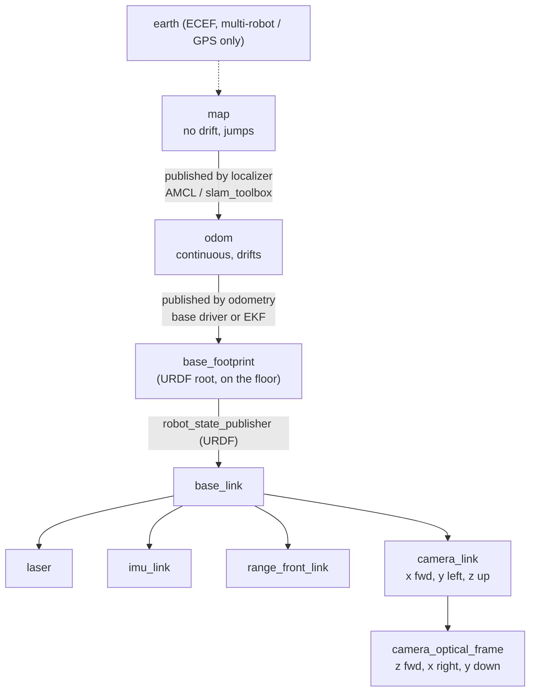

# 05.06 — Robot frame conventions: REP-103 and REP-105 (map, odom, base_link, optical frames)

<!-- glance:start -->
<!-- generated by tools/build.py from curriculum/syllabus.yaml — edit the syllabus, not this block -->

| | |
|---|---|
| **Track** | Main path |
| **Difficulty** | Intermediate |
| **Time** | 45 min |
| **Hardware** | none |
| **Software** | none |
| **Prerequisites** | [05.05 3D rotations in practice — matrices, roll-pitch-yaw and quaternions](05.05-rotations-in-3d.md) |
| **Skip if** | You can explain why map→odom jumps and odom→base_link never does. |

<!-- glance:end -->

## What you will learn

- Apply REP-103: SI units, right-handed axes with x forward, y left, z up, and the `_optical` convention (z forward, x right, y down).
- Name and place every standard mobile-robot frame: `map`, `odom`, `base_footprint`, `base_link`, `laser`, `imu_link`, `camera_link`, `camera_optical_frame`, and an arm's flange and tool (TCP) frames.
- Explain why `map → odom` jumps while `odom → base_link` is continuous, and which node owns each transform.
- Compute the `map → odom` correction a localizer publishes from its pose estimate and the odometry.
- Diagnose frame bugs from their symptoms: two parents, the wrong frame for a controller, and optical data labelled as `camera_link`.

## Why it matters

Every ROS package you will use (the LiDAR driver in [07.07](../07-sensors/07.07-2d-lidar.md), odometry in [09.07](../09-odometry/09.07-odometry-in-ros2.md), `robot_localization` in [10.07](../10-localization/10.07-fusing-imu-and-odometry.md), AMCL in [10.09](../10-localization/10.09-amcl-in-ros2.md), slam_toolbox in [11.06](../11-slam/11.06-slam-toolbox-simulation.md), Nav2 in [12.06](../12-navigation/12.06-nav2-architecture.md)) assumes the same frame **names** and the same **meaning** for them. That shared contract is what lets you plug a SLAM package written in Germany onto a robot base built in Israel. Break the contract and nothing crashes; the robot just drives into walls or its map smears.

The contract is two short documents: REP-103 (units and axes) and REP-105 (the mobile-robot frame tree). The most important idea in them, and the one people get wrong, is the split between `map` and `odom`.

<!-- prereqs:start -->
## Prerequisites

You need these first:

- [05.05 3D rotations in practice — matrices, roll-pitch-yaw and quaternions](05.05-rotations-in-3d.md)

### Optional prerequisite links

None.

Check your readiness: `python course.py why 05.06`
<!-- prereqs:end -->

## Concept

### REP-103: one set of axes for everybody

- **Units:** metres, radians, seconds, kilograms. Never centimetres, degrees or milliseconds on a topic.
- **Axes:** right-handed. For anything with a body (robot, sensor, link): **x forward, y left, z up**. Positive rotation is counter-clockwise by the right-hand rule, so positive yaw turns left ([05.05](05.05-rotations-in-3d.md)).
- **Colours** in RViz and in this course's drawings: x red, y green, z blue.
- **Suffix frames:** cameras get a second frame with the `_optical` suffix using the image convention **z forward, x right, y down**. (Outdoor systems may add `_ned` frames: x north, y east, z down.)

### REP-105: two "world" frames, and why

Think of a pedestrian navigating a city with two tools:

- **A step counter and a compass** (odometry). Every step is measured precisely relative to the last one. Over a kilometre the errors add up and you are 50 m off. But the estimate never jumps: if you walked 1 m, it says 1 m.
- **Recognising landmarks** (localization). When you see the cathedral you *know* where you are on the city map. But that knowledge arrives now and then, and each time it "teleports" your estimate to the corrected position.

A robot needs both, for different jobs. A controller holding a lane 5 cm from a wall must never see a teleport: a sudden 20 cm jump in its position would make it swerve. A planner going to the kitchen needs the globally correct position and doesn't care about a jump. REP-105 gives each job its own frame:

- **`odom`**: world-fixed, where odometry started. The robot's pose in `odom` is **continuous** (no jumps) but **drifts** without bound. Use it for short-term, local work: controllers, local costmaps, obstacle tracking.
- **`map`**: world-fixed, aligned with the map. The robot's pose in `map` does **not drift**, but **jumps** whenever localization corrects it. Use it for global goals, the global costmap and anything you store for later.

### One parent per frame: why localization publishes `map → odom`

TF is a **tree**: every frame has exactly one parent. `base_link` already has a parent, `odom` (published by odometry). So the localizer can't also publish `map → base_link`. Instead it publishes the **correction** `map → odom`: "the odometry origin is *here* in the map". TF chains `map → odom → base_link` and everyone gets both views from one tree.

```text
   map ──(localizer: AMCL, slam_toolbox)──► odom ──(odometry: wheels, EKF)──► base_link
        jumps at each correction                  continuous, drifts
```

When odometry drifts, the localizer changes `map → odom` so that the chain still lands on the right place. `odom → base_link` is never touched by the localizer, so it stays smooth.

> [!TIP]
> **Ask your teacher:** "Replay the pedestrian analogy with karmel: which frame does the local controller use, which does the global planner use, and what does each see during an AMCL correction?"

## Technical explanation

### Level 1 — The karmel tree

| Frame | Parent | Published by | Changes? |
|---|---|---|---|
| `map` | (root) | — | — |
| `odom` | `map` | localizer (AMCL [10.09](../10-localization/10.09-amcl-in-ros2.md), slam_toolbox [11.06](../11-slam/11.06-slam-toolbox-simulation.md)) | jumps at each correction |
| `base_footprint` | `odom` | odometry (base driver [09.07](../09-odometry/09.07-odometry-in-ros2.md) or EKF [10.07](../10-localization/10.07-fusing-imu-and-odometry.md)) | continuous, ~20–50 Hz |
| `base_link` | `base_footprint` | robot_state_publisher from the URDF ([05.08](05.08-urdf-and-xacro.md)) | fixed: $z = 0.045$ m |
| `laser` | `base_link` | robot_state_publisher | fixed |
| `imu_link` | `base_link` | robot_state_publisher | fixed |
| `range_front_link` | `base_link` | robot_state_publisher | fixed |
| `camera_link` | `base_link` | robot_state_publisher | fixed |
| `camera_optical_frame` | `camera_link` | robot_state_publisher | fixed: rpy $(-\pi/2, 0, -\pi/2)$ |

Definitions worth memorising:

- **`base_link`**: rigidly attached to the robot base, at a point the robot designer picks. On karmel it is the midpoint between the drive wheels at axle height: the point a differential drive turns around.
- **`base_footprint`**: the projection of the robot onto the floor (z = 0, no roll or pitch relative to `odom`). Planners and 2D costmaps like it because it lives on the ground plane. It comes from REP-120 (humanoids) and is widely used for wheeled robots. REP-105 itself only names `base_link`: whether odometry publishes `odom → base_footprint` or `odom → base_link` is a per-robot choice, and it **must match the root of the URDF**. karmel's URDF root is `base_footprint`, so odometry must publish `odom → base_footprint`.
- **`earth`**: REP-105 also defines an ECEF `earth` frame above `map` for multi-robot, GPS-referenced systems. karmel doesn't need it.

### Level 2 — Practical: the frames of sensors and tools

**`laser`**: the LiDAR's scan plane origin. `sensor_msgs/LaserScan` angles are measured counter-clockwise from the laser frame's +x axis. If the sensor is mounted rotated (or its 0° direction is not where you assumed; check the datasheet), fix it in the `base_link → laser` transform, never by editing angles in the driver ([05.03](05.03-rigid-transforms-2d.md) E4).

**`imu_link`**: the IMU chip's axes. REP-145 requires the driver to report data in the sensor's frame; the mounting rotation goes in the URDF. An IMU glued upside down is a `base_link → imu_link` roll of $\pi$, not a sign flip in code.

**`camera_link` vs `camera_optical_frame`**: the camera has two frames at the **same origin**:

- `camera_link` follows the body convention (x forward, y left, z up) so it sits naturally in the URDF next to other links.
- `camera_optical_frame` follows the image convention (z forward along the optical axis, x right along image columns, y down along image rows). Pixel $(u, v)$ grows right and down, so optical x and y line up with image axes and depth is z. `sensor_msgs/Image`, `CameraInfo`, point clouds from depth cameras and detections all carry `frame_id: camera_optical_frame`.

The fixed rotation between them is the one you built twice already: columns $(0,-1,0)$, $(0,0,-1)$, $(1,0,0)$; rpy $(-\pi/2, 0, -\pi/2)$; quaternion $(-0.5, 0.5, -0.5, 0.5)$. A camera driver that labels its data with the wrong one of the two is the #1 source of "the point cloud is standing on the wall" bugs.

**Arm frames** ([14.01](../14-robotic-arm/14.01-arm-anatomy.md), [14.04](../14-robotic-arm/14.04-forward-kinematics.md)): an arm has `base_link` (or `arm_base_link`) at its mount, one frame per link, and at the end:

- **flange** (ROS-Industrial calls it `tool0`): the mounting face of the last joint, z pointing out of the flange. Defined by the arm maker, independent of what you bolt on.
- **tool / TCP (tool centre point)**: the point that actually does the work, e.g. between the gripper fingers. A fixed offset from the flange that **you** define when you mount a gripper. Grasp targets are poses of the TCP, not of the flange.

Example: the flange is at $(0.30, 0, 0.20)$ in the arm base, pitched 90°, so its z axis points forward (+x). The gripper's TCP is 0.12 m out along the flange z: ${}^{\text{flange}}T_{\text{tcp}} = (0, 0, 0.12)$. The TCP is at ${}^{\text{base}}T_{\text{flange}}\,(0, 0, 0.12) = (0.42, 0, 0.20)$. Command the flange to the bottle and the fingers will close 12 cm past it.

### Level 2 — Practical: computing `map → odom`

The localizer knows two things: its estimate ${}^{M}\hat T_{B}$ (robot in map) and the latest odometry ${}^{O}T_{B}$ (robot in odom, read from TF). It wants a ${}^{M}T_{O}$ such that ${}^{M}T_{O}\,{}^{O}T_{B} = {}^{M}\hat T_{B}$. Right-multiply by the inverse:

$${}^{M}T_{O} = {}^{M}\hat T_{B}\;\big({}^{O}T_{B}\big)^{-1}$$

This is literally what AMCL and slam_toolbox do (REP-105's "frame authorities" section describes the same subtraction).

**Worked example.** karmel has driven 4 m along odometry: ${}^{O}T_{B} = (4.0, 0.0, 0°)$. Until now ${}^{M}T_{O}$ was the identity, so the robot appeared at $(4.0, 0.0, 0°)$ in the map. A scan match says the robot is really at ${}^{M}\hat T_{B} = (3.8, 0.3, 5°)$ (wheels slipped a bit and it drifted left). Then

$${}^{M}T_{O} = (3.8, 0.3, 5°)\,(4.0, 0.0, 0°)^{-1} = (3.8, 0.3, 5°)\,(-4.0, 0.0, 0°) = (-0.1848, -0.0486, 5°)$$

(compose formula from 05.03: $x = 3.8 + \cos5°\cdot(-4.0) = -0.1848$, $y = 0.3 + \sin5°\cdot(-4.0) = -0.0486$).

- In `map`, the robot **jumps** from $(4.0, 0.0, 0°)$ to $(3.8, 0.3, 5°)$: 36 cm and 5° in one update.
- In `odom`, nothing happened: still $(4.0, 0.0, 0°)$.
- 0.5 m later, odometry says $(4.5, 0.0, 0°)$ and the chain gives $(4.2981, 0.3436, 5°)$ in map. The correction keeps being applied until the next one.

### Level 3 — Why the split is the right design

**Requirements from consumers.** A PID heading controller differentiates its error. A 5° step in the input is a spike in the derivative term and a jerk in the wheels ([08.06](../08-control/08.06-derivative-control.md)). A local costmap accumulates obstacle observations over seconds; if its frame jumps, old obstacles land in the wrong place and the costmap smears. These consumers need **continuity** and accept drift over seconds. A global planner needs **global accuracy** and tolerates discontinuity. No single frame can provide both, so REP-105 provides two.

**Ownership.** Each transform has one authority. Odometry never knows about the map; the localizer never publishes robot motion. That is single-writer ownership, the same reason you don't let two services write the same database row. Two publishers for one child frame is not a merge: TF2 keeps whichever message arrived most recently, and the result flickers or silently disconnects part of the tree (see Troubleshooting).

**Latency tolerance.** A localizer is slow (AMCL: a few Hz, and each estimate is for a scan that is already ~100 ms old). Publishing a correction to `odom` rather than a pose of `base_link` means that between corrections, the map pose still moves smoothly at the odometry rate. The jump is small and rare; the motion is smooth and fast.

**Drift.** Odometry error grows with distance ([09.06](../09-odometry/09.06-accumulated-error.md)). The `map-odom` scene of `frames_lab.py` simulates 3% distance error and 4% turn-rate error with a correction every 5 s. After 60 s the robot's pose in odom is 0.57 m off; its pose in map is 0.05 m off (the drift since the last correction). Each correction moves the map pose by up to 5.4 cm in one step, while each odometry step is at most 1.2 cm.

### Level 4 — Implementation: choosing a frame for your data

| Data or task | Frame | Why |
|---|---|---|
| Sensor messages (`LaserScan`, `Image`, `Imu`) | the sensor's own frame (`laser`, `camera_optical_frame`, `imu_link`) | the driver knows only its own geometry |
| Velocity commands, local controller, "is the obstacle in front of me?" | `base_link` | relative to the robot |
| Local costmap, tracking a moving person for a few seconds | `odom` | continuous |
| Global costmap, navigation goals, "the charger is here", a detected object you will return to tomorrow | `map` | doesn't drift |
| Grasping | arm base or `base_link` at the time of the grasp, target given as a TCP pose | the arm moves relative to its base |

Rules that follow:

- **Transform data into the frame of the consumer at the latest possible moment**, with the timestamp of the data (TF2 time travel, [05.07](05.07-tf2-broadcast-listen.md)). Don't pre-convert everything to `map` "to be safe".
- **Store long-lived things in `map`.** A goal stored in `odom` is silently wrong after the next correction: in the worked example the goal $(5.0, 0.3)$ in map is $(5.1954, -0.1046)$ in odom *under the current correction*, and a different place after the next one.
- **Never publish `map → base_link`** if odometry exists. Publish `map → odom`.
- **Before localization starts**, there is no `map` frame at all. Code that needs `map` must wait (or fall back to `odom`), not crash.

## Diagram



```text
 camera_link vs camera_optical_frame (same origin, looking along the robot's +x)

     camera_link                         camera_optical_frame
        z ▲                                  ┌──────── image ───────► u (columns)
          │                                  │  x ─► right
          │   y                              │  │
          ●──────► x (forward)               │  ▼ y down
         ╱                                   ▼ v (rows)        z ⊗ into the picture (forward)
        ▼ y (left, toward you)
```

## Code

[`code/rep105_demo.py`](code/rep105_demo.py) computes the `map → odom` correction from the worked example (tested by `code/test_rep105_demo.py`):

```python
def map_to_odom(T_map_base_estimate, T_odom_base):
    """What AMCL / slam_toolbox publish: the correction that makes the TF chain agree."""
    return T_map_base_estimate @ fm.se2_inverse(T_odom_base)
```

Run `python 05-frames-and-transforms/code/rep105_demo.py`:

```text
before correction: robot in map = (+4.0000, +0.0000, +0.00 deg)
localizer publishes T_map_odom  = (-0.1848, -0.0486, +5.00 deg)
after correction:  robot in map = (+3.8000, +0.3000, +5.00 deg) (the jump)
odom -> base_link did not change = (+4.0000, +0.0000, +0.00 deg)
0.5 m later: odom -> base_link   = (+4.5000, +0.0000, +0.00 deg)
0.5 m later: robot in map        = (+4.2981, +0.3436, +5.00 deg)
goal (5.0, 0.3) in map is [ 5.1954 -0.1046] in odom (valid until the next correction)
```

Two scenes visualise this lesson:

```bash
python 05-frames-and-transforms/code/frames_lab.py map-odom
python 05-frames-and-transforms/code/frames_lab.py optical
```

`map-odom.png`, left: a black rounded-square true path, a blue dashed odometry path that drifts steadily away and ends ~0.6 m off, and an orange map path that hugs the true path and snaps back onto it every 5 s. Right: `odom->base_link x` is a smooth curve; `map->odom x`, `y` and `yaw` are staircases that change only at t = 5, 10, …, 55 s.

`optical.png`: two 3D panels with the same bottle at `(0.600, -0.050, 0.020)` in camera_link. Left, camera_link's red x axis points at the bottle. Right, the optical frame's blue z axis points at the bottle, its red x points to the robot's right and its green y points down.

## Exercise

All exercises need hardware: none.

### Exercise 05.06-E1 — Which frame? `[predict]`

For each, **predict** the frame the data should be expressed in and the node that should own it: (a) a person-following controller's target; (b) the pose of the kitchen door for tomorrow's mission; (c) YOLO bounding-box centres back-projected to 3D; (d) the obstacle layer of Nav2's local costmap; (e) the transform from the odometry origin to the robot; (f) the pose the gripper must reach to grasp a cup.

### Exercise 05.06-E2 — Compute the correction `[numerical]`

Odometry reports ${}^{O}T_{B} = (2.10, 0.90, 95°)$. AMCL estimates ${}^{M}\hat T_{B} = (1.95, 1.08, 88°)$. (a) Compute ${}^{M}T_{O}$. (b) Verify ${}^{M}T_{O}\,{}^{O}T_{B}$ gives the estimate. (c) How big is the jump in position and heading if the previous ${}^{M}T_{O}$ was the identity?

### Exercise 05.06-E3 — Watch it jump `[simulation]`

Run `frames_lab.py map-odom`. Then call `frames_lab.simulate_map_odom` yourself with `correction_period_s=1.0` and with `20.0`, and plot both (reuse `scene_map_odom`'s plotting code). For each, report the final odom error, the largest single-step jump of the map pose, and the largest error of the map pose from the truth. Explain the trade-off in two sentences.

### Exercise 05.06-E4 — The point cloud on the wall `[debugging]`

A camera driver publishes the bottle detection $(0.05, -0.02, 0.60)$ with `frame_id: camera_link` instead of `camera_optical_frame`. (a) Where does TF put it in base_link? (b) Describe what you would see in RViz. (c) Name two fixes, and say which is right.

### Exercise 05.06-E5 — Two parents `[debugging]`

karmel's URDF has the root `base_footprint` (robot_state_publisher publishes `base_footprint → base_link`). A base driver publishes `odom → base_link` (its default `base_frame` parameter). **Predict**: what does `ros2 run tf2_tools view_frames` show, and does `tf2_echo odom base_footprint` work? Then read the Expected result, which was captured on ROS 2 Jazzy, and state the one-line fix.

### Exercise 05.06-E6 — Where is the TCP? `[numerical]`

An arm's flange is at $(0.25, 0.0, 0.15)$ in the arm base with rpy $(0, \pi/2, 0)$. The gripper TCP is 0.10 m out of the flange along its z axis. (a) Compute the TCP position in the arm base. (b) A cup is at $(0.40, 0, 0.15)$. How far must the flange move, and in which direction, so the TCP reaches the cup? (c) What goes wrong if the grasp planner is given flange poses but computes them as if they were TCP poses?

## Expected result

- **05.06-E1:** (a) `base_link` (or `odom` if the person is tracked over seconds while the robot moves); owned by the follower node. (b) `map`; stored by the mission layer. (c) `camera_optical_frame` as published, transformed to `base_link`/`map` by the consumer; the detector owns the message, not a transform. (d) `odom`; Nav2's local costmap. (e) `odom → base_footprint` on karmel; the odometry source (base driver or EKF), never the localizer. (f) a TCP pose in the arm base frame; the grasp planner.
- **05.06-E2:** (a) ${}^{M}T_{O} =$ **(−0.2440, 0.4426, −7°)**. (b) gives **(1.95, 1.08, 88°)**. (c) position jump $\sqrt{0.15^2 + 0.18^2} =$ **0.234 m**, heading jump **−7°**.
- **05.06-E3:** The final odom error is **0.572 m** in every run: `odom` never sees the localizer.

  | correction period | largest map-pose step | largest map error |
  |---|---|---|
  | 1 s | **0.020 m** | **0.008 m** |
  | 5 s (default) | **0.054 m** | **0.051 m** |
  | 20 s | **0.260 m** | **0.306 m** |

  (One odometry step is at most 0.012 m.) Frequent corrections give small jumps and a small map error; rare corrections let drift build up and then remove it in one big jump. Real localizers are limited by CPU and by how often the scan contains enough structure to match.
- **05.06-E4:** (a) **(0.15, −0.02, 0.70)**: 0.70 m **above** base_link, 5 cm ahead of the camera. (b) The bottle floats in the air above the robot; a whole depth cloud would stand vertically like a wall. (c) Fix the driver's `frame_id` to `camera_optical_frame` (**right**), or add a rotation in the consumer (wrong: every other consumer still gets bad data).
- **05.06-E5:** Captured on Jazzy with `odom → base_link` (dynamic) plus `base_footprint → base_link` (static): `view_frames` shows only `"odom" -> "base_link"` and `"base_link" -> "camera_link"`, **base_footprint has disappeared** from the tree, and `tf2_echo odom base_footprint` keeps printing `Could not find a connection between 'odom' and 'base_footprint' because they are not part of the same tree.Tf has two or more unconnected trees.` Lookups through base_link still work, which is why the bug hides. Fix: set the driver's `base_frame` to `base_footprint` (the URDF root).
- **05.06-E6:** (a) $R_y(90°)$ maps flange z to base +x, so the TCP is at **(0.35, 0, 0.15)**. (b) **0.05 m** along +x (to flange position (0.30, 0, 0.15)). (c) The planner would put the flange at the cup, driving the fingers 0.10 m **through** the cup: a collision.

## Troubleshooting

### Symptom: the robot's position in RViz (fixed frame `map`) jumps; the robot itself drives fine

That is REP-105 working as designed. Check the size and rate: jumps of a few centimetres at the localizer rate are normal. Decimetre jumps every update mean poor odometry or poor localization; tune those, not the frame tree.

### Symptom: the robot swerves or jerks every few seconds

1. `ros2 topic echo /tf` and find which frame your controller uses (its `global_frame` / `odom_frame` parameter or the `frame_id` of its target).
2. If it uses `map`, its input jumps at each correction. Switch the local controller to `odom` (or `base_link`).
3. If it uses `odom` and still jerks, check that `odom → base_link` really is continuous: plot it (`ros2 run tf2_ros tf2_echo odom base_footprint`) and look for steps, which would mean the localizer or a second odometry source is publishing it.

### Symptom: part of the tree is missing, or a frame flickers between two positions

1. `ros2 run tf2_tools view_frames` and open `frames_*.pdf`. Every frame must have exactly one parent.
2. If a frame expected in the tree is missing (like `base_footprint` in E5), some node publishes its child under a different parent. `ros2 topic echo /tf --field transforms` shows `header.frame_id` and `child_frame_id` of every message; look for one child with two parents.
3. Fix it by making exactly one node the authority for that child frame.

### Symptom: sensor data is rotated 90° or appears on a wall/ceiling

1. Check the message's `frame_id`. Camera images, detections and depth clouds must use `camera_optical_frame`.
2. Transform the unit vector $(0, 0, 1)$ from the data's frame to base_link. For a forward-looking camera it must come out $(1, 0, 0)$.

## Common mistakes

- **Running controllers in `map`.** Local control belongs in `odom` or `base_link`.
- **Storing goals in `odom`.** They drift with every correction.
- **The localizer publishing `map → base_link`.** Creates two parents for base_link. Publish `map → odom`.
- **Odometry publishing to `base_link` when the URDF root is `base_footprint`.** Makes base_footprint an orphan. Match the URDF root.
- **Labelling camera data with `camera_link`.** Image-derived data is in `camera_optical_frame`.
- **Fixing mounting rotations in driver code.** Put them in the URDF; drivers report in the sensor's own frame.
- **Confusing flange and TCP.** Grasp targets are TCP poses.
- **Centimetres or degrees on topics.** REP-103: SI units and radians.

## Knowledge check

1. What are REP-103's body axes and the optical-frame axes?
   <details><summary>Answer</summary>

   Body: x forward, y left, z up, right-handed. Optical (`_optical` suffix): z forward, x right, y down.
   </details>

2. Why does the robot's pose in `odom` never jump, and why is `odom` still useless for going to the kitchen tomorrow?
   <details><summary>Answer</summary>

   It is integrated from incremental motion (wheel encoders, IMU), so it changes smoothly. The same integration accumulates error without bound, so after a long drive it can be metres off in the global sense.
   </details>

3. Why does AMCL publish `map → odom` instead of `map → base_link`?
   <details><summary>Answer</summary>

   TF is a tree with one parent per frame; base_link's parent is already odom (published by odometry). Publishing the correction as `map → odom` keeps a single tree, keeps `odom → base_link` continuous, and lets the map pose move smoothly between slow corrections.
   </details>

4. Odometry says $(1.0, 0.0, 0°)$, the localizer says $(1.0, 0.2, 0°)$. What is `map → odom`?
   <details><summary>Answer</summary>

   $(1.0, 0.2, 0°)\,(1.0, 0.0, 0°)^{-1} = (1.0, 0.2, 0°)\,(-1.0, 0, 0°) = (0.0, 0.2, 0°)$.
   </details>

5. Predict: you run Nav2's local costmap in `map` instead of `odom`. What happens to recently seen obstacles at each AMCL correction?
   <details><summary>Answer</summary>

   They were stored in map coordinates computed with the old correction, while new observations use the new one. The same obstacle appears twice, offset by the jump: the costmap smears and the robot may think its path is blocked.
   </details>

6. Debugging: `ros2 run tf2_ros tf2_echo map base_link` says `"map" passed to lookupTransform argument target_frame does not exist` right after launch, but works a minute later. Bug or expected?
   <details><summary>Answer</summary>

   Expected: the `map` frame exists only once the localizer publishes `map → odom`, which needs an initial pose and a first scan. Code must wait for it (05.07), not crash.
   </details>

7. What is the difference between the flange (`tool0`) frame and the TCP frame, and who defines each?
   <details><summary>Answer</summary>

   The flange is the mounting face of the arm's last joint, defined by the arm maker. The TCP is the working point of whatever is mounted (between gripper fingers, a pen tip), a fixed offset from the flange defined by you.
   </details>

## Practical challenge

Write `ex_05_06_tree_check.py`: a function `check_tree(edges)` that takes a list of `(parent, child, publisher_node)` tuples (as you would collect from `ros2 topic echo /tf` and `/tf_static`) and reports every REP-105 violation it can detect: a child with two parents, more than one root, a cycle, `map → base_link` or `map → base_footprint` published directly while `odom` exists, the localizer publishing anything below `odom`, and an odometry node publishing a child that is not the URDF root. Test it with pytest on (1) karmel's correct tree from this lesson (no violations), (2) the E5 two-parents tree, (3) a tree where AMCL publishes `map → base_link`, (4) a tree with an orphaned `camera_link`.

**Acceptance criteria:** the correct tree passes with zero findings; each broken tree produces exactly the expected finding with the frame names in the message; the tests run in under a second without ROS.

## You can skip this if…

You answer knowledge-check questions 3, 5 and 6 correctly without looking and solve Exercise E2 in under five minutes.

`python course.py skip 05.06 --reason "I know why map->odom jumps and odom->base_link never does"`

## Go deeper

- REP-105, Coordinate Frames for Mobile Platforms: https://www.ros.org/reps/rep-0105.html — the source of `map`, `odom`, `base_link`, `earth` and the frame-authority rules; short, read all of it.
- REP-103, Standard Units of Measure and Coordinate Conventions: https://www.ros.org/reps/rep-0103.html — units, axes, `_optical` and `_ned` suffix frames.
- REP-120, Coordinate Frames for Humanoid Robots: https://www.ros.org/reps/rep-0120.html — where `base_footprint` is defined.
- REP-145, Conventions for IMU Sensor Drivers: https://www.ros.org/reps/rep-0145.html — which frame IMU data is reported in and how mounting is handled.
- Nav2 documentation, navigation concepts: https://docs.nav2.org/jazzy/getting_started/navigation_concepts/ — how Nav2 uses REP-105 frames for its costmaps and controllers.

## Progress checkpoint

- [ ] I apply REP-103 units and axes, including optical frames.
- [ ] I can draw karmel's full frame tree and name the publisher of every edge.
- [ ] I explain why `map → odom` jumps and `odom → base_link` doesn't, and compute the correction.
- [ ] I pick the right frame for controllers, costmaps, goals and grasps.
- [ ] I can diagnose a two-parent tree and mislabelled optical data.

`python course.py complete 05.06` (exercises done) · `python course.py master 05.06` (challenge done) · `python course.py struggle 05.06 "what was hard"`

Next: [05.07 — TF2: broadcasting and listening to transforms](05.07-tf2-broadcast-listen.md).
