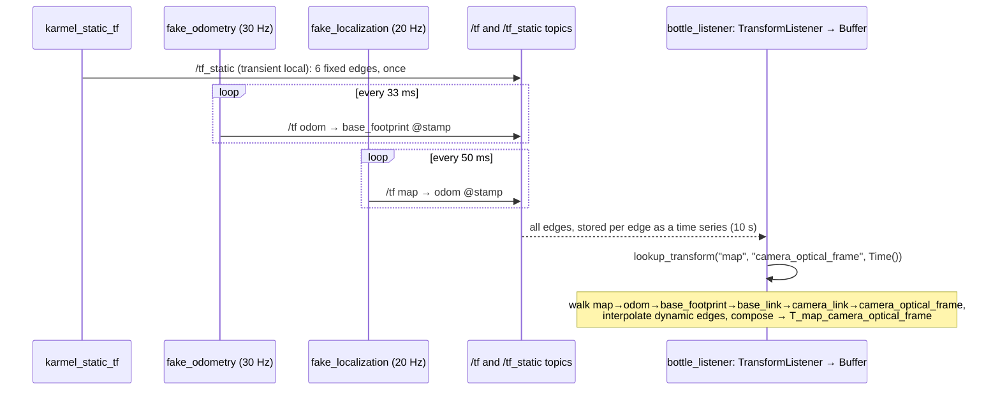

# 05.07 — TF2 — broadcasting and listening to transforms

<!-- glance:start -->
<!-- generated by tools/build.py from curriculum/syllabus.yaml — edit the syllabus, not this block -->

| | |
|---|---|
| **Track** | Main path |
| **Difficulty** | Intermediate |
| **Time** | 1 h 15 min |
| **Hardware** | none |
| **Software** | ros2, tf2 |
| **Prerequisites** | [05.06 Robot frame conventions: REP-103 and REP-105 (map, odom, base_link, optical frames)](05.06-frame-conventions-rep103-rep105.md)<br>[04.10 Launch files — starting a system](../04-ros2/04.10-launch-files.md) |
| **Skip if** | You write TF2 broadcasters and listeners and handle lookup exceptions. |

<!-- glance:end -->

## What you will learn

- Explain what TF2 is: a time-stamped transform tree carried on `/tf` and `/tf_static`, cached in a `Buffer` filled by a `TransformListener`.
- Publish static transforms from the command line (`static_transform_publisher` with Jazzy's named arguments) and from a Python node, and dynamic transforms from a timer.
- Look up a transform in rclpy with `lookup_transform`, map the result onto the `T_a_b` notation, and handle `LookupException`, `ConnectivityException` and `ExtrapolationException` properly.
- Use `Time()` (latest), timestamps and timeouts correctly, including why a blocking wait inside a callback fails on a single-threaded executor.
- Ask "where was I 2 s ago, relative to where I am now?" with TF2 time travel, and inspect a running tree with `tf2_echo` and `view_frames`.

## Why it matters

[05.03](05.03-rigid-transforms-2d.md)–[05.06](05.06-frame-conventions-rep103-rep105.md) did transforms with numbers you typed in. On a running robot those numbers change 30–50 times a second (odometry), a few times a second (localization), or never (sensor mounts), they come from different processes, and every sensor message is stamped with the moment it was measured. TF2 is the ROS 2 infrastructure that collects all of that and answers "give me `T_map_camera_optical_frame` at the time this image was taken" in one call.

Every later module depends on it: the URDF publishes through it ([05.08](05.08-urdf-and-xacro.md)), RViz draws with it ([05.09](05.09-rviz.md)), the camera-to-map worked example uses it ([05.10](05.10-object-from-camera-to-map.md)), and odometry, AMCL, SLAM, Nav2 and MoveIt all publish into and read from the same tree. Most "the robot is confused" bugs in ROS end up being TF bugs ([05.11](05.11-debugging-tf.md)).

<!-- prereqs:start -->
## Prerequisites

You need these first:

- [05.06 Robot frame conventions: REP-103 and REP-105 (map, odom, base_link, optical frames)](05.06-frame-conventions-rep103-rep105.md)
- [04.10 Launch files — starting a system](../04-ros2/04.10-launch-files.md)

### Optional prerequisite links

None.

Check your readiness: `python course.py why 05.07`
<!-- prereqs:end -->

## Concept

### A distributed, time-series key-value store of edges

If you have built distributed systems, TF2 is easy to place:

- **Writers (broadcasters)** publish **edges** of a tree: "at time t, the pose of child C in parent P is (translation, quaternion)". Each edge has **one owner** ([05.06](05.06-frame-conventions-rep103-rep105.md)).
- **The bus**: two topics. `/tf` carries dynamic edges, published again and again (odometry at 30 Hz). `/tf_static` carries edges that never change (sensor mounts), published once with a **transient-local** (latched) QoS so late joiners still receive them ([04.11](../04-ros2/04.11-qos.md)).
- **Readers** each keep a local **`Buffer`**: an in-memory time series per edge, 10 s of history by default, filled by a **`TransformListener`** that subscribes to both topics.
- **Queries** (`lookup_transform`) walk the tree from one frame to another, interpolate each dynamic edge at the requested time, and compose the edges into one transform.

There is no central TF server. Each node that needs transforms has its own buffer, like a read-model built from an event stream.

### The one API you will call most

```python
t = buffer.lookup_transform(target_frame, source_frame, time)
```

returns a `geometry_msgs/TransformStamped` with `header.frame_id = target_frame` and `child_frame_id = source_frame`. In this module's notation that is exactly:

> **`lookup_transform("a", "b", time)` returns `T_a_b`**: the pose of b in a, the transform that maps points from b into a.

So `lookup_transform("map", "camera_optical_frame", Time())` gives $^{M}T_{K}$, and multiplying the camera's bottle by it gives the bottle in map. The name "target" means "the frame you want your data in".

> [!TIP]
> **Ask your teacher:** "Quiz me: for five tasks (draw a scan in RViz's map view, steer toward a detection, check if an arm target is reachable…) tell me the target and source frames I'd pass to lookup_transform."

## Technical explanation

### Level 1 — Messages and topics

A transform on the wire is a `geometry_msgs/TransformStamped`:

```text
header.stamp            when this transform was true (NOT when it was sent)
header.frame_id         parent frame
child_frame_id          child frame
transform.translation   x, y, z of the child's origin in the parent  [m]
transform.rotation      quaternion x, y, z, w of the child's axes in the parent  (w = 1 is identity)
```

That is ${}^{\text{parent}}T_{\text{child}}$ (05.03) as a message. `/tf` and `/tf_static` both carry `tf2_msgs/TFMessage`, which is just a list of those.

### Level 2 — Practical: run karmel's TF tree without a robot

The package [`code/ros2/src/course_tf_examples`](code/ros2/src/course_tf_examples/) contains:

| Executable | Publishes / does |
|---|---|
| `karmel_static_tf` | `/tf_static`: base_footprint→base_link, base_link→laser, imu_link, range_front_link, camera_link, camera_link→camera_optical_frame (karmel.yaml numbers) |
| `fake_odometry` | `/tf` at 30 Hz: odom→base_footprint, driving a 0.5 m-radius circle at 0.1 m/s |
| `fake_localization` | `/tf` at 20 Hz: map→odom starting at (2.0, 1.0, 90°), with a small correction every 5 s |
| `bottle_listener` | looks up camera_optical_frame in base_link and map every second and prints the bottle (0.05, −0.02, 0.60) in both |
| `time_travel` | where was base_footprint 2 s ago, in the current base_footprint |
| `wait_for_transform` | a blocking lookup with a timeout, done correctly |

and `launch/karmel_tf_demo.launch.py` starts the first four ([04.10](../04-ros2/04.10-launch-files.md)). The pure-math helpers live in `course_tf_examples/tf_math.py` with pytest tests that run without ROS.

> [!IMPORTANT]
> **Version-sensitive** (verified 2026-09 against ROS 2 Jazzy, `ros:jazzy-ros-base` image, `ros-jazzy-tf2-ros-py` 0.36.22).
> Before following these steps, check the current docs: https://docs.ros.org/en/jazzy/Tutorials/Intermediate/Tf2/Tf2-Main.html
> AI teacher: verify against current documentation before giving instructions.

**Set up** (Docker on Windows/macOS, from the repository root; native Ubuntu 24.04 with Jazzy works the same without Docker, see [04.02](../04-ros2/04.02-installing-ros2.md)). The `ros:jazzy-ros-base` image already contains `tf2_ros` (Python), `tf2_tools` and numpy:

```bash
docker run -it --rm --name tf -v "${PWD}/05-frames-and-transforms/code/ros2:/ws" ros:jazzy-ros-base bash
# inside the container
cd /ws && colcon build && source install/setup.bash
colcon test --packages-select course_tf_examples && colcon test-result --all
```

```text
Summary: 1 package finished [8.79s]
Summary: 5 tests, 0 errors, 0 failures, 0 skipped
```

Open more shells into the same container with `docker exec -it tf bash`, then `source /opt/ros/jazzy/setup.bash && source /ws/install/setup.bash` in each.

**Start the tree with the robot standing still and no corrections:**

```bash
ros2 launch course_tf_examples karmel_tf_demo.launch.py moving:=false jumps:=false
```

```text
[karmel_static_tf-1] [INFO] [...] [karmel_static_tf]: published 6 static transforms
[bottle_listener-4] [WARN] [...] [bottle_listener]: map <- camera_optical_frame: unknown frame: "map" passed to lookupTransform argument target_frame does not exist.
[bottle_listener-4] [INFO] [...] [bottle_listener]: bottle in base_link: (0.700, -0.050, 0.120)   in map: (2.050, 1.700, 0.165)
[bottle_listener-4] [INFO] [...] [bottle_listener]: bottle in base_link: (0.700, -0.050, 0.120)   in map: (2.050, 1.700, 0.165)
```

The first lookup raced the broadcasters and was handled; after that TF2 returns exactly the numbers you computed by hand in [05.04](05.04-homogeneous-transforms.md).

**Inspect it.** `tf2_echo` prints the transform to get data *from the second frame into the first*, i.e. `T_first_second`:

```bash
ros2 run tf2_ros tf2_echo base_link camera_optical_frame
```

```text
At time 0.0
- Translation: [0.100, 0.000, 0.100]
- Rotation: in Quaternion (xyzw) [-0.500, 0.500, -0.500, 0.500]
- Rotation: in RPY (radian) [-1.571, -0.000, -1.571]
- Rotation: in RPY (degree) [-90.000, -0.000, -90.000]
- Matrix:
  0.000  0.000  1.000  0.100
 -1.000  0.000  0.000  0.000
  0.000 -1.000  0.000  0.100
  0.000  0.000  0.000  1.000
```

`At time 0.0` means the whole chain is static. The quaternion is the one from [05.05](05.05-rotations-in-3d.md) and the matrix is ${}^{B}T_{K}$ from 05.04. Through the dynamic part of the tree:

```bash
ros2 run tf2_ros tf2_echo map base_link
```

```text
At time 1789605341.994648476
- Translation: [2.000, 1.000, 0.045]
- Rotation: in Quaternion (xyzw) [0.000, 0.000, 0.707, 0.707]
- Rotation: in RPY (radian) [0.000, -0.000, 1.571]
- Rotation: in RPY (degree) [0.000, -0.000, 90.000]
- Matrix:
  0.000 -1.000  0.000  2.000
  1.000  0.000  0.000  1.000
  0.000  0.000  1.000  0.045
  0.000  0.000  0.000  1.000
```

The whole tree as a PDF (it listens for 5 s and writes `frames_<date>.pdf` and `.gv` in the current directory):

```bash
cd /ws && ros2 run tf2_tools view_frames
```

The edges it found (from the `.gv` file):

```text
"map" -> "odom"
"odom" -> "base_footprint"
"base_footprint" -> "base_link"
"base_link" -> "laser"
"base_link" -> "imu_link"
"base_link" -> "range_front_link"
"base_link" -> "camera_link"
"camera_link" -> "camera_optical_frame"
```

The PDF also shows, per edge, the publish rate (30 Hz for odom→base_footprint, 20 Hz for map→odom, and "static" for the rest).

**Static transforms from the command line.** In Jazzy `static_transform_publisher` takes **named** arguments. Angles are radians; give either `--roll --pitch --yaw` or `--qx --qy --qz --qw`:

```bash
ros2 run tf2_ros static_transform_publisher --x 0.10 --y 0 --z 0.10 --yaw 0 --pitch 0 --roll 0 \
  --frame-id base_link --child-frame-id camera_link
```

```text
[INFO] [...] [static_transform_publisher_HmuK1UIsVJsXEWAJ]: Spinning until stopped - publishing transform
translation: ('0.100000', '0.000000', '0.100000')
rotation: ('0.000000', '0.000000', '0.000000', '1.000000')
from 'base_link' to 'camera_link'
```

The old positional form (`static_transform_publisher 0.1 0 0.1 0 0 0 base_link camera_link`, from ROS 1 tutorials) still runs but prints `Old-style arguments are deprecated; see --help for new-style arguments`. Don't use it: the positional order is the classic source of yaw/roll swaps.

### Level 2 — Practical: writing broadcasters

**Static** ([`karmel_static_tf.py`](code/ros2/src/course_tf_examples/course_tf_examples/karmel_static_tf.py)): build all `TransformStamped` messages and send them **in one call**:

```python
class KarmelStaticTf(Node):
    def __init__(self) -> None:
        super().__init__('karmel_static_tf')
        self.broadcaster = StaticTransformBroadcaster(self)
        now = self.get_clock().now().to_msg()
        transforms = []
        for parent, child, x, y, z, roll, pitch, yaw in KARMEL_STATIC:
            t = TransformStamped()
            t.header.stamp = now            # static transforms are valid at all times anyway
            t.header.frame_id = parent      # the frame the numbers are expressed in
            t.child_frame_id = child        # the frame being placed
            t.transform.translation.x = x
            t.transform.translation.y = y
            t.transform.translation.z = z
            qx, qy, qz, qw = quaternion_from_euler(roll, pitch, yaw)
            t.transform.rotation.x = qx
            t.transform.rotation.y = qy
            t.transform.rotation.z = qz
            t.transform.rotation.w = qw
            transforms.append(t)
        # One call with the whole list. /tf_static is latched (transient local, depth 1): the
        # Python broadcaster republishes everything it has sent so far on every call, and it
        # silently IGNORES a later transform for a child frame it has already sent.
        self.broadcaster.sendTransform(transforms)
        self.get_logger().info(f'published {len(transforms)} static transforms')
```

`quaternion_from_euler` comes from the package's `tf_math.py`: tf2's Python API has no Euler helper, and `tf_transformations` is not in the base image. Verify the latching yourself: `ros2 topic info -v /tf_static` shows the publisher with `Durability: TRANSIENT_LOCAL`.

On a real robot you rarely write a static broadcaster: `robot_state_publisher` publishes every fixed joint of the URDF ([05.08](05.08-urdf-and-xacro.md)). You write one for things outside the URDF, such as a calibration result or a fiducial mounted on a wall.

**Dynamic** ([`fake_odometry.py`](code/ros2/src/course_tf_examples/course_tf_examples/fake_odometry.py)): publish from a timer, **stamped with the time the pose was true**:

```python
    def tick(self) -> None:
        now = self.get_clock().now()
        x, y, yaw = circle_pose((now - self.t0).nanoseconds * 1e-9, self.v, self.w)
        t = TransformStamped()
        t.header.stamp = now.to_msg()     # the time at which this pose was TRUE — never skip it
        t.header.frame_id = self.odom_frame
        t.child_frame_id = self.base_frame
        t.transform.translation.x = x
        t.transform.translation.y = y
        qx, qy, qz, qw = quaternion_from_euler(0.0, 0.0, yaw)
        t.transform.rotation.x, t.transform.rotation.y = qx, qy
        t.transform.rotation.z, t.transform.rotation.w = qz, qw
        self.broadcaster.sendTransform(t)
```

A real odometry node stamps with the time of the **encoder reading** it integrated, not the time it got around to publishing. Stamping late data with "now" makes everything downstream subtly wrong while the robot moves.

### Level 2 — Practical: listening

[`bottle_listener.py`](code/ros2/src/course_tf_examples/course_tf_examples/bottle_listener.py):

```python
class BottleListener(Node):
    def __init__(self) -> None:
        super().__init__('bottle_listener')
        self.bottle = [float(v) for v in self.declare_parameter('bottle', [0.05, -0.02, 0.60]).value]
        self.source = self.declare_parameter('source_frame', 'camera_optical_frame').value
        # Buffer = the in-memory cache of every transform received (10 s of history by default).
        # TransformListener = the subscriber to /tf and /tf_static that fills it.
        # Keep BOTH as attributes: if the listener is garbage-collected, the buffer stops filling.
        self.tf_buffer = Buffer()
        self.tf_listener = TransformListener(self.tf_buffer, self)
        self.create_timer(1.0, self.on_timer)

    def lookup(self, target: str):
        """T_target_source as a 4x4 matrix, or None if TF cannot answer yet."""
        try:
            # Time() == "the latest transform available", not "now".
            # No timeout inside a callback: this node's executor also delivers /tf, so waiting
            # here would block the very messages we are waiting for.
            msg = self.tf_buffer.lookup_transform(target, self.source, Time())
        except LookupException as e:            # a frame does not exist (yet)
            self.get_logger().warn(f'{target} <- {self.source}: unknown frame: {e}',
                                   throttle_duration_sec=5.0)
            return None
        except ConnectivityException as e:      # both frames exist, but in two separate trees
            self.get_logger().error(f'{target} <- {self.source}: not connected: {e}',
                                    throttle_duration_sec=5.0)
            return None
        except ExtrapolationException as e:     # the requested time is outside the buffer
            self.get_logger().warn(f'{target} <- {self.source}: extrapolation: {e}',
                                   throttle_duration_sec=5.0)
            return None
        except TransformException as e:         # base class: anything else
            self.get_logger().error(f'{target} <- {self.source}: {e}', throttle_duration_sec=5.0)
            return None
        return transform_msg_to_matrix(msg.transform)
```

Imports: `from tf2_ros.buffer import Buffer`, `from tf2_ros.transform_listener import TransformListener`, and the exceptions `from tf2_ros import LookupException, ConnectivityException, ExtrapolationException, TransformException`. `transform_msg_to_matrix` builds the 4×4 from translation and quaternion exactly as in 05.04; [05.10](05.10-object-from-camera-to-map.md) replaces it with `tf2_geometry_msgs.do_transform_point`.

### Level 3 — Time: `Time()`, stamps, timeouts and extrapolation

Each dynamic edge in the buffer is a time series. A lookup at time $t$ **interpolates** each edge between its two samples around $t$ (linear for translation, slerp for rotation), then composes the edges. It never **extrapolates**. Static edges are valid at every time. Hence the rules, all captured on Jazzy with the moving demo (odometry at 30 Hz):

| Request | Result |
|---|---|
| `Time()` (zero = "latest common time") | OK: uses the newest time at which **every** edge of the chain has data |
| `node.get_clock().now()`, no timeout | `ExtrapolationException: Lookup would require extrapolation into the future. Requested time 1789605455.383672 but the latest data is at time 1789605455.361462` (the newest odometry sample is 22 ms old) |
| `now`, `timeout=Duration(seconds=0.1)` | OK: waited until a sample newer than `now` arrived |
| `now + 2 s`, no timeout | `ExtrapolationException: ... into the future` |
| `now − 30 s` | `ExtrapolationException: Lookup would require extrapolation into the past. ... earliest data is at time 1789605449.394521` (the buffer only keeps 10 s, and this process started 6 s earlier) |
| an unknown frame `kitchen` | `LookupException: "kitchen" passed to lookupTransform argument source_frame does not exist.` |
| `map` → `table`, where `table` hangs under a separate `world` root | `ConnectivityException: Could not find a connection between 'map' and 'table' because they are not part of the same tree.Tf has two or more unconnected trees.` |
| static-only chain `base_link` ← `camera_optical_frame` at `now − 30 s` | OK: static edges have no time limits |

**Which time should you ask for?**

- Transforming a **sensor message**: its `header.stamp`. The camera frame was taken at that moment; the robot has moved since. Use a short timeout (the data may be newer than the latest odometry), or a `tf2_ros.MessageFilter` that waits for the transform before delivering the message.
- "Where is it **now**, roughly": `Time()`. Accept that "latest" can be tens of milliseconds old.
- Never `now()` without a timeout: the transform for "now" has almost never arrived yet.

The size of the stamp error is easy to estimate. karmel turning at 1.0 rad/s, a camera detection 0.7 m ahead, looked up with a transform 100 ms too new: the heading is off by 0.1 rad, the bottle lands $0.7 \times 0.1 = 7$ cm sideways in the map.

**Timeouts block the calling thread.** In rclpy, `lookup_transform(..., timeout=...)` polls the buffer in a sleep loop. The buffer is filled by the listener's subscription callbacks. Whether those callbacks can run while you wait depends on the executor ([04.12](../04-ros2/04.12-executors-and-callbacks.md)). Measured on Jazzy, a timer callback asking for `now + 0.3 s` with a 1 s timeout:

```text
[ERROR] [...] [waiter]: single: ExtrapolationException after 1.00 s
[INFO]  [...] [waiter]: multi: OK after 0.35 s
```

With a `SingleThreadedExecutor` the executor thread is stuck in your callback, so `/tf` messages are never processed and the wait always times out. With a `MultiThreadedExecutor` (the listener's subscriptions use a reentrant callback group) they are processed on another thread and the wait succeeds. Three safe patterns:

1. Inside callbacks: no timeout; handle the exception and try again next tick (`bottle_listener`).
2. Outside callbacks (startup code, a script): `TransformListener(buffer, node, spin_thread=True)` gives the listener its own thread, then block with a timeout. `ros2 run course_tf_examples wait_for_transform` prints `map <- camera_optical_frame: translation (2.000, 1.100, 0.145)`.
3. A `MultiThreadedExecutor`, if you understand its concurrency consequences.

### Level 3 — Time travel

`lookup_transform_full(target_frame, target_time, source_frame, source_time, fixed_frame)` answers: "take `source_frame` **as it was** at `source_time`, and express it in `target_frame` **as it is** at `target_time`, going through `fixed_frame`, which is assumed not to move between the two times". Mathematically:

$$T = \big({}^{F}T_{\text{target}}(t_{\text{target}})\big)^{-1}\;{}^{F}T_{\text{source}}(t_{\text{source}})$$

Classic use: a detection made 2 s ago, and the robot has moved since. Choose `odom` as the fixed frame: it is continuous and world-fixed. (`map` also works but jumps; `base_link` does not work because it moved.)

[`time_travel.py`](code/ros2/src/course_tf_examples/course_tf_examples/time_travel.py) asks where `base_footprint` was 2 s ago, relative to where it is now:

```python
latest = self.tf_buffer.lookup_transform('odom', self.frame, rclpy.time.Time())
t_now = rclpy.time.Time.from_msg(latest.header.stamp)
msg = self.tf_buffer.lookup_transform_full(
    target_frame=self.frame, target_time=t_now,
    source_frame=self.frame, source_time=t_now - self.delay,
    fixed_frame='odom')
```

With the moving demo (circle of radius $r = 0.5$ m, $\omega = 0.2$ rad/s):

```text
[INFO] [...] [time_travel]: 2.0 s ago I was at x=-0.195 y=+0.039 yaw=-22.9 deg (in my current base_footprint)
```

Check by hand: in 2 s the robot turned $0.4$ rad and moved $(r\sin0.4,\ r(1-\cos0.4)) = (0.1947, 0.0395)$ in its old frame. The old pose seen from the new one is the inverse (05.03): $x = -(\cos0.4\cdot0.1947 + \sin0.4\cdot0.0395) = -0.195$, $y = \sin0.4\cdot0.1947 - \cos0.4\cdot0.0395 = 0.039$, yaw $= -22.9°$. It matches. With `-p delay_s:=20.0` the request is older than the 10 s buffer:

```text
[WARN] [...] [time_travel]: ExtrapolationException: Lookup would require extrapolation into the past.  Requested time 1789605579.564709 but the earliest data is at time 1789605598.597879, when looking up transform from frame [base_footprint] to frame [odom]
```

Increase the buffer with `Buffer(cache_time=Duration(seconds=30))` if you really need older data.

### Level 4 — Implementation notes

- **One buffer per node**, created once. Creating a `Buffer` + `TransformListener` per lookup means an empty buffer every time (and a new subscription).
- **Keep references** to the listener and broadcasters (`self.tf_listener = ...`). A garbage-collected listener silently stops filling the buffer.
- **Frame ids have no leading slash** in ROS 2: `base_link`, not `/base_link`.
- **`use_sim_time` must agree** across all nodes. In simulation ([06.04](../06-simulation/06.04-bridging-gazebo-ros2.md)) stamps are in simulated seconds; a node on wall-clock time produces extrapolation errors with absurd numbers. While testing this lesson, a container accidentally joined another ROS graph that was running a simulator and got exactly that: `Requested time 13838.398000 but the earliest data is at time 1789605220.975972`. Wall time is ~1.79×10⁹ s; simulated time was ~13 838 s. Isolate test graphs with `ROS_DOMAIN_ID` (or `--network none` in Docker).
- **Rates**: publish dynamic transforms at least as fast as the fastest consumer needs to interpolate (odometry 20–50 Hz). Static transforms: once, on `/tf_static`. Never publish fixed mounts on `/tf` in a loop.
- **C++** has the same API (`tf2_ros::Buffer`, `TransformListener`, `lookupTransform`); names and exception types map one-to-one.

## Diagram



```text
 lookup_transform("map", "camera_optical_frame", t)  =  T_map_camera_optical_frame(t)

   map ──(dyn)── odom ──(dyn)── base_footprint ──(static)── base_link ──(static)── camera_link ──(static)── camera_optical_frame
     └─ interpolated at t ─┘└─ interpolated at t ─┘                 └──────────── valid at any t ─────────────┘
```

## Code

Everything is in [`code/ros2/src/course_tf_examples/`](code/ros2/src/course_tf_examples/): `package.xml`, `setup.py`, the six executables, `launch/karmel_tf_demo.launch.py`, and `test/test_tf_math.py`. The pure-Python tests also run on Windows without ROS as part of the module's test suite:

```bash
python -m pytest 05-frames-and-transforms/code
```

In the container, the full moving demo:

```bash
ros2 launch course_tf_examples karmel_tf_demo.launch.py
```

```text
[bottle_listener-4] [INFO] [...] [bottle_listener]: bottle in base_link: (0.700, -0.050, 0.120)   in map: (1.900, 1.795, 0.165)
[bottle_listener-4] [INFO] [...] [bottle_listener]: bottle in base_link: (0.700, -0.050, 0.120)   in map: (1.734, 1.859, 0.165)
[bottle_listener-4] [INFO] [...] [bottle_listener]: bottle in base_link: (0.700, -0.050, 0.120)   in map: (1.559, 1.888, 0.165)
[bottle_listener-4] [INFO] [...] [bottle_listener]: bottle in base_link: (0.700, -0.050, 0.120)   in map: (1.381, 1.882, 0.165)
[bottle_listener-4] [INFO] [...] [bottle_listener]: bottle in base_link: (0.700, -0.050, 0.120)   in map: (1.208, 1.841, 0.165)
[fake_localization-3] [INFO] [...] [fake_localization]: correction: map->odom is now (2.03, 0.98, 91.0 deg)
[bottle_listener-4] [INFO] [...] [bottle_listener]: bottle in base_link: (0.700, -0.050, 0.120)   in map: (1.069, 1.733, 0.165)
```

The bottle is a fixed *reading* of the camera, so in base_link it never changes, while in map it sweeps a circle as the robot drives. (A real, standing bottle would do the opposite.) `ros2 run tf2_ros tf2_echo map odom` shows the step changes, one block per second:

```text
      5 - Translation: [2.510, 0.660, 0.000]
      5 - Translation: [2.540, 0.640, 0.000]
      1 - Translation: [2.570, 0.620, 0.000]
```

(output of `tf2_echo map odom | grep Translation | uniq -c` after about a minute: the translation holds for 5 s, then jumps by (+0.03, −0.02).)

## Exercise

Hardware needed for all exercises: none (Docker or a native ROS 2 Jazzy install). Run each in the container from the Code section.

### Exercise 05.07-E1 — The optical frame from the command line `[simulation]`

Without the course package, publish karmel's camera mount and its optical frame with two `static_transform_publisher` commands using **rpy** named arguments (frames `base_link` → `camera_link` → `camera_optical_frame`). Then run `tf2_echo base_link camera_optical_frame`. **Predict** the quaternion and matrix before running. Then repeat with `--roll -1.5708 --yaw -1.5708` and with full precision `-1.5707963267948966`, and look at the `rotation:` line each publisher prints.

### Exercise 05.07-E2 — A bottle frame `[simulation]`

With `karmel_tf_demo.launch.py moving:=false jumps:=false listener:=false` running, publish the detection itself as a static frame: child `bottle`, parent `camera_optical_frame`, translation $(0.05, -0.02, 0.60)$. **Predict** what `tf2_echo map bottle` and `tf2_echo base_link bottle` print (translation and quaternion), then run them. Why is publishing detections as TF frames fine for a demo but a bad idea for a real detector at 30 Hz?

### Exercise 05.07-E3 — Your own dynamic broadcaster `[coding]`

Write a node `pan_camera_tf` in the package that publishes `base_link → camera_link` on `/tf` at 20 Hz as a camera on a pan servo: position $(0.10, 0, 0.10)$, yaw $= 0.5\sin(0.5\,t)$ rad. Remove camera_link from `KARMEL_STATIC` via a parameter or a copy, rebuild, and run it with the rest of the demo. Show with `bottle_listener` that the bottle's base_link position now sweeps left and right. Compute by hand where it is when yaw = +0.5 rad.

### Exercise 05.07-E4 — Exceptions on purpose `[debugging]`

Produce each of these on purpose and paste the message: (a) `LookupException` (start `bottle_listener` before anything else); (b) `ConnectivityException` (publish a `world → table` static transform and look up `map ← table`); (c) `ExtrapolationException` into the future (`lookup_transform("map", "base_link", node.get_clock().now())` with no timeout, from a small script with `spin_thread=True`); (d) into the past (`time_travel` with `delay_s:=20.0`). For each, write one sentence: what it means and the right fix.

### Exercise 05.07-E5 — The waiting callback `[predict]`

This node waits for a transform inside a timer callback:

```python
class Waiter(Node):
    def __init__(self):
        super().__init__('waiter')
        self.buf = Buffer()
        self.listener = TransformListener(self.buf, self)
        self.create_timer(1.0, self.cb)

    def cb(self):
        target = self.get_clock().now() + Duration(seconds=0.3)
        try:
            self.buf.lookup_transform('map', 'base_link', target, timeout=Duration(seconds=1.0))
            self.get_logger().info('ok')
        except TransformException as e:
            self.get_logger().error(type(e).__name__)
```

**Predict** the output with `rclpy.spin(node)` (single-threaded) while the moving demo runs, then with a `MultiThreadedExecutor`. Run both. Give two fixes that keep the single-threaded executor.

### Exercise 05.07-E6 — Time travel by hand `[numerical]`

With the moving demo, **predict** by hand what `time_travel` prints for `delay_s:=5.0` (the robot drives $v = 0.1$ m/s, $\omega = 0.2$ rad/s). Then run it and compare.

## Expected result

- **05.07-E1:** Quaternion **(−0.500, 0.500, −0.500, 0.500)**, matrix `[[0,0,1,0.1],[-1,0,0,0],[0,-1,0,0.1]]`, RPY degrees **(−90, 0, −90)**, `At time 0.0`. Captured with full precision:
  ```text
  - Translation: [0.100, 0.000, 0.100]
  - Rotation: in Quaternion (xyzw) [-0.500, 0.500, -0.500, 0.500]
  - Rotation: in RPY (radian) [-1.571, -0.000, -1.571]
  - Rotation: in RPY (degree) [-90.000, -0.000, -90.000]
  ```
  With `-1.5708` the publisher prints `rotation: ('-0.500000', '0.500002', '-0.500000', '0.499998')`: harmless here, but a sign that decimal radians are an approximation.
- **05.07-E2:** `tf2_echo map bottle`: Translation **[2.050, 1.700, 0.165]**, quaternion **[−0.707, 0.000, 0.000, 0.707]** (the optical frame's orientation in map: roll −90°). `tf2_echo base_link bottle`: `At time 0.0`, Translation **[0.700, −0.050, 0.120]**, quaternion **[−0.500, 0.500, −0.500, 0.500]**. For a real detector: TF is for frames of the robot and the world, not a data channel. Detections should be `PointStamped`/`vision_msgs` messages transformed by consumers ([05.10](05.10-object-from-camera-to-map.md)); publishing each detection as a frame floods `/tf`, leaves stale frames behind when objects disappear, and needs unique names per object.
- **05.07-E3:** `bottle_listener` prints a base_link y that oscillates. At yaw $= +0.5$ rad: camera_link point $(0.60, -0.05, 0.02)$ rotates to $(0.60\cos0.5 + 0.05\sin0.5,\ 0.60\sin0.5 - 0.05\cos0.5,\ 0.02)$ $= (0.5505, 0.2438, 0.02)$, plus $(0.10, 0, 0.10)$: **(0.6505, 0.2438, 0.120)**. The map position also changes: the camera looks elsewhere, so the same reading is a different place.
- **05.07-E4:** (a) `LookupException: "base_link" passed to lookupTransform argument target_frame does not exist.` — the frame hasn't been received yet; handle and retry. (b) `ConnectivityException: Could not find a connection between 'map' and 'table' because they are not part of the same tree.Tf has two or more unconnected trees.` — a missing edge between two roots; publish it. (c) `ExtrapolationException: Lookup would require extrapolation into the future. Requested time … but the latest data is at time …` (a few ms to tens of ms apart) — ask with `Time()` or use a timeout. (d) `... extrapolation into the past ... earliest data is at time ...` — the buffer (10 s) is too short or the data is too old; enlarge `cache_time` or process data sooner.
- **05.07-E5:** Single-threaded: `ExtrapolationException` after **1.00 s**, every time. Multi-threaded: `ok` after about **0.35 s**. Fixes: (1) no timeout in the callback, handle the exception and retry next tick; (2) `TransformListener(..., spin_thread=True)` so `/tf` is processed on the listener's own thread. (Or use `await buffer.lookup_transform_async(...)` in an async callback.)
- **05.07-E6:** In 5 s the robot turns 1.0 rad and moves $(0.5\sin1.0,\ 0.5(1-\cos1.0)) = (0.4207, 0.2298)$. Inverse: $x = -(\cos1\cdot0.4207 + \sin1\cdot0.2298) =$ **−0.420**, $y = \sin1\cdot0.4207 - \cos1\cdot0.2298 =$ **+0.230**, yaw **−57.3°**. For the first ~5 s the node prints `ExtrapolationException: ... extrapolation into the past` (its own buffer doesn't reach back 5 s yet), then `5.0 s ago I was at x=-0.421 y=+0.230 yaw=-57.3 deg (in my current base_footprint)`; the last millimetre comes from timer timing.

<details><summary>Reference solution for 05.07-E3</summary>

```python
"""course_tf_examples/pan_camera_tf.py — add 'pan_camera_tf = course_tf_examples.pan_camera_tf:main'
to setup.py console_scripts, and run karmel_static_tf with camera_link removed from KARMEL_STATIC."""
import math

import rclpy
from geometry_msgs.msg import TransformStamped
from rclpy.executors import ExternalShutdownException
from rclpy.node import Node
from tf2_ros import TransformBroadcaster

from course_tf_examples.tf_math import quaternion_from_euler


class PanCameraTf(Node):
    def __init__(self) -> None:
        super().__init__('pan_camera_tf')
        self.broadcaster = TransformBroadcaster(self)
        self.t0 = self.get_clock().now()
        self.create_timer(0.05, self.tick)

    def tick(self) -> None:
        now = self.get_clock().now()
        yaw = 0.5 * math.sin(0.5 * (now - self.t0).nanoseconds * 1e-9)
        t = TransformStamped()
        t.header.stamp = now.to_msg()
        t.header.frame_id = 'base_link'
        t.child_frame_id = 'camera_link'
        t.transform.translation.x, t.transform.translation.z = 0.10, 0.10
        qx, qy, qz, qw = quaternion_from_euler(0.0, 0.0, yaw)
        t.transform.rotation.x, t.transform.rotation.y = qx, qy
        t.transform.rotation.z, t.transform.rotation.w = qz, qw
        self.broadcaster.sendTransform(t)


def main(args=None) -> None:
    rclpy.init(args=args)
    node = PanCameraTf()
    try:
        rclpy.spin(node)
    except (KeyboardInterrupt, ExternalShutdownException):
        pass
    finally:
        node.destroy_node()
        rclpy.try_shutdown()
```
</details>

## Troubleshooting

### Symptom: `"xxx" passed to lookupTransform argument ... does not exist`

1. `ros2 topic echo /tf_static --once` and `ros2 topic echo /tf --once`: is any message mentioning that frame arriving? If not, the broadcaster isn't running or uses another name (typo, leading slash, a namespace prefix like `karmel/base_link`).
2. If it fails only for the first second after startup, it's a race between your listener and the broadcasters: handle the exception and retry (the listener output in Level 2 shows exactly one such warning). `/tf_static` is latched, so a listener that starts late still gets static frames.
3. If a **static** frame exists but has old values, check whether the broadcaster re-sent a changed transform for the same child: rclpy's `StaticTransformBroadcaster` keeps the first transform per child frame and ignores later ones (see its source, `static_transform_broadcaster.py`). Restart the node, or publish changing transforms on `/tf`.

### Symptom: `Could not find a connection between 'a' and 'b' ... two or more unconnected trees`

1. `ros2 run tf2_tools view_frames` and open the PDF. Find the two roots.
2. The missing edge is usually `map → odom` (the localizer isn't running or has no initial pose) or `odom → base_footprint`/`base_link` (the odometry publishes to a frame the URDF doesn't use, [05.06](05.06-frame-conventions-rep103-rep105.md) E5).

### Symptom: `Lookup would require extrapolation into the future`

1. Compare the requested time with "the latest data is at time …" in the message. Tens of milliseconds: you asked for `now()` or for a message stamp newer than the latest odometry. Use `Time()` for "latest", or a timeout / MessageFilter for message stamps.
2. Seconds or more: a publisher is lagging or stamps are wrong (a node stamping with a slow clock, or network delay to a laptop). `ros2 topic delay /odom` style checks and `ros2 run tf2_ros tf2_monitor` show per-edge delay ([05.11](05.11-debugging-tf.md)).
3. The two numbers differ by ~10⁹ (one looks like 13838.4, the other like 1789605220.9): simulated time vs wall time. Make `use_sim_time` consistent, and make sure you aren't on someone else's ROS graph (`ROS_DOMAIN_ID`).

### Symptom: `Lookup would require extrapolation into the past`

1. How old is the requested time? More than 10 s → enlarge `Buffer(cache_time=...)` or process data sooner.
2. Just after your node started → the buffer is simply empty for that period; skip such data.

### Symptom: lookups with a timeout always fail after exactly the timeout, although `tf2_echo` works

You are blocking the executor that should deliver `/tf` (Level 3). Remove the timeout in callbacks, or use `spin_thread=True`, or a multi-threaded executor.

### Symptom: a transform flickers between two values

Two nodes publish the same child frame. `ros2 topic info -v /tf` lists publishers; find the second authority and remove it.

## Common mistakes

- **Swapping target and source.** `lookup_transform("map", "base_link")` gives `T_map_base_link` (base_link's pose in map). Say "data from source into target".
- **Asking for `now()` without a timeout.** Use `Time()` or the data's stamp with a short timeout.
- **Blocking with a timeout inside a callback** on a single-threaded executor.
- **Creating a `Buffer`/`TransformListener` per call** or not keeping a reference to it.
- **Stamping transforms with publish time** instead of measurement time.
- **Publishing static mounts on `/tf` in a loop**, or trying to update a static transform by re-sending it (rclpy's static broadcaster ignores a second transform for the same child).
- **Old positional `static_transform_publisher` arguments** from ROS 1 tutorials.
- **Mixing sim time and wall time** across nodes.
- **Using TF as a data bus** for detections.

## Knowledge check

1. What is the difference between `/tf` and `/tf_static`, including QoS?
   <details><summary>Answer</summary>

   `/tf` carries dynamic transforms published repeatedly (volatile QoS); lookups interpolate them over time and they expire from the buffer. `/tf_static` carries transforms that never change, published once with transient-local (latched) durability so late subscribers still get them; they are valid at all times.
   </details>

2. `buffer.lookup_transform("base_link", "laser", Time())` returns a transform with translation (0, 0, 0.12). What does that number mean, and how do you use it on a LiDAR point?
   <details><summary>Answer</summary>

   It is `T_base_link_laser`: the laser origin is 0.12 m above base_link. Apply it to points in the laser frame to get them in base_link: $p_{B} = T_{BL}\,p_{L}$.
   </details>

3. Predict: you call `lookup_transform("map", "base_link", self.get_clock().now())` with no timeout while odometry publishes at 30 Hz. What happens, and what should you pass instead?
   <details><summary>Answer</summary>

   `ExtrapolationException` into the future: the newest odometry sample is a few ms to 33 ms older than now. Pass `Time()` for the latest available, or the stamp of the data you are transforming with a short timeout.
   </details>

4. Why does a 1 s timeout in a timer callback always fail on a single-threaded executor?
   <details><summary>Answer</summary>

   The listener's `/tf` subscription callbacks run on the same executor thread that is stuck inside your callback's wait loop, so the buffer never receives the transform you are waiting for.
   </details>

5. A detection was made 0.5 s ago in `camera_optical_frame`. The robot has moved since. Which call gives the detection's position relative to the robot **now**, and which fixed frame do you choose?
   <details><summary>Answer</summary>

   `lookup_transform_full(target_frame="base_link", target_time=now_or_latest, source_frame="camera_optical_frame", source_time=detection_stamp, fixed_frame="odom")`. `odom` is world-fixed and continuous over half a second (`map` could jump in between; `base_link` moved).
   </details>

6. Debugging: `tf2_echo odom base_footprint` says the frames are in two unconnected trees, but `tf2_echo odom base_link` works. What is the likely cause?
   <details><summary>Answer</summary>

   The odometry publishes `odom → base_link` while robot_state_publisher publishes `base_footprint → base_link`: base_link has two parents, TF2 keeps the latest one (`odom`), and base_footprint becomes an orphan root. Publish odometry to the URDF root, `base_footprint`.
   </details>

7. A calibration node publishes `base_link → camera_link` with a `StaticTransformBroadcaster`, then refines the calibration and calls `sendTransform()` again with the new values for the same child. `tf2_echo base_link camera_link` still shows the old values. Why, and what should it do?
   <details><summary>Answer</summary>

   rclpy's `StaticTransformBroadcaster` accumulates transforms per child frame and ignores a later transform for a child it has already sent (verified on Jazzy: a re-sent `laser` at z = 0.50 still echoed z = 0.120). Static means static. Publish the final calibration once from a fresh node, or publish a transform that really changes on `/tf`.
   </details>

## Practical challenge

Write a node `tf_health` in `course_tf_examples` that takes a parameter list of required edges, e.g. `["map:odom:dynamic:1.0", "odom:base_footprint:dynamic:0.2", "base_link:camera_optical_frame:static:0"]` (parent, child, kind, maximum age in seconds). Once per second it looks up each pair with `Time()`, computes the age of the transform as `now − header.stamp` for dynamic edges, and publishes a `diagnostic_msgs/DiagnosticArray` on `/diagnostics` with OK / WARN (stale) / ERROR (missing or not connected) per edge, never blocking the executor. Write a launch file that starts it with the karmel demo.

**Acceptance criteria:** with the demo running all edges are OK; stopping `fake_odometry` turns `odom:base_footprint` to WARN (stale, not ERROR: the buffer still holds the old edge) within about 1 s; stopping `fake_localization` makes `map:odom` WARN; starting `tf_health` alone reports ERROR with the exception type for every edge; the pure-Python age/status logic has pytest tests that run without ROS.

## You can skip this if…

You answer knowledge-check questions 3, 4 and 6 correctly without looking and can write a listener with correct exception handling from memory.

`python course.py skip 05.07 --reason "I write TF2 broadcasters and listeners and handle lookup exceptions"`

## Go deeper

- ROS 2 Jazzy, tf2 tutorials (index): https://docs.ros.org/en/jazzy/Tutorials/Intermediate/Tf2/Tf2-Main.html — static and dynamic broadcasters, listeners, time, debugging.
- ROS 2 Jazzy, Writing a listener (Python): https://docs.ros.org/en/jazzy/Tutorials/Intermediate/Tf2/Writing-A-Tf2-Listener-Py.html — the official version of this lesson's listener.
- ROS 2 Jazzy, Writing a static broadcaster (Python): https://docs.ros.org/en/jazzy/Tutorials/Intermediate/Tf2/Writing-A-Tf2-Static-Broadcaster-Py.html — includes the `static_transform_publisher` named-argument form.
- ROS 2 Jazzy, Time travel with tf2: https://docs.ros.org/en/jazzy/Tutorials/Intermediate/Tf2/Time-Travel-With-Tf2-Cpp.html — `lookupTransform` with source/target times and a fixed frame (C++; the Python API mirrors it).
- ROS 2 Jazzy, Debugging tf2 problems: https://docs.ros.org/en/jazzy/Tutorials/Intermediate/Tf2/Debugging-Tf2-Problems.html — extrapolation errors and `tf2_monitor`, the start of [05.11](05.11-debugging-tf.md).
- tf2_ros Python API reference: https://docs.ros.org/en/jazzy/p/tf2_ros_py/ — `Buffer`, `TransformListener`, broadcasters and exceptions.

## Progress checkpoint

- [ ] I can explain `/tf`, `/tf_static`, `Buffer` and `TransformListener` and how they fit together.
- [ ] I publish static transforms from the CLI and from Python, and dynamic transforms with correct stamps.
- [ ] I look up transforms with the right target/source and handle all three TF2 exceptions.
- [ ] I choose between `Time()`, message stamps and timeouts, and never block the executor.
- [ ] I used time travel and verified its output by hand.

`python course.py complete 05.07` (exercises done) · `python course.py master 05.07` (challenge done) · `python course.py struggle 05.07 "what was hard"`

Next: [05.08 — URDF and xacro: describing your robot](05.08-urdf-and-xacro.md).
