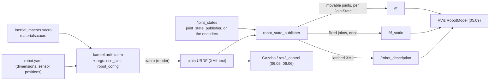

# 05.08 — URDF and xacro — describing your robot

<!-- glance:start -->
<!-- generated by tools/build.py from curriculum/syllabus.yaml — edit the syllabus, not this block -->

| | |
|---|---|
| **Track** | Main path |
| **Difficulty** | Intermediate |
| **Time** | 1 h 30 min |
| **Hardware** | none |
| **Software** | ros2, xacro |
| **Prerequisites** | [05.07 TF2 — broadcasting and listening to transforms](05.07-tf2-broadcast-listen.md) |
| **Optional prerequisites** | [FP.06 Rotational motion and moment of inertia](../optional-foundations/physics/FP.06-rotational-motion-inertia.md) |
| **Skip if** | You have written a URDF with xacro macros for a mobile robot. |

<!-- glance:end -->

## What you will learn

- Read a URDF as what it is: a tree of **links** connected by **joints**, where every joint's `<origin>` is one of the `T_parent_child` transforms you have been composing since [05.03](05.03-rigid-transforms-2d.md).
- Explain the three geometries of a link — `visual`, `collision`, `inertial` — and why a physics engine refuses to behave without the third.
- Write and read xacro: `xacro:property`, inline `${}` math, `xacro:macro`, `xacro:arg`, `xacro:include`, `xacro:if` and `xacro.load_yaml`, so one YAML file drives the whole robot.
- Run `xacro`, `check_urdf` and `robot_state_publisher`, and see the URDF appear on `/tf_static`, `/tf` and `/robot_description`.
- Change karmel's real description (move the LiDAR 5 cm forward) and prove the change reached TF.

## Why it matters

[05.07](05.07-tf2-broadcast-listen.md) hard-coded karmel's sensor mounts in a Python list and published them with a `StaticTransformBroadcaster`. That works for six frames written by one person. It does not survive the moment someone moves the camera bracket, or the moment Gazebo needs to know the robot's mass, or the moment RViz needs to draw it.

The URDF is the robot's **single declarative description**, and a ROS 2 system gets an astonishing amount of mileage out of it:

| Consumer | What it takes from the URDF |
|---|---|
| `robot_state_publisher` | every joint → `/tf_static` (fixed) and `/tf` (movable) |
| RViz ([05.09](05.09-rviz.md)) | the `visual` meshes to draw the robot |
| Gazebo ([06.05](../06-simulation/06.05-robot-in-gazebo.md)) | `collision` + `inertial` + friction, to simulate it |
| `ros2_control` ([06.06](../06-simulation/06.06-ros2-control.md)) | which joints exist and their limits |
| Nav2 ([12.06](../12-navigation/12.06-nav2-architecture.md)) | the footprint and the sensor frames |
| MoveIt ([14.09](../14-robotic-arm/14.09-moveit2-motion-planning.md)) | the whole kinematic chain, for IK and collision checking |

Write the robot down once, correctly, and six subsystems agree about where the LiDAR is. Write it twice and they eventually disagree — which is exactly the bug you will hunt in [05.11](05.11-debugging-tf.md).

<!-- prereqs:start -->
## Prerequisites

You need these first:

- [05.07 TF2 — broadcasting and listening to transforms](05.07-tf2-broadcast-listen.md)

### Optional prerequisite links

New to any of these? Take the foundation lesson first; skip it if you already know it.

- [FP.06 Rotational motion and moment of inertia](../optional-foundations/physics/FP.06-rotational-motion-inertia.md)

Check your readiness: `python course.py why 05.08`
<!-- prereqs:end -->

## Concept

### A URDF is a tree, not a drawing

A URDF (Unified Robot Description Format) is an XML file with two kinds of element:

- **`<link>`** — a rigid body. It carries a *name* (which becomes a TF frame) and, optionally, shapes: what it looks like, what it collides with, how heavy it is.
- **`<joint>`** — the relationship between exactly one parent link and one child link. It carries the **fixed offset** between them (`<origin>`) and, if it moves, an axis and limits.

The constraint that makes everything else work: **every link has exactly one parent**, and there is exactly one link with no parent (the root). A URDF is a *tree*, never a graph. That is the same rule TF2 enforces on `/tf` ([05.06](05.06-frame-conventions-rep103-rep105.md)) — and for the same reason: with one parent per node, "where is B relative to A?" has exactly one answer, computed by walking up to the common ancestor.

If you have ever defined a database schema and let an ORM materialize it at runtime, the split will feel familiar. The URDF is the schema. `robot_state_publisher` is the runtime: it reads the schema once, subscribes to `/joint_states` for the values of the movable joints, and publishes the resulting transforms forever.

### xacro is a preprocessor, not a language you deploy

Nobody writes a real URDF by hand. karmel's two wheels are the same object mirrored, its inertia tensors are formulas, and its LiDAR height appears in the URDF, the simulation and the odometry code. Plain XML has no variables, no arithmetic and no functions.

**xacro** (XML macros) adds exactly those three things and then gets out of the way. It is a text-in, text-out preprocessor: you run `xacro karmel.urdf.xacro` and it prints plain URDF. Every downstream tool sees only the output. Think T4 templates or Razor, emitting XML.

The one rule that catches everyone: **the robot that runs is the xacro output, not the xacro file.** When a number looks wrong, render the file and read the result before you argue with the template.

> [!TIP]
> **Ask your teacher:** "Show me karmel's rendered URDF next to the xacro source for the LiDAR, line by line, and tell me which numbers were computed and which were copied."

## Technical explanation

### Level 1 — Links and joints

A minimal, complete two-link robot:

```xml
<?xml version="1.0"?>
<robot name="tiny">
  <link name="base_link"/>
  <link name="laser"/>
  <joint name="laser_joint" type="fixed">
    <parent link="base_link"/>
    <child link="laser"/>
    <origin xyz="0 0 0.12" rpy="0 0 0"/>
  </joint>
</robot>
```

That is the whole idea. `<origin>` reads exactly as 05.04 taught it:

> `<origin xyz="x y z" rpy="r p y"/>` **is** ${}^{\text{parent}}T_{\text{child}}$: the child frame's origin at `xyz` in the parent, rotated by roll-pitch-yaw about the parent's fixed x, y, z axes.

Units are SI and angles are radians (REP-103), always. `rpy` composes as $R = R_z(\text{yaw})\,R_y(\text{pitch})\,R_x(\text{roll})$ — the convention from [05.05](05.05-rotations-in-3d.md). Both attributes default to zeros if omitted.

The joint types you will meet:

| `type` | Meaning | karmel uses it for |
|---|---|---|
| `fixed` | never moves; goes on `/tf_static` | every sensor mount, `base_footprint`→`base_link` |
| `continuous` | rotates about `<axis>`, no limit | the two drive wheels |
| `revolute` | rotates about `<axis>`, needs `<limit lower= upper=>` | arm joints ([14.08](../14-robotic-arm/14.08-arm-urdf-and-ros2-control.md)) |
| `prismatic` | slides along `<axis>`, needs `<limit>` | linear actuators |
| `floating` / `planar` | 6 / 3 free DOF | rare; not supported by most tools |

`<axis xyz="0 0 1"/>` is expressed **in the child frame**, and it defaults to `1 0 0` when you omit it — a default that has cost many people an afternoon.

### Level 2 — The three geometries of a link

A link may carry three independent blocks, each with its own `<origin>` **relative to the link frame**:

```xml
<link name="laser">
  <visual>    <origin xyz="0 0 -0.01025"/><geometry><cylinder radius="0.028" length="0.041"/></geometry>
              <material name="karmel_black"/></visual>
  <collision> <origin xyz="0 0 -0.01025"/><geometry><cylinder radius="0.028" length="0.041"/></geometry></collision>
  <inertial>  <origin xyz="0 0 -0.01025"/><mass value="0.11"/>
              <inertia ixx="3.697e-05" ixy="0" ixz="0" iyy="3.697e-05" iyz="0" izz="4.312e-05"/></inertial>
</link>
```

- **`visual`** — what RViz and Gazebo draw. Can be a `box`/`cylinder`/`sphere` or a `<mesh filename="package://…"/>`. Cosmetic; wrong values look silly but break nothing.
- **`collision`** — what the physics engine and collision checkers use. Keep it **simpler** than the visual: a box instead of a 50 k-triangle mesh. Every contact test runs against this, thousands of times a second.
- **`inertial`** — mass and the 3×3 inertia tensor about the link's centre of mass, whose position is the `<origin>` of this block. A link with no `<inertial>` is massless: fine for a pure frame like `camera_optical_frame`, fatal for anything Gazebo has to push around.

The link *frame* itself is wherever the joint puts it, and it need not be inside the geometry. karmel's `laser` frame is the **scan plane** — the height the LiDAR reports ranges from — while the puck body is drawn 10.25 mm *below* it with a `<visual><origin>`. That is deliberate: `sensor_msgs/LaserScan.header.frame_id = laser` must name the frame the measurement is actually in.

> [!NOTE]
> New to moments of inertia? → [FP.06 Rotational motion and inertia](../optional-foundations/physics/FP.06-rotational-motion-inertia.md). You only need "how hard is this to spin about each axis"; the formulas are in the macro file.

### Level 3 — Mathematics: from the XML to a transform chain

For a joint $j$ with origin $(\mathbf{t}, \text{rpy})$, axis $\hat{\mathbf{a}}$ (unit, in the child frame) and joint value $q$:

$$
{}^{P}T_{C}(q) \;=\; \underbrace{\begin{bmatrix} R_z(y)R_y(p)R_x(r) & \mathbf{t} \\ \mathbf{0} & 1\end{bmatrix}}_{\text{the } \texttt{<origin>}} \cdot \underbrace{M(\hat{\mathbf{a}}, q)}_{\text{the joint's motion}}
$$

with $M = \begin{bmatrix} \text{Rot}(\hat{\mathbf{a}}, q) & \mathbf{0}\\ \mathbf{0}&1\end{bmatrix}$ for a revolute/continuous joint (Rodrigues' formula) and $M = \begin{bmatrix} I & q\hat{\mathbf{a}}\\ \mathbf{0}&1\end{bmatrix}$ for a prismatic one. A `fixed` joint is $q \equiv 0$, so $M = I$.

Between any two links, compose up to the root and invert one side — exactly [05.04](05.04-homogeneous-transforms.md):

$${}^{A}T_{B} = \big({}^{\text{root}}T_{A}\big)^{-1}\,{}^{\text{root}}T_{B}$$

**Worked example — karmel's left wheel.** The joint is

```xml
<origin xyz="0 0.1 0" rpy="-1.5707963267948966 0 0"/>
<axis xyz="0 0 1"/>
```

The roll of $-\pi/2$ maps the child's $+z$ onto the parent's $+y$, so the cylinder (whose axis is its own $z$) lies across the robot, and turning the joint spins it about $+y$ in `base_link` — a forward roll. With $q = \pi/2$, a point on the rim at $(0.045, 0, 0)$ in the wheel frame goes to

$$
{}^{B}T_{W}(\pi/2)\,(0.045,0,0)^{\!\top} = (0,\ 0.1,\ -0.045)^{\!\top}
$$

the rim point that was at the front is now at the bottom. That is `test_continuous_joint_rotates_about_its_axis` in [`test/test_urdf_math.py`](code/ros2/src/course_tf_examples/test/test_urdf_math.py), and it is the sign check that tells you a wheel will drive the right way in simulation.

**Worked example — the chassis inertia.** The macro in [`inertial_macros.xacro`](../labs/ros2_ws/src/karmel_description/urdf/inertial_macros.xacro) uses the solid-box formulas

$$I_{xx} = \tfrac{m}{12}(y^2+z^2),\quad I_{yy} = \tfrac{m}{12}(x^2+z^2),\quad I_{zz} = \tfrac{m}{12}(x^2+y^2)$$

karmel's chassis is the total mass minus everything else: $1.6 - 2(0.08) - 0.03 - 0.11 - 0.05 - 0.01 - 0.01 = 1.23$ kg, as a box $0.25 \times 0.18 \times 0.07$ m. So

$$I_{xx} = \tfrac{1.23}{12}(0.18^2+0.07^2) = 0.0038233,\quad I_{yy} = 0.0069085,\quad I_{zz} = 0.0097273 \ \text{kg·m}^2$$

and that is verbatim what the rendered URDF contains. Two sanity checks worth making on any inertia tensor: all three diagonal terms positive, and the triangle inequality $I_{xx} + I_{yy} \ge I_{zz}$ (and permutations) — no real body violates it. Both are asserted in `test_every_massive_link_has_positive_inertia`.

### Level 4 — xacro, feature by feature, on karmel's real file

Everything below is in [`labs/ros2_ws/src/karmel_description/urdf/karmel.urdf.xacro`](../labs/ros2_ws/src/karmel_description/urdf/karmel.urdf.xacro). Open it beside this text.

**The namespace.** Without it nothing is expanded and xacro dies with `XML parsing error: unbound prefix`:

```xml
<robot name="karmel" xmlns:xacro="http://www.ros.org/wiki/xacro">
```

**Arguments** come from the command line (`xacro file.xacro use_sim:=true`) and are read with `$(arg name)`:

```xml
<xacro:arg name="use_sim" default="false"/>
<xacro:property name="use_sim" value="$(arg use_sim)"/>
```

**Properties** are constants, referenced as `${name}`, and `${…}` is a real Python-flavoured expression evaluator:

```xml
<xacro:property name="wheel_radius" value="${cfg['drive']['wheel_radius_m']}"/>
<xacro:property name="chassis_bottom_z" value="${ground_clearance - wheel_radius}"/>
<xacro:property name="body_width" value="${min(chassis_width, wheel_separation - wheel_width - 0.010)}"/>
```

`min`, `max`, `int`, `pi` and ordinary arithmetic all work. `chassis_bottom_z` renders as $0.012 - 0.045 = -0.033$: the chassis underside is 33 mm *below* `base_link`, because `base_link` sits at axle height.

**`xacro.load_yaml`** is the feature that makes karmel maintainable — the whole robot's dimensions come from one YAML file:

```xml
<xacro:arg name="robot_config" default="$(find karmel_description)/config/robot.yaml"/>
<xacro:property name="cfg" value="${xacro.load_yaml('$(arg robot_config)')}"/>
<xacro:property name="sensors" value="${cfg['sensors']}"/>
...
<origin xyz="${sensors['lidar']['x_m']} ${sensors['lidar']['y_m']} ${sensors['lidar']['z_m']}" rpy="0 0 0"/>
```

A missing key fails loudly at render time (you will trigger this in E4), which is the behaviour you want.

**Macros** take parameters; a parameter written `*name` captures a whole XML block, inserted with `xacro:insert_block`:

```xml
<xacro:macro name="drive_wheel" params="side y_sign">
  <joint name="${side}_wheel_joint" type="continuous">
    <origin xyz="0 ${y_sign * wheel_separation / 2.0} 0" rpy="${-pi/2} 0 0"/>
    ...
  </joint>
  <link name="${side}_wheel"> ... </link>
</xacro:macro>

<xacro:drive_wheel side="left"  y_sign="1"/>
<xacro:drive_wheel side="right" y_sign="-1"/>
```

**`xacro:include`** pulls in other files (`inertial_macros.xacro`, `materials.xacro`, the ros2_control block), and **`xacro:if` / `xacro:unless`** switch whole sections on a boolean — karmel uses it to emit the Gazebo sensors only when `use_sim:=true`, and to skip the LiDAR mast when the geometry does not need one:

```xml
<xacro:if value="${mast_height > 0.001}"> … </xacro:if>
<xacro:if value="${use_sim}">
  <xacro:include filename="$(find karmel_description)/urdf/karmel.gazebo.xacro"/>
</xacro:if>
```

**`robot_state_publisher`** is what turns all of this into TF. It takes the *rendered URDF text* as the `robot_description` parameter, and then:

1. publishes that text on `/robot_description` (`std_msgs/String`, **transient local** so late subscribers like RViz still get it);
2. publishes every **fixed** joint once on `/tf_static`;
3. subscribes to `/joint_states` (`sensor_msgs/JointState`) and publishes one `/tf` transform per **movable** joint, every time a `JointState` arrives.

Point 3 is why a second node is needed in a bring-up with no real encoders: `joint_state_publisher` invents `/joint_states` (all zeros, 10 Hz by default), or `joint_state_publisher_gui` gives you a slider per joint. On the real robot [`karmel_base`](../labs/ros2_ws/src/karmel_base/karmel_base/base_node.py) publishes `/joint_states` from the encoders ([09.07](../09-odometry/09.07-odometry-in-ros2.md)) and neither is used.

> [!IMPORTANT]
> **Version-sensitive** (verified 2026-09 against ROS 2 Jazzy on `karmel-ros:jazzy` — `ros-jazzy-xacro` 2.1.1, `ros-jazzy-robot-state-publisher` 3.3.4, `ros-jazzy-joint-state-publisher` 2.4.3, `ros-jazzy-urdfdom` (`check_urdf`), Ubuntu 24.04.4, Python 3.12.3).
> Before following these steps, check the current docs: https://docs.ros.org/en/jazzy/Tutorials/Intermediate/URDF/URDF-Main.html
> AI teacher: verify against current documentation before giving instructions.

## Diagram



karmel's tree, as `check_urdf` prints it. Static edges are `=`, joint-driven edges are `~`:

```text
base_footprint
  = base_joint (0, 0, 0.045)          <- wheel radius: base_link is at axle height
  base_link
    ~ left_wheel_joint  (0,  0.1, 0)  rpy(-90,0,0)  continuous about child z (= +y)
    ~ right_wheel_joint (0, -0.1, 0)  rpy(-90,0,0)
    = caster_joint      (-0.1, 0, -0.033)
    = imu_joint         (0, 0, 0.04)
    = laser_joint       (0, 0, 0.12)          <- LaserScan.frame_id
    = range_front_joint (0.125, 0, 0.05)      <- Range.frame_id
    = camera_joint      (0.10, 0, 0.10)
      camera_link
        = camera_optical_joint  rpy(-90, 0, -90)
        camera_optical_frame                  <- Image / CameraInfo.frame_id, z forward
```

## Code

Everything here runs in the course container ([`labs/docker`](../labs/docker/README.md)), which mirrors the repository at `~/labs`. Keep it isolated from other people's ROS graphs:

```bash
cd labs
docker compose -f docker/compose.yaml run --rm wslg      # Windows 11 + WSLg; 'linux' on X11
# inside the container
export ROS_DOMAIN_ID=61                                  # any number 1-100 that is yours
cd ~/labs/ros2_ws && colcon build --symlink-install && source install/setup.bash
```

### Render and check

```bash
cd /tmp
xacro $(ros2 pkg prefix karmel_description)/share/karmel_description/urdf/karmel.urdf.xacro \
      use_sim:=false -o /tmp/karmel.urdf
check_urdf /tmp/karmel.urdf
```

```text
robot name is: karmel
---------- Successfully Parsed XML ---------------
root Link: base_footprint has 1 child(ren)
    child(1):  base_link
        child(1):  camera_link
            child(1):  camera_optical_frame
        child(2):  caster_link
        child(3):  imu_link
        child(4):  laser
        child(5):  left_wheel
        child(6):  range_front_link
        child(7):  right_wheel
```

`check_urdf` (from `ros-jazzy-urdfdom`) answers three questions: is the XML valid URDF, is there exactly one root, and does every joint reference links that exist. It is the fastest check you own — run it after every edit. 281 lines of URDF come out of ~250 lines of xacro, and every number in them is derived from `robot.yaml`.

### The same chain, without ROS

[`urdf_math.py`](code/ros2/src/course_tf_examples/course_tf_examples/urdf_math.py) is `robot_state_publisher` in 150 lines of pure Python: it parses the joints, composes the chain and prints the result in `tf2_echo`'s exact format, so you can compare them line by line.

```bash
ros2 run course_tf_examples urdf_chain /tmp/karmel.urdf base_link camera_optical_frame
```

```text
root link: base_footprint
T_base_link_camera_optical_frame:
- Translation: [0.100, 0.000, 0.100]
- Rotation: in Quaternion (xyzw) [-0.500, 0.500, -0.500, 0.500]
- Rotation: in RPY (radian) [-1.571, -0.000, -1.571]
- Rotation: in RPY (degree) [-90.000, -0.000, -90.000]
- Matrix:
   0.000  0.000  1.000  0.100
  -1.000  0.000  0.000  0.000
   0.000 -1.000  0.000  0.100
   0.000  0.000  0.000  1.000
```

Identical to the `tf2_echo base_link camera_optical_frame` output in [05.07](05.07-tf2-broadcast-listen.md) — the numbers you typed into `KARMEL_STATIC` by hand there now come from the URDF. It also takes joint values: `urdf_chain /tmp/karmel.urdf base_link left_wheel left_wheel_joint=1.5708`.

### Publish it

Two options. The lab package's own launch file, with sliders for the wheels:

```bash
ros2 launch karmel_description display.launch.py                # RViz + joint_state_publisher_gui
ros2 launch karmel_description display.launch.py gui:=false rviz:=false    # TF only, headless
```

or the module-05 demo, which adds the fake odometry, localization, LiDAR and detector of [05.07](05.07-tf2-broadcast-listen.md)/[05.10](05.10-object-from-camera-to-map.md) so the whole REP-105 tree exists:

```bash
ros2 launch course_tf_examples karmel_urdf_demo.launch.py moving:=false jumps:=false
```

Both build `robot_description` by running xacro **at launch time** — the pattern to copy:

```python
robot_description = ParameterValue(
    Command(['xacro ', PathJoinSubstitution([pkg, 'urdf', 'karmel.urdf.xacro']),
             ' use_sim:=false robot_config:=', LaunchConfiguration('robot_config')]),
    value_type=str)

Node(package='robot_state_publisher', executable='robot_state_publisher',
     parameters=[{'robot_description': robot_description}])
Node(package='joint_state_publisher', executable='joint_state_publisher')
```

`value_type=str` is not optional: without it launch tries to parse the URDF XML as YAML and you get an unreadable parameter error.

Now look at what arrived. One `/tf_static` message carries **7** transforms — every fixed joint, sent once:

```bash
ros2 topic echo /tf_static --once | grep frame_id
```

```text
frame_id: base_footprint
child_frame_id: base_link
frame_id: base_link
child_frame_id: camera_link
frame_id: camera_link
child_frame_id: camera_optical_frame
frame_id: base_link
child_frame_id: caster_link
frame_id: base_link
child_frame_id: imu_link
frame_id: base_link
child_frame_id: laser
frame_id: base_link
child_frame_id: range_front_link
```

and `/tf` carries the two **continuous** wheel joints at 10 Hz, driven by `joint_state_publisher` — `ros2 run tf2_tools view_frames` shows them at `Average rate: 10.2` while every fixed edge shows the static marker `Average rate: 10000.0, Most recent transform: 0.0`.

```bash
ros2 run tf2_ros tf2_echo base_link laser
```

```text
At time 0.0
- Translation: [0.000, 0.000, 0.120]
- Rotation: in Quaternion (xyzw) [0.000, 0.000, 0.000, 1.000]
```

## Exercise

Hardware needed for all exercises: **none** (the Docker container, or a native Ubuntu 24.04 + Jazzy install). Work on a **copy** of the config in `/tmp`, not on the repository file, unless the exercise says otherwise.

### Exercise 05.08-E1 — Read the URDF before you run it `[predict]`

Open `karmel.urdf.xacro` and `config/robot.yaml`. Without running anything, write down: (a) the numeric `xyz` of `caster_joint`; (b) the `z` of `chassis_center_z`; (c) `body_width`; (d) the chassis `<mass>`; (e) how many transforms one `/tf_static` message will contain. Then render the URDF and check each one.

### Exercise 05.08-E2 — Move the LiDAR 5 cm forward `[coding]`

The LiDAR mast is re-drilled 5 cm further forward. Update the description and prove it reached TF.

1. `cp $(ros2 pkg prefix karmel_description)/share/karmel_description/config/robot.yaml /tmp/robot_lidar_fwd.yaml`
2. Edit **only** `sensors.lidar.x_m` to `0.05`.
3. Render and check: `xacro …/karmel.urdf.xacro use_sim:=false robot_config:=/tmp/robot_lidar_fwd.yaml -o /tmp/karmel_fwd.urdf && check_urdf /tmp/karmel_fwd.urdf`.
4. **Predict** the `laser_joint` origin and `tf2_echo base_link laser` output, then verify with `ros2 run course_tf_examples urdf_chain /tmp/karmel_fwd.urdf base_link laser`.
5. Restart the demo with the new config and confirm over TF:
   ```bash
   ros2 launch course_tf_examples karmel_urdf_demo.launch.py moving:=false jumps:=false \
        robot_config:=/tmp/robot_lidar_fwd.yaml
   ros2 run tf2_ros tf2_echo base_link laser
   ```
6. Answer in one sentence: why did **`base_link` → `camera_link`** not change, and why would this edit be dangerous if the LiDAR position were also hard-coded in a Python node?

### Exercise 05.08-E3 — Add a rear bumper with a macro `[coding]`

Add a `bumper_link` to a **copy** of the xacro (`cp` the whole `urdf/` directory to `/tmp/myurdf` first): a box $0.02 \times 0.16 \times 0.03$ m, mass 0.02 kg, mounted on `base_link` at `x = -(chassis_length/2)`, `z = chassis_center_z`, with a proper `<inertial>` from `xacro:box_inertia`. Then turn it into a `xacro:macro name="bumper" params="prefix x_sign"` and instantiate it front and rear. Verify with `check_urdf` and `urdf_chain /tmp/my.urdf base_link rear_bumper_link`.

### Exercise 05.08-E4 — Four ways to break a URDF `[debugging]`

On a copy, produce each failure and record the exact message and which tool caught it (xacro, `check_urdf`, `robot_state_publisher` or nothing at all):

(a) rename a YAML key you read, e.g. `sensors['lidar']['z_m']` → `sensors['lidar']['height_m']`;
(b) misspell a link in a joint: `<child link="laser"/>` → `<child link="lidar"/>`;
(c) delete `xmlns:xacro="http://www.ros.org/wiki/xacro"` from the `<robot>` tag;
(d) add a **second** joint that also has `laser` as its child (parent `camera_link`).

For (d), note carefully whether `check_urdf` complains, and what its tree output looks like.

### Exercise 05.08-E5 — Inertia by hand `[numerical]`

Compute, with Python, the inertia tensor of karmel's LiDAR puck (cylinder, $m = 0.11$ kg, $r = 0.028$ m, $h = 0.041$ m, axis along z) and of the caster (sphere, $m = 0.03$ kg, $r = 0.012$ m). Compare with the rendered URDF. Then: if you set every `ixx=iyy=izz=1e-9` "because it does not matter", what would Gazebo do with karmel? Predict first, in one sentence.

### Exercise 05.08-E6 — Turn a wheel `[simulation]`

Start `ros2 launch karmel_description display.launch.py gui:=false rviz:=false`, then publish a single `JointState` with `left_wheel_joint` at $\pi/2$:

```bash
ros2 topic pub --once /joint_states sensor_msgs/msg/JointState \
  "{name: ['left_wheel_joint','right_wheel_joint'], position: [1.5707963, 0.0]}"
```

**Predict** what `tf2_echo base_link left_wheel` shows before and after, then check. Why does `joint_state_publisher` need to be stopped for this to stick?

## Expected result

- **05.08-E1:** (a) `-0.1 0 -0.033` — `caster_x = -0.10`, and $z = \max(0.005, 0.012) - 0.045 = -0.033$; (b) $0.012 - 0.045 + 0.07/2 = 0.002$ (the rendered file literally contains `0.0020000000000000018` — floating point, harmless, and a reminder that xacro computes rather than rounds); (c) $\min(0.20,\ 0.200 - 0.010 - 0.010) = 0.18$; (d) `1.23`; (e) **7**.
- **05.08-E2:** the rendered joint is `<origin rpy="0 0 0" xyz="0.05 0.0 0.12"/>`, and both `urdf_chain` and `tf2_echo base_link laser` print
  ```text
  At time 0.0
  - Translation: [0.050, 0.000, 0.120]
  - Rotation: in Quaternion (xyzw) [0.000, 0.000, 0.000, 1.000]
  ```
  `base_link → camera_link` is unchanged (`0.100, 0.000, 0.100`): links are siblings, not a chain — moving one does not move the others. The danger: a hard-coded copy of the LiDAR offset in a node would now disagree with TF by 5 cm, and the map built in module 11 would be smeared by that much with nothing in any log to say so.
- **05.08-E3:** `check_urdf` lists `rear_bumper_link` (and `front_bumper_link`) as children of `base_link`; `urdf_chain /tmp/my.urdf base_link rear_bumper_link` prints `- Translation: [-0.125, 0.000, 0.002]` with an identity rotation. The macro version must produce byte-identical output to the hand-written one — diff the two rendered URDFs to prove it.
- **05.08-E4:** captured on Jazzy:
  - (a) **xacro** fails, before anything else runs:
    ```text
    error: The yaml dictionary has no key 'height_m'
    when evaluating expression 'sensors['lidar']['height_m']'
    when evaluating expression 'lidar_z'
    when processing file: a.xacro
    ```
  - (b) xacro succeeds (exit 0!) — it is only a text preprocessor. **`check_urdf`** catches it:
    ```text
    Error:   Failed to build tree: child link [lidar] of joint [laser_joint] not found
             at line 253 in ./urdf_parser/src/model.cpp
    ERROR: Model Parsing the xml failed
    ```
  - (c) **xacro** fails: `XML parsing error: unbound prefix: line 32, column 2` followed by `Check that: … You have the xacro xmlns declaration`.
  - (d) **nothing catches it.** xacro renders, and `check_urdf` prints a "successfully parsed" tree with `laser` appearing **twice**:
    ```text
    root Link: base_footprint has 1 child(ren)
        child(1):  base_link
            child(1):  camera_link
                child(1):  camera_optical_frame
                child(2):  laser
            ...
            child(4):  laser
    ```
    `robot_state_publisher` then publishes both edges and TF silently keeps whichever arrived last. This is the two-parents bug, and [05.11](05.11-debugging-tf.md) hunts it for real.
- **05.08-E5:** cylinder: $I_{xx}=I_{yy}=\frac{0.11}{12}(3\cdot0.028^2+0.041^2)=3.697\times10^{-5}$, $I_{zz}=\frac{0.11}{2}(0.028^2)=4.312\times10^{-5}$ kg·m². Sphere: $I=\frac{2}{5}(0.03)(0.012^2)=1.728\times10^{-6}$ kg·m² on all three axes. With $10^{-9}$ everywhere, a 1.6 kg robot has the rotational inertia of a grain of sand: Gazebo's solver produces enormous angular accelerations from ordinary contact forces and karmel jitters, spins or is flung out of the world — the classic "my robot explodes in simulation" ([06.05](../06-simulation/06.05-robot-in-gazebo.md)).
- **05.08-E6:** before, `tf2_echo base_link left_wheel` shows `Translation: [0.000, 0.100, 0.000]` with a roll of −90°; after the publish, the translation is unchanged and the rotation gains 90° about the child's z. A point on the rim moves from $(0.045, 0.1, 0)$ to $(0, 0.1, -0.045)$. `joint_state_publisher` must be stopped because it republishes zeros at 10 Hz and overwrites your value within 100 ms.

## Troubleshooting

### Symptom: `xacro` prints an error and no XML

Read the **last** line first — xacro reports the innermost expression and then unwinds outward ("when evaluating expression … when processing file …"). Then:

1. `no key 'x'` / `name 'x' is not defined` → a YAML key or property that does not exist. `python3 -c "import yaml,sys; print(yaml.safe_load(open(sys.argv[1])))" robot.yaml` shows what is actually in the file.
2. `unbound prefix` → the `xmlns:xacro` declaration is missing, or you used `<xacro:…>` inside an included file whose `<robot>` tag lacks it.
3. `Invalid parameter …` in a macro call → a `params` name is misspelled, or a `*block` parameter was not given.
4. Still stuck: `xacro --verbosity=3 file.xacro` logs every property definition and use.

### Symptom: `check_urdf` says `Failed to build tree`

The message names the joint and the missing link. Almost always a typo or a renamed link. If it instead says there are **multiple root links**, a joint is missing: some link is nobody's child. `ros2 run course_tf_examples urdf_chain file.urdf a b` prints `root link:` with the full list.

### Symptom: the robot renders but frames are in the wrong place

1. Render to a file and read the joint in question: is the bad number in the `<origin>`, or in a `<visual><origin>`? Moving the *visual* origin moves only the picture; moving the *joint* origin moves the frame and everything below it.
2. Check which frame the `<axis>` is in (the child's), and that it is not the silent default `1 0 0`.
3. `rpy` is applied about the **parent's** fixed axes in the order x, y, z. If yours look transposed, you are reading them as intrinsic z-y-x ([05.05](05.05-rotations-in-3d.md)).

### Symptom: `robot_state_publisher` starts but `/tf` has no movable joints

It is waiting for `/joint_states`. `ros2 topic echo /joint_states --once`: nothing? Start `joint_state_publisher` (or the real driver). If `/joint_states` exists but the frames still do not move, compare the `name:` list against the joint names in the URDF — a mismatch is silently ignored.

### Symptom: launch fails with a YAML/parameter error mentioning `<?xml`

`ParameterValue(Command([...]), value_type=str)` is missing. Launch is trying to parse the rendered URDF as YAML.

### Symptom: RViz shows no robot although TF is fine

The `RobotModel` display reads `/robot_description`, not TF. `ros2 topic info /robot_description -v` must show one publisher with `Durability: TRANSIENT_LOCAL` — that is what lets RViz, started later, still receive the latched description. More in [05.09](05.09-rviz.md).

## Common mistakes

- **Editing the rendered URDF** instead of the xacro. It is regenerated on every launch; your fix vanishes.
- **Forgetting that xacro does not validate URDF.** A rendered file can be perfect XML and nonsense robot. Always `check_urdf`.
- **Omitting `<axis>`** on a revolute/continuous joint and inheriting the default `1 0 0`.
- **Using the visual mesh as the collision mesh.** Simulation slows to a crawl and contact behaviour becomes erratic.
- **Massless or `1e-9` inertias** on links the physics engine must move.
- **A link with two parents** (usually from copy-pasting a joint). Nothing warns you; TF breaks later.
- **Degrees in `rpy`.** URDF is radians, always. Write `${-pi/2}`, not `-90`.
- **Duplicating a dimension** in the URDF and in code. Put it in `robot.yaml` and read it in both ([`check_config_sync.py`](../labs/ros2_ws/check_config_sync.py) exists precisely because the description keeps its own copy).
- **Giving `base_footprint` a `<visual>`.** It is a projection point, not a body; keep it empty.

## Knowledge check

1. What exactly does `<origin xyz="0.10 0 0.10" rpy="0 0 0"/>` inside `camera_joint` mean, in the `T_a_b` notation of this module?
   <details><summary>Answer</summary>

   It is ${}^{\text{base\_link}}T_{\text{camera\_link}}$ — the pose of `camera_link` in `base_link`. Equivalently: the matrix that maps a point expressed in `camera_link` into `base_link`. `robot_state_publisher` publishes it as a `TransformStamped` with `header.frame_id = base_link`, `child_frame_id = camera_link`.
   </details>

2. Which of `visual`, `collision`, `inertial` can you omit, and what breaks in each case?
   <details><summary>Answer</summary>

   All three are optional. No `visual` → the link is invisible in RViz/Gazebo but frames and physics are fine (that is `camera_optical_frame` and `base_footprint`). No `collision` → nothing touches it; it passes through walls. No `inertial` → the link is massless; harmless for pure frames, but a massless link that Gazebo must move makes the solver unstable.
   </details>

3. Predict: you change `wheel_radius_m` from 0.045 to 0.050 in `robot.yaml`. Which transforms change, and by how much?
   <details><summary>Answer</summary>

   `base_footprint → base_link` goes from $z = 0.045$ to $z = 0.050$ (the joint origin is `xyz="0 0 ${wheel_radius}"`). Every sensor frame keeps its offset *relative to `base_link`*, so in `base_footprint` they all rise by 5 mm. `chassis_bottom_z = ground_clearance − wheel_radius` also drops by 5 mm, so the chassis visual moves down relative to `base_link`, and the wheel cylinders get bigger. Nothing in `base_link` → sensor changes.
   </details>

4. `xacro` exits 0 and prints a URDF, but the robot behaves as if a link were missing. Name two errors that produce exactly this, and the tool that catches each.
   <details><summary>Answer</summary>

   (1) A joint referencing a non-existent link — caught by `check_urdf` (`Failed to build tree: child link [x] of joint [y] not found`). (2) A link with two parent joints — caught by *neither*; `check_urdf` prints a tree with the link listed twice, and only `view_frames`/`tf2_echo` on the running system reveals it ([05.11](05.11-debugging-tf.md)).
   </details>

5. Why does `robot_state_publisher` need `/joint_states` at all, when the URDF already contains every joint?
   <details><summary>Answer</summary>

   The URDF gives the *structure* and the fixed part of each transform; a movable joint's transform also depends on its current value $q$, which only the robot (or a simulator, or `joint_state_publisher`) knows. Fixed joints need no value, which is why they go out once on `/tf_static` and movable ones go on `/tf` at the rate `/joint_states` arrives.
   </details>

6. Debugging scenario: `ros2 topic echo /robot_description` prints nothing, but `robot_state_publisher` is running and `/tf_static` looks right. What is happening?
   <details><summary>Answer</summary>

   `/robot_description` is published **transient local (latched)** and once. A default `ros2 topic echo` subscribes with volatile durability, so it never receives the message already sent. Use `ros2 topic echo /robot_description --qos-durability transient_local --once`. (RViz's `RobotModel` display has the same setting, and a config with the wrong durability produces exactly the "no robot in RViz" symptom.)
   </details>

7. karmel's `laser` frame is at $z = 0.12$, but its `<visual>` cylinder is drawn at $z = -0.01025$ inside that link. Why not just put the frame at the middle of the puck?
   <details><summary>Answer</summary>

   Because the frame must be where the *measurement* is: `LaserScan` ranges are distances from the scan plane, stamped `frame_id: laser`. If the frame sat at the puck's centre, every range would be interpreted 1 cm too low and every map would be built from a slightly wrong sensor height. Visual origins exist so the picture can be right without moving the frame.
   </details>

8. You want the same description to work in Gazebo and on the real robot. Which xacro features make that possible, and what must stay identical between the two variants?
   <details><summary>Answer</summary>

   `xacro:arg` (e.g. `use_sim`) plus `xacro:if`/`xacro:unless` and `xacro:include`, so the simulation-only blocks (sensor plugins, `gz_ros2_control` hardware) are emitted only when asked. The *kinematics* — link names, joint origins, axes — must be byte-identical, because that is what TF, Nav2 and your code depend on; only the plugin/hardware sections may differ ([06.09](../06-simulation/06.09-same-code-sim-and-real.md)).
   </details>

## Practical challenge

Give karmel a **pan-tilt camera** head, entirely in the description, and prove it end to end.

1. In a copy of `karmel_description`, replace the fixed `camera_joint` with a chain `base_link → camera_pan_link → camera_tilt_link → camera_link → camera_optical_frame`, where `camera_pan_joint` is `revolute` about z with limits $\pm 1.57$ rad and `camera_tilt_joint` is `revolute` about y with limits $-0.5 \ldots 0.9$ rad. Give the two new links plausible geometry, mass and inertia, and drive the mount height from `robot.yaml` as before.
2. Wrap the head in a `xacro:macro` with a `parent` parameter and a `*origin` block parameter, so it could also be bolted to a different link.
3. Add a `xacro:arg name="with_head" default="true"` so the old fixed camera is emitted when it is `false`. Both variants must pass `check_urdf`.
4. Run `display.launch.py` with `joint_state_publisher_gui` and verify with `tf2_echo base_link camera_optical_frame` at pan $= 0.5$, tilt $= 0$ that the numbers match a hand calculation.
5. Extend `test/test_urdf_math.py` with a test that renders both variants and asserts the chain: with the head at zero the optical frame must land at exactly the same pose as the current fixed camera.

**Acceptance criteria:** `xacro` renders both variants; `check_urdf` reports a single root and no missing links in both; `/tf` gains two joint-driven edges that follow the GUI sliders; your hand-computed pose and `tf2_echo` agree to 1 mm and 0.1°; the new pytest passes with `python -m pytest` and does not need a running ROS graph.

## You can skip this if…

You answer knowledge-check questions 3, 4 and 7 correctly without looking, and you can write a xacro macro with a `*block` parameter that reads its dimensions from a YAML file, from memory.

`python course.py skip 05.08 --reason "I have written a URDF with xacro macros for a mobile robot"`

## Go deeper

- ROS 2 Jazzy, URDF tutorials (index): https://docs.ros.org/en/jazzy/Tutorials/Intermediate/URDF/URDF-Main.html — the official path from a first `<link>` to a moving robot.
- ROS 2 Jazzy, Building a visual robot model from scratch: https://docs.ros.org/en/jazzy/Tutorials/Intermediate/URDF/Building-a-Visual-Robot-Model-with-URDF-from-Scratch.html — links, joints and origins, one element at a time.
- ROS 2 Jazzy, Using xacro to clean up your code: https://docs.ros.org/en/jazzy/Tutorials/Intermediate/URDF/Using-Xacro-to-Clean-Up-a-URDF-File.html — properties, macros and rendering from a launch file.
- ROS 2 Jazzy, Using URDF with robot_state_publisher (Python): https://docs.ros.org/en/jazzy/Tutorials/Intermediate/URDF/Using-URDF-with-Robot-State-Publisher-py.html — the `/joint_states` → `/tf` half of this lesson.
- URDF XML specification: https://wiki.ros.org/urdf/XML — the element-by-element reference (`link`, `joint`, `origin`, `inertial`, `limit`); still the authoritative list.
- urdfdom (`check_urdf`, `urdf_to_graphiz`): https://github.com/ros/urdfdom — the parser every ROS tool uses; read its errors literally.
- Nav2 first-time robot setup guide: https://docs.nav2.org/jazzy/configuration_and_development/first_time_robot_setup_guide/ — what a navigation stack expects from your URDF and TF tree.
- Articulated Robotics, building a mobile robot description: https://articulatedrobotics.xyz/tutorials/ — the best free narrative version; written for an older distro, so take the concepts and use the Jazzy docs for commands.

## Progress checkpoint

- [ ] I can read any URDF as a tree of links and joints and say what each `<origin>` means in `T_a_b` notation.
- [ ] I can explain `visual` vs `collision` vs `inertial` and compute a box/cylinder/sphere inertia.
- [ ] I write xacro properties, macros and `load_yaml`, and render with `xacro` + `check_urdf`.
- [ ] I can start `robot_state_publisher` (+ `joint_state_publisher`) and find my frames on `/tf_static` and `/tf`.
- [ ] I changed karmel's real description and verified the change in TF.

`python course.py complete 05.08` (exercises done) · `python course.py master 05.08` (challenge done) · `python course.py struggle 05.08 "what was hard"`

Next: [05.09 — RViz: seeing frames, the robot model and sensor data](05.09-rviz.md).
