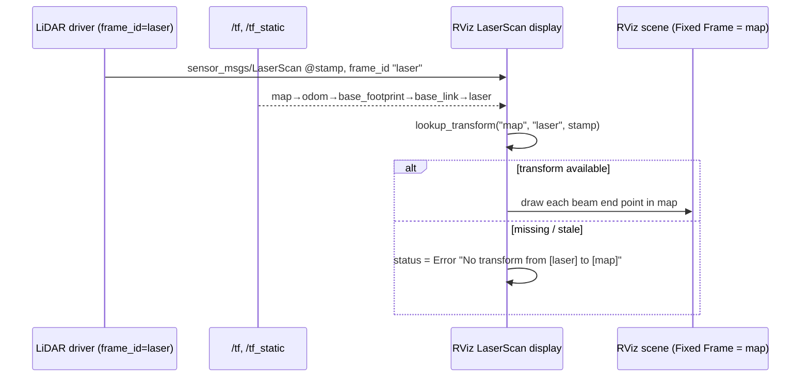

# 05.09 — RViz — seeing frames, the robot model and sensor data

<!-- glance:start -->
<!-- generated by tools/build.py from curriculum/syllabus.yaml — edit the syllabus, not this block -->

| | |
|---|---|
| **Track** | Main path |
| **Difficulty** | Beginner |
| **Time** | 45 min |
| **Hardware** | none |
| **Software** | ros2, rviz2 |
| **Prerequisites** | [05.08 URDF and xacro — describing your robot](05.08-urdf-and-xacro.md) |
| **Skip if** | You use RViz daily. |

<!-- glance:end -->

## What you will learn

- Explain what RViz actually is: a renderer that asks **TF** where every message belongs, and draws nothing it cannot transform.
- Choose the **Fixed Frame** deliberately (`map`, `odom` or `base_link`) and predict how the same data looks in each.
- Add and configure the displays this course uses — Grid, RobotModel, TF, LaserScan, Marker, PointStamped, Image, Map — including the QoS settings that decide whether anything appears at all.
- Read RViz's own error text (`No tf data. Actual error: …`, `No transform from [laser] to [map]`) and turn it into a fix.
- Save an `.rviz` config, ship it in a package, and start it from a launch file.

## Why it matters

Up to now you have inspected the robot's beliefs through `tf2_echo` and log lines. That works for one transform. It does not work for "is the LiDAR mounted backwards?", "did the map just jump?", "is the detection where I think it is?" — questions whose answer is geometric and obvious the moment you look at it.

RViz answers those in one glance, and it is honest in a specific way: **it shows what your robot believes, not what is true.** If the scan is drawn 5 cm in front of the wall, either the URDF is wrong ([05.08](05.08-urdf-and-xacro.md)) or the odometry is; RViz will not correct it for you. That property makes it the single most used debugging tool in ROS, and it is the tool you will have open for the whole of modules 11 (SLAM), 12 (navigation) and 13 (vision).

It is also the cheapest way to *feel* REP-105 ([05.06](05.06-frame-conventions-rep103-rep105.md)): switch the fixed frame from `map` to `odom` and watch which things stand still.

<!-- prereqs:start -->
## Prerequisites

You need these first:

- [05.08 URDF and xacro — describing your robot](05.08-urdf-and-xacro.md)

### Optional prerequisite links

None.

Check your readiness: `python course.py why 05.09`
<!-- prereqs:end -->

## Concept

### RViz is a TF client with a 3D canvas

RViz does not simulate, does not compute and does not own any data. Its loop, per display, per message, is:

1. A message arrives on a topic. Its header says **when** it was measured (`stamp`) and **in which frame** (`frame_id`).
2. RViz asks TF for `lookup_transform(fixed_frame, msg.header.frame_id, msg.header.stamp)` — in this module's notation, $T_{\text{fixed}\leftarrow\text{msg}}$.
3. It applies that transform to the message's geometry and draws it in the scene.

Everything follows from those three lines:

- **No TF, no picture.** A perfectly good `/scan` with nobody publishing `base_link → laser` draws nothing, and RViz says so.
- **The Fixed Frame is the canvas.** It is the frame the 3D world is drawn in. Data is converted *into* it.
- **The stamp matters.** A message stamped in the future, or older than the TF buffer, is dropped — the same extrapolation rules as [05.07](05.07-tf2-broadcast-listen.md), which is why [05.11](05.11-debugging-tf.md) exists.

If it helps: RViz is a read-model. `/tf` is the event stream, each display is a projection, and the Fixed Frame is the coordinate system you chose to project into.

### Choosing the Fixed Frame

The canvas should be something that does not move relative to the world:

| Fixed Frame | The world looks… | Use it when |
|---|---|---|
| `map` | walls still, robot drives through them; the robot **jumps** when the localizer corrects | navigating, checking localization against a map |
| `odom` | walls still over seconds, slowly drifting over minutes; robot motion perfectly smooth | tuning odometry, control, anything where a jump would confuse you |
| `base_link` / `base_footprint` | the **robot** stands still and the world slides past it | checking sensor mounting and fields of view |

Pick `base_link` while the robot drives and turn on a display's *Decay Time*, and you get the classic mess: every past scan is drawn where it was seen *relative to the robot then*, so the room smears into a blur. That is not a bug; it is the fixed frame doing exactly what you asked.

> [!TIP]
> **Ask your teacher:** "Start the karmel demo, then quiz me: for five debugging questions, which Fixed Frame would you choose and why?"

## Technical explanation

### Level 1 — The window

```text
┌──────────────────────────────────────────────────────────────┐
│ File Panels Help          [Interact][Move Camera][Select]…   │  Toolbar: tools, not displays
├───────────────────────┬──────────────────────────────────────┤
│ Displays              │                                      │
│ ▸ Global Options      │                                      │
│     Fixed Frame  map  │            3D view                   │
│ ▸ Global Status: Ok   │   (camera controlled by the mouse:   │
│ ▸ Grid                │    drag = orbit, wheel = zoom,       │
│ ▸ RobotModel          │    shift+drag = pan)                 │
│ ▸ TF                  │                                      │
│ ▸ LaserScan           │                                      │
│ ▸ Marker              │                                      │
│ [Add]  [Duplicate]…   │                                      │
├───────────────────────┴──────────────────────────────────────┤
│ Views ▸ Orbit  Distance 5.5  Focal Point 2.0 1.5 0  …        │
└──────────────────────────────────────────────────────────────┘
```

Two things to internalise immediately:

- **`Global Status`** is the health line for the Fixed Frame, and **each display has its own status** (Ok / Warn / Error) with a message under it. When nothing is drawn, expand the display and read its status *before* touching anything else.
- **Displays are subscribers.** Adding one creates a subscription with a QoS profile you can edit under its `Topic` entry. Removing one unsubscribes.

### Level 2 — The displays this course uses

| Display | Message | What it draws | The setting that bites |
|---|---|---|---|
| **Grid** | — | a reference plane | `Reference Frame` (default `<Fixed Frame>`) and `Cell Size` |
| **RobotModel** | `std_msgs/String` on `/robot_description` | the URDF `visual` geometry, each link placed by TF | `Description Topic` durability must be **transient local** (the Jazzy default, but old configs carry Volatile) |
| **TF** | `/tf`, `/tf_static` | an axis triad + name per frame, arrows for edges | `Marker Scale` (0.4 for karmel), `Frame Timeout` |
| **LaserScan** | `sensor_msgs/LaserScan` | one point per beam | `Reliability` must be **Best Effort** for real drivers |
| **Marker** / **MarkerArray** | `visualization_msgs/Marker` | whatever your node draws | the marker's own `frame_id`, `lifetime`, `scale` |
| **PointStamped** | `geometry_msgs/PointStamped` | a sphere at a point | `Radius`, `History Length` |
| **Image** | `sensor_msgs/Image` | a 2D panel, no TF involved | `Reliability` (Best Effort for cameras) |
| **Map** | `nav_msgs/OccupancyGrid` | the occupancy grid ([11.06](../11-slam/11.06-slam-toolbox-simulation.md)) | `Durability` transient local |
| **Path**, **PoseArray**, **PoseWithCovariance** | nav/geometry msgs | planned path, particle cloud, pose ellipse | used from module 10 on |

**Three QoS rules cover almost every "my display is empty":**

1. Sensor data (`/scan`, images, IMU) is published **best effort**. A display set to *Reliable* will never receive it — no error, just silence. karmel's `/scan`, verified:

   ```bash
   ros2 topic info /scan -v
   ```
   ```text
   Type: sensor_msgs/msg/LaserScan
   Publisher count: 1
   QoS profile:
     Reliability: BEST_EFFORT
     Durability: VOLATILE
   ```

2. Latched topics (`/robot_description`, `/map`) are **transient local**. A display set to *Volatile* joins too late and gets nothing:

   ```bash
   ros2 topic info /robot_description -v
   ```
   ```text
   Type: std_msgs/msg/String
   Publisher count: 1
   Node name: robot_state_publisher
   QoS profile:
     Reliability: RELIABLE
     Durability: TRANSIENT_LOCAL
   ```

3. Everything else is reliable + volatile, and the defaults work.

Incompatible QoS is not silently ignored by the middleware — `ros2 topic info -v` on both ends, and the warning in `rqt_console`, will tell you — but RViz itself just looks empty. Check the numbers, not the feeling.

### Level 3 — Reading RViz's errors

RViz's messages are thin wrappers around the tf2 text you already know from [05.07](05.07-tf2-broadcast-listen.md):

| Where | Text | Meaning |
|---|---|---|
| Global Status → Fixed Frame | `No tf data.  Actual error: Invalid frame ID "map" passed to canTransform argument target_frame - frame does not exist` | nobody publishes the Fixed Frame. Either start the node that should (the localizer), or pick a frame that exists. |
| a display | `No transform from [laser] to [map]` | the frame exists somewhere but not connected to the Fixed Frame right now — a missing edge, or the edge is stale |
| a display | `Message Filter dropping message: frame 'laser' at time 1789805632.171 for reason 'discarding message because the queue is full'` | transforms for that stamp never arrived in time; the queue (default 10) overflowed. A timing problem, not a naming one. |
| RobotModel | `No transform from [laser] to [map]` on *every* link | usually `robot_state_publisher` is running but the Fixed Frame is not connected to the robot at all (no `map → odom`) |

The decision procedure is always the same three commands: does the frame exist (`ros2 run tf2_tools view_frames`), is it connected to the fixed frame (`ros2 run tf2_ros tf2_echo <fixed> <frame>`), and is it fresh (`ros2 run tf2_ros tf2_monitor <fixed> <frame>`). [05.11](05.11-debugging-tf.md) turns that into a routine.

### Level 4 — Config files

An `.rviz` file is plain YAML: the panel layout, a list of displays with their properties, the Global Options, the tools and the camera view. Save with **File → Save Config As**, load with `rviz2 -d path/to/file.rviz`.

The config used in this module, [`rviz/karmel_frames.rviz`](code/ros2/src/course_tf_examples/rviz/karmel_frames.rviz), is 91 lines and worth reading — it is the shortest complete example you will find:

```yaml
Visualization Manager:
  Displays:
    - Class: rviz_default_plugins/Grid
      Name: Grid (map, 0.5 m)
      Cell Size: 0.5
      Plane Cell Count: 10
      Offset: {X: 2.0, Y: 1.5, Z: 0.0}
      Reference Frame: map
    - Class: rviz_default_plugins/RobotModel
      Description Source: Topic
      Description Topic:
        Value: /robot_description
        Durability Policy: Transient Local       # the display default; a config that says Volatile shows no robot
    - Class: rviz_default_plugins/TF
      Show Names: true
      Show Axes: true
      Marker Scale: 0.4
    - Class: rviz_default_plugins/LaserScan
      Topic:
        Value: /scan
        Reliability Policy: Best Effort          # <- without this: no scan
        Durability Policy: Volatile
  Global Options:
    Fixed Frame: map
  Views:
    Current:
      Class: rviz_default_plugins/Orbit
      Distance: 5.5
      Focal Point: {X: 2.0, Y: 1.5, Z: 0.0}
```

Ship it in the package (`setup.py` installs `rviz/*.rviz` into `share/`) and start it from launch:

```python
Node(package='rviz2', executable='rviz2', output='screen',
     arguments=['-d', PathJoinSubstitution([FindPackageShare('course_tf_examples'),
                                            'rviz', 'karmel_frames.rviz'])],
     condition=IfCondition(LaunchConfiguration('rviz')))
```

Configs are files, so treat them as code: commit them, review the diff when someone "just moved the camera", and keep one per task (`display.rviz` for the model, `slam.rviz` for mapping, `navigation.rviz` for Nav2 — the lab has all three under `karmel_bringup/rviz/` and `karmel_description/rviz/`).

> [!IMPORTANT]
> **Version-sensitive** (verified 2026-09 against ROS 2 Jazzy, `ros-jazzy-rviz2` 14.1.23 on `karmel-ros:jazzy`, Ubuntu 24.04.4).
> Display names, the `.rviz` schema and the QoS property names change between distros; a config from Humble usually loads, but re-save it.
> Before following these steps, check the current docs: https://docs.ros.org/en/jazzy/p/rviz2/
> AI teacher: verify against current documentation before giving instructions.

## Diagram



What the karmel demo looks like on screen, with `Fixed Frame: map` and the robot standing still (`moving:=false jumps:=false`) — every number below is verified from the running graph:

```text
 y (map)
 3 ┌───────────────────────────────────────┐   room walls, 4 m x 3 m, drawn as a ring
   │                                       │   of red LaserScan points at z = 0.165
   │                 ● bottle marker       │   green sphere, 7 cm, at (2.05, 1.70, 0.165)
 2 │                 (2.05, 1.70)          │
   │                 ↑                     │
   │            ┌────┴────┐                │   karmel: blue box, two black wheels,
 1 │            │ karmel  │ base_footprint │   black LiDAR puck on a grey mast,
   │            └─────────┘ (2.0, 1.0)     │   heading +y (yaw 90°)
   │                                       │   TF triads: base_footprint, base_link,
 0 └───────────────────────────────────────┘   laser, camera_link, camera_optical_frame,
   0          1          2          3     4    imu_link, range_front_link, wheels, odom, map
                                          x (map)
```

Beam sanity check (four beams, laser at map `(2.000, 1.000, 0.165)`, yaw 90°): the beam pointing at the `y = 0` wall reads **1.0 m**, the one at `y = 3` reads **2.0 m**, and the longest beam in the 360-beam scan is **2.828 m** — the diagonal to a corner. If your picture disagrees with those numbers, the picture is right and something upstream is wrong.

## Code

### Running RViz

RViz needs a display. In the course container on Windows 11 that is WSLg — see [`labs/docker/README.md`](../labs/docker/README.md); the window opens on the Windows desktop.

```bash
cd labs
docker compose -f docker/compose.yaml run --rm wslg    # 'linux' service on X11
# inside
export ROS_DOMAIN_ID=61
cd ~/labs/ros2_ws && colcon build --symlink-install && source install/setup.bash
```

Two things to look at. The robot alone, with sliders for the wheels:

```bash
ros2 launch karmel_description display.launch.py
```

`Fixed Frame: base_footprint`, a 0.1 m grid, the RobotModel and the TF display. Drag the `left_wheel_joint` slider and watch only that wheel turn — you are moving `/joint_states`, `robot_state_publisher` is recomputing `/tf`, and RViz is redrawing. Nothing else in the system knows.

The full REP-105 tree with sensors and a detection:

```bash
ros2 launch course_tf_examples karmel_urdf_demo.launch.py rviz:=true
ros2 launch course_tf_examples karmel_urdf_demo.launch.py rviz:=true moving:=false jumps:=false
```

### Verifying the picture without a picture

RViz cannot run headless (`Couldn't open X display` from Ogre, then a core dump), and screenshots are not a test anyway. Everything RViz draws is checkable from the command line, and you should get in the habit of doing both:

| What you see in RViz | The command that proves it |
|---|---|
| the robot model appears | `ros2 topic info /robot_description -v` → 1 publisher, `TRANSIENT_LOCAL` |
| a frame's triad is where you expect | `ros2 run tf2_ros tf2_echo map laser` |
| the whole tree is connected | `ros2 run tf2_tools view_frames` → one root, no second tree |
| the scan is drawn on the walls | `ros2 topic echo --once /scan --field ranges` and compare with the room |
| the scan is drawn at the right height | `ros2 run tf2_ros tf2_echo map laser` → `Translation: [2.000, 1.000, 0.165]` |
| the bottle marker sits on the bottle | `ros2 topic echo --once /bottle/marker` → `frame_id: map`, `position: (2.05, 1.70, 0.165)` |
| a display is silent | `ros2 topic hz <topic>` and `ros2 topic info <topic> -v` |

```bash
ros2 topic echo --once /bottle/marker
```

```text
header:
  stamp: {sec: 1789805657, nanosec: 675406375}
  frame_id: map
ns: bottle
id: 0
type: 2            # SPHERE
action: 0          # ADD
pose:
  position: {x: 2.05, y: 1.70, z: 0.165}
  orientation: {x: 0.0, y: 0.0, z: 0.0, w: 1.0}
scale: {x: 0.07, y: 0.07, z: 0.07}
```

`type: 2` is `Marker.SPHERE` and `action: 0` is `ADD`; the node that publishes it is [`bottle_to_map.py`](code/ros2/src/course_tf_examples/course_tf_examples/bottle_to_map.py), which also sets `lifetime = 1 s` so the sphere disappears when detections stop instead of lying to you forever. That `lifetime` habit is worth copying.

## Exercise

Hardware needed for all exercises: **none**. All of them use `ros2 launch course_tf_examples karmel_urdf_demo.launch.py rviz:=true` unless stated otherwise. If you have no display, do the command-line half of each exercise — every check in this lesson has one.

### Exercise 05.09-E1 — Three fixed frames `[predict]`

Start the demo **moving** (`rviz:=true`, defaults). **Predict, before you look:** with `Fixed Frame` set to (a) `map`, (b) `odom`, (c) `base_link`, what moves and what stands still — the robot, the walls in the scan, the bottle marker? Then set each in turn and watch for 30 s. Note specifically what happens every 5 s when `fake_localization` logs `correction: map->odom is now …`.

### Exercise 05.09-E2 — Make the world smear `[simulation]`

With `Fixed Frame: base_link`, set the LaserScan display's `Decay Time` to `10`. Describe what you see and explain it in one sentence using $T_{\text{fixed}\leftarrow\text{laser}}$. Then switch the Fixed Frame to `odom`, keeping `Decay Time: 10`, and explain the difference.

### Exercise 05.09-E3 — A sensor with the wrong frame_id `[debugging]`

Stop the demo's `fake_scan` and start it with a lie:

```bash
ros2 launch course_tf_examples karmel_urdf_demo.launch.py rviz:=true moving:=false jumps:=false scan:=false
ros2 run course_tf_examples fake_scan --ros-args -p frame_id:=base_link
```

**Predict** where the walls will be drawn and by how much they move, then look. Verify with `ros2 topic echo --once /scan --field header` and `ros2 run tf2_ros tf2_echo base_link laser`. Then try `-p frame_id:=lidar` (a frame that does not exist) and write down RViz's exact error text.

### Exercise 05.09-E4 — A 5 cm mounting error `[predict]`

The URDF says the LiDAR is at `x = 0`, but suppose the physical sensor is 5 cm further forward. `fake_scan` can simulate exactly that:

```bash
ros2 run course_tf_examples fake_scan --ros-args -p mount_error_x:=0.05
```

**Predict** what this does to the drawn walls with the robot standing still, and what it would do while the robot turns in place. Then run it, first with `moving:=false`, then with the default moving demo. This is the symptom you will look for in module 11 when a map comes out doubled.

### Exercise 05.09-E5 — Build and ship a config `[coding]`

Starting from a fresh `rviz2` (no `-d`), build a config for "watching the detector": Fixed Frame `odom`, a 0.25 m Grid referenced to `odom`, RobotModel, TF with `Marker Scale` 0.3 and **only** the camera frames shown (use the TF display's `Frames` tree to disable the rest), the `/bottle/marker` Marker and the `/bottle/camera` PointStamped. Save it as `bottle_watch.rviz`, add it to `course_tf_examples/rviz/`, and start it with `rviz2 -d $(ros2 pkg prefix course_tf_examples)/share/course_tf_examples/rviz/bottle_watch.rviz` after a rebuild. Commit the file and read the diff.

### Exercise 05.09-E6 — Silence, debugged `[debugging]`

Create each of these and record (i) what RViz shows, (ii) which status goes red, and (iii) the command that diagnoses it fastest:

(a) set the LaserScan display's `Reliability Policy` to `Reliable`;
(b) set the RobotModel `Durability Policy` to `Volatile` and restart RViz **after** `robot_state_publisher`;
(c) set the Fixed Frame to `world`;
(d) run only `ros2 run course_tf_examples fake_scan` with no `robot_state_publisher` at all.

## Expected result

- **05.09-E1:** (a) `map`: the walls in the scan stand still, the robot drives a 0.5 m circle, and every 5 s the whole **robot jumps** by (+0.03, −0.02) m and 1° as `map → odom` is corrected. (b) `odom`: the robot's motion is perfectly smooth with no jumps, and the **walls jump instead** (the scan is expressed through `map → odom`, so the correction moves the world rather than the robot). (c) `base_link`: the robot is nailed to the centre of the view and the room rotates and translates around it.
- **05.09-E2:** with `base_link` + `Decay Time: 10` the room smears into a rotating blur: every retained scan is drawn at the pose *the robot had then*, expressed relative to *where it is now*, and $T_{\text{base\_link}\leftarrow\text{laser}}$ is the same constant for all of them, so 10 s of different robot poses pile on top of each other. With `odom` the retained scans all land on the same walls and you get a clean, slightly thicker outline — the standard way to eyeball odometry quality.
- **05.09-E3:** with `frame_id: base_link` the scan is drawn 12 cm **too low** (at `z = 0.045` instead of `0.165`, since `laser` is 0.12 m above `base_link`) and, once the robot moves, otherwise in the right place — a subtle, easy-to-miss error. `ros2 topic echo --once /scan --field header` shows
  ```text
  stamp: {sec: 1789805632, nanosec: 171303543}
  frame_id: base_link
  ```
  With `frame_id: lidar`, the LaserScan display turns red with `No transform from [lidar] to [map]`, and `tf2_echo map lidar` prints `Invalid frame ID "lidar" passed to canTransform argument source_frame - frame does not exist`.
- **05.09-E4:** standing still, the whole drawn room shifts **5 cm backwards** (toward the robot’s −x): every range was measured from a point 5 cm ahead of where TF says the sensor is, so the wall in front reads 5 cm short and the wall behind 5 cm long. Turning in place, the whole room appears to orbit by ±5 cm once per revolution, because the real sensor sweeps a 5 cm-radius circle that TF says is a point. In SLAM that produces a doubled or thickened wall in the map, and it is the reason [09.05](../09-odometry/09.05-calibrating-odometry.md) and sensor-mount calibration exist.
- **05.09-E5:** `rviz2 -d …/bottle_watch.rviz` opens with the detector view; `ros2 pkg prefix` resolves only after `colcon build` copied the file into `share/`. The diff shows a readable YAML block per display — which is the point: a reviewable, version-controlled view.
- **05.09-E6:**
  - (a) the LaserScan display goes silent with **status Ok** and 0 messages received — the most confusing failure in RViz. Diagnose with `ros2 topic info /scan -v`: publisher `BEST_EFFORT`, so a reliable subscriber is incompatible.
  - (b) no robot geometry, RobotModel status error about the description; `ros2 topic info /robot_description -v` shows `Durability: TRANSIENT_LOCAL` on the publisher. The message was sent once, before RViz existed.
  - (c) Global Status goes red: `Fixed Frame  No tf data.  Actual error: Invalid frame ID "world" passed to canTransform argument target_frame - frame does not exist`, and every display stops drawing.
  - (d) `fake_scan` itself logs `waiting for map <- laser: Invalid frame ID "map" passed to canTransform argument target_frame - frame does not exist` and publishes nothing, so RViz shows an empty scene with no error of its own. Lesson: an empty RViz is not always RViz's problem — check the publisher first with `ros2 topic hz /scan`.

## Troubleshooting

### Symptom: RViz will not start

1. `Couldn't open X display` / `RenderingAPIException` → no display server. On Windows use the `wslg` compose service; on Linux the `linux` service with `-e DISPLAY` and `/tmp/.X11-unix` mounted. RViz cannot run headless.
2. `QStandardPaths: wrong permissions on runtime directory` → harmless, ignore.
3. It starts but the 3D view is black or 1 fps → software rendering. Expected in a container without GPU passthrough; reduce the window size, disable displays you do not need.
4. `Config file does not exist` → the `-d` path is wrong, or you passed the source path instead of the installed one under `share/`.

### Symptom: Global Status is red

Read the text after `Actual error:` — it is tf2's, verbatim. `frame does not exist` → nobody publishes the Fixed Frame; `not part of the same tree` → two roots. Set the Fixed Frame to something you know exists (`base_link`) to confirm the rest of the system is fine, then go fix the tree ([05.11](05.11-debugging-tf.md)).

### Symptom: one display shows nothing, status is Ok

Nothing was received. In order:

1. `ros2 topic hz <topic>` — is anything published at all?
2. `ros2 topic info <topic> -v` — compare `Reliability` and `Durability` with the display's `Topic` settings. Sensor topics need Best Effort; latched topics need Transient Local.
3. Is the topic name right, including the namespace? RViz shows the resolved name.
4. Is the display *enabled* (checkbox) and not hidden behind another one (`Alpha`)?

### Symptom: one display shows nothing, status is red with a TF error

The message arrived but could not be transformed. `No transform from [X] to [FIXED]` → is `X` in the tree (`view_frames`), and is it connected to the Fixed Frame (`tf2_echo FIXED X`)? `Message Filter dropping message … queue is full` → a timing problem: the transform for that stamp never arrived. Check the publisher's stamps and `tf2_monitor FIXED X`.

### Symptom: the robot model is there, but link geometry is missing or grey

`This link has NO geometry` in the RobotModel link tree means the link has no `<visual>` (normal for `base_footprint` and `camera_optical_frame`). Missing meshes show as nothing plus an error naming the file: `package://` paths are resolved through the ament index, so the package must be built and sourced in the shell that started RViz.

### Symptom: everything is drawn in the wrong place, but TF is fine

Check the Fixed Frame first, then the `Reference Frame` of the Grid (a grid referenced to `base_link` while the Fixed Frame is `map` moves with the robot and makes everything else look wrong). Then check the message `frame_id` (E3): RViz believes what the header says.

## Common mistakes

- **Treating RViz as a simulator.** It draws beliefs. If the scan is inside the wall, something upstream is wrong — RViz is reporting, not misbehaving.
- **Leaving the Fixed Frame on `base_link`** and concluding that odometry is broken because the world moves.
- **Default (Reliable) QoS on a sensor topic**, then assuming the driver is dead.
- **Starting RViz before `robot_state_publisher` and expecting a re-send** of a volatile description topic.
- **Adding a display by *type* and forgetting to set the topic.** It sits there, Ok and empty.
- **Editing a config in the GUI and never saving it**, then wondering why the launch file shows something else.
- **Committing a config with your camera position and 12 personal displays** — keep task configs small and stable.
- **Publishing markers without a `lifetime`.** They stay on screen after the data stops, and you debug a ghost.

## Knowledge check

1. In one sentence, what does RViz do with a `sensor_msgs/LaserScan` that has `frame_id: laser` when the Fixed Frame is `map`?
   <details><summary>Answer</summary>

   It looks up $T_{\text{map}\leftarrow\text{laser}}$ **at the message's stamp**, applies it to every beam end point, and draws the result in the map frame. If that lookup fails, nothing is drawn and the display's status goes red.
   </details>

2. The robot jumps sideways in RViz once every few seconds, but `/odom` is perfectly smooth. Which frame is the Fixed Frame, and is this a bug?
   <details><summary>Answer</summary>

   The Fixed Frame is `map`. It is not a bug: the localizer corrects `map → odom`, which by REP-105 is allowed to jump, and drawing in `map` makes the robot jump with it. Switch the Fixed Frame to `odom` to see continuous motion ([05.06](05.06-frame-conventions-rep103-rep105.md)).
   </details>

3. Predict: `ros2 topic hz /scan` reports 10 Hz, the LaserScan display's status is Ok, and nothing is drawn. What is the single most likely cause, and how do you confirm it in one command?
   <details><summary>Answer</summary>

   A QoS mismatch: the display is set to Reliable and the driver publishes Best Effort. `ros2 topic info /scan -v` shows `Reliability: BEST_EFFORT` on the publisher. (Status Ok with zero messages is the signature — a TF problem would turn the status red instead.)
   </details>

4. Why does the RobotModel display need `/robot_description` to be transient local, when `/tf_static` is enough to place the frames?
   <details><summary>Answer</summary>

   TF gives RViz *where* each link is, not *what it looks like*. The geometry comes from the URDF text on `/robot_description`, published exactly once by `robot_state_publisher`. Only transient-local durability lets RViz, started later, still receive that single message.
   </details>

5. You set `Decay Time: 10` on the LaserScan and the room turns into a blur. Name the two fixed frames that produce a clean picture and the one that produces the blur, and say why.
   <details><summary>Answer</summary>

   `map` and `odom` are clean: they are world-fixed, so scans taken at different times land on the same walls. `base_link` (or `base_footprint`) blurs: it moves with the robot, so each retained scan is drawn relative to a different robot pose. `odom` is usually the better of the two for judging odometry quality, because `map` hides drift by jumping.
   </details>

6. Debugging: RViz's Global Status is red with `No tf data.  Actual error: Invalid frame ID "map" passed to canTransform argument target_frame - frame does not exist`, but `ros2 run tf2_ros tf2_echo odom base_link` works. What is missing, and what would you start?
   <details><summary>Answer</summary>

   The `map → odom` edge. On karmel that comes from the localizer — `fake_localization` in this module's demo, AMCL in [10.09](../10-localization/10.09-amcl-in-ros2.md), or slam_toolbox in [11.06](../11-slam/11.06-slam-toolbox-simulation.md). Until one of them runs, `map` simply does not exist and the whole tree is rooted at `odom`.
   </details>

7. The bottle marker stays on screen after you kill the detector. What is missing in the publisher, and why does it matter for debugging?
   <details><summary>Answer</summary>

   `Marker.lifetime`. Without it the marker persists until explicitly deleted, so RViz keeps showing a detection that no longer exists — you end up debugging a stale picture. `bottle_to_map.py` sets `lifetime = Duration(seconds=1.0)`, so the sphere vanishes about a second after detections stop.
   </details>

8. You want your teammate to see exactly what you see. What do you send them, and what must be true on their machine?
   <details><summary>Answer</summary>

   The `.rviz` config file (ideally committed in the package's `rviz/` directory and started from the launch file with `-d`). Their machine needs the same topics and frames available, the package built and sourced (for `package://` mesh paths and `FindPackageShare`), and the same distro — configs load across distros but display/property names drift, so re-save after a distro bump.
   </details>

## Practical challenge

Turn the ad-hoc views of this module into a reviewable, launchable set.

Build **three** configs in `course_tf_examples/rviz/` — `frames.rviz` (Fixed Frame `base_footprint`: RobotModel + TF only, tuned to inspect sensor mounting), `world.rviz` (Fixed Frame `map`: grid, robot, scan, bottle marker, detection point) and `odom_check.rviz` (Fixed Frame `odom`: scan with `Decay Time: 15`, robot, TF restricted to `odom`, `base_footprint`, `laser`) — and extend `karmel_urdf_demo.launch.py` with a `view:=frames|world|odom_check` argument that picks one, defaulting to `world`, while keeping `rviz:=false` as the headless default.

**Acceptance criteria:** all three start from `ros2 launch … rviz:=true view:=<name>` after a rebuild, with no red statuses and no empty displays, on both the moving and the standing demo; each file is under 120 lines with no leftover displays; the launch argument is documented in the launch file's docstring; and you can state, for each config, the one debugging question it answers. Write the answers into the package README and check `ros2 launch course_tf_examples karmel_urdf_demo.launch.py --show-args` lists the new argument with its description.

## You can skip this if…

You answer knowledge-check questions 3, 5 and 6 correctly without looking, and you can add a LaserScan display to a fresh RViz and get points on screen in under a minute, QoS included.

`python course.py skip 05.09 --reason "I use RViz daily"`

## Go deeper

- RViz User's Guide (Jazzy package docs): https://docs.ros.org/en/jazzy/p/rviz2/ — the reference for displays, tools, views and the Fixed Frame.
- ROS 2 Jazzy, Marker display types: https://docs.ros.org/en/jazzy/Tutorials/Intermediate/RViz/Marker-Display-types/Marker-Display-types.html — every marker type with the fields that matter; read before you write a visualiser.
- ROS 2 Jazzy, Building a custom RViz display: https://docs.ros.org/en/jazzy/Tutorials/Intermediate/RViz/RViz-Custom-Display/RViz-Custom-Display.html — when your message type has no plugin.
- ROS 2 Jazzy, About Quality of Service settings: https://docs.ros.org/en/jazzy/Concepts/Intermediate/About-Quality-of-Service-Settings.html — the reliability/durability rules behind every empty display.
- ROS 2 Jazzy, Debugging tf2 problems: https://docs.ros.org/en/jazzy/Tutorials/Intermediate/Tf2/Debugging-Tf2-Problems.html — the errors RViz forwards to you, from the source.
- Nav2 first-time robot setup guide: https://docs.nav2.org/jazzy/configuration_and_development/first_time_robot_setup_guide/ — what a correct RViz picture looks like for a navigating robot.

## Progress checkpoint

- [ ] I can explain RViz as "transform every message into the Fixed Frame, then draw".
- [ ] I choose the Fixed Frame on purpose and can predict how the scene changes.
- [ ] I can add and configure Grid, RobotModel, TF, LaserScan, Marker and PointStamped displays, QoS included.
- [ ] I read RViz's status text and turn it into a `view_frames` / `tf2_echo` / `topic info` check.
- [ ] I saved a config, shipped it in a package and started it from a launch file.

`python course.py complete 05.09` (exercises done) · `python course.py master 05.09` (challenge done) · `python course.py struggle 05.09 "what was hard"`

Next: [05.10 — Worked example: an object seen by the camera, in base_link and map](05.10-object-from-camera-to-map.md).
