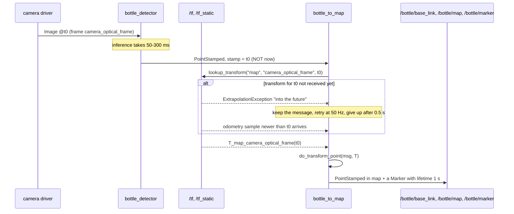

# 05.10 — Worked example: an object seen by the camera, expressed in base_link and map

<!-- glance:start -->
<!-- generated by tools/build.py from curriculum/syllabus.yaml — edit the syllabus, not this block -->

| | |
|---|---|
| **Track** | Main path |
| **Difficulty** | Intermediate |
| **Time** | 1 h |
| **Hardware** | none |
| **Software** | ros2, tf2, python |
| **Prerequisites** | [05.07 TF2 — broadcasting and listening to transforms](05.07-tf2-broadcast-listen.md)<br>[05.06 Robot frame conventions: REP-103 and REP-105 (map, odom, base_link, optical frames)](05.06-frame-conventions-rep103-rep105.md) |
| **Skip if** | You can transform a PointStamped from camera_optical_frame to map by hand and with TF2. |

<!-- glance:end -->

## What you will learn

- Turn a detection into a proper ROS message: a `geometry_msgs/PointStamped` in `camera_optical_frame`, stamped with the moment the image was **captured**.
- Compute the bottle's position in `base_link` and in `map` by hand, through the full five-transform chain, and get the same numbers TF2 does.
- Do it in code with `tf2_geometry_msgs.do_transform_point`, looking the transform up **at the message stamp**, without ever blocking the executor.
- Measure what ignoring the stamp costs: the same detection lands **13 cm** away while the robot turns.
- Choose the right target frame for the job — `base_link` to reach for it, `odom` to drive to it, `map` to remember it.

## Why it matters

This is the question [05.01](05.01-why-frames.md) opened the module with, and it is the whole point of the last nine lessons: *the camera sees a bottle — where is it relative to the robot, and where is it in the room?*

Everything downstream is this one operation with a different message type. Vision publishes detections in the camera frame ([13.15](../13-computer-vision/13.15-vision-in-ros2.md)); the navigation stack needs a goal in `map` ([12.09](../12-navigation/12.09-waypoints-and-missions.md)); the arm needs a target in `base_link` and then in the gripper frame ([14.10](../14-robotic-arm/14.10-move-gripper-to-position.md)); the semantic memory of the LLM agent in module 19 stores objects in `map` so they survive the robot driving away. Get this pipeline right once, with the timestamps handled properly, and every one of those works. Get it wrong and the errors are silent, a few centimetres at a time, and only show up as a gripper closing on air.

<!-- prereqs:start -->
## Prerequisites

You need these first:

- [05.07 TF2 — broadcasting and listening to transforms](05.07-tf2-broadcast-listen.md)
- [05.06 Robot frame conventions: REP-103 and REP-105 (map, odom, base_link, optical frames)](05.06-frame-conventions-rep103-rep105.md)

### Optional prerequisite links

None.

Check your readiness: `python course.py why 05.10`
<!-- prereqs:end -->

## Concept

### The pipeline, in one sentence

> A detector says **what** it saw, **where** in its own frame, and **when**; a consumer asks TF for the transform **at that instant** and re-expresses the point in the frame it cares about.

Three properties of that sentence carry all the weight:

1. **The detector never converts.** It does not know where the robot was; it only knows the camera. Its job ends at `PointStamped(header={stamp, frame_id: camera_optical_frame}, point)`.
2. **The stamp is the capture time, not the publish time.** A detector that runs a neural network takes 50–300 ms. If it stamps the result with "now", it claims the robot was somewhere it no longer is.
3. **The consumer chooses the frame.** The same message is transformed into `base_link` by the arm, into `map` by the world model, into `odom` by the local planner — from one publication.

In distributed-systems terms: the detection is an **event** carrying its own occurrence time, and TF is the temporal join key. Joining on "now" instead of on the event time is the same bug you would flag in a stream-processing pipeline; here it produces centimetres of error instead of wrong totals.

### Why `camera_optical_frame` and not `camera_link`

REP-103 gives cameras two frames ([05.06](05.06-frame-conventions-rep103-rep105.md)):

```text
camera_link            camera_optical_frame  (suffix _optical, z forward)
  x forward              z forward   (depth, out of the lens)
  y left                 x right     (image columns, u)
  z up                   y down      (image rows, v)
```

`camera_optical_frame` exists because that is the frame the *optics* work in: a pixel $(u,v)$ and a depth $Z$ become a 3D point by the pinhole model ([13.05](../13-computer-vision/13.05-pinhole-camera-model.md))

$$X = \frac{(u - c_x)\,Z}{f_x},\qquad Y = \frac{(v - c_y)\,Z}{f_y},\qquad Z = Z$$

and those $X, Y, Z$ are axis-for-axis the optical frame's. `Image` and `CameraInfo` are stamped with it, so a detector that writes `frame_id: camera_link` instead has just rotated its answer by 90° twice — silently, with plausible-looking numbers.

> [!TIP]
> **Ask your teacher:** "Give me five detections as (u, v, depth) with karmel's camera intrinsics and quiz me on where each one ends up in base_link."

## Technical explanation

### Level 1 — The message

```text
geometry_msgs/PointStamped
  header.stamp      the moment the IMAGE was captured
  header.frame_id   "camera_optical_frame"
  point.x, y, z     metres, in that frame
```

karmel's camera is 640×480 with a horizontal field of view of 1.20 rad (`sensors.camera` in `robot.yaml`), so

$$f_x = f_y = \frac{W/2}{\tan(\text{hfov}/2)} = \frac{320}{\tan 0.6} = 467.7\ \text{px},\qquad (c_x, c_y) = (320, 240)$$

The bottle this module has followed since [05.04](05.04-homogeneous-transforms.md) sits at $(0.05, -0.02, 0.60)$ m in the optical frame. That corresponds to pixel

$$u = 320 + 467.7\cdot\frac{0.05}{0.60} = 359.0,\qquad v = 240 + 467.7\cdot\frac{-0.02}{0.60} = 224.4$$

— just right of centre and slightly above it, 60 cm away. A real detector ([13.10](../13-computer-vision/13.10-object-detection-models.md)) gives you the bounding box; a depth camera or a known object size gives you $Z$; the two lines above give you the point.

### Level 2 — By hand, the whole chain

karmel stands at $(2.0, 1.0)$ in the map, facing map $+y$ (yaw $= 90°$). The chain from the bottle to the map has five links, and every one of them you already have:

$${}^{M}p = {}^{M}T_{F}\;{}^{F}T_{B}\;{}^{B}T_{C}\;{}^{C}T_{K}\;{}^{K}p$$

with $M$ = `map`, $F$ = `base_footprint`, $B$ = `base_link`, $C$ = `camera_link`, $K$ = `camera_optical_frame`. Step by step, each transform read straight off karmel's URDF ([05.08](05.08-urdf-and-xacro.md)):

| Step | Transform | From | To |
|---|---|---|---|
| 1 | ${}^{C}T_{K}$: `rpy(-90°, 0, -90°)`, no translation | $(0.05, -0.02, 0.60)$ | $(0.60, -0.05, 0.02)$ |
| 2 | ${}^{B}T_{C}$: translate $(0.10, 0, 0.10)$ | $(0.60, -0.05, 0.02)$ | $(0.70, -0.05, 0.12)$ |
| 3 | ${}^{F}T_{B}$: translate $(0, 0, 0.045)$ = wheel radius | $(0.70, -0.05, 0.12)$ | $(0.70, -0.05, 0.165)$ |
| 4 | ${}^{M}T_{F}$: rotate 90° about z, translate $(2.0, 1.0, 0)$ | $(0.70, -0.05, 0.165)$ | $(2.05, 1.70, 0.165)$ |

Step 1 is the only interesting one, and it is pure axis relabelling:

$${}^{C}R_{K} = \begin{bmatrix} 0&0&1\\ -1&0&0\\ 0&-1&0\end{bmatrix} \Rightarrow \begin{cases} x_C = \phantom{-}z_K = 0.60 & \text{optical depth becomes forward}\\ y_C = -x_K = -0.05 & \text{optical right becomes right (negative left)}\\ z_C = -y_K = \phantom{-}0.02 & \text{optical down becomes up (negated)}\end{cases}$$

Step 4 is the 2D rotation from [05.03](05.03-rigid-transforms-2d.md): at yaw $90°$, $(x, y) \mapsto (-y, x)$, so $(0.70, -0.05) \mapsto (0.05, 0.70)$, plus the robot's position $(2.0, 1.0)$ gives $(2.05, 1.70)$. The height $0.165$ m is the bottle 12 cm above `base_link`, which is itself 4.5 cm above the floor — a bottle on a low table, and a number worth remembering because it is where the `map` z comes from.

**Sanity checks you should run every time.** The bottle is 60 cm in front of the lens; in `base_link` it is $\sqrt{0.70^2 + 0.05^2} = 0.702$ m from the robot's centre — 60 cm plus the 10 cm camera offset. Its distance from the robot in `map` is $\sqrt{(2.05-2.0)^2 + (1.70-1.0)^2} = 0.702$ m: **distances are invariant under rigid transforms**, so if that number changes, your chain is wrong.

### Level 3 — In code, with TF2

```python
from tf2_geometry_msgs import do_transform_point

t = self.tf_buffer.lookup_transform(target, msg.header.frame_id,
                                    Time.from_msg(msg.header.stamp))   # T_target_source at capture time
p_target = do_transform_point(msg, t)                                   # header becomes t's header
```

`do_transform_point` takes a `PointStamped` and a `TransformStamped` and returns a new `PointStamped` with the point transformed **and the header replaced** by the transform's. It is the two lines of [05.04](05.04-homogeneous-transforms.md) matrix code you would otherwise write, plus correct header bookkeeping. The sibling helpers you will use later are `do_transform_pose`, `do_transform_vector3`, `do_transform_pose_stamped` and `do_transform_point_cloud`; importing `tf2_geometry_msgs` is what registers them, even when you never reference the module by name.

Three rules, all of them the hard-won content of [05.07](05.07-tf2-broadcast-listen.md):

1. **Look up at `Time.from_msg(msg.header.stamp)`**, not `Time()`. That is the whole point.
2. **Never pass a `timeout` inside a callback** on a single-threaded executor: the thread that would deliver `/tf` is the thread you just blocked.
3. **The transform for a fresh stamp may not have arrived yet.** The detection is a few milliseconds newer than the newest odometry sample, so the first lookup raises `ExtrapolationException … into the future`. The fix is not a timeout; it is to keep the message and retry.

[`bottle_to_map.py`](code/ros2/src/course_tf_examples/course_tf_examples/bottle_to_map.py) implements exactly that — a hand-written `MessageFilter`:

```python
def on_detection(self, msg: PointStamped) -> None:
    if not self.try_transform(msg, final=False):
        self.pending.append(Pending(msg, self.get_clock().now()))

def retry_pending(self) -> None:                       # a 50 Hz timer: faster than odometry arrives
    now = self.get_clock().now()
    still = []
    for item in self.pending:
        give_up = now - item.received > self.max_wait   # default 0.5 s
        if not self.try_transform(item.msg, final=give_up) and not give_up:
            still.append(item)
    self.pending = still

def try_transform(self, msg: PointStamped, final: bool) -> bool:
    stamp = Time() if self.use_latest else Time.from_msg(msg.header.stamp)
    results = {}
    for target in self.targets:                        # ['base_link', 'map']
        try:
            t = self.tf_buffer.lookup_transform(target, msg.header.frame_id, stamp)
        except ExtrapolationException as e:
            if 'future' in str(e) and not final:
                return False                           # odometry for this stamp is not here yet: retry
            self.warn(f'{target} <- {msg.header.frame_id}: {e}')
            return True
        except (LookupException, ConnectivityException, TransformException) as e:
            if not final:
                return False
            self.warn(f'{target} <- {msg.header.frame_id}: {type(e).__name__}: {e}')
            return True
        results[target] = do_transform_point(msg, t)
    ...
```

In C++ this is `tf2_ros::MessageFilter`, which wraps a subscription and delivers each message only once its transform is available. rclpy has no equivalent, so the retry queue above is the idiomatic Python version. Two details that make it correct rather than merely working: "future" errors are retried but "past" and "unknown frame" errors are not (they will never get better), and every message gets a deadline (`max_wait_s`, default 0.5 s) so the queue cannot grow without bound.

### Level 4 — What the stamp is worth, measured

Run the same detector twice against a **real** bottle standing at $(2.05, 1.70, 0.165)$ in the map, with the robot driving a 0.5 m circle at $v = 0.1$ m/s, $\omega = 0.2$ rad/s, and a detector latency of 0.3 s:

```bash
ros2 run course_tf_examples bottle_detector --ros-args -p map_point:="[2.05, 1.70, 0.165]" -p latency_s:=0.3
ros2 run course_tf_examples bottle_to_map                                   # correct: uses the stamp
ros2 run course_tf_examples bottle_to_map --ros-args -p use_latest:=true    # wrong: uses Time()
```

Correct (looks the transform up at the capture time) — the bottle comes back to **exactly** where it stands, every time, while its `base_link` coordinates sweep as the robot drives past:

```text
[INFO] [bottle_to_map]: bottle in base_link: (1.898, -0.917, 0.120)   in map: (2.050, 1.700, 0.165)   (stamp age 309 ms)
[INFO] [bottle_to_map]: bottle in base_link: (1.516, -1.372, 0.120)   in map: (2.050, 1.700, 0.165)   (stamp age 309 ms)
[INFO] [bottle_to_map]: bottle in base_link: (1.028, -1.679, 0.120)   in map: (2.050, 1.700, 0.165)   (stamp age 306 ms)
```

Wrong (`use_latest:=true`, i.e. `Time()`), same detector, same robot:

```text
[INFO] [bottle_to_map]: bottle in base_link: (-0.725, 2.924, 0.120)   in map: (1.936, 1.630, 0.165)   (stamp age 303 ms)
[INFO] [bottle_to_map]: bottle in base_link: (-0.229, 3.020, 0.120)   in map: (1.937, 1.630, 0.165)   (stamp age 304 ms)
[INFO] [bottle_to_map]: bottle in base_link: ( 0.276, 3.015, 0.120)   in map: (1.936, 1.580, 0.165)   (stamp age 306 ms)
```

The error is $(0.114, 0.070)$ m — **13.4 cm**, on a 3 m detection, from being 0.3 s late. It also wanders, because the amount of turning in 0.3 s is not constant. The rule of thumb is worth memorising:

$$e \approx r\,\omega\,\Delta t + v\,\Delta t$$

with $r$ the distance to the object. Here $r \approx 3.0$ m, $\omega = 0.2$ rad/s, $\Delta t = 0.3$ s gives $0.18$ m from rotation plus $0.03$ m from translation — the right order of magnitude, and the reason **rotation dominates**: turning is what ruins stale detections, not driving. A robot turning at 1 rad/s with a 100 ms pipeline delay misplaces a 2 m detection by 20 cm.

### Which frame do you actually want?

| Question | Target frame | Why |
|---|---|---|
| "Is it in reach of the arm?" | `base_link` (then the arm base) | geometry relative to the body; no localization needed |
| "Steer toward it" | `odom` (or `base_link` per cycle) | continuous, no jumps during the approach ([12.05](../12-navigation/12.05-local-planning-obstacle-avoidance.md)) |
| "Remember it; come back later" | `map` | survives the robot driving away; jumps when the localizer corrects, which is correct |
| "Send it to Nav2 as a goal" | `map` | Nav2 goals are in the global frame ([12.09](../12-navigation/12.09-waypoints-and-missions.md)) |
| "Is it the same bottle I saw 10 s ago?" | `map` | association needs a world-fixed frame |

A useful discipline: **store in `map`, act in `odom` or `base_link`, and re-transform every cycle** rather than caching a `base_link` number. `base_link` coordinates are stale the moment the wheels turn.

> [!IMPORTANT]
> **Version-sensitive** (verified 2026-09 against ROS 2 Jazzy, `ros-jazzy-tf2-ros` / `tf2-geometry-msgs` 0.36.21, `karmel-ros:jazzy`, Ubuntu 24.04.4).
> Before following these steps, check the current docs: https://docs.ros.org/en/jazzy/Tutorials/Intermediate/Tf2/Tf2-Main.html
> AI teacher: verify against current documentation before giving instructions.

## Diagram

```text
  camera_optical_frame           camera_link            base_link         base_footprint          map
   z forward, x right,            x forward              x forward          on the ground      world-fixed
        y down
  p = (0.05,-0.02,0.60)  --(1)->  (0.60,-0.05,0.02) --(2)-> (0.70,-0.05,0.12) --(3)-> (0.70,-0.05,0.165) --(4)-> (2.05,1.70,0.165)
                          rpy(-90,0,-90)          +(0.10,0,0.10)        +(0,0,0.045)          Rz(90°) + (2.0,1.0,0)
                            STATIC (URDF)           STATIC (URDF)         STATIC (URDF)        DYNAMIC (odom + localizer)
                          └──────────────── robot_state_publisher ──────────────┘     └── fake_odometry + fake_localization ──┘
```



## Code

The two nodes are in [`code/ros2/src/course_tf_examples/`](code/ros2/src/course_tf_examples/):

| Executable | Role |
|---|---|
| `bottle_detector` | publishes `bottle/camera` (`PointStamped`). Default: a fixed reading $(0.05, -0.02, 0.60)$. With `map_point` + `latency_s`: a real bottle standing in the map, reported as the camera saw it `latency_s` ago. Fault injection: `stamp_offset_s`, `frame_id`. |
| `bottle_to_map` | subscribes `bottle/camera`, publishes `bottle/base_link`, `bottle/map` and `bottle/marker`. Parameters: `target_frames`, `use_latest`, `max_wait_s`. |

Run the whole thing (from the container, with the workspace built and sourced as in [05.08](05.08-urdf-and-xacro.md)):

```bash
export ROS_DOMAIN_ID=61
ros2 launch course_tf_examples karmel_urdf_demo.launch.py moving:=false jumps:=false
```

```text
[bottle_to_map-7] [INFO] [bottle_to_map]: bottle in base_link: (0.700, -0.050, 0.120)   in map: (2.050, 1.700, 0.165)   (stamp age 36 ms)
[bottle_to_map-7] [INFO] [bottle_to_map]: bottle in base_link: (0.700, -0.050, 0.120)   in map: (2.050, 1.700, 0.165)   (stamp age 41 ms)
```

Those are the numbers you computed by hand, produced by `robot_state_publisher` reading karmel's real URDF and TF2 composing five transforms. `stamp age` is how old the detection was when it was finally transformed — 30–70 ms here, which is the detector's 5 Hz timer plus DDS.

With the robot driving (`moving:=true`, the default), `base_link` stays fixed because the reading is fixed *in the camera*, while the map position sweeps as the camera points elsewhere:

```text
[bottle_to_map-7] [INFO] [bottle_to_map]: bottle in base_link: (0.700, -0.050, 0.120)   in map: (1.308, 1.851, 0.165)   (stamp age 68 ms)
[bottle_to_map-7] [INFO] [bottle_to_map]: bottle in base_link: (0.700, -0.050, 0.120)   in map: (1.116, 1.759, 0.165)   (stamp age 49 ms)
[bottle_to_map-7] [INFO] [bottle_to_map]: bottle in base_link: (0.700, -0.050, 0.120)   in map: (0.967, 1.661, 0.165)   (stamp age 67 ms)
```

Read the topics directly:

```bash
ros2 topic echo --once /bottle/map
```

```text
header:
  stamp: {sec: 1789805545, nanosec: 898158221}
  frame_id: map
point:
  x: 2.05
  y: 1.7000000000000002
  z: 0.16500000000000015
```

The `header` is the *transform's* header, which `do_transform_point` copied in: `frame_id: map`, and a stamp equal to the transform's time. Add `rviz:=true` and the green `bottle/marker` sphere appears at exactly that spot ([05.09](05.09-rviz.md)).

## Exercise

Hardware needed for all exercises: **none**. Everything runs in the container.

### Exercise 05.10-E1 — The chain by hand `[numerical]`

The camera reports a second object at $(-0.10, 0.05, 1.20)$ m in `camera_optical_frame`, while karmel is at map $(1.2, 2.4)$ with yaw $= -30°$.

1. Compute its position in `camera_link`, `base_link`, `base_footprint` and `map`, showing each step. Use Python (numpy) for the matrices, not mental arithmetic.
2. Check the invariant: its distance from `base_link`'s origin must equal its distance from the robot's position in the map.
3. Convert the optical-frame point back to a pixel with karmel's intrinsics ($f_x = f_y = 467.7$, $c_x = 320$, $c_y = 240$). Is it inside the 640×480 image?

### Exercise 05.10-E2 — Verify against TF2 `[simulation]`

Reproduce E1 with the running system: start `karmel_urdf_demo.launch.py moving:=false jumps:=false detector:=false`, override the localizer's pose (`ros2 run course_tf_examples fake_localization --ros-args -p x:=1.2 -p y:=2.4 -p yaw_deg:=-30 -p jump_every_s:=0.0`, with the launch file's own localization disabled), then run the detector with `-p point:="[-0.10, 0.05, 1.20]"` and compare `bottle_to_map`'s output with your hand calculation. They must agree to 1 mm.

### Exercise 05.10-E3 — What the stamp is worth `[numerical]`

Run the measurement from Level 4 yourself, with the moving demo and a **world** bottle:

```bash
ros2 run course_tf_examples bottle_detector --ros-args -p map_point:="[2.05, 1.70, 0.165]" -p latency_s:=0.3
ros2 run course_tf_examples bottle_to_map                                  # then again with -p use_latest:=true
```

**Predict first**: with the robot at $\omega = 0.2$ rad/s and the bottle roughly 3 m away, how far off will `use_latest` be? Then measure the spread over 10 samples for both, and repeat with `latency_s:=0.1` and `latency_s:=1.0`. Plot or tabulate error against latency and check it is linear.

### Exercise 05.10-E4 — The wrong frame_id `[debugging]`

Run the detector with `--ros-args -p frame_id:=camera_link` (the classic mistake: stamping optical numbers with the body frame). **Predict** the resulting `base_link` coordinates before you look, then run it. How would you have caught this in RViz? Which sanity check in Level 2 catches it numerically?

### Exercise 05.10-E5 — Broken stamps `[debugging]`

Produce both failures and record the exact message and how `bottle_to_map` behaves:

```bash
ros2 run course_tf_examples bottle_detector --ros-args -p stamp_offset_s:=0.5     # a device clock 0.5 s ahead
ros2 run course_tf_examples bottle_detector --ros-args -p stamp_offset_s:=-12.0   # a stale queue / slow pipeline
```

For each: is the error `into the future` or `into the past`, does the retry queue help, and what is the correct fix on a real robot (not "increase the timeout")?

### Exercise 05.10-E6 — Publish it in `odom` too, and keep the best estimate `[coding]`

Extend `bottle_to_map` (or write `bottle_tracker`) so that it:

1. also publishes `bottle/odom` — one launch parameter change, `target_frames:=['base_link','odom','map']`, plus a check that the publishers are created for whatever list is given;
2. keeps a running average of the last $N = 20$ **map** positions and publishes it as `bottle/map_filtered`, with the number of samples logged once a second;
3. discards any detection whose map position is more than 0.5 m from the current average (an outlier gate), logging how many it dropped.

Run it with `latency_s:=0.3` and `use_latest:=false` and show that the filtered position is within 1 cm of $(2.05, 1.70)$; then run it with `use_latest:=true` and show the filtered position is *biased*, not merely noisy. Explain in one sentence why averaging does not rescue a timestamp bug.

### Exercise 05.10-E7 — Predict the sweep `[predict]`

With the default moving demo (fixed camera reading, $v = 0.1$ m/s, $\omega = 0.2$ rad/s, robot starting at map $(2.0, 1.0)$ with yaw $90°$, corrections off), **predict** the bottle's map position 5 seconds after start, then run `karmel_urdf_demo.launch.py jumps:=false` and compare. You need `circle_pose` from [05.07](05.07-tf2-broadcast-listen.md) and the 0.702 m radius from Level 2.

## Expected result

- **05.10-E1:** `camera_link` $(1.20, 0.10, -0.05)$; `base_link` $(1.30, 0.10, 0.05)$; `base_footprint` $(1.30, 0.10, 0.095)$; `map` $(1.2 + 1.30\cos(-30°) - 0.10\sin(-30°),\ 2.4 + 1.30\sin(-30°) + 0.10\cos(-30°),\ 0.095) = (2.376, 1.837, 0.095)$. The invariant: $\sqrt{1.30^2 + 0.10^2} = 1.304$ m, and $\sqrt{(2.376-1.2)^2 + (1.837-2.4)^2} = 1.304$ m. The pixel is $u = 320 + 467.7(-0.10/1.20) = 281.0$, $v = 240 + 467.7(0.05/1.20) = 259.5$ — comfortably inside the image.
- **05.10-E2:** `bottle_to_map` prints `bottle in base_link: (1.300, 0.100, 0.050)   in map: (2.376, 1.837, 0.095)`, matching E1 to the millimetre. If the map numbers differ but `base_link` matches, your `fake_localization` pose or yaw is not what you think — check with `ros2 run tf2_ros tf2_echo map base_footprint`.
- **05.10-E3:** correct pipeline: `in map: (2.050, 1.700, 0.165)` on **every** sample, with a spread under 1 mm. `use_latest:=true` at `latency_s:=0.3`: about `(1.936, 1.630, 0.165)`, an error of $(0.114, 0.070)$ m = **13.4 cm**, wandering by a couple of centimetres between samples. At `latency_s:=0.1` the error is roughly a third of that, at `1.0` roughly three times — linear in $\Delta t$, as $e \approx r\omega\Delta t + v\Delta t$ predicts. (At `latency_s:=1.0` you may also see `extrapolation into the past` warnings if the pipeline stalls, because the buffer only holds 10 s.)
- **05.10-E4:** measured on Jazzy:
  ```text
  [INFO] [bottle_to_map]: bottle in base_link: (0.150, -0.020, 0.700)   in map: (2.751, 0.473, 0.745)   (stamp age 47 ms)
  ```
  The bottle is now reported **70 cm above the robot and 15 cm in front of it** — the optical numbers were interpreted as body-frame numbers, so depth became "forward × 0.05" and the optical z became height. In RViz it is obvious: the sphere floats in mid-air above karmel. Numerically, the distance check still passes ($0.702 \to 0.7166$… close enough to miss), but the *height* is absurd: a bottle at $z = 0.745$ m in map is chest-high. Always sanity-check z.
- **05.10-E5:** `stamp_offset_s:=0.5` → repeated
  ```text
  [WARN] [bottle_to_map]: map <- camera_optical_frame: Lookup would require extrapolation into the future.  Requested time 1789805111.277442 but the latest data is at time 1789805111.258958, ...
  ```
  The retry queue does **not** help: the transform for a time 0.5 s ahead will never exist, so every message waits the full 0.5 s and is then dropped with a warning. `stamp_offset_s:=-12.0` →
  ```text
  [WARN] [bottle_to_map]: map <- camera_optical_frame: Lookup would require extrapolation into the past.  Requested time 1789805116.287444 but the earliest data is at time 1789805123.792337, ...
  ```
  and the retry queue is skipped entirely (`past` is not retried — correctly, since waiting makes it worse). The real fixes: for the future case, fix the clock (NTP/chrony, or `use_sim_time` consistency); for the past case, fix the pipeline latency or enlarge `Buffer(cache_time=...)` — never "increase the timeout", which only delays the same failure.
- **05.10-E6:** with the stamp used correctly the filtered position converges to $(2.050, 1.700)$ within a millimetre and the outlier gate drops nothing. With `use_latest:=true` it converges to roughly $(1.94, 1.63)$ — a stable, confident, **wrong** answer, and the gate still drops nothing because every sample is wrong in the same way. That is the one-sentence answer: averaging removes zero-mean noise, and a timestamp error is a bias, not noise.
- **05.10-E7:** after 5 s the robot has turned $\omega t = 1.0$ rad and moved $(r\sin\theta, r(1-\cos\theta)) = (0.421, 0.230)$ in its start frame, with $r = v/\omega = 0.5$ m. In `odom` it is at $(0.421, 0.230)$, yaw $1.0$ rad; through `map → odom` (identity translation $(2.0,1.0)$, yaw $90°$) the robot is at map $(2.0 - 0.230,\ 1.0 + 0.421) = (1.770, 1.421)$ with map yaw $90° + 57.3° = 147.3°$. The bottle sits 0.702 m ahead of `base_link` at a bearing of $\arctan(-0.05/0.70) = -4.09°$, so its map position is $(1.770 + 0.702\cos(143.2°),\ 1.421 + 0.702\sin(143.2°)) = (1.208, 1.841)$. The demo prints `in map: (1.208, 1.841, 0.165)` about 5 s in — allow a few centimetres for timer jitter.

## Troubleshooting

### Symptom: every lookup fails with `extrapolation into the future` by a few tens of milliseconds

Normal, and not an error condition: the detection is stamped a moment after the newest odometry sample. Do **not** switch to `Time()` and do **not** add a timeout in the callback. Queue the message and retry (the `retry_pending` pattern above), or use `tf2_ros::MessageFilter` in C++. The gap should be under ~50 ms; if it is seconds, a publisher is lagging ([05.11](05.11-debugging-tf.md)).

### Symptom: the map position drifts or wanders while the object is standing still

1. Is the lookup at the message stamp or at `Time()`? Compare both with `use_latest`. A wander proportional to turning rate is the timestamp bug.
2. Is `map → odom` jumping? That is legal ([05.06](05.06-frame-conventions-rep103-rep105.md)); check by watching `tf2_echo map odom`. Store detections in `map` but expect them to shift when the localizer corrects.
3. Is the detection itself noisy? Compare the `base_link` numbers — if those wander too, it is the detector, not TF.

### Symptom: the numbers look plausible but the object is in the wrong place

Run the three checks in order:

1. **Frame**: `ros2 topic echo --once /bottle/camera --field header` — is `frame_id` the *optical* frame?
2. **Axes**: is the depth in `z` (optical) or in `x` (body)? A depth of 0.60 appearing as `point.x` means the detector is already using body conventions and the `frame_id` must say `camera_link`.
3. **Invariant**: does the distance from the robot match in both frames? If not, the chain is wrong, not the detection.

### Symptom: `AttributeError` or "no registered converter" from `do_transform_point`

`import tf2_geometry_msgs` is missing (or the package is not installed: `ros-jazzy-tf2-geometry-msgs`). Importing it registers the conversions; some code imports the module without using it, which linters flag — add a `# noqa: F401` rather than deleting the import.

### Symptom: the arm reaches and misses by a constant offset

Not a TF bug in this pipeline: check the camera's extrinsic calibration (the `camera_joint` origin in the URDF is a *measured* number, and a 1 cm error there is a 1 cm error everywhere) and the intrinsics used to make the 3D point. Hand-eye calibration is [14.10](../14-robotic-arm/14.10-move-gripper-to-position.md)'s problem; the geometry here is only as good as the numbers in `robot.yaml`.

## Common mistakes

- **Stamping the detection with "now"** instead of the image capture time. The single most common bug in this lesson, and completely invisible while the robot stands still.
- **Looking the transform up with `Time()`** because the stamped lookup threw once.
- **Publishing in `camera_link` what is measured in `camera_optical_frame`** — a 90°+90° rotation with no error message.
- **Caching a `base_link` position** and using it three seconds later.
- **Blocking with a timeout inside the callback** and then concluding TF is broken.
- **Retrying `into the past` errors.** They never recover; drop the message.
- **Transforming a *direction* with `do_transform_point`.** Points get translated, vectors must not — use `do_transform_vector3` for velocities and normals.
- **Forgetting `base_footprint → base_link`** when doing it by hand: the 4.5 cm wheel radius is why the map z is 0.165 and not 0.120.

## Knowledge check

1. A detector publishes `PointStamped` with `frame_id: camera_optical_frame` and `point = (0.05, -0.02, 0.60)`. Without any transforms, what do those three numbers mean physically?
   <details><summary>Answer</summary>

   The object is 0.60 m **in front of the lens** (optical z = depth), 0.05 m to the **right** of the optical axis (optical x = image columns), and 0.02 m **above** it (optical y points down, so −0.02 is up).
   </details>

2. Why does the bottle's `map` z come out as 0.165 m when it is 0.12 m above `base_link`?
   <details><summary>Answer</summary>

   `base_link` is at axle height, one wheel radius (0.045 m) above the ground, and `base_footprint` is the ground projection. $0.120 + 0.045 = 0.165$ m above the floor. Forgetting that step is a 4.5 cm error in every height you report.
   </details>

3. Predict: the robot turns in place at 1.0 rad/s, a detection 2.0 m away is stamped correctly but transformed with `Time()` while the pipeline is 100 ms behind. How far off is the result, and in which direction?
   <details><summary>Answer</summary>

   $e \approx r\,\omega\,\Delta t = 2.0 \times 1.0 \times 0.1 = 0.20$ m, tangentially — perpendicular to the line of sight, in the direction the robot is turning. Translation contributes nothing while turning in place.
   </details>

4. `lookup_transform("map", "camera_optical_frame", stamp)` raises `ExtrapolationException … into the future` on the first try for every detection, but succeeds 20 ms later. Is the system broken?
   <details><summary>Answer</summary>

   No. The detection is stamped a few milliseconds after the newest odometry sample, and TF2 never extrapolates. Keeping the message and retrying at a rate faster than odometry publishes (50 Hz here, odometry at 30 Hz) resolves it within one odometry period. What would be broken is switching to `Time()` to make the exception go away.
   </details>

5. You want the robot to drive to a bottle it saw 4 seconds ago. Which frame do you store the detection in, and why not `base_link`?
   <details><summary>Answer</summary>

   `map` (or `odom` for a short approach). `base_link` moved during those 4 seconds, so a stored `base_link` coordinate now points somewhere else entirely — it is only valid at the instant it was computed. Store world-fixed, re-transform to `base_link` every control cycle.
   </details>

6. Debugging: the bottle's `base_link` position is exactly right, but its `map` position is 30 cm off and jumps every few seconds. Where is the fault?
   <details><summary>Answer</summary>

   Not in this pipeline. `base_link` being right means the static chain (URDF, optical frame, `do_transform_point`) is correct; `map` being wrong and jumpy means `map → odom` is wrong — the localizer. The jump itself is normal REP-105 behaviour; the 30 cm offset is a localization error ([10.09](../10-localization/10.09-amcl-in-ros2.md)).
   </details>

7. What exactly does `do_transform_point(msg, t)` put in the returned message's header, and why does that matter?
   <details><summary>Answer</summary>

   The transform's header: `frame_id` becomes the transform's `header.frame_id` (i.e. the target frame) and the stamp becomes the transform's stamp. It matters because the result is then self-describing — a consumer or RViz reading `/bottle/map` knows the point is in `map` and at what time, with no out-of-band agreement.
   </details>

8. Your detector runs at 5 Hz with 250 ms of inference latency. What must it do so that consumers get correct geometry, and what must the consumer do?
   <details><summary>Answer</summary>

   The detector must stamp the result with the **image's** `header.stamp` (carried through from the camera driver), not with the time inference finished. The consumer must look the transform up at that stamp, retrying briefly if the transform has not arrived, and must not fall back to `Time()`. With both halves right, 250 ms of latency costs nothing geometrically — only reaction time.
   </details>

## Practical challenge

Build **`object_memory`**, the node the rest of the course will keep needing: a small world model of objects seen by the camera.

It subscribes to `bottle/camera` (and, later, `vision_msgs/Detection3DArray`), transforms every detection into `map` at its own stamp, and maintains a list of tracked objects, each with a map position, a first-seen and last-seen time, a hit count and a label. Detections within 0.3 m of an existing object update it (running average); otherwise a new object is created. Objects not seen for 60 s are forgotten. It publishes a `visualization_msgs/MarkerArray` (a sphere plus a text label per object, in `map`, with a `lifetime`) and offers a service `nearest_object(label) -> PointStamped` that answers **in `base_link`**, computed at request time.

**Acceptance criteria:** with the world-bottle detector (`map_point:=[2.05, 1.70, 0.165] latency_s:=0.3`) and the robot driving, exactly **one** object is tracked after 60 s, its map position is within 2 cm of $(2.05, 1.70)$, and the `nearest_object` service returns a `base_link` point that matches `tf2_echo base_link map` applied to the stored position to within 1 cm. Moving the detector to a second `map_point` creates a second object rather than dragging the first. `use_latest:=true` on the detector side must visibly degrade the result, and you should be able to say by how much before you measure. The association and averaging logic lives in a pure-Python module with pytest tests that run without ROS, in the style of [`tf_math.py`](code/ros2/src/course_tf_examples/course_tf_examples/tf_math.py).

## You can skip this if…

You answer knowledge-check questions 2, 3 and 5 correctly without looking, and you can write the `PointStamped` → `map` conversion with correct stamp handling and exception retry from memory.

`python course.py skip 05.10 --reason "I can transform a PointStamped from camera_optical_frame to map by hand and with TF2"`

## Go deeper

- ROS 2 Jazzy, tf2 tutorials (index): https://docs.ros.org/en/jazzy/Tutorials/Intermediate/Tf2/Tf2-Main.html — including "Using stamped datatypes with tf2_ros::MessageFilter", the C++ version of this lesson's retry queue.
- `tf2_geometry_msgs` API: https://docs.ros.org/en/jazzy/p/tf2_geometry_msgs/ — every `do_transform_*` overload and which message types are registered.
- `geometry_msgs/PointStamped`: https://docs.ros.org/en/jazzy/p/geometry_msgs/interfaces/msg/PointStamped.html — the message, and its siblings `PoseStamped`, `Vector3Stamped`.
- REP-103, Standard Units of Measure and Coordinate Conventions: https://www.ros.org/reps/rep-0103.html — the paragraph that defines `_optical` frames; two minutes, saves hours.
- REP-105, Coordinate Frames for Mobile Platforms: https://www.ros.org/reps/rep-0105.html — why `map` jumps and `odom` does not, which decides where you store detections.
- OpenCV camera calibration and 3D reconstruction: https://docs.opencv.org/4.x/d9/d0c/group__calib3d.html — the pinhole model and the intrinsics behind the $(u,v,Z) \to (X,Y,Z)$ step.
- `vision_msgs`: https://github.com/ros-perception/vision_msgs — the standard detection messages (`Detection2DArray`, `Detection3DArray`) you will publish instead of `PointStamped` in module 13.

## Progress checkpoint

- [ ] I can compute an object's position in `base_link` and `map` by hand from an optical-frame detection.
- [ ] I use `do_transform_point` with the transform looked up at the message stamp.
- [ ] I handle `into the future` by retrying and `into the past` by dropping, never by blocking.
- [ ] I can estimate the error a stale timestamp causes, and I measured it.
- [ ] I choose `base_link`, `odom` or `map` deliberately for each consumer.

`python course.py complete 05.10` (exercises done) · `python course.py master 05.10` (challenge done) · `python course.py struggle 05.10 "what was hard"`

Next: [05.11 — Debugging TF: missing frames, extrapolation, timestamps](05.11-debugging-tf.md).
