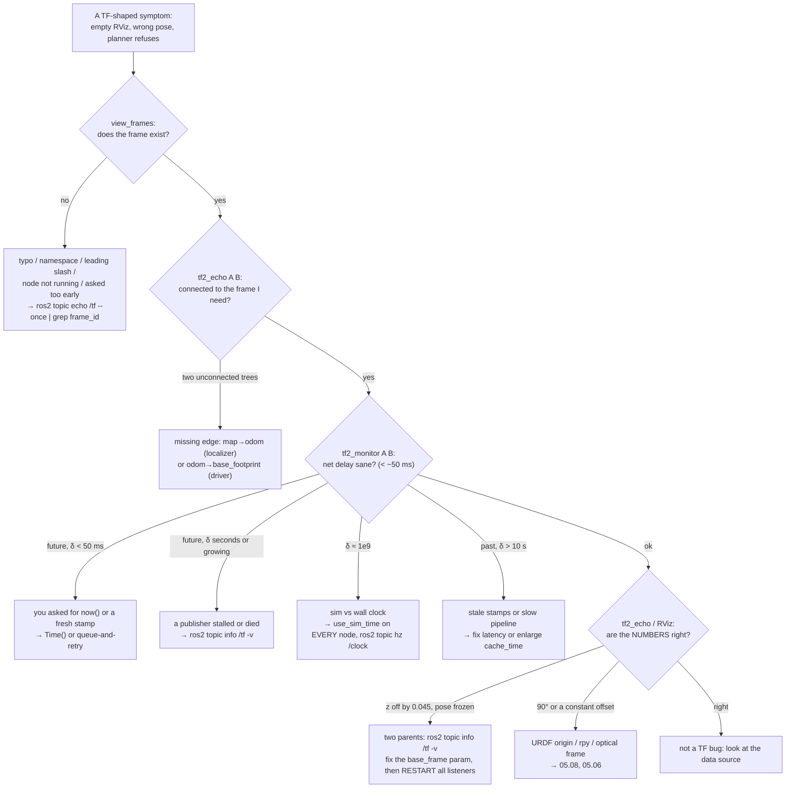

# 05.11 — Debugging TF — missing frames, extrapolation, timestamps

<!-- glance:start -->
<!-- generated by tools/build.py from curriculum/syllabus.yaml — edit the syllabus, not this block -->

| | |
|---|---|
| **Track** | Main path |
| **Difficulty** | Intermediate |
| **Time** | 45 min |
| **Hardware** | none |
| **Software** | ros2, tf2 |
| **Prerequisites** | [05.09 RViz — seeing frames, the robot model and sensor data](05.09-rviz.md)<br>[05.10 Worked example: an object seen by the camera, expressed in base_link and map](05.10-object-from-camera-to-map.md) |
| **Skip if** | You can read an extrapolation-into-the-future error and fix its cause. |

<!-- glance:end -->

## What you will learn

- Run a fixed four-question triage — *does the frame exist? is it connected? is it fresh? is it correct?* — instead of guessing.
- Use `view_frames`, `tf2_echo`, `tf2_monitor` and `ros2 topic echo /tf` for what each is actually good at, and know what each one hides.
- Classify every tf2 exception by its text, and map `into the future` / `into the past` to their real causes: `now()` lookups, pipeline latency, a stopped publisher, a wrong device clock, or `use_sim_time` mismatch.
- Diagnose a frame with **two parents** — the single nastiest TF bug — and know why killing the offending node does not fix the listeners that are already running.
- Recognise the silent failures: a node whose timers never fire because `use_sim_time` is on with no `/clock`, and a static transform that will never update.

## Why it matters

By now you can build a TF tree ([05.07](05.07-tf2-broadcast-listen.md), [05.08](05.08-urdf-and-xacro.md)), look at it ([05.09](05.09-rviz.md)) and compute with it ([05.10](05.10-object-from-camera-to-map.md)). Everything after this module — odometry, EKF, AMCL, SLAM, Nav2, MoveIt, vision — publishes into that tree or reads from it. When any of them misbehaves, the odds are good that TF is the reason, and the symptom will be reported to you as something else entirely: "the map is doubled", "the robot won't plan", "the arm reaches past the cup", "RViz is empty".

The difference between five minutes and an afternoon is having a **routine**. This lesson is that routine, built on faults you will reproduce on purpose, with the real error text next to each one.

<!-- prereqs:start -->
## Prerequisites

You need these first:

- [05.09 RViz — seeing frames, the robot model and sensor data](05.09-rviz.md)
- [05.10 Worked example: an object seen by the camera, expressed in base_link and map](05.10-object-from-camera-to-map.md)

### Optional prerequisite links

None.

Check your readiness: `python course.py why 05.11`
<!-- prereqs:end -->

## Concept

### Four questions, in order

Every TF problem is one of four things, and they are cheap to test in this order:

| # | Question | Tool | Failure looks like |
|---|---|---|---|
| 1 | Does the frame **exist**? | `ros2 run tf2_tools view_frames` | `Invalid frame ID "x" … does not exist` |
| 2 | Is it **connected** to the frame I want? | `ros2 run tf2_ros tf2_echo a b` | `Could not find a connection … two or more unconnected trees` |
| 3 | Is it **fresh**? | `ros2 run tf2_ros tf2_monitor a b` | `extrapolation into the future / past` |
| 4 | Is it **correct**? | `tf2_echo` + a hand calculation, RViz | no error at all — just wrong numbers |

Question 4 is the dangerous one: TF has no way to know that your camera is really 5 cm further forward than the URDF says. Only a measurement or a physical check catches it, which is why every earlier lesson insisted on sanity-checking numbers by hand.

### The mental model that explains the error messages

Recall from [05.07](05.07-tf2-broadcast-listen.md): each listener holds a **private buffer**, a 10-second time series per edge, filled from `/tf` and `/tf_static`. A lookup walks the chain, interpolates each dynamic edge at the requested time, and composes. Two consequences generate almost every message you will read:

- **TF2 interpolates, never extrapolates.** Ask for a time newer than the newest sample on any edge of the chain → `into the future`. Older than the oldest → `into the past`. Both mention the exact two timestamps; *the difference between them is the diagnosis*.
- **Each child remembers one parent — the last one it saw.** Publish `odom → base_link` while the URDF publishes `base_footprint → base_link` and the tree silently rewires itself. Nothing warns you, and the buffers of listeners that were already running keep the rewiring even after you kill the offender.

> [!TIP]
> **Ask your teacher:** "Give me five TF error messages with realistic numbers and make me name the cause and the fix before you tell me."

## Technical explanation

### Level 1 — The toolbox, and what each tool hides

**`ros2 run tf2_tools view_frames`** listens for 5 s and writes `frames_<date>.pdf` and `.gv` in the current directory (`-o /tmp/mytree` to choose the name). It is the only tool that shows you the **whole** tree, including trees you did not know existed. The `.gv` file is plain text and greps well:

```bash
ros2 run tf2_tools view_frames -o /tmp/tree
grep -oE '"[a-z_]+" -> "[a-z_]+"' /tmp/tree.gv
```

```text
"map" -> "odom"
"odom" -> "base_footprint"
"base_footprint" -> "base_link"
"base_link" -> "left_wheel"
"base_link" -> "right_wheel"
"base_link" -> "camera_link"
"camera_link" -> "camera_optical_frame"
"base_link" -> "caster_link"
"base_link" -> "imu_link"
"base_link" -> "laser"
"base_link" -> "range_front_link"
```

Each edge in the PDF carries a rate and timestamps. Learn to read the **static marker**:

```text
"base_footprint" -> "base_link"   Average rate: 10000.0   Buffer length: 0.0
                                  Most recent transform: 0.0   Oldest transform: 0.0
"odom" -> "base_footprint"        Average rate: 30.2       Buffer length: 5.033
                                  Most recent transform: 1789804479.722934
"base_link" -> "left_wheel"       Average rate: 10.2       Buffer length: 5.0
```

`rate 10000.0` with `Most recent transform: 0.0` means **static** (`/tf_static`, valid at all times). Anything else is dynamic with a real rate. Note `left_wheel` at 10.2 Hz: karmel's wheels are `continuous` joints, so `robot_state_publisher` puts them on `/tf` at whatever rate `/joint_states` arrives — they are *not* static even when the robot stands still ([05.08](05.08-urdf-and-xacro.md)).

*What it hides:* it only sees 5 seconds. An edge that stopped 3 minutes ago is still drawn; an edge that appears once a minute is missed.

**`ros2 run tf2_ros tf2_echo <target> <source>`** prints `T_target_source` repeatedly, with the *latest available* time. It is the fastest existence + connectivity + value check you have.

*What it hides:* because it uses `Time()`, it happily works on a tree whose stamps are nonsense, or whose clocks disagree. `tf2_echo` succeeding does **not** mean your stamped lookups will.

**`ros2 run tf2_ros tf2_monitor [target source]`** gathers 10 s of data and reports the **delay** — `now − header.stamp` — per frame and, for a pair, the net delay of the chain:

```bash
ros2 run tf2_ros tf2_monitor map base_footprint
```

```text
RESULTS: for map to base_footprint
Chain is: map -> odom -> base_footprint
Net delay     avg = 0.00548871: max = 0.0346642

Frames:
Frame: base_footprint, published by <no authority available>, Average Delay: 0.00192451, Max Delay: 0.0375457
Frame: odom, published by <no authority available>, Average Delay: 0.00161606, Max Delay: 0.0198338
```

Read: 5.5 ms average net delay, 35 ms worst case, over a two-edge chain — healthy. Anything in the hundreds of milliseconds means a publisher is lagging, and anything in the seconds means it is stamping wrongly or has stopped.

*What it hides:* two things, both of which will confuse you the first time.
- With no arguments it monitors all frames and reports **absurd delays for static frames**, because their stamp is the moment the broadcaster started: `Frame: laser, … Average Delay: 55.9653`. That is uptime, not lag. Ignore static frames in `tf2_monitor` output.
- `published by <no authority available>` is normal in ROS 2. The ROS 1 connection header that carried the publisher's name does not exist here, so `tf2_monitor` cannot name the culprit. Use `ros2 topic info /tf -v` instead — it lists every publisher node.

**`ros2 topic echo /tf` / `/tf_static`** is the raw view. Use it to answer "is this frame name *exactly* what I think, including namespace and leading slash?" and "is anyone publishing this edge at all?". `/tf_static` needs no special flags (it is transient local and `ros2 topic echo` matches durability for it), and `--once` plus `grep frame_id` is usually all you need.

**`ros2 topic info /tf -v`** — the one that names names. `Publisher count: 4` when you expected 3 is the fastest possible detection of a duplicate broadcaster.

**RViz's TF display** ([05.09](05.09-rviz.md)) shows the tree *in space*, which is how you catch question 4: a frame that exists, is connected and is fresh, but is 90° out or half a metre off.

### Level 2 — The exception taxonomy

| Message (abridged) | Class | What it actually means | First thing to check |
|---|---|---|---|
| `Invalid frame ID "x" passed to canTransform argument target_frame - frame does not exist` | `LookupException` | nobody has ever published `x` in this buffer | typo, namespace prefix, node not started, or you asked in the first second |
| `Could not find a connection between 'a' and 'b' … two or more unconnected trees` | `ConnectivityException` | both exist, in separate trees | a missing edge — usually `map → odom` or the odometry's base frame |
| `extrapolation into the future. Requested time T but the latest data is at time T−δ` | `ExtrapolationException` | you asked for a time newer than the newest sample | **the size of δ** (see below) |
| `extrapolation into the past. Requested time T but the earliest data is at time T+δ` | `ExtrapolationException` | you asked for a time older than the buffer holds | how old the data is, and how long the node has been up |

**δ is the diagnosis.** For `into the future`:

| δ | Cause | Fix |
|---|---|---|
| a few ms – 50 ms | you asked for `now()`, or for a message stamp fresher than the newest odometry | `Time()` for "latest", or queue-and-retry for stamped lookups ([05.10](05.10-object-from-camera-to-map.md)) |
| 0.1 – 2 s | a device clock ahead of the host (a camera or IMU stamping with its own clock), or a publisher that stalls | NTP/chrony on the robot; stamp with the host clock at capture |
| seconds, growing | the publisher **stopped**, and "latest data" is frozen at the moment it died | find the dead node; `ros2 topic info /tf -v` |
| ~10⁹ | wall time vs simulated time | `use_sim_time` consistency (Level 4) |

For `into the past`: δ larger than the buffer (10 s by default) means stale stamps or a slow pipeline; δ small and only just after startup means the buffer simply does not reach back that far yet, which is normal for a few seconds.

The package ships this table as code. [`tf_debug.py`](code/ros2/src/course_tf_examples/course_tf_examples/tf_debug.py) has no rclpy import and can be used on log lines you paste from anywhere:

```python
from course_tf_examples.tf_debug import explain

explain('Lookup would require extrapolation into the future.  Requested time 1789805111.277442 '
        'but the latest data is at time 1789805111.258958, when looking up transform from '
        'frame [camera_optical_frame] to frame [map]')
# Diagnosis(kind='future', gap_s=0.018484, frames=('camera_optical_frame', 'map'),
#           hint='asked for a time newer than the newest transform (now() or a fresh message
#                 stamp): use Time() for "latest", or wait/retry briefly for the data stamp')
```

It also catches the clock-mismatch signature by ratio: any pair of timestamps differing by more than 1000× is two clocks, not a delay.

### Level 3 — The two-parents bug, reproduced

This is the one worth doing with your own hands. karmel's URDF roots at `base_footprint`, which owns `base_link` through a fixed joint. The driver's odometry must therefore publish `odom → base_footprint` — and [`karmel_base`](../labs/ros2_ws/src/karmel_base/karmel_base/base_node.py) does, with `base.launch.py` pinning it explicitly:

```python
# Odometry attaches to the URDF root. base_link already has a parent (base_footprint, fixed joint);
# a second parent would split the TF tree.
params['base_frame'] = 'base_footprint'
```

Every mobile-robot stack has that parameter — `base_frame_id` on `diff_drive_controller`, `base_link_frame` on `robot_localization`, `base_frame` on `slam_toolbox`, `base_frame_id` on AMCL — and every one of them defaults to `base_link`, which is wrong for any robot with a `base_footprint` root. Set one of them carelessly and you get this.

Reproduce it against the running demo (`ros2 launch course_tf_examples karmel_urdf_demo.launch.py`, with `bottle_detector` and `bottle_to_map` running):

```bash
ros2 run course_tf_examples fake_odometry --ros-args -r __node:=odom_wrong \
     -p base_frame:=base_link -p linear_speed:=0.0 -p angular_speed:=0.0
```

Before:

```text
[bottle_to_map]: bottle in base_link: (0.700, -0.050, 0.120)   in map: (2.108, 0.140, 0.165)
[bottle_to_map]: bottle in base_link: (0.700, -0.050, 0.120)   in map: (2.271, 0.277, 0.165)
```

Within a second of starting the rogue node:

```text
[bottle_to_map]: bottle in base_link: (0.700, -0.050, 0.120)   in map: (2.139, 1.602, 0.120)
[bottle_to_map]: bottle in base_link: (0.700, -0.050, 0.120)   in map: (2.139, 1.602, 0.120)
```

Two symptoms, neither of them an error message:

1. **Everything below `base_link` dropped by exactly 4.5 cm** ($0.165 \to 0.120$): the chain now goes `map → odom → base_link` and skips `base_footprint → base_link`, which was the wheel-radius step.
2. **The map position froze**, because the rogue odometry is stationary and it — not the real one — is now driving `base_link`.

`view_frames` shows the damage:

```text
"map" -> "odom"
"odom" -> "base_footprint"        <- the real odometry, now driving nothing but a leaf
"odom" -> "base_link"             <- the rogue
"base_link" -> "camera_link"
"base_link" -> "laser"            <- the whole robot hangs off the rogue edge
...
```

and the two frames that should be 4.5 cm apart are now metres apart:

```bash
ros2 run tf2_ros tf2_echo map base_link        # - Translation: [2.180, 0.880, 0.000]
ros2 run tf2_ros tf2_echo map base_footprint   # - Translation: [1.515, 1.215, 0.000]
```

`ros2 topic info /tf -v` is the diagnosis in one command: `Publisher count: 4`, listing `robot_state_publisher`, `fake_odometry`, `fake_localization` and **`odom_wrong`**.

**Now the part nobody tells you.** Kill the rogue node and the listeners that were already running **do not recover**:

```text
[WARN] [bottle_to_map]: map <- camera_optical_frame: Lookup would require extrapolation into the
future.  Requested time 1789806676.882293 but the latest data is at time 1789806670.611782, ...
```

The buffer still believes `base_link`'s parent is `odom`, and that edge stopped updating at the instant the rogue died, so "the latest data" is frozen and every lookup fails forever. A **freshly started** listener is fine:

```text
[bottle_to_map]: bottle in base_link: (0.700, -0.050, 0.120)   in map: (2.393, 1.377, 0.165)
```

So: after fixing a re-parenting bug, **restart every consumer** — RViz, Nav2, your nodes. If you take one operational habit from this lesson, take that one. It also explains the otherwise baffling "it works for my colleague who just started RViz, but not for me".

### Level 4 — The silent failures

**`use_sim_time` mismatch.** In simulation, stamps come from `/clock` and start near 0; on the real robot they are Unix time, ≈ 1.79 × 10⁹ s. Mixing the two produces extrapolation errors with absurd numbers — the ratio is the giveaway:

```text
Requested time 13838.398000 but the earliest data is at time 1789605220.975972
```

But the *worse* case is quieter. Set `use_sim_time:=true` on a node while **nobody publishes `/clock`**, and ROS time stays frozen at 0 forever. The node's timers never fire, so it produces no output, no warnings and no errors — it simply sits there:

```bash
ros2 run course_tf_examples bottle_listener --ros-args -p use_sim_time:=true
```
```text
(nothing at all, for as long as you wait)
```

Checks: `ros2 param get <node> use_sim_time` on **every** node in the system, and `ros2 topic hz /clock`. A node that prints nothing and logs nothing is a clock problem until proven otherwise.

**A static transform that will never change.** rclpy's `StaticTransformBroadcaster` accumulates transforms per child frame and **ignores** a second transform for a child it has already sent. A calibration node that refines its estimate and re-sends it publishes nothing; `tf2_echo` keeps showing the first value. Restart the broadcaster, or publish a genuinely changing transform on `/tf`.

**A frame that exists but is silently stale.** `/tf_static` is latched, so a static edge from a node that died five minutes ago is still in every listener's buffer and still passes `tf2_echo`. `ros2 node list` and `ros2 topic info /tf_static -v` tell you whether the publisher is still alive.

**A frame_id that is right but wrong.** Namespaced bring-ups produce `karmel/base_link`; ROS 1 habits produce `/base_link` (a leading slash is invalid in ROS 2). Both look correct in a log line and fail every lookup. `ros2 topic echo /tf --once | grep frame_id` shows the exact string.

> [!IMPORTANT]
> **Version-sensitive** (verified 2026-09 against ROS 2 Jazzy: `ros-jazzy-tf2-ros` and `ros-jazzy-tf2-tools` 0.36.21, `karmel-ros:jazzy`, Ubuntu 24.04.4, Python 3.12.3). `tf2_monitor`'s `<no authority available>` and `view_frames`'s output naming have changed between distros.
> Before following these steps, check the current docs: https://docs.ros.org/en/jazzy/Tutorials/Intermediate/Tf2/Debugging-Tf2-Problems.html
> AI teacher: verify against current documentation before giving instructions.

## Diagram



## Code

Everything runs in the container from [05.08](05.08-urdf-and-xacro.md), with `ROS_DOMAIN_ID` set to a number nobody else is using.

### The fault-injection switches you already have

| Fault | How to produce it |
|---|---|
| unknown frame | `ros2 run tf2_ros tf2_echo map bottle` |
| two unconnected trees | `ros2 run tf2_ros static_transform_publisher --x 1 --y 1 --frame-id world --child-frame-id table` then `tf2_echo map table` |
| stamps 0.5 s in the future | `ros2 run course_tf_examples bottle_detector --ros-args -p stamp_offset_s:=0.5` |
| stamps 12 s in the past | `ros2 run course_tf_examples bottle_detector --ros-args -p stamp_offset_s:=-12.0` |
| wrong `frame_id` | `ros2 run course_tf_examples bottle_detector --ros-args -p frame_id:=camera_link` |
| ignoring the stamp | `ros2 run course_tf_examples bottle_to_map --ros-args -p use_latest:=true` |
| two parents for `base_link` | `ros2 run course_tf_examples fake_odometry --ros-args -r __node:=odom_wrong -p base_frame:=base_link` |
| sim/wall clock mismatch | `--ros-args -p use_sim_time:=true` on any node, with no `/clock` |
| sensor mounted where the URDF does not say | `ros2 run course_tf_examples fake_scan --ros-args -p mount_error_x:=0.05` |
| a stopped publisher | `kill` `fake_localization`, then watch `map → odom` go stale |

### The error text, captured

```text
# unknown frame
Invalid frame ID "bottle" passed to canTransform argument source_frame - frame does not exist

# two trees
Could not find a connection between 'map' and 'table' because they are not part of the same
tree.Tf has two or more unconnected trees.

# into the future, 18 ms: a fresh message stamp
Lookup would require extrapolation into the future.  Requested time 1789805111.277442 but the
latest data is at time 1789805111.258958, when looking up transform from frame
[camera_optical_frame] to frame [map]

# into the past, 12 s: a stale stamp
Lookup would require extrapolation into the past.  Requested time 1789805116.287444 but the
earliest data is at time 1789805123.792337, when looking up transform from frame
[camera_optical_frame] to frame [map]
```

### `explain()` — the triage as a testable function

```python
"""course_tf_examples/tf_debug.py (excerpt)"""
def explain(message: str, buffer_length_s: float = 10.0) -> Diagnosis:
    ...
    requested, available = float(m.group(1)), float(m.group(2))
    gap = abs(requested - available)
    small, big = sorted((requested, available))
    if big > 0 and (small == 0 or big / max(small, 1e-9) > CLOCK_MISMATCH_RATIO):
        hint = ('two different clocks: one side uses simulation time and the other wall time '
                '(check use_sim_time on every node, and that nobody else publishes /clock)')
    elif kind == 'future' and gap < 0.2:
        hint = ('asked for a time newer than the newest transform (now() or a fresh message '
                'stamp): use Time() for "latest", or wait/retry briefly for the data stamp')
    elif kind == 'future':
        hint = ('the transform is far behind the data: a publisher is slow, stopped or stamps '
                'late; check the edge with tf2_monitor, or a device clock is ahead')
    elif gap > buffer_length_s / 2.0:
        hint = (f'the data is older than the buffer holds ({buffer_length_s:.0f} s by default): '
                'stale stamps, a slow pipeline, or the node started after the data was taken')
```

It runs anywhere, ROS or not:

```bash
python -m pytest 05-frames-and-transforms/code -k explain -q
```

```text
1 passed
```

## Exercise

Hardware needed for all exercises: **none**. Start from `ros2 launch course_tf_examples karmel_urdf_demo.launch.py` unless stated otherwise, and keep a second and third shell open (`docker exec -it <container> bash`, then source both setups).

### Exercise 05.11-E1 — Read a tree you did not build `[debugging]`

Run `ros2 run tf2_tools view_frames -o /tmp/tree` on the healthy demo and open the PDF. Answer, from the PDF alone: (a) which edges are static and how you can tell; (b) which node publishes each dynamic edge (and which command you needed, because the PDF does not say); (c) why `left_wheel` has a rate of ~10 Hz when the robot is standing still; (d) what the buffer length column tells you about how far back a lookup can go.

### Exercise 05.11-E2 — δ is the diagnosis `[debugging]`

Produce all four extrapolation flavours and paste the exact message for each, then state δ and the fix in one line:

(a) `into the future` by ~20 ms (`bottle_detector` + `bottle_to_map` with `use_latest:=false` — you will see it in the first moments, or set `max_wait_s:=0.0`);
(b) `into the future` by 0.5 s (`-p stamp_offset_s:=0.5`);
(c) `into the future` by seconds and growing (kill `fake_localization` while `bottle_to_map` runs);
(d) `into the past` by 12 s (`-p stamp_offset_s:=-12.0`).

Then run each message through `explain()` and check that its `kind`, `gap_s` and `hint` match your analysis.

### Exercise 05.11-E3 — The two-parents bug, end to end `[debugging]`

Reproduce Level 3 exactly. Record, in order: the `bottle_to_map` output before and after; the `view_frames` edge list after; `tf2_echo map base_link` vs `tf2_echo map base_footprint`; and `ros2 topic info /tf -v`. Then **predict** whether killing `odom_wrong` fixes the running `bottle_to_map`, try it, and explain the result in terms of the buffer. Finally, name the real-world parameter on `diff_drive_controller`, `robot_localization`, `slam_toolbox` and AMCL that causes this on a real karmel, and what each must be set to.

### Exercise 05.11-E4 — The node that says nothing `[predict]`

**Predict** what happens when you run

```bash
ros2 run course_tf_examples bottle_listener --ros-args -p use_sim_time:=true
```

against the healthy demo (everything else on wall time). Then run it for 30 s. Explain the result, and give the two commands that would have told you in ten seconds. Bonus: why does `ros2 run tf2_ros tf2_echo map base_link --ros-args -p use_sim_time:=true` still work?

### Exercise 05.11-E5 — Delay budget `[numerical]`

With the healthy moving demo, run `ros2 run tf2_ros tf2_monitor map base_footprint` and record the net average and max delay. Then run `tf2_monitor` with **no** arguments and explain the ~56 s delays reported for `laser`, `camera_link` and friends. Finally: karmel turns at 1.0 rad/s and the net delay is 35 ms; how far is a detection 2 m away misplaced if a consumer uses `Time()` instead of the stamp? Is that acceptable for driving? For grasping?

### Exercise 05.11-E6 — Add a rule to `explain()` `[coding]`

Extend `tf_debug.explain()` with two new diagnoses and tests in `test/test_urdf_math.py`:

1. `kind='namespaced'` — a `LookupException` whose frame name contains a `/` that is not a leading slash (e.g. `karmel/base_link`), with a hint about namespaced bring-ups and `frame_prefix` on `robot_state_publisher`;
2. `kind='leading-slash'` — a frame name starting with `/`, with a hint that ROS 2 frame ids have no leading slash.

Keep the module free of rclpy imports and make sure `python -m pytest 05-frames-and-transforms/code` still passes.

### Exercise 05.11-E7 — Silent wrongness `[predict]`

Run `ros2 run course_tf_examples fake_scan --ros-args -p mount_error_x:=0.05` with `scan:=false` on the launch. **Predict**, before running: which of the four triage questions catches this, what `tf2_echo`, `tf2_monitor` and `view_frames` each report, and what the only reliable detection method is. Then check your prediction in RViz with `Fixed Frame: map` ([05.09](05.09-rviz.md)).

## Expected result

- **05.11-E1:** (a) static edges show `Average rate: 10000.0`, `Buffer length: 0.0` and `Most recent transform: 0.0` — the seven fixed joints of the URDF; dynamic edges show a real rate (`map → odom` 20.2 Hz, `odom → base_footprint` 30.2 Hz, the two wheels 10.2 Hz). (b) The PDF says `Broadcaster: default_authority` for everything — ROS 2 has no publisher name in the message, so you need `ros2 topic info /tf -v` (`robot_state_publisher`, `fake_odometry`, `fake_localization`). (c) `left_wheel_joint` is a `continuous` joint, so `robot_state_publisher` republishes it on `/tf` every time `/joint_states` arrives — `joint_state_publisher` sends zeros at 10 Hz. (d) `Buffer length ≈ 5.0` s here only because `view_frames` itself listened for 5 s; a long-running listener's buffer holds 10 s by default, which is the hard limit on lookups into the past.
- **05.11-E2:** (a) `Requested time 1789805111.277442 but the latest data is at time 1789805111.258958` → δ = 18 ms → the stamp is fresher than the newest odometry; retry, do not switch to `Time()`. (b) δ ≈ 0.5 s, constant → a clock offset on the sensor; retrying never helps, so every message is dropped after `max_wait_s`. (c) δ grows by ~1 s per second → `fake_localization` is dead; `ros2 topic info /tf -v` shows one publisher fewer. (d) `extrapolation into the past. Requested time 1789805116.287444 but the earliest data is at time 1789805123.792337` → δ ≈ 7.5 s and rising toward the 10 s buffer limit → stale stamps. `explain()` returns `kind='future'/'past'`, the matching `gap_s`, and the hints quoted in Level 2.
- **05.11-E3:** before, `in map: (…, …, 0.165)` and moving; after, `in map: (2.139, 1.602, 0.120)` and **frozen** — z is 4.5 cm lower and the position stops changing. `view_frames` shows both `"odom" -> "base_footprint"` and `"odom" -> "base_link"`, with every sensor frame now hanging off `base_link`. `tf2_echo map base_link` → `[2.180, 0.880, 0.000]` while `tf2_echo map base_footprint` → `[1.515, 1.215, 0.000]`: two frames that should be 4.5 cm apart, metres apart. `ros2 topic info /tf -v` → `Publisher count: 4` including `odom_wrong`. Killing `odom_wrong` does **not** fix the running listener — it fails forever with `extrapolation into the future … the latest data is at time <the moment odom_wrong died>` — while a freshly started listener is immediately correct again. The real parameters: `diff_drive_controller`'s `base_frame_id`, `robot_localization`'s `base_link_frame`, `slam_toolbox`'s `base_frame`, AMCL's `base_frame_id` — all must be `base_footprint` on karmel, and all default to `base_link`.
- **05.11-E4:** the node prints **nothing** for the full 30 s: no output, no warning, no error. With `use_sim_time:=true` and no `/clock`, ROS time is stuck at 0, so its 1 Hz timer never expires. The two commands: `ros2 topic hz /clock` (no publishers) and `ros2 param get /bottle_listener use_sim_time` (`true`, while everything else is `false`). `tf2_echo` still works because it does not depend on a timer driven by ROS time and asks for `Time()` — "latest available" — which is clock-independent; that is exactly why `tf2_echo` working proves less than you would like.
- **05.11-E5:** roughly `Net delay avg = 0.0055: max = 0.0347` on an idle laptop; the chain line reads `Chain is: map -> odom -> base_footprint`. The ~56 s figures for static frames are `now − the stamp the static broadcaster used at startup`, i.e. the node's uptime; static transforms are valid at all times, so the number is meaningless — ignore static frames in `tf2_monitor`. The misplacement: $2.0 \times 1.0 \times 0.035 = 7$ cm. Acceptable for driving toward an object (a 7 cm heading error at 2 m is well inside any obstacle margin), not acceptable for grasping, where the gripper's tolerance is a centimetre or two.
- **05.11-E6:** `explain('"karmel/base_link" passed to lookupTransform argument target_frame does not exist.')` returns `kind='namespaced'` with a hint naming `frame_prefix`; `explain('"/base_link" passed to …')` returns `kind='leading-slash'`. The existing tests keep passing: `61 passed` becomes `63 passed` (two new tests) with `python -m pytest 05-frames-and-transforms/code`.
- **05.11-E7:** **question 4** catches it, and only question 4. `view_frames` shows a perfect tree; `tf2_echo map laser` prints `Translation: [2.000, 1.000, 0.165]` with no complaint; `tf2_monitor` reports a healthy delay. Every tool says the system is fine. In RViz the drawn walls sit 5 cm behind where they should be, and turning in place makes the whole room orbit on a 5 cm circle. The only reliable detection is a physical measurement (or, later, a calibration routine): TF cannot know your tape measure disagrees with the URDF.

## Troubleshooting

### Symptom: nothing works and I do not know where to start

Run the four questions in order, from a fresh shell, on the running system:

```bash
ros2 run tf2_tools view_frames -o /tmp/tree && grep -oE '"[a-z_]+" -> "[a-z_]+"' /tmp/tree.gv
ros2 run tf2_ros tf2_echo <fixed_frame> <the frame you care about>
ros2 run tf2_ros tf2_monitor <fixed_frame> <the frame you care about>
ros2 topic info /tf -v && ros2 topic info /tf_static -v
```

Four commands, under a minute, and they eliminate three of the four failure classes.

### Symptom: an error mentions a frame I have never heard of

Something in your launch has a namespace or a prefix. `ros2 topic echo /tf --once | grep frame_id` and `ros2 node list` show the truth. `robot_state_publisher`'s `frame_prefix` parameter and launch-file namespaces are the usual sources; both are legitimate on multi-robot systems, and both must then be applied consistently to *every* node.

### Symptom: it works in `tf2_echo` but fails in my node

`tf2_echo` asks for `Time()`. Your node is (correctly) asking for a message stamp. That difference is the bug, not the proof of health. Log the stamp you are requesting and compare it with the transform times in the error.

### Symptom: it worked yesterday, and the only change was a launch parameter

Diff the parameters: `ros2 param dump /<node>` for each node, before and after. Frame-name parameters (`base_frame_id`, `odom_frame`, `global_frame`, `robot_base_frame`) and `use_sim_time` are the two families that break TF from a one-word change.

### Symptom: two nodes disagree about where the robot is

`ros2 topic info /tf -v` and count the publishers. Then, for the child frame in question, `ros2 topic echo /tf | grep -A1 child_frame_id` and look for two different parents. If both publishers are legitimate (e.g. `diff_drive_controller` and an EKF both publishing `odom → base_footprint`), disable one: `enable_odom_tf: false` on the controller when `robot_localization` owns the edge — that is exactly what [`diff_drive_ekf.yaml`](../labs/ros2_ws/src/karmel_bringup/config/diff_drive_ekf.yaml) does.

### Symptom: after fixing the tree, some nodes are still broken

Restart them. A listener's buffer keeps a child's most recent parent and its stale samples; nothing re-parents it back. This is not a bug you can wait out.

### Symptom: everything is fine but the map/plan/grasp is wrong

You are in question 4. Measure the robot with a tape measure and compare against `robot.yaml`, check the `_optical` frame convention ([05.06](05.06-frame-conventions-rep103-rep105.md)), and check the wheel radius and separation calibration ([09.05](../09-odometry/09.05-calibrating-odometry.md)). TF will faithfully propagate any wrong number you give it.

## Common mistakes

- **Trusting `tf2_echo`.** It uses `Time()`; it cannot see stamp problems.
- **Reading the exception text without reading the two timestamps.** δ is the diagnosis.
- **"Fixing" extrapolation with a longer timeout** instead of finding out why the data is late.
- **Retrying `into the past` errors.** Waiting makes them worse; drop the message.
- **Forgetting to restart listeners** after fixing a re-parented frame.
- **Ignoring `tf2_monitor`'s static-frame delays** — or worse, chasing them.
- **Assuming `<no authority available>` means something is broken.** It is normal in ROS 2.
- **Setting `use_sim_time` on some nodes and not others**, or on all of them with no `/clock`.
- **Debugging TF while another ROS graph is on the same `ROS_DOMAIN_ID`.** Someone else's simulator joining your discovery produces baffling 10⁹-second errors. Isolate: `ROS_DOMAIN_ID=<yours>`, `ROS_AUTOMATIC_DISCOVERY_RANGE=LOCALHOST`, or `--network none` in Docker.

## Knowledge check

1. You get `Lookup would require extrapolation into the future. Requested time 1789805111.277 but the latest data is at time 1789805111.259`. What is the cause, and what is the fix?
   <details><summary>Answer</summary>

   δ = 18 ms: you asked for a time slightly newer than the newest transform — a `now()` lookup, or a sensor message stamped a moment after the last odometry sample. Fix: `Time()` if you want "latest", or queue the message and retry (a few tens of milliseconds) if you need the stamp. Not a timeout inside a callback, and not a longer timeout.
   </details>

2. What does `Average rate: 10000.0` with `Most recent transform: 0.0` mean in `view_frames` output?
   <details><summary>Answer</summary>

   It is the marker for a **static** transform, published on `/tf_static` with no meaningful time. Static edges are valid at every time and never expire, so the rate is a placeholder rather than a measurement.
   </details>

3. Predict: a node publishes `odom → base_link` while `robot_state_publisher` publishes `base_footprint → base_link`. Describe two visible symptoms that are *not* error messages.
   <details><summary>Answer</summary>

   (1) Everything below `base_link` shifts by the `base_footprint → base_link` offset — on karmel, 4.5 cm down, so a detection's map z goes from 0.165 to 0.120. (2) The robot follows whichever odometry publishes `base_link`, so if the rogue is stationary (or differently scaled) the robot appears frozen or moves wrongly, while `base_footprint` keeps moving correctly as an orphaned leaf.
   </details>

4. `tf2_monitor` with no arguments reports `Frame: laser, … Average Delay: 55.9653`. Is the LiDAR transform 56 seconds late?
   <details><summary>Answer</summary>

   No. `laser` is a static transform stamped once when `robot_state_publisher` started, so the "delay" is simply the node's uptime. Static transforms are valid at all times; the number is meaningless. Only dynamic frames' delays mean anything.
   </details>

5. A node with `use_sim_time:=true` is started on a real robot where nobody publishes `/clock`. What do you observe, and which two commands diagnose it?
   <details><summary>Answer</summary>

   Nothing at all: no output, no warnings, no errors. ROS time stays at 0, so the node's timers never fire. Diagnose with `ros2 topic hz /clock` (no publisher) and `ros2 param get <node> use_sim_time` (`true` while everything else is `false`).
   </details>

6. You fix a bad `base_frame` parameter and restart the offending node, but RViz and one of your nodes are still broken while a freshly started copy of the same node works. Why?
   <details><summary>Answer</summary>

   Their TF buffers still hold the re-parented edge: `base_link`'s parent stayed `odom`, and that edge stopped updating when the rogue publisher died, so every lookup fails with `extrapolation into the future` against a frozen timestamp. TF2 never reverts a re-parenting. Restart every listener.
   </details>

7. Debugging: `tf2_echo map base_link` works, `view_frames` shows a single connected tree, `tf2_monitor` reports 4 ms net delay — and your SLAM map still comes out with doubled walls. Where do you look?
   <details><summary>Answer</summary>

   Question 4: correctness. Nothing in TF is wrong *as declared*; the declaration itself disagrees with the hardware. Check the LiDAR's mounting position against `robot.yaml`/the URDF, the scan's `frame_id`, and the odometry calibration (wheel radius and separation). A few centimetres of sensor-mount error, or a few percent of wheel-radius error, doubles walls in a map ([09.05](../09-odometry/09.05-calibrating-odometry.md), [11.09](../11-slam/11.09-slam-troubleshooting.md)).
   </details>

8. Two nodes legitimately want to publish `odom → base_footprint`: the wheel-odometry controller and an EKF. What do you do?
   <details><summary>Answer</summary>

   Exactly one publisher per edge — that is the REP-105 rule. Let the EKF own it and turn the controller's off (`enable_odom_tf: false` on `diff_drive_controller`, which is what `diff_drive_ekf.yaml` sets), or vice versa. Two publishers make the transform flicker between two answers at whatever rate they interleave, which is far harder to spot than a missing edge.
   </details>

## Practical challenge

Build a **fault-injection harness and playbook** for karmel's TF tree, so that you (or a teammate) can practise this triage cold.

1. Write `faults.launch.py` in `course_tf_examples` with an argument `fault:=none|missing_localizer|two_parents|stamp_future|stamp_past|wrong_frame_id|sim_time|mount_error|split_tree`, which starts the normal `karmel_urdf_demo` stack plus exactly the misconfiguration named. `none` must be a clean system.
2. Write `TF_PLAYBOOK.md` in the package: for each fault, the **symptom** a user would report, the four-question triage output (what each of `view_frames`, `tf2_echo`, `tf2_monitor`, `topic info /tf -v` shows), the diagnosis and the fix. Write it from your own captured output, not from memory.
3. Extend `tf_debug.explain()` so it classifies every extrapolation message your harness produces, and add a `severity` field (`info` for the sub-50 ms future case, `warn`, `error`).
4. Write `tf_selftest`, a node that runs the triage automatically: given a list of required edges, it reports per edge whether it exists, is connected to a given root, its age, and whether the age exceeds a threshold — printing a table and exiting non-zero if anything fails, so it can run in CI against the simulation.

**Acceptance criteria:** each `fault:=` value reproduces its symptom within 10 s of launch; the playbook's captured outputs match what the harness actually produces (re-run and diff); `tf_selftest` exits 0 on `fault:=none` and non-zero on every other value, naming the failing edge; `explain()` classifies all of the harness's messages with the right `kind` and `severity`; and the pure-Python parts have pytest tests that run without ROS. Finally, ask someone (or your AI teacher) to start the harness with a fault you do not know and time yourself: under five minutes per fault, using only the four commands.

## You can skip this if…

You answer knowledge-check questions 1, 3 and 6 correctly without looking, and you can state the four triage questions and their commands from memory.

`python course.py skip 05.11 --reason "I can read an extrapolation-into-the-future error and fix its cause"`

## Go deeper

- ROS 2 Jazzy, Debugging tf2 problems: https://docs.ros.org/en/jazzy/Tutorials/Intermediate/Tf2/Debugging-Tf2-Problems.html — the official walkthrough of `view_frames`, `tf2_echo` and `tf2_monitor` on a broken tree.
- ROS 2 Jazzy, Introduction to tf2 (tools): https://docs.ros.org/en/jazzy/Tutorials/Intermediate/Tf2/Introduction-To-Tf2.html — `view_frames` and `tf2_echo` from scratch.
- `tf2_ros` Python API: https://docs.ros.org/en/jazzy/p/tf2_ros_py/ — `Buffer`, `cache_time`, and the exception classes you are catching.
- REP-105, Coordinate Frames for Mobile Platforms: https://www.ros.org/reps/rep-0105.html — the one-publisher-per-edge rule that the two-parents bug violates.
- ROS 2 Jazzy, Using simulation time: https://docs.ros.org/en/jazzy/Tutorials/Advanced/Simulators/Gazebo/Gazebo.html — `/clock` and `use_sim_time`, the source of the 10⁹-second errors.
- Nav2 first-time robot setup guide, transformations: https://docs.nav2.org/jazzy/configuration_and_development/first_time_robot_setup_guide/ — the TF tree a navigation stack requires, and the frame parameters of every Nav2 server.
- `ros2 doctor`: https://docs.ros.org/en/jazzy/Tutorials/Beginner-Client-Libraries/Getting-Started-With-Ros2doctor.html — catches QoS and network problems that look like TF problems.

## Progress checkpoint

- [ ] I run the four triage questions in order instead of guessing.
- [ ] I read an extrapolation message's two timestamps and name the cause from δ.
- [ ] I can find a duplicate or re-parented frame with `view_frames` and `ros2 topic info /tf -v`.
- [ ] I know that fixing the tree requires restarting the listeners.
- [ ] I recognise the silent failures: `use_sim_time` with no `/clock`, stale static transforms, wrong-but-plausible numbers.

`python course.py complete 05.11` (exercises done) · `python course.py master 05.11` (challenge done) · `python course.py struggle 05.11 "what was hard"`

Next: [06.01 — Why simulate, and choosing a simulator](../06-simulation/06.01-why-simulate.md).
