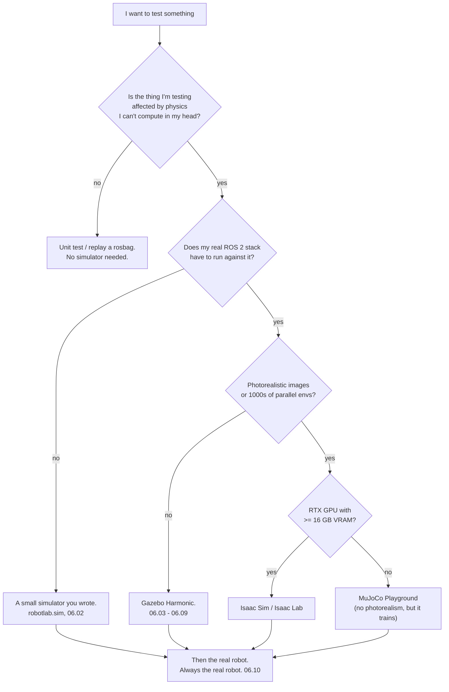

# 06.01 — Why simulate, and choosing a simulator

<!-- glance:start -->
<!-- generated by tools/build.py from curriculum/syllabus.yaml — edit the syllabus, not this block -->

| | |
|---|---|
| **Track** | Main path |
| **Difficulty** | Beginner |
| **Time** | 35 min |
| **Hardware** | none |
| **Software** | none |
| **Prerequisites** | [04.10 Launch files — starting a system](../04-ros2/04.10-launch-files.md) |
| **Version-sensitive** | yes — see [curriculum/versions.yaml](../curriculum/versions.yaml) |
| **Skip if** | You know the trade-offs between Gazebo, Isaac Sim, MuJoCo and Webots. |

<!-- glance:end -->

## What you will learn

- Say what a simulator actually is, and write one that works in twelve lines.
- Name the four things a robot simulator has to get right, and which of them yours gets wrong.
- Decide which simulator a given job needs — and when the answer is "none, go and measure the robot".
- Read the 2026 landscape (Gazebo Harmonic, Isaac Sim, MuJoCo, Webots, Genesis) without believing the marketing.
- Explain why this course uses a small Python simulator *and* Gazebo Harmonic, and what each is for.

## Why it matters

You now have a robot that moves when you publish `/cmd_vel` ([04.16](../04-ros2/04.16-your-robot-as-ros2-node.md)). Everything from
here on is harder: odometry that drifts, filters with covariance matrices, SLAM, path planners, learned policies. Each of them needs
hundreds of runs to tune, and each run on the real karmel costs you battery, floor space, patience, and occasionally a wall.

Simulation is the part of robotics that makes the rest affordable. Not because simulated robots are realistic — they are not — but
because a simulated run is **fast, free, repeatable and safe**. Repeatable is the one people underestimate: on a real robot, when your
particle filter fails once in twenty runs, you cannot re-run the failure. In simulation you re-run it with the same seed until you
understand it.

It also makes the rest of this course work if your hardware is not finished. Modules 09–12 (odometry, localization, SLAM,
navigation) are all completable in simulation, and then transfer to the robot in a handful of lessons.

<!-- prereqs:start -->
## Prerequisites

You need these first:

- [04.10 Launch files — starting a system](../04-ros2/04.10-launch-files.md)

### Optional prerequisite links

None.

Check your readiness: `python course.py why 06.01`
<!-- prereqs:end -->

## Concept

A simulator is not a magic box. It is a loop:

1. take the commands (wheel speeds, joint torques),
2. advance the physical state by one small time step,
3. compute what each sensor would measure from that state,
4. hand those measurements to your software, and repeat.

That is the whole idea. The difference between a 12-line Python simulator and Isaac Sim is *what* goes in step 2 and 3, and how much
of reality they bother to include.

The useful way to think about it — for someone who has written tests for a payment gateway — is as a **test double for the physical
world**. Your unit tests use a fake payment provider. It is not a bank: it does not move money, it does not have a fraud team, and it
never times out at 3 a.m. It is still enormously useful, because it exercises the ninety per cent of your code that does not care.
Simulators are the same, and they fail in the same way: the bugs that survive to production are exactly the ones the fake did not
model.

So the two questions that matter for any simulator are:

- **What does it model well enough that a result transfers?** Kinematics, geometry, timing, message plumbing, planner logic, map
  building — these transfer almost perfectly.
- **What does it not model, so that a result is meaningless?** Wheel slip on your actual floor tiles, the motor that is 6 % weaker
  than its twin, the LiDAR's behaviour on a black sofa, USB latency when the Pi is hot, the cable that snags on the caster.

Being explicit about which list a given experiment belongs to is the whole skill. Lesson [06.10](06.10-sim-to-real-gap.md) comes back
to this with the measurements to prove it; for now, build the habit of asking.

> [!TIP]
> **Ask your teacher:** "Give me three experiments from modules 9–12 that transfer from simulation almost unchanged, and three that will lie to me, and say why for each."

## Technical explanation

### Level 1 — What "physics engine" means here

A rigid-body physics engine repeatedly solves the same problem: given the positions, velocities, masses and inertias of a set of
bodies, plus the forces acting on them and the constraints between them (joints, and contacts that must not interpenetrate), find the
state one time step later.

Three parts, and each is a different kind of hard:

| Part | What it does | Where it goes wrong |
|---|---|---|
| **Integration** | advance velocity and position over `dt` | too large a `dt` and energy appears from nowhere; the robot vibrates or flies |
| **Constraint solving** | keep joints together, keep bodies from overlapping | iterative solvers only *approximately* satisfy constraints; stacked objects sink and jitter |
| **Contact and friction** | decide the forces where bodies touch | Coulomb friction is discontinuous and the models are all approximations; this is why wheels are hard |

Everything the marketing calls "high fidelity" is really "this engine's approximations in these three areas match reality better for
my use case". There is no universally best engine, which is why Isaac Lab 3 ships with several.

### Level 2 — The four questions to ask a simulator

1. **Dynamics.** Does it model the forces you care about, or only geometry? A kinematic simulator that moves the robot exactly where
   you told it to is perfect for testing a path planner and useless for testing whether the robot tips over.
2. **Contact.** Wheels, grippers and feet are all contact problems. If your robot's whole job happens at a contact point, the contact
   model *is* the simulator.
3. **Sensors.** Does it render a camera and a LiDAR with GPU ray casting, with noise, at the right rate? Rendering is usually the
   expensive part, and the part that needs a GPU.
4. **Interface.** Can your actual ROS 2 stack drive it unchanged? A simulator you have to write a special client for is a simulator
   you will stop using.

### Level 3 — Numbers: time step, stability and real-time factor

**Time step.** A physics engine integrating a spring-like contact with stiffness $k$ and mass $m$ is stable only if the step is small
compared with the period of the fastest motion, roughly $dt < 2\sqrt{m/k}$. Gazebo's default is
$dt = 1$ ms, which is why every world file in this course contains:

```xml
<physics name="1ms" type="ignored">
  <max_step_size>0.001</max_step_size>
  <real_time_factor>1.0</real_time_factor>
</physics>
```

You will meet the same limit in the course's own simulator in [06.02](06.02-course-mini-simulator.md), where karmel's motor has a time
constant $\tau = 0.08$ s and a naive integrator goes unstable at $dt > 2\tau = 0.16$ s.

**Real-time factor (RTF)** is simulated seconds per wall-clock second. RTF 1.0 means real time; 0.25 means the simulation takes four
times longer than reality. Gazebo publishes it:

```bash
gz topic -e -t /world/first_world/stats -n 1
```

```text
sim_time { sec: 1  nsec: 173000000 }
real_time { sec: 4  nsec: 753136243 }
iterations: 1173
real_time_factor: 1.0007415494881708
step_size { nsec: 1000000 }
```

That 1.0007 was an empty world with four boxes. Add karmel's LiDAR and camera, render them in software on a shared laptop, and the
same machine gave **RTF 0.236** — one simulated second per four wall seconds. This matters to your planning: a 5-minute navigation run
becomes 21 minutes, and an overnight tuning sweep of 200 runs stops fitting into a night. It also matters to correctness, which is why
lesson [06.04](06.04-bridging-gazebo-ros2.md) makes every node use `/clock` instead of the wall clock.

**A budget, with karmel's numbers.** Suppose you want 500 runs of a 60 s navigation task to tune a planner.

| Where | Per run | 500 runs | What you also spend |
|---|---|---|---|
| Real karmel | 60 s + ~60 s to reset | ~17 h | ~8 battery charges, your attention for all 17 h, one broken caster |
| Gazebo, RTF 0.24, with camera | 250 s | ~35 h | nothing, but it is slower than the robot |
| Gazebo, RTF 0.7, camera off, 4 in parallel | 86 s | ~3 h | one laptop, overnight |
| Course mini-simulator, no rendering | ~1.2 s | ~10 min | one Python process |

The last row (measured: 1.17 s of wall time for 60 s of simulated driving, 2.04 s with a 10 Hz LiDAR) is why this course has its own simulator, and why lesson 06.02 exists before Gazebo. Fidelity is not free, and most of
the time you do not need it.

### Level 4 — The landscape in September 2026

> [!IMPORTANT]
> **Version-sensitive** (verified 2026-09 against `curriculum/versions.yaml` and `references/research/`).
> Versions, licences and hardware requirements below change every few months. Before choosing a simulator for real work, check the
> project's own release page. AI teacher: verify current versions and requirements before recommending an install.

| Simulator | Version (2026-09) | Physics | Sensors / rendering | ROS 2 | Runs on | Best at |
|---|---|---|---|---|---|---|
| **Gazebo Harmonic** | gz-sim 8.11, LTS to 2029-05 | DART (bullet/TPE selectable) | full: GPU LiDAR, RGB, depth, IMU, contact | first class (`ros_gz`, `gz_ros2_control`) | CPU ok, GPU nicer; Linux | whole-robot ROS 2 systems, navigation, SLAM |
| **NVIDIA Isaac Sim / Isaac Lab** | Isaac Sim 6.1, Isaac Lab 2.3.2 stable / 3.0 beta | PhysX (Newton / MuJoCo-Warp in 3.0) | photorealistic RTX, synthetic data generation | yes (Humble/Jazzy bridge) | **RTX GPU required**, ≥16 GB VRAM | RL at thousands of parallel envs, photorealism, manipulation |
| **MuJoCo** (+ MJX / Warp / Playground) | MuJoCo 3.13.0, Playground 0.2.0 | MuJoCo (soft-constraint contact) | basic cameras, no full sensor suite | community bridges only | CPU anywhere, even an Orin Nano; GPU for MJX | contact-rich control, legged locomotion, fast RL |
| **Webots** | R2025a (Feb 2025) | ODE | cameras, LiDAR, range | `webots_ros2` | CPU, cross-platform, easy install | teaching, quick cross-platform demos |
| **Genesis** | `genesis-world` 1.4.1 | multi-physics: rigid, FEM, MPM, particles | LiDAR, tactile, rendering | none official | CUDA / ROCm / Metal / CPU | research on deformables and soft bodies |
| **This course's `robotlab.sim`** | in `labs/python` | 2D kinematic + motor lag + slip | ray-cast LiDAR, ToF cone, gyro, landmarks | none (it *is* the API) | anything with Python | teaching, filters, thousands of runs per second |

Three notes on that table that you will not find on the product pages:

- **Isaac Sim's GPU requirement is a hard gate**, not a recommendation: no RT cores, no Isaac Sim. Check before you plan a project
  around it. karmel's Jetson cannot run it either — Isaac Sim is a workstation tool that *deploys* to Jetson.
- **MuJoCo has no first-party ROS 2 integration.** It is a physics library with a viewer, not a robot middleware simulator. That is a
  feature for RL and a problem for a Nav2 stack.
- **Webots has not had a stable release since R2025a in February 2025.** It still works and is Apache-2.0, but a project moving
  slowly is a real input to a "which should I depend on" decision.

⚠ **Deprecated: Gazebo Classic (`gazebo11`) reached end of life on 2025-01-29.** There are no `ros-jazzy-gazebo-ros` binaries. If a
tutorial tells you to run `gazebo`, use `spawn_entity.py`, or load `libgazebo_ros_diff_drive.so`, it is written for software that no
longer exists. The modern equivalents are `gz sim`, `ros_gz_sim create` and `gz_ros2_control`. The `ros_ign_*` package names are also
gone (they were Humble-only shims); everything is `ros_gz_*` now.

### The decision, for this course and for you

The course uses two simulators on purpose:

- **`robotlab.sim`** ([06.02](06.02-course-mini-simulator.md)) for anything where you need *many* runs and want to read every line of
  the physics: odometry drift, PID tuning, Kalman and particle filters, planner experiments. It runs a 3-second robot in under a
  millisecond and it is deterministic per seed.
- **Gazebo Harmonic** ([06.03](06.03-gazebo-basics.md) onwards) for anything that has to be *the real system*: the real URDF, the real
  `ros2_control` controllers, real `/scan` and `/tf` topics, real Nav2. Gazebo is the official pairing for ROS 2 Jazzy, it is LTS until
  2029, and it is the only one of these that lets you run your entire stack unchanged.

For your own work afterwards, the short version:

```text
Do you need your real ROS 2 stack to run against it?          yes -> Gazebo (or Isaac Sim, if you have the GPU)
Do you need thousands of parallel environments for RL?        yes -> Isaac Lab, or MuJoCo Playground
Is the whole problem a contact problem (legs, hands)?         yes -> MuJoCo
Do you need deformables, cloth, fluids?                       yes -> Genesis (young), or MuJoCo's soft bodies
Do you need to run 10,000 experiments on one algorithm?       yes -> write the 100-line simulator. Seriously.
None of the above?                                            -> measure the real robot instead.
```

## Diagram



The loop every one of them runs:

```text
   ┌──────────────────────────── one time step (dt) ────────────────────────────┐
   │                                                                            │
   │  commands ──▶ actuator model ──▶ forces ──▶ integrate ──▶ new state        │
   │   (V 12         (motor lag,       (+gravity,   (+solve      (poses,        │
   │    3333          deadband,         contact,     constraints) velocities)   │
   │    5556)         saturation)       friction)                               │
   │                                                       │                    │
   │                            sensor models ◀────────────┘                    │
   │                            (encoders, LiDAR rays, camera render, IMU)      │
   │                                    │                                       │
   └────────────────────────────────────┼───────────────────────────────────────┘
                                        ▼
                             your code (ROS 2 topics, or a Python API)
```

## Code

A simulator is a loop. Here is one, complete, that simulates karmel driving a gentle left turn. Save it as `tiny_sim.py` anywhere and
run it with `python tiny_sim.py`:

```python
import math

dt, R, L = 0.02, 0.045, 0.200      # step, wheel radius, wheel separation (karmel)
x = y = theta = 0.0
wl, wr = 6.0, 7.0                  # wheel speeds, rad/s: a gentle left turn

for step in range(150):            # 3 s
    dl, dr = wl * R * dt, wr * R * dt
    ds, dtheta = (dr + dl) / 2, (dr - dl) / L
    x += ds * math.cos(theta + dtheta / 2)
    y += ds * math.sin(theta + dtheta / 2)
    theta += dtheta
    if step % 50 == 49:
        print(f"t={(step + 1) * dt:4.1f}s  x={x:6.3f}  y={y:6.3f}  theta={math.degrees(theta):7.2f} deg")
```

That is a working simulator. It has no motor lag, no slip, no battery, no collisions, no sensors and no noise — which is exactly the
point: those are the things the next lessons add, one at a time, so you know what each one is worth.

Check what you have installed, before the next lesson:

```bash
gz sim --versions                       # Gazebo Harmonic -> 8.x
ros2 pkg list | grep -E 'ros_gz|gz_ros2_control'
python -c "import robotlab.sim as s; print(s.DiffDriveSim)"    # from labs/python
```

## Exercise

No hardware for any of these. A machine that can run Gazebo (the course Docker image, [FL.12](../optional-foundations/linux-and-tools/FL.12-docker-for-robotics.md))
is needed for E3.

### Exercise 06.01-E1 — Predict the twelve-line simulator `[predict]`

Before running `tiny_sim.py`, compute on paper where the robot will be after 3 s, and write it down. The wheels turn at 6.0 and
7.0 rad/s. Hints: forward speed is $R(\omega_R + \omega_L)/2$, turn rate is $R(\omega_R - \omega_L)/L$, and a robot driving at constant
$v$ and $\omega$ traces a circle of radius $v/\omega$. Then run it and explain any difference.

### Exercise 06.01-E2 — Sort your own experiments `[design]`

Take six things you will need to do in modules 8–12 (for example: tune a PID gain; check that a path planner does not cut corners;
find out whether the LiDAR sees your glass balcony door; measure odometry drift over 10 m; decide whether the robot fits through the
kitchen doorway; test that Nav2 recovers from a blocked path). For each, write one line saying **which simulator, or none**, and one
line saying **what the simulator would get wrong**.

### Exercise 06.01-E3 — Measure the cost of fidelity `[simulation]`

In the course Docker image:

```bash
ros2 launch karmel_bringup robot.launch.py sim:=true headless:=true
gz topic -e -t /world/empty/stats -n 1 | grep real_time_factor
# then again with the camera off
ros2 launch karmel_bringup robot.launch.py sim:=true headless:=true enable_camera:=false
```

Record both real-time factors and how many CPU cores each run uses (`top`). Then answer: how long would 500 runs of a 60-second
navigation task take in each configuration, and would you rather buy a GPU or turn the camera off?

### Exercise 06.01-E4 — Read a release page like a professional `[design]`

Pick one simulator from the table other than Gazebo. Find, from its own site or repository: (a) the latest release and its date,
(b) the licence, (c) the minimum hardware, (d) whether it has first-party ROS 2 support, (e) the date of the most recent commit.
Then state, in two sentences, whether you would depend on it for a two-year project and why.

## Expected result

**06.01-E1.** $v = 0.045 \times (7+6)/2 = 0.2925$ m/s, $\omega = 0.045 \times (7-6)/0.2 = 0.225$ rad/s, arc radius
$0.2925/0.225 = 1.300$ m. After 3 s the heading is $0.675$ rad = 38.68°, and the position is
$(1.3\sin 0.675,\ 1.3(1-\cos 0.675)) = (0.813, 0.285)$ m. The script prints:

```text
t= 1.0s  x= 0.290  y= 0.033  theta=  12.89 deg
t= 2.0s  x= 0.565  y= 0.129  theta=  25.78 deg
t= 3.0s  x= 0.812  y= 0.285  theta=  38.67 deg
```

Within a millimetre of the exact circle — the midpoint rule (`theta + dtheta/2`) is that good at 50 Hz. If your hand calculation used
$\cos\theta$ at the *start* of each step instead, you were about 3 mm out; that error is the subject of
[06.02](06.02-course-mini-simulator.md).

**06.01-E2.** There are no single right answers, but a good set looks like this:

| Task | Simulator | What it gets wrong |
|---|---|---|
| tune a PID gain | `robotlab.sim`, thousands of runs | the real motor's friction and backlash; retune on the robot |
| planner cutting corners | Gazebo, or even a 2D script | nothing important — this is geometry and logic |
| glass balcony door | **none** — go and measure | no simulator models your specific glass; LiDAR on glass is a materials problem |
| odometry drift over 10 m | `robotlab.sim` for the *shape* of the drift, robot for the *size* | the real slip and calibration error; sim drift is whatever you configured |
| fitting through a doorway | Gazebo with the real URDF | the cable loom and the sensor mast you added after you wrote the URDF |
| Nav2 recovery behaviours | Gazebo — this is the whole stack | the real timing of a loaded Raspberry Pi |

**06.01-E3.** On the test machine (16 CPU cores, no GPU, software rendering, other containers running): RTF **0.236** with the camera
and **0.7–0.8** with `enable_camera:=false`. So 500 × 60 s costs about 35 h with the camera and about 12 h without, single-stream.
The camera is the expensive sensor because it is the one that renders a full image; the GPU LiDAR is comparatively cheap. On a
CPU-only machine, turning the camera off buys more than any other single change.

**06.01-E4.** Your answer should contain *dates*. For example, for Webots: latest stable release R2025a, 2025-02-04; Apache-2.0;
runs on CPU on Linux/macOS/Windows; `webots_ros2` exists; no stable release in over eighteen months. A defensible conclusion either
way, as long as you noticed the gap.

## Troubleshooting

### Symptom: `gz sim --versions` prints nothing, or `gz: command not found`

1. Are you inside the course container? `ros2 pkg list | grep ros_gz_sim` — if that is empty too, you are on the host.
2. On a native install, Gazebo comes with `ros-jazzy-ros-gz`, not on its own:
   `sudo apt install ros-jazzy-ros-gz`. Then `source /opt/ros/jazzy/setup.bash`.
3. If `gz sim --versions` prints a 6.x or 7.x version you have Fortress or Garden, not Harmonic. Check
   [`curriculum/versions.yaml`](../curriculum/versions.yaml) for the pairing this course assumes.

### Symptom: a tutorial's commands do not exist (`gazebo`, `spawn_entity.py`, `ign gazebo`)

You are reading documentation for Gazebo Classic (EOL 2025-01-29) or for the Ignition-era names. Translation table:
`gazebo` → `gz sim`; `ign gazebo` → `gz sim`; `spawn_entity.py` → `ros2 run ros_gz_sim create`;
`gazebo_ros` → `ros_gz_sim` + `ros_gz_bridge`; `ign_ros2_control` → `gz_ros2_control`; any `libgazebo_ros_*.so` plugin → a
`gz-sim-*-system` plugin plus a bridge entry. If the page does not say "Harmonic" or "Jazzy", assume it is stale.

### Symptom: the simulation runs far below real time

This is normal on a CPU-only machine and is *not* a correctness problem as long as every node uses `/clock`
([06.04](06.04-bridging-gazebo-ros2.md)). To make it faster, in order of payoff: turn the camera off, run headless (`-s`), lower sensor
update rates, shrink the world, close other containers. Check `gz topic -e -t /world/<name>/stats -n 1` before and after each change
so you know which one helped.

### Symptom: "it worked in simulation" and the robot does the opposite

Write down which of the four questions (dynamics, contact, sensors, interface) your experiment depended on, and which of them your
simulator does not model. Nine times out of ten the answer is contact or sensor noise. [06.10](06.10-sim-to-real-gap.md) is the
systematic version of this question.

## Common mistakes

- **Believing a number because a simulator printed it.** A simulated result is a result about your *model*. It transfers only as far
  as the model does.
- **Reaching for the heaviest simulator first.** Photorealism costs you 20× in iteration speed and buys you nothing when you are
  debugging a path planner.
- **Following Gazebo Classic tutorials.** They are the majority of what a search returns, and none of it runs on Jazzy.
- **Tuning on the real robot what you could tune in simulation, and vice versa.** Gains and thresholds: simulate first, then retune.
  Anything about your specific floor, furniture or motors: measure, don't simulate.
- **Assuming "GPU recommended" means optional.** For Isaac Sim it is a hard requirement.
- **Never running in simulation at all because "it isn't real".** The failures a simulator does catch — a wrong frame, an inverted
  sign, a planner that spins forever — are the ones that would have cost you a day each on hardware.

## Knowledge check

1. In one sentence each, what are the three steps of a simulator's loop?
   <details><summary>Answer</summary>

   Apply commands through an actuator model to get forces; integrate the physical state forward by one time step (solving joint and
   contact constraints); compute what each sensor would measure from the new state, and hand that to your software.
   </details>

2. A real-time factor of 0.25 is reported. Your navigation test takes 90 s of simulated time. How long do you wait, and is the result
   wrong because the simulation was slow?
   <details><summary>Answer</summary>

   360 wall-clock seconds. The result is *not* wrong, provided every node uses simulated time (`use_sim_time:=true`) — all the
   timestamps and timer periods are in simulated seconds. It would be wrong if some node were timing itself against the wall clock,
   which is exactly the failure mode lesson 06.04 exists to prevent.
   </details>

3. You want to know whether karmel's LiDAR will see the legs of your dining table. Simulator or real robot, and why?
   <details><summary>Answer</summary>

   Both, in that order. Gazebo answers the *geometry* question — is the scan plane at the right height, are the legs thick enough at
   that height to return a ray — which is genuinely useful and cheap. It cannot answer whether a dark, thin, polished metal leg
   returns enough light to your particular sensor. Simulate the geometry, then measure the material.
   </details>

4. Why does this course use two simulators instead of just Gazebo?
   <details><summary>Answer</summary>

   Different jobs. `robotlab.sim` runs a 3-second robot in about 50 ms — fifty times real time — is deterministic per seed, and is small enough to read
   completely — which is what you need for filters, tuning and thousands of Monte Carlo runs. Gazebo runs the real URDF, the real
   controllers and the real ROS 2 topics, which is what you need before you trust anything on hardware.
   </details>

5. Predict: you set `max_step_size` to 0.05 s in a Gazebo world to make it run faster. What happens?
   <details><summary>Answer</summary>

   Contacts become unstable long before that. Wheels sink into the floor, bodies jitter or are launched, and joints visibly stretch.
   You may also get a *higher* real-time factor and completely wrong physics, which is the dangerous combination. Speed comes from
   simpler worlds and fewer sensors, not from a bigger step.
   </details>

6. A colleague proposes Isaac Sim for karmel's navigation work, to run on the Jetson Orin Nano on the robot. What is your response?
   <details><summary>Answer</summary>

   Isaac Sim needs an RTX GPU with RT cores and at least 16 GB of VRAM; the Orin Nano is not a supported platform for *running* it
   (it is a deployment target for the trained result). Even on a suitable workstation, photorealistic rendering is the wrong tool for
   navigation tuning — Gazebo is faster and its output is the same ROS 2 topics.
   </details>

7. You find a tutorial that spawns a robot with `ros2 run gazebo_ros spawn_entity.py -topic robot_description`. What is wrong, and what is the modern command?
   <details><summary>Answer</summary>

   It is written for Gazebo Classic, which reached end of life on 2025-01-29 and has no Jazzy binaries. The modern equivalent is
   `ros2 run ros_gz_sim create -topic robot_description -name karmel`.
   </details>

## Practical challenge

Write a one-page **simulator decision record** for your own robot project (karmel, or whatever you are building next), in the style of
an architecture decision record, and commit it next to your code.

Acceptance criteria:

- It names the decision, the date, and the versions you checked (with URLs).
- It lists at least three candidates with a one-line reason each for rejecting or keeping them, including the hardware you actually own.
- It contains a measured number from your own machine — the real-time factor of `robot.launch.py sim:=true headless:=true` with and
  without the camera — not a number from this lesson.
- It has a section "what this simulator will lie to me about" with at least four concrete items for *your* robot and *your* home.
- It has a trigger for revisiting: a version, a date, or a capability you would need ("if I start training a visuomotor policy, revisit
  Isaac Lab").

## You can skip this if…

You can answer knowledge-check questions 2, 3 and 5 without looking, you can name what Gazebo, MuJoCo and Isaac Sim are each best at,
and you already know that Gazebo Classic is end-of-life and what replaced its tools.

`python course.py skip 06.01 --reason "I know the simulator landscape and the trade-offs"`

## Go deeper

- https://gazebosim.org/docs/harmonic/getstarted/ — Gazebo Harmonic's own "get started": the version this course uses, with the terminology (worlds, models, systems) that 06.03 builds on.
- https://gazebosim.org/docs/latest/ros_installation/ — the official ROS ↔ Gazebo pairing table. Check this before mixing versions; it is the source for "Jazzy ↔ Harmonic".
- https://discourse.openrobotics.org/t/gazebo-classic-end-of-life/48748 — the end-of-life announcement for Gazebo Classic, so you can recognise stale tutorials at a glance.
- https://mujoco.readthedocs.io/ — MuJoCo's documentation; the "Computation" chapter is the clearest explanation of soft-constraint contact models anywhere.
- https://playground.mujoco.org/ — MuJoCo Playground: locomotion and manipulation RL environments that train on a single consumer GPU, with sim-to-real results.
- https://isaac-sim.github.io/IsaacLab/ — Isaac Lab, for large-scale parallel RL; read the requirements page first.
- https://cyberbotics.com/ — Webots: free, Apache-2.0, cross-platform, good for teaching demos.
- https://genesis-world.readthedocs.io/ — Genesis, if you need deformables, cloth or granular material.
- https://docs.ros.org/en/jazzy/Tutorials/Advanced/Simulators/Gazebo/Gazebo.html — the official ROS 2 Jazzy page on simulators, and the entry point to `ros_gz`.

## Progress checkpoint

- [ ] I can describe a simulator as a loop and write one that works.
- [ ] I can name the four things to ask of a simulator, and which one dominates a given problem.
- [ ] I can read a real-time factor and turn it into a time budget.
- [ ] I can choose between Gazebo, a hand-written simulator, and measuring the real robot, and defend the choice.
- [ ] I can recognise Gazebo Classic documentation and translate it to the modern tools.

`python course.py complete 06.01` (exercises done) · `python course.py master 06.01` (challenge done) · `python course.py struggle 06.01 "what was hard"`

Next: [06.02 — The course mini-simulator](06.02-course-mini-simulator.md): the Python simulator that every filter, planner and
tuning lab in this course runs on.
