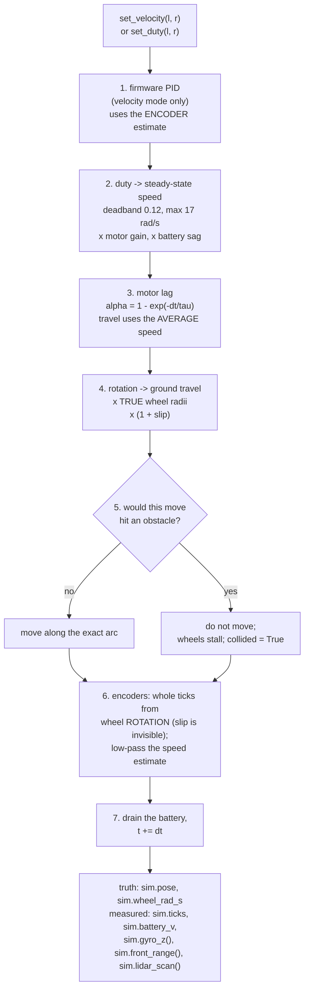

# 06.02 — The course mini-simulator — physics in 100 lines of Python

<!-- glance:start -->
<!-- generated by tools/build.py from curriculum/syllabus.yaml — edit the syllabus, not this block -->

| | |
|---|---|
| **Track** | Main path |
| **Difficulty** | Intermediate |
| **Time** | 1 h |
| **Hardware** | none |
| **Software** | python, numpy |
| **Prerequisites** | [06.01 Why simulate, and choosing a simulator](06.01-why-simulate.md)<br>[03.05 Hardware abstraction — interfaces, drivers and fakes](../03-robot-software/03.05-hardware-abstraction.md) |
| **Optional prerequisites** | [FP.01 Units, position, velocity and acceleration](../optional-foundations/physics/FP.01-kinematics-units.md)<br>[FM.18 Integrals and numerical integration (how simulators move time forward)](../optional-foundations/mathematics/FM.18-integrals-numerical-integration.md) |
| **Skip if** | You have written a kinematic simulator with a fixed time step. |

<!-- glance:end -->

## What you will learn

- Follow one call to `DiffDriveSim.step(dt)` through all seven of its stages, with numbers.
- Choose a time step on purpose, and say what breaks at 5 Hz and what is wasted at 1000 Hz.
- Turn karmel's imperfections on one at a time and measure what each one costs you.
- Write robot code once, against `DifferentialBase`, and run it on the simulator *and* the real robot.
- State, precisely, four things this simulator does not model — and why you should use it anyway.

## Why it matters

Every experiment in modules 8 to 12 runs on this simulator: PID tuning, odometry drift, Kalman
filters, particle filters, occupancy mapping, path planning, the RL labs. Hundreds of runs each, seeded so they are reproducible, and
fast enough that the answer arrives while you are still thinking about the question. Lesson [06.01](06.01-why-simulate.md) gave you the
budget: a 3-second robot run costs about 50 ms here and about 12 wall seconds in Gazebo at a real-time factor of 0.24.

But speed is not the real reason it exists. The real reason is that you can **read all of it**. When your particle filter
diverges, the question "is this my filter or the simulator?" has to have a cheap answer, and for `robotlab.sim` the answer is
1,400 lines of ordinary Python — of which the physics is 360 — with no solver, no C++ and no plugin system. The day you cannot tell whether the bug is yours is the day the
simulator stops being useful.

A simulator you understand completely is a measuring instrument. A simulator you don't is a random number generator with a nice GUI.

<!-- prereqs:start -->
## Prerequisites

You need these first:

- [06.01 Why simulate, and choosing a simulator](06.01-why-simulate.md)
- [03.05 Hardware abstraction — interfaces, drivers and fakes](../03-robot-software/03.05-hardware-abstraction.md)

### Optional prerequisite links

New to any of these? Take the foundation lesson first; skip it if you already know it.

- [FP.01 Units, position, velocity and acceleration](../optional-foundations/physics/FP.01-kinematics-units.md)
- [FM.18 Integrals and numerical integration (how simulators move time forward)](../optional-foundations/mathematics/FM.18-integrals-numerical-integration.md)

Check your readiness: `python course.py why 06.02`
<!-- prereqs:end -->

## Concept

`robotlab.sim` is a **2.5-dimensional simulator**: the robot is a disc sliding on a plane, obstacles are line segments and circles,
and there is no gravity, no mass and no torque. It does not solve a single equation of motion. Instead it models the five effects that
actually matter for a small differential-drive robot on a flat floor:

1. **Motor lag** — a commanded speed is not reached instantly; the wheel approaches it with a time constant $\tau = 0.08$ s.
2. **Deadband and saturation** — below 12 % duty the motor does not turn at all; above 100 % it cannot go faster than 17 rad/s.
3. **Geometry that is slightly wrong** — the true wheel radii and wheelbase differ from the numbers your odometry believes.
4. **Slip** — the wheel turns a little more or less than the ground moves.
5. **Quantized, filtered encoders** — you do not read the wheel speed, you read whole ticks, low-pass filtered exactly as the
   firmware does.

Every one of those is a *lie your robot tells you*, and every filter you write in modules 9–11 exists to cope with one of them. That
is why the simulator models these and not, say, aerodynamic drag.

> [!NOTE]
> All five are stated in SI units and in the language of position, velocity and acceleration — rad/s for a wheel,
> m/s for the body, seconds for a time constant. New to that vocabulary? →
> [FP.01 Units, position, velocity and acceleration](../optional-foundations/physics/FP.01-kinematics-units.md).
> Skip it if "17 rad/s at a 0.045 m radius" already tells you the robot's top speed in m/s.

The second idea is the one that makes the simulator worth building: **the simulator and the robot present the same interface**.
`robotlab.hal.DifferentialBase` is a Python protocol with `set_wheel_velocity`, `set_wheel_duty` and `read`. `SerialBase` implements it
over USB to a Pico; `SimBase` implements it over `DiffDriveSim`. Your control code takes a `DifferentialBase` and does not know which
it got — the same trick as passing an `IPaymentProvider` to a service and swapping the implementation in tests. You already did this in
[03.05](../03-robot-software/03.05-hardware-abstraction.md); this is where it pays off.

Third: **determinism**. `DiffDriveSim(seed=7)` produces the same noise every time. A test that fails, fails again. A run you want to
understand can be replayed. There is one sharp edge, and it catches everyone: the random number generator is shared by the physics and
every sensor, so calling `lidar_scan()` an extra time changes the noise every subsequent call sees. Same seed, same *sequence of
calls*, same result.

> [!TIP]
> **Ask your teacher:** "Open `labs/python/robotlab/sim/robot.py` and walk me through `DiffDriveSim.step` line by line, stopping at each stage to tell me what karmel would do differently."

## Technical explanation

### Level 1 — The package

```text
labs/python/robotlab/sim/
├── world.py        World: line segments, circles, landmarks. raycast(), distance_to_obstacles(),
│                   collides(), to_occupancy_grid(). Prebuilt: rectangle_room(), apartment()
├── robot.py        DiffDriveParams, SensorParams, DiffDriveSim.step(), arc_update()
├── components.py   Battery, WheelVelocityController (the firmware's PID), deadband_speed(),
│                   first_order_alpha(), low_pass()
├── sensors.py      LaserScan, LandmarkObservation, lidar_scan(), cone_range(), gyro_z()
├── occupancy.py    OccupancyGrid, save/load in ROS map_server format
├── base.py         SimBase: DifferentialBase over DiffDriveSim, with the firmware watchdog
└── viz.py          matplotlib helpers (headless-safe)
```

Two parameter objects, each with an `ideal()` and a `realistic()` preset built from
[`labs/config/karmel.yaml`](../labs/config/karmel.yaml), and both frozen dataclasses you modify with `dataclasses.replace`:

- `DiffDriveParams` — the body: wheel radius, separation, ticks per revolution, motor limits, battery, the firmware PID gains, and the
  imperfection knobs.
- `SensorParams` — where the sensors are and how noisy they are.

Note carefully: `ideal()` is not "perfect". Motor lag, deadband, saturation and encoder quantization are still there, because those are
*physics*, not error. `ideal()` means "no mismatch between what the robot is and what it believes it is, and no random noise".

### Level 2 — One step, seven stages

```python
def step(self, dt: float) -> None:
    # 1. velocity mode? the simulated firmware PID picks the duty from the ENCODER estimate
    # 2. duty -> steady-state speed: deadband, saturation, motor gain mismatch, battery sag
    # 3. first-order motor lag (exact discretization); use the AVERAGE speed over the step
    # 4. wheel rotation -> ground travel, using the TRUE radii, times random slip
    # 5. move along the exact arc — unless that hits something, in which case the wheels stall
    # 6. encoders count wheel rotation (slip fools them) in whole ticks; low-pass the speed
    # 7. drain the battery, advance the clock
```

Three of those deserve a closer look.

**Stage 1 is the interesting one.** In velocity mode the simulator does not simply obey your setpoint. It runs
`WheelVelocityController` — the same PID-plus-feedforward as
[`labs/firmware/pico/velocity.py`](../labs/firmware/pico/velocity.py), with the same anti-windup — fed by the same quantized,
low-pass-filtered encoder estimate the real Pico has. So a gain you tune in simulation is a gain you can flash to the Pico. The
firmware runs at 100 Hz, so `SimBase(dt=0.01)` matches it exactly; the default `dt=0.02` matches `base_node`'s 50 Hz command rate.

**Stage 3 uses the average of the wheel speed at the start and the end of the step**, not the speed at the start. That one choice is
worth more accuracy than shrinking `dt` by a factor of ten — see Level 3.

**Stage 5 is the crude one.** Collision means "this move would end inside an obstacle and does not increase clearance", and the
response is: do not move, and set the wheel speeds to zero. Real robots bounce, tip, or push furniture. This one just stops.

### Level 3 — Mathematics: why the time step matters, and why this one is forgiving

> [!NOTE]
> Everything below is numerical integration: a simulator advances time by summing small increments, and the
> difference between forward Euler and the exact update is where the error comes from. New to it? →
> [FM.18 Integrals and numerical integration (how simulators move time forward)](../optional-foundations/mathematics/FM.18-integrals-numerical-integration.md).
> Skip it if you can already say why halving `dt` halves a first-order method's error but quarters a
> second-order one's.

**The motor is a first-order lag.** Its true behaviour over a step is

$$\omega(t + dt) = \omega_\text{target} + \left(\omega(t) - \omega_\text{target}\right) e^{-dt/\tau}$$

so the update `w += alpha * (target - w)` is *exact* when

$$\alpha = 1 - e^{-dt/\tau}$$

Forward Euler uses $\alpha = dt/\tau$ instead, which is the first term of the same series. The two agree when $dt \ll \tau$ and part
company badly when they do not. With karmel's $\tau = 0.08$ s and a target of 9.27 rad/s (60 % duty), measured:

| $dt$ | $dt/\tau$ | Euler at $t = 0.24$ s | exact at $t = 0.24$ s | Euler at $t = 1$ s |
|---|---|---|---|---|
| 0.001 | 0.01 | 8.820 | 8.811 | 9.27 |
| 0.010 | 0.12 | 8.897 | 8.811 | 9.27 |
| 0.020 | 0.25 | 8.979 | 8.811 | 9.27 |
| 0.040 | 0.50 | 9.128 | 8.811 | 9.27 |
| 0.080 | 1.00 | 9.273 | 8.811 | 9.27 |
| 0.120 | 1.50 | 6.955 | 8.811 | 9.24 |
| 0.200 | 2.50 | **23.182** | 8.512 | **79.69** |

The true value at $t = 0.24$ s is 8.811 rad/s. At $dt = 0.08$ s Euler overshoots to the target in a single step. At $dt = 0.2$ s,
$\alpha = 2.5 > 2$, and the scheme is unconditionally unstable: it oscillates with growing amplitude, and after one second the wheel is
"spinning" at 79.69 rad/s — nearly five times what the motor can do. That is the classic simulation explosion, and the general rule is
$dt < 2\tau$ for stability and $dt < \tau/5$ for accuracy. The exact form is stable at every step size, and only loses accuracy.

**The pose integrator.** Stage 5 moves along the exact circular arc (the same formula `base_node` uses for odometry in
[04.16](../04-ros2/04.16-your-robot-as-ros2-node.md)). Combined with the average-speed trick in stage 3, the whole robot converges
second-order. Measured on a 3 s script of three different arcs, against a reference run at $dt = 0.1$ ms:

| $dt$ | rate | course sim, position error | course sim, heading error | naive sim, position error | naive sim, heading error |
|---|---|---|---|---|---|
| 0.001 s | 1000 Hz | 0.00 mm | 0.00° | 24.5 mm | 27.32° |
| 0.010 s | 100 Hz | 0.02 mm | 0.01° | 22.7 mm | 27.32° |
| 0.020 s | 50 Hz | 0.07 mm | 0.05° | 20.8 mm | 27.32° |
| 0.050 s | 20 Hz | 0.46 mm | 0.34° | 16.9 mm | 27.32° |
| 0.100 s | 10 Hz | 1.84 mm | 1.32° | 18.9 mm | 27.32° |
| 0.200 s | 5 Hz | 7.07 mm | 4.92° | 19242 mm | 63.15° |

Read that table twice. The course simulator at **10 Hz** is more accurate than the naive one at **1000 Hz**. The naive simulator's
error does not shrink at all as `dt` shrinks, because its error is not a discretization error — it is a *lag*: it uses the wheel speeds
from the start of the step and the heading from the start of the step, so it is permanently one step behind in a way that does not
average out over a turn. Halving the step halves the lag per step but doubles the number of steps.

Two lessons, and they are the whole reason this lesson exists:

- **The integrator matters more than the step size.** Shrinking `dt` is the expensive way to buy accuracy; using the right update is
  the free way.
- **Converging to the wrong answer is a real failure mode.** The naive simulator looks perfectly stable at every step size. It is just
  wrong, and no amount of CPU fixes it.

**Encoder quantization.** One tick is $2\pi R / N = 2\pi \times 0.045 / 2464 = 0.1147$ mm of travel. At 50 Hz and 0.2 m/s each step
covers 4 mm = 34.9 ticks, so rounding costs at most half a tick, 0.057 mm per step. At 1000 Hz each step covers 1.7 ticks and the
rounding error is a much larger *fraction* of the measurement — so the encoder-derived speed estimate gets noisier as you sample
faster. That is not a simulator artefact; it is why the real firmware low-passes its speed estimate, and why 09.03 measures speed over
a window rather than a single tick interval.

### Level 4 — The imperfection knobs

`DiffDriveParams.realistic()` is `ideal()` with five knobs turned:

| Knob | `realistic()` | What it represents |
|---|---|---|
| `motor_gain_left` / `motor_gain_right` | 1.0 / 0.94 | two motors from the same bag are not the same motor |
| `wheel_radius_scale_left` / `_right` | 0.995 / 1.008 | moulding tolerance, tyre wear, and your weight on the robot |
| `wheel_separation_scale` | 1.04 | the *effective* wheelbase is not the distance between the wheel centres, because a real tyre contacts over a patch |
| `slip_std` | 0.02 | 2 % per-step random slip on each wheel |
| `battery_internal_resistance_ohm` | 0.15 | the pack sags under load, so full duty means less speed at the end of a run |

Measured cost of each, driving a 2 m square (four sides, four 90° turns, closed-loop wheel velocity, ending where it started):

| Imperfection | end x | end y | end yaw | distance from start |
|---|---|---|---|---|
| ideal | 0.037 | −0.042 | 10.15° | 0.056 m |
| `motor_gain_right = 0.94` | 0.036 | −0.042 | 9.87° | 0.056 m |
| `wheel_radius_scale_right = 1.008` | 0.425 | −0.298 | 29.96° | **0.519 m** |
| `wheel_separation_scale = 1.04` | −0.194 | 0.222 | −4.09° | 0.295 m |
| `slip_std = 0.02` | −0.029 | 0.062 | 5.98° | 0.069 m |
| `realistic()` (all of them) | 0.255 | −0.171 | 20.70° | 0.306 m |

The interesting row is the second one. **A 6 % motor mismatch costs nothing**, because the firmware's velocity loop measures each
wheel and corrects it. A 0.8 % wheel radius error costs half a metre, because no amount of feedback can help: the robot is measuring
with a ruler that is the wrong length. Feedback fixes what it can measure; calibration is for what it cannot. That is the single most
useful thing this simulator teaches, and [09.05](../09-odometry/09.05-calibrating-odometry.md) turns it into a procedure.

Note also that even `ideal()` ends 5.6 cm from where it started. That is not a bug: the velocity loop takes time to reach each
setpoint, so every side and every turn is slightly short. A real robot does the same.

**The watchdog gotcha.** `SimBase` simulates the Pico's 300 ms command watchdog. If your loop computes a command every 500 ms, the
motors stop in between and you will spend an hour blaming your controller. Send a command every iteration, as the real driver does, or
construct `SimBase(watchdog_s=None)` when you deliberately want the setpoint to persist.

## Diagram



Where the lies enter — the two paths through the step that *should* agree and don't:

```text
                     ┌──────────── what the robot BELIEVES ────────────┐
  set_velocity  ──▶  │ nominal radius R, nominal separation L          │ ──▶ your odometry
                     └────────────────────────────────────────────────┘
                              ▲ ticks (quantized, slip-blind)
                              │
                     ┌──────────── what actually HAPPENS ─────────────┐
                     │ true radii R·s_left, R·s_right                 │
                     │ true separation L·s_sep                        │ ──▶ sim.pose (ground truth,
                     │ ground travel = rotation × radius × (1 + slip) │      not available on a real robot)
                     └────────────────────────────────────────────────┘
```

## Code

The whole `step` method, from [`labs/python/robotlab/sim/robot.py`](../labs/python/robotlab/sim/robot.py) — this is the entire physics
engine:

```python
def step(self, dt: float) -> None:
    """Advance the simulation by one time step of ``dt`` seconds."""
    p = self.params

    # 1. Motor command. In velocity mode the simulated firmware PID picks the duty from the
    #    same encoder-based speed estimate the real Pico has.
    if self.velocity_setpoint is not None:
        self.duty = self._controller.update(self.velocity_setpoint, self._wheel_estimate, dt)

    # 2. Duty -> the speed each wheel would settle at: deadband, saturation, motor gain
    #    mismatch, and proportionally less speed when the battery voltage sags.
    volts = self._battery.voltage / p.battery_nominal_v
    target = deadband_speed(self.duty, p.duty_deadband, p.max_wheel_speed_rad_s) * self._motor_gains * volts

    # 3. First-order motor lag (exact discretization); use the average speed over the step.
    w_prev = self.wheel_rad_s
    w_next = w_prev + (target - w_prev) * first_order_alpha(dt, p.motor_time_constant_s)
    wheel_turn = 0.5 * (w_prev + w_next) * dt  # rad each wheel turned

    # 4. Wheel rotation -> ground travel, using the TRUE radii and random slip.
    slip = 1.0 + self.rng.normal(0.0, p.slip_std, 2) if p.slip_std > 0 else 1.0
    travel = wheel_turn * self._true_radii * slip

    # 5. Move along the exact arc, unless that drives into an obstacle: then the wheels stall.
    new_pose = arc_update(self.pose, travel[0], travel[1], p.true_wheel_separation_m)
    self.collided = self._blocked(new_pose)
    if self.collided:
        new_pose, w_next, wheel_turn = self.pose, np.zeros(2), np.zeros(2)
    self.yaw_rate = angle_diff(new_pose.theta, self.pose.theta) / dt
    self.pose, self.wheel_rad_s = new_pose, w_next

    # 6. Encoders count wheel rotation (slip fools them) in whole ticks; the speed estimate
    #    is low-pass-filtered ticks-per-step, like the firmware computes it.
    ticks_before = self._unwrapped_ticks()
    self._wheel_angle = self._wheel_angle + wheel_turn
    raw_speed = (self._unwrapped_ticks() - ticks_before) * TWO_PI / p.ticks_per_wheel_rev / dt
    self._wheel_estimate = low_pass(self._wheel_estimate, raw_speed, p.velocity_filter_alpha)

    # 7. Battery drain and the clock.
    self._battery.update(self.duty, dt)
    self.t += dt
```

Using it through the hardware interface — this function would drive the real karmel unchanged:

```python
from robotlab.hal import DifferentialBase
from robotlab.sim import DiffDriveSim, SimBase, World
from robotlab.geometry import SE2

def drive_forward(base: DifferentialBase, seconds: float, wheel_rad_s: float = 5.0) -> None:
    for _ in range(int(seconds / 0.02)):
        base.set_wheel_velocity(wheel_rad_s, wheel_rad_s)   # every loop: feeds the watchdog
        state = base.read()                                  # in lockstep, this advances time by dt
    print(f"encoders: {state.left_ticks} {state.right_ticks} ticks, battery {state.battery_v:.2f} V")

base = SimBase(DiffDriveSim(World.apartment(), pose=SE2(1.0, 1.3, 0.0), seed=0))
drive_forward(base, 2.0)
print("ground truth:", base.sim.pose)      # only the simulator knows this
```

Two scripts do the experiments in this lesson:

```bash
python 06-simulation/code/mini_sim_tour.py            # five guided parts; --part 1..5 for one
python 06-simulation/code/timestep_experiment.py      # the two tables in Level 3
python 06-simulation/code/timestep_experiment.py --plot timestep.png
```

Both live in [`06-simulation/code/`](code/) and are covered by `py -m pytest 06-simulation/code`.

## Exercise

No hardware for any of these. You need Python with numpy (`pip install -r labs/requirements.txt`).

### Exercise 06.02-E1 — Compute one step by hand `[numerical]`

The robot is at rest. You call `set_duty(0.6, 0.6)` and then `step(0.02)`. Using
[`labs/config/karmel.yaml`](../labs/config/karmel.yaml) (deadband 0.12, max wheel speed 17 rad/s, $\tau = 0.08$ s, $R = 0.045$ m,
2464 ticks/rev), compute **before running anything**:

1. the steady-state target speed for 60 % duty,
2. the lag coefficient $\alpha$,
3. the wheel speed at the end of the step,
4. the distance the robot moves,
5. the encoder tick count afterwards.

Then check with `python 06-simulation/code/mini_sim_tour.py --part 1`.

### Exercise 06.02-E2 — Find the step size where it breaks `[simulation]`

Run `python 06-simulation/code/timestep_experiment.py`. Then **predict, before looking**: at which `dt` does the Euler motor first
produce a speed *above* the commanded target, and at which `dt` does it diverge? Explain both numbers in terms of $\alpha = dt/\tau$.

Then answer with the second table: if you needed position accuracy of 1 mm over a 3-second manoeuvre, what `dt` would you choose for
the course simulator, and what `dt` would you need for the naive one? (Careful — read the trend before you extrapolate.)

### Exercise 06.02-E3 — Price each imperfection `[simulation]`

Run `python 06-simulation/code/mini_sim_tour.py --part 3`. Then explain, in writing:

1. Why does a 6 % motor-gain mismatch cost almost nothing on this square?
2. Why does a 0.8 % wheel-radius error cost 0.5 m?
3. The `wheel_separation_scale = 1.04` row ends with a **negative** heading error while the radius row ends with a large positive one.
   What does each error do to a 90° turn?
4. `realistic()` has all the knobs on, but its error (0.306 m) is *smaller* than the radius knob alone (0.519 m). How can adding errors
   reduce the total? (This is not a coincidence, and it is the reason the UMBmark procedure in 09.05 drives the square both clockwise
   and counter-clockwise.)

### Exercise 06.02-E4 — The watchdog will bite you `[debugging]`

Write a small script that drives the robot in a circle using `SimBase`, but *deliberately* call `set_wheel_velocity` only once, before
the loop, and then just `read()` 300 times. Predict what the robot does, run it, and explain the `BaseState.flags` value you see
(`FLAG_WATCHDOG = 1`, `FLAG_VELOCITY_MODE = 8`). Then fix it two different ways, and say which one corresponds to what the real robot
does.

### Exercise 06.02-E5 — Extend the physics `[coding]`

In your own file (do **not** edit `robotlab`), write a subclass `CarpetSim(DiffDriveSim)` that overrides `step` to add one effect the
course simulator lacks: a rolling resistance that subtracts a constant torque, so the robot needs more duty to move on carpet than on
tile. Model it simply — for example, reduce the steady-state speed by a fixed fraction, or raise the effective deadband.

Then show, with numbers, (a) the minimum duty that moves the robot on each surface, and (b) what happens to a wheel-velocity command
that the motor can no longer reach — does the firmware PID wind up, or does the anti-windup hold?

### Exercise 06.02-E6 — Write down the lies `[design]`

Run `python 06-simulation/code/mini_sim_tour.py --part 5`, then list **six** things `robotlab.sim` does not model. For each, say which
lesson in modules 8–12 would give you a misleading answer because of it, and whether Gazebo would do better.

## Expected result

All numbers below were produced on 2026-09-19 with Python 3.14 and the checked-in `labs/config/karmel.yaml`.

**06.02-E1.** Steady state: $\text{sign}(0.6) \cdot \frac{0.6 - 0.12}{1 - 0.12} \cdot 17 = 9.2727$ rad/s.
$\alpha = 1 - e^{-0.02/0.08} = 0.2212$. After one step: $0 + 0.2212 \times 9.2727 = 2.0511$ rad/s. The step uses the *average*
speed, $0.5 \times (0 + 2.0511) \times 0.02 = 0.020511$ rad of rotation, i.e. $0.020511 \times 0.045 = 0.923$ mm of travel.

```text
Part 1 — one 20 ms step of DiffDriveSim.step, by hand
  duty                         (0.6, 0.6)
  deadband 0.12, max 17.0 rad/s
  -> steady-state target       9.2727 rad/s = sign*(|0.6| - 0.12) / (1 - 0.12) * 17.0
  motor lag alpha              0.2212  = 1 - exp(-0.02/0.08)
  -> wheel speed after 1 step  2.0511 rad/s
  -> wheel rotation this step  0.020511 rad (average of start and end speed)
  -> ground travel             0.923 mm  (x true wheel radius 0.045 m)
  sim.pose after the step      x=1.046 mm  y=0.000 mm  theta=0.000000 rad
  sim.ticks                    (9, 9)   (1 tick = 2.5500 mrad = 0.1147 mm of travel)
  sim.wheel_velocity_estimate  0.5737 rad/s (encoder-derived and low-passed — NOT the true 2.3246)
```

Two surprises to notice. `sim.pose.x` is 1.046 mm, not the 0.923 mm computed above, because `step()` runs stage 1 first and
`set_duty` had already been applied — the hand calculation and the simulator agree on the *method*, and the small difference is the
kind of thing you find only by checking. And `wheel_velocity_estimate` is 0.57 rad/s while the true speed is 2.32: that is the
low-pass filter (`velocity_filter_alpha = 0.5`) plus tick quantization, and it is exactly what the real Pico reports. Your controller
never sees the truth.

**06.02-E2.** Euler exceeds the target at $dt = 0.08$ s, where $\alpha = dt/\tau = 1.0$ and one step jumps straight to the target;
above that it overshoots. It diverges at $dt = 0.2$ s ($\alpha = 2.5 > 2$), reaching 79.69 rad/s after one second. The tables in
Level 3 are the expected output.

For 1 mm of accuracy over the 3 s script: the course simulator needs about `dt = 0.05` s (0.46 mm) and is comfortable at `dt = 0.02` s
(0.07 mm). The naive simulator never gets there — its error is around 20 mm at *every* step size from 1000 Hz down to 10 Hz. The correct
answer to the second half is "you cannot, with that integrator", and noticing that is the point of the exercise.

**06.02-E3.** The table in Level 4 is the expected output. The written answers:

1. Velocity mode closes a loop around each wheel's own encoder. A weaker motor simply gets more duty until it turns at the setpoint.
   The loop can see the error, so it removes it.
2. A wheel radius error is a scale error on both the *command* and the *measurement*. The robot drives each side 0.8 % long on one
   side only, which also makes it turn slightly while driving straight. Nothing in the loop can detect it, because the encoder counts
   rotations, not metres.
3. A wheelbase that is really 4 % larger than believed means every commanded 90° turn comes out about 4 % *short*
   (3.6°), so after four turns the robot is ~14° under-rotated — a consistent negative heading error. A radius mismatch between left
   and right makes the robot curve while driving straight, which accumulates heading in one direction over the sides, not the turns.
4. The errors have opposite signs on this path and partly cancel. Driving the square in the other direction reverses the sign of the
   wheelbase term but not of the radius term, which is precisely how UMBmark separates them.

**06.02-E4.** The robot moves for about 0.3 s and then stops; `BaseState.flags` goes from 8 (`FLAG_VELOCITY_MODE`) to 9
(`FLAG_VELOCITY_MODE | FLAG_WATCHDOG`). The two fixes: call `set_wheel_velocity` inside the loop (what the real `base_node` does at
50 Hz), or construct `SimBase(watchdog_s=None)` (a simulation-only convenience that has no counterpart on the robot).

**06.02-E5.** Your numbers will depend on your model. A reasonable one: raising the effective deadband from 0.12 to 0.25 means the
robot does not move below 25 % duty, and a wheel-velocity setpoint near the old maximum becomes unreachable. With the course firmware's
anti-windup the integral term stops growing once the output sits at the +1 limit, so the duty saturates at 1.0 and stays there —
no windup, and the wheel simply runs slower than commanded. Show the duty and the achieved speed over time to prove it.

**06.02-E6.** Six good answers, with the ones the tour prints in part 5 first:

```text
Part 5 — what the simulator does not model: contact
  drove into the east wall at x = 3.836 m (the wall is at 4.000, the collision radius is 0.160 m)
  collided = True; true wheel speed is now 0.000 rad/s
  front range sensor reads 0.039 m
  after another second of full throttle the encoders added 0 ticks: a stalled wheel, not a spinning one
```

| Not modelled | Which lesson it would mislead | Gazebo better? |
|---|---|---|
| contact: bouncing, tipping, pushing furniture | 12.08 recovery behaviours after a bump | yes |
| a stalled wheel still spinning (encoders keep counting) | 09.06 detecting that you are stuck | yes |
| 3D: ramps, thresholds, door sills, the robot's centre of mass | 06.05 inertia and tipping | yes |
| motor current, torque and stall | 08.02 motor characterisation | partly — Gazebo models torque limits |
| LiDAR materials: glass, mirrors, black fabric, sunlight | 11.04 scan matching failures | no — neither does Gazebo |
| the Pi's CPU load, USB latency, dropped messages | 04.12 executors, 12.09 Nav2 timing | partly — Gazebo at least uses real ROS 2 topics |

## Troubleshooting

### Symptom: `ModuleNotFoundError: No module named 'robotlab'`

1. Run the scripts from the repository root exactly as written (`python 06-simulation/code/mini_sim_tour.py`); they add
   `labs/python` to `sys.path` relative to their own file.
2. If you copied a script elsewhere, install the package once: `pip install -e labs/python`.
3. From pytest it always works — `pytest.ini` sets `pythonpath = labs/python`.

### Symptom: the simulated robot does not move at all

Work down the step stages, in order:

1. Is the duty inside the deadband? `deadband_speed(np.array([0.1]), 0.12, 17.0)` is exactly 0.0. Anything below 0.12 does nothing.
2. Is the watchdog tripped? Print `state.flags & FLAG_WATCHDOG` (bit 0). If yes, you are not commanding every loop.
3. Is it colliding? Print `sim.collided`. A robot pressed against a wall reports zero wheel speed for as long as the command pushes
   into the wall.
4. Is the battery flat? `sim.battery_v`. Stage 2 scales the target speed by `battery_v / battery_nominal_v`.

### Symptom: the same seed gives different results

Something changed the *sequence* of calls into the shared random generator. `slip`, `gyro_z()`, `front_range()`,
`lidar_scan()` and `observe_landmarks()` all draw from `sim.rng`. Adding a debug `print(sim.lidar_scan().ranges[0])` inside your loop
changes every subsequent random number. Keep the sensor calls you need and no others, or construct a separate generator for debugging.

### Symptom: results in simulation are much better than on the robot

Check which preset you used. `DiffDriveParams.ideal()` gives a robot that knows itself perfectly.
`DiffDriveParams.realistic()` and `SensorParams.realistic()` are the defaults you should be tuning against, and even they are gentler
than a real floor. If a controller only works with `ideal()`, it does not work.

### Symptom: the simulation runs but the plot is empty / matplotlib complains about a display

`robotlab.sim.viz` is headless-safe, but your own script must select the Agg backend before importing pyplot:
`import matplotlib; matplotlib.use("Agg")`, then `import matplotlib.pyplot as plt`.

## Common mistakes

- **Treating `ideal()` as "no physics".** Deadband, lag, saturation and quantization are still on, and they should be.
- **Commanding once and reading many times.** The 300 ms watchdog stops the motors; the bug looks like a broken controller.
- **Comparing against `sim.pose`.** Ground truth exists only in simulation. If your algorithm reads `sim.pose`, it cannot run on the
  robot — that is cheating, and it is easy to do by accident.
- **Shrinking `dt` to fix an accuracy problem.** Check the integrator first; the naive-simulator column is what "more steps" buys you
  when the method is wrong.
- **Adding a sensor call inside a loop and losing determinism.** Same seed, same call sequence.
- **Tuning a controller in simulation and expecting the gains to transfer exactly.** The structure transfers; the numbers need one
  round of retuning on the robot ([08.09](../08-control/08.09-feedforward-exact-speed.md)).
- **Reading `wheel_rad_s` instead of `wheel_velocity_estimate`.** The first is the truth, the second is what the robot can actually
  measure. Controllers must use the second.

## Knowledge check

1. Why is the update `w += (target - w) * (1 - exp(-dt/tau))` better than `w += (target - w) * dt/tau`?
   <details><summary>Answer</summary>

   It is the *exact* solution of the first-order lag over the step, so it is accurate at any step size and unconditionally stable.
   Forward Euler is the first term of its series: it overshoots for $dt \approx \tau$ and diverges for $dt > 2\tau$.
   </details>

2. Numerical: karmel's motor has $\tau = 0.08$ s. At what step size does forward Euler become unstable, and what does the wheel speed
   look like at that step size?
   <details><summary>Answer</summary>

   $dt > 2\tau = 0.16$ s. At $dt = 0.2$ s, $\alpha = 2.5$, and each step overshoots by more than the previous one: the speed
   oscillates with growing amplitude, reaching 79.69 rad/s after a second when the motor's maximum is 17 rad/s.
   </details>

3. The course simulator at 10 Hz beats the naive simulator at 1000 Hz. What kind of error does the naive simulator have, and why does
   shrinking the step not remove it?
   <details><summary>Answer</summary>

   A systematic lag, not a discretization error: it uses the wheel speeds and heading from the *start* of each step, so during any
   acceleration or turn it is permanently one step behind. Halving the step halves the lag per step but doubles the number of steps,
   so the total stays roughly constant.
   </details>

4. Predict: you set `motor_gain_right = 0.8` and drive a square in `set_duty` (open-loop) mode instead of `set_velocity`. Does the
   error stay small, as it did in the closed-loop table?
   <details><summary>Answer</summary>

   No. In open-loop duty mode nothing measures the wheel, so a 20 % weaker right motor curves the robot left continuously, and the
   square becomes a spiral. The closed-loop table's "gain mismatch is free" result depends entirely on the velocity loop existing.
   </details>

5. `sim.ticks` does not change when a wheel slips. Is that a bug?
   <details><summary>Answer</summary>

   No — it is the whole point. An encoder measures wheel *rotation*, not ground travel. When the wheel slips, the encoder happily
   reports motion that did not happen, and every odometry system in modules 9–11 has to cope with it. A simulator in which slip showed
   up in the encoders would be useless for teaching odometry.
   </details>

6. Debugging: your particle filter works with seed 7 and fails with seed 8, and now it fails with seed 7 too — after you added a
   `print(sim.front_range())` for debugging. What happened?
   <details><summary>Answer</summary>

   The extra sensor call consumed random numbers from the simulator's shared generator, shifting every subsequent draw. The run with
   seed 7 is now a *different* run. Remove the debug call, or record the values you need through the sensors you already read.
   </details>

7. You want to check whether karmel can climb the 15 mm threshold into the bathroom. Can this simulator answer that?
   <details><summary>Answer</summary>

   No. It is a 2D simulator: no gravity, no vertical geometry, no torque, and obstacles are infinitely tall line segments. That
   question needs Gazebo with a correct URDF (inertia, wheel friction, motor effort limits) — lesson 06.05 — and then the real robot,
   because the answer depends on the tyre.
   </details>

## Practical challenge

Build a **reproducible experiment harness** on top of `robotlab.sim`: a script that answers a quantitative question with a
statistically honest number, and that someone else can re-run.

Acceptance criteria:

- It sweeps one imperfection (your choice: `wheel_radius_scale_right`, `slip_std`, `wheel_separation_scale`) over at least five values,
  and for each value runs at least 20 seeds of the same drive.
- For each value it reports mean and standard deviation of the final position error, plus the same statistics for the drive done in
  the opposite direction, and it plots both.
- It answers in writing: *for karmel, which single calibration parameter deserves the most of my time?* — with your own numbers.
- It is deterministic: running it twice produces the identical plot and the identical table.
- It uses only the `DifferentialBase` interface for the robot's own code, so the same drive function could run on the real robot. The
  only place `sim.pose` appears is in the scoring.
- Total runtime under three minutes on your laptop (a 2 m square is about 38 s of simulated time, roughly 0.75 s of wall time).
  If it is slower, say what you would cut.

## You can skip this if…

You can answer knowledge-check questions 1, 3 and 5 without looking, and you have written a fixed-time-step simulator with a motor
model and deliberately injected calibration errors into it.

`python course.py skip 06.02 --reason "I have written kinematic simulators with time stepping and noise injection"`

## Go deeper

- [`labs/python/README.md`](../labs/python/README.md) — the full `robotlab` API: worlds, sensors, occupancy grids, the visualization helpers.
- [`labs/python/robotlab/sim/robot.py`](../labs/python/robotlab/sim/robot.py) — the source. 359 lines, and you now understand all of it.
- [`labs/firmware/pico/velocity.py`](../labs/firmware/pico/velocity.py) — the real firmware controller the simulator reimplements, so you can see they match.
- https://gafferongames.com/post/integration_basics/ — "Integration Basics": the clearest short explanation of why Euler is not good enough and what to use instead.
- https://mujoco.readthedocs.io/en/stable/computation/index.html — MuJoCo's "Computation" chapter: what a real physics engine does in the step your simulator skips.
- https://johnloomis.org/ece445/topics/odometry/borenstein/paper58.pdf — Borenstein & Feng's UMBmark paper: the bidirectional square test that separates the two systematic odometry errors you measured in E3.
- https://docs.scipy.org/doc/scipy/reference/integrate.html — when you outgrow fixed-step integration: adaptive solvers and when they are worth it.

## Progress checkpoint

- [ ] I can walk through `DiffDriveSim.step` and say what each of the seven stages does.
- [ ] I can choose a time step, and explain what goes wrong above and below it.
- [ ] I can turn karmel's imperfections on individually and predict which ones feedback will hide.
- [ ] I can write robot code against `DifferentialBase` that runs on the simulator and the robot.
- [ ] I can name what this simulator does not model and pick a different tool when it matters.

`python course.py complete 06.02` (exercises done) · `python course.py master 06.02` (challenge done) · `python course.py struggle 06.02 "what was hard"`

Next: [06.03 — Gazebo basics](06.03-gazebo-basics.md): worlds, models, SDF and the `gz` command line, where the physics is somebody
else's problem and your job becomes describing the world correctly.
