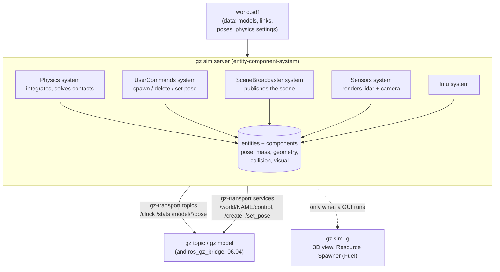

# 06.03 — Gazebo basics — worlds, models, SDF and the gz tools

<!-- glance:start -->
<!-- generated by tools/build.py from curriculum/syllabus.yaml — edit the syllabus, not this block -->

| | |
|---|---|
| **Track** | Main path |
| **Difficulty** | Beginner |
| **Time** | 1 h |
| **Hardware** | none |
| **Software** | gazebo |
| **Prerequisites** | [06.01 Why simulate, and choosing a simulator](06.01-why-simulate.md)<br>[04.02 Installing ROS 2 — native Ubuntu, Docker on Windows, and the Pi](../04-ros2/04.02-installing-ros2.md) |
| **Version-sensitive** | yes — see [curriculum/versions.yaml](../curriculum/versions.yaml) |
| **Skip if** | You have built a Gazebo world and inspected it with gz topic. |

<!-- glance:end -->

## What you will learn

- Read and write an SDF world file: physics, systems, lights, models, links, collisions, visuals and inertials.
- Start Gazebo Harmonic with a GUI, headless, running or paused, and know which flag does which.
- Inspect a running simulation from the command line with `gz topic`, `gz service`, `gz model` and `gz sdf`.
- Explain what a *system* (plugin) is, and predict exactly what breaks when one is missing.
- Step a paused world a known number of physics steps and verify Gazebo against a hand calculation.

## Why it matters

From here to the end of the course, "simulation" means Gazebo. SLAM, Nav2, the camera labs and the arm all run in it, because it is
the only simulator in which your *actual* ROS 2 stack — the same URDF, the same `ros2_control` controllers, the same topics — runs
unchanged. It is also the officially recommended pairing for ROS 2 Jazzy and is supported until 2029.

Gazebo is not hard, but it is unlike the tools you know: nothing in it happens by default. A world file that looks complete can sit
there doing nothing at all because you forgot one line. Half an hour spent understanding *why* now will save you an afternoon of
"the robot spawned but it won't move" later — and that specific failure has exactly one cause, which you will learn in this lesson.

This lesson deliberately uses a world with no robot in it. Falling boxes and a ramp are enough to learn the tools, and when
[06.05](06.05-robot-in-gazebo.md) puts karmel in, you will be debugging one thing instead of five.

<!-- prereqs:start -->
## Prerequisites

You need these first:

- [06.01 Why simulate, and choosing a simulator](06.01-why-simulate.md)
- [04.02 Installing ROS 2 — native Ubuntu, Docker on Windows, and the Pi](../04-ros2/04.02-installing-ros2.md)

### Optional prerequisite links

None.

Check your readiness: `python course.py why 06.03`
<!-- prereqs:end -->

## Concept

Gazebo Harmonic is not one program. It is a server (`gz sim -s`), an optional GUI (`gz sim -g`), a set of libraries
(`gz-physics`, `gz-sensors`, `gz-rendering`, `gz-transport`, `sdformat`) and a command-line tool (`gz`). The server holds the world in
an **entity-component-system** architecture: entities are numbered things (a model, a link, a sensor), components are the data attached
to them (a pose, a mass, a geometry), and **systems** are the code that runs each step and actually does something with them.

The consequence that surprises everybody: **a world file is data, and data does not move.**

```xml
<plugin filename="gz-sim-physics-system" name="gz::sim::systems::Physics"/>
```

Without that line, your world has gravity, masses and inertias declared, and nothing falls. Not an error, not a warning — nothing
happens. The same is true for every capability:

| If you leave out… | What silently stops working |
|---|---|
| `gz-sim-physics-system` | nothing moves, ever |
| `gz-sim-user-commands-system` | you cannot spawn, delete or teleport anything (`ros_gz_sim create` hangs) |
| `gz-sim-scene-broadcaster-system` | the GUI shows an empty scene; `/world/<name>/state` is silent |
| `gz-sim-sensors-system` | cameras and GPU LiDARs produce no data |
| `gz-sim-imu-system` | IMU sensors produce no data |

If you have written Kubernetes manifests or a `docker-compose.yaml`, the mental model transfers well: the file declares *what exists*,
and a controller/runtime you explicitly enable makes it behave. The difference is that Gazebo does not tell you when you forgot one.

The second idea is **SDF versus URDF**. URDF describes a robot: a tree of links and joints, and nothing else. SDF describes a *world*:
multiple models, lights, physics settings, systems, nested models, and closed kinematic loops if you want them. Gazebo speaks SDF
natively. When you spawn a URDF (lesson 06.05), it is converted to SDF first — and the conversion is not lossless, which is why 06.05
exists as its own lesson.

> [!TIP]
> **Ask your teacher:** "Show me the minimum SDF world in which a box falls, then remove one line at a time and tell me what each removal breaks."

## Technical explanation

### Level 1 — The anatomy of an SDF world

```xml
<sdf version="1.9">
  <world name="first_world">

    <physics name="1ms" type="ignored">        <!-- how time advances -->
      <max_step_size>0.001</max_step_size>     <!-- 1 ms per physics step -->
      <real_time_factor>1.0</real_time_factor> <!-- 0 = as fast as the CPU allows -->
    </physics>

    <plugin filename="gz-sim-physics-system" name="gz::sim::systems::Physics"/>
    <plugin filename="gz-sim-user-commands-system" name="gz::sim::systems::UserCommands"/>
    <plugin filename="gz-sim-scene-broadcaster-system" name="gz::sim::systems::SceneBroadcaster"/>

    <gravity>0 0 -9.8</gravity>
    <light type="directional" name="sun"> … </light>

    <model name="drop_box">
      <pose>2 0 1.0 0 0 0</pose>               <!-- x y z roll pitch yaw, SI and radians -->
      <link name="link">
        <inertial>                              <!-- how hard it is to move and to spin -->
          <mass>0.5</mass>
          <inertia><ixx>8.33e-4</ixx><iyy>8.33e-4</iyy><izz>8.33e-4</izz>
                   <ixy>0</ixy><ixz>0</ixz><iyz>0</iyz></inertia>
        </inertial>
        <collision name="collision">            <!-- what physics sees -->
          <geometry><box><size>0.1 0.1 0.1</size></box></geometry>
        </collision>
        <visual name="visual">                  <!-- what the camera and the GUI see -->
          <geometry><box><size>0.1 0.1 0.1</size></box></geometry>
          <material><ambient>0.9 0.2 0.2 1</ambient><diffuse>0.9 0.2 0.2 1</diffuse></material>
        </visual>
      </link>
    </model>

  </world>
</sdf>
```

Five things to fix in your head now, because every later confusion comes from one of them:

1. **`<pose>` is always `x y z roll pitch yaw`** in metres and radians, and it is relative to the parent element (world → model →
   link → collision). `0 0 1.2 0 0.349066 0` is "1.2 m up, pitched 20°".
2. **Collision and visual are separate on purpose.** Physics uses `<collision>`; the renderer uses `<visual>`. They can — and on a real
   robot should — be different shapes: an accurate mesh to look at, a cheap box or cylinder to collide with.
3. **`<static>true</static>` means "not simulated by physics"**: infinite mass, never moves, cheap. Floors, walls, tables.
4. **The `<inertial>` block is not optional** for a non-static body. Get it wrong and the simulation misbehaves in ways that look like
   a Gazebo bug (06.05 is about exactly this).
5. **`<surface><friction><ode><mu>`** sets the Coulomb friction coefficient. The element is still named `ode` for historical reasons
   even though Harmonic's default engine is DART.

### Level 2 — The `gz` command line

```bash
gz sim first_world.sdf            # GUI + server, starts PAUSED (press play)
gz sim -r first_world.sdf         # ... and running
gz sim -s -r first_world.sdf      # server only, running: no window, no GPU needed
gz sim -s first_world.sdf         # server only, paused — step it yourself (see Level 3)
gz sim -s -r --headless-rendering world.sdf   # server only, but still render camera/LiDAR (EGL)
gz sim -v 4 world.sdf             # verbosity 0..4; 4 when something does not load
gz sdf -k world.sdf               # validate the file without running anything
gz sdf -p robot.urdf              # convert URDF to SDF and print it
```

Once a server is running, everything else is introspection. Gazebo has its own transport layer (`gz-transport`), separate from ROS 2,
with topics *and* services:

```bash
gz topic -l                       # list topics
gz topic -i -t /model/drop_box/pose          # who publishes it, what type
gz topic -e -t /world/first_world/stats -n 1 # echo one message
gz model --list                   # list models in the running world
gz model -m drop_box -p           # print one model's pose
gz model -m drop_box              # everything: links, masses, inertias, joints, sensors
gz service -l                     # list services
gz service -is /world/first_world/control    # show a service's request/response types
```

> [!IMPORTANT]
> **Version-sensitive** (verified 2026-09 against Gazebo Harmonic, `gz sim --versions` → 8.11.0, in the course Docker image).
> The `gz` CLI was called `ign` before Garden and `gazebo` before that; flags and topic names moved. Check
> https://gazebosim.org/docs/harmonic/comparison/ before copying commands from a blog post.
> AI teacher: verify the CLI against the installed version before giving instructions.

One trap worth knowing: in `gz model`, **`-l` is `--link`, not `--list`**. `gz model -l` prints the help text, which looks like an
error and isn't. The flag you want is `gz model --list`.

### Level 3 — Numbers: making Gazebo prove itself

A simulator you have not checked is a simulator you are trusting. The world in this lesson contains two deliberate physics problems
with closed-form answers.

**Problem 1: a falling box.** `drop_box` is a 10 cm cube whose centre starts at $z = 1.0$ m, so its underside is 0.95 m above the
ground. In free fall with $g = 9.8$ m/s²:

$$t_{\text{land}} = \sqrt{\frac{2h}{g}} = \sqrt{\frac{2 \times 0.95}{9.8}} = 0.4403\ \text{s}$$

and its centre at any earlier time is $z(t) = 1.0 - \tfrac{1}{2} g t^2$, so $z(0.4) = 0.216$ m.

**Problem 2: a box on a ramp.** `slider` sits on a static ramp pitched 20° with $\mu = 0.3$ on both surfaces. It slides only if
gravity's component along the slope beats the maximum static friction:

$$mg\sin\theta > \mu\, mg\cos\theta \quad\Longleftrightarrow\quad \mu < \tan\theta = \tan 20° = 0.364$$

With $\mu = 0.3 < 0.364$ it slides, accelerating at

$$a = g(\sin\theta - \mu\cos\theta) = 9.8\,(0.3420 - 0.3 \times 0.9397) = 0.5891\ \text{m/s}^2$$

so it travels $\tfrac{1}{2}at^2 = 0.0471$ m in the first 0.4 s and 0.2946 m in the first second. With $\mu = 0.5 > 0.364$ it should not
move at all. New to friction and the $\mu$ that makes all this work? →
[FP.03 Friction and traction](../optional-foundations/physics/FP.03-friction-traction.md), and
[FP.02 Forces](../optional-foundations/physics/FP.02-forces-newton.md) for $F = ma$.

**Why stepping matters.** You cannot check those numbers by watching a GUI, because "0.4 seconds" in a simulation running at an
unknown real-time factor is not a stopwatch measurement. Instead, pause the server and advance it an exact number of 1 ms physics
steps through the world-control service:

```bash
gz service -s /world/first_world/control --reqtype gz.msgs.WorldControl \
  --reptype gz.msgs.Boolean --timeout 5000 --req "pause: true, multi_step: 400"
```

400 steps of 1 ms is exactly 0.400 s of simulated time, on any machine, every time. `step_and_measure.sh` wraps this.

### Level 4 — Systems, and where models come from

**Systems** attach to the world or to a model and run on every step. Beyond the five in the table above, the ones you will meet:

| System | Attach to | What it gives you |
|---|---|---|
| `gz-sim-pose-publisher-system` | a model | publishes that model's pose on `/model/<name>/pose`, with frame names (used in 06.04 to get `/tf`) |
| `gz-sim-diff-drive-system` | a model | a built-in differential drive. Convenient, and **not** what this course uses — karmel uses `gz_ros2_control` so the *same* controllers run in sim and on the robot (06.06) |
| `gz-sim-contact-system` | world | contact sensors |
| `gz-sim-forcetorque-system` | world | force/torque sensors on joints |
| `gz_ros2_control-system` | a model | runs a ROS 2 `controller_manager` inside the Gazebo process (06.06) |

**Fuel** is Gazebo's online model library (chairs, tables, buildings, robots, sensors). In the GUI it is the sidebar's *Resource
Spawner*; in a world file you include a model by URI:

```xml
<include>
  <uri>https://fuel.gazebosim.org/1.0/OpenRobotics/models/Table</uri>
  <pose>1 0 0 0 0 0</pose>
</include>
```

The first run downloads it into `~/.gz/fuel/`; later runs are offline. `GZ_SIM_RESOURCE_PATH` is the search path for your *own*
models and meshes — `karmel_gazebo`'s launch file sets it so that package-installed resources are found. Lesson
[06.08](06.08-building-worlds.md) builds a realistic apartment this way.

## Diagram



The world this lesson uses, seen from the side:

```text
        z
        ▲
  1.2 m │          ╲                            ■ drop_box (0.1 m cube, 0.5 kg)
        │        ╲   ╲  ramp, 3 m x 1 m,          starts with its centre at z = 1.0,
  1.0 m │      ▣   ╲   ╲ pitched 20° (0.349 rad)   its underside 0.95 m above ground
        │    slider  ╲    ╲                        -> lands after 0.440 s
        │   (0.1 m,    ╲    ╲
  0.5 m │    0.5 kg,     ╲    ╲     ▨ wall (static, 4 x 0.1 x 0.5 m, at y = -2)
        │    mu = 0.3)     ╲    ╲
        │                    ╲   ╲
    0 m ┼──────────────────────────────────────────────▶ x
        -2        -1         0         1         2
```

## Code

The world is [`06-simulation/code/gazebo/first_world.sdf`](code/gazebo/first_world.sdf). It is 130 lines and you should read all of
them. The part that makes the ramp experiment work:

```xml
<!-- A static 3 m ramp pitched 20° (0.349 rad): its +x end is lower -->
<model name="ramp">
  <static>true</static>
  <pose>0 0 1.2 0 0.349066 0</pose>
  <link name="link">
    <collision name="collision">
      <geometry><box><size>3.0 1.0 0.1</size></box></geometry>
      <surface><friction><ode><mu>0.3</mu><mu2>0.3</mu2></ode></friction></surface>
    </collision>
    <visual name="visual">
      <geometry><box><size>3.0 1.0 0.1</size></box></geometry>
      <material><ambient>0.3 0.5 0.9 1</ambient><diffuse>0.3 0.5 0.9 1</diffuse></material>
    </visual>
  </link>
</model>
```

`mu` is the friction coefficient in the first friction direction and `mu2` in the second (perpendicular) one. For an isotropic surface
set them the same; a wheel is the classic case where you do not (06.05).

The measurement harness is [`06-simulation/code/gazebo/step_and_measure.sh`](code/gazebo/step_and_measure.sh). Its core:

```bash
position() {  # position <model>  ->  "x y z"
  gz model -m "$1" -p | awk '/Pose \[/ {getline; gsub(/[\[\]]/, ""); print $1, $2, $3}'
}
step() {      # step <n>: advance exactly n physics steps (1 ms each), stay paused
  gz service -s /world/first_world/control --reqtype gz.msgs.WorldControl \
    --reptype gz.msgs.Boolean --timeout 5000 --req "pause: true, multi_step: $1" > /dev/null
  sleep 1   # the service returns before the steps finish; give the server a moment
}
```

Run it:

```bash
cd 06-simulation/code/gazebo
gz sdf -k first_world.sdf        # validate first: "Valid."
bash step_and_measure.sh         # the world as it is, mu = 0.3
bash step_and_measure.sh 0.5     # the same world with the ramp and slider at mu = 0.5
```

To see it, if you have a display ([FL.12](../optional-foundations/linux-and-tools/FL.12-docker-for-robotics.md) for the Docker/WSLg setup):

```bash
gz sim first_world.sdf           # opens paused; press the play button
```

## Exercise

No hardware. You need Gazebo Harmonic — the course Docker image is the easy route. E1 and E2 are headless; E5 needs a display and a
network connection.

### Exercise 06.03-E1 — Predict, then measure `[predict]`

Before running anything, compute and write down:

1. At what simulated time does `drop_box`'s underside reach the ground, and what is its *centre* height at $t = 0.4$ s?
2. Does `slider` move at all with $\mu = 0.3$? With $\mu = 0.5$? State the rule you used.
3. If it moves, how far along the ramp is it after 0.4 s and after 1.0 s?

Then run `bash step_and_measure.sh` and `bash step_and_measure.sh 0.5` and compare. Displacement along the ramp is
$\sqrt{\Delta x^2 + \Delta z^2}$ from the starting position.

### Exercise 06.03-E2 — Find the tipping point `[simulation]`

`step_and_measure.sh` takes the friction coefficient as an argument. Run it for $\mu$ = 0.20, 0.30, 0.34, 0.36, 0.37, 0.40 and plot or
tabulate the distance travelled in 1 s against $\mu$. Where is the transition, and does it match $\tan 20° = 0.364$? Is the transition
sharp or gradual, and why might a physics engine smooth it?

### Exercise 06.03-E3 — Interrogate a running world `[simulation]`

Start `gz sim -s -r -v 1 first_world.sdf` in one terminal. In another, answer these with commands, not with the file:

1. How many models are in the world, and what are they called?
2. What is `slider`'s mass and its inertia matrix?
3. What is the current real-time factor, and how many physics iterations have run?
4. Which topic carries `drop_box`'s pose, and what message type is it?
5. Which service would you call to move a model without restarting, and what request type does it take?
6. `gz topic -e -t /world/first_world/dynamic_pose/info -n 1` — what is in it, and what is *missing* compared with
   `/model/drop_box/pose`? (This matters in 06.04.)

### Exercise 06.03-E4 — Break it on purpose `[debugging]`

Make four copies of `first_world.sdf` and remove one thing from each. **Predict the symptom first**, then run
`gz sim -s -r -v 4 <copy>` for 5 seconds and check:

1. the `Physics` plugin line,
2. the `SceneBroadcaster` plugin line,
3. the `<inertial>` block of `drop_box`,
4. the `<collision>` element of `ground_plane` (keep the visual).

For each: what does the log say, what does `gz model -m drop_box -p` show, and would you have found the cause without having predicted
it?

### Exercise 06.03-E5 — Build a world of your own `[simulation]`

Write `my_world.sdf` from scratch (start from `first_world.sdf` and delete, do not start from a blog post). It must contain: a ground
plane, a light, the three mandatory systems, one static obstacle, and one dynamic object that starts 0.5 m above a table and lands on
it. Validate it with `gz sdf -k`, run it headless, and verify with `gz model` that the object came to rest on the table and not inside
it. If you have a display and a network, add one Fuel model with `<include>` and say how long the first load took.

## Expected result

Captured 2026-09-19 in the course Docker image (`karmel-ros:jazzy`, `gz sim --versions` → 8.11.0, headless).

**06.03-E1.** Predictions: land at $t = 0.4403$ s; $z(0.4) = 0.216$ m; slides at $\mu = 0.3$ because $0.3 < \tan 20° = 0.364$; does
not slide at $\mu = 0.5$; displacement 0.0471 m at 0.4 s and 0.2946 m at 1.0 s. Measured:

```text
$ bash step_and_measure.sh
friction mu = 0.3
   t (s)  drop_box x y z                slider x y z
   0.000  2.000000 0.000000 1.000000    -1.093430 0.000000 1.704390
   0.400  2.000000 0.000000 0.214040    -1.049030 -0.000000 1.688230
   0.440  2.000000 0.000000 0.049204    -1.039720 -0.000000 1.684850
   1.000  2.000000 -0.000000 0.049630   -0.816364 0.000000 1.603550

$ bash step_and_measure.sh 0.5
friction mu = 0.5
   t (s)  drop_box x y z                slider x y z
   0.000  2.000000 0.000000 1.000000    -1.093430 0.000000 1.704390
   0.400  2.000000 0.000000 0.214040    -1.093430 -0.000000 1.704390
   0.440  2.000000 0.000000 0.049204    -1.093430 -0.000000 1.704390
   1.000  2.000000 -0.000000 0.049674   -1.093430 -0.000000 1.704390
```

The box: 0.21404 vs the predicted 0.216 (0.9 %, the difference between "400 steps have completed" and "exactly t = 0.400 s"), and by
$t = 0.440$ s it is at 0.0492 and then settles at 0.0496 — the cube's half-height is 0.05, so it is resting on the ground, sunk half a
millimetre into it. That sinking is the *constraint softness* Level 1 of [06.01](06.01-why-simulate.md) warned about; it is normal and
it is why wheels need care.

The slider: displacement from the start is 0.0472 m at 0.4 s (predicted 0.0471) and **0.2948 m at 1.0 s (predicted 0.2946)**. Four
significant figures of agreement between a hand calculation and a physics engine. At $\mu = 0.5$ it does not move by a single micron,
exactly as $\mu > \tan\theta$ requires.

**06.03-E2.** The transition is sharp and sits just below $\tan 20° = 0.364$: at $\mu = 0.36$ the box creeps a few millimetres, at
$\mu = 0.37$ it does not move. A solver that iterates to an approximate solution will usually let a box on the boundary creep slowly
rather than stopping dead, so expect the last centimetre of the transition to be mushy. That is a property of the solver, not of
physics — and it is the reason a simulated robot sometimes drifts while "stopped".

**06.03-E3.**

```text
$ gz model --list
Requesting state for world [first_world]...
Available models:
    - ground_plane
    - drop_box
    - ramp
    - slider

$ gz topic -e -t /world/first_world/stats -n 1
sim_time { sec: 1  nsec: 173000000 }
real_time { sec: 4  nsec: 753136243 }
iterations: 1173
real_time_factor: 1.0007415494881708
step_size { nsec: 1000000 }

$ gz topic -i -t /model/drop_box/pose
Publishers [Address, Message Type]:
  tcp://172.17.0.2:35923, gz.msgs.Pose_V
No subscribers on topic [/model/drop_box/pose]

$ gz model -m drop_box
Model: [8]
  - Name: drop_box
  - Pose [ XYZ (m) ] [ RPY (rad) ]:
    [2.000000 -0.000000 0.049999]
    [0.000000 -0.000000 0.000000]
  - Link [9]
    - Name: link
    - Mass (kg): 0.500000
    - Inertial Matrix (kg.m^2):
      [0.000833 0.000000 0.000000]
      [0.000000 0.000833 0.000000]
      [0.000000 0.000000 0.000833]
```

`gz topic -l` lists 14 topics including `/clock`, `/stats`, `/world/first_world/stats`, `/world/first_world/state`,
`/world/first_world/dynamic_pose/info`, `/model/drop_box/pose` and `/model/slider/pose`. `gz service -l | grep first_world` lists about
forty services; the one for question 5 is `/world/first_world/set_pose` (request `gz.msgs.Pose`), and `/world/first_world/control`
(request `gz.msgs.WorldControl`, reply `gz.msgs.Boolean`) is the pause/step one.

Question 6 is the important one: `/world/first_world/dynamic_pose/info` carries poses identified by **numeric entity id and model
name**, with no frame names. `/model/drop_box/pose`, published by the `PosePublisher` system that the world attaches to that model,
carries proper `frame` and `child_frame` names. Bridge the first one into ROS and you get transforms with empty `frame_id` —
one of the pitfalls in [06.04](06.04-bridging-gazebo-ros2.md).

**06.03-E4.**

| Removed | Symptom |
|---|---|
| `Physics` | The server starts and the clock does **not** advance: `/world/first_world/stats` stays at `iterations: 0`. Nothing falls. No error. |
| `SceneBroadcaster` | Physics still runs (`gz model -m drop_box -p` shows the box falling), but `/world/first_world/state` and `/world/first_world/scene/info` are gone and the GUI shows an empty world. |
| `<inertial>` on `drop_box` | The link gets a default mass and inertia (or is treated as massless depending on the version); expect the box to fall strangely, jitter on landing or be ignored by the solver. Run with `-v 4` and look for warnings about inertia. |
| `ground_plane`'s `<collision>` | The floor is still visible and the box falls straight through it, past $z = 0$, forever. **This is the most instructive one**: the picture is right and the physics is wrong. Always check the collision geometry, not the render. |

**06.03-E5.** `gz sdf -k my_world.sdf` prints `Valid.` (it prints the first parse error and a line number otherwise). Your dropped
object should come to rest with its centre at `table_top_z + half_height`, within about a millimetre. If it ends up *inside* the table,
your collision geometry does not match your visual geometry. A Fuel `<include>` takes a few seconds to download the first time and is
instant afterwards from `~/.gz/fuel/`.

## Troubleshooting

### Symptom: `gz sim` opens a window but nothing ever moves

1. Is it paused? A GUI launch without `-r` starts paused. Press play, or add `-r`.
2. Is the `Physics` system in the world file? `grep physics-system world.sdf`. This is the single most common cause.
3. Is `real_time_factor` set to something tiny? Check `gz topic -e -t /world/<name>/stats -n 1`.
4. Are your models `<static>true</static>`? Static models never move.

### Symptom: `gz sim` prints `Unable to find or download file` / the model is invisible

1. Run with `-v 4`: the log names the URI or path it could not resolve.
2. For your own meshes and models, set `GZ_SIM_RESOURCE_PATH` to the directory *above* the model directory. Gazebo looks for
   `<path>/<model_name>/model.sdf`.
3. For Fuel URIs, check network access and `ls ~/.gz/fuel/`. Behind a proxy, download once with `gz fuel download -u <uri>`.

### Symptom: objects jitter, sink into the floor, or shoot off

Work in this order, because the first two are cheap:

1. `max_step_size` too large? 1 ms is the course default; 10 ms is already marginal for contacts.
2. Bad inertia — the classic. A 1 kg object with `ixx = 1e-9` is unphysical and the solver will do something exciting.
   [06.05](06.05-robot-in-gazebo.md) has a checker script.
3. Mass ratios: a 0.01 kg object constrained against a 1000 kg one is numerically hard. Keep ratios under about 1:100 where you can.
4. Overlapping collisions at $t = 0$: two bodies that start interpenetrating get pushed apart violently. Check your poses.

### Symptom: `gz model -l` prints the help text

`-l` is `--link`. You want `gz model --list`. (`gz model -m <name> -l` with no argument prints every link of that model.)

### Symptom: `gz topic -l` shows nothing / `gz service` times out

The server is not running, or it is in a different container or network namespace. `gz-transport` discovers peers over the local
network like DDS does; two containers on different Docker networks cannot see each other. Run `gz sim` and your `gz topic` commands in
the same container, or share a network.

### Symptom: it runs far below real time with no GUI

Check what is rendering: `--headless-rendering` still renders cameras and GPU LiDARs, and on a CPU-only machine that is the whole
cost. A world with no sensors, like this lesson's, should hold real-time factor 1.0.

## Common mistakes

- **Forgetting a system and looking for a bug in your model.** If nothing moves, check the plugin list before anything else.
- **Reading Gazebo Classic documentation.** `<gazebo>` tags with `libgazebo_ros_*.so`, `spawn_entity.py`, `roslaunch gazebo_ros` —
  all dead since 2025-01-29. If a page does not say Harmonic or Fortress, close it.
- **Making the collision geometry match the visual mesh exactly.** Expensive and usually pointless: use primitives for collision.
- **Forgetting that collision and visual are independent**, and then wondering why the robot collides with thin air (or nothing).
- **Timing physics with a stopwatch or a GUI.** Step the world; the number is then exact and machine-independent.
- **Writing degrees in a `<pose>`.** Radians, always. 20° is 0.349066.
- **Assuming `mu` belongs to one body.** Friction is a property of the *contact*; both surfaces' coefficients are combined, so setting
  it on only one of them may not do what you expect (you measure this in 06.05).

## Knowledge check

1. What are the three systems every world in this course loads, and what does each one give you?
   <details><summary>Answer</summary>

   `Physics` (time advances and contacts are solved — without it nothing moves), `UserCommands` (spawning, deleting and moving
   entities at runtime, which `ros_gz_sim create` needs), and `SceneBroadcaster` (publishes the scene so the GUI and
   `/world/<name>/state` have something to show). Worlds with sensors add `Sensors` and `Imu`.
   </details>

2. Numerical: a 0.2 m cube starts with its centre 2.0 m above the floor. When does it land, and what is its centre height then?
   <details><summary>Answer</summary>

   The underside starts at $2.0 - 0.1 = 1.9$ m, so it falls 1.9 m: $t = \sqrt{2 \times 1.9/9.8} = 0.623$ s. Its centre is then at
   0.1 m (half the cube), perhaps a fraction of a millimetre lower once the contact constraint settles.
   </details>

3. A box on a 30° ramp does not slide. What do you know about $\mu$?
   <details><summary>Answer</summary>

   $\mu \ge \tan 30° = 0.577$. Note this says nothing about the mass: the $m$ cancels out of $mg\sin\theta > \mu mg\cos\theta$,
   which is why a heavy box and a light box slide at the same angle.
   </details>

4. Predict: you delete the `<collision>` element from `ground_plane` but keep the `<visual>`. What do you see?
   <details><summary>Answer</summary>

   A perfectly normal-looking floor that objects fall straight through. The renderer uses `<visual>`; physics uses `<collision>`.
   This is the single best demonstration of why the two are separate, and a good reason to check collisions with the GUI's
   "view collisions" toggle rather than trusting the picture.
   </details>

5. Why does `step_and_measure.sh` start Gazebo with `-s` and *without* `-r`, and drive it with a service call?
   <details><summary>Answer</summary>

   To make the measurement exact and machine-independent. `-s` avoids the GUI (and the GPU), and starting paused means the world does
   not advance until the script asks for exactly $n$ physics steps of 1 ms each. Wall-clock timing would depend on the real-time
   factor, which depends on the machine and its load.
   </details>

6. Debugging: your world runs, `gz model --list` shows your robot, but `gz topic -l` has no `/clock` and `iterations` stays at 0.
   <details><summary>Answer</summary>

   Either the server is paused (start with `-r`, or send a `WorldControl` request with `pause: false`), or the `Physics` system is
   missing. `iterations: 0` with a populated world is the signature of both; check the plugin list first, since the file is cheaper
   to inspect than the process.
   </details>

7. You want a table in your world without modelling it. What are your two options, and what does each cost?
   <details><summary>Answer</summary>

   `<include>` a Fuel model by URI (costs a one-time download and a dependency on someone else's model, which may have a detailed
   collision mesh that slows physics down), or build it from primitives — a box top and four box legs, or even a single box for the
   collision and a mesh for the visual (costs ten minutes and looks worse, but you control the physics).
   </details>

## Practical challenge

Build **a physics test suite for Gazebo**: a shell or Python script that starts a paused headless world, steps it a known number of
times, measures positions, and asserts them against closed-form predictions — so that a Gazebo upgrade cannot silently change your
physics.

Acceptance criteria:

- At least four independent checks with analytic answers: free fall, a friction threshold (one case that slides and one that does
  not), a pendulum period or a rolling body, and a restitution/bounce or a mass-ratio stack.
- Each check states the predicted value, the measured value and the tolerance, and the script exits non-zero if any fails.
- It runs headless in under a minute and prints a table a reviewer can read.
- It records the Gazebo version (`gz sim --versions`) and the engine in the output.
- Its README says, for each check, what a failure would *mean* — a solver change, a default that moved, or your own bad assumption.
- Bonus: parameterize `max_step_size` and report at which step size each check stops passing.

## You can skip this if…

You can answer knowledge-check questions 1, 4 and 5 without looking, and you have already written an SDF world from scratch and
inspected a running one with `gz topic`, `gz service` and `gz model`.

`python course.py skip 06.03 --reason "I write SDF worlds and debug them with the gz tools"`

## Go deeper

- https://gazebosim.org/docs/harmonic/tutorials/ — the Harmonic tutorial index. "Building your own robot" and "Sensors" are the two to read next.
- http://sdformat.org/spec — the SDF specification, element by element. The page to open whenever you are unsure what goes inside what.
- https://gazebosim.org/docs/harmonic/sdf_worlds/ — how Gazebo assembles a world and resolves includes.
- https://gazebosim.org/api/sim/8/namespacegz_1_1sim_1_1systems.html — the full list of built-in systems for Harmonic (gz-sim 8), with what each one reads and publishes.
- https://app.gazebosim.org/fuel/models — Fuel's model library: browse before you model a chair by hand.
- https://gazebosim.org/docs/harmonic/comparison/ — Gazebo Classic → Harmonic translation table, for reading old tutorials without being misled.
- https://gazebosim.org/api/transport/13/introduction.html — `gz-transport`: the pub/sub and service layer the `gz` CLI talks to, and what `ros_gz_bridge` sits on top of in the next lesson.

## Progress checkpoint

- [ ] I can read an SDF world and say what every top-level element does.
- [ ] I can start Gazebo with and without a GUI, running or paused, and step it exactly.
- [ ] I can find out what is in a running world using only the `gz` command line.
- [ ] I can predict which capability disappears when a given system is missing.
- [ ] I have checked Gazebo's physics against a hand calculation and know how closely they agree.

`python course.py complete 06.03` (exercises done) · `python course.py master 06.03` (challenge done) · `python course.py struggle 06.03 "what was hard"`

Next: [06.04 — Bridging Gazebo and ROS 2](06.04-bridging-gazebo-ros2.md): getting those topics into your ROS graph, and the simulated
clock that everything downstream has to agree on.
