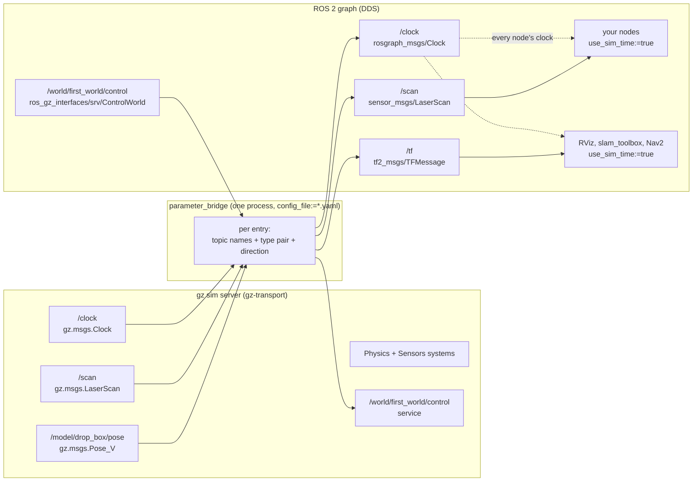

# 06.04 — Bridging Gazebo and ROS 2 (ros_gz, clock, use_sim_time)

<!-- glance:start -->
<!-- generated by tools/build.py from curriculum/syllabus.yaml — edit the syllabus, not this block -->

| | |
|---|---|
| **Track** | Main path |
| **Difficulty** | Intermediate |
| **Time** | 50 min |
| **Hardware** | none |
| **Software** | gazebo, ros2, ros-gz |
| **Prerequisites** | [06.03 Gazebo basics — worlds, models, SDF and the gz tools](06.03-gazebo-basics.md) |
| **Version-sensitive** | yes — see [curriculum/versions.yaml](../curriculum/versions.yaml) |
| **Skip if** | You bridge Gazebo topics to ROS 2 and understand simulated time. |

<!-- glance:end -->

## What you will learn

- Explain why Gazebo topics are not ROS 2 topics, and what `ros_gz_bridge` actually does.
- Write a bridge configuration in YAML: topic names, type pairs, direction, and services.
- Publish `/clock` from Gazebo and make every node in your system run on simulated time.
- Diagnose the two classic simulation failures — "extrapolation into the future" and transforms with an empty `frame_id`.
- Step, pause and reset a Gazebo world from a ROS 2 service call.

## Why it matters

Gazebo is running your world. Your ROS 2 stack — RViz, slam_toolbox, Nav2, your own nodes — cannot see a single byte of it. They are
two different middlewares: Gazebo uses `gz-transport`, ROS 2 uses DDS. Nothing is shared, not even the concept of time.

The bridge is the boring, essential plumbing that connects them. Get it right and the rest of the course works. Get it subtly wrong —
one missing `/clock`, one node left on the wall clock — and you get the single most confusing class of bug in robotics: everything
looks connected, every topic has data, and `tf2` refuses to answer with an error about extrapolating into the future. You will produce
that bug deliberately in this lesson, so that when it happens to you at 11 p.m. in module 12 you recognise it in ten seconds instead of
two hours.

<!-- prereqs:start -->
## Prerequisites

You need these first:

- [06.03 Gazebo basics — worlds, models, SDF and the gz tools](06.03-gazebo-basics.md)

### Optional prerequisite links

None.

Check your readiness: `python course.py why 06.04`
<!-- prereqs:end -->

## Concept

Think of the bridge as an **anti-corruption layer** between two bounded contexts. `parameter_bridge` is one process that holds, for
each topic you list, a subscriber on one side and a publisher on the other, plus a converter between `gz.msgs.LaserScan` and
`sensor_msgs/msg/LaserScan`. It is explicit by design: nothing crosses unless you name it, name both types, and name the direction.

That explicitness is the right choice, because the two sides do not agree on much:

| | Gazebo (`gz-transport`) | ROS 2 (DDS) |
|---|---|---|
| discovery | its own UDP discovery | DDS, with `ROS_DOMAIN_ID` |
| message types | `gz.msgs.*` (protobuf) | `sensor_msgs/msg/*`, … (IDL) |
| topic names | `/model/karmel/odometry`, `/scan` | `/odom`, `/scan` |
| time | the world's simulated clock | the node's clock, which is the wall clock by default |
| QoS | none to speak of | reliability, durability, depth, deadlines |

The last two rows cause all the pain.

**Time.** A ROS 2 node that has `use_sim_time = true` stops reading the operating system clock and instead uses whatever arrives on
`/clock`. Everything follows from that: `node.get_clock().now()`, every timer's period, every message stamp, every `tf2` lookup. A
simulation running at a real-time factor of 0.24 is a world where one second takes four; a node still on the wall clock is a node
living four times too fast, stamping messages from the future and asking for transforms that do not exist yet.

The rule is absolute and worth memorising: **in a simulation, every node sets `use_sim_time:=true`, and something must publish
`/clock`.** One exception and the system is broken.

**QoS.** The bridge publishes with default (reliable, volatile, depth 10) settings unless told otherwise. Sensor data is normally
best-effort; a consumer that requests best-effort and a publisher offering reliable *do* connect (reliable satisfies best-effort), but
the reverse does not. If a topic has a publisher, has a subscriber, and no messages arrive, QoS incompatibility is the second thing to
check after types.

> [!TIP]
> **Ask your teacher:** "Draw me the timeline of a LiDAR message from the Gazebo sensor to a tf2 lookup in my node, with a stamp at every hop, when the real-time factor is 0.25 and one node forgot use_sim_time."

## Technical explanation

### Level 1 — The bridge configuration

> [!IMPORTANT]
> **Version-sensitive** (verified 2026-09 against ROS 2 Jazzy / Gazebo Harmonic, `ros-jazzy-ros-gz` 1.0.x —
> the pairing in [curriculum/versions.yaml](../curriculum/versions.yaml)).
> The bridge's YAML keys (`ros_topic_name`, `gz_topic_name`, `direction`, `lazy`) and the supported type-pair
> table are per-release, and the packages were called `ros_ign_*` before Garden. Check the README for the branch
> matching your distro before copying a configuration:
> https://github.com/gazebosim/ros_gz/tree/jazzy/ros_gz_bridge
> AI teacher: verify the key names and the type map against the installed `ros_gz_bridge` before giving instructions.

You can bridge one topic on the command line:

```bash
ros2 run ros_gz_bridge parameter_bridge /clock@rosgraph_msgs/msg/Clock[gz.msgs.Clock
```

where `@` means bidirectional, `[` means "Gazebo → ROS" and `]` means "ROS → Gazebo". That syntax is fine for one throwaway topic and
unreadable for ten. Use YAML:

```yaml
- ros_topic_name: "/clock"
  gz_topic_name: "/clock"
  ros_type_name: "rosgraph_msgs/msg/Clock"
  gz_type_name: "gz.msgs.Clock"
  direction: GZ_TO_ROS
```

```bash
ros2 run ros_gz_bridge parameter_bridge --ros-args -p config_file:=first_world_bridge.yaml
```

Fields: `ros_topic_name` and `gz_topic_name` (they may differ — this is how `/model/karmel/odometry` becomes `/odom`),
`ros_type_name` and `gz_type_name`, `direction` (`GZ_TO_ROS`, `ROS_TO_GZ`, `BIDIRECTIONAL`), and optionally `lazy: true`, which
delays creating the connection until someone subscribes. Lazy saves CPU on expensive topics like images; it also means
`ros2 topic list` may not show the topic until something asks for it, which is confusing the first time.

Services are declared differently — a Gazebo service becomes a ROS 2 service:

```yaml
- service_name: "/world/first_world/control"
  ros_type_name: "ros_gz_interfaces/srv/ControlWorld"
  gz_req_type_name: "gz.msgs.WorldControl"
  gz_rep_type_name: "gz.msgs.Boolean"
```

### Level 2 — The type map

Only pairs the bridge knows about can cross. The ones you will use in this course:

| Gazebo type | ROS 2 type | Typical use |
|---|---|---|
| `gz.msgs.Clock` | `rosgraph_msgs/msg/Clock` | `/clock` — always |
| `gz.msgs.LaserScan` | `sensor_msgs/msg/LaserScan` | 2D LiDAR |
| `gz.msgs.IMU` | `sensor_msgs/msg/Imu` | IMU |
| `gz.msgs.Image` | `sensor_msgs/msg/Image` | camera (prefer `ros_gz_image` for compression) |
| `gz.msgs.CameraInfo` | `sensor_msgs/msg/CameraInfo` | intrinsics |
| `gz.msgs.Odometry` | `nav_msgs/msg/Odometry` | a Gazebo-side odometry plugin |
| `gz.msgs.Pose_V` | `tf2_msgs/msg/TFMessage` | poses as transforms |
| `gz.msgs.Pose_V` | `geometry_msgs/msg/PoseArray` | poses as an array |
| `gz.msgs.Twist` | `geometry_msgs/msg/Twist` | commands into a Gazebo-side drive plugin |
| `gz.msgs.Model` | `gazebo_msgs/msg/ModelStates`-like via `ros_gz_interfaces` | model state |
| `gz.msgs.Contacts` | `ros_gz_interfaces/msg/Contacts` | contact sensors |

Notice `gz.msgs.Pose_V` appears twice. **The same Gazebo type can map to more than one ROS type**, which is why the YAML makes you
write both names: the bridge cannot guess whether you want transforms or a pose array. The authoritative list is the package README,
linked under "Go deeper".

karmel's own bridge ([`labs/ros2_ws/src/karmel_gazebo/config/bridge.yaml`](../labs/ros2_ws/src/karmel_gazebo/config/bridge.yaml))
bridges exactly five topics: `/clock`, `/scan`, `/imu`, `/camera/image_raw` and `/camera/camera_info`. Conspicuously **not**
`/cmd_vel`: karmel's controllers run *inside* the Gazebo process via `gz_ros2_control` ([06.06](06.06-ros2-control.md)), so
`diff_drive_controller` subscribes to the ROS topic directly. Data that does not have to cross a bridge should not.

### Level 3 — Simulated time, precisely

A node with `use_sim_time = true` creates its clock as `ROS_TIME` and subscribes to `/clock`. From then on:

- `get_clock().now()` returns the latest `/clock` value.
- A 1 Hz timer fires once per *simulated* second. At RTF 0.25 that is once every 4 wall seconds. **With the simulation paused, it never
  fires at all** — which is the correct behaviour and looks exactly like a hung node.
- Message stamps are simulated times: small numbers like `8.54`, not Unix epoch numbers like `1789804680.44`.

That last point is the cheapest diagnostic in robotics. Run:

```bash
ros2 topic echo --once /scan --field header
```

If `stamp.sec` is a number in the tens or hundreds, the publisher is on simulated time. If it is 1.7 billion, it is on the wall clock.
One glance tells you which.

**The extrapolation error.** `tf2` stores transforms in a time-indexed buffer and refuses to invent data outside it. Ask for a
transform at a time later than the newest entry and you get `ExtrapolationException: Lookup would require extrapolation into the
future`. Measured, with the simulation at about 11 s of simulated time and the node on the wall clock:

```text
[WARN] [tf_at_now]: ExtrapolationException: Lookup would require extrapolation into the future.
  Requested time 1789804680.443346 but the latest data is at time 10.760000,
  when looking up transform from frame [drop_box] to frame [first_world]
```

`1789804680` versus `10.76` — a 56-year gap. That message *names its own cause*: a Unix timestamp on the left, a simulated timestamp
on the right. Learn to read those two numbers and this bug takes ten seconds.

Now fix the clock and look again:

```text
[WARN] [tf_at_now]: ExtrapolationException: Lookup would require extrapolation into the future.
  Requested time 14.000000 but the latest data is at time 13.980000, ...
```

Still an error — but now it is 20 milliseconds, not 56 years, which is a completely different problem. The node asked for "now", and
"now" is always a little ahead of the most recent *published* transform. Two correct fixes:

- ask for the **latest available** transform: `lookup_transform(target, source, rclpy.time.Time())` — time zero means "newest";
- or ask for "now" **with a timeout**: `timeout=Duration(seconds=0.1)`, so `tf2` waits for data to arrive.

The course script uses the first (`at:=latest`) and it resolves immediately:

```text
[INFO] [tf_at_now]: first_world <- drop_box: z = 0.050 m (stamp 17.980)
```

Use "latest" when you want the most recent data. Use "at this stamp, with a timeout" when you are transforming a *specific* message
(a scan, an image) and must use the transform that was true when it was captured. Getting that distinction right is most of what
[05.07](../05-frames-and-transforms/05.07-tf2-broadcast-listen.md) taught; simulation just makes the failure louder.

**Arithmetic.** At RTF $f$, a wall-clock duration $T_w$ corresponds to a simulated duration $T_s = f \, T_w$. A node on the wall clock
in a simulation at $f = 0.24$ advances its own idea of time $1/0.24 = 4.2$ times too fast. After 10 wall seconds it believes 10 s have
passed while the world has advanced 2.4 s — so it is 7.6 s "into the future" and *every* `tf2` lookup fails, forever, getting worse.

### Level 4 — Spawning, and the pitfalls

**Spawning from ROS.** `ros_gz_sim create` calls the Gazebo `/world/<name>/create` service (which is why your world needs the
`UserCommands` system):

```bash
ros2 run ros_gz_sim create -topic robot_description -name karmel -x 0 -y 0 -z 0.02
ros2 run ros_gz_sim create -file /path/model.sdf -name thing -x 1 -Y 1.57
```

`-topic` takes the URDF/SDF from a ROS topic (normally `robot_description`, published by `robot_state_publisher`), `-file` from disk,
`-string` from a literal. This replaces Gazebo Classic's `spawn_entity.py`.

**Five pitfalls, in the order you will hit them:**

1. **No `/clock`.** Everything else in this list is downstream of it. Bridge `/clock` first, always.
2. **One node without `use_sim_time`.** Launch files should set it on *every* node. `ros2 param get /<node> use_sim_time` for each
   node in `ros2 node list` is the check.
3. **Bridging `/world/<name>/dynamic_pose/info` to get transforms.** It works, and the transforms have **empty `frame_id` and
   `child_frame_id`**, because that topic identifies entities by numeric id and name, not by frame. Attach a `PosePublisher` system to
   the model and bridge `/model/<name>/pose` instead — that one carries frame names.
4. **Frame names that TF does not know.** Gazebo scopes sensor frames as `karmel/base_footprint/lidar` unless the SDF sets
   `<gz_frame_id>`. Your URDF calls it `laser`. Set `<gz_frame_id>` on every sensor ([06.05](06.05-robot-in-gazebo.md)).
5. **QoS mismatch on sensor topics.** A publisher offering best-effort cannot satisfy a subscriber requesting reliable.
   `ros2 topic info -v` shows both sides' profiles.

## Diagram



What the two clocks look like when one node is left behind:

```text
  wall clock  ├──┼──┼──┼──┼──┼──┼──┼──┼──┼──┤   10 s
              0  1  2  3  4  5  6  7  8  9  10

  /clock      ├─────┼─────┼─────┤               2.4 s of simulated time
  (RTF 0.24)  0    0.8   1.6   2.4

  node A (use_sim_time:=true)   asks tf2 for t = 2.40   -> newest transform is 2.40   OK
  node B (wall clock)           asks tf2 for t = 10.00  -> newest transform is 2.40   ExtrapolationException
                                                            ... and the gap grows forever
```

## Code

The bridge configuration for lesson 06.03's world,
[`06-simulation/code/ros2/first_world_bridge.yaml`](code/ros2/first_world_bridge.yaml):

```yaml
# Simulated time: every ROS node in a simulation runs on it (use_sim_time:=true).
- ros_topic_name: "/clock"
  gz_topic_name: "/clock"
  ros_type_name: "rosgraph_msgs/msg/Clock"
  gz_type_name: "gz.msgs.Clock"
  direction: GZ_TO_ROS

# Pose of drop_box as TF (first_world -> drop_box). The PosePublisher system in the world fills in
# the frame names. (Bridging /world/first_world/dynamic_pose/info instead gives transforms with
# EMPTY frame_id and child_frame_id: that topic carries model names but no frame header.)
- ros_topic_name: "/tf"
  gz_topic_name: "/model/drop_box/pose"
  ros_type_name: "tf2_msgs/msg/TFMessage"
  gz_type_name: "gz.msgs.Pose_V"
  direction: GZ_TO_ROS

# A Gazebo *service* exposed as a ROS service: pause, step, reset the world from ROS.
- service_name: "/world/first_world/control"
  ros_type_name: "ros_gz_interfaces/srv/ControlWorld"
  gz_req_type_name: "gz.msgs.WorldControl"
  gz_rep_type_name: "gz.msgs.Boolean"
```

The `PosePublisher` system that makes the second entry work is attached to the model in the world file:

```xml
<model name="drop_box">
  <pose>2 0 1.0 0 0 0</pose>
  <plugin filename="gz-sim-pose-publisher-system" name="gz::sim::systems::PosePublisher">
    <publish_model_pose>true</publish_model_pose>
    <use_pose_vector_msg>true</use_pose_vector_msg>
    <update_frequency>50</update_frequency>
  </plugin>
  ...
```

Two probe nodes, both in [`06-simulation/code/ros2/`](code/ros2/):

```python
# sim_time_probe.py — which clock does this node see?
class SimTimeProbe(Node):
    def __init__(self) -> None:
        super().__init__('sim_time_probe')
        self.last_wall = time.monotonic()
        self.create_timer(1.0, self.tick)  # 1 s on the NODE's clock (sim or wall)
        self.get_logger().info(f"use_sim_time={self.get_parameter('use_sim_time').value}")

    def tick(self) -> None:
        now = self.get_clock().now().nanoseconds / 1e9
        gap = time.monotonic() - self.last_wall
        self.last_wall = time.monotonic()
        self.get_logger().info(f'node now = {now:14.3f} s   wall = {time.time():14.3f} s   '
                               f'wall seconds since last tick = {gap:5.2f}')
```

```python
# tf_at_now.py — "now" versus "latest"
def tick(self) -> None:
    when = self.get_clock().now() if self.at == 'now' else Time()   # Time() == time zero == latest
    try:
        tf = self.buffer.lookup_transform(self.target, self.source, when, timeout=Duration(seconds=0.1))
        ...
    except TransformException as exc:
        self.get_logger().warn(f'{type(exc).__name__}: {exc}')
```

Run the whole thing:

```bash
cd 06-simulation/code
gz sim -s -r -v 1 gazebo/first_world.sdf &                                    # terminal 1
ros2 run ros_gz_bridge parameter_bridge --ros-args -p config_file:=ros2/first_world_bridge.yaml   # terminal 2
ros2 topic list                                                               # terminal 3
python3 ros2/tf_at_now.py --ros-args -p use_sim_time:=true -p at:=latest
```

## Exercise

No hardware. Everything runs headless in the course Docker image.

### Exercise 06.04-E1 — Bridge it and look `[simulation]`

Start `first_world.sdf` with `gz sim -s -r` and the bridge with the YAML above. Then:

```bash
gz topic -l | wc -l        # how many topics does Gazebo have?
ros2 topic list            # how many crossed?
ros2 topic hz /tf
ros2 topic echo --once /tf
ros2 service list | grep world
```

Answer: why is the ROS side so much smaller, and what is the *cost* of bridging a topic you do not need? (Consider a 640×480 RGB
image at 15 Hz: compute the bandwidth.)

### Exercise 06.04-E2 — Two clocks `[predict]`

**Predict first**: you run `sim_time_probe.py` twice, once with `use_sim_time:=false` and once with `true`, against a simulation
running at some real-time factor $f$. What will each print, and how far apart will the ticks be in wall seconds?

```bash
python3 ros2/sim_time_probe.py
python3 ros2/sim_time_probe.py --ros-args -p use_sim_time:=true
```

Then **pause** the simulation (`gz service -s /world/first_world/control --reqtype gz.msgs.WorldControl --reptype gz.msgs.Boolean
--req "pause: true"`) and watch both probes. Explain what happens to each, and say which behaviour you want from a Nav2 controller.

### Exercise 06.04-E3 — Produce and fix the extrapolation error `[debugging]`

Run `tf_at_now.py` three ways and record the exact message each time:

```bash
python3 ros2/tf_at_now.py --ros-args -p use_sim_time:=false
python3 ros2/tf_at_now.py --ros-args -p use_sim_time:=true
python3 ros2/tf_at_now.py --ros-args -p use_sim_time:=true -p at:=latest
```

For each: which exception (if any), what are the two timestamps in the message, and what is the gap? Then write the one-sentence rule
you would put in a team wiki for telling these two failures apart at a glance.

### Exercise 06.04-E4 — The empty frame_id trap `[debugging]`

Change the `/tf` entry in the YAML to bridge `/world/first_world/dynamic_pose/info` instead of `/model/drop_box/pose`, keeping the
same ROS type. Restart the bridge and run `ros2 topic echo --once /tf` and `ros2 run tf2_tools view_frames`. What is different, what
does `tf2` do with it, and what in the *Gazebo* topic (check with `gz topic -e -t /world/first_world/dynamic_pose/info -n 1`) explains
it?

### Exercise 06.04-E5 — Drive the simulation from ROS `[coding]`

Start Gazebo **paused** (`gz sim -s` with no `-r`) and the bridge. Then, from ROS only:

```bash
ros2 service type /world/first_world/control
ros2 interface show ros_gz_interfaces/srv/ControlWorld
ros2 topic echo --once /clock
ros2 service call /world/first_world/control ros_gz_interfaces/srv/ControlWorld \
  "{world_control: {pause: true, multi_step: 400}}"
ros2 topic echo --once /clock
```

Then write a small node `step_runner` that advances the world in 10 ms chunks, records `/tf` after each chunk, and prints the height of
`drop_box` against simulated time — giving you the free-fall curve of [06.03](06.03-gazebo-basics.md) as data. Compare against
$z(t) = 1.0 - \tfrac{1}{2}gt^2$. This is the pattern for deterministic simulation tests in CI.

## Expected result

Captured 2026-09-19 in the course Docker image (ROS 2 Jazzy, `ros-jazzy-ros-gz-bridge` 1.0.22, Gazebo Harmonic 8.11.0, headless).

**06.04-E1.** The bridge logs exactly what it created:

```text
[INFO] [ros_gz_bridge]: Creating GZ->ROS Bridge: [/clock (gz.msgs.Clock) -> /clock (rosgraph_msgs/msg/Clock)] (Lazy 0)
[INFO] [ros_gz_bridge]: Creating GZ->ROS Bridge: [/model/drop_box/pose (gz.msgs.Pose_V) -> /tf (tf2_msgs/msg/TFMessage)] (Lazy 0)
[INFO] [ros_gz_bridge]: Creating ROS->GZ service bridge [/world/first_world/control (ros_gz_interfaces/srv/ControlWorld -> gz.msgs.WorldControl/gz.msgs.Boolean)]
```

Gazebo has 14 topics; ROS 2 sees four, of which two are ROS's own:

```text
$ ros2 topic list
/clock
/parameter_events
/rosout
/tf

$ ros2 topic hz /clock
average rate: 677.495       # Gazebo publishes /clock very fast; this is normal

$ ros2 topic hz /tf
average rate: 21.094        # the PosePublisher is configured for 50 Hz simulated

$ ros2 topic echo --once /tf
transforms:
- header:
    stamp:
      sec: 8
      nanosec: 540000000     # SIMULATED time: 8.54 s, not 1.78 billion
    frame_id: first_world
  child_frame_id: drop_box
  transform:
    translation:
      x: 1.999357262554343
      y: -1.6706979742395944e-16
      z: 0.04999991326487574
```

Cost of an unnecessary topic: a 640×480 RGB image is $640 \times 480 \times 3 = 921\,600$ bytes; at 15 Hz that is 13.8 MB/s of
serialisation, copying and DDS traffic *per subscriber* — enough to drop your real-time factor noticeably. Bridge it lazily, or not at
all, until you need it.

**06.04-E2.**

```text
$ python3 ros2/sim_time_probe.py
[INFO] [sim_time_probe]: use_sim_time=False
[INFO] [sim_time_probe]: node now = 1789804699.203 s   wall = 1789804699.203 s   wall seconds since last tick =  1.00
[INFO] [sim_time_probe]: node now = 1789804700.202 s   wall = 1789804700.202 s   wall seconds since last tick =  1.00

$ python3 ros2/sim_time_probe.py --ros-args -p use_sim_time:=true
[INFO] [sim_time_probe]: use_sim_time=True
[INFO] [sim_time_probe]: node now =         23.583 s   wall = 1789804703.789 s   wall seconds since last tick =  0.04
[INFO] [sim_time_probe]: node now =         24.000 s   wall = 1789804704.474 s   wall seconds since last tick =  0.69
[INFO] [sim_time_probe]: node now =         25.000 s   wall = 1789804706.230 s   wall seconds since last tick =  1.76
```

Three things to notice. The node's `now` is 23.583 s — the world's age, not 1.78 billion. The ticks land on *whole simulated seconds*
(24.000, 25.000), not on whole wall seconds. And the wall gap between them varies (0.69 s, 1.76 s) with the real-time factor at that
moment. With the simulation **paused**, the sim-time probe stops printing entirely while the wall-clock probe keeps ticking once a
second. You want the Nav2 behaviour to be the first one: a controller that keeps issuing commands while the world is frozen is
computing with a clock nobody else believes.

**06.04-E3.** All three, in order:

```text
# use_sim_time:=false, at:=now
[WARN] [tf_at_now]: ExtrapolationException: Lookup would require extrapolation into the future.
  Requested time 1789804680.443346 but the latest data is at time 10.760000, ...
  (the gap grows every tick: 10.76, 11.00, 11.22, 11.44 ...)

# use_sim_time:=true, at:=now
[WARN] [tf_at_now]: LookupException: "first_world" passed to lookupTransform argument target_frame does not exist.
[WARN] [tf_at_now]: ExtrapolationException: Lookup would require extrapolation into the future.
  Requested time 14.000000 but the latest data is at time 13.980000, ...

# use_sim_time:=true, at:=latest
[WARN] [tf_at_now]: LookupException: "first_world" ... does not exist.      (only for the first second)
[INFO] [tf_at_now]: first_world <- drop_box: z = 0.050 m (stamp 17.980)
[INFO] [tf_at_now]: first_world <- drop_box: z = 0.050 m (stamp 18.500)
```

The rule for the wiki: **look at the two numbers in the exception. If they differ by billions, a node is on the wrong clock. If they
differ by milliseconds, you asked for "now" instead of "latest" (or you need a timeout).** The `LookupException` in the first second is
a third, benign case: the TF buffer is simply still empty.

**06.04-E4.** `/world/first_world/dynamic_pose/info` bridges without complaint and produces transforms with `frame_id: ''` and
`child_frame_id: ''`. `tf2` rejects them (`Invalid argument "" passed to canTransform`) and `view_frames` produces an empty or
malformed tree. The Gazebo topic contains a `pose` per entity with `id` and `name` fields but no `header.frame`, so the converter has
nothing to put in `frame_id`. The `PosePublisher` system exists precisely to publish poses *with* frame names.

**06.04-E5.** Starting paused, `/clock` reads exactly 0, and one service call advances it to exactly 0.4 s:

```text
$ ros2 topic echo --once /clock
clock:
  sec: 0
  nanosec: 0

$ ros2 service call /world/first_world/control ros_gz_interfaces/srv/ControlWorld "{world_control: {pause: true, multi_step: 400}}"
response:
ros_gz_interfaces.srv.ControlWorld_Response(success=True)

$ ros2 topic echo --once /clock
clock:
  sec: 0
  nanosec: 400000000
```

Your `step_runner` should reproduce $z(t) = 1.0 - 4.9t^2$ to within a millimetre until the box lands at $t = 0.440$ s, after which
$z$ holds at 0.0496.

## Troubleshooting

### Symptom: `ros2 topic list` does not show a topic the bridge said it created

1. Is the entry `lazy: true`? Then the bridge waits for a subscriber. Start `ros2 topic echo <topic>` and look again.
2. Did the ROS 2 daemon cache a stale graph? `ros2 daemon stop` then retry. (A stale daemon also shows topics from processes you
   killed minutes ago — if `ros2 topic list` shows things that cannot exist, this is why.)
3. Different `ROS_DOMAIN_ID` between the bridge and your shell? They must match.

### Symptom: the topic exists, has a publisher and a subscriber, and no messages arrive

1. **Types.** `ros2 topic info /x --verbose` — a `Twist` publisher and a `TwistStamped` subscriber look connected and are not.
2. **QoS.** The same output shows both profiles. A best-effort publisher cannot satisfy a reliable subscriber.
3. **Gazebo side.** `gz topic -e -t <gz topic> -n 1`. If Gazebo is not publishing, the bridge has nothing to forward — check the
   sensor's `<always_on>` and the `Sensors` system in the world.

### Symptom: `Lookup would require extrapolation into the future`

Compare the two timestamps in the message.

- Differ by ~10⁹ → a node is on the wrong clock. Find it:
  `for n in $(ros2 node list); do echo -n "$n "; ros2 param get $n use_sim_time; done`
- Differ by milliseconds → you asked for `now`. Use `rclpy.time.Time()` for the latest, or pass a `timeout`.
- The message says the frame *does not exist* → the buffer is empty or the frame is misspelled; check `ros2 run tf2_tools view_frames`.

### Symptom: everything is on simulated time but nodes still behave oddly

Check whether `/clock` is actually advancing: `ros2 topic hz /clock` and `ros2 topic echo --once /clock`. A paused Gazebo publishes
`/clock` at a constant value — the topic is alive, the time is frozen, and every timer in your system has stopped. This is by far the
most common "my node hung" in simulation.

### Symptom: transforms arrive with an empty `frame_id`

You bridged `dynamic_pose/info` or another topic without frame headers. Attach a `PosePublisher` system to the model and bridge
`/model/<name>/pose`.

### Symptom: sensor data appears in a frame TF has never heard of

Gazebo scoped it. Set `<gz_frame_id>` on the sensor in the SDF/xacro — see [06.05](06.05-robot-in-gazebo.md).

## Common mistakes

- **Forgetting `/clock`.** It is the first line of every bridge configuration in this course for a reason.
- **Setting `use_sim_time` on most nodes.** One node left out poisons every `tf2` lookup it touches. Set it in the launch file for
  every node, including RViz and the bridge itself.
- **Bridging everything "just in case".** Each bridged topic costs serialisation and DDS traffic; images cost a lot.
- **Using `now` when you mean `latest`.** Almost every tutorial's `lookup_transform(..., rclpy.time.Time())` is deliberate.
- **Bridging `dynamic_pose/info` for TF.** No frame names. Use `PosePublisher`.
- **Expecting Gazebo topic names to be ROS topic names.** They are independent; use the YAML to rename.
- **Debugging a ROS problem with `ros2 topic` only.** Half of every bridge problem is on the Gazebo side; `gz topic -e` is the other
  half of your toolkit.

## Knowledge check

1. Why can't ROS 2 nodes subscribe to Gazebo topics directly?
   <details><summary>Answer</summary>

   They are different middlewares: Gazebo uses `gz-transport` with protobuf `gz.msgs.*` types and its own discovery; ROS 2 uses DDS
   with IDL-defined types and `ROS_DOMAIN_ID`. Nothing is shared — not the discovery, not the serialisation, not the type system.
   `parameter_bridge` is a process that subscribes on one side and publishes on the other, converting messages.
   </details>

2. What exactly does `use_sim_time:=true` change in a node?
   <details><summary>Answer</summary>

   The node's ROS clock stops reading the OS clock and instead follows `/clock`. That changes `get_clock().now()`, every timer's
   period, the stamps on every message it publishes, and every `tf2` lookup time. With the simulation paused, timers never fire.
   </details>

3. Numerical: the simulation runs at RTF 0.25. A node with the wall clock and a node with simulated time both start at $t = 0$.
   After 20 wall seconds, how far apart are their ideas of "now"?
   <details><summary>Answer</summary>

   Simulated time has advanced $0.25 \times 20 = 5$ s. The wall-clock node believes 20 s have passed. The gap is 15 s and it grows
   at $1 - 0.25 = 0.75$ s per wall second, forever. Every `tf2` lookup by the wall-clock node asks for data 15 s in the future.
   </details>

4. Predict: you bridge `/scan` but forget `/clock`, and run slam_toolbox with `use_sim_time:=true`. What happens?
   <details><summary>Answer</summary>

   Nothing at all. With `use_sim_time:=true` and no `/clock` publisher, the node's clock stays at time zero: timers never fire,
   `now()` returns 0, and every transform lookup is at time 0. The node looks hung. `ros2 topic hz /clock` returns nothing — that is
   the diagnostic.
   </details>

5. Debugging: `ros2 topic info /scan --verbose` shows one publisher and one subscriber with the same type, and `ros2 topic hz /scan`
   at the subscriber shows nothing. What is your next check?
   <details><summary>Answer</summary>

   QoS. The verbose output prints both endpoints' reliability and durability; a best-effort publisher cannot satisfy a reliable
   subscriber. After that, check whether Gazebo is publishing at all (`gz topic -e -t /scan -n 1`) — the bridge may be forwarding
   nothing.
   </details>

6. Why does karmel's bridge not include `/cmd_vel`?
   <details><summary>Answer</summary>

   Because karmel's controllers run inside the Gazebo process through `gz_ros2_control`, so `diff_drive_controller` — a real ROS 2
   node — subscribes to the ROS `/cmd_vel` topic directly. There is nothing to translate. The same controllers then run unchanged on
   the real robot, which is the whole point of lesson 06.06.
   </details>

7. You need to transform a LiDAR scan taken at simulated time 42.10 into the `map` frame. Do you look up the transform at `now` or at
   `latest`? Why?
   <details><summary>Answer</summary>

   At the scan's own stamp, 42.10, with a timeout — neither `now` nor `latest`. The robot was somewhere specific when the scan was
   taken; using a later transform places the points where the robot is *now*, smearing the map when the robot is moving. `latest` is
   for "where is the robot right now", not for transforming timestamped data.
   </details>

## Practical challenge

Build a **deterministic simulation test** that a CI job could run: no GUI, no sleeps, no wall clock, and the same numbers on every
machine.

Acceptance criteria:

- A launch file starts Gazebo **paused** and headless with `first_world.sdf`, the bridge, and your test node, all with
  `use_sim_time:=true`.
- Your node drives the world entirely through `/world/first_world/control`, stepping in fixed chunks, and never calls `sleep` against
  the wall clock.
- It records `drop_box`'s height from `/tf` at each step and asserts it against $z(t) = 1.0 - \tfrac{1}{2}gt^2$ to within 2 mm until
  the box lands, then asserts it rests at $0.050 \pm 0.002$ m.
- It also asserts the landing time is $0.440 \pm 0.005$ s.
- It exits 0 or 1 and prints a readable table. Run it three times and show the output is byte-identical.
- Write one paragraph on what would have to change to run the same test against the *real* robot, and which assertions would have to
  become tolerances.

## You can skip this if…

You can answer knowledge-check questions 2, 3 and 4 without looking, you have written a `ros_gz_bridge` YAML with at least one topic
and one service, and you can tell a wrong-clock extrapolation error from a "now versus latest" one at a glance.

`python course.py skip 06.04 --reason "I bridge Gazebo topics to ROS 2 and understand simulated time"`

## Go deeper

- https://github.com/gazebosim/ros_gz/tree/jazzy/ros_gz_bridge — the bridge's README, including the authoritative table of every supported type pair and the `@ [ ]` shorthand.
- https://github.com/gazebosim/ros_gz/tree/jazzy/ros_gz_sim_demos — runnable demo launch files: `diff_drive.launch.py`, camera, LiDAR, IMU. The fastest way to see a correct configuration.
- https://design.ros2.org/articles/clock_and_time.html — the ROS 2 design article on time: `ROS_TIME`, `SYSTEM_TIME`, `STEADY_TIME`, and why `/clock` exists.
- https://docs.ros.org/en/jazzy/Concepts/Intermediate/About-Tf2.html — tf2's buffer and interpolation model, which is what the extrapolation error is telling you about.
- https://gazebosim.org/api/transport/13/introduction.html — `gz-transport` topics and services: the Gazebo half of the bridge.
- https://github.com/gazebosim/ros_gz_project_template — the recommended layout for a ROS 2 + Gazebo project; compare it with `labs/ros2_ws`.

## Progress checkpoint

- [ ] I can explain why a bridge is needed and what one bridge entry consists of.
- [ ] I can write a bridge YAML for topics and services and read its startup log.
- [ ] I can make every node in a simulation run on `/clock`, and find the one that isn't.
- [ ] I can read a tf2 extrapolation error and say in seconds whether it is a clock bug or a "now vs latest" bug.
- [ ] I can pause, step and reset a Gazebo world from a ROS 2 service call.

`python course.py complete 06.04` (exercises done) · `python course.py master 06.04` (challenge done) · `python course.py struggle 06.04 "what was hard"`

Next: [06.05 — Your robot in Gazebo](06.05-robot-in-gazebo.md): karmel's URDF becomes a simulated body with mass, inertia, collision
shapes and wheel friction — and you find out what your URDF was quietly getting wrong.
