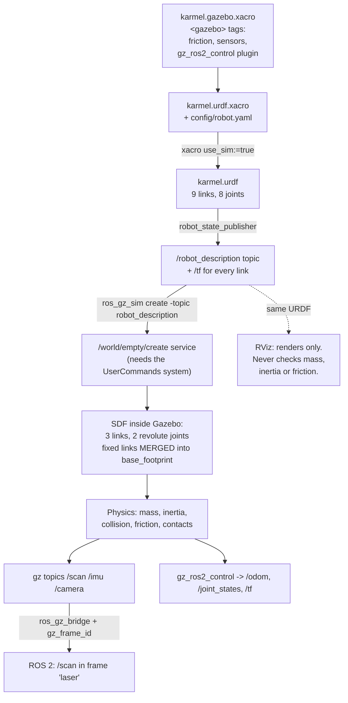

# 06.05 — Your robot in Gazebo — spawning a URDF with inertia, collision and friction

<!-- glance:start -->
<!-- generated by tools/build.py from curriculum/syllabus.yaml — edit the syllabus, not this block -->

| | |
|---|---|
| **Track** | Main path |
| **Difficulty** | Intermediate |
| **Time** | 1 h 15 min |
| **Hardware** | none |
| **Software** | gazebo, ros2 |
| **Prerequisites** | [06.04 Bridging Gazebo and ROS 2 (ros_gz, clock, use_sim_time)](06.04-bridging-gazebo-ros2.md)<br>[05.08 URDF and xacro — describing your robot](../05-frames-and-transforms/05.08-urdf-and-xacro.md) |
| **Optional prerequisites** | [FP.02 Forces, mass, weight and Newton's laws](../optional-foundations/physics/FP.02-forces-newton.md)<br>[FP.03 Friction and traction](../optional-foundations/physics/FP.03-friction-traction.md)<br>[FP.06 Rotational motion and moment of inertia](../optional-foundations/physics/FP.06-rotational-motion-inertia.md) |
| **Skip if** | Your URDF spawns in Gazebo and behaves physically plausibly. |

<!-- glance:end -->

## What you will learn

- Spawn karmel's xacro into a Gazebo world and drive it with `TwistStamped`.
- Read what the URDF→SDF conversion did to your robot, and why your sensor frames need `<gz_frame_id>`.
- Check every link's inertia against physics, not against hope, and recognise the failure modes of getting it wrong.
- Choose collision geometry deliberately, separately from the visual geometry.
- Set wheel friction and contact parameters, and measure what happens to odometry when the floor is slippery.

## Why it matters

Your URDF ([05.08](../05-frames-and-transforms/05.08-urdf-and-xacro.md)) already looks correct in RViz. RViz is a **renderer**: it
draws meshes at the poses TF gives it and asks no questions. Gazebo is a **physicist**: it wants to know the mass of every link, how
that mass is distributed, what shape the link collides with, and how hard the rubber grips the floor. A URDF that satisfies RViz can
make Gazebo produce a robot that vibrates itself apart, sinks through the floor, spins on the spot, or drives at half the speed you
commanded.

This is where most people lose a day. The failures do not look like configuration errors — they look like Gazebo being broken. They
are almost always one of four things, and this lesson teaches you to find which in a few minutes.

It also matters because everything after this lesson depends on it. `ros2_control` ([06.06](06.06-ros2-control.md)), simulated sensors
([06.07](06.07-simulated-sensors-and-noise.md)), SLAM and Nav2 all run on this body. If the body is wrong, they all give you wrong
answers convincingly.

<!-- prereqs:start -->
## Prerequisites

You need these first:

- [06.04 Bridging Gazebo and ROS 2 (ros_gz, clock, use_sim_time)](06.04-bridging-gazebo-ros2.md)
- [05.08 URDF and xacro — describing your robot](../05-frames-and-transforms/05.08-urdf-and-xacro.md)

### Optional prerequisite links

New to any of these? Take the foundation lesson first; skip it if you already know it.

- [FP.02 Forces, mass, weight and Newton's laws](../optional-foundations/physics/FP.02-forces-newton.md)
- [FP.03 Friction and traction](../optional-foundations/physics/FP.03-friction-traction.md)
- [FP.06 Rotational motion and moment of inertia](../optional-foundations/physics/FP.06-rotational-motion-inertia.md)

Check your readiness: `python course.py why 06.05`
<!-- prereqs:end -->

## Concept

A URDF describes a **kinematic tree**: links, joints, and the shapes hanging off them. It was designed for `robot_state_publisher`
and RViz, which need geometry and nothing else. A physics engine needs three more things per link, and URDF only half-supports them:

| Needed for physics | Where it lives | What happens if it is wrong |
|---|---|---|
| mass and inertia tensor | `<inertial>` in the URDF | jitter, sinking, launched robots, wheels that cannot be turned |
| collision shape | `<collision>` in the URDF | falls through the floor, or collides with invisible geometry |
| surface properties (friction, contact stiffness) | **not in URDF at all** | wheels spin without traction, or the robot is glued down |
| sensors and simulation plugins | **not in URDF at all** | no `/scan`, no `/imu`, no controllers |

The last two are the reason `<gazebo>` tags exist. They are an extension mechanism: everything inside a `<gazebo>` element is ignored
by every URDF parser except Gazebo's, which copies it into the SDF it generates. Hence
[`karmel.gazebo.xacro`](../labs/ros2_ws/src/karmel_description/urdf/karmel.gazebo.xacro), included only when `use_sim:=true`.

The conversion itself is the other thing to understand. When you spawn a URDF, Gazebo converts it to SDF, and the conversion is
**lossy in a specific way**: every link connected by a *fixed* joint is merged into its parent. karmel's URDF has nine links; the SDF
that Gazebo actually simulates has three:

```text
URDF (9 links, 8 joints)                    SDF that Gazebo simulates (3 links, 2 joints)
  base_footprint                              base_footprint   <- base_link, caster_link, imu_link,
    └ base_link  (fixed)                                          laser, camera_link,
        ├ caster_link       (fixed)                               camera_optical_frame,
        ├ imu_link          (fixed)                               range_front_link
        ├ laser             (fixed)                                 + the lidar, imu and camera sensors
        ├ camera_link       (fixed)                             left_wheel   (revolute joint)
        │   └ camera_optical_frame (fixed)                      right_wheel  (revolute joint)
        ├ range_front_link  (fixed)
        ├ left_wheel   (continuous)
        └ right_wheel  (continuous)
```

This is not a bug — merging fixed links is exactly right for physics (a rigidly attached camera is not a separate body). But it has
one consequence you must handle: a sensor attached to `laser` ends up on a link called `base_footprint`, and Gazebo will stamp its
messages with a scoped frame like `karmel/base_footprint/lidar`, which TF has never heard of. `<gz_frame_id>laser</gz_frame_id>` on
the sensor fixes it. Notice also that `continuous` joints become `revolute` in SDF (with effectively unlimited range) — harmless, but
it surprises people reading the converted output.

> [!TIP]
> **Ask your teacher:** "Show me the SDF Gazebo actually simulates for karmel, and point at every place where it differs from the URDF I wrote."

## Technical explanation

### Level 1 — What the conversion produces, and how to look at it

Three commands, in increasing depth. Run them every time you change the robot:

```bash
cd ~/labs/ros2_ws && source install/setup.bash
D=$(ros2 pkg prefix karmel_description)/share/karmel_description

xacro $D/urdf/karmel.urdf.xacro use_sim:=true > /tmp/karmel_sim.urdf   # 1. does the xacro render?
check_urdf /tmp/karmel_sim.urdf                                         # 2. is it a valid single tree?
gz sdf -p /tmp/karmel_sim.urdf | less                                   # 3. what will Gazebo actually simulate?
```

`check_urdf` prints the tree and, crucially, tells you there is **one root**. A URDF with two roots or a cycle is rejected by
everything downstream with unhelpful messages.

`gz sdf -p` is the one people skip and shouldn't. It shows the merge, the sensors' final placement, and any element Gazebo silently
dropped.

### Level 2 — Inertia: the number one cause of "Gazebo is broken"

Every non-static link needs a mass and a 3×3 inertia tensor about its centre of mass. For the primitives a robot is usually built
from, with mass $m$:

$$\text{box}\ (x,y,z): \quad I_{xx} = \frac{m}{12}(y^2+z^2), \quad I_{yy} = \frac{m}{12}(x^2+z^2), \quad I_{zz} = \frac{m}{12}(x^2+y^2)$$

$$\text{cylinder}\ (r, h,\ \text{axis } z): \quad I_{xx} = I_{yy} = \frac{m}{12}(3r^2+h^2), \quad I_{zz} = \frac{m r^2}{2}$$

$$\text{sphere}\ (r): \quad I_{xx} = I_{yy} = I_{zz} = \frac{2}{5} m r^2$$

New to moments of inertia? → [FP.06 Rotational motion and inertia](../optional-foundations/physics/FP.06-rotational-motion-inertia.md).
They are to rotation what mass is to translation: how hard the thing is to spin up about each axis.

**Worked example — karmel's chassis.** `karmel.urdf.xacro` budgets the 1.6 kg total: 2 × 0.08 kg wheels, 0.03 caster, 0.11 LiDAR,
0.05 camera, 0.01 IMU, 0.01 range sensor, and the remainder to the chassis:

$$m_{\text{chassis}} = 1.6 - 2(0.08) - 0.03 - 0.11 - 0.05 - 0.01 - 0.01 = 1.23\ \text{kg}$$

The chassis box is 0.25 m long, 0.18 m wide (the body sits *between* the wheels) and 0.07 m tall:

$$I_{xx} = \frac{1.23}{12}(0.18^2 + 0.07^2) = 0.1025 \times 0.0373 = 3.823\times10^{-3}\ \text{kg m}^2$$
$$I_{yy} = 0.1025 \times (0.0625 + 0.0049) = 6.908\times10^{-3} \qquad
  I_{zz} = 0.1025 \times (0.0625 + 0.0324) = 9.727\times10^{-3}$$

$I_{zz}$ is the largest, as it must be for a flat-ish box: it is hardest to spin about the axis with the most mass far from it. Those
are exactly the numbers in the rendered URDF, because
[`inertial_macros.xacro`](../labs/ros2_ws/src/karmel_description/urdf/inertial_macros.xacro) computes them from the geometry instead
of letting you type them.

**Two checks that catch almost every bad inertia.**

1. **The triangle inequality.** For the three principal moments (the eigenvalues of the tensor), every ordering must satisfy
   $I_1 + I_2 \ge I_3$. This is geometry, not convention: no rigid body can have a moment larger than the sum of the other two. A
   tensor that violates it describes an object that cannot exist, and solvers respond unpredictably.
2. **The radius of gyration.** $k = \sqrt{I/m}$ has units of length, and for a solid body it should be a sizeable fraction of the
   body's own size — roughly 0.5 to 1.0 times its half-extent (solid sphere $0.63R$, solid cube $0.58\,a/2$, thin hoop $1.0R$).
   karmel's chassis: $k = \sqrt{9.727\times10^{-3}/1.23} = 0.0889$ m, against a half-length of 0.125 m, so $k/\text{size} = 0.71$.
   Plausible.

   Now the classic copy-pasted placeholder, `ixx=iyy=izz=0.001` on that same chassis: $k = \sqrt{0.001/1.23} = 0.0285$ m,
   $k/\text{size} = 0.23$. Legal, positive definite, triangle-inequality-satisfying — and it claims a 25 cm chassis has its mass
   concentrated in a 6 cm ball. The robot will turn about four times too eagerly and fight its own contacts.

`06-simulation/code/inertia_check.py` runs both checks on a rendered URDF.

### Level 3 — Collision geometry, and why it is not the visual

`<visual>` is for the renderer and the simulated camera. `<collision>` is for the physics solver, and it is consulted for every
contact candidate on every one of the 1000 physics steps per second. The rules:

- **Use primitives for collision** — box, cylinder, sphere — even when the visual is a detailed mesh. A convex primitive is
  orders of magnitude cheaper than a triangle mesh, and far better conditioned.
- **Collision may be simpler and slightly smaller** than the visual. Nobody sees it.
- **Omit collision where contact is impossible.** karmel's `imu_link` and `range_front_link` have a visual and no collision: they are
  sensors on top of the chassis and can never touch anything.
- **Never give a collision to a frame-only link.** `camera_optical_frame` has no geometry at all — it exists only to hold a rotation.

```text
        visual (what you see)                collision (what physics sees)
     ┌───────────────────────────┐          ┌───────────────────────────┐
     │  detailed chassis mesh,   │          │  one box: 0.25 x 0.18     │
     │  mast, LiDAR puck, camera │   --->   │  x 0.07                   │
     │  body, IMU, ToF board     │          │  + 2 wheel cylinders      │
     └───────────────────────────┘          │  + 1 caster sphere        │
                                            └───────────────────────────┘
       8 visuals, ~30k triangles              4 convex primitives
```

### Level 4 — Friction, contact and the numbers that matter

The `<gazebo reference="link">` block sets surface properties on that link's collisions:

```xml
<xacro:macro name="wheel_friction" params="link">
  <gazebo reference="${link}">
    <mu1>1.2</mu1>        <!-- friction along the first friction direction -->
    <mu2>1.2</mu2>        <!-- friction along the second (perpendicular) direction -->
    <kp>1.0e6</kp>        <!-- contact stiffness  (N/m): how hard the surface resists penetration -->
    <kd>100.0</kd>        <!-- contact damping    (N s/m): how much bounce is absorbed -->
    <minDepth>0.001</minDepth>  <!-- allowed penetration before a force is applied: kills jitter -->
    <maxVel>0.1</maxVel>        <!-- cap on the contact correction velocity: stops "popping" -->
  </gazebo>
</xacro:macro>
<xacro:wheel_friction link="left_wheel"/>
<xacro:wheel_friction link="right_wheel"/>

<!-- The ball caster is a frictionless sphere: it slides instead of rolling. -->
<gazebo reference="caster_link">
  <mu1>0.0</mu1><mu2>0.0</mu2><kp>1.0e6</kp><kd>100.0</kd>
</gazebo>
```

Three decisions worth understanding:

**Why $\mu = 1.2$ on the wheels.** Traction limits acceleration: a wheel cannot push harder than $\mu m g$, so the maximum
acceleration without slipping is

$$a_{\max} = \mu g$$

karmel's controller is configured for `linear.x.max_acceleration: 1.0` m/s² (`karmel_bringup/config/controllers.yaml`), so it needs

$$\mu \ge \frac{a}{g} = \frac{1.0}{9.8} = 0.102$$

Rubber on a hard floor is 0.8–1.5 in reality, so 1.2 is realistic *and* gives ten times the margin the controller needs. Background:
[FP.03 Friction and traction](../optional-foundations/physics/FP.03-friction-traction.md) and
[FP.02 Forces](../optional-foundations/physics/FP.02-forces-newton.md).

**Why the caster is frictionless.** A real ball caster swivels. Modelling it as a fixed sphere with friction would drag sideways
whenever the robot turns, and the robot would refuse to rotate. A fixed sphere with **zero** friction slides in every direction, which
is a much better approximation of a caster than a sticky sphere is. That is a deliberate modelling lie; know that you told it.

**Why `minDepth` and `maxVel`.** A contact constraint is enforced by pushing bodies apart. Without a tolerance, a wheel resting on the
floor is pushed out, falls back, is pushed out again — visible as buzzing, and it wrecks odometry. `minDepth` lets the wheel settle a
millimetre into the floor before force is applied; `maxVel` caps how fast the solver may push it out. You saw the same effect in
[06.03](06.03-gazebo-basics.md), where a box at rest sat half a millimetre below the ground plane.

**Measured: what happens when the floor is slippery.** With the wheels unchanged at $\mu = 1.2$ and only the *floor's* coefficient
swept, driving 0.3 m/s for 5 s of simulated time (so `/odom`, which integrates wheel rotation, always reports ≈ 1.50 m):

| Floor $\mu$ | `/odom` says | Gazebo ground truth | Slip |
|---|---|---|---|
| 0.00 | 1.506 m | **−0.006 m** | the wheels spin and the robot does not move at all |
| 0.01 | 1.511 m | 1.375 m | 9 % short |
| 0.10 | 1.500 m | 1.498 m | no measurable slip |

Two lessons. First, friction is a property of the **contact**, so both surfaces matter — the wheel's own $\mu = 1.2$ did not save it
on a $\mu = 0$ floor. (How the two coefficients combine depends on the physics engine, which is precisely why this is an experiment and
not an argument.) Second, and more important for everything after this module: **wheel odometry cannot see slip**. At $\mu = 0$, `/odom`
confidently reports 1.5 m of travel by a robot that never moved. Every localization technique in modules 9 to 11 exists because of that
row of the table.

## Diagram



The four failure modes, and what each looks like:

```text
  symptom                         most likely cause                     check with
  ─────────────────────────────────────────────────────────────────────────────────────────
  robot buzzes / vibrates         inertia too small, or kp too high     inertia_check.py
  robot sinks or falls through    no <collision>, or floor has none     gz sdf -p | grep collision
  robot won't turn                caster friction > 0                   gazebo reference="caster_link"
  wheels spin, robot stays        floor or wheel mu too low             sweep mu, compare /odom vs truth
  /scan arrives in a frame                                              gz sdf -p | grep gz_frame_id
      TF never heard of           missing <gz_frame_id>
```

## Code

The Gazebo extension file, [`karmel.gazebo.xacro`](../labs/ros2_ws/src/karmel_description/urdf/karmel.gazebo.xacro) — its header
explains the frame problem in one paragraph:

```xml
<!--
  <gz_frame_id> sets the header.frame_id of the gz message. Without it Gazebo uses the scoped
  name ("karmel/base_footprint/lidar"), because fixed joints are merged into the parent link
  when URDF is converted to SDF — the sensor would then be in a frame TF does not know.
-->
<gazebo reference="laser">
  <sensor name="lidar" type="gpu_lidar">
    <topic>scan</topic>
    <gz_frame_id>laser</gz_frame_id>
    <update_rate>10</update_rate>
    <always_on>true</always_on>
    <lidar>
      <scan><horizontal>
        <samples>360</samples>
        <min_angle>-3.14159</min_angle>
        <max_angle>3.12414</max_angle>   <!-- one step short of +pi: first and last ray differ -->
      </horizontal></scan>
      <range><min>0.05</min><max>12.0</max><resolution>0.01</resolution></range>
      <noise><type>gaussian</type><mean>0.0</mean><stddev>0.01</stddev></noise>
    </lidar>
  </sensor>
</gazebo>
```

The inertia macros, [`inertial_macros.xacro`](../labs/ros2_ws/src/karmel_description/urdf/inertial_macros.xacro) — write this once and
you never type an inertia tensor again:

```xml
<xacro:macro name="cylinder_inertia" params="m r h *origin">
  <inertial>
    <xacro:insert_block name="origin"/>
    <mass value="${m}"/>
    <inertia ixx="${m / 12.0 * (3*r*r + h*h)}" ixy="0.0" ixz="0.0"
             iyy="${m / 12.0 * (3*r*r + h*h)}" iyz="0.0"
             izz="${m / 2.0 * r*r}"/>
  </inertial>
</xacro:macro>
```

The checker, [`06-simulation/code/inertia_check.py`](code/inertia_check.py):

```bash
xacro $D/urdf/karmel.urdf.xacro use_sim:=true > /tmp/karmel_sim.urdf
python 06-simulation/code/inertia_check.py /tmp/karmel_sim.urdf     # exits 1 if any link is unphysical
```

Spawn and drive:

```bash
# everything: Gazebo + robot + bridge + controllers
ros2 launch karmel_bringup robot.launch.py sim:=true headless:=true enable_camera:=false

# just Gazebo + spawn + bridge, no controllers (this lesson)
ros2 launch karmel_gazebo sim.launch.py world:=empty headless:=true

# the slippery-floor experiment
ros2 launch karmel_bringup robot.launch.py sim:=true headless:=true enable_camera:=false \
  world:=$PWD/06-simulation/code/gazebo/slippery_room.sdf
python3 tools/drive_pattern.py --pattern "0.3,0,5;0,0,1" --ros-args -p use_sim_time:=true
gz model -m karmel -p                       # Gazebo's ground truth, which the robot never gets
```

## Exercise

No hardware. Everything runs headless in the course Docker image. Expect `ros2 launch` to take 30–60 s to reach "controller active"
on a CPU-only machine.

### Exercise 06.05-E1 — Read what Gazebo will actually simulate `[simulation]`

Render the URDF and inspect the conversion:

```bash
xacro $D/urdf/karmel.urdf.xacro use_sim:=true > /tmp/karmel_sim.urdf
check_urdf /tmp/karmel_sim.urdf
gz sdf -p /tmp/karmel_sim.urdf | grep -E "<link name=|<joint name=|<sensor name=|<model name="
```

Answer: how many links does the URDF have, how many does the SDF have, which links disappeared and why, what happened to the joint
*type* of the wheels, and which link do the three sensors end up on? Then find `gz_frame_id` in the SDF output and say what the
`/scan` messages' `frame_id` would be without it.

### Exercise 06.05-E2 — Check the inertias, then break one `[numerical]`

Run `python 06-simulation/code/inertia_check.py /tmp/karmel_sim.urdf`. Verify **by hand** that the `base_link` row matches
$\frac{m}{12}(y^2+z^2)$ etc. for a 1.23 kg box of 0.25 × 0.18 × 0.07 m.

Then copy the URDF and, in the copy, (a) set `base_link`'s inertia to the classic `ixx=iyy=izz=0.001`, and (b) set the left wheel to
`ixx=iyy=1e-6, izz=1e-3`. Predict which check each one fails, then run the script.

### Exercise 06.05-E3 — Predict the slippery floor `[predict]`

The robot is commanded 0.3 m/s for 5 s of simulated time. **Before running**, predict for floor $\mu$ = 0.0, 0.01 and 0.1:

1. what `/odom` will report (it integrates wheel rotation), and
2. what Gazebo's ground truth `gz model -m karmel -p` will say.

Also compute the minimum $\mu$ the controller's 1.0 m/s² acceleration limit requires. Then run the three cases using
`06-simulation/code/gazebo/slippery_room.sdf` (edit the one `<mu>` line, or `sed` it into `/tmp`).

### Exercise 06.05-E4 — Glue the caster down `[debugging]`

Copy `karmel.gazebo.xacro` into a scratch directory and change the caster's friction from `0.0` to `1.0`. Render, spawn, and command
a pure rotation:

```bash
python3 tools/drive_pattern.py --pattern "0,1.5,4;0,0,1" --ros-args -p use_sim_time:=true
```

Compare the commanded rotation, `/odom`'s yaw and the ground truth from `gz model -m karmel -p`. Explain the mechanism, and say what a
*correct* model of a swivelling ball caster would look like in Gazebo (hint: what joint type can a caster have?).

### Exercise 06.05-E5 — Collision versus visual `[design]`

List every link in karmel's URDF and record, for each: does it have a visual, a collision, both or neither — and is that the right
choice? Then answer:

1. What would go wrong if `laser` had no collision but the robot drove under a table 0.14 m high?
2. What would go wrong if `camera_optical_frame` were given a collision box?
3. If you replaced the chassis box visual with a 40 000-triangle printed-chassis mesh, would you also use it for collision? Measure
   the argument: what does the physics engine have to do per contact for a mesh versus a box?

### Exercise 06.05-E6 — Make it yours `[coding]`

In a scratch copy of the description package, add one new link to karmel with a **correct** inertia — a 0.2 kg battery pack modelled as
a box, mounted under the chassis. Update `robot.yaml`'s total mass so the chassis mass budget still adds up. Then verify all of:
`check_urdf` still shows one root, `inertia_check.py` passes and the total mass is what you intended, the robot spawns, and it still
drives 1.50 m when commanded 0.3 m/s for 5 s. Finally, move the battery 0.08 m *above* the chassis instead and re-run a hard turn —
report anything you notice, and say what you would need for a proper tipping test.

## Expected result

Captured 2026-09-19 in the course Docker image (`karmel-ros:jazzy`, ROS 2 Jazzy, Gazebo Harmonic 8.11.0, headless, software
rendering, real-time factor 0.2–0.8).

**06.05-E1.** The URDF is a single tree of nine links:

```text
$ check_urdf /tmp/karmel_real.urdf
robot name is: karmel
---------- Successfully Parsed XML ---------------
root Link: base_footprint has 1 child(ren)
    child(1):  base_link
        child(1):  camera_link
            child(1):  camera_optical_frame
        child(2):  caster_link
        child(3):  imu_link
        child(4):  laser
        child(5):  left_wheel
        child(6):  range_front_link
        child(7):  right_wheel
```

The SDF has three:

```text
$ gz sdf -p /tmp/karmel_sim.urdf | grep -E "<link name=|<joint name=|<sensor name=|<model name="
  <model name='karmel'>
    <link name='base_footprint'>
      <sensor name='camera' type='camera'>
      <sensor name='imu' type='imu'>
      <sensor name='lidar' type='gpu_lidar'>
    <joint name='left_wheel_joint' type='revolute'>
    <link name='left_wheel'>
    <joint name='right_wheel_joint' type='revolute'>
    <link name='right_wheel'>
```

Six links merged away — every one attached by a fixed joint. The wheel joints became `revolute` (SDF's `continuous` is expressed as
a revolute joint with a huge range). All three sensors now live on `base_footprint`, which is exactly why `<gz_frame_id>` is needed:
without it, `/scan` would arrive with `frame_id: karmel/base_footprint/lidar`, and every `tf2` lookup against it would fail with
"frame does not exist".

**06.05-E2.** The checker on the real robot:

```text
link                    mass kg         I1         I2         I3   k (mm)  verdict
base_link                 1.230  3.823e-03  6.908e-03  9.727e-03     88.9  ok (k/size 0.71)
left_wheel                0.080  4.117e-05  4.117e-05  8.100e-05     31.8  ok (k/size 0.71)
right_wheel               0.080  4.117e-05  4.117e-05  8.100e-05     31.8  ok (k/size 0.71)
caster_link               0.030  1.728e-06  1.728e-06  1.728e-06      7.6  ok (k/size 0.63)
imu_link                  0.010  3.467e-07  3.467e-07  6.667e-07      8.2  ok (k/size 0.82)
laser                     0.110  3.697e-05  3.697e-05  4.312e-05     19.8  ok (k/size 0.71)
camera_link               0.050  5.417e-06  2.833e-05  3.042e-05     24.7  ok (k/size 0.62)
range_front_link          0.010  1.942e-07  5.742e-07  6.617e-07      8.1  ok (k/size 0.65)

8 links with mass, total 1.600 kg
all links pass mass > 0, positive definite, and the triangle inequality
```

Total mass 1.600 kg, matching `robot.yaml` exactly — the budget in the xacro is arithmetic, not a guess. `caster_link` shows
$k/\text{size} = 0.63$, which is $\sqrt{2/5}$: the signature of a solid sphere, and a nice confirmation that the macro is right.

The broken copy:

```text
base_link                 1.230  1.000e-03  1.000e-03  1.000e-03     28.5  SUSPICIOUS (k/size 0.23: far too small — placeholder inertia?)
left_wheel                0.080  1.000e-06  1.000e-06  1.000e-03    111.8  SUSPICIOUS (k/size 2.48: far too large for this geometry)
...
FAIL left_wheel: triangle inequality violated: 1.000e-03 > 1.000e-06 + 1.000e-06
exit=1
```

Note which check caught which. The placeholder chassis inertia is *physically legal* — it violates nothing — and only the radius-of-
gyration heuristic flags it. The wheel is physically impossible and fails outright. Both would ruin your simulation, and only one of
them is detectable without knowing the geometry, which is the argument for computing inertias from the geometry in the first place.

**06.05-E3.** Required friction: $\mu \ge a/g = 1.0/9.8 = 0.102$. Measured:

```text
mu=0.0   odom x=1.506   truth_x=-0.005541
mu=0.01  odom x=1.511   truth_x=1.374780
mu=0.03  odom x=1.204   truth_x=1.166140
mu=0.1   odom x=1.500   truth_x=1.497810
```

At $\mu = 0$ the robot does not move at all while `/odom` claims 1.5 m. At $\mu = 0.01$ it loses 9 %. At $\mu = 0.1$ — right at the
computed requirement — the loss is 0.1 %, below the noise. (The $\mu = 0.03$ row shows a smaller odometry figure too, because the
controller had not fully ramped up when that run's pattern started; repeat a run before reading too much into a single number. The
*ratio* of truth to odometry is the robust quantity.)

**06.05-E4.** With the caster at $\mu = 1.0$ the robot rotates visibly less than commanded — the caster drags on a 0.1 m lever arm
ahead of the wheels, and the drive wheels have to overcome that friction as well as the chassis inertia. `/odom` still reports close to the
commanded rotation (the wheels turned), so this is another case of odometry disagreeing with the world. A better caster model is a
`<joint type="continuous">` swivel plus a rolling wheel — two extra links and joints, more constraints for the solver to satisfy, and
a possible source of instability. The frictionless sphere is the usual trade, and worth its cost.

**06.05-E5.** The right answers: `base_link`, `left_wheel`, `right_wheel`, `caster_link` and `laser` have both visual and collision;
`imu_link` and `range_front_link` have visual only; `camera_link` has both (it sticks out at the front, so it can be hit);
`camera_optical_frame` and `base_footprint` have neither. On the three questions: (1) without a collision on `laser`, the LiDAR mast
would pass through the tabletop and the robot would drive under a table it physically cannot fit under; (2) a collision on
`camera_optical_frame` would add a duplicate collider at the same place as `camera_link`'s, wasting solver work and possibly
self-colliding; (3) no — a convex primitive gives an analytic closest-point test, while a 40 k-triangle mesh needs a broadphase, a
convex decomposition or triangle-by-triangle queries, hundreds to thousands of times per second.

**06.05-E6.** `check_urdf` still prints one root and now ten links; `inertia_check.py` prints nine rows summing to your new total;
the robot still spawns and still drives 1.50 ± 0.02 m. With the battery mounted high, you may see no difference at all in a gentle
turn — a proper tipping test needs a speed and turn radius that put the centre of mass outside the wheel/caster support polygon, which
is [FP.07](../optional-foundations/physics/FP.07-center-of-mass-stability.md) and a harder experiment than it looks. Saying so is a
correct answer.

## Troubleshooting

### Symptom: the robot spawns and immediately jitters, sinks, or is launched into the air

Check in this order, cheapest first:

1. `python 06-simulation/code/inertia_check.py <rendered urdf>`. A FAIL here explains everything else.
2. Does every non-static link have a `<collision>`? `gz sdf -p file.urdf | grep -c collision`.
3. `max_step_size` in the world: 1 ms. 10 ms is already marginal for wheel contacts.
4. `kp` too high for the mass. karmel uses $10^6$ N/m for a 1.6 kg robot; $10^9$ on the same robot will buzz.
5. Two collisions overlapping at spawn (e.g. `z:=0.0` puts the wheels inside the floor). Spawn 1–2 cm high; `sim.launch.py`
   defaults to `z:=0.02`.

### Symptom: the wheels turn in `/joint_states` but the robot does not move

1. Friction. Sweep the floor's `<mu>` as in E3 and compare `/odom` with `gz model -m karmel -p`.
2. Is the robot resting on something it should not be? If the chassis collision box reaches below the wheel contact point, the robot
   is beached. Check `chassis_bottom_z` against the wheel radius.
3. Is `gz model -m karmel -p` changing at all? If not, it is a physics problem; if it is changing, it is an odometry or TF problem.

### Symptom: the robot refuses to rotate, or rotates much less than commanded

The caster. `<mu1>` and `<mu2>` must be 0 for a fixed-sphere caster model. Check the `<gazebo reference="caster_link">` block survived
into the SDF: `gz sdf -p file.urdf | grep -A3 caster`.

### Symptom: `/scan` publishes, but RViz says "Frame [karmel/base_footprint/lidar] does not exist"

The sensor has no `<gz_frame_id>`. Add it, matching the URDF link name exactly. This is a consequence of fixed-link merging and it
will happen to every sensor you add.

### Symptom: `ros_gz_sim create` never returns

1. Is the `UserCommands` system in the world file? Spawning is a service call into that system.
2. Is `robot_description` actually being published? `ros2 topic echo --once /robot_description | head -3`. If
   `robot_state_publisher` failed to start, the topic is empty and `create` waits forever.
3. Is xacro failing? Run it by hand — launch files swallow xacro errors into a single unhelpful line.

### Symptom: the simulation works but `/odom` disagrees with `gz model -m karmel -p`

That is usually correct behaviour: `/odom` integrates wheel rotation and cannot see slip. Quantify the difference before you call it a
bug. If it is more than a few per cent on a normal floor, check `wheel_radius` and `wheel_separation` agree between
`controllers.yaml`, `robot.yaml` and the URDF (`python3 check_config_sync.py`).

## Common mistakes

- **Copy-pasting `ixx=0.001` everywhere.** It is legal, it passes every validator, and it is wrong for almost every link. Compute
  inertias from the geometry with a macro.
- **Using the visual mesh as the collision mesh.** Expensive and badly conditioned; use primitives.
- **Forgetting `<gz_frame_id>` on a sensor.** Guaranteed TF failure, with a confusing frame name.
- **Expecting URDF `<gazebo>` tags to do anything outside Gazebo.** RViz, `check_urdf` and `robot_state_publisher` ignore them
  entirely — which is why a robot can look perfect in RViz and be unsimulatable.
- **Giving the caster friction.** The robot will not turn, and the cause is three files away from the symptom.
- **Spawning at `z = 0`.** Wheels start interpenetrating the floor and the solver reacts violently.
- **Trusting `/odom` as ground truth in simulation.** `gz model -m <name> -p` is ground truth. `/odom` is what the robot *believes*,
  and the difference between them is the subject of module 9.
- **Changing a dimension in the URDF only.** `robot.yaml`, `controllers.yaml` and the URDF must agree; `check_config_sync.py` and
  `colcon test` enforce it.

## Knowledge check

1. Your URDF has nine links and the SDF Gazebo simulates has three. Is something broken?
   <details><summary>Answer</summary>

   No. Links joined by *fixed* joints are merged into their parent, because a rigidly attached body is not a separate body for
   physics. Only links connected by movable joints (karmel's two wheels) survive as separate SDF links. The consequence to handle is
   that sensors then report a scoped frame name, which `<gz_frame_id>` overrides.
   </details>

2. Numerical: a wheel is a cylinder, $m = 0.08$ kg, $r = 0.045$ m, $h = 0.010$ m. Compute $I_{zz}$ (about the axle) and $I_{xx}$.
   <details><summary>Answer</summary>

   $I_{zz} = \tfrac{1}{2} m r^2 = 0.5 \times 0.08 \times 0.002025 = 8.10\times10^{-5}$ kg m².
   $I_{xx} = \tfrac{m}{12}(3r^2 + h^2) = \tfrac{0.08}{12}(0.006075 + 0.0001) = 4.117\times10^{-5}$ kg m².
   $I_{zz}$ is the larger one, as it must be for a disc spun about its symmetry axis.
   </details>

3. Why is `ixx=iyy=izz=0.001` on a 1.23 kg, 0.25 m chassis a bug even though it violates no physical law?
   <details><summary>Answer</summary>

   It is *possible*, just not for that object. The radius of gyration it implies is $\sqrt{0.001/1.23} = 28.5$ mm, i.e. all the mass
   concentrated within about 6 cm — for a 25 cm chassis. The simulated robot will spin up far too easily and respond wrongly to every
   torque, including wheel contact forces.
   </details>

4. Predict: you set the caster's friction to 1.0 and command a pure rotation of 1.5 rad/s for 4 s. What do `/odom` and Gazebo's ground
   truth each say?
   <details><summary>Answer</summary>

   `/odom` reports close to the commanded 6 rad of rotation, because the wheels did turn that much. The ground truth shows less,
   because the caster is dragging sideways against friction and resisting the rotation. Odometry cannot see it — the same lesson as
   the slippery floor, with a different cause.
   </details>

5. `/scan` is publishing and RViz reports that its frame does not exist. What is the fix, and why does this happen at all?
   <details><summary>Answer</summary>

   Add `<gz_frame_id>laser</gz_frame_id>` to the sensor. It happens because the URDF→SDF conversion merged the fixed-jointed `laser`
   link into `base_footprint`, so Gazebo's default frame name for the sensor is the scoped
   `karmel/base_footprint/lidar`, which TF has never heard of.
   </details>

6. Numerical: your controller's acceleration limit is 2.5 m/s². What is the minimum floor friction coefficient the wheels need, and
   what happens below it?
   <details><summary>Answer</summary>

   $\mu \ge a/g = 2.5/9.8 = 0.255$. Below it the wheels break traction during acceleration: they turn at the commanded rate, the
   encoders count them, and the robot accelerates more slowly than commanded — so `/odom` over-reports distance by the amount that
   slipped.
   </details>

7. Why does this course put friction and sensors in a separate `karmel.gazebo.xacro` rather than in the main URDF file?
   <details><summary>Answer</summary>

   They are Gazebo-only extensions that no other tool understands, and they are only included when `use_sim:=true`. Keeping them
   separate means the real-robot URDF renders without simulation-only content, the file that describes *geometry* stays readable, and
   the simulation-specific parameters are in one place when you need to tune them.
   </details>

8. Debugging: the robot spawns, controllers activate, you publish `TwistStamped`, `/joint_states` shows the wheels turning, and
   `gz model -m karmel -p` never changes. Give three hypotheses in the order you would test them.
   <details><summary>Answer</summary>

   (1) Friction: the floor or the wheels have $\mu$ near zero — cheapest to check, and `gz sdf -p | grep -A3 mu` answers it.
   (2) The robot is beached: some other collision (chassis box, caster sphere) is holding the wheels off the floor — check the
   geometry against the wheel radius. (3) The wheels are constrained by something: a bad inertia making them effectively immovable,
   or a joint limit. Run `inertia_check.py`.
   </details>

## Practical challenge

Make karmel's simulated body **verifiable**: a test that would fail if someone changed a dimension, a mass, a friction coefficient or
a sensor frame without meaning to.

Acceptance criteria:

- A script renders the xacro for `use_sim:=true` and `use_sim:=false` and asserts: one root, the expected link and joint names,
  total mass equal to `robot.yaml`'s `mass_kg` within 1 g, and every link passing `inertia_check.py`.
- It asserts that every sensor in the SDF has a `<gz_frame_id>` and that each one names a link that exists in the URDF.
- It runs a headless drive: command 0.3 m/s for 5 s of simulated time, and assert that Gazebo's ground truth travel is within 3 % of
  what `/odom` reports, and that both are within 5 % of 1.5 m.
- It runs the same drive on `slippery_room.sdf` and asserts the *opposite*: that the two disagree by more than 5 %. (A test that
  proves your instrument can detect the fault it is meant to detect.)
- The whole thing finishes in under three minutes headless and prints a table.
- Write one paragraph: which of these assertions would you keep if the test had to run on every commit, and which are too slow?

## You can skip this if…

You can answer knowledge-check questions 1, 3 and 5 without looking, and you have already spawned your own URDF in Gazebo Harmonic,
computed its inertias from geometry, and tuned wheel friction until the robot drove and turned as commanded.

`python course.py skip 06.05 --reason "My URDF spawns in Gazebo with correct inertia, collision and friction"`

## Go deeper

- https://gazebosim.org/docs/harmonic/migrating_ros2_packages/ — how URDF, `<gazebo>` tags and plugins map into Harmonic, and what changed from Classic.
- http://sdformat.org/spec?elem=collision — the `<surface>` element in full: friction, contact, bounce, torsional friction.
- https://docs.ros.org/en/jazzy/Tutorials/Intermediate/URDF/URDF-Main.html — the official URDF tutorial series, including the `<inertial>` block and `check_urdf`.
- https://en.wikipedia.org/wiki/List_of_moments_of_inertia — the table to reach for when your link is not a box, a cylinder or a sphere.
- https://classic.gazebosim.org/tutorials?tut=inertia — still the clearest explanation of how bad inertias destabilise a simulation, even though the tool it targets is end-of-life.
- https://github.com/gazebosim/gz-physics — the physics abstraction layer: read it when you want to know what your engine actually does with `mu1`, `kp` and `minDepth`.
- https://control.ros.org/jazzy/doc/gz_ros2_control/doc/index.html — `gz_ros2_control`, the plugin already in karmel's gazebo xacro, which the next lesson turns on properly.

## Progress checkpoint

- [ ] I can render my xacro, validate the tree, and read the SDF Gazebo will actually simulate.
- [ ] I can compute and check the inertia tensor of every link, and recognise a placeholder.
- [ ] I can choose collision geometry independently of visual geometry, and justify each choice.
- [ ] I can set wheel and caster friction and contact parameters, and explain each number.
- [ ] I can measure the gap between `/odom` and Gazebo's ground truth, and say what causes it.

`python course.py complete 06.05` (exercises done) · `python course.py master 06.05` (challenge done) · `python course.py struggle 06.05 "what was hard"`

Next: [06.06 — ros2_control](06.06-ros2-control.md): the same `diff_drive_controller` that drives this simulated body drives the real
karmel, with one launch argument between them.
