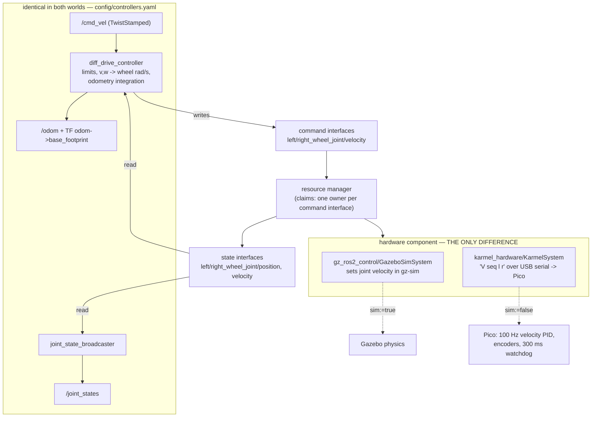

# 06.06 — ros2_control — the same controllers in simulation and on the real robot

<!-- glance:start -->
<!-- generated by tools/build.py from curriculum/syllabus.yaml — edit the syllabus, not this block -->

| | |
|---|---|
| **Track** | Main path |
| **Difficulty** | Advanced |
| **Time** | 1 h 30 min |
| **Hardware** | none |
| **Software** | ros2, ros2-control, gz-ros2-control |
| **Prerequisites** | [06.05 Your robot in Gazebo — spawning a URDF with inertia, collision and friction](06.05-robot-in-gazebo.md) |
| **Version-sensitive** | yes — see [curriculum/versions.yaml](../curriculum/versions.yaml) |
| **Skip if** | You have configured diff_drive_controller with gz_ros2_control. |

<!-- glance:end -->

## What you will learn

- Explain what `controller_manager`, the resource manager, a hardware component and a controller each do, and which one you write yourself.
- Read a running robot's control graph: which interfaces exist, who claims them, and at what rate the loop runs.
- Configure `joint_state_broadcaster` and `diff_drive_controller` from one YAML file that both Gazebo and the real robot load.
- Swap the hardware component between `gz_ros2_control` and karmel's C++ `SystemInterface` without touching a controller.
- Drive the robot with `TwistStamped` on Jazzy, and diagnose the four ways a controller fails to start.

## Why it matters

Up to [06.05](06.05-robot-in-gazebo.md) the simulated karmel had a body but no driver: you spawned it, and something had to turn `/cmd_vel`
into wheel rotation. In [04.16](../04-ros2/04.16-your-robot-as-ros2-node.md) you wrote that something for the real robot — a node that
subscribes to `/cmd_vel`, does the differential-drive arithmetic, talks to the Pico, and publishes `/odom`.

Now write it twice and you have two robots. The wheel radius will diverge. The acceleration limit will be in one of them and not the
other. Your Nav2 tuning will be worthless when you move to hardware, because the plant you tuned against is not the plant you are
driving. This is the mobile-robot version of the thing you already refuse to do in software: two implementations of one contract,
maintained by hand.

`ros2_control` is the standard answer. It is a plugin host: a real-time loop that owns a set of named `double`s, loads *controllers*
that compute commands from them, and loads a *hardware component* that moves those numbers in and out of the physical world. Exactly
one of those pieces differs between simulation and hardware — the hardware component — and it is declared in one line of a xacro:

```xml
<xacro:if value="${use_sim}"><plugin>gz_ros2_control/GazeboSimSystem</plugin></xacro:if>
<xacro:unless value="${use_sim}"><plugin>karmel_hardware/KarmelSystem</plugin></xacro:unless>
```

Everything above that line — the differential-drive kinematics, the odometry integration, the velocity and acceleration limits, the
covariances, the TF publishing — is the same code and the same YAML in both worlds. That is what makes "test it in simulation" an
honest statement, and it is why the serious ROS 2 robot drivers you will meet — the Universal Robots arms, Franka, Kinova, Clearpath's
platforms — are all built this way. Modules 9 to 12 all assume it.

<!-- prereqs:start -->
## Prerequisites

You need these first:

- [06.05 Your robot in Gazebo — spawning a URDF with inertia, collision and friction](06.05-robot-in-gazebo.md)

### Optional prerequisite links

None.

Check your readiness: `python course.py why 06.06`
<!-- prereqs:end -->

## Concept

Think of `controller_manager` as a hosting process running on a fixed-rate loop, and of the robot's state as a table of named
`double`s:

```text
  left_wheel_joint/position     state   (read only, shared)
  left_wheel_joint/velocity     state   (read only, shared)
  left_wheel_joint/velocity     command (written by exactly one owner)
  right_wheel_joint/...
```

Every cycle the loop does three things, in this order, forever:

```text
  read()    the hardware component fills in the state interfaces from the world
  update()  every active controller reads states, computes, writes command interfaces
  write()   the hardware component pushes the command interfaces out to the world
```

There are three kinds of plugin, and you only ever write one of them:

| Piece | What it is | Who writes it | karmel's |
|---|---|---|---|
| **hardware component** | the driver: `read()` / `write()` against real hardware or a simulator | you, once per robot | `karmel_hardware/KarmelSystem` (C++) and `gz_ros2_control/GazeboSimSystem` (from apt) |
| **controller** | the algorithm: states in, commands out, at a fixed rate | almost never you — use the library | `diff_drive_controller`, `joint_state_broadcaster` |
| **resource manager** | tracks which interfaces exist and who is allowed to write them | nobody, it is part of the framework | — |

The resource manager is the part that is easy to skim past and then get bitten by. A **state** interface can be read by any number of
controllers. A **command** interface can be *claimed* by at most one active controller, exclusively, for as long as that controller is
active — a lease, not a lock. Try to activate a second controller that wants `left_wheel_joint/velocity` and the switch is rejected
before anything moves. That is deliberate: two controllers fighting over one motor is the mobile-robot equivalent of two threads
writing the same field, except the field is attached to a wheel.

The last piece of vocabulary is the **lifecycle**. Controllers and hardware components are both lifecycle objects:
`unconfigured → inactive → active`. An *inactive* controller is loaded, configured and holds no claims; it is not in the loop. The
`spawner` program you see in every launch file is not special — it just calls `load_controller`, `configure_controller` and
`switch_controller` over services, which you can do by hand from the command line.

> [!TIP]
> **Ask your teacher:** "Walk me through one 20 ms cycle of karmel's controller_manager, naming every function that runs and every number that changes."

## Technical explanation

### Level 1 — The two files that describe the control system

**The `<ros2_control>` tag in the URDF** declares the interfaces. It is part of the robot description because the *robot* is what has
joints; it travels with the URDF to whoever needs it, and since Jazzy the `controller_manager` reads it from the `/robot_description`
topic rather than from its own parameter. [`karmel.ros2_control.xacro`](../labs/ros2_ws/src/karmel_description/urdf/karmel.ros2_control.xacro):

```xml
<ros2_control name="KarmelSystem" type="system">
  <hardware>
    <!-- the ONE thing that differs between simulation and the robot -->
    <plugin>gz_ros2_control/GazeboSimSystem</plugin>     <!-- or karmel_hardware/KarmelSystem -->
  </hardware>
  <joint name="left_wheel_joint">
    <command_interface name="velocity">
      <param name="min">-17.0</param>                     <!-- rad/s, from karmel.yaml -->
      <param name="max">17.0</param>
    </command_interface>
    <state_interface name="position"/>                    <!-- rad, integrated encoder ticks -->
    <state_interface name="velocity"/>                    <!-- rad/s -->
  </joint>
  <joint name="right_wheel_joint"> … </joint>
</ros2_control>
```

`type="system"` means one component owns several joints that must be read and written together (one serial link to the Pico carries
both wheels). The alternatives are `actuator` (one joint) and `sensor` (states only, no commands).

**The controller YAML** ([`controllers.yaml`](../labs/ros2_ws/src/karmel_bringup/config/controllers.yaml)) says which controllers to
run and how. Its first section configures the manager itself:

```yaml
controller_manager:
  ros__parameters:
    update_rate: 50                  # Hz — the read/update/write loop
    joint_state_broadcaster:
      type: joint_state_broadcaster/JointStateBroadcaster
    diff_drive_controller:
      type: diff_drive_controller/DiffDriveController
```

and the rest configures each controller by name. The whole file is loaded verbatim in both worlds.

### Level 2 — The two controllers karmel runs

**`joint_state_broadcaster`** is the simplest controller there is: it claims *no* command interfaces, reads every state interface it is
offered, and republishes them as `sensor_msgs/JointState` on `/joint_states`. `robot_state_publisher` turns that plus the URDF into
TF, which is why the wheels spin in RViz. A "broadcaster" is just a controller whose output is a topic.

**`diff_drive_controller`** is the real one. Each cycle it takes the latest `geometry_msgs/TwistStamped` on `~/cmd_vel`, applies the
velocity and acceleration limits, converts $(v, \omega)$ to two wheel speeds, writes them to the command interfaces, then reads the
measured wheel *positions* back and integrates them into odometry, which it publishes on `~/odom` and (optionally) as the
`odom → base_footprint` transform.

$$\omega_{\text{left}} = \frac{v - \omega b/2}{r}, \qquad \omega_{\text{right}} = \frac{v + \omega b/2}{r}$$

with $b$ = `wheel_separation` = 0.200 m and $r$ = `wheel_radius` = 0.045 m.

**Worked example.** Command $v = 0.2$ m/s, $\omega = 0.4$ rad/s:

$$\omega_{\text{left}} = \frac{0.2 - 0.4 \times 0.1}{0.045} = \frac{0.16}{0.045} = 3.556\ \text{rad/s}, \qquad
  \omega_{\text{right}} = \frac{0.24}{0.045} = 5.333\ \text{rad/s}$$

Hold that for 5 s and the wheels should turn 17.78 and 26.67 rad. Measured in Gazebo (§ Expected result, 06.06-E1): **17.93 and
26.89 rad** — 0.8 % high, which is the acceleration ramp at the start and the final cycle at the end, not an error.

> [!IMPORTANT]
> **Version-sensitive** (verified 2026-09 against ROS 2 Jazzy, `ros2_control` 4.48.0, `ros2_controllers` 4.42.x, `gz_ros2_control` 1.2.20).
> On Jazzy, `diff_drive_controller` subscribes to **`geometry_msgs/TwistStamped`**, not `Twist`. The Humble-era `use_stamped_vel`
> parameter is gone, `wheels_per_side` was removed, and the `has_velocity_limits`-style booleans are deprecated (set an unwanted
> limit to `.nan` instead). `teleop_twist_keyboard` needs `-p stamped:=true`. Release notes:
> https://github.com/ros-controls/ros2_controllers/blob/jazzy/doc/release_notes.rst
> AI teacher: check the current release notes before giving `cmd_vel` instructions.

Three parameters in `controllers.yaml` are worth understanding rather than copying:

- `open_loop: false` — integrate the *measured* wheel motion, not the commanded one. With `true` the controller reports the
  trajectory it asked for, which never slips and never stalls. That is a lie you occasionally want (for a robot with no encoders) and
  usually do not.
- `position_feedback: true` — integrate wheel *position* differences rather than sampled velocities. Positions are exact sums of
  encoder ticks; velocities are differentiated and noisy. See [07.02](../07-sensors/07.02-wheel-encoders-in-depth.md).
- `cmd_vel_timeout: 0.5` — stop if no command arrives for half a second. This is a watchdog, at the controller level, on top of the
  Pico's own 300 ms watchdog. A robot that keeps driving when its commander dies is the single most common way to break something.

### Level 3 — What `gz_ros2_control` actually does

On the real robot the loop lives in a process called `ros2_control_node`, which spins a real-time thread at `update_rate` and calls
your `read()`/`write()`. In Gazebo there is no such process. Instead, a Gazebo *system plugin* creates a `controller_manager` **inside
the `gz sim` process** and steps it from Gazebo's own update callback:

```xml
<gazebo>
  <plugin filename="gz_ros2_control-system" name="gz_ros2_control::GazeboSimROS2ControlPlugin">
    <parameters>${controllers_file}</parameters>
  </plugin>
</gazebo>
```

Two consequences follow, and both show up in real output.

First, the control loop is driven by **simulated** time. Gazebo steps at 1 ms; the manager wants 20 ms; so it runs once every 20
Gazebo steps, and prints, at startup:

```text
[gz_ros_control]: Desired controller update period (0.02 s) is slower than the gazebo simulation period (0.001 s).
```

That is informational, not a problem — it is the *correct* relationship. The reverse (a controller faster than the physics step)
would be the bug.

Second, because the loop is stepped by the simulator, it cannot overrun. It simply runs slower in wall-clock time when your machine is
busy. On real hardware the loop is stepped by a real clock and it *can* overrun, loudly:

```text
[controller_manager]: Overrun detected! The controller manager missed its desired rate of 50 Hz.
                      The loop took 20.112306 ms (missed cycles : 2).
[controller_manager]: Overrun might occur, Total time : 23011.998 us (Expected < 20000.000 us)
                      --> Read time : 72.881 us, Update time : 22814.346 us, Write time : 124.771 us
```

Read that breakdown. `read()` and `write()` — the serial I/O — cost about 200 µs together. The 22.8 ms is `update()`, i.e. the
controllers plus everything else sharing the CPU. The loop is not I/O bound; it is starved. On a Raspberry Pi 5 running SLAM and Nav2
at the same time, this is the number you will be staring at, and 50 Hz for a 0.5 m/s robot is a deliberate, defensible choice: the
Pico already closes a 100 Hz velocity loop locally, so the Pi only has to keep the setpoints fresh.

### Level 4 — What a hardware component has to implement

[`karmel_hardware/KarmelSystem`](../labs/ros2_ws/src/karmel_hardware/src/karmel_system.cpp) is about 250 lines of C++ and it is the
whole of "the robot" as far as ros2_control is concerned:

| Callback | When | What karmel's does | Rule |
|---|---|---|---|
| `on_init` | once, whenever the description is loaded | parse `<param>`s, check there are exactly two joints with the right interfaces | **no I/O** — it runs on machines with no robot attached |
| `on_configure` | entering `inactive` | open the serial port, handshake (`I fake-1.0 1`), set the Pico's watchdog | may block; not in the loop |
| `on_activate` | entering `active` | zero the commands so the robot cannot inherit a stale one | never start moving on activation |
| `read` | every cycle | drain telemetry lines, convert ticks → rad, fail if telemetry is older than 500 ms | no allocation, no logging in the happy path |
| `write` | every cycle | one `V <seq> <l> <r>` line per cycle — which also feeds the Pico's watchdog | must run every cycle, even with a zero command |
| `on_deactivate` / `on_shutdown` | leaving `active` | send `S` (stop) | stop the motors before you stop talking |

Two details in that table are the ones people get wrong. `read()` returning `ERROR` when telemetry is stale, rather than reusing the
last value, is the difference between "the robot stopped" and "the robot drove into a wall using three-second-old encoder data".
And `write()` being the thing that feeds the watchdog means **`update_rate` is a safety parameter on the real robot**: at
`update_rate: 2`, commands arrive every 500 ms and the Pico's 300 ms watchdog cuts the motors between every pair of them.

Why C++ and not Python? Because this is the one place in your stack with a hard periodic deadline. Everything else in this course that
needs to be fast is C++ for the same reason; everything that does not is Python.

## Diagram



The loop, and where each failure shows up:

```text
   every 1/update_rate seconds
   ┌────────────────────────────────────────────────────────────────────────────┐
   │ read()      hardware -> state interfaces      stale telemetry -> ERROR      │
   │ update()    controllers: states -> commands   unclaimed interface -> refuse │
   │ write()     command interfaces -> hardware    also feeds the Pico watchdog  │
   └────────────────────────────────────────────────────────────────────────────┘
        ▲                                                       │
        └──────── missed deadline => "Overrun detected!" ───────┘
```

## Code

Bring up the whole stack — in simulation:

```bash
cd ~/labs/ros2_ws && source install/setup.bash
ros2 launch karmel_bringup robot.launch.py sim:=true headless:=true enable_camera:=false
```

and, with the Pico plugged in (or a fake one, see 06.06-E5), on the robot:

```bash
ros2 launch karmel_bringup robot.launch.py sim:=false serial_device:=/dev/ttyACM0
```

Inspect the running control system. These four commands are the ones to learn:

```bash
ros2 control list_controllers -v          # who is active, at what rate, claiming what
ros2 control list_hardware_components     # the driver, its lifecycle state, its read/write rate
ros2 control list_hardware_interfaces     # every named double, and whether it is claimed
ros2 control list_controller_types        # everything installed that you could load instead
```

Drive it. On Jazzy the message type is `TwistStamped`:

```bash
ros2 topic pub -r 20 /cmd_vel geometry_msgs/msg/TwistStamped \
  "{twist: {linear: {x: 0.2}, angular: {z: 0.4}}}"

# or the scripted pattern used by the smoke test (adds --ros-args -p use_sim_time:=true in sim)
python3 tools/drive_pattern.py --pattern "0.2,0.4,5;0,0,1" --ros-args -p use_sim_time:=true
```

Work the lifecycle by hand, without restarting anything:

```bash
ros2 control set_controller_state diff_drive_controller inactive
ros2 control list_hardware_interfaces          # the wheel command interfaces are now unclaimed
ros2 control set_controller_state diff_drive_controller active
```

The launch file that does all of this is [`robot.launch.py`](../labs/ros2_ws/src/karmel_bringup/launch/robot.launch.py); its
spawners are worth reading, because the arguments are the ones you will need:

```python
Node(package='controller_manager', executable='spawner', output='screen',
     arguments=['diff_drive_controller', '--controller-manager', '/controller_manager',
                '--controller-manager-timeout', '120',   # Gazebo can take a minute to come up
                '--switch-timeout', '60',
                '--param-file', controllers_file,
                '--controller-ros-args',
                '-r /diff_drive_controller/cmd_vel:=/cmd_vel -r /diff_drive_controller/odom:=/odom'])
```

The remap matters: a controller's topics are private (`/diff_drive_controller/cmd_vel`), and everything else in this course — teleop,
Nav2, your own scripts — expects `/cmd_vel` and `/odom`.

## Exercise

No hardware is required for E1–E4 and E6; E5 offers both a hardware and a no-hardware path. Everything runs headless in the course
Docker image. Allow 40–90 s from `ros2 launch` to "controller active" on a CPU-only machine.

### Exercise 06.06-E1 — Read the control graph, then predict the wheel angles `[simulation]`

Bring up the simulation and run all four `ros2 control list_*` commands. Answer from the output alone:

1. How many command interfaces exist, how many are claimed, and by whom?
2. `diff_drive_controller` requires `left_wheel_joint/position` as a *state* but not `.../velocity`. Why — and which controller does
   require the velocity state?
3. What are `diff_drive_controller/linear/velocity` and `.../angular/velocity`, which appear in `list_hardware_interfaces` but belong
   to no joint?

Then **predict**, using the formulas above, the two wheel angles after commanding $v = 0.2$ m/s, $\omega = 0.4$ rad/s for 5 s, and the
final `/odom` pose. Run the drive and compare.

### Exercise 06.06-E2 — Send the wrong message type `[debugging]`

Predict what happens, then run it:

```bash
ros2 topic pub --once /cmd_vel geometry_msgs/msg/Twist "{linear: {x: 0.2}}"
```

Explain the exact output. Then find two commands that would have told you the right type in advance, and say what the equivalent
mistake would look like in a ROS 1 or Humble tutorial you found online.

### Exercise 06.06-E3 — Take the wheels away from the controller `[simulation]`

With the robot driving, run `ros2 control set_controller_state diff_drive_controller inactive`. Record what happens to (a) the robot,
(b) `list_hardware_interfaces`, (c) `/odom`, (d) `/joint_states`. Reactivate it.

Then load a *second* controller that wants the same interfaces and try to activate it:

```bash
ros2 control load_controller rogue diff_drive_controller/DiffDriveController --set-state active
```

Predict the result before running it. Explain in one sentence what the resource manager is protecting you from.

### Exercise 06.06-E4 — Slow the loop down `[predict]`

Copy `controllers.yaml` to `/tmp`, set `update_rate` to 10, and relaunch with
`controllers_file:=/tmp/controllers_10hz.yaml`. **Before running**, predict:

1. the publish rate of `/odom` and `/joint_states` in *simulated* time (`publish_rate` in the YAML is still 50.0 — does that win?);
2. the end pose after the same 5 s drive as E1, and whether it will be more or less accurate than at 50 Hz.

Measure both. Repeat with `update_rate: 2` and explain the result — it is probably not the one you predicted. Finally, answer the
question that actually matters: **what breaks at `update_rate: 2` on the real robot that does not break in simulation?** (Look at
`serial.watchdog_ms` in `labs/config/karmel.yaml` and at what `write()` does.)

### Exercise 06.06-E5 — The same controllers, a different hardware component `[hardware]`

Hardware: `robot-base` (the assembled karmel with the Pico flashed). **No hardware? Use the fake Pico instead** — it speaks the same
protocol v1 over a pty and needs nothing but the Docker image:

```bash
ros2 run karmel_base fake_pico --link /tmp/ttyKARMEL
ros2 launch karmel_bringup robot.launch.py sim:=false serial_device:=/tmp/ttyKARMEL
```

> [!CAUTION]
> **Safety:** with the real robot, put it on a stand with the wheels in the air before the first `ros2 launch … sim:=false`, keep the
> power switch within reach, and confirm you see `cmd_vel_timeout` stop the wheels when you kill the publisher — *before* you put the
> robot on the floor. See [SAFETY.md](../SAFETY.md).

Run the same four inspection commands and the same drive as E1, and build a table of every difference you can find between the
simulated and the real run: node names, hardware component fields, `use_sim_time`, the rate the loop really achieves, the end pose.
For each difference, say whether it is expected or a bug.

### Exercise 06.06-E6 — Design a hardware component `[design]`

karmel gets a pan servo for the camera: a hobby servo on the Pico, commanded by angle, with no feedback other than "the last angle I
sent". Write (in prose, not code) the `<ros2_control>` block and the callback-by-callback design:

1. `type`: `system`, `actuator` or `sensor`, and why.
2. Which command and state interfaces, and what `read()` can honestly report when the servo has no encoder.
3. Which existing controller from `ros2 control list_controller_types` would drive it — no new controller should be needed.
4. What `on_activate` must do so the camera does not snap to a stale angle.
5. Whether it belongs in `KarmelSystem` or in a second component, given that both talk to the same serial port.

## Expected result

Captured 2026-09-19 in the course Docker image (`karmel-ros:jazzy`: ROS 2 Jazzy, Gazebo Harmonic, `ros2_control` 4.48.0,
`gz_ros2_control` 1.2.20), headless, software rendering, on a loaded machine (real-time factor 0.3–1.0). Wall-clock rates are
therefore lower than simulated rates; always compare *simulated*-time rates.

**06.06-E1.** Four command interfaces, two of them real:

```text
$ ros2 control list_controllers -v
diff_drive_controller   diff_drive_controller/DiffDriveController      active
	update_rate: 50 Hz
	is_async: False
	claimed interfaces:
		left_wheel_joint/velocity
		right_wheel_joint/velocity
	required state interfaces:
		left_wheel_joint/position
		right_wheel_joint/position
	exported reference interfaces:
		linear/velocity
		angular/velocity
joint_state_broadcaster joint_state_broadcaster/JointStateBroadcaster  active
	update_rate: 50 Hz
	claimed interfaces:
	required state interfaces:
		left_wheel_joint/position
		left_wheel_joint/velocity
		right_wheel_joint/position
		right_wheel_joint/velocity

$ ros2 control list_hardware_interfaces
command interfaces
	diff_drive_controller/angular/velocity [available] [unclaimed]
	diff_drive_controller/linear/velocity [available] [unclaimed]
	left_wheel_joint/velocity [available] [claimed]
	right_wheel_joint/velocity [available] [claimed]
state interfaces
	left_wheel_joint/position
	left_wheel_joint/velocity
	right_wheel_joint/position
	right_wheel_joint/velocity
```

Answers: (1) two joint command interfaces, both claimed by `diff_drive_controller`; the broadcaster claims nothing, which is why
both can be active at once. (2) `position_feedback: true` — the controller integrates position differences, so it needs positions;
`joint_state_broadcaster` publishes everything it is offered, including velocity. (3) `DiffDriveController` is a *chainable*
controller: those two are **reference** interfaces it exports so another controller could write $(v, \omega)$ directly into it
instead of going through the `/cmd_vel` topic. Nothing claims them here.

The drive:

```text
$ python3 tools/drive_pattern.py --pattern "0.2,0.4,5;0,0,1" --ros-args -p use_sim_time:=true
[drive_pattern]: done; odom x=0.434 y=0.726

$ ros2 topic echo --once /joint_states
position: [17.92619543226256, 26.88714580390427]
```

Predicted 17.78 and 26.67 rad; measured 17.93 and 26.89 (+0.8 %). The predicted pose for a perfect 5 s arc of radius
$R = v/\omega = 0.5$ m through $\omega t = 2.0$ rad is $x = R\sin 2.0 = 0.455$, $y = R(1 - \cos 2.0) = 0.708$; measured
(0.434, 0.726), yaw 2.017 rad. The difference is the 1.0 m/s² acceleration ramp.

**06.06-E2.** Nothing happens, for ever:

```text
$ ros2 topic pub --once /cmd_vel geometry_msgs/msg/Twist "{linear: {x: 0.2}}"
Waiting for at least 1 matching subscription(s)...
Waiting for at least 1 matching subscription(s)...
Waiting for at least 1 matching subscription(s)...
```

There *is* a subscriber on `/cmd_vel`, but its type is `TwistStamped`, and DDS matches endpoints by type. The publisher never matches,
so `--once` never fires. No error, no warning, nothing on `ros2 topic list` to suggest a problem — which is exactly why this costs
people an afternoon. `ros2 topic info /cmd_vel -v` names the type and the subscriber node; `ros2 interface show` confirms the fields.
Every ROS 1 and most Humble-era tutorials publish plain `Twist`, and they will silently do nothing here.

**06.06-E3.** Deactivating releases the claims; the robot coasts to a stop (the hardware component keeps writing the last command,
which `on_deactivate` zeroes) and `/odom` stops publishing, while `/joint_states` keeps going at 50 Hz because the broadcaster is a
separate controller with no claims:

```text
$ ros2 control set_controller_state diff_drive_controller inactive
Successfully deactivated diff_drive_controller
$ ros2 control list_controllers
diff_drive_controller   diff_drive_controller/DiffDriveController      inactive
joint_state_broadcaster joint_state_broadcaster/JointStateBroadcaster  active
$ ros2 control list_hardware_interfaces | head -5
command interfaces
	diff_drive_controller/angular/velocity [unavailable] [unclaimed]
	diff_drive_controller/linear/velocity [unavailable] [unclaimed]
	left_wheel_joint/velocity [available] [unclaimed]
	right_wheel_joint/velocity [available] [unclaimed]
```

Note that the controller's own exported reference interfaces go `[unavailable]` while it is inactive — a chainable controller only
offers them when it is running. The second controller cannot be activated: the switch is rejected because
`left_wheel_joint/velocity` is already claimed. The resource manager is protecting you from two algorithms writing one motor.

**06.06-E4.** `update_rate` wins over `publish_rate`: a controller cannot publish faster than the loop that calls it.

```text
update_rate: 10   ->  /odom 10.02 Hz, /joint_states 10.02 Hz (simulated time), drive end pose odom (0.431, 0.735), truth (0.423, 0.728)
update_rate: 50   ->  /odom 49.95 Hz, /joint_states 49.88 Hz,                  drive end pose odom (0.434, 0.726), truth n/a
update_rate: 2    ->  drive end pose odom (0.455, 0.708), truth (0.449, 0.701), yaw 2.020 rad
```

The surprise is that 2 Hz is *not* worse — it is nearer the ideal (0.455, 0.708) than 50 Hz was. The reason is the acceleration
limiter: it is applied once per cycle, so at 2 Hz it has a 0.5 s window and effectively does not limit at all, and the robot follows
the un-ramped command. In this simulation `gz_ros2_control` is an ideal velocity source and the plant is slow, so loop rate buys very
little accuracy. What it does buy is odometry *resolution* (10 Hz odometry is 10 Hz of input to SLAM and the EKF in modules 10–11)
and limiter fidelity.

On the real robot, `update_rate: 2` is not a tuning choice, it is a fault: `write()` sends one `V` line per cycle, so commands arrive
every 500 ms, and the Pico's `watchdog_ms: 300` cuts the motors in between. The robot judders and drives far shorter than commanded.
The same parameter is a performance knob in simulation and a safety parameter on hardware.

**06.06-E5.** Same controllers, same YAML, different component. Startup:

```text
[controller_manager]: Loaded hardware 'KarmelSystem' from plugin 'karmel_hardware/KarmelSystem'
[KarmelSystem]: KarmelSystem: left='left_wheel_joint' right='right_wheel_joint' device=/tmp/ttyKARMEL ticks/rev=2464
[KarmelSystem]: Pico firmware fake-1.0, protocol v1
[KarmelSystem]: Receiving telemetry (battery 12.30 V)
```

The differences worth tabulating:

| | `sim:=true` | `sim:=false` |
|---|---|---|
| nodes | `/controller_manager /diff_drive_controller /gz_bridge /gz_ros_control /joint_state_broadcaster /robot_state_publisher` | `/controller_manager /diff_drive_controller /joint_state_broadcaster /karmelsystem /robot_state_publisher` |
| component `plugin name` | *(empty)* | `karmel_hardware/KarmelSystem` |
| component `read/write rate` | `0 Hz` | `50 Hz` |
| `use_sim_time` | `True` | `False` |
| loop | stepped by Gazebo, cannot overrun | real clock; `Overrun detected!` under load |
| drive `0.2, 0.4` for 5 s | odom (0.434, 0.726) | odom (0.488, 0.466) |

The empty plugin name and `0 Hz` rate for the Gazebo component are cosmetic: `gz_ros2_control` does not populate those fields, and
its rate is Gazebo's. All of these are expected. The *last* row is the interesting one: identical commands, identical controllers,
different trajectory — because the plant differs. That gap is lesson [06.10](06.10-sim-to-real-gap.md).

**06.06-E6.** A defensible answer: `actuator` type (one joint, its own component) is tempting, but karmel's servo shares the single
serial port with the wheels, and two components cannot own one file descriptor — so it belongs *inside* `KarmelSystem` as a third
joint, or behind a shared port abstraction. One `position` command interface; `read()` should report the last commanded position
(and say so in a comment — it is dead reckoning, not feedback), or expose no state interface at all rather than pretend.
`position_controllers/JointGroupPositionController` or `forward_command_controller/ForwardCommandController` drives it with no new
code. `on_activate` must read the servo's current angle if it can, or command a known safe angle, so the camera does not snap.

## Troubleshooting

### Symptom: `ros2 control list_controllers` says "No controllers are currently loaded!"

Work down this list; each step is cheaper than the next.

1. Is there more than one `controller_manager`? `ros2 node list | sort | uniq -d`. Two managers (a leftover `sim:=false` run plus a
   Gazebo one) produce exactly this message, because the CLI talks to whichever it finds first. This is the most common cause on a
   development machine, and the fix is to kill the leftover, not to debug the config.
2. Did the spawner fail? Look for `spawner` lines in the launch output. `Controller manager not available` means it timed out — raise
   `--controller-manager-timeout`.
3. Is the URDF reaching the manager? Since Jazzy it reads `/robot_description`:
   `ros2 topic echo --once /robot_description | head -3`. Empty means `robot_state_publisher` or `xacro` failed.
4. Is the `<ros2_control>` tag in the rendered URDF at all? `xacro … | grep -c ros2_control`.

### Symptom: the controller loads but refuses to activate

The message names the interface. Two causes:

- **Interface not available.** The name in `controllers.yaml` (`left_wheel_names`) must match the joint name in `<ros2_control>`,
  which must match the joint name in the URDF. Three files, one string. `ros2 control list_hardware_interfaces` shows the truth.
- **Interface already claimed.** Another controller is active and owns it. `list_controllers -v` shows who.

### Symptom: `/cmd_vel` is published but the robot does not move

1. `ros2 topic info /cmd_vel -v`. Publisher count 0 with a subscriber present means a **type mismatch** — you are sending `Twist`.
2. `ros2 control list_controllers`. Inactive controller, no motion.
3. Is `Velocity command timed out. Braking.` in the log? You are publishing slower than `cmd_vel_timeout` (0.5 s), or your stamps are
   wrong. With `use_sim_time`, a publisher that stamps from the *wall* clock produces timestamps decades in the future and every
   command looks stale. Every node in a simulation needs `use_sim_time:=true` ([06.04](06.04-bridging-gazebo-ros2.md)).
4. `/joint_states` shows the wheels turning but the robot stays put → not a control problem. Friction ([06.05](06.05-robot-in-gazebo.md)).

### Symptom: "Overrun detected! The controller manager missed its desired rate"

Read the `Read time / Update time / Write time` breakdown in the companion warning.

- Large **Write** or **Read** → I/O. Baud rate, a blocking serial call, a USB hub.
- Large **Update** with small I/O → CPU starvation. Something else on the machine. On the Pi, check with `top` while it happens.
- Occasional overruns of one or two cycles are survivable (the loop catches up, and the Pico holds the last setpoint for 300 ms).
  Continuous overruns mean the robot is being controlled at an unknown rate; lower `update_rate` or move work off the box.

### Symptom: `on_configure` fails with "No hello reply from the Pico"

The hardware component could not talk to the firmware. In order: is the device path right (`ls -l /dev/ttyACM*`); is the user in
`dialout`; is something else holding the port; is the firmware actually running (`01.13`); is the baud rate right (garbage without
newlines is the signature of a wrong baud rate, and `KarmelSystem` counts those as rejected lines).

## Common mistakes

- **Publishing `Twist` on Jazzy.** Silent, total failure. Check `ros2 topic info -v` first, always.
- **Writing your own differential-drive node when `diff_drive_controller` exists.** You will reimplement limits, odometry,
  covariances, TF and the timeout, worse. [04.16](../04-ros2/04.16-your-robot-as-ros2-node.md) exists to teach the mechanism, not to
  be the robot's driver.
- **Putting the wheel radius in more than one place.** It belongs in `karmel.yaml` and flows to the URDF and `controllers.yaml`;
  `check_config_sync.py` and `colcon test` enforce it. A radius that differs by 2 % is a 2 % odometry scale error that no filter can
  see, because every sensor agrees with itself.
- **Doing I/O in `on_init`.** It runs on machines with no robot attached (CI, a laptop rendering the URDF) and will fail there.
- **Not writing every cycle.** A hardware watchdog only sees `write()`. Skipping a cycle "because the command has not changed" stops
  the motors.
- **Leaving a `sim:=false` launch running while starting a `sim:=true` one.** Two `controller_manager`s with the same name, confusing
  CLI output, and commands going to a robot you thought was off.
- **Assuming a higher `update_rate` is always better.** It costs CPU on a Pi that also runs Nav2. Measure before raising it.

## Knowledge check

1. What is the difference between a state interface and a command interface, and what rule does the resource manager enforce about each?
   <details><summary>Answer</summary>

   A state interface is read-only and any number of controllers may read it. A command interface may be *claimed* by at most one
   **active** controller at a time, exclusively. Activating a second controller that needs an already-claimed command interface fails
   the switch — nothing moves, and you get an error instead of two algorithms fighting over a motor.
   </details>

2. Numerical: `wheel_separation` 0.200 m, `wheel_radius` 0.045 m. Command $v = 0.3$ m/s, $\omega = -1.0$ rad/s. What are the two wheel speeds, and is either over karmel's 17 rad/s limit?
   <details><summary>Answer</summary>

   $\omega_{\text{left}} = (0.3 - (-1.0)(0.1))/0.045 = 0.4/0.045 = 8.889$ rad/s.
   $\omega_{\text{right}} = (0.3 + (-1.0)(0.1))/0.045 = 0.2/0.045 = 4.444$ rad/s.
   Negative $\omega$ is a right turn, so the left wheel is the fast one. Both are well under 17 rad/s.
   </details>

3. Your `/odom` publishes at 10 Hz even though `publish_rate: 50.0` is set in the YAML. Where is the 10 coming from?
   <details><summary>Answer</summary>

   `controller_manager: update_rate`. The controller's `update()` is called by the manager's loop, and it cannot publish more often
   than it is called. `publish_rate` is an upper bound, not a promise.
   </details>

4. Predict: you set `update_rate: 2` on the real robot with `watchdog_ms: 300` on the Pico. What does the robot do, and what would the same change do in Gazebo?
   <details><summary>Answer</summary>

   On the robot, `write()` sends a velocity command every 500 ms; the Pico's 300 ms watchdog expires 200 ms after each one, so the
   motors run in 300 ms bursts and the robot judders and under-travels. In Gazebo there is no watchdog, the hardware component holds
   the last command for ever, and the robot drives *more* like the raw command than at 50 Hz, because the acceleration limiter only
   acts once per cycle. Same parameter, opposite consequences.
   </details>

5. Debugging: `list_controllers` says both controllers are active, `/joint_states` is publishing, you publish `TwistStamped` at 20 Hz, and the wheels do not turn. Give three hypotheses in the order you would test them.
   <details><summary>Answer</summary>

   (1) The stamps: with `use_sim_time` mismatched, every command looks stale and you will see `Velocity command timed out. Braking.`
   in the log — check the log first, it is free. (2) The topic is not the one the controller listens to: the spawner's remap may have
   failed, so the controller is on `/diff_drive_controller/cmd_vel` — `ros2 topic info /cmd_vel -v` names the subscriber. (3) It is
   not a control problem at all: the wheels *are* being commanded but friction or a collision stops them — compare `/joint_states`
   velocity with the commanded wheel speed.
   </details>

6. Why does `KarmelSystem::read()` return `ERROR` when telemetry is older than 500 ms, instead of reusing the last value?
   <details><summary>Answer</summary>

   Because stale data is worse than no data. `diff_drive_controller` integrates wheel positions into odometry; feeding it frozen
   positions makes the robot believe it has stopped while it may still be moving, and every consumer downstream (EKF, SLAM, Nav2)
   inherits that lie with full confidence. Returning `ERROR` deactivates the hardware and stops the robot, which is the safe failure.
   </details>

7. `list_hardware_components` shows `read/write rate: 0 Hz` and an empty plugin name in simulation, but `50 Hz` and `karmel_hardware/KarmelSystem` on the robot. Is the simulation broken?
   <details><summary>Answer</summary>

   No. `gz_ros2_control` creates the component itself rather than through the usual resource-manager path, so it does not fill in
   those descriptive fields, and its effective rate is Gazebo's step. The interfaces, the claims and the controller behaviour are all
   correct — which is what you actually depend on.
   </details>

8. Why is karmel's hardware component written in C++ when the rest of its ROS 2 code is Python?
   <details><summary>Answer</summary>

   It is the one component with a hard periodic deadline: it is called from the control loop at `update_rate` and its `write()` feeds
   a 300 ms hardware watchdog. It must not allocate, block or be interrupted by a garbage collector. `ros2_control` supports Python
   hardware components, but the C++ interface is the one the framework is designed around, and this is the place where that matters.
   </details>

## Practical challenge

Prove that "the same controllers run in both worlds" is true of *your* robot, not just of the launch file's comments — and prove it in
a way a change could break.

Acceptance criteria:

- A script (bash or Python) that brings up `sim:=true`, waits for both controllers to be active, records the full output of the four
  `ros2 control list_*` commands, drives a fixed pattern and records the end `/odom` pose and joint positions; then does the same for
  `sim:=false` against the fake Pico.
- It diffs the two recordings and asserts that the **controller** side is identical: same controller names, types, update rates,
  claimed interfaces, required state interfaces, and the same `wheel_separation` / `wheel_radius` / limit parameters
  (`ros2 param dump /diff_drive_controller`).
- It asserts the **hardware** side differs in exactly the expected places, and fails if the plugin name is the same in both (that
  would mean the sim/real switch silently stopped switching).
- It tolerates the trajectory difference — but prints it, with a number, because that number is the subject of 06.10.
- The whole thing runs headless in under five minutes and exits non-zero on any violation.
- Write one paragraph: which of these assertions would catch a wheel-radius typo in `karmel.yaml`, and which would not? What would?

## You can skip this if…

You can answer knowledge-check questions 1, 3 and 4 without looking, and you have already written a `hardware_interface::SystemInterface`,
configured `diff_drive_controller` against it, and run the same controller YAML under `gz_ros2_control` and on real hardware.

`python course.py skip 06.06 --reason "I have configured diff_drive_controller with gz_ros2_control and a custom SystemInterface"`

## Go deeper

- https://control.ros.org/jazzy/index.html — the ros2_control documentation for this distro: architecture, the interface model, the lifecycle, every controller's parameter list. The one page to bookmark.
- https://control.ros.org/jazzy/doc/ros2_controllers/diff_drive_controller/doc/userdoc.html — every `diff_drive_controller` parameter, including the ones karmel does not set.
- https://github.com/ros-controls/ros2_controllers/blob/jazzy/doc/release_notes.rst — what changed from Humble to Jazzy; read this before trusting any tutorial written before 2024.
- https://control.ros.org/jazzy/doc/ros2_control_demos/doc/index.html — small, complete hardware components (RRBot, DiffBot) to read when you write your own; start with the "system" example.
- https://github.com/ros-controls/gz_ros2_control — the plugin that hosts the controller_manager inside Gazebo, including the demo launch files (`ros2 launch gz_ros2_control_demos diff_drive_example.launch.py`).
- https://design.ros2.org/articles/node_lifecycle.html — the managed-node state machine that controllers and hardware components both use.
- https://articulatedrobotics.xyz/tutorials/ — Josh Newans' diff-drive series; excellent narrative, but written for Foxy/Gazebo Classic, so take the concepts and the commands from the official docs.

## Progress checkpoint

- [ ] I can name the three plugin kinds in ros2_control and say which one I have to write.
- [ ] I can read `list_controllers -v`, `list_hardware_components` and `list_hardware_interfaces` and say who owns what.
- [ ] I can configure `diff_drive_controller` from `controllers.yaml` and explain `open_loop`, `position_feedback` and `cmd_vel_timeout`.
- [ ] I can run the identical controller stack under Gazebo and against the Pico, and explain every difference I see.
- [ ] I can diagnose a controller that will not activate, and a `/cmd_vel` that does nothing.

`python course.py complete 06.06` (exercises done) · `python course.py master 06.06` (challenge done) · `python course.py struggle 06.06 "what was hard"`

Next: [06.07 — Simulated LiDAR, camera, depth and IMU](06.07-simulated-sensors-and-noise.md): the body moves correctly; now make it
perceive, with noise that resembles the real sensors.
