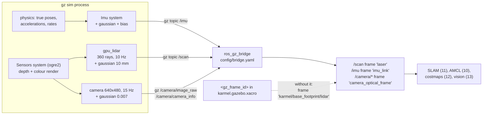

# 06.07 — Simulated LiDAR, camera, depth and IMU — with realistic noise

<!-- glance:start -->
<!-- generated by tools/build.py from curriculum/syllabus.yaml — edit the syllabus, not this block -->

| | |
|---|---|
| **Track** | Main path |
| **Difficulty** | Intermediate |
| **Time** | 1 h 15 min |
| **Hardware** | none |
| **Software** | gazebo, ros2 |
| **Prerequisites** | [06.06 ros2_control — the same controllers in simulation and on the real robot](06.06-ros2-control.md) |
| **Optional prerequisites** | [FM.14 Distributions, Gaussians, uncertainty and noise](../optional-foundations/mathematics/FM.14-distributions-gaussians-noise.md) |
| **Skip if** | Your simulated robot publishes noisy scan, image and IMU topics. |

<!-- glance:end -->

## What you will learn

- Add a `gpu_lidar`, an `imu` and a `camera` to a URDF, give each the right frame, rate and field of view, and bridge it to ROS 2.
- Choose noise parameters from a real sensor's datasheet or measurements, and verify that the simulator actually delivered them.
- Measure a simulated sensor the way you would measure a real one: rate, bias, standard deviation, dropouts.
- Name, with evidence, the things Gazebo's sensors do **not** model — and predict which of your algorithms will be surprised.
- Diagnose a scan whose ranges are geometrically wrong, and a camera that publishes at a third of its configured rate.

## Why it matters

Everything from module 9 onwards is a program that turns sensor readings into belief. Odometry, the EKF, particle filters, SLAM,
costmaps, object detection — all of them are, mathematically, statements about noise. If your simulated LiDAR is perfect, every one of
those programs will look like it works, and none of them will be tested.

The opposite failure is just as expensive. Give the simulator ten times the real noise and you will spend a week tuning a filter to
reject a problem the robot does not have, then find it sluggish on the actual floor.

So the job in this lesson is not "add sensors". It is **add sensors whose statistics you can defend**, then prove the simulator
delivered them. That is a measurement exercise, and the method is exactly the one [07.01](../07-sensors/07.01-sensor-fundamentals.md)
teaches for real sensors: leave the robot still, collect a few hundred samples, compute mean and standard deviation, and compare with
what you asked for.

The second half of the lesson is the more valuable half: the list of things the simulator does not model at all. A gap you know about
is a risk. A gap you do not know about is the reason "it worked in simulation".

<!-- prereqs:start -->
## Prerequisites

You need these first:

- [06.06 ros2_control — the same controllers in simulation and on the real robot](06.06-ros2-control.md)

### Optional prerequisite links

New to any of these? Take the foundation lesson first; skip it if you already know it.

- [FM.14 Distributions, Gaussians, uncertainty and noise](../optional-foundations/mathematics/FM.14-distributions-gaussians-noise.md)

Check your readiness: `python course.py why 06.07`
<!-- prereqs:end -->

## Concept

A simulated sensor is two things bolted together:

```text
   ground truth  ──────▶  a measurement model  ──────▶  a ROS message
   (geometry or a        (rate, resolution, FOV,        (with a frame_id
    rendered image)       clipping, noise)               and a timestamp)
```

The first part is free and exact: Gazebo knows where every surface is, and can render depth or colour from any pose. The second part
is entirely **your choice**, expressed in a few XML elements, and it is where all the realism lives.

Two of karmel's three sensors are *rendered*, not computed from physics. `gpu_lidar` and `camera` both go through the rendering
engine — the LiDAR is a depth render reshaped into a ring of ranges. This has three consequences you will meet immediately:

- the world must load the `Sensors` system with a render engine (`ogre2`), which karmel's worlds do;
- headless machines need `--headless-rendering` (EGL) or you get no `/scan` and no image at all, with no obvious error;
- sensor output costs GPU or, in Docker without a GPU, CPU. The camera is by far the most expensive thing in the simulation, which is
  why `enable_camera:=false` exists and why every lab that does not need vision uses it.

The IMU is different: it is computed by the `Imu` system from the link's true acceleration and angular velocity, plus noise. It is
nearly free.

The third part — getting the data into ROS 2 — is `ros_gz_bridge`, and the one thing that goes wrong is frames. When Gazebo converts
your URDF to SDF it merges every fixed-jointed link into its parent ([06.05](06.05-robot-in-gazebo.md)), so a sensor you attached to
`laser` ends up on `base_footprint` and stamps its messages `karmel/base_footprint/lidar` — a frame TF has never heard of.
`<gz_frame_id>laser</gz_frame_id>` fixes it, and you need one on every sensor, every time.

> [!TIP]
> **Ask your teacher:** "Take my real RPLIDAR C1 datasheet numbers and turn them into the `<noise>` and `<range>` block I should put in the xacro — then tell me which datasheet numbers have no Gazebo equivalent at all."

## Technical explanation

### Level 1 — The three sensors, as configured

All three live in [`karmel.gazebo.xacro`](../labs/ros2_ws/src/karmel_description/urdf/karmel.gazebo.xacro), driven by
[`labs/config/karmel.yaml`](../labs/config/karmel.yaml) so that the simulated sensor and the real driver are configured from one file.

| | LiDAR | IMU | Camera |
|---|---|---|---|
| gz type | `gpu_lidar` | `imu` | `camera` |
| ROS topic | `/scan` `sensor_msgs/LaserScan` | `/imu` `sensor_msgs/Imu` | `/camera/image_raw`, `/camera/camera_info` |
| frame (`gz_frame_id`) | `laser` | `imu_link` | `camera_optical_frame` |
| rate | 10 Hz | 100 Hz | 15 Hz |
| geometry | 360 samples over $[-\pi, \pi - 2\pi/360]$, 0.05–12 m | — | 640 × 480, hFOV 1.20 rad |
| noise | Gaussian, $\sigma = 0.01$ m | gyro $\sigma = 2\times10^{-3}$ rad/s, accel $\sigma = 1.7\times10^{-2}$ m/s², both with bias | Gaussian, $\sigma = 0.007$ (of 0–1 pixel value) |
| modelled after | RPLIDAR C1 (`lidar` in HARDWARE.md) | BNO055 (`imu`) | USB webcam (`camera`) |

Why the angular range stops one step short of $+\pi$: with `samples: 360` over a full turn, the first and last ray would otherwise be
the same ray. $\text{angle\_max} = \pi - 2\pi/360 = 3.12414$ rad gives exactly 360 distinct rays 1.000° apart.

Why the camera has no `<distortion>`: Gazebo can simulate radial distortion, but karmel's does not, so `camera_info.d` is all zeros
and the pinhole model is exact. That is a deliberate, *documented* gap — see Level 4.

### Level 2 — Reading a noise model, and checking it

Gazebo's Gaussian noise element has four parts, and the two people ignore are the important ones:

```xml
<noise type="gaussian">
  <mean>0.0</mean>          <!-- added to every sample, every run                        -->
  <stddev>2e-3</stddev>     <!-- white noise: redrawn every sample                       -->
  <bias_mean>1e-4</bias_mean>     <!-- a constant offset, drawn ONCE per run              -->
  <bias_stddev>1e-5</bias_stddev> <!-- how much that once-per-run offset varies           -->
</noise>
```

`stddev` is what you see if you take the standard deviation of a stationary sequence. `bias_mean`/`bias_stddev` model the thing that
actually ruins integration: a constant offset, different on every boot, that no amount of averaging removes. A gyro with
$\sigma = 2\times10^{-3}$ rad/s and a bias of $1\times10^{-4}$ rad/s is *dominated by noise* for a single reading and *dominated by
bias* after ten seconds of integration:

$$\text{angle error from white noise after } t: \ \sigma\sqrt{\Delta t\, t} \qquad
  \text{from bias}: \ b\,t$$

**Worked example**, karmel's gyro at 100 Hz ($\Delta t = 0.01$ s), $\sigma = 2\times10^{-3}$, $b = 1\times10^{-4}$:

| after | white-noise angle error | bias angle error |
|---|---|---|
| 1 s | $2\times10^{-3}\sqrt{0.01 \times 1} = 2.0\times10^{-4}$ rad | $1.0\times10^{-4}$ rad |
| 10 s | $6.3\times10^{-4}$ rad | $1.0\times10^{-3}$ rad |
| 100 s | $2.0\times10^{-3}$ rad (0.11°) | $1.0\times10^{-2}$ rad (0.57°) |

Noise grows as $\sqrt{t}$, bias grows as $t$. That crossover, at about 4 s here, is the whole argument for fusing a gyro with
something absolute ([10.02](../10-localization/10.02-uncertainty-gaussians.md) onwards), and it is why the bias terms belong in the
simulation even though they make the numbers look worse.

Now verify. [`06-simulation/code/ros2/sensor_stats.py`](code/ros2/sensor_stats.py) parks the robot, collects 60 scans and several
hundred IMU samples, and prints what arrived next to what you asked for. Measured (§ Expected result):

```text
per-ray std dev: median 9.83 mm, min 7.42 mm, max 12.21 mm   (configured stddev = 10 mm)
angular_velocity.z: mean +0.00009 rad/s, std 0.00200 rad/s   (configured stddev 2e-3)
linear_acceleration.z: mean +9.8104 m/s2, std 0.0173 m/s2    (configured stddev 1.7e-2)
```

The simulator delivered exactly what the xacro asked for. Note the *minimum* per-ray standard deviation, 7.42 mm: with only 60
samples the estimate of a 10 mm σ has a standard error of $\sigma/\sqrt{2n} \approx 0.9$ mm, so a spread of 7.4–12.2 mm across 360
rays is sampling noise, not a per-ray difference. Checking that you have enough samples before believing a difference is the same
discipline you need for real sensors.

### Level 3 — A worked diagnosis: when the ranges are geometrically wrong

Park karmel in the apartment at $(-1.5, -0.5)$ facing $+x$ and compute what the scan *should* say. The middle wall's face is at
$x = 0.45$, so the forward ray should read 1.95 m. Measured: **1.581 m**. The ray at $-90°$ (toward the bookshelf, whose face is at
$y = -2.15$) should read 1.65 m. Measured: **1.652 m**.

One ray is right and another is 19 % short. That pattern — *sideways rays correct, forward and backward rays short* — is the
signature of a scan plane that is not level. Check the ground truth:

```text
$ gz model -m karmel -p
  - Pose [ XYZ (m) ] [ RPY (rad) ]:
    [-1.499990 -0.500000 0.000212]
    [-0.000000 0.097403 0.000000]
```

The robot is resting nose-down by 0.0974 rad = 5.58°. A tilt about the $y$ (left) axis leaves the $\pm 90°$ rays level and drops the
forward ray by $d\sin\theta$ — 0.195 m over 2 m, more than the laser's height above the floor. So the forward ray never reaches the
wall: it hits the **floor**, at $h/\sin\theta = 0.154/0.0972 = 1.58$ m. Exactly what was measured.

The IMU confirms it independently, without the ground truth. A stationary accelerometer measures $-\mathbf{g}$ rotated into the body
frame, so a pitch $\theta$ puts $-g\sin\theta$ on the $x$ axis:

$$a_x = -g\sin\theta + b = -9.81 \times 0.0972 + 0.05 = -0.904\ \text{m/s}^2, \qquad
  a_z = g\cos\theta + b = 9.764 + 0.05 = 9.814$$

Measured: $a_x = -0.908$, $a_z = 9.810$. Two independent sensors, one geometric explanation, agreement to 4 mm/s². *That* is what
sensor debugging looks like: do not argue about the sensor, compute what it must read under your hypothesis and check.

(Why is karmel nose-down at all? Its centre of mass sits about 2 mm *ahead* of the wheel axle — the camera and the range sensor are
at the front — while its only third contact point, the ball caster, is 0.10 m *behind*. Nothing supports the front, so the chassis
tips until its front bottom edge touches the floor: $0.125 \times \sin\theta = 0.0122$ m, which is exactly the 12 mm ground
clearance. If your copy of `karmel_description` has been corrected since, `gz model -m karmel -p` will show a pitch near zero and the
forward ray will read 1.95 m — run the check either way, because the *method* is the lesson.)

### Level 4 — What the simulator does not model

This is the list to keep. Each entry is something a real sensor does that Gazebo's does not, and the algorithm it will surprise.

**LiDAR.**

- **Surface reflectivity, colour, incidence angle and transparency.** `gpu_lidar` is a depth render; the material is irrelevant. The
  experiment in [`materials_test.sdf`](code/gazebo/materials_test.sdf) puts a matt white, a matt black, a glass-like and a polished
  metal wall at exactly 1.00 m from the robot: all four return 1.00 m with the same 10 mm noise. A real RPLIDAR C1 loses matt black
  at long range, mostly shoots *through* glass, and on a mirror reports what the mirror is pointing at. Every glass door in a real
  apartment is a hole in your map that simulation will never show you.
- **Dropouts and invalid returns.** Gazebo returns `inf` beyond `range_max` and a valid number otherwise. Real units return zeros,
  NaNs, and occasional wild outliers. Anything that does not check `range_min`/`range_max` and `isfinite` will work in simulation.
- **Mixed pixels.** A real beam has a divergence of a fraction of a degree; at a depth edge it straddles two surfaces and returns a
  range in between, i.e. a point in mid-air. Simulated rays are infinitely thin.
- **Motor jitter and non-uniform angles.** A real spinning LiDAR's angular increment wobbles with motor speed; the simulated one is
  exactly 1.000°.
- **Interference.** Two robots with the same LiDAR see each other's pulses. Not modelled.

**Camera.**

- **Auto-exposure, auto-gain, white balance.** Not modelled at all: the image is a plain render. Measured with the robot 1.00 m from
  a wall: mean pixel value 162.7 facing matt white, **93.6** facing matt black. A real webcam facing a black wall would raise its gain
  and bring the mean back toward mid-grey — while adding sensor noise and motion blur. Any vision algorithm you tune on a fixed
  exposure ([13.02](../13-computer-vision/13.02-opencv-preprocessing.md)) is being tested on the easy version.
- **Rolling shutter and motion blur.** Every simulated frame is a perfect instant. A real webcam on a turning robot smears and skews.
- **Lens distortion.** `camera_info.d` is all zeros here, so undistortion is a no-op — and your pipeline never gets tested.
- **Latency.** A real USB webcam costs 30–120 ms between photons and a ROS message. The simulated one is stamped at the instant it
  was rendered.

**IMU.**

- **Temperature drift, scale-factor error, axis misalignment, non-orthogonality.** None of these are in the noise model; only white
  noise and a constant bias are.
- **Orientation.** Gazebo fills in `orientation` from ground truth and publishes `orientation_covariance[0] = 0.0`, which by REP-145
  convention means "exact". A real BNO055 runs a fusion filter with heading drift and a calibration status. Never build a heading
  estimator on simulated IMU orientation.
- **Vibration.** A real chassis transmits motor and floor vibration into the accelerometer at tens of g's worth of high-frequency
  energy. Gazebo's rigid bodies do not vibrate.

**Everything.**

- **Rate is a promise the simulator may not keep.** Measured in simulated time: `/scan` 10.00 Hz and `/imu` 100.00 Hz exactly, but
  `/camera/camera_info` 15.15 Hz while `/camera/image_raw` arrived at **4.51 Hz**. The metadata is cheap; the 921 600-byte image is
  not, and between software rendering and best-effort QoS, two frames in three were never delivered. Real sensors drop frames too —
  but for different reasons and at different moments, so anything that assumes "one image per `camera_info`" is untested.

None of this means the simulation is useless. It means you should write down, for each algorithm you are about to test, which entry in
this list it is blind to — and plan to test that part on the robot. That is the discipline [06.10](06.10-sim-to-real-gap.md) turns
into a procedure.

## Diagram



Where the numbers come from, and where they can go wrong:

```text
  what you write                      what you should check                       06.07-E?
  ────────────────────────────────────────────────────────────────────────────────────────
  <update_rate>10</update_rate>       stamp deltas in SIM time, not topic hz        E2
  <stddev>0.01</stddev>               per-ray std over >= 60 stationary scans       E1
  <bias_mean>1e-4</bias_mean>         the MEAN of a stationary sequence             E1
  <horizontal_fov>1.20</horizontal_fov>  camera_info K: fx = w / (2 tan(fov/2))     E3
  <gz_frame_id>laser</gz_frame_id>    header.frame_id of the ROS message            E3
  (nothing: material, exposure)       an experiment that proves it is missing       E4
```

## Code

The LiDAR block — the one to copy when you add a sensor:

```xml
<gazebo reference="laser">
  <sensor name="lidar" type="gpu_lidar">
    <topic>scan</topic>
    <gz_frame_id>laser</gz_frame_id>      <!-- else: karmel/base_footprint/lidar -->
    <update_rate>10</update_rate>
    <always_on>true</always_on>
    <lidar>
      <scan><horizontal>
        <samples>360</samples>
        <resolution>1</resolution>
        <min_angle>-3.14159</min_angle>
        <max_angle>3.12414</max_angle>    <!-- pi - 2*pi/360: 360 distinct rays -->
      </horizontal></scan>
      <range><min>0.05</min><max>12.0</max><resolution>0.01</resolution></range>
      <noise><type>gaussian</type><mean>0.0</mean><stddev>0.01</stddev></noise>
    </lidar>
  </sensor>
</gazebo>
```

The bridge entry that makes it a ROS topic ([`bridge.yaml`](../labs/ros2_ws/src/karmel_gazebo/config/bridge.yaml)):

```yaml
- ros_topic_name: "/scan"
  gz_topic_name: "/scan"
  ros_type_name: "sensor_msgs/msg/LaserScan"
  gz_type_name: "gz.msgs.LaserScan"
  direction: GZ_TO_ROS
```

Run the measurement:

```bash
cd ~/labs/ros2_ws && source install/setup.bash
ros2 launch karmel_bringup robot.launch.py sim:=true headless:=true world:=apartment x:=-1.5 y:=-0.5
python3 06-simulation/code/ros2/sensor_stats.py --ros-args -p use_sim_time:=true
```

Look at the Gazebo side when the ROS side is empty — this is the fastest way to tell "the sensor is not producing" from "the bridge is
not bridging":

```bash
gz topic -l                      # is there a /scan on the gz side at all?
gz topic -e -t /scan -n 1        # one raw message
gz topic -e -t /stats -n 2       # real-time factor: are you rendering at all?
```

The materials experiment world, [`06-simulation/code/gazebo/materials_test.sdf`](code/gazebo/materials_test.sdf), and the static
world checker used in [06.08](06.08-building-worlds.md):

```bash
python3 06-simulation/code/gazebo/world_check.py 06-simulation/code/gazebo/materials_test.sdf
ros2 launch karmel_bringup robot.launch.py sim:=true headless:=true \
  world:=$PWD/06-simulation/code/gazebo/materials_test.sdf
```

## Exercise

No hardware for E1–E4. E5 needs `lidar` and `imu` from HARDWARE.md and offers a no-hardware fallback.

### Exercise 06.07-E1 — Measure the noise you asked for `[simulation]`

Bring up the apartment world and run `sensor_stats.py`. Before looking at the output, **predict**:

1. the median per-ray standard deviation of `/scan`;
2. the mean and standard deviation of `angular_velocity.z` while stationary;
3. the mean of `linear_acceleration.z`.

Then run it. For each of the three, say whether the simulator delivered what `karmel.gazebo.xacro` asked for. Finally, compute how
many stationary samples you would need for the estimate of a 10 mm σ to be accurate to 5 %, and check whether 60 scans was enough.

### Exercise 06.07-E2 — Rates in simulated time, not wall time `[simulation]`

`ros2 topic hz /scan` reports something like 1.5 Hz on a loaded machine, but the LiDAR is configured for 10 Hz. Explain why, then
measure each sensor's rate **from the message stamps** instead (the script in `sensor_stats.py` shows the pattern; a ten-line rclpy
node is enough).

Report the simulated-time rate of `/scan`, `/imu`, `/camera/camera_info`, `/camera/image_raw`, `/joint_states` and `/odom`. One of
these six is far below its configured rate while its own metadata topic is not. Name it, and give two hypotheses for why.

### Exercise 06.07-E3 — Frames, geometry and the camera matrix `[numerical]`

1. Echo one message from each sensor topic and record its `frame_id`. Then delete the `<gz_frame_id>` from a scratch copy of
   `karmel.gazebo.xacro`, relaunch, and record what `/scan`'s `frame_id` becomes. Explain the new name from
   [06.05](06.05-robot-in-gazebo.md)'s URDF→SDF merging rule.
2. From `/scan`'s header: check that `angle_increment` is exactly 1.000° and that
   `(angle_max - angle_min)/angle_increment + 1` equals the configured `samples`.
3. From `/camera/camera_info`: verify $f_x = w / (2\tan(\text{hFOV}/2))$ against the `horizontal_fov` in `karmel.yaml`, and say what
   `d` being all zeros means for a vision pipeline that calls `cv2.undistort`.

### Exercise 06.07-E4 — Prove a gap exists `[predict]`

Launch `materials_test.sdf`. Four walls, identical geometry, four very different materials, all 1.00 m from the robot.

**Predict, before running:** (a) the four LiDAR ranges and their noise; (b) the camera's mean pixel value facing the matt white wall
versus the matt black one.

Then measure. Spawn with `yaw:=0`, `yaw:=1.5708` and `yaw:=-1.5708` to face three different walls, and record the forward ray and the
mean pixel value each time. Write one paragraph: for each of the four materials, what would a real RPLIDAR C1 do differently, and
name one algorithm in modules 10–13 that would be affected.

### Exercise 06.07-E5 — Match the simulation to your real sensor `[hardware]`

Hardware: `lidar` (RPLIDAR C1) and `imu` (BNO055), on the assembled `robot-base`. **No hardware?** Use the published datasheet
figures and the values in [HARDWARE.md](../HARDWARE.md) instead, and say explicitly which numbers you could not verify.

> [!CAUTION]
> **Safety:** the RPLIDAR C1 is a Class 1 eye-safe laser — safe to look at — but it spins. Keep fingers and cables clear of the rotor,
> and run this test with the robot powered from the bench supply or with the wheels off the ground, not on the floor.

With the robot stationary and level, facing a flat wall at a measured distance:

1. Record 200+ scans. Compute, for a ray pointing straight at the wall: mean, standard deviation, and the fraction of readings that
   are zero/NaN/out of range. Compare the mean with the tape-measure distance — that difference is *bias*, and the simulator's
   `<mean>0.0</mean>` says there is none.
2. Record 60 s of stationary IMU. Compute the standard deviation and the mean of each gyro axis. The mean is your bias; integrate it
   for 60 s and report the heading error in degrees.
3. Edit a scratch copy of `karmel.gazebo.xacro` with your measured numbers, rerun `sensor_stats.py` in simulation, and show the two
   sets of statistics side by side.
4. List every number you measured that has **no** place to go in the Gazebo sensor model.

## Expected result

Captured 2026-09-19 in the course Docker image (`karmel-ros:jazzy`: ROS 2 Jazzy, Gazebo Harmonic, headless with `--headless-rendering`,
Mesa llvmpipe software rendering, no GPU passthrough, on a loaded host; real-time factor 0.3–1.0).

**06.07-E1.** The apartment world, robot parked at $(-1.5, -0.5)$:

```text
--- /scan  (60 messages) ---
frame_id=laser  samples=360  angle_min=-3.14159 angle_max=3.12414 increment=0.01745 rad (1.000 deg)
range_min=0.05000000074505806 range_max=12.0
rays with a finite return in every scan: 360 / 360
per-ray std dev: median 9.83 mm, min 7.42 mm, max 12.21 mm  (configured stddev = 10 mm)
ray 180 (straight ahead): mean 1.5657 m, std 9.96 mm
rays reported as inf (nothing within range_max) in scan 0: 0

--- /imu  (589 messages) ---
frame_id=imu_link
  angular_velocity.x: mean +0.00006 rad/s, std 0.00198 rad/s   (configured stddev 2e-3, bias_mean 1e-4)
  angular_velocity.y: mean -0.00018 rad/s, std 0.00198 rad/s
  angular_velocity.z: mean +0.00009 rad/s, std 0.00200 rad/s
  linear_acceleration.x: mean -0.9080 m/s2, std 0.0176 m/s2  (configured stddev 1.7e-2, bias_mean 0.05)
  linear_acceleration.y: mean -0.0469 m/s2, std 0.0167 m/s2
  linear_acceleration.z: mean +9.8104 m/s2, std 0.0173 m/s2
  orientation covariance[0] = 0.0
```

All three predictions should have been "what the xacro says", and they are: 9.83 mm against 10 mm, 0.00200 against 0.002, and
+9.8104 against $g + b = 9.81 + 0.05 = 9.86$ — the last one 5 cm/s² low, which is the $\cos\theta$ of the pitch discussed in Level 3
and in E4 below. Sample size: the standard error of a standard deviation is $\sigma/\sqrt{2n}$, so 5 % accuracy needs
$n = 1/(2 \times 0.05^2) = 200$ samples. Sixty scans is *not* enough to compare two rays with each other; it is plenty to confirm the
order of magnitude.

**06.07-E2.** Wall-clock `ros2 topic hz` reports roughly the configured rate multiplied by the real-time factor. Measured from stamps,
in simulated time:

```text
scan          n=  88   10.00 Hz  (period 100.0 ms)
imu           n= 878  100.00 Hz  (period  10.0 ms)
caminfo       n= 133   15.15 Hz  (period  66.0 ms)
image         n=  40    4.51 Hz  (period 221.7 ms)
joint_states  n= 438   49.88 Hz  (period  20.0 ms)
odom          n= 437   49.95 Hz  (period  20.0 ms)
```

`/camera/image_raw` is the odd one: 4.51 Hz against a configured 15 Hz, while its own `camera_info` keeps up. Two plausible causes,
both worth testing: (a) the `Sensors` system cannot render 640 × 480 at 15 Hz on llvmpipe, so frames are skipped at the source; (b) the
921 600-byte messages are being dropped by the best-effort sensor-data QoS between the bridge and the subscriber. Distinguish them by
checking the Gazebo-side rate (`gz topic -e -t /camera/image_raw`) — if Gazebo is also at 4.5 Hz it is rendering, if it is at 15 Hz it
is transport. `/joint_states` and `/odom` land exactly on the `controller_manager`'s 50 Hz, as [06.06](06.06-ros2-control.md) predicts.

**06.07-E3.** Frames: `laser`, `imu_link`, `camera_optical_frame`. With `<gz_frame_id>` removed, `/scan` arrives as
`karmel/base_footprint/lidar` — the scoped SDF name, because the fixed-jointed `laser` link was merged into `base_footprint`; every
`tf2` lookup then fails with "frame does not exist".

Geometry: $(3.12414 - (-3.14159))/0.0174533 + 1 = 360.0$ rays, increment exactly 1.000°.
Camera: $f_x = 640/(2\tan(1.20/2)) = 467.74$, and the message says

```text
frame_id=camera_optical_frame  640x480  distortion_model='plumb_bob'
  K = [467.74 0.00 320.00; 0.00 467.74 240.00; 0.00 0.00 1.00]
  D = [0.0, 0.0, 0.0, 0.0, 0.0]
  implied horizontal FOV = 1.2000 rad (68.75 deg)
```

`d` all zeros means `cv2.undistort` returns the image unchanged, so an undistortion bug is invisible in simulation and appears the
first time you point a real lens at a checkerboard.

**06.07-E4.** The prediction to make was "identical ranges, different brightness", and that is what happens. Robot at the centre of
`materials_test.sdf`, every wall face 1.00 m away, 40 scans:

```text
  bearing   0 -> glass-like    mean 0.9876 m  std 10.33 mm
  bearing  90 -> matt white    mean 1.0002 m  std 11.52 mm
  bearing 180 -> polished metal mean 1.0194 m std 12.13 mm
  bearing 270 -> matt black    mean 0.9983 m  std  9.39 mm
```

Four materials, one answer: 1.00 m ± 10 mm. (The 19 mm on the metal wall is the scan-plane tilt of Level 3 acting on a forward-ish
ray, not a material effect — the ±90° rays are the trustworthy ones.) The camera, facing each wall from 1.00 m:

| wall ahead | LiDAR forward ray | camera mean pixel value (0–255) |
|---|---|---|
| matt white | 1.0002 m | 162.7 (min 102, max 200) |
| matt black | 0.9878 m | **93.6** (min 6, max 200) |
| glass-like | 0.9876 m | 187.7 (min 96, max 226) |

A 1.7× brightness difference for the camera, none at all for the LiDAR. A real C1 would lose returns on the black wall at range, see
through the glass, and report the reflection off the metal; a real webcam would auto-expose and bring both means back toward 128.
Affected downstream: AMCL and SLAM scan matching against real glass walls ([10](../10-localization/10.02-uncertainty-gaussians.md),
[11](../11-slam/11.03-the-slam-problem.md)), costmap clearing through a glass door
([12.04](../12-navigation/12.04-costmaps.md)), and any fixed threshold in a vision pipeline
([13.02](../13-computer-vision/13.02-opencv-preprocessing.md)).

**06.07-E5.** With real hardware, expect your RPLIDAR C1 to show a *bias* of a centimetre or two against the tape measure (the
simulator has none), a few per cent of dropped/zero returns (the simulator has none), and a standard deviation that grows with
distance (the simulator's is constant). A stationary BNO055 typically shows a gyro bias of the order of $10^{-3}$ rad/s — an order of
magnitude more than karmel's simulated $10^{-4}$ — which integrates to several degrees per minute. Numbers with no home in the Gazebo
sensor model: range bias, distance-dependent σ, reflectivity thresholds, dropout rate, gyro temperature coefficient, accelerometer
scale-factor and axis-misalignment errors, and sensor latency. Writing that list *is* the deliverable.

## Troubleshooting

### Symptom: no `/scan` (or no image) in ROS 2 at all

Work outwards from the simulator:

1. `gz topic -l` — is the topic there on the Gazebo side? If not, the sensor is not running: check the world loads the `Sensors`
   system (`world_check.py` tells you), that the `<sensor>` survived into the SDF (`gz sdf -p file.urdf | grep sensor`), and that the
   robot actually spawned.
2. If Gazebo has it and ROS does not, it is the bridge: is there an entry in `bridge.yaml`, do the `gz_type_name` and `ros_type_name`
   match, is the bridge node running?
3. Headless with no `--headless-rendering`? Rendered sensors need an EGL context. `sim.launch.py` adds the flag when
   `headless:=true`; a hand-rolled `gz sim -s` does not.

### Symptom: RViz says "Frame [karmel/base_footprint/lidar] does not exist"

Missing `<gz_frame_id>` on that sensor. Add it, matching the URDF link name exactly. This will happen to every sensor you add.

### Symptom: the topic publishes far slower than `<update_rate>`

1. Measure in *simulated* time (stamp deltas), not with `ros2 topic hz`. Under a real-time factor of 0.3 everything is 3× slow in
   wall-clock and nothing is wrong.
2. If the simulated-time rate is also low, compare the Gazebo-side rate with the ROS-side rate to separate rendering from transport.
3. Rendering: drop the camera (`enable_camera:=false`), lower the resolution or the rate. The camera is usually the whole cost.

### Symptom: the ranges are wrong in a pattern

Do not start with the sensor. Compute what the reading *should* be from the world geometry and the robot's true pose
(`gz model -m <name> -p`), then look at *which* rays are wrong:

- all rays short or long by a constant → wrong sensor origin in the URDF, or `range_min` clipping;
- forward/backward wrong, sideways right → pitch (Level 3);
- left/right wrong, forward right → roll;
- one sector wrong → something on the robot is in the beam; give it a collision or move the sensor.

### Symptom: the IMU orientation is perfect and the heading estimator works beautifully

That is the bug. Gazebo fills `orientation` from ground truth with zero covariance. Either ignore the field in simulation, or add your
own drift to it, before you conclude that your estimator works.

## Common mistakes

- **Leaving the default noise (none) "for now".** Every algorithm downstream is then tested against a sensor that does not exist.
- **Judging a rate with `ros2 topic hz` in a simulation.** It measures wall clock; the simulator runs on its own clock.
- **Forgetting `<gz_frame_id>`.** Guaranteed TF failure with a confusing frame name.
- **Believing a per-ray difference measured over 60 samples.** Compute the standard error first.
- **Using the simulated IMU's `orientation`.** It is ground truth wearing a sensor message.
- **Assuming one image per `camera_info`.** They are separate topics with separate fates; measured here, 4.5 Hz against 15.2 Hz.
- **Tuning a vision threshold in simulation.** No auto-exposure means no test of the thing that actually changes on a real robot.
- **Adding a sensor and not adding a bridge entry**, then debugging the sensor for an hour. `gz topic -l` answers it in a second.

## Knowledge check

1. What is the difference between `<stddev>` and `<bias_mean>` in a Gazebo noise block, and which one ruins dead reckoning?
   <details><summary>Answer</summary>

   `stddev` is white noise, redrawn every sample; `bias_mean`/`bias_stddev` is a constant offset drawn once per run. Averaging removes
   white noise ($\sqrt{t}$ growth when integrated) but not bias (linear growth). Bias is what ruins dead reckoning, and it is the
   reason gyro integration must be corrected by something absolute.
   </details>

2. Numerical: a simulated gyro has $\sigma = 2\times10^{-3}$ rad/s at 100 Hz and a bias of $1\times10^{-4}$ rad/s. After how long does the bias error exceed the white-noise error?
   <details><summary>Answer</summary>

   Set $b\,t = \sigma\sqrt{\Delta t\,t}$, so $t = \sigma^2 \Delta t / b^2 = (4\times10^{-6})(0.01)/(1\times10^{-8}) = 4$ s. After about
   four seconds of integration, the constant offset dominates the random noise.
   </details>

3. Your `/scan` reports 1.58 m straight ahead where the wall is 1.95 m away, but the ray at 90° is correct to a centimetre. What is your first hypothesis, and how do you confirm it with a second sensor?
   <details><summary>Answer</summary>

   The scan plane is tilted about the $y$ axis (pitch), so forward rays hit the floor while sideways rays stay level. Confirm with the
   stationary accelerometer: a pitch $\theta$ puts $-g\sin\theta$ on the body $x$ axis. If $a_x \approx -0.9$ m/s² then
   $\theta \approx \arcsin(0.9/9.81) = 0.092$ rad, and the predicted floor hit $h/\sin\theta$ should match the measured range.
   </details>

4. Predict: you put a matt black wall, a white wall and a sheet of glass at 1.00 m from a simulated `gpu_lidar` and from a real RPLIDAR C1. What does each report?
   <details><summary>Answer</summary>

   The simulated one reports 1.00 m ± its configured noise off all three: `gpu_lidar` is a depth render and knows nothing about
   materials. The real one reports about 1.00 m off the white wall, a noisier and sometimes dropped return off matt black (worse with
   distance), and mostly nothing — or whatever is behind the glass — off the glass.
   </details>

5. `ros2 topic hz /scan` says 1.5 Hz. `<update_rate>` says 10. Is the sensor broken?
   <details><summary>Answer</summary>

   Almost certainly not. `ros2 topic hz` measures wall-clock arrivals, and a simulation running at a real-time factor of 0.15 produces
   1.5 wall-clock messages per second while being perfectly correct in simulated time. Check `gz topic -e -t /stats` for the real-time
   factor, and measure the rate from message stamps.
   </details>

6. Why does the camera have `distortion_model: plumb_bob` but all-zero `d`, and why is that a problem for testing?
   <details><summary>Answer</summary>

   The message format requires a model name, but karmel's simulated camera is an ideal pinhole with no distortion configured. So
   `undistort` is a no-op, calibration files are trivially correct, and any bug in your undistortion or calibration handling is
   invisible until you point a real lens at a checkerboard.
   </details>

7. Debugging: you add a second LiDAR to the robot, it appears in `gz topic -l`, but nothing shows up in ROS 2. Name the two checks, in order.
   <details><summary>Answer</summary>

   (1) Is there a `bridge.yaml` entry for the new gz topic, with matching `gz_type_name` and `ros_type_name`? Gazebo topics do not
   reach ROS by themselves. (2) Does the sensor have a `<gz_frame_id>` naming a real URDF link — otherwise it will arrive, but in a
   frame TF rejects, which looks like "nothing shows up" in RViz.
   </details>

8. Name three things a real camera does that the simulated one does not, and one algorithm each would break.
   <details><summary>Answer</summary>

   Auto-exposure and gain (breaks any fixed brightness or colour threshold); rolling shutter and motion blur (breaks feature tracking
   and visual odometry while turning); lens distortion and latency (break pose estimation from image coordinates, and any controller
   that assumes the image describes *now*).
   </details>

## Practical challenge

Build a **sensor conformance report** for karmel: one command that measures the simulated sensors, compares them with what the xacro
promises, and fails loudly when they disagree.

Acceptance criteria:

- One script that brings up the simulation headless, parks the robot, collects at least 200 IMU samples and 60 scans, and prints a
  table of promised vs measured for: LiDAR σ, sample count, angular increment, range limits; gyro σ and bias per axis; accelerometer σ
  and the magnitude of the gravity vector; camera resolution, $f_x$ from the FOV, and the simulated-time rate of every topic.
- It parses the promises out of `karmel.gazebo.xacro` and `karmel.yaml` rather than hard-coding them, so changing the xacro changes
  the expectation.
- It asserts $\lvert \mathbf{a} \rvert = g \pm 0.1$ m/s² while stationary, and reports the implied roll and pitch — which would have
  caught the tilt in Level 3 in one line.
- It fails if any topic's simulated-time rate is below 80 % of its configured rate, and prints the Gazebo-side rate alongside so the
  reader can tell rendering from transport.
- It runs in under three minutes headless and exits non-zero on any failure.
- Write one paragraph: which entries in the Level 4 "not modelled" list could this report ever detect, and which are undetectable by
  construction? What would you have to do instead for those?

## You can skip this if…

You can answer knowledge-check questions 1, 3 and 4 without looking, and you have already configured a `gpu_lidar`, an IMU and a
camera in a URDF, bridged them, and verified the delivered noise statistics against the configured ones.

`python course.py skip 06.07 --reason "My simulated robot publishes scan, image and IMU with noise I have measured and can defend"`

## Go deeper

- http://sdformat.org/spec?elem=sensor — every sensor type and every element, including `<noise>`, `<lidar>`, `<camera>` and the ones karmel does not use (depth, rgbd, thermal, contact, force_torque).
- https://gazebosim.org/api/sensors/8/index.html — the gz-sensors library: how each sensor type turns the world into a message, and what it is allowed to model.
- https://gazebosim.org/docs/harmonic/sensors/ — the Harmonic tutorial for adding sensors to a model, including the `Sensors` system and render-engine requirements.
- https://github.com/gazebosim/ros_gz/tree/ros2/ros_gz_bridge — the full table of gz ↔ ROS message mappings; check it before inventing a topic.
- https://www.ros.org/reps/rep-0145.html — REP-145: what `sensor_msgs/Imu`'s covariance fields mean, including the `-1` and `0` conventions.
- https://docs.ros.org/en/jazzy/p/sensor_msgs/interfaces/msg/LaserScan.html — the `LaserScan` contract: what `range_min`, `range_max`, `inf` and `NaN` each mean, and what consumers are entitled to assume.
- https://arxiv.org/abs/1703.06907 — Tobin et al., *Domain Randomization*: the argument that when you cannot model a gap, you should randomize across it. Previewed in [06.10](06.10-sim-to-real-gap.md), used in [17.09](../17-reinforcement-learning/17.09-rl-sim-to-real.md).

## Progress checkpoint

- [ ] I can add a sensor to karmel's xacro with the right frame, rate, geometry and noise, and bridge it to ROS 2.
- [ ] I can measure a simulated sensor's rate, bias and standard deviation, and compare them with what I configured.
- [ ] I can diagnose geometrically wrong ranges by predicting what the reading should be and checking a second sensor.
- [ ] I can list what Gazebo's LiDAR, camera and IMU do not model, and name the algorithm each gap would surprise.
- [ ] I can take measurements from a real sensor and turn them into simulation parameters.

`python course.py complete 06.07` (exercises done) · `python course.py master 06.07` (challenge done) · `python course.py struggle 06.07 "what was hard"`

Next: [06.08 — Building worlds for mapping and navigation labs](06.08-building-worlds.md): the robot senses; now give it somewhere
worth sensing.
