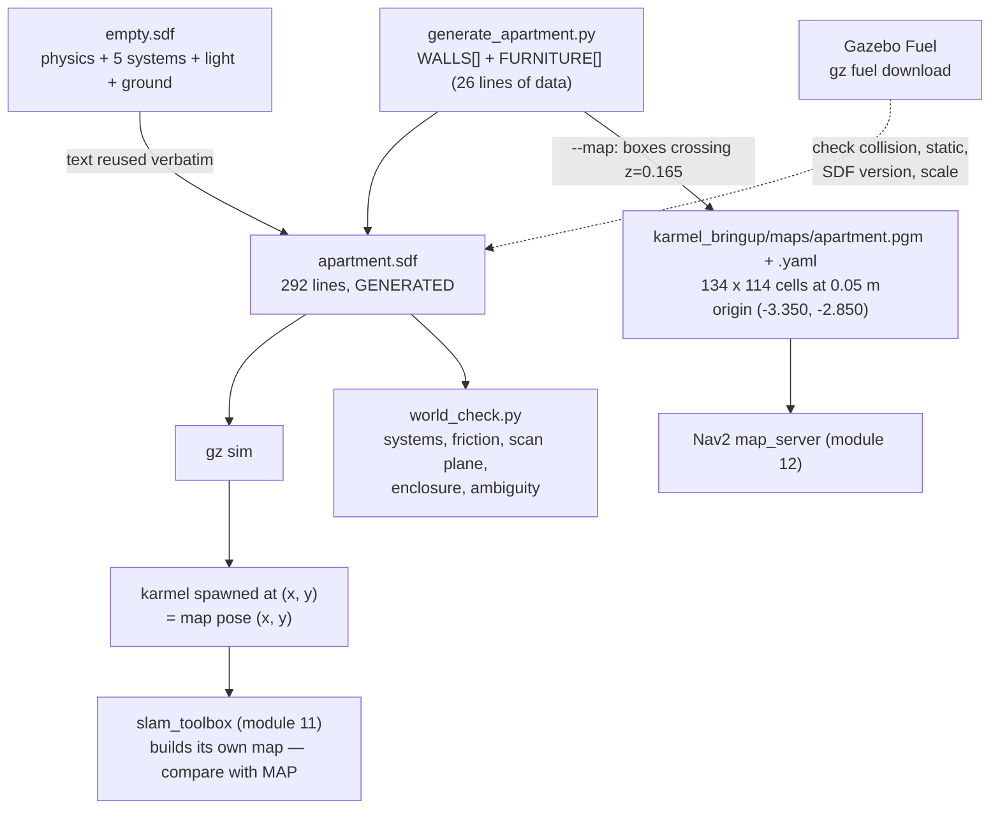

# 06.08 — Building worlds for mapping and navigation labs

<!-- glance:start -->
<!-- generated by tools/build.py from curriculum/syllabus.yaml — edit the syllabus, not this block -->

| | |
|---|---|
| **Track** | Main path |
| **Difficulty** | Beginner |
| **Time** | 50 min |
| **Hardware** | none |
| **Software** | gazebo |
| **Prerequisites** | [06.03 Gazebo basics — worlds, models, SDF and the gz tools](06.03-gazebo-basics.md) |
| **Skip if** | You can build an apartment-like world with obstacles. |

<!-- glance:end -->

## What you will learn

- Compose an SDF world from static models, and say what every element in it is for.
- Generate a world from data instead of editing XML by hand, and get a ground-truth map out of the same source.
- Pull models from Fuel, and check the four things that make a downloaded model unusable.
- Apply a checklist for a world that is actually worth testing SLAM and navigation in — and run it as a script.
- Recognise, and measure, a world that will make scan matching slide.

## Why it matters

Modules 11 and 12 are about building maps and navigating them. They are only as honest as the world you test them in, and the default
instinct — a big empty room with a few boxes — produces a world in which everything works and nothing is learned.

Real apartments have the things that break robots: doorways barely wider than the robot, a table whose top a 2D LiDAR cannot see and
whose legs it can, a glass balcony door, a corridor with no features, furniture that moves between runs. A test world is a set of
hypotheses about what your robot will meet. Building one deliberately is cheap; discovering the gap on the real floor is not.

There is also a practical reason to care now: every lab from here to the end of module 12 spawns karmel into
`karmel_gazebo/worlds/apartment.sdf`, and the ground-truth map in `karmel_bringup/maps/` comes from the same source file. If you
change the world, you regenerate the map, and everything downstream stays consistent. Understanding that pipeline is the difference
between "the map is wrong" and a two-second fix.

<!-- prereqs:start -->
## Prerequisites

You need these first:

- [06.03 Gazebo basics — worlds, models, SDF and the gz tools](06.03-gazebo-basics.md)

### Optional prerequisite links

None.

Check your readiness: `python course.py why 06.08`
<!-- prereqs:end -->

## Concept

An SDF world is four kinds of thing, and nothing else:

```text
  <physics>     how time advances            max_step_size, real_time_factor
  <plugin>      the systems that DO things   Physics, UserCommands, SceneBroadcaster, Sensors, Imu
  <light>       what the renderer sees by    a directional "sun" is enough
  <model>       the stuff                    static (walls, furniture) or dynamic (a ball, a door)
```

The one that surprises people is `<plugin>`. A Gazebo world with no systems loaded is an inert scene graph: gravity does nothing,
nothing can be spawned into it, no sensor produces data. [06.03](06.03-gazebo-basics.md) introduced them; the rule for this course is
that **every karmel world loads all five**, because the robot brings a LiDAR, a camera and an IMU, and because `ros_gz_sim create`
spawns through the `UserCommands` system.

A `<model>` is a small tree: model → link → any number of `<collision>` and `<visual>` elements, each with its own `<pose>` and
`<geometry>`. Two facts do most of the work:

- **`<static>true</static>` costs nothing.** Walls and furniture have no inertia, are never integrated, and never move. A world of
  200 static boxes is cheap; a world of 20 dynamic ones is not.
- **Many collisions can share one link.** The apartment's nine walls are nine `<collision>`/`<visual>` pairs inside a single link
  called `walls`. Fewer bodies, fewer poses for the physics engine to track, one thing to move if you shift the whole apartment.

The other idea in this lesson is that **XML is an output format, not a source format**. karmel's apartment is 292 lines of SDF
generated from 26 lines of Python data:

```python
WALLS = [('north', -3.0, 2.5, 3.0, 2.5), ('mid_2', 0.5, -0.8, 0.5, 1.2), …]
FURNITURE = [('sofa', -1.75, 2.05, 0.0, 1.8, 0.7, 0.45, 0.0, (0.35, 0.3, 0.6)), …]
```

Moving a wall is editing one tuple. And because the same data describes the geometry, the same script can emit the **ground-truth
occupancy map** that Nav2 and your SLAM comparisons need — guaranteed consistent with the world, which a hand-drawn PGM never is.

> [!TIP]
> **Ask your teacher:** "Design a test world for a specific failure I care about — a doorway my robot barely fits through — and tell me what width to make it, given karmel's footprint and Nav2's inflation radius."

## Technical explanation

### Level 1 — Reading the apartment

[`generate_apartment.py`](../labs/ros2_ws/src/karmel_gazebo/worlds/generate_apartment.py) describes a 6 × 5 m flat:

```text
    y=2.5 +--------------------------+-------------------+
          |  sofa                    D   wardrobe  bed   |
          |  coffee table            |                   |
          |                          +----+   D   +------+  y=0.5
          |  tv       (robot spawn)  |    fridge         |
          |                          D       dining  counter
          |      bookshelf           |       table       |
    y=-2.5 +-------------------------+-------------------+
         x=-3                     x=0.5                 x=3
```

Three design decisions in it are worth copying:

**Doors are gaps, not models.** The wall between the living room and the rest is three segments — `mid_1`, `mid_2`, `mid_3` — with
gaps at $y \in [-1.6, -0.8]$ and $y \in [1.2, 2.0]$. Each gap is 0.80 m. karmel's footprint radius is 0.16 m, so the clearance per
side is $(0.80 - 0.32)/2 = 0.24$ m: passable, but not so easily that Nav2's inflation layer is irrelevant
([12.04](../12-navigation/12.04-costmaps.md)). Choose your door widths from your robot's footprint, deliberately.

**The dining table is a top on four legs, not a box.** The top sits at $z \in [0.70, 0.74]$; the legs are 5 cm square and run from the
floor to 0.72 m. karmel's scan plane is at 0.165 m, so the LiDAR sees **four 5 cm posts** and nothing else. That is the classic
"invisible table": the robot maps four dots, plans a path between them, and drives its LiDAR mast into the tabletop. It is in the
world on purpose, for [12.04](../12-navigation/12.04-costmaps.md).

**One open door leaf.** `kitchen_door` is a 0.80 × 0.04 m panel hinged at the doorway and swung into the kitchen. It is a thin
obstacle that appears in the map at a particular angle — exactly the kind of feature that makes localization work and that changes
between runs in real life.

### Level 2 — Generating the world and its map

```bash
cd ~/labs/ros2_ws/src/karmel_gazebo/worlds
python3 generate_apartment.py > apartment.sdf                            # the world
python3 generate_apartment.py --map ../../karmel_bringup/maps > apartment.sdf   # world + ground-truth map
gz sdf -k apartment.sdf                                                  # "Valid."
```

The generator reuses `empty.sdf`'s physics, systems, light and ground plane verbatim — it slices the text between `<world name=…>` and
`</world>` — so there is exactly one definition of "what a karmel world contains", and a new world cannot forget the `Imu` system.

The map is the interesting half. `write_map()` walks the same box list, keeps only the boxes whose vertical span crosses the scan
plane (`scan_height=0.165`), and rasterises them into a `map_server`-format trinary PGM:

| | value | computed as |
|---|---|---|
| resolution | 0.05 m/cell | chosen; 5 cm is the course default for Nav2 and slam_toolbox |
| width | 134 cells | $(6.0 + 0.1 + 2 \times 0.3)/0.05$ — apartment + wall thickness + 0.3 m margin |
| height | 114 cells | $(5.0 + 0.1 + 2 \times 0.3)/0.05$ |
| origin | $[-3.350, -2.850, 0]$ | bottom-left corner in the Gazebo world frame |
| pixel values | 0 occupied, 254 free, 205 unknown | `mode: trinary`, `occupied_thresh 0.65`, `free_thresh 0.25` |

Because the map's frame *is* the Gazebo world frame, a robot spawned at $(x, y)$ starts at map pose $(x, y)$ — which is what makes
`navigation.launch.py initial_pose:=true x:=-0.8 y:=-0.5` work without a human clicking in RViz. That alignment is a choice; make it
on purpose, and write it down where the next person will find it.

Note what the map contains that the *SLAM* map will not: the dining tabletop is excluded (it is above the scan plane) but the four
legs are in, so the ground-truth map shows four dots where a human would draw a table. The ground truth is the truth about *what a
2D LiDAR at 16.5 cm can see*, not about the room.

### Level 3 — Fuel: other people's models

Gazebo Fuel is a public model library, and `gz sim` can reference a model by URL. To inspect one before trusting it, download it:

```bash
gz fuel download -u "https://fuel.gazebosim.org/1.0/OpenRobotics/models/Table"
ls ~/.gz/fuel/fuel.gazebosim.org/openrobotics/models/table/4/
#   model.config  model.sdf  model-1_2.sdf  model-1_3.sdf  model-1_4.sdf  Table_Diffuse.jpg  thumbnails/
```

Four things to check on every downloaded model, before it is in your world:

1. **Collision geometry.** Open `model.sdf` and look for `<collision>`. This table is well behaved — a box for the top, four
   cylinders for the legs — but plenty of Fuel models use the full visual mesh as the collision mesh, which is expensive and badly
   conditioned ([06.05](06.05-robot-in-gazebo.md)). Replace it with primitives or do not use the model.
2. **`<static>`.** This one is `<static>true</static>`. A non-static model needs mass and inertia, and if the author guessed them
   your simulation will jitter.
3. **SDF version and legacy content.** `<sdf version="1.5">`, with a Gazebo-Classic `<material><script>` alongside a PBR block, and an
   `albedo_map` pointing at an `https://` URL. It renders, but the old material script is dead weight and the remote texture means
   the model needs the network the first time it is used.
4. **Scale and origin.** The tabletop is at $z = 1.0$ m. Sitting a 1 m table in karmel's apartment gives the LiDAR four 4 cm legs and
   nothing else — the invisible-table problem again, now imported. Measure before you place.

Fuel is a fine way to make a world *look* real. It is a poor way to make one *behave* realistically, unless you read every model you
import.

### Level 4 — The checklist, as a script

A world is good for SLAM and navigation labs when all of this is true. The first five are static properties of the file; the last two
are properties of the *space*, and are the ones people never check.

| # | Requirement | Why | How to check |
|---|---|---|---|
| 1 | one `<world>`, valid SDF | anything else confuses `gz sim` | `gz sdf -k world.sdf` |
| 2 | `max_step_size` ≤ 1 ms | wheel contacts jitter at 10 ms | grep, or `world_check.py` |
| 3 | all five systems loaded | no Physics/UserCommands/Sensors = no robot, no spawn, no scan | `world_check.py` |
| 4 | ground plane with $\mu \ge 0.2$ | the acceleration limit needs $\mu \ge a/g$ | `world_check.py` |
| 5 | at least one light | the simulated camera renders black | `world_check.py` |
| 6 | **features at the scan plane**, and enclosed free space | a robot inside an unbounded world grows an unbounded costmap; obstacles above or below 0.165 m are invisible | `world_check.py` |
| 7 | **not translation-ambiguous** | if moving 10 cm does not change the scan, scan matching cannot tell where you are | `world_check.py` |

Requirement 7 deserves the maths. Scan matching estimates your pose by finding the transform that best aligns a new scan with the map.
It can only do that if the scan *changes* when you move. Define, for a pose $\mathbf{p}$ and a small displacement $\delta$ in
direction $\alpha$, the mean change in the rays that return a finite range in both scans:

$$S(\mathbf{p}, \alpha) = \frac{1}{|R|}\sum_{i \in R} \bigl| r_i(\mathbf{p} + \delta \hat{u}_\alpha) - r_i(\mathbf{p}) \bigr|$$

and score the pose by its *worst* direction, $\min_\alpha S(\mathbf{p}, \alpha)$. In an ordinary room, moving 10 cm changes the two
opposite walls by 10 cm each and the average over all rays is of the order of $2\delta/\pi \approx 0.064$ m. In a long corridor, a
move *along* the corridor changes only the handful of rays pointing at the two distant end walls, and the average collapses.

[`06-simulation/code/gazebo/world_check.py`](code/gazebo/world_check.py) computes exactly this, in pure Python with no Gazebo: it
flattens every collision box that crosses the scan plane into a 2D rectangle, flood-fills to find the *enclosed* free space (so it
does not sample the outside of your apartment's walls), and raycasts. Measured:

| world | translation-ambiguous free area |
|---|---|
| `apartment.sdf` | **0.0 %** |
| `corridor.sdf` (a 10 × 1.4 m empty corridor) | **82.6 %** |

That is a number you can put in a test, and [`corridor.sdf`](code/gazebo/corridor.sdf) exists so you can see the metric fire.

## Diagram



What the LiDAR sees, in a section through the dining table:

```text
   z
   |     ┌──────────────────────┐  0.74   tabletop: above the scan plane, INVISIBLE
   |     └──────────────────────┘  0.70
   |       ║                ║            legs: 5 cm square, cross the plane
   | - - - ║ - - - - - - - -║- - - 0.165  <-- karmel's scan plane
   |       ║                ║
   +───────╨────────────────╨──────  0     floor
           the map shows four dots, the robot plans between them,
           and the mast hits the tabletop. (12.04)
```

## Code

Check every world you have, in one second, on any machine:

```bash
py 06-simulation/code/gazebo/world_check.py \
   labs/ros2_ws/src/karmel_gazebo/worlds/*.sdf 06-simulation/code/gazebo/*.sdf
```

Regenerate the apartment and its map after editing the data:

```bash
cd labs/ros2_ws/src/karmel_gazebo/worlds
python3 generate_apartment.py --map ../../karmel_bringup/maps > apartment.sdf
gz sdf -k apartment.sdf
cd ~/labs/ros2_ws && colcon build --packages-select karmel_gazebo karmel_bringup
```

Run the robot in a world of your own, without installing it anywhere (absolute paths pass straight through):

```bash
ros2 launch karmel_bringup robot.launch.py sim:=true headless:=true enable_camera:=false \
  world:=$PWD/06-simulation/code/gazebo/corridor.sdf x:=-4.0
python3 tools/drive_pattern.py --pattern "0.25,0,8;0,0,1" --ros-args -p use_sim_time:=true
```

The smallest useful world addition — a box that is a wall — is five lines inside an existing static model's link:

```xml
<collision name="partition_collision">
  <pose>1.5 0 0.5 0 0 0</pose>
  <geometry><box><size>0.1 2.0 1.0</size></box></geometry>
</collision>
<visual name="partition_visual">
  <pose>1.5 0 0.5 0 0 0</pose>
  <geometry><box><size>0.1 2.0 1.0</size></box></geometry>
  <material><ambient>0.93 0.9 0.82 1</ambient><diffuse>0.93 0.9 0.82 1</diffuse></material>
</visual>
```

Note the pose convention: `<pose>` positions the **centre** of the box, so a 1.0 m tall wall standing on the floor has $z = 0.5$.
Half the "my wall is buried in the floor" bugs are this.

## Exercise

No hardware. `world_check.py` is pure Python and runs on your laptop; the Gazebo parts need the course Docker image.

### Exercise 06.08-E1 — Read the world, then check it `[simulation]`

Run `world_check.py` over all five worlds in the repository (`empty`, `apartment`, `tabletop`, `first_world`, `slippery_room`).
For each ERROR and WARN, decide: real problem, or correct for that world's purpose? Two of them are *deliberate* faults belonging to
earlier lessons — name them and say which lesson each belongs to.

Then answer from `apartment.sdf` itself: how many collisions cross the scan plane, how many are entirely above it, and which model
does the "above" one belong to?

### Exercise 06.08-E2 — Move a wall, regenerate everything `[coding]`

In a scratch copy of `generate_apartment.py`, widen the kitchen doorway from 0.80 m to 1.20 m and move the bookshelf to the opposite
wall. Then:

1. regenerate the SDF and the map;
2. `gz sdf -k` the result, and run `world_check.py`;
3. verify the map dimensions and origin are unchanged (they should be — you did not change the outer walls);
4. spawn karmel and confirm from `/scan` that the wider gap is where you put it.

Finally: what would have gone wrong if you had edited `apartment.sdf` directly?

### Exercise 06.08-E3 — Import a Fuel model and audit it `[simulation]`

Download the OpenRobotics `Table` model and answer, from the files:

1. Is it static? What would you have to add if it were not?
2. Is the collision geometry primitives or a mesh? Quote the evidence.
3. How tall is the top, and what would karmel's 2D LiDAR see if you put it in the apartment?
4. Which element in the file needs the network, and when?

Then place it in a scratch world, run `world_check.py`, and explain the result in terms of the scan plane.

### Exercise 06.08-E4 — Make the corridor mappable `[predict]`

`corridor.sdf` scores 82.6 % translation-ambiguous. **Predict first:** which of these three changes will reduce it the most, and by
roughly how much?

- (a) making the corridor half as long;
- (b) adding four 0.3 × 0.3 m pillars at irregular intervals along one wall;
- (c) adding a 2 × 2 m room opening off the middle of the corridor.

Then implement all three as separate worlds, measure each with `world_check.py --grid 0.4`, and rank them. Write one sentence
explaining the winner in terms of the metric's definition. Bonus: spawn karmel in the worst and the best and compare the `/scan`
returned at two poses 1 m apart.

### Exercise 06.08-E5 — Design a world for a failure you care about `[design]`

Pick one real hazard karmel will meet in a Tel Aviv apartment — a glass balcony door, a 2 cm floor threshold, a dark rug, a chair
that moves between runs, a mirrored wardrobe. Design a world that contains it. State:

1. the SDF you would write (geometry and materials);
2. what the simulator will and will **not** reproduce about that hazard (use the Level 4 list in [06.07](06.07-simulated-sensors-and-noise.md));
3. what you would therefore still have to test on the real robot;
4. whether `world_check.py` would flag anything, and whether it should.

### Exercise 06.08-E6 — Add a check to the checker `[coding]`

`world_check.py` does not check door widths. Add one: find every gap between scan-plane rectangles that is narrower than a
configurable threshold, and warn if it is narrower than karmel's footprint diameter plus a margin. Test it on `apartment.sdf` (whose
doors are 0.80 m) and on a copy with a 0.30 m door. Then extend the module-06 test file with a test that fails if `apartment.sdf`
ever grows a door karmel cannot fit through.

## Expected result

`world_check.py` output captured 2026-09-19 on Windows 11 with Python 3.14; the Gazebo runs in the course Docker image
(`karmel-ros:jazzy`, headless).

**06.08-E1.**

```text
== labs/ros2_ws/src/karmel_gazebo/worlds/apartment.sdf
   .  world name: 'apartment'
   .  0 collision(s) entirely below and 1 entirely above the 0.165 m scan plane — invisible to a 2D LiDAR
   .  25 collision box(es) cross the scan plane
   .  39 enclosed free sample points (0.5 m grid), 2808 rays
   .  translation-ambiguous area: 0.0% (good: features everywhere)
   => PASS

== labs/ros2_ws/src/karmel_gazebo/worlds/empty.sdf
   ?  WARN  nothing at the 0.165 m scan plane: every ray returns inf
   => PASS with 1 warning(s)

== labs/ros2_ws/src/karmel_gazebo/worlds/tabletop.sdf
   .  4 collision(s) entirely below and 0 entirely above the 0.165 m scan plane
   .  3 collision box(es) cross the scan plane
   ?  WARN  ground plane has no <mu>: the engine default may not be what you think
   ?  WARN  no enclosed free space: every free grid point is reachable from outside the world.
            Fine for a physics demo, wrong for a SLAM or navigation lab
   => PASS with 2 warning(s)

== 06-simulation/code/gazebo/first_world.sdf
   !  ERROR missing system plugin gz::sim::systems::Sensors
   !  ERROR missing system plugin gz::sim::systems::Imu
   => FAIL with 3 warning(s)

== 06-simulation/code/gazebo/slippery_room.sdf
   !  ERROR ground friction mu = 0.01 — the wheels will spin in place
   => FAIL with 2 warning(s)
```

The two deliberate faults: `first_world.sdf` has no sensor systems because [06.03](06.03-gazebo-basics.md) introduces worlds *before*
the robot has sensors, and `slippery_room.sdf`'s $\mu = 0.01$ is the whole point of [06.05](06.05-robot-in-gazebo.md)'s slip
experiment. A checker that did not flag them would be useless; a checker whose output you cannot interpret is worse than none. The
`empty.sdf` and `tabletop.sdf` warnings are also correct and also fine — neither is a SLAM world.

Apartment: 25 collisions cross the scan plane, 1 is entirely above it — `dining_top`, at $z \in [0.70, 0.74]$.

**06.08-E2.** `gz sdf -k` prints `Valid.`; the map stays 134 × 114 with origin $[-3.350, -2.850, 0]$, because those come from the
outer walls and the fixed 0.3 m margin. `world_check.py` still passes. Editing `apartment.sdf` directly "works" until the next person
runs the generator, which overwrites it — the file's first line says `GENERATED by generate_apartment.py (edit that script, not this
file)`. Regenerating with no changes is byte-identical to the committed file, which is what makes that claim checkable:

```text
$ python3 generate_apartment.py > /tmp/apt.sdf && diff -q /tmp/apt.sdf apartment.sdf
(no output — byte-identical)
```

**06.08-E3.** The model is 936 KB in `~/.gz/fuel/fuel.gazebosim.org/openrobotics/models/table/4/`:

```xml
<sdf version="1.5">
    <model name="Table">
        <static>true</static>
        <link name="link">
            <collision name="surface">
                <pose>0 0 1.0 0 0 0</pose>
                <geometry><box><size>1.5 0.8 0.03</size></box></geometry>
                <surface><friction><ode><mu>0.6</mu><mu2>0.6</mu2></ode></friction></surface>
            </collision>
            …
            <collision name="front_left_leg">
                <geometry><cylinder><radius>0.02</radius><length>1.0</length></cylinder></geometry>
```

Answers: (1) static, so no mass or inertia is needed; making it dynamic would require an `<inertial>` block on the link, computed from
the geometry. (2) Primitives — one box and four cylinders — which is the good case. (3) The top is at 1.0 m with 2 cm legs; karmel's
LiDAR at 0.165 m would see four 4 cm circles and map a table as four dots, the same trap as the apartment's dining table but worse.
(4) The visual's `<pbr><metal><albedo_map>` points at `Table_Diffuse.jpg` on the Fuel server by absolute URL — needed the first time the
model is rendered, cached afterwards.

**06.08-E4.** All three help; the ranking is (b) ≈ (c) > (a). Pillars win per unit of effort because the metric measures whether a
10 cm move changes the *rays*, and irregularly spaced pillars change many rays for any move along the corridor. Halving the length
helps least: the middle of a 5 m corridor is still a corridor — it reduces the *fraction* of ambiguous area (there is proportionally
more near-the-ends area) without fixing the middle. A side room fixes the poses near its opening and helps the far ends not at all.
Baseline for comparison:

```text
$ py 06-simulation/code/gazebo/world_check.py 06-simulation/code/gazebo/corridor.sdf --grid 0.4
   .  4 collision box(es) cross the scan plane
   .  46 enclosed free sample points (0.4 m grid), 3312 rays
   ?  WARN  82.6% of the free area is translation-ambiguous at 10 cm
   => PASS with 1 warning(s)
```

The corridor world is usable: spawned at $x = -4.0$ and commanded 0.25 m/s for 8 s, `/odom` reports $x = 2.010$ m of travel and
Gazebo's ground truth puts the robot at $x = -1.99$ — the robot drives fine. It is *localization* that will fail there, not driving.

**06.08-E5.** A good answer for a glass balcony door: a thin box with a high-specular, low-alpha material; the simulator will
reproduce the geometry and the camera's view through it and will **not** reproduce the LiDAR shooting through it (06.07, E4:
identical ranges off glass and off white), so the real robot will map an open balcony where the sim maps a wall. What must be tested
on the robot: whether the LiDAR sees the door at all, and whether the costmap clears the area behind it.
`world_check.py` would *not* flag it — and arguably should: a "material the LiDAR model cannot represent" warning would be a
reasonable addition, which is E6's territory.

**06.08-E6.** On `apartment.sdf` your new check should find the two 0.80 m interior doors and the 0.80 m bedroom door and pass them
(karmel's footprint diameter is 0.32 m; 0.80 m leaves 0.24 m per side). On the 0.30 m copy it must warn. The regression test belongs
next to the existing ones in `06-simulation/code/test_sim_code_control.py`, which already asserts that `apartment.sdf` passes with no
warnings — so a too-narrow door would turn that test red as well.

## Troubleshooting

### Symptom: `gz sim world.sdf` opens an empty scene, or the robot falls for ever

1. `gz sdf -k world.sdf` — valid SDF? An unclosed tag gives a scene with everything after it missing.
2. Is there a `<model name="ground_plane">` with a `<collision>`? A visual-only floor is not a floor.
3. Is the `Physics` system loaded? Without it nothing moves — which looks like a frozen simulation, not a missing plugin.
4. `world_check.py` answers all three in one go.

### Symptom: the robot spawns inside a wall, or half in the floor

`<pose>` positions the **centre** of a box. A 1 m tall wall on the floor is at $z = 0.5$; a 0.45 m sofa is at $z = 0.225$. Check the
spawn coordinates against the world's free space — `world_check.py` prints the enclosed free sample points, and if your spawn is not
among them, it is not free.

### Symptom: SLAM builds a map that slides, stretches or folds back on itself

Before blaming slam_toolbox, measure the world:

1. `world_check.py --grid 0.4` — what fraction of the free area is translation-ambiguous?
2. If it is high, the world is the problem. Add features (E4) or accept that this is a hard case and test the odometry fusion that is
   supposed to carry you through it ([10](../10-localization/10.02-uncertainty-gaussians.md)).
3. If it is low, the world is fine; look at the scan rate, the odometry, and the TF tree instead.

### Symptom: the map and the world disagree

Regenerate: `python3 generate_apartment.py --map ../../karmel_bringup/maps > apartment.sdf`, then rebuild the workspace so the
installed copies update. Editing either file by hand guarantees this symptom eventually. If they still disagree, check `scan_height`
in the generator against `sensors.lidar.z_m + drive.wheel_radius_m` in `karmel.yaml`.

### Symptom: a Fuel model appears in the GUI but the robot drives through it

No `<collision>`, or a collision on a link that is not where the visual is. `gz sdf -p model.sdf | grep -A3 collision`. Some Fuel
models are visual-only decorations.

## Common mistakes

- **Editing a generated file.** `apartment.sdf` says `GENERATED` on line 2. Your change survives until the next regeneration.
- **Positioning boxes by their bottom face.** `<pose>` is the centre.
- **Building a big empty room.** It is the easiest world to build and the least informative one to test in.
- **Forgetting a system plugin in a hand-written world.** No `Sensors` means no `/scan`, with no error message; no `UserCommands`
  means `ros_gz_sim create` hangs for ever.
- **Non-static furniture.** Every sofa becomes a rigid body the solver integrates, and a badly guessed inertia makes it explode.
- **A ground plane with no `<mu>`.** You are then relying on an engine default that you have not read.
- **Importing a Fuel model without reading it.** Mesh collisions, 1 m tables, remote textures, non-static decorations.
- **Assuming your SLAM map should match the ground-truth map.** The ground truth is what a 2D LiDAR at 16.5 cm can see — tabletops are
  not in it, and should not be.

## Knowledge check

1. Which five systems must every karmel world load, and what breaks if each is missing?
   <details><summary>Answer</summary>

   `Physics` (nothing moves), `UserCommands` (`ros_gz_sim create` hangs — you cannot spawn the robot), `SceneBroadcaster` (the GUI
   shows nothing; harmless headless), `Sensors` (no `/scan`, no camera), `Imu` (no `/imu`). The first two and the last two are the
   ones that produce confusing failures, because there is no error message.
   </details>

2. Numerical: the apartment is 6.0 × 5.0 m with 0.1 m walls and a 0.3 m margin, at 0.05 m/cell. What are the map's width, height and origin?
   <details><summary>Answer</summary>

   Width $= (6.0 + 0.1 + 0.6)/0.05 = 134$ cells; height $= (5.0 + 0.1 + 0.6)/0.05 = 114$ cells. The origin is the bottom-left corner
   in world coordinates: $x = -3.0 - 0.05 - 0.3 = -3.350$, $y = -2.5 - 0.05 - 0.3 = -2.850$.
   </details>

3. Why is the dining table modelled as a top plus four legs instead of one solid box?
   <details><summary>Answer</summary>

   Because a solid box would be visible to a 2D LiDAR as a solid obstacle, and a real table is not. The legs cross the 0.165 m scan
   plane and the top does not, so the robot maps four dots and will happily plan a path under the table — the exact failure that
   motivates 3D perception and costmap layers in [12.04](../12-navigation/12.04-costmaps.md).
   </details>

4. Predict: you build a 10 × 1.4 m empty corridor and run SLAM in it. What does the map look like, and what does `world_check.py` say in advance?
   <details><summary>Answer</summary>

   The map stretches or compresses along the corridor axis and may fold back, because scan matching cannot determine position along a
   direction in which the scan does not change. `world_check.py` reports about 83 % of the free area as translation-ambiguous at
   10 cm, before you run anything.
   </details>

5. You download a Fuel model and your simulation drops from real-time factor 0.9 to 0.2. What is the first thing to look at?
   <details><summary>Answer</summary>

   The collision geometry. A model whose `<collision>` is the full visual mesh forces the physics engine to do mesh queries on every
   step. Check with `grep -A3 collision model.sdf`; replace with primitives. (If the collisions are primitives, look next at texture
   size and triangle count in the visual, which cost the renderer rather than the solver.)
   </details>

6. Why does the ground-truth map's frame coincide with the Gazebo world frame, and what would break if it did not?
   <details><summary>Answer</summary>

   So that a robot spawned at Gazebo $(x, y)$ is at map pose $(x, y)$ — which lets `navigation.launch.py initial_pose:=true` set
   AMCL's initial pose from the spawn arguments, and lets you compare a SLAM map with the truth without aligning them first. If the
   frames differed you would need a known transform everywhere, and every comparison would silently include your alignment error.
   </details>

7. Debugging: your new world loads, the robot spawns, but every `/scan` ray is `inf`. Give two hypotheses and the check for each.
   <details><summary>Answer</summary>

   (1) There is nothing at the scan plane: your walls are shorter than 0.165 m, or you positioned boxes by their bottom face so they
   are buried — `world_check.py` reports "nothing at the 0.165 m scan plane". (2) The sensor is not producing at all: the `Sensors`
   system is missing or you are headless without `--headless-rendering` — check `gz topic -l` for a `/scan` on the Gazebo side.
   </details>

8. What is the argument for generating a world from Python data rather than writing SDF by hand?
   <details><summary>Answer</summary>

   One source of truth for the geometry, which can emit the world, the ground-truth map, and anything else derived from it; changes
   are one-line edits instead of XML surgery; the result is reproducible and diffable; and shared boilerplate (physics, systems,
   light, ground plane) is reused from `empty.sdf` rather than copy-pasted, so a new world cannot forget a system plugin.
   </details>

## Practical challenge

Build **your own apartment** — the one you actually live in — as a generated world with a ground-truth map, and prove it is a good
test world.

Acceptance criteria:

- A generator script (start from `generate_apartment.py`) describing your flat's rooms, doors and the furniture that a LiDAR at
  16.5 cm would actually see, measured with a tape measure to ±5 cm. At least three rooms, two doorways and one object that crosses
  the scan plane only partially (a table, a chair, a radiator).
- It emits both the SDF and a `map_server`-format map aligned to the Gazebo world frame, and regenerating twice is byte-identical.
- `gz sdf -k` says `Valid.` and `world_check.py` passes with **no warnings**, including under 10 % translation-ambiguous area. If your
  real flat has a genuinely ambiguous corridor, document it and say what you would add in simulation and what you would rely on
  instead on the real robot.
- karmel spawns in it, drives a fixed pattern headless without collisions, and `/scan` at three named poses matches the tape-measure
  distances to within 5 cm (report the table).
- One paragraph on the doorways: measure the narrowest one, compare it with karmel's footprint diameter, and say what Nav2 inflation
  radius that implies ([12.04](../12-navigation/12.04-costmaps.md)).

## You can skip this if…

You can answer knowledge-check questions 1, 3 and 4 without looking, and you have already built an SDF world with rooms, doorways and
furniture, produced a ground-truth map aligned to it, and run SLAM in it.

`python course.py skip 06.08 --reason "I can build an apartment-like world with obstacles and a matching ground-truth map"`

## Go deeper

- http://sdformat.org/spec — the SDF specification: every element, with the version it appeared in. The reference to keep open while writing a world.
- https://gazebosim.org/docs/harmonic/sdf_worlds/ — the Harmonic tutorial on building a world from scratch, including the system plugins.
- https://github.com/gazebosim/gz-fuel-tools — `gz fuel` itself: the cache layout, versioning, and the REST API behind the model library at app.gazebosim.org. Browse there, then read the model's `model.sdf` before you use it.
- https://gazebosim.org/docs/harmonic/fuel_insert/ — inserting Fuel models, and how the local cache and versioning work.
- https://github.com/ros-navigation/navigation2/tree/main/nav2_map_server — the map format your ground-truth map has to match: the PGM plus the YAML with `image`, `resolution`, `origin`, `negate` and the two thresholds.
- https://github.com/SteveMacenski/slam_toolbox — what will consume your world in module 11; its README is candid about which environments are hard.
- https://www.ros.org/reps/rep-0103.html — REP-103: units and coordinate conventions, so your world's axes mean what everyone else's mean.

## Progress checkpoint

- [ ] I can write an SDF world with the systems, physics, light and ground plane karmel needs.
- [ ] I can generate a world and its ground-truth map from one source of data, and regenerate them reproducibly.
- [ ] I can audit a Fuel model before putting it in my world.
- [ ] I can apply the seven-point checklist, and run it as a script.
- [ ] I can recognise and measure a world in which scan matching will slide.

`python course.py complete 06.08` (exercises done) · `python course.py master 06.08` (challenge done) · `python course.py struggle 06.08 "what was hard"`

Next: [06.09 — One codebase for simulation and the real robot](06.09-same-code-sim-and-real.md): one launch argument, two targets, and
the things that must never diverge between them.
