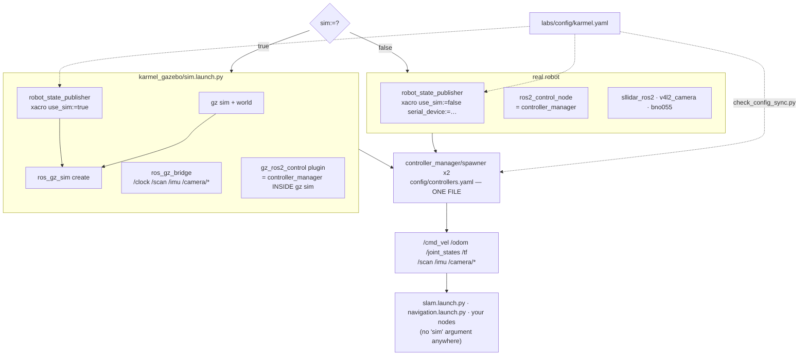

# 06.09 — One codebase for simulation and the real robot

<!-- glance:start -->
<!-- generated by tools/build.py from curriculum/syllabus.yaml — edit the syllabus, not this block -->

| | |
|---|---|
| **Track** | Main path |
| **Difficulty** | Intermediate |
| **Time** | 1 h |
| **Hardware** | Stage 1 robot: Pi 5, Pico, encoder motors, driver, chassis, battery, distance sensors (stage 1) |
| **Software** | ros2 |
| **Prerequisites** | [06.06 ros2_control — the same controllers in simulation and on the real robot](06.06-ros2-control.md)<br>[04.16 Your physical robot in ROS 2 — cmd_vel in, telemetry out](../04-ros2/04.16-your-robot-as-ros2-node.md) |
| **Skip if** | One launch argument switches your stack between Gazebo and the robot. |

<!-- glance:end -->

## What you will learn

- Bring up karmel in Gazebo or on hardware with one launch file and one argument, and explain every node that differs.
- Propagate `use_sim_time` correctly, and recognise the four ways it goes wrong.
- Name the things that must never diverge between the two targets, and enforce each with a check.
- Split configuration into "shared" and "per-target" deliberately, instead of by accident.
- Run both targets in CI on a machine with no robot attached.

## Why it matters

[06.06](06.06-ros2-control.md) made the *controllers* identical. That is the hard half. The easy half — one launch file, one set of
topic names, one configuration source — is where projects actually rot, because each divergence arrives as a reasonable-looking local
decision:

- "the real robot needs a different `cmd_vel` timeout, I'll add a second YAML" — now the limits differ and your Nav2 tuning is
  target-specific;
- "the simulation publishes `/scan` but the driver publishes `/laser_scan`, I'll remap in one launch file" — now every node
  downstream needs to know which target it is on;
- "the sim robot's wheel radius is 0.045 but I measured 0.0447 on the real one, I'll edit `controllers.yaml`" — now odometry is
  scaled differently in the two worlds and nothing tells you.

None of these breaks anything on the day it lands. All of them make "I tested it in simulation" quietly meaningless, and you find out
in module 12 when Nav2 behaves differently on the floor than on your laptop and you have no idea which of forty differences is
responsible.

The discipline is the one you already apply to software: **one implementation, one configuration source, a seam at exactly one place,
and a test that fails when someone opens a second seam.** This lesson is that seam, and the tests that guard it.

<!-- prereqs:start -->
## Prerequisites

You need these first:

- [06.06 ros2_control — the same controllers in simulation and on the real robot](06.06-ros2-control.md)
- [04.16 Your physical robot in ROS 2 — cmd_vel in, telemetry out](../04-ros2/04.16-your-robot-as-ros2-node.md)

### Optional prerequisite links

None.

Check your readiness: `python course.py why 06.09`
<!-- prereqs:end -->

## Concept

karmel's stack has exactly **three** places where simulation and hardware differ. Everything else is shared.

```text
                        sim:=true                          sim:=false
  ───────────────────────────────────────────────────────────────────────────────────
  1. body/plant     Gazebo physics                     motors, floor, battery
  2. hardware       gz_ros2_control/GazeboSimSystem    karmel_hardware/KarmelSystem
     component      (joint velocities in gz-sim)       ("V seq l r" over USB serial)
  3. sensors        gz sensors + ros_gz_bridge         sllidar_ros2, v4l2_camera, bno055
  ─────────────────── everything above this line is identical ───────────────────────
     controllers    joint_state_broadcaster + diff_drive_controller
     config         karmel_bringup/config/controllers.yaml   (one file, both targets)
     topics         /cmd_vel (TwistStamped), /odom, /joint_states, /scan, /imu, /camera/*
     frames         odom -> base_footprint -> base_link -> {laser, imu_link, camera_*, wheels}
     everything     SLAM, Nav2, your code, RViz configs, behaviour trees
     else
```

Item 2 is one line of xacro ([06.06](06.06-ros2-control.md)). Item 3 is a pair of launch groups. Item 1 is physics, and it is the
subject of [06.10](06.10-sim-to-real-gap.md) — you cannot make it identical, only understood.

The second idea is **where configuration lives**. There is one physical description of the robot,
[`labs/config/karmel.yaml`](../labs/config/karmel.yaml): wheel radius, separation, encoder counts, sensor positions, serial settings,
battery limits, pin assignments. Everything else derives from it:

```text
  labs/config/karmel.yaml   (measure YOUR robot; this is the only file you edit)
        │
        ├──▶ karmel_description/config/robot.yaml   (a copy, installed with the package)
        │          └──▶ karmel.urdf.xacro           link sizes, masses, joint origins, sensor poses
        │          └──▶ karmel.ros2_control.xacro   interface limits, ticks_per_rev, serial device
        └──▶ karmel_bringup/config/controllers.yaml wheel_separation, wheel_radius, velocity limits
                   └──▶ nav2_params.yaml            footprint, max speed
```

`check_config_sync.py` and `karmel_bringup/test/test_config.py` fail if those copies drift apart. That is not bureaucracy: a wheel
radius that differs by 2 % between the URDF and the controller is a 2 % odometry scale error that **no sensor can detect**, because
every part of the robot agrees with itself. It shows up as a map that is 2 % too large, and you will blame SLAM.

> [!TIP]
> **Ask your teacher:** "Show me every file that would have to change if I measured my wheel radius as 0.0447 m instead of 0.045 — and which test would fail if I forgot one."

## Technical explanation

### Level 1 — One launch file, one argument

[`karmel_bringup/launch/robot.launch.py`](../labs/ros2_ws/src/karmel_bringup/launch/robot.launch.py) is about 120 lines and it is
worth reading in full. Its shape:

```python
sim = LaunchConfiguration('sim')

# --- simulation only: Gazebo + spawn + bridge (which also starts the controller_manager
#     inside gz sim, via the gz_ros2_control plugin in karmel.gazebo.xacro)
simulation = IncludeLaunchDescription(..., 'karmel_gazebo/launch/sim.launch.py',
                                      condition=IfCondition(sim))

# --- real robot only: robot_state_publisher with use_sim:=false, and a real ros2_control_node
real_robot_state_publisher = Node(..., condition=UnlessCondition(sim))
control_node = Node(package='controller_manager', executable='ros2_control_node',
                    parameters=[controllers_file],
                    remappings=[('~/robot_description', '/robot_description')],
                    condition=UnlessCondition(sim))

# --- BOTH: the same two spawners, the same controllers.yaml, the same remaps
joint_state_broadcaster = Node(package='controller_manager', executable='spawner', ...)
diff_drive             = Node(package='controller_manager', executable='spawner', ...)
```

Three details are load-bearing:

**Why there is no `ros2_control_node` in simulation.** The `gz_ros2_control` plugin creates a `controller_manager` *inside* the
`gz sim` process. Starting a second one would give you two managers with the same node name — which is exactly the confusing failure
described in [06.06](06.06-ros2-control.md)'s troubleshooting.

**Why `robot_state_publisher` appears twice.** The simulated one (inside `sim.launch.py`) renders the xacro with `use_sim:=true`, so
it includes the `<gazebo>` blocks; the real one renders with `use_sim:=false` and a `serial_device`. Same file, two arguments, two
descriptions. They are otherwise identical — which the parity check in Level 3 proves.

**Why the spawners are outside both conditions.** That is the point of the lesson: controllers are brought up the same way,
with the same YAML and the same remaps, whichever hardware component is underneath.

```bash
ros2 launch karmel_bringup robot.launch.py sim:=true  headless:=true world:=apartment
ros2 launch karmel_bringup robot.launch.py sim:=false serial_device:=/dev/ttyACM0
ros2 launch karmel_bringup robot.launch.py sim:=false use_ekf:=true rviz:=true
```

Everything after that — `slam.launch.py`, `navigation.launch.py`, your own nodes — is target-agnostic and takes no `sim` argument at
all. That is the acceptance test for this design: **if a launch file downstream of `robot.launch.py` needs to know which target it is
on, you have leaked.**

### Level 2 — `use_sim_time`, and the four ways it goes wrong

In simulation, Gazebo publishes `/clock` and every node must take its time from there rather than from the wall clock. A node with
`use_sim_time: true` blocks until the first `/clock` message and then reports simulated time.

`robot.launch.py` sets `{'use_sim_time': sim}` on the nodes it owns, `sim.launch.py` sets it on `robot_state_publisher` and the
bridge, and the controller spawner passes it to each controller. Verified:

```text
/controller_manager:     True        /robot_state_publisher: True
/diff_drive_controller:  True        /gz_bridge:             True
```

and on the real robot, `False` everywhere.

The four failures, in the order you will meet them:

1. **A node you wrote has no `use_sim_time`.** It stamps messages with the wall clock — 2026, while the simulation thinks it is
   second 33. `diff_drive_controller` compares your `TwistStamped` stamp against simulated now, decides the command is from the
   future or is 50 years stale, and you get `Velocity command timed out. Braking.` for ever. Every script in this course takes
   `--ros-args -p use_sim_time:=true`; so must yours.
2. **`use_sim_time: true` with no `/clock` publisher.** The node's clock stays at 0 and it silently does nothing: timers never fire,
   `now()` returns 0. This is what happens if the bridge is not running, and it looks like your node is hung. `drive_pattern.py`
   explicitly checks `if now.nanoseconds == 0: return` for this reason.
3. **Mixed time in one graph.** TF is the usual victim: `robot_state_publisher` on simulated time and your node on wall time means
   every `lookupTransform` fails with "extrapolation into the future", which sounds like a TF problem and is not.
4. **Replaying a bag.** `ros2 bag play --clock` republishes `/clock`; consumers need `use_sim_time: true`, and they need it whether
   the bag came from a simulation or from the robot. Simulated time is not "simulation time", it is "someone else's clock".

> [!IMPORTANT]
> **Version-sensitive** (verified 2026-09 against ROS 2 Jazzy). `use_sim_time` is a standard node parameter; the clock is bridged
> from Gazebo by `ros_gz_bridge` with `rosgraph_msgs/msg/Clock` ↔ `gz.msgs.Clock`. Details and the `/clock` QoS profile:
> https://design.ros2.org/articles/clock_and_time.html
> AI teacher: confirm the bridge type names against the current `ros_gz_bridge` README before editing `bridge.yaml`.

### Level 3 — Proving the two robots are the same robot

Three checks, cheapest first. Run all three in CI.

**1. The configuration is one file.** `check_config_sync.py` compares `labs/config/karmel.yaml` with the copies installed in the
packages and prints `robot config in sync`, or a diff. `karmel_bringup/test/test_config.py` additionally asserts that
`controllers.yaml`'s `wheel_separation`, `wheel_radius`, `base_frame_id` and speed limits match `robot.yaml`, and that Nav2's
footprint and speed limit do too.

**2. The robot description is one robot.** [`06-simulation/code/ros2/sim_real_parity.py`](code/ros2/sim_real_parity.py) renders the
xacro twice and compares every fact that decides where the robot's parts are — masses, inertia tensors, collision and visual shapes
and dimensions, joint types, parents, children, origins and axes — plus the `<ros2_control>` contract: which joints, which command
and state interfaces, which limits. It then asserts that the *only* differences are on a short allow-list:

```text
$ python3 06-simulation/code/ros2/sim_real_parity.py
sim  : karmel_sim.urdf   (10 links, 9 joints, 7 <gazebo> blocks)
real : karmel_real.urdf  (10 links, 9 joints, 0 <gazebo> blocks)
body    : 147 facts compared (masses, inertias, geometry, joint origins) — identical
control : 9 facts compared (joints, command and state interfaces, limits) — identical
allowed differences:
  hardware plugin   sim='gz_ros2_control/GazeboSimSystem'  real='karmel_hardware/KarmelSystem'
  hardware params   sim={}  real={'device': '/dev/ttyACM0', 'baud': '115200', 'ticks_per_rev': '2464',
                                  'watchdog_ms': '300', 'telemetry_timeout_ms': '500'}
  <gazebo> blocks   sim=7  real=0

PASS — the two builds describe the same robot and differ only in the hardware component.
```

It also fails if the plugin is the **same** in both builds — a switch that has stopped switching is worse than one that is wrong,
because everything appears to work.

**3. The running system is one system.** Bring up each target and compare `ros2 control list_controllers -v`,
`ros2 param dump /diff_drive_controller`, `ros2 topic list` and the TF tree. This is the practical challenge.

### Level 4 — Shared configuration, per-target configuration, and CI

Not everything *should* be identical. The split karmel uses:

| File | Scope | Why |
|---|---|---|
| `controllers.yaml` | **shared** | the kinematics and limits *are* the robot; a per-target copy is a bug waiting to happen |
| `diff_drive_ekf.yaml` | per-*feature*, not per-target | overrides `enable_odom_tf: false` when `use_ekf:=true`, on both targets |
| `bridge.yaml` | simulation only | it describes gz topics; there is no real-robot equivalent |
| sensor driver params | hardware only | `sllidar_ros2` needs a serial port; the simulated LiDAR does not |
| `nav2_params.yaml`, `slam_toolbox_*.yaml` | **shared** | the whole point: tune once, run on both |
| `serial_device` | hardware only, and a **launch argument**, not a file | it changes per machine, not per robot |

The rule of thumb: if a value describes *the robot*, it is shared and comes from `karmel.yaml`. If it describes *this computer* (a
device path, a display), it is a launch argument. If it describes *the simulator* (a world, a bridge), it lives in `karmel_gazebo`.
A per-target copy of a robot parameter is always a mistake, even when it is temporarily convenient.

**CI.** The `ci` service in [`labs/docker/compose.yaml`](../labs/docker/compose.yaml) builds the workspace into the image and runs,
with no robot and no display:

```bash
colcon test --event-handlers console_direct- --return-code-on-test-failure
colcon test-result --verbose            # 65 tests, 0 errors, 0 failures, 0 skipped
python3 check_config_sync.py            # robot config in sync
bash tools/smoke_test.sh                # headless Gazebo + controllers + sensors + drive + SLAM + Nav2
```

The part people do not expect is that the **hardware** path is testable too, with no hardware. `karmel_base/fake_pico` speaks
protocol v1 over a pty:

```bash
ros2 run karmel_base fake_pico --link /tmp/ttyKARMEL
ros2 launch karmel_bringup robot.launch.py sim:=false serial_device:=/tmp/ttyKARMEL
```

That exercises `KarmelSystem`'s serial parsing, handshake, watchdog, lifecycle and error paths — everything except the motors and the
floor. It is a *third* target, and it catches a different class of bug from Gazebo: Gazebo tests the control system against physics,
the fake Pico tests the driver against a protocol.

> [!CAUTION]
> **Safety:** on the real robot, `sim:=false` means the wheels can turn the instant the controllers activate. Wheels off the ground
> for the first run, power switch in reach, and confirm `cmd_vel_timeout` stops the motors when you kill the publisher before the
> robot goes on the floor. Also set `ROS_DOMAIN_ID` (or `ROS_AUTOMATIC_DISCOVERY_RANGE=LOCALHOST`): during the development of these
> labs a robot drove off on its own because two containers on the same default domain saw each other's `/cmd_vel`. See
> [SAFETY.md](../SAFETY.md).

## Diagram



The seam, and what guards it:

```text
   layer                        sim         real        guarded by
   ─────────────────────────────────────────────────────────────────────────────────
   application (Nav2, SLAM)     same        same        nothing needed — no sim flag exists
   controllers + YAML           same        same        test_config.py, parity script
   ros2_control contract        same        same        sim_real_parity.py (9 facts)
   robot description            same        same        sim_real_parity.py (147 facts)
   ────────────────────────── THE SEAM ───────────────────────────────────────────────
   hardware component           gz plugin   C++ serial  parity script asserts they DIFFER
   sensors                      bridge      drivers     same topic names, same frames
   plant                        physics     reality     06.10 — cannot be guarded, only measured
```

## Code

Bring up both targets and compare them:

```bash
cd ~/labs/ros2_ws && source install/setup.bash

# target A: simulation
ros2 launch karmel_bringup robot.launch.py sim:=true headless:=true enable_camera:=false

# target B: the hardware path, with a fake Pico (no robot needed)
ros2 run karmel_base fake_pico --link /tmp/ttyKARMEL
ros2 launch karmel_bringup robot.launch.py sim:=false serial_device:=/tmp/ttyKARMEL

# in both:
ros2 node list
ros2 control list_controllers -v
ros2 param dump /diff_drive_controller
ros2 param get /controller_manager use_sim_time
python3 tools/drive_pattern.py --pattern "0.2,0.4,5;0,0,1"     # add -p use_sim_time:=true in sim
```

The three checks:

```bash
python3 check_config_sync.py                                   # one config source
python3 06-simulation/code/ros2/sim_real_parity.py             # one robot description
colcon test --return-code-on-test-failure && colcon test-result --verbose
```

The parity script also works from two URDFs you rendered elsewhere, which is how to run it on a machine with no ROS:

```bash
xacro karmel.urdf.xacro use_sim:=true  > /tmp/sim.urdf
xacro karmel.urdf.xacro use_sim:=false serial_device:=/dev/ttyACM0 > /tmp/real.urdf
py 06-simulation/code/ros2/sim_real_parity.py /tmp/sim.urdf /tmp/real.urdf
```

## Exercise

E1–E3 and E5 need no hardware (the fake Pico stands in). E4 offers a hardware and a no-hardware path.

### Exercise 06.09-E1 — Diff the two running systems `[simulation]`

Bring up `sim:=true`, capture `ros2 node list`, `ros2 topic list`, `ros2 control list_controllers -v`,
`ros2 param dump /diff_drive_controller` and `ros2 run tf2_tools view_frames`. Do the same for `sim:=false` with the fake Pico.

Produce a table of every difference. For each row, classify it: **expected** (the seam), **cosmetic** (a field one implementation
does not fill in), or **bug** (something that should be identical and is not). There should be no bugs — but find out for yourself
rather than believing me.

### Exercise 06.09-E2 — Break the parity, then catch it `[debugging]`

In a scratch copy of the description package, make a change that is invisible in simulation and wrong on the robot: set the wheel
radius used by the URDF to 0.0470 while leaving `controllers.yaml` at 0.045.

1. Predict what each of the three checks (`check_config_sync.py`, `sim_real_parity.py`, `colcon test`) will say.
2. Run them and see which ones catch it.
3. Then run the robot in simulation and measure: does `/odom` disagree with `gz model -m karmel -p`? By how much, and in which
   direction?
4. Write two sentences on why this class of bug is invisible to the robot's own sensors.

### Exercise 06.09-E3 — Make a node that only works in one world `[predict]`

Write a ten-line rclpy node that publishes a `TwistStamped` on `/cmd_vel` at 10 Hz, stamped with `self.get_clock().now()`, and does
**not** set `use_sim_time`. **Predict** what happens when you run it against the simulation, then run it and read the
`diff_drive_controller` log.

Now fix it three different ways — a launch parameter, a command-line `--ros-args -p`, and stamping with `rclpy.time.Time()` (the
zero-stamp "use the latest" convention) — and say which you would use for a node that must work on both targets, and why.

### Exercise 06.09-E4 — The same command on both targets `[hardware]`

Hardware: `robot-base`. **No hardware?** Use the fake Pico — the exercise still works, and the numbers below were captured that way.

> [!CAUTION]
> **Safety:** wheels off the ground for the first run. Verify the `cmd_vel` timeout stops the motors before the robot touches the
> floor.

Command $v = 0.2$ m/s, $\omega = 0.4$ rad/s for 5 s on both targets and record the final `/odom` pose and the two joint positions.
They will not match. Answer:

1. Which parts of the stack are identical, and which is responsible for the difference?
2. Compute the ideal arc end pose analytically and say which target is closer to it.
3. Is the difference a bug in the launch design? Justify the answer in one sentence — and then read
   [06.10](06.10-sim-to-real-gap.md).

### Exercise 06.09-E5 — Add a third target `[design]`

You want to run the whole stack against a *recorded* robot: a rosbag of a real drive, replayed, with SLAM and Nav2 consuming it.
Design it:

1. Which nodes from `robot.launch.py` do you start, and which must you *not* start?
2. What happens to `use_sim_time`, and why does the answer surprise people?
3. Which of the three checks in Level 3 still apply, and which becomes meaningless?
4. Where does this target fit on the "guarded by" table — what class of bug does it catch that neither Gazebo nor the fake Pico does?

## Expected result

Captured 2026-09-19 in the course Docker image (`karmel-ros:jazzy`, ROS 2 Jazzy, Gazebo Harmonic, headless, `ROS_DOMAIN_ID=57`,
`ROS_AUTOMATIC_DISCOVERY_RANGE=LOCALHOST`), the hardware path against `karmel_base/fake_pico` on a pty.

**06.09-E1.** The differences, and their classification:

| | `sim:=true` | `sim:=false` | verdict |
|---|---|---|---|
| nodes | `/controller_manager /diff_drive_controller /gz_bridge /gz_ros_control /joint_state_broadcaster /robot_state_publisher` | `/controller_manager /diff_drive_controller /joint_state_broadcaster /karmelsystem /robot_state_publisher` | expected — the seam |
| `list_controllers -v` | both active, 50 Hz, same claims | identical | **identical** |
| hardware component `type` | *(empty)* | `system` | cosmetic |
| hardware component `plugin name` | *(empty)* | `karmel_hardware/KarmelSystem` | cosmetic (gz_ros2_control does not fill it) |
| hardware `read/write rate` | `0 Hz` | `50 Hz` | cosmetic |
| `use_sim_time` | `True` on every node | `False` on every node | expected |
| extra topics | `/clock`, `/camera/*`, gz topics | `/diagnostics` from the drivers | expected |
| loop behaviour | stepped by Gazebo | `Overrun detected! … missed its desired rate of 50 Hz` under load | expected |

The controller parameters dump identically — the same `wheel_separation: 0.2`, `wheel_radius: 0.045`, `linear.x.max_velocity: 0.5`,
`cmd_vel_timeout: 0.5` — because it is literally the same file. No bugs.

**06.09-E2.** The parity script catches it, loudly, and names the exact facts:

```text
body    : 147 facts compared — 6 DIFFER
  ! body differs: link[left_wheel].collision0.radius: sim=+0.047000000 real=+0.045000000
  ! body differs: link[left_wheel].visual0.radius: …
  ! body differs: joint[left_wheel_joint].xyz: …
```

`check_config_sync.py` catches it too, because the URDF's value comes from `robot.yaml` which must equal `karmel.yaml`, and
`colcon test` fails in `karmel_description/test_description.py` (dimensions follow `robot.yaml`) and
`karmel_bringup/test_config.py` (controller values match `robot.yaml`). Three independent checks, which is the right number for a
fault that is otherwise silent.

In simulation, the physical wheel is now 4.4 % larger than the controller believes, so the robot travels 4.4 % *further* than `/odom`
reports: `gz model -m karmel -p` will be ahead of `/odom` by roughly that ratio. It is invisible to the robot's own sensors because
the encoders count the wheel's rotations and the controller converts them with its own radius — every part of the robot agrees with
every other part. Only an external measurement (a tape measure, a known map, ground truth) can see it. That is why
[09.05](../09-odometry/09.05-calibrating-odometry.md) exists.

**06.09-E3.** Without `use_sim_time`, the node stamps with the wall clock — a timestamp about 60 years in the future relative to
simulated time — and the log fills with:

```text
[diff_drive_controller]: Velocity command timed out. Braking.
```

The robot never moves, and nothing says "your clock is wrong". Of the three fixes: the launch parameter is right for nodes you launch
as part of the stack; `--ros-args -p use_sim_time:=true` is right for throwaway scripts (every tool in this course accepts it); and a
zero stamp works but throws away the controller's staleness check, which is a safety feature. For a node that must work on both
targets, take `use_sim_time` from the launch context and stamp honestly.

**06.09-E4.** Same commands, same controllers, different plant:

```text
sim  (Gazebo)      /odom x=0.434 y=0.726   joint positions 17.93 / 26.89 rad
real (fake Pico)   /odom x=0.488 y=0.466   joint positions 13.16 / 19.73 rad
ideal arc          x=0.455 y=0.708         joint angles    17.78 / 26.67 rad
```

Identical: the controllers, the YAML, the limits, the topic names, the frames, the message types. Different: what happens when a
velocity command reaches a wheel. Gazebo's hardware component is an ideal velocity source and tracks the (rate-limited) command
exactly; the Pico closes a PID loop around a motor with a time constant, so the wheels lag, turn less far in the same 5 s, and the
trajectory ends somewhere else. Gazebo is nearer the ideal arc — which is precisely the problem: the simulation is optimistic, in a
direction you can measure. It is **not** a bug in the launch design; the launch file's job is to make everything *except* the plant
identical, and it did. Quantifying the rest is [06.10](06.10-sim-to-real-gap.md).

**06.09-E5.** A good answer: start `robot_state_publisher` (you still need TF from the URDF) and nothing else from
`robot.launch.py` — no `ros2_control_node`, no Gazebo, no drivers, because the bag already contains `/joint_states`, `/odom`, `/scan`,
`/imu` and `/tf`. `use_sim_time: true` on *everything*, including on a "real robot" bag, because `ros2 bag play --clock` is the clock
source — the surprise being that simulated time has nothing to do with simulation. `check_config_sync.py` still applies (the
description must match the robot that recorded the bag); `sim_real_parity.py` still applies; the running-system diff becomes
meaningless because there is no controller_manager. The class of bug this target catches: anything that depends on *real* sensor
data — real noise, real dropouts, real glass walls — with none of the risk of moving a robot. It is the only one of the three that
tests your perception stack against reality.

**Baseline the whole thing should keep passing:**

```text
$ python3 check_config_sync.py
robot config in sync
$ colcon test --return-code-on-test-failure && colcon test-result
Summary: 65 tests, 0 errors, 0 failures, 0 skipped
$ python3 06-simulation/code/ros2/sim_real_parity.py
PASS — the two builds describe the same robot and differ only in the hardware component.
```

## Troubleshooting

### Symptom: works in simulation, does nothing on the robot (or the reverse)

Diff the two systems before theorising. In order:

1. `ros2 topic list` on both. A topic present in one and not the other is your answer nine times out of ten.
2. `ros2 topic info <topic> -v` on both. Type mismatch, or QoS mismatch (a sensor-data best-effort publisher and a reliable
   subscriber never match).
3. `ros2 param dump` on the node that differs. Different parameters mean two configuration sources.
4. `ros2 run tf2_tools view_frames` on both. A missing frame is usually a `robot_state_publisher` that got the wrong xacro argument.

### Symptom: `Velocity command timed out. Braking.` in simulation, with a publisher clearly running

Clock mismatch. `ros2 param get <your node> use_sim_time`. If it is `False` in a simulation, that is the bug. If it is `True` and the
node is frozen instead, `/clock` is not arriving — check the bridge.

### Symptom: the node hangs at startup and no timer ever fires

`use_sim_time: true` with no `/clock`. The node's clock is stuck at 0. Either start the bridge, or turn the parameter off.

### Symptom: two `controller_manager` nodes, or the robot moves when you did not command it

You are sharing a DDS domain with another machine, another container, or your own leftover launch. `ros2 node list | sort | uniq -d`
shows duplicates. Set `ROS_DOMAIN_ID` to something of your own, or `ROS_AUTOMATIC_DISCOVERY_RANGE=LOCALHOST` to stay inside one host.
This is a safety issue, not a tidiness issue.

### Symptom: `check_config_sync.py` fails after you edited `karmel.yaml`

The packages install *copies*. Rebuild (`colcon build --packages-select karmel_description karmel_bringup`), then re-run. If it still
fails, read the diff it prints — it names the file and the key.

### Symptom: the launch file works for you and not for a teammate

Almost always a path or a device: `serial_device` defaults to `karmel.yaml`'s `/dev/ttyACM0`, which is not a promise about their USB
enumeration. Anything that describes *the computer* belongs in a launch argument or an environment variable, never in the robot's
configuration.

## Common mistakes

- **A second copy of a robot parameter "just for the real robot".** The most expensive mistake in this lesson; it makes simulation
  results meaningless and nothing warns you.
- **Remapping a topic in one target's launch file.** Now every downstream node has to know which target it is on.
- **Forgetting `use_sim_time` on a script.** The single most common simulation failure, and it presents as "the robot ignores me".
- **Setting `use_sim_time: true` on the real robot.** The node waits for a `/clock` that never comes and does nothing.
- **Starting a `ros2_control_node` in simulation.** Two controller managers, confusing CLI output, commands going nowhere.
- **Testing only the simulation in CI.** The hardware component's serial parsing, handshake and error handling are all testable
  against the fake Pico with no robot; leaving them untested means the first time they run is on the robot.
- **Leaving `ROS_DOMAIN_ID` at 0 on a shared network.** You will eventually drive someone else's robot, or they will drive yours.

## Knowledge check

1. Name the three places where karmel's simulated and real stacks differ, and say which of them can be made identical.
   <details><summary>Answer</summary>

   The plant (physics vs reality), the ros2_control hardware component, and the sensor sources (Gazebo plus bridge vs real drivers).
   The hardware component and the sensors are made identical *from the outside*: same interfaces, same topic names, same frames,
   same message types. The plant cannot be made identical, only measured and understood — that is 06.10.
   </details>

2. Why is a wheel radius that differs between the URDF and `controllers.yaml` invisible to the robot?
   <details><summary>Answer</summary>

   Because every sensor on the robot is internally consistent: the encoders count wheel rotations, the controller converts them with
   its own radius, and the URDF only affects TF and visualisation. Nothing on board compares either number with the world. Only an
   external reference — ground truth, a tape measure, a known map — reveals it, as a constant scale error in odometry.
   </details>

3. Predict: you run a script with `use_sim_time:=true` on the real robot. What happens?
   <details><summary>Answer</summary>

   It blocks. With `use_sim_time: true` the node takes its time from `/clock`, which nobody publishes on a real robot, so its clock
   stays at 0: timers never fire, `now()` returns 0, and nothing is published. It looks like a hang, not a configuration error.
   </details>

4. You replay a bag recorded on the real robot and run SLAM against it. Should the SLAM node have `use_sim_time: true`?
   <details><summary>Answer</summary>

   Yes, if you play the bag with `--clock`. Simulated time means "take time from `/clock`", not "we are in a simulator". The bag
   player becomes the clock source so that message stamps and node time agree; without it, the node's wall-clock now is far ahead of
   every stamp in the bag and TF lookups fail.
   </details>

5. `sim_real_parity.py` fails with "the hardware plugin is the SAME in both builds". What has gone wrong, and why is that check worth having?
   <details><summary>Answer</summary>

   The `<xacro:if value="${use_sim}">` switch has stopped switching — a typo in the argument name, or a default that makes `use_sim`
   always true. It is worth checking because a switch that never switches *looks* like everything working: you would run "the real
   robot" against the Gazebo plugin, get no error, and no motion.
   </details>

6. Numerical: karmel's wheel radius is 0.045 m and the controller is told 0.0450, but the real wheel measures 0.0447 m. After a commanded 10.00 m drive, how far has the robot actually travelled, and what does `/odom` say?
   <details><summary>Answer</summary>

   `/odom` says 10.00 m, because it converts encoder counts with 0.0450. The wheel is 0.67 % smaller, so the true distance is
   $10.00 \times 0.0447/0.0450 = 9.933$ m — 6.7 cm short. Small, constant and cumulative: over a 50 m navigation run it is 33 cm, and
   it is exactly what UMBmark calibration ([09.05](../09-odometry/09.05-calibrating-odometry.md)) is for.
   </details>

7. Why does `robot.launch.py` start `robot_state_publisher` for the real robot but leave it to `sim.launch.py` in simulation?
   <details><summary>Answer</summary>

   Because the two render the xacro with different arguments: `use_sim:=true` (which pulls in the `<gazebo>` blocks, sensors and the
   gz_ros2_control plugin) versus `use_sim:=false serial_device:=…`. The simulation's copy lives with the rest of the simulation
   setup, and its `robot_description` is also what `ros_gz_sim create` spawns from, so it belongs there.
   </details>

8. Your teammate adds `sim:=false` support to `navigation.launch.py`. Why should you object?
   <details><summary>Answer</summary>

   Because `navigation.launch.py` sits above the seam: by construction it consumes `/cmd_vel`, `/odom`, `/scan` and TF, which are
   identical on both targets. Needing a `sim` argument there means something below it has leaked a difference upward, and the fix
   belongs in `robot.launch.py`, not in Nav2's launch file. Once one downstream file knows about the target, they all gradually will.
   </details>

## Practical challenge

Write the **parity gate** for karmel: one command that brings up both targets, proves they are the same system, and fails on any new
divergence — the thing you would run in CI on every commit.

Acceptance criteria:

- It launches `sim:=true` headless and `sim:=false` against the fake Pico, waits for both controllers to be active on each, and
  captures for each target: `ros2 node list`, `ros2 topic list` with types, `ros2 control list_controllers -v`,
  `ros2 param dump /diff_drive_controller`, the TF tree, and the end pose after an identical fixed drive.
- It asserts equality of: the controller set and their types, update rates, claimed and required interfaces, every
  `diff_drive_controller` parameter, the topic **names and message types** for `/cmd_vel`, `/odom`, `/joint_states`, `/scan`, `/imu`,
  and the full TF chain `odom → base_footprint → base_link → {laser, imu_link, camera_optical_frame, left_wheel, right_wheel}`.
- It runs `check_config_sync.py` and `sim_real_parity.py` and requires both to pass.
- It maintains an explicit allow-list of differences (node names, `use_sim_time`, the hardware plugin, simulation-only topics) and
  **fails on any difference not on the list** — so adding a new divergence forces a deliberate decision.
- It records, but does not fail on, the end-pose difference, and prints it as a single number.
- Under ten minutes headless, exits non-zero on violation, and runs in the `ci` compose service.
- Write one paragraph: which divergence that you can imagine would this gate *not* catch, and what would?

## You can skip this if…

You can answer knowledge-check questions 2, 3 and 5 without looking, and your own robot already runs from one launch file with a
single target argument, one configuration source, and a test that fails when the two targets' descriptions diverge.

`python course.py skip 06.09 --reason "One launch argument switches my stack between Gazebo and the robot, with checks that they match"`

## Go deeper

- https://docs.ros.org/en/jazzy/Tutorials/Intermediate/Launch/Launch-Main.html — the launch system: substitutions, conditions, includes and arguments. Read `IfCondition`/`UnlessCondition` carefully; they are the whole mechanism here.
- https://design.ros2.org/articles/clock_and_time.html — the definitive description of ROS time, `/clock` and `use_sim_time`, including why a node blocks when the clock never arrives.
- https://control.ros.org/jazzy/doc/ros2_control/doc/index.html — where the hardware-component seam is documented, and what a `SystemInterface` is allowed to assume.
- https://github.com/gazebosim/ros_gz/tree/ros2/ros_gz_bridge — the bridge's configuration format and the full type mapping table.
- https://docs.ros.org/en/jazzy/Tutorials/Intermediate/Testing/Testing-Main.html — `launch_testing` and `colcon test`: how to turn the practical challenge into a test the build system runs.
- https://docs.ros.org/en/jazzy/Concepts/Intermediate/About-Domain-ID.html — `ROS_DOMAIN_ID` and discovery, i.e. how not to drive someone else's robot.
- https://articulatedrobotics.xyz/tutorials/ — the same sim/real split narrated end to end; written for an older distro, so take the structure and not the commands.

## Progress checkpoint

- [ ] I can bring up karmel in Gazebo or on hardware with one launch file and one argument.
- [ ] I can explain every node, topic and parameter that differs between the two, and classify each as expected, cosmetic or a bug.
- [ ] I can propagate `use_sim_time` correctly and diagnose all four of its failure modes.
- [ ] I can say which configuration is shared, which is per-target, and why a per-target robot parameter is always wrong.
- [ ] I can run both targets in CI on a machine with no robot attached.

`python course.py complete 06.09` (exercises done) · `python course.py master 06.09` (challenge done) · `python course.py struggle 06.09 "what was hard"`

Next: [06.10 — The sim-to-real gap](06.10-sim-to-real-gap.md): everything is identical except the one thing that cannot be — and what
to do about it.
