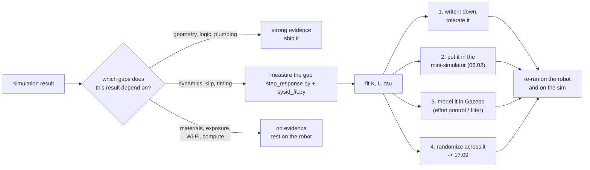

# 06.10 — The sim-to-real gap — what transfers and what doesn't

<!-- glance:start -->
<!-- generated by tools/build.py from curriculum/syllabus.yaml — edit the syllabus, not this block -->

| | |
|---|---|
| **Track** | Main path |
| **Difficulty** | Intermediate |
| **Time** | 45 min |
| **Hardware** | none |
| **Software** | none |
| **Prerequisites** | [06.07 Simulated LiDAR, camera, depth and IMU — with realistic noise](06.07-simulated-sensors-and-noise.md) |
| **Skip if** | You can list the concrete ways your simulation lies to you. |

<!-- glance:end -->

## What you will learn

- List karmel's concrete sim-to-real gaps, each with a direction (is the simulation optimistic or pessimistic?) and a number.
- Run a system-identification loop: command a known input, log, fit a model, put the number back into the simulator.
- Measure the same step response on both targets and quantify the difference in milliseconds and millimetres.
- Decide, for a given algorithm, whether simulation is evidence, weak evidence or no evidence at all.
- Follow a procedure when something works in simulation and fails on the robot, instead of guessing.

## Why it matters

You now have a simulation that shares its controllers ([06.06](06.06-ros2-control.md)), its sensors ([06.07](06.07-simulated-sensors-and-noise.md)),
its worlds ([06.08](06.08-building-worlds.md)) and its launch files ([06.09](06.09-same-code-sim-and-real.md)) with the real robot.
Everything that *can* be identical is identical. What remains is the plant: what actually happens when a velocity command reaches a
wheel, when a laser pulse hits a wall, when a battery has been running for twenty minutes.

"The reality gap" is usually discussed as a single mysterious quantity. It is not. It is a **list**, each item has a sign and a
magnitude, and every item can be measured in an afternoon. A gap you have measured is a parameter. A gap you have not is the reason a
robot that navigated perfectly on your laptop drives into a doorframe.

This lesson is short because it is mostly a habit: before you trust a simulation result, name which items on the list the result
depends on, and say what you know about each.

<!-- prereqs:start -->
## Prerequisites

You need these first:

- [06.07 Simulated LiDAR, camera, depth and IMU — with realistic noise](06.07-simulated-sensors-and-noise.md)

### Optional prerequisite links

None.

Check your readiness: `python course.py why 06.10`
<!-- prereqs:end -->

## Concept

Three things can differ between a simulation and a robot, and they fail differently:

```text
  1. things the simulator models WRONG       fixable: measure, then fix the parameter
     (wheel radius, friction, motor tau)     system identification — most of this lesson

  2. things the simulator does NOT model     not fixable: you must know the list
     (glass, auto-exposure, Wi-Fi, sag)      test on the robot, or randomize across it

  3. things that differ every run            not fixable, and that is the point
     (floor, battery level, lighting)        your algorithm must be robust, not tuned
```

Category 1 is engineering: a measurement and a number. Category 2 is knowledge: the list from
[06.07](06.07-simulated-sensors-and-noise.md) Level 4, plus the mechanical ones below. Category 3 is why *domain randomization*
exists — if you cannot pin a parameter down, train or tune across its whole plausible range instead.

The most dangerous gaps are not the largest ones. They are the ones where the **simulation is optimistic**: where the simulated robot
does something the real one cannot. An optimistic gap turns into a crash; a pessimistic one turns into a robot that is better than
you expected. Every row of the table below is annotated with its direction, and almost all of them are optimistic, because simulators
are built by leaving hard things out.

> [!TIP]
> **Ask your teacher:** "Given what I am about to test — say, a Nav2 recovery behaviour — which rows of karmel's gap table does the result depend on, and how much evidence is a successful simulation run?"

## Technical explanation

### Level 1 — karmel's gap table

| # | Gap | Simulation | Reality | Direction | Measured / expected size |
|---|---|---|---|---|---|
| 1 | **Motor dynamics** | `gz_ros2_control` is an ideal velocity source: the joint reaches the commanded speed within the controller's rate limit | a geared DC motor with $\tau \approx 0.08$ s behind a 100 Hz PID | **optimistic** | 99 % of a step reached in 0.32 s vs 0.60 s — 286 ms, ≈ 86 mm at 0.3 m/s |
| 2 | **Deadband and stiction** | none: any command produces motion | `duty_deadband: 0.12` — below 12 % duty nothing turns, and a stopped motor needs more than a turning one | **optimistic** | small commands do nothing; a creeping approach turns into stick-slip |
| 3 | **Wheel slip and floor** | one $\mu$ per surface, isotropic, no dust | tiles, rugs, thresholds, hair round the axle; $\mu$ changes within one room | optimistic | 06.05: at $\mu=0$, `/odom` reports 1.506 m while the robot moved −0.006 m |
| 4 | **Geometry error** | the URDF *is* the robot | your wheel is 0.0447 m, not 0.0450; the axles are not parallel | neither — it is a **scale error** | 0.67 % radius error = 6.7 cm per 10 m ([09.05](../09-odometry/09.05-calibrating-odometry.md)) |
| 5 | **LiDAR on real surfaces** | `gpu_lidar` is a depth render; material is irrelevant | matt black absorbs, glass transmits, mirrors reflect, shallow angles drop out | **very optimistic** | 06.07 E4: identical 1.00 m ± 10 mm off white, black, glass and metal |
| 6 | **Camera exposure** | a fixed render; no auto-exposure, gain, white balance, rolling shutter or motion blur | all of the above, changing continuously | **optimistic** | 06.07 E4: mean pixel 162.7 (white wall) vs 93.6 (black wall), no compensation |
| 7 | **IMU imperfections** | white noise + constant bias | plus temperature drift, scale-factor and axis-misalignment errors, and chassis vibration | optimistic | simulated gyro bias $10^{-4}$ rad/s; a real BNO055 is nearer $10^{-3}$ |
| 8 | **Compute and latency** | the loop is stepped by the simulator and cannot overrun | a Pi 5 running SLAM, Nav2 and the control loop | **optimistic** | `Overrun detected! … The loop took 27.1 ms` (target 20 ms) on a loaded machine |
| 9 | **Wi-Fi** | topics are in-process or on loopback | 5–200 ms of jitter, seconds-long dropouts, and RViz eating the bandwidth | **optimistic** | a 0.5 s `cmd_vel_timeout` is a *feature* the moment the link stutters |
| 10 | **Battery sag** | none: motors have infinite, constant voltage | 3S Li-ion, 12.6 V full to 9.9 V cutoff; motor speed scales with voltage | **optimistic** | 21.4 % less top speed at cutoff than at full charge |
| 11 | **Wear and assembly** | perfect and identical every run | a loose set screw, a rubbing cable, a caster with hair in it | optimistic | the reason "it worked yesterday" |

Two of these deserve arithmetic.

**Battery sag (10).** A brushed DC motor's no-load speed is proportional to supply voltage. karmel's pack runs from
$V_{\text{full}} = 12.6$ V to $V_{\text{cutoff}} = 9.9$ V, so the top wheel speed falls by

$$1 - \frac{9.9}{12.6} = 21.4\%$$

The `max_wheel_speed_rad_s: 17.0` in `karmel.yaml` is quoted at about 11 V, so near cutoff expect roughly
$17 \times 9.9/11 = 15.3$ rad/s, i.e. 0.689 m/s at the rim. The software limit is 0.5 m/s, which needs $0.5/0.045 = 11.1$ rad/s — so
there is still 4.2 rad/s of headroom at cutoff, and the robot will *reach* commanded speed but with less authority to correct
disturbances. Plan that margin; do not discover it.

**Compute (8).** In simulation the control loop is stepped by Gazebo and is, by construction, never late. On the Pi it is a real-time
thread competing with everything else. The `Overrun detected!` breakdown in [06.06](06.06-ros2-control.md) showed 22.8 ms of
`update()` against a 20 ms budget, with only 200 µs of I/O — the loop was starved, not blocked. There is no way for the simulation to
tell you this, and no substitute for running the real stack on the real computer.

### Level 2 — The system identification loop

For category-1 gaps there is a procedure, and it is short:

```text
   1. command a known input on the robot        a step, a ramp, a chirp
   2. log input and output with timestamps      /cmd_vel and /joint_states
   3. fit the smallest model that explains it   gain K, dead time L, time constant tau
   4. put the numbers into the simulator        motor model, limits, noise
   5. re-run step 1 in simulation and compare   the gap is now a number, and smaller
```

The model to fit first is always first order with dead time, because it has three parameters and explains most electromechanical
systems:

$$\dot{\omega}(t) = \frac{K\,u(t - L) - \omega(t)}{\tau}$$

- $K$ — steady-state gain. Is the wheel as fast as you asked? $K < 1$ means a voltage, a gear or a calibration is off.
- $L$ — dead time. How long before *anything* happens? Serial latency, PWM period, controller period, backlash.
- $\tau$ — time constant. How sluggish? 63 % of the final value is reached at $t = L + \tau$.

**The measurement.** [`06-simulation/code/ros2/step_response.py`](code/ros2/step_response.py) commands 0.3 m/s for 3 s and logs
`/joint_states`; [`06-simulation/code/sysid_fit.py`](code/sysid_fit.py) fits the model by grid search and prints the comparison.
Measured on both targets (Gazebo, and the hardware path against the fake Pico's first-order motor model):

```text
file                  K   L (ms)  tau (ms)     rms  t50 (s)  t90 (s)  t99 (s)  travel (m)
-----------------------------------------------------------------------------------------
sim_step.csv      1.000       65       115   0.173    0.181    0.302    0.316       0.900
real_step.csv     1.000      145       135   0.154    0.259    0.418    0.602       0.900

gap: t99 differs by 286 ms, tau by 20 ms, travel by 0 mm (0.0%)
```

Read that carefully, because two of the numbers are traps.

**The fitted $L$ and $\tau$ for the *simulation* are not a motor.** `gz_ros2_control` has no dynamics at all; the 65 ms and 115 ms
are the controller's 1.0 m/s² acceleration limiter and the 50 Hz sampling, which a first-order model can only approximate. What you
are identifying here is the **closed loop** from `/cmd_vel` to wheel speed — limiter plus hardware plus plant — and that is the right
thing to identify, because it is what Nav2 will experience. Just do not call it a motor constant.

**`travel by 0 mm` is not "no gap".** Both targets covered 0.900 m of rim travel, because the step was held long enough for the slow
one to catch up. The gap lives entirely in the transient. It shows up when commands are *short* — which is exactly what a local
planner does, at 10–20 Hz, for its whole life ([12.05](../12-navigation/12.05-local-planning-obstacle-avoidance.md)). At 0.3 m/s,
286 ms of extra settling is about 86 mm of position error per direction change.

**The shape tells you more than the numbers.** The two ASCII plots from `sysid_fit.py --plot`, abridged and placed side by side
(`.` is the command, `*` the measured wheel speed):

```text
sim_step.csv                                        real_step.csv
| ......***************************************  |  | ..........********************************* |
|      **                                      * |  |         **                                **|
|      *                                         |  |        *                                    |
|     *                                          |  |       *                                     |
|    *                                           |  |      *                                      |
|   *                                            |  |     *                                       |
|***                                          .. |  |****                                     ... |
+------------------------------------------------+  +---------------------------------------------+
   a straight ramp, then it locks on exactly        a lagging ramp, then an asymptotic approach
```

The simulated wheel follows the rate-limited command as a straight line and then sits *exactly* on the setpoint with zero ripple.
That flat, noiseless top is the signature of an ideal velocity source, and it is the single most misleading thing about driving a
robot in Gazebo.

### Level 3 — Closing a gap, and knowing when not to

Once you have $K$, $L$, $\tau$ from the robot, you have choices, in increasing order of effort:

1. **Write the number down** and make your algorithm tolerate it. Often enough: set the local planner's lookahead so 86 mm of
   settling error does not matter.
2. **Put it in the simulator you control.** The course mini-simulator ([06.02](06.02-course-mini-simulator.md)) already has
   `motor_time_constant_s`, `duty_deadband`, `motor_gain_left/right`, `wheel_radius_scale_*` and `slip_std` as parameters, and
   `DiffDriveParams.realistic()` sets them. That is where to test a controller against a lagging, mismatched plant.
3. **Put it in Gazebo.** Harder: `gz_ros2_control` deliberately gives you an ideal velocity source. The honest options are to command
   *effort* instead of velocity and model the motor yourself, or to insert a first-order filter between the controller and the
   simulated joint. Both are real work, and you should be able to say why the gap matters before doing either.
4. **Randomize across it.** If the parameter varies between robots, floors or battery states, do not pick a value — sample one per
   episode from a plausible range and require your algorithm to work across all of them.

Option 4 is **domain randomization**, and it is the reason simulation-trained policies transfer at all. The idea, from Tobin et al.
2017: if the policy sees enough variation in simulation, the real world looks like one more variation rather than a new domain. It
applies to classical tuning too — a PID that survives $\tau \in [0.05, 0.20]$ s and $K \in [0.85, 1.0]$ in the mini-simulator is a PID
that will probably survive your robot.

For karmel, a defensible randomization range from the table above:

| parameter | range | justification |
|---|---|---|
| `motor_time_constant_s` | 0.05 – 0.20 s | measured 0.135 s closed loop; motors differ between units |
| `motor_gain_left/right` | 0.90 – 1.00, independently | two motors are never matched; `realistic()` uses 1.00 / 0.94 |
| `wheel_radius_scale_*` | 0.99 – 1.01 | manufacturing plus tyre compression |
| `slip_std` | 0.00 – 0.04 | tiles to rug |
| supply voltage | 9.9 – 12.6 V | full charge to cutoff |
| LiDAR dropout rate | 0 – 5 % of rays | black and glass surfaces |

The full treatment — how to randomize for RL, which simulators do it efficiently, and why it changes the training problem — is
[17.09](../17-reinforcement-learning/17.09-rl-sim-to-real.md).

**When not to close a gap.** Simulation is a tool for a purpose, not a model of the world. Ask what the run is evidence *for*:

| what you are testing | is a successful sim run evidence? |
|---|---|
| a path-planning algorithm, a behaviour tree, a state machine | **yes** — geometry and logic transfer almost perfectly |
| TF, frames, message plumbing, launch files | **yes** — identical by construction ([06.09](06.09-same-code-sim-and-real.md)) |
| odometry and EKF *structure* | **yes**; their *tuning* — weak, because the noise is yours |
| a local planner's tuning | **weak** — motor dynamics and slip are exactly what it fights |
| SLAM in a glass-walled room | **no** — gap 5 is total |
| a vision threshold | **no** — gap 6 is total |
| "does the robot fit through the door" | yes for geometry, no for control accuracy |
| "can the Pi run all of this at once" | **no** — gap 8 cannot be simulated at all |

### Level 4 — The procedure: "it works in simulation, not on the robot"

Do not start by changing parameters. Localise the difference first; it is almost always in one layer.

```text
  0. Reproduce. Same world, same commands, same launch arguments. Record a bag on BOTH targets.
     Everything below is a comparison between those two bags.

  1. Is it the plumbing?  Compare topic names, types, QoS, rates, the TF tree.
     06.09's parity gate answers this in one command. If this is it, stop: it is not a sim-to-real
     problem at all, it is a configuration bug.

  2. Is it the sensors?   Park the robot. Compare /scan, /imu, /joint_states statistics with the
     simulated ones (06.07's sensor_stats.py). Look for: bias, dropouts, missing returns,
     different rates. A sensor that behaves differently while stationary explains most of it.

  3. Is it the actuation? Run step_response.py on both and fit (Level 2). A K below 1, a much
     larger tau, or a dead time you did not expect, each point somewhere specific.

  4. Is it the geometry?  Drive 2 m straight and a 2 m square, both directions, and measure with a
     tape. A constant scale error is the wheel radius; an angle error is the wheel separation.
     UMBmark: 09.05.

  5. Is it the compute?   Watch for 'Overrun detected!', check the actual /scan and /odom rates on
     the robot, and check CPU. A stack that is 30 % late behaves like a different robot.

  6. Only now: is the algorithm wrong? If 1-5 are clean and it still fails, you have learned
     something real about the algorithm, and you have the measurements to describe it.
```

Steps 1–5 are all *measurements you have already automated* in this module. That is the point of having built them.

## Diagram



The step response, side by side, is the whole lesson in one picture:

```text
  wheel speed
  6.67 rad/s  ┤        sim: ────────────────────  exact, flat, no ripple
              │       ╱   real: ╭──────────────   asymptotic, still climbing at t90
              │      ╱        ╱
              │     ╱      ╱
              │    ╱    ╱
         0    ┼───┴──┴──────────────────────────► t
              0   0.32  0.60                        seconds after the step
                   │      └── real reaches 99 %
                   └───────── sim reaches 99 %
                              gap: 286 ms = 86 mm at 0.3 m/s
```

## Code

Measure the step response on either target and fit it:

```bash
# simulation
ros2 launch karmel_bringup robot.launch.py sim:=true headless:=true enable_camera:=false
python3 06-simulation/code/ros2/step_response.py --speed 0.3 --seconds 3 \
        --out sim_step.csv --ros-args -p use_sim_time:=true

# hardware path (real Pico, or the fake one)
ros2 run karmel_base fake_pico --link /tmp/ttyKARMEL
ros2 launch karmel_bringup robot.launch.py sim:=false serial_device:=/tmp/ttyKARMEL
python3 06-simulation/code/ros2/step_response.py --speed 0.3 --seconds 3 --out real_step.csv

# fit and compare (pure Python + numpy: runs anywhere)
py 06-simulation/code/sysid_fit.py sim_step.csv real_step.csv --plot
```

Put a measured plant into the mini-simulator and test a controller against it
([06.02](06.02-course-mini-simulator.md)'s API):

```python
from dataclasses import replace
from robotlab.sim import DiffDriveParams, DiffDriveSim, SensorParams, World

measured = replace(DiffDriveParams.realistic(),
                   motor_time_constant_s=0.135,   # from sysid_fit.py on YOUR robot
                   motor_gain_right=0.94,
                   wheel_radius_scale_right=1.008,
                   slip_std=0.02)
sim = DiffDriveSim(World.apartment(), measured, SensorParams.realistic(), seed=0)
```

and randomize across a range instead of picking one value:

```python
import random

def sample_plant(rng: random.Random) -> DiffDriveParams:
    """One plausible karmel, drawn from the ranges in the gap table."""
    return replace(DiffDriveParams.realistic(),
                   motor_time_constant_s=rng.uniform(0.05, 0.20),
                   motor_gain_left=rng.uniform(0.90, 1.00),
                   motor_gain_right=rng.uniform(0.90, 1.00),
                   wheel_radius_scale_left=rng.uniform(0.99, 1.01),
                   wheel_radius_scale_right=rng.uniform(0.99, 1.01),
                   slip_std=rng.uniform(0.0, 0.04))
```

## Exercise

E1, E2 and E4–E5 need no hardware. E3 needs `robot-base` and offers a no-hardware path.

### Exercise 06.10-E1 — Measure the gap you have `[simulation]`

Run `step_response.py` on both targets (simulation, and the hardware path against the fake Pico) and fit both with `sysid_fit.py`.
Report $K$, $L$, $\tau$, $t_{50}$, $t_{90}$, $t_{99}$ and total travel for each.

Then answer:

1. Why is $K = 1.000$ on both, and what would $K = 0.9$ have told you?
2. The simulation fits $\tau = 115$ ms although `gz_ros2_control` has no dynamics. Where does that number come from, and what is the
   fit actually describing?
3. Total travel is identical to the millimetre. Explain why, and construct a command pattern for which it would *not* be.

### Exercise 06.10-E2 — Turn a gap into a number you can act on `[numerical]`

Using the measured $t_{99}$ difference of 286 ms:

1. How far does karmel travel during that at 0.3 m/s, and at its 0.5 m/s limit?
2. A local planner replans at 10 Hz and issues a new velocity every 100 ms. Is 286 ms of settling a rounding error or a dominant
   effect? Justify with the ratio.
3. The battery falls from 12.6 V to 9.9 V. Compute the top-speed loss, the resulting maximum wheel speed given
   `max_wheel_speed_rad_s: 17.0` at 11 V, and how much headroom remains above the 0.5 m/s software limit.
4. `duty_deadband: 0.12`. Explain in two sentences what a *simulated* robot can do that a real one cannot, when a planner asks for a
   very small velocity.

### Exercise 06.10-E3 — Identify your own robot `[hardware]`

Hardware: `robot-base`. **No hardware?** Use the fake Pico and treat its `time_constant=0.08` as the unknown you are trying to
recover — the exercise is identical, and you can check your answer against the source.

> [!CAUTION]
> **Safety:** a step command is a sudden full-torque demand. Wheels off the ground, power switch in reach, and nothing near the
> wheels. See [SAFETY.md](../SAFETY.md).

1. Run `step_response.py` three times at 0.15, 0.30 and 0.45 m/s. Fit each.
2. Is $\tau$ the same at all three speeds? If not, your plant is not first order and linear — say what that implies.
3. Repeat the 0.30 m/s step with the battery full and again after twenty minutes of driving. Report $K$ for both.
4. Put your measured $\tau$, gains and radius scales into `DiffDriveParams` in the mini-simulator, re-run the same step there, and
   show the three curves (real, Gazebo, tuned mini-simulator) on one plot.

### Exercise 06.10-E4 — Predict where simulation is worthless `[predict]`

For each of these, predict whether a successful simulation run is strong evidence, weak evidence or none — and name the gap-table row
that decides it. Then argue your answer in one sentence each.

1. A* finds a path through the apartment's kitchen doorway.
2. The EKF fusing wheel odometry and IMU converges after a 360° spin.
3. slam_toolbox closes a loop in the apartment.
4. slam_toolbox closes a loop in an apartment with a glass balcony door.
5. Nav2's DWB controller follows a path within 5 cm of cross-track error.
6. The whole stack — SLAM, Nav2, control loop, camera — runs at rate on the Raspberry Pi 5.
7. A colour-threshold object detector finds the red cube on the tabletop.
8. The robot stops within 20 cm of an obstacle that appears suddenly.

### Exercise 06.10-E5 — Write the procedure down `[design]`

Take a specific failure: *"Nav2 reaches its goal in simulation, but on the robot it overshoots every corner and occasionally clips the
doorframe."* Write the investigation as a numbered plan following Level 4, and for each step state: the command you would run, the
measurement you would take, and **what result would eliminate that step**. Then name the two gap-table rows you think are most likely
responsible, and the cheapest experiment that would distinguish them.

## Expected result

Captured 2026-09-19 in the course Docker image (`karmel-ros:jazzy`, ROS 2 Jazzy, Gazebo Harmonic, headless), hardware path against
`karmel_base/fake_pico`. Your absolute numbers will differ; the *shape* of the comparison should not.

**06.10-E1.**

```text
file                  K   L (ms)  tau (ms)     rms  t50 (s)  t90 (s)  t99 (s)  travel (m)
-----------------------------------------------------------------------------------------
sim_step.csv      1.000       65       115   0.173    0.181    0.302    0.316       0.900
real_step.csv     1.000      145       135   0.154    0.259    0.418    0.602       0.900

gap: t99 differs by 286 ms, tau by 20 ms, travel by 0 mm (0.0%)
```

Answers: (1) $K = 1$ on both because both close a velocity loop that eventually reaches the setpoint — Gazebo by construction, the
Pico with an integrator. $K = 0.9$ would mean the loop cannot reach the setpoint: saturated duty, a low battery, a wrong
`ticks_per_rev` (so the *measurement* is wrong rather than the motion), or a mechanical load. (2) The 115 ms is the
`diff_drive_controller` acceleration limit of 1.0 m/s² — 0.3 m/s takes 0.3 s to ramp — plus 50 Hz sampling, approximated by a
first-order model that cannot represent a rate limit. The fit describes the **closed loop from `/cmd_vel` to wheel speed**, which is
what a planner experiences, not a motor. (3) Travel is identical because the 3 s step was far longer than either settling time, so
both reached the same steady speed and the transient is a vanishing fraction. A pattern of short bursts — say `0.3,0,0.4` repeated
five times with stops — would expose it, because each burst is mostly transient.

**06.10-E2.**

1. $0.3 \times 0.286 = 0.086$ m; at 0.5 m/s, $0.143$ m.
2. Dominant. A 10 Hz planner assumes its command takes effect within 100 ms; the plant needs 600 ms to reach 99 %, a ratio of about
   6. The robot is always tracking a command from several cycles ago, which is exactly how corner overshoot happens.
3. $1 - 9.9/12.6 = 21.4\%$. $17 \times 9.9/11 = 15.3$ rad/s = 0.689 m/s at the rim; the 0.5 m/s limit needs 11.1 rad/s, leaving
   4.2 rad/s (about 0.19 m/s) of headroom at cutoff.
4. A simulated robot can move at any speed, however small, because the hardware component just sets the joint velocity. A real one
   does nothing at all below 12 % duty, and then breaks free and overshoots — so a planner's careful 0.02 m/s final approach becomes
   a series of jerks, or nothing.

**06.10-E3.** Expect $\tau$ to *decrease* slightly with commanded speed (the deadband and stiction matter proportionally less), which
is the signature of a plant that is not linear near zero. Expect $K$ to stay near 1.0 with a fresh battery and to fall below 1 only if
the loop saturates. With the fake Pico, `sysid_fit.py` should recover something close to its configured `time_constant=0.08` s once
you account for the controller's rate limit — do the comparison against the *limited* command if you want the plant alone. The
three-curve plot is the deliverable: the tuned mini-simulator should sit on top of the real curve, and Gazebo should visibly lead
both.

**06.10-E4.**

| | evidence | gap row |
|---|---|---|
| 1. A* through the doorway | **strong** — geometry and logic | none (4 only as a scale error) |
| 2. EKF converges after a spin | **weak** — structure yes, tuning no | 7 (IMU), 3 (slip) |
| 3. Loop closure in the apartment | **strong-ish** — scan matching on real geometry | 5 (partly), 8 |
| 4. Loop closure with a glass door | **none** | 5 — total; the sim sees a wall where the robot sees nothing |
| 5. DWB within 5 cm cross-track | **weak** — this is precisely the dynamics | 1, 2, 3 |
| 6. Everything at rate on the Pi | **none** | 8 — cannot be simulated at all |
| 7. Colour-threshold detector | **none** | 6 — no auto-exposure means no test |
| 8. Stopping for a sudden obstacle | **weak** | 1, 2, 9 — sensor-to-stop latency is mostly ungapped in sim |

**06.10-E5.** A good plan runs the 06.09 parity gate first (eliminating plumbing in one command), then compares stationary sensor
statistics, then `step_response.py` on both — and *stops* when a step explains the symptom. For corner overshoot the two prime
suspects are row 1 (motor lag: the robot is still accelerating when the planner has already turned) and row 3 (slip on the real
floor during the turn). The cheapest experiment that distinguishes them: drive the corner with the wheels on a stand and compare
commanded against measured wheel speeds — lag appears with the wheels in the air, slip does not.

## Troubleshooting

### Symptom: the fit gives a nonsense $\tau$ or a huge RMS

1. Did the step actually happen? Plot it (`--plot`). If `cmd_rad_s` never leaves zero, the command never reached the controller —
   check `use_sim_time` and the message type.
2. Is the hold long enough? The fit needs a clear steady state; three time constants minimum, so at least 0.5 s for a fast plant and
   several seconds for a slow one.
3. Are the samples regular? The fit integrates on the sample grid, so a `/joint_states` stream with 100 ms gaps (a loaded simulation)
   will smear the transient. Compare the simulated-time rate against `update_rate`.
4. Is the plant actually first order? An overshoot, a ring, or a $\tau$ that changes with amplitude all mean "no". That is
   information, not a failure.

### Symptom: the simulation and the robot disagree, and you do not know where to start

Run Level 4 in order and do not skip step 1. In the development of these labs, more "sim-to-real" problems turned out to be
configuration (a duplicate node, a domain-ID collision, a missing `use_sim_time`) than turned out to be physics.

### Symptom: you closed a gap and nothing improved

You closed the wrong one. Before changing a parameter, predict the size of the effect: if a 20 ms change in $\tau$ should move your
metric by 2 mm and your error is 20 cm, that parameter was never the cause. This is the same discipline as profiling before
optimising.

### Symptom: the robot behaves differently on Tuesday

Category 3. Battery level, floor, temperature, a screw that worked loose. Before debugging software, log the battery voltage
(`/battery_state`) alongside the failure and re-run the same test at full charge. `karmel.yaml` sets `low_warning_v: 10.5` for a
reason.

## Common mistakes

- **Treating the reality gap as one number.** It is a list with eleven rows, each with its own sign and size.
- **Tuning a controller in Gazebo.** Gazebo's `gz_ros2_control` is an ideal velocity source; you are tuning against a plant that does
  not exist. Use the mini-simulator with measured parameters, or the robot.
- **Concluding "no gap" from total distance.** The gap lives in transients; hold a step long enough and it disappears from the
  summary statistic.
- **Calling a closed-loop fit a motor constant.** What you identified includes the limiter, the sampling and the controller.
- **Closing gaps before measuring which one matters.** Predict the effect size first.
- **Randomizing without a justified range.** A range you invented is a different kind of guess; derive it from measurements or from
  the datasheet.
- **Believing a vision or LiDAR result from simulation.** Rows 5 and 6 are total gaps, not small ones.
- **Forgetting that the compute gap cannot be simulated.** The only test for "can the Pi run this" is a Pi running it.

## Knowledge check

1. Which is more dangerous: a gap where the simulation is optimistic, or one where it is pessimistic? Why?
   <details><summary>Answer</summary>

   Optimistic. A simulation that flatters the robot produces a plan that the real robot cannot execute — a crash. A pessimistic gap
   produces a robot that performs better than expected, which costs you some conservatism and nothing else. Almost all gaps are
   optimistic, because simulators are built by leaving hard things out.
   </details>

2. Numerical: your robot's step response reaches 99 % of the commanded wheel speed 286 ms later than the simulation's. At 0.4 m/s, how much position error does that represent, and why does it matter more to a local planner than to a global planner?
   <details><summary>Answer</summary>

   $0.4 \times 0.286 = 0.114$ m. A global planner produces a geometric path once and does not care about dynamics; a local planner
   issues a new velocity every 50–100 ms and assumes the robot follows it, so a 286 ms settling time means it is always correcting
   for a command several cycles old — which shows up as corner overshoot and oscillation.
   </details>

3. `sysid_fit.py` reports $\tau = 115$ ms for a Gazebo run, but `gz_ros2_control` has no motor model at all. Explain.
   <details><summary>Answer</summary>

   The fit is of the whole closed loop from `/cmd_vel` to measured wheel speed. That loop includes `diff_drive_controller`'s 1.0 m/s²
   acceleration limiter (0.3 s to ramp to 0.3 m/s) and 50 Hz sampling. A first-order-plus-dead-time model cannot represent a rate
   limit, so it approximates the ramp with an $L$ and a $\tau$. Useful as a description of what a planner experiences; wrong as a
   motor parameter.
   </details>

4. Predict: you put a black rug and a glass door in your Gazebo apartment and run SLAM. What does the map look like, and what will the real robot's map look like?
   <details><summary>Answer</summary>

   Identical to a map with a white rug and a wooden door: `gpu_lidar` is a depth render and ignores materials entirely, so both are
   solid obstacles at exactly the right distance. The real robot will see the rug (it is only a floor covering) but will mostly shoot
   *through* the glass, mapping an opening where there is a door — and its costmap will happily plan through it.
   </details>

5. Your battery drops from 12.6 V to 9.9 V. What happens to top speed, and does karmel still meet its 0.5 m/s software limit?
   <details><summary>Answer</summary>

   A DC motor's no-load speed scales with voltage, so top speed falls by $1 - 9.9/12.6 = 21.4\%$. From `max_wheel_speed_rad_s: 17.0`
   quoted at 10.8 V nominal, that gives about $17 \times 9.9/10.8 = 15.6$ rad/s = 0.701 m/s at the rim. The 0.5 m/s limit needs 11.1 rad/s, so
   yes — but with 4.5 rad/s of headroom instead of 5.9, which means less authority to reject disturbances.
   </details>

6. Debugging: Nav2 works in simulation and overshoots corners on the robot. Give the first three things you would check, in order, and say what each would eliminate.
   <details><summary>Answer</summary>

   (1) The parity gate from [06.09](06.09-same-code-sim-and-real.md): topic names, types, QoS, rates, TF. Eliminates configuration,
   which is more often the cause than physics. (2) Stationary sensor statistics against the simulated ones: eliminates a bad `/scan`
   or a drifting IMU. (3) `step_response.py` on both targets: if $t_{99}$ is much larger on the robot, the plant lag is the cause and
   the fix is in the planner's tuning, not in the map.
   </details>

7. What is domain randomization, and when is it the right answer rather than system identification?
   <details><summary>Answer</summary>

   Sampling a parameter from a plausible range on every run rather than fixing it, so that the algorithm must work across the whole
   range. It is right when the parameter genuinely *varies* — between robots, floors, battery states — or when you cannot measure it.
   System identification is right when the parameter is fixed and measurable; then a number is better than a distribution.
   </details>

8. Name one gap that no amount of simulation work can close, and say what you do instead.
   <details><summary>Answer</summary>

   Compute: whether the Raspberry Pi 5 can run SLAM, Nav2, the control loop and the camera simultaneously at rate. The simulator's
   control loop is stepped by the simulator and cannot be late. The only test is running the real stack on the real computer and
   watching for `Overrun detected!` and dropped sensor rates. (Wi-Fi latency and mechanical wear are equally valid answers.)
   </details>

## Practical challenge

Produce a **gap report** for your karmel: a document, backed by measurements, that says what your simulation is evidence for.

Acceptance criteria:

- For each of the eleven rows in the Level 1 table, one of: a measured number with the command that produced it; a justified
  estimate with its source; or an explicit "not measured, and here is the risk".
- At least four rows measured for real on your own robot (or the fake Pico if you have no hardware, stated clearly), including the
  step response at three speeds and the geometry check from [09.05](../09-odometry/09.05-calibrating-odometry.md).
- A plot with three curves — real, Gazebo, and the mini-simulator parameterised with your measurements — for the same 0.3 m/s step,
  and one paragraph on which of the three you would tune a controller against and why.
- A randomization table: for every parameter you could not pin down, the range you would sample from and the evidence for that range.
- A one-page "evidence" section: for each of SLAM, Nav2, the EKF and your vision code, whether a successful simulation run is strong
  evidence, weak evidence or none, and which gap rows decide it.
- The whole report regenerable: the measurement commands are scripts in your repository, not things you did once by hand.

## You can skip this if…

You can answer knowledge-check questions 1, 3 and 4 without looking, and you have already measured your own robot's step response,
fitted a plant model, put it back into a simulator, and can state which of your simulation results are evidence and which are not.

`python course.py skip 06.10 --reason "I can list and quantify the concrete ways my simulation lies to me"`

## Go deeper

- https://arxiv.org/abs/1703.06907 — Tobin et al., *Domain Randomization for Transferring Deep Neural Networks from Simulation to the Real World*. Short, readable, and the origin of the "variety beats fidelity" argument.
- https://arxiv.org/abs/1901.08652 — Hwangbo et al., *Learning Agile and Dynamic Motor Skills for Legged Robots*. The actuator-network idea: when the motor model is the gap, learn the motor model from data. This is system identification taken to its conclusion.
- https://arxiv.org/abs/1808.00177 — OpenAI, *Learning Dexterous In-Hand Manipulation*. The landmark sim-to-real result, and an honest account of how much randomization it took.
- https://control.ros.org/jazzy/doc/ros2_controllers/diff_drive_controller/doc/userdoc.html — the limiter parameters whose behaviour you identified in Level 2; worth re-reading once you know what they do to a step.
- https://github.com/ros-controls/gz_ros2_control — read `gz_system.cpp` to see for yourself that the velocity command is applied directly to the joint. Reading the source is how you learn what a simulator does *not* do.
- https://en.wikipedia.org/wiki/System_identification — the field this lesson takes three parameters from; the next models to reach for are second order and ARX.
- https://playground.mujoco.org/ — MuJoCo Playground: where the randomization-heavy, GPU-parallel version of this argument lives, if you want to see where [17.09](../17-reinforcement-learning/17.09-rl-sim-to-real.md) is going.

## Progress checkpoint

- [ ] I can list karmel's concrete sim-to-real gaps with a direction and a size for each.
- [ ] I can run a step response on either target, fit $K$, $L$ and $\tau$, and say what the fit does and does not describe.
- [ ] I can put measured parameters back into a simulator, and choose a randomization range when I cannot measure.
- [ ] I can say, for a given algorithm, whether a simulation result is strong evidence, weak evidence or none.
- [ ] I can follow the six-step procedure when something works in simulation and fails on the robot.

`python course.py complete 06.10` (exercises done) · `python course.py master 06.10` (challenge done) · `python course.py struggle 06.10 "what was hard"`

Next: module 7, [07.01 — Sensor fundamentals](../07-sensors/07.01-sensor-fundamentals.md): accuracy, precision, noise, bias and
latency — the vocabulary you have been using informally, made precise, and applied to the real sensors on karmel.
