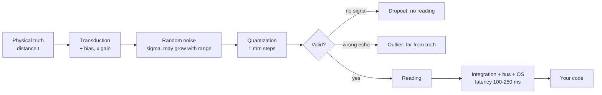

# 07.01 — Sensor fundamentals: accuracy, precision, noise, bias, latency, rate

<!-- glance:start -->
<!-- generated by tools/build.py from curriculum/syllabus.yaml — edit the syllabus, not this block -->

| | |
|---|---|
| **Track** | Main path |
| **Difficulty** | Beginner |
| **Time** | 1 h |
| **Hardware** | Stage 1 robot: Pi 5, Pico, encoder motors, driver, chassis, battery, distance sensors (stage 1) |
| **Software** | python |
| **Prerequisites** | [01.13 Ultrasonic and ToF sensors — stop before hitting things](../01-first-robot/01.13-distance-sensors-stop.md) |
| **Optional prerequisites** | [FM.13 Probability from zero](../optional-foundations/mathematics/FM.13-probability-basics.md)<br>[FM.14 Distributions, Gaussians, uncertainty and noise](../optional-foundations/mathematics/FM.14-distributions-gaussians-noise.md)<br>[FM.21 Statistics for robot experiments: mean, spread, RMSE, outliers](../optional-foundations/mathematics/FM.21-statistics-for-experiments.md) |
| **Skip if** | You characterize a new sensor's noise and bias before trusting it. |

<!-- glance:end -->

## What you will learn

- Separate the five things that go wrong with a sensor reading: bias, noise, resolution, outliers and dropouts — and say which one calibration can fix.
- Run a **static characterization test**: the same target at known distances, hundreds of readings, one table of numbers per sensor.
- Compute mean, σ, bias, RMSE and the standard error of the mean, and fit a calibration line that removes the bias.
- Reject outliers with a median/MAD test instead of a "3 σ" rule that the outliers themselves corrupt.
- Measure a sensor's **rate and latency**, and convert latency into centimetres of robot travel.
- Write a datasheet for *your* sensor, not the manufacturer's.

## Why it matters

Every autonomy technique in the rest of this course — PID ([08.07](../08-control/08.07-pid-mathematics.md)),
odometry ([09.04](../09-odometry/09.04-odometry-from-scratch.md)), the Kalman filter
([10.06](../10-localization/10.06-extended-kalman-filter.md)), AMCL, SLAM, Nav2 — is a machine for
combining measurements it does not fully trust. They all ask you for the same two numbers per sensor:
**how wrong is it on average** (bias) and **how much does it wobble** (σ, which becomes the
covariance you type into a ROS message). If you guess those numbers, your filter is confidently wrong;
if you measure them, everything downstream works the first time.

This is also the cheapest debugging skill in robotics. "The robot stops 12 cm too early" is a
mystery. "The VL53L1X reports +8 mm at every distance, σ grows from 1.5 mm at 10 cm to 9.8 mm at
3 m, and it drops 19 % of readings at 3 m" is a fact you can act on. The protocol in this lesson takes
20 minutes per sensor and you will reuse it for the ultrasonic (07.03), the ToF (07.04), the IMU
(07.05), the LiDAR (07.07) and the depth camera (07.09).

<!-- prereqs:start -->
## Prerequisites

You need these first:

- [01.13 Ultrasonic and ToF sensors — stop before hitting things](../01-first-robot/01.13-distance-sensors-stop.md)

### Optional prerequisite links

New to any of these? Take the foundation lesson first; skip it if you already know it.

- [FM.13 Probability from zero](../optional-foundations/mathematics/FM.13-probability-basics.md)
- [FM.14 Distributions, Gaussians, uncertainty and noise](../optional-foundations/mathematics/FM.14-distributions-gaussians-noise.md)
- [FM.21 Statistics for robot experiments: mean, spread, RMSE, outliers](../optional-foundations/mathematics/FM.21-statistics-for-experiments.md)

Check your readiness: `python course.py why 07.01`
<!-- prereqs:end -->

## Concept

A sensor is a **lossy, delayed, occasionally lying RPC call to physics**. That framing is not a joke:
every failure mode you already know from distributed systems has an exact analogue here.

| Distributed systems | Sensor |
|---|---|
| Clock skew between services | **Bias** — every reading is shifted by the same amount |
| Jitter in response time | **Noise** — readings scatter around the truth |
| Integer truncation in a DTO | **Resolution** — the VL53L1X reports whole millimetres |
| A corrupted response that still passes validation | **Outlier** — a multipath echo reports 2.7 m for a wall at 1 m |
| A timeout | **Dropout** — no reading at all this cycle |
| Network latency | **Latency** — the reading describes where the robot *was*, not where it is |
| Rate limiting | **Sampling rate** — 10 readings per second, not 1000 |

The two words people confuse are *accuracy* and *precision*. Imagine shooting at a target:

```text
   accurate + precise      precise, not accurate     accurate, not precise      neither
        ┌───────┐             ┌───────┐                 ┌───────┐             ┌───────┐
        │   ×   │             │       │                 │  ×    │             │ ×     │
        │  ×⊕×  │             │  ⊕    │××               │ ×  ⊕ ×│             │   ⊕  ×│
        │   ×   │             │       │×××              │    ×  │             │ ×   × │
        └───────┘             └───────┘                 └───────┘             └───────┘
       small bias            small σ, BIG bias        small bias, big σ      big both
       small σ               → calibrate it            → average it          → new sensor
```

⊕ is the true value. **Precision (small σ) is a property of the hardware; accuracy is a property of
your software**, because a constant bias is just a number you subtract. That asymmetry is the whole
reason you characterize: it tells you which of the two problems you actually have, and only one of
them is fixable in code.

A third thing hides behind both: **resolution**, the smallest step the sensor can report. A US-100
that reports whole millimetres cannot have σ below about 0.3 mm no matter how quiet the electronics
are, and a sensor whose σ is much *smaller* than its resolution produces the same value over and
over — which breaks naive outlier tests, as you will see.

> [!TIP]
> **Ask your teacher:** "Give me three one-line symptom descriptions of a misbehaving robot and ask me which of bias / noise / resolution / outliers / dropouts / latency is the most likely cause for each."

## Technical explanation

### Level 1 — Intuition: the five errors, and what fixes each

| Error | What you see | Fix |
|---|---|---|
| **Bias** | Every reading off by the same amount (or by the same *percentage*) | Calibration: subtract an offset, divide by a gain |
| **Noise** | Readings scatter | Average N samples (σ shrinks by √N), or a filter — at the cost of latency |
| **Resolution** | Readings snap to steps | Nothing. Buy a better sensor or accept the step |
| **Outliers** | Occasional wild values | Reject them (median/MAD), never average them in |
| **Dropouts** | No reading | Hold the last value *with an age*, and time it out |

Two of these — bias and noise — are what the rest of the course calls "the sensor model". The other
three are what makes real sensor code longer than textbook sensor code.

### Level 2 — Practical: the static characterization protocol

This is the protocol. It is deliberately boring.

1. **Fix the geometry.** Robot and target both immobile. Tape-measure the distance from the *sensor's
   face* (not the robot's nose) to a flat, matte, perpendicular target. Write the number down.
2. **Take 150–300 readings** without touching anything. Record dropouts as empty, not as zero.
3. **Repeat at 5–6 distances** spanning the range you care about: for karmel, 0.10 / 0.25 / 0.50 /
   1.00 / 2.00 / 3.00 m.
4. **Per distance, compute**: n, dropout rate, outlier rate, mean, σ, bias = mean − true, and the
   standard error of the mean.
5. **Plot** an error histogram per distance, and bias ± σ versus distance.
6. **Fit** `measured = gain · true + offset` through the per-distance means. That is your calibration.
7. **Change one thing** (target material, angle, lighting, temperature) and repeat. The *difference*
   between two runs is where all the physics lives.

**Worked example with karmel's simulated bench** (`range_bench_sim.py`, VL53L1X preset):

| true [m] | n | dropout | outlier | mean [m] | bias [mm] | σ [mm] | σ with outliers [mm] | SEM [mm] |
|---|---|---|---|---|---|---|---|---|
| 0.100 | 200 | 0.5 % | 0.0 % | 0.1077 | +7.7 | 1.5 | 1.5 | 0.11 |
| 0.250 | 200 | 0.5 % | 0.5 % | 0.2579 | +7.9 | 1.7 | 1.7 | 0.12 |
| 0.500 | 200 | 1.0 % | 0.5 % | 0.5082 | +8.2 | 2.3 | 159.9 | 0.16 |
| 1.000 | 200 | 0.5 % | 0.0 % | 1.0082 | +8.2 | 3.3 | 3.3 | 0.23 |
| 2.000 | 200 | 0.5 % | 0.0 % | 2.0086 | +8.6 | 5.6 | 5.6 | 0.40 |
| 3.000 | 200 | 19.0 % | 1.2 % | 3.0082 | +8.2 | 9.8 | 110.1 | 0.77 |

Read it like a doctor reads a chart:

- **The bias is +8 mm at every distance.** Constant, not proportional → it is an *offset*, so the
  calibration line will have gain ≈ 1 and offset ≈ +8 mm. One subtraction fixes it everywhere.
- **σ grows with distance**, 1.5 mm → 9.8 mm. That is physics (fewer returning photons, 07.04), not a
  defect, and it means your covariance must be a *function of range*, not a constant.
- **Dropouts explode at 3 m** (0.5 % → 19 %). The sensor is telling you where its usable range ends.
- **"σ with outliers" is 110 mm at 3 m and 2.3 mm at 0.5 m** for the same data as the 9.8 / 2.3 mm
  columns. A handful of wild readings inflated σ by 10–70×. If you had used that number as your
  covariance, your Kalman filter would ignore a perfectly good sensor.

And the fitted line, printed by the same tool:

```text
calibration: measured = 1.0002 * true +7.9 mm   (residual 0.3 mm)
```

Gain 1.0002 (i.e. no scale error), offset +7.9 mm, and the per-distance means sit within 0.3 mm of the
line. Corrected reading = (measured − 0.0079) / 1.0002.

### Level 3 — Mathematics: the four numbers, and why the median

For $n$ inlier readings $x_i$ of a target at true distance $t$:

$$\bar{x}=\frac1n\sum x_i,\quad \sigma=\sqrt{\frac{1}{n-1}\sum (x_i-\bar x)^2},\quad b=\bar x-t,\quad
\mathrm{RMSE}=\sqrt{\frac1n\sum (x_i-t)^2}\approx\sqrt{b^2+\sigma^2}$$

The $n-1$ (Bessel's correction) matters: `np.std(x)` divides by $n$ and under-reports σ.
See [FM.21](../optional-foundations/mathematics/FM.21-statistics-for-experiments.md).

**Averaging.** If the noise is independent between readings, the mean of $N$ readings has

$$\mathrm{SEM}=\frac{\sigma}{\sqrt N}$$

With σ = 3.3 mm and N = 200, SEM = 0.23 mm. That is why the bias column above is trustworthy to a
fraction of a millimetre even though a single reading is only good to ±3 mm. **It also sets the
trade-off you will make all course long:** to halve the noise you need 4× the samples, which costs 4×
the latency. Averaging 10 readings of a 10 Hz sensor gives you σ/3.2 — and a 1-second-old answer.

Averaging does **nothing** to bias. $\mathbb{E}[\bar x] = t + b$ for any $N$.

**Why the median and MAD, not mean and σ.** The obvious outlier test is "more than 3 σ from the
mean". It fails because the outlier is inside the mean and σ it is being compared against. Take 199
readings at 1.000 m with σ = 3 mm and one reading of 3.0 m. The true σ is 3 mm, but the computed σ
becomes ≈ 141 mm, so the 3 σ window is ±424 mm — and the 3.0 m reading is judged an inlier.

The robust version uses the **median** and the **median absolute deviation**:

$$\mathrm{MAD}=\operatorname{median}_i\big(|x_i-\operatorname{median}(x)|\big),\qquad
z_i=\frac{|x_i-\operatorname{median}(x)|}{1.4826\cdot \mathrm{MAD}},\qquad \text{outlier if } z_i>3.5$$

Half the data would have to be corrupted before the median moves. The constant 1.4826 makes
$1.4826\cdot\mathrm{MAD}$ equal σ for Gaussian data, so the threshold 3.5 means the same thing as
"3.5 σ" would have meant.

Concrete: readings `[1.01, 1.02, 1.03, 1.01, 1.02, 3.0]`. Median = 1.02; deviations
`[0.01, 0, 0.01, 0.01, 0, 1.98]`; MAD = 0.01; robust σ = 0.014826. The scores are
0.67, 0, 0.67, 0.67, 0 and **133.5**. Only the last is flagged.

> [!NOTE]
> New to standard deviations and Gaussians? → [FM.14 Distributions, Gaussians and noise](../optional-foundations/mathematics/FM.14-distributions-gaussians-noise.md) and [FM.21 Statistics for experiments](../optional-foundations/mathematics/FM.21-statistics-for-experiments.md). Least squares for the calibration line is [FM.19](../optional-foundations/mathematics/FM.19-linear-systems-least-squares.md). Skip them if you already know them.

**Edge case worth knowing.** If more than half the readings are identical — very common with a
1 mm-resolution sensor sitting dead still — the MAD is exactly 0 and every deviation divides by zero.
[`sensor_stats.py`](code/sensor_stats.py) falls back to the mean absolute deviation
(× 1.2533, the Gaussian equivalent constant); the exercise's `is_outlier` takes the simpler route of
flagging nothing. Either is defensible; silently producing `inf` is not.

### Level 4 — Rate, latency and what they cost in centimetres

Accuracy is only half the story. A perfect reading that arrives 200 ms late is a lie about the present.

Karmel's chain from photon to Python, with real numbers from the firmware:

| Stage | Cost | Source |
|---|---|---|
| VL53L1X integration ("timing budget") | 100 ms default | [`labs/firmware/pico/vl53l1x.py`](../labs/firmware/pico/vl53l1x.py) |
| US-100 ping + echo wait | up to 30 ms (blocking!) | `US100_TIMEOUT_US = 30_000` in [`config.py`](../labs/firmware/pico/config.py) |
| Pico sensor task period | 100 ms (`SENSOR_HZ = 10`) | same file |
| Telemetry frame | 20 ms (`TELEMETRY_HZ = 50`) | same file |
| USB serial + Linux scheduling | a few ms | [03.03](../03-robot-software/03.03-robust-serial-communication.md) |

Total: roughly **120–230 ms** from "the wall was there" to "your Python saw it". At karmel's software
limit of 0.5 m/s that is **6–11.5 cm of travel**. A reading that says "obstacle at 25 cm" means
"obstacle was at 25 cm when the robot was 6–11 cm further back".

Two rules follow, and they are why [08.01](../08-control/08.01-open-vs-closed-loop.md) and
[12.05](../12-navigation/12.05-local-planning-obstacle-avoidance.md) look the way they do:

1. **Budget stopping distance as `v · (latency + 1/rate) + braking distance + margin`.** At 0.5 m/s with
   a 10 Hz sensor and 150 ms latency, the blind distance alone is $0.5 \times (0.15 + 0.1) = 12.5$ cm.
2. **Sample at least twice as fast as the fastest thing you must notice** (Nyquist,
   [FCT.05](../optional-foundations/control-theory/FCT.05-discrete-time-sampling.md)). A 10 Hz range
   sensor cannot see a person stepping into the path in under 100 ms.

**Measuring latency without a lab.** Point the sensor at a wall and move a flat card into the beam by
hand while logging both the reading and a wall-clock timestamp; do it 20 times and take the median
delay between the physical event (film it, or use a loud clap you can hear in the log) and the first
changed reading. Cruder but usually enough: drive the robot at a known constant speed toward a wall,
log `reading` against `odometry`, and fit `reading = true - v·τ`. The slope offset τ is your latency.

## Diagram



Every arrow is something you can measure. The static test measures the top four; the moving test
measures the bottom one.

## Code

Two scripts, both tested (`py -m pytest 07-sensors/code`).

**[`07-sensors/code/range_bench_sim.py`](code/range_bench_sim.py)** — the bench with no hardware. It
puts a wall in the course simulator at each distance, casts the sensor's real cone with
`front_range()`, and then layers the imperfections a static test exists to find: offset, gain,
distance-dependent σ, 1 mm resolution, outliers, dropouts.

```bash
py 07-sensors/code/range_bench_sim.py --sensor both --out bench.csv
py 07-sensors/code/range_bench_sim.py --sensor both --temp-c 35 --out summer.csv
py 07-sensors/code/range_bench_sim.py --sensor both --wall-angle-deg 30 --out angled.csv
```

**[`07-sensors/code/sensor_stats.py`](code/sensor_stats.py)** — the analysis, for simulated *or* real
CSVs. Same three-column format either way: `true_m,sensor,measured_m`, empty = dropout.

```bash
py 07-sensors/code/sensor_stats.py bench.csv --plot bench.png
```

The interesting functions are small and pure:

| Function | Does |
|---|---|
| `characterize(samples, true_m)` | the whole row of the table: counts, dropout/outlier rate, mean, σ, bias, RMSE, SEM |
| `mad_outliers(values, k=3.5)` | robust outlier flags, with the MAD = 0 fallback |
| `fit_calibration(true_m, measured_m)` | least-squares `measured = gain · true + offset` |
| `CalibrationLine.correct(measured)` | invert the line |
| `parse_logger_lines(lines, true_m)` | Pico logger output → CSV rows |

On the real robot, [`07-sensors/code/pico/range_logger.py`](code/pico/range_logger.py) runs on the
Pico and prints `us100,<mm>` / `vl53l1x,<mm>` lines (−1 = no reading), alternating the two sensors so
they see the same scene. Pipe it into the tagger, which adds your tape measurement:

```bash
cd labs/firmware/pico
mpremote mount . run ../../../07-sensors/code/pico/range_logger.py \
  | python ../../../07-sensors/code/sensor_stats.py tag --true-m 0.50 --out bench.csv
```

Repeat that line for each distance (it appends), then analyse `bench.csv` with the same command as
the simulated one.

## Exercise

### Exercise 07.01-E1 — Predict the table `[predict]`

Hardware: none. Before running anything, write down your predictions for the VL53L1X preset of the
simulated bench at 0.25 m and 3.00 m: bias, σ, dropout rate. Then say which of those three you expect
to *change* when you re-run with `--wall-angle-deg 30`, and why. Keep the paper.

### Exercise 07.01-E2 — Run the bench and read the chart `[simulation]`

Hardware: none.

```bash
py 07-sensors/code/range_bench_sim.py --sensor both --out bench.csv
py 07-sensors/code/sensor_stats.py bench.csv --plot bench.png
```

Answer from the output, in one sentence each: (a) which sensor has a *scale* error and which has an
*offset* error; (b) which sensor's σ depends on distance; (c) at which distance each sensor becomes
unreliable and by which column you can tell; (d) compare the `sigma` and `sigma+outl` columns and say
what would have happened if you had fed the latter to a Kalman filter. Then open `bench.png` and say
what the histogram shape tells you that the table does not.

### Exercise 07.01-E3 — Characterize a sensor in code `[coding]`

Hardware: none. Implement the five functions in
[`labs/exercises/07.01/student.py`](../labs/exercises/07.01/README.md): `load_samples`, `is_outlier`,
`summarize`, `fit_calibration_line`, `correct_reading`. The data (`range_samples.csv`) is a static
test of a ToF-like sensor at six distances, 150 readings each, with a hidden truth the tests compare
you against.

Check it: `python course.py check 07.01`

### Exercise 07.01-E4 — The temperature run `[numerical]`

Hardware: none. Run the bench twice, at 20 °C and at 35 °C (a Tel Aviv apartment in August):

```bash
py 07-sensors/code/range_bench_sim.py --sensor both --temp-c 20 --out t20.csv
py 07-sensors/code/range_bench_sim.py --sensor both --temp-c 35 --out t35.csv
```

For each run, note the ultrasonic bias at 0.5 m and at 3.0 m and the fitted calibration line. Is the
error an offset or a gain? Compute the gain you would expect from the ratio of the speed of sound at
the two temperatures (`py 07-sensors/code/range_physics.py` prints it) and compare with the fitted
gain. Does the ToF change at all?

### Exercise 07.01-E5 — Characterize your own sensor `[hardware]`

Hardware: `robot-base` (US-100 and/or VL53L1X on the Pico).

> [!CAUTION]
> **Safety:** the robot does not move in this exercise, but the battery is live. Keep the power switch within reach, put the robot on a non-conductive surface, and never leave the Li-ion pack charging unattended ([SAFETY.md](../SAFETY.md)).

1. Robot switched on and still, sensors facing a flat matte wall (a cardboard box works).
2. Tape-measure from the sensor face. Log 200 readings at each of 0.10, 0.25, 0.50, 1.00, 2.00 and
   3.00 m using the `range_logger.py` + `tag` pipeline above, appending to one `bench.csv`.
3. `python 07-sensors/code/sensor_stats.py bench.csv --plot bench.png`.
4. Repeat the 1.00 m point three more times: against a soft target (a sweater), with the wall rotated
   ~30°, and with the room lights off (or a lamp shining into the sensor).
5. Write a one-page "datasheet for *my* sensor": bias, σ vs distance, usable range, dropout rate,
   which targets it fails on, rate, calibration line.

### Exercise 07.01-E6 — Break the outlier test `[debugging]`

Hardware: none. In a Python REPL, build 199 readings of 1.000 m with σ = 3 mm plus one reading of
3.0 m. Compute (a) σ of all 200, (b) how a "more than 3 σ from the mean" test classifies the 3.0 m
reading, (c) what `sensor_stats.mad_outliers` says. Then build a second list of 100 identical
readings of 0.500 m plus one of 0.9 m and explain why the MAD needs a fallback.

## Expected result

**07.01-E1:** Your predictions, kept for comparison. The honest answer for the angled wall is that the
ToF *bias* changes (the nearest ray of the 27° cone hits a closer part of a tilted wall) while its σ and
dropouts barely move — and the ultrasonic collapses entirely. E2 and 07.03 explain why.

**07.01-E2:** (a) The `us100` gain is 0.9994 with a −0.2 mm offset at 20 °C — essentially perfect,
because the simulated firmware's assumed speed of sound matches the air temperature; at 35 °C the same
sensor's gain drops to 0.9748. The `vl53l1x` line is `measured = 1.0002 * true +7.9 mm`: a pure
**offset**. (b) The ToF: σ grows 1.5 → 9.8 mm from 0.1 m to 3 m. The ultrasonic stays at ≈ 2.8–3.0 mm
at every distance. (c) The ToF at 3 m (dropout jumps to 19 %); the ultrasonic's dropouts stay ≈ 0–1.5 %
across the tested range but the `outlier` column (1–3.5 %) is its weak spot. (d) `sigma+outl` reaches
110–550 mm; a filter told that the sensor has σ = 0.5 m would weight it at essentially zero and the
robot would navigate on odometry alone. The histograms show the difference between *noise* (a narrow
bell around +8 mm) and *outliers* (a flat carpet of counts far outside the bell, reported as "N
outliers off the scale"), which one σ number cannot.

**07.01-E3:** `python course.py check 07.01` ends with `16 passed`. The reference solution recovers
gain 1.025 ± 0.004 and offset 15 mm ± 3 mm, and every calibrated mean lands within 3 mm of the tape
measure.

**07.01-E4:** At 20 °C the ultrasonic biases are −0.7 mm at 0.5 m and −1.8 mm at 3.0 m. At 35 °C they
are **−13.0 mm** and **−75.6 mm** — the error is proportional to distance, i.e. a **gain** error, and
the fitted line says `measured = 0.9748 * true -0.2 mm`. The prediction from physics is
$343.0 / 351.9 = 0.9747$: the firmware assumes 343 m/s but sound really travels at 351.9 m/s at 35 °C.
The ToF rows are byte-identical in both runs (light does not care about air temperature).

**07.01-E5:** A typical real VL53L1X shows a bias of a few millimetres to a couple of centimetres,
σ of 1–3 mm indoors at short range rising past 10 mm at 3 m, and near-total dropout on a black
sweater or a wall at 30°. A real US-100 typically shows σ of 2–5 mm on a flat wall, complete silence
on the 30° wall, and a *shorter* reading than the tape on the soft target. Numbers different from
these are fine — the point is that you now have *your* numbers. A σ of several centimetres on a flat
wall at 0.5 m means something is wrong (loose sensor, vibration, or a moving target): see
Troubleshooting.

**07.01-E6:** (a) σ ≈ 141 mm. (b) The 3 σ window is roughly 1.010 ± 0.424 m, so the 3.0 m reading is
**not** flagged — and it has meanwhile inflated σ by 47×. (c) `mad_outliers` flags exactly that one
reading. For the second list the MAD is exactly 0 (more than half the deviations are 0), so the naive
modified z-score divides by zero; `sensor_stats.mad_outliers` falls back to 1.2533 × mean absolute
deviation and still flags 0.9 m, while the exercise's simpler `is_outlier` flags nothing and says so.

## Troubleshooting

### Symptom: σ is far larger than the datasheet claims

1. **Is anything moving?** Re-run with the robot on the floor and the sensor taped down. Vibration
   from a running motor, or a curtain in the beam, is the most common cause.
2. **Are outliers included?** Compare the `sigma` and `sigma+outl` columns. A 10× gap means it is not
   noise, it is a second failure mechanism — go find it (multipath? crosstalk? a passing foot?).
3. **Is the target in range?** Look at the dropout column first. Rising dropouts and rising σ together
   mean weak signal; that is the range limit, not a defect.
4. **Is it quantization?** If every reading is an exact multiple of 1 mm and σ ≈ 0.3 mm, you are at
   the resolution floor and the number is as good as it gets.

### Symptom: the bias changes between runs

1. Did the *geometry* change? Measure from the sensor face, not the chassis, and confirm the target is
   perpendicular — a 5° tilt already moves a cone sensor's reading.
2. Did the *environment* change? Temperature (ultrasonic, 07.03), ambient light (ToF, 07.04) and the
   target's material all move the bias.
3. Did the *supply voltage* change? A sagging battery changes analogue front-ends. Log
   `battery_v` alongside and check whether bias correlates with it.
4. If the bias drifts slowly over minutes with nothing else changing, the sensor is warming up. Let it
   run 5 minutes before characterizing, and say so in your datasheet.

### Symptom: a calibration line with a bad residual

1. Plot bias vs distance (`--plot`). If it is curved, a straight line is the wrong model: your sensor
   has a nonlinearity, and you need a lookup table or a quadratic.
2. Check the extremes. Points below the sensor's minimum range or near its maximum are not on the
   line and should be excluded from the fit — then stated as the valid range.
3. Recheck the tape measurements. A single mistyped true distance dominates a least-squares fit.

### Symptom: readings look right but the robot reacts late

That is latency, not accuracy, and the static test cannot see it. Measure it (Level 4), then check the
update rate the same way: log arrival timestamps for 30 s and look at the *histogram* of the gaps, not
the mean. A 10 Hz sensor that occasionally takes 300 ms is a 3.3 Hz sensor for safety purposes.

## Common mistakes

- **Trusting the datasheet's "±3 %".** That number is for the manufacturer's target, at their
  temperature, at their distance. Measure yours.
- **Calibrating with one distance.** One point can only find an offset. A gain error (the ultrasonic's
  temperature error is exactly that) needs at least two distances, preferably six.
- **Averaging outliers in.** One bad reading in 200 moves the mean by 1 % of its error — and σ by a
  lot more. Reject first, then average.
- **Treating a dropout as 0 m.** Nothing is more likely to make a robot slam on the brakes forever.
  Dropouts are `None`; carry them as `None` all the way to the decision point.
- **Using a constant covariance** for a sensor whose σ grows with range. Make σ a function of the
  reading.
- **Averaging to fix bias.** It cannot. More samples only shrink the *random* part.
- **Forgetting resolution.** σ can never be much below one step. If your filter assumes σ = 0.1 mm for
  a 1 mm sensor, it will over-trust it.
- **Characterizing with the motors off, then flying with them on.** Re-run one distance with the
  motors spinning (wheels off the ground). Electrical noise and vibration are real.

## Knowledge check

1. A sensor reads 1.048, 1.049, 1.048, 1.050 m for a target at 1.000 m. Is it accurate? Is it precise? What do you do?
   <details><summary>Answer</summary>

   Very precise (σ ≈ 0.9 mm) and not accurate (bias ≈ +49 mm). This is the *good* case: a constant
   bias is one subtraction. Characterize at several distances to learn whether it is an offset
   (+49 mm everywhere) or a gain (+4.9 % of the distance), then apply the calibration line.
   </details>

2. You need σ below 1 mm from a sensor whose single-reading σ is 4 mm and whose rate is 10 Hz. How many samples, and what does it cost?
   <details><summary>Answer</summary>

   $\sigma/\sqrt N < 1$ mm needs $N > 16$. At 10 Hz that is 1.6 s per measurement, and the answer is
   on average 0.8 s stale. Fine for calibrating a bench, useless for stopping before a wall. This
   trade-off — noise against latency — is the same one the filters in module 10 make continuously.
   </details>

3. Why does the course's outlier test use the median and MAD instead of the mean and σ?
   <details><summary>Answer</summary>

   Because the outliers corrupt the very statistics you would test them against. One 3.0 m reading
   among 199 readings at 1.000 m raises σ from 3 mm to ≈ 141 mm, so a "3 σ" window of ±424 mm accepts
   it. The median and MAD are unaffected until more than half the data is bad, so the same reading
   scores 133 on the modified z-score and is flagged.
   </details>

4. Predict: the bench table shows bias +5 mm at 0.25 m and +60 mm at 3.00 m. Offset or gain? What is the gain?
   <details><summary>Answer</summary>

   Proportional to distance, so a **gain** error. Fitting the two points: gain = 1 + (0.060 − 0.005)/(3.00 − 0.25)
   = 1.020, offset = 0.005 − 0.020·0.25 = 0.0 m. The sensor reads 2 % long; an ultrasonic doing this is
   almost certainly running in air colder than its assumed speed of sound (07.03).
   </details>

5. Your VL53L1X reports 10 readings per second and your control loop runs at 50 Hz. What must the loop do between readings, and what is the danger of the naive choice?
   <details><summary>Answer</summary>

   It must reuse the last reading — but tag it with an age and time it out. The naive choice, "hold
   the last value forever", turns a dead sensor into a permanently clear path (or a permanent
   obstacle). Carry `(value, timestamp)`, treat anything older than 2–3 sensor periods as no data, and
   have a defined behaviour for no data (stop, or slow down).
   </details>

6. Debugging: dropouts are 1 % at every distance while the robot stands still, and 25 % while it drives. Where do you look?
   <details><summary>Answer</summary>

   Something that only exists when the motors run: (a) electrical — motor noise on the sensor's supply
   or I²C lines, check with the wheels in the air and the motors commanded at low duty; (b) mechanical
   — vibration shaking the sensor or a loose connector; (c) geometric — while driving, the beam sees
   the floor, a door frame or a target at an angle, which a static test never showed. Reproduce each
   separately: motors on with the robot held still, then pushed by hand with motors off.
   </details>

7. How much does a 150 ms latency cost karmel in centimetres at its software speed limit, and what should you do with that number?
   <details><summary>Answer</summary>

   $0.5\ \text{m/s} \times 0.15\ \text{s} = 7.5$ cm, plus half a sensor period (50 ms at 10 Hz) = another
   2.5 cm. Add it to the braking distance to get the minimum distance at which you must start stopping,
   and keep it in the obstacle threshold you will set in [01.13](../01-first-robot/01.13-distance-sensors-stop.md) and in the costmap inflation radius in
   module 12.
   </details>

8. Why does the course bench record a dropout as an empty cell rather than −1 or 0?
   <details><summary>Answer</summary>

   Because −1 and 0 are valid-looking numbers that silently enter means, σ, histograms and filters. An
   empty cell becomes `None`/NaN, which every statistic in `sensor_stats.py` handles explicitly (the
   dropout rate is a *reported column*, not a hidden bias). The Pico's wire protocol does use −1
   because a text protocol needs a token — and `parse_logger_lines` converts it to `None` at the first
   opportunity.
   </details>

## Practical challenge

**Write the datasheet your sensor deserves.** Produce a one-page Markdown file `my-range-sensor.md`
for one real sensor on your robot (or, with no hardware, for the `us100` preset of the simulated
bench — but then you must add a condition the script does not yet model and implement it).

Acceptance criteria:

- A table of bias, σ, dropout rate and outlier rate at ≥ 5 distances, each from ≥ 150 readings.
- A calibration line with its residual, plus the *valid range* over which the line holds and how you
  decided where it stops.
- σ given as a function of distance (a formula or a small table), not a single number.
- At least three "conditions" runs at one fixed distance: a different material, a different angle, and
  one environmental change (light for the ToF, temperature or a soft target for the ultrasonic), each
  with its own row and a sentence on the physics.
- Measured rate (mean and *worst* interval over 30 s) and an estimate of latency with the method you
  used.
- A `correct()` function in Python that applies your calibration, with a test asserting that the
  corrected mean at each distance is within 3 mm of the tape measure.
- One paragraph: "given these numbers, this sensor should / should not be used for emergency stopping
  at 0.5 m/s", with the arithmetic.

## You can skip this if…

You can answer knowledge-check questions 2, 3 and 4 without looking, you already characterize a new
sensor's bias and noise before trusting it, and `python course.py check 07.01` passes with your own
code. Then:

`python course.py skip 07.01 --reason "I characterize noise, bias and latency before trusting a sensor"`

## Go deeper

- Stachniss, *Mobile Sensing and Robotics 1* (Uni Bonn, 2021), full lecture videos and slides: https://www.ipb.uni-bonn.de/msr1-2021/index.html — the sensing half of this course, taught properly; start with the sensors and probabilistic basics lectures.
- Siegwart, Nourbakhsh & Scaramuzza, *Introduction to Autonomous Mobile Robots*, MIT Press: https://mitpress.mit.edu/9780262015356/introduction-to-autonomous-mobile-robots/ — chapter 4 classifies every sensor on a mobile robot by exactly the error model used here.
- Thrun, Burgard & Fox, *Probabilistic Robotics*, MIT Press: https://mitpress.mit.edu/9780262201629/probabilistic-robotics/ — chapter 6 turns "bias and σ" into the beam model you will use in module 10; read it after 07.07.
- NIST/SEMATECH *e-Handbook of Statistical Methods*, measurement process characterization: https://www.itl.nist.gov/div898/handbook/mpc/mpc.htm — the metrology vocabulary (bias, repeatability, reproducibility, calibration curves) in one free reference.
- REP-103, Standard Units of Measure and Coordinate Conventions: https://www.ros.org/reps/rep-0103.html — the SI-and-radians rule every sensor value in this course follows.

## Progress checkpoint

- [ ] I can define bias, noise, resolution, outlier, dropout, rate and latency, and say which of them calibration fixes.
- [ ] I can run a static characterization test and produce the per-distance table.
- [ ] I can compute mean, σ, bias, SEM and a calibration line, and reject outliers robustly.
- [ ] I can measure a sensor's rate and latency and convert them into centimetres of robot travel.
- [ ] `python course.py check 07.01` passes with my code.

`python course.py complete 07.01` (exercises done) · `python course.py master 07.01` (challenge done) · `python course.py struggle 07.01 "what was hard"`

Next: [07.02 — Wheel encoders in depth: resolution, slip, velocity estimation](07.02-wheel-encoders-in-depth.md).
