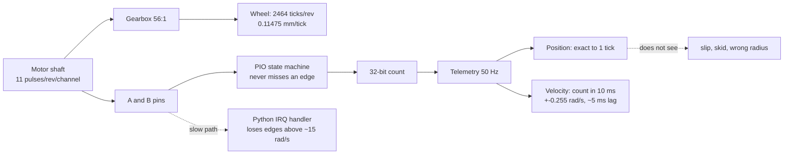

# 07.02 — Wheel encoders in depth: resolution, slip, velocity estimation

<!-- glance:start -->
<!-- generated by tools/build.py from curriculum/syllabus.yaml — edit the syllabus, not this block -->

| | |
|---|---|
| **Track** | Main path |
| **Difficulty** | Intermediate |
| **Time** | 50 min |
| **Hardware** | Stage 1 robot: Pi 5, Pico, encoder motors, driver, chassis, battery, distance sensors (stage 1) |
| **Software** | python |
| **Prerequisites** | [07.01 Sensor fundamentals: accuracy, precision, noise, bias, latency, rate](07.01-sensor-fundamentals.md)<br>[01.12 Use encoders to drive exact distances and angles — drive a square](../01-first-robot/01.12-encoder-distance-and-square.md) |
| **Skip if** | You know the error sources of wheel encoders and how to estimate velocity from ticks. |

<!-- glance:end -->

## What you will learn

- Derive karmel's encoder resolution from the motor spec — 2464 ticks per wheel revolution, 0.11475 mm per tick, 0.0329° of heading per tick — and say when that is too coarse.
- Explain quadrature: why two signals give you direction and 4× the resolution, and what an invalid transition means.
- Choose between the two ways to get *velocity* from ticks (count in a window vs time between edges), with the crossover speed computed for your robot.
- Predict where an encoder lies: wheel slip, turn skid, a wrong wheel radius, counter rollover, and edges lost by a slow interrupt handler.
- Measure the IRQ-vs-PIO tick loss on your own robot, and know why the firmware uses PIO.

## Why it matters

The encoder is the only sensor karmel has that measures *its own motion* directly, and it is the
best one it has: sub-millimetre resolution, 100 % availability, no beam, no lighting, no drift over
short distances. Every centimetre of odometry ([09.03](../09-odometry/09.03-dead-reckoning-integration.md),
[09.04](../09-odometry/09.04-odometry-from-scratch.md)), every wheel-speed PID
([08.04](../08-control/08.04-proportional-control.md)) and every velocity your robot reports to Nav2
starts as a pair of integers from this sensor.

It is also the sensor with the most *interesting* lies. It does not measure where the robot went; it
measures **how far the wheels turned**, which is the same thing only when the tyres do not slip, the
robot does not skid in turns, the wheel radius is exactly what you typed into
[`karmel.yaml`](../labs/config/karmel.yaml), and no edge was lost. Module 09 spends three lessons
calibrating and bounding those errors. This lesson is where you learn to *see* them.

<!-- prereqs:start -->
## Prerequisites

You need these first:

- [07.01 Sensor fundamentals: accuracy, precision, noise, bias, latency, rate](07.01-sensor-fundamentals.md)
- [01.12 Use encoders to drive exact distances and angles — drive a square](../01-first-robot/01.12-encoder-distance-and-square.md)

### Optional prerequisite links

None.

Check your readiness: `python course.py why 07.02`
<!-- prereqs:end -->

## Concept

A quadrature encoder is a **two-bit Gray-code counter driven by the physical world**.

Inside the Yahboom 520 motor, a magnet disc on the *motor* shaft spins past two Hall sensors placed a
quarter of a magnetic period apart. Each produces a square wave; because of the offset, the pair
(A, B) walks through 00 → 10 → 11 → 01 → 00 when the shaft turns one way and the reverse when it
turns the other. That is the entire trick:

- **Direction** comes from *which neighbour* you moved to, not from either signal alone.
- **Resolution** is 4× the magnetic period, because you count every edge of both signals.
- **Only adjacent states are legal.** A jump of two states (00 → 11) is physically impossible; if
  you see one, you missed an edge. That is a built-in error detector, and 07.11 will use it.

Think of it as an event stream that you must *never* drop an event from, because the count is the
running total — there is no re-sync, no checksum, no "please resend". A lost edge is a permanent
0.11 mm error in your position, and a lost edge in the *wrong* direction is 0.23 mm. That is why the
firmware does not count edges in Python.

> [!TIP]
> **Ask your teacher:** "Draw me A and B as square waves, mark the four states, then ask me to name the tick direction for three transitions, including one illegal one."

## Technical explanation

### The sensor card

| | Quadrature wheel encoder (Yahboom 520, Hall, 1:56) |
|---|---|
| **What it measures** | Cumulative rotation of the **wheel** — not the motion of the robot |
| **Physical principle** | Two Hall sensors read a magnet disc on the motor shaft; their square waves are 90° out of phase, so the (A, B) state walks a 4-state ring |
| **Strengths** | 0.11475 mm resolution; always available (no beam, no light, no target); exact integers with no drift over short distances; free (already in the motor); 100 % duty cycle |
| **Weaknesses** | Blind to slip, skid and being carried; depends on a calibrated wheel radius and wheelbase; error accumulates without bound; no absolute reference |
| **Noise** | Position: none beyond ±1 tick quantization (0.115 mm). Velocity: ±0.255 rad/s (±11.5 mm/s at the rim) counting in a 10 ms window |
| **Failure modes** | Wheel slip; turn skid (effective wheelbase); wrong radius or gear ratio in the config; counter rollover; lost edges above ≈ 15 rad/s with an interrupt-based counter; a dead A or B channel (half counts); Pico reboot resetting the count |
| **Rate** | PIO counts continuously; counts reported at 50 Hz telemetry; velocity estimated at 100 Hz in the firmware |
| **Latency** | ≈ one telemetry period (20 ms) for position, plus ≈ T/2 (5 ms) of velocity-window lag and the filter's own lag |
| **Robot applications** | Odometry (09.03–09.06); wheel-speed PID (08.04–08.09); drive-a-known-distance moves; the prediction step of the EKF (10.06) |

### Level 1 — Where 2464 comes from

The datasheet numbers for karmel's motor (from
[HARDWARE.md](../HARDWARE.md) and [`karmel.yaml`](../labs/config/karmel.yaml)):

| Quantity | Value | Why |
|---|---|---|
| Hall pulses per **motor** revolution, one channel | 11 | magnet poles on the disc |
| Quadrature multiplier | 4 | both edges of both channels |
| Gear ratio | 56 : 1 | the 205 RPM version of the Yahboom 520 |
| **Ticks per wheel revolution** | **11 × 4 × 56 = 2464** | |
| Wheel radius | 0.045 m | 90 mm Pololu wheels |

$$\text{metres per tick} = \frac{2\pi r}{N} = \frac{2\pi \times 0.045}{2464} = 1.147\,5\times10^{-4}\ \text{m} = 0.11475\ \text{mm}$$

And because a one-tick difference between the wheels is a rotation about the midpoint:

$$\Delta\theta_{\text{per tick}} = \frac{0.11475\ \text{mm}}{200\ \text{mm}} = 5.737\times10^{-4}\ \text{rad} = 0.0329°$$

Those two numbers are karmel's **quantization floor**: no software can make its odometry finer than
0.11 mm of travel or 0.033° of heading per sample. They are excellent — a 2 m drive is 17 400 ticks —
which is exactly why odometry's real errors come from *systematic* effects, not resolution.

> [!IMPORTANT]
> If you bought the **333 RPM (1:30)** motor instead, your robot has 11 × 4 × 30 = **1320** ticks per revolution and 0.2142 mm per tick. Change `gear_ratio` in `karmel.yaml` **and** `GEAR_RATIO` in [`labs/firmware/pico/config.py`](../labs/firmware/pico/config.py); a lab test checks that the two files agree.

Run it rather than trusting the arithmetic:

```bash
py 07-sensors/code/encoder_lab.py numbers
```

```text
ticks per wheel revolution: 2464
distance per tick:          0.1147 mm
heading per tick difference: 0.0329 deg
edges/s at   1.0 rad/s (one wheel):     392   -> one edge every   2550 us
edges/s at   5.0 rad/s (one wheel):    1961   -> one edge every    510 us
edges/s at  17.0 rad/s (one wheel):    6667   -> one edge every    150 us
edges/s at  21.5 rad/s (one wheel):    8431   -> one edge every    119 us
signed 16-bit counter wraps after 3.76 m
signed 32-bit counter wraps after 246,423.17 m
```

The edge rate is the headline: **6 667 edges per second per wheel at karmel's loaded top speed, one
edge every 150 µs**, and 13 300 per second for the pair. Hold that number; the rest of the lesson
keeps hitting it.

### Level 2 — Velocity from ticks: two methods, one crossover

Position is easy (add up ticks). Velocity is a *derivative of a quantized signal*, which is where
the engineering lives. There are two classical methods
([FM.17](../optional-foundations/mathematics/FM.17-derivatives.md) for the calculus).

**Method 1 — count ticks in a fixed window T** ("frequency method"). Resolution is one tick per
window:

$$\Delta\omega = \frac{2\pi}{N\,T}$$

**Method 2 — time the gap between two edges** ("period method"). With a timer of resolution τ, the
*relative* error is τ divided by the edge interval:

$$\frac{\Delta\omega}{\omega} = \frac{\tau}{2\pi/(N\omega)} = \frac{\tau N \omega}{2\pi}$$

Method 1 is bad at low speed (few ticks per window) and good at high speed. Method 2 is the exact
opposite. They cross where the absolute errors are equal:

$$\omega_{\times} = \frac{2\pi}{N\sqrt{T\tau}}$$

```bash
py 07-sensors/code/encoder_lab.py velocity
```

```text
counting ticks in a window T (resolution = one tick):
  T =     5 ms: +-0.510 rad/s = +- 22.9 mm/s at the rim, lag ~ 2.5 ms
  T =    10 ms: +-0.255 rad/s = +- 11.5 mm/s at the rim, lag ~ 5.0 ms
  T =    20 ms: +-0.127 rad/s = +-  5.7 mm/s at the rim, lag ~ 10.0 ms
  T =    50 ms: +-0.051 rad/s = +-  2.3 mm/s at the rim, lag ~ 25.0 ms
  T =   100 ms: +-0.025 rad/s = +-  1.1 mm/s at the rim, lag ~ 50.0 ms
timing the gap between edges, 1 us hardware timer:
    0.2 rad/s: edge gap  12.750 ms, error   0.01 % = 0.0000 rad/s
    1.0 rad/s: edge gap   2.550 ms, error   0.04 % = 0.0004 rad/s
    5.0 rad/s: edge gap   0.510 ms, error   0.20 % = 0.0098 rad/s
   17.0 rad/s: edge gap   0.150 ms, error   0.67 % = 0.1133 rad/s
  crossover with a 10 ms counting window: 25.50 rad/s
timing the gap between edges, 100 us timestamp jitter (Python IRQ):
    0.2 rad/s: edge gap  12.750 ms, error   0.78 % = 0.0016 rad/s
    1.0 rad/s: edge gap   2.550 ms, error   3.92 % = 0.0392 rad/s
    5.0 rad/s: edge gap   0.510 ms, error  19.61 % = 0.9804 rad/s
   17.0 rad/s: edge gap   0.150 ms, error  66.67 % = 11.3334 rad/s
  crossover with a 10 ms counting window: 2.55 rad/s
```

Read the two crossovers. With a **1 µs hardware timer** the crossover is 25.5 rad/s — above karmel's
top speed, so period timing would win everywhere. With **100 µs of software timestamp jitter** (what
a MicroPython interrupt handler actually achieves) the crossover collapses to 2.55 rad/s, and above
walking pace the period method is *worse* than simply counting.

That is why karmel's firmware counts ticks in a 10 ms window (`CONTROL_HZ = 100`) and low-pass
filters the result: with PIO counting there is no timestamp to trust anyway, and 0.255 rad/s
(11.5 mm/s at the rim) is fine for a velocity PID. **There is no free lunch**: a longer window buys
resolution and pays with lag of about T/2, which shows up directly as phase lag in the control loop
([08.03](../08-control/08.03-wheel-speed-estimation.md) is the whole lesson on this trade-off).

The third option, used by better motor controllers: count ticks *and* timestamp the first and last
edge in the window, so the window is an exact number of tick intervals. It removes the ±1 tick
quantization at any speed. The RP2350's PIO can do it; the course firmware does not, because the
added complexity buys nothing at 100 Hz.

### Level 3 — Where the encoder lies

**(a) Slip.** The wheel turns, the robot does not move as much (or moves without the wheel turning).
On smooth floors with a light robot this is small but never zero; on carpet edges, cables and
thresholds it is large and sudden. Encoders cannot detect it *at all* — the count is perfectly
consistent with a robot that really moved.

**(b) Skid in turns.** When karmel spins, the tyre contact patches must scrub sideways across the
floor. The robot behaves as if its wheels were *further apart* than the ruler says, so the same tick
difference produces less rotation than $\Delta\theta = (d_R - d_L)/b$ predicts. This is a
**systematic** error: always the same sign, always proportional to how much you turned, and therefore
calibratable ([09.05](../09-odometry/09.05-calibrating-odometry.md) fits an effective wheelbase).

```bash
py 07-sensors/code/encoder_lab.py slip
```

```text
label                                   true dist  enc dist   true hdg   enc hdg   gyro hdg
straight, ideal                            1.095     1.094        0.0       0.0        0.0
straight, 5 % slip noise                   1.097     1.094        2.1       0.0        2.1
spin ~1 turn, ideal                        0.000     0.000      363.6     363.6      363.6
spin ~1 turn, scrub (6 % wider track)      0.000     0.000      343.0     363.6      343.1
```

Two lessons in four rows. With **random slip**, the robot drifted 2.1° off course while the encoders
insisted it went perfectly straight — and the gyro saw all 2.1°. With **scrub**, the robot turned
343.0° while the encoders claimed 363.6°: a 6 % error, 20.6° after a single spin, and again the gyro
was right to 0.1°. *This table is the argument for the IMU in 07.05 and for fusing the two in
[10.07](../10-localization/10.07-fusing-imu-and-odometry.md).*

**(c) Wrong radius.** A 1 % error in `wheel_radius_m` (0.45 mm — less than the tread wears off, less
than the difference between an inflated and a squashed tyre under load) is a 1 % error in every
distance forever. 09.05 measures it.

**(d) Rollover.** The counter is a fixed-width integer. karmel's firmware keeps 32-bit counts
(`to_signed32` in [`labs/firmware/pico/encoders.py`](../labs/firmware/pico/encoders.py)), which wrap
after 246 km; a 16-bit counter wraps after **3.76 m**. Handle it with modular arithmetic, not an
`if abs(delta) > big` hack — the derivation is in [09.04](../09-odometry/09.04-odometry-from-scratch.md).

**(e) Lost edges.** The one this lesson exists for. See Level 4.

### Level 4 — Why PIO: the arithmetic of losing edges

Counting edges with a pin interrupt is the obvious design and it is correct — up to a speed. Each
edge raises an interrupt; the handler reads both pins, looks up the transition table, updates the
count. The failure is subtle:

1. Hardware interrupt *flags* do not queue. Two edges arriving while a handler runs merge into one
   pending request.
2. The handler reads the pins when it *runs*, not when the edge happened. If the pins advanced two
   states, the table says 0 (illegal jump) and those ticks vanish. Three states looks like **one step
   backwards**.
3. A MicroPython handler costs tens of microseconds, and the CPU is periodically busy with USB, the
   control loop and flash access.

At 150 µs per edge and two wheels, an edge arrives every ~75 µs. A 60 µs handler is already using
80 % of the CPU and losing races constantly. The course's simulation of exactly this mechanism:

```bash
py 07-sensors/code/encoder_lab.py irq
```

```text
simulated pin-interrupt counting, 2 s per speed (illustrative handler timing):
  wheel [rad/s]   edges/s   true   counted   lost
            2.0       784    1568      1568   0.00 %
            5.0      1961    3921      3917   0.10 %
           10.0      3922    7843      7835   0.10 %
           17.0      6667   13333     13185   1.11 %
           21.5      8431   16862     15952   5.40 %
```

(The handler timings in that model are illustrative, not measured on your board — the *shape* is the
lesson: nothing below walking pace, then a knee, then collapse.) 1.11 % at top speed sounds harmless.
It is not: it is a **one-sided** error — you can only ever lose ticks, never gain them — so it behaves
like a 1 % wheel-radius error that appears *only when you drive fast*, and it is worse on whichever
wheel is turning faster. Drive a 3 m straight line fast and you are 3 cm short; drive it slowly and
you are not. No calibration can fix a parameter that depends on speed.

The RP2350's **PIO** (programmable I/O) solves it by removing the CPU from the loop: a tiny state
machine, independent of the processor, watches the two pins and keeps the count in a register at tens
of millions of steps per second. The CPU reads the register whenever it likes.
[FC.05](../optional-foundations/cpp-and-embedded/FC.05-interrupts-timers-pio.md) explains PIO from
zero; [`labs/firmware/pico/encoders.py`](../labs/firmware/pico/encoders.py) has both implementations
side by side, deliberately, so you can race them.

> [!NOTE]
> MicroPython's `machine.Encoder` class does **not** exist on the rp2 port (only on ESP32 and i.MX RT). If a tutorial tells you to use it on a Pico, it is about a different board.

## Diagram

```text
Quadrature, forward direction (one full electrical cycle = 4 ticks)

 A  ___|‾‾‾‾‾‾‾|_______|‾‾‾‾‾‾‾|_______
 B  _______|‾‾‾‾‾‾‾|_______|‾‾‾‾‾‾‾|___
      ^   ^   ^   ^   ^                     every edge of either signal = 1 tick
 (B,A) 00  01  11  10  00                   legal moves: neighbours only
        \___/\___/\___/\___/                00->11 or 01->10  =  MISSED AN EDGE

 backward = the same ring traversed the other way:  00 -> 10 -> 11 -> 01 -> 00
```



## Code

[`07-sensors/code/encoder_lab.py`](code/encoder_lab.py) — four self-contained experiments, no
hardware, all tested (`py -m pytest 07-sensors/code`):

```bash
py 07-sensors/code/encoder_lab.py numbers    # resolution, edge rates, rollover
py 07-sensors/code/encoder_lab.py velocity   # counting vs period timing, per speed
py 07-sensors/code/encoder_lab.py irq        # why a slow interrupt handler loses edges
py 07-sensors/code/encoder_lab.py slip       # encoders vs truth vs gyro in the simulator
```

Everything comes from `load_config()`, so editing `labs/config/karmel.yaml` re-computes the whole
lesson for *your* robot. The pieces worth reading:

| Function | Does |
|---|---|
| `EncoderGeometry.from_config()` | ticks/rev, radius, wheelbase → `meters_per_tick`, `heading_per_tick_rad`, `edges_per_second(ω)`, `rollover_distance_m(bits)` |
| `counting_resolution_rad_s(N, T)` | the ±1-tick resolution of the counting method |
| `period_relative_error(ω, N, τ)` | the relative error of the period method |
| `crossover_speed_rad_s(N, T, τ)` | where the two methods are equally good |
| `simulate_irq_counting(...)` | edge-by-edge model of a pin-interrupt handler: merged requests, stale pin reads, CPU blocking, unequal Hall phase |
| `drive_and_compare(...)` / `slip_experiment()` | drive the simulator and compare encoder odometry, gyro heading and ground truth |

On the real robot, [`07-sensors/code/pico/encoder_irq_vs_pio.py`](code/pico/encoder_irq_vs_pio.py)
runs **both** counters on the *same* left encoder pins at once and ramps the motor from 20 % to 100 %
duty. PIO is the reference; the difference is what the interrupt handler lost.

> [!CAUTION]
> **Safety:** this script drives the left motor to full duty with no feedback. The robot must stand on a box or a mug with **both wheels off the ground**. Keep fingers, hair and cables clear, keep a hand on the battery switch, and run it with the wheel guard/tyre on. See [SAFETY.md](../SAFETY.md).

```bash
cd labs/firmware/pico
mpremote mount . run ../../../07-sensors/code/pico/encoder_irq_vs_pio.py
```

## Exercise

### Exercise 07.02-E1 — The numbers for your robot `[numerical]`

Hardware: none. From your own `karmel.yaml`, compute by hand and then check with
`py 07-sensors/code/encoder_lab.py numbers`: (a) ticks per wheel revolution; (b) mm per tick;
(c) degrees of heading per single-tick difference; (d) how many ticks one wheel produces in a 20 ms
telemetry period at 0.5 m/s; (e) how far the robot drives before a signed 16-bit counter wraps, and
how many 20 ms samples that is at 0.5 m/s.

### Exercise 07.02-E2 — Predict the IRQ collapse `[predict]`

Hardware: none. Before running `encoder_lab.py irq`, write down: at which wheel speed you expect the
interrupt counter to start losing ticks, whether the loss can ever be *positive* (more ticks than
reality), and what the resulting odometry error looks like after a 3 m straight line at full speed.
Then run it and compare. If your prediction was wrong, say which of the three mechanisms in Level 4
you had not considered.

### Exercise 07.02-E3 — Pick a velocity estimator `[numerical]`

Hardware: none. Your control loop runs at 100 Hz and you want wheel-speed error below 2 % at 1 rad/s
(a slow, careful approach) *and* below 2 % at 15 rad/s (near top speed). Using
`encoder_lab.py velocity`: (a) which window T does the counting method need at 1 rad/s, and what lag
does that cost? (b) does the period method with a 1 µs hardware timer meet both targets? (c) with
100 µs of software jitter? (d) propose the estimator you would actually ship and justify it in two
sentences.

### Exercise 07.02-E4 — See slip and skid in the simulator `[simulation]`

Hardware: none. Run `py 07-sensors/code/encoder_lab.py slip` and read the four rows. Then sweep the
scrub factor yourself (this imports `encoder_lab`, it does not modify it):

```python
import math, sys
from dataclasses import replace
sys.path.insert(0, "07-sensors/code")
from encoder_lab import drive_and_compare
from robotlab.config import load_config
from robotlab.sim import DiffDriveParams

cfg = load_config()
ideal = DiffDriveParams.ideal(cfg)
spin = 2 * math.pi * cfg.drive.wheel_separation_m / 2 / cfg.drive.wheel_radius_m / 4  # ~1 turn in 4 s
for scale in (1.00, 1.03, 1.06, 1.12):
    r = drive_and_compare(f"scale {scale}", replace(ideal, wheel_separation_scale=scale), -spin, spin, 4.0)
    print(f"{scale:.2f}  true {r.true_heading_deg:7.1f}  enc {r.encoder_heading_deg:7.1f}"
          f"  err {r.encoder_heading_deg - r.true_heading_deg:+6.1f}  gyro {r.gyro_heading_deg:7.1f}")
```

Tabulate the heading error against the scale factor and state the relationship. Which sensor in the
table would have caught the error, and which lesson fixes it?

### Exercise 07.02-E5 — Race PIO against interrupts on karmel `[hardware]`

Hardware: `robot-base`.

> [!CAUTION]
> **Safety:** both wheels off the ground, on a stand. The left motor runs up to full duty. Hand on the power switch; Ctrl-C brakes.

1. `cd labs/firmware/pico && mpremote mount . run ../../../07-sensors/code/pico/encoder_irq_vs_pio.py`
2. Record the `edges/s`, `pio_ticks`, `irq_ticks` and `irq_lost` columns for each duty.
3. At which edge rate does your board start losing ticks? Compare with the 6 667 edges/s figure for
   17 rad/s and work out what wheel speed that duty corresponds to.
4. Convert the worst `irq_lost` percentage into centimetres of odometry error over a 3 m drive.

No hardware? Use `encoder_lab.py irq` and state clearly that the handler timing is a model, not a
measurement.

### Exercise 07.02-E6 — Make the wheel lie `[debugging]`

Hardware: `robot-base` (or the simulator). Produce three situations where the encoders are confidently
wrong, and record the encoder-reported distance/heading against the truth for each: (a) lift the robot
and spin a wheel by hand for 5 s — encoders say it travelled, tape measure says it did not;
(b) hold the robot still against a wall and command 40 % duty for 3 s; (c) drive a 360° spin on a
smooth floor and then on a rug, and compare the heading error. In the simulator, reproduce (a) and (b)
with `slip_std` and (c) with `wheel_separation_scale`. For each, say which *other* sensor would have
caught it.

## Expected result

**07.02-E1:** With the 1:56 motor: (a) 2464; (b) 0.11475 mm; (c) 0.0329°; (d) 87 ticks
($0.5/(2\pi\cdot0.045)\times 2464\times 0.02 = 87.1$); (e) 3.76 m, which is 376 samples — about 7.5 s
of driving. With the 1:30 motor: 1320 ticks, 0.2142 mm, 0.0614°, 47 ticks, 7.02 m.

**07.02-E2:** The run shows 0.00 % at 2 rad/s, ~0.1 % at 5 and 10 rad/s, **1.11 % at 17 rad/s** and
**5.40 % at 21.5 rad/s**. The loss is always negative (you can only miss edges, or misread a
three-step jump as one backwards step) so the odometry is always *short*: 3 m at full speed comes out
about 3.3 cm short, and a *faster* wheel loses more, which also bends straight lines. The mechanism
most people miss is #2 — the handler reads the pins late, so a two-step jump is scored as **zero**
rather than as two.

**07.02-E3:** (a) At 1 rad/s, 2 % is 0.02 rad/s; the counting resolution is $2\pi/(2464\,T)$, so
$T > 0.104$ s — a 100 ms window, i.e. ~50 ms of lag, far too slow for a 100 Hz loop. (b) The 1 µs
timer gives 0.04 % at 1 rad/s and 0.67 % at 17 rad/s: it meets both targets comfortably. (c) With
100 µs jitter: 3.92 % at 1 rad/s and 66.67 % at 17 rad/s — it fails both. (d) Ship *counting* in the
10 ms control period (±0.255 rad/s, ~5 ms lag) with a first-order filter, exactly as
`VELOCITY_FILTER_ALPHA` in the firmware does, and accept that low-speed velocity is coarse; or, if
your platform gives you a true hardware timestamp, use period timing below the 25.5 rad/s crossover.
What you must not do is use software timestamps from a Python interrupt.

**07.02-E4:** The encoder heading is 363.6° in every row — the wheels turned the same amount — while
the truth falls as the scrub grows: 363.6° (scale 1.00, error +0.0°), 353.0° (1.03, **+10.6°**),
343.0° (1.06, **+20.6°**), 324.7° (1.12, **+39.0°**). The relationship is proportional: heading error
≈ (scale − 1) × true turn angle, which is why it is systematic and calibratable. The **gyro** column
tracks the truth within 0.1° in every case.
09.05 (UMBmark) fits the effective wheelbase; 10.07 fuses the gyro so you stop caring.

**07.02-E5:** Expect 0.00 % lost at 20–40 % duty and a rise somewhere above 60 %, typically reaching a
few percent at 100 % duty. The exact knee depends on your MicroPython build, the other work the
firmware is doing and the hall sensors' phase error, so *your* numbers are the answer — not the
simulated table. A worst loss of 1 % is 3 cm over 3 m; 5 % is 15 cm. If you see **0 % at every duty**,
check that the IRQ counter is really attached to the same pins and that the motor is actually reaching
full speed (a flat battery will hide the effect).

**07.02-E6:** (a) The wheel spun freely: encoders report metres, the robot moved 0 cm. Nothing but an
IMU, a range sensor or a camera can notice. (b) Stalled against the wall: encoders report ~0 (correct
this time) while the motors overheat and the current sense climbs — here the *encoder* is right and
the naive "commanded velocity" model is wrong. (c) The rug typically shows a several-degree larger
heading error than the smooth floor, with more run-to-run scatter, because slip is random rather than
systematic. In the simulator, `slip_std=0.05` reproduces (a)/(b)-style random error (the course run
drifts 2.1° over a 1.1 m straight) and `wheel_separation_scale` reproduces (c)'s systematic part.
The gyro catches (a) and (c); a range sensor or camera catches (a) and (b).

## Troubleshooting

### Symptom: one wheel counts, the other does not

1. Put the robot on a stand. Turn each wheel by hand one full revolution and read the counts:
   both should change by 2464 ± 2.
2. If one stays at 0, it is wiring or power: the encoder needs its 3.3 V supply and both A and B
   connected. Check continuity and that the PH2.0 connector is fully seated
   ([02.09](../02-robot-electronics/02.09-electrical-debugging-method.md)).
3. If one counts only **half** as much, one channel is dead: you are seeing edges from A only.
   Scope or `Pin.value()`-poll both pins while turning slowly.
4. If one counts the wrong way, flip `ENCODER_*_REVERSED` in the firmware config rather than
   re-wiring ([01.09](../01-first-robot/01.09-reading-encoders.md)).

### Symptom: counts drift only at high speed

1. Compare against PIO with `encoder_irq_vs_pio.py`. If the IRQ count is short and PIO is not, you
   are in Level 4: lost edges.
2. If **both** are short, the problem is before the counter: an encoder supply sagging under motor
   current, or long unshielded encoder wires picking up PWM noise. Add a 100 nF capacitor at the
   encoder, separate the encoder wires from the motor wires, and re-test.
3. Confirm with the built-in detector: count how often the transition table sees an illegal jump. A
   rising illegal-jump rate with speed is a lost-edge signature.

### Symptom: odometry distance is consistently 2 % off, at every speed

That is not an encoder fault, it is a **parameter** fault: the wheel radius, the gear ratio or the
tick count in your config. Drive a tape-measured 2 m straight ten times, take the median, and fix
`wheel_radius_m` — the procedure is [09.05](../09-odometry/09.05-calibrating-odometry.md). Check the
gear ratio first: a 1:30 motor with 1:56 in the config is a 1.87× error, not a 2 % one.

### Symptom: heading is right when driving straight and wrong after turns

Skid. The error scales with the total angle turned, not with distance. Verify by spinning 10 full
turns and comparing with the gyro or with a floor mark; then calibrate the effective wheelbase (09.05)
and, better, fuse the gyro (10.07).

### Symptom: a huge jump in position once in a while

Rollover or a Pico reboot. Both are covered with a decision procedure in
[09.04](../09-odometry/09.04-odometry-from-scratch.md): a modular delta fixes rollover; a telemetry
timestamp going backwards identifies a reboot.

## Common mistakes

- **Assuming "11 PPR" means 11 ticks per wheel revolution.** It is 11 per *motor* revolution, per
  channel, before the ×4 and before the gearbox.
- **Copying 2464 into code.** Read it from `load_config()`; your motor may be the 1:30 version.
- **Differentiating a filtered or rounded distance** to get velocity. Count raw ticks over a known
  interval instead.
- **Timestamping edges in Python** and calling it the period method. 100 µs of jitter destroys it
  above 2.55 rad/s.
- **Treating lost ticks as noise.** They are one-sided and speed-dependent: a bias that appears only
  when you drive fast.
- **Trusting the encoder about the *robot*.** It only knows about the *wheel*. Slip, skid and a lifted
  robot are all invisible to it.
- **Fixing rollover with `if abs(delta) > 10000: ignore`.** Use modular arithmetic.
- **Re-testing after every change with a different battery charge.** Wheel speed at a given duty falls
  with voltage, which moves every number in this lesson.

## Knowledge check

1. Your robot has a 1:30 gearbox and 11 PPR Hall encoders. How many ticks per wheel revolution, and how many millimetres per tick with 90 mm wheels?
   <details><summary>Answer</summary>

   $11 \times 4 \times 30 = 1320$ ticks. $2\pi \times 0.045 / 1320 = 2.142\times10^{-4}$ m =
   **0.2142 mm** per tick. Roughly half karmel's resolution — still far better than any other sensor
   on the robot.
   </details>

2. Why does quadrature give 4× the resolution of a single channel, and what extra thing does it give you that a single channel cannot?
   <details><summary>Answer</summary>

   Two square waves 90° apart have four distinct (A, B) states per electrical cycle, and you count
   every edge of both, so one cycle is four ticks. The extra thing is **direction**: with one channel
   you see pulses but cannot tell forward from backward, which makes it useless for odometry on a
   robot that reverses.
   </details>

3. At 17 rad/s, how many microseconds pass between edges on one wheel, and why does that number decide the firmware architecture?
   <details><summary>Answer</summary>

   $17/(2\pi)\times 2464 = 6667$ edges/s → **150 µs**, and ~75 µs for the pair. A MicroPython
   interrupt handler takes tens of microseconds, so the CPU would be saturated and edges arriving
   during a handler would merge and be lost. Hence PIO: a state machine that counts without the CPU.
   </details>

4. Predict: you count ticks in a 5 ms window at 100 Hz. What is the wheel-speed resolution, and what happens to a PID tuned on that signal?
   <details><summary>Answer</summary>

   $2\pi/(2464\times 0.005) = \pm0.510$ rad/s (±22.9 mm/s at the rim). At a commanded 1 rad/s the
   measurement flips between roughly 0.5 and 1.5 rad/s, so the derivative term amplifies pure
   quantization noise into duty chatter, and the integral term chases it. Either lengthen the window
   (more lag) or low-pass filter — which is exactly what
   [08.03](../08-control/08.03-wheel-speed-estimation.md) and `VELOCITY_FILTER_ALPHA` do.
   </details>

5. Your robot spins in place 10 times. Encoders report 3636°, the gyro reports 3430°. Which is right, and what do you do?
   <details><summary>Answer</summary>

   The gyro. The encoders cannot see the tyres scrubbing sideways, so they over-report rotation by a
   constant factor — here 3636/3430 = 1.060, i.e. a 6 % effective-wheelbase error. Fix: calibrate the
   effective wheelbase (09.05 UMBmark, run clockwise and counter-clockwise), then fuse the gyro
   (10.07) so residual skid stops mattering.
   </details>

6. Debugging: straight-line odometry is accurate at 0.1 m/s and reads 1 % short at 0.5 m/s. Name the two most likely causes and how to tell them apart in five minutes.
   <details><summary>Answer</summary>

   (1) Lost edges in a software counter — one-sided and speed-dependent. (2) Real wheel slip under
   higher acceleration. Tell them apart by running `encoder_irq_vs_pio.py` on a stand: if the IRQ
   count is short of the PIO count at that speed, it is lost edges (and switching to PIO fixes it);
   if both agree, the wheels are slipping and no counter change will help.
   </details>

7. Why is the "illegal transition" (00 → 11) worth counting in production firmware?
   <details><summary>Answer</summary>

   It is a free integrity check on a sensor that otherwise has none. The count is a running total with
   no checksum and no re-sync, so a silent lost edge is a permanent error. An illegal-transition
   counter turns "my odometry drifts" into "I lost 240 edges in the last minute, all above 15 rad/s",
   which is a diagnosis. 07.11 builds this kind of health metric for every sensor.
   </details>

8. Karmel drives 246 km before its 32-bit counter wraps. Why does the course still teach rollover?
   <details><summary>Answer</summary>

   Because most other encoder sources are narrower: STM32 hardware timer encoder interfaces are
   typically 16-bit (3.76 m on karmel!), many motor controllers report 16-bit counts, and some report
   an 8- or 12-bit register. Code that handles deltas modularly is correct on all of them and costs one
   line. The simulator can reproduce it with `dataclasses.replace(DiffDriveParams.ideal(), encoder_bits=12)`.
   </details>

## Practical challenge

**An encoder health monitor.** Extend the Pico firmware (a *copy* — do not edit
`labs/firmware/pico/encoders.py` in place) with a `MonitoredEncoders` class that, alongside the PIO
counts, reports per wheel:

- the illegal-transition count from a parallel IRQ decoder,
- the measured edge rate and the peak edge rate seen,
- the estimated tick loss (PIO count − IRQ count) as a running percentage,
- a health flag that trips when loss exceeds 0.2 % over one second.

Acceptance criteria:

- Runs on karmel (wheels off the ground) through a duty ramp 0 → 100 % → 0 and prints one line per
  100 ms without slowing the 100 Hz control loop measurably (compare loop-period statistics before
  and after).
- The health flag trips at the duty your E5 run identified, and does not trip below it, over three
  repeats.
- A CPython test using the course's MicroPython shims (see `07-sensors/code/test_code.py` for the
  pattern) that feeds a synthetic edge sequence containing two deliberate double-steps and asserts the
  illegal-transition count is 2.
- A short write-up: at what wheel speed *your* robot must stop trusting an interrupt-based counter,
  and the resulting odometry error per metre if you ignored it.

## You can skip this if…

You can answer knowledge-check questions 3, 5 and 6 without looking, you know your robot's
ticks-per-revolution and millimetres-per-tick from memory, and you can state which error sources of a
wheel encoder are calibratable and which are not. Then:

`python course.py skip 07.02 --reason "I know encoder error sources and how to estimate velocity from ticks"`

## Go deeper

- Raspberry Pi RP2350 datasheet, chapter 11 (PIO): https://datasheets.raspberrypi.com/rp2350/rp2350-datasheet.pdf — the state machine that counts karmel's edges, in full detail; read it next to `labs/firmware/pico/encoders.py`.
- MicroPython rp2 quick reference: https://docs.micropython.org/en/latest/rp2/quickref.html — `rp2.asm_pio`, `StateMachine`, and why `machine.Encoder` is absent on this port.
- Yahboom 520 motor documentation (encoder pulses, gear ratios, supply): https://www.yahboom.net/public/upload/upload-html/1740736196/0.%20Motor%20introduction%20and%20usage.html — the source of the 11 PPR / 1:30 / 1:56 numbers.
- Borenstein & Feng, "Correction of Systematic Odometry Errors in Mobile Robots" (IROS 1995): https://johnloomis.org/ece445/topics/odometry/borenstein/paper59.pdf — the classic separation of *systematic* (wheelbase, radius) from *non-systematic* (slip, bumps) encoder errors, and the UMBmark test you run in 09.05.
- ros2_controllers `diff_drive_controller` odometry source (jazzy): https://github.com/ros-controls/ros2_controllers/blob/jazzy/diff_drive_controller/src/odometry.cpp — how a production controller turns wheel positions into a twist, including its rolling-window velocity estimate.

## Progress checkpoint

- [ ] I can derive my robot's ticks/revolution, mm/tick and degrees/tick from the motor spec.
- [ ] I can explain quadrature, direction decoding and what an illegal transition means.
- [ ] I can choose a velocity estimator for a given speed range and justify the lag it costs.
- [ ] I can name the encoder error sources that are calibratable and those that are not.
- [ ] I have measured (or modelled) tick loss on my own robot and know its safe speed.

`python course.py complete 07.02` (exercises done) · `python course.py master 07.02` (challenge done) · `python course.py struggle 07.02 "what was hard"`

Next: [07.03 — Ultrasonic sensors: sound, cones and ghost echoes](07.03-ultrasonic-sensors.md).
