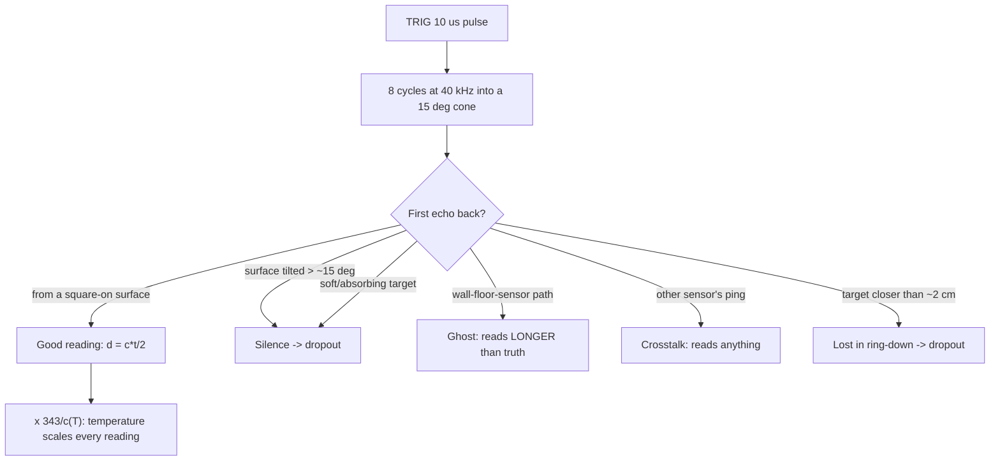

# 07.03 — Ultrasonic sensors: sound, cones and ghost echoes

<!-- glance:start -->
<!-- generated by tools/build.py from curriculum/syllabus.yaml — edit the syllabus, not this block -->

| | |
|---|---|
| **Track** | Main path |
| **Difficulty** | Beginner |
| **Time** | 45 min |
| **Hardware** | Stage 1 robot: Pi 5, Pico, encoder motors, driver, chassis, battery, distance sensors (stage 1) |
| **Software** | python |
| **Prerequisites** | [07.01 Sensor fundamentals: accuracy, precision, noise, bias, latency, rate](07.01-sensor-fundamentals.md) |
| **Skip if** | You can predict which surfaces an ultrasonic sensor will miss. |

<!-- glance:end -->

## What you will learn

- Compute distance from an echo time, and explain why the US-100's error is a **gain**, not an offset.
- Predict the reading error from air temperature — with Israeli winter and summer numbers — and correct it.
- Work out what the 15° beam cone actually covers at 0.25 m, 1 m and 3 m, and why "the obstacle is 80 cm ahead" is a lie.
- Predict which surfaces the sensor will miss (angled walls, soft targets) and which will produce ghost echoes.
- Derive the maximum ping rate and the blind zone from physics, and explain crosstalk between two sensors.
- Decide when an ultrasonic sensor is the right choice and when it is the wrong one.

## Why it matters

The US-100 costs about ₪40 and is the sensor that first makes karmel *react to the world*
([01.13](../01-first-robot/01.13-distance-sensors-stop.md)). It sees glass, matte black cardboard and
a dark room equally well — three things that defeat an optical ToF sensor and a camera. It is also
the sensor most likely to send your robot into a table leg, because it is blind to anything not facing
it squarely, and it will happily report an obstacle 1 m away that is actually a floor reflection.

Understanding *why* costs one lesson and saves you a week. It also teaches the general pattern you
will meet again with LiDAR (07.07) and depth cameras (07.09): a range sensor does not measure "the
distance to the thing in front"; it measures **the shortest path a wave found back to the receiver**,
which is a very different statement.

<!-- prereqs:start -->
## Prerequisites

You need these first:

- [07.01 Sensor fundamentals: accuracy, precision, noise, bias, latency, rate](07.01-sensor-fundamentals.md)

### Optional prerequisite links

None.

Check your readiness: `python course.py why 07.03`
<!-- prereqs:end -->

## Concept

Shout in a canyon, count the seconds, multiply by the speed of sound, halve it. That is the whole
sensor. The US-100 shouts at **40 kHz**, far above hearing, into a cone in front of it, and measures
how long until the first echo comes back.

Three consequences follow, and every failure of the sensor is one of them.

1. **Sound is slow, and its speed depends on the air.** At 343 m/s an echo from 1 m takes 5.8 ms —
   slow enough to time with a cheap microcontroller, which is why the sensor is cheap. But that
   343 is a *number the firmware assumes*, and the real value changes by 3 % between a Jerusalem
   winter night and a Tel Aviv August afternoon. A wrong speed of sound is a wrong *scale*.
2. **Sound spreads out.** The transducer is a few millimetres across and 40 kHz sound has an 8.6 mm
   wavelength, so the beam cannot be a pencil. It is a **cone**, roughly 15° wide for the US-100.
   Anything inside that cone can be the echo. The reading is the distance to the **nearest** thing in
   the cone, and you have no idea where inside the cone it was.
3. **Sound reflects like light off a mirror, not like a diffuse surface.** At 40 kHz, a painted wall,
   a desk and a floor are *acoustically polished*. If the surface is not roughly facing the sensor,
   the echo goes somewhere else — and your sensor hears silence, or hears an echo that took a
   two-bounce path and reports a distance much larger than the truth.

Think of it as sonar in a mirrored room while wearing a blindfold. You can hear a wall in front of
you perfectly; a wall at 30° is invisible; and sometimes you hear yourself from the wrong direction.

> [!TIP]
> **Ask your teacher:** "Give me five surfaces around my apartment and ask me to predict, before I test, whether the US-100 will see them, miss them, or report a ghost."

## Technical explanation

### The sensor card

| | US-100 (pulse mode) |
|---|---|
| **What it measures** | Distance to the nearest acoustically reflective surface inside its cone |
| **Physical principle** | Time of flight of a 40 kHz sound burst; $d = c\,t/2$ |
| **Strengths** | Cheap (≈ ₪40, Sept 2026); works in total darkness; sees glass, transparent plastic, matte black; wide cone catches large obstacles; 3.3 V safe |
| **Weaknesses** | Wide cone (no bearing information); slow (echo from 4 m takes 23 ms); temperature-dependent scale; blind zone ~2 cm; one reading per ping |
| **Noise** | σ ≈ 2–5 mm on a flat wall at 0.1–3 m, roughly **independent of distance** |
| **Failure modes** | Specular miss on angled surfaces (> ~15°); absorption by soft targets; ghost echoes via multipath; crosstalk between sensors; ring-down blind zone; false "max range" when the echo never returns |
| **Rate** | ≈ 25 Hz physical limit for a 4.5 m range; **10 Hz** in karmel's firmware (`SENSOR_HZ`) |
| **Latency** | Up to 30 ms *blocking* per ping (`US100_TIMEOUT_US`), + the 100 ms sensor task period + telemetry |
| **Robot applications** | Emergency stop / bump prevention; cliff-free corridor following; a cheap "is anything close?" safety layer complementing a LiDAR |

### Level 1 — The equation, and what "half" means

$$d = \frac{c \cdot t_{\text{echo}}}{2}$$

$t_{\text{echo}}$ is the **round trip**: out and back. The factor of 2 is the single most common
beginner bug. In karmel's firmware that division lives in one readable function,
[`labs/firmware/pico/sensors.py`](../labs/firmware/pico/sensors.py):

```python
def echo_time_to_mm(pulse_us, speed_of_sound_m_s=config.SPEED_OF_SOUND_M_S):
    return int(pulse_us * speed_of_sound_m_s / 2000.0)
```

At $c = 343$ m/s that is `mm ≈ pulse_us × 0.1715`. A 5 827 µs echo is 999 mm.

The measurement sequence: pull TRIG high for 10 µs; the module emits eight 40 kHz cycles; ECHO goes
high; ECHO goes low when the first echo is detected (or at timeout). `machine.time_pulse_us` measures
that high time, returning −1/−2 if no pulse arrived — which the driver turns into `None`, a dropout,
not a zero.

### Level 2 — Temperature: a scale error, and Israel makes it big

The speed of sound in dry air:

$$c(T) = 331.3\,\sqrt{1 + \frac{T}{273.15}}\ \text{m/s}$$

(Humidity adds under 0.5 %; pressure, to a good approximation, does not matter at all.) The firmware
assumes a fixed 343 m/s, so the reported distance is scaled by $343/c(T)$:

```bash
py 07-sensors/code/range_physics.py
```

```text
Speed of sound and the US-100 reading of a target at exactly 1.000 m (firmware assumes 343 m/s):
  air [C]   c [m/s]   echo [ms]   reading [mm]   error [mm]   error [%]
        0     331.3      6.037        1035.3        35.3       3.53
       15     340.3      5.878        1008.0         8.0       0.80
       20     343.2      5.827         999.4        -0.6      -0.06
       25     346.1      5.778         991.0        -9.0      -0.90
       35     351.9      5.684         974.7       -25.3      -2.53
       45     357.6      5.594         959.3       -40.7      -4.07
```

Read this as an Israeli robot owner:

- **Winter, unheated Jerusalem apartment at 12 °C**: readings are **+1.33 % long**. A wall at 3.00 m
  reports 3.04 m.
- **Calibration day, 20 °C**: essentially exact, because the firmware constant was chosen for 20 °C.
- **August in Tel Aviv, 35 °C indoors without air conditioning**: **−2.53 %**. The 3.00 m wall reports
  2.92 m — **7.6 cm short**.
- **A closed car or a sunny balcony at 45 °C**: −4.07 %, i.e. 12 cm short at 3 m.

Cold reads long, hot reads short, and the error is **proportional to distance** — a *gain*, which is
exactly what the calibration line of [07.01](07.01-sensor-fundamentals.md) is built to find. Between a
winter calibration and a summer drive, the swing is about 3.9 % — 12 cm at 3 m. That matters for an
obstacle threshold set at 30 cm (3.9 % = 1.2 cm, fine) far less than for a wall-following controller
using 2 m readings.

**The fix**, in order of effort: (a) recalibrate the gain seasonally with a 20-minute static test;
(b) put the assumed speed of sound in the config and set it from a thermometer; (c) read a temperature
sensor — the BNO055 you add in 07.05 has one, and karmel's Pico has an internal one — and compute
$c(T)$ every ping. Option (c) is about ten lines and removes the error permanently.

### Level 3 — The cone: what "80 cm ahead" really means

A circular transducer radiates into a cone. For a full angle $\alpha$, the circle it illuminates at
distance $d$ has radius

$$r = d\,\tan\frac{\alpha}{2}$$

```text
Beam footprint radius (15 deg US-100 cone vs 27 deg VL53L1X full FoV vs 4x4 ROI ~ 6.8 deg):
  distance [m]   US-100 [cm]   VL53L1X [cm]   VL53L1X 4x4 ROI [cm]
          0.25           3.3            6.0                   1.5
          0.50           6.6           12.0                   2.9
          1.00          13.2           24.0                   5.9
          2.00          26.3           48.0                  11.8
          3.00          39.5           72.0                  17.7
```

At 1 m the US-100 is listening to a **26 cm-wide** disc; at 3 m, a **79 cm-wide** disc — wider than
karmel (20 cm) and wider than many doorways are clear. Three practical consequences:

1. **A reading has no bearing.** "0.80 m" means "something is 0.80 m away, somewhere in a 21 cm disc".
   You cannot steer around it; you can only stop or back up. (This is precisely what a LiDAR fixes,
   and why 07.07 exists.)
2. **The floor and the ceiling are in the cone.** Mounted 5 cm up and tilted down by a few degrees,
   the cone hits the floor at about 1 m and the sensor reports a permanent phantom obstacle. Mount it
   level, or slightly *up*, and check with a tape measure and a test drive across empty floor.
3. **Narrow obstacles are found but not located.** A chair leg 30 cm off-axis at 2 m is inside the
   cone. The robot stops for something it would have driven past.

Real beam patterns are not clean cones: manufacturers publish lobed plots that also depend on target
size and supply voltage (MaxBotix's beam-pattern guide, linked below, is the best free explanation).
The cone is a usable first-order model; treat it as "at least this wide".

### Level 4 — Specular reflection, soft targets, ghosts, blind zone and crosstalk

**Specular miss.** At 40 kHz an ordinary wall is smooth compared with the 8.6 mm wavelength, so it
reflects like a mirror. A ray hitting a wall tilted by $\theta$ leaves at $2\theta$ from the incoming
direction, and by the time it returns to the sensor plane it has walked sideways by

$$s = d\,\tan(2\theta)$$

| wall tilt | sideways walk of the echo at 1 m |
|---|---|
| 2° | 7.0 cm |
| 5° | 17.6 cm |
| 10° | 36.4 cm |
| 15° | 57.7 cm |
| 30° | 173.2 cm |

The receiver is a couple of centimetres wide. Past roughly 10–15° of tilt the central ray's echo has
missed it entirely, and what saves you is only the *edges* of the cone and surface roughness. Beyond
about 15–20°, a US-100 facing a flat wall typically hears **nothing at all** — and "nothing" is
reported as "no obstacle". The course bench reproduces this: at a 30° wall angle, the simulated
US-100 drops 82–100 % of its readings at every distance, while the ToF sensor drops under 5 %.

**Soft targets.** Foam, curtains, thick clothing and — famously — a person in a wool coat absorb
ultrasound instead of reflecting it. The echo may be too weak to trigger, so you get a dropout or a
much longer reading from something behind. A robot that stops for walls and drives into people is not
a hypothetical.

**Ghost echoes (multipath).** The path sensor → wall → floor → sensor is longer than sensor → wall →
sensor, so the sensor reports a target that is not there, *further* than the real one. Corners are
the worst: two perpendicular surfaces form a retro-reflector that returns a strong echo from a
geometry you did not intend. Ghosts are almost always *longer* than the truth, which is a useful
signature: a reading that jumps outward and back is a ghost; a reading that jumps inward is usually
crosstalk or noise.

**Blind zone.** The transducer keeps ringing after its own burst (it is the same element that
receives), so echoes arriving during ring-down are drowned. For 120 µs of ring-down:

$$d_{\min} = \frac{c\,t_{\text{ring}}}{2} = \frac{343 \times 120\times10^{-6}}{2} = 2.1\ \text{cm}$$

which is why `US100.MIN_MM = 20` in the driver. **Closer than ~2 cm the sensor does not report "very
close" — it reports nothing, or the range of whatever it finds next.** Never let "no reading" mean
"clear" at low speed near a wall.

**Maximum rate.** You must wait for the farthest possible echo, plus time for reverberation to die:

$$f_{\max} \approx \frac{1}{1.5 \times 2 d_{\max}/c}$$

For karmel's 4.5 m timeout that is **25 Hz**; for a 1 m maximum it would be 114 Hz. Ping faster than
that and the *previous* ping's late echo arrives during the current measurement window and is reported
as a very short distance — a self-inflicted phantom obstacle.

**Crosstalk.** Two ultrasonic sensors on one robot hear each other. Sensor A's ping reflects into B's
receiver, and B reports whatever half-round-trip that implies — often a close, convincing, entirely
fictional obstacle. Fixes: fire them in strict sequence with a settle gap (karmel's logger uses
`US_SETTLE_MS = 60`), point them apart, or give each a different burst pattern. Note that a US-100 and
a VL53L1X do **not** interfere: 40 kHz sound and 940 nm light share nothing.

## Diagram

```text
Specular reflection: why a tilted wall is invisible

  square-on wall (theta = 0)                wall tilted 15 deg
  ┌──────────────────┐                      ┌───────────
  │                  │                     /   echo leaves at 2*theta = 30 deg
  │<----- d -------->│                    /        ↗
  │                  │                   /     ↗
 [S]═════ ping ═════>│                  /  ↗
 [S]<==== echo ══════│                 /↗              ↘ 57.7 cm sideways at d = 1 m
                                    [S]═══ ping ═══>          (receiver is ~2 cm wide)
  strong echo, good reading           [S]  ...silence...


The cone: one number, a whole disc

           .  .  .  .  .            r = d*tan(7.5 deg)
       .              .   .
   [S] - - - - - - - - - - - -  axis      d = 1.0 m  ->  r = 13.2 cm  (26 cm disc)
       ^  .           .   .               d = 3.0 m  ->  r = 39.5 cm  (79 cm disc)
       15 deg  .  .  .  .
                                  a chair leg 30 cm off-axis at 2 m IS inside the cone
```



## Code

**Physics, computed not typed** — [`07-sensors/code/range_physics.py`](code/range_physics.py) holds
every number in this lesson as a small pure function:

```bash
py 07-sensors/code/range_physics.py
```

| Function | Does |
|---|---|
| `speed_of_sound(air_temp_c)` | $331.3\sqrt{1+T/273.15}$ |
| `echo_time_s(distance_m, air_temp_c)` | round-trip time |
| `ultrasonic_reading_m(true_m, air_temp_c, assumed_speed)` | what a firmware assuming 343 m/s reports |
| `beam_footprint_radius_m(d, full_angle_deg)` | the disc the cone covers |
| `max_ping_rate_hz(max_range_m, temp, decay)` | the rate limit |
| `blind_zone_m(ring_down_s, temp)` | the minimum range |
| `specular_miss_distance_m(d, incidence_deg)` | how far sideways a mirror echo lands |

**The bench, with no hardware** — [`range_bench_sim.py`](code/range_bench_sim.py) models the US-100
including the temperature gain and the specular cliff, and writes the same CSV format as the real
logger:

```bash
py 07-sensors/code/range_bench_sim.py --sensor us100 --temp-c 20 --out t20.csv
py 07-sensors/code/range_bench_sim.py --sensor us100 --temp-c 35 --out t35.csv
py 07-sensors/code/range_bench_sim.py --sensor both --wall-angle-deg 30 --out angled.csv
py 07-sensors/code/sensor_stats.py t35.csv --plot t35.png
```

**On the robot** — [`code/pico/range_logger.py`](code/pico/range_logger.py) alternates the US-100 and
the VL53L1X so both see the same scene, waiting `US_SETTLE_MS = 60` between pings so the previous
echo has died:

```bash
cd labs/firmware/pico
mpremote mount . run ../../../07-sensors/code/pico/range_logger.py \
  | python ../../../07-sensors/code/sensor_stats.py tag --true-m 1.00 --out bench.csv
```

## Exercise

### Exercise 07.03-E1 — Echo arithmetic `[numerical]`

Hardware: none. By hand, then checked with `range_physics.py`: (a) the echo time for a target at
0.25 m and at 4.00 m at 20 °C; (b) the distance a firmware assuming 343 m/s reports for a 2.00 m
target on a 38 °C Tel Aviv day, and the error in centimetres; (c) the air temperature at which a
343 m/s firmware is exactly right; (d) the highest safe ping rate if you only care about obstacles
within 1.5 m, and why you would want that.

### Exercise 07.03-E2 — Predict the surfaces `[predict]`

Hardware: none (prediction), `robot-base` (verification). Before testing, predict **see / miss /
ghost** for each of: a painted wall square-on at 1 m; the same wall at 30°; a closed window;
a closed cotton curtain; a chair leg at 1 m; a person in a wool sweater at 1.5 m; a cardboard box in a
room corner; the floor 1 m ahead with the sensor tilted 5° down. Write one sentence of physics per
prediction. Keep the list for E5.

### Exercise 07.03-E3 — The temperature gain `[simulation]`

Hardware: none.

```bash
py 07-sensors/code/range_bench_sim.py --sensor us100 --temp-c 12 --out winter.csv
py 07-sensors/code/range_bench_sim.py --sensor us100 --temp-c 35 --out summer.csv
py 07-sensors/code/sensor_stats.py winter.csv
py 07-sensors/code/sensor_stats.py summer.csv
```

For each run write down the fitted calibration line, and compare its gain with $343/c(T)$ from
`range_physics.py`. Then answer: if you calibrate in winter and drive in summer, how wrong is a 2.5 m
reading? Is it long or short? Would a fixed **offset** correction have helped?

### Exercise 07.03-E4 — The cone and the doorway `[numerical]`

Hardware: none. Karmel is 20 cm wide and drives down the middle of an 80 cm doorway, with the US-100
on the centre line. (a) At what distance from the doorway does the cone start touching the frame?
(b) What will the sensor report there, and what will a naive "stop below 40 cm" rule do? (c) Repeat
for the VL53L1X's 27° cone and for its 4×4 ROI (≈ 6.8°) using the table above. (d) State in one
sentence why the wide cone is a *feature* for emergency stopping and a *bug* for doorway traversal.

### Exercise 07.03-E5 — Characterize your US-100 `[hardware]`

Hardware: `robot-base` (US-100).

> [!CAUTION]
> **Safety:** the robot stays still, but the battery is live. Power switch within reach, robot on a non-conductive surface, and never leave the Li-ion pack charging unattended ([SAFETY.md](../SAFETY.md)).

1. Run the 07.01 protocol: 200 readings at 0.05, 0.10, 0.25, 0.50, 1.00, 2.00 and 3.00 m against a
   flat wall, tagged into one `bench.csv`, then `sensor_stats.py bench.csv --plot bench.png`.
2. Find your **blind zone**: keep moving the target closer until readings stop, in 5 mm steps.
3. At a fixed 1.00 m, repeat 100 readings for each surface in your E2 list. Record dropout rate,
   mean and σ per surface.
4. Rotate the wall in 5° steps from 0° to 40° at 1.00 m and record the dropout rate at each angle.
   Where is *your* specular cliff?
5. Note the room temperature. Compute the gain correction and check it against your fitted line.

### Exercise 07.03-E6 — Hunt a ghost `[debugging]`

Hardware: `robot-base`, or the simulator with `--wall-angle-deg 30`. Place the robot 40 cm from a
corner where two walls meet, facing into the corner at roughly 45°, and log 200 readings. You should
see a bimodal histogram or readings far longer than any real surface. Then: (a) explain the path the
sound took, with a sketch and the arithmetic of the path length; (b) show that a median over 5
readings does *not* remove it while a validity check against the room geometry does; (c) propose a
rule your robot could apply in real time, and state its false-negative risk.

## Expected result

**07.03-E1:** (a) 1.457 ms and 23.31 ms at 20 °C. (b) At 38 °C, $c = 353.6$ m/s, so the reading is
$2.00 \times 343/353.6 = 1.940$ m: **6.0 cm short**. (c) 343 m/s corresponds to $T = 19.6$ °C — the
table's 20 °C row shows a residual error of only −0.6 mm at 1 m. (d) For a 1.5 m range,
$f_{\max} = 1/(1.5 \times 2\times1.5/343) = 76$ Hz. You would want it because at 0.5 m/s a 10 Hz
sensor moves 5 cm between readings; 76 Hz moves 0.7 cm.

**07.03-E2:** Wall square-on → **see** (strong specular return straight back). Wall at 30° → **miss**
(the echo walks 1.7 m sideways at 1 m). Closed window → **see**, and this is the ultrasonic's best
trick: glass is acoustically hard even though it is optically transparent. Cotton curtain → **miss or
weak** (absorption, plus the fabric moves). Chair leg at 1 m → **see**, but with no bearing: it is
somewhere in a 26 cm disc. Person in wool at 1.5 m → **miss or short-range only**; this is the classic
dangerous case. Box in a corner → **ghost**: the corner retro-reflects and you may read a path longer
than the box. Floor at 5° down-tilt → **phantom obstacle**: mounted 5 cm up, the
*lowest* ray of the cone points 12.5° down and meets the floor at a slant range of
$0.05/\sin(12.5°) \approx 0.23$ m (the axis reaches the floor only at $0.05/\tan(5°) \approx 0.57$ m),
so the sensor reports a constant ≈ 0.23 m for ever. Compute it for your own mounting height and tilt.

**07.03-E3:** Winter (12 °C): the fit is `measured = 1.0133 * true -0.0 mm`, biases **+6.8 mm at
0.5 m and +39.8 mm at 3 m**; the physical prediction is $343/338.5 = 1.0133$ — exact. Summer (35 °C): the fit is
`measured = 0.9748 * true -0.2 mm`, biases **−13.0 mm at 0.5 m and −75.6 mm at 3 m**; prediction
$343/351.9 = 0.9747$. Calibrating in winter and driving in summer leaves a gain error of
$0.9748/1.0133 = 0.962$, so a true 2.5 m reads about **2.40 m — 9.5 cm short**. A fixed offset would
not help at all: the error is proportional to distance, so an offset tuned at 1 m would double the
error at 3 m.

**07.03-E4:** (a) The cone half-angle is 7.5°; it reaches 30 cm off-axis (the gap between the robot's
centre line and the frame) at $0.30/\tan(7.5°) = 2.28$ m — so from 2.28 m away the frame is already in
the beam. (b) The sensor reports the *nearest* thing in the cone, so as the robot approaches it
reports the slant range to the frame edge, which shrinks toward 40 cm and below: a "stop below 40 cm"
rule stops the robot in the middle of a doorway it fits through easily. (c) The VL53L1X's 27° cone
reaches 30 cm off-axis at $0.30/\tan(13.5°) = 1.25$ m — better; the 4×4 ROI (full angle ≈ 6.75°,
half-angle 3.375°) only at $0.30/\tan(3.375°) = 5.09$ m — outside the room, so the narrow ROI never
sees the frame at all, which is exactly what you want for driving through a doorway. (d) Wide is good for "is there anything at all in front of me" (nothing
thin can slip between the rays) and bad for "can I fit through", because a wide cone cannot
distinguish an obstacle in the path from one beside it.

**07.03-E5:** Typical results on a flat wall: σ of 2–5 mm at every distance (**flat**, unlike the
ToF's growing σ), near-zero dropouts out to 2–3 m, and a blind zone somewhere between 2 and 4 cm below
which readings vanish. The surface table typically shows near-100 % dropout on a curtain and on the
wall past 15–25°, and a *longer* mean on the box-in-corner case. If your bias is a constant few
millimetres rather than proportional, your room is near 20 °C; if it is proportional, compute the
implied temperature and check it against a thermometer — that cross-check is the satisfying part.

**07.03-E6:** The extra path is sensor → wall A → wall B → sensor, so the reported distance is roughly
*half the total path*, typically 1.5–3× the direct distance; the histogram shows a cluster at the true
range and a second cluster further out, with dropouts in between. (b) A 5-reading median fails when
the ghost is the *majority* of readings (in a corner it often is), because the median follows the
mode, not the truth. (c) Real-time rules that work: reject readings that jump by more than
$v_{\max}\Delta t$ plus a margin since the last accepted one; reject readings longer than the largest
plausible room dimension; require two consecutive consistent readings before acting. Each has the same
false-negative risk — a genuine sudden change (a door opening, a person stepping in) also looks like a
jump — so use them to *delay* trust by one sample, not to discard data permanently.

## Troubleshooting

### Symptom: the sensor always reports the maximum range (or nothing)

1. Check wiring and mode first. The US-100 has a jumper on the back: **removed = pulse (TRIG/ECHO)
   mode**, present = UART mode. With the jumper in place, TRIG/ECHO do nothing.
2. Confirm power: 3.3 V is fine for the US-100 (an HC-SR04 needs 5 V and a divider on ECHO).
3. Put your hand 20 cm in front. If that reads and a wall at 1 m does not, the wall is tilted or
   absorbing: rotate the robot slowly and watch the reading appear.
4. If even the hand fails, listen: a working module makes a faint tick when pinged in a quiet room at
   1 Hz. No tick means the module or the TRIG line is dead.

### Symptom: readings jump between a plausible value and something much larger

Ghost echoes. Log 200 readings without moving and look at the histogram (`sensor_stats.py --plot`).
Two clusters = multipath. Change *one* thing at a time: move the robot 20 cm sideways, tilt the sensor
up 5°, or put a towel on the floor in front. Whichever change kills the far cluster identifies the
surface doing the second bounce.

### Symptom: a phantom obstacle at a fixed distance that never goes away

Almost always the floor (or the robot's own chassis) in the cone. Measure the mounting height and
tilt; the cone edge hits the floor at $h/\tan(\alpha/2 - \text{tilt})$. Drive across an empty floor and
watch whether the phantom distance stays constant — a constant reading while driving is geometry, not
an obstacle.

### Symptom: two ultrasonic sensors each see obstacles that are not there

Crosstalk. Disable one in software; if the phantom disappears, that is your answer. Fix by firing in
sequence with ≥ 60 ms between pings, or by pointing them at least 45° apart.

### Symptom: distance is right at 30 cm but wrong at 3 m

A gain error — almost always temperature. Fit a calibration line over several distances (07.01), note
the room temperature, and compare the gain with $343/c(T)$. If the gain does not match the thermometer,
suspect a firmware constant you changed or a clock rate that is not what you think it is.

## Common mistakes

- **Forgetting the factor 2.** Every reading doubles. It is obvious once you see a wall at 1 m report
  2 m.
- **Treating no-echo as zero distance.** The driver returns `None`; keep it `None`.
- **Treating no-echo as "clear".** Angled walls and soft targets are exactly the obstacles you most
  want to avoid.
- **Assuming a fixed speed of sound.** It is the sensor's *scale factor*, and in Israel it varies by
  ~4 % across the year.
- **Pinging as fast as the loop allows.** The previous echo comes back during the next window and is
  reported as a very near obstacle.
- **Mounting it tilted down "to see the floor".** The cone finds the floor and never lets go.
- **Believing the reading is straight ahead.** It is the nearest thing in a cone 26 cm wide at 1 m.
- **Using one ultrasonic sensor as the only obstacle sensor.** Pair it with the ToF (07.04): their
  failure modes barely overlap, which is the whole point of 07.04's head-to-head.

## Knowledge check

1. A US-100 reports an echo pulse of 3 000 µs. How far is the target at 20 °C, and how far would the same pulse mean at 35 °C?
   <details><summary>Answer</summary>

   $d = c t/2$. At 20 °C: $343.2 \times 0.003 / 2 = 0.515$ m. At 35 °C: $351.9 \times 0.003/2 = 0.528$ m.
   The *firmware* would report 0.515 m in both cases (it assumes 343 m/s), so on the hot day it is
   1.3 cm short — 2.5 %.
   </details>

2. Why is the temperature error a gain and not an offset, and why does that make it more dangerous at long range?
   <details><summary>Answer</summary>

   Because distance is $c\,t/2$ and only $c$ is wrong: the reported distance is the true one multiplied
   by $343/c(T)$. A multiplicative error is a fixed *percentage*, so it is 1 mm at 4 cm and 12 cm at
   3 m. Any correction must be a division by the gain, not a subtraction.
   </details>

3. Predict: a flat wall at 1 m, rotated to 25°. What does the sensor report, and what does your obstacle-avoidance code do?
   <details><summary>Answer</summary>

   Almost certainly **nothing** — the specular echo walks $1.0 \times \tan(50°) = 1.19$ m sideways, far
   outside the receiver. The code sees "no reading", and if it treats that as "clear", the robot drives
   into the wall. Treat a dropout as *unknown*, and at speed as a reason to slow down.
   </details>

4. Your robot has a 4.5 m maximum range and you ping at 40 Hz. What goes wrong?
   <details><summary>Answer</summary>

   The physical limit is ≈ 25 Hz ($1/(1.5 \times 2 \times 4.5/343)$). At 40 Hz (25 ms period) an echo
   from 4 m (23.3 ms round trip, plus reverberation) arrives during the *next* measurement window and
   is timed from the wrong ping, producing a short, convincing, false reading. Either lower the rate or
   lower the max range (and the timeout) to match.
   </details>

5. The ultrasonic sees a closed window that the ToF sensor misses completely. Why?
   <details><summary>Answer</summary>

   Glass is optically transparent at 940 nm, so the ToF's laser goes through and ranges whatever is
   behind it (or nothing). Acoustically, glass is very hard — a huge impedance mismatch with air — so
   it reflects nearly all the ultrasound straight back. Different physics, different blind spots: this
   is the argument for having both.
   </details>

6. Debugging: a robot with two ultrasonic sensors stops randomly in an empty corridor. Both sensors are fine when tested alone. What is it, and what is the five-minute test?
   <details><summary>Answer</summary>

   Crosstalk: each sensor hears the other's ping and converts the arrival time into a fictitious short
   range. Five-minute test: disable one sensor in software and drive the corridor again. If the
   phantom stops disappear, fire them in strict sequence with ≥ 60 ms between pings (as
   `range_logger.py` does) or separate them in angle.
   </details>

7. Why does the US-100 have a minimum range of about 2 cm, and why can you not fix it in software?
   <details><summary>Answer</summary>

   The same transducer transmits and receives; after the burst it keeps ringing for ~100 µs, during
   which any echo is buried. $c\,t/2 = 343 \times 120\,\mu s/2 = 2.1$ cm. Software cannot hear through
   the ring-down. The only fixes are hardware: separate transmit and receive transducers, or a
   different sensor for the last few centimetres (the VL53L1X reaches 4 cm; a bumper switch reaches 0).
   </details>

8. You calibrate the sensor in December at 15 °C and drive in August at 33 °C. Give the gain error and the distance error on a 2 m reading.
   <details><summary>Answer</summary>

   $c(15°) = 340.3$, $c(33°) = 350.7$ m/s. The December calibration effectively assumes 340.3; in
   August the true speed is 350.7, so the corrected reading is scaled by $340.3/350.7 = 0.9703$. A true
   2.00 m reads **1.941 m — 5.9 cm short**. Recalibrate seasonally or compute $c(T)$ from a
   thermometer.
   </details>

## Practical challenge

**Temperature-compensated ultrasonic ranging on karmel.** Make the speed of sound a measured quantity
rather than a constant.

Acceptance criteria:

- A firmware change (in *your copy* of `labs/firmware/pico/sensors.py`) that takes the air temperature
  from a source you justify — the Pico's internal temperature sensor with a stated offset, the BNO055's
  temperature register (07.05), or a value pushed from the Pi — and computes $c(T)$ per ping instead of
  using `SPEED_OF_SOUND_M_S`.
- A CPython unit test (use the shim pattern in `07-sensors/code/test_code.py`) proving
  `echo_time_to_mm` is correct at 0 °C, 20 °C and 40 °C to within 1 mm at 1 m.
- Two static characterization runs at the same distances in genuinely different air temperatures
  (≥ 10 °C apart — an air-conditioned room vs a balcony, or morning vs afternoon), before and after
  your change, each with its fitted calibration line. Show that the gain moves from ≈ $343/c(T)$ to
  ≈ 1.000 in both conditions.
- A one-paragraph error budget: after compensation, what is left (transducer tolerance, humidity, the
  temperature sensor's own error, the cone), and is the sensor now good enough for a 2 m wall-following
  controller?
- Safety: the robot does not move during the tests; if you add a drive test, wheels off the ground
  first.

## You can skip this if…

You can answer knowledge-check questions 2, 3 and 5 without looking, and you can predict which
surfaces in a room your ultrasonic sensor will miss *before* testing them. Then:

`python course.py skip 07.03 --reason "I can predict which surfaces an ultrasonic sensor will miss and why"`

## Go deeper

- MaxBotix, "Reading MaxSonar Sensor Beam Patterns": https://maxbotix.com/pages/reading-maxsonar-beam-patterns — real measured beam plots for several targets and supply voltages; the antidote to the clean-cone model used above.
- Engineering ToolBox, speed of sound in air vs temperature (formula and table): https://www.engineeringtoolbox.com/air-speed-sound-d_603.html — the reference for the $c(T)$ numbers in this lesson (343.3 m/s at 20 °C).
- Siegwart, Nourbakhsh & Scaramuzza, *Introduction to Autonomous Mobile Robots*, MIT Press: https://mitpress.mit.edu/9780262015356/introduction-to-autonomous-mobile-robots/ — section 4.1.6 covers ultrasonic ranging, beam cones and specular failure on wheeled robots.
- Thrun, Burgard & Fox, *Probabilistic Robotics*, MIT Press: https://mitpress.mit.edu/9780262201629/probabilistic-robotics/ — chapter 6.3's beam model turns "ghost echoes and dropouts" into a four-component likelihood you can actually filter with.
- Stachniss, *Mobile Sensing and Robotics 1* lectures (Uni Bonn): https://www.ipb.uni-bonn.de/msr1-2021/index.html — the range-sensing lectures, with the same physics applied to LiDAR in 07.07.

## Progress checkpoint

- [ ] I can compute distance from echo time and explain the factor of 2.
- [ ] I can predict and correct the temperature gain error for my own room.
- [ ] I can compute the beam footprint at any distance and explain what a reading does *not* tell me.
- [ ] I can predict which surfaces the sensor will miss and which will produce ghosts.
- [ ] I know my sensor's blind zone, maximum rate and crosstalk behaviour.

`python course.py complete 07.03` (exercises done) · `python course.py master 07.03` (challenge done) · `python course.py struggle 07.03 "what was hard"`

Next: [07.04 — Optical time-of-flight sensors (VL53L1X)](07.04-tof-sensors.md).
