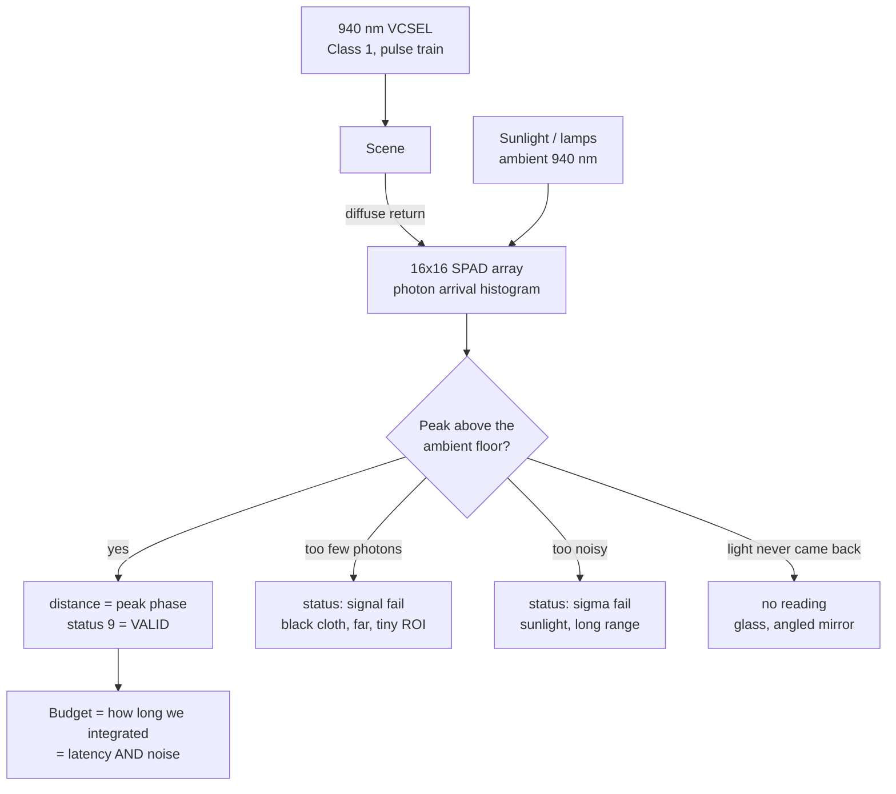

# 07.04 — Optical time-of-flight sensors (VL53L1X)

<!-- glance:start -->
<!-- generated by tools/build.py from curriculum/syllabus.yaml — edit the syllabus, not this block -->

| | |
|---|---|
| **Track** | Main path |
| **Difficulty** | Beginner |
| **Time** | 45 min |
| **Hardware** | Stage 1 robot: Pi 5, Pico, encoder motors, driver, chassis, battery, distance sensors (stage 1) |
| **Software** | python |
| **Prerequisites** | [07.01 Sensor fundamentals: accuracy, precision, noise, bias, latency, rate](07.01-sensor-fundamentals.md) |
| **Skip if** | You have compared ToF and ultrasonic on the same targets. |

<!-- glance:end -->

## What you will learn

- Explain how a 4-shekel-sized chip times a 6.7-picosecond-per-millimetre round trip, and why it counts photons instead of stopwatching one pulse.
- Trade **timing budget** against rate and noise, and pick a distance mode for your lighting.
- Use the **region of interest** to narrow the 27° field of view to ≈ 6.75° and know what that costs.
- Predict the sensor's behaviour on black cloth, a mirror, glass, a sunlit floor and an angled wall — from the signal and ambient photon rates, not from folklore.
- Run a head-to-head bench against the US-100 and state, with numbers, which sensor to trust for which obstacle.

## Why it matters

The VL53L1X is the other half of karmel's ranging pair, and the two sensors fail in almost perfectly
complementary ways. The ultrasonic is blind to a wall tilted 30° and sees a closed window; the ToF
handles the tilted wall easily and looks straight through the window. Neither is trustworthy alone;
together, disagreement between them is *information* — which is the first taste of sensor fusion you
get in this course, and the reason [01.13](../01-first-robot/01.13-distance-sensors-stop.md) wires
both.

The VL53L1X is also a genuinely modern sensor in a hobby package: a 940 nm laser, a 16×16 array of
single-photon avalanche diodes, and a configurable integration time. Almost everything you learn here
scales up — a ToF depth camera (07.09) and a solid-state LiDAR are the same physics with more pixels,
and they fail on the same targets for the same reasons.

<!-- prereqs:start -->
## Prerequisites

You need these first:

- [07.01 Sensor fundamentals: accuracy, precision, noise, bias, latency, rate](07.01-sensor-fundamentals.md)

### Optional prerequisite links

None.

Check your readiness: `python course.py why 07.04`
<!-- prereqs:end -->

## Concept

> [!NOTE]
> **Laser safety.** The VL53L1X emits invisible 940 nm infrared light and is a **Class 1** laser product — safe under all normal conditions of use, including staring into it. Class 1 means no hazard, not "be careful". The only real rule: do not view it through a magnifier, microscope or telescope, and do not remove the module's optics.

Light travels 300 000 km/s. To measure a millimetre you must resolve

$$t = \frac{2 \times 0.001}{299\,792\,458} = 6.67\ \text{picoseconds}$$

Nothing in a ₪100 module has a 6.67 ps stopwatch. So the sensor does not use one. Instead it sends a
**train** of laser pulses for a while (the *timing budget*, typically 20–200 ms), and an array of
single-photon detectors counts, for each returning photon, *when in the pulse cycle* it arrived. After
millions of pulses the histogram of arrival phases has a peak, and the position of that peak is the
distance. It is a statistical measurement, and that single fact explains every behaviour in this
lesson:

- **More time = less noise.** Doubling the timing budget roughly halves the variance, because you have
  twice as many photons.
- **Farther = noisier.** Returned light falls as $1/d^2$, so σ grows with distance.
- **Darker target = noisier.** A black surface returns maybe 5 % of what a white one does.
- **Sunlight is poison.** Ambient 940 nm photons land in the histogram as a flat floor that the peak
  must stick out of. Enough sun and there is no peak at all.
- **Shiny and angled = nothing.** A mirror-like surface at an angle sends the light away, exactly like
  the ultrasonic's specular miss — but with a much better tolerance, because most "matte" surfaces are
  rough at 940 nm even though they are smooth at 8.6 mm.

The mental model: **it is a photon counter with a stopwatch, and you are always trading integration
time against noise, range and update rate.**

> [!TIP]
> **Ask your teacher:** "Explain why the VL53L1X's sigma grows with distance from photon statistics, first with no equations, then with the square-root-of-counts argument and a number."

## Technical explanation

### The sensor card

| | VL53L1X (Pololu carrier, default long mode) |
|---|---|
| **What it measures** | Distance to the first surface returning enough 940 nm light, inside the selected ROI |
| **Physical principle** | Indirect time of flight: a 940 nm Class 1 VCSEL pulses, a 16×16 SPAD array histograms photon arrival phases, the peak gives $d = c\,t/2$ |
| **Strengths** | Narrow, configurable field of view (27° full, ≈ 6.75° with a 4×4 ROI); 1 mm resolution; works on an angled wall; up to 50 Hz; reports *why* a reading failed (range status) and how strong the signal was |
| **Weaknesses** | Range collapses in bright ambient light; fails on very dark, very shiny and transparent targets; short maximum range (≈ 4 m in the dark, ≈ 1.3 m in short mode); needs I²C |
| **Noise** | σ grows with distance and falls with timing budget. Course bench: **1.5 mm at 0.1 m, 3.3 mm at 1 m, 9.8 mm at 3 m** |
| **Failure modes** | Ambient saturation (sunlit floor, halogen lamp); no return from black cloth or a tilted mirror; **sees through glass** and ranges what is behind; cover-glass crosstalk; wrong target when two surfaces are inside the ROI |
| **Rate** | 1 / timing budget, capped by the inter-measurement period: up to 50 Hz (short), 30 Hz (long). Course firmware: **10 Hz** (100 ms budget, `SENSOR_HZ = 10`) |
| **Latency** | ≈ the timing budget (the reading is an *average over* that window), + the sensor task period + telemetry: ≈ 120–230 ms end to end in the default firmware |
| **Robot applications** | Obstacle stopping with a known bearing; wall/door-gap measurement; cliff detection (pointed down); short-range docking; the "second opinion" that disagrees with the ultrasonic |

### Level 1 — Why photon counting, with numbers

```bash
py 07-sensors/code/range_physics.py
```

```text
Light: round trip for 1 mm = 6.67 ps; for 4 m = 26.69 ns
Relative return signal and shot-noise sigma vs distance (1 m = 1.0):
  distance [m]   signal   sigma (dark)   sigma (ambient = 3x signal at 1 m)
           0.5    4.000           0.50                                 0.33
           1.0    1.000           1.00                                 1.00
           2.0    0.250           2.00                                 3.61
           3.0    0.111           3.00                                 7.94
           4.0    0.062           4.00                                14.00
```

The whole round trip from 4 m takes 26.7 ns. Within that, resolving 1 mm means resolving 6.67 ps —
about one part in 4000. You get it statistically: if you count $N$ photons, the uncertainty in the
histogram peak scales as $\sqrt N / N = 1/\sqrt N$ (Poisson **shot noise**;
[FM.14](../optional-foundations/mathematics/FM.14-distributions-gaussians-noise.md)).

Returned photons from a diffuse target fall as $1/d^2$, so $N \propto 1/d^2$ and

$$\sigma \propto \frac{\sqrt{N}}{N} = \frac{1}{\sqrt N} \propto d$$

**σ grows linearly with distance in the dark** — the "sigma (dark)" column: 1× at 1 m, 2× at 2 m, 4× at
4 m. Add ambient light $A$ (photons you did not send) and the peak must be found on top of a noisy
floor:

$$\sigma \propto \frac{\sqrt{N + A}}{N}$$

With ambient equal to 3× the signal you would get at 1 m, σ at 3 m is **7.94×** the 1 m dark value
instead of 3× — the "sigma (ambient)" column. That is why the sensor that works to 4 m in your
hallway dies at 1 m on a sunlit balcony, and why the fix is *less range, more robustness*
(short mode), not *more power*.

Compare the measured course bench (07.01): σ 1.5 mm → 3.3 mm → 9.8 mm at 0.1 / 1 / 3 m. The growth
from 1 m to 3 m is 3.0×, matching the dark prediction almost exactly.

### Level 2 — Timing budget, distance mode, inter-measurement period

Three knobs, and they interact.

**Timing budget** — how long the sensor integrates for one measurement. Longer = more photons =
lower σ and longer range, but a lower rate and more latency. ST's driver allows 20/33/50/100/200/500 ms
in long mode and 15 ms as well in short mode.

**Distance mode** — `short` or `long`, which changes the laser pulse period (VCSEL period) and the
phase window the sensor accepts. `long` reaches ≈ 4 m in the dark; `short` reaches ≈ 1.3 m but is
**much more immune to ambient light**, because the narrower window rejects photons that cannot have
come from within that range.

**Inter-measurement period** — how often a new measurement *starts*. Must be ≥ the timing budget. Set
it equal to the budget for continuous ranging; set it longer to save power.

| Mode | Budget | Typical use on karmel |
|---|---|---|
| long | 100 ms | Power-on default; the course firmware's setting; 10 Hz, best range |
| long | 200 ms | Bench characterization: lowest σ, 5 Hz |
| long | 33 ms | 30 Hz for a reactive stop, at the cost of σ and range |
| short | 20 ms | Outdoors / bright room, up to 50 Hz, ≈ 1.3 m |
| short | 100 ms | Bright room where you want the quietest possible short-range reading |

> [!IMPORTANT]
> **Version-sensitive** (verified 2026-09 against the ST VL53L1X datasheet and ST's Ultra Lite Driver as ported by SparkFun). ST publishes **no register map** for this part: the register addresses and magic values in [`code/pico/tof_modes.py`](code/pico/tof_modes.py) are copied from ST's reference driver, not derived. If you upgrade the driver, re-check the values against the current ULD source rather than trusting this file. Datasheet: https://www.st.com/resource/en/datasheet/vl53l1x.pdf · API user manual: https://www.st.com/resource/en/user_manual/um2356-vl53l1x-api-user-manual-stmicroelectronics.pdf

### Level 3 — The region of interest: buying a narrow beam in software

The receiver is a **16×16 array of SPADs** behind one lens. The full array sees a 27° cone. Select a
smaller window of SPADs and you see a proportionally narrower cone — this is a genuine optical field
of view change, done in a register, with no lens.

$$\alpha_{\text{ROI}} \approx 27° \times \frac{n}{16}$$

| ROI | Approx. full FoV | Footprint radius at 1 m | at 2 m | at 3 m |
|---|---|---|---|---|
| 16×16 (default) | 27.0° | 24.0 cm | 48.0 cm | 72.0 cm |
| 8×8 | 13.5° | 11.8 cm | 23.7 cm | 35.5 cm |
| 4×4 (ST's minimum) | 6.75° | 5.9 cm | 11.8 cm | 17.7 cm |

(The US-100's 15° cone sits between the 8×8 and 16×16 rows: 13.2 cm at 1 m.)

What it costs: fewer SPADs collect fewer photons, so a 4×4 ROI has roughly $16/256 = 1/16$ the signal
of the full array — about 4× the σ, or a 4× longer timing budget to get back to where you were, and a
shorter maximum range. **A narrow beam is not free; you pay for it in photons.**

What it buys, concretely: karmel driving through an 80 cm doorway on the centre line. The full 27° cone
first touches the door frame at $0.30/\tan(13.5°) = 1.25$ m and reports the frame instead of the clear
path ahead; the 4×4 ROI would only touch it at $0.30/\tan(3.375°) = 5.09$ m, i.e. never in a real
room. You can also *move* the ROI window within the array, which is how people build a cheap three-zone
"left / centre / right" sensor from a single VL53L1X.

### Level 4 — Targets, ambient light, and the status code

Every measurement also reports the **signal rate** and **ambient rate** in kcps (kilo-counts per
second). Those two numbers are the sensor telling you exactly why it is struggling, and
[`tof_modes.py`](code/pico/tof_modes.py) prints them:

```text
mode   budget  roi     valid   mean_mm  sigma_mm  signal_kcps  ambient_kcps  rate_hz
```

- **Signal high, ambient low** → everything is fine.
- **Signal low, ambient low** → dark or distant target: increase the budget, or accept the range limit.
- **Signal low, ambient high** → sunlight or a lamp: switch to `short` mode, shade the sensor, or give
  up on that range.
- **Signal high, ambient high, distance nonsense** → probably cover-glass crosstalk (see
  Troubleshooting).

Target behaviour, in order of how often it bites people:

| Target | What happens | Why |
|---|---|---|
| White/grey matte wall | Best case; full range | High diffuse reflectance at 940 nm |
| **Matte black cloth, black plastic** | Range collapses (often < 0.5 m) or no reading | Reflectance may be a few percent; note some "black" plastics are *bright* at 940 nm, and some whites are dark — 940 nm reflectance is not what your eyes report |
| **Glass, clear plastic** | Reads **through** it: the wall behind, or nothing | 940 nm passes through; only a few percent reflects |
| **Mirror, polished metal, at an angle** | No reading | Specular: the light leaves at $2\theta$ |
| Mirror, exactly perpendicular | Reads correctly, sometimes *too* strongly | A retro-reflection straight back |
| **Sunlit floor / window** | Short range, high σ, or invalid | Ambient photons swamp the histogram |
| Two surfaces in the ROI (edge of a table) | A reading somewhere between them, or flicker | The histogram has two peaks |

**Range status.** The VL53L1X does not just say "no reading"; it says why. The course driver treats
status 9 (`RANGE_VALID`) and 8 (`RANGE_VALID_MIN_CLIPPED`, target closer than the minimum) as good and
everything else as `None`. In your own diagnostics, log the raw status: "signal fail" (weak return),
"sigma fail" (the measurement is too noisy to trust), "phase out of bounds" and "wrap-around" each
point at a different physical cause. That is a level of self-reporting no ultrasonic sensor gives you.

### Level 5 — Head to head with the US-100

Same wall, same distances, same bench — the only difference is the physics. From the course bench
(`range_bench_sim.py --sensor both`), wall square-on at 20 °C:

| | US-100 | VL53L1X |
|---|---|---|
| Calibration line | `0.9994 · true − 0.2 mm` | `1.0002 · true + 7.9 mm` |
| Error type | **gain** (temperature) | **offset** |
| σ at 0.25 m / 1 m / 3 m | 2.9 / 2.8 / 2.9 mm | 1.7 / 3.3 / 9.8 mm |
| σ vs distance | flat | grows ∝ d |
| Dropouts at 3 m | 0.5 % | **19 %** |
| Outliers | 1–3.5 % (ghost echoes) | 0–1.2 % |
| Beam at 1 m | 26 cm disc | 48 cm disc (full) / 12 cm (4×4 ROI) |

Now change one thing — **rotate the wall 30°**:

| true [m] | US-100 dropout | US-100 mean | VL53L1X dropout | VL53L1X bias |
|---|---|---|---|---|
| 0.50 | **84.0 %** | 1.011 m (ghosts) | 1.0 % | −40.3 mm |
| 1.00 | **82.0 %** | 1.989 m (ghosts) | 0.5 % | −88.6 mm |
| 2.00 | **91.0 %** | 3.832 m (ghosts) | 0.5 % | −184.9 mm |
| 3.00 | **100 %** | — | 4.0 % | −282.8 mm |

The ultrasonic essentially stops working, and the few readings it does produce are **ghosts roughly
twice the true distance**. The ToF keeps working — but note its bias: it now reads *short*, by about
9 % of the distance. That is not a defect either; the wall is tilted, so the nearest point of the wall
inside the 27° cone genuinely is closer than the point on the axis. **A cone sensor always reports its
nearest hit.** Narrow the ROI and that bias shrinks with the cone.

And change the *other* thing — **35 °C air** (a Tel Aviv August):

| | US-100 | VL53L1X |
|---|---|---|
| bias at 1 m | −25.3 mm | +8.2 mm (unchanged) |
| bias at 3 m | −75.6 mm | +8.2 mm (unchanged) |
| fitted gain | 0.9748 | 1.0002 |

Light does not care about air temperature. The rule that falls out:

> **Trust the ToF for geometry (angles, gaps, bearing), trust the ultrasonic for material (glass,
> black, anything the light goes through or dies on), and treat disagreement as "slow down".**

## Diagram



```text
Field of view is a register, not a lens

   16x16 SPADs, 27 deg                     4x4 SPADs, 6.75 deg
        \             /                          \    /
         \   48 cm   /  at 2 m                    \11.8 cm/  at 2 m
          \  wide   /                              \  /
           \       /                                \/
           [=====]  full array                    [=]  centre window
                                                  1/16 of the photons -> ~4x the sigma
```

## Code

**[`07-sensors/code/pico/tof_modes.py`](code/pico/tof_modes.py)** extends the course driver
([`labs/firmware/pico/vl53l1x.py`](../labs/firmware/pico/vl53l1x.py), which only uses the power-on
defaults) with the three settings this lesson is about, plus a richer read:

```python
tof = VL53L1XModes(i2c)
tof.configure(mode="short", budget_ms=20, roi=(4, 4))
distance_mm, status, signal_kcps, ambient_kcps = tof.read_full(timeout_ms=200)
```

| Method | Does |
|---|---|
| `set_distance_mode("short"/"long")` | VCSEL period + phase window |
| `set_timing_budget_ms(ms)` | integration time; raises `ValueError` on a value the mode does not allow |
| `set_inter_measurement_ms(ms)` | how often a measurement starts (≥ budget) |
| `set_roi(w, h, center)` | SPAD window, minimum 4×4 |
| `configure(mode, budget_ms, roi)` | stop → apply all three → restart → discard the stale measurement |
| `read_full(timeout_ms)` | `(mm or None, status, signal_kcps, ambient_kcps)` |
| `summarize(readings)` | valid fraction, mean, σ, mean signal, mean ambient |

Running the built-in sweep on the robot (six configurations, 50 readings each):

```bash
cd labs/firmware/pico
mpremote mount . run ../../../07-sensors/code/pico/tof_modes.py
```

**With no hardware**, the bench models the ToF's distance-dependent σ, its offset bias, its 1 mm
resolution and its far-range dropouts:

```bash
py 07-sensors/code/range_bench_sim.py --sensor both --out square.csv
py 07-sensors/code/range_bench_sim.py --sensor both --wall-angle-deg 30 --out angled.csv
py 07-sensors/code/sensor_stats.py square.csv --plot square.png
py 07-sensors/code/sensor_stats.py angled.csv
```

and [`range_physics.py`](code/range_physics.py) supplies `light_round_trip_s`,
`relative_return_signal`, `shot_noise_sigma_scale` and `vl53l1x_roi_fov_deg`.

## Exercise

### Exercise 07.04-E1 — Photons and picoseconds `[numerical]`

Hardware: none. (a) What timing resolution do you need for 1 cm, and for 1 mm? (b) A target at 2 m
returns what fraction of the photons a target at 0.5 m returns? (c) Using
`shot_noise_sigma_scale`, by what factor does σ grow from 1 m to 3 m in the dark, and with ambient
light equal to 3× the 1 m signal? (d) The course bench measures σ = 3.3 mm at 1 m. Predict σ at 2 m and
4 m in the dark and compare with the measured 5.6 mm at 2 m.

### Exercise 07.04-E2 — Predict the targets `[predict]`

Hardware: none (prediction), `robot-base` (verification). For each target at 1 m, predict the
**distance reported**, the **signal rate** (high/low) and the **ambient rate** (high/low): white wall
in a dim room; the same wall with the ceiling lights on; black cotton T-shirt; a mirror square-on; the
same mirror at 20°; a closed window with a wall 3 m behind it; a sunlit tiled floor; the edge of a
table exactly at the middle of the ROI. Write the physical reason for each. Keep the list.

### Exercise 07.04-E3 — Head to head in simulation `[simulation]`

Hardware: none. Run the bench four times: square-on at 20 °C, square-on at 35 °C, at 15° wall angle,
and at 30° wall angle (`--wall-angle-deg`). For each run record, per sensor: fitted gain and offset,
σ at 1 m, and dropout rate at 1 m and 3 m. Then write the two-sentence decision rule you would put in
karmel's obstacle code: when do you believe the ToF, when the ultrasonic, and what do you do when they
disagree by more than 20 cm?

### Exercise 07.04-E4 — Sweep the modes on hardware `[hardware]`

Hardware: `robot-base` (VL53L1X).

> [!CAUTION]
> **Safety:** the robot stays still; the battery is live, so keep the power switch reachable and the robot on a non-conductive surface. The laser is **Class 1 — eye-safe**; do not view it through any magnifying optics and do not disassemble the module. Never leave the Li-ion pack charging unattended ([SAFETY.md](../SAFETY.md)).

1. Target: a flat white wall at a tape-measured 1.00 m, room lights on.
2. `cd labs/firmware/pico && mpremote mount . run ../../../07-sensors/code/pico/tof_modes.py`
3. Record all six rows: valid %, mean, σ, signal, ambient, rate.
4. Repeat the sweep with (a) the room dark, (b) a desk lamp aimed at the target from beside the
   sensor, (c) the target replaced by black cloth, (d) the target moved to 3.00 m.
5. Produce one table: for each condition, the configuration you would choose and why, in terms of
   signal and ambient kcps.

No hardware? Do E3 instead and state explicitly which of these effects the simulation does *not*
model (it models σ vs distance, offset, resolution, outliers and dropouts — it does not model ambient
light, ROI, timing budget or target reflectance).

### Exercise 07.04-E5 — The doorway, for real `[design]`

Hardware: none (design), `robot-base` (optional test). Karmel (20 cm wide) must drive through an 80 cm
doorway without stopping, and must still stop for a chair leg in its path. Design the sensing:
which sensor(s), which ROI, which mode and budget, mounted where, with what decision rule. Compute the
distance at which each candidate configuration first sees the door frame (use the footprint table) and
the distance at which it would see a 4 cm chair leg on the centre line. State the failure case your
design still has.

### Exercise 07.04-E6 — Make it lie `[debugging]`

Hardware: `robot-base`, or the simulator for parts of it. Produce and explain four wrong readings:
(a) point the sensor at a closed window and show it reports the wall behind (or nothing);
(b) point it at a mirror at ~20° and show it reports nothing while the ultrasonic still hears the
mirror's frame; (c) aim a desk lamp or sunlight into it and show the range collapsing, with the
ambient kcps to prove it; (d) put the edge of a table across the middle of the ROI and show the
reading flickering between two values — then narrow the ROI to 4×4 and show it stabilising. For each,
write the *diagnostic signature* (status code, signal, ambient) that would let code detect it.

## Expected result

**07.04-E1:** (a) 1 cm needs 66.7 ps; 1 mm needs **6.67 ps**. (b) $(0.5/2.0)^2 = 1/16 = 6.25$ %.
(c) Dark: exactly 3.00× (σ ∝ d). With ambient = 3×: **7.94×**. (d) Dark prediction from 3.3 mm at 1 m:
6.6 mm at 2 m and 13.2 mm at 4 m. The bench measures 5.6 mm at 2 m and 9.8 mm at 3 m (prediction
9.9 mm) — the 3 m point matches the $\sigma\propto d$ law almost exactly; the 2 m point is slightly
better than the law because the model also has a distance-independent noise floor that dominates at
short range.

**07.04-E2:** White wall, dim room → correct distance, high signal, low ambient. Lights on → same
distance, *ambient rises* (fluorescent and LED lamps emit some 940 nm; incandescent and halogen emit a
lot), σ slightly worse. Black T-shirt → low signal; likely a valid reading only at short range, or a
"signal fail" status. Mirror square-on → correct, very high signal (retro-reflection). Mirror at 20° →
**no reading**: the light leaves at 40°. Closed window → the **wall behind it** at ≈ 3 m, or nothing:
940 nm passes through glass. Sunlit tiled floor → very high ambient, collapsed range or "sigma fail" —
this is the case that ends outdoor VL53L1X projects. Table edge in the middle of the ROI → a value
between the two surfaces, or flicker, because the histogram has two peaks.

**07.04-E3:** Square-on 20 °C: US-100 `0.9994·true − 0.2 mm`, σ 2.8 mm at 1 m, dropouts 1.5 % at 1 m and
0.5 % at 3 m; VL53L1X `1.0002·true + 7.9 mm`, σ 3.3 mm at 1 m, dropouts 0.5 % at 1 m and **19 %** at
3 m. At 35 °C the ToF rows are unchanged and the US-100 gain drops to **0.9748**. At 30° the US-100
drops 82–100 % of readings and its survivors are ghosts at roughly 2× the true distance; the ToF keeps
over 95 % validity with a bias of about −9 % of distance. A defensible rule: *believe the ToF whenever it
reports a valid reading and the ultrasonic disagrees by more than 20 cm, because the ultrasonic's
disagreements are almost always ghosts or silence; believe the ultrasonic when the ToF reports nothing
at all, because that means glass, black or shine; when both report and they disagree, take the
**minimum** and slow down.*

**07.04-E4:** Typical shapes (your numbers will differ): `long/200 ms` gives the lowest σ and ~5 Hz;
`long/33 ms` gives ~30 Hz and roughly double the σ of `long/100 ms`; `short/20 ms` gives ~50 Hz, the
highest σ, and *fails completely at 3 m* — but is the only row that survives the lamp. Ambient kcps
rises by an order of magnitude with the lamp on; signal kcps drops by an order of magnitude on black
cloth. The 4×4 ROI row shows a lower signal rate and a higher σ than the same mode with the full array,
which is the photon price of the narrow beam.

**07.04-E5:** A defensible design: VL53L1X in `long` mode, 33 ms budget (30 Hz), **4×4 ROI** aimed
straight ahead at chassis height, plus the US-100 as an independent wide-cone safety net. The narrow
ROI first touches the door frame only at 5.09 m in geometry terms — in practice never, because the
frame leaves the beam long before — while the full 27° cone would report the frame from 1.25 m. A 4 cm
chair leg on the centre line is inside the 4×4 beam (11.8 cm diameter at 1 m) out to well past 3 m, so
it is still detected. Remaining failure: a **glass** door in the opening, which the ToF looks straight
through — which is exactly why the ultrasonic stays in the design, and why 07.07's LiDAR does not
solve it either.

**07.04-E6:** (a) The window reports the distance to the wall behind, ±1 cm, with a slightly reduced
signal rate — the diagnostic signature is *valid status, plausible-looking distance, nothing wrong* —
which is why this one is dangerous and why you need the second sensor. (b) The mirror at 20° gives no
reading with a *signal fail* status and a low signal rate; the ultrasonic still hears the frame or an
edge. (c) With a lamp, ambient kcps rises by 10–100×, valid % falls, and σ rises sharply; switching to
`short` mode recovers most of it below 1.3 m. (d) The table edge gives readings alternating between the
table and the floor/wall behind; narrowing to a 4×4 ROI centred on one of them stabilises it at the
cost of signal. Detectable signatures: (b) and (c) from the status code and the signal/ambient pair;
(d) from the bimodal histogram over 20 readings; (a) only from disagreement with another sensor.

## Troubleshooting

### Symptom: `VL53L1X not found` at power-up

1. `i2cdetect`-equivalent first: the Pico driver raises `OSError` if the model ID register does not
   read 0xEACC. Check the module answers at **0x29** (the Pololu carrier's default).
2. Verify SDA/SCL are on GPIO 4/5 (`I2C_SDA`, `I2C_SCL` in
   [`config.py`](../labs/firmware/pico/config.py)) and that both have pull-ups — the Pololu carrier
   includes them; a bare module may not ([FE.09](../optional-foundations/electronics/FE.09-uart-i2c-spi.md)).
3. Power: the carrier regulates 2.6–5.5 V; a bare VL53L1X is **2.8 V max** and 5 V will destroy it.
4. If two VL53L1X share a bus they both answer at 0x29. You must hold one in reset (XSHUT) while you
   change the other's address.

### Symptom: readings are valid but consistently a few centimetres off

1. Characterize it (07.01): if the bias is a constant offset at every distance, it is the part-to-part
   offset. Calibrate it out in software, or run ST's offset calibration against a 17 % grey target at
   140 mm as the API manual describes.
2. If the bias grows with distance, suspect **cover-glass crosstalk**: a window or protective glass in
   front of the sensor reflects some light straight back into the array and pulls readings short. Remove
   the cover and re-measure. If you must have a cover, keep it within a millimetre of the module and run
   ST's crosstalk calibration.
3. If the bias appears only on one target, it is reflectance-dependent: state the target in your
   datasheet.

### Symptom: range collapses in one room and is fine in another

Ambient light. Log `ambient_kcps` in both rooms. If it is 10× higher in the bad room, the fix is
`short` mode, a longer budget, shading the sensor, or accepting less range — not more laser power
(which you cannot change, and which Class 1 compliance forbids).

### Symptom: no reading from a dark object that the ultrasonic sees easily

Expected. Check `signal_kcps`: if it is near zero with low ambient, the target simply returns too
little 940 nm light. Increase the timing budget, get closer, use the full 16×16 ROI, or use the
ultrasonic for that class of object. Remember that 940 nm reflectance does not follow visible colour —
test *your* objects.

### Symptom: the sensor reports something behind the obstacle

Glass or clear plastic. There is no software fix; this is the ultrasonic's job. If your robot works in
an environment with glass doors, say so in the design and keep an acoustic or bumper sensor.

### Symptom: the reading flickers between two values

Two surfaces inside the ROI (a table edge, a door jamb, a chair leg against a far wall). Confirm by
logging 50 readings and looking for a bimodal histogram. Narrow or move the ROI; if you cannot, treat a
bimodal distribution as "obstacle boundary" rather than averaging the two peaks into a distance where
nothing exists.

## Common mistakes

- **Assuming 4 m always.** 4 m is long mode, in the dark, on a good target. In a bright room on grey
  cardboard you may get 1.5 m.
- **Leaving the default 100 ms budget in a control loop.** Your obstacle reaction is then ≥ 100 ms
  stale before the bus and the OS get involved.
- **Changing the timing budget without changing the inter-measurement period** (or the reverse). The
  API requires IMP ≥ budget; `configure()` sets both.
- **Reading a measurement taken with the old settings.** After reconfiguring, discard at least one
  measurement — `configure()` sleeps `2 × budget` and throws one away for exactly this reason.
- **Trusting the sensor through glass.** It is not measuring the glass.
- **Judging 940 nm reflectance by eye.** Some black plastics are bright in IR, some white paints are
  dark. Measure.
- **Ignoring the range status.** It is free diagnosis; log it.
- **Putting a protective window in front without crosstalk calibration.** Cover glass is the most common
  cause of "it worked on the bench, not on the robot".
- **Using the ToF as the only obstacle sensor.** See the head-to-head table.

## Knowledge check

1. Why can a cheap chip resolve 6.67 ps when no cheap clock can?
   <details><summary>Answer</summary>

   It never times a single pulse. It fires millions of pulses within the timing budget and builds a
   *histogram* of photon arrival phases across a SPAD array; the peak location is estimated from many
   events, so the precision improves as $1/\sqrt N$ with the number of detected photons. It is a
   statistical measurement, not a stopwatch reading.
   </details>

2. Your σ at 1 m is 3 mm in the dark. Predict σ at 3 m in the dark and in a room whose ambient rate equals 3× the 1 m signal.
   <details><summary>Answer</summary>

   Dark: σ ∝ d, so **9 mm**. With that ambient: the `shot_noise_sigma_scale` factor at 3 m is 7.94
   instead of 3.00, so ≈ **24 mm** — nearly three times worse. Same sensor, same target, different
   lighting.
   </details>

3. You switch from a 16×16 ROI to 4×4 at the same budget and mode. What happens to the field of view, the signal rate, σ and the maximum range?
   <details><summary>Answer</summary>

   FoV shrinks from ≈ 27° to ≈ 6.75° (footprint radius at 1 m: 24 cm → 5.9 cm). The signal rate falls by
   roughly 16× (16 SPADs instead of 256), so σ roughly quadruples and the maximum range drops
   substantially. To recover the noise you would need about 16× the timing budget — which you cannot
   have if you also need the rate.
   </details>

4. Predict: the robot drives toward a glass door with only a VL53L1X. What does it do, and what is the minimal hardware fix?
   <details><summary>Answer</summary>

   It reports the wall or corridor *behind* the glass — a large, valid-looking, plausible distance — and
   drives into the door at full speed. Minimal fix: keep the US-100 (glass is acoustically hard, so the
   ultrasonic sees it) and take the **minimum** of the two sensors as the obstacle distance. A bumper
   switch is the last line of defence.
   </details>

5. Explain, using the head-to-head table, why a 30° wall makes the ToF read ~9 % short while the ultrasonic reads roughly 2× long.
   <details><summary>Answer</summary>

   The ToF still gets diffuse returns from the whole 27° cone, and the cone's *nearest* hit on a tilted
   wall is closer than the point on the axis — so it reports a genuinely nearer surface: −40 mm at
   0.5 m, −283 mm at 3 m, roughly proportional. The ultrasonic's specular echo misses the receiver
   entirely (82–100 % dropouts); the few readings that survive travelled a two-bounce path
   (wall → something → sensor), so their half-path is much longer than the direct distance.
   </details>

6. Debugging: valid readings, good signal rate, but everything is 2 cm short — and it started when you mounted the sensor behind the chassis's acrylic panel. What is it?
   <details><summary>Answer</summary>

   Cover-glass crosstalk: the panel reflects part of the outgoing light straight back into the SPAD
   array, adding a strong near-zero-distance component that pulls the estimated peak inward. Remove the
   panel to confirm. Fixes: cut an opening, move the panel to within ~1 mm of the module, or run ST's
   crosstalk calibration and apply the compensation.
   </details>

7. Which distance mode would you use for a robot working on a sunny balcony, and what do you give up?
   <details><summary>Answer</summary>

   `short`. Its narrower phase window rejects photons that could not have come from within ≈ 1.3 m, so
   it is far more immune to ambient light and can also run at up to 50 Hz. You give up range: ≈ 1.3 m
   instead of ≈ 4 m. Outdoors that is usually the only choice — or you use a different sensor entirely.
   </details>

8. Your obstacle logic must react within 150 ms at 0.5 m/s. Choose a timing budget and justify it.
   <details><summary>Answer</summary>

   The reading is an average over the budget and then waits for the Pico's sensor task and the telemetry
   frame. With the default 100 ms budget plus the firmware's 100 ms task period you are already at
   200+ ms. Use `long` mode with a **33 ms** budget and raise `SENSOR_HZ` to 30, giving roughly
   33 + 33 + 20 ≈ 86 ms — inside the target, at the cost of ~2× the σ (a few mm, irrelevant at a 30 cm
   stopping threshold) and a shorter maximum range (irrelevant for stopping).
   </details>

## Practical challenge

**A three-zone ToF scanner from one VL53L1X.** Use the movable ROI to turn a single sensor into
left / centre / right zones, and prove it beats the full-cone reading for navigating a gap.

Acceptance criteria:

- A MicroPython class (in *your copy* of the lesson's `tof_modes.py`) that cycles three ROI windows —
  left, centre, right — of at least 4×4 SPADs each, discarding one measurement after every ROI change,
  and reports `(zone, distance_mm, status, signal_kcps)` at a measured, stated update rate for the full
  three-zone cycle.
- A calibration run proving each zone really looks where you think: a target moved across the field at
  1 m must light up the zones in the right order, with the switch-over angles within 3° of the
  predicted ROI boundaries.
- A comparison table at 1 m against the full 16×16 ROI: per-zone σ, signal rate and valid %, so the
  photon cost of the narrow windows is quantified.
- A demonstration: karmel approaches an 80 cm gap between two boxes and passes through using only the
  three zones, while the same run with the full-cone reading stops. Three repeats, and an honest note
  if it fails.
- A CPython test using the course's MicroPython shims that asserts `set_roi` writes the correct size
  byte and centre SPAD for each of your three windows.
- Safety: wheels off the ground for the first run of any driving code; a reachable power switch; the
  laser is Class 1 but do not view it through optics.

## You can skip this if…

You can answer knowledge-check questions 2, 4 and 5 without looking, and you have compared a ToF and an
ultrasonic sensor on the same targets and can state which to trust for which surface. Then:

`python course.py skip 07.04 --reason "I have compared ToF and ultrasonic on the same targets and know each one's failure modes"`

## Go deeper

- ST VL53L1X datasheet: https://www.st.com/resource/en/datasheet/vl53l1x.pdf — distance modes, ranging frequencies, optical specifications, and the statement that ranging performance depends on target reflectance and ambient light.
- ST UM2356, VL53L1X API user manual: https://www.st.com/resource/en/user_manual/um2356-vl53l1x-api-user-manual-stmicroelectronics.pdf — the functions the course driver imitates: `SetDistanceMode`, `SetTimingBudgetInMs`, `SetROI`, offset and crosstalk calibration.
- Pololu VL53L1X carrier product page: https://www.pololu.com/product/3415 — the board karmel uses, with the honest range figures (≈ 1.3 m short mode, ≈ 4 m long mode in the dark), 27° FoV and 50/30 Hz limits.
- SparkFun's port of ST's Ultra Lite Driver (BSD-3-Clause): https://github.com/sparkfun/SparkFun_VL53L1X_Arduino_Library — `src/st_src/vl53l1x_class.cpp` is where `tof_modes.py`'s register values come from; read it before changing any of them.
- Horaud, Hansard, Evangelidis & Ménier, "An overview of depth cameras and range scanners based on time-of-flight technologies" (Machine Vision and Applications, 2016): https://link.springer.com/article/10.1007/s00138-016-0784-4 — the survey that connects this single-point sensor to the ToF depth cameras of 07.09. Paywalled; the accepted version is indexed at https://www.semanticscholar.org/paper/a3b4fc4e18d3762f4ff7ff443442c4af5e01b6de

## Progress checkpoint

- [ ] I can explain histogram-based ToF and why σ grows with distance and falls with integration time.
- [ ] I can choose a distance mode, timing budget and ROI for a given rate, range and lighting.
- [ ] I can predict the sensor's behaviour on black, shiny, transparent and sunlit targets.
- [ ] I can read signal and ambient rates and a range status as a diagnosis.
- [ ] I have compared the ToF and the ultrasonic on the same targets and have a decision rule.

`python course.py complete 07.04` (exercises done) · `python course.py master 07.04` (challenge done) · `python course.py struggle 07.04 "what was hard"`

Next: [07.05 — IMU: accelerometer, gyroscope, magnetometer, bias and drift](07.05-imu-fundamentals.md).
