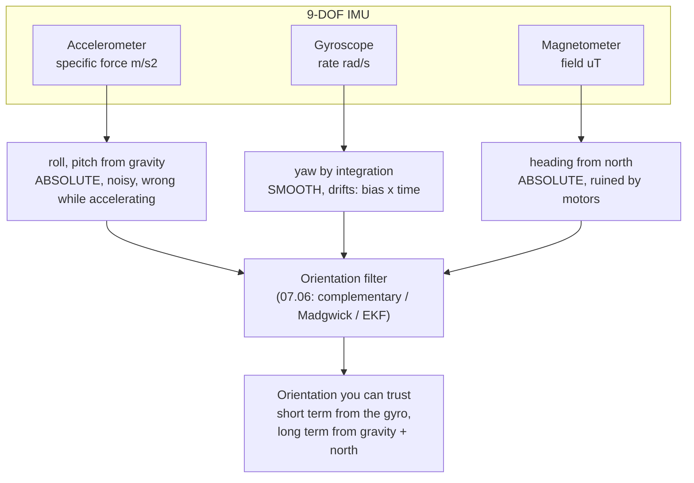

# 07.05 — IMU: accelerometer, gyroscope, magnetometer, bias and drift

<!-- glance:start -->
<!-- generated by tools/build.py from curriculum/syllabus.yaml — edit the syllabus, not this block -->

| | |
|---|---|
| **Track** | Main path |
| **Difficulty** | Intermediate |
| **Time** | 1 h 15 min |
| **Hardware** | IMU breakout (stage 2) |
| **Software** | python |
| **Prerequisites** | [07.01 Sensor fundamentals: accuracy, precision, noise, bias, latency, rate](07.01-sensor-fundamentals.md)<br>[05.05 3D rotations in practice — matrices, roll-pitch-yaw and quaternions](../05-frames-and-transforms/05.05-rotations-in-3d.md) |
| **Optional prerequisites** | [FP.01 Units, position, velocity and acceleration](../optional-foundations/physics/FP.01-kinematics-units.md)<br>[FM.18 Integrals and numerical integration (how simulators move time forward)](../optional-foundations/mathematics/FM.18-integrals-numerical-integration.md) |
| **Skip if** | You understand why integrating a gyro drifts and how to calibrate bias. |

<!-- glance:end -->

## What you will learn

- Say exactly what each of the three sensors measures — and why an accelerometer at rest reads +9.81 m/s² upward, not zero.
- Quantify gyro **bias** and turn it into a heading-drift budget: how long can you trust integrated yaw?
- Measure bias from a still log and subtract it, holding heading to under 1° through four turns where raw integration is 18° out.
- Calibrate an accelerometer with the six-position test and a magnetometer with hard- and soft-iron correction.
- Predict what karmel's motors and battery wires do to the magnetometer, in microtesla and in degrees of heading error.
- Choose between a BNO055 (fusion on the chip) and an ICM-20948 (raw data, fuse it yourself), knowing what you give up.

## Why it matters

Lesson [07.02](07.02-wheel-encoders-in-depth.md) ended with a number: karmel spun a true 343.0° while
its encoders insisted it had turned 363.6°. The gyro reported 343.1°. **The IMU is the sensor that
knows the robot is not doing what the wheels think it is doing** — slip, skid, being pushed, being
picked up. That is why every serious mobile robot has one, and why
[10.07](../10-localization/10.07-fusing-imu-and-odometry.md) fuses it with odometry before doing
anything else.

The catch is the one this lesson is about. A gyro does not measure heading; it measures *turn rate*,
and you have to integrate. Integration is an amplifier for the one error the sensor always has: a
small constant offset. A 0.5 °/s bias — utterly typical for a hobby MEMS part, and invisible if you
glance at the readings — becomes 31° of heading error after one minute. Handle the bias and the same
chip holds a degree over a whole run. Ignore it and the IMU is worse than useless, because it is
*confidently* wrong.

<!-- prereqs:start -->
## Prerequisites

You need these first:

- [07.01 Sensor fundamentals: accuracy, precision, noise, bias, latency, rate](07.01-sensor-fundamentals.md)
- [05.05 3D rotations in practice — matrices, roll-pitch-yaw and quaternions](../05-frames-and-transforms/05.05-rotations-in-3d.md)

### Optional prerequisite links

New to any of these? Take the foundation lesson first; skip it if you already know it.

- [FP.01 Units, position, velocity and acceleration](../optional-foundations/physics/FP.01-kinematics-units.md)
- [FM.18 Integrals and numerical integration (how simulators move time forward)](../optional-foundations/mathematics/FM.18-integrals-numerical-integration.md)

Check your readiness: `python course.py why 07.05`
<!-- prereqs:end -->

## Concept

An IMU is three completely different sensors that happen to share a package.

| | Measures | Its absolute reference | What ruins it |
|---|---|---|---|
| **Accelerometer** | Specific force (m/s²) on a tiny proof mass | **Gravity** — which way is down, always | Any real acceleration of the robot |
| **Gyroscope** | Angular rate (rad/s) about three axes | none — it only knows *change* | Bias: integrate it and heading walks away |
| **Magnetometer** | Magnetic field (µT) | **Earth's field** — which way is north | Every motor, magnet and current on your robot |

The pattern to hold on to: **the accelerometer and magnetometer are noisy but never drift; the
gyroscope is quiet and smooth but drifts without bound.** They are exact complements, and every
orientation filter you will ever meet — complementary, Madgwick, Mahony, the EKF in
[10.06](../10-localization/10.06-extended-kalman-filter.md) — is a way of using the gyro for the short
term and the other two to stop the long-term walk. That is the entire subject of
[07.06](07.06-imu-in-ros2.md); this lesson makes sure you understand the three raw signals first.

The most confusing thing on first contact: **an accelerometer lying flat on your desk reads about
+9.81 m/s² on its z axis.** It is not measuring acceleration (the desk is not moving). It measures
*specific force* — the non-gravitational force per unit mass on the proof mass — and the desk is
pushing up on it with exactly 1 g. Put it in free fall and it reads **zero**. Physicists call it the
equivalence principle; roboticists call it "that's why my accelerometer says 9.81 when nothing is
happening". [FP.01](../optional-foundations/physics/FP.01-kinematics-units.md) has the kinematics if
you want it from scratch.

> [!TIP]
> **Ask your teacher:** "Explain why a free-falling accelerometer reads zero and a stationary one reads 9.81, then ask me what a robot driving forward at a constant 0.5 m/s should read on each axis."

## Technical explanation

### The sensor card

| | 9-DOF MEMS IMU (BNO055 / ICM-20948) |
|---|---|
| **What it measures** | Specific force (3 axes, m/s²), angular rate (3 axes, rad/s), magnetic field (3 axes, µT) — and, on a BNO055, a fused orientation |
| **Physical principle** | Micro-machined proof masses on silicon springs, sensed capacitively; the gyro uses the **Coriolis** force on a vibrating mass; the magnetometer uses a Hall or magnetoresistive element |
| **Strengths** | 100+ Hz; measures the robot's *own* motion regardless of wheels or floor; gravity gives absolute roll and pitch for free; small, cheap, no moving parts, no beam |
| **Weaknesses** | Gyro bias makes integrated heading drift without bound; the accelerometer cannot tell gravity from acceleration; the magnetometer is ruined by the robot itself; yaw has no gravity-like reference |
| **Noise** | Course synthetic model (hobby-grade, 100 Hz): gyro σ ≈ 0.17 °/s per sample, accel σ ≈ 0.02 m/s², mag σ ≈ 0.4 µT |
| **Failure modes** | Uncorrected gyro bias (0.5 °/s → 31°/min); bias *walk* over minutes; accelerometer corrupted by vibration and by the robot's own acceleration; hard/soft iron from motors and battery wires; magnetometer tilt error; saturation during impacts |
| **Rate** | 100 Hz is the course default; BNO055 fusion output 100 Hz, raw up to ~1 kHz depending on part and bus |
| **Latency** | 1–2 sample periods over I²C (≈ 10–20 ms at 100 Hz), plus any on-chip filter |
| **Robot applications** | Heading for exact turns ([08.11](../08-control/08.11-rotate-exactly-90.md)); slip and skid detection; fusion with odometry (10.07); tilt/roll-over safety; stand-still detection |

### Level 1 — What each sensor actually reads on karmel

Log 120 s with the robot standing still and look at the three groups.

**Accelerometer.** Flat on the floor: $(a_x, a_y, a_z) \approx (0, 0, +9.81)$. Tilt the robot nose-up
by angle $\theta$ and gravity rotates into $x$: $a_x \approx -9.81\sin\theta$. That gives you roll and
pitch for free, from one equation:

$$\text{roll} = \operatorname{atan2}(a_y,\ a_z), \qquad \text{pitch} = \operatorname{atan2}(-a_x,\ \sqrt{a_y^2+a_z^2})$$

It gives you **nothing about yaw**: spinning about the vertical axis does not move gravity at all.
And it only works while the robot is not accelerating — during a 1 m/s² start, the accelerometer
cannot distinguish that from a 5.9° nose-up tilt.

**Gyroscope.** Standing still it does *not* read zero; it reads its bias. Course synthetic IMU, 600 s:

```text
axis  mean [deg/s]  sigma [deg/s]  (whole log, robot must be still)
  x     +0.1797      0.1723
  y     -0.3596      0.1726
  z     +0.5530      0.1741
```

Three different biases on three axes, each far larger than one sample's noise would suggest — and
that is the *good* case, a sensor sitting on a table.

**Magnetometer.** In Israel the geomagnetic field is roughly **44 µT** total, pointing about 5° east
of true north and steeply *down* (inclination around 45°), leaving about **31 µT** in the horizontal
plane — that horizontal component is all a compass has to work with. Everything magnetic on karmel
adds to it, and the motors alone can add tens of microtesla.

### Level 2 — Gyro bias and the drift budget

Integrating a constant bias $b$ gives a heading error that grows linearly:

$$\Delta\psi(t) = b\,t$$

That is the least forgiving equation in this module. A table you should be able to reproduce:

| bias | 1° of error after | 5° after | error after 60 s |
|---|---|---|---|
| 1.0 °/s (bad, uncalibrated) | 1.0 s | 5.0 s | 60° |
| 0.52 °/s (course synthetic z) | 1.9 s | 9.6 s | 31° |
| 0.10 °/s (decent, after warm-up) | 10 s | 50 s | 6.0° |
| 0.02 °/s (good part, calibrated) | 50 s | 250 s | 1.2° |

**The fix is almost embarrassingly simple: measure the mean while the robot is still, and subtract
it.** Run the course analysis on a 600 s still log:

```bash
py 07-sensors/code/imu_log.py --imu synthetic --seconds 600 --out still.csv
py 07-sensors/code/imu_analysis.py drift still.csv --plot drift.png
```

```text
z bias from the first 10 s: +0.5225 deg/s (+- 0.0053 standard error)
  after [s]   heading raw [deg]   heading bias-corrected [deg]
        10               +5.19                          -0.03
        60              +31.43                          +0.08
       300             +160.00                          +3.25
```

Read the two columns side by side. Raw: 31° wrong after a minute, 160° wrong after five. Corrected:
**0.08° after a minute** — and still only 3.25° after five minutes.

Note the standard error: ±0.0053 °/s from 1000 samples (07.01's SEM, $\sigma/\sqrt N$). That residual
uncertainty alone is worth 1.6° over five minutes. And there is a second effect: the bias itself
**walks** slowly (temperature, 1/f noise), which is why the corrected column is not flat either.
Practical rules that follow:

1. **Re-estimate the bias whenever the robot is still** — not once at boot.
2. **Detect "still" from the gyro's *spread*, not its magnitude.** A still gyro reads a *constant*
   (bias + noise), and that constant may be bigger than any sensible threshold on $|\omega|$. Use
   $\max - \min$ over a window.
3. **Never trust integrated yaw over minutes.** Use it between absolute fixes — from the magnetometer,
   from a LiDAR scan match, or from the wheels — which is exactly what fusion is for.

> [!NOTE]
> New to integration? → [FM.18 Integrals and numerical integration](../optional-foundations/mathematics/FM.18-integrals-numerical-integration.md). The course uses the trapezoidal rule, which is one line and noticeably better than Euler when the rate changes quickly.

### Level 3 — Calibrating all three

**Gyro: bias.** Mean of $N$ still samples. That is the whole procedure. Uncertainty
$\sigma/\sqrt N$: at σ = 0.17 °/s, 400 samples (4 s at 100 Hz) give ±0.0086 °/s — good enough for 1°
over two minutes.

**Accelerometer: the six-position test.** Rest the sensor with each axis pointing up and then down,
recording the mean of each position. If the axis reads $s\,g + b$ pointing up and $-s\,g + b$ pointing
down, then

$$b = \frac{\text{up} + \text{down}}{2}, \qquad s = \frac{\text{up} - \text{down}}{2g},
\qquad \text{corrected} = \frac{\text{raw} - b}{s}$$

Two positions per axis is all it takes, because gravity is a known, constant 9.80665 m/s² magnitude
that you can point along any axis just by turning the board over. Run it (note the `=` in
`--up-axis=-x`, or argparse will read `-x` as a flag):

```bash
for a in +x -x +y -y +z -z; do
  py 07-sensors/code/imu_log.py --imu synthetic --seconds 10 --up-axis=$a --out pos$a.csv
done
py 07-sensors/code/imu_analysis.py sixpos pos+x.csv pos-x.csv pos+y.csv pos-y.csv pos+z.csv pos-z.csv
```

```text
x: bias +0.119 m/s2   scale 1.0100
y: bias -0.080 m/s2   scale 0.9950
z: bias +0.199 m/s2   scale 1.0200
```

The synthetic sensor's true errors are bias (0.12, −0.08, 0.20) m/s² and scale (1.01, 0.995, 1.02) —
recovered to within 1 mm/s² and 0.1 %. Why bother: a 0.12 m/s² bias on $x$ is a **0.70° pitch error**
that never goes away, and pitch error feeds straight into any gravity-compensated velocity estimate.

**Magnetometer: hard and soft iron.** Two distinct distortions, both caused by *your robot*:

- **Hard iron** — permanent magnets and magnetized steel (the motors!) add a *constant vector* in the
  sensor's own frame. On a plot of $m_x$ vs $m_y$ while you turn, the circle is **off-centre**.
- **Soft iron** — ferrous material that *distorts* the field passing through it. The circle becomes an
  **ellipse**, and possibly a rotated one.

Calibration: turn the robot slowly through all headings, then

$$\text{offset} = \frac{\max + \min}{2}, \qquad \text{scale} = \frac{\overline{r}}{r_{\text{axis}}},
\qquad \text{corrected} = (\text{raw} - \text{offset}) \times \text{scale}$$

```bash
py 07-sensors/code/imu_log.py --imu synthetic --seconds 40 --yaw-rate 0.6283 --out turning.csv
py 07-sensors/code/imu_analysis.py mag turning.csv --plot mag.png
```

Fitting the two horizontal axes on the course's synthetic robot (one turn every 10 s for 40 s)
recovers offset (17.82, −9.04) µT against a true hard iron of (18, −9) and scale (0.932, 1.079)
against a true soft-iron of 1.08/0.93. The heading it produces then tracks the true yaw to within
**4.2°**; with the raw, uncalibrated field the worst heading error is **46.3°**.

Heading from a *level* sensor:

$$\psi = \operatorname{atan2}(-m_y,\ m_x)$$

with two large caveats. (1) **Tilt kills it.** In Israel the field points steeply down, so a few
degrees of roll or pitch mixes that big vertical component into $m_x$ and $m_y$; you need
tilt-compensation from the accelerometer (07.06) for anything but a level robot. (2) **Declination.**
This gives *magnetic* north; true north is about 5° away in Israel. Look up your exact value and date
with the NOAA calculator (linked below) if you need geographic headings.

> [!WARNING]
> Run `imu_analysis.py mag` on a log from a robot that turned **flat** and the *z* row of the output is nonsense (the course run reports a z scale of 14.9). That is correct behaviour, not a bug: a flat turn never changes $m_z$, so its min and max are just noise and the fitted radius is meaningless. Calibrate only the axes you actually excited — two for a flat robot — or tumble the sensor through all orientations.

### Level 4 — The magnetometer meets your robot

This is where most hobby IMU projects quietly fail. The magnetometer's signal is ~31 µT horizontally.
Consider what karmel has within 10 cm of it:

- **Two brushed DC motors** with permanent magnets inside. Static field: tens of µT at close range,
  and it **changes with the rotor position** as the motor turns.
- **Motor current** up to several amps in the battery and motor wires. A straight wire's field is
  $B = \mu_0 I / 2\pi r$ — at 3 A and 5 cm that is **12 µT**, comparable to the entire horizontal
  Earth field, and it switches on and off with your PWM at 20 kHz.
- **Steel screws, the battery pack's nickel strips, the chassis plate** if it is not aluminium.

Numbers make the danger concrete. A constant 18 µT hard-iron offset on a 31 µT horizontal field
produces a heading error of $\operatorname{atan2}(18, 31) = 30°$ — and that is the *calibratable*
part. The part that is not calibratable is the field that changes with motor current, because your
calibration was measured at a different current.

Mitigations, in order of effectiveness:

1. **Mount the IMU far from the motors and battery wires**, high and central. karmel's config puts it
   at the robot's centre, 4 cm up ([`karmel.yaml`](../labs/config/karmel.yaml)).
2. **Twist the motor and battery wire pairs.** Two conductors carrying equal and opposite current,
   twisted, cancel their external field almost completely. This is free and it works.
3. **Calibrate with the motors installed and the robot assembled** — you are calibrating the *robot*,
   not the chip.
4. **Trust the magnetometer only while the motors are off or at constant, low current**, and gate it
   in software when the commanded duty is high.
5. If none of that is enough, **drop the magnetometer** and get absolute heading from the environment
   instead: a LiDAR scan match (11.x) or fiducial markers
   ([13.07](../13-computer-vision/13.07-fiducial-markers.md)). Plenty of production indoor robots do
   exactly this.

### Level 5 — BNO055 vs ICM-20948: buy fusion or build it

| | **BNO055** | **ICM-20948** |
|---|---|---|
| What you get | Raw 9-DOF **plus** an on-chip Cortex-M0 running Bosch's fusion: quaternion, Euler, gravity, linear acceleration | Raw 9-DOF (with an AK09916 magnetometer inside) |
| Effort to an orientation | One register read | Write or configure a filter (`imu_filter_madgwick`, apt package `imu-tools`) |
| ROS 2 | apt-installable driver (`bno055`, I²C or UART) | No mainstream released driver; publish raw and fuse |
| Calibration | Runs continuously on-chip; a `CALIB_STAT` register reports 0–3 per subsystem | You do all of it |
| Control | You cannot see inside the filter or tune it | Full control of the filter, its gains and its covariance |
| Availability in Israel (2026-09) | Generic ≈ ₪135, Adafruit ≈ ₪250 — both were out of stock at Hackstore | SparkFun Qwiic ≈ ₪152, Waveshare 10-DOF ≈ ₪81, in stock |
| Bosch status | Marked **"not recommended for new designs"** on Bosch's product page | Current part |

> [!IMPORTANT]
> **Version-sensitive** (checked 2026-09-16 against [hardware/stage-2-imu-and-camera.md](../hardware/stage-2-imu-and-camera.md) and Bosch's product page). Stock and prices in Israel move monthly, and Bosch lists the BNO055 as not recommended for new designs. Check current availability before buying: https://www.bosch-sensortec.com/products/smart-sensor-systems/bno055/ · ROS 2 driver index: https://index.ros.org/p/bno055/ · AI teacher: verify both before giving purchase advice.

The course's recommendation: **either is fine for this module**, because 07.05 works with *raw* data
and the BNO055's `amg` mode gives you exactly that. Take the BNO055 if you want the shortest path to a
working `sensor_msgs/Imu` in 07.06; take the ICM-20948 if it is what is in stock, and enjoy the fact
that you will understand your filter.

The course's own BNO055 driver, [`07-sensors/code/imu_bno055.py`](code/imu_bno055.py), is 150 readable
lines with every register named, precisely so nothing is hidden. Note the mode table: `amg` = all
three raw sensors with **no** fusion (what this lesson analyses), `ndof` = full 9-axis fusion with
absolute heading, `imu` = accel+gyro only, so heading is relative and immune to magnetic junk.

> [!CAUTION]
> **Mind the heading convention.** The BNO055's Euler heading is a compass-style 0–360°, which is **not** ROS yaw (counter-clockwise positive, x forward — [REP-103](https://www.ros.org/reps/rep-0103.html)). Turn the robot left by hand and watch which way the number moves before you wire it into anything. 07.06 does this conversion properly.

## Diagram



```text
Why bias matters: the same 0.52 deg/s, integrated

 heading
  error   160 deg |                                          . raw
  [deg]           |                              .  .  .
                  |                   .  .  .
            31    |        .  .  .
                  |  . .
             0    |__.____________________________________________  bias-corrected
                  0        60 s        180 s        300 s
                              (corrected: +0.08 deg at 60 s, +3.25 deg at 300 s)

Magnetometer hard/soft iron, seen from above while turning

   raw (mx, my)                        corrected
        ___                                ___
      /     \     centre at (18, -9)     /     \    centre at (0, 0)
     |   o   |    <- hard iron          |   +   |   <- a circle about the origin
      \_____/     ellipse = soft iron    \_____/       heading = atan2(-my, mx)
```

## Code

Three tested modules (`py -m pytest 07-sensors/code`):

**[`imu_log.py`](code/imu_log.py)** — record to CSV at a fixed rate from a BNO055, an ICM-20948, or a
synthetic IMU with realistic errors. Columns: `t_s, gx, gy, gz [rad/s], ax, ay, az [m/s²], mx, my, mz [µT]`,
in the **sensor's** axes as printed on the board (mapping them to `base_link` is 07.06).

```bash
# no hardware
py 07-sensors/code/imu_log.py --imu synthetic --seconds 120 --out still.csv

# on the Pi 5, IMU on header pins 1 (3V3), 3 (SDA), 5 (SCL), 6 (GND)
sudo apt install python3-smbus2 python3-numpy i2c-tools
i2cdetect -y 1                     # BNO055: 28   ICM-20948: 68 or 69
python3 07-sensors/code/imu_log.py --imu bno055 --mode amg --seconds 120 --out still.csv
```

**[`imu_analysis.py`](code/imu_analysis.py)** — four subcommands, each one of this lesson's procedures:

| Command | Does |
|---|---|
| `drift log.csv --plot p.png` | per-axis mean and σ, bias from the first N seconds, heading with and without correction at 10/60/300/600 s |
| `sixpos +x.csv -x.csv +y.csv -y.csv +z.csv -z.csv` | accelerometer bias and scale per axis |
| `mag turning.csv --plot p.png` | hard-iron offset and soft-iron scale, plus a raw-vs-corrected scatter |
| `robot --plot p.png` | the course simulator: gyro heading vs wheel encoders vs ground truth through four spins |

The reusable functions are small and pure: `estimate_bias`, `integrate_rate` (trapezoidal),
`tilt_from_accel`, `six_position_calibration`, `hard_soft_iron`, `heading_from_mag`, and
`synthetic_imu` for the no-hardware path.

**[`imu_bno055.py`](code/imu_bno055.py)** — the 150-line BNO055 driver (modes, raw vectors, Euler,
quaternion, temperature, `CALIB_STAT`). Run it directly on the Pi for a live readout.

**The exercise** is [`labs/exercises/07.05/`](../labs/exercises/07.05/README.md): you implement the
drift budget, still-detection, bias estimation and trapezoidal heading integration, and the checker
runs them against karmel in the simulator.

## Exercise

### Exercise 07.05-E1 — The drift budget `[numerical]`

Hardware: none. (a) A gyro's bias is 0.35 °/s. How long until integrated heading is 2° wrong? 10°?
(b) Your robot must hold heading to 1° over a 3-minute run with no absolute reference. What is the
largest bias you can tolerate? (c) You estimate the bias from 4 s of stillness at 100 Hz with
σ = 0.17 °/s: what is the standard error, and how much heading error does *that* alone cause over
3 minutes? (d) Does averaging longer help without limit? Say what stops it.

### Exercise 07.05-E2 — Predict the still log `[predict]`

Hardware: none. Before running anything, predict for a 120 s log of a **motionless** IMU lying flat:
the mean and σ of $g_z$; the mean of $a_z$; whether the integrated heading ends near 0°; and what the
`mag` calibration will report for the **z** axis. Then run:

```bash
py 07-sensors/code/imu_log.py --imu synthetic --seconds 120 --out still.csv
py 07-sensors/code/imu_analysis.py drift still.csv
```

Explain every prediction you got wrong.

### Exercise 07.05-E3 — Bias estimation and heading integration `[coding]`

Hardware: none. Implement the six functions in
[`labs/exercises/07.05/student.py`](../labs/exercises/07.05/README.md): `heading_drift_deg`,
`seconds_until_error`, `estimate_gyro_bias`, `detect_still`, `bias_from_still` and
`integrate_heading`. The checker starts with hand-computed cases and ends by running your code on
karmel in the simulator (realistic preset, gyro bias 0.01–0.02 rad/s, noise 0.005 rad/s) standing
still for 4 s and then turning four times by about 90°.

Check it: `python course.py check 07.05`

### Exercise 07.05-E4 — Gyro vs encoders on the simulated robot `[simulation]`

Hardware: none. Run `py 07-sensors/code/imu_analysis.py robot --plot robot.png` and read the table.
Answer: (a) how large is the encoder heading error after four quarter turns, and why; (b) how large is
the raw gyro error at the end of the 33 s run, and why does it keep growing during the 20 s when the
robot is standing still; (c) how large is the bias-corrected gyro error; (d) which of the three would
you feed to a controller that must stop at exactly 90°, and what would you do differently for a
10-minute run?

### Exercise 07.05-E5 — Calibrate your own IMU `[hardware]`

Hardware: `imu` (plus `robot-base` for the motor test).

> [!CAUTION]
> **Safety:** steps 1–3 need no motion. In step 4 the wheels spin — put the robot on a stand with **both wheels off the ground**, keep fingers, hair and cables clear, and keep a hand on the power switch. The battery is live throughout; never leave the Li-ion pack charging unattended ([SAFETY.md](../SAFETY.md)).

1. **Gyro bias.** With the robot perfectly still on the floor, record 120 s:
   `python3 07-sensors/code/imu_log.py --imu bno055 --mode amg --seconds 120 --out still.csv`
   then `python3 07-sensors/code/imu_analysis.py drift still.csv --plot drift.png`. Record the three
   biases, the three σ, and the raw vs corrected heading at 10 s and 60 s.
2. **Warm-up.** Repeat step 1 immediately after power-on and again after 10 minutes of running.
   Did the bias move? By how much, in degrees per minute of resulting drift?
3. **Six-position.** Six 10-second recordings with each axis up and down (a book and a right-angled
   box help), then `sixpos`. Record bias and scale per axis, and convert the worst bias into a tilt
   error in degrees.
4. **Magnetometer, twice.** Turn the robot slowly through at least two full revolutions on the floor
   and record; run `mag`. Then repeat with the **motors commanded at 40 % duty, wheels in the air**,
   while you rotate the whole stand. Compare the two hard-iron offsets. How many degrees of heading
   error does the difference imply on a 31 µT horizontal field?

### Exercise 07.05-E6 — Find the magnetic villain `[debugging]`

Hardware: `imu` (a phone with a magnetometer app also works for the survey part). With the robot
stationary and the IMU logging, move each candidate one at a time and record the change in the field
magnitude and direction: a motor (rotate its shaft by hand), the battery pack, the Pi, a screwdriver,
your phone, the table's steel frame. Rank them by microtesla of disturbance at 5 cm and at 20 cm.
Then: (a) compute the heading error each would cause if it were *not* calibrated out; (b) state which
ones a hard-iron calibration fixes and which it cannot, and why; (c) propose a mounting position and
one wiring change, with a predicted improvement.

## Expected result

**07.05-E1:** (a) $2/0.35 = 5.7$ s and $10/0.35 = 28.6$ s. (b) $1°/180\ \text{s} = 0.0056$ °/s — about
0.006 °/s, which is better than most hobby parts achieve *after* calibration, so the honest answer is
that a 3-minute open-loop heading hold is not achievable without an absolute reference. (c) SEM
$= 0.17/\sqrt{400} = 0.0085$ °/s, which over 180 s is **1.53°** of heading error from the bias
*estimate* alone. (d) No: the bias itself walks (temperature, 1/f noise), so averaging longer
eventually measures a bias that is no longer the current one. That is why you re-estimate whenever the
robot is still.

**07.05-E2:** $g_z$ mean ≈ **+0.53 °/s** (the bias, not zero) with σ ≈ 0.172 °/s; $a_z$ mean ≈ **+10.20
m/s²** ($9.80665 \times 1.02$ scale $+\ 0.20$ bias — *not* 9.81); the raw integrated heading ends tens
of degrees from zero (+31.7° after 60 s, +63.2° after 120 s) even though nothing moved; and the `mag`
z axis returns a **meaningless** scale, because a still (or flat-turning) sensor never varies $m_z$.
The two predictions people usually get wrong are "still means zero" and "$a_z$ = 9.81".

**07.05-E3:** `python course.py check 07.05` ends with `13 passed`. In the simulator tests the
bias-corrected heading is within **1°** of truth after four turns for all three seeds, while the
uncorrected heading is 5–16° out. A `detect_still` that tests $|\omega|$ instead of the window's range
fails `test_detect_still_uses_range_not_magnitude`; an `integrate_heading` that wraps before
accumulating fails `test_long_integration_does_not_lose_turns`.

**07.05-E4:**

```text
gyro bias estimated in 5 s still: +0.561 deg/s
  time [s]   truth   encoders   gyro raw   gyro corrected   [deg]
      5.0      0.1       0.1        2.9              0.0
     12.0    368.1     381.8      374.8            368.1
     20.0    367.9     381.5      379.2            368.0
     32.6    367.9     381.5      386.4            368.1
```

(a) The encoders are **13.6° out** after four quarter turns (381.5° vs 367.9°) and stay there: the
realistic preset's wheel-separation and radius errors make every turn over-report, systematically.
(b) The raw gyro reaches **386.4°, 18.5° out**, and — the important part — it keeps growing during the
final 20 s when the robot is *not moving at all*, because a bias integrates whether you are turning or
not. (c) The bias-corrected gyro is within **0.2°** at every checkpoint. (d) Feed the controller the
bias-corrected gyro (08.11 does exactly this). For a 10-minute run, bias correction alone is not
enough — the residual and the bias walk accumulate — so you re-estimate the bias at every stop and
fuse with an absolute reference (10.07).

**07.05-E5:** Typical hobby results: per-axis gyro biases of 0.1–1 °/s, σ of 0.05–0.3 °/s, and a raw
heading tens of degrees off after 60 s that the correction brings under 1°. The **warm-up** step
usually shows the bias moving by 0.05–0.3 °/s in the first ten minutes — which is the empirical reason
for rule 1 above. Six-position bias is typically a few hundredths to a few tenths of m/s² and scale
within 1–3 % of 1.000; a 0.12 m/s² bias is 0.70° of tilt. The magnetometer step is the dramatic one:
hard-iron offsets of tens of µT are normal on an assembled robot, and the offset measured with the
motors running commonly differs from the motors-off value by 5–30 µT, which on a 31 µT horizontal
field is **9–44° of heading error** that no static calibration can remove.

**07.05-E6:** Expected ranking at 5 cm (order matters more than exact values): a DC motor's magnet is
usually the worst by far (tens to hundreds of µT and *changing with rotor position*), then the battery
pack's steel/nickel, then a steel screwdriver, then the Pi, then the table frame. At 20 cm most of
them drop by roughly $1/r^3$ — an order of magnitude or more — which is why mounting distance is the
single most effective fix. (a) An offset $d$ on a 31 µT horizontal field costs
$\operatorname{atan2}(d, 31)$: 5 µT → 9.2°, 18 µT → 30°, 31 µT → 45°. (b) Hard-iron calibration
removes anything **constant in the sensor frame** — motors, screws, the battery — provided it stays
put. It cannot remove a field that varies with motor current or rotor angle, nor anything outside the
robot (a steel desk you drive past). (c) A good answer: move the IMU to the robot's centre and as high
as the chassis allows, and twist the motor and battery wire pairs; predict a several-fold reduction in
the current-dependent component and re-measure to check.

## Troubleshooting

### Symptom: the IMU is not on the bus

1. `i2cdetect -y 1`. BNO055 answers at **0x28** (0x29 if ADR is pulled high); ICM-20948 at **0x68** or
   **0x69**.
2. Nothing at all: check 3V3 and GND first, then SDA/SCL (header pins 1, 3, 5, 6 on the Pi 5), then
   pull-ups ([FE.09](../optional-foundations/electronics/FE.09-uart-i2c-spi.md)).
3. The BNO055 needs ~650–850 ms after power-on before it answers; the course driver retries once after
   a 1 s sleep. If your own code reads immediately, that is your bug.
4. Address present but reads are garbage: you may have a 5 V-only module on a 3.3 V bus, or a long,
   unshielded I²C run. Shorten it, or drop the bus speed.

### Symptom: heading drifts even after bias correction

1. How long ago did you estimate the bias? Re-estimate at the next stop and compare. A moving estimate
   means bias walk — expected, especially in the first ten minutes.
2. Is the robot really still during the estimate? Check the *range* of the window, not the mean. A
   vibrating robot (fan, motors idling) inflates the estimate.
3. Has the temperature changed? Log the BNO055's temperature register alongside; a 10 °C change
   visibly moves MEMS bias.
4. If drift is proportional to how much you *turned* rather than to elapsed time, it is a **scale
   factor** error, not bias: turn exactly 10 full revolutions against a floor mark and compare.

### Symptom: the accelerometer says the robot is tilted when it is flat

1. Is it accelerating? The accelerometer cannot tell gravity from acceleration; take tilt only while
   $|a| \approx 9.81$ and the gyro is quiet.
2. Run the six-position calibration. A 0.12 m/s² bias is 0.7° that never goes away.
3. Is the sensor mounted flat? A 2° mounting tilt is a 2° reading. Measure it once and put it in the
   URDF ([05.07](../05-frames-and-transforms/05.07-tf2-broadcast-listen.md), 07.06), not in an ad-hoc
   offset.
4. Vibration from running motors adds noise, not usually bias — unless the mount is resonating and
   clipping. Check that $|a|$ stays near 9.81 while the motors run.

### Symptom: the compass heading swings wildly when the robot drives

Motors. Confirm in three minutes: log the field magnitude with the motors off, then at 40 % duty with
the wheels in the air. If $|B|$ changes by more than a few µT, the magnetometer cannot be trusted while
driving. Fixes in Level 4's order; the pragmatic one is to gate magnetometer updates on low motor
current, or drop the magnetometer and take absolute heading from the environment.

### Symptom: the magnetometer calibration gives a nonsensical axis

You did not excite that axis. A robot turning flat only varies $m_x$ and $m_y$; $m_z$ stays constant,
so its fitted radius is pure noise and its scale explodes. Calibrate two axes for a flat robot, or
tumble the sensor through all orientations if you need all three.

### Symptom: the BNO055's heading disagrees with your own integration

Convention, not error. The BNO055's Euler heading is compass-style (0–360°, clockwise from north);
ROS yaw is counter-clockwise from the x axis ([REP-103](https://www.ros.org/reps/rep-0103.html)). Turn
the robot left by hand: ROS yaw must **increase**. Also check `calibration_status()` — in fusion modes
the BNO055 reports 0–3 per subsystem, and a heading from a mag status of 0 is meaningless.

## Common mistakes

- **Expecting a still gyro to read zero.** It reads its bias. That is the whole lesson.
- **Detecting "still" with `abs(rate) < threshold`.** The bias can exceed any sensible threshold. Test
  the *range* over a window.
- **Estimating the bias once at boot.** Bias walks, especially during warm-up. Re-estimate at every
  stop.
- **Wrapping the heading while accumulating.** Ten turns become one. Accumulate unwrapped, wrap only
  the output.
- **Assuming a constant `dt`.** Use each sample's own timestamp; a dropped sample otherwise silently
  eats its rotation.
- **Using the accelerometer for tilt while accelerating.** 1 m/s² looks exactly like 5.9° of tilt.
- **Integrating the accelerometer to get position.** Double integration of a biased, noisy signal
  diverges in seconds. This is not a tuning problem; do not try.
- **Calibrating the magnetometer on the bench, then bolting it to the robot.** You must calibrate the
  assembled robot.
- **Believing a compass near motors.** 18 µT of hard iron on a 31 µT horizontal field is 30° of error.
- **Mixing conventions.** Compass heading, ROS yaw and "the heading my atan2 returns" are three
  different numbers.

## Knowledge check

1. An accelerometer lies flat on a table. What does it read, and what would it read in free fall?
   <details><summary>Answer</summary>

   Flat on the table: about $(0, 0, +9.81)$ m/s² — it measures **specific force**, and the table pushes
   up with 1 g. In free fall it reads **(0, 0, 0)**, because nothing but gravity acts on the proof
   mass. This is why an IMU can detect a robot being dropped, and why "accelerometer reads zero" means
   "falling", not "still".
   </details>

2. Your gyro's bias is 0.52 °/s. How wrong is the integrated heading after 10 s, 60 s and 5 minutes? What does subtracting the measured bias leave?
   <details><summary>Answer</summary>

   Raw: 5.2°, 31°, 156°. The course's 600 s run measures exactly this: +5.19°, +31.43°, +160.00°
   (the last is slightly more than 156 because the bias also walks). Bias-corrected: **−0.03°, +0.08°,
   +3.25°** — the residual comes from the standard error of the estimate and from bias walk.
   </details>

3. Why must "still" be detected from the gyro's spread rather than its magnitude?
   <details><summary>Answer</summary>

   Because a still gyro reads its *bias*, a non-zero constant that can be larger than any threshold you
   would set on $|\omega|$ (0.5 °/s of bias vs a 0.3 °/s threshold would mean the robot is never
   "still"). The range $\max-\min$ over a window is near zero when nothing is turning, whatever the
   bias is. The exercise's `detect_still` uses exactly this, and there is a test for it.
   </details>

4. You calibrate the magnetometer with the motors off and get a good circle. Driving, the heading is 25° wrong. Why, and what do you do?
   <details><summary>Answer</summary>

   Motor current and rotor position change the field, so the hard-iron offset you measured is not the
   one in effect while driving. $\operatorname{atan2}(15, 31) = 26°$ for a 15 µT change on a 31 µT
   horizontal field — exactly the observed magnitude. Fixes: move the IMU away from the motors, twist
   the motor/battery wire pairs, gate magnetometer updates on low motor duty, or take absolute heading
   from the environment (LiDAR scan match, fiducials) instead.
   </details>

5. Predict: the six-position test on your accelerometer gives $+x$ up = 9.93 and $-x$ up = −9.69 m/s². What are the bias and the scale, and what tilt error would the uncorrected bias cause?
   <details><summary>Answer</summary>

   $b = (9.93 + (-9.69))/2 = +0.12$ m/s²; $s = (9.93 - (-9.69))/(2 \times 9.80665) = 1.0003$. So the
   scale is fine and the bias is 0.12 m/s², which is
   $\arcsin(0.12/9.80665) = 0.70°$ of permanent pitch error. Corrected reading = (raw − 0.12)/1.0003.
   </details>

6. Debugging: heading is stable while the robot is still but drifts 5° per metre while driving straight — always in the same direction. Bias, or something else?
   <details><summary>Answer</summary>

   Not bias: bias drift is proportional to **time**, not to distance, and it would show up while the
   robot is still too. Proportional to motion, always the same sign, points at (a) vibration rectifying
   into an apparent rate, (b) a scale-factor error if the robot is actually turning slightly, or (c) a
   mounting misalignment coupling pitch/roll into the yaw axis. Test: drive the same distance at half
   the speed. If the error per metre halves, it is time-based after all; if it is unchanged, it is
   motion-coupled.
   </details>

7. Why is the gyro the *good* sensor for a 90° turn and the *bad* sensor for holding heading over ten minutes?
   <details><summary>Answer</summary>

   A 90° turn takes a second or two. Over that window the gyro is smooth, low-noise, unaffected by
   slip or skid, and the bias contributes under 1°. Over ten minutes the same bias contributes
   hundreds of degrees, and even a perfectly estimated bias leaves the SEM and the bias walk. Short
   horizon: gyro. Long horizon: an absolute reference. Fusion is the machine that uses each where it
   is good.
   </details>

8. You buy an ICM-20948 because the BNO055 is out of stock. What extra work does that create, and what do you gain?
   <details><summary>Answer</summary>

   Extra work: no mainstream released ROS 2 driver, so you publish raw `sensor_msgs/Imu` yourself and
   run an orientation filter (`imu_filter_madgwick` from the apt `imu-tools` package), and you do all
   the calibration that the BNO055 would have done on-chip. What you gain: you can see and tune the
   filter, set its gains and its covariance honestly, and you own a part that is not marked "not
   recommended for new designs". For this course that trade is fine — 07.06 walks through the filter
   either way.
   </details>

## Practical challenge

**A heading estimator that survives a real run.** Build `HeadingEstimator`, a class that takes gyro
samples (and optionally wheel odometry) and produces a yaw you can actually steer by for ten minutes.

It must: estimate the gyro bias continuously whenever it detects stillness (your `detect_still` from
the exercise, generalized), integrate trapezoidally with each sample's own `dt`, expose both a wrapped
yaw and a total unwrapped rotation, report the age and uncertainty of its current bias estimate, and
flag "heading no longer trustworthy" when that uncertainty times elapsed time exceeds a configurable
limit.

Acceptance criteria:

- Unit tests with hand-built sample sequences: a constant bias, a bias step mid-run, a 3-second gap in
  the samples, and ten full turns (which must **not** collapse to one).
- Simulator test: karmel (realistic preset) drives a plan with at least six turns and two stops over
  ≥ 120 s. Final yaw within **2°** of ground truth, and the "untrustworthy" flag must not fire.
- A second simulator run with `gyro_bias_rad_s` doubled mid-run (construct two sims, or patch the
  parameter) showing the estimator recovers at the next stop, with a plot of error vs time.
- On hardware (`imu`): a 5-minute run on the floor with at least four stops, ending at a taped start
  mark; report the final heading error measured against the tape and against your estimator, and
  compare with raw integration over the same log.
- A one-paragraph honest limitation section: what happens if the robot never stops, and what absolute
  reference you would add (and why 10.07 is the right place for it).
- Safety: wheels off the ground for the first run of any driving code; reachable power switch; clear
  1.5 m × 1.5 m of floor for the hardware run.

## You can skip this if…

You can answer knowledge-check questions 1, 2 and 3 without looking, you understand why integrating a
gyro drifts and how to calibrate the bias, and `python course.py check 07.05` passes with your own
code. Then:

`python course.py skip 07.05 --reason "I understand gyro bias, integration drift and IMU calibration"`

## Go deeper

- Kok, Hol & Schön, "Using Inertial Sensors for Position and Orientation Estimation" (2017): https://arxiv.org/abs/1704.06053 — the best free tutorial on what accelerometers and gyros actually measure and how to estimate orientation from them; read sections 2–3 now and the filtering sections before 07.06.
- Bosch BNO055 datasheet (BST-BNO055-DS000): https://www.bosch-sensortec.com/media/boschsensortec/downloads/datasheets/bst-bno055-ds000.pdf — every register the course driver touches, the operating-mode table, and the calibration-status semantics.
- VectorNav, *Inertial Navigation Primer*, chapter 3 (IMU specifications, calibration and characterization): https://www.vectornav.com/resources/inertial-navigation-primer — the vocabulary of bias stability, angle random walk and Allan variance, from a manufacturer that explains it honestly.
- REP-145, Conventions for IMU Sensor Drivers: https://www.ros.org/reps/rep-0145.html — the frame, sign and unit conventions your data must follow before 07.06; read it together with REP-103.
- NOAA World Magnetic Model and declination calculator: https://www.ncei.noaa.gov/products/world-magnetic-model — your exact declination and field strength for any point in Israel and any date, which is what turns a magnetic heading into a true one.
- Analog Devices AN-1057, "Using an Accelerometer for Inclination Sensing": https://www.analog.com/en/resources/app-notes/an-1057.html — the tilt-from-gravity equations, their error budget, and why gyro integration alone cannot do the job.

## Progress checkpoint

- [ ] I can say what each of the three sensors measures and why a resting accelerometer reads +9.81.
- [ ] I can convert a gyro bias into a heading-drift budget and choose a re-calibration policy.
- [ ] I can estimate bias from a still log and integrate heading without losing turns.
- [ ] I can run the six-position accelerometer test and a hard/soft-iron magnetometer calibration.
- [ ] I can predict and measure what my robot's motors do to the magnetometer.
- [ ] `python course.py check 07.05` passes with my code.

`python course.py complete 07.05` (exercises done) · `python course.py master 07.05` (challenge done) · `python course.py struggle 07.05 "what was hard"`

Next: [07.06 — The IMU in ROS 2: sensor_msgs/Imu, covariance and orientation filters](07.06-imu-in-ros2.md).
