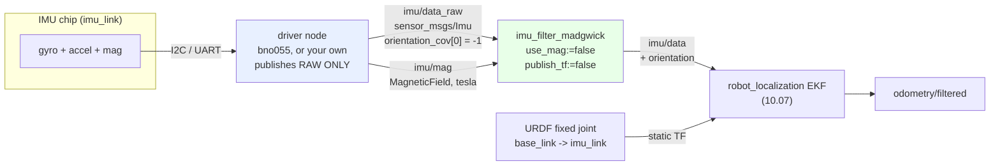

# 07.06 — The IMU in ROS 2: sensor_msgs/Imu, covariance and orientation filters

<!-- glance:start -->
<!-- generated by tools/build.py from curriculum/syllabus.yaml — edit the syllabus, not this block -->

| | |
|---|---|
| **Track** | Main path |
| **Difficulty** | Intermediate |
| **Time** | 1 h |
| **Hardware** | IMU breakout (stage 2) |
| **Software** | ros2, imu-tools |
| **Prerequisites** | [07.05 IMU — accelerometer, gyroscope, magnetometer, bias and drift](07.05-imu-fundamentals.md)<br>[04.16 Your physical robot in ROS 2 — cmd_vel in, telemetry out](../04-ros2/04.16-your-robot-as-ros2-node.md) |
| **Optional prerequisites** | [FM.15 Covariance and multivariate Gaussians](../optional-foundations/mathematics/FM.15-covariance-multivariate-gaussians.md)<br>[FM.12 Quaternions without the mysticism](../optional-foundations/mathematics/FM.12-quaternions.md) |
| **Skip if** | Your robot publishes a correctly framed Imu message with sane covariance. |

<!-- glance:end -->

## What you will learn

- Fill and read every field of `sensor_msgs/Imu` correctly — including the `-1` that means "I have no orientation" and the difference between σ and σ².
- Put the right `frame_id` on the message and the right static transform in the URDF, so a chip bolted down sideways still tells the truth.
- Run the `bno055` driver on a Pi 5 over I²C or UART, or publish raw data from an ICM-20948 and fuse it with `imu_filter_madgwick`.
- Choose a filter (complementary, Madgwick, Mahony) and set `use_mag`, `world_frame` and `gain` for a robot that drives past electric motors.
- Audit a live IMU topic in 30 seconds: rate, stamp age, gravity magnitude, covariance, sign of yaw.

## Why it matters

[07.05](07.05-imu-fundamentals.md) left you with three raw signals and a warning: the gyro drifts,
the accelerometer lies while you accelerate, and the magnetometer is ruined by your own motors. It
also left you with a CSV file. A CSV file cannot steer a robot.

This lesson is the bridge. Everything downstream — the EKF that fuses IMU with odometry
([10.07](../10-localization/10.07-fusing-imu-and-odometry.md)), the controller that turns exactly
90° ([08.11](../08-control/08.11-rotate-exactly-90.md)), slam_toolbox, Nav2 — consumes exactly one
thing: a `sensor_msgs/Imu` message with a correct header, correct units and **honest covariance**.
Get the covariance wrong and the EKF does not crash; it quietly believes the wrong sensor and your
robot drives into a wall with great confidence. That failure mode — confident and wrong — is the
one this lesson is designed to prevent.

<!-- prereqs:start -->
## Prerequisites

You need these first:

- [07.05 IMU — accelerometer, gyroscope, magnetometer, bias and drift](07.05-imu-fundamentals.md)
- [04.16 Your physical robot in ROS 2 — cmd_vel in, telemetry out](../04-ros2/04.16-your-robot-as-ros2-node.md)

### Optional prerequisite links

New to any of these? Take the foundation lesson first; skip it if you already know it.

- [FM.15 Covariance and multivariate Gaussians](../optional-foundations/mathematics/FM.15-covariance-multivariate-gaussians.md)
- [FM.12 Quaternions without the mysticism](../optional-foundations/mathematics/FM.12-quaternions.md)

Check your readiness: `python course.py why 07.06`
<!-- prereqs:end -->

## Concept

A `sensor_msgs/Imu` message is a *measurement with an error bar, stamped in time and space*. Four
questions, four groups of fields:

| Question | Fields |
|---|---|
| **When** was this measured? | `header.stamp` |
| **Where**, i.e. in which axes? | `header.frame_id` |
| **What** did the sensor read? | `angular_velocity`, `linear_acceleration`, `orientation` |
| **How much do I trust it?** | the three `*_covariance` arrays |

If you have written distributed systems, the shape is familiar: this is an event with a timestamp,
a partition key and a confidence score, published on a bus. The part with no software analogue is
the last one. In a REST API, a field is either present or absent. Here a field is always present,
and the covariance is the only thing that says whether it means anything. `orientation` is a valid
quaternion in *every* IMU message ever published, including the ones from chips that cannot
measure orientation at all — because the default quaternion is $(0,0,0,1)$, which reads as
"perfectly level". [REP-145](https://www.ros.org/reps/rep-0145.html) solves this with a
convention: **put `-1` in element 0 of the covariance** to say "ignore this field". A consumer that
does not check for the `-1` will happily fuse "perfectly level, perfectly certain" a hundred times
a second.

The second idea: **a driver publishes what the chip measured, nothing more.** Not orientation you
derived, not a bias you subtracted, not a rotation into `base_link`. Raw data goes on
`imu/data_raw`; a *separate* filter node turns it into orientation on `imu/data`; TF turns
`imu_link` into `base_link`. Three nodes, three jobs. That separation is why you can swap a
BNO055 for an ICM-20948 without touching anything downstream.

> [!TIP]
> **Ask your teacher:** "Show me a `sensor_msgs/Imu` message from a chip with no magnetometer, and one from a chip with on-board fusion, side by side, and point at every field that differs."

## Technical explanation

### Level 1 — The message, field by field

```text
std_msgs/Header header
  builtin_interfaces/Time stamp     when the sample was TAKEN, not when you published it
  string frame_id                   the sensor's own frame: "imu_link", not "base_link"

geometry_msgs/Quaternion orientation        (x, y, z, w) -- w is LAST
float64[9] orientation_covariance           rad^2, row-major about x, y, z; [-1,0,...] = not reported

geometry_msgs/Vector3 angular_velocity      rad/s, in frame_id's axes
float64[9] angular_velocity_covariance      (rad/s)^2

geometry_msgs/Vector3 linear_acceleration   m/s^2, INCLUDING gravity
float64[9] linear_acceleration_covariance   (m/s^2)^2
```

Five rules that cover most real bugs:

1. **Units are SI, always.** rad/s, m/s². A driver that publishes g or deg/s is broken, and the
   symptom is a robot that thinks it is in a 1 m/s² universe. (The magnetometer goes in a separate
   `sensor_msgs/MagneticField` on `imu/mag`, in **tesla** — not microtesla. Israel's 44 µT field
   is `4.4e-5` in that message.)
2. **`linear_acceleration` includes gravity.** A level, stationary IMU publishes `z ≈ +9.81`. If
   you want the robot's own acceleration you subtract gravity yourself, using an orientation you
   trust.
3. **Covariance holds variances, not standard deviations.** A σ of 0.02 m/s² goes in as
   `0.0004`. Off by a factor of 50 in this direction means the filter trusts a sensor 2500× more
   than it should — see Level 3.
4. **Quaternions are `(x, y, z, w)`.** Most textbooks, most numpy code and most of your instincts
   say `(w, x, y, z)`. `geometry_msgs/Quaternion` does not. The identity is `w = 1`.
5. **`frame_id` is the sensor's frame.** REP-145's default name is `imu_link`. The data stays in
   the chip's axes; TF does the rotation.

> [!NOTE]
> New to quaternions? → [FM.12 Quaternions](../optional-foundations/mathematics/FM.12-quaternions.md). New to covariance matrices? → [FM.15 Covariance and multivariate Gaussians](../optional-foundations/mathematics/FM.15-covariance-multivariate-gaussians.md). You can read this lesson without either — treat the covariance as "the square of how wrong each axis usually is" — but 10.05 onwards will want the real thing.

### Level 2 — Mounting: the chip is never where you think

karmel's IMU sits at the robot's centre, 4 cm up
([`karmel.yaml`](../labs/config/karmel.yaml)). The URDF already has the link and the fixed joint:

```xml
<joint name="imu_joint" type="fixed">
  <parent link="base_link"/>
  <child  link="imu_link"/>
  <origin xyz="0 0 0.04" rpy="0 0 0"/>
</joint>
```

That `rpy="0 0 0"` is a claim: the chip's axes line up with the robot's. Two ways it can be false.

**Case A — the board is bolted down rotated by a multiple of 90°.** This is the common one:
the header pins only fit one way, so the breakout ends up facing sideways. The honest fix is to
state the rotation in the URDF (`rpy="0 0 1.5708"`) and leave the data alone. Some drivers also
let you remap axes in the driver (Bosch calls these placements `P0`–`P7`; the `bno055` node
exposes `placement_axis_remap`). Pick **one** place to do it — URDF or driver, never both, or you
will chase a bug where the robot's yaw is exactly right and its roll is exactly wrong.

`imu_conventions.axis_remap_matrix` writes the remap down as a matrix you can test:

```text
spec "y -x z"  means: the chip's +x points along the robot's +y
                      the chip's +y points along the robot's -x
                      the chip's +z points along the robot's +z

        [ 0 -1  0 ]              chip reads (1, 0, 0)  ->  robot sees (0, 1, 0)
  M  =  [ 1  0  0 ]              det(M) = +1, so it is a rotation, not a mirror
        [ 0  0  1 ]
```

**Case B — the board is tilted by a few degrees**, because the standoffs are not identical or the
deck flexes. You cannot remap that away; it is a real rotation. Measure it once with the robot on a
level floor: read the accelerometer, compute roll and pitch with `tilt_from_accel`, and put those
numbers in the URDF's `rpy`. A 2° error left in place is a permanent 2° tilt in everything
downstream.

> [!CAUTION]
> Never "fix" a mounting rotation by negating a sign inside your control code. The next consumer —
> the EKF, Nav2, your own logging — reads the topic, not your controller, and gets the unfixed
> data. Frames exist exactly so this fix lives in one place.

### Level 3 — Covariance: the number that decides who wins

A Kalman filter combines two estimates by weighting each with the inverse of its variance. With
two scalar estimates $x_1 \pm \sigma_1$ and $x_2 \pm \sigma_2$:

$$\hat{x} = \frac{\sigma_2^2\,x_1 + \sigma_1^2\,x_2}{\sigma_1^2 + \sigma_2^2},
\qquad w_1 = \frac{\sigma_2^2}{\sigma_1^2 + \sigma_2^2}$$

Put karmel's numbers in. Wheel odometry estimates the yaw rate with σ ≈ 0.10 rad/s (slip);
the gyro's per-sample σ is 0.003 rad/s.

$$w_{\text{gyro}} = \frac{0.10^2}{0.003^2 + 0.10^2} = \frac{0.0100}{0.010009} = 0.99910$$

The gyro gets **99.91 %** of the weight — correct, that is what a gyro is for. Now make the classic
mistake: put σ in the message instead of σ², so the gyro's covariance reads 0.003 instead of
0.000009, i.e. a claimed σ of 0.0548 rad/s.

$$w_{\text{gyro}} = \frac{0.0100}{0.0548^2 + 0.0100} = \frac{0.0100}{0.01300} = 0.7692$$

The gyro now gets **76.9 %**, and 23 % of your heading comes from the wheels, which are the thing
the gyro was bought to correct. Nothing errors. Nothing warns. The robot just turns slightly wrong
and you spend a weekend tuning Nav2.

Where do the numbers come from? Three sources, in order of honesty:

1. **Measure it.** You already did in 07.05: the σ of a still log. Square it. This is the best
   answer and it takes two minutes.
2. **The datasheet**, which quotes a *rate noise density* in units/√Hz. Convert with
   `variance_from_noise_density(density, rate_hz)`: variance $= d^2 \cdot f_s/2$. A gyro at
   0.014 (°/s)/√Hz running at 100 Hz gives σ = $0.014\sqrt{50}$ = **0.0990 °/s** = 1.73e-3 rad/s.
3. **Round numbers you can defend**, with a comment saying they are placeholders. Still infinitely
   better than zeros — an all-zero covariance means "unknown", and every consumer then invents its
   own guess.

What the course's simulated karmel actually publishes (read straight off the running Gazebo
simulation, gyro σ = 2e-3 rad/s and accel σ = 1.7e-2 m/s² from
[`karmel.gazebo.xacro`](../labs/ros2_ws/src/karmel_description/urdf/karmel.gazebo.xacro)):

```text
[  ok  ] gyro covariance        diag = [4.0e-06, 4.0e-06, 4.0e-06]        (2e-3)^2
[  ok  ] accel covariance       diag = [2.89e-04, 2.89e-04, 2.89e-04]     (1.7e-2)^2
[ FAIL ] orientation field      reported, diag = [0.0, 0.0, 0.0]
```

That last line is a real defect in the simulated IMU, not in your reading of it: Gazebo fills an
orientation quaternion and leaves its covariance at zero, which means "unknown" rather than REP-145's
"not reported". Treat the simulated orientation as untrustworthy and run your own filter, exactly as
you will on the real chip.

### Level 4 — The two hardware paths

> [!IMPORTANT]
> **Version-sensitive** (verified 2026-09 against ROS 2 Jazzy on Ubuntu 24.04, `curriculum/versions.yaml`).
> Package names and parameters move. Check before installing:
> `bno055` driver https://github.com/flynneva/bno055 ·
> `imu_tools` https://github.com/CCNYRoboticsLab/imu_tools ·
> Bosch BNO055 product page https://www.bosch-sensortec.com/products/smart-sensor-systems/bno055/ ·
> AI teacher: verify both repositories against current documentation before giving install steps.

**Path 1 — BNO055, fusion on the chip.** There is a released ROS 2 driver, `bno055` (0.5.0 on
Jazzy at the time of writing), a Python node that talks I²C or UART.

```bash
sudo apt install ros-jazzy-bno055            # if the binary is in your apt index
# otherwise build it: git clone https://github.com/flynneva/bno055 src/bno055 && colcon build

sudo usermod -aG i2c,dialout $USER           # log out and back in
i2cdetect -y 1                               # BNO055 answers at 0x28 (0x29 if ADR is high)

ros2 run bno055 bno055 --ros-args \
  -p connection_type:=i2c -p i2c_bus:=1 -p i2c_address:=0x28 \
  -p frame_id:=imu_link -p data_query_frequency:=100
```

Its defaults are `connection_type: uart`, `uart_port: /dev/ttyUSB0`, `uart_baudrate: 115200`,
`i2c_bus: 0`, `i2c_address: 0x28`, `frame_id: bno055`, `data_query_frequency: 100`,
`ros_topic_prefix: bno055/`. Two of those matter on karmel:

- **`i2c_bus`.** The Pi 5's header I²C is bus **1**, not the default 0. Confirm with
  `i2cdetect -y 1`.
- **`frame_id`.** The default is `bno055`, which is not a frame in karmel's URDF. Set it to
  `imu_link` or nothing downstream will transform.

It publishes `bno055/imu` (fused: orientation + rates + accel), `bno055/imu_raw` (no orientation),
`bno055/mag`, `bno055/temp` and `bno055/calib_status`. Remap to the REP-145 names:

```bash
ros2 run bno055 bno055 --ros-args -p frame_id:=imu_link \
  -r bno055/imu_raw:=imu/data_raw -r bno055/imu:=imu/data -r bno055/mag:=imu/mag
```

To select UART instead of I²C on the Adafruit-style breakout you tie **PS1 to 3V3**; the module
then appears as a serial device.

> [!IMPORTANT]
> Bosch marks the BNO055 **"not recommended for new designs"** (flagged in 07.05). It still works
> and is still sold; just do not build a product line on it. If you are buying today and both are
> in stock, prefer path 2 or a BNO085.

**Path 2 — ICM-20948 or BNO085, fuse it yourself.** No mainstream released ROS 2 driver, so you
publish raw data from your own node (the 07.05 reading code plus twenty lines of rclpy — see
`fake_imu.py` for the exact message construction) and add a filter:

```bash
sudo apt install ros-jazzy-imu-tools          # imu_filter_madgwick + imu_complementary_filter

ros2 run imu_filter_madgwick imu_filter_madgwick_node --ros-args \
  -p use_mag:=false -p publish_tf:=false -p world_frame:=enu -p gain:=0.1
```

The node subscribes `imu/data_raw` (and `imu/mag` when `use_mag` is true) and publishes
`imu/data` — orientation added, everything else passed through. Parameters that matter, with the
defaults straight from the source:

| Parameter | Default | What to do with it |
|---|---|---|
| `use_mag` | **true** | Set **false** on karmel. The magnetometer sits centimetres from two DC motors (07.05, Level 4). With `use_mag:=false` the filter uses gravity for roll/pitch and the gyro for yaw: yaw becomes *relative*, and it drifts — which is fine, because 10.07's EKF gets absolute heading from somewhere else. |
| `publish_tf` | **true** | Set **false**. Left on, the filter broadcasts a transform and you get two publishers fighting over the same TF edge, which is the single most common IMU-in-ROS bug. |
| `fixed_frame` | `odom` | Only used when `publish_tf` is true. |
| `world_frame` | `enu` | East-North-Up. Keep it: ENU is what REP-103 implies and what Nav2 and robot_localization expect. `ned` and `nwu` exist for aerospace code. |
| `gain` | 0.1 | How hard the accelerometer pulls the gyro's estimate back to level. Higher = faster correction, noisier and more sensitive to the robot's own acceleration. Lower = smoother, slower to recover from a bump. |
| `zeta` | 0.0 | On-line gyro bias correction (rad/s). Leave at 0 unless you know the bias is drifting fast. |
| `orientation_stddev` | 0.0 | The σ it writes into `orientation_covariance`. Set it to something honest — 0.02–0.1 rad — or you publish another zero covariance. |

`imu_complementary_filter` from the same package is the simpler sibling: one gain, no quaternion
gradient descent, easier to reason about, slightly worse on fast motion. Both are a ten-line
change; try both and measure.

Worth noticing for later: `imu_filter_madgwick` pairs the IMU and the magnetometer with
`message_filters::sync_policies::ApproximateTime`. That is the same mechanism
[07.10](07.10-sensor-data-in-ros2.md) teaches — the ROS ecosystem uses it everywhere two sensors
must be read as one instant.

### Level 5 — The 30-second audit

Never trust a new sensor topic. Run the audit:

```bash
python3 07-sensors/code/ros2/sensor_check.py /imu/data_raw \
  --expect-hz 100 --frame imu_link --seconds 5
```

It answers the six questions that matter, and it is deliberately dumb: it has no idea what your
robot is doing, only whether the message is internally consistent and physically plausible.

```text
/imu/data_raw  (Imu, 5 s window)
[  ok  ] arriving               295 messages
[  ok  ] rate                   97.97 Hz (expected 100.0), jitter 3.6 ms, worst gap 25.1 ms
[  ok  ] stamp age              median 2.4 ms, p95 10.5 ms, max 20.7 ms (limit 200 ms)
[  ok  ] stamps increase        monotonic
[  ok  ] stamp is set           1789807837.143 s
[  ok  ] frame_id               'imu_link' (expected 'imu_link')
[  ok  ] units (|a| ~ g)        |linear_acceleration| = 9.803 m/s^2 (expect ~9.81 at rest)
[  ok  ] gyro covariance        diag = [9e-06, 9e-06, 9e-06]
[  ok  ] accel covariance       diag = [0.0004, 0.0004, 0.0004]
[  ok  ] orientation field      not reported (-1), as REP-145 wants
PASS
```

And know its blind spot: **it cannot catch a sign error or a scale error**, because a left-handed
IMU is perfectly self-consistent. Those need a *motion* test, which is one command and ten seconds:

```bash
ros2 topic echo /imu/data_raw --field angular_velocity.z
# now turn the robot to its LEFT by hand. The number must go POSITIVE (REP-103: CCW is positive).
```

## Diagram



```text
Which field does what, on a robot standing still and level

  linear_acceleration  (0.00, 0.00, +9.81) m/s^2   <- gravity IS included
  angular_velocity     (0.00, 0.00, +0.009) rad/s  <- the bias, not zero (07.05)
  orientation          (0, 0, 0, 1)                <- valid-looking, possibly meaningless
  orientation_cov      [-1, 0, 0, ...]             <- ...unless this says otherwise

Mounting: the same physical turn, three ways of describing it

      robot                chip bolted 90 deg CCW          what to write
   y                          y_chip                     URDF:  rpy="0 0 1.5708"
   ^                        <--+                          OR driver axis remap "y -x z"
   |                           |                          NEVER both.
   +---> x                     v x_chip
```

## Code

Everything in [`07-sensors/code/ros2/`](code/ros2/README.md). The ROS-free parts are tested
(`py -m pytest 07-sensors/code/ros2` → 20 passed); the nodes run in the course Docker image.

**[`imu_conventions.py`](code/ros2/imu_conventions.py)** — the maths every IMU node needs, with no
ROS import so you can test it on any machine: `quaternion_from_rpy` / `rpy_from_quaternion` in
`(x, y, z, w)` order, `diag_covariance(sigma)` (σ → σ², in the flat row-major 9-array),
`variance_from_noise_density`, `axis_remap_matrix` / `remap_vector`, `gravity_check`,
`tilt_from_accel`, and the `NOT_REPORTED = -1.0` marker with `is_not_reported`.

**[`fake_imu.py`](code/ros2/fake_imu.py)** — a synthetic IMU publishing a correct
`sensor_msgs/Imu` at 100 Hz plus `sensor_msgs/MagneticField`, so you can build and debug the whole
pipeline with no hardware. It can also publish seven specific bugs on demand:

| `--fault` | What it does |
|---|---|
| `no-covariance` | all-zero covariance — "unknown" |
| `zero-stamp` | `header.stamp = 0` |
| `wrong-frame` | `frame_id = base_link` |
| `gravity-in-g` | acceleration in g, not m/s² |
| `left-handed` | y axis inverted (REP-145 forbids it) |
| `sigma-not-var` | σ in the covariance instead of σ² |
| `stale` | right rate, ancient stamps |

**[`sensor_check.py`](code/ros2/sensor_check.py)** — the audit above, for `Imu`, `LaserScan`,
`Image` and `PointCloud2`. Exit code 0/1, so it works in a script.

Run the pair:

```bash
# in the course Docker image, terminal 1
source /opt/ros/jazzy/setup.bash
cd 07-sensors/code/ros2 && python3 fake_imu.py --yaw-rate 0.5

# terminal 2
python3 sensor_check.py /imu/data_raw --expect-hz 100 --frame imu_link --seconds 5
ros2 topic echo --once /imu/data_raw
```

## Exercise

### Exercise 07.06-E1 — Read the message `[predict]`

Hardware: none. Before running anything, write down what you expect for a **stationary, level**
karmel: the three components of `linear_acceleration`; the three of `angular_velocity`; the value
of `orientation.w`; and the first element of `orientation_covariance` for a driver that publishes
raw data only. Then run `fake_imu.py` and `ros2 topic echo --once /imu/data_raw` and compare.
Explain every difference.

### Exercise 07.06-E2 — The covariance weight `[numerical]`

Hardware: none. karmel's wheel odometry estimates yaw rate with σ = 0.10 rad/s; the gyro's σ is
0.003 rad/s. (a) What fraction of the fused estimate comes from the gyro? (b) Your driver
accidentally writes σ instead of σ² into `angular_velocity_covariance`. Recompute the fraction.
(c) A datasheet quotes the gyro as 0.014 (°/s)/√Hz and the chip runs at 100 Hz — what σ, in rad/s,
and what covariance value? (d) A teammate proposes "just set covariance to all zeros, the filter
will figure it out". Say precisely what happens, quoting the message definition.

### Exercise 07.06-E3 — Find the injected fault `[debugging]`

Hardware: none. Have someone (or your AI teacher) start `fake_imu.py` with one `--fault` chosen at
random and not tell you which. Using only `sensor_check.py`, `ros2 topic echo`, `ros2 topic hz` and
`ros2 topic info -v`, identify it. Do all seven. Two of them **pass** the audit — name those two
before you start, and design the extra test that catches each.

### Exercise 07.06-E4 — Mounting and the static transform `[coding]`

Hardware: none. The breakout is bolted to karmel's deck rotated 90° counter-clockwise about z
(the chip's +x points along the robot's +y). (a) Write the `axis_remap_matrix` spec string, and
check with `remap_vector` that a chip reading of $(1, 0, 0)$ becomes $(0, 1, 0)$ in the robot
frame. (b) Write the URDF `<origin rpy="...">` that expresses the same thing, and say which of the
two you would actually ship and why. (c) The robot is turning left at 0.5 rad/s. What does the
*chip* report on each of its three gyro axes, and what must a correct `sensor_msgs/Imu` published
in `imu_link` contain? (d) You do the remap in *both* the driver and the URDF. Describe the
resulting bug precisely.

### Exercise 07.06-E5 — Run the filter `[simulation]`

Hardware: none (the course Docker image).

```bash
sudo apt install ros-jazzy-imu-tools     # inside the container
python3 fake_imu.py --yaw-rate 0.4 &
ros2 run imu_filter_madgwick imu_filter_madgwick_node --ros-args \
  -p use_mag:=false -p publish_tf:=false -p world_frame:=enu \
  -p gain:=0.1 -p orientation_stddev:=0.05
ros2 topic echo /imu/data --field orientation
```

(a) Confirm `/imu/data` appears and carries an orientation while `/imu/data_raw` does not.
(b) Turn `use_mag` on without publishing `/imu/mag` — what happens, and why? (c) Set `gain` to
0.001 and to 1.0 and describe the difference in the yaw trace. (d) Leave `publish_tf` at its
default `true` and run `ros2 run tf2_tools view_frames`; describe the damage.

### Exercise 07.06-E6 — Your IMU in ROS 2 `[hardware]`

Hardware: `imu` (plus `robot-base` for the motion checks).

> [!CAUTION]
> **Safety:** steps 1–4 involve no motion. The battery is live throughout — reachable power switch,
> fused pack, and never leave the Li-ion pack charging unattended ([SAFETY.md](../SAFETY.md)). If
> you drive in step 5, wheels off the ground first.

1. Bring the driver up (`bno055` for a BNO055, or your own raw publisher for an ICM-20948) with
   `frame_id:=imu_link`, remapped to `imu/data_raw`.
2. Run `sensor_check.py /imu/data_raw --expect-hz 100 --frame imu_link`. Record every line.
3. **Sign test.** `ros2 topic echo /imu/data_raw --field angular_velocity.z`, turn the robot left
   by hand, confirm the number goes positive. Repeat for pitch (nose up) and roll (left side down).
4. **Covariance.** Take the σ you measured in 07.05-E5 and put σ² into the driver's covariance.
   Show the topic before and after.
5. Add `imu_filter_madgwick` with `use_mag:=false`, `publish_tf:=false`. Report roll and pitch with
   the robot level, then propped on a 5° wedge — does it agree with a phone's level app to 1°?

## Expected result

**07.06-E1:** `linear_acceleration` ≈ (0, 0, **+9.81**) — gravity is included, so z is not zero;
`angular_velocity` ≈ (0, 0, **+0.009**) rad/s — the bias, not zero (07.05's whole point); with
`fake_imu.py`'s defaults the z bias is 0.009 rad/s = 0.52 °/s. `orientation.w = 1.0` and
`orientation_covariance[0] = -1.0`. The two people usually get wrong: expecting `z` acceleration
to be 0, and expecting the gyro to read 0.

**07.06-E2:** (a) $w = 0.10^2/(0.003^2 + 0.10^2) = 0.010/0.010009 =$ **0.99910**, so 99.91 % gyro.
(b) A covariance of 0.003 claims σ = 0.05477 rad/s, giving $w = 0.010/0.013 =$ **0.7692** — the
wheels now contribute 23 % of the heading. (c) σ $= 0.014\sqrt{100/2} = 0.09899$ °/s =
**1.7277e-3 rad/s**, covariance **2.985e-6**. (d) The message definition says an all-zero
covariance means "covariance unknown, and to use the data a covariance will have to be assumed or
gotten from some other source". Each consumer then assumes a different one; `robot_localization`
substitutes its own default and you have no idea what weight your sensor is getting.

**07.06-E3:** `sensor_check.py` flags five of the seven:

```text
gravity-in-g   [FAIL] units (|a| ~ g)   |linear_acceleration| = 1.002 m/s^2
no-covariance  [FAIL] gyro covariance   diag = [0.0, 0.0, 0.0]   (+ accel, + orientation)
wrong-frame    [FAIL] frame_id          'base_link' (expected 'imu_link')
zero-stamp     [FAIL] stamp is set      0.000 s  <- zero/unset stamp   (+ age, + monotonic, + rate)
stale          [FAIL] stamp age         median 4764.0 ms  (limit 200 ms)
```

The two that **PASS** are `sigma-not-var` (0.003 is a perfectly plausible variance — you can only
catch it by comparing against a measured σ, as in E2) and `left-handed` (a mirrored frame is
internally consistent — only the motion test in Level 5 catches it). Getting those two right *is*
the exercise.

**07.06-E4:** (a) `"y -x z"`; `remap_vector([1,0,0], "y -x z")` → `[0, 1, 0]`, and the matrix has
determinant +1. (b) `<origin xyz="0 0 0.04" rpy="0 0 1.5708"/>`. Ship the **URDF** one: it is
visible in RViz, it is what TF actually uses, and it works for every consumer, not just the ones
that read your driver's parameters. (c) The chip's +y points along the robot's −x, and the chip's
+z along the robot's +z, so a left turn at 0.5 rad/s appears on the **chip's z axis** as
+0.5 rad/s (rotation about the shared vertical axis is unaffected by a rotation about that same
axis). The published message, in `imu_link`, must contain exactly what the chip read —
`angular_velocity.z = +0.5` — and the URDF's `rpy` is what makes the x and y axes come out right
for accelerations. (d) Doing it twice applies a 180° rotation about z: forward acceleration reads
as backwards, left reads as right, yaw is still correct because both rotations are about z. "Yaw
fine, everything else mirrored" is the fingerprint of a double remap.

**07.06-E5:** (a) `/imu/data` carries a non-identity, slowly changing quaternion; yaw increases at
about 0.4 rad/s minus the bias, roll and pitch stay near zero. (b) With `use_mag:=true` and no
`/imu/mag`, the node's ApproximateTime synchroniser never gets a pair and publishes **nothing**;
the log says it is still waiting for data on `imu/data_raw` and `imu/mag`. (c) `gain:=0.001`
follows the gyro almost exclusively — smooth, and roll/pitch take many seconds to recover after
you tilt the sensor; `gain:=1.0` snaps to the accelerometer, so roll and pitch are noisy and jump
whenever the robot accelerates. (d) `view_frames` shows the filter broadcasting
`odom → imu_link`, competing with the URDF's `base_link → imu_link`: `imu_link` now has two
parents, TF's tree is no longer a tree, and lookups start failing intermittently with
"TF_REPEATED_DATA" or extrapolation errors.

**07.06-E6:** Typical hobby results: 90–100 Hz with jitter under 10 ms over I²C, stamp age under
20 ms, `|a|` within 0.2 m/s² of 9.81 once the six-position calibration from 07.05 is applied.
The **sign test** is the one that catches real problems — on a board mounted "obviously the right
way up", a left turn giving a negative `angular_velocity.z` is common and means the board is
upside down or the axis map is wrong. After the filter, roll and pitch on a 5° wedge should agree
with a phone level to within about 1°; larger and larger disagreement as you tilt further points
at an accelerometer scale error (07.05's six-position test).

## Troubleshooting

### Symptom: `/imu/data_raw` exists but my node's callback never fires

1. `ros2 topic hz /imu/data_raw` — if *that* prints nothing either, the publisher is not
   publishing; go to the driver.
2. `ros2 topic info -v /imu/data_raw` and compare the QoS of both endpoints. A sensor driver
   usually offers **BEST_EFFORT**; a subscriber created with the rclpy default asks for
   **RELIABLE**, and ROS then delivers nothing at all. The log line is
   `New publisher discovered ... offering incompatible QoS ... Last incompatible policy: RELIABILITY`.
   [04.11](../04-ros2/04.11-qos.md) has the rules; [07.10](07.10-sensor-data-in-ros2.md) has the
   sensor-specific version.
3. Same `ROS_DOMAIN_ID` on both sides? Different domains are invisible to each other.
4. Namespace: is it `/imu/data_raw` or `/bno055/imu_raw`? `ros2 topic list` is the arbiter.

### Symptom: the EKF ignores the IMU, or the robot's heading is worse with it than without

1. `ros2 topic echo --once /imu/data_raw --field angular_velocity_covariance`. All zeros?
   That is "unknown" and the consumer is substituting its own guess.
2. Are the numbers variances? Compare against the σ you measured in 07.05. If the covariance
   equals your σ rather than σ², fix the driver (Level 3 shows what it costs).
3. Is the EKF configured to use the right IMU fields? Most mobile robots fuse **yaw rate only**
   (`vyaw`) and nothing else. Fusing `linear_acceleration` into a wheeled robot's velocity is a
   known way to make things worse — 10.07 covers it.
4. Sign. Do the ten-second motion test. A mirrored yaw makes the EKF fight the wheels on every
   turn, and it looks exactly like "bad tuning".

### Symptom: TF complains about `imu_link`, or transforms come and go

1. `ros2 run tf2_tools view_frames` and look at `imu_link`'s parent. Two parents is the bug.
2. The usual cause is `imu_filter_madgwick` with `publish_tf` left at its default `true` while the
   URDF also defines the joint. Set `publish_tf:=false`.
3. If the frame is missing entirely, the driver's `frame_id` does not match the URDF — the
   `bno055` default is `bno055`, not `imu_link`.

### Symptom: roll and pitch look right standing still and swing while driving

Not a bug: the accelerometer cannot distinguish gravity from the robot's own acceleration
(07.05, Level 1). A 1 m/s² start looks like 5.9° of tilt. Lower the filter `gain` so the gyro
dominates over short horizons, or gate the accelerometer update on "the robot is not
accelerating". Check the size first: run `fake_imu.py --accel-x 1.0` and watch the filter's pitch.

### Symptom: the rate is right but the data is a step behind reality

Latency, not rate. Compare the stamp age (`sensor_check.py`) against your control period. Over
I²C at 100 Hz, 10–20 ms is normal; 100 ms is not, and usually means the driver stamps on *publish*
after a blocking read, or a Python node is starving under an executor that has other work
([04.12](../04-ros2/04.12-executors-and-callbacks.md)). `fake_imu.py --fault stale` shows what the
audit looks like when the stamp is wrong rather than the rate.

## Common mistakes

- **Publishing σ instead of σ² in the covariance.** Costs you a quarter of your heading accuracy,
  silently. Square it.
- **Leaving covariance at all zeros** because "the filter will figure it out". It will not; it will
  assume something you did not choose.
- **A zero quaternion with zero covariance** from a chip that cannot measure orientation. Use
  REP-145's `-1` marker.
- **`(w, x, y, z)` instead of `(x, y, z, w)`.** The identity in ROS is `w = 1`, last.
- **Publishing in `base_link`** to "save a transform". The static transform is free; the wrong
  frame is not.
- **Fixing a mounting rotation in the consumer**, so every other consumer gets the unfixed data.
- **Doing the mounting remap in both the driver and the URDF.** Yaw looks fine, everything else
  is mirrored.
- **Leaving `publish_tf:=true` on the filter.** Two publishers, one TF edge.
- **Leaving `use_mag:=true` on a robot with DC motors.** The filter dutifully fuses a magnetic
  field that your own motors are writing.
- **Microtesla in `MagneticField`.** That message is in **tesla**; 44 µT is `4.4e-5`.

## Knowledge check

1. A stationary, level IMU on a robot publishes `linear_acceleration = (0.02, -0.01, 9.79)`. Is
   that a fault?
   <details><summary>Answer</summary>

   No — that is correct and healthy. `linear_acceleration` **includes gravity**, so a level sensor
   at rest reads about +9.81 on z; 9.79 is within a normal bias/scale error, and the 0.02 and
   −0.01 on x and y are noise plus a fraction of a degree of mounting tilt. A reading of
   (0, 0, 0) at rest would be the fault — that is either a driver publishing gravity-compensated
   "linear acceleration" in the wrong field, or a sensor in free fall.
   </details>

2. Your driver reports the gyro's σ as 0.004 rad/s. What exactly goes into
   `angular_velocity_covariance`, and where?
   <details><summary>Answer</summary>

   `0.004² = 1.6e-5`, in elements 0, 4 and 8 (the row-major diagonal about x, y, z); the other six
   stay 0.0 unless you have measured real cross-axis correlation, which you almost never have.
   `diag_covariance(0.004)` does exactly this.
   </details>

3. A chip with no magnetometer publishes `orientation = (0, 0, 0, 1)`. How does a consumer know
   not to believe it, and what happens if it does?
   <details><summary>Answer</summary>

   By checking `orientation_covariance[0] == -1.0`, REP-145's "not reported" marker. If the driver
   omits the marker and leaves the covariance at zeros, the quaternion reads as "the robot is
   exactly level and facing exactly along +x", which is a *measurement* as far as any filter is
   concerned. A hundred of those per second will pin your EKF's yaw to zero and the symptom looks
   like "the robot thinks it never turns".
   </details>

4. You bolt the IMU breakout down rotated 90° and fix it by negating two axes inside your heading
   controller. What breaks, and when?
   <details><summary>Answer</summary>

   Nothing breaks *today*, because your controller is the only consumer. It breaks the day you add
   a second one: the EKF in 10.07, RViz, a rosbag replayed six months later, the SLAM node — all of
   them read the **topic**, not your controller, and all of them get data in the wrong axes. The
   fix belongs in the URDF, where TF applies it once for everybody.
   </details>

5. Predict: you start `imu_filter_madgwick` with its defaults against a driver that publishes only
   `imu/data_raw`. What do you see on `/imu/data`?
   <details><summary>Answer</summary>

   Nothing. The default `use_mag` is **true**, so the node waits for an ApproximateTime match
   between `imu/data_raw` and `imu/mag`, never gets one, and publishes no messages at all — while
   logging that it is still waiting for data on both topics. Set `use_mag:=false` (which is what
   karmel wants anyway, because of the motors).
   </details>

6. `sensor_check.py` says PASS on an IMU whose y axis is inverted. Why can't it tell, and what
   test can?
   <details><summary>Answer</summary>

   Because a mirrored frame is internally consistent: the rate, the stamps, the covariance and even
   `|a| ≈ 9.81` are all exactly what a healthy sensor produces. Only a test that compares the data
   against a **known physical motion** catches it: turn the robot left by hand and check that
   `angular_velocity.z` goes positive (REP-103: counter-clockwise is positive). Do the same for
   nose-up pitch and left-side-down roll. Ten seconds, once per robot, forever.
   </details>

7. On the real robot you measure the IMU's stamp age at 140 ms while the topic runs at a steady
   100 Hz. What is wrong, and why does `ros2 topic hz` not show it?
   <details><summary>Answer</summary>

   The driver is stamping on *publish* rather than at the moment of the sample — probably after a
   blocking I²C read, or the node is starved by an executor doing other work. `ros2 topic hz`
   measures the interval between *arrivals*, which is perfectly steady; it never looks at
   `header.stamp`. You need to compare the stamp with reception time, which is what
   `sensor_check.py`'s stamp-age check does. At 0.5 m/s, 140 ms of latency is 7 cm of position
   error handed to every consumer.
   </details>

8. karmel drives past a fridge. `use_mag` is true. Describe what the fused yaw does and what you
   should have configured.
   <details><summary>Answer</summary>

   The magnetometer sees the fridge's steel and the field rotates by tens of microtesla; on a
   ~31 µT horizontal field in Israel that is easily 20–40° of apparent heading change (07.05,
   Level 4). The Madgwick filter treats it as an absolute reference and pulls yaw toward it, so the
   robot's heading estimate swings as it passes and then swings back. On an indoor robot with DC
   motors and steel furniture the right configuration is `use_mag:=false`: accept a *relative*,
   drifting yaw from the gyro and get absolute heading from the environment instead — scan
   matching (module 11) or fiducials
   ([13.07](../13-computer-vision/13.07-fiducial-markers.md)).
   </details>

## Practical challenge

**A karmel IMU bring-up you could hand to someone else.** Produce a launch file plus a one-page
report that takes a bare IMU to a trustworthy `/imu/data` on karmel.

It must include: a launch file that starts the driver with `frame_id:=imu_link` and the REP-145
topic remaps, plus `imu_filter_madgwick` with `use_mag:=false`, `publish_tf:=false`, and an
`orientation_stddev` you can justify; covariances computed from **your own** measured σ (07.05-E5),
with the measurement shown; the URDF `rpy` for your actual mounting, derived from an accelerometer
reading on a level floor rather than guessed; and a `sensor_check.py` run that passes, saved as
text.

Acceptance criteria:

- `sensor_check.py /imu/data_raw --expect-hz 100 --frame imu_link` exits 0.
- The three motion sign tests (yaw left, pitch up, roll left) all give a positive number, evidenced
  by a short `ros2 topic echo` capture each.
- `ros2 run tf2_tools view_frames` shows `imu_link` with exactly one parent.
- With the robot standing on a measured 5° ramp, the filter's pitch is within 1° of 5°.
- A short paragraph stating what your covariance numbers mean and how you obtained them — datasheet,
  measurement or placeholder — and what you would do differently for a robot that runs for an hour.
- Safety: no motion needed for any of this; if you drive to check the sign under load, wheels off
  the ground first and a hand on the switch ([SAFETY.md](../SAFETY.md)).

Simulation alternative: do the whole thing against `fake_imu.py` and the Gazebo `/imu` topic
instead of hardware. Every criterion except the ramp works unchanged; for the ramp, spawn karmel on
the `tabletop` world's slope or tilt the model.

## You can skip this if…

You can answer knowledge-check questions 2, 3 and 5 correctly without looking, your robot already
publishes a `sensor_msgs/Imu` with a correct `frame_id`, non-zero measured covariance and the
REP-145 marker where it belongs, and you can explain why `publish_tf:=false` matters. Then:

`python course.py skip 07.06 --reason "my robot publishes a correctly framed Imu with real covariance and a filter I configured"`

## Go deeper

- REP-145, *Conventions for IMU Sensor Drivers*: https://www.ros.org/reps/rep-0145.html — the normative source for units, frames, topic names and the `-1` covariance marker. Four pages; read all of it.
- REP-103, *Standard Units of Measure and Coordinate Conventions*: https://www.ros.org/reps/rep-0103.html — where "x forward, y left, z up, counter-clockwise positive" comes from, and why the optical frame is different.
- `sensor_msgs/Imu` definition in the source: https://github.com/ros2/common_interfaces/blob/jazzy/sensor_msgs/msg/Imu.msg — the comments in the message file are the specification; the "covariance unknown" paragraph is worth memorising.
- imu_tools (imu_filter_madgwick, imu_complementary_filter, rviz_imu_plugin): https://github.com/CCNYRoboticsLab/imu_tools — read `imu_filter_madgwick/src/imu_filter_ros.cpp` for the parameter list and defaults; it is short and it is the truth.
- Madgwick, *An efficient orientation filter for inertial and inertial/magnetic sensor arrays* (2010): https://www.x-io.co.uk/open-source-imu-and-ahrs-algorithms/ — the original report behind the filter you just ran, with the derivation of the gradient-descent step and what `gain` really is.
- `bno055` ROS 2 driver: https://github.com/flynneva/bno055 — parameters, topics and the I²C/UART selection; the README is the only current documentation.
- Kok, Hol & Schön, *Using Inertial Sensors for Position and Orientation Estimation* (2017): https://arxiv.org/abs/1704.06053 — sections 4–5 cover the filtering you are configuring here, including why orientation is estimated well and position is not.

## Progress checkpoint

- [ ] I can fill every field of `sensor_msgs/Imu` correctly, including the `-1` marker.
- [ ] I can turn a measured σ or a datasheet noise density into the right covariance value.
- [ ] I can express a mounting rotation once, in the right place, and say what happens if I do it twice.
- [ ] I can configure `imu_filter_madgwick` for karmel and justify `use_mag` and `publish_tf`.
- [ ] I can audit a live IMU topic in 30 seconds and name the two faults the audit cannot catch.

`python course.py complete 07.06` (exercises done) · `python course.py master 07.06` (challenge done) · `python course.py struggle 07.06 "what was hard"`

Next: [07.07 — 2D LiDAR: how it works, LaserScan data, and a ROS 2 driver](07.07-2d-lidar.md).
