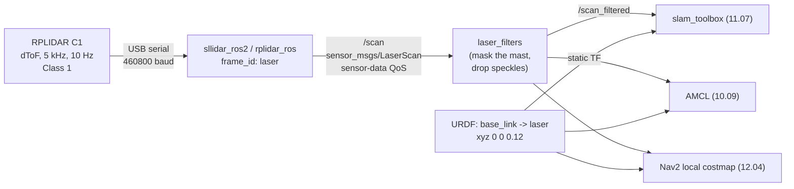

# 07.07 — 2D LiDAR: how it works, LaserScan data, and a ROS 2 driver

<!-- glance:start -->
<!-- generated by tools/build.py from curriculum/syllabus.yaml — edit the syllabus, not this block -->

| | |
|---|---|
| **Track** | Main path |
| **Difficulty** | Intermediate |
| **Time** | 1 h 15 min |
| **Hardware** | 2D LiDAR (stage 3) |
| **Software** | ros2 |
| **Prerequisites** | [07.01 Sensor fundamentals: accuracy, precision, noise, bias, latency, rate](07.01-sensor-fundamentals.md)<br>[05.07 TF2 — broadcasting and listening to transforms](../05-frames-and-transforms/05.07-tf2-broadcast-listen.md) |
| **Optional prerequisites** | [FM.04 Cartesian and polar coordinates](../optional-foundations/mathematics/FM.04-coordinate-systems.md) |
| **Skip if** | Your LiDAR publishes LaserScan in the right frame and you can convert it to points. |

<!-- glance:end -->

## What you will learn

- Explain how a spinning 2D LiDAR measures 500 distances a revolution, and why direct time-of-flight beat triangulation at this price.
- Read and write every field of `sensor_msgs/LaserScan`, including the two ways a beam says "nothing there" and which one is a bug.
- Convert a scan to Cartesian points in the right frame, and compute how many beams hit an object at a given distance.
- Choose a scan rate from your robot's speed, and quantify the smear a turning robot puts into one revolution.
- Bring up an RPLIDAR C1 on a Raspberry Pi 5 — driver, baud rate, udev rule, USB current — and audit the result.

## Why it matters

Everything karmel does after module 10 depends on this one sensor. SLAM builds the map from scans
([11.07](../11-slam/11.07-mapping-your-room.md)). AMCL localizes by matching a scan against the map
([10.09](../10-localization/10.09-amcl-in-ros2.md)). Nav2's local costmap is, in practice, the last
few scans ([12.04](../12-navigation/12.04-costmaps.md)). A 2D LiDAR is the cheapest sensor that
turns "I am somewhere" into "I am here, and there is a chair leg 1.3 m ahead and 20° left".

It is also the sensor whose data looks simplest and hides the most. A `LaserScan` is one array of
floats — and that array is taken over a whole revolution, from a robot that was moving the whole
time, with beams that get further apart the further they travel, and with a convention for "no
return" that half the drivers on GitHub get wrong. This lesson makes all of that explicit, so that
when your map comes out smeared in module 11 you know where to look.

<!-- prereqs:start -->
## Prerequisites

You need these first:

- [07.01 Sensor fundamentals: accuracy, precision, noise, bias, latency, rate](07.01-sensor-fundamentals.md)
- [05.07 TF2 — broadcasting and listening to transforms](../05-frames-and-transforms/05.07-tf2-broadcast-listen.md)

### Optional prerequisite links

New to any of these? Take the foundation lesson first; skip it if you already know it.

- [FM.04 Cartesian and polar coordinates](../optional-foundations/mathematics/FM.04-coordinate-systems.md)

Check your readiness: `python course.py why 07.07`
<!-- prereqs:end -->

## Concept

Point a laser at a wall, measure how long the light takes to come back, divide by twice the speed
of light. Now spin the whole assembly at 10 revolutions per second and do that 5000 times a second.
That is a 2D LiDAR. The output is one array of ranges per revolution, each one belonging to a known
angle — a **polar** picture of the slice of the world at the height of the scan plane.

> [!NOTE]
> New to polar coordinates and converting them to Cartesian $(x, y)$? →
> [FM.04 Cartesian and polar coordinates](../optional-foundations/mathematics/FM.04-coordinate-systems.md).
> Skip it if $(r\cos\phi, r\sin\phi)$ is already muscle memory — you will write it for every scan in this module.

Two things follow from "polar", and they are the two things beginners keep re-learning:

**The data is a fan, not a grid.** Beams *diverge*. At 1 m, karmel's simulated 360-beam scan puts
neighbouring beams 1.75 cm apart; at 6 m, 10.5 cm apart. A chair leg 4 cm across gets two beams out
to 1.15 m and is completely invisible beyond 2.29 m. The sensor did not fail — the leg fell between
the beams. Every occupancy grid you will ever build is a resampling of a fan onto a grid, and that
is where "the far wall looks thinner than the near wall" comes from.

**The revolution takes time.** The beam at −180° and the beam at +179° are 0.1 s apart, and karmel
moved in between. At 0.3 m/s that is 3 cm of translation; at 1 rad/s of yaw, a point 3 m away
smears by 30 cm. The message has a `time_increment` field precisely so a consumer can undo this,
and most consumers ignore it. Drive slowly while mapping; that is the whole fix, and it is why Nav2
on karmel is capped at 0.3 m/s.

> [!CAUTION]
> **Safety:** the RPLIDAR C1 is a **Class 1** eye-safe laser — safe under all normal conditions of
> use, including looking at it. That rating depends on the housing and the spinning: never
> disassemble the emitter, never run the unit with the rotor blocked or removed, and never stare
> into a *stationary* emitter. Keep fingers and long hair away from the spinning head, and mount it
> so cables cannot be pulled into the rotor ([SAFETY.md](../SAFETY.md)).

> [!TIP]
> **Ask your teacher:** "Draw me one LaserScan of a 6 × 5 m room as both the raw range array and the Cartesian point cloud, and show me which index is straight ahead."

## Technical explanation

### Level 1 — How the distance is actually measured

Three technologies, one price ladder:

| | **Triangulation** | **Direct ToF (dToF)** | **Phase-shift / AMCW** |
|---|---|---|---|
| Principle | A laser spot is imaged onto a line sensor; its position on the sensor gives the range by similar triangles | Time a short pulse's round trip; 1 m ≈ 6.7 ns | Modulate the beam, measure the phase shift of the return |
| Error grows | as **range²** — 3 cm at 3 m, 12 cm at 6 m | roughly **constant** with range | constant, with ambiguity at multiples of the modulation wavelength |
| Typical range | 6–8 m indoors | 12–25 m | 30 m+ |
| Sunlight | poor — the sun swamps the spot | better, and the pulse is short | good |
| Price 2026 | ₪300–900 | ₪300–1,100 | ₪10,000+ |
| Examples | RPLIDAR A1 | **RPLIDAR C1**, LDROBOT STL-19P | survey and automotive units |

The arithmetic behind "1 m ≈ 6.7 ns": light covers 2 m (there and back) in
$2/(3\times10^8) = 6.67$ ns. To resolve 1 cm you must resolve 67 ps, which is why dToF used to be
expensive and why the chips that made it cheap (SPAD arrays and time-to-digital converters — the
same family as the VL53L1X in [07.04](07.04-tof-sensors.md)) changed the hobby market. The course
picks the C1 because it is dToF at a triangulation price, its error does not blow up across a
living room, and it has the best-maintained ROS 2 driver of the cheap units.

What a spinning unit adds on top: a brushless motor, a slip ring or optical/inductive coupling to
get power and data across the rotation, and an encoder so every sample knows its angle. The motor
speed is what sets the scan rate; sample rate divided by motor speed is your angular resolution.
The C1 samples at **5 kHz** and spins at **10 Hz** by default:

$$\text{beams per revolution} = \frac{5000\ \text{samples/s}}{10\ \text{rev/s}} = 500,
\qquad \Delta\theta = \frac{360°}{500} = 0.72°$$

Spin it faster and you get fresher data with fewer beams. That trade — **angular resolution against
freshness** — is yours to set, and Level 3 tells you how to choose.

### Level 2 — sensor_msgs/LaserScan, field by field

```text
std_msgs/Header header
  stamp                the acquisition time of the FIRST ray in the scan
  frame_id             "laser" -- the scan plane, 12 cm above base_link on karmel

float32 angle_min      start angle [rad]
float32 angle_max      end angle [rad]
float32 angle_increment  angular step between consecutive ranges [rad]

float32 time_increment   seconds between measurements -- use it to undo motion smear
float32 scan_time        seconds between scans (one revolution)

float32 range_min        [m] -- anything below is invalid
float32 range_max        [m] -- anything above is "no return"

float32[] ranges         [m], ranges[i] belongs to angle_min + i*angle_increment
float32[] intensities    device units, or empty
```

Four conventions that decide whether your data is usable:

1. **Angles are in the sensor frame, about +z, counter-clockwise, with 0 straight ahead (+x).**
   That is REP-103 ([05.06](../05-frames-and-transforms/05.06-frame-conventions-rep103-rep105.md)).
   `ranges[i]` at angle `angle_min + i*angle_increment`. For karmel's 360-beam simulated scan,
   `angle_min = -π`, so index **180 is straight ahead** and index **270 is the robot's left**.
2. **The stamp is the first ray, not the last and not the publish time.** A consumer that wants the
   $i$-th beam's true time computes `stamp + i * time_increment`.
3. **"No return" is a value outside `[range_min, range_max]`** — by convention `inf`. Some drivers
   write **`0.0`** instead, and that is a genuine bug with a spectacular symptom: every missing
   beam becomes an obstacle *at the sensor's own origin*, so the costmap fills with phantom
   obstacles on top of the robot and Nav2 refuses to move. `NaN` appears too, meaning "beam fired,
   result invalid". Filter all three before doing arithmetic — one `inf` turns a mean into `inf`.
4. **`intensities` is device-specific and optional.** It is not calibrated reflectance. It is
   useful for one thing at this level: distinguishing "I got a weak return from a dark, far or
   grazing surface" from "I got a strong return", which is how you spot the beams you should trust
   least. Retro-reflective tape saturates it, which is how docking stations are found
   (the retro-reflective markers on a docking station, [12.09](../12-navigation/12.09-waypoints-and-missions.md)).

Here is what the simulated karmel actually publishes, read off a running Gazebo Harmonic
simulation:

```text
angle_min        -3.1415927
angle_max         3.1241393      (= pi - one increment; the 360th beam does not repeat the 1st)
angle_increment   0.017453292    (= 1.000 degree)
range_min / max   0.05 / 12.0
ranges            360 values
time_increment    0.0            <- Gazebo does not fill it
scan_time         0.0            <- nor this
```

> [!WARNING]
> Those last two zeros are real, and they are a property of the Gazebo `gpu_lidar` sensor and the
> `ros_gz_bridge`, not of your setup. Any code you write that divides by `scan_time` or
> de-skews with `time_increment` will do nothing in simulation and then behave differently on the
> real C1, which fills both. Read them defensively: `scan_time or 1.0/expected_hz`.

### Level 3 — Choosing the scan rate, and the smear you cannot avoid

One revolution takes $T = 1/f$. During it the robot translates $v\,T$ and, if it is turning,
a point at range $r$ smears sideways by $\omega\,T\,r$.

$$\text{translation} = v\,T, \qquad \text{arc smear} = \omega\,T\,r$$

`scan_geometry.scan_rate_smear` computes both. Real numbers for karmel:

| scan rate | speed | yaw rate | translation per rev | smear at 3 m |
|---|---|---|---|---|
| 10 Hz | 0.3 m/s | 0 | **3.0 cm** | 0 |
| 10 Hz | 0.3 m/s | 1.0 rad/s | 3.0 cm | **30 cm** |
| 10 Hz | 0.5 m/s | 2.0 rad/s | 5.0 cm | **60 cm** |
| 5 Hz | 0.3 m/s | 1.0 rad/s | 6.0 cm | **60 cm** |

Read the second row again: **turning is far worse than driving.** A 30 cm smear on a wall 3 m away
is what makes a SLAM map look like it was drawn during an earthquake. This is why Nav2's
`max_vel_theta` matters more than `max_vel_x` for map quality, why the course caps karmel at
0.3 m/s, and why "drive slowly and turn slowly while mapping" is not folklore.

The other half of the choice is angular resolution. The arc between two beams at range $d$ is

$$s = d \cdot \Delta\theta$$

and an object of width $w$ gets at least $k$ beams while $d \le w/(k\,\Delta\theta)$.

| | karmel sim, 360 beams (1.00°) | RPLIDAR C1, 500 beams (0.72°) |
|---|---|---|
| beam gap at 1 m | 1.75 cm | 1.26 cm |
| beam gap at 3 m | 5.24 cm | 3.77 cm |
| beam gap at 6 m | 10.5 cm | 7.5 cm |
| 4 cm chair leg, ≥ 2 beams | to **1.15 m** | to **1.59 m** |
| 10 cm table leg, ≥ 2 beams | to 2.86 m | to 3.98 m |
| 30 cm box, ≥ 2 beams | to 8.59 m | to 11.94 m |

The practical consequence: **a 2D LiDAR is not an obstacle detector for thin objects at range.**
It will see the wall behind the chair long before it sees the chair. Nav2's inflation and a
forward-facing ToF sensor ([07.04](07.04-tof-sensors.md)) exist partly to cover this.

And one more thing a 2D LiDAR cannot do, which is not about resolution at all: it sees **one
plane**. karmel's laser is 12 cm up. A dining table's top is invisible; only the legs appear. A
doorstep, a cable, a cat lying down, the underside of a sofa — none of them exist. This is the
single biggest reason robots that map perfectly still bump into things, and the reason
[07.09](07.09-depth-cameras-and-point-clouds.md) exists.

### Level 4 — From scan to points

Converting is three lines, and every one of them can be wrong:

$$x_i = r_i \cos(\theta_i), \quad y_i = r_i \sin(\theta_i),
\quad \theta_i = \texttt{angle\_min} + i \cdot \texttt{angle\_increment}$$

```python
import numpy as np
angles = msg.angle_min + np.arange(len(msg.ranges)) * msg.angle_increment
r = np.asarray(msg.ranges)
keep = np.isfinite(r) & (r >= msg.range_min) & (r <= msg.range_max)   # do NOT skip this
pts = np.column_stack((r[keep] * np.cos(angles[keep]), r[keep] * np.sin(angles[keep])))
```

Those points are in the **`laser` frame**. To use them for anything involving the robot's body —
"is there something within 30 cm of my front bumper?" — transform to `base_link` with tf2
([05.07](../05-frames-and-transforms/05.07-tf2-broadcast-listen.md)). On karmel that is a 12 cm
lift in z and nothing else, but a sensor mounted 10 cm forward or upside-down (plenty are) makes
this the difference between avoiding an obstacle and driving into it.

ROS ships two ready-made tools you should know exist rather than re-implement:

- **`laser_geometry`** (`LaserProjection.projectLaser`) turns a `LaserScan` into a `PointCloud2`,
  optionally using `time_increment` and tf2 to de-skew the motion.
- **`laser_filters`** is a chain of filters you configure in YAML: `LaserScanRangeFilter` (drop
  out-of-range), `LaserScanAngularBoundsFilterInPlace` (mask the wedge where your own mast or arm
  sits), `ScanShadowsFilter` (remove the false "veil" points on depth discontinuities),
  `LaserScanSpeckleFilter` (drop isolated single-beam returns). Masking the robot's own structure
  out of the scan is the most common real use, and it is the difference between a clean map and a
  map with a permanent ghost obstacle riding along with the robot.

For the reactive-control use, the whole thing collapses to one number —
`scan_geometry.sector_min(ranges, spec, centre=0.0, width=radians(30))` — the nearest valid return
in a 30° cone ahead. Note what it returns when the cone is empty: `inf`, not `0.0`. Returning 0 for
"I saw nothing" is how emergency stops get triggered by clear corridors.

### Level 5 — Bringing up the RPLIDAR C1 on a Pi 5

> [!IMPORTANT]
> **Version-sensitive** (verified 2026-09 against ROS 2 Jazzy / Ubuntu 24.04, `curriculum/versions.yaml`
> and `references/research/software-versions-2026-09.md`). Driver packaging for cheap LiDARs moves
> constantly. Check before you install: Slamtec's own driver
> https://github.com/Slamtec/sllidar_ros2 · the community-maintained package index entry
> https://index.ros.org/p/rplidar_ros/ · AI teacher: verify both, and the C1's current launch file
> name, before giving install steps.

Two drivers exist for this sensor and the course is honest about both:

| | `rplidar_ros` | `sllidar_ros2` |
|---|---|---|
| Source | community package, in the ROS index | Slamtec's own, on GitHub |
| Jazzy apt binary | **yes** (2.1.0, amd64 + arm64 on 2026-09-16) | **no** — not in rosdistro; source build only |
| C1 support | yes, per its changelog | yes, `sllidar_c1_launch.py` |
| Last upstream activity | active | last push 2024-07 |

Try apt first, because a binary you can `rosdep install` is worth a lot on a robot you re-flash.
Fall back to the source build when the binary is missing or does not know your unit:

```bash
cd ~/labs/ros2_ws/src
git clone https://github.com/Slamtec/sllidar_ros2.git
cd .. && source /opt/ros/jazzy/setup.bash && colcon build --symlink-install
source install/setup.bash
ros2 launch sllidar_ros2 sllidar_c1_launch.py         # add view_ prefix to also open RViz
```

The launch file's parameters, and what each one means on karmel:

| Parameter | Default | Note |
|---|---|---|
| `channel_type` | `serial` | the C1's USB adapter is a serial bridge |
| `serial_port` | `/dev/ttyUSB0` | **the Pico is `/dev/ttyACM0`** — different device class, so they do not collide, but add a udev rule anyway |
| `serial_baudrate` | `460800` | **model-specific.** An A1 is 115200. Wrong baud = "failed to get device info" |
| `frame_id` | `laser` | already matches karmel's URDF — do not change it |
| `inverted` | `false` | set true only if the unit is mounted upside down |
| `angle_compensate` | `true` | resample to a uniform angular grid; leave it on |
| `scan_mode` | `Standard` | the C1's other modes trade rate against range |

Four hardware details that cost people an evening each:

1. **USB current.** When the Pi 5 runs from karmel's 5 V buck regulator rather than the official
   27 W supply, it limits total USB current to 600 mA. The C1's motor exceeds that transiently.
   Set `usb_max_current_enable=1` in the Pi's firmware config, or the LiDAR stalls, browns out, or
   reboots the Pi mid-scan.
2. **Device naming.** `/dev/ttyUSB0` is assigned in plug order. Write a udev rule keyed on the
   adapter's vendor/product id (and serial, if it has one) so the LiDAR is always `/dev/rplidar`,
   then pass that. `sllidar_ros2` ships a script for it; `udevadm info -a -n /dev/ttyUSB0` gives
   you the attributes.
3. **Permissions.** `sudo usermod -aG dialout $USER`, then log out and back in.
   `chmod 777 /dev/ttyUSB0` works and evaporates on the next reboot.
4. **Mounting.** Top deck, centred, **above everything else**, cables routed below the scan plane.
   A single cable crossing the plane shows up as a permanent obstacle at 5 cm in every direction it
   occludes, and in SLAM it becomes a ghost that follows the robot.

Then audit it, exactly as you did the IMU:

```bash
python3 07-sensors/code/ros2/sensor_check.py /scan --expect-hz 10 --frame laser --seconds 5
```

## Diagram

```text
One LaserScan of a 6 x 5 m room, robot at the centre, 0.3 m box 1.5 m ahead
(karmel sim: 360 beams, angle_min = -pi, so index 180 = straight ahead)

        index 270  (+90 deg, robot's LEFT)
             |  2.50 m to the wall
             |
   3.00 m    |            1.35 m         index 180 = +x = FORWARD
  <----------O--------[BOX]------>       (box near face at 1.5 - 0.3/2)
   index 0   |
  (-180 deg, |
   BEHIND)   |  2.50 m
        index 90  (-90 deg, robot's RIGHT)

  ranges[180] = 1.355   ranges[270] = 2.509   ranges[0] = 2.999
  beams that hit nothing: inf   (NOT 0.0 -- 0.0 is a driver bug)

Beams diverge: the same 4 cm chair leg, three distances

   0.5 m         1.5 m                 3.0 m
   | | | |       |   |   |             |       |
   [leg]         [leg]                   leg falls between beams
   4 beams       1-2 beams             0 beams  -> "the LiDAR missed it"
```



## Code

All in [`07-sensors/code/ros2/`](code/ros2/README.md); the ROS-free parts are tested with
`py -m pytest 07-sensors/code/ros2` (20 passed, no ROS needed).

**[`scan_geometry.py`](code/ros2/scan_geometry.py)** — the geometry, as pure numpy:
`ScanSpec` (the header fields without ROS), `scan_angles`, `valid_mask` (the inf/NaN/0.0/out-of-range
filter you must not skip), `scan_to_points`, `sector_min` (wraps correctly across ±π and returns
`inf` for an empty sector), `gap_at_range`, `range_for_gap`, `scan_rate_smear`.

**[`fake_lidar.py`](code/ros2/fake_lidar.py)** — a synthetic 360-beam LiDAR in a rectangular room
with an optional box, analytically ray-cast so the numbers are exact, publishing on `/scan` in
frame `laser` with the sensor-data QoS a real driver uses. Six injectable faults:
`zeros-for-no-return`, `degrees`, `clockwise`, `wrong-frame`, `stale-stamp`, `half-count`.

```bash
# in the course Docker image
source /opt/ros/jazzy/setup.bash
cd 07-sensors/code/ros2
python3 fake_lidar.py --box 1.5 --intensities &
python3 sensor_check.py /scan --expect-hz 10 --frame laser --seconds 5
ros2 topic echo --once /scan --field angle_increment
```

The simulated karmel is the other source of real scans, and it is the one module 11 will use:

```bash
ros2 launch karmel_bringup robot.launch.py sim:=true headless:=true world:=apartment x:=-1.5 y:=-0.5
# in another terminal -- note use_sim_time, or every stamp looks 55 years old (07.10)
python3 07-sensors/code/ros2/sensor_check.py /scan --expect-hz 10 --frame laser \
  --seconds 6 --ros-args -p use_sim_time:=true
```

## Exercise

### Exercise 07.07-E1 — Predict the scan `[predict]`

Hardware: none. `fake_lidar.py` puts the robot at the centre of a 6 × 5 m room with a 0.3 m box
1.5 m ahead, 360 beams, `angle_min = -π`. Before running it, predict: (a) the value of
`ranges[180]`; (b) `ranges[270]`; (c) `ranges[0]`; (d) `angle_max`, to four decimals, and why it is
not π; (e) what a beam that hits nothing contains. Then run it and check each one.

### Exercise 07.07-E2 — Resolution and smear `[numerical]`

Hardware: none. (a) An RPLIDAR C1 samples at 5 kHz and spins at 10 Hz — how many beams per
revolution, and what angular resolution in degrees? (b) How far apart are neighbouring beams at
2 m and at 8 m? (c) Out to what distance does a 4 cm chair leg get at least two beams? At least
one? (d) karmel maps a room at 0.25 m/s while turning at 0.8 rad/s, scanning at 10 Hz: how far does
it translate during one revolution, and how much does a point 4 m away smear? (e) You halve the
scan rate to double the angular resolution. Recompute (d) and say which trade you would take for
SLAM and which for obstacle avoidance.

### Exercise 07.07-E3 — Scan to points, and the filter you must not skip `[coding]`

Hardware: none. Using `scan_geometry.py`: (a) write the four lines that turn a `LaserScan` into an
(N, 2) array of points in the `laser` frame; (b) run it on a scan that contains one `inf`, one
`0.0` and one `NaN` *without* `valid_mask` and describe exactly what each produces in the output;
(c) compute the nearest obstacle in a 30° cone ahead with `sector_min`, and explain why it returns
`inf` and not `0.0` when the cone is empty; (d) karmel's laser is 12 cm above `base_link` — state
the transform you need to answer "is anything within 30 cm of my front bumper?" and what goes wrong
if you skip it on a robot whose LiDAR is mounted 10 cm forward.

### Exercise 07.07-E4 — Find the injected fault `[debugging]`

Hardware: none. Have your AI teacher start `fake_lidar.py` with one `--fault` and not say which.
With only `sensor_check.py`, `ros2 topic echo --field ...` and `ros2 topic hz`, identify it. Do all
six. For each, also write the one-sentence *downstream* symptom — what slam_toolbox or Nav2 would
do with that scan — because that is how you will actually meet these in module 12.

### Exercise 07.07-E5 — Scan the simulated apartment `[simulation]`

Hardware: none (the course Docker image).

```bash
ros2 launch karmel_bringup robot.launch.py sim:=true headless:=true world:=apartment x:=-1.5 y:=-0.5
python3 07-sensors/code/ros2/sensor_check.py /scan --expect-hz 10 --frame laser \
  --seconds 6 --ros-args -p use_sim_time:=true
ros2 topic echo --once /scan --field scan_time
ros2 run teleop_twist_keyboard teleop_twist_keyboard --ros-args -p stamped:=true
```

(a) Record the audit output. (b) What are `scan_time` and `time_increment`, and why? (c) Drive up
to the dining table and look at `/scan` in RViz: which parts of the table appear, and what does
that imply for a robot planning a path under it? (d) Spin in place at a low and then a high yaw
rate while watching RViz; describe the difference in the walls.

### Exercise 07.07-E6 — Bring up your own C1 `[hardware]`

Hardware: `lidar` (RPLIDAR C1), `robot-base`.

> [!CAUTION]
> **Safety:** Class 1 laser — safe to look at in normal use, but never disassemble the emitter and
> never run it with the rotor blocked. Keep fingers, hair and cables out of the spinning head. The
> battery is live: reachable switch, fused pack, never leave Li-ion charging unattended
> ([SAFETY.md](../SAFETY.md)). Steps 1–5 need no driving.

1. Plug in, `ls -l /dev/ttyUSB*`, `sudo usermod -aG dialout $USER`, log out and in.
2. Install or build a driver, launch it, and confirm `/scan` exists with `frame_id: laser`.
3. Run `sensor_check.py /scan --expect-hz 10 --frame laser`. Record every line, including
   `scan_time` and `time_increment` — compare with the simulation's zeros.
4. **Ground truth.** Put the robot a measured 1.00 m from a flat wall, facing it. Read
   `ranges[i]` for the forward beam and compare. Repeat at 3.00 m and at the furthest wall you
   have. Tabulate error vs range — is it constant (dToF) or growing (triangulation)?
5. **Failure survey.** Point it at, and record the valid-beam fraction for: a white wall, a black
   matte object, a mirror, a window, a glossy floor at a grazing angle, and a person's dark
   trousers. Rank them.
6. Add a udev rule so the device is `/dev/rplidar`, relaunch with that port, and confirm it still
   works after a reboot with the Pico plugged in too.

## Expected result

**07.07-E1:** (a) `ranges[180] ≈ 1.35 m` — the box's *near face*, at $1.5 - 0.3/2$, plus ~1 cm of
noise (a measured run gave **1.355**). (b) `ranges[270] ≈ 2.50` (half of 5 m). (c)
`ranges[0] ≈ 3.00` (half of 6 m). (d) `angle_max = 3.1241` = $\pi - \Delta\theta$: a 360° scanner
must **not** repeat the first beam at the end, or you get a duplicate ray and an off-by-one in
every consumer. (e) `inf`. A measured run:

```text
n = 360   finite: 357
angle_min -3.1416  angle_max 3.1241  inc 0.017453
beam at 0 rad (forward): index 180  range 1.355 m
beam at +90 deg (left):  index 270  range 2.509 m
beam at -180 deg (behind): index 0  range 2.999 m
```

**07.07-E2:** (a) $5000/10 = 500$ beams, $360/500 = 0.72°$ = 0.012566 rad. (b) $2 \times 0.012566 =$
**2.51 cm** at 2 m; **10.1 cm** at 8 m. (c) Two beams out to $0.04/(2 \times 0.012566) =$
**1.59 m**; one beam out to **3.18 m**. (d) translation $0.25/10 =$ **2.5 cm**; smear
$0.8 \times 0.1 \times 4 =$ **32 cm**. (e) At 5 Hz: translation 5 cm, smear **64 cm**, resolution
0.36°. For SLAM take the **higher rate** — scan matching cares far more about a rigid, un-smeared
scan than about extra beams, and you can always drive slower. For static obstacle detection at a
standstill, the higher resolution wins.

**07.07-E3:** (a) as in Level 4. (b) Without `valid_mask`: the `inf` beam produces
`(inf·cos θ, inf·sin θ)` = `(±inf, ±inf)` or `nan` where the cosine is 0, and it poisons any
`mean`, `min` or bounding box computed over the array; the `0.0` beam produces the point `(0, 0)`
— an obstacle **at the sensor origin**, which a costmap marks as lethal and which makes Nav2
refuse to plan; the `NaN` beam produces `(nan, nan)` and silently propagates into every reduction.
(c) `sector_min` returns `inf` because that is the truthful answer to "nearest obstacle in an empty
cone"; returning 0.0 would mean "an obstacle is touching me" and would stop the robot in a clear
corridor. (d) You need `base_link → laser`, which on karmel is a pure +0.12 m translation in z
(`ros2 run tf2_ros tf2_echo base_link laser` prints `Translation: [0.000, 0.000, 0.120]`); with a
sensor mounted 10 cm forward, skipping the transform makes every forward range read 10 cm too
large, so the robot brakes 10 cm late — about a third of a second of margin at 0.3 m/s.

**07.07-E4:** measured audit lines for each fault:

```text
zeros-for-no-return  [FAIL] no-return marker   3 beams are exactly 0.0 (a driver bug; use inf)
degrees              [FAIL] angles in radians  span = 359.0000 rad (20569.2 deg)
half-count           [FAIL] ranges length      180 ranges, angle span implies 360
stale-stamp          [FAIL] stamp age          median 502.0 ms (limit 200 ms)
wrong-frame          [FAIL] frame_id           'base_link' (expected 'laser')
clockwise            PASS  -- internally consistent; only a known physical scene catches it
```

Downstream symptoms: zeros → lethal obstacles at the robot's origin, Nav2 aborts; degrees →
the consumer computes absurd angles and the "scan" collapses to a sliver or wraps many times;
half-count → half the room is missing, and scan matching converges to the wrong pose; stale-stamp
→ tf2 extrapolation errors and a map that trails the robot; wrong-frame → the whole scan is 12 cm
too low, so the floor becomes an obstacle; clockwise → the map is **mirrored**, and this is the one
you find only by driving into a known room and seeing left and right swapped.

**07.07-E5:** (a) The audit passes with `use_sim_time:=true`:

```text
/scan  (LaserScan, 6 s window)
[  ok  ] arriving               6 messages
[  ok  ] rate                   10.00 Hz (expected 10.0), jitter 0.0 ms, worst gap 100.0 ms
[  ok  ] stamp age              median 34.0 ms, p95 52.5 ms, max 56.0 ms (limit 200 ms)
[  ok  ] frame_id               'laser'
[  ok  ] ranges length          360 ranges, angle span implies 360
[  ok  ] angles in radians      span = 6.2657 rad (359.0 deg)
[  ok  ] no-return marker       0 beams are exactly 0.0, 0 are inf/NaN
[  ok  ] valid fraction         100.0% of 360 beams valid, nearest 1.052 m
```

Note "arriving 6 messages" in a 6-second wall-clock window: under software rendering the
simulation runs well below real time, so 10 Hz of *simulated* time arrives at 1–2 Hz of wall
time. That is correct behaviour, and it is why every node in a simulation must use `/clock`.
(b) `scan_time` and `time_increment` are both **0.0** — Gazebo's `gpu_lidar` and the bridge do not
fill them. (c) Only the **legs** appear, as four small blobs; the tabletop is above the 12 cm scan
plane and is invisible, so a planner using only this scan will happily route the robot under the
table and wedge it. (d) At a low yaw rate the walls in RViz stay straight; at a high one they bend
and the room appears to rotate within a single scan — the smear from Level 3, visible.

**07.07-E6:** Expect 10 Hz ± 0.2, `scan_time ≈ 0.1` and `time_increment ≈ 2e-4` (both non-zero, in
contrast with the simulation), 400–500 beams per revolution, and a valid-beam fraction above 90 %
in a normal room. Range error against a measured wall should be roughly **constant** with distance
for the C1 (a few centimetres at 1 m and at 6 m) — if it grows as range², you have a triangulation
unit, not a dToF one. The failure survey ranks, best to worst: white wall (≈100 % valid) > dark
trousers > glossy floor at a grazing angle > black matte object > window > mirror. A mirror does
not read as "close"; it reads as a **room that continues**, and it is the classic way to poison a
SLAM map.

## Troubleshooting

### Symptom: the driver starts and immediately exits, or reports "failed to get device info"

Work down the stack, physics first:

1. Is the head spinning? No spin = no power. That is USB current (Level 5, point 1) or a dead
   adapter board, not software.
2. `ls -l /dev/ttyUSB*` — is the device there at all? If not it is cable, adapter or kernel;
   `dmesg | tail` says which.
3. Permission denied? `groups` must include `dialout`.
4. Device present, still failing: **baud rate**. The C1 wants **460800**; an A1 wants 115200. This
   error message is what a wrong baud looks like.
5. Still failing: another process has the port open (an old driver instance, a serial monitor).
   `fuser /dev/ttyUSB0`.

### Symptom: `/scan` publishes, but RViz shows nothing (or "No transform from [laser]")

1. `ros2 topic hz /scan` — is data really flowing?
2. `ros2 topic echo --once /scan --field header` — is `frame_id` what your URDF calls the frame?
   `laser` on karmel. A driver default of `laser_frame` or `rplidar_link` is a frame nobody
   publishes.
3. `ros2 run tf2_ros tf2_echo base_link laser` — does the transform exist? If not, is
   `robot_state_publisher` running with the URDF?
4. In RViz, is the LaserScan display's **Fixed Frame** set to something that connects? And is its
   QoS set to Best Effort? RViz defaults to Reliable and a sensor driver offers Best Effort —
   the display then stays empty with no error. This one costs everybody an hour once.

### Symptom: obstacles appear on top of the robot, or Nav2 refuses to move

1. `sensor_check.py /scan` and read the **no-return marker** line. Beams at exactly `0.0` are the
   classic cause: the driver writes 0 instead of `inf` and every missed beam becomes an obstacle at
   the origin.
2. If the zeros are real, filter them: `laser_filters`' `LaserScanRangeFilter` with
   `lower_threshold` slightly above `range_min`.
3. Not zeros? Look for the robot's own structure in the scan — a mast, a cable, an arm. Mask that
   wedge with `LaserScanAngularBoundsFilterInPlace` and re-route the cable below the scan plane.

### Symptom: the map is smeared, doubled or "drawn during an earthquake"

1. How fast were you turning? Compute the smear from Level 3 before blaming SLAM: at 1 rad/s and
   10 Hz, a point at 3 m moves 30 cm within a single scan.
2. `sensor_check.py` — is the **stamp age** small and the rate steady? A scan stamped late is a
   scan matched against the wrong pose.
3. Is odometry sane? Scan matching corrects odometry, it does not replace it; garbage odometry with
   a 20 % scale error produces exactly this. Check [09.05](../09-odometry/09.05-calibrating-odometry.md).
4. Is `use_sim_time` consistent across *every* node? One node on wall time in a simulation
   produces a beautifully smeared map ([07.10](07.10-sensor-data-in-ros2.md)).

### Symptom: the LiDAR "misses" a chair, a table or a glass door

Mostly not a fault:

1. **Height.** Is the object at the 12 cm scan plane? A tabletop is not. Measure before debugging.
2. **Width vs range.** Use `range_for_gap`: a 4 cm leg has no beams on it past ~3 m.
3. **Surface.** Glass and mirrors transmit or reflect specularly; matte black absorbs. The C1's
   12 m spec is for *white* targets and drops to about 6 m for black ones.
4. If it is glass, no 2D LiDAR will fix it. Add a forward ToF or ultrasonic sensor
   ([07.03](07.03-ultrasonic-sensors.md), [07.04](07.04-tof-sensors.md)) — ultrasonic sees glass
   precisely because sound does not care about optical transparency.

## Common mistakes

- **Treating `0.0` as a valid range.** It is a driver bug and it puts obstacles on the robot.
  Filter with `valid_mask` before any arithmetic.
- **Assuming index 0 is straight ahead.** It is `angle_min`. On karmel's 360-beam scan, forward is
  index 180.
- **Building `angle_max = angle_min + n * angle_increment` for a 360° scanner.** The last beam
  would duplicate the first; it is `n - 1` increments of span, i.e. $\pi - \Delta\theta$.
- **Ignoring `range_min`.** Returns closer than it are noise or the sensor's own housing.
- **Using scan points in `laser` as if they were in `base_link`.** Free transform, expensive bug.
- **Expecting a 2D LiDAR to see a tabletop, a doorstep or a cable.** One plane, 12 cm up.
- **Mapping at high yaw rate** and blaming the SLAM algorithm for the smear you asked for.
- **Leaving RViz's LaserScan display on Reliable QoS.** Silently empty.
- **Dividing by `scan_time` without checking it is non-zero.** Gazebo publishes 0.0.

## Knowledge check

1. `angle_min = -π`, `angle_increment = 0.01745`, 360 ranges. Which index is straight ahead, and
   which is the robot's left?
   <details><summary>Answer</summary>

   Forward (+x, angle 0) is index $(0 - (-\pi))/0.01745 = 180$. The robot's **left** is +90°
   (REP-103: counter-clockwise positive), index 270. If you assumed index 90 was left, you have the
   sign of the angle backwards and your map will be mirrored.
   </details>

2. A beam hits nothing. What should `ranges[i]` contain, what do some drivers put there instead,
   and what does the wrong value do downstream?
   <details><summary>Answer</summary>

   It should be a value outside `[range_min, range_max]`, conventionally `inf`. Some drivers write
   `0.0`. A 0.0 converts to the Cartesian point (0, 0) — an obstacle at the sensor's own origin —
   so the local costmap fills with lethal cells on top of the robot and Nav2 concludes it is
   trapped and refuses to move.
   </details>

3. karmel scans at 10 Hz while turning at 1.5 rad/s. How much does a point at 4 m smear within one
   scan, and what does that do to SLAM?
   <details><summary>Answer</summary>

   $\omega T r = 1.5 \times 0.1 \times 4 =$ **0.60 m**. The scan is no longer a rigid snapshot of
   the room, so scan matching — which assumes exactly that — finds a pose that fits a distorted
   shape. The map comes out with curved walls and doubled features. The fix is to turn slower, not
   to re-tune slam_toolbox.
   </details>

4. Predict: you point a 360-beam LiDAR at a 4 cm chair leg from 2 m. What do you see?
   <details><summary>Answer</summary>

   With 1.00° resolution the beams are 3.5 cm apart at 2 m, so the leg gets **zero or one** beam
   depending on where it happens to fall — $0.04/(1 \times 0.01745) = 2.29$ m is the one-beam
   limit. You will see it intermittently as the robot moves, which looks like a flickering
   obstacle. This is not a defect; it is angular resolution, and it is why thin obstacles need
   either a closer approach, a higher-resolution sensor, or a different sensor entirely.
   </details>

5. You install the driver, `/scan` publishes at 10 Hz, RViz's LaserScan display stays empty and
   logs nothing. Most likely cause?
   <details><summary>Answer</summary>

   QoS. The driver offers **BEST_EFFORT** (the sensor-data profile); RViz's display defaults to
   **Reliable**, which is a stronger request, so DDS never connects them and nothing is delivered
   or reported in the display. Set the display's Reliability Policy to Best Effort. Confirm the
   diagnosis with `ros2 topic info -v /scan`, which prints both endpoints' policies.
   </details>

6. Your unit's range error is 3 cm at 1 m and 13 cm at 6 m. What technology is it, and what does
   that mean for mapping a living room?
   <details><summary>Answer</summary>

   Error growing roughly as range² is the signature of **triangulation** (an A1-class unit), not
   dToF. Practically: near walls map well and far walls are fuzzy, so the map's outer edges are
   soft and loop closure across a long room is harder. Map in shorter legs, and do not trust
   features beyond about 4 m.
   </details>

7. Why does `sector_min` return `inf` rather than `0.0` for an empty sector, and what would break
   if it returned 0.0?
   <details><summary>Answer</summary>

   `inf` is the truthful answer to "how far is the nearest obstacle in this cone?" when there is
   none. `0.0` means "something is touching me", so a safety stop keyed on
   `sector_min < 0.3` would fire continuously in a clear corridor — and worse, it fires exactly in
   the situation where all beams missed, which is also what happens against glass. Failing to
   "obstacle right here" sounds safe and is actually the failure that makes people disable the
   check.
   </details>

8. Two nodes publish `base_link → laser`: `robot_state_publisher` from the URDF, and a
   static_transform_publisher you added in a launch file "to be sure". What happens?
   <details><summary>Answer</summary>

   `laser` gets two parents' worth of transforms on the same edge, so tf2's buffer holds
   conflicting data for the same frame pair and lookups return whichever arrived last. You get
   intermittent `TF_REPEATED_DATA` warnings and a scan that appears to jump between two positions.
   A TF edge has exactly one owner; delete the redundant publisher.
   </details>

## Practical challenge

**A scan-quality report for your own environment.** Produce a short report, with data, that
characterises a 2D LiDAR (real or the simulated one) well enough that someone else could predict
what it will and will not see in your home.

It must contain: a range-accuracy table against a tape measure at 0.5, 1, 2, 4 and 6 m (or the
simulated equivalents against known wall positions), with bias and σ at each; a valid-beam-fraction
survey of at least six surfaces including glass and matte black; the measured angular resolution,
derived from the message rather than the datasheet, and the resulting minimum detectable object
width at 1, 3 and 6 m; a smear measurement — drive a straight line and then a 1 rad/s turn past the
same wall, and show the difference in the scan; and a one-page "what this sensor cannot see in my
apartment", with at least three specific objects and their heights.

Acceptance criteria:

- `sensor_check.py /scan --expect-hz 10 --frame laser` exits 0, output included.
- Every number comes from a measurement, not a datasheet, and each has an uncertainty.
- A plot of range error vs distance, with a sentence saying whether it is constant or growing and
  what technology that implies.
- The scan is transformed into `base_link` at least once, with the code shown.
- A named, configured `laser_filters` chain that masks any part of your own robot visible in the
  scan — or a paragraph showing, with a plot, that none is.
- Safety: Class 1 laser handled per the rules above; if you drive, wheels off the ground for the
  first run and a hand on the switch.

No-hardware version: run the entire challenge against `fake_lidar.py` and the Gazebo apartment.
Use `--dropout` and `--sigma` to stand in for the surface survey, and state clearly which numbers
are simulated.

## You can skip this if…

You can answer knowledge-check questions 1, 2 and 3 correctly without looking, your LiDAR publishes
`LaserScan` in a frame TF knows about, and you can convert a scan to points in `base_link` and say
how many beams a 10 cm object gets at 3 m. Then:

`python course.py skip 07.07 --reason "my LiDAR publishes LaserScan in the right frame and I can convert and reason about it"`

## Go deeper

- `sensor_msgs/LaserScan` definition: https://github.com/ros2/common_interfaces/blob/jazzy/sensor_msgs/msg/LaserScan.msg — the comments are the specification, including "timestamp in the header is the acquisition time of the first ray".
- REP-103, *Standard Units of Measure and Coordinate Conventions*: https://www.ros.org/reps/rep-0103.html — where the counter-clockwise, x-forward angle convention comes from.
- Slamtec `sllidar_ros2` driver: https://github.com/Slamtec/sllidar_ros2 — supported models, per-model launch files (`sllidar_c1_launch.py`), baud rates and the udev script.
- `rplidar_ros` package index entry: https://index.ros.org/p/rplidar_ros/ — check here first for a Jazzy apt binary and current C1 support before building from source.
- `laser_filters`: https://github.com/ros-perception/laser_filters — the filter chain (range, angular bounds, shadows, speckle) and its YAML configuration; read this before writing your own filter.
- `laser_geometry`: https://github.com/ros-perception/laser_geometry — `LaserProjection`, including the high-fidelity mode that uses `time_increment` and tf2 to undo motion skew.
- Slamtec RPLIDAR C1 product page and datasheet: https://www.slamtec.com/en/C1 — sample rate, scan rate, range for white vs black targets, and the Class 1 laser statement.
- Thrun, Burgard & Fox, *Probabilistic Robotics*, chapter 6 (Robot Perception / beam models): the standard treatment of what a range measurement actually is — a mixture of a correct reading, an unexpected obstacle, a max-range failure and a random one. Module 10 uses this model directly.

## Progress checkpoint

- [ ] I can explain dToF vs triangulation and say which my sensor is from its error-vs-range curve.
- [ ] I can map any index of `ranges` to its angle, and say which index is straight ahead.
- [ ] I can convert a scan to points in `base_link`, filtering inf, NaN and 0.0 correctly.
- [ ] I can compute the smear a turning robot puts into one revolution, and choose a scan rate.
- [ ] I can bring up an RPLIDAR C1 on a Pi 5 and audit the resulting `/scan`.

`python course.py complete 07.07` (exercises done) · `python course.py master 07.07` (challenge done) · `python course.py struggle 07.07 "what was hard"`

Next: [07.08 — RGB cameras on the robot: exposure, rolling shutter, ROS image topics](07.08-rgb-cameras.md).
