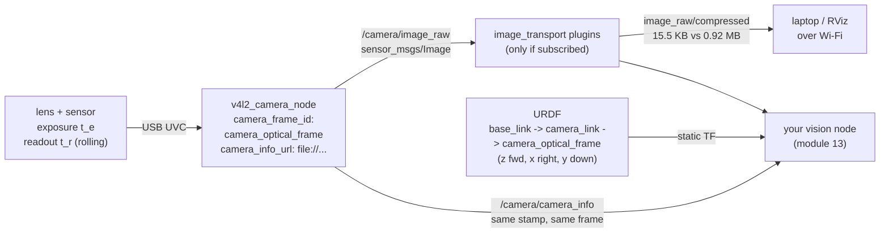

# 07.08 — RGB cameras on the robot: exposure, rolling shutter, ROS image topics

<!-- glance:start -->
<!-- generated by tools/build.py from curriculum/syllabus.yaml — edit the syllabus, not this block -->

| | |
|---|---|
| **Track** | Main path |
| **Difficulty** | Intermediate |
| **Time** | 1 h 15 min |
| **Hardware** | Camera (Raspberry Pi Camera Module 3 or USB webcam) (stage 2) |
| **Software** | ros2, camera-driver |
| **Prerequisites** | [07.01 Sensor fundamentals: accuracy, precision, noise, bias, latency, rate](07.01-sensor-fundamentals.md)<br>[04.11 Quality of Service — reliability, durability, history](../04-ros2/04.11-qos.md) |
| **Optional prerequisites** | [FCV.01 How cameras form images: light, sensors, Bayer filters, exposure](../optional-foundations/computer-vision/FCV.01-how-cameras-form-images.md) |
| **Version-sensitive** | yes — see [curriculum/versions.yaml](../curriculum/versions.yaml) |
| **Skip if** | Your camera streams to ROS 2 with CameraInfo and you know its latency. |

<!-- glance:end -->

## What you will learn

- Bring up a USB webcam on Ubuntu 24.04 with `v4l2_camera`, and say why the course does not use the Pi's CSI camera on this OS.
- Budget bandwidth and CPU from resolution, format and frame rate before you choose them — and use `image_transport` compression when raw does not fit.
- Predict motion blur and rolling-shutter skew, in pixels, from your robot's speed and the exposure time.
- Publish and consume `CameraInfo` correctly, and know what `K[0] == 0` means.
- Measure a camera's **end-to-end latency** and turn it into centimetres of robot travel.

## Why it matters

The camera is the sensor that makes karmel more than a Roomba: fiducials
([13.07](../13-computer-vision/13.07-fiducial-markers.md)), object detection
([13.10](../13-computer-vision/13.10-object-detection-models.md)), visual SLAM
([11.08](../11-slam/11.08-visual-slam.md)), and everything module 18 and 19 do with learned
policies and vision-language models. It is also the sensor that will eat your Raspberry Pi. A
640×480 RGB image at 15 fps is **110 Mbit/s** of raw data on the ROS graph; 1080p at 30 fps is
**1.5 Gbit/s**. On a Pi 5 that is the difference between a robot that navigates and a robot whose
control loop starves.

And unlike a LiDAR, a camera's *quality* depends on choices you make. Exposure time trades
brightness against blur. A rolling shutter trades cost against geometric truth while turning.
Resolution trades detail against latency. This lesson is about making those choices deliberately
and measuring the result, so that module 13's computer vision runs on images that are worth
processing.

<!-- prereqs:start -->
## Prerequisites

You need these first:

- [07.01 Sensor fundamentals: accuracy, precision, noise, bias, latency, rate](07.01-sensor-fundamentals.md)
- [04.11 Quality of Service — reliability, durability, history](../04-ros2/04.11-qos.md)

### Optional prerequisite links

New to any of these? Take the foundation lesson first; skip it if you already know it.

- [FCV.01 How cameras form images: light, sensors, Bayer filters, exposure](../optional-foundations/computer-vision/FCV.01-how-cameras-form-images.md)

Check your readiness: `python course.py why 07.08`
<!-- prereqs:end -->

## Concept

A camera is a **bucket of photons with a shutter**. Each pixel accumulates charge for the exposure
time, then the chip reads it out. Two consequences dominate robotics:

> [!NOTE]
> New to how a sensor turns light into pixels — photosites, the Bayer filter, gain, and what exposure actually
> costs? → [FCV.01 How cameras form images: light, sensors, Bayer filters, exposure](../optional-foundations/computer-vision/FCV.01-how-cameras-form-images.md).
> Skip it if you can already explain why raising gain instead of exposure keeps motion sharp and adds noise.

**Exposure is time, and your robot moves during it.** A bright room lets you expose for 2 ms and
freeze the scene. A dim corridor makes the auto-exposure choose 33 ms, and now everything in the
frame smears by however far it moved in 33 ms. The sensor did not get worse; the *scene* got
darker and the camera silently traded sharpness for brightness. Auto-exposure does this without
telling you, which is why a detector that works in your kitchen fails in your hallway.

**Most cheap sensors read the image out one row at a time.** In a **rolling** shutter the top row
is exposed a few milliseconds before the bottom row, so a robot that turns while reading produces a
frame where the bottom of the image is taken from a different heading than the top. Straight poles
lean. A **global** shutter exposes every pixel simultaneously and costs three to five times as
much. Almost every USB webcam and every Pi camera module is rolling.

The third idea is purely about ROS: **an image is meaningless without its `CameraInfo`.** The
`Image` message carries pixels; the `CameraInfo` message carries the intrinsics $K$ and the
distortion coefficients that turn a pixel into a ray. They are separate topics, published in
lockstep on the same stamp, and every consumer pairs them — usually with `image_transport`'s
camera subscriber, which does the pairing for you.

> [!TIP]
> **Ask your teacher:** "Take one photo of the same scene at 2 ms and 33 ms exposure and show me the blur in pixels for a robot turning at 1 rad/s — then tell me which one a detector should get."

## Technical explanation

### Level 1 — Which camera, and why not the Pi's

> [!IMPORTANT]
> **Version-sensitive** (verified 2026-09 against Ubuntu 24.04 + ROS 2 Jazzy;
> `curriculum/versions.yaml`, `references/research/software-versions-2026-09.md`).
> Ubuntu's own hardware docs state that the libcamera stack "is not currently operational on Ubuntu
> releases before 25.04", and that from 25.04 all Pi models with a CSI port can use the camera
> stack: https://ubuntu.com/hardware/docs/boards/how-to/special_hardware/rpi-camera/ ·
> `camera_ros` README (why you may need the Raspberry Pi libcamera fork):
> https://github.com/christianrauch/camera_ros ·
> AI teacher: re-check both before advising on a CSI camera.

On the course OS — Ubuntu Server 24.04 LTS on a Pi 5 — the Raspberry Pi Camera Module works
*badly*, and the reason is not ROS. It is that Ubuntu 24.04's stock packages do not carry a working
libcamera stack for Pi cameras; Ubuntu fixed that in 25.04, after our LTS. The workarounds all
exist and all cost you a day:

| Path | What it costs |
|---|---|
| USB UVC webcam + `v4l2_camera` | **course main path.** Works out of the box, more CPU (MJPEG decode) |
| Ubuntu 24.04 + `camera_ros` built against the `raspberrypi/libcamera` fork | a source build of libcamera inside your colcon workspace; unverified end-to-end on a Pi 5 |
| Raspberry Pi OS on the host + ROS 2 in Docker with device passthrough | a different host OS than the rest of the course |
| Arducam USB module with the same IMX708 sensor | costs more, avoids the problem entirely |

So: a plain UVC webcam, `ros-jazzy-v4l2-camera`. It is not a compromise for learning — the
geometry, the exposure physics, the message layout and the latency budget are identical. And it
transfers: LeRobot (stage 5, module 18) uses USB cameras too.

```bash
sudo apt install ros-jazzy-v4l2-camera ros-jazzy-image-transport-plugins v4l-utils
v4l2-ctl --list-devices
v4l2-ctl -d /dev/video0 --list-formats-ext    # what your camera can actually produce
ros2 run v4l2_camera v4l2_camera_node --ros-args \
  -p video_device:=/dev/video0 -p image_size:=[640,480] \
  -p camera_frame_id:=camera_optical_frame \
  -p camera_info_url:=file:///home/ubuntu/.ros/camera_info/karmel_webcam.yaml
```

Parameters that matter (defaults straight from the Jazzy source):

| Parameter | Default | Note |
|---|---|---|
| `video_device` | `/dev/video0` | a webcam usually claims **two** `/dev/video*` nodes; the first is normally the capture one. `--list-devices` settles it |
| `image_size` | `[640, 480]` | karmel's default. Every doubling of each dimension quadruples the bytes |
| `pixel_format` | `YUYV` | what the driver **requests** from V4L2. On Jazzy the node supports `YUYV`, `UYVY` and `GREY` |
| `output_encoding` | `rgb8` | what goes in the ROS message; `cv_bridge` converts |
| `camera_frame_id` | `camera` | **set it to `camera_optical_frame`** — karmel's URDF has no frame called `camera` |
| `camera_info_url` | `""` | `file:///…/name.yaml`, the file 13.06's calibration writes. Empty = uncalibrated |
| QoS | overridable | `-p qos_overrides./image_raw.publisher.reliability:=best_effort`, settable only at startup |

Two things the Jazzy version does **not** have, which people assume it does:

- **No frame-rate parameter.** There is no `fps` or `time_per_frame`. You set the rate on the
  device with `v4l2-ctl -d /dev/video0 --set-parm=15` before starting the node.
- **No MJPEG.** `pixel_format` supports YUYV, UYVY and GREY. If your camera needs MJPEG to reach
  30 fps at 1080p, use `usb_cam` instead, or drop the resolution.

> [!IMPORTANT]
> **Pi 5 USB current.** When the Pi runs from karmel's 5 V buck regulator rather than the official
> supply, USB is limited to 600 mA total and a webcam plus a LiDAR will brown out. Set
> `usb_max_current_enable=1` in the Pi's firmware config. The symptom is a camera that works on the
> bench and disconnects on the robot.

### Level 2 — Bandwidth, and the three knobs that set it

$$\text{bits/s} = W \times H \times C \times \text{bytes} \times 8 \times \text{fps}$$

| Stream | Bytes per frame | Raw bit rate |
|---|---|---|
| 640×480 `rgb8` @ 15 fps | 0.92 MB | **110.6 Mbit/s** |
| 640×480 `rgb8` @ 30 fps | 0.92 MB | 221.2 Mbit/s |
| 1280×720 `rgb8` @ 30 fps | 2.76 MB | 663.6 Mbit/s |
| 1920×1080 `rgb8` @ 30 fps | 6.22 MB | 1,493 Mbit/s |

Within one machine that traffic is loopback and shared memory, and it is "only" memcpy and CPU.
Across Wi-Fi to your laptop it is a fantasy: consumer Wi-Fi gives you 50–200 Mbit/s of *real*
throughput, so 640×480 raw at 15 fps already saturates a mediocre link and 720p never works.

The fix is `image_transport`: the publisher offers `image_raw`, and plugins add
`image_raw/compressed` (JPEG/PNG), `image_raw/compressedDepth` and `image_raw/theora` **on demand** —
nothing is encoded unless someone subscribes. Measured on the course's synthetic 640×480 stream:

```text
/camera/image_raw                     message size mean: 0.92 MB
/camera/image_compressed/compressed   message size mean: 15.5 KB   (8.2 KB min, 22.6 KB max)
```

**59× smaller.** That is the difference between "RViz on my laptop is unusable" and "RViz on my
laptop is fine". The cost is CPU on both ends and JPEG artefacts, which matter for a feature
detector and do not matter for a human watching a video.

```bash
sudo apt install ros-jazzy-image-transport-plugins
ros2 run image_transport republish raw compressed \
  --ros-args -r in:=/camera/image_raw -r out/compressed:=/camera/image_small/compressed
ros2 topic bw /camera/image_raw
ros2 topic bw /camera/image_small/compressed
```

Three more levers before you reach for compression: drop the resolution (quadratic), drop the frame
rate (linear), or switch `output_encoding` to `mono8` (a third of the bytes, and most classical
vision is grayscale anyway — [13.02](../13-computer-vision/13.02-opencv-preprocessing.md)).

### Level 3 — Exposure, blur and rolling shutter, in pixels

Convert everything to pixels with the **instantaneous field of view** — how much angle one pixel
covers:

$$\text{IFOV} = \frac{\text{HFOV}}{W}$$

karmel's camera: HFOV = 1.20 rad (68.8°) over 640 px, so IFOV = **1.875 mrad/px** (6.45 arcmin).
Now everything is one multiplication.

**Motion blur** from exposure time $t_e$ while turning at $\omega$:

$$\text{blur}_{px} = \frac{\omega\, t_e}{\text{IFOV}}$$

| exposure | ω = 0.5 rad/s | ω = 1.0 rad/s | ω = 2.0 rad/s |
|---|---|---|---|
| 2 ms (bright room) | 0.5 px | 1.1 px | 2.1 px |
| 8 ms | 2.1 px | 4.3 px | 8.5 px |
| 33 ms (dim, auto-exposure) | **8.8 px** | **17.6 px** | **35.2 px** |

An AprilTag whose corners are smeared over 18 px does not get detected. That is the whole story of
"my fiducial detection works when I stand still". Linear motion is far gentler: at 0.3 m/s with an
object 2 m away, even a 33 ms exposure gives only 2.6 px, because translation at distance is a
small angle. **Rotation is the enemy, not speed.**

**Rolling-shutter skew** from readout time $t_r$ (how long the chip takes to read top row to bottom
row) while turning at $\omega$:

$$\text{skew}_{px} = \frac{\omega\, t_r}{\text{IFOV}}$$

| readout | ω = 0.5 rad/s | ω = 1.0 rad/s | ω = 2.0 rad/s |
|---|---|---|---|
| 8 ms | 2.1 px | 4.3 px | 8.5 px |
| 16 ms | 4.3 px | 8.5 px | 17.1 px |
| 33 ms (readout = frame time) | 8.8 px | **17.6 px** | **35.2 px** |

Note that blur and skew have the *same* formula with a different time. That is not a coincidence:
both are "angle swept during a time interval, converted to pixels". Blur uses the exposure; skew
uses the readout.

The practical rules that fall out:

1. **Cap exposure, do not cap gain.** In `v4l2_camera` the controls appear as parameters —
   `auto_exposure`, `exposure_time_absolute`, `gain`. Fix the exposure at 8 ms or less and let
   auto-gain raise the brightness. You trade noise (which a detector tolerates) for blur (which it
   does not).
2. **Turn slower when you need vision.** Same conclusion as 07.07, same reason.
3. **Do not use a rolling-shutter camera for visual odometry while turning fast.** Skew looks
   exactly like a real scene distortion to a feature tracker, and it corrupts the pose estimate.
   This is one of the few places where global shutter is genuinely worth the money.
4. **Beware 50 Hz flicker.** Under mains lighting in Israel (50 Hz), exposures that are not a
   multiple of 10 ms produce banding that changes frame to frame. `power_line_frequency` is a V4L2
   control; set it to 50.

### Level 4 — CameraInfo, and the frame everyone gets wrong

`CameraInfo` travels beside the image on `<namespace>/camera_info`, with the **same stamp** and the
**same frame_id**. The fields you must understand:

```text
height, width           the resolution this calibration is for -- NOT necessarily the image's
distortion_model        "plumb_bob" for a normal lens (13.06)
d[5]                    k1, k2, p1, p2, k3
k[9]                    [fx 0 cx; 0 fy cy; 0 0 1]  -- the intrinsics, row-major
r[9]                    rectification rotation (identity for a mono camera)
p[12]                   projection matrix for the RECTIFIED image
```

Two conventions worth memorising, because they cause silent failures:

- **`K[0] == 0.0` means "uncalibrated".** It is in the message documentation: "If the camera is
  uncalibrated, the matrices D, K, R, P should be left zeroed out. In particular, clients may
  assume that K[0] == 0.0 indicates an uncalibrated camera." A node that projects a detection into
  3D using a zeroed $K$ divides by zero or produces nonsense — and the message looked fine.
- **`frame_id` is the *optical* frame.** REP-103's optical convention is **z forward, x right,
  y down** — not the robot convention. karmel's URDF has both: `camera_link` (x forward, the
  body) and `camera_optical_frame` (z forward, the image). Put `camera_optical_frame` on the
  message. Labelling optical data as `camera_link` is the bug where "everything is rotated 90°
  about two axes and I cannot see why"
  ([05.06](../05-frames-and-transforms/05.06-frame-conventions-rep103-rep105.md) has the picture).

Where does the calibration file come from? `camera_calibration` (in the course image), a
checkerboard, and twenty minutes — that is
[13.06](../13-computer-vision/13.06-lens-distortion-calibration.md)'s job and this lesson does not
duplicate it. What you need here is the plumbing: the calibrator writes a YAML, you hand it to the
driver as `camera_info_url:=file:///path/to.yaml`, and the driver publishes it on every frame.

For reference, karmel's simulated camera publishes exactly what its 640×480 / 1.20 rad HFOV
implies, with zero distortion because Gazebo does not model a lens:

```text
d = [0.0, 0.0, 0.0, 0.0, 0.0]
k = [467.74, 0.0, 320.0,  0.0, 467.74, 240.0,  0.0, 0.0, 1.0]
```

and $f_x = (W/2)/\tan(\text{HFOV}/2) = 320/\tan(0.6) = 467.74$ px. Check that arithmetic yourself
once; it is the sanity test that tells you a `CameraInfo` is self-consistent.

### Level 5 — Measuring end-to-end latency

"Latency" has three meanings and people mix them:

| | What it is | How to see it |
|---|---|---|
| **Inter-arrival period** | time between frames | `ros2 topic hz` |
| **Stamp age** | receive time − `header.stamp` | `sensor_check.py` |
| **End-to-end (glass-to-decision)** | when the photon arrived → when your code acts | needs an external reference |

`ros2 topic hz` measures the least useful one, and a camera can pass it while being half a second
behind reality. Stamp age is the number you should watch, and it only means anything **if the
driver stamps honestly**. Here is what dishonest stamping looks like — the same synthetic camera
with a 40 ms processing delay, stamping at the start of exposure and then at publish time:

```text
honest stamp (start of exposure)  stamp age: median 76.0 ms, p95 89.6 ms
stamp on publish (the bug)        stamp age: median 22.0 ms, p95 32.2 ms
```

The bug makes latency look **3.5× better** while the pixels are exactly as old. That is the trap:
a driver that stamps late reports excellent latency and hands stale data to your TF lookups, which
then transform the image using a pose from the wrong moment.

The honest measurement, glass to screen, needs a reference the camera can see:

1. **The stopwatch method.** Point the camera at a millisecond stopwatch on a phone or monitor,
   display the received image on the same screen, photograph both. The difference is the end-to-end
   latency including display. Crude, works, costs nothing.
2. **The LED method.** Blink an LED from the Pi's GPIO, and in a subscriber record the wall time
   when the LED first appears bright in the image. GPIO-to-photon is microseconds, so the
   difference is the camera pipeline. This is the one to use if you want a number you trust.
3. **The arithmetic you can do right now:** exposure + readout + USB transfer + driver + DDS +
   your node. For a 640×480 webcam at 15 fps expect **60–150 ms** total, of which the frame period
   (67 ms) is usually the largest term.

Then turn it into robot units, which is the only form that helps you make decisions:

| latency | travel at 0.3 m/s | rotation at 1 rad/s |
|---|---|---|
| 50 ms | 1.5 cm | 2.9° |
| 100 ms | 3.0 cm | 5.7° |
| 200 ms | 6.0 cm | 11.5° |
| 300 ms | 9.0 cm | 17.2° |

A visual-servoing controller with 200 ms of latency is steering toward where the target was 11.5°
of rotation ago. That is not a tuning problem; it is a delay, and the fixes are all on the sensor
side: raise the frame rate, shrink the image, compose the nodes
([04.12](../04-ros2/04.12-executors-and-callbacks.md)), or accept it and add prediction.

## Diagram



```text
Rolling shutter, while the robot turns left at 1 rad/s (16 ms readout)

   global shutter            rolling shutter          what you measure
   +-------------+           +-------------+
   |    |        |           |   |         |          top row read at t
   |    |        |           |    |        |          bottom row at t + 16 ms
   |    |        |           |     |       |          -> 8.5 px of lean
   |    |        |           |      |      |             at karmel's IFOV
   +-------------+           +-------------+             (1.875 mrad/px)
    a vertical pole           the same pole

Exposure trades brightness for blur -- auto-exposure makes this choice for you

   bright room   t_e = 2 ms   ->  1.1 px blur at 1 rad/s   detector: fine
   dim hallway   t_e = 33 ms  ->  17.6 px blur              detector: nothing found
```

## Code

All in [`07-sensors/code/ros2/`](code/ros2/README.md).

**[`fake_camera.py`](code/ros2/fake_camera.py)** — a synthetic 640×480 camera publishing
`sensor_msgs/Image` (`rgb8`) plus a self-consistent `CameraInfo` derived from the HFOV, with a
scrolling checkerboard and a frame-counter bar so dropped frames are visible by eye. `--work-ms`
fakes driver processing time; five injectable faults:

| `--fault` | What it does |
|---|---|
| `no-camera-info` | image only — calibration-dependent nodes wait forever |
| `uncalibrated` | `K[0] = 0`, the documented "not calibrated" marker |
| `stamp-on-publish` | stamps after processing, so the latency lies |
| `mismatched-info` | `CameraInfo` says 1280×720, image is 640×480 |
| `body-frame` | `frame_id = camera_link` instead of the optical frame |

**[`sensor_check.py`](code/ros2/sensor_check.py)** — for an `Image` topic it checks rate, jitter,
stamp age, `step == width × bytes_per_pixel`, `len(data) == step × height`, and prints the raw
bandwidth.

```bash
# course Docker image, terminal 1
source /opt/ros/jazzy/setup.bash
cd 07-sensors/code/ros2 && python3 fake_camera.py --reliable --fps 15

# terminal 2
python3 sensor_check.py /camera/image_raw --expect-hz 15 --seconds 5 --reliable
ros2 topic bw /camera/image_raw
ros2 run image_transport republish raw compressed \
  --ros-args -r in:=/camera/image_raw -r out/compressed:=/camera/small/compressed
ros2 topic bw /camera/small/compressed
ros2 run rqt_image_view rqt_image_view          # needs a display
```

The simulated karmel gives you a camera in a real scene:

```bash
ros2 launch karmel_bringup robot.launch.py sim:=true headless:=true world:=tabletop
python3 07-sensors/code/ros2/sensor_check.py /camera/image_raw --expect-hz 15 \
  --seconds 6 --ros-args -p use_sim_time:=true
ros2 topic echo --once /camera/camera_info --field k
```

## Exercise

### Exercise 07.08-E1 — The bandwidth budget `[numerical]`

Hardware: none. (a) Compute the raw bit rate for 640×480 `rgb8` at 15 fps and for 1280×720 `rgb8`
at 30 fps. (b) Your Wi-Fi link gives 80 Mbit/s of real throughput — which of those fit, and what
happens to the one that does not? (c) A JPEG at quality 80 on this content compresses about 59×
(measured below). Recompute both. (d) You need 30 fps for a tracker but only 80 Mbit/s: list three
changes that get you there, with the resulting bit rate for each, and say which you would pick for
an AprilTag detector and which for a human watching a stream.

### Exercise 07.08-E2 — Blur and skew in pixels `[numerical]`

Hardware: none. karmel's camera: 640 px over a 1.20 rad HFOV. (a) What is the IFOV in mrad per
pixel? (b) The robot turns at 1.2 rad/s and the auto-exposure picks 25 ms — how many pixels of
motion blur? (c) The same camera has a 16 ms rolling readout — how many pixels of skew at the same
yaw rate? (d) An AprilTag 10 cm across is 3 m away: how many pixels wide is it, and is the blur
from (b) a problem? (e) You cap the exposure at 6 ms and the image gets dark. What do you raise
instead, and what do you lose?

### Exercise 07.08-E3 — Predict the CameraInfo `[predict]`

Hardware: none. Before running anything, predict for karmel's 640×480 camera with a 1.20 rad HFOV:
$f_x$, $f_y$, $c_x$, $c_y$, and the five distortion coefficients Gazebo will publish. Then check
against the simulator (`ros2 topic echo --once /camera/camera_info --field k`) and against
`fake_camera.py`. Explain any difference, especially in `d`.

### Exercise 07.08-E4 — Find the injected fault `[debugging]`

Hardware: none. Your AI teacher starts `fake_camera.py` with one `--fault`. Identify it using
`sensor_check.py`, `ros2 topic list`, `ros2 topic echo --field ...`, `ros2 topic hz`. Do all five.
For each, state the downstream symptom: what would `image_proc`, an AprilTag detector or
`depth_image_proc` actually do?

### Exercise 07.08-E5 — Measure the latency lie `[simulation]`

Hardware: none (course Docker image). Run `fake_camera.py --fps 10 --work-ms 40` twice — once
plain, once with `--fault stamp-on-publish` — and compare `sensor_check.py`'s stamp age both times.
(a) Which one reports *lower* latency? (b) Which one is telling the truth, and how do you know?
(c) Convert both numbers to centimetres of travel at 0.3 m/s. (d) Write the one-sentence rule about
where a driver must take its timestamp.

### Exercise 07.08-E6 — Your webcam, end to end `[hardware]`

Hardware: `camera` (USB webcam), `robot-base` for the motion tests.

> [!CAUTION]
> **Safety:** steps 1–5 need no motion. Step 6 spins the wheels — put the robot on a stand with
> both wheels off the ground, keep hair and cables clear, hand on the power switch. Battery live
> throughout; never leave the Li-ion pack charging unattended ([SAFETY.md](../SAFETY.md)).

1. `v4l2-ctl --list-devices` and `--list-formats-ext`. Record which formats, resolutions and frame
   rates your camera really supports — not what the box says.
2. Start `v4l2_camera_node` with `image_size:=[640,480]` and
   `camera_frame_id:=camera_optical_frame`. Run `sensor_check.py /camera/image_raw --expect-hz 15`
   and record every line, including the reported bandwidth.
3. Set the device frame rate with `v4l2-ctl --set-parm=30`, restart, and see what actually changes.
4. **Exposure experiment.** List the exposure controls (`ros2 param list`), turn auto-exposure off,
   and capture the same scene at three exposure times in a bright room and a dim one. Record the
   exposure the auto-exposure chose in each room.
5. **Compression.** `ros2 topic bw` on raw and on `compressed`. Report the ratio and the CPU cost
   (`top` while each is subscribed).
6. **Blur and skew.** With the robot on its stand, point the camera at a vertical door frame and
   spin at a low then a high yaw rate at each exposure setting. Measure the lean of the door frame
   in pixels (any image viewer with a ruler) and compare with the Level 3 formula.
7. **Latency.** Do the stopwatch method: film a millisecond stopwatch, display the received image
   next to it, photograph both, report the difference. Convert to centimetres at 0.3 m/s.

## Expected result

**07.08-E1:** (a) $640\times480\times3\times8\times15 =$ **110.6 Mbit/s**;
$1280\times720\times3\times8\times30 =$ **663.6 Mbit/s**. (b) Neither fits an 80 Mbit/s link:
640×480 needs 1.4× the link and 720p needs 8.3×. The failure is not an error message — with the
sensor-data (BEST_EFFORT) QoS the frames are simply dropped, so you see a laggy, stuttering stream
at a few Hz and no warning anywhere. (c) 110.6/59 = **1.9 Mbit/s**; 663.6/59 = **11.2 Mbit/s** —
both comfortable. (d) Three options at 30 fps: `mono8` instead of `rgb8` → 73.7 Mbit/s (fits,
barely); 320×240 `rgb8` → 55.3 Mbit/s; JPEG compression → 3.7 Mbit/s. For an **AprilTag detector**
take `mono8` at full resolution: the detector converts to grayscale anyway and JPEG artefacts blur
the tag's corners, which is exactly what its accuracy depends on. For a **human watching**, take
JPEG: 30× cheaper again and the artefacts are invisible at a glance.

**07.08-E2:** (a) $1.20/640 =$ **1.875 mrad/px**. (b) $1.2 \times 0.025 / 0.001875 =$ **16 px** of
blur. (c) $1.2 \times 0.016 / 0.001875 =$ **10.2 px** of skew. (d) The tag subtends
$\arctan(0.10/3) = 0.0333$ rad = **17.8 px** wide. Blur of 16 px on a 17.8 px target means the tag
is smeared into a grey blob — the detector will find nothing. (e) Raise the **gain** (and, if you
have it, the aperture, which a webcam does not). You lose signal-to-noise: the image gets grainy.
For a fiducial or feature detector that is a good trade every time — noise degrades detection
gracefully, blur destroys it.

**07.08-E3:** $f_x = f_y = (640/2)/\tan(1.20/2) = 320/0.68414 =$ **467.74 px**. $c_x, c_y$ are the
image centre; Gazebo publishes **320.0 and 240.0** while `fake_camera.py` and most real calibrations
use the pixel-centre convention **319.5 and 239.5** — half a pixel, harmless, but worth noticing
that two "correct" answers exist. Distortion: Gazebo publishes **all zeros**, because the simulated
camera is a perfect pinhole with no lens. That is the difference that matters: code developed
against the simulator never exercises the undistortion path, and then meets a real webcam with
$k_1 \approx -0.3$. Run 13.06's calibration on the real camera before trusting any projection.

**07.08-E4:**

```text
no-camera-info    /camera/camera_info is absent from `ros2 topic list`; a camera subscriber
                  (image_transport::CameraSubscriber) never fires, silently
uncalibrated      k = [0.0, 0.0, ...]; K[0] == 0.0 is the documented "uncalibrated" marker
mismatched-info   camera_info says 1280x720, the Image says 640x480
stamp-on-publish  passes every check -- see E5; only a comparison catches it
body-frame        frame_id = 'camera_link' instead of 'camera_optical_frame'
```

Downstream: `no-camera-info` → `image_proc` publishes nothing and logs nothing useful;
`uncalibrated` → any pixel-to-ray projection divides by $f_x = 0$, producing `inf` or a crash;
`mismatched-info` → rectification silently uses the wrong principal point, so detections land tens
of pixels off and the error grows toward the image edges; `body-frame` → every 3D detection is
rotated by the 90°+90° between the body and optical conventions, i.e. "the object is above me and
to the left" when it is in front; `stamp-on-publish` → TF transforms the detection with a pose from
the wrong instant, which looks like a calibration error that changes with speed.

**07.08-E5:** (a) **`stamp-on-publish` reports lower latency**: measured, median 22.0 ms versus
76.0 ms for honest stamping of the same 40 ms-of-work pipeline. (b) The honest one. The pixels
were captured before the 40 ms of processing in both cases; only the recorded time differs. You
know because the *only* thing you changed was where the timestamp is taken — the image is byte-for-byte
the same age. (c) At 0.3 m/s: 76 ms = **2.3 cm**, 22 ms = 0.7 cm. The robot really has moved 2.3 cm;
a consumer told 22 ms will place the detection 1.6 cm ahead of where it is. (d) **A driver must
stamp the message with the time the exposure started, not the time the message was published** —
and if it cannot know that, it must stamp as early as it possibly can and document the offset.

**07.08-E6:** Typical results: a 640×480 UVC webcam gives 15–30 fps with 30–80 ms of stamp age and
5–15 % of one Pi 5 core for the YUYV→RGB conversion. `v4l2-ctl --set-parm=30` usually works and
sometimes is silently ignored — cameras negotiate. Auto-exposure in a bright room typically lands
at 2–8 ms and in a dim hallway at 20–33 ms, which is exactly the 10× swing Level 3 predicts.
Compression: expect 20–60× smaller and a few percent of CPU per encoder. Door-frame lean should
match $\omega t_r/\text{IFOV}$ within a factor of two once you have estimated $t_r$ (assume it is
close to the frame period unless the datasheet says otherwise). Stopwatch latency for a USB webcam
on a Pi 5 is usually **80–200 ms**, i.e. 2.4–6 cm at 0.3 m/s — measure it once and remember the
number, because every vision-in-the-loop controller you write from module 13 on is limited by it.

## Troubleshooting

### Symptom: the node starts but no images appear

Physics first, then the stack:

1. `v4l2-ctl --list-devices` — is the camera enumerated at all? If not: cable, power (Pi 5 USB
   current), or the device is a USB 3 camera in a USB 2 port.
2. Does `/dev/video0` exist but belong to root? `ls -l /dev/video*`, then
   `sudo usermod -aG video $USER` and re-login.
3. `v4l2-ctl -d /dev/video0 --list-formats-ext` — does it support the `pixel_format` and
   `image_size` you asked for? A request the camera cannot satisfy fails at startup; the node
   prints the supported list, and that list is the answer.
4. A webcam often exposes **two** `/dev/video*` nodes (capture and metadata). Try `/dev/video1`.
5. Something else has the device open — a browser tab, another node. `fuser /dev/video0`.

### Symptom: images arrive but RViz / rqt_image_view shows nothing

1. `ros2 topic hz /camera/image_raw` — is data flowing?
2. QoS. If the driver was started with `qos_overrides` set to best_effort, a Reliable subscriber
   gets nothing. `ros2 topic info -v /camera/image_raw` shows both ends;
   [07.10](07.10-sensor-data-in-ros2.md) has the full treatment.
3. In rqt_image_view, pick the topic from the dropdown rather than typing it — the `compressed`
   sub-topics are separate entries and choosing the wrong one gives an empty view.
4. Over Wi-Fi: subscribe to `image_raw/compressed`, not `image_raw`. 110 Mbit/s does not cross a
   home network.

### Symptom: the image is dark, or noisy, or banded

1. Dark: auto-exposure is capped, or you turned it off and left a short exposure. `ros2 param list`
   the camera node and look for `auto_exposure` / `exposure_time_absolute`.
2. Noisy: gain is high because exposure is capped. That is usually the right trade — see Level 3.
3. Horizontal bands that crawl: **mains flicker**. Set `power_line_frequency` to 50 (Israel) and
   use an exposure that is a multiple of 10 ms.
4. Colours wrong: `output_encoding` mismatch with what your consumer assumes —
   OpenCV wants `bgr8`, most ROS tools show `rgb8`. Blue people are the classic symptom.

### Symptom: detections are in the wrong place in 3D

1. `ros2 topic echo --once /camera/camera_info --field k`. Is `k[0]` zero? Then you are
   uncalibrated; run 13.06.
2. Do the `CameraInfo`'s `width`/`height` match the image? A calibration done at 1280×720 and
   applied to a 640×480 stream is wrong by a factor of two in $f$ and $c$.
3. Check the `frame_id`. `camera_link` where `camera_optical_frame` belongs rotates everything by
   the body-to-optical convention. `ros2 run tf2_ros tf2_echo camera_link camera_optical_frame`
   shows you exactly which rotation you are missing.
4. Still wrong and it gets worse the faster you drive? Latency. Measure the stamp age (Level 5).

### Symptom: the Pi's CPU is pinned and the control loop stutters

1. `ros2 topic bw /camera/image_raw` — what are you actually moving? 110 Mbit/s of loopback is real
   work.
2. Drop resolution first (quadratic), then frame rate (linear), then switch to `mono8`.
3. Are there subscribers you forgot? `image_transport` only encodes when someone is listening, so
   an `rqt_image_view` left open on your laptop is costing the robot a JPEG encoder.
4. Composing the camera node and the consumer into one process removes a serialize/deserialize per
   frame — [04.12](../04-ros2/04.12-executors-and-callbacks.md).

## Common mistakes

- **Labelling image data `camera_link`.** Optical data goes in `camera_optical_frame` (z forward,
  x right, y down).
- **Leaving `camera_frame_id` at the `v4l2_camera` default `camera`**, which is not a frame in
  karmel's URDF, so nothing transforms.
- **Publishing images with no `CameraInfo`** and wondering why the calibration-dependent node is
  silent.
- **Assuming an all-zero `K` is harmless.** `K[0] == 0` means uncalibrated, by convention.
- **Streaming raw images over Wi-Fi.** Use `image_transport` compression; it is one `republish`.
- **Letting auto-exposure run free on a moving robot.** 33 ms exposure = 17 px of blur at 1 rad/s.
- **Expecting an `fps` parameter on `v4l2_camera`.** There is none on Jazzy; use `v4l2-ctl
  --set-parm`.
- **Expecting MJPEG from `v4l2_camera` on Jazzy.** YUYV, UYVY and GREY only.
- **Stamping the message at publish time.** It makes latency look better and lies to every
  consumer.
- **Calibrating at one resolution and streaming at another.**

## Knowledge check

1. How many Mbit/s is a 640×480 `rgb8` stream at 15 fps, and what happens if you send it over an
   80 Mbit/s Wi-Fi link?
   <details><summary>Answer</summary>

   $640 \times 480 \times 3 \times 8 \times 15 =$ **110.6 Mbit/s**. Over an 80 Mbit/s link, with
   the sensor-data (BEST_EFFORT) QoS most ROS camera stacks use, frames are simply dropped: you get
   a stuttering few-Hz stream and **no error anywhere**. Use `image_transport`'s compressed
   transport (≈59× smaller on this content) instead of debugging the network.
   </details>

2. Your robot turns at 1 rad/s and the camera's auto-exposure picks 33 ms. How much blur, and why
   does the same 33 ms barely matter for an object you are driving *toward* at 0.3 m/s?
   <details><summary>Answer</summary>

   $1.0 \times 0.033 / 0.001875 =$ **17.6 px**. Translation is gentler because it converts to angle
   by dividing by the range: at 2 m, 0.3 m/s × 33 ms = 9.9 mm of movement is 4.95 mrad, about
   **2.6 px**. Rotation moves the whole field of view; translation moves nearby things a lot and
   distant things hardly at all. Turning is what ruins images.
   </details>

3. What does `K[0] == 0.0` mean in a `CameraInfo`, and what will a 3D projection node do with it?
   <details><summary>Answer</summary>

   It is the documented marker for an **uncalibrated** camera — the message says clients may assume
   exactly that. A projection node computing $(u - c_x)/f_x$ divides by zero, giving `inf` or
   `nan`, or crashes. Nothing in the message looks malformed, which is why this one surprises
   people. Fix it by running 13.06's calibration and passing the YAML as `camera_info_url`.
   </details>

4. Predict: you calibrate at 1280×720 and then stream at 640×480 using the same `camera_info_url`.
   What breaks and by how much?
   <details><summary>Answer</summary>

   Everything projective is wrong by a factor of two: $f_x$, $f_y$, $c_x$ and $c_y$ all scale with
   resolution. A detection at the image centre still lands roughly right (the error is zero at the
   principal point) and the error grows toward the edges — which makes it look like a *distortion*
   problem and sends people back to recalibrate the wrong thing. `CameraInfo` carries `width` and
   `height` precisely so you can check; compare them with the `Image`.
   </details>

5. A driver reports a stamp age of 20 ms; you measure end-to-end latency with a stopwatch and get
   130 ms. Who is lying, and how would you confirm it?
   <details><summary>Answer</summary>

   The driver: it is stamping at publish time rather than at the start of exposure, so the reported
   age excludes exposure, readout, USB transfer and its own processing. Confirm by reproducing the
   pattern deliberately — `fake_camera.py --work-ms 40` stamps honestly (median age 76 ms) and
   `--work-ms 40 --fault stamp-on-publish` stamps late (median 22 ms) on identical pixels. Then
   either fix the driver or add a constant offset and document it.
   </details>

6. Why does the course use a USB webcam instead of the Raspberry Pi Camera Module?
   <details><summary>Answer</summary>

   Because the course OS is Ubuntu Server **24.04**, and Ubuntu's own documentation says the
   libcamera stack is not operational on releases before 25.04. The CSI camera therefore needs
   either a source build of the Raspberry Pi libcamera fork under `camera_ros`, or a different host
   OS with ROS in Docker — both unverified end-to-end on a Pi 5, both a day of work. A UVC webcam
   with `v4l2_camera` works immediately, costs more CPU, and teaches exactly the same things.
   </details>

7. You need 30 fps for a tracker but the Pi is at 100 % CPU. Name three levers and their effect on
   bit rate, in order of what you would try.
   <details><summary>Answer</summary>

   (1) **Resolution** — halving each dimension quarters the data: 320×240 `rgb8` at 30 fps is
   55.3 Mbit/s instead of 221.2. (2) **Encoding** — `mono8` is a third of `rgb8` (73.7 Mbit/s) and
   most classical trackers convert to grayscale anyway, so it is free accuracy-wise.
   (3) **Composition** — put the camera node and the tracker in one process so the image is not
   serialized and copied. Compression is a fourth lever but it *adds* CPU on the robot; it helps
   the network, not the Pi.
   </details>

8. A vertical door frame leans in every frame while the robot turns, and is straight when it
   stands still. Sensor fault?
   <details><summary>Answer</summary>

   No — that is **rolling-shutter skew**, and it is the expected behaviour of every cheap sensor.
   The top row is read some milliseconds before the bottom row, so a scene that rotates during
   readout is sampled at different headings down the image: $\omega t_r / \text{IFOV}$ pixels of
   lean, 8.5 px at 1 rad/s with a 16 ms readout on karmel's camera. Mitigate by turning slower, or
   pay for a global-shutter camera if you are doing visual odometry while turning.
   </details>

## Practical challenge

**A camera datasheet for your own robot.** Produce a one-page specification of *your* camera as
mounted on *your* robot, with every number measured rather than quoted.

It must contain: the formats, resolutions and frame rates the device really supports
(`v4l2-ctl --list-formats-ext`, not the box); the measured raw and compressed bandwidth and the CPU
cost of each; a calibrated `CameraInfo` from
[13.06](../13-computer-vision/13.06-lens-distortion-calibration.md) with the reprojection error,
published by your driver via `camera_info_url` and verified with `ros2 topic echo`; the measured
auto-exposure time in a bright and a dim location in your home, converted to pixels of blur at
0.5 and 1.5 rad/s; an estimate of the rolling readout time from a photographed vertical edge while
turning, compared with the Level 3 formula; and a measured end-to-end latency with the method
stated, converted to centimetres of travel at 0.3 m/s and degrees at 1 rad/s.

Acceptance criteria:

- `sensor_check.py /camera/image_raw --expect-hz <your fps>` exits 0, with output included.
- `ros2 topic echo --once /camera/camera_info` shows a non-zero `k` matching your calibration, and
  `width`/`height` matching the `Image`.
- `ros2 run tf2_ros tf2_echo base_link camera_optical_frame` resolves, and the message's `frame_id`
  is the optical frame.
- A single recommendation at the end: the resolution, encoding, frame rate and exposure cap you
  will use for module 13, with one sentence of justification each.
- Safety: wheels off the ground for any spinning test; battery rules as in
  [SAFETY.md](../SAFETY.md).

Simulation alternative: run the whole thing against `fake_camera.py` and the Gazebo `tabletop`
world. Bandwidth, `CameraInfo`, frames, QoS, latency and the stamp-honesty comparison all work
unchanged; blur, skew and auto-exposure must be computed from the Level 3 formulas instead of
measured, and you must say so.

## You can skip this if…

You can answer knowledge-check questions 1, 3 and 5 correctly without looking, your camera streams
to ROS 2 with a calibrated `CameraInfo` in the optical frame, and you know its end-to-end latency
in milliseconds because you measured it. Then:

`python course.py skip 07.08 --reason "my camera streams with CameraInfo in the optical frame and I have measured its latency"`

## Go deeper

- `v4l2_camera` driver: https://gitlab.com/boldhearts/ros2_v4l2_camera — the README is the parameter reference; read the branch matching your distro, because the parameter set changed between them.
- `sensor_msgs/CameraInfo` definition: https://github.com/ros2/common_interfaces/blob/jazzy/sensor_msgs/msg/CameraInfo.msg — the long comment block is the specification for K, R, P, binning and ROI, including the "K[0] == 0.0 means uncalibrated" rule.
- `image_transport`: https://github.com/ros-perception/image_common/tree/rolling/image_transport — how the plugin transports work, why nothing is encoded until someone subscribes, and the `republish` tool.
- `image_pipeline` (image_proc, camera_calibration, stereo_image_proc): https://github.com/ros-perception/image_pipeline — the rectification and calibration nodes you will use from module 13 on.
- Ubuntu on Raspberry Pi, camera support: https://ubuntu.com/hardware/docs/boards/how-to/special_hardware/rpi-camera/ — the authoritative statement about libcamera and Ubuntu releases before 25.04.
- `camera_ros` (libcamera node, the CSI path): https://github.com/christianrauch/camera_ros — read the "Raspberry Pi" section before attempting the CSI camera on 24.04.
- Szeliski, *Computer Vision: Algorithms and Applications*, 2nd ed., chapter 2 (Image formation), free online: https://szeliski.org/Book/ — exposure, sensor noise, rolling shutter and the photometric side of image formation, properly.
- Meingast, Geyer & Sastry, *Geometric Models of Rolling-Shutter Cameras* (2005): https://arxiv.org/abs/cs/0503076 — the model behind the skew formula, if you want the version that also handles translation.

## Progress checkpoint

- [ ] I can bring up a USB webcam on Ubuntu 24.04 with `v4l2_camera` and the right `frame_id`.
- [ ] I can compute the bandwidth of any stream and choose between resolution, rate, encoding and compression.
- [ ] I can predict motion blur and rolling-shutter skew in pixels from speed and exposure.
- [ ] I can tell a calibrated `CameraInfo` from an uncalibrated one and hook one up via `camera_info_url`.
- [ ] I have measured my camera's end-to-end latency and know it in centimetres of robot travel.

`python course.py complete 07.08` (exercises done) · `python course.py master 07.08` (challenge done) · `python course.py struggle 07.08 "what was hard"`

Next: [07.09 — Depth cameras and point clouds: stereo, structured light, ToF](07.09-depth-cameras-and-point-clouds.md).
