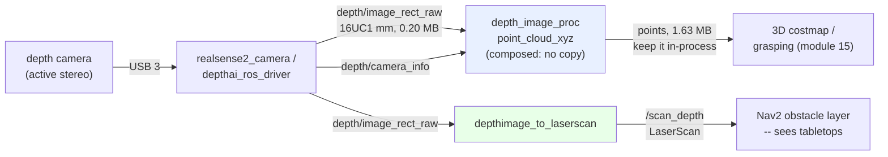

# 07.09 — Depth cameras and point clouds: stereo, structured light, ToF

<!-- glance:start -->
<!-- generated by tools/build.py from curriculum/syllabus.yaml — edit the syllabus, not this block -->

| | |
|---|---|
| **Track** | Main path |
| **Difficulty** | Intermediate |
| **Time** | 1 h |
| **Hardware** | none |
| **Software** | ros2 |
| **Prerequisites** | [07.08 RGB cameras on the robot — exposure, rolling shutter, ROS image topics](07.08-rgb-cameras.md) |
| **Optional prerequisites** | [FCV.05 Stereo vision and epipolar geometry intuition](../optional-foundations/computer-vision/FCV.05-stereo-epipolar.md) |
| **Skip if** | You know which depth technology fails outdoors, on glass, and at short range. |

<!-- glance:end -->

## What you will learn

- Tell stereo, structured light and time-of-flight apart by their failure modes, and predict which one dies in sunlight, on glass and on matte black.
- Compute stereo depth error from baseline, focal length and range — and see why it grows as range².
- Read a `PointCloud2` byte layout: `fields`, `point_step`, `row_step`, organised vs unordered, and what `is_dense` promises.
- Choose between `16UC1` millimetres and `32FC1` metres, and handle "no data" correctly in both.
- Decide whether karmel needs a depth camera at all, and know exactly what it cannot do without one.

## Why it matters

[07.07](07.07-2d-lidar.md) ended on a limitation: a 2D LiDAR sees **one plane**, 12 cm above the
floor. karmel maps a room beautifully and then drives under a dining table and wedges itself,
because the tabletop does not exist in its world. A depth camera is the sensor that fixes that —
and the sensor that manipulation ([15.04](../15-manipulation/15.04-object-pose-estimation.md)), 3D obstacle avoidance and most
embodied-AI policies (module 18) assume you have.

It is also the most over-bought sensor in hobby robotics. Every lesson in this course runs without
one: `depth-camera` is a **Stage 4 optional** item, and the course's own robot does fine with a
LiDAR, a forward ToF sensor and an RGB camera. This lesson is therefore as much about *whether* to
buy as about how to use. It gives you the physics to predict what each technology will do in your
apartment, the message layout so you can consume one when you meet it (a RealSense on a borrowed
robot, an OAK-D in a tutorial), and an honest account of the failure surfaces — glass, sunlight,
black objects, minimum range — that the marketing does not mention.

<!-- prereqs:start -->
## Prerequisites

You need these first:

- [07.08 RGB cameras on the robot — exposure, rolling shutter, ROS image topics](07.08-rgb-cameras.md)

### Optional prerequisite links

New to any of these? Take the foundation lesson first; skip it if you already know it.

- [FCV.05 Stereo vision and epipolar geometry intuition](../optional-foundations/computer-vision/FCV.05-stereo-epipolar.md)

Check your readiness: `python course.py why 07.09`
<!-- prereqs:end -->

## Concept

Three ways to get a distance for every pixel, and each one fails differently:

| | **Passive stereo** | **Structured light** | **Time of flight (ToF)** |
|---|---|---|---|
| How | Two cameras; match a patch in the left image to the right, the shift (**disparity**) gives depth | Project a known pattern, measure how the scene deforms it | Illuminate the scene, measure the return time or phase, per pixel |
| Needs | **texture** in the scene | its own projector | its own modulated illuminator |
| Blank white wall | **fails** — nothing to match | works, the pattern supplies texture | works |
| Bright sunlight | works best of the three | **fails** — sun swamps the projector | degrades — sun adds photon noise |
| Error grows | as **range²** | as range² | roughly **linear** |
| Glass, mirrors | fails / lies | fails | fails badly (mirrors return a path length) |
| Matte black | fails (no light back) | fails | fails |
| Examples | OAK-D Lite, ZED | original Kinect, Orbbec Astra | Kinect v2/Azure, many phone sensors |

What the industry actually ships is a **hybrid**: "active stereo" — two cameras *plus* an IR dot
projector. The stereo matcher does the work; the projector paints texture onto blank walls so the
matcher has something to match. That is the RealSense D4xx family and the OAK-D Pro. It gets the
stereo behaviour (works outdoors, error grows as range²) and fixes the one thing stereo cannot do
indoors.

The second idea: **depth is not a point cloud, and you should usually publish the depth image.**
A depth image is one 16-bit number per pixel. A point cloud is three floats plus padding per pixel
— **eight times** the bytes — and it contains no information the depth image and the `CameraInfo`
do not already contain. The conversion is one line of numpy
([13.08](../13-computer-vision/13.08-depth-and-3d-vision.md) does it properly). Move the depth
image over the network; build the cloud where you use it.

> [!TIP]
> **Ask your teacher:** "Given my apartment — a glass coffee table, a black sofa, a big south-facing window — predict which of the three depth technologies would fail where, and rank them for my robot."

## Technical explanation

### Level 1 — Stereo depth, and why error grows as range²

Two cameras a baseline $B$ apart, focal length $f$ in pixels. A point at depth $z$ appears shifted
by a disparity $d$ pixels between the images:

$$z = \frac{f B}{d} \qquad\Longrightarrow\qquad
\frac{\partial z}{\partial d} = -\frac{f B}{d^2} = -\frac{z^2}{f B}$$

So a matcher accurate to $\Delta d$ pixels gives a depth error

$$\Delta z = \frac{z^2}{f B}\,\Delta d$$

**Quadratic.** Double the distance and the error quadruples. Put a RealSense D435i's numbers in
($f \approx 425$ px at 848×480, $B = 50$ mm, sub-pixel matching to $\Delta d \approx 0.1$ px):

| range | disparity | depth error | as % of range |
|---|---|---|---|
| 0.3 m | 70.8 px | 0.4 mm | 0.14 % |
| 0.5 m | 42.5 px | 1.2 mm | 0.24 % |
| 1.0 m | 21.2 px | 4.7 mm | 0.47 % |
| 2.0 m | 10.6 px | 18.8 mm | 0.94 % |
| 3.0 m | 7.1 px | **42.4 mm** | 1.41 % |
| 5.0 m | 4.2 px | **117.6 mm** | 2.35 % |
| 8.0 m | 2.7 px | **301.2 mm** | 3.76 % |

Read the bottom rows. At 5 m a stereo camera is worse than a ₪300 2D LiDAR by an order of
magnitude, and at 8 m it is guessing. **Depth cameras are close-range sensors.** Inside 1.5 m they
are superb — millimetres, which is what a robot arm needs. Across a room they are not a
replacement for a LiDAR, and anybody who tells you otherwise has not done this arithmetic.

The same formula tells you what to change if you need more range: **baseline**. Doubling $B$ halves
the error at every distance. That is why an OAK-D Lite (75 mm baseline) beats a D435i at range and
loses at short range, and why the **minimum** range exists at all — the disparity must fit inside
the image, so
$$z_{\min} = \frac{fB}{d_{\max}}$$
and a bigger baseline pushes the minimum range *out*. There is no free lunch: 0.28 m minimum on a
D435i, roughly 0.2 m on a D405 (tiny baseline, for wrist cameras), and you cannot have both a
10 cm minimum and 5 m accuracy in one device.

### Level 2 — The four failure surfaces

These are not edge cases. They are in every apartment.

**Glass and mirrors.** A window returns nothing to a stereo matcher (no texture on the glass, and
what it sees through it is at a different depth) and *lies* to a ToF sensor (the light travels to
the reflected scene and back, so a mirror reads as a room that continues). A glass coffee table is
invisible to all three. No amount of tuning fixes this; it is optics. The mitigation is a different
physics: ultrasonic ([07.03](07.03-ultrasonic-sensors.md)) sees glass perfectly, because sound does
not care about optical transparency.

**Sunlight.** A structured-light projector puts a few watts of IR on a scene; the sun puts about
1 kW/m². Outdoors, or near a big south-facing window, structured light simply stops working —
which is why the original Kinect is an indoor toy and why RealSense went to active *stereo* (the
passive stereo still works when the projector is swamped). Rule of thumb: structured light is
indoors-only; active stereo degrades gracefully; ToF sits in between and its illuminator burns
power to compete.

**Matte black objects.** A black sofa absorbs the IR. Not "returns a noisy value" — returns
nothing, so those pixels are invalid. Your robot will see a hole where the sofa is, and a naive
consumer that treats invalid as "far away" will plan straight through it.

**Minimum range.** Everything inside $z_{\min}$ (0.2–0.5 m depending on the device) is invalid.
This is exactly the zone where a robot needs to know most — the last half metre before a collision,
or the grasp approach. This is why manipulation rigs use a *short-range* variant (a D405) on the
wrist and a normal one on the base.

There is a fifth, subtler one: **depth and colour are different cameras.** They have different
intrinsics, a physical offset and, usually, different resolutions and frame rates. "Aligned depth"
topics exist because someone has to warp one into the other's frame, and that alignment can be off
— which shows up as colour bleeding onto the wrong object at depth discontinuities.

### Level 3 — sensor_msgs/PointCloud2, byte by byte

`PointCloud2` is a typed binary blob with a self-describing header. Unlike every other message in
this module, you cannot just read the fields — you have to *parse* it.

```text
std_msgs/Header header
uint32 height            rows; 1 for an unordered cloud
uint32 width             points per row
PointField[] fields      name, offset, datatype, count -- the schema of one point
bool is_bigendian
uint32 point_step        bytes per point
uint32 row_step          bytes per row (= point_step * width)
uint8[] data             row_step * height bytes
bool is_dense            true means "no invalid points" -- a PROMISE, often broken
```

What a real organised XYZ cloud looks like (measured from `fake_depth.py`, which lays it out the
way every real driver does):

```text
height 240   width 424        <- ORGANISED: the cloud still has image structure
fields  x (offset 0, FLOAT32), y (offset 4), z (offset 8)
point_step 16                 <- 12 bytes of xyz + 4 bytes of PADDING for SIMD alignment
row_step   6784               <- 16 * 424
data       1,628,160 bytes    <- 101,760 points
is_dense   False              <- honest: 7,080 of them are NaN
```

Four things to know:

1. **`point_step` is not `3 × 4`.** Drivers pad to 16 or 32 bytes so SSE/AVX can load a point in
   one instruction. Always compute offsets from `fields`, never assume.
2. **Organised vs unordered.** `height > 1` means the cloud is still an image: point $(u, v)$ is at
   `v * row_step + u * point_step`, and you can run 2D algorithms (neighbour lookups, normals,
   segmentation) cheaply. `height == 1` means someone flattened it and threw that away. Keep clouds
   organised if you can.
3. **`is_dense` is a promise, not a description.** `true` means "there are no NaN or Inf points, do
   not bother checking". A driver that sets `is_dense = true` while emitting NaNs will crash PCL
   algorithms that trusted it. `fake_depth.py --fault dense-lie` reproduces this exactly.
4. **Invalid points are `NaN`, not `(0, 0, 0)`.** A cloud that maps invalid pixels to the origin
   puts a dense wall of phantom obstacles at the camera — the point-cloud version of 07.07's
   `0.0` range bug, with the same consequence in a 3D costmap.

Use `sensor_msgs_py.point_cloud2` (`read_points`, `create_cloud_xyz32`) rather than writing the
struct unpacking yourself; it is in the course image and it handles the padding and endianness.

**The bandwidth argument, with numbers:**

| Stream | Per message | At 30 Hz |
|---|---|---|
| 424×240 depth `16UC1` | 0.20 MB | **49 Mbit/s** |
| 424×240 XYZ cloud | 1.63 MB | **391 Mbit/s** |
| 640×480 depth `16UC1` | 0.61 MB | 147 Mbit/s |
| 640×480 XYZ cloud | 4.92 MB | **1,180 Mbit/s** |
| 1280×720 XYZ+RGB cloud | 29.5 MB | 7,078 Mbit/s |

An 8× penalty for information you already had. And it is not theoretical — here is the same
synthetic camera publishing both, audited in the same run:

```text
/depth/image_raw   [  ok  ] rate  14.22 Hz (expected 15.0)     0.20 MB per message
/depth/points      [ FAIL ] rate   4.90 Hz (expected 15.0)     1.63 MB per message, ~35 missing
```

The depth image arrives; the cloud built from exactly the same data is dropped two times out of
three, because a 1.63 MB message over the BEST_EFFORT sensor-data QoS does not survive. `ros2 topic
echo` on it prints `A message was lost!!!` over and over. **Publish the depth image; build the
cloud where you consume it**, or use `point_cloud_transport` to compress it.

### Level 4 — Depth encodings, and the two ways to say "no data"

| Encoding | Unit | "No data" | Max range | Used by |
|---|---|---|---|---|
| `16UC1` | **millimetres** | `0` | 65.535 m | RealSense, OAK-D, most drivers |
| `32FC1` | **metres** | `NaN` | float | simulation, `depth_image_proc` output |

Both appear in the wild and mixing them up is a factor-of-1000 bug that looks like "the robot
thinks the wall is 3 mm away". The tells: check `encoding`, and sanity-check a pixel — a room-scale
scene in `16UC1` has values in the thousands; in `32FC1` it has values in single digits.

The `0` versus `NaN` distinction matters more than it looks. In `16UC1`, **0 is the reserved
invalid value** — there is no other option, because the type is unsigned and 0 mm is physically
impossible. So when you convert `16UC1` to metres you must map 0 to NaN *before* doing arithmetic,
or every invalid pixel becomes a point at the camera's optical centre. That single line is the most
common depth bug in ROS:

```python
z = depth_mm.astype(np.float32) / 1000.0
z[depth_mm == 0] = np.nan          # do not skip this line
```

Two nodes in `image_pipeline` do the work for you and are worth knowing before you write your own:

- **`depth_image_proc`** — `point_cloud_xyz`, `point_cloud_xyzrgb`, `register` (align depth to
  colour), `convert_metric` (`16UC1` → `32FC1`). Composable, so you can run them in the same
  process as the driver and avoid serialising the cloud at all.
- **`depthimage_to_laserscan`** — collapses a horizontal band of the depth image into a
  `sensor_msgs/LaserScan`. This is the cheap trick that lets **Nav2 treat a depth camera as a
  LiDAR**, and it is how a robot with no LiDAR navigates. It is also how you add a "tabletop layer"
  to a robot that has one.

### Level 5 — What to buy, and whether to buy at all

> [!IMPORTANT]
> **Version-sensitive** (checked 2026-09-16; `references/research/software-versions-2026-09.md`,
> [hardware/stage-4-compute-and-depth.md](../hardware/stage-4-compute-and-depth.md)). Depth-camera
> vendors and their ROS 2 drivers change fast, and RealSense spun out of Intel in July 2025, so old
> links redirect. Verify before buying: https://index.ros.org/p/realsense2_camera/ ·
> https://github.com/luxonis/depthai-ros · https://github.com/orbbec/OrbbecSDK_ROS2 ·
> AI teacher: check current prices, stock and driver status before recommending a purchase.

| | **RealSense D435i** | **Luxonis OAK-D Lite** | **Orbbec Gemini 2** |
|---|---|---|---|
| Technology | active stereo (IR projector) + RGB + **IMU** | stereo + on-camera neural accelerator (4 TOPS) | stereo |
| ROS 2 Jazzy driver | `realsense2_camera` **4.58.4, apt binary, amd64 + arm64** — the most mature | `depthai-ros-driver` 2.12.2 (v2 API) on apt; a separate v3 driver repo exists | `OrbbecSDK_ROS2`, **not in rosdistro** — source build |
| Min range | ≈ 0.28 m | ≈ 0.2 m | ≈ 0.25 m |
| Price ≈ 2026-09 | $334 (≈ ₪1,195 with VAT, import) | $269 (≈ ₪965) | $234 |
| On a Pi 5 | works, but depth processing is heavy on the CPU | **runs the depth and the neural net on the camera** — the Pi just receives | works, CPU-heavy |
| Needs | **USB 3** (a cheap or long cable silently drops to USB 2 and halves your streams) | USB 3 | USB 3 |

The course's position, unchanged from [HARDWARE.md](../HARDWARE.md): **do not buy one yet.** No
lesson requires it. If you do buy, the decision is simple — staying on a Pi 5, take the OAK-D Lite
because the camera does the work; moving to a Jetson, take the D435i because
`realsense2_camera` is the most mature driver in this space and the D435i's built-in IMU saves you
a part.

What karmel genuinely cannot do without one:

- See a tabletop, a shelf, a doorstep or anything off the 12 cm scan plane.
- Grasp anything ([15.04](../15-manipulation/15.04-object-pose-estimation.md) needs object pose in 3D).
- Build a 3D occupancy map (voxel/OctoMap layers in Nav2).

What it can do anyway, and this covers more than people expect: 2D SLAM and navigation (LiDAR),
obstacle stopping in the near field (the forward ToF sensor from
[07.04](07.04-tof-sensors.md)), object *detection* and bearing (RGB camera, module 13), object
*position on the map* by intersecting a detection's bearing with the floor plane
([13.16](../13-computer-vision/13.16-detection-to-map-position.md)) — a genuinely useful
monocular trick — and fiducial-based 6-DoF pose from a single camera
([13.07](../13-computer-vision/13.07-fiducial-markers.md)), which is how you get a precise pose for
a docking station or a known object without any depth sensor at all.

## Diagram

```text
Why stereo error grows as range^2        z = f*B/d  ->  dz = z^2/(f*B) * dd

  disparity d (px)                      D435i-class: f=425 px, B=50 mm, dd=0.1 px
  70 |*                                   0.3 m -> 0.4 mm
     | *                                  1.0 m -> 4.7 mm
  40 |   *                                2.0 m -> 18.8 mm
     |      *                             3.0 m -> 42.4 mm
  20 |          * *                       5.0 m -> 117.6 mm
     |                * * * *             8.0 m -> 301.2 mm
   0 +-------------------------- z
     0   1   2   3   4   5   6   7  8 m   Small disparities = big depth jumps per pixel.

PointCloud2 memory layout, organised 424 x 240, XYZ float32

  data[ v*row_step + u*point_step ]        point_step = 16, row_step = 6784
        |            |
        |            +-- 0: x (f32)  4: y (f32)  8: z (f32)  12: PADDING
        +-- v = image row                            ^
                                                     |
   height = 240 (>1)  => organised: you still have image neighbours
   height = 1         => unordered: neighbour information thrown away
   invalid point      => NaN in x,y,z   (NOT (0,0,0) -- that is an obstacle at the lens)
```



## Code

All in [`07-sensors/code/ros2/`](code/ros2/README.md).

**[`fake_depth.py`](code/ros2/fake_depth.py)** — a synthetic depth camera publishing a depth
`Image` (`16UC1` millimetres or `32FC1` metres, your choice), a matching `CameraInfo`, and an
**organised** `PointCloud2` laid out exactly as a real driver lays it out (16-byte
`point_step` with padding). The scene is a wall with a box, plus a "glass panel" region and a
"matte black object" region that return nothing, and the noise grows as range² the way stereo does.
Four injectable faults:

| `--fault` | What it does |
|---|---|
| `zero-is-valid` | invalid pixels become real points at the origin — a wall of phantoms at the lens |
| `metres-in-16u` | `16UC1` filled with metres, so a 3 m wall reads as 3 mm |
| `dense-lie` | `is_dense = true` while the data contains NaNs |
| `body-frame` | `frame_id = camera_link` instead of the optical frame |

**[`sensor_check.py`](code/ros2/sensor_check.py)** — for a `PointCloud2` it verifies `fields`,
`row_step == point_step × width`, `len(data) == row_step × height`, whether `is_dense` is honest,
and prints the z range and whether the cloud is organised.

```bash
# course Docker image, terminal 1
source /opt/ros/jazzy/setup.bash
cd 07-sensors/code/ros2 && python3 fake_depth.py

# terminal 2
python3 sensor_check.py /depth/image_raw --expect-hz 15 --seconds 4
python3 sensor_check.py /depth/points   --expect-hz 15 --seconds 4
ros2 topic echo --once /depth/points --field point_step
ros2 topic echo --once /depth/points --field fields
```

For the maths of turning a depth image into points, and for stereo matching itself, go to
[13.08](../13-computer-vision/13.08-depth-and-3d-vision.md) — it does the vectorised conversion,
RANSAC plane fitting and object segmentation, and this lesson deliberately does not repeat it.

## Exercise

### Exercise 07.09-E1 — Stereo depth budget `[numerical]`

Hardware: none. A stereo camera has $f = 425$ px, $B = 50$ mm and matches disparity to 0.1 px.
(a) What is the depth error at 0.5, 1, 2, 3 and 5 m? (b) You want ≤ 1 cm of error — out to what
range? (c) You double the baseline to 100 mm. Recompute (b), and say what you gave up. (d) The
matcher can only search 96 px of disparity: what is the minimum range? (e) Your robot needs to see
a wall 6 m away to within 5 cm. Is a depth camera the right sensor? Justify with a number and name
the sensor you would use instead.

### Exercise 07.09-E2 — Predict the point cloud `[predict]`

Hardware: none. `fake_depth.py` publishes an organised 424×240 XYZ cloud. Before running it,
predict: (a) `height` and `width`; (b) `point_step` — and why it is not 12; (c) `row_step`;
(d) `len(data)`; (e) `is_dense`, and why; (f) what a pixel that saw the "glass panel" contains.
Then run `sensor_check.py /depth/points` and check every one.

### Exercise 07.09-E3 — Encodings and the missing line `[coding]`

Hardware: none. (a) Write the four lines that convert a `16UC1` depth image to metres as float,
handling "no data" correctly. (b) Delete the invalid-handling line and describe, precisely, what
the resulting point cloud looks like in RViz and what a 3D costmap does with it. (c) The same
image arrives as `32FC1` — what changes in your code, and what is the "no data" value? (d) A
colleague's node reads a `16UC1` image as metres. The wall is 3 m away — what depth does their code
compute, and what is the first symptom they will report?

### Exercise 07.09-E4 — Bandwidth: image or cloud `[numerical]`

Hardware: none. (a) Compute the per-message size and the 30 Hz bit rate for a 640×480 depth image
in `16UC1` and for the XYZ cloud built from it. (b) What is the ratio, and where does it come from?
(c) Your Pi 5 talks to a laptop over 80 Mbit/s of Wi-Fi — which of the two can you send, at what
rate? (d) Explain why sending the depth image loses no information, and name the two extra things
the receiver needs. (e) Run `fake_depth.py` and audit both topics: does the measurement match your
prediction, and if the rate is lower than expected, why?

### Exercise 07.09-E5 — Find the injected fault `[debugging]`

Hardware: none. Your AI teacher starts `fake_depth.py` with one `--fault`. Identify it with
`sensor_check.py`, `ros2 topic echo --field ...` and `ros2 topic hz`. Do all four, and for each
write the downstream symptom — what a 3D costmap, a PCL plane fitter or a grasp planner would
actually do.

### Exercise 07.09-E6 — Design without one `[design]`

Hardware: none. karmel has a 2D LiDAR at 12 cm, a forward ToF sensor at 5 cm, a 640×480 RGB camera
at 10 cm, and **no depth camera**. For each of these tasks, say whether it is possible, and with
what: (a) do not drive under the dining table; (b) stop before hitting a cardboard box on the
floor; (c) find the red mug on the table and report its position on the map; (d) grasp the mug;
(e) navigate a corridor with a glass door at the end. For every "possible", name the sensor and the
technique and estimate the accuracy. For every "not possible", say what the cheapest fix is — and
whether a depth camera is actually the cheapest.

### Exercise 07.09-E7 — Meet a real depth camera `[hardware]`

Hardware: `depth-camera` (optional, Stage 4) — **skip this if you do not own one**; E1–E6 cover
the lesson without it.

> [!CAUTION]
> **Safety:** the IR projector on an active-stereo camera is an IR LED or laser; treat it like the
> LiDAR — do not disassemble, do not stare into the emitter with an IR-sensitive viewer at close
> range. USB 3 devices draw significant current: on a Pi 5 fed from karmel's regulator, set
> `usb_max_current_enable=1` or the camera will disconnect mid-stream ([SAFETY.md](../SAFETY.md)).

1. Bring the driver up and list its topics. Record the depth encoding, resolution and frame rate.
2. `sensor_check.py` the depth image and the point cloud. Compare rates and message sizes.
3. **Accuracy vs range.** Face a flat wall at a measured 0.5, 1, 2 and 3 m; take the median depth of
   a central 20×20 patch each time. Tabulate bias and σ, and plot σ against range — does it grow as
   range²?
4. **Failure survey.** Point it at: a window, a mirror, a matte black object, a white blank wall
   (with the IR projector on and off if your device lets you), a shiny metal surface, and something
   15 cm away. Report the valid-pixel fraction for each.
5. **Turn it into a LiDAR.** Run `depthimage_to_laserscan` and view the result next to `/scan` in
   RViz. What does it add that the 2D LiDAR misses, and what does it lose?

## Expected result

**07.09-E1:** (a) with $\Delta z = z^2 \Delta d/(fB)$ and $fB = 21.25$ px·m: **1.2 mm, 4.7 mm,
18.8 mm, 42.4 mm, 117.6 mm**. (b) $z = \sqrt{0.01 \times 21.25/0.1} =$ **1.46 m**. (c) With
$B = 100$ mm, $fB = 42.5$, so $z = \sqrt{0.01 \times 42.5/0.1} =$ **2.06 m** — 41 % more range for
the same error. What you gave up: the **minimum range doubles**, because $z_{\min} = fB/d_{\max}$;
and the camera gets physically wider. (d) $z_{\min} = 425 \times 0.05/96 =$ **0.22 m**. (e) No:
at 6 m the error is $36 \times 0.1/21.25 =$ **169 mm**, more than three times the 5 cm budget. Use
the 2D LiDAR — a dToF unit's error is roughly constant with range, a few centimetres at 6 m, and it
costs a third as much.

**07.09-E2:** (a) `height = 240`, `width = 424` — **organised**, because it came from an image and
the driver kept the structure. (b) `point_step = 16`, not 12: drivers pad each point to a 16-byte
boundary so SIMD instructions can load one in a single operation. (c) `row_step = 16 × 424 =`
**6784**. (d) `6784 × 240 =` **1,628,160 bytes**. (e) `is_dense = False`, because the glass panel,
the black object and everything inside the minimum range are NaN — a measured run reported
**7,080 NaN points**. (f) `NaN` in x, y and z. Measured:

```text
[  ok  ] fields            ['x', 'y', 'z'], point_step 16
[  ok  ] row_step          6784 vs point_step*width = 6784
[  ok  ] data length       1628160 bytes for 101760 points (organised)
[  ok  ] is_dense honest   is_dense=False, 7080 NaN points
[  ok  ] z range           z from 1.190 to 3.077 m
```

**07.09-E3:** (a)

```python
z = depth_mm.astype(np.float32) / 1000.0
z[depth_mm == 0] = np.nan
x = (u - cx) * z / fx
y = (v - cy) * z / fy
```

(b) Without the NaN line, every invalid pixel becomes the point (0, 0, 0): RViz shows a dense blob
of points exactly at the camera origin, and a 3D costmap marks the cells containing the camera as
occupied — so the robot believes it is inside an obstacle and Nav2 refuses to plan. Measured with
`--fault zero-is-valid`: `is_dense=True, 0 NaN points, z from 0.000 to 3.073 m` — note that the
cloud now looks *healthier* by every structural check, which is what makes this bug nasty.
(c) For `32FC1` you divide by nothing (it is already metres) and the invalid value is already
`NaN`, so the mask line disappears — but you must still not assume: check `encoding` at runtime.
(d) They compute **3000 m** (3000 mm read as metres). First symptom: "my point cloud is empty" or
"everything is clipped" — RViz's default range and any costmap's `max_obstacle_height` throw all of
it away, so they see nothing rather than something obviously wrong.

**07.09-E4:** (a) depth `16UC1`: $640\times480\times2 =$ **0.61 MB**, ×8×30 = **147 Mbit/s**.
Cloud: $640\times480\times16 =$ **4.92 MB**, **1,180 Mbit/s**. (b) Ratio **8×**, from 16 bytes per
point instead of 2. (c) Neither fits 80 Mbit/s at 30 Hz. The depth image fits at about 16 Hz, or at
30 Hz if you drop to 424×240 (49 Mbit/s); the cloud never fits and you should not try. (d) The
cloud is a pure function of the depth image and the `CameraInfo` — the receiver needs the
**`CameraInfo`** (for $f_x, f_y, c_x, c_y$) and the **encoding**, and can then reconstruct every
point exactly. (e) The measured run:

```text
/depth/image_raw   [  ok  ] rate 14.22 Hz (expected 15.0)   0.20 MB, 23.1 Mbit/s
/depth/points      [ FAIL ] rate  4.90 Hz (expected 15.0)   1.63 MB, ~35 missing
```

Same node, same tick, same data: the image arrives and the cloud does not. With the sensor-data
(BEST_EFFORT) QoS, a 1.63 MB message is fragmented into many UDP datagrams and losing any one
drops the whole message; `ros2 topic echo` on it prints `A message was lost!!!` repeatedly. The fix
is not a bigger queue — it is not sending the cloud across a process boundary at all.

**07.09-E5:**

```text
zero-is-valid   [  ok  ] is_dense honest  is_dense=True, 0 NaN points   <- looks BETTER
                [  ok  ] z range          z from 0.000 to 3.073 m       <- the tell: z = 0
metres-in-16u   z range collapses to millimetres: max z ~0.003 m
dense-lie       [ FAIL ] is_dense honest  is_dense=True, 7080 NaN points
body-frame      [ FAIL ] frame_id (if you pass --frame camera_depth_optical_frame)
```

Downstream: `zero-is-valid` → a 3D costmap fills the cells at the camera with lethal obstacles and
the robot is "trapped"; `metres-in-16u` → everything is inside the minimum range, so consumers
discard the whole cloud and report "no data"; `dense-lie` → PCL algorithms that skip the NaN check
because `is_dense` promised none produce NaN centroids, NaN plane normals, and either garbage or a
crash; `body-frame` → the cloud is rotated by the 90°+90° body-to-optical difference, so the wall
in front of the robot appears below and to one side.

**07.09-E6:** (a) **Possible but not with the LiDAR**: the tabletop is above the 12 cm plane. The
cheapest real fix is a second, *tilted* 2D sensor or the ToF sensor aimed slightly up — or, in
software, a map annotation ("keep-out zone") drawn by hand, which is what many production robots
actually do. (b) **Yes**: a cardboard box on the floor is in the LiDAR's plane if it is taller than
12 cm, and the ToF sensor covers it below that. Accuracy a few centimetres. (c) **Yes**, without
depth: detect the mug in the image (module 13), take the bearing from the pixel and the
`CameraInfo`, and intersect that ray with the known table-top plane or the floor plane
([13.16](../13-computer-vision/13.16-detection-to-map-position.md)). Accuracy is decent in bearing
(a fraction of a degree) and poor in range — maybe ±10–20 cm at 2 m, dominated by how well you know
the plane. (d) **No.** Grasping needs the object's 6-DoF pose to roughly a centimetre; the
monocular trick does not give that. Cheapest fixes, in order: put an **AprilTag** on the object or
the tray ([13.07](../13-computer-vision/13.07-fiducial-markers.md)) — near-free and accurate; or
buy a short-range depth camera. (e) **Partly**: the LiDAR will not see the glass and will map the
corridor as continuing. The cheapest fix is an **ultrasonic** sensor (₪20), not a depth camera —
sound reflects off glass perfectly. This is the exercise's point: three of five gaps are cheaper to
close with something other than a depth camera.

**07.09-E7:** Expect a depth stream at 424×240 or 640×480, `16UC1`, 15–30 fps, and a point cloud
that is 8× larger and drops frames over the network. Wall accuracy: bias within a couple of
centimetres after warm-up, σ following range² — roughly 2–5 mm at 0.5 m and 3–6 cm at 3 m for a
D435i-class device; if σ is flat with range, you have a ToF camera, not stereo. Valid-pixel
fractions in the failure survey typically run: textured wall ≈ 99 % > blank white wall with
projector on ≈ 95 % (and 20–60 % with it off, which is the single most convincing demonstration of
what the projector is for) > shiny metal ≈ 50 % > matte black ≈ 10–30 % > window ≈ 5–20 %,
mirror produces *confident wrong* depths rather than invalid ones, and anything at 15 cm is
entirely invalid because it is inside the minimum range.
`depthimage_to_laserscan` adds exactly the thing the 2D LiDAR lacks — obstacles at the camera's
height band, so tabletops and shelves appear — and loses the 360° field of view, the 12 m range and
most of the accuracy past 3 m. Most real robots run **both**.

## Troubleshooting

### Symptom: the point cloud is a dense blob at the camera origin

1. `sensor_check.py /depth/points` and read the **z range** line. A minimum of exactly `0.000` is
   the giveaway.
2. The cause is almost always the missing invalid-pixel mask: `16UC1` uses **0** for "no data", and
   0 mm converts to the point (0, 0, 0). Add `z[depth_mm == 0] = np.nan`.
3. If you are not doing the conversion yourself, it is the driver or the `depth_image_proc` node;
   check whether the driver publishes `16UC1` while the consumer assumes `32FC1`.

### Symptom: large holes in the depth image

Physics first. Look at *what* is missing, not at the code:

1. **Windows, mirrors, glossy surfaces** → optical, unfixable with this sensor. Different physics
   needed (ultrasonic).
2. **Dark objects** → no IR comes back. Raise the projector power if your device allows, add light,
   or accept it.
3. **A blank white wall with holes** → your device is passive stereo and has no texture to match.
   Turn the IR projector on; if it does not have one, this is what you bought.
4. **Everything inside ~30 cm** → minimum range. Not a fault.
5. **Only outdoors or near a window** → structured light being swamped by the sun.

### Symptom: depth and colour do not line up

1. Are you using the **aligned** depth topic (`aligned_depth_to_color/image_raw` on a RealSense)
   or the raw one? They are different frames.
2. Check the `frame_id` on each and the transform between them:
   `ros2 run tf2_ros tf2_echo camera_depth_optical_frame camera_color_optical_frame`.
3. Different resolutions? The alignment node handles that; doing it yourself with the wrong
   `CameraInfo` does not.
4. Colour bleeding only at object edges is normal — it is the occlusion boundary, where a pixel
   visible to one camera is hidden from the other.

### Symptom: the cloud topic is at a fraction of the driver's frame rate

1. Compare the depth *image* rate with the *cloud* rate. If the image is fine, the cloud is being
   dropped in transport, not produced slowly.
2. Message size: `ros2 topic bw`. Anything over about a megabyte on the BEST_EFFORT sensor QoS will
   drop under load.
3. The fix is architectural: **compose** the driver and `depth_image_proc` into one process so the
   cloud never crosses a process boundary, or move the cloud only when a human needs to look at it.
   `point_cloud_transport` is the third option.

### Symptom: PCL or a plane-fitting node crashes or returns NaN

`is_dense`. If it says `true`, PCL skips the NaN check for speed. A driver that sets it true while
emitting NaNs produces NaN centroids and normals, or a segfault deep in a library that is not
yours. Check with `sensor_check.py`'s "is_dense honest" line; if the driver lies, filter the cloud
yourself (`pcl::removeNaNFromPointCloud`) and set the flag correctly on the output.

## Common mistakes

- **Expecting a depth camera to replace a LiDAR.** At 5 m a stereo camera's error is over 10 cm and
  its field of view is 60–90°, not 360°.
- **Forgetting that `16UC1` is millimetres.** Off by 1000; the symptom is an empty cloud.
- **Not mapping 0 (or NaN) to invalid** before converting. Phantom obstacles at the lens.
- **Publishing point clouds across the network** when the depth image carries the same information
  at an eighth of the size.
- **Assuming `point_step == 12`.** It is 16 or 32; read `fields`.
- **Flattening an organised cloud** (`height = 1`) and then wanting image neighbours back.
- **Trusting `is_dense`.** It is a promise the driver makes, not a fact the data guarantees.
- **Labelling depth data `camera_link`** instead of the optical frame.
- **Buying a depth camera to solve a glass-door problem.** It will not; a ₪20 ultrasonic will.
- **Using a cheap or long USB cable.** It negotiates down to USB 2 and halves your streams without
  saying so.

## Knowledge check

1. A stereo camera has $f = 425$ px and $B = 50$ mm, matching to 0.1 px. What is its depth error at
   1 m and at 4 m, and what does the ratio tell you?
   <details><summary>Answer</summary>

   $\Delta z = z^2 \Delta d/(fB)$ with $fB = 21.25$: **4.7 mm** at 1 m and **75.3 mm** at 4 m. The
   ratio is 16, i.e. $4^2$ — the error is quadratic in range. That single fact decides where a
   depth camera belongs: close-range work (manipulation, near-field obstacles), not room-scale
   mapping.
   </details>

2. Your robot must not hit a glass door. Which depth technology should you buy?
   <details><summary>Answer</summary>

   **None of them.** Stereo has no texture to match on glass, structured light's pattern goes
   through it, and ToF measures the path to whatever is behind or reflects off at a grazing angle.
   Buy a ₪20 ultrasonic sensor ([07.03](07.03-ultrasonic-sensors.md)): sound reflects off glass
   like any hard surface. Choosing a sensor whose *physics* does not share the failure is the
   general lesson.
   </details>

3. A `PointCloud2` has `height = 240`, `width = 424`, `point_step = 16`. How many bytes is `data`,
   and what does `height > 1` buy you?
   <details><summary>Answer</summary>

   `row_step = 16 × 424 = 6784`, so `data` is `6784 × 240 = 1,628,160` bytes for 101,760 points.
   `height > 1` means the cloud is **organised** — it still has the image's 2D structure, so point
   $(u,v)$ is at a known offset and you get neighbour relationships for free. That makes normals,
   region growing and fast segmentation cheap; flattening the cloud throws it away permanently.
   </details>

4. Predict: a node converts `16UC1` depth to metres but forgets to mask zeros. What do you see in
   RViz, and what does Nav2 do?
   <details><summary>Answer</summary>

   A dense blob of points at exactly the camera's optical centre — one point for every invalid
   pixel, which in a scene with glass, black objects and near-field gaps can be thousands. A 3D
   costmap marks the cells containing the camera as occupied, so the robot concludes it is inside
   an obstacle and Nav2 refuses to plan or immediately starts recovery behaviours. The tell is a
   z-range minimum of exactly 0.000.
   </details>

5. Why does the course say "publish the depth image, not the point cloud", and what does the
   receiver need to reconstruct the cloud?
   <details><summary>Answer</summary>

   A 640×480 `16UC1` depth image is 0.61 MB; the XYZ cloud from the same data is 4.92 MB — **8×**
   the bytes for zero extra information. The receiver needs the **`CameraInfo`** (for $f_x, f_y,
   c_x, c_y$) and the **encoding**, then reconstructs every point exactly with
   $x = (u-c_x)z/f_x$. Measured on the course's synthetic camera, the depth image arrived at
   14.2 Hz while the cloud built from it arrived at 4.9 Hz — the cloud was being dropped in
   transport.
   </details>

6. `is_dense = true` but the cloud contains NaNs. What breaks, and how would you have noticed?
   <details><summary>Answer</summary>

   `is_dense = true` is a promise to consumers that they can skip the validity check, so PCL
   algorithms take a fast path: a plane fit returns a NaN normal, a centroid returns NaN, a KD-tree
   build can segfault. You notice it with a check that counts NaNs and compares against the flag —
   `sensor_check.py`'s "is_dense honest" line does exactly that — because nothing in the message is
   structurally malformed.
   </details>

7. A blank white wall shows up as a hole in your depth image indoors, and fine outdoors. Which
   technology, and what is happening?
   <details><summary>Answer</summary>

   **Passive stereo with an IR projector that is off or failed.** Stereo matching needs texture; a
   blank wall has none, so indoors there is nothing to match and the pixels are invalid. Outdoors,
   sunlight and ambient shadows give the wall enough micro-texture to match. Turn the projector on
   (`emitter_enabled` on a RealSense) and the hole fills in — that is the most convincing
   one-command demonstration of what active stereo buys you.
   </details>

8. karmel has no depth camera. Can it report the position of a red mug on a table, on the map?
   <details><summary>Answer</summary>

   Yes, approximately, with one camera and no depth. Detect the mug in the image, convert the pixel
   to a bearing with the `CameraInfo`, and intersect that ray with a plane you already know — the
   floor, or the table top if you know its height
   ([13.16](../13-computer-vision/13.16-detection-to-map-position.md)). The bearing is accurate to a
   fraction of a degree; the range is only as good as your knowledge of the plane, so expect
   ±10–20 cm at 2 m. Enough to navigate to the mug, not enough to grasp it — grasping is where you
   either add a fiducial or buy the camera.
   </details>

## Practical challenge

**A depth decision memo for your robot.** Write the document you would need to justify — or refuse
— a depth-camera purchase, backed by numbers you computed yourself.

It must contain: a depth-error table for two candidate devices at 0.3, 1, 2, 3 and 5 m, computed
from their published baseline and focal length, with the formula shown; the minimum range each one
implies from its disparity search range; a survey of *your own* apartment listing at least six
surfaces and predicting, per technology, which will fail on each; a bandwidth table for depth image
versus point cloud at the resolution you would actually use, with a statement of where each would
be produced and consumed; the current ROS 2 Jazzy driver status for each candidate with the date
you checked it and the URL; and a table of five concrete tasks you want karmel to do, marked
possible / not possible with the sensors it has, with the cheapest fix for each gap — where "buy a
depth camera" competes on price against an ultrasonic sensor, an AprilTag, and a tilted second
LiDAR.

Acceptance criteria:

- Every number is derived, with the formula and inputs shown — no quoted marketing figures without
  a cross-check.
- A clear, one-line recommendation at the top: buy X now / buy X when I reach module 15 / do not
  buy, with the single deciding number.
- If you own a depth camera, add the E7 measurements and compare them with your predicted table;
  explain every discrepancy larger than 2×.
- The `sensor_check.py` output for both a depth image and a cloud (real or `fake_depth.py`),
  included verbatim.
- Safety: USB current on the Pi 5, IR emitter handling, and the standing rules in
  [SAFETY.md](../SAFETY.md).

## You can skip this if…

You can answer knowledge-check questions 1, 2 and 5 correctly without looking, you know which depth
technology fails outdoors, on glass and at short range, and you can read a `PointCloud2` header and
say whether it is organised and whether `is_dense` is honest. Then:

`python course.py skip 07.09 --reason "I know the depth technologies, their failure surfaces and the PointCloud2 layout"`

## Go deeper

- `sensor_msgs/PointCloud2` and `PointField` definitions: https://github.com/ros2/common_interfaces/blob/jazzy/sensor_msgs/msg/PointCloud2.msg — the authoritative description of the byte layout, organised clouds and `is_dense`.
- `depth_image_proc`: https://github.com/ros-perception/image_pipeline/tree/rolling/depth_image_proc — the nodes that convert, register and project depth images, and the reference for the `16UC1`/`32FC1` conventions.
- `depthimage_to_laserscan`: https://github.com/ros-perception/depthimage_to_laserscan — how a depth camera becomes a `LaserScan` Nav2 can consume; read this before buying a LiDAR *or* a depth camera.
- Intel RealSense ROS 2 wrapper: https://github.com/IntelRealSense/realsense-ros — topics, the aligned-depth streams, `emitter_enabled`, and the USB 3 requirements.
- Luxonis `depthai-ros`: https://github.com/luxonis/depthai-ros — the OAK family driver; note the v2 and v3 API split before you follow a tutorial.
- Intel, *Tuning depth cameras for best performance* (D400 series white paper): https://dev.intelrealsense.com/docs/tuning-depth-cameras-for-best-performance — the practical guide to baseline, resolution, projector power and the range/accuracy trade, written by the people who built it.
- Szeliski, *Computer Vision: Algorithms and Applications*, 2nd ed., chapter 12 (Depth estimation), free: https://szeliski.org/Book/ — stereo matching, rectification, and the error analysis this lesson summarises in one formula.
- Point Cloud Library tutorials: https://pcl.readthedocs.io/projects/tutorials/en/master/ — filtering, segmentation and registration on clouds, when you get to module 15 (manipulation).

## Progress checkpoint

- [ ] I can name each depth technology's failure surface and predict which fails where in my home.
- [ ] I can compute stereo depth error and minimum range from $f$, $B$ and the disparity limits.
- [ ] I can read a `PointCloud2` header and say whether it is organised, how big it is, and whether `is_dense` is honest.
- [ ] I can convert `16UC1` and `32FC1` depth correctly, including "no data".
- [ ] I can justify, with numbers, whether my robot needs a depth camera at all.

`python course.py complete 07.09` (exercises done) · `python course.py master 07.09` (challenge done) · `python course.py struggle 07.09 "what was hard"`

Next: [07.10 — Sensor data done right in ROS 2: timestamps, frame_ids, covariance, synchronization](07.10-sensor-data-in-ros2.md).
