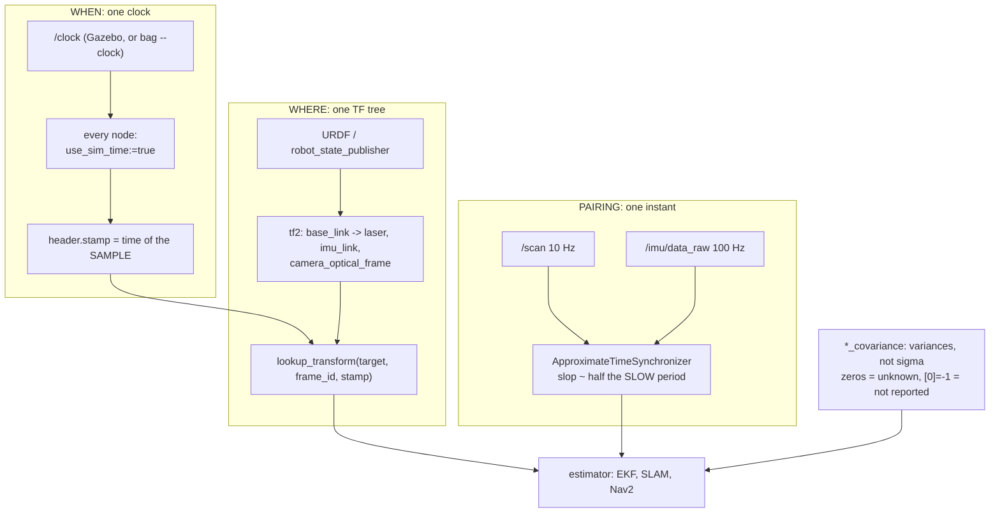

# 07.10 — Sensor data done right in ROS 2: timestamps, frame_ids, covariance, synchronization

<!-- glance:start -->
<!-- generated by tools/build.py from curriculum/syllabus.yaml — edit the syllabus, not this block -->

| | |
|---|---|
| **Track** | Main path |
| **Difficulty** | Intermediate |
| **Time** | 50 min |
| **Hardware** | none |
| **Software** | ros2 |
| **Prerequisites** | [07.06 The IMU in ROS 2 — sensor_msgs/Imu, covariance and orientation filters](07.06-imu-in-ros2.md)<br>[07.07 2D LiDAR — how it works, LaserScan data, and a ROS 2 driver](07.07-2d-lidar.md) |
| **Skip if** | All your sensor messages carry correct stamps, frames and covariance. |

<!-- glance:end -->

## What you will learn

- Put the right time in `header.stamp`, and diagnose the three clocks a ROS system can be running on.
- Configure `use_sim_time` correctly for simulation and for bag playback, and recognise the symptom when one node misses it.
- Pair two sensor streams with `message_filters` ApproximateTime, and choose the `slop` from the topics' rates.
- Pick QoS for sensor data, and diagnose "the topic exists and my callback never fires" in under a minute.
- Record and replay sensor data with rosbag2 so you can debug on the train instead of on the robot.

## Why it matters

You now have four sensor streams — IMU, LiDAR, camera, depth — each one individually correct. This
lesson is about the part that only exists when you have more than one: making them agree about
*when* and *where*.

Every estimator downstream is built on that agreement. An EKF fusing IMU and wheel odometry
([10.07](../10-localization/10.07-fusing-imu-and-odometry.md)) subtracts timestamps to get a `dt`.
tf2 looks up a transform *at the stamp on your message*. slam_toolbox matches a scan against the
pose the robot had *when the scan was taken*. Nav2 throws away observations it considers too old.
Get the stamps wrong and none of these fail loudly — they degrade, and the degradation is
proportional to your robot's speed, which is why "it works when I drive slowly" is such a common
and such a misleading observation.

The other half is delivery. ROS 2's QoS is genuinely good engineering and it has one sharp edge:
a mismatch between publisher and subscriber delivers **nothing**, silently, forever. Everyone
loses an hour to this once. This lesson is so that it is once.

<!-- prereqs:start -->
## Prerequisites

You need these first:

- [07.06 The IMU in ROS 2 — sensor_msgs/Imu, covariance and orientation filters](07.06-imu-in-ros2.md)
- [07.07 2D LiDAR — how it works, LaserScan data, and a ROS 2 driver](07.07-2d-lidar.md)

### Optional prerequisite links

None.

Check your readiness: `python course.py why 07.10`
<!-- prereqs:end -->

## Concept

Four questions, and a system is correct only when all four have the same answer everywhere:

| Question | Where it lives | What goes wrong |
|---|---|---|
| **When** was it measured? | `header.stamp` | stamped at publish, stamped 0, stamped on the wrong clock |
| **Where** was it measured? | `header.frame_id` + TF | body frame instead of optical, two parents, missing frame |
| **How sure** are we? | `*_covariance` | zeros, σ instead of σ², invented numbers |
| **Did it arrive?** | QoS | incompatible policies, big messages dropped |

The mental model that makes all of this click: **a sensor message is an observation of the world at
an instant, in a frame, with an uncertainty.** It is not "the current value of the sensor". Once
you hold that, every rule in this lesson is obvious. The stamp is not metadata; it is the only
thing that lets a consumer ask tf2 where the robot *was*. The frame is not a label; it is what
turns a number into a position. The covariance is not optional; it is what lets two observations be
combined rather than one overwriting the other.

If you have built event-driven systems this is familiar territory: event time versus processing
time, out-of-order delivery, watermarks, at-most-once delivery. ROS 2 has all of it, with physics
attached — the consequence of a late event here is a robot 6 cm further along than it thinks.

> [!TIP]
> **Ask your teacher:** "Run my system and tell me, for every sensor topic, the stamp age, the clock it is on, and whether any two nodes disagree about `use_sim_time`."

## Technical explanation

### Level 1 — Three clocks, and the one that bites

A ROS 2 node can read time from:

1. **The system clock** (`RCL_SYSTEM_TIME`) — wall time, ~1.79e9 seconds since 1970.
2. **The ROS clock** (`RCL_ROS_TIME`) — the system clock *unless* `use_sim_time` is true, in which
   case it is whatever `/clock` says.
3. **The steady clock** (`RCL_STEADY_TIME`) — monotonic, for measuring durations, never for stamps.

`node.get_clock().now()` gives you the ROS clock, which is the right one for stamps. The trap is
that `use_sim_time` is **per node**, and a system where one node missed it is a system with two
clocks — and the error between them is however long the simulation has been running.

Here is what that looks like, measured. karmel's simulation had been up for about 12 seconds; the
audit node was on wall time:

```text
=== imu, consumer WITHOUT use_sim_time ===
[  ok  ] rate         100.00 Hz (expected 100.0), jitter 0.0 ms
[ FAIL ] stamp age    median 1789807762082.8 ms (limit 200 ms)
[  ok  ] stamp is set 12.300 s   <- not a wall clock: simulation time

=== imu, consumer WITH use_sim_time:=true ===
[  ok  ] rate         100.00 Hz (expected 100.0), jitter 0.0 ms
[  ok  ] stamp age    median 1.0 ms, p95 6.0 ms, max 36.0 ms
```

The same messages. A stamp age of 1.79e12 ms — 56 years — because the sensor's stamps start at 0
and the consumer's clock starts at 1970. That absurd number is the **signature** of a
`use_sim_time` mismatch, and you should learn to recognise it instantly: an age in the billions of
milliseconds means two clocks, not a slow sensor.

The rules:

- **In simulation, every node gets `use_sim_time:=true`.** Every one. Including RViz, including
  your little debug script, including the node you started by hand in a fourth terminal.
- **Someone must publish `/clock`.** Gazebo does it through the bridge (karmel's
  `bridge.yaml` has the entry; measured at ~280 Hz in the course image). `ros2 bag play --clock`
  does it for a bag.
- **On the real robot, `use_sim_time` is false everywhere** and all nodes share the Pi's system
  clock. If sensors live on *different machines* (a laptop subscribing to a robot's topics), those
  machines' clocks must be synchronised — chrony or NTP — or every timestamp comparison across the
  boundary is wrong by the clock offset.

### Level 2 — Stamp the sample, not the publish

The rule is one sentence: **`header.stamp` is when the measurement was taken.** Not when the
driver finished processing, not when it called `publish()`.

A driver that stamps late does not look broken. It looks *better*. Here is the same synthetic
camera with 40 ms of processing, stamping honestly and then at publish time:

```text
honest stamp (start of exposure)   stamp age: median 76.0 ms, p95 89.6 ms
stamp on publish (the bug)         stamp age: median 22.0 ms, p95 32.2 ms
```

Identical pixels, identical age; the second one just lies about it by 54 ms. And the damage is not
"a slightly wrong number in a log" — the consumer asks tf2 for the robot's pose *at that stamp*,
gets the pose from 54 ms too late, and places the observation 1.6 cm forward at 0.3 m/s. The error
scales with speed, so it presents as "my calibration is fine at walking pace and wrong when I
drive".

Two related rules:

- **A `CameraInfo` carries the same stamp as its `Image`.** Consumers pair them by stamp.
- **When you republish or transform a message, keep the original stamp.** A filter node that
  restamps with "now" destroys the only link back to when the world looked like that. Copy
  `msg.header` wholesale.

### Level 3 — Synchronizing two streams

Two sensors never sample at the same instant. If your node needs a scan *and* the IMU reading that
goes with it, you have three options and only one of them is right:

| Approach | What happens |
|---|---|
| Two callbacks, store in members, use "the latest" | Silently pairs whatever arrived last. The pairing error is unbounded and grows with load |
| `message_filters.TimeSynchronizer` (**ExactTime**) | Requires bit-identical stamps. Two independent sensors never have them |
| `message_filters.ApproximateTimeSynchronizer` | Pairs messages whose stamps are within `slop` seconds, guaranteeing each message appears in at most one output set |

Measured, with the course's 10 Hz LaserScan and 100 Hz IMU over six seconds:

```text
ApproximateTime, slop = 50 ms   scans 61, imu 596, pairs 61  (100% of scans paired)
                                pair |dt|: mean 5.33 ms, max 37.39 ms
ApproximateTime, slop =  2 ms   scans 49, imu 598, pairs  6  ( 12% of scans paired)
                                pair |dt|: mean 1.21 ms, max  1.68 ms
ExactTime                       scans 44, imu 429, pairs  0  (  0%)
```

That table is the whole subject. **ExactTime pairs nothing.** A tight slop pairs accurately and
throws away 88 % of your data. A generous slop keeps everything and accepts a pairing error up to
the slop.

How to choose: **slop ≈ half the period of the slower topic**, then check the resulting `|dt|`
against what it costs you physically. With a 10 Hz scan, half a period is 50 ms; at 1 rad/s that is
2.9° of possible misalignment between the scan and the IMU sample it was paired with. If that is
too much, you do not tighten the slop — you raise the slower sensor's rate, or you *interpolate*
the faster stream to the slower one's stamp, which is what a proper EKF does anyway.

```python
import message_filters
from rclpy.qos import qos_profile_sensor_data

scan_sub = message_filters.Subscriber(self, LaserScan, '/scan',
                                      qos_profile=qos_profile_sensor_data)
imu_sub = message_filters.Subscriber(self, Imu, '/imu/data_raw',
                                     qos_profile=qos_profile_sensor_data)
sync = message_filters.ApproximateTimeSynchronizer([scan_sub, imu_sub], queue_size=30, slop=0.05)
sync.registerCallback(self.on_pair)      # def on_pair(self, scan, imu): ...
```

Two things people get wrong here:

- **The QoS.** `message_filters.Subscriber` takes a `qos_profile` like any subscription. Leave it
  at the default and it asks for RELIABLE, which a sensor driver does not offer — so the
  synchroniser waits forever on a topic that is visibly publishing. (`imu_filter_madgwick` hits
  exactly this: with `use_mag:=true` and no `/imu/mag`, its internal ApproximateTime never
  completes a set and the node publishes nothing.)
- **The queue size.** With a 10:1 rate ratio you need a queue deep enough to hold the fast topic's
  messages while waiting for the slow one. `queue_size=30` for 100 Hz against 10 Hz; too small and
  you drop pairs that would have matched.

### Level 4 — Covariance conventions across the message set

Covariance appears in `Imu`, `Odometry`, `PoseWithCovariance`, `TwistWithCovariance`,
`MagneticField` and `NavSatFix`, and the conventions are shared:

| Convention | Meaning |
|---|---|
| Row-major flat array | a 3×3 is 9 floats, a 6×6 is 36; index $(i,j)$ is at $6i+j$ |
| Values are **variances** | σ², in the message's units squared |
| All zeros | "unknown" — the consumer must invent something |
| `[0] == -1` | "this field is not reported at all" (REP-145) |
| 6×6 ordering | x, y, z, **roll, pitch, yaw** — position first, then orientation |

A rule of thumb for the diagonal: **σ is the error you would be surprised to exceed two times out
of three.** If your LiDAR is good to 3 cm, σ = 0.03 and the variance is 9e-4. If your wheel
odometry's yaw drifts 5° over a typical leg, σ = 0.087 rad and the variance is 7.6e-3. Writing down
a number you can defend is worth more than any tuning session, because a filter's behaviour is
determined by the *ratio* of the covariances you gave it, and a placeholder you understand beats a
zero you did not think about.

Off-diagonal terms are real but rarely known at this level. Leave them at zero and say so in a
comment. The one case where they matter on a mobile robot is odometry, where x and yaw error are
genuinely correlated — 10.07 deals with it.

### Level 5 — QoS for sensor data, and the silent failure

ROS 2's rule: **the subscriber may request less than the publisher offers, never more.** RELIABLE
is stronger than BEST_EFFORT; TRANSIENT_LOCAL is stronger than VOLATILE. Ask for more and DDS
refuses to connect the pair.

`rclpy.qos.qos_profile_sensor_data` is BEST_EFFORT / KEEP_LAST / depth 5, and it is what sensor
drivers use, for a good reason: for a stream of observations, **a late message is worse than a
missing one**. You want the freshest scan, not a complete history.

The failure looks like this — a publisher offering BEST_EFFORT and a subscriber asking for
RELIABLE, measured:

```text
[WARN] New subscription discovered on topic 'qos_demo/data', requesting incompatible QoS.
       No messages will be sent to it. Last incompatible policy: RELIABILITY
[WARN] New publisher discovered on topic 'qos_demo/data', offering incompatible QoS.
       No messages will be received from it. Last incompatible policy: RELIABILITY

sent 60, received 0  (0.0% delivered)
```

One warning each, at discovery, then nothing forever. If you started the node before the log was
scrolling, you never see it. The diagnostic is `ros2 topic info -v`, which prints both endpoints:

```text
Node name: fake_lidar
Endpoint type: PUBLISHER
QoS profile:
  Reliability: BEST_EFFORT
  History (Depth): UNKNOWN
  Durability: VOLATILE
  ...
```

The second, subtler QoS problem is **size**. BEST_EFFORT sends over UDP; a message larger than a
datagram is fragmented, and losing one fragment loses the message. Measured on the course's
synthetic camera, same node, same tick:

| Stream | QoS | Result |
|---|---|---|
| 640×480 `rgb8` (0.92 MB) | BEST_EFFORT both ends | **5.5 Hz** of an intended 15 Hz, stamp age 19.7 ms |
| 640×480 `rgb8` (0.92 MB) | RELIABLE both ends | **15.0 Hz**, no drops, stamp age 31.9 ms |
| 424×240 depth (0.20 MB) | BEST_EFFORT | 15.0 Hz, no drops |
| 424×240 cloud (1.63 MB) | BEST_EFFORT | **4.9 Hz**, `ros2 topic echo` prints `A message was lost!!!` |

Two lessons. **Large messages need RELIABLE or they need to be smaller** — and RELIABLE costs
latency (31.9 ms versus 19.7 ms here), because retransmission takes time. And the real fix for
multi-megabyte messages is not QoS at all: it is not sending them across a process boundary
([07.09](07.09-depth-cameras-and-point-clouds.md), Level 3).

A short decision table:

| Data | Profile | Why |
|---|---|---|
| LiDAR, IMU, images, clouds | `qos_profile_sensor_data` (BEST_EFFORT, depth 5) | freshness beats completeness |
| Large images/clouds across processes | RELIABLE, depth 1–2, or do not send them | fragmentation loss |
| `/tf_static`, maps, robot description | TRANSIENT_LOCAL | late joiners must get the last value |
| Commands (`/cmd_vel`) | RELIABLE, depth 1 | a dropped stop command is a crash |
| Diagnostics, logs | RELIABLE | completeness matters, latency does not |

[04.11](../04-ros2/04.11-qos.md) has the full treatment of the policies themselves; this is the
sensor-shaped subset.

### Level 6 — Bag it, and debug on the train

`ros2 bag` is the single biggest productivity tool in this module. Record once on the robot, then
replay the same data a hundred times while you fix your algorithm — no battery, no floor space, no
hardware, and perfectly reproducible.

```bash
ros2 bag record -o sensors_bag /imu/data_raw /scan          # -a records everything
ros2 bag info sensors_bag
ros2 bag play sensors_bag --clock 100                        # publish /clock at 100 Hz
ros2 bag play sensors_bag --clock 100 -r 0.5 --start-offset 12 --loop
```

Since Iron, rosbag2 writes **MCAP** by default (`--storage sqlite3` for the old format; reading
auto-detects). A measured `ros2 bag info`:

```text
Files:             sensors_bag_0.mcap
Bag size:          360.6 KiB
Storage id:        mcap
ROS Distro:        jazzy
Duration:          6.733511120s
Messages:          732
Topic information: Topic: /imu/data_raw | Type: sensor_msgs/msg/Imu | Count: 664
                   Topic: /scan | Type: sensor_msgs/msg/LaserScan | Count: 68
```

And the one thing everybody gets wrong the first time: **a bag replays the original stamps.**
Play a bag recorded 90 seconds ago, with a consumer on wall time, and every message is 90 seconds
old:

```text
A: ros2 bag play sensors_bag            (consumer on wall time)
   [ FAIL ] stamp age   median 89700.5 ms (limit 200 ms)

B: ros2 bag play sensors_bag --clock    (consumer with use_sim_time:=true)
   [  ok  ] stamp age   median -5.0 ms, p95 4.7 ms, max 6.2 ms
   PASS
```

`--clock` plus `use_sim_time:=true` on every consumer makes the replay look exactly like live data.
Note the slightly *negative* median age in B: with a `/clock`-driven time source the clock advances
in discrete ticks, so a stamp can briefly be a few milliseconds ahead of the receiver. A few
milliseconds negative is normal; a large negative age means two different clocks.

What to record: everything you might want, because you cannot go back. `/tf` and `/tf_static` are
non-negotiable — without them a replayed scan cannot be placed anywhere. Raw sensor topics beat
processed ones, because you can re-run the processing. And watch the size: a camera at 110 Mbit/s
fills a 64 GB card in about 75 minutes, so record the compressed transport, or a subset, or short
runs.

## Diagram



```text
The three clock states, and how each one looks in an audit

  A) real robot, everything on wall time        stamp is set  1789825032.170 s
                                                 stamp age     median 2.4 ms        OK

  B) simulation, consumer forgot use_sim_time   stamp is set  12.300 s  <- not wall
                                                 stamp age     median 1.79e12 ms    <- 56 YEARS
                                                 (the giveaway: an age in the billions)

  C) bag replay without --clock                 stamp is set  1789825032.170 s
                                                 stamp age     median 89700 ms      <- age of the bag

Slop: what it buys and what it costs (measured, 10 Hz scan + 100 Hz IMU, 6 s)

  slop   pairs  % of scans   mean |dt|   what it means at 1 rad/s
  ----   -----  ----------   ---------   ------------------------
  exact      0        0 %          --    unusable
   2 ms      6       12 %     1.21 ms    0.07 deg, but 88 % of data thrown away
  50 ms     61      100 %     5.33 ms    0.31 deg typical, 2.14 deg worst case
```

## Code

All in [`07-sensors/code/ros2/`](code/ros2/README.md). The ROS-free helpers are tested
(`py -m pytest 07-sensors/code/ros2` → 20 passed).

**[`sync_math.py`](code/ros2/sync_math.py)** — the timestamp arithmetic, without ROS, so you can
test your understanding on a laptop: `pair_nearest(a, b, slop)` (a simplified stand-in for
ApproximateTime, with the same trade-offs), `rate_report(stamps, expected_hz)` (mean rate, jitter,
**worst gap** and an estimate of how many messages went missing — the thing `ros2 topic hz`'s
average hides), and `stamp_age_stats(stamps, received)`.

**[`sync_demo.py`](code/ros2/sync_demo.py)** — the real `message_filters` synchroniser against live
topics, printing pairs per second and the `|dt|` distribution. `--slop`, `--exact`, `--queue`.

**[`qos_demo.py`](code/ros2/qos_demo.py)** — a publisher and a subscriber in one process with
independently configurable reliability and durability, reporting delivered/lost and a verdict.

**[`sensor_check.py`](code/ros2/sensor_check.py)** — the audit used throughout this module.
`--ros-args -p use_sim_time:=true` makes it speak simulation time.

```bash
# course Docker image
source /opt/ros/jazzy/setup.bash
cd 07-sensors/code/ros2

python3 fake_lidar.py --rate 10 &        # terminal 1
python3 fake_imu.py --rate 100 &         # terminal 2
python3 sync_demo.py --seconds 6                    # terminal 3
python3 sync_demo.py --seconds 6 --slop 0.002
python3 sync_demo.py --seconds 6 --exact

python3 qos_demo.py --pub best_effort --sub reliable --seconds 3
ros2 topic info -v /scan
```

## Exercise

### Exercise 07.10-E1 — Diagnose the clock `[debugging]`

Hardware: none. For each audit fragment below, say which of the three clock states it is, what
single change fixes it, and what a consumer that ignores it would compute wrong:

```text
(a) stamp is set 1789825032.170 s   stamp age median      2.4 ms
(b) stamp is set 12.300 s           stamp age median 1.79e12 ms
(c) stamp is set 1789825032.170 s   stamp age median  89700.5 ms
(d) stamp is set 0.000 s            stamp age median 1.79e12 ms   rate inf Hz
```

Then reproduce (b) and (c) yourself: (b) with the Gazebo simulation and `sensor_check.py` without
`use_sim_time`, (c) with a bag you record and play back without `--clock`.

### Exercise 07.10-E2 — Choose the slop `[numerical]`

Hardware: none. A 10 Hz LiDAR and a 100 Hz IMU. (a) What slop does the "half the slower period"
rule give? (b) At 1.0 rad/s, how many degrees of misalignment does that slop allow in the worst
case? (c) You need pairing to within 0.5° at 1.0 rad/s — what slop, and what fraction of scans
would you expect to pair at that slop? (d) Given (c) is impractical, name two ways to get the
accuracy without shrinking the slop. (e) You set `queue_size=5` with these rates. Predict what
happens and why.

### Exercise 07.10-E3 — Run the synchroniser `[simulation]`

Hardware: none (course Docker image). Run `fake_lidar.py` and `fake_imu.py`, then `sync_demo.py`
three times: default slop, `--slop 0.002`, and `--exact`. (a) Record pairs, percentage and
mean/max `|dt|` for each. (b) Explain the ExactTime result in one sentence. (c) Change
`sync_demo.py` to use the default (RELIABLE) QoS on its `message_filters.Subscriber`s instead of
`qos_profile_sensor_data`, and predict before running what you will see. (d) What is the
relationship between this failure and `imu_filter_madgwick` publishing nothing when `use_mag` is
true and no magnetometer exists?

### Exercise 07.10-E4 — The QoS matrix `[predict]`

Hardware: none. For each combination, predict delivered/lost before running `qos_demo.py`:

| pub reliability | sub reliability | pub durability | sub durability |
|---|---|---|---|
| reliable | reliable | volatile | volatile |
| best_effort | reliable | volatile | volatile |
| reliable | best_effort | volatile | volatile |
| reliable | reliable | volatile | transient_local |

Then run all four and explain each result with the "never ask for more than is offered" rule.
Finally, run `--pub best_effort --sub best_effort --size 921600` and say why the result differs
from the same test between two *processes*.

### Exercise 07.10-E5 — Record, replay, audit `[simulation]`

Hardware: none (course Docker image).

```bash
python3 fake_imu.py & python3 fake_lidar.py --box 1.5 &
ros2 bag record -o sensors_bag /imu/data_raw /scan       # Ctrl-C after ~10 s
ros2 bag info sensors_bag
ros2 bag play sensors_bag &                              # no --clock
python3 sensor_check.py /scan --expect-hz 10 --seconds 4
ros2 bag play sensors_bag --clock 100 &
python3 sensor_check.py /scan --expect-hz 10 --seconds 4 --ros-args -p use_sim_time:=true
```

(a) What storage format did `ros2 bag info` report, and why that one? (b) Compare the two audits —
which check changes and by how much? (c) You forgot to record `/tf` and `/tf_static`. Name two
things you can no longer do with this bag. (d) At 110 Mbit/s for a camera stream, how long until a
64 GB card is full, and what would you record instead?

### Exercise 07.10-E6 — Audit your own robot `[hardware]`

Hardware: any sensors you own (`imu`, `lidar`, `camera`), or the Gazebo simulation as a substitute.

> [!CAUTION]
> **Safety:** this exercise needs no motion. If you drive to collect a bag, wheels off the ground
> for the first run, hand on the power switch, and the usual battery rules
> ([SAFETY.md](../SAFETY.md)).

1. For every sensor topic on your robot, run `sensor_check.py` and tabulate: rate, jitter, worst
   gap, stamp age (median and p95), frame_id, and whether covariance is present and plausible.
2. `ros2 topic info -v` on each and record the QoS both ends offer/request. Flag any mismatch.
3. Pick the two sensors you will fuse in module 10 and run a synchroniser on them. Report the
   pairing percentage and `|dt|` at your chosen slop, with the justification for that slop.
4. Record a 60-second bag while driving a simple pattern, including `/tf`, `/tf_static` and every
   sensor topic. Replay it with `--clock` and re-run step 1 against the replay: every number should
   match the live run.
5. Write down the one number from step 1 you are least happy about, and what you would change.

## Expected result

**07.10-E1:** (a) **Healthy real robot** — wall-clock stamp, single-digit-millisecond age. Nothing
to fix. (b) **Simulation with a consumer that missed `use_sim_time`** — the stamp is simulation
time (12.3 s since the sim started), the consumer's clock is wall time, and the difference is 56
years. Fix: `--ros-args -p use_sim_time:=true` on that node. A consumer that ignores it would
consider every message hopelessly stale and discard it (Nav2's observation sources do exactly
this, silently). (c) **Bag replay without `--clock`** — the stamps are genuine wall-clock stamps
from when the bag was recorded, 89.7 s before the replay. Fix: `ros2 bag play --clock` plus
`use_sim_time:=true` on consumers. (d) **Unset stamp** (`0.000 s`): `header.stamp` was never
filled. `rate` is `inf` because every message carries the same stamp. tf2 interprets a zero stamp
as "latest available", which happens to work often enough that the bug survives for months and then
breaks under load.

**07.10-E2:** (a) Half of $1/10$ s = **50 ms**. (b) $1.0 \times 0.050 =$ 0.05 rad = **2.9°** worst
case; the measured mean `|dt|` at that slop was 5.33 ms, i.e. **0.31°** typically. (c)
$0.5° = 0.00873$ rad, so slop $= 0.00873/1.0 =$ **8.7 ms**. The measured 2 ms slop paired 12 % of
scans; 8.7 ms would pair more but still far from 100 %, because the IMU's 10 ms period means a
random scan is on average 5 ms from the nearest IMU sample — so roughly half to two-thirds. (d)
Either **raise the LiDAR's scan rate** (a 20 Hz scan halves the required slop for the same pairing
rate), or **interpolate**: take the two IMU samples bracketing the scan stamp and interpolate to
the scan's exact time, which is what a proper EKF does and which makes the slop question disappear.
(e) With `queue_size=5` and a 10:1 rate ratio, the IMU's queue holds only 50 ms of history, so by
the time a scan arrives the IMU samples that would have matched it have already been evicted:
pairing drops sharply and erratically, and it gets worse under CPU load — the classic "it works on
my laptop" bug.

**07.10-E3:** (a) Measured:

```text
slop 50 ms  scans 61, imu 596, pairs 61  (100%)  mean |dt| 5.33 ms, max 37.39 ms
slop  2 ms  scans 49, imu 598, pairs  6  ( 12%)  mean |dt| 1.21 ms, max  1.68 ms
exact       scans 44, imu 429, pairs  0  (  0%)
```

(b) ExactTime requires bit-identical stamps, and two independent sensors sampling on their own
clocks never produce them. (c) With RELIABLE `message_filters.Subscriber`s against BEST_EFFORT
publishers you get **zero of both topics** — `scans 0, imu 0, pairs 0` — plus one
`incompatible QoS ... Last incompatible policy: RELIABILITY` warning per topic at discovery. The
node looks hung. (d) It is the same failure: `imu_filter_madgwick` synchronises `imu/data_raw` with
`imu/mag` using ApproximateTime, and if one of the two never arrives — because it does not exist,
or because of a QoS mismatch — no set ever completes and the node publishes nothing while logging
that it is waiting.

**07.10-E4:**

```text
reliable  / reliable      volatile / volatile          60 sent, 59-60 received   compatible
best_effort / reliable    volatile / volatile          60 sent,  0 received      INCOMPATIBLE (RELIABILITY)
reliable  / best_effort   volatile / volatile          60 sent, 59-60 received   compatible (asking for less)
reliable  / reliable      volatile / transient_local   60 sent,  0 received      INCOMPATIBLE (DURABILITY)
```

The rule explains all four: BEST_EFFORT is weaker than RELIABLE and VOLATILE is weaker than
TRANSIENT_LOCAL, so a subscriber requesting the stronger policy from a publisher offering the
weaker one is refused. (The "59" is one message still in flight at the cut-off, not a loss.)
The 921600-byte test between two endpoints **in the same process** loses nothing, because the
message never goes through UDP fragmentation — the loss you saw between *processes*
(5.5 Hz of an intended 15 Hz) is a transport effect, which is exactly why "it works when I compose
the nodes" is a real and legitimate fix.

**07.10-E5:** (a) **MCAP** — rosbag2's default since Iron; sqlite3 is still available with
`--storage sqlite3` and reading auto-detects. A measured info block:

```text
Files: sensors_bag_0.mcap   Bag size: 360.6 KiB   Storage id: mcap   ROS Distro: jazzy
Duration: 6.733511120s      Messages: 732
/imu/data_raw  sensor_msgs/msg/Imu        Count: 664
/scan          sensor_msgs/msg/LaserScan  Count: 68
```

(b) Only the **stamp age** changes, and it changes enormously: `median 89700.5 ms` without
`--clock` versus `median -5.0 ms, p95 4.7 ms` with it. Rate, frame, ranges and covariance are
identical, because the messages are byte-identical — the only difference is which clock the
consumer compares them against. The slightly negative median is normal for `/clock`-driven time.
(c) Without `/tf` and `/tf_static` you cannot transform any scan into `base_link` or `odom`, so you
cannot run SLAM, localization, or anything that needs the sensor's pose; and you cannot check
whether a frame bug existed at recording time. Record them always. (d) 110 Mbit/s = 13.8 MB/s;
64 GB / 13.8 MB/s ≈ **4,640 s ≈ 77 minutes**. Record `image_raw/compressed` instead (≈59× smaller
→ about three days), or record only the topics you will actually replay, or keep runs short.

**07.10-E6:** A healthy robot's table looks like: IMU 90–100 Hz with 2–10 ms of stamp age; LiDAR
10 Hz with 5–40 ms; camera 15–30 Hz with 30–100 ms; every `frame_id` a frame `tf2_echo` can
resolve from `base_link`; every covariance non-zero and traceable to a measurement. The two numbers
that most often disappoint people on first audit are the **camera's stamp age** (often 100 ms+,
which is 3 cm at 0.3 m/s) and the **worst gap** on a Python node under load (a 200 ms hole that the
average rate completely hides). The replay in step 4 should reproduce the live numbers exactly; if
it does not, either you did not use `--clock` or a node in the replay pipeline is on the wrong
clock.

## Troubleshooting

### Symptom: "the topic is publishing and my callback never fires"

The fastest path, in order:

1. `ros2 topic list` — is the name what you think? Namespaces and remaps.
2. `ros2 topic hz <topic>` — if this also shows nothing, the publisher is the problem, not you.
3. `ros2 topic info -v <topic>` — compare **Reliability** and **Durability** on both endpoints.
   A subscriber asking RELIABLE of a BEST_EFFORT publisher gets nothing. This is the answer about
   half the time.
4. Same `ROS_DOMAIN_ID`? Same `RMW_IMPLEMENTATION`? Different values make nodes invisible to each
   other with no error at all.
5. Is your executor actually spinning? A callback registered on a node you never `spin` is silent
   ([04.12](../04-ros2/04.12-executors-and-callbacks.md)).
6. If it is a `message_filters` synchroniser: is *every* input arriving? One dead input means zero
   output sets, forever.

### Symptom: stamp age is in the billions of milliseconds

Two clocks. Always.

1. Is this a simulation? Then some node lacks `use_sim_time:=true`. Check every one, including the
   script you started by hand: `ros2 param get <node> use_sim_time`.
2. Is this a bag replay? Use `ros2 bag play --clock` and set `use_sim_time:=true` on consumers.
3. Is `/clock` actually being published? `ros2 topic hz /clock`. Gazebo's bridge must have the
   `/clock` entry (karmel's `bridge.yaml` does).
4. Is this across two machines? Then their system clocks differ. Install chrony and point both at
   the same source; a 200 ms offset between a robot and a laptop poisons every cross-machine
   timestamp comparison.

### Symptom: tf2 says "Lookup would require extrapolation into the future/past"

1. **Into the future** usually means the transform publisher is behind the sensor, or two clocks.
   Check the stamp age first.
2. **Into the past** means the transform has expired from the buffer — the default tf2 buffer is
   10 seconds. If your consumer is slow or the bag jumped, increase the buffer or process closer to
   real time.
3. Asking for `Time()` (zero) gets you "the latest available" and hides the problem; asking for the
   message's own stamp is correct and will surface it. Prefer correct.
4. Is `/tf_static` TRANSIENT_LOCAL and did your node start after it was published? Static
   transforms are latched precisely so late joiners get them — if you re-published them VOLATILE,
   a node that starts later never sees them.

### Symptom: two sensors "disagree" and the error grows with speed

That is a timestamp problem, not a calibration problem. Calibration errors are constant; timing
errors scale with motion.

1. Measure both stamp ages. A difference of 50 ms at 0.3 m/s is 1.5 cm of apparent misalignment.
2. Is one driver stamping at publish time? Compare its reported age against a physical measurement
   (07.08's stopwatch method).
3. If you are pairing them yourself with "latest value" member variables, stop, and use
   ApproximateTime.
4. If you are already using ApproximateTime, look at the `|dt|` distribution, not the mean: the
   *worst* pair is what produces the outlier you noticed.

### Symptom: `ros2 topic hz` says 30 Hz but the robot reacts sluggishly

`hz` measures arrival intervals, and its average hides holes. Use `rate_report`'s worst-gap and
dropped estimate (built into `sensor_check.py`): a stream that runs at 100 Hz with one 200 ms stall
per second still averages 98 Hz, and that 200 ms stall is what your controller feels. Then look for
the cause: a blocking read in a callback, a single-threaded executor with a slow neighbour, or GC
pressure in a Python node.

## Common mistakes

- **Stamping with `now()` at publish time.** The one rule of this lesson.
- **Forgetting `use_sim_time` on one node.** One node on the wrong clock poisons the whole system.
- **Running a bag without `--clock`** and then debugging "why is all my data stale".
- **Pairing two sensors with "the latest value"** instead of a synchroniser.
- **Using `TimeSynchronizer` (ExactTime) for two independent sensors.** It pairs nothing.
- **Leaving `message_filters.Subscriber` at the default RELIABLE QoS** against a sensor driver.
- **A `queue_size` too small for the rate ratio.** Works on an idle laptop, fails on the robot.
- **All-zero covariance.** It means "unknown", not "perfect".
- **σ instead of σ² in a covariance.**
- **Not recording `/tf` and `/tf_static`.** The bag is then almost useless.
- **Trusting the average in `ros2 topic hz`.** Look at the worst gap.

## Knowledge check

1. A sensor topic runs at exactly 100.00 Hz with 0.0 ms jitter, and `sensor_check.py` reports a
   stamp age of 1.79e12 ms. What is wrong?
   <details><summary>Answer</summary>

   Two clocks. The perfect rate and zero jitter say the stamps come from **simulation time** (a
   simulator ticks exactly), and the absurd age says the consumer is comparing them against the
   **wall clock**. Some node — here, the consumer — is missing `use_sim_time:=true`. An age in the
   billions of milliseconds is always this, never a slow sensor.
   </details>

2. You pair a 10 Hz scan with a 100 Hz IMU. What slop, and what does it cost at 1 rad/s?
   <details><summary>Answer</summary>

   About **half the slower period**: 50 ms. Measured, that pairs 100 % of scans with a mean `|dt|`
   of 5.33 ms and a worst case of 37 ms. At 1 rad/s the mean pairing error is 0.31° of heading and
   the worst is 2.1°. Tightening the slop to 2 ms improves `|dt|` to 1.2 ms but pairs only 12 % of
   scans — you throw away seven scans in eight to buy accuracy you could have got by interpolating.
   </details>

3. A publisher offers BEST_EFFORT; your subscriber requests RELIABLE. What happens, and how do you
   find out in 30 seconds?
   <details><summary>Answer</summary>

   **Nothing is delivered, ever.** DDS refuses to match the pair because the subscriber requested a
   stronger policy than the publisher offered; ROS logs one warning at discovery
   (`... incompatible QoS ... Last incompatible policy: RELIABILITY`) and is then silent.
   `ros2 topic info -v <topic>` prints both endpoints' full QoS profiles, which shows it
   immediately.
   </details>

4. Predict: you `ros2 bag play` a bag recorded yesterday and run your normal stack against it. What
   does Nav2 do?
   <details><summary>Answer</summary>

   It discards every sensor message as far too old — a bag replays the original stamps, so with the
   consumers on wall time the data is a day old — and then reports that it has no observation
   sources and refuses to plan. Fix: `ros2 bag play --clock` and `use_sim_time:=true` on every
   node. Measured on a 90-second-old bag, the stamp age went from 89,700 ms to −5 ms.
   </details>

5. Why is a 1.63 MB `PointCloud2` dropped at 5 Hz while a 0.20 MB depth image from the same node
   arrives at 15 Hz?
   <details><summary>Answer</summary>

   Size, over the BEST_EFFORT sensor-data QoS. BEST_EFFORT uses UDP; a message far larger than a
   datagram is fragmented and losing any one fragment loses the entire message, so the probability
   of delivery falls sharply with size. The depth image fits comfortably; the cloud does not.
   Options: RELIABLE (costs latency — 31.9 ms versus 19.7 ms measured on an image stream), a
   smaller message, `point_cloud_transport`, or — best — composing the producer and consumer so
   the cloud never leaves the process.
   </details>

6. What does an all-zero covariance mean, and what does `[-1, 0, 0, …]` mean?
   <details><summary>Answer</summary>

   All zeros means **"covariance unknown"** — the message definition says so explicitly, and every
   consumer then substitutes a default you did not choose. `[-1, 0, 0, …]` is REP-145's marker for
   **"this field is not reported at all"**, used when a chip has no orientation estimate; a
   consumer that checks it will ignore the field instead of fusing a meaningless identity
   quaternion with perfect confidence.
   </details>

7. Your LiDAR and camera agree perfectly when the robot is still and drift apart as you speed up.
   Calibration or timing?
   <details><summary>Answer</summary>

   **Timing.** A calibration error is a fixed geometric offset — it is the same at 0 m/s and at
   0.5 m/s. An error that scales with motion is a *delay*: one sensor's data is being associated
   with a pose from the wrong instant. Measure both stamp ages, check whether either driver stamps
   at publish time, and check that both nodes are on the same clock.
   </details>

8. `ros2 topic hz /imu` reports 98 Hz and your controller keeps hiccuping. What would you look at
   next?
   <details><summary>Answer</summary>

   The **worst gap**, not the average. A stream with one 200 ms stall per second still averages
   ~98 Hz, and that stall is exactly what a 50 Hz control loop feels.
   `sensor_check.py` prints `worst gap` and an estimate of how many messages went missing;
   `rate_report` in `sync_math.py` is the same computation offline. Then hunt the cause: a blocking
   call inside a callback, a single-threaded executor shared with a slow neighbour, or a Python
   node under memory pressure.
   </details>

## Practical challenge

**A sensor-integrity dashboard for karmel.** Write a node (or a script) that audits an entire robot
at once and tells you, in one screen, whether its sensor data is trustworthy — then prove it
catches real faults.

It must: take a YAML list of topics with their expected type, rate, frame and maximum stamp age;
subscribe to each with the right QoS; report per topic the rate, jitter, worst gap, stamp-age
median and p95, frame_id, and a covariance check where the message has one; detect and report a
`use_sim_time` mismatch explicitly rather than printing a 1.79e12 age; run a synchroniser across a
configured pair and report the pairing percentage and `|dt|` distribution; and exit non-zero if any
topic fails, so it can gate a launch.

Acceptance criteria:

- It passes against a healthy system — the four `fake_*` publishers, or the Gazebo simulation with
  `use_sim_time:=true`.
- It fails, with a specific and correct message, for each of: a QoS mismatch, a node on the wrong
  clock, a stale-stamp driver (`fake_imu.py --fault stale`), an all-zero covariance
  (`--fault no-covariance`), and a wrong `frame_id`.
- It is run against a **bag replay** and produces the same verdict as against live data, proving
  your `--clock` handling is right.
- A short written section: for each topic, the expected rate and max stamp age you chose, and the
  physical justification — "40 ms at 0.3 m/s is 1.2 cm, which is under our 5 cm obstacle margin".
- Safety: no motion required. If you collect a bag by driving, wheels off the ground for the first
  run and the standing rules in [SAFETY.md](../SAFETY.md).

Simulation alternative: the whole challenge runs against `fake_imu.py`, `fake_lidar.py`,
`fake_camera.py` and `fake_depth.py` with no hardware and no Gazebo.

## You can skip this if…

You can answer knowledge-check questions 1, 2 and 3 correctly without looking, every sensor message
on your robot carries a correct stamp, frame and covariance, and you can diagnose a QoS mismatch
with `ros2 topic info -v` without reaching for documentation. Then:

`python course.py skip 07.10 --reason "my sensor messages carry correct stamps, frames and covariance and I can diagnose QoS and clock problems"`

## Go deeper

- REP-103, *Standard Units of Measure and Coordinate Conventions*: https://www.ros.org/reps/rep-0103.html — units and frame conventions, the shared vocabulary all of this assumes.
- `message_filters`: https://github.com/ros2/message_filters — the synchroniser implementations; the ApproximateTime policy's source is worth reading once to understand what "each message in at most one set" costs you.
- Tucker & Konolige, *Approximate Time Synchronizer* design notes (the policy's original write-up, still the clearest): https://wiki.ros.org/message_filters/ApproximateTime — the algorithm and its guarantees.
- ROS 2 QoS settings: https://docs.ros.org/en/jazzy/Concepts/Intermediate/About-Quality-of-Service-Settings.html — the policies, the compatibility matrix and the predefined profiles including `sensor_data`.
- ROS 2 clock and time design article: https://design.ros2.org/articles/clock_and_time.html — why `use_sim_time` and `/clock` exist, and the three clock types.
- rosbag2: https://github.com/ros2/rosbag2 — recording options, MCAP as the default storage since Iron, `--clock`, playback rate and filtering.
- MCAP format: https://mcap.dev/ — the container rosbag2 now writes; useful when you want to read robot logs from Python or Foxglove without ROS installed.
- Foxglove Studio: https://foxglove.dev/ — open an MCAP bag and look at every topic, plot stamps against arrival times, and see clock problems as a picture rather than a number.

## Progress checkpoint

- [ ] I can name the three clocks and diagnose a `use_sim_time` mismatch from a stamp age alone.
- [ ] I stamp messages at the moment of measurement, and I can explain what stamping late costs.
- [ ] I can configure an ApproximateTime synchroniser and justify its slop and queue size.
- [ ] I can pick QoS for sensor data and diagnose an incompatibility in under a minute.
- [ ] I can record a bag that is actually useful later, and replay it so it looks like live data.

`python course.py complete 07.10` (exercises done) · `python course.py master 07.10` (challenge done) · `python course.py struggle 07.10 "what was hard"`

Next: [07.11 — Sensor troubleshooting: a systematic method](07.11-sensor-troubleshooting.md).
