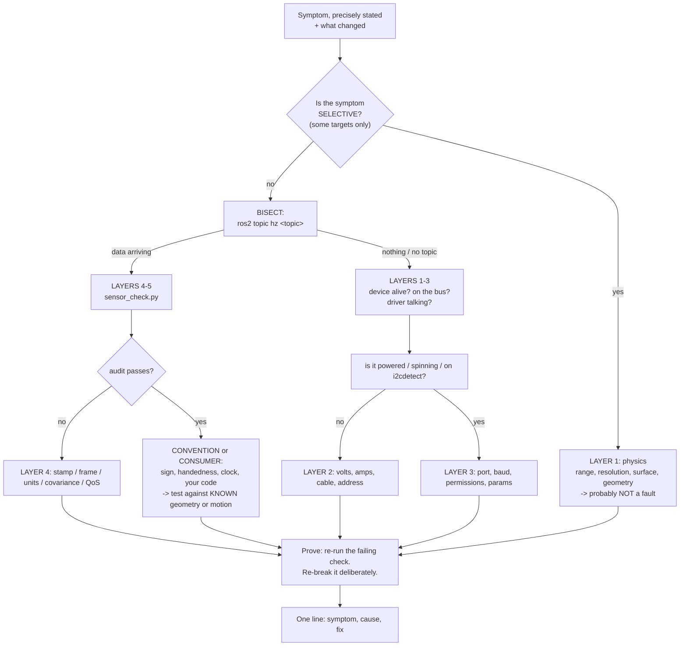

# 07.11 — Sensor troubleshooting: a systematic method

<!-- glance:start -->
<!-- generated by tools/build.py from curriculum/syllabus.yaml — edit the syllabus, not this block -->

| | |
|---|---|
| **Track** | Main path |
| **Difficulty** | Intermediate |
| **Time** | 40 min |
| **Hardware** | none |
| **Software** | ros2 |
| **Prerequisites** | [07.10 Sensor data done right in ROS 2 — timestamps, frame_ids, covariance, synchronization](07.10-sensor-data-in-ros2.md) |
| **Skip if** | You debug sensors from physics to driver to message to consumer. |

<!-- glance:end -->

## What you will learn

- Run the five-layer method — physics → power/wiring → driver → message → consumer — instead of guessing.
- Choose the *bisection* point that halves the search space in one measurement, rather than starting at layer 1 every time.
- Read a symptom and jump straight to the two or three layers that can produce it, using a symptom table you will keep.
- Prove a fix with a test that would have failed before it, and write the one-line note that stops the bug recurring.
- Tell "the sensor is broken" apart from "physics says no" — the most expensive confusion in robotics.

## Why it matters

You have spent ten lessons learning what sensors do. This one is about the other half of the job:
what to do at 11 p.m. when the robot that worked yesterday publishes nothing, or publishes
nonsense, or publishes something that *looks* fine and makes the map come out wrong.

The reason this needs a lesson is that sensor bugs live in a **stack**, and the layers lie to each
other. A LiDAR that "stopped working" can be a brown-out (power), a `/dev/ttyUSB0` that became
`/dev/ttyUSB1` (OS), a baud rate (driver), a QoS mismatch (message), or a consumer on the wrong
clock — and every one of those presents as "no scan in RViz". Guessing costs hours. A method costs
minutes, and more importantly it *terminates*: you always know what to measure next, and you always
know when you are done.

[02.09](../02-robot-electronics/02.09-electrical-debugging-method.md) taught the electrical version
of this discipline. This is the sensor version, and it ends where module 11's SLAM troubleshooting
([11.09](../11-slam/11.09-slam-troubleshooting.md)) begins.

<!-- prereqs:start -->
## Prerequisites

You need these first:

- [07.10 Sensor data done right in ROS 2 — timestamps, frame_ids, covariance, synchronization](07.10-sensor-data-in-ros2.md)

### Optional prerequisite links

None.

Check your readiness: `python course.py why 07.11`
<!-- prereqs:end -->

## Concept

Five layers. Data flows up; you debug by cutting the stack in half, not by walking it.

```text
  5  CONSUMER   your node, Nav2, SLAM, the EKF, RViz
                "I get the data but I do the wrong thing with it"
  4  MESSAGE    topic, type, QoS, stamp, frame_id, units, covariance
                "It is published but nobody receives it, or it means something else"
  3  DRIVER     the ROS node / library: port, baud, mode, parameters, permissions
                "The device is there but the software cannot talk to it"
  2  POWER+BUS  volts, amps, I2C/UART/USB, cables, connectors, addresses
                "The chip is not alive, or not on the bus"
  1  PHYSICS    what the sensor CAN measure: geometry, surface, range, light, sound
                "Nothing is broken. The sensor cannot see that."
```

Two rules that make it work.

**Rule 1: bisect, do not walk.** Five layers is at most three measurements if you always cut in the
middle. Start at **layer 3/4** — does the topic exist and is data arriving? — because that one
question splits the stack cleanly:

- Data arriving → the problem is at layer 4 or 5. Ignore hardware entirely.
- No data → the problem is at layer 1, 2 or 3. Ignore ROS entirely.

Most people start at layer 5 (their own code) or layer 1 (rewiring), and both are usually wrong.

**Rule 2: check layer 1 first when the symptom is *selective*.** "It sees the wall but not the
chair" is not a fault; it is geometry (07.07: a 4 cm leg gets no beams past 2.3 m). "It sees
everything except the window" is not a fault; it is optics. A sensor that fails on *some* targets
and not others is almost always working exactly as designed, and the fix is a different sensor or a
different expectation — never a driver parameter. Spending an evening on a driver for a physics
problem is the most expensive mistake in this module.

> [!TIP]
> **Ask your teacher:** "Here is my symptom. Before you suggest anything, tell me which of the five layers can produce it and which cannot, and what single measurement splits the remaining set in half."

## Technical explanation

### The method, step by step

**Step 0 — Write down the symptom precisely, and what changed.**
"The LiDAR is broken" is not a symptom. "The `/scan` topic exists, publishes at 10 Hz, and RViz
shows nothing; this worked yesterday; since then I moved the robot to the living room and plugged in
the camera" is a symptom *and* two hypotheses (lighting, USB current). Ninety per cent of the time
the answer is in "what changed".

**Step 1 — Bisect at the message layer.** One command:

```bash
ros2 topic list | grep <your sensor>
ros2 topic hz <topic>
```

Nothing listed → layer 3 or below. Listed but `hz` prints nothing → the publisher is not publishing,
or you cannot receive it (QoS — see below). Publishing → layers 4–5.

**Step 2 — Audit the message.** Everything at layer 4 in one command:

```bash
python3 07-sensors/code/ros2/sensor_check.py <topic> --expect-hz <n> --frame <frame> --seconds 5
```

Rate, jitter, worst gap, stamp age, monotonicity, frame_id, units, covariance, and type-specific
structure. It exits non-zero when anything fails, and it catches most of what layer 4 can do to you.

**Step 3 — Form one hypothesis and make one measurement that can falsify it.** Not two changes at
once; not "let me try a different cable and also change the baud rate". One change, one observation,
write both down.

**Step 4 — Prove the fix.** Re-run the measurement that failed. Then *re-break it deliberately* if
you can — that is how you know you fixed the thing you think you fixed, and not something adjacent.
`fake_imu.py --fault …` exists precisely so you can practise this on demand.

**Step 5 — Write one line.** In the robot's notes file or the commit message: symptom,
cause, fix. The same bug will happen again in four months, and that line is worth an hour.

### The tools, by layer

| Layer | Tools | The one question |
|---|---|---|
| 5 Consumer | `ros2 node info`, RViz, `rqt_graph`, your logs | is anyone subscribed, and does it do the right thing? |
| 4 Message | `sensor_check.py`, `ros2 topic hz / echo / bw / info -v`, `tf2_echo`, `ros2 bag` | is the message correct and delivered? |
| 3 Driver | driver logs, `ros2 param list/get`, `ros2 node list`, `strace` | can the software talk to the device? |
| 2 Power+bus | multimeter, `i2cdetect -y 1`, `ls /dev/tty*`, `dmesg \| tail`, `lsusb`, `v4l2-ctl --list-devices` | is the device alive and on the bus? |
| 1 Physics | a tape measure, a piece of white paper, a torch, your eyes | can this sensor see that, at all? |

Three habits worth more than any of the tools:

- **Compare against a known-good source.** The synthetic publishers in
  [`07-sensors/code/ros2/`](code/ros2/README.md) produce correct messages on demand. If your
  consumer works against `fake_lidar.py` and not against the real driver, the bug is below layer 4.
  If it fails against both, it is your consumer. That is one experiment and it halves the stack.
- **Bag the failure.** `ros2 bag record -a` while it is broken. Now you can reproduce it a hundred
  times without the robot, and you can compare against a bag from when it worked
  ([07.10](07.10-sensor-data-in-ros2.md)).
- **Change one thing.** Then change it back. A fix you cannot un-fix is not understood.

### The symptom table

Keep this. Extend it with your own robot's entries.

| Symptom | Layers that can cause it | Check first |
|---|---|---|
| Topic does not exist | 2, 3 | Is the node running (`ros2 node list`)? Is the device there (`ls /dev/tty*`, `i2cdetect`)? |
| Topic exists, `hz` shows nothing | 3, 4 | `ros2 topic info -v` — QoS mismatch. The publisher may also be stalled |
| Data arrives, RViz empty | 4, 5 | RViz display QoS (set to Best Effort), Fixed Frame, and whether the TF exists |
| Rate correct, robot reacts late | 4 | stamp age, not `hz`. And the **worst gap**, which the average hides |
| Stamp age in the billions of ms | 4 | two clocks: `use_sim_time`, or a bag without `--clock`, or unsynced machines |
| Values plausible, estimator worse than without the sensor | 4 | covariance (zeros? σ instead of σ²?) and **sign** (the motion test) |
| Sees some surfaces, not others | **1** | physics. Glass, matte black, grazing angles, out of range. Not a bug |
| Sees the wall but not the chair | **1** | angular resolution: `range_for_gap` (07.07) |
| Works on the bench, fails on the robot | 2 | current (USB brown-out), EMI from motors, a longer cable, vibration |
| Works cold, drifts when warm | 1, 2 | thermal bias (IMU — 07.05), or a regulator overheating |
| Intermittent, worse under load | 3, 4, 5 | executor starvation, queue depth, CPU. Look at the worst gap |
| Obstacles on top of the robot | 4 | `0.0` used for "no return" (07.07), or `(0,0,0)` for invalid depth (07.09) |
| Everything rotated ~90° | 4 | optical vs body frame, or a double axis remap (07.06, 07.08) |
| Map mirrored | 4 | angle sign convention — clockwise instead of CCW (07.07) |
| Detections drift as you speed up | 4 | timing, not calibration. Calibration errors are constant |

### Three worked examples

**Case A — "The LiDAR stopped working."** It worked yesterday; since then the camera was plugged
in.

1. *Bisect:* `ros2 topic list` → no `/scan`. Layer 3 or below. Stop thinking about ROS.
2. `ros2 node list` → the driver node is not there; its log says "failed to get device info".
3. *Layer 2, one look:* is the head spinning? **No.** That is not a software question.
4. Hypothesis: USB current. The Pi is running from karmel's buck regulator and a webcam was added.
5. Test: unplug the camera. The LiDAR spins and the topic appears. Hypothesis confirmed.
6. Fix: `usb_max_current_enable=1` in the Pi's firmware config, reboot, both work.
7. Note: *"LiDAR + camera on Pi 5 from the buck regulator needs usb_max_current_enable=1."*

Total: four minutes, no code read. The give-away was step 3 — a mechanical observation that no
amount of `ros2` commands would have produced.

**Case B — "The map comes out mirrored."** SLAM runs, the map looks like the room reflected.

1. *Bisect:* data arrives, `sensor_check.py` **passes** everything. Layer 4 or 5.
2. Layer 5 is slam_toolbox, which works for thousands of people. Suspect layer 4, specifically a
   convention rather than a defect — audits cannot catch conventions.
3. Hypothesis: angle sign. REP-103 says counter-clockwise positive.
4. Test, from known geometry: place a single object 1 m to the robot's **left**, and check which
   index of `ranges` is short. It should be near `(π/2 − angle_min)/angle_increment`; if the short
   beam is at the mirror-image index, the scan runs clockwise.
5. Fix: the driver's `inverted` parameter, or the mounting (the unit is upside down).
6. Note: *"Mirrored map = scan angle sign. Test with one object on the left."*

The lesson: `sensor_check.py` passed. A self-consistent wrong convention is invisible to any check
that does not compare against the physical world — which is why the **motion and geometry tests**
in 07.06 and 07.07 exist.

**Case C — "The robot brakes late, but `ros2 topic hz` says 30 Hz."**

1. *Bisect:* data arrives. Layer 4 or 5.
2. `sensor_check.py` → rate 29.4 Hz, **worst gap 310 ms**, stamp age p95 180 ms.
3. Two findings, and they are different bugs. The gap is layer 4/5 (something blocks); the stamp
   age is layer 4 (something is slow or stamps late).
4. Hypothesis 1: a blocking call inside a callback on a single-threaded executor. Test: move the
   heavy work to a separate callback group / thread, re-measure. Gap drops to 45 ms.
5. Hypothesis 2 for the remaining age: the driver stamps on publish. Test: the stopwatch method
   (07.08). End-to-end 190 ms versus a reported 40 ms → it stamps late.
6. Fix: raise the frame rate and shrink the image (real latency), and add a documented constant
   offset for the stamp until the driver is fixed.
7. Note: *"hz hides stalls. Always read worst gap and stamp age."*

## Diagram



## Code

The fault injectors in [`07-sensors/code/ros2/`](code/ros2/README.md) exist so you can **practise
diagnosis on demand**, which is the only way this method becomes fast. Twenty-two faults across
four sensors, every one modelled on a real bug:

| Node | Faults |
|---|---|
| [`fake_imu.py`](code/ros2/fake_imu.py) | `no-covariance`, `zero-stamp`, `wrong-frame`, `gravity-in-g`, `left-handed`, `sigma-not-var`, `stale` |
| [`fake_lidar.py`](code/ros2/fake_lidar.py) | `zeros-for-no-return`, `degrees`, `clockwise`, `wrong-frame`, `stale-stamp`, `half-count` |
| [`fake_camera.py`](code/ros2/fake_camera.py) | `no-camera-info`, `uncalibrated`, `stamp-on-publish`, `mismatched-info`, `body-frame` |
| [`fake_depth.py`](code/ros2/fake_depth.py) | `zero-is-valid`, `metres-in-16u`, `dense-lie`, `body-frame` |

Plus [`qos_demo.py`](code/ros2/qos_demo.py) for delivery faults and
[`sensor_check.py`](code/ros2/sensor_check.py) as the layer-4 audit.

**Four of the twenty-two pass the audit**: `sigma-not-var` and `left-handed` on the IMU,
`clockwise` on the LiDAR, `stamp-on-publish` on the camera. Those four are the reason this lesson
exists — they are self-consistent, so no structural check finds them, and only a comparison against
the physical world does.

```bash
# course Docker image
source /opt/ros/jazzy/setup.bash
cd 07-sensors/code/ros2

# the drill: someone else picks the fault, you find it
python3 fake_lidar.py --box 1.5 --fault $(shuf -n1 -e zeros-for-no-return degrees clockwise \
        wrong-frame stale-stamp half-count) &
python3 sensor_check.py /scan --expect-hz 10 --frame laser --seconds 5
```

## Exercise

### Exercise 07.11-E1 — Which layer? `[predict]`

Hardware: none. For each symptom, list every layer that could cause it, then name the **single
measurement** that splits the remaining set roughly in half:

(a) `/imu/data_raw` is absent from `ros2 topic list`.
(b) The scan shows the sofa but never the glass balcony door.
(c) `ros2 topic hz /scan` says 10 Hz; RViz shows nothing and logs nothing.
(d) Heading is fine for the first minute of every run and 20° out by minute five.
(e) The robot navigates fine in the corridor and refuses to move in the kitchen.
(f) Everything works until the motors start.

### Exercise 07.11-E2 — The blind drill `[debugging]`

Hardware: none (course Docker image). Have your AI teacher start one of the four `fake_*` nodes
with a fault it does not name. Find it. Record, for each round: your first measurement, your
hypothesis, the measurement that confirmed it, and the elapsed time. Do **ten** rounds across at
least three different sensors.

Target: under 90 seconds per round by round five. If a round takes longer, write down which layer
you wasted time in — that is the useful output.

### Exercise 07.11-E3 — The four that pass `[debugging]`

Hardware: none. `sigma-not-var`, `left-handed`, `clockwise` and `stamp-on-publish` all pass
`sensor_check.py`. For each: (a) explain in one sentence why a structural audit cannot catch it;
(b) design a concrete test that does, specifying the physical setup and the exact expected number;
(c) run your test against the faulty publisher and show it failing, then against the healthy one
and show it passing.

### Exercise 07.11-E4 — Physics or fault `[design]`

Hardware: none. For each, decide **physics** or **fault**, justify with a number where one applies,
and give the cheapest fix:

(a) The 360-beam LiDAR misses a 3 cm table leg at 2.5 m.
(b) The depth camera has a hole where the black sofa is.
(c) The IMU's yaw drifts 30° in a minute while the robot stands still.
(d) The ultrasonic sensor reports 4 m in the middle of a 3 m room.
(e) The camera's AprilTag detection fails only while turning.
(f) The 2D LiDAR does not see the dining table, only its legs.
(g) The depth camera reports nothing for an object 15 cm from the lens.

### Exercise 07.11-E5 — Write the runbook `[coding]`

Hardware: none. Turn the symptom table into a script or a checklist for **your** robot: for every
sensor you have or plan to have, list the expected rate, frame, stamp-age limit and covariance
source; the layer-2 command that proves the device is alive (`i2cdetect -y 1`,
`v4l2-ctl --list-devices`, `ls /dev/ttyUSB*`); the layer-3 command that starts the driver with the
right parameters; and the layer-4 audit command with its thresholds. Then break one thing
deliberately and confirm the runbook gets you to the cause without thinking.

### Exercise 07.11-E6 — Diagnose your own robot `[hardware]`

Hardware: any of `robot-base`, `imu`, `camera`, `lidar`, `depth-camera` you own; the Gazebo simulation is a full substitute.

> [!CAUTION]
> **Safety:** diagnosis needs no motion. If a step requires the motors (EMI or vibration tests),
> wheels off the ground, hand on the switch, and the standing battery rules
> ([SAFETY.md](../SAFETY.md)).

1. Pick the sensor you trust least. State, in writing, what you expect it to do and what you expect
   it to fail at (layer 1) before measuring anything.
2. Run the full layer-1-to-5 pass and record each answer.
3. Deliberately induce three faults you can reverse — unplug a wire, change a parameter, start a
   consumer with the wrong QoS — and time how long the method takes to find each.
4. Find one thing genuinely wrong or marginal on your robot. Fix it, prove the fix, and write the
   one-line note.

## Expected result

**07.11-E1:** (a) Layers **2, 3** (and 5 if you count "the launch file never started it"). Splitting
measurement: `ros2 node list` — if the driver node is missing it is layer 3/5; if it is running and
publishing nothing, it is layer 2 (device absent). (b) Layer **1**, and only layer 1: glass is
optically transparent, so no optical sensor sees it. No measurement needed; the selectivity is the
diagnosis. Fix: an ultrasonic sensor. (c) Layers **4, 5**. Splitting measurement:
`ros2 topic info -v /scan` — if the publisher offers BEST_EFFORT and RViz's display asks RELIABLE,
that is the whole answer; otherwise check the display's Fixed Frame and the TF. (d) Layer **1**
(gyro bias walk, 07.05) or layer **4** (a covariance that makes the EKF over-trust the IMU).
Splitting measurement: does the drift also happen while standing still? Yes → layer 1 bias. No →
it scales with motion, so look at scale factor or fusion weights. (e) Layers **1** and **4**.
Kitchens have glass, stainless steel and a tiled floor: selective, so suspect layer 1 — but
"refuses to move" specifically suggests phantom obstacles, so the splitting measurement is
`sensor_check.py`'s no-return-marker line, which catches `0.0`-for-inf. (f) Layer **2**: EMI or
current. Splitting measurement: command the motors with the wheels in the air and watch the sensor —
if it degrades, it is electrical; if it degrades only when the robot actually *moves*, it is
vibration or motion (layer 1).

**07.11-E2:** Round-one times of five to ten minutes are normal; by round five you should be under
90 seconds, because you stop walking the stack. The fault families and their tells:
`no-covariance`/`sigma-not-var` → the covariance lines; `zero-stamp`/`stale`/`stamp-on-publish` →
the stamp-age and monotonicity lines; `wrong-frame`/`body-frame` → the frame_id line;
`gravity-in-g`/`metres-in-16u` → the units and z-range lines; `zeros-for-no-return`/`zero-is-valid`
→ the no-return-marker and z-range lines; `degrees`/`half-count` → the angle-span and
ranges-length lines; `dense-lie` → the is_dense line. The four that pass the audit need the E3
tests. The useful output of this exercise is not the times; it is your list of the layers where you
wasted minutes.

**07.11-E3:** (a) In every case the message is **internally consistent**: a variance of 0.003 is a
perfectly legal variance, a mirrored frame satisfies every structural rule, a clockwise scan has a
valid angle span, and a late timestamp is a valid timestamp. A checker with no knowledge of the
physical world cannot distinguish them from correct data. (b) and (c):

| Fault | Test | Expected when healthy | When faulty |
|---|---|---|---|
| `left-handed` | turn the robot **left** by hand, `ros2 topic echo /imu/data_raw --field angular_velocity.z` | positive (REP-103: CCW is +) | negative |
| `sigma-not-var` | measure σ from a 60 s still log (07.05), square it, compare with `angular_velocity_covariance[0]` | covariance ≈ σ² (e.g. 9e-6 for σ = 0.003) | covariance ≈ σ (0.003) — a factor of ~330 |
| `clockwise` | place one object 1 m to the robot's **left**; find the index of the short beam | near index `(π/2 − angle_min)/angle_increment` (270 for a 360-beam, angle_min = −π scan) | at the mirror-image index (90) |
| `stamp-on-publish` | stopwatch or LED latency test (07.08) against the reported stamp age | end-to-end ≈ stamp age + display delay | end-to-end far exceeds stamp age (measured: 76 ms honest vs 22 ms reported for the same 40 ms pipeline) |

**07.11-E4:** (a) **Physics.** At 1.00° resolution, beams are 4.4 cm apart at 2.5 m, and a 3 cm leg
gets one beam only out to $0.03/0.01745 = 1.72$ m. Cheapest fix: approach closer, or add a forward
ToF sensor for the near field. (b) **Physics.** Matte black absorbs the IR; no light returns. Fix:
more light, a projector if the device has one, or accept the hole and never treat "invalid" as
"free space". (c) **Fault — or rather, missing calibration.** 30°/min is 0.5 °/s of bias, entirely
typical uncalibrated, and 07.05's bias estimation removes it. Standing still and drifting means the
bias is not being subtracted. (d) **Physics.** A 4 m reading in a 3 m room is a classic ultrasonic
ghost echo — a multi-path return off two walls (07.03). Fix: median filter over several pings, and
reject readings beyond the room's known dimensions. (e) **Physics**, of the exposure kind: motion
blur, $\omega t_e/\text{IFOV}$, which at 1 rad/s and 25 ms exposure is 13 px on a tag that may be
only 18 px wide. Fix: cap the exposure and raise the gain; turn slower. (f) **Physics.** One scan
plane at 12 cm; the tabletop is above it. Fix: a tilted second sensor,
`depthimage_to_laserscan` from a depth camera, or a keep-out zone in the map — the last being free.
(g) **Physics.** Inside the minimum range (0.2–0.5 m for stereo). Fix: a short-baseline device for
close work, or a ToF/ultrasonic sensor for the last half metre.

**07.11-E5:** A good runbook fits on one page per sensor and is *copy-pasteable*. The test of it is
step 4: when you break something deliberately, you should reach the cause by reading commands off
the page, not by thinking. If you find yourself thinking, the missing entry is the valuable output —
add it.

**07.11-E6:** Expect step 1 to be the most useful part: writing down what the sensor *cannot* do
before measuring prevents most wasted evenings. Induced faults should be found in under two minutes
each once you use the bisect step. Common genuine findings on a real karmel: a covariance still at
its placeholder value; a camera stamp age above 100 ms; a worst gap of 150–300 ms on a Python node;
a `frame_id` that does not match the URDF; and a LiDAR that browns out when the camera is plugged
in.

## Troubleshooting

### Symptom: I ran the method and reached the end without finding anything

1. Re-read your Step 0. Is the symptom stated precisely enough to be *falsifiable*? "Sometimes it
   is weird" cannot be debugged.
2. Is it intermittent? Then a single audit can pass by luck. Bag 60 seconds and audit the bag, or
   raise `--seconds` until the symptom appears within the window.
3. Is it one of the four self-consistent faults? Those pass every structural check. Go to a
   physical test: known geometry, known motion, known distance.
4. Is it actually at layer 5 — your own code? Swap in `fake_*` as the source. If the bug persists
   with known-good data, it is yours.

### Symptom: the fix worked and then stopped working

You changed something that does not persist. The usual suspects: `chmod 777 /dev/ttyUSB0` (gone on
reboot — write a udev rule), a parameter set with `ros2 param set` rather than in the launch file,
an environment variable exported in one terminal, or a `/dev/ttyUSB0` that becomes `ttyUSB1` in a
different plug order. If a fix is not in a file that is in Git, it is not a fix.

### Symptom: two symptoms at once and I cannot tell them apart

Do not. Fix one, prove it, then re-state the remaining symptom from scratch — it often changes, and
sometimes it disappears. Case C above is the pattern: a worst-gap problem and a stamp-age problem
looked like one "the robot is sluggish" symptom and had two unrelated causes.

### Symptom: it works in simulation and fails on the robot

That is a whole topic ([06.10](../06-simulation/06.10-sim-to-real-gap.md)), but the sensor-shaped
subset is short. Simulation has no EMI, no brown-outs, no vibration, no USB enumeration order, no
dust on the lens, no sunlight, no glass; and it fills some fields differently (Gazebo leaves
`scan_time` and `time_increment` at 0.0 and publishes an all-zero `orientation_covariance`).
Enumerate those explicitly before blaming your code.

## Common mistakes

- **Starting at layer 1 or layer 5.** Bisect at 3/4 instead; it halves the stack in one command.
- **Changing two things at once.** Then you do not know which one worked, and neither do you in
  four months.
- **Debugging a physics problem in software.** Glass, matte black, thin objects at range and
  minimum range are not bugs.
- **Trusting an audit that passes.** Four of the twenty-two course faults pass. Conventions and
  signs need physical tests.
- **Trusting `ros2 topic hz`'s average.** Read the worst gap.
- **Not writing down what changed** before you start changing more things.
- **Fixing without proving.** Re-run the failing check; better, re-break it on purpose.
- **A fix that only lives in your shell history.** If it is not in a file in Git, it will be gone
  next boot.
- **Not bagging the failure** while you had it. You cannot reproduce what you did not record.

## Knowledge check

1. `/scan` publishes at 10 Hz and RViz shows nothing, with no error anywhere. Which layers, and
   what is your first command?
   <details><summary>Answer</summary>

   Layers 4 and 5 — data is arriving, so hardware is ruled out. First command:
   `ros2 topic info -v /scan`, comparing the publisher's and subscriber's QoS. A sensor driver
   offers BEST_EFFORT and RViz's LaserScan display defaults to Reliable, which is a stronger
   request, so DDS never connects them and nothing is logged in the display. After that, check the
   display's Fixed Frame and whether the `laser` transform exists.
   </details>

2. Your 360-beam LiDAR "misses" a 3 cm chair leg at 2.5 m. Fault or physics, with a number?
   <details><summary>Answer</summary>

   **Physics.** At 1.00° resolution the beams are $2.5 \times 0.01745 = 4.4$ cm apart at that
   range, wider than the leg, so it falls between beams. It gets a single beam only out to
   $0.03/0.01745 = 1.72$ m. Nothing in the driver will change this. Either get closer, use a
   higher-resolution sensor, or cover the near field with a different sensor.
   </details>

3. Why should you bisect at the message layer rather than start at the device?
   <details><summary>Answer</summary>

   Because one command — "is data arriving on this topic?" — cleanly splits five layers into two
   halves. Data arriving means the device, the bus and the driver all work, so you can ignore
   hardware entirely; nothing arriving means ROS is irrelevant and you should be holding a
   multimeter. Starting at layer 1 or 5 means you walk the stack, which is five measurements
   instead of three, and you usually walk it in the wrong direction.
   </details>

4. `sensor_check.py` passes on every check and your SLAM map is mirrored. What now?
   <details><summary>Answer</summary>

   You are in the self-consistent-fault case: the scan's angles run clockwise instead of
   counter-clockwise, which is a **convention** error that satisfies every structural rule. Test
   against known geometry: put one object 1 m to the robot's left and find the index of the short
   beam. On a 360-beam scan with `angle_min = -π` it should be near index 270; if it is near 90,
   the scan is mirrored. Fix with the driver's `inverted` parameter or by remounting.
   </details>

5. A sensor works on the bench and fails on the robot. Name three layer-2 causes and the test for
   each.
   <details><summary>Answer</summary>

   **Current** — a Pi 5 fed from the buck regulator limits USB to 600 mA; test by unplugging other
   USB devices, or by setting `usb_max_current_enable=1`. **EMI from the motors** — test by
   commanding the motors with the wheels in the air and watching the sensor; if it degrades without
   the robot moving, it is electrical. **Vibration or a longer/poorer cable** — test by running the
   same sensor with the robot powered but the motors off, then with a short known-good cable.
   </details>

6. Rate 29.4 Hz, worst gap 310 ms, stamp age p95 180 ms. How many bugs, and what are they?
   <details><summary>Answer</summary>

   **Two, and they are independent.** The 310 ms gap with an otherwise fine average is something
   *blocking* — a blocking call in a callback, a single-threaded executor shared with slow work, or
   CPU starvation — and it lives at layer 4/5. The 180 ms stamp age is *latency*: either the
   pipeline really is that slow, or the driver stamps at publish time and the true latency is
   worse. Fix and prove them separately; treating them as one symptom is how Case C wasted an hour.
   </details>

7. What makes `left-handed` and `sigma-not-var` harder to find than `zero-stamp`?
   <details><summary>Answer</summary>

   `zero-stamp` violates a structural rule — a timestamp of 0 is invalid on its face, so any
   checker catches it. The other two produce data that is **internally consistent and physically
   plausible**: 0.003 is a legal variance and a mirrored frame obeys every rule about units,
   ranges and rates. Only a comparison against the physical world finds them: measure σ and square
   it; turn the robot left and check the sign. That is why every sensor bring-up in this module
   ends with a motion or geometry test, not just an audit.
   </details>

8. Your fix worked yesterday and the robot is broken again after a reboot. What kind of fix did you
   make?
   <details><summary>Answer</summary>

   A non-persistent one. `chmod` on a `/dev` node, a `ros2 param set` at runtime, an `export` in one
   terminal, or a device that enumerated as `ttyUSB0` yesterday and `ttyUSB1` today. Make it
   permanent: a udev rule for the device name and permissions, the parameter in the launch file,
   the environment in a file that is sourced. The rule: **if the fix is not in a file that is in
   Git, it is not a fix.**
   </details>

## Practical challenge

**Build the fault drill and beat it.** Turn the method into something you can measure yourself
against, and then prove the method works.

Build a small harness that: picks one of the 22 faults (or a QoS mismatch, or a wrong-clock
consumer) at random without telling you; starts the corresponding publisher; and records how long
you take and whether you identified the fault correctly. Then run 20 rounds and produce a short
report.

The report must contain: your median and worst time per round, and the trend across rounds; a
per-layer breakdown of where your time went; the specific faults that took longest and why; the
additions you made to your symptom table as a result; and — the real deliverable — a **physical
test for each of the four self-consistent faults**, specified precisely enough for someone else to
run it and get the expected number.

Acceptance criteria:

- 20 recorded rounds covering at least three of the four sensors and both delivery faults.
- Median time under 90 seconds by the second half of the run.
- Every identification verified against the harness's answer — including the ones you got wrong,
  which are the interesting rows.
- The four physical tests demonstrated: each one shown failing against the faulty publisher and
  passing against the healthy one, with the numbers.
- A one-page runbook for your own robot (E5), in the repository, that you actually used.
- Safety: no motion required anywhere in this challenge.

## You can skip this if…

You can answer knowledge-check questions 1, 2 and 3 correctly without looking, you instinctively
bisect at the message layer rather than walking the stack, and you can name at least two sensor
faults that a structural audit cannot catch and the physical test for each. Then:

`python course.py skip 07.11 --reason "I debug sensors by layer, bisecting at the message, and I know which faults need a physical test"`

## Go deeper

- Agans, *Debugging: The 9 Indispensable Rules for Finding Even the Most Elusive Software and Hardware Problems* (2nd ed., 2021): the short book behind this lesson's method — "understand the system", "make it fail", "quit thinking and look", "change one thing at a time", "keep an audit trail". Every rule applies to sensors unchanged.
- ROS 2 introspection tools: https://docs.ros.org/en/jazzy/Tutorials/Beginner-CLI-Tools.html — `ros2 topic`, `ros2 node`, `ros2 param`, `ros2 doctor`, and `rqt_graph`, which is the fastest way to see that nobody is subscribed to the topic you are staring at.
- `ros2 doctor`: https://docs.ros.org/en/jazzy/Tutorials/Beginner-Client-Libraries/Getting-Started-With-Ros2doctor.html — a quick check of network, QoS and middleware configuration when a system-level thing is wrong rather than a sensor-level thing.
- Foxglove Studio: https://foxglove.dev/ — open a bag of the failure and plot timestamps against arrival times; clock and latency problems are much easier to see as a picture.
- Brendan Gregg, *Systems Performance*, chapter 2 (Methodologies), notes at https://www.brendangregg.com/methodology.html — the USE method and why *having* a method beats being clever; the layer-bisection idea here is the same discipline applied to a sensor stack.

## Progress checkpoint

- [ ] I state the symptom precisely and write down what changed, before touching anything.
- [ ] I bisect at the message layer instead of walking the stack.
- [ ] I recognise a selective symptom as physics and stop debugging software.
- [ ] I can name the faults a structural audit cannot catch, and the physical test for each.
- [ ] I prove every fix by re-running the check that failed, and I write the one-line note.

`python course.py complete 07.11` (exercises done) · `python course.py master 07.11` (challenge done) · `python course.py struggle 07.11 "what was hard"`

Next: [08.01 — Open-loop vs closed-loop control](../08-control/08.01-open-vs-closed-loop.md). You have sensors; now you can close a loop with them.
