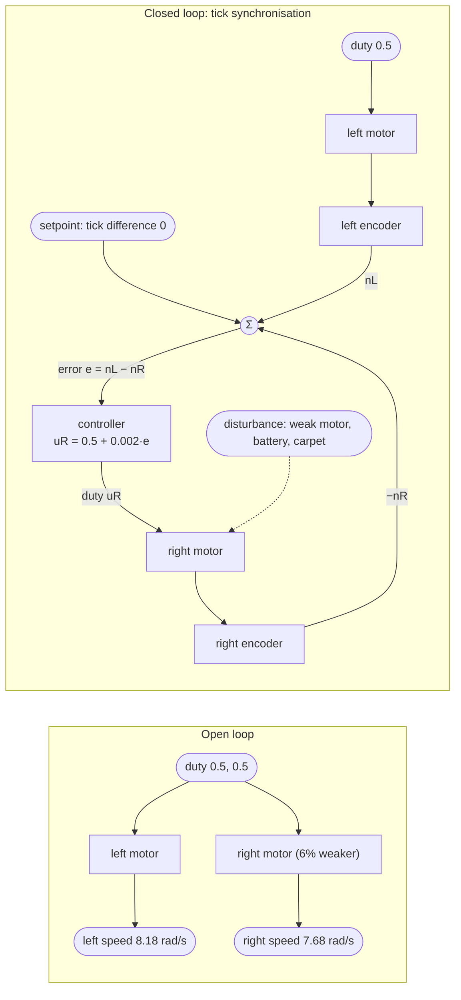
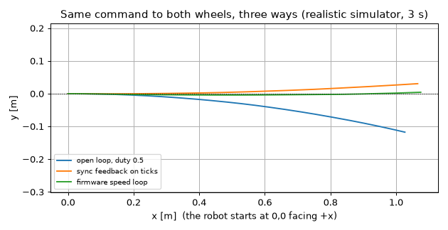

# 08.01 — Open loop vs closed loop — why your robot doesn't drive straight

<!-- glance:start -->
<!-- generated by tools/build.py from curriculum/syllabus.yaml — edit the syllabus, not this block -->

| | |
|---|---|
| **Track** | Main path |
| **Difficulty** | Beginner |
| **Time** | 45 min |
| **Hardware** | Stage 1 robot: Pi 5, Pico, encoder motors, driver, chassis, battery, distance sensors (stage 1) |
| **Software** | python |
| **Prerequisites** | [01.12 Use encoders to drive exact distances and angles — drive a square](../01-first-robot/01.12-encoder-distance-and-square.md)<br>[06.02 The course mini-simulator — physics in 100 lines of Python](../06-simulation/06.02-course-mini-simulator.md) |
| **Optional prerequisites** | [FCT.01 Systems, signals and feedback — block diagrams](../optional-foundations/control-theory/FCT.01-systems-signals-feedback.md) |
| **Skip if** | You can explain feedback and name the setpoint, measurement and error in any loop. |

<!-- glance:end -->

## What you will learn

- Show, with a measurement, that "the same duty on both motors" does not give the same wheel speed or a straight line.
- Name the setpoint, measurement, error, controller, actuator and disturbance in any control loop, including ones you have already written.
- Close a first feedback loop yourself: keep both wheels' tick counts equal with a three-line correction.
- Explain what feedback fixes (motor mismatch, battery sag) and what it can't (a wrong sensor, a wheel of the wrong size).
- Run the module-08 experiment scripts on the simulator, through the serial stack, and on the real robot with its wheels in the air.

## Why it matters

In [01.11](../01-first-robot/01.11-drive-and-rotate.md) you drove karmel forward with `set_wheel_duty(0.4, 0.4)`. It curved. You probably blamed the floor. It wasn't the floor: two "identical" DC motors from the same box differ by several percent, and a battery going from 12.6 V to 10 V changes every speed by 20%. Nothing in an open-loop program notices.

Everything the robot does later depends on fixing that. Odometry ([09.03](../09-odometry/09.03-dead-reckoning-integration.md)) assumes the wheels did what they were told. Nav2 sends "0.3 m/s, 0.5 rad/s" and expects to get it. The arm must stop at an angle, not near one. The tool that turns "sent a command" into "achieved a result" is **feedback control**, and this module builds it by experiment: measure the problem, add P, add I, add D ([08.04](08.04-proportional-control.md)–[08.06](08.06-derivative-control.md)), then do the math ([08.07](08.07-pid-mathematics.md)).

<!-- prereqs:start -->
## Prerequisites

You need these first:

- [01.12 Use encoders to drive exact distances and angles — drive a square](../01-first-robot/01.12-encoder-distance-and-square.md)
- [06.02 The course mini-simulator — physics in 100 lines of Python](../06-simulation/06.02-course-mini-simulator.md)

### Optional prerequisite links

New to any of these? Take the foundation lesson first; skip it if you already know it.

- [FCT.01 Systems, signals and feedback — block diagrams](../optional-foundations/control-theory/FCT.01-systems-signals-feedback.md)

Check your readiness: `python course.py why 08.01`
<!-- prereqs:end -->

## Concept

### Two ways to boil an egg

**Open loop:** put the egg in boiling water for 7 minutes. You never look at the egg. If the egg came out of the fridge, if you're at altitude, if the pot is small, the egg comes out different. The recipe is only as good as your model of eggs.

**Closed loop:** a cook with a thermometer probe checks the core temperature and takes the egg out at 64 °C. The fridge, the altitude and the pot don't matter, because the decision is based on the thing you actually care about.

A robot driving with `set_wheel_duty(0.5, 0.5)` is the first cook. It has a model in its head ("0.5 duty means 8 rad/s") and never checks.

### The vocabulary of every loop

Every feedback loop, from a thermostat to Nav2, has the same parts. Learn them once:

| Part | Question it answers | Karmel's wheel-speed loop |
|---|---|---|
| **Setpoint** (reference) | What do I want? | 8 rad/s |
| **Measurement** | What is actually happening? | speed estimated from encoder ticks |
| **Error** | How wrong am I? | setpoint − measurement |
| **Controller** | What do I do about it? | a rule turning error into a command (P, PI, PID…) |
| **Command** (control input) | What do I send? | PWM duty −1…1 |
| **Actuator + plant** | What turns the command into motion? | driver, motor, gearbox, wheel |
| **Disturbance** | What pushes me off? | carpet, slope, battery sag, the other motor being weaker |
| **Feedback** | How does the result get back to the controller? | encoder → speed estimate → error |

The sign convention matters: **error = setpoint − measurement**. Positive error means "not enough yet, push more". Wire it backwards and the loop pushes the wrong way and runs away (positive feedback — [FCT.01](../optional-foundations/control-theory/FCT.01-systems-signals-feedback.md) shows it).

A distributed-systems analogy: an autoscaler that adds 3 instances every morning is open loop. One that watches queue depth (measurement), compares with a target depth (setpoint) and adds or removes instances in proportion to the difference (controller) is closed loop. It copes with a traffic spike you didn't predict, and it can also oscillate if it reacts too hard or too late. Both lessons carry over directly.

### What feedback can and can't fix

Feedback corrects **anything that shows up in the measurement**: a weak motor, a sagging battery, carpet. It cannot correct what the sensor doesn't see. If the right wheel is 0.8% larger than the left, a loop that makes both wheels turn at exactly the same rad/s still drives a slight curve, because the *wheel angle* is right and the *ground distance* isn't. Feedback makes the measurement match the setpoint. It does not make the measurement true. You will see exactly this in the experiment.

> [!TIP]
> **Ask your teacher:** "Point at the setpoint, measurement, error and controller in the tick-synchronisation loop of `open_vs_closed_loop.py`, then in the firmware's `velocity.py`."

## Technical explanation

### Level 1 — Why open loop drifts

A DC motor's speed depends on the voltage across it and the torque it must produce. Duty cycle sets the *fraction* of the battery voltage the driver applies ([FE.07](../optional-foundations/electronics/FE.07-pwm.md), [FE.10](../optional-foundations/electronics/FE.10-dc-motors.md)). Everything else varies:

- **Motor-to-motor spread.** Magnet strength, winding resistance and gearbox friction differ. Cheap gearmotors differ by 5–10% at the same duty.
- **Battery voltage.** A 3S Li-ion pack goes from 12.6 V full to about 10 V near empty. Same duty, about 20% less speed.
- **Load.** Carpet, slopes, a heavier payload on one side.
- **Deadband.** Below some duty (karmel's config says 0.12) the motor doesn't turn at all. [08.02](08.02-motor-step-response.md) measures it.

### Level 2 — How much curve does 6% cost?

If the right wheel runs at 94% of the left wheel's speed, the robot drives an arc. With wheel separation $b$ and wheel ground speeds $v_L$, $v_R$, the arc radius of the robot centre is ([09.01](../09-odometry/09.01-diff-drive-kinematics.md)):

$$R = \frac{b}{2}\,\frac{v_L + v_R}{v_L - v_R}$$

**Numerical example.** $b = 0.20$ m, $v_R = 0.94\,v_L$:

$$R = 0.10 \times \frac{1.94}{0.06} = 3.23 \text{ m}$$

After driving $s = 1$ m the heading has turned $s/R = 0.309$ rad = **17.7°**, and the robot is $R(1-\cos(s/R)) = $ **0.15 m** to the side. After 2 m: 35° and 0.60 m. A 6% mismatch you can't see by eye puts the robot into the wall of a 1.2 m-wide corridor within 2 m.

### Level 3 — The smallest possible feedback loop

We want the two wheels to have turned the same amount. So:

- setpoint: tick difference = 0
- measurement: $\Delta n = n_L - n_R$ (ticks since the start)
- error: $e = 0 - (n_R - n_L) = n_L - n_R$
- controller: $u_R = u_0 + K\,e$, with $u_0 = 0.5$ and $K = 0.002$ duty per tick

**Numerical example.** After 0.2 s the left wheel has 620 ticks and the right 600. $e = 20$, so $u_R = 0.5 + 0.002 \times 20 = 0.54$. The right motor speeds up until the counts match, and the correction shrinks back toward the few ticks needed to hold the balance.

This is a proportional controller on *position* (accumulated ticks). You'll formalise P control on *speed* in [08.04](08.04-proportional-control.md).

### Level 4 — Where loops live on karmel

Karmel has two places a speed loop can run:

- **On the Pico** (`set_wheel_velocity`): the firmware in [`labs/firmware/pico/velocity.py`](../labs/firmware/pico/velocity.py) measures speed every 10 ms and adjusts the duty. This is where the loop belongs on a finished robot, and [08.12](08.12-control-in-ros2.md) explains why.
- **On the Pi** (`set_wheel_duty` + your code): the Pi reads 50 Hz telemetry, computes the duty and sends it back over USB. Slower, laggier, and perfect for learning: you can print, plot and change every line in seconds.

Lessons 08.01–08.06 put the loop on the Pi on purpose. Every experiment script accepts the same three targets:

| Target | Command | What runs |
|---|---|---|
| simulator | `python 08-control/code/<script>.py` | `SimBase` + `DiffDriveSim` with the **realistic** preset (right motor 6% weaker, wheel radii −0.5%/+0.8%, wheelbase +4%, battery sag), firmware at 100 Hz |
| fake Pico | `... --fake` | the same simulator behind a TCP "serial port": the whole `SerialBase` + protocol stack, in real time |
| real robot | `... --port /dev/ttyACM0` | karmel; asks you to confirm the wheels are in the air |

## Diagram

The open-loop and closed-loop versions of "drive straight":



Where the loop runs in lessons 08.01–08.06 versus the finished robot:

```text
  08.01–08.06 (learning)                         08.12 (finished robot)
  ┌──────── Raspberry Pi ────────┐               ┌──── Pi ────┐
  │ your controller, 50 Hz        │               │ setpoints  │
  │ telemetry in ─► duty out      │               └─────┬──────┘
  └───────▲──────────────┬───────┘                     │ V left right
          │ T (50 Hz)    │ M left right               ▼
  ┌───────┴──────────────▼───────┐               ┌──── Pico ──────────────┐
  │ Pico: encoders, PWM, watchdog │               │ PID at 100 Hz (velocity.py) │
  └───────────────────────────────┘               └────────────────────────┘
```

## Code

### The shared lab helper

[`08-control/code/control_lab.py`](code/control_lab.py) is used by every script in this module. The part you need now is `run_loop`: it calls your `step(t, dt, state, extra)` function once per loop period (50 Hz), sends the two values it returns to the motors, and logs everything:

```python
def run_loop(base, step, duration_s, rate_hz=50.0, delay_steps=0, command="duty") -> Log:
    """Call ``step(t, dt, state, extra)`` every period and send what it returns to the motors.

    * ``step`` returns (left, right): duty -1..1 (``command="duty"``) or rad/s (``"velocity"``).
    * ``delay_steps`` holds each command back for that many periods (extra dead time).
    * Every row logs: t, measured wheel speeds, ticks, the duty actually sent,
      battery voltage, and in simulation the TRUE wheel speeds.
    """
```

On the simulator one period is two 10 ms firmware steps. On the robot it waits for the next telemetry sample, using the **robot's** timestamps (why that matters: [08.03](08.03-wheel-speed-estimation.md)). It always stops the motors at the end, even on an exception.

### The experiment

[`08-control/code/open_vs_closed_loop.py`](code/open_vs_closed_loop.py) runs three 3-second drives that all mean "both wheels the same", then repeats the first one with a nearly empty battery. The feedback loop is the interesting part:

```python
DUTY = 0.5
SYNC_GAIN = 0.002  # duty per tick of difference


def open_loop(t, dt, state, extra):
    return DUTY, DUTY


def make_sync_loop():
    """The smallest useful feedback loop: setpoint = 'no tick difference'."""
    start: dict[str, int] = {}

    def step(t, dt, state, extra):
        if not start:
            start.update(left=state.left_ticks, right=state.right_ticks)
        left_turned = state.left_ticks - start["left"]
        right_turned = state.right_ticks - start["right"]
        error = left_turned - right_turned  # setpoint 0 minus measurement (right - left)
        correction = SYNC_GAIN * error
        extra["tick_error"] = error
        return DUTY, DUTY + correction  # right behind -> more right duty

    return step
```

The third run uses `command="velocity"`: it asks the Pico's own PID for the average speed the open-loop run reached.

Run it (from the repository root):

```bash
python 08-control/code/open_vs_closed_loop.py --plot open_vs_closed.png
```

Output (simulator, realistic preset, seed 0):

```text
run                           L ticks  R ticks    R/L  L rad/s  R rad/s  x [m]  y [m]  heading
open loop, duty 0.5              9298     8740  0.940     8.18     7.68   1.06 -0.126   -13.7 deg
sync feedback on ticks           9296     9284  0.999     8.17     8.18   1.10 +0.033    +3.6 deg
firmware speed loop              9384     9353  0.997     7.93     7.93   1.11 +0.006    +2.2 deg
open loop, battery at 10%        7072     6648  0.940     6.22     5.85   0.81 -0.077   -11.2 deg
saved open_vs_closed.png
```



Read the table like an engineer:

- **Open loop:** the right wheel turns 6% less (R/L = 0.940), so the robot curves **right** and ends 12.6 cm off the line, heading −13.7°, after only 1.06 m.
- **Sync feedback:** the tick counts match within 12 (0.1%). The robot now drifts slightly **left** (+3.6°). Not a bug: the realistic robot's right wheel is 0.8% larger than nominal and the left 0.5% smaller. Equal wheel *rotation* is not equal *distance*. Feedback made the measurement right; calibration ([09.05](../09-odometry/09.05-calibrating-odometry.md)) makes the measurement true.
- **Firmware loop:** equal speeds, +2.2°. Same radius issue.
- **Tired battery:** same command, 24% slower (8.18 → 6.22 rad/s). The open-loop program has no idea.

## Exercise

> [!CAUTION]
> **Safety:** For every real-robot step in this module: put karmel on a stand (a box or a mug under the chassis) with **both wheels off the table**, keep a hand near the battery switch, and keep the USB cable clear of the wheels. The scripts ask you to confirm before the motors start. Ctrl-C stops the motors; the firmware watchdog stops them 300 ms after commands stop. Floor tests come only after the in-air test behaved as expected, in a cleared area of at least 2 × 1 m, with no pets or children around. See [SAFETY.md](../SAFETY.md).

### Exercise 08.01-E1 — Predict, then measure the curve `[predict]`

Hardware: none. Before running anything: the right motor is 6% weaker and both get duty 0.5 for 3 s (about 1.1 m). (a) Which way does the robot turn? (b) Use the Level 2 formula to predict the heading change after 1.06 m, with $b = 0.20$ m. (c) Run `open_vs_closed_loop.py` and compare. Write one sentence on why the simulator's number is smaller than your prediction (hint: look at what the realistic preset changes besides the motor gain, and at how long the wheels take to reach speed).

### Exercise 08.01-E2 — Name the parts `[numerical]`

Hardware: none. For each loop, name setpoint, measurement, error, controller output, actuator, and one disturbance: (a) the tick-synchronisation loop in the script, (b) the firmware's `set_wheel_velocity` loop in `velocity.py`, (c) a room thermostat, (d) a Kubernetes Horizontal Pod Autoscaler. Then: in loop (a), the counts are $n_L = 3120$, $n_R = 3095$. Compute the error and the right duty.

### Exercise 08.01-E3 — Break the loop on purpose `[debugging]`

Hardware: none. In a copy of the script, change `error = left_turned - right_turned` to `error = right_turned - left_turned`. Predict what the right wheel does, run it, and explain the tick counts. Then set `SYNC_GAIN = 0.05` (25× larger) with the correct sign and describe what changes in the right wheel's duty (`log["right_cmd"]`) — you'll see this again in 08.04.

### Exercise 08.01-E4 — Your robot, wheels in the air `[hardware]`

Hardware: `robot-base`. Simulation alternative: `--fake` (same script through the serial stack).
Put karmel on a stand, then run:

```bash
python 08-control/code/open_vs_closed_loop.py --port /dev/ttyACM0
```

Record the R/L tick ratio of the open-loop run and of the two feedback runs. Run the open-loop run three times. Is the ratio the same each time? Charge or swap the battery and run once more.

### Exercise 08.01-E5 — Your robot on the floor `[hardware]`

Hardware: `robot-base`. Only after E4. Clear 2 m × 1 m, put a strip of tape on the floor as a start line and a second strip 1.5 m straight ahead. Drive `python labs/robot/drive_open_loop.py --steps forward:3 --duty 0.4` from the start line, mark where the centre of the robot stops, measure the sideways offset. Repeat 3 times. Then do the same with velocity mode using the drive-square script from [01.12](../01-first-robot/01.12-encoder-distance-and-square.md) or a 3 s `set_wheel_velocity(8, 8)` loop of your own.

## Expected result

**08.01-E1:** (a) Right (clockwise, negative heading). (b) $R = 3.23$ m, $\Delta\theta = 1.06/3.23 = 0.33$ rad ≈ **19°**. (c) The simulator gives **−13.7°**. It's smaller because the realistic right wheel is 0.8% *larger* and the left 0.5% smaller, which partly cancels the weaker motor (ground-speed ratio $0.94 \times 1.008/0.995 = 0.952$), and the true wheelbase is 4% wider (0.208 m). Redo the formula with those: $R = 0.104 \times 1.952/0.048 = 4.2$ m and $1.06/4.2 = 0.25$ rad = 14.3°, within a degree of the simulator. The rest is the first ~0.2 s, while the wheels are still accelerating.

**08.01-E2:** (a) setpoint 0 tick difference; measurement $n_L - n_R$; error $n_L - n_R$; output right duty; actuator right motor; disturbance the weaker motor. (b) setpoint rad/s from the V command; measurement the filtered tick-rate estimate; error setpoint − estimate; output duty per wheel; actuator motor; disturbance battery sag, load. (c) setpoint temperature; measurement room thermometer; output heater on/off; disturbance an open window. (d) setpoint target CPU utilisation; measurement average CPU; output replica count; disturbance traffic. Numbers: $e = 25$, $u_R = 0.5 + 0.002 \times 25 = $ **0.55**.

**08.01-E3:** With the sign flipped, a right wheel that is behind gets *less* duty, falls further behind, gets even less: positive feedback. In the simulator the right duty drops below the deadband after about 0.2 s, goes negative, and the right wheel ends up running **backwards at full duty**: the counts end near L = +9260, R = −15850 and the robot has spun about 82° to the right almost on the spot. With the correct sign and `SYNC_GAIN = 0.05`, the counts still match (within ~30 ticks) but `right_cmd` swings between about −1 and +7 from one period to the next (the motor only sees −1…+1): every tick of difference now causes a large over-correction. 08.04 turns this into a measured oscillation.

**08.01-E4:** Open-loop R/L is **not 1.000** — on typical karmel builds 0.90–1.10, and it can change by a percent or two between runs and after a charge. Both feedback runs give R/L within about **±0.01** of 1. On the floor the in-air ratio slightly changes because of load.

**08.01-E5:** Open loop: a sideways offset of several centimetres to tens of centimetres after 1.5 m, not the same on every run, in the direction of the weaker motor. Velocity mode: clearly smaller offset (typically a few centimetres), mostly in the same direction on every run — the remaining error comes from wheel diameter and wheelbase, which [09.05](../09-odometry/09.05-calibrating-odometry.md) calibrates and [08.10](08.10-straight-line-heading-control.md) corrects with a heading loop.

## Troubleshooting

### Symptom: the script stops with "Wheels in the air? Type yes"
That's the safety prompt for `--port`. Put the robot on the stand and type `yes`, or add `--yes` once you've done it deliberately.

### Symptom: a wheel doesn't move at duty 0.5 on the real robot
1. Is the battery switched on and above 10.5 V (`labs/robot/battery_monitor.py`)? The Pi can run on USB power while the motors have none.
2. Run the motor test from [01.08](../01-first-robot/01.08-first-motor-spin.md) (`labs/firmware/pico/examples/02_motor_test.py`). If a motor doesn't turn there, it's wiring, not control.
3. If both turn there but not here, check the telemetry `flags`: `1` means the watchdog tripped (your loop isn't sending commands).

### Symptom: the feedback loop makes a wheel go full speed backwards or stop
1. Check the error sign first (E3). A correct loop *reduces* the error it measures.
2. Check the encoder direction: roll each wheel forward by hand and watch its tick count rise. If a count falls, fix `ENCODER_*_REVERSED` in the firmware config ([01.09](../01-first-robot/01.09-reading-encoders.md)), never by flipping a sign in the controller.

### Symptom: the tick counts match but the robot still curves on the floor
Expected: feedback equalised wheel rotation, not distance. Measure the wheel diameters and wheelbase ([09.05](../09-odometry/09.05-calibrating-odometry.md)). A heading loop using the IMU or odometry ([08.10](08.10-straight-line-heading-control.md)) is the systematic fix.

### Symptom: numbers differ from the lesson on the simulator
Check you ran without `--ideal` and with the default `--seed 0`, from the repository root, and that `labs/config/karmel.yaml` is unmodified. Different karmel.yaml values are fine for your robot, but the printed numbers will change.

## Common mistakes

- **Tuning duties by hand ("left 0.50, right 0.53").** It works for today's battery and today's floor only. Measure and close a loop instead.
- **Computing the error as measurement − setpoint.** The loop then pushes away from the goal. Always `setpoint - measured`.
- **Fixing hardware polarity inside the controller.** A reversed encoder is fixed where it's read; otherwise every future controller must remember the special case.
- **Assuming feedback fixes calibration.** It fixes what the sensor sees. A wrong wheel radius is invisible to the wheel-speed loop.
- **Running the first motor experiment on the floor.** Wheels in the air first, every time you change control code.
- **Sending one command and sleeping.** The firmware watchdog stops the motors after 300 ms; loops send every period.

## Knowledge check

1. In the loop "keep the room at 22 °C", name the setpoint, measurement, error and controller output.
   <details><summary>Answer</summary>

   Setpoint 22 °C; measurement the thermometer reading; error 22 − reading; controller output the heater power (or on/off).
   </details>

2. The right motor gives 95% of the left's speed at the same duty, $b = 0.2$ m. Roughly how far sideways is the robot after 1 m?
   <details><summary>Answer</summary>

   $R = 0.1 \times 1.95/0.05 = 3.9$ m. Heading change $1/3.9 = 0.256$ rad; lateral offset $R(1-\cos 0.256) \approx 0.13$ m (or $s^2/2R = 0.128$ m).
   </details>

3. Predict: in the sync loop, $n_L = 5000$, $n_R = 5040$. What duty does the right motor get, and why?
   <details><summary>Answer</summary>

   $e = 5000 - 5040 = -40$, $u_R = 0.5 + 0.002 \times (-40) = 0.42$. The right wheel is ahead, so it is slowed down.
   </details>

4. Why does the robot still curve slightly after the tick counts are equalised?
   <details><summary>Answer</summary>

   The loop equalises wheel rotation. If the wheel radii differ (here +0.8% vs −0.5%), equal rotation gives unequal ground distance. The sensor can't see radius, so feedback on it can't fix radius.
   </details>

5. Debugging: your new sync loop makes the right wheel slow down until it stops, even though it started behind. What's the most likely cause, and where should the fix go?
   <details><summary>Answer</summary>

   A sign error: either the error is computed backwards (fix in the controller) or the right encoder counts backwards (fix in the encoder direction config/HAL). Check which by rolling the wheel forward by hand and watching its count.
   </details>

6. A full battery gives 8.2 rad/s at duty 0.5. What do you expect at 10.0 V instead of 12.6 V, open loop, and with the firmware's velocity loop?
   <details><summary>Answer</summary>

   Open loop about $8.2 \times 10.0/12.6 \approx 6.5$ rad/s (speed roughly proportional to voltage above the deadband). With the velocity loop, the setpoint is still reached as long as the required duty stays below 1.0.
   </details>

7. Why do lessons 08.01–08.06 run the loop on the Pi even though the firmware already has one?
   <details><summary>Answer</summary>

   To see and change every part of it in seconds: print the error, plot, try a gain, break it on purpose. The Pico loop is faster and belongs there on the finished robot (08.12), but it's harder to experiment with.
   </details>

## Practical challenge

Write your own 1.5 m "drive straight" program for karmel that uses the tick-synchronisation idea **and** a total-distance target: both wheels start at duty 0.45, the right duty is trimmed by the tick difference, and both stop when the average tick count reaches 1.5 m (`meters_per_tick` from `load_config()`). Run it 5 times on the simulator with seeds 0–4 and 5 times on your robot on the floor.

**Acceptance criteria:** in simulation, the final tick difference is within ±20 ticks and the distance travelled (`base.sim.pose`) is 1.5 m ± 3 cm on every seed; on the robot, the sideways offset at 1.5 m is less than half of what open-loop duty 0.45 gives on the same floor, measured over 5 runs each, and you can explain in two sentences what is left.

## You can skip this if…

You answer knowledge-check questions 2, 4 and 5 correctly without looking, and you can name setpoint, measurement, error and controller in the firmware's `velocity.py` in under a minute.

`python course.py skip 08.01 --reason "I know open vs closed loop and feedback vocabulary"`

## Go deeper

- Åström & Murray, *Feedback Systems* (2nd ed.), chapter 1 "Introduction": https://www.cds.caltech.edu/~murray/FBS/Introduction.html — what feedback does and doesn't do, with the cruise-control example.
- MATLAB Tech Talks, Understanding PID Control (Brian Douglas), part 1: https://www.mathworks.com/videos/series/understanding-pid-control.html — a 10-minute visual intro to open vs closed loop.
- Wikipedia, Open-loop controller: https://en.wikipedia.org/wiki/Open-loop_controller — definitions and more examples.
- [FCT.01 Systems, signals and feedback](../optional-foundations/control-theory/FCT.01-systems-signals-feedback.md) — block diagrams and how much feedback reduces a disturbance ($1/(1+L)$).

## Progress checkpoint

- [ ] I measured that equal duty doesn't give equal wheel speed, on the simulator and on my robot.
- [ ] I can name setpoint, measurement, error, controller, actuator and disturbance in any loop.
- [ ] I closed a tick-synchronisation loop and saw what it fixes and what it doesn't.
- [ ] I run the module-08 scripts on the simulator, with `--fake`, and on the robot with its wheels in the air.

`python course.py complete 08.01` (exercises done) · `python course.py master 08.01` (challenge done) · `python course.py struggle 08.01 "what was hard"`

Next: [08.02 — Measuring a motor — step response, deadband and time constant](08.02-motor-step-response.md).
