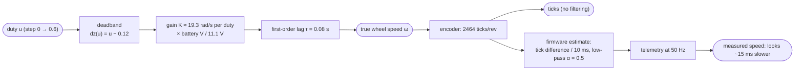
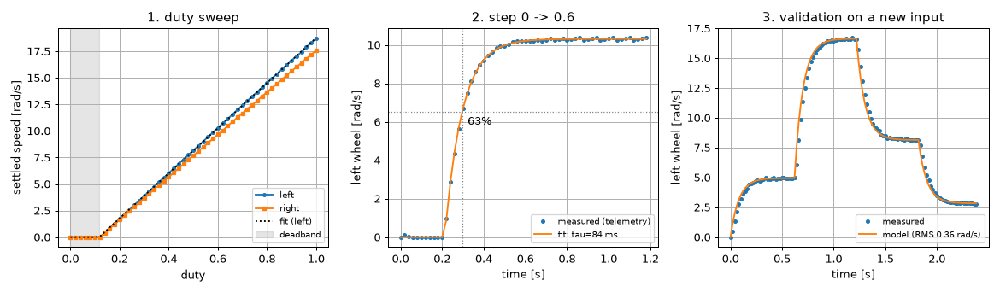

# 08.02 — Measuring a motor — step response, deadband and time constant

<!-- glance:start -->
<!-- generated by tools/build.py from curriculum/syllabus.yaml — edit the syllabus, not this block -->

| | |
|---|---|
| **Track** | Main path |
| **Difficulty** | Intermediate |
| **Time** | 1 h |
| **Hardware** | Stage 1 robot: Pi 5, Pico, encoder motors, driver, chassis, battery, distance sensors (stage 1) |
| **Software** | python, matplotlib |
| **Prerequisites** | [08.01 Open loop vs closed loop — why your robot doesn't drive straight](08.01-open-vs-closed-loop.md)<br>[03.07 Logging, telemetry and plotting what the robot did](../03-robot-software/03.07-logging-and-telemetry.md) |
| **Optional prerequisites** | [FCT.02 First- and second-order systems](../optional-foundations/control-theory/FCT.02-first-second-order-systems.md) |
| **Skip if** | You have measured and plotted a motor's step response and fitted a time constant. |

<!-- glance:end -->

## What you will learn

- Run a duty sweep and read off a motor's deadband and gain (rad/s per unit of duty) from the plot.
- Run a step test, log it, and measure the time constant three ways: the 63% rule, a least-squares fit on the speed, and a fit on the encoder ticks.
- Write the first-order motor model as one equation and simulate it in five lines of Python.
- Validate a model on data it was not fitted to, and say how good "good enough" is.
- Explain why the speed estimate makes the motor look slower than it is.

## Why it matters

Every controller you build next is tuned against a motor. If you don't know how the motor responds, gains are guesses: [08.04](08.04-proportional-control.md) predicts P control's steady-state error from the motor's gain and deadband; [08.09](08.09-feedforward-exact-speed.md) inverts exactly this model to drive at 0.5 m/s; the firmware's feedforward in [`velocity.py`](../labs/firmware/pico/velocity.py) uses `DUTY_DEADBAND` and `MAX_WHEEL_SPEED_RAD_S` that you measure today. The simulator you've been using ([06.02](../06-simulation/06.02-course-mini-simulator.md)) is also this model, so a good measurement makes your simulation match *your* robot.

Beyond karmel, "apply a step, log the response, fit a model" is the most common first move in all of control engineering: drones, ovens, servo arms, and cloud autoscalers are characterised this way.

<!-- prereqs:start -->
## Prerequisites

You need these first:

- [08.01 Open loop vs closed loop — why your robot doesn't drive straight](08.01-open-vs-closed-loop.md)
- [03.07 Logging, telemetry and plotting what the robot did](../03-robot-software/03.07-logging-and-telemetry.md)

### Optional prerequisite links

New to any of these? Take the foundation lesson first; skip it if you already know it.

- [FCT.02 First- and second-order systems](../optional-foundations/control-theory/FCT.02-first-second-order-systems.md)

Check your readiness: `python course.py why 08.02`
<!-- prereqs:end -->

## Concept

### Kick it and watch

You learn a system's personality by kicking it and watching what it does. Engineers call the kick a **step**: the input jumps from one constant value to another and stays there. For a motor: duty 0 for a moment, then duty 0.6 and hold.

What you see on karmel's wheel is the most common shape in nature. The speed rises quickly at first, then more and more slowly, and creeps up to a final value. A kettle heating up, a car accelerating to cruising speed on a flat road, a capacitor charging, and a queue draining all look like this. It's called a **first-order response**, and two numbers describe it completely:

- **how far it goes**: the final speed for that duty. Divided by the duty (above the deadband) that's the motor's **gain**.
- **how fast it gets there**: the **time constant** τ, the time to cover 63% of the way. After 3τ it's at 95%, after 5τ at 99%.

Why does it slow down as it approaches? The motor's torque comes from the difference between the applied voltage and the "back-EMF" the spinning motor generates itself. The faster it spins, the smaller the difference, the smaller the push. Like a web service whose autoscaler adds capacity in proportion to the remaining backlog: fast at first, slower as the backlog shrinks.

### The deadband

Below some duty the wheel doesn't turn at all. The driver's output is too weak to overcome static friction in the gearbox and brushes. Karmel's config says 0.12: anything from −0.12 to +0.12 is "off". Once moving, the motor usually keeps turning at a slightly lower duty than it needed to start (static friction is larger than sliding friction), so a sweep up and a sweep down disagree a little. A controller that doesn't know about the deadband wastes the first 12% of its output doing nothing — you'll see P control suffer from exactly that in 08.04.

### Your measurement has a personality too

You never see the true wheel speed, only the firmware's estimate from encoder ticks, which is filtered ([08.03](08.03-wheel-speed-estimation.md)) and arrives 50 times a second. A filter makes everything look a bit slower. If you fit a time constant to the *estimate*, you measure motor + sensor. That's fine for tuning (the controller also sees motor + sensor), but it's not the motor. The ticks themselves are not filtered, so fitting to the ticks gives the motor alone.

> [!TIP]
> **Ask your teacher:** "Why is a DC motor's speed response first-order? Explain back-EMF with an analogy, then with the equation, then connect it to τ = 0.08 s."

## Technical explanation

### Level 1 — The experiment protocol

1. **Wheels in the air** (the robot on a stand). This measures the motor + gearbox + wheel. On the floor the robot's mass adds inertia and friction, so τ gets longer and the top speed a little lower; karmel.yaml's numbers are "loaded". Measure both if you can (the practical challenge).
2. **Record the battery voltage.** Speed at a given duty scales with voltage. A number without a voltage is half a number.
3. **Duty sweep for the static curve.** Hold each duty long enough to settle (≥ 5τ ≈ 0.4 s; we use 0.6 s and average the last 0.2 s). Go up in small steps (0.02), and on the real robot also down, to see the start/stop difference.
4. **Step for the dynamics.** Start from rest, log a little before the step (so you know when it happened), jump to a mid-range duty (0.6: well above the deadband, well below saturation), log for ≥ 10τ.
5. **Validate on a different input.** A model fitted to one step can be wrong elsewhere. Drive a staircase it has never seen and compare.

### Level 2 — Reading the static curve

Above the deadband the settled speed is close to a straight line:

$$\omega_{ss} = K\,(u - u_{db}) \quad \text{for } u > u_{db}, \qquad 0 \text{ inside the deadband}$$

$K$ is the **slope** (rad/s per unit duty) and $u_{db}$ the deadband. Fit a line through the points where the wheel clearly moves; the deadband is where that line crosses zero speed.

**Numerical example (karmel.yaml).** Maximum speed 17.0 rad/s at duty 1.0, deadband 0.12, so $K = 17.0/(1 - 0.12) = 19.3$ rad/s per duty. Duty 0.6 should give $19.3 \times (0.6 - 0.12) = 9.27$ rad/s — **at the nominal 11.1 V**. With a battery at 12.0 V: $K \approx 19.3 \times 12.0/11.1 = 20.9$ and 0.6 gives 10.0 rad/s.

### Level 3 — The first-order model

The dynamics in one equation:

$$\tau\,\frac{d\omega}{dt} = -\omega + K\,\mathrm{dz}(u), \qquad \mathrm{dz}(u) = \mathrm{sign}(u)\,\max(|u| - u_{db},\,0)$$

The rate of change is proportional to how far the speed is from where it wants to be. For a step from rest to a constant $u$ at $t_0$ the solution is

$$\omega(t) = \omega_f \left(1 - e^{-(t - t_0)/\tau}\right), \qquad \omega_f = K\,\mathrm{dz}(u)$$

**Numerical example.** $\omega_f = 9.27$ rad/s, τ = 0.08 s. At $t_0 + 0.08$ s: $9.27 \times (1 - e^{-1}) = 9.27 \times 0.632 = 5.86$ rad/s. At $t_0 + 0.24$ s (3τ): 95.0% = 8.81 rad/s. At $t_0 + 0.40$ s (5τ): 99.3% = 9.21 rad/s.

Three ways to get τ from data:

- **The 63% rule.** Find the final value, find when the response crosses 63.2% of it, subtract the step time. One line of code, sensitive to noise and to a slow sample rate (interpolate between samples).
- **Least squares on the speed.** Let `scipy.optimize.curve_fit` choose $\omega_f$, τ and $t_0$ to minimise the squared error over every sample. Uses all the data. Letting $t_0$ float also reveals any **apparent delay**: the step went out at 0.20 s but the response behaves as if it started later.
- **Least squares on the ticks.** Integrate the model once: the wheel angle after the step is
  $$\theta(t) = \omega_f\left[(t - t_0) - \tau\left(1 - e^{-(t-t_0)/\tau}\right)\right]$$
  Fit that to `ticks × 2π / 2464`. The ticks are not filtered, so this measures the motor alone.

### Level 4 — Simulating the model you fitted

The same equation, stepped with the exact solution over each sample period $\Delta t$ (duty held constant during the period, as a real controller does):

$$\omega_{k} = \omega_{k-1} + \left(1 - e^{-\Delta t/\tau}\right)\left(K\,\mathrm{dz}(u_{k-1}) - \omega_{k-1}\right)$$

**Numerical example.** $\Delta t = 0.02$ s, τ = 0.08 s: $\alpha = 1 - e^{-0.25} = 0.221$. From rest at duty 0.6 ($K\,\mathrm{dz} = 9.27$): first sample $0.221 \times 9.27 = 2.05$ rad/s; second $2.05 + 0.221 \times (9.27 - 2.05) = 3.65$ rad/s.

This is exactly what `DiffDriveSim.step` does (see `first_order_alpha` in `labs/python/robotlab/sim/components.py`), and it's the form [08.07](08.07-pid-mathematics.md) and [FCT.02](../optional-foundations/control-theory/FCT.02-first-second-order-systems.md) analyse.

## Diagram

What happens between "duty 0.6" and the number you plot:



Reading a step response:

```text
 speed
  ω_f ┤                              ●●●●●●●●●●●●●●●●●   99.3 % at 5τ
      │                    ●●●●●●●●●●                     95.0 % at 3τ
      │             ●●●●●●
 0.63ω_f ┤ - - - - ●  ← 63.2 % at t0 + τ
      │        ●  :
      │      ●    :
      │    ●      :
    0 ┼●●●●───────┼──────────┼──────────┼──────────►  time
      0          t0+τ       t0+3τ      t0+5τ
          t0 = step
```

## Code

[`08-control/code/motor_step_response.py`](code/motor_step_response.py) runs the whole protocol: sweep, step, three fits, validation. The model and the fits are the heart of it:

```python
@dataclass(frozen=True)
class MotorModel:
    """First-order motor with a deadband:  tau * dw/dt = -w + slope * dz(u)."""

    slope_rad_s_per_duty: float
    deadband: float
    tau_s: float

    def steady_speed(self, duty: float) -> float:
        return math.copysign(max(abs(duty) - self.deadband, 0.0), duty) * self.slope_rad_s_per_duty

    def simulate(self, t: np.ndarray, duty: np.ndarray, w0: float = 0.0) -> np.ndarray:
        """Exact discretization per sample, duty held constant between samples (zero-order hold)."""
        w = np.empty_like(t)
        w[0] = w0
        for k in range(1, len(t)):
            a = 1.0 - math.exp(-(t[k] - t[k - 1]) / self.tau_s)
            w[k] = w[k - 1] + a * (self.steady_speed(duty[k - 1]) - w[k - 1])
        return w


def fit_static(duties: np.ndarray, speeds: np.ndarray, moving: float = 0.3) -> tuple[float, float]:
    """(deadband, slope): a straight line through the points where the wheel clearly moves."""
    mask = np.abs(speeds) > moving
    slope, intercept = np.polyfit(duties[mask], speeds[mask], 1)
    return -intercept / slope, slope  # the line crosses zero speed at duty = deadband


def step_model(t, w_final, tau, t0):
    return np.where(t < t0, 0.0, w_final * (1.0 - np.exp(-(t - t0) / tau)))


def angle_model(t, w_final, tau, t0):
    """Integral of step_model: wheel angle after the step."""
    s = np.maximum(t - t0, 0.0)
    return w_final * (s - tau * (1.0 - np.exp(-s / tau)))
```

and in `main()`:

```python
(w_fit, tau_fit, t0_fit), _ = curve_fit(step_model, t, w, p0=(w_final, 0.1, T_STEP))
angle = (step_log["left_ticks"] - step_log["left_ticks"][0]) * rad_per_tick
(wa_fit, taua_fit, t0a_fit), _ = curve_fit(angle_model, t, angle, p0=(w_final, 0.1, T_STEP))
```

Run it:

```bash
python 08-control/code/motor_step_response.py --plot step_response.png --csv step.csv
```

Output (simulator, realistic preset):

```text
battery during the test: 12.02 V

Part 1 - duty sweep (settled speed, rad/s)
  left : deadband 0.117 duty, slope 21.25 rad/s per duty, speed at duty 1.0 = 18.71 rad/s
  right: deadband 0.117 duty, slope 19.98 rad/s per duty, speed at duty 1.0 = 17.59 rad/s
  karmel.yaml says: deadband 0.12, max 17.0 rad/s -> slope 19.32

Part 2 - step 0 -> 0.6 duty (left wheel)
  final speed 10.31 rad/s
  a) 63% rule on the speed estimate : tau = 97 ms
  b) least squares on the estimate  : tau = 84 ms, apparent delay +13 ms
  c) least squares on the ticks     : tau = 80 ms, apparent delay -1 ms
  karmel.yaml motor_time_constant_s : 80 ms

Part 3 - model (slope 21.25, deadband 0.117, tau 80 ms) on a new staircase: RMS error 0.36 rad/s (2.1% of the top speed)
saved step_response.png
```



What the numbers say:

- **Slope 21.25, not 19.32.** The simulated battery is at 12.02 V, above the 11.1 V nominal: $19.32 \times 12.02/11.1 = 20.9$. The last 2% is the fit. The right wheel's slope is 6% lower (the weak motor from 08.01).
- **τ = 97 / 84 / 80 ms.** Only the tick fit recovers the motor's true 80 ms. The speed estimate adds its filter (≈ 10 ms) and the tick-difference half-period (5 ms): about 15 ms of lag, which the least-squares fit reports as a 13 ms apparent delay, and the 63% rule simply adds to τ.
- **Validation RMS 0.36 rad/s (2%).** A first-order model with a deadband describes this motor well. On a real robot, 5% is good; above 10%, look for what the model is missing (friction that changes with speed, a slipping wheel, a sagging battery during the test).

**On the robot**, the same command with `--port` works over 50 Hz telemetry with the wheels in the air. The CSV (`--csv`) holds every sample for your own plots, in the format from [03.07](../03-robot-software/03.07-logging-and-telemetry.md).

## Exercise

> [!CAUTION]
> **Safety:** The sweep runs each motor up to full duty (about 18 rad/s, 170 RPM) for several seconds. Robot on a stand, both wheels off the table, fingers, hair and cables away from the wheels, battery switch within reach. The script asks for confirmation; Ctrl-C stops the motors.

### Exercise 08.02-E1 — Predict a step response `[numerical]`

Hardware: none. A motor has $K = 20$ rad/s per duty, $u_{db} = 0.10$, τ = 0.12 s. You step from rest to duty 0.45. Compute: (a) the final speed, (b) the speed 0.12 s and 0.36 s after the step, (c) the first two samples of the discrete model with $\Delta t = 0.02$ s, (d) the duty needed for 5 rad/s.

### Exercise 08.02-E2 — Measure the simulated robot `[simulation]`

Hardware: none. Run the script on the realistic simulator. Then run it with `--ideal`. Record deadband, slope (left and right), and the three τ values for both. Which numbers change between the presets, and why?

### Exercise 08.02-E3 — Measure your robot `[hardware]`

Hardware: robot-base. Simulation alternative: `--fake`.
Robot on a stand. Charge the battery, then run

```bash
python 08-control/code/motor_step_response.py --port /dev/ttyACM0 --plot my_motor.png --csv my_step.csv
```

Write down the battery voltage, both deadbands, both slopes, τ from the ticks, and the validation RMS. Put your deadband, your top speed at the nominal 11.1 V (slope × (1 − deadband) × 11.1 / measured V) and your τ into `labs/config/karmel.yaml` (`duty_deadband`, `max_wheel_speed_rad_s`, `motor_time_constant_s`) and mirror the deadband and top speed in `labs/firmware/pico/config.py` (`DUTY_DEADBAND`, `MAX_WHEEL_SPEED_RAD_S`); `labs/python/tests/test_firmware_logic.py` checks that the two agree.

### Exercise 08.02-E4 — Up and down: hysteresis `[hardware]`

Hardware: robot-base. Simulation alternative: none (the simulator has no static friction — predict what you'd see instead).
Modify `sweep()` to go 0 → 1 and then 1 → 0 in 0.01 steps and plot both. At which duty does each wheel start moving, and at which does it stop?

### Exercise 08.02-E5 — Wrong τ on purpose `[debugging]`

Hardware: none. Two teammates get strange time constants on the simulator. Teammate A started logging 0.1 s *after* sending the step and uses the first logged sample as the step time. Teammate B stepped from duty 0.3 to 0.6 instead of from rest, but still fits `step_model` (which assumes a start from 0). For each, predict what the 63% rule and the least-squares fit (with $t_0$ free) report, then reproduce both in a copy of the script and fix them.

## Expected result

**08.02-E1:** (a) $20 \times (0.45 - 0.10) = $ **7.0 rad/s**. (b) at τ: $7.0 \times 0.632 = $ **4.42 rad/s**; at 3τ: $7.0 \times 0.950 = $ **6.65 rad/s**. (c) $\alpha = 1 - e^{-0.02/0.12} = 0.154$: $0.154 \times 7.0 = $ **1.07 rad/s**, then $1.07 + 0.154 \times (7.0 - 1.07) = $ **1.98 rad/s**. (d) $0.10 + 5/20 = $ **0.35**.

**08.02-E2:** Realistic: deadband ≈ 0.117, left slope ≈ 21.3, right ≈ 20.0, τ = 97 / 84 / 80 ms, validation RMS ≈ 0.36 rad/s. Ideal: deadband 0.120, τ = 96 / 84 / 80 ms (deadband, motor lag and the estimate's lag are physics, kept in both presets), but **both** slopes ≈ 21.9 — no 6% weaker right motor, and a slightly higher slope because the ideal battery has no internal resistance (12.24 V during the test instead of 12.02 V). Validation RMS ≈ 0.37 rad/s. The estimate-based τ are longer than the tick-based τ in both presets, because the measurement lag is the same.

**08.02-E3:** Typical karmel builds: deadband 0.08–0.20 per wheel, top speed at 11.1 V 15–21 rad/s (205 RPM motors), τ from ticks 50–150 ms with wheels in the air, left and right slopes differing by a few percent. τ from the 63% rule 10–30 ms longer than from ticks. Validation RMS below about 1 rad/s. If your numbers are far outside, go to Troubleshooting before editing the config.

**08.02-E4:** The start duty is higher than the stop duty by roughly 0.01–0.05 on most gearmotors (static friction), so the up and down curves separate near the bottom and coincide higher up. The simulator would show identical curves.

**08.02-E5:** Teammate A: the first logged sample is already 7.4 rad/s, above 63% of 10.3, so the **63% rule reports τ = 0**. Least squares with $t_0$ free still finds τ ≈ 78 ms by placing $t_0$ about 0.1 s *before* the log starts — it works only because the model can extrapolate; with $t_0$ fixed to the first sample it would be badly wrong. Teammate B: the response starts at about 5 rad/s, not 0, and the fit tries to explain the missing lower part with a slower curve: **τ ≈ 280 ms**, 3.5× too long, with $\omega_f$ ≈ 10.7. Fixes: always log at least 0.2 s before the step and record the step time from the command, not from the data; when starting from a non-zero speed, fit $\omega(t) = \omega_0 + (\omega_f - \omega_0)\left(1 - e^{-(t - t_0)/\tau}\right)$.

## Troubleshooting

### Symptom: the sweep shows zero speed for every duty on one wheel
1. Watch the wheel: does it turn? If yes, the encoder isn't counting — check the telemetry ticks while rolling it by hand ([01.09](../01-first-robot/01.09-reading-encoders.md)).
2. If it doesn't turn, check motor wiring and the driver with the motor test from [01.08](../01-first-robot/01.08-first-motor-spin.md).

### Symptom: the speed goes *negative* for positive duty
Motor or encoder polarity. Roll the wheel forward by hand: the ticks must go up. Then a small positive duty must turn it forward. Fix the `*_REVERSED` flags in `labs/firmware/pico/config.py`, not the fit.

### Symptom: the static curve is not a straight line
1. It bends down at high duty: the battery sags under load. Check `battery_v` in the CSV across the sweep; charge it or use a bench supply.
2. It's noisy and bumpy: the hold time is too short (not settled) or a wheel rubs the chassis. Increase `hold_s`, spin the wheels by hand to feel for rubbing.
3. It has a clear kink: some motor drivers change behaviour at low duty (current decay mode). Fit the upper part only.

### Symptom: `curve_fit` fails or gives τ of a few ms or several seconds
1. Plot the data first. Is there a clear step, starting from rest, settling within the logged time?
2. Check the initial guess `p0`: the final speed and τ ≈ 0.1 s are good starting points.
3. On the robot, check the telemetry is actually 50 Hz (`np.diff(log["t"])`): dropped lines leave gaps.

### Symptom: the model validates badly (RMS > 10%)
Compare where it fails: only at low duty → the deadband is wrong or hysteresis matters; only during fast changes → τ is wrong or there's delay; everywhere by a constant factor → the battery voltage during validation differs from during the fit.

## Common mistakes

- **Measuring with a half-empty battery and forgetting to note the voltage.** The slope scales with voltage; record it and normalise to 11.1 V.
- **Stepping into saturation.** A step to duty 1.0 hides the gain (you can't tell 18 from 25 rad/s if the motor is at its limit) and the deadband. Use a mid-range step.
- **Fitting τ to the filtered estimate and calling it the motor's τ.** Fit the ticks for the motor; know that the controller sees the extra ~15 ms.
- **Assuming wheels-in-the-air numbers hold on the floor.** Inertia and friction are larger on the ground: τ grows.
- **Validating on the fitting data.** Any fit looks good on its own data. Use a different input.
- **Updating karmel.yaml but not the firmware config.** The feedforward on the Pico reads its own copy.

## Knowledge check

1. A step response settles at 12 rad/s. At what speed do you read off τ?
   <details><summary>Answer</summary>

   63.2% of the final change: $0.632 \times 12 = 7.58$ rad/s. The time from the step to that crossing is τ.
   </details>

2. $K = 19.3$ rad/s per duty, deadband 0.12. What duty gives 6 rad/s, and what speed does duty 0.10 give?
   <details><summary>Answer</summary>

   $0.12 + 6/19.3 = 0.43$. Duty 0.10 is inside the deadband: 0 rad/s.
   </details>

3. With τ = 0.08 s, how long until a step response is within 1% of its final value?
   <details><summary>Answer</summary>

   $e^{-t/\tau} = 0.01 \Rightarrow t = \tau \ln 100 = 4.6\,\tau = 0.37$ s.
   </details>

4. Predict: the fit on the firmware's speed estimate gives τ = 97 ms, the fit on ticks 80 ms. Which one should you use to tune a speed controller that reads the estimate, and which one goes into the simulator?
   <details><summary>Answer</summary>

   The simulator models the motor and then its own estimate, so it needs the motor's 80 ms. The controller sees motor + measurement lag, so when you reason about what the controller "sees", remember the extra ~15 ms (or simply tune against the whole loop, as 08.04–08.08 do).
   </details>

5. Debugging: your static curve has slope 17 at 10.2 V. A teammate measured 21 at 12.5 V on the same robot. Is something broken?
   <details><summary>Answer</summary>

   Probably not. Normalised to 11.1 V: $17 \times 11.1/10.2 = 18.5$ and $21 \times 11.1/12.5 = 18.6$. Same motor, different battery.
   </details>

6. Why validate a model on a staircase instead of the step you fitted?
   <details><summary>Answer</summary>

   A fitted model always matches its own fitting data well. A different input tests whether the structure (first order + deadband + linear gain) is right across the operating range, not just whether the optimiser worked.
   </details>

7. The discrete model uses $\alpha = 1 - e^{-\Delta t/\tau}$. Compute α for Δt = 10 ms and τ = 80 ms, and say what it means physically.
   <details><summary>Answer</summary>

   $1 - e^{-0.125} = 0.118$: in each 10 ms period the speed covers 11.8% of the remaining distance to its target speed.
   </details>

## Practical challenge

Build a "motor ID card" for both of your robot's wheels: static curves up and down, deadband (start and stop), slope normalised to 11.1 V, τ in the air and τ on the floor (drive 1 m straight at duty 0.5 from rest, log, fit the ticks), and validation RMS on a staircase. Then configure the simulator with your numbers (`dataclasses.replace(DiffDriveParams.ideal(), motor_gain_right=..., motor_time_constant_s=..., duty_deadband=...)`) and run the same staircase in simulation.

**Acceptance criteria:** a one-page table + one figure per wheel; floor τ ≥ air τ; the simulator configured with your numbers reproduces your robot's staircase response with RMS error under 10% of the top speed; karmel.yaml and the firmware config updated and `pytest labs/python/tests/test_firmware_logic.py` passing.

## You can skip this if…

You answer questions 3, 4 and 5 correctly without looking and you have a fitted τ, deadband and gain for your own robot's motors with a validation plot.

`python course.py skip 08.02 --reason "I have measured my motors' step response and fitted a first-order model"`

## Go deeper

- Åström & Murray, *Feedback Systems* (2nd ed.), chapter 3 "System Modeling": https://www.cds.caltech.edu/~murray/FBS/System_Modeling.html — how to write and identify models like this one.
- SciPy `curve_fit` reference: https://docs.scipy.org/doc/scipy/reference/generated/scipy.optimize.curve_fit.html — parameters, initial guesses, the covariance output for uncertainty.
- Wikipedia, Time constant: https://en.wikipedia.org/wiki/Time_constant — the 63% and 5τ rules with derivations.
- Wikipedia, Step response: https://en.wikipedia.org/wiki/Step_response — rise time, settling time, overshoot vocabulary used from 08.04 on.
- [FCT.02 First- and second-order systems](../optional-foundations/control-theory/FCT.02-first-second-order-systems.md) — the theory behind this lesson, with damping ratio for later.

## Progress checkpoint

- [ ] I can run a duty sweep and read the deadband and gain from it.
- [ ] I measured τ with the 63% rule, a speed fit and a tick fit, and I know why they differ.
- [ ] I can write and simulate the first-order motor model.
- [ ] I validated the model on a different input and my karmel.yaml holds my robot's numbers.

`python course.py complete 08.02` (exercises done) · `python course.py master 08.02` (challenge done) · `python course.py struggle 08.02 "what was hard"`

Next: [08.03 — Estimating wheel speed from encoders — and filtering it](08.03-wheel-speed-estimation.md).
