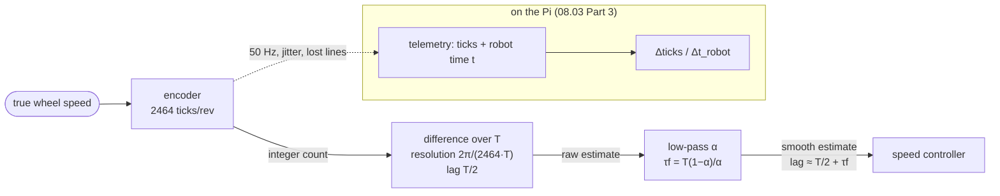

# 08.03 — Estimating wheel speed from encoders — and filtering it

<!-- glance:start -->
<!-- generated by tools/build.py from curriculum/syllabus.yaml — edit the syllabus, not this block -->

| | |
|---|---|
| **Track** | Main path |
| **Difficulty** | Intermediate |
| **Time** | 50 min |
| **Hardware** | Stage 1 robot: Pi 5, Pico, encoder motors, driver, chassis, battery, distance sensors (stage 1) |
| **Software** | python |
| **Prerequisites** | [08.02 Measuring a motor — step response, deadband and time constant](08.02-motor-step-response.md)<br>[07.02 Wheel encoders in depth — resolution, slip, velocity estimation](../07-sensors/07.02-wheel-encoders-in-depth.md) |
| **Optional prerequisites** | [FM.17 Calculus for robots: derivatives, rates and partial derivatives](../optional-foundations/mathematics/FM.17-derivatives.md) |
| **Skip if** | You produce a clean wheel-speed signal with known lag. |

<!-- glance:end -->

## What you will learn

- Turn cumulative encoder ticks into a wheel speed, and compute the resolution of that estimate for any sample period.
- Explain the central trade-off of every speed estimate: a short window is noisy, a long window is late.
- Implement a moving average and a first-order low-pass filter (exponential moving average), and compute the lag each one adds.
- Measure noise and lag of an estimate against ground truth in the simulator.
- Compute speed on the Pi from telemetry correctly: with the robot's timestamps, surviving jitter and lost lines.

## Why it matters

A speed controller can only be as good as its speed measurement. Every controller from [08.04](08.04-proportional-control.md) on reacts to `state.left_rad_s`; if that number is noisy, the motor jitters; if it is late, the loop oscillates. Choosing the estimator is choosing where your loop sits between those two failures.

Nothing measures wheel speed directly on karmel. The encoder counts ticks — positions. Speed is the *derivative* of position, and differentiating a measured signal is the classic way to turn small errors into big ones. The same problem appears everywhere in robotics: velocity from joint encoders on the arm ([module 14](../14-robotic-arm/14.01-arm-anatomy.md)), yaw rate from odometry, velocity from a camera tracker. And the Pi-side lesson here — use the sensor's timestamps, not your arrival clock — is exactly the one [07.10](../07-sensors/07.10-sensor-data-in-ros2.md) teaches for ROS messages.

<!-- prereqs:start -->
## Prerequisites

You need these first:

- [08.02 Measuring a motor — step response, deadband and time constant](08.02-motor-step-response.md)
- [07.02 Wheel encoders in depth — resolution, slip, velocity estimation](../07-sensors/07.02-wheel-encoders-in-depth.md)

### Optional prerequisite links

New to any of these? Take the foundation lesson first; skip it if you already know it.

- [FM.17 Calculus for robots: derivatives, rates and partial derivatives](../optional-foundations/mathematics/FM.17-derivatives.md)

Check your readiness: `python course.py why 08.03`
<!-- prereqs:end -->

## Concept

### Speed from a counter

Imagine counting cars passing your window to estimate traffic speed. Count for one second: you see 0, 1 or 2 cars, and your estimate jumps between "empty road" and "rush hour". Count for ten minutes: a smooth, accurate number — describing traffic from five minutes ago.

An encoder is that counter. Karmel's encoder gives 2464 ticks per wheel revolution. To estimate speed, count how many ticks arrived in a window of time $T$ and divide. Two things go wrong:

- **Quantization noise.** Ticks are whole numbers. At 8 rad/s a wheel produces 31.4 ticks per 10 ms, but you can only count 31 or 32. The estimate jumps between two values even though the wheel turns perfectly smoothly. The shorter the window, the bigger each jump.
- **Lag.** The count over the last $T$ seconds describes the *average* speed over that window, which is the speed at its middle: $T/2$ ago. The longer the window, the older the information.

### Smoothing costs time

To make the jumpy estimate smoother you average it. A **moving average** of the last $N$ estimates weighs them equally. A **first-order low-pass filter** (also called an exponential moving average, EMA) keeps one number and moves it a fraction α toward each new sample:

```text
filtered = filtered + alpha * (raw - filtered)
```

It's the same equation as a motor or a thermometer settling: a first-order system ([08.02](08.02-motor-step-response.md)) with its own time constant. That's the catch. Every filter that removes noise adds delay, and a controller acting on old information over-corrects. There is no free smoothing — only a trade-off you choose deliberately.

The firmware already does this: [`WheelSpeedEstimator`](../labs/firmware/pico/velocity.py) differentiates the ticks every 10 ms and low-pass filters with α = 0.5. That is the `left_rad_s` in every telemetry sample.

### Time is part of the measurement

Speed is ticks divided by *time*. If the time is wrong, the speed is wrong, and no filter fixes it. On the Pi, telemetry lines arrive over USB and through a Python thread: a sample generated exactly 20 ms after the previous one may *arrive* 17 or 24 ms later, and now and then a line is lost. Divide by the Pi's arrival interval and a perfect wheel looks jittery; divide by a constant 20 ms and a lost line doubles the speed. The Pico stamps every sample with its own clock (`BaseState.t`). Use that.

> [!TIP]
> **Ask your teacher:** "Why does differentiating a signal amplify noise? Show me with numbers: a position signal with ±0.5 tick of error, differentiated over 1 ms and over 50 ms."

## Technical explanation

### Level 1 — The raw estimate

$$\hat\omega_k = \frac{n_k - n_{k-1}}{N_{rev}} \cdot \frac{2\pi}{T}$$

with $n_k$ the cumulative tick count at sample $k$, $N_{rev} = 2464$ ticks per revolution, $T$ the time between samples. The smallest non-zero change of the estimate (**resolution**) is one tick:

$$\Delta\omega = \frac{2\pi}{N_{rev}\,T}$$

**Numerical example.**

| Sample period $T$ | resolution $2\pi/(2464\,T)$ | lag $T/2$ |
|---|---|---|
| 1 ms | 2.55 rad/s | 0.5 ms |
| 10 ms (the Pico) | 0.255 rad/s | 5 ms |
| 20 ms (Pi telemetry) | 0.127 rad/s | 10 ms |
| 50 ms | 0.051 rad/s | 25 ms |

At 8 rad/s, the 1 ms estimate can only say 7.65 or 10.2 rad/s: useless raw. The 50 ms estimate resolves 0.05 rad/s, but describes the wheel 25 ms ago.

### Level 2 — Smoothing filters and their lag

**Moving average of $N$ samples.** Output = mean of the last $N$ raw estimates. For random noise, the standard deviation drops by $\sqrt N$. Lag (the centre of the window): $(N-1)T/2$ on top of the raw estimate's $T/2$.

**Numerical example.** $T = 10$ ms, $N = 5$: noise ÷ 2.24; lag $4 \times 10/2 = 20$ ms, plus 5 ms = **25 ms**.

**First-order low-pass (EMA).**

$$y_k = y_{k-1} + \alpha\,(x_k - y_{k-1}), \qquad 0 < \alpha \le 1$$

It behaves like a first-order system with time constant

$$\tau_f = T\,\frac{1-\alpha}{\alpha}, \qquad \text{equivalently}\quad \alpha = \frac{T}{\tau_f + T}$$

For slowly changing signals its lag is about $\tau_f$. For white noise it reduces the standard deviation by $\sqrt{\alpha/(2-\alpha)}$.

**Numerical example (the firmware).** $T = 10$ ms, α = 0.5: $\tau_f = 10 \times 0.5/0.5 = 10$ ms; lag 10 + 5 = **15 ms**; white noise × $\sqrt{0.5/1.5} = 0.58$. With α = 0.2: $\tau_f = 40$ ms, lag **45 ms**, noise × 0.33.

The EMA needs one stored number and no buffer — that's why it runs on microcontrollers everywhere. A moving average has a sharp edge (a sample leaves the window all at once); the EMA forgets gradually.

### Level 3 — Why differentiation amplifies noise

If the position measurement has an error with standard deviation $\sigma_n$ (in ticks) independent from sample to sample, the difference of two samples has $\sqrt 2\,\sigma_n$, and dividing by $T$ scales it by $1/T$:

$$\sigma_\omega = \frac{\sqrt 2\,\sigma_n}{T}\cdot\frac{2\pi}{N_{rev}}$$

Halve $T$, double the noise. This is the core of the derivative trouble in [FM.17](../optional-foundations/mathematics/FM.17-derivatives.md) and of derivative control in [08.06](08.06-derivative-control.md): D is a derivative of a measurement that is itself already a derivative.

**Numerical example.** Quantization error of a single reading is uniform over one tick: $\sigma_n = 1/\sqrt{12} = 0.29$ tick. At $T = 1$ ms: $\sigma_\omega = 1.41 \times 0.29/0.001 \times 2\pi/2464 = 1.04$ rad/s. At 10 ms: 0.10 rad/s. (At a perfectly constant speed the errors are correlated and the real number is smaller, as you'll see.)

### Level 4 — The right $T$ on the Pi

Telemetry sample $k$ carries ticks $n_k$ and the Pico's timestamp $t_k$. The estimate is

$$\hat\omega_k = \frac{2\pi}{N_{rev}}\cdot\frac{n_k - n_{k-1}}{t_k - t_{k-1}}$$

using the *robot's* $t_k$. If line $k-1$ was lost, $t_k - t_{k-2} = 40$ ms and $n_k - n_{k-2}$ counts 40 ms of ticks: still correct. With a constant $T = 20$ ms the same situation doubles the estimate.

## Diagram

The estimation chain and where each lag comes from:



Quantization at a constant speed, 10 ms window:

```text
 true speed  8.0 rad/s  = 31.4 ticks per 10 ms
 ticks/window:   31   32   31   31   32   31   32   31   31   32
 estimate:     7.91 8.16 7.91 7.91 8.16 7.91 8.16 7.91 7.91 8.16   rad/s
                  └─ jumps by 0.255 rad/s; the average is right ─┘
```

## Code

[`08-control/code/wheel_speed_estimation.py`](code/wheel_speed_estimation.py). The three estimators:

```python
class DifferenceEstimator:
    """speed = (ticks - previous ticks) * 2*pi / ticks_per_rev / dt — the raw estimate."""

    def __init__(self, ticks_per_rev: int) -> None:
        self.rad_per_tick = TWO_PI / ticks_per_rev
        self._last: int | None = None

    def update(self, ticks: int, dt: float) -> float:
        if self._last is None:
            self._last = ticks
            return 0.0
        speed = (ticks - self._last) * self.rad_per_tick / dt
        self._last = ticks
        return speed


class MovingAverage:
    """Mean of the last ``n`` inputs. Lag = (n - 1) / 2 samples."""

    def __init__(self, n: int) -> None:
        self.window: deque[float] = deque(maxlen=n)

    def update(self, x: float) -> float:
        self.window.append(x)
        return sum(self.window) / len(self.window)


class LowPass:
    """First-order low-pass / exponential moving average, exactly like WheelSpeedEstimator in
    labs/firmware/pico/velocity.py:  y += alpha * (x - y).  Time constant tau = dt * (1 - alpha) / alpha."""

    def __init__(self, alpha: float) -> None:
        self.alpha = alpha
        self.y: float | None = None

    def update(self, x: float) -> float:
        self.y = x if self.y is None else self.y + self.alpha * (x - self.y)
        return self.y
```

The experiment drives the left wheel of the realistic simulator for 1.5 s at constant duty (to measure **noise** as the standard deviation between 1.0 and 1.5 s) and then with a 1 Hz speed wave between about 3 and 14 rad/s (to measure **lag** as the time shift that best aligns the estimate with the truth). It records the encoder every 1 ms, so every sample period can be tried on the same data, and the simulator's true wheel speed is the reference.

```bash
python 08-control/code/wheel_speed_estimation.py --plot speed_estimation.png
```

Output:

```text
Part 1 - raw tick-difference estimate vs sample period (left wheel)
   period  1 tick =   noise    lag  total rms
      1ms   2.550    1.034    0ms     1.010   rad/s
      2ms   1.275    0.628    1ms     0.514   rad/s
      5ms   0.510    0.087    3ms     0.215   rad/s
     10ms   0.255    0.060    5ms     0.159   rad/s
     20ms   0.127    0.046   10ms     0.250   rad/s
     50ms   0.051    0.025   25ms     0.610   rad/s

Part 2 - filtering the 10 ms raw estimate (what the Pico computes)
  filter             noise    lag  total rms
  none               0.060    5ms      0.159   rad/s
  MA 2               0.044   10ms      0.249   rad/s
  MA 5               0.025   25ms      0.606   rad/s
  MA 10              0.012   50ms      1.198   rad/s
  EMA alpha 0.5      0.033   15ms      0.365   rad/s
  EMA alpha 0.2      0.015   44ms      1.048   rad/s
  EMA alpha 0.05     0.021  146ms      3.028   rad/s

Part 3 - speed on the Pi from 50 Hz telemetry: 3 ms arrival jitter, 3% of lines lost
  dt = nominal 20 ms           rms error  1.67 rad/s, worst 13.79 rad/s
  dt from the Pi's clock       rms error  2.88 rad/s, worst 25.04 rad/s
  dt from the robot's stamps   rms error  0.05 rad/s, worst  0.11 rad/s
saved speed_estimation.png
```


How to read it:

- **Every lag in the table matches the formulas.** Raw: $T/2$ (5, 10, 25 ms). MA 5: $4 \times 5 + 5 = 25$ ms. EMA 0.5: $\tau_f + T/2 = 10 + 5 = 15$ ms. EMA 0.2: 40 + 5 = 45 ms (measured 44).
- **"Total rms" is what a controller suffers from.** On the speed wave it is minimised by the *raw 10 ms* estimate: here lag costs more than noise. At constant speed (the "noise" column) the heavy filters win. The right filter depends on how fast your signal changes, and wheel speeds change fast (τ = 80 ms).
- **EMA 0.05 is a trap:** its "noise" at constant speed is even higher than α = 0.2's, because 1.5 s isn't enough for a 190 ms filter to finish settling from the start. Heavy filters also recover slowly from every change.
- **Part 3:** the robot's timestamps give 0.05 rad/s error; the Pi's clock gives 2.9 rad/s with 25 rad/s spikes. The same ticks, a different clock.

**On the robot** (`--port`, wheels in the air) there's no ground truth. The script prints the firmware's estimate next to a raw 20 ms difference of the telemetry ticks (using the robot's timestamps) and an EMA of it, so you can see the firmware filter's effect and your own.

## Exercise

> [!CAUTION]
> **Safety:** The hardware exercises spin the wheels up to about 16 rad/s. Robot on a stand, wheels off the table, battery switch within reach.

### Exercise 08.03-E1 — Resolution and lag by hand `[numerical]`

Hardware: none. A different robot has 1440 ticks per wheel revolution and samples every 5 ms. Compute (a) the speed resolution, (b) the raw estimate's lag, (c) the EMA α that gives a filter time constant of 20 ms and its total lag, (d) the moving-average length with the same lag and its noise reduction factor compared with the EMA's.

### Exercise 08.03-E2 — Predict the table `[predict]`

Hardware: none. Before running: extend the script's Part 2 with `MovingAverage(3)` and `LowPass(0.33)`. Predict their lag in ms from the formulas and which of the two has the lower noise. Then run it.

### Exercise 08.03-E3 — Build a better estimator for slow speeds `[coding]`

Hardware: none. At 0.5 rad/s the wheel produces only 2 ticks per 10 ms, so the raw 10 ms estimate alternates between 0, 0.255 and 0.51 rad/s. Write `AdaptiveWindowEstimator(ticks_per_rev, min_ticks=20, max_window_s=0.1)`: keep a history of (time, ticks) and estimate the speed over the shortest window back in time that contains at least `min_ticks` ticks, capped at `max_window_s`. Test it against `DifferenceEstimator` on the simulator at duty 0.15 (just above the deadband) using `sim.wheel_rad_s[0]` as truth.

### Exercise 08.03-E4 — The clock bug `[debugging]`

Hardware: none. A teammate's Pi-side logger computes speed with `time.monotonic()` at the moment each `SerialBase.read()` returns and gets spikes to 25 rad/s while the wheel turns at 8. Using Part 3 of the script, explain the two separate causes of the spikes, and change their three lines so they use `BaseState.t`.

### Exercise 08.03-E5 — The firmware estimate vs your own `[hardware]`

Hardware: robot-base. Simulation alternative: `--fake`.
Run `python 08-control/code/wheel_speed_estimation.py --port /dev/ttyACM0` with the robot on a stand. Compare the three columns while the speed changes (0.24 s and during the wave). Which one leads, which lags? Then hold duty 0.5 for 5 seconds with your own script and compute the standard deviation of each column.

## Expected result

**08.03-E1:** (a) $2\pi/(1440 \times 0.005) = $ **0.873 rad/s**. (b) **2.5 ms**. (c) $\alpha = 5/(20 + 5) = $ **0.2**; lag ≈ 20 + 2.5 = **22.5 ms**. (d) $(N-1) \times 5/2 = 20 \Rightarrow N = 9$; MA reduces white noise by $1/\sqrt 9 = 0.33$, the EMA by $\sqrt{0.2/1.8} = 0.33$ — the same.

**08.03-E2:** MA 3: lag $2 \times 10/2 + 5 = $ **15 ms**. EMA 0.33: $\tau_f = 10 \times 0.67/0.33 = 20$ ms, lag ≈ **25 ms**. For white noise the EMA 0.33 reduces noise by $\sqrt{0.33/1.67} = 0.44$ and the MA 3 by $1/\sqrt 3 = 0.58$, so the EMA should be quieter and later. Measured: MA 3 noise **0.035** rad/s, lag **15 ms**; EMA 0.33 noise **0.023** rad/s, lag **25 ms** (and a total rms on the wave of 0.37 vs 0.61 rad/s — the later one loses).

**08.03-E3:** At duty 0.15 the realistic left wheel settles at about 0.65 rad/s; the raw 10 ms estimate only ever reads 0.51 or 0.77 rad/s, with a standard deviation of about 0.13 rad/s (20% of the speed). The adaptive estimator (window ≈ 0.08–0.1 s at this speed) stays within a few percent of the truth. At 8 rad/s it uses a window of about 7 ms and behaves like the raw estimator — short windows when there are many ticks, long when there are few.

**08.03-E4:** Cause 1: arrival jitter — the Pi's clock interval is 20 ms ± a few ms while the tick count covers exactly 20 ms of wheel motion, so the estimate has a ±15% random error per sample (worse when two lines arrive in one burst: a 2–5 ms interval gives 4–10× the speed). Cause 2: lost lines — the tick difference covers 40 ms. Fix: `dt = state.t - previous.t` with both taken from `BaseState`, and skip the update when `dt <= 0`. Part 3 shows the result: rms 2.88 → 0.05 rad/s.

**08.03-E5:** On a typical karmel the firmware estimate lags the raw 20 ms difference by roughly one telemetry sample during speed changes, and your EMA(0.3) lags more still. At constant duty 0.5, the raw 20 ms difference has a standard deviation of about 0.1–0.3 rad/s (encoder edge irregularities make it larger than in the simulator), the firmware estimate somewhat less, the EMA(0.3) least.

## Troubleshooting

### Symptom: the speed estimate is exactly 0 most of the time and spikes occasionally
Too few ticks per window: the wheel is slow or the window is too short. Check ticks per window = speed × $N_{rev}$ × $T$ / 2π. Below about 5, use a longer window, a 1/T (time-between-ticks) method, or the adaptive estimator from E3.

### Symptom: the estimate is roughly twice the real speed now and then
1. Lost telemetry lines with a fixed `dt`: log `np.diff(log["t"])` and look for 0.04 s gaps.
2. Two encoder counters read at different instants (ticks from one control step, time from another): compute `dt` from the same sample's stamp.
3. Encoder counted in x4 mode but `ticks_per_rev` configured for x1: then it's always 4×, not now and then.

### Symptom: the filtered speed looks great in the plot but the controller oscillates
You traded noise for lag. Measure the filter's lag (Part 2 method) and compare with the motor's τ. If the lag is more than about a quarter of τ, reduce the filtering or move it (08.06 filters only the D term).

### Symptom: the speed is negative when the wheel turns forward
Encoder polarity; fix it in the firmware configuration (`ENCODER_*_REVERSED`), verified by rolling the wheel by hand ([01.09](../01-first-robot/01.09-reading-encoders.md)).

### Symptom: noise is much larger on the robot than in the simulator
Expected to a degree. Real encoders have unevenly spaced edges, gear backlash and vibration. Measure it (E5). If it's larger than about 0.5 rad/s at 10 ms, check for a loose magnet disc, a noisy encoder supply (add a 100 nF capacitor at the encoder), or long unshielded encoder wires next to the motor wires.

## Common mistakes

- **Differentiating at the highest possible rate "for precision".** A 1 ms window gives 2.55 rad/s steps. The resolution is set by ticks per window, not by how often you look.
- **Filtering until the plot looks nice.** A smooth, 50 ms-late speed makes a worse controller than a slightly noisy, 5 ms-late one.
- **Using the Pi's clock or a constant dt for Pi-side derivatives.** Use the robot's timestamps.
- **Filtering twice without noticing.** The firmware estimate is already filtered; filtering it again on the Pi adds both lags.
- **Forgetting the start-up transient of an EMA.** A heavy filter starting from 0 takes several τf to catch up; initialise it with the first sample (as `LowPass` does).
- **Comparing filter noise at constant speed only.** Test with a changing signal too, or you'll pick the laggiest filter.

## Knowledge check

1. Karmel's encoder: what is the speed resolution with a 20 ms window?
   <details><summary>Answer</summary>

   $2\pi/(2464 \times 0.02) = 0.127$ rad/s.
   </details>

2. An EMA with α = 0.25 runs at 100 Hz. What is its time constant, and roughly how much lag does the whole estimate (difference + EMA) have?
   <details><summary>Answer</summary>

   $\tau_f = 10 \times 0.75/0.25 = 30$ ms; total ≈ 30 + 5 = 35 ms.
   </details>

3. Why does halving the sample period double the noise of a raw derivative?
   <details><summary>Answer</summary>

   The position error of each sample stays the same size, but it is divided by a period half as long: $\sigma_\omega = \sqrt2\,\sigma_n/T$.
   </details>

4. Predict: you replace the firmware's α = 0.5 with α = 0.1. What happens to the noise at constant speed, and what happens to a speed controller that was well tuned before?
   <details><summary>Answer</summary>

   Noise drops (white noise × 0.23 instead of × 0.58), but the lag grows from 15 ms to 95 ms. The controller now reacts to old information and will overshoot and possibly oscillate with the same gains.
   </details>

5. Debugging: a Pi-side speed estimate shows +100% spikes about every 30 samples at a steady speed. The Pi's CPU is busy with the camera. What's the likely cause and fix?
   <details><summary>Answer</summary>

   Lost or late-processed telemetry lines combined with a fixed `dt = 0.02`: the tick difference spans two samples. Use `dt = state.t - previous.t` from the robot's timestamps.
   </details>

6. A moving average of 8 samples and an EMA with the same lag: which removes more white noise?
   <details><summary>Answer</summary>

   MA 8 at period $T$: lag $3.5T$, noise × $1/\sqrt8 = 0.35$. An EMA with $\tau_f = 3.5T$ has $\alpha = 1/4.5 = 0.222$, noise × $\sqrt{0.222/1.778} = 0.35$. The same, to two decimals. (In general they're close; the EMA wins on memory and on having no sharp edge.)
   </details>

7. Why is the "total rms" of the raw 10 ms estimate lower than that of the 5-sample moving average in Part 2, even though its noise is higher?
   <details><summary>Answer</summary>

   The test signal changes quickly (1 Hz wave, ±5.7 rad/s). The moving average's extra 20 ms of lag creates a larger error during the changes than the noise it removes.
   </details>

## Practical challenge

Write `SpeedEstimator` for the Pi that takes `BaseState` samples and produces a speed per wheel with (1) correct `dt` from the robot's timestamps, (2) handling of lost samples, a Pico restart (time going backwards → reset) and an encoder reset (ticks jumping back to 0 → reset), and (3) a configurable EMA. Unit-test it with fabricated `BaseState` sequences for each of those cases, and run it on the simulator next to the firmware estimate.

**Acceptance criteria:** pytest tests for lost lines, time going backwards, tick reset and first sample all pass; on the realistic simulator with a 1 Hz speed wave, your estimate with α = 1 has an RMS error against `sim.wheel_rad_s` within 20% of the raw 20 ms numbers from Part 1; on your robot, a 10-second log at steady duty shows no spikes above 3× the standard deviation.

## You can skip this if…

You answer questions 2, 4 and 5 correctly without looking and can state, for your robot, the resolution and lag of the speed signal your controller uses.

`python course.py skip 08.03 --reason "I estimate speed from ticks with known resolution and lag"`

## Go deeper

- Wikipedia, Exponential smoothing: https://en.wikipedia.org/wiki/Exponential_smoothing — the EMA, its time constant, and its relation to the moving average.
- Wikipedia, Moving average: https://en.wikipedia.org/wiki/Moving_average — simple, weighted and exponential variants.
- Wikipedia, Quantization (signal processing): https://en.wikipedia.org/wiki/Quantization_%28signal_processing%29 — where the $1/\sqrt{12}$ comes from.
- [FM.17 Derivatives](../optional-foundations/mathematics/FM.17-derivatives.md) — numerical differentiation and its error behaviour.
- [FCT.05 Discrete time: sampling rates, delay and aliasing](../optional-foundations/control-theory/FCT.05-discrete-time-sampling.md) — how to choose sample rates for estimation and control.

## Progress checkpoint

- [ ] I compute the resolution and lag of a tick-difference estimate for any sample period.
- [ ] I implement a moving average and an EMA and know the lag each adds.
- [ ] I measured noise vs lag against ground truth and can pick a filter for a purpose.
- [ ] I compute speed on the Pi with the robot's timestamps and survive lost lines.

`python course.py complete 08.03` (exercises done) · `python course.py master 08.03` (challenge done) · `python course.py struggle 08.03 "what was hard"`

Next: [08.04 — Proportional control — hold a wheel speed](08.04-proportional-control.md).
