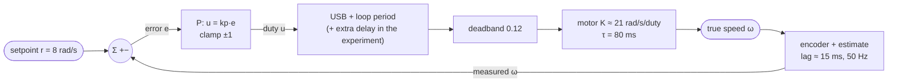
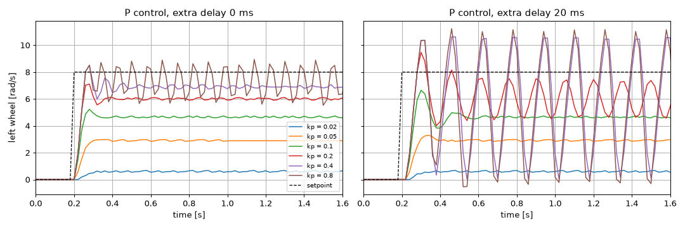

# 08.04 — Proportional control — hold a wheel speed

<!-- glance:start -->
<!-- generated by tools/build.py from curriculum/syllabus.yaml — edit the syllabus, not this block -->

| | |
|---|---|
| **Track** | Main path |
| **Difficulty** | Intermediate |
| **Time** | 1 h |
| **Hardware** | Stage 1 robot: Pi 5, Pico, encoder motors, driver, chassis, battery, distance sensors (stage 1) |
| **Software** | python |
| **Prerequisites** | [08.03 Estimating wheel speed from encoders — and filtering it](08.03-wheel-speed-estimation.md) |
| **Skip if** | You have seen P-only control leave steady-state error and oscillate at high gain. |

<!-- glance:end -->

## What you will learn

- Implement a proportional (P) speed controller and run it on the simulator and on the robot at a fixed rate.
- Observe steady-state error, and predict its size from the motor's gain and deadband before you run anything.
- Explain why raising the gain shrinks the error but never removes it.
- Find the gain at which the loop starts to oscillate, and show that delay lowers it dramatically.
- Read a speed plot and call it: sluggish, good, ringing or oscillating.

## Why it matters

The Pico firmware holds wheel speeds with a PID controller ([`velocity.py`](../labs/firmware/pico/velocity.py)); Nav2's controllers, the heading loop in [08.10](08.10-straight-line-heading-control.md), the arm's joint servos and your quadcopter all contain the same P term. It is the first thing you tune and the most common source of both "it never quite gets there" and "it shakes".

P control is also where the two basic failure modes of feedback show up in their cleanest form: too little gain leaves the robot short of its target; too much gain around a laggy loop makes it oscillate. Every later term (I in [08.05](08.05-integral-control.md), D in [08.06](08.06-derivative-control.md), feedforward in [08.09](08.09-feedforward-exact-speed.md)) exists to escape one of those two.

<!-- prereqs:start -->
## Prerequisites

You need these first:

- [08.03 Estimating wheel speed from encoders — and filtering it](08.03-wheel-speed-estimation.md)

### Optional prerequisite links

None.

Check your readiness: `python course.py why 08.04`
<!-- prereqs:end -->

## Concept

### Push in proportion to how wrong you are

You are holding a shopping trolley at walking pace. It slows down: you push a bit harder. It's much too slow: you push much harder. Too fast: you pull back. The size of your correction is **proportional** to the error. That's the whole P controller:

```text
duty = kp * (setpoint - measured_speed)
```

`kp` (the **proportional gain**) says how many units of duty you apply per rad/s of error. With `kp = 0.1`, an error of 3 rad/s gives duty 0.3.

### The catch: P needs an error to push at all

Look at what happens when the wheel reaches the setpoint: error 0, duty 0, the motor coasts and slows down. So the wheel can't *stay* at the setpoint. It settles where the error is just big enough that `kp × error` produces the duty needed to keep that speed. That leftover gap is the **steady-state error**. On karmel it's worse than usual, because the first 12% of duty (the deadband) does nothing, so P has to produce that from error too.

Raise `kp` and a smaller error produces the needed duty: the gap shrinks. But it never reaches zero, because at zero error P produces nothing.

### The other catch: reacting to old news

Why not set `kp` enormous? Because the controller always reacts to a measurement that is a little old: the speed estimate lags about 15 ms ([08.03](08.03-wheel-speed-estimation.md)), the loop only runs every 20 ms, the motor needs 80 ms to respond ([08.02](08.02-motor-step-response.md)). A timid controller doesn't care. An aggressive one sees "too slow!", slams the duty up, and by the time the measurement shows the wheel speeding up, it has already overshot. It slams the duty down, overshoots the other way, and the wheel **oscillates**.

It's the shower with a long pipe: the water's too cold, you turn it hot, nothing happens, you turn it hotter, it arrives scalding, you turn it cold... A patient hand (low gain) or a short pipe (less delay) fixes it. Add delay and the oscillation starts at a *lower* gain.

> [!TIP]
> **Ask your teacher:** "Walk me through three loop periods of a P controller with too much gain and a one-period delay, with numbers, so I can see the overshoot build up."

## Technical explanation

### Level 1 — The experiment

For each gain `kp ∈ {0.02, 0.05, 0.1, 0.2, 0.4, 0.8}`: left wheel from rest, setpoint 8 rad/s at t = 0.2 s, 3 s at 50 Hz on the Pi, realistic simulator. Once as is, once with one extra loop period (20 ms) of delay between computing a command and the motor receiving it. For each run record the settled speed (mean of the last second), the peak, and the **wobble** (standard deviation over the last second: about 0.05 rad/s is just quantization, above 0.5 is an oscillation).

### Level 2 — What you see

The results table and plot are in the Code section. The pattern:

- **Small kp (0.02):** the wheel barely moves. `0.02 × 8 = 0.16` duty is just above the deadband.
- **kp 0.05 → 0.4:** faster rise, higher settled speed, still clearly below 8.
- **kp 0.8, no extra delay:** the settled average is close to 7.3 but the speed jitters by ±1 rad/s — the start of an oscillation.
- **With 20 ms extra delay:** kp 0.2 already oscillates, kp 0.4 swings between 0 and 11 rad/s.

### Level 3 — Predicting the steady-state error

In steady state the speed is constant, so the motor model from 08.02 holds with no dynamics:

$$\omega = K\,(u - u_{db}), \qquad u = k_p\,(r - \omega)$$

Substitute and solve for $\omega$:

$$\omega = \frac{K\,(k_p r - u_{db})}{1 + k_p K}, \qquad e_{ss} = r - \omega$$

(valid when $k_p r > u_{db}$, otherwise the wheel never starts, and capped at the speed for duty 1.0). The product $L = k_p K$ is the **loop gain**. Without a deadband this is the classic $\omega = r\,L/(1+L)$ from [FCT.01](../optional-foundations/control-theory/FCT.01-systems-signals-feedback.md).

**Numerical example.** The simulated battery sits at 12.07 V, so $K = 19.32 \times 12.07/11.1 = 21.0$ rad/s per duty. With $k_p = 0.1$, $r = 8$, $u_{db} = 0.12$:

$$L = 2.1, \qquad \omega = \frac{21.0 \times (0.8 - 0.12)}{1 + 2.1} = \frac{14.28}{3.1} = 4.61 \text{ rad/s}$$

The simulator settles at 4.65. The error is 3.35 rad/s — **42%**. Without the deadband it would be $8/3.1 = 2.58$ rad/s; the deadband costs another 0.8 rad/s.

To get the error down to 10% (7.2 rad/s) you'd need

$$k_p = \frac{\omega + K u_{db}}{K\,(r - \omega)} = \frac{7.2 + 2.52}{21 \times 0.8} = 0.58$$

which is exactly where the loop starts to oscillate (see E4). P alone can't give you accuracy and calm at the same time on this robot.

### Level 4 — Why delay causes oscillation, informally

Think of one loop period with a large gain and one period of delay. The wheel is 1 rad/s slow. With $k_p = 0.8$ the controller adds 0.8 duty, which in steady state would mean $+0.8 \times 21 = +17$ rad/s. The motor starts moving toward that; one period (20 ms) later it has covered $1 - e^{-0.02/0.08} = 22\%$ of the way: +3.7 rad/s. But the controller is still looking at the *old* measurement (still 1 rad/s slow) and pushes again. By the time it sees the result, the wheel is several rad/s too fast. Each correction is bigger than the error it corrects: the swing grows until the duty hits its ±1 limits, and the loop settles into a steady oscillation.

The rule of thumb that falls out: the more delay (in units of the plant's time constant), the lower the gain at which each correction "overshoots its own error". [08.07](08.07-pid-mathematics.md) turns this into poles and stability margins, and [FCT.04](../optional-foundations/control-theory/FCT.04-stability-intuition.md) explains phase lag.

The experiment in E4 measures the boundary on the simulator: about **kp ≈ 0.6** with no extra delay, **0.15–0.2** with 20 ms, **0.1–0.15** with 40 ms. Forty milliseconds of delay — a busy Pi, a Wi-Fi hop — cut the usable gain by a factor of five.

## Diagram

The P speed loop running on the Pi, with every source of lag marked:



What the speed looks like for each regime:

```text
 speed           gain too low          about right           too high (with delay)
   8 ┤- - - - - - - - - - - - - -  - - - - - - - - - - - -   - - -╱╲- - -╱╲- - -╱╲- -
     │                              ╭──────────────────       ╱  ╲  ╱  ╲  ╱  ╲
   5 ┤        ╭────────────────    ╱                        ╱    ╲╱    ╲╱
     │       ╱                    ╱                        ╱
   0 ┼──────╯                ────╯                    ────╯
         big steady-state         smaller error,          oscillates around a
         error, calm              small overshoot         lower average
```

## Code

### The controller (auto-graded exercise)

You implement it in [`labs/exercises/08.04/student.py`](../labs/exercises/08.04/student.py): a `PController` class and the `steady_state_speed` prediction from Level 3. The class is short on purpose; everything interesting is in how it behaves in the loop. The reference is in `solution.py` (try first):

```python
class PController:
    """u = kp * (setpoint - measured), clamped to [-output_limit, +output_limit]."""

    def __init__(self, kp: float, output_limit: float = 1.0) -> None:
        self.kp = kp
        self.output_limit = output_limit
        self.error = 0.0
        self.output = 0.0

    def update(self, setpoint: float, measured: float, dt: float) -> float:
        self.error = setpoint - measured
        u = self.kp * self.error
        self.output = max(-self.output_limit, min(self.output_limit, u))
        return self.output
```

`dt` is unused by P, but every controller in this module has the same `update(setpoint, measured, dt)` signature — the same one the firmware's `PID.update` uses — so they're interchangeable in the loop.

Check it: `python course.py check 08.04`

### The experiment

[`08-control/code/p_control.py`](code/p_control.py) runs your controller (or `--solution`) through the lab loop from 08.01:

```python
def step_run(base, ex, kp: float, delay_steps: int):
    controller = ex.PController(kp)

    def step(t, dt, state, extra):
        setpoint = SETPOINT if t >= T_STEP - 1e-9 else 0.0
        extra["setpoint"] = setpoint
        return controller.update(setpoint, state.left_rad_s, dt), 0.0

    log = run_loop(base, step, SECONDS, delay_steps=delay_steps)
    ...
```

```bash
python 08-control/code/p_control.py --solution --plot p_control.png
```

Output (realistic simulator):

```text
extra delay: 0 ms
     kp loop gain  settled predicted  error   peak  wobble
   0.02      0.43     0.61      0.61   7.39   0.67    0.05
   0.05      1.08     2.90      2.91   5.10   3.02    0.03
   0.10      2.17     4.65      4.65   3.35   5.23    0.05
   0.20      4.33     6.01      6.01   1.99   7.11    0.07
   0.40      8.65     6.91      6.90   1.09   8.51    0.10
   0.80     17.27     7.32      7.42   0.68   8.95    1.10  OSCILLATES

extra delay: 20 ms
     kp loop gain  settled predicted  error   peak  wobble
   0.02      0.43     0.60      0.61   7.40   0.67    0.05
   0.05      1.08     2.92      2.91   5.08   3.30    0.05
   0.10      2.17     4.65      4.65   3.35   6.65    0.05
   0.20      4.33     6.01      6.01   1.99   9.47    1.00  OSCILLATES
   0.40      8.62     5.60      6.90   2.40  10.62    3.70  OSCILLATES
   0.80     17.22     5.42      7.42   2.58  11.24    3.96  OSCILLATES

wobble = std of the speed over the last second (rad/s). predicted = steady_state_speed() (meaningless once it oscillates)
saved p_control.png
```



Things to notice:

- **The prediction is right to 0.05 rad/s** whenever the loop is calm. The steady-state error is not a mystery; it's arithmetic.
- **Delay doesn't change the steady state of a calm loop** (kp 0.1: 4.65 both times), only the transient: peak 5.23 → 6.65.
- **Once it oscillates, the average drops** below the prediction, because the duty clips at 0 and 1 unevenly.

**On the robot:** `python 08-control/code/p_control.py --port /dev/ttyACM0 --kp 0.05 0.1 0.2` (wheels in the air). The real loop already has a few ms more delay than the simulator (USB, the Pi's scheduling), so expect more overshoot than the "0 ms" table. Through `--fake`, which adds the real serial stack, kp 0.1 already peaks at about 5.75 rad/s instead of 5.23.

## Exercise

> [!CAUTION]
> **Safety:** High-gain runs make the motors reverse direction several times a second at full duty. That's harmless with the wheels in the air, but it's loud, stresses the gearbox, and will throw the robot off a low stand if a wheel touches the table. Robot on a stable stand, wheels clear, never run gains above 0.3 on the floor, battery switch within reach.

### Exercise 08.04-E1 — Predict steady states `[numerical]`

Hardware: none. $K = 19.3$ rad/s per duty (nominal battery), $u_{db} = 0.12$, setpoint 10 rad/s. Compute the settled speed and the error in % for $k_p$ = 0.05, 0.1, 0.3. What's the smallest $k_p$ at which the wheel moves at all? What $k_p$ gives a 5% error?

### Exercise 08.04-E2 — Implement the P controller `[coding]`

Hardware: none. Implement `steady_state_speed`, `PController.update` and `PController.reset` in `labs/exercises/08.04/student.py`.

Check it: `python course.py check 08.04`

Then run `python 08-control/code/p_control.py --plot p_control.png` (without `--solution`) and compare your table with the lesson's.

### Exercise 08.04-E3 — Predict, then run: right wheel and a tired battery `[predict]`

Hardware: none. Before running: (a) with $k_p = 0.1$, will the *right* wheel (6% weaker motor) settle higher, lower or equal to the left, and by how much? (b) With the battery at 10.5 V instead of 12.07 V? Write numbers. Then modify `step_run` to control the right wheel (return `0.0, controller.update(setpoint, state.right_rad_s, dt)`) and set `battery_initial_soc` low with `dataclasses.replace` on `base.sim.params` (as `open_vs_closed_loop.py` does) to check.

### Exercise 08.04-E4 — Find the oscillation boundary `[simulation]`

Hardware: none. Write a loop around `step_run` that finds, for extra delays of 0, 1 and 2 loop periods, the smallest `kp` (in steps of 0.05) with wobble > 0.5 rad/s. Plot boundary gain vs delay in ms.

### Exercise 08.04-E5 — Your robot `[hardware]`

Hardware: robot-base. Simulation alternative: `--fake`.
Robot on a stand: `python 08-control/code/p_control.py --port /dev/ttyACM0 --kp 0.05 0.1 0.2 0.3 --delays 0 --plot my_p.png`. Compare the settled speeds with `steady_state_speed` using *your* slope and deadband from 08.02 and the battery voltage in the log. Find the gain where your robot's wheel starts to oscillate.

## Expected result

**08.04-E1:** $\omega = 19.3(10 k_p - 0.12)/(1 + 19.3 k_p)$. kp 0.05: $19.3 \times 0.38/1.965 = $ **3.73 rad/s** (error 63%). kp 0.1: $19.3 \times 0.88/2.93 = $ **5.80 rad/s** (42%). kp 0.3: $19.3 \times 2.88/6.79 = $ **8.19 rad/s** (18%). The wheel moves only if $10 k_p > 0.12$: **kp > 0.012**. For 5% error ($\omega = 9.5$): $k_p = (9.5 + 19.3 \times 0.12)/(19.3 \times 0.5) = $ **1.22** — far into oscillation.

**08.04-E2:** All 14 tests pass in about a second. Your `p_control.py` table matches the lesson's to the printed digits (same seed, same simulator).

**08.04-E3:** (a) Lower: the right motor's $K$ is 6% smaller (19.7), giving $19.7 \times 0.68/2.97 = 4.51$ vs 4.61 rad/s predicted — about **0.1 rad/s lower** (the simulator shows about 4.56 vs 4.65). A P loop reduces the effect of the weaker motor from 6% to about 2%: feedback at work. (b) At 10.5 V, $K = 18.3$: $\omega = 18.3 \times 0.68/2.83 = $ **4.40 rad/s**, only 5% below 4.61 even though the battery dropped 13%.

**08.04-E4:** Boundary gains on the realistic simulator: **0.60** (no extra delay), **0.20** (20 ms), **0.15** (40 ms). The curve falls steeply at first: the first 20 ms of delay costs the most.

**08.04-E5:** Settled speeds within about ±0.3 rad/s of your prediction for calm gains (a larger gap means the slope or deadband from 08.02 was measured at a different battery voltage). Most karmel builds start to oscillate somewhere between kp 0.2 and 0.5 with the wheels in the air — lower than the simulator's 0.6, because the real loop has more delay.

## Troubleshooting

### Symptom: the wheel doesn't move at all
1. `kp × setpoint` below the deadband? With kp 0.02 and 5 rad/s you send 0.10 duty. Raise kp or the setpoint.
2. Is the loop sending commands? A step function that raises an exception stops the loop; `run_loop` stops the motors and re-raises — read the traceback.

### Symptom: the wheel goes to full speed backwards
Sign error: check `error = setpoint - measured`, then check that a positive duty gives a positive measured speed (08.01 Troubleshooting). Don't "fix" it by using a negative kp.

### Symptom: the settled speed is far from `steady_state_speed`
1. Is the loop calm (wobble < 0.2)? The formula only applies without oscillation.
2. Right slope? It scales with battery voltage. Recompute with the logged `battery_v`.
3. Right wheel? The right motor has a different slope on the realistic robot and on yours.
4. On the robot: deadband and slope measured at a different temperature or battery (08.02).

### Symptom: it oscillates at a gain that was fine yesterday
Something added delay or gain: a heavier filter, the loop now running at a lower rate (Pi overloaded — log `np.diff(log["t"])`), a fresh battery (higher $K$ = higher loop gain), or a different wheel load. Halve the gain first, then look for what changed.

### Symptom: the speed jitters by one quantization step even at low gain
That's the estimate's resolution (0.127–0.255 rad/s, 08.03), multiplied by kp into duty. Harmless. It becomes a problem only at high kp.

## Common mistakes

- **Raising kp to kill the steady-state error.** It shrinks the error and eats your stability margin. Use integral action (08.05) or feedforward (08.09) instead.
- **Tuning with the wheels in the air and trusting the gains on the floor.** Load changes the motor's τ and friction; re-check on the floor at low gain.
- **Forgetting the output clamp.** Sending duty 2.8 to a driver that accepts ±1 hides how saturated the controller is; clamp it and log it.
- **Judging a loop by its average speed.** An oscillating wheel can average 7 rad/s. Always look at the wobble or the plot.
- **Ignoring loop timing.** A controller tuned at 50 Hz behaves differently at 30 Hz. Log the actual `dt`.
- **Comparing runs with different battery levels.** The loop gain moves with voltage.

## Knowledge check

1. kp = 0.2, error = 2.5 rad/s. What duty does P send, and what if the error is 8 rad/s?
   <details><summary>Answer</summary>

   0.5; and $0.2 \times 8 = 1.6$, clamped to 1.0.
   </details>

2. Without a deadband and with $K = 20$, what fraction of the setpoint does a P loop reach with kp = 0.15?
   <details><summary>Answer</summary>

   $L = 3$, $\omega/r = 3/4 = 75\%$.
   </details>

3. Why can't a P controller hold the setpoint exactly on a motor that needs a non-zero duty to keep spinning?
   <details><summary>Answer</summary>

   P's output is proportional to the error. Zero error means zero duty, and zero duty means the wheel slows down. The loop settles where the error produces exactly the needed duty.
   </details>

4. Predict: you move the P loop from the Pico (100 Hz, ~15 ms lag) to a laptop over Wi-Fi (~60 ms extra round-trip delay) with the same kp = 0.3. What happens?
   <details><summary>Answer</summary>

   The steady-state error stays the same in theory, but the loop will almost certainly oscillate: on the simulator, 40 ms of extra delay already makes kp 0.15 oscillate.
   </details>

5. Debugging: a teammate's P loop settles at 4.6 rad/s instead of 8 and they want to double kp. What do you tell them first?
   <details><summary>Answer</summary>

   Nothing is broken: that's P's steady-state error (predictable: 4.61 for kp 0.1). Doubling kp gives about 6.0 and less margin against oscillation. For zero error add integral action (08.05) or feedforward (08.09).
   </details>

6. The battery drops from 12.1 V to 10.5 V. Does a calm P loop get closer to or farther from oscillating?
   <details><summary>Answer</summary>

   Farther: the motor gain $K$ drops with voltage, so the loop gain $k_p K$ drops. (The steady-state error grows.)
   </details>

7. Compute the loop gain for kp = 0.4 on the simulated left wheel ($K$ = 21.6 at the start of the run) and the predicted settled speed at 8 rad/s.
   <details><summary>Answer</summary>

   $L = 8.65$; $\omega = 21.6 \times (3.2 - 0.12)/9.65 = 6.9$ rad/s. The simulator: 6.91.
   </details>

## Practical challenge

Make a "gain–delay map" for your robot: for kp from 0.05 to 0.5 (step 0.05) and extra delays 0, 1, 2, 3 loop periods, run the step test with wheels in the air and classify every run as calm (wobble < 0.2), ringing (overshoot > 20% but settles) or oscillating (wobble > 0.5). Do the same on the simulator configured with your 08.02 motor numbers.

**Acceptance criteria:** two colour-coded grids (robot and simulator) in one figure; the robot's boundary within about one grid step (0.05 kp) of the simulator's at extra delays ≥ 1, or a written, measured explanation of why not (e.g. the robot's own delay estimated by shifting the simulator's delay until the grids match); a chosen kp for 08.05 with its predicted steady-state error.

## You can skip this if…

You answer questions 3, 4 and 7 correctly without looking, and you have seen (in a plot you made) a P loop leave steady-state error and a P loop oscillate at high gain.

`python course.py skip 08.04 --reason "I have seen P-only steady-state error and high-gain oscillation"`

## Go deeper

- MATLAB Tech Talks, Understanding PID Control (Brian Douglas): https://www.mathworks.com/videos/series/understanding-pid-control.html — part 2 is a visual explanation of the P term and steady-state error.
- Åström & Murray, *Feedback Systems* (2nd ed.), chapter 11 "PID Control": https://www.cds.caltech.edu/~murray/FBS/PID_Control.html — the P term, steady-state error, and practical implementation.
- Brian Douglas, Control System Lectures: https://www.youtube.com/playlist?list=PLUMWjy5jgHK1NC52DXXrriwihVrYZKqjk — when you want the root-locus picture of "more gain → oscillation".
- [FCT.04 Stability: poles without the pain](../optional-foundations/control-theory/FCT.04-stability-intuition.md) — why delay destabilises, with phase lag.

## Progress checkpoint

- [ ] I implemented a P controller that passes `python course.py check 08.04`.
- [ ] I predict a P loop's steady-state error from kp, the motor gain and the deadband.
- [ ] I have a plot showing that more gain means less error and less margin.
- [ ] I measured how delay lowers the gain at which the loop oscillates.

`python course.py complete 08.04` (exercises done) · `python course.py master 08.04` (challenge done) · `python course.py struggle 08.04 "what was hard"`

Next: [08.05 — Integral control — killing steady-state error (and integral windup)](08.05-integral-control.md).
