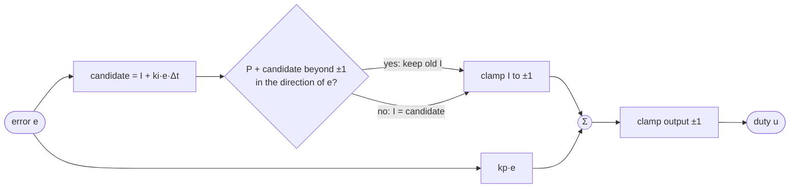

# 08.05 — Integral control — killing steady-state error (and integral windup)

<!-- glance:start -->
<!-- generated by tools/build.py from curriculum/syllabus.yaml — edit the syllabus, not this block -->

| | |
|---|---|
| **Track** | Main path |
| **Difficulty** | Intermediate |
| **Time** | 1 h |
| **Hardware** | Stage 1 robot: Pi 5, Pico, encoder motors, driver, chassis, battery, distance sensors (stage 1) |
| **Software** | python |
| **Prerequisites** | [08.04 Proportional control — hold a wheel speed](08.04-proportional-control.md) |
| **Optional prerequisites** | [FM.18 Integrals and numerical integration (how simulators move time forward)](../optional-foundations/mathematics/FM.18-integrals-numerical-integration.md) |
| **Skip if** | You implement anti-windup by reflex. |

<!-- glance:end -->

## What you will learn

- Add an integral term to your P controller and watch the steady-state error disappear.
- Explain why the integral reaches exactly the duty the motor needs, and what too much integral gain does.
- Reproduce integral windup on purpose — an unreachable setpoint, a robot pushing a wall — and measure the damage.
- Implement anti-windup by reflex: conditional integration plus clamping, in the same form as the Pico firmware.
- Know when to reset an integrator (mode changes, stops, watchdog trips).

## Why it matters

[08.04](08.04-proportional-control.md) ended with a P loop that held 4.65 rad/s when you asked for 8, and oscillated when you pushed the gain to fix that. Integral action is how practically every real controller escapes this: the Pico's wheel loop ([`velocity.py`](../labs/firmware/pico/velocity.py), `ki = 0.3`), `diff_drive_controller` setups with PID-controlled hardware, drone attitude loops and every thermostat that actually reaches the set temperature.

Integral action also brings the most common PID bug in production robots: **windup**. A robot that bumped into a table leg, sat against it for three seconds, and then shoots off at full speed when released, or refuses to back away — that is an integrator that kept accumulating while the motors could do nothing. You'll build the protection now, so that it's in every loop you write from here on.

<!-- prereqs:start -->
## Prerequisites

You need these first:

- [08.04 Proportional control — hold a wheel speed](08.04-proportional-control.md)

### Optional prerequisite links

New to any of these? Take the foundation lesson first; skip it if you already know it.

- [FM.18 Integrals and numerical integration (how simulators move time forward)](../optional-foundations/mathematics/FM.18-integrals-numerical-integration.md)

Check your readiness: `python course.py why 08.05`
<!-- prereqs:end -->

## Concept

### A controller with a memory

P reacts to how wrong you are *now*. The **integral** term reacts to how wrong you've been *all along*: it adds up the error over time and pushes in proportion to that sum.

Picture holding a bucket under a tap that you can't see, trying to keep the water at a line. P says "the water is 2 cm low, open the tap a bit". But the bucket has a leak, so you settle a little below the line: P needs that gap to keep the tap open. Integral says "we've been low for ten seconds, open it a bit more — and keep opening while we're still low". It only stops changing when the error is exactly zero. At that point P contributes nothing and the integral alone holds the tap exactly as open as the leak requires.

That's the key idea: **the integral learns the command the system needs**. For karmel at 8 rad/s that's a duty of about 0.50, including the 0.12 of deadband.

### Too much memory

A large integral gain learns fast but also keeps pushing after the error has changed sign, because the accumulated sum takes time to unwind. The speed overshoots, the integral unwinds past the right value, the speed undershoots... The same oscillation as high P gain, but slower and more rolling.

### Windup: memory full of garbage

Integrating is only sensible while the controller's output actually changes something. Suppose you ask karmel's wheel for 25 rad/s. The motor tops out at about 19. The duty is already at 100%, the error stays at 6 rad/s, and the integral keeps adding: 10, 20, 30 duty-worth of "push harder" that the motor can't deliver. When you then ask for 6 rad/s, the controller first has to *unwind* all that stored push. For over a second it keeps the duty at 100% while the wheel races at full speed, ignoring the new setpoint.

A distributed-systems analogy: a client that keeps queuing retries while a downstream service is down. The retries don't help while it's down, and when the service comes back it gets hit by the whole backlog at once. The fix is the same shape: stop accumulating while the output is saturated, and cap the backlog.

### Anti-windup

Two standard rules, used together in the firmware and in your exercise:

1. **Conditional integration.** If integrating would push the output further past its limit in the direction the error points, don't integrate this step. The integral may always move *away* from the limit.
2. **Clamping.** Never let the integral term itself exceed the output range (±1 duty). Whatever happens, the stored "push" can never be more than the actuator can deliver.

> [!TIP]
> **Ask your teacher:** "Show me, step by step with numbers, the integral term during the first five loop periods of a PI speed loop starting from rest, with and without conditional integration."

## Technical explanation

### Level 1 — The PI controller

$$u(t) = k_p\,e(t) + k_i \int_0^t e(s)\,ds$$

$k_i$ is in duty per (rad/s · s) = duty per rad: how much command you add per radian of accumulated "wheel angle behind schedule". For the integral as area under a curve and how computers approximate it, see [FM.18](../optional-foundations/mathematics/FM.18-integrals-numerical-integration.md).

### Level 2 — Discrete, as it runs on the Pi and the Pico

Every loop period $\Delta t$ (Euler integration):

$$I_k = I_{k-1} + k_i\,e_k\,\Delta t, \qquad u_k = \mathrm{clamp}\left(k_p e_k + I_k,\ -1,\ 1\right)$$

The integral is stored **already multiplied by $k_i$**, in duty units — exactly as `velocity.py` does. Two practical reasons: its size is directly comparable to the ±1 output range (so clamping is trivial), and changing $k_i$ while running doesn't make the output jump (if you stored $\sum e\,\Delta t$ and multiplied later, doubling $k_i$ would double the stored push instantly).

**Numerical example.** $k_p = 0.1$, $k_i = 2.0$, $\Delta t = 0.02$ s, setpoint 8 rad/s, measured 5 rad/s:
$e = 3$, $P = 0.3$, $I = 0 + 2.0 \times 3 \times 0.02 = 0.12$, $u = 0.42$.
Next period, measured 6: $e = 2$, $P = 0.2$, $I = 0.12 + 0.08 = 0.20$, $u = 0.40$.

### Level 3 — Why the steady-state error must be zero

In a steady state nothing changes, including $I_k$. But $I_k - I_{k-1} = k_i e_k \Delta t$, so the error must be **exactly zero** (for $k_i \neq 0$). Then $u = I$: the integral holds the whole command.

**Numerical example.** On the simulated left wheel ($K = 21.0$ rad/s per duty at 12.07 V, deadband 0.12), 8 rad/s needs $u = 0.12 + 8/21.0 = 0.50$. The PI loop settles with $I \approx 0.50$ and $P \approx 0$.

How fast does it get there? Starting from the P-only equilibrium (error 3.35 rad/s), the integral grows at $k_i e = 2.0 \times 3.35 = 6.7$ duty per second, so the missing ~0.17 of duty is added in a few tens of milliseconds — while the error shrinks, it slows down. That's why $k_i = 2$ settles in 0.2 s and $k_i = 0.5$ takes almost a second (Code section).

### Level 4 — Windup in numbers, and the two protections

**Windup.** Setpoint 25 rad/s for 2 s, the wheel reaches about 19 rad/s at duty 1. The error stays around 6 rad/s, and before that it was larger during the rise. Without protection the integral reaches **28.5** duty after 2 s — 28 times the actuator's range. Then the setpoint drops to 6: error ≈ −13 rad/s, the integral shrinks at $2.0 \times 13 = 26$ per second, and the output stays pinned at 1.0 until it drops below 1: $\approx 27.5/26 = 1.06$ s of full throttle toward the wrong speed. The measured recovery: 1.16 s.

**Conditional integration** (the simple form, the one you implement today):

```text
candidate = integral + ki * error * dt
unclamped = kp * error + candidate (+ feedforward + D later)
if (unclamped > max and error > 0) or (unclamped < min and error < 0):
    keep the old integral           # integrating would push further into saturation
else:
    integral = candidate
integral = clamp(integral, min, max)   # clamping, always
```

**Numerical example.** $k_p = 0.1$, $k_i = 2$, setpoint 25, measured 16.3: $P = 0.87$, candidate $= 0 + 2 \times 8.7 \times 0.02 = 0.35$, unclamped $1.22 > 1$ with positive error → keep $I = 0$. With a setpoint drop to 6 the error is negative, so the integral is free to move down at once: recovery 0.18 s.

**A side effect you'll see in the plot.** With anti-windup on, the wheel holds 16.3 rad/s while asking for 25, not the 19 it could reach. At 16.3 rad/s P alone gives 0.87, and one integration step (0.35) would overshoot the 0.13 of headroom, so the check refuses every step. The integral never fills the last 13% of duty. This only happens when the setpoint is unreachable anyway, and it's the price of a very simple rule; E5 asks you to fix it by integrating only up to the limit ("partial integration"), which is exactly what the Pico firmware and the simulator do — `velocity.py` sets `integral = max(integral, output_max - others)` instead of keeping the old value, so it fills the headroom and the wheel does reach 19 rad/s. A third classic method, **back-calculation**, bleeds the integral by $(u_{clamped} - u_{unclamped})/T_t$ each step; [08.07](08.07-pid-mathematics.md) and Åström & Murray cover it.

**When to reset the integral.** Any time the output is not actually driving the plant: when the robot stops, when the mode changes (duty ↔ velocity), when the watchdog trips, when a setpoint of exactly 0 means "stand still". The firmware's `main.py` resets both PIDs on each of these (look for `pid.reset()`).

## Diagram

The PI controller with both anti-windup rules:



Windup on a timeline (setpoint 25 → 6 at t = 2.2 s):

```text
 time [s]          0.2        1.2        2.2          2.7          3.4
 setpoint           25 ──────────────────┐ 6 ────────────────────────────
 duty, no AW        1.0 ─────────────────────────────────────────┐ 0.4
 integral, no AW    0 ╱╱╱╱╱╱╱╱╱ 16 ╱╱╱╱╱ 28.5 ╲╲╲╲╲╲╲╲╲╲╲╲╲╲╲╲╲╲╲╲ ≈0.6
 speed, no AW       19 ────────────────────────────────────────── ╲ 6
 speed, with AW     16.3 ────────────────┐╲ 6 (settled after 0.18 s)
```

## Code

### Your PI controller (auto-graded exercise)

Implement `PIController` in [`labs/exercises/08.05/student.py`](../labs/exercises/08.05/student.py). The reference (look after trying):

```python
class PIController:
    """u = kp * e + integral,  integral += ki * e * dt,  u clamped to [output_min, output_max]."""

    def __init__(self, kp: float, ki: float, output_min: float = -1.0, output_max: float = 1.0,
                 anti_windup: bool = True) -> None:
        self.kp = kp
        self.ki = ki
        self.output_min = output_min
        self.output_max = output_max
        self.anti_windup = anti_windup
        self.integral = 0.0  # already multiplied by ki: in duty units
        self.output = 0.0

    def reset(self) -> None:
        self.integral = 0.0
        self.output = 0.0

    def update(self, setpoint: float, measured: float, dt: float) -> float:
        error = setpoint - measured
        proportional = self.kp * error
        candidate = self.integral + self.ki * error * dt
        if self.anti_windup:
            # 1) conditional integration: if the new integral would push the output past its limit in
            #    the direction the error pushes, keep the old one (velocity.py fills the headroom
            #    instead of keeping it — that refinement is E5)
            unclamped = proportional + candidate
            pushing_up = unclamped > self.output_max and error > 0
            pushing_down = unclamped < self.output_min and error < 0
            if not (pushing_up or pushing_down):
                self.integral = candidate
            # 2) clamping: the integral alone may never exceed the output range
            self.integral = min(max(self.integral, self.output_min), self.output_max)
        else:
            self.integral = candidate
        self.output = min(max(proportional + self.integral, self.output_min), self.output_max)
        return self.output
```

Compare with `PID.update` in `labs/firmware/pico/velocity.py`: the same lines, plus feedforward, D, and one refinement — when the step would push past the limit the firmware sets the integral to the value that lands the output *exactly on* the limit rather than keeping the old one. That is E5, and [08.07](08.07-pid-mathematics.md) measures both side by side.

Check it: `python course.py check 08.05`

### The experiment

[`08-control/code/pi_control.py`](code/pi_control.py) runs two parts: a 0 → 8 rad/s step with $k_p = 0.1$ and $k_i \in \{0, 0.5, 2, 8\}$, then the windup scenario with and without anti-windup, logging the integral.

```bash
python 08-control/code/pi_control.py --solution --plot pi_control.png
```

Output (realistic simulator):

```text
Part 1 - step 0 -> 8 rad/s, kp = 0.1
     ki  settled overshoot settling (+-0.2)  wobble
    0.0     4.65        0%           never    0.05
    0.5     8.00        1%          0.92 s    0.05
    2.0     8.00        4%          0.22 s    0.06
    8.0     8.05       24%           never    0.88

Part 2 - 25 rad/s (unreachable) for 2 s, then 6 rad/s; kp = 0.1, ki = 2
  anti-windup  integral at 2.2 s speed at 2.1 s recovery (+-0.5)  speed 0.3 s later
  False                    28.47          19.01           1.16 s           18.94 rad/s
  True                      0.00          16.31           0.18 s            5.84 rad/s
saved pi_control.png
```


- **The integral removes the error completely** for any $k_i > 0$ — speed of convergence is what $k_i$ chooses.
- **$k_i = 8$ oscillates.** The integral is also a gain; too much of it makes the loop ring and eventually oscillate.
- **Windup:** 28.5 units of stored push, 1.16 s of full speed after the setpoint dropped. With anti-windup: 0.18 s.

**On the robot:** `python 08-control/code/pi_control.py --port /dev/ttyACM0` (wheels in the air). The windup part asks for 25 rad/s, above karmel's maximum, so both motors run at full duty for 2 s — expected, and safe on the stand.

## Exercise

> [!CAUTION]
> **Safety:** The windup test runs the wheels at full speed for two seconds and, without anti-windup, keeps them there for over a second after the setpoint drops. That is exactly the failure that makes a real robot lunge. Run it only with the wheels in the air. Never test windup behaviour on the floor.

### Exercise 08.05-E1 — Integrate by hand `[numerical]`

Hardware: none. $k_p = 0.05$, $k_i = 1.5$, $\Delta t = 0.02$ s, setpoint 10 rad/s. The measured speeds at four consecutive periods are 0, 1.5, 3.8, 6.0 rad/s. Compute P, I and $u$ at each period with anti-windup (limits ±1). Then: what integral value will this loop hold at 10 rad/s on a motor with $K = 20$ and deadband 0.12?

### Exercise 08.05-E2 — Implement PI with anti-windup `[coding]`

Hardware: none. Implement `PIController` in `labs/exercises/08.05/student.py` and pass the checker. Then run `pi_control.py` without `--solution` and confirm your tables match.

Check it: `python course.py check 08.05`

### Exercise 08.05-E3 — Predict: longer saturation `[predict]`

Hardware: none. Change the windup profile to saturate for 4 s instead of 2 (`25.0 if t < 4.2`, drop at 4.2 s; run 7 s). Before running, predict for both variants the integral at the drop and the recovery time. Then run it.

### Exercise 08.05-E4 — The robot that won't back off `[simulation]`

Hardware: none. Drive the realistic robot into a wall and then try to reverse. Setup:

```python
from robotlab.sim import DiffDriveParams, DiffDriveSim, SensorParams, SimBase, World
from robotlab.config import load_config
cfg = load_config()
base = SimBase(DiffDriveSim(World.rectangle_room(4.0, 3.0), DiffDriveParams.realistic(cfg),
                            SensorParams.realistic(cfg), pose=(3.5, 1.5, 0.0), seed=0), dt=0.01)
```

With `run_loop` from `control_lab.py` and one `PIController(0.1, 2.0)` per wheel: setpoint 8 rad/s for 3 s (the robot reaches the wall after about 1 s and the wheels stall), then −4 rad/s. Log `base.sim.pose.x`. How long after the reverse command does the robot move 5 cm away from the wall, with and without anti-windup?

### Exercise 08.05-E5 — Fill the last 13% `[coding]`

Hardware: none. Add a `partial_integration` option to your `PIController`: when the candidate would push past the limit in the error's direction, set the integral to the value that puts the unclamped output *exactly at* the limit (if that's larger than the current integral in that direction) instead of keeping the old one. Re-run Part 2 of `pi_control.py` with it and compare the speed at 2.1 s and the recovery time with the plain version. Your change must still pass `python course.py check 08.05`.

### Exercise 08.05-E6 — Windup on your robot `[hardware]`

Hardware: robot-base. Simulation alternative: `--fake`.
Robot on a stand: `python 08-control/code/pi_control.py --port /dev/ttyACM0 --plot my_pi.png`. Record the settled speeds and recovery times. Is your $k_i = 2$ run as calm as the simulator's?

## Expected result

**08.05-E1:**

| period | measured | e | P | candidate I | P + candidate | kept I | u |
|---|---|---|---|---|---|---|---|
| 1 | 0.0 | 10.0 | 0.50 | 0.30 | 0.80 | 0.30 | **0.80** |
| 2 | 1.5 | 8.5 | 0.425 | 0.555 | 0.98 | 0.555 | **0.98** |
| 3 | 3.8 | 6.2 | 0.31 | 0.741 | 1.051 > 1, e > 0 | **0.555** (kept) | **0.865** |
| 4 | 6.0 | 4.0 | 0.20 | 0.675 | 0.875 | 0.675 | **0.875** |

In period 3 integrating would push the output past +1 while the error is positive, so the old integral is kept. At 10 rad/s the loop settles with P = 0 and I = $0.12 + 10/20 = $ **0.62**.

**08.05-E2:** 14 tests pass; `pi_control.py` without `--solution` prints the same tables as the lesson.

**08.05-E3:** Without anti-windup the integral grows roughly linearly while saturated (about 12.5 duty per second after the first 0.4 s), so 4 s gives about **53** and a recovery of about **2.1 s** (53/26 per second of unwinding). With anti-windup nothing changes: integral **0**, recovery **0.18 s**. Recovery time without protection is proportional to how long the saturation lasted — that's why windup bugs look random in the field.

**08.05-E4:** Without anti-windup the integral reaches about **33** while the robot is stuck against the wall; after the reverse command the duty stays forward and the robot keeps pushing the wall for about **4.5 s** before it moves back 5 cm. With anti-windup it backs off 5 cm after about **0.4 s**.

**08.05-E5:** With partial integration the wheel reaches about **19 rad/s** during the unreachable request (the full available speed) instead of 16.3, and recovery stays around **0.2 s** (the integral can hold at most the headroom, well under 1). The 0 → 8 step overshoot grows a little (roughly 4% → 9%), because the integral also fills more during the initial rise. All 08.05 checks still pass.

**08.05-E6:** Settled speeds 8.00 ± 0.05 rad/s for $k_i$ 0.5 and 2; $k_i = 8$ oscillates. Windup recovery without protection close to the simulator's 1.2 s (it depends on your top speed: a slower motor means a larger error during saturation and more windup), with protection under about 0.3 s. On most robots the real $k_i = 2$ run overshoots more than the simulator's 4% because of the extra real delay.

## Troubleshooting

### Symptom: the speed creeps to the setpoint very slowly
$k_i$ too small, or the integral is stuck by the conditional check. Log `controller.integral`: if it's rising slowly, raise $k_i$; if it's flat while the error is positive and the output is below 1, your saturation condition is wrong (check you compare the *unclamped* sum).

### Symptom: a slow, rolling oscillation that P alone didn't have
$k_i$ too large for the loop's lag. Halve it. If you need fast convergence and calm, you need feedforward (08.09) so the integral only corrects a small remainder.

### Symptom: the robot lunges or keeps pushing after being blocked or lifted
Windup. Confirm by logging the integral during the block: values beyond ±1 mean no clamping. Also check that the integral is reset when the loop is paused, the watchdog trips or the setpoint becomes 0.

### Symptom: the wheel doesn't stop at setpoint 0; it hums or creeps
The integral is holding a small duty inside the deadband (or just outside it). Reset the controller and send duty 0 when the setpoint is exactly 0, as `main.py` does.

### Symptom: the output jumps when you change $k_i$ at runtime
You're storing the raw error sum and multiplying by $k_i$ at output time. Store $k_i \cdot e \cdot \Delta t$ instead (the test `test_changing_ki_does_not_jump_the_output`).

## Common mistakes

- **Integrating without limits.** Every integrator in a real loop needs anti-windup. No exceptions.
- **Clamping only the output.** The output looks fine while the integral behind it grows to 30.
- **Forgetting to reset on stop / mode change.** An old integral is a hidden command that fires when you next start.
- **Using `dt` from a nominal rate on the Pi.** A 60 ms hiccup integrates three periods' worth of error in one step; use the measured `dt` (the lab loop passes it).
- **Using I to fix a large, known offset.** A 0.12 deadband and a known motor gain are a model; put them in feedforward (08.09) and let I fix only what's left.
- **Tuning $k_i$ with a saturating step.** If the step drives the output to ±1, you're tuning the anti-windup, not the integral. Use steps that stay inside the limits.

## Knowledge check

1. Why does a PI loop settle with exactly zero steady-state error (when the setpoint is reachable)?
   <details><summary>Answer</summary>

   In steady state the integral must stop changing, and it changes by $k_i e \Delta t$ every period. So $e = 0$, and the integral alone holds the required command.
   </details>

2. $k_i = 2$, $\Delta t = 0.02$ s, a constant error of 5 rad/s. How much does the integral grow per period and per second?
   <details><summary>Answer</summary>

   $2 \times 5 \times 0.02 = 0.2$ duty per period, 10 duty per second.
   </details>

3. What is integral windup, in one sentence, and which two rules prevent it here?
   <details><summary>Answer</summary>

   The integral keeps accumulating error while the actuator is saturated and can't respond, then has to unwind, causing overshoot and delay. Prevented by conditional integration (don't integrate further into saturation) and clamping the integral to the output range.
   </details>

4. Predict: an unreachable setpoint for 3 s, then a reachable one, no anti-windup, integral growing at 12 per second while saturated and unwinding at 20 per second afterwards. About how long does the output stay stuck at 1.0 after the setpoint change?
   <details><summary>Answer</summary>

   Integral ≈ 36; it must fall below ~1: $35/20 \approx 1.75$ s.
   </details>

5. Debugging: after a watchdog trip (the Pi froze for 0.5 s), the wheels jump to full speed when commands resume. The loop has anti-windup. What else is missing?
   <details><summary>Answer</summary>

   A reset of the integrator when the loop was interrupted (or when the watchdog flag is set). During the freeze the loop didn't run, but on resuming, a huge `dt` or the stale integral produce a big command. Reset on watchdog/mode change and clamp `dt`.
   </details>

6. Why does the firmware store `integral += ki * error * dt` instead of `sum += error * dt` and `ki * sum` at output time?
   <details><summary>Answer</summary>

   Changing $k_i$ at runtime (the `P ki` protocol command) then doesn't make the output jump, and the stored integral is in duty units, so clamping it to ±1 is direct.
   </details>

7. With your anti-windup, the simulated wheel held 16.3 rad/s when asked for 25, although it can reach 19. Why?
   <details><summary>Answer</summary>

   At 16.3 rad/s, P alone is 0.87 and one integration step would add 0.35, overshooting the 0.13 of headroom. The simple conditional rule refuses every such step, so the integral stays at 0 and the last 13% of duty is never used. Partial integration (E5) — integrate up to the limit — fixes it, and that is the version the Pico firmware ships.
   </details>

## Practical challenge

Make the windup protection bullet-proof and prove it with a test suite: extend your PI controller to a `WheelSpeedLoop` class for the Pi that (1) resets on setpoint 0, on a telemetry gap longer than 0.1 s and on the watchdog flag, (2) clamps `dt` to [0.005, 0.05] s, and (3) uses your anti-windup. Write pytest tests that simulate each event with fabricated `BaseState` values, and a simulator test with the wall scenario from E4.

**Acceptance criteria:** tests for each reset condition and for the `dt` clamp pass; in the wall scenario the robot backs off 5 cm within 0.5 s of the reverse command; on your robot (wheels in the air), an emulated stall — your loop keeps computing at setpoint 8 but sends duty 0 to the left motor for 2 s, then sends its real output again — produces a peak below 10 rad/s after the "stall" ends. (Never stall a spinning wheel with your hand or an object.)

## You can skip this if…

You answer questions 3, 5 and 7 correctly without looking and you implement conditional integration plus clamping from memory, in the firmware's form, passing `python course.py check 08.05`.

`python course.py skip 08.05 --reason "I implement anti-windup by reflex"`

## Go deeper

- Brett Beauregard, "Improving the Beginner's PID: Reset Windup" (http only): http://brettbeauregard.com/blog/2011/04/improving-the-beginners-pid-reset-windup/ — the same problem and fix, from the author of the Arduino PID library.
- MATLAB Tech Talks, Understanding PID Control (Brian Douglas): https://www.mathworks.com/videos/series/understanding-pid-control.html — part 2 covers integral windup with animations.
- Åström & Murray, *Feedback Systems* (2nd ed.), chapter 11 "PID Control": https://www.cds.caltech.edu/~murray/FBS/PID_Control.html — integrator windup and back-calculation.
- [FM.18 Integrals and numerical integration](../optional-foundations/mathematics/FM.18-integrals-numerical-integration.md) — what the discrete sum approximates, and its error.

## Progress checkpoint

- [ ] I added integral action and saw the steady-state error disappear.
- [ ] I know what too much $k_i$ looks like.
- [ ] I reproduced windup with an unreachable setpoint and a wall, and measured the recovery.
- [ ] My PI controller has conditional integration and clamping and passes `python course.py check 08.05`.

`python course.py complete 08.05` (exercises done) · `python course.py master 08.05` (challenge done) · `python course.py struggle 08.05 "what was hard"`

Next: [08.06 — Derivative control — damping, noise and derivative kick](08.06-derivative-control.md).
