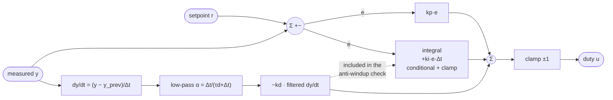

# 08.06 — Derivative control — damping, noise and derivative kick

<!-- glance:start -->
<!-- generated by tools/build.py from curriculum/syllabus.yaml — edit the syllabus, not this block -->

| | |
|---|---|
| **Track** | Main path |
| **Difficulty** | Intermediate |
| **Time** | 50 min |
| **Hardware** | Stage 1 robot: Pi 5, Pico, encoder motors, driver, chassis, battery, distance sensors (stage 1) |
| **Software** | python |
| **Prerequisites** | [08.05 Integral control — killing steady-state error (and integral windup)](08.05-integral-control.md) |
| **Optional prerequisites** | [FM.17 Calculus for robots: derivatives, rates and partial derivatives](../optional-foundations/mathematics/FM.17-derivatives.md) |
| **Skip if** | You know why D is computed on the measurement and filtered. |

<!-- glance:end -->

## What you will learn

- Add a derivative term and use it to damp the overshoot and ringing of a PI loop with delay.
- Explain derivative kick and remove it by differentiating the measurement instead of the error.
- Predict how much measurement noise D turns into motor chatter, and reduce it with a first-order filter on the derivative.
- Choose kd and the filter time constant as a trade-off you can measure: damping vs chatter vs lag.
- Decide when a loop doesn't need D at all — including karmel's wheel-speed loop.

## Why it matters

With [08.05](08.05-integral-control.md) you have a PI loop that reaches the setpoint exactly. Put 20 ms of extra delay in it — a busy Pi, a USB hiccup — and it overshoots by 25% and rings for 1.7 s. On the floor that's a robot that surges past its target speed and wobbles. The derivative term is the classic fix: it reacts to how fast things are *changing* and brakes before the overshoot happens.

D is also the term most often implemented wrongly. The textbook form produces a violent spike every time the setpoint changes (every new `cmd_vel`, every waypoint), and even correct D amplifies sensor noise into motor noise. Positioning loops — the 90° turn in [08.11](08.11-rotate-exactly-90.md), the arm joints in module 14 — depend on D much more than a speed loop does, so you want the robust form in your hands now: **derivative on measurement, low-pass filtered**, with the same structure as the firmware's [`velocity.py`](../labs/firmware/pico/velocity.py).

<!-- prereqs:start -->
## Prerequisites

You need these first:

- [08.05 Integral control — killing steady-state error (and integral windup)](08.05-integral-control.md)

### Optional prerequisite links

New to any of these? Take the foundation lesson first; skip it if you already know it.

- [FM.17 Calculus for robots: derivatives, rates and partial derivatives](../optional-foundations/mathematics/FM.17-derivatives.md)

Check your readiness: `python course.py why 08.06`
<!-- prereqs:end -->

## Concept

### Braking before you arrive

Parking a car against a wall: you don't wait until the bumper touches to brake. You look at how fast the gap is *closing* and ease off early. P looks at the distance (error), I at how long you've been away, and **D at how fast the error is changing**. When the speed is rushing up toward the setpoint, D subtracts from the command *before* the error is zero, so the approach is gentler and the overshoot smaller. That's **damping**.

In a speed loop "how fast the speed changes" is the wheel's **acceleration**. D says: "you're accelerating hard — ease off, the speed will get there anyway".

### Derivative kick

The textbook D is $k_d \cdot \frac{d(\text{error})}{dt}$. Now change the setpoint from 4 to 8 rad/s. The error jumps by 4 in one loop period, so its derivative is $4/0.02 = 200$ rad/s² for exactly one sample, and D fires a huge one-sample spike into the motor. The wheel didn't do anything to deserve it: that's **derivative kick**.

The fix is simple. When the setpoint is constant, $\frac{d(\text{error})}{dt} = -\frac{d(\text{measured})}{dt}$. So compute D from the **measurement** instead: same damping, and a setpoint jump is invisible to it, because the measured speed can't jump.

### D amplifies noise

A derivative divides a small change by a small time. Noise in the speed measurement is a random small change every sample, so D multiplies it by $1/\Delta t$ — 50 times at 50 Hz — and sends it straight to the motor: a buzzing, heating, gearbox-shaking command. The standard remedy is to low-pass filter the derivative ([08.03](08.03-wheel-speed-estimation.md)'s EMA). But a filter adds lag, and a lagging brake is a worse brake. You'll measure that trade-off.

For a distributed-systems picture: D is like an autoscaler that reacts to the *rate of change* of queue depth. It can add capacity before the queue gets long, but a noisy metric makes it thrash, and smoothing the metric makes it late.

> [!TIP]
> **Ask your teacher:** "Show me why derivative on the error and derivative on the measurement are identical when the setpoint is constant, and different for exactly one sample when it steps."

## Technical explanation

### Level 1 — The PID

$$u = k_p\,e + k_i\!\int e\,dt + k_d\,\frac{de}{dt}, \qquad e = r - y$$

$k_d$ has units of duty per (rad/s²): duty per unit of wheel acceleration. The firmware's form replaces $\frac{de}{dt}$ by $-\frac{dy}{dt}$:

$$D = -k_d\,\frac{dy}{dt}$$

### Level 2 — Discrete, filtered, on the measurement

Every loop period:

$$\dot y_{raw} = \frac{y_k - y_{k-1}}{\Delta t}, \qquad \alpha = \frac{\Delta t}{\tau_d + \Delta t}, \qquad \dot y_k = \dot y_{k-1} + \alpha\,(\dot y_{raw} - \dot y_{k-1}), \qquad D_k = -k_d\,\dot y_k$$

$\tau_d$ is the derivative filter's time constant; $\tau_d = 0$ gives α = 1, no filtering. On the first update there is no previous measurement, so D = 0.

**Numerical example.** $k_d = 0.002$, $\Delta t = 0.02$ s, $\tau_d = 0.01$ s → $\alpha = 0.02/0.03 = 0.667$. The measured speed goes 6.0 → 7.2 rad/s: raw rate 60 rad/s², filtered rate (from 0) $0.667 \times 60 = 40$, $D = -0.002 \times 40 = -0.08$ duty. Next period 7.2 → 7.8: raw 30, filtered $40 + 0.667 \times (30 - 40) = 33.3$, $D = -0.067$.

The integral and its anti-windup stay exactly as in 08.05; the unclamped output used by conditional integration now includes D:

```text
unclamped = kp * error + candidate_integral + d_term
```

### Level 3 — Three numbers you can compute before running

**Kick size.** D on the error for a setpoint step $\Delta r$ in one period:

$$D_{kick} = k_d\,\frac{\Delta r}{\Delta t}$$

$k_d = 0.005$, $\Delta r = 4$ rad/s, $\Delta t = 0.02$ s: $D_{kick} = 1.0$ duty — a full-scale spike for one sample. D on the measurement: 0.

**Noise amplification.** If the measurement carries independent noise with standard deviation σ, the unfiltered D has

$$\sigma_D = k_d\,\frac{\sqrt 2\,\sigma}{\Delta t}$$

$k_d = 0.002$, σ = 0.3 rad/s, $\Delta t = 0.02$ s: $\sigma_D = 0.002 \times 1.414 \times 0.3/0.02 = 0.042$ duty. For comparison, P with $k_p = 0.1$ passes $0.1 \times 0.3 = 0.03$ of noise straight through, and its change from sample to sample is $0.1 \times \sqrt2 \times 0.3 = 0.042$. So with this kd, D doubles the chatter.

**Filter attenuation.** For white noise, an EMA scales the standard deviation by roughly $\sqrt{\alpha/(2-\alpha)}$ (08.03), less for the differenced noise D sees. With σ = 0.1 rad/s, $k_d = 0.002$, 50 Hz: unfiltered $\sigma_D = 0.0141$; $\tau_d = 10$ ms → 0.0083; 40 ms → 0.0037; 100 ms → 0.0018 (the 08.06 checker computes these).

### Level 4 — Why D helps, when it hurts, and why the firmware ships kd = 0

A loop with delay overshoots because the controller keeps pushing on stale information. D sees the wheel *accelerating* and subtracts in proportion: at 100 rad/s² of acceleration, $k_d = 0.002$ removes 0.2 duty, well before the error has reached zero. That anticipation cancels part of the delay's effect. Too much D, and the loop reacts to its own accelerations with more lag than damping: $k_d = 0.004$ already overshoots more than 0.002, and 0.008 oscillates (E3).

Filtering trades noise for lag, and lag is exactly what D was supposed to counter. In the experiment, $\tau_d$ = 40 ms cuts the noisy chatter by 23% but brings the overshoot from 5% back up to 20%.

For karmel's **wheel-speed** loop, the plant is first order: speed follows duty with one lag. A well-tuned PI plus feedforward ([08.09](08.09-feedforward-exact-speed.md)) already responds without much overshoot as long as the loop runs fast and close to the motor (100 Hz on the Pico, [08.12](08.12-control-in-ros2.md)). The measurement is quantized, so D mostly adds noise. That's why `labs/firmware/pico/config.py` ships `VELOCITY_KD = 0.0` — the D path exists (on the measurement, with anti-windup) but is off by default. D earns its place in **position** loops (angle of a wheel, heading, an arm joint), where the plant integrates speed into position and P alone oscillates: [08.11](08.11-rotate-exactly-90.md) and module 14. The formulas and theory are in [08.07](08.07-pid-mathematics.md).

## Diagram

The full PID as you implement it, next to the firmware's:



What a setpoint step does to each D form:

```text
 setpoint  4 ───────────┐8 ─────────────────────
 measured  4 ───────────┴──╱‾‾‾‾‾ 8 ────────────   (can't jump)
                        │
 D on error      0 ─────┤█ +1.0 (one sample) ───   ← derivative kick
                        │
 D on measured   0 ─────┴─▁▂▁ −0.05 ────────────   (brakes the rise gently)
```

## Code

### Your PID (auto-graded exercise)

Implement `PIDController` in [`labs/exercises/08.06/student.py`](../labs/exercises/08.06/student.py), starting from your 08.05 controller. Reference (after trying):

```python
class PIDController:
    """u = kp*e + integral + d_term, clamped.  d_term = -kd * lowpass(d measured / dt)."""

    def __init__(self, kp: float, ki: float, kd: float, derivative_filter_tau_s: float = 0.0,
                 output_min: float = -1.0, output_max: float = 1.0) -> None:
        self.kp = kp
        self.ki = ki
        self.kd = kd
        self.derivative_filter_tau_s = derivative_filter_tau_s
        self.output_min = output_min
        self.output_max = output_max
        self.reset()

    def reset(self) -> None:
        self.integral = 0.0
        self.d_term = 0.0
        self.output = 0.0
        self._rate = 0.0  # filtered d(measured)/dt
        self._last_measured: float | None = None

    def update(self, setpoint: float, measured: float, dt: float) -> float:
        error = setpoint - measured
        proportional = self.kp * error

        # Derivative on the MEASUREMENT (no kick when the setpoint jumps), low-pass filtered.
        if self._last_measured is not None and dt > 0:
            raw_rate = (measured - self._last_measured) / dt
            alpha = dt / (self.derivative_filter_tau_s + dt)  # tau = 0 -> alpha = 1 -> no filtering
            self._rate += alpha * (raw_rate - self._rate)
        self._last_measured = measured
        self.d_term = -self.kd * self._rate

        # Anti-windup exactly as in 08.05, with the D term included in the unclamped output.
        candidate = self.integral + self.ki * error * dt
        unclamped = proportional + candidate + self.d_term
        pushing_up = unclamped > self.output_max and error > 0
        pushing_down = unclamped < self.output_min and error < 0
        if not (pushing_up or pushing_down):
            self.integral = candidate
        self.integral = min(max(self.integral, self.output_min), self.output_max)

        output = proportional + self.integral + self.d_term
        self.output = min(max(output, self.output_min), self.output_max)
        return self.output
```

With `derivative_filter_tau_s = 0` and the firmware's feedforward set to 0, this is `PID.update` in `velocity.py` line by line; the derivative filter is the one addition.

Check it: `python course.py check 08.06`

### The experiment

[`08-control/code/pid_control.py`](code/pid_control.py) runs three parts, all with $k_p = 0.1$, $k_i = 2.0$ on the realistic simulator:

1. **Kick:** setpoint 4 → 8 rad/s at t = 1 s with $k_d = 0.005$, D on the error (a small `DerivativeOnError` class in the script, for the demo only) vs your D on the measurement.
2. **Damping:** a 0 → 8 step with one extra 20 ms of delay: PI, then $k_d = 0.002$ with filters of 0, 10 and 40 ms.
3. **Noise:** the same four controllers holding 8 rad/s while Gaussian noise with σ = 0.3 rad/s is added to the measurement (a vibrating chassis, a worse encoder).

"Duty chatter" is the RMS change of the duty between consecutive periods: how hard the motor is being shaken.

```bash
python 08-control/code/pid_control.py --solution --plot pid_control.png
```

Output:

```text
Part 1 - setpoint 4 -> 8 rad/s at t = 1.0 s, kp 0.1, ki 2.0, kd 0.005
  derivative on    D term at the step duty before duty at the step
  the error                     0.991       0.266            1.000
  the measurement              -0.009       0.266            0.847

Part 2 - step 0 -> 8 rad/s with 20 ms extra delay: PI vs PID (kp 0.1, ki 2.0)
  controller           overshoot settling (+-0.3) duty chatter
  PI (kd = 0)                25%          1.70 s       0.0102
  PID, no filter              5%          0.26 s       0.0178
  PID, 10 ms filter          11%          0.42 s       0.0171
  PID, 40 ms filter          20%          1.06 s       0.0175

Part 3 - same, holding 8 rad/s with measurement noise sigma = 0.3 rad/s
  controller           speed std duty chatter
  PI (kd = 0)              0.413       0.0587
  PID, no filter           0.378       0.1198
  PID, 10 ms filter        0.542       0.1110
  PID, 40 ms filter        0.487       0.0920
saved pid_control.png
```


Read it as a set of trade-offs:

- **Kick:** D on the error adds a full 0.99 of duty for one sample (the formula said 1.0); the output slams into its limit. D on the measurement: −0.009. Same controller otherwise.
- **Damping:** unfiltered D cuts the overshoot from 25% to 5% and the settling time from 1.70 s to 0.26 s. A 40 ms filter gives most of that back (20%, 1.06 s).
- **Cost in quiet conditions:** chatter 0.0102 → 0.0178. Even the simulator's quantized speed estimate is noise to D.
- **Cost with noise:** chatter doubles (0.059 → 0.120), as the Level 3 arithmetic predicted. The 40 ms filter reduces it to 0.092 — and loses the damping.

**On the robot:** `python 08-control/code/pid_control.py --port /dev/ttyACM0` (wheels in the air). Your robot's speed estimate is noisier than the simulator's (08.03 E5), so expect Part 2's unfiltered chatter to be noticeably higher; listen to the motors.

## Exercise

> [!CAUTION]
> **Safety:** Derivative kick and high-kd runs produce full-scale, sample-to-sample duty changes. With wheels in the air that's noise and gearbox stress; on the floor it's a jerk that can tip a light robot or launch it off a table. Wheels in the air, battery switch in reach, never test kd changes on the floor before the in-air plot looks calm.

### Exercise 08.06-E1 — D by the numbers `[numerical]`

Hardware: none. $\Delta t = 0.01$ s (the Pico's rate), $k_d = 0.001$. (a) Kick from a setpoint step of 3 rad/s with D on the error. (b) Unfiltered $\sigma_D$ for measurement noise σ = 0.1 rad/s. (c) α for $\tau_d$ = 20 ms. (d) Filtered D after two samples if the measurement rises 5.00 → 5.20 → 5.30 rad/s, starting from a filtered rate of 0.

### Exercise 08.06-E2 — Implement the PID `[coding]`

Hardware: none. Implement `PIDController` in `labs/exercises/08.06/student.py`.

Check it: `python course.py check 08.06`

Then run `pid_control.py` without `--solution` and compare with the lesson's tables.

### Exercise 08.06-E3 — Predict: more D `[predict]`

Hardware: none. In Part 2 (20 ms extra delay, no filter), predict the overshoot for $k_d$ = 0.001, 0.004 and 0.008 relative to 0.002 (5%). Write "less", "more" or "oscillates" for each, then add them to the `variants` list and run.

### Exercise 08.06-E4 — Pick a filter `[simulation]`

Hardware: none. For $k_d = 0.002$ and $\tau_d \in \{0, 5, 10, 20, 40, 80\}$ ms, measure the overshoot and settling time of Part 2 and the duty chatter of Part 3. Plot overshoot against chatter (one point per $\tau_d$) and pick a value you'd defend. Would you use D at all on this loop?

### Exercise 08.06-E5 — The sign bug `[debugging]`

Hardware: none. A teammate writes `self.d_term = self.kd * self._rate` (no minus). Before running, predict what happens to Part 2's step response. Run it by passing `kd = -0.002` (equivalent), measure overshoot and wobble, and write the single-line test from `labs/exercises/08.06/test_exercise.py` that catches it.

### Exercise 08.06-E6 — Your robot `[hardware]`

Hardware: robot-base. Simulation alternative: `--fake`.
Robot on a stand: `python 08-control/code/pid_control.py --port /dev/ttyACM0 --plot my_pid.png`. Compare Part 2's chatter numbers with the simulator's. Then, holding 8 rad/s, run PI and PID ($k_d = 0.002$, no filter) for 5 s each and listen: can you hear the difference?

## Expected result

**08.06-E1:** (a) $0.001 \times 3/0.01 = $ **0.30** duty for one sample. (b) $0.001 \times 1.414 \times 0.1/0.01 = $ **0.0141** duty. (c) $0.01/(0.02 + 0.01) = $ **0.333**. (d) Raw rates 20 and 10 rad/s²; filtered $0.333 \times 20 = 6.67$, then $6.67 + 0.333 \times (10 - 6.67) = 7.78$; $D = -0.001 \times 7.78 = $ **−0.0078** duty.

**08.06-E2:** All 10 tests pass in about a second; your tables match the lesson's.

**08.06-E3:** $k_d = 0.001$: **more** than 0.002 (about 9%, still calm). 0.004: **more** (about 21%, rings for 2 s, chatter 3× higher). 0.008: **oscillates** (wobble ≈ 1.4 rad/s, the duty swings rail to rail). There's a best kd, and it's small.

**08.06-E4:** Measured on the realistic simulator:

| $\tau_d$ | 0 | 5 ms | 10 ms | 20 ms | 40 ms | 80 ms |
|---|---|---|---|---|---|---|
| overshoot | 5% | 8% | 11% | 13% | 20% | 23% |
| settling (±0.3) | 0.26 s | 0.28 s | 0.42 s | 0.94 s | 1.06 s | 1.50 s |
| noisy chatter | 0.120 | 0.112 | 0.111 | 0.115 | 0.092 | 0.072 |

There's no free lunch: every millisecond of filter you add to cut chatter gives back damping, and by 80 ms you have a PI loop (23% overshoot) with extra chatter (0.072 vs PI's 0.059). A defensible answer: 5–10 ms if the measurement is as clean as the simulator's, or no D at all on this speed loop — remove the extra delay (run the loop on the Pico) and use feedforward instead, which is what the course's firmware does.

**08.06-E5:** Positive "D" pushes *with* the acceleration: negative damping. The step overshoots by about **50%** and the loop oscillates (wobble ≈ 3 rad/s). The test that catches it: `test_derivative_opposes_a_rising_measurement` — a rising measurement must give a negative `d_term`.

**08.06-E6:** On a typical karmel the unfiltered PID chatter in Part 2 is 2–5× the simulator's 0.018, because real encoder speed estimates are noisier. PID usually sounds slightly rougher (a faint buzz or rattle from the gearbox) than PI at a constant speed.

## Troubleshooting

### Symptom: a click, jerk or current spike every time the setpoint changes
Derivative kick: D is computed from the error. Switch to the measurement. If the spikes remain, check whether something else steps: a feedforward term with a step change is expected to jump (that's what it's for) — ramp the setpoint instead ([08.11](08.11-rotate-exactly-90.md) motion profiles).

### Symptom: the motor buzzes or gets warm at a constant speed after adding D
Noise amplification. Log `d_term`: if it jumps sample-to-sample by more than about 0.02, reduce $k_d$, add a derivative filter ($\tau_d$ of one or two loop periods), or improve the measurement (08.03). Remember the speed estimate may already be filtered (firmware α = 0.5): don't stack filters without measuring the lag.

### Symptom: adding D made the overshoot worse, not better
1. Check the sign (E5): D must oppose a rising measurement.
2. Check $k_d$ isn't too large (E3); halve it.
3. Check the filter isn't too heavy: a filter with $\tau_d$ comparable to the loop's own lag makes D a late brake.

### Symptom: D does nothing
1. Is `_last_measured` updated every call? If it's set only once, the rate stays 0.
2. Is the measurement changing between calls? On the Pi, reading the same telemetry sample twice gives zero rate, then a double rate: wait for new samples (`control_lab.next_state` does).

### Symptom: large D values right after a pause or a reset
A huge `dt` or a stale `_last_measured`. Reset the controller after any interruption (08.05) and clamp `dt`.

## Common mistakes

- **Differentiating the error.** Every setpoint change becomes a spike. Differentiate the measurement.
- **Using D on a noisy, quantized signal without filtering or measuring.** Look at `d_term` in a log before trusting it.
- **Filtering D heavily "to be safe".** A 40 ms filter on a 20 ms loop turns D into a late, weak term; you pay the complexity for nothing.
- **Leaving D out of the anti-windup check.** The unclamped output is P + I + D; ignoring D lets the integral wind up while D holds the output at a limit.
- **Adding D to fix what feedforward or a faster loop should fix.** For karmel's speed loop, moving the loop to the Pico and adding feedforward is the better cure for overshoot.
- **Wrong sign.** `d_term = -kd * rate`. Test it with a rising measurement.

## Knowledge check

1. Why are "D on the error" and "D on the measurement" identical when the setpoint is constant?
   <details><summary>Answer</summary>

   $e = r - y$, so $\frac{de}{dt} = \frac{dr}{dt} - \frac{dy}{dt} = -\frac{dy}{dt}$ when $\frac{dr}{dt} = 0$.
   </details>

2. $k_d = 0.004$, $\Delta t = 0.02$ s, the setpoint jumps by 5 rad/s. How big is the kick with D on the error?
   <details><summary>Answer</summary>

   $0.004 \times 5/0.02 = 1.0$ duty — full scale for one sample.
   </details>

3. Measurement noise σ = 0.2 rad/s, 50 Hz, $k_d = 0.003$. Standard deviation of unfiltered D?
   <details><summary>Answer</summary>

   $0.003 \times \sqrt2 \times 0.2/0.02 = 0.042$ duty.
   </details>

4. Predict: you move the loop from 50 Hz to 500 Hz on the same encoder, same $k_d$, no filter. What happens to the D noise, and why?
   <details><summary>Answer</summary>

   It gets much worse: $\sigma_D \propto 1/\Delta t$ grows 10× for the same measurement noise, and at 2 ms the tick-difference speed estimate itself becomes far noisier (08.03). Filter the derivative or lower $k_d$.
   </details>

5. A derivative filter has $\tau_d = 30$ ms on a 10 ms loop. What is α, and roughly how much lag does it add to D?
   <details><summary>Answer</summary>

   $\alpha = 0.01/0.04 = 0.25$; about 30 ms of lag.
   </details>

6. Debugging: after adding D, the step response oscillates more than PI did. Name three things to check, in order.
   <details><summary>Answer</summary>

   The sign of the D term (it must oppose a rising measurement); the size of $k_d$ (halve it); the filter lag (too heavy a filter makes D late). Then check that D is included in the anti-windup check.
   </details>

7. Why does the course's firmware run the wheel-speed loop with `VELOCITY_KD = 0.0`?
   <details><summary>Answer</summary>

   The speed plant is first order and the loop runs at 100 Hz on the Pico with little delay; PI plus feedforward handles it without much overshoot. The quantized speed estimate makes D mostly noise. D matters more in position loops (heading, joint angle).
   </details>

## Practical challenge

Use your PID where D earns its keep: hold a **wheel angle**. Measurement: `left_ticks × 2π/2464` (rad); setpoint: 0 → 2π (one wheel revolution) at t = 0.2 s, then back to 0 at t = 2 s. Controller: your `PIDController` on angle error, with the output clamped to ±0.6 duty. Tune P alone first, then add D (on the measurement, filtered), then a small I if a deadband-induced offset remains. Run it on the realistic simulator and on your robot with the wheels in the air.

**Acceptance criteria:** a plot of P-only vs PD (vs PID) angle responses; with your final gains the wheel reaches 2π ± 0.05 rad with less than 5% overshoot and no sustained oscillation, on the simulator and on the robot; no duty spike larger than your P term's jump when the setpoint steps (proof that there's no derivative kick); a paragraph explaining why D helped here much more than in the speed loop.

## You can skip this if…

You answer questions 1, 4 and 6 correctly without looking and pass `python course.py check 08.06` with an implementation written from memory.

`python course.py skip 08.06 --reason "I compute D on the measurement and filter it"`

## Go deeper

- Brett Beauregard, "Improving the Beginner's PID: Derivative Kick" (http only): http://brettbeauregard.com/blog/2011/04/improving-the-beginners-pid-derivative-kick/ — the derivative-on-measurement fix in embedded code.
- MATLAB Tech Talks, Understanding PID Control (Brian Douglas): https://www.mathworks.com/videos/series/understanding-pid-control.html — part 3 covers noise and derivative filtering.
- Åström & Murray, *Feedback Systems* (2nd ed.), chapter 11 "PID Control": https://www.cds.caltech.edu/~murray/FBS/PID_Control.html — filtering the derivative and setpoint weighting (the general form of "D on the measurement").
- [FM.17 Derivatives](../optional-foundations/mathematics/FM.17-derivatives.md) — numerical differentiation and why it amplifies noise.
- [08.07 PID mathematically](08.07-pid-mathematics.md) — the continuous and discrete PID, stability and what D does to the poles.

## Progress checkpoint

- [ ] I added D and measured how much it damps a PI loop with delay.
- [ ] I can explain derivative kick and my PID computes D on the measurement.
- [ ] I can compute how much noise D passes through and filter it deliberately.
- [ ] My PID passes `python course.py check 08.06` and I know when not to use D.

`python course.py complete 08.06` (exercises done) · `python course.py master 08.06` (challenge done) · `python course.py struggle 08.06 "what was hard"`

Next: [08.07 — PID mathematically — continuous, discrete, and what stability means](08.07-pid-mathematics.md).
