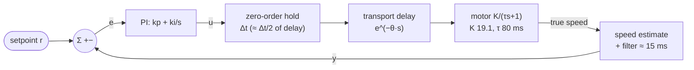

# 08.07 — PID mathematically — continuous, discrete, and what stability means

<!-- glance:start -->
<!-- generated by tools/build.py from curriculum/syllabus.yaml — edit the syllabus, not this block -->

| | |
|---|---|
| **Track** | Main path |
| **Difficulty** | Intermediate |
| **Time** | 1 h |
| **Hardware** | none |
| **Software** | python |
| **Prerequisites** | [08.06 Derivative control — damping, noise and derivative kick](08.06-derivative-control.md) |
| **Optional prerequisites** | [FCT.03 Differential equations just enough — simulate them numerically](../optional-foundations/control-theory/FCT.03-differential-equations-simulation.md)<br>[FCT.04 Stability: poles without the pain](../optional-foundations/control-theory/FCT.04-stability-intuition.md)<br>[FCT.05 Discrete time: sampling rates, delay and aliasing](../optional-foundations/control-theory/FCT.05-discrete-time-sampling.md) |
| **Skip if** | You can derive the discrete PID update and relate gains to overshoot and settling. |

<!-- glance:end -->

## What you will learn

- Write the PID you built in 08.04–08.06 in its continuous, positional-discrete and velocity-form versions, and say when each one is the right choice.
- Measure a step response the way control engineers do: rise time, peak time, overshoot, settling time, steady-state error — and compute them from a log with one function you wrote.
- Compute PI gains from the motor model instead of guessing them, by pole placement and by pole cancellation (lambda tuning), and check on the robot that the poles landed where you asked.
- Predict what halving the loop rate does to overshoot, and recognise the "I forgot `dt`" bug from the shape of the response.
- Explain, with a number, why 40 ms of extra delay turns a calm loop into an oscillating one.

## Why it matters

Up to here every gain was found by trying. That works for one wheel on one robot. It stops working when you have a heading loop wrapped around a speed loop ([08.10](08.10-straight-line-heading-control.md)), six arm joints (module 14), or a Nav2 controller whose parameters you have to justify to yourself at 2 a.m. The mathematics in this lesson is the difference between "I turned the knob until it looked good" and "the closed-loop poles are at −17.5 ± 17.9j, so I expect 5% overshoot and 0.25 s of settling, and that is what I measured".

It is also the lesson that explains the two failures you have already seen. The loop that oscillates when you raise $k_p$ ([08.04](08.04-proportional-control.md)) and the loop that rings when you add 20 ms of delay ([08.06](08.06-derivative-control.md)) are the *same* phenomenon, and there is one number — the phase margin — that predicts both. Everything after this lesson (tuning procedures in [08.08](08.08-tuning-pid.md), feedforward in [08.09](08.09-feedforward-exact-speed.md), cascades in [08.10](08.10-straight-line-heading-control.md), where loops live in [08.12](08.12-control-in-ros2.md)) is applied phase margin.

<!-- prereqs:start -->
## Prerequisites

You need these first:

- [08.06 Derivative control — damping, noise and derivative kick](08.06-derivative-control.md)

### Optional prerequisite links

New to any of these? Take the foundation lesson first; skip it if you already know it.

- [FCT.03 Differential equations just enough — simulate them numerically](../optional-foundations/control-theory/FCT.03-differential-equations-simulation.md)
- [FCT.04 Stability: poles without the pain](../optional-foundations/control-theory/FCT.04-stability-intuition.md)
- [FCT.05 Discrete time: sampling rates, delay and aliasing](../optional-foundations/control-theory/FCT.05-discrete-time-sampling.md)

Check your readiness: `python course.py why 08.07`
<!-- prereqs:end -->

## Concept

### The same controller, three notations

You have written a PID three times now, and each time it was the same idea in a different dress:

- **Continuous**: what the textbook writes, an integral and a derivative of a function of time. Useful for analysis, impossible to run.
- **Positional discrete**: what your code does. Keep the accumulated integral, recompute the whole output every period. This is `velocity.py`.
- **Velocity (incremental) form**: compute how much the output should *change* this period and add it to the previous output. The only state is the last output — so clamping it is all the anti-windup you need. Used a lot on PLCs and anywhere the actuator itself holds position (a stepper, a valve, a thermostat's duty).

They produce identical outputs on the same data (you will verify this: largest difference 0.0000 duty over a step). They differ in what happens when something goes *wrong* — a gain change at runtime, a saturated actuator, a reset.

### Stability is about how late your information is

A feedback loop pushes based on what it measured. If the measurement is 25 ms old and you push hard, you push based on a world that no longer exists — and you push *past* the target. The loop's job is to react before the error grows and to stop reacting before it has overcorrected.

Two numbers describe how much room you have:

- **Crossover frequency** $\omega_c$: how fast the loop can respond, in rad/s. Roughly, the loop can correct disturbances slower than $\omega_c$ and ignores faster ones.
- **Phase margin**: how much extra lag you can add before the correction arrives so late that it *adds* to the error instead of cancelling it. Positive feedback. Oscillation.

Delay costs phase in proportion to frequency: $\theta$ seconds of dead time removes $\omega_c\theta$ radians at crossover. That is the whole story of why fast loops are fragile and slow loops are robust — and why karmel's wheel loop lives on a microcontroller ([08.12](08.12-control-in-ros2.md)).

For a distributed-systems picture: phase margin is your error budget for latency. You can serve a request every 10 ms, and you can tolerate 100 ms of round-trip latency, but not both.

> [!TIP]
> **Ask your teacher:** "Draw me the block diagram of PI + a first-order motor and derive the closed-loop transfer function step by step, then plug in karmel's numbers."

## Technical explanation

### Level 1 — The continuous PID and what each term is

$$u(t) = k_p\,e(t) + k_i\!\int_0^t\! e(\tau)\,d\tau + k_d\,\frac{de(t)}{dt}, \qquad e = r - y$$

$k_p$ answers "how wrong am I", $k_i$ "how long have I been wrong", $k_d$ "how fast is it changing". The alternative *standard* form, which most literature and most tuning rules use, factors $k_p$ out:

$$u = k_p\left(e + \frac{1}{T_i}\!\int e\,dt + T_d\,\frac{de}{dt}\right), \qquad k_i = \frac{k_p}{T_i},\quad k_d = k_p T_d$$

$T_i$ (integral time) and $T_d$ (derivative time) are in seconds, which makes them comparable with the plant's own time constant. Every tuning rule in [08.08](08.08-tuning-pid.md) is written in $T_i$ and $T_d$; convert once, at the boundary.

**Numerical example.** Your PI from 08.05 has $k_p = 0.1$, $k_i = 2.0$. In standard form: $T_i = k_p/k_i = 0.05$ s. The motor's own time constant is 0.08 s, so the integral acts *faster* than the plant — which is why $k_i = 8$ oscillated.

### Level 2 — Discretisation: positional and velocity form

With a fixed period $\Delta t$, the integral becomes a sum and the derivative a difference. The **positional form** (yours, and the firmware's):

$$I_k = I_{k-1} + k_i\,e_k\,\Delta t, \qquad u_k = \mathrm{clamp}\!\left(k_p e_k + I_k - k_d\,\frac{y_k - y_{k-1}}{\Delta t}\right)$$

The **velocity (incremental) form** computes the difference between consecutive outputs:

$$\Delta u_k = k_p\,(e_k - e_{k-1}) + k_i\,e_k\,\Delta t - k_d\,\frac{y_k - 2y_{k-1} + y_{k-2}}{\Delta t}, \qquad u_k = \mathrm{clamp}(u_{k-1} + \Delta u_k)$$

**Numerical example.** $k_p = 0.1$, $k_i = 2$, $\Delta t = 0.02$ s, error 8 → 6 rad/s, starting from $u = 0$, $I = 0$. Positional: $I_1 = 2 \times 8 \times 0.02 = 0.32$, $u_1 = 0.8 + 0.32 = 1.12 \to 1.0$; $I_2 = 0.32 + 0.24 = 0.56$, $u_2 = 0.6 + 0.56 = 1.16 \to 1.0$. Velocity form: $\Delta u_1 = 0.1 \times 8 + 0.32 = 1.12 \to u_1 = 1.0$; $\Delta u_2 = 0.1 \times (6-8) + 0.24 = 0.04 \to u_2 = 1.04 \to 1.0$. Same output.

Practical differences:

| | Positional | Velocity form |
|---|---|---|
| State | integral (+ last measurement) | last output (+ last error, last two measurements) |
| Anti-windup | needs an explicit rule (08.05) | clamping $u_{k-1}$ is enough |
| Changing $k_i$ at runtime | smooth (integral stored in duty units) | smooth |
| Changing $k_p$ at runtime | smooth | **bumps**: $k_p$ multiplies a difference that is not zero |
| Bumpless manual → auto | needs the integral preloaded | free: start from the current output |
| A single bad sample | affects one period | corrupts $u$ **forever** (it is an accumulator) |

That last row is why safety-critical code usually keeps the positional form: a glitch in a velocity-form loop never washes out.

### Level 3 — Reading a step response, and where the numbers come from

Five numbers describe a step response, and the exercise implements all of them:

- **Rise time** — 10% to 90% of the step. For a first-order lag: $t_r = \tau\ln 9 = 2.20\,\tau$.
- **Peak time** and **overshoot** — when and how far past the setpoint it went.
- **Settling time** — the last moment it was outside a band around the **setpoint** (usually 2% or 5% of the step). Note the band is around the setpoint, not around the final value: a loop with steady-state error never settles, and that is the honest answer.
- **Steady-state error** — setpoint minus the final average.

For a standard second-order system with damping $\zeta$ and natural frequency $\omega_n$:

$$M_p = e^{-\pi\zeta/\sqrt{1-\zeta^2}}, \qquad t_p = \frac{\pi}{\omega_n\sqrt{1-\zeta^2}}, \qquad t_{s,2\%} \approx \frac{4}{\zeta\omega_n}$$

**Numerical example.** $\zeta = 0.7$, $\omega_n = 25$ rad/s: $M_p = e^{-\pi \times 0.7/0.714} = e^{-3.08} = 4.6\%$; $t_p = \pi/(25 \times 0.714) = 176$ ms; $t_s \approx 4/17.5 = 229$ ms. With $\zeta = 0.5$: 16.3% overshoot. With $\zeta = 1$ (critically damped): no overshoot at all, and $t_{s,2\%} \approx 5.8/\omega_n$.

**PI on a first-order plant, exactly.** The deadband-compensated motor is $G(s) = \dfrac{K}{\tau s + 1}$ and the PI controller is $C(s) = k_p + \dfrac{k_i}{s}$. The closed loop is $\dfrac{CG}{1+CG}$, whose denominator (after multiplying by $s(\tau s + 1)$) is

$$\tau s^2 + (1 + K k_p)\,s + K k_i = 0$$

Divide by $\tau$ and match $s^2 + 2\zeta\omega_n s + \omega_n^2$:

$$\boxed{k_p = \frac{2\zeta\omega_n\tau - 1}{K}}, \qquad \boxed{k_i = \frac{\omega_n^2\,\tau}{K}}$$

**Numerical example (karmel, measured).** $K = 19.12$ rad/s per unit of (deadband-compensated) command, $\tau = 0.08$ s. Ask for $\zeta = 0.7$, $\omega_n = 25$ rad/s:

$$k_p = \frac{2(0.7)(25)(0.08) - 1}{19.12} = \frac{1.8}{19.12} = 0.094, \qquad k_i = \frac{625 \times 0.08}{19.12} = 2.61$$

The poles are then at $-\zeta\omega_n \pm j\omega_n\sqrt{1-\zeta^2} = -17.5 \pm 17.9j$, and the ideal model overshoots 9.5%. The real wheel overshot 18.2% — the gap is everything the second-order model ignores (sampling, the speed estimator's filter, quantisation). **That gap is the lesson**, and Part 3 of the experiment measures it for five designs.

**Lambda tuning (pole cancellation).** Instead of placing two poles, cancel the motor's pole with the PI's zero. The PI zero is at $-k_i/k_p$; set $k_i/k_p = 1/\tau$ and the loop becomes a pure integrator, so the closed loop is exactly first order with a time constant you choose:

$$k_p = \frac{\tau}{K\,\tau_{cl}}, \qquad k_i = \frac{k_p}{\tau}$$

**Numerical example.** $\tau_{cl} = 50$ ms: $k_p = 0.08/(19.12 \times 0.05) = 0.084$, $k_i = 1.05$. In an ideal continuous world this gives a 109 ms rise and **zero** overshoot. Measured on the wheel at 50 Hz: 62 ms rise, 3.8% overshoot. Faster *and* less clean than theory, because the real plant is not exactly first order.

$\tau_{cl}$ is the one knob: bigger = calmer and more robust, smaller = faster and closer to the edge. A useful default is $\tau_{cl} \approx \tau$; $\tau_{cl} < \tau/2$ on a loop with any delay is asking for trouble.

### Level 4 — Sampling and delay, the two things that bite

**Sampling is dead time.** A command computed at $t$ and held until $t + \Delta t$ acts, on average, half a period late. Add the speed estimator's own lag ([08.03](08.03-wheel-speed-estimation.md): ≈15 ms for the firmware's α = 0.5 filter at 100 Hz) and any transport delay, and the loop's total dead time is

$$\theta \approx \frac{\Delta t}{2} + \tau_{filter} + \theta_{transport}$$

**Numerical example.** At 50 Hz with the firmware's estimator: $\theta = 10 + 15 = 25$ ms. At 25 Hz: 20 + 15 = 35 ms. This is why the same gains overshoot 0.9% at 100 Hz, 3.8% at 50 Hz and 10.8% at 25 Hz in Part 2 — nothing changed except when the controller found out.

**Phase margin, for the lambda design.** After pole cancellation the open loop is $L(s) = \dfrac{1}{\tau_{cl}s}e^{-\theta s}$: gain 1 at $\omega_c = 1/\tau_{cl}$, phase $-90° - \omega_c\theta$. So

$$\text{PM} = 90° - \frac{\theta}{\tau_{cl}}\,\text{rad} = 90° - 57.3\,\frac{\theta}{\tau_{cl}}\ \text{degrees}$$

**Numerical example.** $\tau_{cl} = 50$ ms, $\theta = 25$ ms → PM = 90 − 28.6 = **61°**: calm. Add 20 ms of extra delay → PM = 38°, and the measured overshoot goes from 4% to 33%. Add 40 ms → PM = 16°, overshoot 52%, settling 1.5 s. Add 60 ms → PM = **−7°**: the loop oscillates and never settles (wobble 4.4 rad/s). The rule of thumb everyone uses — *keep PM above 45°* — is exactly "keep $\theta$ below $0.8\,\tau_{cl}$".

Two consequences worth memorising:

1. **You cannot out-tune delay.** Given $\theta$, no choice of $k_p, k_i, k_d$ makes a loop both fast and robust. You must remove the delay (faster loop, faster sensor, move the loop closer to the motor) or slow the loop down.
2. **Derivative buys a little phase back** (up to +90° at its own frequency), which is exactly why D helped the delayed loop in [08.06](08.06-derivative-control.md) — and why it can't save a loop whose delay is comparable to its period.

> [!TIP]
> **Ask your teacher:** "Show me the Bode plot of the lambda design with 25 ms and 85 ms of delay, and point at where the phase crosses −180°."

New to poles, phase and the frequency domain? [FCT.04 Stability: poles without the pain](../optional-foundations/control-theory/FCT.04-stability-intuition.md) builds the intuition, [FCT.05](../optional-foundations/control-theory/FCT.05-discrete-time-sampling.md) does sampling and aliasing, and [FCT.03](../optional-foundations/control-theory/FCT.03-differential-equations-simulation.md) does the ODEs underneath.

## Diagram

The loop that the algebra above describes:



Where the closed-loop poles sit for the designs you will run:

```text
            imag
             ↑
      +17.9j ┤   ● poles ζ 0.7, ωn 25  (9.5 % overshoot in theory, 18 % measured)
             │
        +0j  ┤ ●   ●        ●                ← lambda designs: one real pole at −1/τ_cl
             │ −33 −20     −10                 (λ 30 ms, 50 ms, 100 ms)
      −17.9j ┤   ●
             └───┴───┴───┴───┴───┴──→ real
             −35 −30 −20 −10  0
       stable ←──────────────┤ unstable
```

Further left = faster. Off the real axis = oscillatory. In the right half-plane = the robot runs away.

## Code

### Your metrics and your gain formulas (auto-graded exercise)

Implement `step_metrics`, `pi_gains_pole_placement` and `pi_gains_lambda` in
[`labs/exercises/08.07/student.py`](../labs/exercises/08.07/student.py). The two gain functions are
two lines each; the metrics function is where the care goes. Reference for the gains, after trying:

```python
def pi_gains_pole_placement(K: float, tau: float, zeta: float, omega_n: float) -> tuple[float, float]:
    """PI on K/(tau s + 1): tau s^2 + (1 + K kp) s + K ki = 0  <=>  s^2 + 2 zeta omega_n s + omega_n^2."""
    kp = (2.0 * zeta * omega_n * tau - 1.0) / K
    ki = omega_n**2 * tau / K
    return kp, ki


def pi_gains_lambda(K: float, tau: float, tau_cl: float) -> tuple[float, float]:
    """Cancel the motor pole with the PI zero (ki/kp = 1/tau): closed loop = 1/(tau_cl s + 1)."""
    kp = tau / (K * tau_cl)
    return kp, kp / tau
```

Check it: `python course.py check 08.07`

The reference controllers this lesson runs — `PositionalPID` (with three anti-windup strategies) and
`VelocityFormPID` — live in [`08-control/code/pid_lab.py`](code/pid_lab.py), in the firmware's
formulation. From here on the lessons use them instead of re-pasting a PID.

### The experiment

[`08-control/code/pid_math.py`](code/pid_math.py) runs four parts on the realistic simulator.

```bash
python 08-control/code/pid_math.py --solution --plot pid_math.png
```

Output:

```text
Part 1 - positional vs velocity form, PI kp 0.1 ki 2.0 at 50 Hz (no deadband compensation)
  0 -> 8 rad/s step: largest output difference between the forms = 0.0000 duty
  windup scenario                integral at 2.2 s speed at 2.1 s recovery (+-0.5)
  positional, no anti-windup                 28.47          18.90           1.16 s
  positional, fill (firmware)                 0.40          18.90           0.18 s
  positional, back-calc 50 ms                 0.76          18.90           0.18 s
  velocity form                             (none)          18.90           0.18 s

Part 2 - lambda design tau_cl = 50 ms (kp 0.084, ki 1.05), deadband compensated
  loop                          rise overshoot settling 3% ss error
  100 Hz                        67ms      0.9%       0.10s     0.00
  50 Hz                         62ms      3.8%       0.14s    -0.00
  25 Hz                         56ms     10.8%       0.24s    -0.01
  100 Hz, ki*e without dt*      45ms     21.9%       0.18s    -0.00
  * the bug: integral += ki_per_step * e, with ki_per_step tuned at 50 Hz; at 100 Hz it integrates twice as fast

Part 3 - gains from the model K = 19.12 rad/s per u, tau = 80 ms, 50 Hz
  design                       kp     ki | rise / overshoot: ideal model | model + 50 Hz + lag |           wheel
  lambda 200 ms             0.021   0.26 |           439 ms       0.0% |    398 ms    0.0% |  409 ms   0.9%
  lambda 100 ms             0.042   0.52 |           219 ms       0.0% |    166 ms    0.0% |  168 ms   0.9%
  lambda 50 ms              0.084   1.05 |           109 ms       0.0% |     62 ms    2.8% |   62 ms   3.8%
  lambda 30 ms              0.139   1.74 |            65 ms       0.0% |     37 ms   19.0% |   50 ms   1.5%
  poles zeta 0.7 wn 25      0.094   2.61 |            53 ms       9.5% |     39 ms   34.7% |   48 ms  18.2%

Part 4 - lambda 50 ms at 50 Hz with extra delay: theta = 10 ms (half period) + 15 ms (estimate) + extra
  extra delay  theta phase margin overshoot settling 3% wobble
         0 ms   25ms         61 deg        4%       0.14s   0.05
        20 ms   45ms         38 deg       33%       0.40s   0.06
        40 ms   65ms         16 deg       52%       1.54s   0.14
        60 ms   85ms         -7 deg       72%        infs   4.39
```


What to take from it:

- **The forms are the same controller** (difference 0.0000), and all three anti-windup strategies recover in 0.18 s instead of 1.16 s. Note that the firmware's "fill the headroom" rule reaches **18.90 rad/s** during the unreachable request, not the 16.31 your simple 08.05 rule managed: filling the headroom uses the last 13% of duty. Back-calculation ends with a bigger stored integral (0.76) because it is allowed to sit at the limit; the velocity form has no integral to speak of.
- **Sampling costs overshoot**, monotonically: 0.9% → 3.8% → 10.8% as the rate drops from 100 to 25 Hz, with the *same* gains.
- **The `dt` bug looks like a tuning problem.** `integral += ki_per_step * error` (no `dt`) gives 21.9% overshoot at 100 Hz and would be perfectly tuned at 50 Hz. Always multiply by the *measured* `dt`.
- **Model-based gains work, with a known error.** For calm designs (λ ≥ 100 ms) the model predicts the wheel within ~10 ms of rise time. For aggressive ones it does not: λ = 30 ms predicts 19% overshoot and the wheel gives 1.5%, because the real plant saturates and the real integrator has anti-windup. Design in the model, verify on the robot.
- **Phase margin predicts the disaster.** 61° → 38° → 16° → −7°, and the overshoot goes 4% → 33% → 52% → never settles. The sign change is not a metaphor.

**On the robot:** `python 08-control/code/pid_math.py --port /dev/ttyACM0` (wheels in the air). Your $K$ and $\tau$ differ from the simulator's; the *shape* of every table should not.

## Exercise

> [!CAUTION]
> **Safety:** Part 3's aggressive designs and Part 4's delayed runs make the wheel oscillate at full duty. Wheels in the air on a stand, battery switch within reach, and nothing (fingers, cables, cloth) near the tyres. Never run a loop with a negative phase margin on the floor.

### Exercise 08.07-E1 — Metrics by hand `[numerical]`

Hardware: none. A first-order loop with $\tau_{cl} = 120$ ms responds to a 0 → 8 rad/s step. Compute (a) the 10–90% rise time, (b) the 2% settling time ($\tau\ln 50$), (c) the speed 200 ms after the step. Then for a second-order response with $\zeta = 0.6$, $\omega_n = 30$ rad/s: (d) overshoot, (e) peak time, (f) 2% settling time.

### Exercise 08.07-E2 — Implement the metrics and the gain formulas `[coding]`

Hardware: none. Implement `step_metrics`, `pi_gains_pole_placement` and `pi_gains_lambda` in `labs/exercises/08.07/student.py`.

Check it: `python course.py check 08.07`

Then run `python 08-control/code/pid_math.py --plot mine.png` without `--solution` and compare the tables with the lesson's.

### Exercise 08.07-E3 — Predict: the loop rate `[predict]`

Hardware: none. Before running anything: with the λ = 50 ms gains, use the phase-margin formula to predict the overshoot at 10 Hz (θ = 50 + 15 = 65 ms), and predict what the simulator will report at 200 Hz. Then add `("10 Hz", 10.0, ki)` and `("200 Hz", 200.0, ki)` to Part 2's list and run it. One of your two predictions will be wrong for a reason that has nothing to do with control theory — find it in `control_lab.py`.

### Exercise 08.07-E4 — Place your own poles `[numerical]`

Hardware: none. Using the measured $K = 19.12$, $\tau = 0.08$ s: (a) gains for a critically damped loop ($\zeta = 1$) with $\omega_n = 15$ rad/s. (b) What does $k_p$ become for $\omega_n = 5$ rad/s, and why is that answer a warning? (c) Which λ-tuning $\tau_{cl}$ gives the same $k_p$ as (a)?

### Exercise 08.07-E5 — Find the edge `[simulation]`

Hardware: none. For the λ = 50 ms design, sweep `delay_steps` from 0 to 4 in Part 4 and record overshoot and wobble. Find the delay at which the predicted phase margin crosses 0° and compare with the delay at which the measured wobble jumps by an order of magnitude. Then repeat with λ = 150 ms and `delay_steps` up to 6. Plot overshoot against the *ratio* θ/τ_cl for both designs on the same axes — do the two designs fall on one curve?

### Exercise 08.07-E6 — The `dt` bug `[debugging]`

Hardware: none. A colleague's loop is perfect at 50 Hz and overshoots badly at 100 Hz. You have their code and their log. (a) Name the bug from the symptom alone. (b) Which of the five step metrics changes most, and which barely changes? (c) Write a two-line unit test that catches it without a robot. (d) The same code also misbehaves when the Pi is busy and periods jitter between 18 and 26 ms — explain why the *fixed*-`dt` version is still wrong there.

### Exercise 08.07-E7 — Your robot `[hardware]`

Hardware: robot-base. Simulation alternative: `--fake`. Wheels in the air. Run `python 08-control/code/pid_math.py --port /dev/ttyACM0 --plot my_math.png`. Compare your Part 3 "wheel" column with the lesson's, then take your own $K$ and $\tau$ from [08.02](08.02-motor-step-response.md), recompute the λ = 50 ms gains for *your* motor, and check whether they beat the simulator's gains on your robot.

## Expected result

**08.07-E1:** (a) $0.12 \times \ln 9 = 264$ ms. (b) $0.12 \times \ln 50 = 469$ ms. (c) $8(1 - e^{-0.2/0.12}) = 8 \times 0.811 = 6.49$ rad/s. (d) $e^{-\pi 0.6/0.8} = 9.5\%$. (e) $\pi/(30 \times 0.8) = 131$ ms. (f) $4/(0.6 \times 30) = 222$ ms.

**08.07-E2:** All 11 checks pass in about two seconds. Your tables reproduce the lesson's to the last digit (the simulator is deterministic for a given seed).

**08.07-E3:** At 10 Hz, PM = 90 − 57.3 × 65/50 = **15°** → heavy overshoot and no settling; measured **52.7%**, settling `inf`, wobble 5.9 rad/s. At 200 Hz the simulator reports **exactly the 100 Hz numbers** (rise 67 ms, overshoot 0.9%): `control_lab.SIM_DT` is 0.01 s because the simulated firmware runs at 100 Hz, so `next_state` cannot return a fresher sample than that and the loop is silently capped. The real robot caps the same way at its 50 Hz telemetry rate. Theory would have said θ = 2.5 + 15 = 17.5 ms, PM = 70°, overshoot ≈ 0.4% — a small gain, because the *estimator* lag, not the loop period, now dominates θ, and a faster tick-difference estimate is also much noisier ([08.03](08.03-wheel-speed-estimation.md)). Rate helps until the sensor becomes the bottleneck; here the bottleneck is the telemetry stream.

**08.07-E4:** (a) $k_p = (2 \times 1 \times 15 \times 0.08 - 1)/19.12 = 1.4/19.12 =$ **0.073**, $k_i = 225 \times 0.08/19.12 =$ **0.94**. (b) $k_p = (0.8 - 1)/19.12 = -0.010$: **negative**. A closed loop slower than the open-loop plant needs negative proportional gain — the formula is telling you the specification is silly. Any $\omega_n < 1/(2\zeta\tau) = 6.25$ rad/s here does this. (c) $k_p = \tau/(K\tau_{cl}) = 0.073 \Rightarrow \tau_{cl} = 0.08/(19.12 \times 0.073) =$ **57 ms**.

**08.07-E5:** Predicted PM crosses 0° at $\theta = \tau_{cl}\,\pi/2 = 78.5$ ms, i.e. between 2 and 3 extra periods (θ = 65 and 85 ms). Measured wobble: 0.05, 0.06, 0.06, 4.26, 6.11 for 0…4 extra steps — the jump is between 2 and 3, as predicted. With λ = 150 ms (kp 0.028, ki 0.35) the same sweep gives 0.9%, 0.9%, 17.9%, 44.6% overshoot at +0, +40, +80, +120 ms. Plotted against θ/τ_cl the two designs land on one curve:

| θ/τ_cl | 0.5 | 0.7 | 0.9 | 1.0 | 1.3 |
|---|---|---|---|---|---|
| λ = 50 ms | 3.8% (θ 25) | — | 33% (θ 45) | — | 52% (θ 65) |
| λ = 150 ms | 0.9% (θ 25/65) | 18% (θ 105) | — | 45% (θ 145) | — |

θ/τ_cl is the whole design variable; the absolute delay only matters relative to how fast you asked the loop to be.

**08.07-E6:** (a) The integral is not multiplied by `dt`; the effective $k_i$ scales with the loop rate. (b) Overshoot changes most (3.8% → 21.9%); the **steady-state error stays zero** — an integrator with the wrong gain still integrates to zero error, which is exactly why this bug survives review. Rise time also shortens, which makes it look like an improvement. (c) Construct the controller, call `update(1.0, 0.0, 0.02)` and `update(1.0, 0.0, 0.01)`, and assert the second call's integral increment is half the first's. (d) With jitter the true period is not the nominal one, so even "fixed dt" code integrates the wrong amount every period, with a bias toward whatever the Pi's scheduler does — and the effect is invisible in steady state, again.

**08.07-E7:** Your fitted $K$ is typically 15–22 rad/s per unit and $\tau$ 60–120 ms, so your λ = 50 ms gains will differ from the simulator's by tens of per cent. On your robot they should give a visibly faster, cleaner step than the simulator's gains. If they oscillate, your real θ is larger than 25 ms — measure it in [08.08](08.08-tuning-pid.md).

## Troubleshooting

### Symptom: the model says 0% overshoot and the robot overshoots 20%
Work down the list of things the second-order model ignores, cheapest first. 1) Measure the real loop period (log `dt`, not the nominal). 2) Add the estimator's lag to θ and recompute the phase margin. 3) Check for saturation during the step (log the unclamped output): a saturating loop is not linear and no linear prediction applies. 4) Only then suspect $K$ and $\tau$ — refit them from a fresh step ([08.08](08.08-tuning-pid.md) Part 1).

### Symptom: the loop is fine at one setpoint and oscillates at another
The plant is not linear over the whole range. Most often the deadband: below ≈0.12 duty the gain is *zero*, above it, $K$. Compensate the deadband so the controller sees a linear plant, and re-check. Second most often: saturation near top speed, where the effective gain drops to zero again.

### Symptom: changing kp at runtime makes the output jump
You are in the velocity form (or you are storing $\sum e\,\Delta t$ and multiplying by $k_i$ at output time). Switch to the positional form with the integral stored in output units ([08.05](08.05-integral-control.md)).

### Symptom: the response is fine but the number your script prints is nonsense
Check the metric definitions against edge cases before blaming the loop: a downward step (normalise!), a response that never reaches 90% (must be `inf`, not the last sample), a settling band around the final value instead of the setpoint (hides steady-state error completely). The 08.07 checker has a test for each.

### Symptom: everything gets worse when you speed the loop up
Either the `dt` bug (E6), or the measurement got noisier faster than the loop got quicker (08.03). Log the derivative term and the raw speed estimate at both rates before touching gains.

## Common mistakes

- **Tuning with $k_i$ in "per step" units.** Multiply by the measured `dt`. Always. Your gains then survive a rate change and a busy Pi.
- **Comparing rise times measured with different definitions.** 0–100%, 10–90% and 5–95% differ by up to 2×. State which one you use.
- **Settling around the final value.** It hides steady-state error and makes a broken P-only loop look settled.
- **Believing the second-order formulas for a saturating loop.** They describe a *linear* system. Once the duty is pinned at 1.0, the loop is not one.
- **Pushing $\omega_n$ (or shrinking $\tau_{cl}$) until the model looks good.** The model has no delay in it. Compute the phase margin before you believe an aggressive design.
- **Ignoring where the delay comes from.** Halving the loop period only helps if the period is the dominant term of θ; often it is the filter or the transport.

## Knowledge check

1. Write the discrete positional PI update in two lines, with the integral stored in output units.
   <details><summary>Answer</summary>

   `integral += ki * error * dt` then `u = clamp(kp * error + integral)`, with the anti-windup rule from 08.05 between them.
   </details>

2. $K = 19.12$, $\tau = 0.08$ s. What gains put the closed-loop poles at $\zeta = 1$, $\omega_n = 20$ rad/s?
   <details><summary>Answer</summary>

   $k_p = (2 \times 1 \times 20 \times 0.08 - 1)/19.12 = 2.2/19.12 = 0.115$; $k_i = 400 \times 0.08/19.12 = 1.67$.
   </details>

3. Your loop runs at 50 Hz, the speed filter adds 15 ms, and Wi-Fi adds 30 ms. What is θ, and what is the largest closed-loop bandwidth (as $\tau_{cl}$) that keeps 45° of phase margin?
   <details><summary>Answer</summary>

   $\theta = 10 + 15 + 30 = 55$ ms. PM ≥ 45° needs $\theta/\tau_{cl} \le 45°$ in radians $= 0.785$, so $\tau_{cl} \ge 70$ ms. Anything faster than that is gambling.
   </details>

4. Predict: you move a well-tuned 100 Hz loop to 25 Hz without changing the gains. What happens to overshoot, to steady-state error, and to the duty chatter?
   <details><summary>Answer</summary>

   Overshoot grows a lot (θ nearly doubles, the phase margin shrinks); steady-state error stays **zero** (the integrator does not care about rate); chatter usually drops, because the loop reacts to noise less often. The loop looks calmer and is closer to instability — a genuinely dangerous combination.
   </details>

5. Why does a settling-time definition based on the setpoint report `inf` for a P-only loop, and is that a bug?
   <details><summary>Answer</summary>

   P-only leaves steady-state error, so the response never enters a band *around the setpoint*. It is not a bug: the loop really never settles on the target. A band around the final value would report a comfortable number and hide the error.
   </details>

6. Debugging: a colleague's velocity-form PID drives the motor to full duty after a single corrupted telemetry frame and stays there. Why, and what would the positional form have done?
   <details><summary>Answer</summary>

   The velocity form accumulates: $u_k = u_{k-1} + \Delta u_k$. One huge $\Delta u$ is added to the output permanently; nothing ever removes it except the opposite error. The positional form recomputes $u$ from the current error and the integral every period, so one bad sample perturbs one period (plus a small integral contribution).
   </details>

7. What is the one physical change that improves a delay-limited loop that no amount of tuning can achieve?
   <details><summary>Answer</summary>

   Reduce θ: run the loop closer to the motor (the Pico, not the Pi — [08.12](08.12-control-in-ros2.md)), sample faster, use a lower-lag speed estimate, remove the network hop. Gains only trade speed against margin; θ sets the size of the trade.
   </details>

8. Lambda tuning cancels the plant pole with the controller zero. Name one situation where that is a bad idea.
   <details><summary>Answer</summary>

   When $\tau$ is uncertain or drifts (a warming motor, a changing load): the cancellation is never exact, and the leftover slow pole shows up as a long tail in the response. It is also wrong for an unstable or very lightly damped pole — you cannot cancel something you cannot measure precisely. Pole placement, or a design with margin, is safer there.
   </details>

## Practical challenge

**Predict a step response before you run it, three times in a row.**

Take your own motor's $K$, $\tau$ (from 08.02) and θ (loop period/2 + estimator lag). For three targets — a calm design, a design at exactly 45° phase margin, and a design you expect to overshoot ~20% — compute the gains *on paper* (or in a notebook, with the formulas from Level 3), and write down your predicted rise time, overshoot and settling time **before** running anything. Then run all three on the simulator and on your robot with the wheels in the air, and produce a table of predicted vs measured.

**Acceptance criteria:** three designs, predictions written and timestamped before the runs; on the simulator the rise time is within 30% and the overshoot within 10 percentage points for the two calm designs; a written paragraph explaining every prediction you missed by more than that, naming the specific effect (saturation, anti-windup, estimator lag, non-linearity) rather than "modelling error"; the same table for the real robot, with the differences explained.

## You can skip this if…

You answer knowledge-check questions 2, 3 and 6 correctly without looking, you can derive $k_p = (2\zeta\omega_n\tau - 1)/K$ from the closed-loop characteristic polynomial on a whiteboard, and you pass `python course.py check 08.07` with an implementation written from memory.

`python course.py skip 08.07 --reason "I design PI gains from a plant model and check the phase margin"`

## Go deeper

- Åström & Murray, *Feedback Systems* (2nd ed.), free online: https://www.cds.caltech.edu/~murray/FBS/Second_Edition.html — chapters 10 (PID) and 11 (frequency domain, phase margin). The reference for everything in Level 3 and 4.
- MATLAB Tech Talks, *Understanding PID Control* (Brian Douglas): https://www.mathworks.com/videos/series/understanding-pid-control.html — part 4 is discretisation and sampling, part 5 the frequency-domain view.
- Brian Douglas, *Control System Lectures — Classical Control Theory*: https://www.youtube.com/playlist?list=PLUMWjy5jgHK1NC52DXXrriwihVrYZKqjk — root locus and Bode built from scratch, if you want the pictures behind the formulas.
- Brett Beauregard, *Improving the Beginner's PID*: http://brettbeauregard.com/blog/2011/04/improving-the-beginners-pid-introduction/ — sample time, gain changes on the fly and the positional/velocity trade-offs, in embedded code.
- [FCT.04 Stability: poles without the pain](../optional-foundations/control-theory/FCT.04-stability-intuition.md) and [FCT.05 Discrete time: sampling rates, delay and aliasing](../optional-foundations/control-theory/FCT.05-discrete-time-sampling.md) — the two foundations this lesson leans on hardest.

## Progress checkpoint

- [ ] I can write the PID in continuous, positional and velocity form and say when each belongs.
- [ ] I measure rise, overshoot, settling and steady-state error from a log with code I trust.
- [ ] I compute PI gains from $K$, $\tau$ and a target closed-loop speed, and I check the poles.
- [ ] I can compute a loop's dead time and its phase margin, and I know what margin is too small.

`python course.py complete 08.07` (exercises done) · `python course.py master 08.07` (challenge done) · `python course.py struggle 08.07 "what was hard"`

Next: [08.08 — Tuning PID systematically](08.08-tuning-pid.md).
