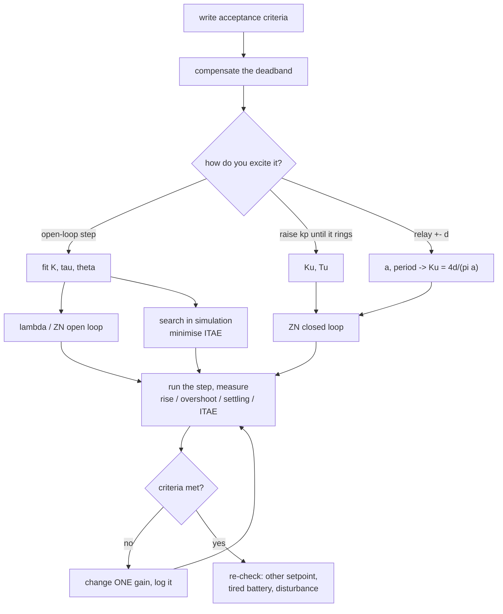

# 08.08 — Tuning PID systematically

<!-- glance:start -->
<!-- generated by tools/build.py from curriculum/syllabus.yaml — edit the syllabus, not this block -->

| | |
|---|---|
| **Track** | Main path |
| **Difficulty** | Intermediate |
| **Time** | 1 h 15 min |
| **Hardware** | Stage 1 robot: Pi 5, Pico, encoder motors, driver, chassis, battery, distance sensors (stage 1) |
| **Software** | python, matplotlib |
| **Prerequisites** | [08.07 PID mathematically — continuous, discrete, and what stability means](08.07-pid-mathematics.md) |
| **Skip if** | You tune loops from logged step responses, not by feel. |

<!-- glance:end -->

## What you will learn

- Run a repeatable tuning procedure: define "good" first, log one open-loop step, fit a model, compute gains, measure, iterate.
- Fit $K$, $\tau$ and the dead time $\theta$ from a logged step, and use $\theta/\tau$ to decide how aggressive you are allowed to be.
- Apply Ziegler–Nichols in both of its forms, and say out loud why its gains overshoot on your robot.
- Get the same information from a relay experiment without ever letting the loop oscillate out of control.
- Score a response with IAE and ITAE, and let a search find gains in simulation — including knowing when not to trust the winner.

## Why it matters

[08.07](08.07-pid-mathematics.md) gave you formulas that turn $K$, $\tau$ and a target speed into gains. This lesson is about the part nobody writes down: how you get $K$, $\tau$ and $\theta$ for *your* robot, on the day, with a half-charged battery; how you know when to stop; and what to do when the numbers say one thing and the robot does another.

You will tune loops constantly from here on — the heading loop in [08.10](08.10-straight-line-heading-control.md), the turn controller in [08.11](08.11-rotate-exactly-90.md), Nav2's local planner in [12.08](../12-navigation/12.08-nav2-on-the-real-robot.md), every arm joint in module 14. Doing it by feel costs an afternoon each time and leaves you unable to explain the result. Doing it by procedure takes twenty minutes and leaves a log, a model and a number you can defend. It is the difference between a lab notebook and a slot machine.

<!-- prereqs:start -->
## Prerequisites

You need these first:

- [08.07 PID mathematically — continuous, discrete, and what stability means](08.07-pid-mathematics.md)

### Optional prerequisite links

None.

Check your readiness: `python course.py why 08.08`
<!-- prereqs:end -->

## Concept

### Tuning is a measurement problem, not a hunt for magic numbers

Every practical tuning method is the same three moves:

1. **Excite the plant** in a way that reveals it — a step, a sequence of steps, or a deliberate oscillation.
2. **Extract two or three numbers** from the log: a gain, a time constant, a dead time; or an ultimate gain and its period.
3. **Apply a rule** that turns those numbers into gains, then **measure** and adjust.

The methods differ only in step 1: open-loop step (safe, needs the plant to be stable), closed-loop oscillation (dangerous, works on anything), relay (safe *and* works on anything, which is why it is what commercial auto-tuners use).

### Define "good" before you start

"Good" is not one thing, and the first question is which one you want:

| You care about | Then you want | Typical robot use |
|---|---|---|
| Never overshooting | high phase margin, slow | an arm approaching a surface, a docking manoeuvre |
| Getting there fast | small $\tau_{cl}$, some overshoot accepted | a wheel-speed loop under a planner |
| Rejecting disturbances | high $k_i$, high bandwidth | driving over a carpet edge |
| Not shaking the robot | low gain, filtered D | anything with a camera on it |
| Surviving a bad day | margin, margin, margin | everything that ships |

Write the acceptance numbers down first — "overshoot under 10%, settled within 0.3 s, no visible wobble at constant speed" — and the tuning stops when you meet them, not when you get bored.

### Ziegler and Nichols, 1942

The two oldest rules in the field. Both are recipes: measure two numbers, look up four multipliers. They were derived for *process* plants (valves, heaters, big lags) and they target **quarter-amplitude decay** — each overshoot a quarter of the last. That is a deliberately oscillatory response. On your wheel loop, expect 10–25% overshoot and a long tail. They are a starting point and a shared vocabulary, not an answer.

### Auto-tuning: make it oscillate on purpose, safely

Åström and Hägglund's relay method replaces "raise $k_p$ until it oscillates" with a bang-bang controller around the setpoint. The loop *must* oscillate — that is what bang-bang does — but the command can never exceed the relay's own amplitude, so nothing runs away. Measure the amplitude and period of the resulting wobble, and one formula gives you the ultimate gain. This is what the auto-tune button on an industrial controller does.

### And then there is the computer

You have a simulator that matches your robot. A step response costs 1.6 s of simulated time and about 20 ms of wall clock. Forty controllers is under a second. Scoring them with a single number (IAE, ITAE) turns tuning into optimisation — and immediately raises the question every ML engineer already knows: what exactly did you overfit to?

> [!TIP]
> **Ask your teacher:** "Walk me through tuning my heading loop from scratch, asking me for one measurement at a time."

## Technical explanation

### Level 1 — The procedure

```text
0. Write the acceptance criteria down.                         ("<10 % overshoot, settled in 0.3 s")
1. Make the plant linear:  compensate the deadband.            (08.02, 08.09)
2. Log ONE open-loop step, at a duty you will actually use.
3. Fit K, tau, theta.                                          (08.08 Part 1)
4. Compute gains from a rule.                                  (lambda, ZN, or a search)
5. Run the closed-loop step. Measure rise / overshoot / settling / IAE.
6. Miss the criteria?  ONE knob at a time, and log every run.
7. Re-check at another setpoint, another battery level, and with a disturbance.
```

Step 7 is the one people skip and the one that causes field failures. Gains tuned at 8 rad/s on a full battery are not automatically right at 2 rad/s on a flat one.

### Level 2 — The model you can actually fit: first order plus dead time

$$G(s) = \frac{K}{\tau s + 1}\,e^{-\theta s} \qquad\Longleftrightarrow\qquad y(t) = K\,u_{step}\left(1 - e^{-(t - t_{step} - \theta)/\tau}\right)$$

Three parameters, fitted by least squares from a single logged step. $\theta$ absorbs everything that is not a first-order lag: the loop period, the transport, the estimator's filter, and the parts of the real motor the model does not have.

**Numerical example (measured on the simulator).** Step to $u = 0.45$ (duty 0.516 after deadband compensation), final speed 8.55 rad/s:

$$K = \frac{8.55}{0.45} = 19.0\ \text{rad/s per unit } u, \qquad \tau = 84\ \text{ms}, \qquad \theta = 13\ \text{ms}$$

`karmel.yaml` says the motor's own $\tau$ is 80 ms; the fit sees 84 ms because the speed estimator's filter is folded in. Both numbers are correct — they answer different questions.

**The controllability ratio $\theta/\tau$** tells you in advance how hard this plant is:

| $\theta/\tau$ | Character | What you can expect |
|---|---|---|
| < 0.1 | lag-dominated, easy | very fast loops, high gains, large margins |
| 0.1 – 0.5 | normal | PI works well; PID adds a little |
| 0.5 – 1 | delay-dominated, hard | gentle gains, or a Smith predictor |
| > 1 | dead-time-dominated | feedback alone is the wrong tool; predict instead |

**Numerical example.** 13/84 = **0.15**: easy. That is the whole reason karmel's wheel loop is forgiving — and why the [08.12](08.12-control-in-ros2.md) experiment, which moves the same loop into a 20 Hz ROS 2 node (θ ≈ 80 ms, θ/τ ≈ 1), turns it into an oscillator.

### Level 3 — The rule tables, and what they assume

Everything below is written in the standard form: $k_p$, integral time $T_i$, derivative time $T_d$, with $k_i = k_p/T_i$ and $k_d = k_p T_d$.

**Ziegler–Nichols, open loop (reaction curve, 1942).** From the fit, with reaction rate $R = K/\tau$ and lag $L = \theta$:

| | $k_p$ | $T_i$ | $T_d$ |
|---|---|---|---|
| P | $1/(RL) = \tau/(K\theta)$ | — | — |
| PI | $0.9/(RL)$ | $L/0.3$ | — |
| PID | $1.2/(RL)$ | $2L$ | $0.5L$ |

**Numerical example.** $K = 19.0$, $\tau = 0.084$, $\theta = 0.013$: $\tau/(K\theta) = 0.084/0.247 = 0.34$. PI: $k_p = 0.9 \times 0.34 = 0.31$, $T_i = 0.013/0.3 = 43$ ms, $k_i = 0.31/0.043 = 7.2$. Measured on the wheel: 11.7% overshoot, 0.76 s settling, ITAE 0.150 — three times the ITAE of a λ = 0.5τ design with a third of the gain.

**Ziegler–Nichols, closed loop (ultimate gain).** Set $k_i = k_d = 0$, raise $k_p$ until the response oscillates with constant amplitude. That gain is $K_u$ and the oscillation period is $T_u$.

| | $k_p$ | $T_i$ | $T_d$ |
|---|---|---|---|
| P | $0.5K_u$ | — | — |
| PI | $0.45K_u$ | $T_u/1.2$ | — |
| PID | $0.6K_u$ | $T_u/2$ | $T_u/8$ |
| "no overshoot" | $0.2K_u$ | $T_u/2$ | $T_u/3$ |

**Numerical example.** Measured $K_u = 0.80$, $T_u = 80$ ms. PI: $k_p = 0.36$, $T_i = 66.7$ ms, $k_i = 5.4$. Measured: 10.0% overshoot, 0.94 s settling.

**Why these overshoot on your robot.** Four assumptions that do not hold here: (1) the target is quarter-amplitude decay, which *is* oscillation; (2) the rules were fitted to plants with $\theta/\tau$ between 0.1 and 1 and a large $\theta$ in absolute terms; (3) they assume no actuator saturation — your duty clamps at 1.0 on every step; (4) they assume a clean measurement, while yours is quantised at 0.13 rad/s. Treat them as "a gain of this order of magnitude", then back off.

**Relay auto-tune.** Replace the controller with $u = u_0 \pm d$, switching whenever the measurement crosses the setpoint. The loop settles into a limit cycle of amplitude $a$ and period $T_u$. Keeping only the first harmonic of the square wave (the describing-function approximation):

$$K_u \approx \frac{4d}{\pi a}$$

**Numerical example.** $d = 0.2$, measured $a = 0.44$ rad/s, period 80 ms: $K_u = 0.8/(\pi \times 0.44) = 0.58$, against the 0.80 measured by pushing $k_p$ up. A 28% underestimate — because the wheel's limit cycle is not a clean sinusoid and the encoder quantises it. That is the normal accuracy of this method, and it is enough: you are about to multiply it by 0.45 anyway. What you get for that error is an experiment that cannot run away, needs 3 s, and can be triggered by a button on the robot.

### Level 4 — Scoring a response, and searching

One number per run lets you compare and automate:

$$\text{IAE} = \int |e|\,dt, \qquad \text{ITAE} = \int t\,|e|\,dt, \qquad \text{ISE} = \int e^2\,dt$$

- **IAE** treats all error equally — good for "how much total error".
- **ITAE** weights late error heavily, so it punishes long tails and ringing. It is the usual choice for tuning, because it prefers a response that *finishes*.
- **ISE** punishes big errors hardest, which biases toward aggressive gains.

**Numerical example.** The λ = 2τ design has the *best* peak behaviour (0.9% overshoot) but ITAE 0.217, because it takes 0.6 s to settle. The ZN PI has IAE 2.23, identical to λ = 1τ's 2.23 — but ITAE 0.150 against 0.078, because ZN's error arrives late, in a ring. IAE alone would have called them equal.

**Searching.** Score is a function of $(k_p, k_i)$; evaluate it on the simulator. A 5 × 5 logarithmic grid plus a coordinate refinement (41 runs, about a second) beats every hand rule in the table. Two honest caveats:

1. **You optimised one step, at one setpoint, on one battery, with one seed.** Always re-score the winner on a different setpoint and a disturbance before believing it. Add a penalty for overshoot you do not want (the script rejects anything above 10%) — otherwise the optimiser will happily buy speed with ringing.
2. **The simulator is not the robot.** A search result is a *starting point of much higher quality* than a rule of thumb, which you then verify with one run on the real machine. This is exactly the sim-to-real argument of [06.10](../06-simulation/06.10-sim-to-real-gap.md), and it is why the course's simulator uses the same motor model the firmware does.

## Diagram

The procedure as a loop, with the three ways to get the numbers:



The relay experiment, drawn:

```text
  duty u
  u0+d ┤ ▔▔▔▔▔▔▔        ▔▔▔▔▔▔▔        ▔▔▔▔▔▔▔       u switches when y crosses the setpoint
  u0   ┤─ ─ ─ ─ ─ ─ ─ ─ ─ ─ ─ ─ ─ ─ ─ ─ ─ ─ ─ ─ ─
  u0−d ┤        ▁▁▁▁▁▁▁        ▁▁▁▁▁▁▁        ▁▁▁

  speed y                     ← one period Tu = 80 ms →
  sp+a ┤    ╱‾╲          ╱‾╲          ╱‾╲
  sp   ┤───╱───╲────────╱───╲────────╱───╲──────   a = 0.44 rad/s half-amplitude
  sp−a ┤  ╱     ╲______╱     ╲______╱     ╲
                                Ku = 4d / (pi a)
```

## Code

The tuning helpers — the FOPDT fit, both Ziegler–Nichols tables, the relay formula and the IAE/ITAE
costs — live in [`08-control/code/pid_lab.py`](code/pid_lab.py) and are used by the experiment:

```python
def fit_first_order_plus_delay(t, y, duty_step, t_step) -> tuple[float, float, float]:
    """Fit y(t) = K*duty_step*(1 - exp(-(t - t_step - theta)/tau)) to a logged OPEN-LOOP step."""
    from scipy.optimize import curve_fit

    def model(tt, gain, tau, theta):
        s = np.maximum(tt - t_step - theta, 0.0)
        return gain * duty_step * (1.0 - np.exp(-s / max(tau, 1e-4)))

    final = float(np.mean(y[t >= t[-1] - 0.3]))
    guess = (final / duty_step if duty_step else 1.0, 0.1, 0.02)
    bounds = ([0.0, 1e-3, 0.0], [np.inf, 5.0, 0.5])
    (gain, tau, theta), _ = curve_fit(model, t, y, p0=guess, bounds=bounds, maxfev=20000)
    return float(gain), float(tau), float(theta)


def ziegler_nichols_ultimate(ku: float, tu: float, kind: str = "PI") -> tuple[float, float, float]:
    """P kp = 0.5 Ku; PI kp = 0.45 Ku, Ti = Tu/1.2; PID kp = 0.6 Ku, Ti = Tu/2, Td = Tu/8."""
    if kind == "PI":
        kp = 0.45 * ku
        return kp, kp / (tu / 1.2), 0.0
    ...


def relay_ultimate_gain(relay_amplitude, oscillation_amplitude, period_s) -> tuple[float, float]:
    """Astrom & Hagglund's relay experiment: Ku = 4 d / (pi a), Tu = the observed period."""
    return 4.0 * relay_amplitude / (math.pi * oscillation_amplitude), period_s
```

Run the whole procedure:

```bash
python 08-control/code/pid_tuning.py --solution --plot pid_tuning.png
```

Output (realistic simulator, about 11 s):

```text
Part 1 - one open-loop step, fitted to K/(tau s + 1) * exp(-theta s)
  step: u = 0.45 after deadband compensation -> duty 0.516, final speed 8.55 rad/s
  K = 19.03 rad/s per unit u   tau = 84 ms   theta = 13 ms
  karmel.yaml says the motor's own tau is 80 ms; the fit sees the estimator's filter and the loop period on top of it
  controllability ratio theta/tau = 0.15 (easy)

Part 2 - gains computed from that model, measured on the wheel
  gains from                     kp     ki      rise overshoot   settling     IAE    ITAE
  lambda = 2 x tau            0.026   0.31     325ms      0.9%      0.60s    2.88   0.217
  lambda = 1 x tau            0.053   0.63     124ms      0.9%      0.32s    2.23   0.078
  lambda = 0.5 x tau          0.105   1.26      51ms      4.9%      0.20s    1.97   0.054
  Ziegler-Nichols PI          0.314   7.47      46ms     11.7%      0.76s    2.23   0.150

Part 3 - the closed-loop experiment: raise kp (P only) until it oscillates
      kp  oscillation    period   settled
    0.20      0.13 rad/s      71ms     6.33
    0.40      0.16 rad/s      79ms     7.07
    0.60      0.33 rad/s      72ms     7.35
    0.80      1.73 rad/s      80ms     7.32
    1.20      1.84 rad/s      76ms     7.20
  -> Ku ~ 0.80, Tu ~ 80 ms (the first gain with a sustained wobble)
  gains from                     kp     ki      rise overshoot   settling     IAE    ITAE
  ZN closed loop, PI          0.360   5.41      46ms     10.0%      0.94s    2.22   0.156
  ZN closed loop, PID         0.480  12.02      46ms     12.3%       infs    2.57   0.517
  ZN closed loop, no_overshoot  0.160   4.01      58ms     12.6%      0.24s    2.04   0.070

Part 4 - relay auto-tune: u = 0.42 +- 0.2
  the wheel oscillates by +-0.44 rad/s with a period of 80 ms
  Ku = 4d/(pi a) = 0.58 (Part 3 measured 0.80), Tu = 80 ms (Part 3: 80 ms)

Part 5 - let the computer search: coordinate descent on ITAE (overshoot > 10 % rejected)
  coarse grid, best three of 25: kp 0.080 ki 1.20 (ITAE cost 0.055), kp 0.160 ki 2.40 (ITAE cost 0.066), kp 0.160 ki 4.80 (ITAE cost 0.075)
  41 simulated step responses = about 66 s of simulated robot time, a few seconds of wall clock
  gains from                     kp     ki      rise overshoot   settling     IAE    ITAE
  the search                  0.112   1.68      50ms      8.5%      0.20s    1.98   0.053
```


Reading it:

- **The fit is the whole game.** One step, three numbers, and everything else is arithmetic. The fitted curve lies on the data (left panel); if it does not, no rule downstream will help.
- **Ziegler–Nichols gives you the right order of magnitude and the wrong response.** Both ZN PI designs land near $k_p \approx 0.3$–$0.36$ and both overshoot 10–12% with a long tail. ZN PID (ITAE 0.517, never settles within 3%) is actively bad here: D on a quantised speed signal is noise ([08.06](08.06-derivative-control.md)).
- **"No overshoot" overshoots 12.6%.** The rule's name is a promise about a different plant. Its *ITAE* (0.070) is genuinely good, though — gentler gains, quick settle.
- **The relay gets within 30% for free.** $K_u$ 0.58 vs 0.80, $T_u$ exactly right. Multiply by 0.45 and you have a working PI without ever having pushed a loop to the edge.
- **The search wins, narrowly, and you should still not trust it blindly.** ITAE 0.053 against the λ = 0.5τ design's 0.054 — a 2% improvement over a formula that took no simulation at all. The formula generalises; the search's 0.112/1.68 was chosen for this one step.

**On the robot:** `python 08-control/code/pid_tuning.py --port /dev/ttyACM0` (wheels in the air). Expect a larger θ than the simulator's 13 ms, and therefore lower gains everywhere.

## Exercise

> [!CAUTION]
> **Safety:** Part 3 deliberately drives the loop into oscillation and Part 4 runs bang-bang: the duty slams between two values a dozen times a second. Wheels in the air on a stand, battery switch in reach, nothing near the tyres, and stop if the gearbox sounds like it is being hammered. Never run the $K_u$ search on the floor, and never on an arm.

### Exercise 08.08-E1 — Apply the rules by hand `[numerical]`

Hardware: none. Your fit gives $K = 16.0$ rad/s per unit, $\tau = 110$ ms, $\theta = 30$ ms. Compute (a) $\theta/\tau$ and what it tells you; (b) ZN open-loop PI gains ($k_p$, $T_i$, $k_i$); (c) λ-tuning gains for $\tau_{cl} = \tau$; (d) the ratio between the two $k_p$ values; (e) if a relay with $d = 0.15$ produces a limit cycle of ±0.6 rad/s at 120 ms, the ZN closed-loop PI gains.

### Exercise 08.08-E2 — Tune from your own log `[simulation]`

Hardware: none. Change the open-loop step in Part 1 to $u = 0.25$ instead of 0.45 and re-run. (a) Do $K$, $\tau$, $\theta$ come out the same? (b) Recompute the λ = 0.5τ gains from the new fit and run them. (c) Now fit on a step to $u = 0.9$ (near saturation) and explain what happens to $K$.

### Exercise 08.08-E3 — Predict: the cost function `[predict]`

Hardware: none. Before running: the search currently minimises ITAE with a penalty above 10% overshoot. Predict what the winning gains look like if you (a) minimise IAE instead, (b) remove the overshoot penalty, (c) minimise ITAE but add 40 ms of extra delay (`delay_steps=2`) to every evaluation. Then make each change and check.

### Exercise 08.08-E4 — Does it generalise? `[simulation]`

Hardware: none. Take the search's winning gains and re-score them at setpoints 2, 8 and 15 rad/s, and with `battery_initial_soc=0.15`. Do the same for the λ = 1τ design. Which one degrades less, and what does that tell you about tuning by optimisation?

### Exercise 08.08-E5 — Build your own relay auto-tuner `[coding]`

Hardware: none. Write a function `autotune(base, model, setpoint) -> (kp, ki)` that runs the relay for 3 s, measures $a$ and $T_u$, applies `relay_ultimate_gain` and the ZN closed-loop PI rule, and returns the gains. It must detect and report failure (no clean limit cycle: fewer than four crossings, or an amplitude below 3× the encoder's quantisation step). Test it at setpoints 4, 8 and 12 rad/s.

### Exercise 08.08-E6 — Tune your robot `[hardware]`

Hardware: robot-base. Simulation alternative: `--fake`. Wheels in the air.
Run the full procedure on your robot: `python 08-control/code/pid_tuning.py --port /dev/ttyACM0 --plot my_tuning.png`. Record your $K$, $\tau$, $\theta$, $K_u$, $T_u$. Then pick the design that meets *your* acceptance criteria, write the gains into `labs/firmware/pico/config.py` as `VELOCITY_KP` / `VELOCITY_KI`, and re-run [08.01](08.01-open-vs-closed-loop.md)'s experiment to see the difference end to end.

### Exercise 08.08-E7 — The tuning log `[design]`

Hardware: none. Design a one-page tuning record you would be happy to hand to a colleague: what is measured, what is computed, what is decided, what is re-checked. Use it for E6. It should let someone else reproduce your gains without talking to you.

## Expected result

**08.08-E1:** (a) $30/110 = 0.27$ — normal; PI is a good fit, gentle PID is possible. (b) $\tau/(K\theta) = 0.11/(16 \times 0.03) = 0.229$; $k_p = 0.9 \times 0.229 = 0.206$, $T_i = 0.03/0.3 = 0.10$ s, $k_i = 2.06$. (c) $k_p = \tau/(K\tau_{cl}) = 0.11/(16 \times 0.11) = 0.0625$, $k_i = k_p/\tau = 0.57$. (d) ZN's $k_p$ is **3.3×** the λ = τ one — the usual factor, and the usual reason ZN overshoots. (e) $K_u = 4 \times 0.15/(\pi \times 0.6) = 0.318$; PI: $k_p = 0.143$, $T_i = 0.12/1.2 = 0.1$ s, $k_i = 1.43$.

**08.08-E2:** (a) $K$ and $\tau$ come out within a few per cent (the plant really is close to linear once the deadband is compensated); θ is the noisiest of the three because a smaller step has a worse signal-to-noise ratio. (b) Gains within ~10% of the lesson's; the measured response is indistinguishable. (c) At $u = 0.9$ the wheel is near its top speed, the response flattens early, and the fitted $K$ comes out **lower** (about 10–15%) with a longer τ: you have fitted the saturation, not the motor. Fit in the region you will operate in, and never across a saturation boundary.

**08.08-E3:** (a) IAE rewards getting there *fast* and is nearly blind to late ringing, so the winner moves to higher $k_p$ and higher $k_i$ (roughly 0.16 / 2.4 here) with more overshoot. (b) Without the penalty the optimiser goes further still — ITAE tolerates a short sharp overshoot if the tail is short. (c) With 40 ms of extra delay every candidate is worse, and the winner moves to *much* gentler gains (roughly a third of $k_p$): the optimiser rediscovers the phase-margin limit from [08.07](08.07-pid-mathematics.md) without being told about it.

**08.08-E4:** At 2 rad/s both are fine (small signal); at 15 rad/s the search's higher gains saturate more and overshoot grows more than the λ design's; on a 15% battery the λ design keeps its shape while the search's gains, tuned against a fresh pack's $K$, become relatively more aggressive (the plant gain dropped, so the loop is slower but the ringing pattern shifts). The lesson: an optimiser's answer is only as broad as the set of conditions you scored it on. Score over a *set* of runs, not one.

**08.08-E5:** At 8 rad/s you should get $K_u$ in the range 0.5–0.7 and $T_u$ ≈ 80 ms, giving $k_p$ ≈ 0.23–0.32, $k_i$ ≈ 3.5–4.8 — gains that work, with 8–15% overshoot. At 4 rad/s the limit cycle is smaller and the estimate noisier; at 12 rad/s it is cleaner. Your failure detector should fire if you try the relay with $d = 0.02$ (the limit cycle disappears into the encoder's 0.13 rad/s quantisation).

**08.08-E6:** Typical karmel numbers: $K$ 15–22 rad/s per unit, $\tau$ 60–120 ms, $\theta$ 20–45 ms (bigger than the simulator's, because the real serial link and the real filter are in there), $K_u$ 0.4–0.9, $T_u$ 60–120 ms. Your ZN gains will overshoot more than the simulator's. After writing the new gains into `config.py` and reflashing, the 08.01 "firmware speed loop" run should hold its heading at least as well as before, with a visibly faster response to a setpoint change.

**08.08-E7:** A usable record has: date, battery voltage, robot, the raw step log file name, the fitted $K$/τ/θ, the rule used and its output, the measured metrics for every candidate, the acceptance criteria, the chosen gains, and the re-check results. One page, and no sentence containing the word "felt".

## Troubleshooting

### Symptom: the fit does not match the data
Plot the fit on top of the log before using any of its numbers. 1) Is the step inside the deadband, or across saturation? Refit in the linear region. 2) Did the battery sag during the step (log `battery_v`)? 3) Is the "step" actually a step — check what the command did, not what you intended. 4) Is the wheel loaded differently than it will be (on a stand vs on the floor)? If the residual is structured (a bend, not noise), the plant is not first order and $\theta$ is absorbing the difference — that is fine as long as you tune with the same $\theta$.

### Symptom: raising kp never produces a clean oscillation, it just gets noisy
Your plant is lag-dominated and quantisation dominates before instability does. Two fixes: use the relay method instead (Part 4), which forces a clean limit cycle at a controlled amplitude; or add the delay you actually have in the real system and re-run. If you cannot get $K_u$, you do not need it: the λ design from the fit is better anyway.

### Symptom: the gains work on the bench and not on the floor
The load changed: the wheels now push the robot's mass. Refit $K$ and $\tau$ on the floor (drive in a straight line in a corridor), or tune with enough margin that a 30% change in $K$ does not matter — which is what a large $\tau_{cl}$ buys you. Check the battery too; a 10% voltage drop is a 10% change in $K$.

### Symptom: the search's winner is unstable on the real robot
The simulator's θ is smaller than the real one. Add the real delay into the simulation (`delay_steps`) and re-search, or apply the standard discount: take the search's $k_p$ and halve it, then verify.

### Symptom: it settles beautifully but hums at constant speed
You optimised a step. Add a steady-state term to your score: the standard deviation of the duty over the last second (08.06's "chatter"), or just listen to the motor — a tuning score that ignores noise will always pick the noisiest gains that pass.

## Common mistakes

- **Tuning before compensating the deadband.** Below 0.12 duty the plant gain is zero; every rule you apply is describing a plant that does not exist there.
- **Tuning at one setpoint only.** Re-check at a low speed, a high speed and a tired battery. It takes three more minutes.
- **Changing two gains at once.** You learn nothing, and you cannot go back.
- **Not logging.** The run you cannot reproduce did not happen. Save the CSV with the gains in the filename.
- **Taking Ziegler–Nichols literally.** It is a starting point for a class of plants that is not quite yours. Start there, back off, measure.
- **Believing a simulated optimum.** Score over several conditions, penalise what you do not want, then verify on hardware.
- **Using $K_u$ found by pushing the gain on a machine that can hurt something.** Use the relay. That is what it is for.

## Knowledge check

1. Why does every tuning procedure start with an *open-loop* step?
   <details><summary>Answer</summary>

   Because it measures the plant, not the plant-plus-controller. $K$, $\tau$ and $\theta$ belong to the motor and are the same whatever gains you later choose; anything measured with a controller in the loop mixes the two.
   </details>

2. A fit gives $\theta/\tau = 0.8$. What does that change about your plan?
   <details><summary>Answer</summary>

   It is delay-dominated: gentle gains, a large $\tau_{cl}$, and realistically no useful D. Before tuning, look for the delay and remove it (faster loop, faster sensor, move the loop closer to the actuator). Tuning cannot buy back dead time.
   </details>

3. $K_u = 0.6$, $T_u = 100$ ms. Give the ZN closed-loop PI gains in both forms.
   <details><summary>Answer</summary>

   $k_p = 0.45 \times 0.6 = 0.27$, $T_i = 100/1.2 = 83$ ms, so $k_i = 0.27/0.083 = 3.25$.
   </details>

4. Two controllers have the same IAE but very different ITAE. What does the one with the larger ITAE look like?
   <details><summary>Answer</summary>

   Its error arrives late: overshoot followed by a long tail or ringing. Same total error, worse distribution. ITAE is the metric that notices.
   </details>

5. Predict: you run the relay experiment with $d$ ten times smaller. What happens to the estimate of $K_u$, and why?
   <details><summary>Answer</summary>

   The limit cycle shrinks toward the noise and quantisation floor; the measured amplitude $a$ stops shrinking proportionally (it is dominated by noise), so $K_u = 4d/(\pi a)$ comes out far too small. Use a $d$ that produces a limit cycle several times the sensor's resolution — and no larger.
   </details>

6. Debugging: gains that were perfect yesterday overshoot today. Name four things to check, in order of cost.
   <details><summary>Answer</summary>

   Battery voltage (plant gain scales with it); loop period/jitter (is the Pi busier?); mechanical change (a tighter gearbox, a dragging wheel, a new load); and the measurement path (did someone change the filter α?). Refit $K$, $\tau$, $\theta$ before touching a gain.
   </details>

7. Why is the relay method the one that ships in commercial auto-tuners, rather than "raise $k_p$ until it oscillates"?
   <details><summary>Answer</summary>

   It is bounded by construction: the command never leaves $u_0 \pm d$, so the plant cannot run away, and it works on plants you may not push to instability (ovens, arms, vehicles). It also completes in a few periods rather than requiring a manual search.
   </details>

8. You tuned in simulation with a search and the result oscillates on the robot. What is the most likely single difference, and the cheapest fix?
   <details><summary>Answer</summary>

   The real dead time is larger than the simulated one. Cheapest fix: halve $k_p$ (and $k_i$ with it) and verify; proper fix: measure the real θ from a logged step on the robot and re-design with it, or re-run the search with that θ injected into the simulation.
   </details>

## Practical challenge

**Tune a loop you have never tuned, by procedure only, in under 30 minutes.**

Change the plant so your existing gains are wrong, without looking at the new parameters: run the experiment with `Target(args, motor_time_constant_s=<something between 0.03 and 0.3>, ...)` chosen by a coin flip, or (better) on your real robot with a heavy object taped to the chassis and the wheels on the floor. Then:

1. Write acceptance criteria.
2. Log one open-loop step and fit $K$, $\tau$, $\theta$.
3. Compute gains three ways (λ, ZN from the fit, relay + ZN).
4. Measure all three, pick one, justify the choice with the numbers.
5. Re-check at two other setpoints and on a tired battery.

**Acceptance criteria:** a single page with the fit, the three candidate gain sets, a table of measured rise/overshoot/settling/ITAE for each, the chosen gains, and the re-check results; the chosen controller meets your own written criteria at all three setpoints; and you can state the plant's $\theta/\tau$ and phase margin from memory at the end. Bonus: your relay auto-tuner from E5 produces gains within 30% of the ones you chose.

## You can skip this if…

You answer knowledge-check questions 2, 4 and 7 correctly without looking, and you can take a logged step response and produce defensible PI gains plus the measured response in under ten minutes, without consulting a table.

`python course.py skip 08.08 --reason "I tune loops from logged step responses with a written procedure"`

## Go deeper

- Åström & Murray, *Feedback Systems* (2nd ed.): https://www.cds.caltech.edu/~murray/FBS/Second_Edition.html — chapter 11 covers PID tuning, Ziegler–Nichols and their limitations properly.
- MATLAB Tech Talks, *Understanding PID Control*: https://www.mathworks.com/videos/series/understanding-pid-control.html — parts 6 and 7 are tuning, including automatic tuning.
- MATLAB Tech Talks, *Control Systems in Practice*: https://www.youtube.com/playlist?list=PLn8PRpmsu08pFBqgd_6Bi7msgkWFKL33b — what actually goes wrong between a design and a machine.
- Brett Beauregard, *Improving the Beginner's PID*: http://brettbeauregard.com/blog/2011/04/improving-the-beginners-pid-introduction/ — the embedded details (sample time, gain changes, on/off) that tuning assumes are already right.
- [FCT.04 Stability: poles without the pain](../optional-foundations/control-theory/FCT.04-stability-intuition.md) — the phase-margin picture behind every "back off by a factor of two" in this lesson.
- [FCT.06 State space, LQR and MPC — an introduction](../optional-foundations/control-theory/FCT.06-state-space-lqr-mpc.md) — when no amount of tuning fixes the loop because a single-input PID is the wrong structure. Nav2's MPPI controller ([12.05](../12-navigation/12.05-local-planning-obstacle-avoidance.md)) is the version of this you will meet first.

## Progress checkpoint

- [ ] I fit $K$, $\tau$ and $\theta$ from one logged open-loop step and know what $\theta/\tau$ implies.
- [ ] I can apply both Ziegler–Nichols rules and explain why their gains overshoot here.
- [ ] I can run a relay experiment and turn its amplitude and period into gains.
- [ ] I score responses with IAE/ITAE and I re-check a winner at other setpoints before shipping it.

`python course.py complete 08.08` (exercises done) · `python course.py master 08.08` (challenge done) · `python course.py struggle 08.08 "what was hard"`

Next: [08.09 — Feedforward + PID: drive at exactly 0.5 m/s](08.09-feedforward-exact-speed.md).
