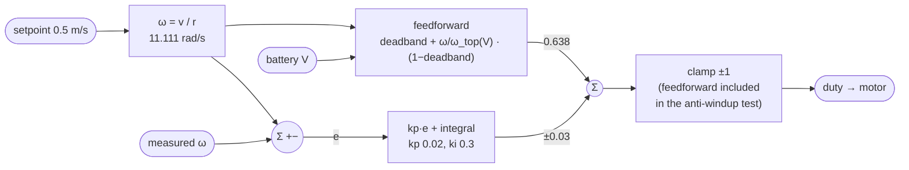

# 08.09 — Feedforward + PID: drive at exactly 0.5 m/s

<!-- glance:start -->
<!-- generated by tools/build.py from curriculum/syllabus.yaml — edit the syllabus, not this block -->

| | |
|---|---|
| **Track** | Main path |
| **Difficulty** | Intermediate |
| **Time** | 1 h |
| **Hardware** | Stage 1 robot: Pi 5, Pico, encoder motors, driver, chassis, battery, distance sensors (stage 1) |
| **Software** | python |
| **Prerequisites** | [08.08 Tuning PID systematically](08.08-tuning-pid.md) |
| **Skip if** | Your robot holds 0.5 m/s within a few percent on the floor. |

<!-- glance:end -->

## What you will learn

- Convert a ground speed in m/s into a wheel speed in rad/s, and back, for your robot's wheels.
- Invert the motor model of 08.02 into a feedforward term, including the deadband and the measured battery voltage.
- Combine feedforward with a small PI so the feedback only has to fix what the model got wrong — and measure how much less work it does.
- Say what each term of the model is worth in per cent, by deleting it and watching.
- Explain why a robot that holds 0.5 m/s at the *wheel* may not travel 0.5 m/s over the *floor*.

## Why it matters

Every command your robot will ever receive from ROS 2 is a speed: `cmd_vel` says "0.35 m/s, 0.2 rad/s" and expects to get it. Odometry ([09.03](../09-odometry/09.03-dead-reckoning-integration.md)) assumes it did. Nav2 plans a path on the assumption that a commanded speed is an achieved speed. A loop that gets there *eventually* is not the same as a loop that gets there *now* and stays.

Pure feedback can only act after an error exists. That is fine for a constant setpoint and hopeless for a setpoint that keeps moving — which is what a motion profile ([08.11](08.11-rotate-exactly-90.md)) and a path follower ([12.05](../12-navigation/12.05-local-planning.md)) produce. Feedforward is the other half of the controller: you already measured the motor in [08.02](08.02-motor-step-response.md), so use the model to guess the right duty *before* any error appears, and let the PI clean up the few per cent that is left. This is why the Pico firmware ships `VELOCITY_FF = 1.0` and gains as small as $k_p = 0.02$.

<!-- prereqs:start -->
## Prerequisites

You need these first:

- [08.08 Tuning PID systematically](08.08-tuning-pid.md)

### Optional prerequisite links

None.

Check your readiness: `python course.py why 08.09`
<!-- prereqs:end -->

## Concept

### Feedback is a correction, not a plan

Imagine steering a car by looking only at the lane markings and never at the road ahead. You would stay in the lane — badly, late, weaving. What you actually do is *plan* (turn the wheel by roughly the right amount for this curve) and *correct* (nudge when you drift). The plan is feedforward. The nudge is feedback.

You have the plan already. In [08.02](08.02-motor-step-response.md) you measured that the wheel needs about 0.12 duty before it moves at all, and that above that its speed is proportional to duty. "I want 11.1 rad/s" therefore has a *computable* answer — roughly 0.64 duty — and there is no reason to make an integrator discover it one 20-millisecond step at a time.

### Two degrees of freedom

Splitting the controller in two lets you tune two things independently:

- **Feedforward** sets how fast and how accurately the robot follows a *command*. Better model = better tracking. It has no stability implications at all: it is open loop, it cannot ring.
- **Feedback** sets how well the robot rejects *disturbances* — the carpet, the slope, the 6%-weak motor, the battery sagging. Higher gain = better rejection, worse margin.

With no feedforward those two are the same knob, and you end up choosing a gain that is too high for comfort because it is the only way to get a fast response. That is why the firmware can run $k_p = 0.02$, $k_i = 0.3$ — gains so gentle they could not possibly oscillate — and still snap to speed.

### The model will be wrong, and that is the point

The simulator's left motor matches the model exactly; its right motor is 6% weaker, like a real pair. Feedforward drives the left wheel to 0.500 m/s and the right one to 0.470 m/s, forever, with no error signal to tell it otherwise. The integral term is what closes that last 6%. **Neither half is optional.**

> [!TIP]
> **Ask your teacher:** "Show me on one plot which part of the duty came from the model and which from the feedback, over a step."

## Technical explanation

### Level 1 — From m/s to duty, in three steps

$$v = r\,\omega \quad\Rightarrow\quad \omega = \frac{v}{r}, \qquad\text{then}\qquad u_{ff} = \mathrm{sign}(\omega)\left(u_{db} + \frac{|\omega|}{\omega_{top}(V)}\,(1 - u_{db})\right)$$

with $\omega_{top}(V) = \omega_{max}\dfrac{V}{V_{nom}}$: the speed the wheel reaches at duty 1.0 *at the voltage you measured right now*.

**Numerical example (karmel).** $v = 0.5$ m/s, $r = 0.045$ m → $\omega = 11.111$ rad/s, which is 106 rpm and 65% of the motor's 17 rad/s top speed. At the nominal 10.8 V:

$$u_{ff} = 0.12 + \frac{11.111}{17.0}\,(1 - 0.12) = 0.12 + 0.6536 \times 0.88 = 0.695$$

At a freshly charged 12.1 V, $\omega_{top} = 17 \times 12.1/10.8 = 19.05$ rad/s and $u_{ff} = 0.12 + 0.583 \times 0.88 = 0.633$. At 9.9 V, $u_{ff} = 0.748$. Same wheel, same speed, three different duties — which is exactly what the battery term is for.

### Level 2 — The combined controller

$$u = \underbrace{u_{ff}(r_{sp}, V)}_{\text{the model}} + \underbrace{k_p\,e + I}_{\text{the correction}}, \qquad I \mathrel{+}= k_i\,e\,\Delta t$$

Three implementation rules, all of which the exercise's tests enforce:

1. **The feedforward is part of the anti-windup test.** The unclamped output is $u_{ff} + k_p e + I_{candidate}$. Leave $u_{ff}$ out and the integral winds up while the model alone is already saturating the motor.
2. **A setpoint of exactly zero must give exactly zero duty**, not the deadband. Otherwise "stop" becomes "creep".
3. **Use the measured voltage, not the nominal one.** It is in every telemetry frame; there is no excuse.

**Numerical example.** Setpoint 11.111 rad/s, measured 10.0, $k_p = 0.02$, $k_i = 0.3$, $\Delta t = 20$ ms, $V = 10.8$ V. $u_{ff} = 0.695$, $P = 0.02 \times 1.111 = 0.0222$, $I = 0.3 \times 1.111 \times 0.02 = 0.0067$. Output 0.724. The model contributed 96% of it.

### Level 3 — What each term is worth, measured

Delete one term at a time from the feedforward, leave the feedback off, and read the steady-state error:

| Feedforward model | duty sent | left wheel | right wheel |
|---|---|---|---|
| no deadband term | 0.588 | −9.5% | −15.0% |
| no battery term (assume nominal) | 0.695 | +10.9% | +4.3% |
| full model | 0.638 | **+0.0%** | −6.0% |

The deadband is worth 9.5 percentage points on a perfectly modelled motor; the battery term is worth 10.9 at a full pack and, on a 15%-charged one, the difference between 0.500 m/s and 0.430 m/s (−14.1%). What the model cannot fix is the right motor's 6% weakness, because that is not in the model.

**The error budget of a feedforward.** Write down where the remaining error can come from, in order of size on karmel:

| Source | Typical size | Fixed by |
|---|---|---|
| motor-to-motor gain spread | 3–8% | the integral term |
| battery voltage | up to 20% over a discharge | the battery term |
| deadband (static friction, driver) | 10–15% | the deadband term |
| wheel radius vs nominal | 0.5–2% | calibration ([09.05](../09-odometry/09.05-calibrating-odometry.md)) |
| load, slope, carpet | 0–20%, varying | the integral term |
| temperature, wear | slow drift | the integral term |

Anything *constant* belongs in the model; anything *varying* belongs to feedback. That sentence is the whole design rule.

### Level 4 — Where the feedforward already lives, and where it goes next

In the firmware, `feedforward_duty()` in [`labs/firmware/pico/velocity.py`](../labs/firmware/pico/velocity.py) is exactly the formula above, scaled by `VELOCITY_FF` (1.0 = full model inversion, 0.0 = pure PID) — with one difference from what you are building: it uses `MAX_WHEEL_SPEED_RAD_S` at the nominal voltage and does **not** read the battery. That is the +10.9% row in the table, and it is why the Pico's velocity loop overshoots a little on a full pack ([08.12](08.12-control-in-ros2.md), Part 1). Fixing it is this lesson's practical challenge.

Beyond speed, the same idea appears everywhere:

- **Acceleration feedforward.** When the setpoint itself is moving, feed forward its derivative too: $u = u_{ff}(\omega_{sp}) + k_{ff,a}\,\dot\omega_{sp} + \text{PID}$. The trapezoidal profile in [08.11](08.11-rotate-exactly-90.md) is built to make $\dot\omega_{sp}$ known and bounded, precisely so it can be fed forward.
- **Gravity compensation** on an arm (module 14): the torque needed to hold a link against gravity is computable from the joint angles; feed it forward and the joint PID only fights friction.
- **`cmd_vel` → wheel speeds** in ROS 2: `diff_drive_controller` inverting the kinematics is a feedforward. Nothing measures the robot's speed in that path.

A warning that Part 1 makes visible: feedforward responds to a setpoint *step* instantly, while the wheel cannot. For 0.2 s the error is large, the integral fills, and the response overshoots to ~0.59 m/s before settling — worse than feedforward alone. The cure is not a smaller $k_i$; it is not to command steps. Ramp the setpoint (Part 4, and [08.11](08.11-rotate-exactly-90.md)), and the same controller tracks within a rad/s the whole way.

## Diagram

The two-degrees-of-freedom controller:



Where the duty comes from, holding 0.5 m/s on the 6%-weak right wheel:

```text
  duty 1.0 ┤
           │
     0.68  ┤ ░░░░░░░░░░░░░░░░░░░░  ← feedback (integral): +0.04, the motor's 6 %
     0.638 ┤ ████████████████████  ← feedforward from the model
           │ ████████████████████
       0.0 ┴────────────────────────────────────→ time
             the model does 94 % of the work; the loop does the part the model does not know
```

## Code

### Your feedforward (auto-graded exercise)

Implement `wheel_speed_for`, `FeedforwardModel` and `FeedforwardPI` in
[`labs/exercises/08.09/student.py`](../labs/exercises/08.09/student.py). Reference, after trying:

```python
@dataclass(frozen=True)
class FeedforwardModel:
    """The 08.02 motor model, inverted: duty = deadband + |w|/top_speed * (1 - deadband)."""

    max_wheel_speed_rad_s: float
    deadband: float
    nominal_v: float
    use_battery: bool = True

    def top_speed(self, battery_v: float | None = None) -> float:
        if not self.use_battery or battery_v is None or battery_v <= 0:
            return self.max_wheel_speed_rad_s
        return self.max_wheel_speed_rad_s * battery_v / self.nominal_v

    def duty(self, setpoint_rad_s: float, battery_v: float | None = None) -> float:
        if setpoint_rad_s == 0:
            return 0.0  # exactly zero: never send the deadband duty, the wheel would creep
        fraction = min(abs(setpoint_rad_s) / self.top_speed(battery_v), 1.0)
        duty = self.deadband + fraction * (1.0 - self.deadband)
        return math.copysign(min(duty, 1.0), setpoint_rad_s)
```

and the controller's update, which is your 08.05 PI with the feedforward added everywhere it belongs:

```python
    def update(self, setpoint_rad_s, measured_rad_s, dt, battery_v=None):
        error = setpoint_rad_s - measured_rad_s
        self.feedforward = self.model.duty(setpoint_rad_s, battery_v)
        others = self.feedforward + self.kp * error       # everything except the integral
        candidate = self.integral + self.ki * error * dt
        if others + candidate > self.output_max and error > 0:
            self.integral = max(self.integral, self.output_max - others)
        elif others + candidate < self.output_min and error < 0:
            self.integral = min(self.integral, self.output_min - others)
        else:
            self.integral = candidate
        self.integral = min(max(self.integral, self.output_min), self.output_max)
        self.output = min(max(others + self.integral, self.output_min), self.output_max)
        return self.output
```

Check it: `python course.py check 08.09`

### The experiment

[`08-control/code/feedforward_speed.py`](code/feedforward_speed.py) runs one controller per wheel on
the realistic simulator, whose left motor matches the model and whose right motor is 6% weaker.

```bash
python 08-control/code/feedforward_speed.py --solution --plot feedforward.png
```

Output:

```text
0.50 m/s with 45 mm wheels = 11.111 rad/s per wheel (106 rpm), 65% of top speed
feedforward duty at the nominal 10.8 V: 0.695

Part 1 - step 0 -> 0.5 m/s, fresh battery
  controller                   left m/s     err right m/s     err  settling  R |u_fb|   R IAE
  PI only (kp 0.02, ki 0.3)       0.500   -0.0%     0.500   +0.0%     0.60s     0.673    2.16
  feedforward only                0.500   +0.0%     0.470   -6.0%      infs     0.000    2.12
  feedforward + PI                0.500   -0.0%     0.500   -0.0%     0.68s     0.314    1.19

Part 2 - feedforward ONLY, one model term at a time (nothing hides the error)
  feedforward model              duty  left m/s      err  right m/s      err
  no deadband term              0.588     0.452    -9.5%      0.425   -15.0%
  no battery term               0.695     0.555   +10.9%      0.521    +4.3%
  full model                    0.638     0.500    +0.0%      0.470    -6.0%

Part 3 - battery at 15 % state of charge (9.45 V under load)
  controller                   left m/s     err right m/s     err  settling  R |u_fb|   R IAE
  PI only (kp 0.02, ki 0.3)       0.500   -0.1%     0.499   -0.1%     0.78s     0.836    2.69
  feedforward only                0.500   +0.0%     0.470   -6.0%      infs     0.000    2.11
  feedforward + PI                0.500   +0.0%     0.500   +0.0%     0.70s     0.223    1.06
  feedforward only, nominal V     0.430  -14.1%     0.404  -19.2%      infs     0.000    4.44

Part 4 - tracking a moving setpoint (ramp to 0.5, down to 0.2, back up), measured from t = 0.8 s
  controller                      RMS error   worst error
  PI only (kp 0.02, ki 0.3)       1.303 rad/s     3.879 rad/s
  feedforward only                1.045 rad/s     2.900 rad/s
  feedforward + PI                0.515 rad/s     1.115 rad/s

Part 5 - on the floor: true path length / time over the last 2 s
  controller                    ground speed     err  heading drift
  PI only (kp 0.02, ki 0.3)          0.501 m/s   +0.3%        +3.0 deg
  feedforward only                   0.486 m/s   -2.8%       -17.8 deg
  feedforward + PI                   0.501 m/s   +0.3%        +2.6 deg
```


What the numbers say:

- **Both halves are needed.** Feedforward alone: the right wheel sits 6% low forever. PI alone: gets there, but the feedback term has to reach 0.673 of duty by itself, and the integral of absolute error is nearly twice as large (2.16 vs 1.19).
- **Feedback effort halves** (0.673 → 0.314), and on a tired battery it is a quarter (0.836 → 0.223). That headroom is what lets you keep the gains gentle — and gentle gains are what survive delay ([08.07](08.07-pid-mathematics.md)).
- **The model terms are worth what the arithmetic said.** Deadband −15%, battery −19% on a flat pack. Nothing mysterious: they are the two straight-line parameters you measured in 08.02.
- **Tracking is where feedforward earns its keep**: 0.515 rad/s RMS against 1.303 for PI alone, a 2.5× improvement, and the worst-case error drops from 3.9 to 1.1 rad/s. Every moving setpoint from here on is this case.
- **The wheel is not the floor.** All three hold the wheel speed, but only the closed-loop runs travel 0.501 m/s, and every run drifts in heading — up to −17.8° when the right wheel is 6% slow. Holding wheel speed is necessary and not sufficient; [08.10](08.10-straight-line-heading-control.md) adds the missing loop and [09.05](../09-odometry/09.05-calibrating-odometry.md) calibrates the radius that makes 0.501 not exactly 0.500.

**On the robot:** `python 08-control/code/feedforward_speed.py --port /dev/ttyACM0` (wheels in the air for Parts 1–4; Part 5 is simulation-only).

## Exercise

> [!CAUTION]
> **Safety:** 0.5 m/s is fast for a 1.6 kg robot — it crosses a desk in under a second and a fall from table height will break something. Parts 1–4 run with the wheels in the air on a stand. Part 5 and E5 need at least 3 m of clear floor, a reachable power switch, and no pets, children or cables in the lane. Never run a speed test toward a wall you cannot stop before.

### Exercise 08.09-E1 — Feedforward by hand `[numerical]`

Hardware: none. Your robot: $r = 0.045$ m, $\omega_{max} = 17$ rad/s at 10.8 V, deadband 0.12. Compute the feedforward duty for (a) 0.5 m/s at 12.4 V, (b) 0.5 m/s at 9.9 V, (c) 0.2 m/s at 11.5 V, (d) −0.5 m/s at 11.5 V, (e) 0.8 m/s at 11.5 V. (f) At what battery voltage does 0.5 m/s need duty 1.0?

### Exercise 08.09-E2 — Implement it `[coding]`

Hardware: none. Implement `wheel_speed_for`, `FeedforwardModel` and `FeedforwardPI` in `labs/exercises/08.09/student.py`.

Check it: `python course.py check 08.09`

Then run `python 08-control/code/feedforward_speed.py --plot mine.png` without `--solution` and reproduce the tables.

### Exercise 08.09-E3 — Predict: the flat battery `[predict]`

Hardware: none. Before running Part 3: predict, for a 9.45 V pack, (a) the steady-state speed of "feedforward only, nominal V" in m/s, from the model; (b) what the *feedback* term of "feedforward + PI" must settle at; (c) whether the settling time gets better or worse than on a full pack, and why. Then run it.

### Exercise 08.09-E4 — How wrong may the model be? `[simulation]`

Hardware: none. Run "feedforward only" with a model whose `max_wheel_speed_rad_s` is 10%, 20% and 40% too high, and again 10/20/40% too low. Plot the steady-state error against the model error. Then repeat with the PI switched on and plot the *feedback term* instead. At what model error does the feedback term saturate, and what happens then?

### Exercise 08.09-E5 — 0.5 m/s with a tape measure `[hardware]`

Hardware: robot-base. Simulation alternative: Part 5 of the script.
Mark a 3 m line on the floor with tape. Drive the robot along it with feedforward + PI at 0.5 m/s, timing from the moment it passes the start mark to when it passes the end mark (use a phone video at 60 fps if you can; it is more accurate than a thumb). Do five runs. Report mean and spread in m/s, and compare with the wheel speed your telemetry reported. Then repeat with a nearly flat battery.

### Exercise 08.09-E6 — The creep bug `[debugging]`

Hardware: none. A colleague's robot "shivers" when idle: both wheels twitch forward every few seconds although `cmd_vel` is zero. (a) Name the bug in their feedforward. (b) Why does it appear only on some robots, and why is it worse when the battery is full? (c) Which test in `labs/exercises/08.09/test_exercise.py` catches it? (d) They "fix" it with `if abs(setpoint) < 0.5: return 0.0`. Explain what that breaks.

### Exercise 08.09-E7 — Feedforward for the turn `[design]`

Hardware: none. Design (do not implement yet) the feedforward for a *rotation* command: the robot is asked to turn at 1.0 rad/s in place. Write the formula from `karmel.yaml` values, compute the duty for each wheel, and name two effects that will make it less accurate than the straight-line feedforward. [08.11](08.11-rotate-exactly-90.md) builds it.

## Expected result

**08.09-E1:** $\omega = 11.111$ rad/s for 0.5 m/s. (a) $\omega_{top} = 17 \times 12.4/10.8 = 19.52$; $u = 0.12 + 0.5693 \times 0.88 = $ **0.621**. (b) $\omega_{top} = 15.58$; $u = 0.12 + 0.7131 \times 0.88 = $ **0.748**. (c) $\omega = 4.444$, $\omega_{top} = 18.10$; $u = 0.12 + 0.2455 \times 0.88 = $ **0.336**. (d) **−0.336** — same magnitude, opposite sign. (e) $\omega = 17.78 > \omega_{top} = 18.10$? No: $17.78/18.10 = 0.982$, so $u = 0.12 + 0.864 = $ **0.984** — just achievable, with almost no headroom left for feedback. (f) Duty 1.0 means $\omega = \omega_{top}$, so $V = 10.8 \times 11.111/17 = $ **7.06 V** — below the pack's 9.9 V cutoff, so 0.5 m/s is always reachable on a healthy battery. (e) is the more interesting answer: 0.8 m/s is not.

**08.09-E2:** All 16 checks pass in about two seconds; your tables match the lesson's.

**08.09-E3:** (a) The model sends 0.695 believing it gets 11.111 rad/s, but $\omega_{top}$ is really $17 \times 9.45/10.8 = 14.88$, so the wheel does $(0.695 - 0.12)/0.88 \times 14.88 = 9.72$ rad/s = 0.437 m/s → about **−13%** (measured −14.1%, the rest is the internal-resistance sag under load). (b) Zero, or nearly: the battery term already raised the feedforward to 0.816, so the integral only has to cover the motor's own 6% — measured peak feedback 0.223 against the full pack's 0.314, and the *steady* part is smaller still. (c) Slightly **worse** (0.70 s vs 0.68 s): the plant gain $K$ scales with voltage, so the same gains give a slower loop. This is the one place where a tired battery makes a closed loop slower rather than less accurate.

**08.09-E4:** Feedforward-only steady-state error is very nearly linear in the model error and of the opposite sign: a model that thinks the motor is 20% faster than it is sends too little duty and the wheel runs about 17% slow. With the PI on, the steady-state error stays ≈0 across the whole range while the feedback term grows to absorb the model error; it saturates when $|u_{ff} + u_{fb}|$ hits 1.0, which on a full pack happens at roughly −35% model error (the model asks for far too little and the loop runs out of duty at the top). Past that point the wheel simply cannot reach the setpoint and the anti-windup keeps the loop sane.

**08.09-E5:** A well-calibrated karmel does 3 m in 6.0 ± 0.15 s, i.e. 0.50 ± 0.012 m/s, with runs repeatable to a few per cent. The telemetry's wheel speed will read very close to 11.11 rad/s, i.e. 0.500 m/s at the nominal radius — if your *measured* ground speed is consistently 1–3% off that, your wheel radius is not 45.0 mm ([09.05](../09-odometry/09.05-calibrating-odometry.md) measures it). On a flat battery the numbers should be the same; if they are not, your feedforward is ignoring the voltage.

**08.09-E6:** (a) The feedforward returns the deadband duty for a setpoint that is tiny but not exactly zero — e.g. a `cmd_vel` of 0.0001 m/s from a joystick's noise, or a float that never quite reaches 0. (b) Only some robots: it takes a duty at or just above the deadband to actually move a given gearbox, and a full battery makes the same duty push harder. (c) `test_duty_by_hand`'s `model.duty(0.0) == 0.0`, and `test_zero_setpoint_sends_zero_duty` on the controller. (d) It creates a 0.5 rad/s dead zone in the *command*: the robot can no longer be asked to creep at 0.02 m/s, which is exactly what a docking or fine-alignment behaviour needs. The right fix is a deadband on the *input* at the source (the joystick), or an explicit stop condition, not a hole in the middle of your actuator's range.

**08.09-E7:** For a yaw rate $\omega_z$, each wheel needs $\omega_{wheel} = \pm\,\omega_z\,b/(2r) = \pm 1.0 \times 0.2/0.09 = \pm 2.22$ rad/s, so $u_{ff} = \pm(0.12 + 2.22/19.05 \times 0.88) = \pm 0.223$ at 12.1 V. Two effects make it worse than the straight-line case: turning in place fights *static friction of the tyres scrubbing sideways*, which is not in the model and is much larger than rolling friction; and the effective wheelbase $b$ is not the nominal 0.200 m (the simulator's is 4% wider), so even a perfect duty gives the wrong yaw rate. Both are why [08.11](08.11-rotate-exactly-90.md) closes the loop on an IMU instead of trusting the geometry.

## Troubleshooting

### Symptom: the robot always runs a few per cent slow, whatever the setpoint
A scale error in the model: $\omega_{max}$ too high, or the wheel radius too small. Check in this order. 1) Command a known wheel speed and read the telemetry — if the *wheel* speed is right and the ground speed is wrong, it is the radius (09.05). 2) If the wheel speed is low too, refit $\omega_{max}$ from a duty sweep (08.02) at the voltage you actually use. 3) Only then suspect the deadband, which shifts the whole line rather than tilting it.

### Symptom: it is accurate when the battery is full and slow when it is low
The feedforward is using the nominal voltage. Read `state.battery_v` and pass it in. If you already do, check that the voltage you read is the pack under load, not an open-circuit estimate — the difference on karmel is several tenths of a volt at full duty.

### Symptom: adding feedforward made the step overshoot more
Expected, and not a feedforward problem: the feedforward reaches the final duty instantly, so the wheel's own lag produces a large error for ~0.2 s and the integral fills. Confirm by running with $k_i = 0$ (the overshoot disappears). The fix is to ramp the setpoint (Part 4, [08.11](08.11-rotate-exactly-90.md)), not to weaken the model.

### Symptom: the wheels twitch when the robot should be stopped
The zero-setpoint case (E6). Also check that your stop path calls `reset()` on the controllers — a leftover integral will push as soon as you command a tiny speed ([08.05](08.05-integral-control.md)).

### Symptom: the duty is at 1.0 and the wheel is still slow
The command is not reachable at this voltage. Compute $u_{ff}$ for the setpoint before blaming the loop: if it is above ~0.9 you have no room left for feedback. Either lower the setpoint, charge the battery, or accept saturation and make sure the anti-windup is correct.

## Common mistakes

- **Leaving the feedforward out of the anti-windup check.** The classic. The integral winds up behind a saturated model and the robot lurches on the next command.
- **Returning the deadband duty for a zero setpoint.** Your robot creeps when idle, and it will do it in front of an audience.
- **Feedforwarding the *measurement* instead of the setpoint.** That is feedback with extra steps, and it makes a positive-feedback loop. Feedforward reads the command, never the sensor (except the battery, which is not the controlled variable).
- **Tuning the feedback with the feedforward switched off**, then turning it on. The two interact through the anti-windup and through saturation; tune with the final structure.
- **Assuming the wheel speed is the ground speed.** Slip, radius error and heading drift all sit between them.
- **Recomputing the feedforward from a noisy setpoint.** If `cmd_vel` is noisy, the duty is noisy. Smooth the command (a rate limiter — [08.12](08.12-control-in-ros2.md)), not the model.

## Knowledge check

1. Your wheels are 65 mm in diameter. What wheel speed holds 0.3 m/s?
   <details><summary>Answer</summary>

   $r = 0.0325$ m, $\omega = 0.3/0.0325 = 9.23$ rad/s (88 rpm).
   </details>

2. Why does the feedforward need the *measured* battery voltage, and what is it worth in per cent?
   <details><summary>Answer</summary>

   The motor's speed at a given duty is proportional to the applied voltage. Over a 3S pack's usable range (12.6 → 9.9 V) that is a ±12% swing around the nominal, and the measured table shows +10.9% at a full pack and −14.1% at 15% charge.
   </details>

3. With a perfect feedforward, what is the integral term's steady-state value, and what does it tell you if it is large?
   <details><summary>Answer</summary>

   Near zero. A consistently large integral is the model's error, measured for you: log it, and if it is always +0.05 duty, your $\omega_{max}$ is about 6% too high. A drifting integral means something is changing (battery, load, temperature).
   </details>

4. Predict: you switch the feedforward off and leave $k_p = 0.02$, $k_i = 0.3$. What changes in the step response, and what does not?
   <details><summary>Answer</summary>

   Steady-state accuracy does not change (the integral still gets there). The rise gets slower (0.60 s settling vs 0.68 s here, but with a much bigger feedback excursion), the feedback term grows from 0.31 to 0.67, and the tracking error on a moving setpoint roughly doubles. You have given the same job to a weaker tool.
   </details>

5. A robot holds exactly 11.111 rad/s on both wheels and still travels at 0.497 m/s in a slight arc. Name two causes.
   <details><summary>Answer</summary>

   The true wheel radius differs from the nominal 45 mm (scale error in speed), and the two radii differ from each other (an arc, because equal *angular* speeds give unequal *ground* speeds). Both are what [09.05](../09-odometry/09.05-calibrating-odometry.md) calibrates; [08.10](08.10-straight-line-heading-control.md) corrects the heading part with a second loop.
   </details>

6. Debugging: with feedforward on, a setpoint step of 0 → 0.5 m/s overshoots 18%; with feedforward off it does not. What is happening, and what is the right fix?
   <details><summary>Answer</summary>

   The feedforward reaches the final duty in one period, but the motor takes ~3τ to follow, so a large error exists for 0.2 s and fills the integral; the stored duty then has to unwind. The right fix is to stop commanding steps — ramp the setpoint with a profile — not to reduce $k_i$ (which would also slow down disturbance rejection).
   </details>

7. Why can the firmware run $k_p = 0.02$, a gain that would be far too small without feedforward?
   <details><summary>Answer</summary>

   Because feedforward already supplies about 95% of the required duty; the feedback only has to cover the few per cent the model missed. Gentle gains give a large phase margin, which is what keeps the loop stable across battery levels, loads and the 10 ms of dead time on the Pico.
   </details>

## Practical challenge

**Give the firmware a battery-aware feedforward, and prove it was worth it.**

`feedforward_duty()` in `labs/firmware/pico/velocity.py` uses `MAX_WHEEL_SPEED_RAD_S` at the nominal voltage. The Pico already measures the pack (`sensors.py`, the ADC divider or the INA219). Change the firmware so the feedforward scales with the measured voltage, exactly as your `FeedforwardModel` does, and keep the pure-Python logic testable on the host (`labs/python/tests/test_firmware_logic.py` runs `velocity.py` under CPython).

**Acceptance criteria:** a unit test that shows the feedforward duty rising as the simulated voltage falls, and staying identical at the nominal voltage; the existing firmware-logic tests still pass; a measured before/after comparison on your robot (wheels in the air) of the steady-state error at 11.1 rad/s with a full pack and with a pack near `low_warning_v`, showing the error dropping from several per cent to under 2% *with `VELOCITY_KI = 0`* (so only the feedforward is being tested); and one paragraph on what could make this change dangerous — what happens if the voltage reading spikes or drops out, and what your code does about it.

## You can skip this if…

You answer knowledge-check questions 2, 3 and 6 correctly without looking, your robot holds 0.5 m/s within a few per cent on the floor across a battery discharge, and you can write the feedforward + anti-windup update from memory and pass `python course.py check 08.09`.

`python course.py skip 08.09 --reason "my speed loops are feedforward plus a small PI"`

## Go deeper

- Åström & Murray, *Feedback Systems* (2nd ed.): https://www.cds.caltech.edu/~murray/FBS/Second_Edition.html — section 12.4 on feedforward design and two-degrees-of-freedom controllers.
- MATLAB Tech Talks, *Understanding PID Control*: https://www.mathworks.com/videos/series/understanding-pid-control.html — the feedforward episode makes the "model does the work, feedback fixes the rest" split visually.
- ros2_control, `diff_drive_controller` documentation: https://control.ros.org/jazzy/doc/ros2_controllers/diff_drive_controller/doc/userdoc.html — the kinematic feedforward that turns `cmd_vel` into wheel commands, and the limits around it ([08.12](08.12-control-in-ros2.md)).
- [08.02 Measuring a motor](08.02-motor-step-response.md) — the measurement this whole lesson inverts. If your feedforward is wrong, the fix is there.
- [09.05 Calibrating odometry](../09-odometry/09.05-calibrating-odometry.md) — the wheel radius and wheelbase that stand between wheel speed and ground speed.

## Progress checkpoint

- [ ] I convert between m/s and rad/s for my robot without thinking about it.
- [ ] My speed controller computes a feedforward duty from the motor model, the deadband and the measured voltage.
- [ ] I can state what each model term is worth in per cent, because I deleted it and measured.
- [ ] My robot holds 0.5 m/s within a few per cent, and I know why that is not the same as 0.5 m/s over the floor.

`python course.py complete 08.09` (exercises done) · `python course.py master 08.09` (challenge done) · `python course.py struggle 08.09 "what was hard"`

Next: [08.10 — Hold a straight line: cascaded heading control](08.10-straight-line-heading-control.md).
