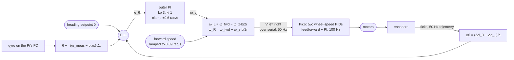

# 08.10 — Hold a straight line — cascaded heading control

<!-- glance:start -->
<!-- generated by tools/build.py from curriculum/syllabus.yaml — edit the syllabus, not this block -->

| | |
|---|---|
| **Track** | Main path |
| **Difficulty** | Intermediate |
| **Time** | 1 h |
| **Hardware** | Stage 1 robot: Pi 5, Pico, encoder motors, driver, chassis, battery, distance sensors (stage 1) |
| **Software** | python |
| **Prerequisites** | [08.09 Feedforward + PID: drive at exactly 0.5 m/s](08.09-feedforward-exact-speed.md) |
| **Skip if** | Your robot drives 3 m straight within a few centimetres. |

<!-- glance:end -->

## What you will learn

- Build a cascade: a fast inner wheel-speed loop on the Pico and a slow outer heading loop on the Pi, and choose the rate ratio between them deliberately.
- Turn a yaw-rate correction into two wheel-speed setpoints with one line of differential-drive geometry.
- Estimate heading two ways — from the encoder difference and from an integrated gyro — and predict the error each one makes.
- Explain, with a number, why controlling the encoder-derived heading does **not** make your robot drive straighter than the firmware already does.
- Drive 3 m and land within a few centimetres of the line, and say which loop earned each centimetre.

## Why it matters

[08.09](08.09-feedforward-exact-speed.md) ended with a robot that holds 0.5 m/s at each wheel and still arrives 18 cm to the side after 1.4 m. Every wheeled robot has this problem: two motors are never identical, two wheels are never the same diameter, and the floor is never the same under both tyres. Open loop, the errors accumulate as an *arc*, and an arc is unbounded — 3 m of driving puts a 200 mm-wide robot into a wall.

The fix is the first cascade you build, and cascades are everywhere in robotics: joint torque inside joint velocity inside joint position on an arm; motor current inside speed inside position on a drive; wheel speed inside heading inside cross-track error inside a Nav2 path. Getting the layering right — fast loop close to the hardware, slow loop on top, each with a clear job — is the structural idea of the whole module. This lesson also delivers the honest, uncomfortable lesson that a feedback loop fed by a *biased* sensor is not a fix at all; it just hides the bias behind a controller that reports success.

<!-- prereqs:start -->
## Prerequisites

You need these first:

- [08.09 Feedforward + PID: drive at exactly 0.5 m/s](08.09-feedforward-exact-speed.md)

### Optional prerequisite links

None.

Check your readiness: `python course.py why 08.10`
<!-- prereqs:end -->

## Concept

### Two loops, two jobs

```text
   heading setpoint (0)          wheel-speed setpoints              duty
        │                              │                             │
        ▼                              ▼                             ▼
   ┌──────────┐  yaw rate   ┌───────────────────┐   rad/s   ┌──────────────┐
   │ OUTER    │ correction  │  v ± ω·b/(2r)     │ ────────► │ INNER  (Pico)│ ──► motors
   │ heading  │ ──────────► │  (geometry)       │           │ speed PID    │
   │ 50 Hz,Pi │             └───────────────────┘           │ 100 Hz       │
   └──────────┘                                             └──────────────┘
        ▲                                                          │
        └───────────── heading estimate ◄── encoders / gyro ◄───────┘
```

The inner loop's job is "make this wheel turn at this speed, whatever the battery and the friction are doing". The outer loop's job is "make the robot point where I want, whatever the inner loop's residual errors are". Neither can do the other's job: the inner loop cannot see that the robot is turning, and the outer loop is far too slow to fix a motor that is 6% weak in real time.

**The cascade rule:** the outer loop must be clearly slower than the inner one — a factor of 3 to 10 in bandwidth. If they are comparable, they fight: the outer loop changes a setpoint the inner loop has not reached yet, and the pair oscillates. Here the inner loop settles in about 80 ms (bandwidth ≈ 12 rad/s) and the outer loop is tuned at $k_p = 3$ rad/s per radian (bandwidth ≈ 3 rad/s): a comfortable factor of four.

### Heading is not a thing you own, it is a thing you estimate

The robot does not know its heading. You compute it, and the computation is where straight lines are won or lost:

- **From the encoders:** if the right wheel rolled 1 cm further than the left, and the wheels are 20 cm apart, the robot turned $0.01/0.2 = 0.05$ rad. Free, high rate, no extra hardware — and *systematically wrong* if the two wheels are not exactly the same size.
- **From the gyro:** integrate the measured yaw rate. Independent of the wheels entirely, so it sees slip, carpet and a dragging caster — and it *drifts*, because every gyro has a bias and you are integrating it.

The experiment measures both, and the result is the punchline of the lesson: the encoder version, controlled to zero, drives an arc of exactly the same size as doing nothing at all.

### Heading is not the same as staying on the line

A heading loop makes the robot *parallel* to where it started. If it has already drifted 10 cm sideways, a heading loop is perfectly happy to keep driving 10 cm off the line forever. Correcting the offset needs a second quantity — the cross-track error — and a pose estimate to compute it from, which is module [09](../09-odometry/09.04-odometry-from-scratch.md)'s job and [12.05](../12-navigation/12.05-local-planning-obstacle-avoidance.md)'s controller. For 3 m of "drive straight", heading is enough and nothing else is available yet; know the limitation.

> [!TIP]
> **Ask your teacher:** "Why does an outer loop that is too fast make a cascade oscillate? Show me with the simulator."

## Technical explanation

### Level 1 — The geometry you need (one line)

For a differential-drive robot with wheel radius $r$ and wheel separation $b$:

$$v = \frac{r(\omega_L + \omega_R)}{2}, \qquad \omega_z = \frac{r(\omega_R - \omega_L)}{b}$$

Inverted, for commanding: given a forward wheel speed $\omega_{fwd}$ and a wanted yaw rate $\omega_z$,

$$\omega_L = \omega_{fwd} - \frac{\omega_z\,b}{2r}, \qquad \omega_R = \omega_{fwd} + \frac{\omega_z\,b}{2r}$$

**Numerical example.** Driving at 0.4 m/s ($\omega_{fwd} = 0.4/0.045 = 8.89$ rad/s) and the heading loop asks for a correction of 0.2 rad/s: $\omega_z b/(2r) = 0.2 \times 0.2/0.09 = 0.444$ rad/s, so the wheels get 8.44 and 9.33 rad/s — a 5% split. That is all a heading controller ever does. The full treatment of these equations is [09.01](../09-odometry/09.01-diff-drive-kinematics.md); this is the only piece the cascade needs.

### Level 2 — The two heading estimators

**Encoders.** With `meters_per_tick` $= 2\pi r_{nom}/N$ (karmel: $2\pi \times 0.045/2464 = 1.1476 \times 10^{-4}$ m):

$$\Delta\theta = \frac{\Delta d_R - \Delta d_L}{b}, \qquad \Delta d = \Delta\text{ticks} \times \text{meters\_per\_tick}$$

**Numerical example.** The right wheel gains 100 ticks on the left: $\Delta d = 100 \times 1.1476\times10^{-4} = 11.5$ mm, $\Delta\theta = 0.0115/0.2 = 0.0574$ rad = 3.3°.

**Gyro.** $\theta_{k} = \theta_{k-1} + (\omega_{measured} - b_{gyro})\,\Delta t$, with $b_{gyro}$ measured by averaging the yaw rate for a second while the robot stands still ([07.05](../07-sensors/07.05-imu-fundamentals.md)).

**Numerical example.** The simulator's gyro bias measures +0.0111 rad/s = 0.64 °/s. Over one 7.7 s run that is **+4.9°** of pure fiction. Subtract it and the residual is what is left of the bias after 50 samples of averaging — a few hundredths of a degree per second.

### Level 3 — Why the encoder heading loop buys you nothing (with the arithmetic)

This is the result that surprises people, so here it is derived before it is measured.

The tick-to-metre factor uses the **nominal** wheel radius, but the wheel has a true radius $r_{true}$. A wheel that turns through angle $\phi$ really travels $s = \phi\,r_{true}$, while your code computes $d_{est} = \phi\,r_{nom} = s\,\dfrac{r_{nom}}{r_{true}}$.

The simulator's realistic preset has $r_L = 0.995\,r_{nom}$ and $r_R = 1.008\,r_{nom}$. Suppose the robot really does drive perfectly straight, both wheels covering $s$ metres. Then

$$d_{est,L} = \frac{s}{0.995} = 1.00503\,s, \qquad d_{est,R} = \frac{s}{1.008} = 0.99206\,s$$

$$\Delta\theta_{est} = \frac{d_{est,R} - d_{est,L}}{b} = \frac{-0.01296\,s}{0.2} = -0.0648\,s \ \text{rad} = -3.71°\ \text{per metre}$$

A robot driving perfectly straight *reports* that it is turning 3.7° to the right every metre. A controller that drives that report to zero therefore makes the robot actually turn **+3.7° per metre**. Over 3 m: **+11.1°**, and a lateral offset of $\kappa L^2/2 = 0.0648 \times 9/2 = 0.29$ m.

Measured: +11.1° and 28.0 cm. The model is exact.

And the open-loop run drifts by the same amount, for the same reason: the firmware's inner loops equalise wheel *angular* speed, which is precisely what "equal ticks" means. **The encoder heading loop and the inner speed loops are controlling the same quantity.** Adding the outer loop was pure ceremony.

The fix is not a better controller; it is a better number. Give the estimator the true radius ratio $r_R/r_L = 1.008/0.995 = 1.0131$ and multiply the right wheel's estimated distance by it. That single number takes the run from 28.0 cm to **2.6 cm**. Measuring it on a real robot is [09.05](../09-odometry/09.05-calibrating-odometry.md)'s UMBmark procedure.

### Level 4 — Tuning the outer loop, and its limits

The outer loop is a PI on heading, and its output is a yaw rate:

$$\omega_{z,cmd} = \mathrm{clamp}\!\left(k_{p,h}\,e_\theta + I,\ \pm\,\omega_{max}\right), \qquad e_\theta = \mathrm{wrap}(\theta_{sp} - \theta)$$

Four design decisions, all of which matter:

1. **Clamp the output** to something far below the robot's top yaw rate (here ±0.6 rad/s against a 2.5 rad/s limit). A heading loop must never be able to spin the robot; if it wants to, something is wrong upstream and the clamp is what keeps that from becoming a pirouette.
2. **Anti-windup**, same as always — the clamp is a saturation ([08.05](08.05-integral-control.md)).
3. **Ramp the forward speed**, don't step it. A step command slips the wheels, and slip is exactly the error the encoders cannot see.
4. **Wrap the error.** Not needed for a 3 m straight line, essential the moment you turn ([08.11](08.11-rotate-exactly-90.md)).

**Choosing $k_{p,h}$.** The heading loop's plant is an integrator: yaw rate in, heading out. With a pure P controller the closed loop is first order with time constant $1/k_{p,h}$. So $k_{p,h} = 3$ means the heading error decays with a 0.33 s time constant — about four times slower than the inner loop's 80 ms, which is the cascade rule satisfied. Push $k_{p,h}$ to 15 and the two loops start to interact; add the Pi's latency and it rings.

**What $k_i$ is for here.** A constant disturbance — a dragging caster, a slope, a gyro bias you did not remove — produces a constant heading error under P alone. The integral removes it. It also, if your estimate is biased, drives the *real* robot into an arc with great determination. Feedback is only as honest as its sensor.

## Diagram

The cascade, as data flowing between two processors:



What 3 m looks like from above:

```text
  y [cm]
   +30 ┤                                    ╭─ encoder heading   (+28.0 cm)
   +25 ┤                                  ╭─╯ open loop          (+25.6 cm)
   +20 ┤                              ╭──╯
   +10 ┤                        ╭────╯
     0 ┼───────────────────────╌╌╌╌───────────  encoder, calibrated (+2.6 cm)
       │                       ╰────╌╌╌╌╌╌╌╌╌╌  gyro, bias removed (+0.5 cm)
   −10 ┤                            ╰─────────  gyro, raw          (−10.9 cm)
       └────┴────┴────┴────┴────┴────┴──→ x [m]
       0   0.5   1   1.5   2   2.5   3
```

## Code

The two estimators and the geometry helper are short enough to read in full —
[`08-control/code/straight_line.py`](code/straight_line.py) and
[`08-control/code/pid_lab.py`](code/pid_lab.py):

```python
@dataclass
class EncoderHeading:
    """theta = (right distance - left distance) / wheel separation, from the encoder ticks."""

    meters_per_tick: float
    wheel_separation_m: float
    radius_ratio: float = 1.0      # right radius / left radius; 1.0 until you calibrate (09.05)
    theta: float = 0.0

    def update(self, state, dt: float) -> float:
        ticks = (state.left_ticks, state.right_ticks)
        if self._last is not None:
            left = (ticks[0] - self._last[0]) * self.meters_per_tick
            right = (ticks[1] - self._last[1]) * self.meters_per_tick * self.radius_ratio
            self.theta += (right - left) / self.wheel_separation_m
        self._last = ticks
        return self.theta


@dataclass
class GyroHeading:
    """theta = integral of the measured yaw rate, minus a constant bias."""

    read_gyro: object            # callable () -> rad/s
    bias_rad_s: float = 0.0
    theta: float = 0.0

    def update(self, state, dt: float) -> float:
        self.rate = float(self.read_gyro()) - self.bias_rad_s
        self.theta += self.rate * dt
        return self.theta


def wheel_speeds_for(v_rad_s, yaw_rate_rad_s, wheel_radius_m, wheel_separation_m):
    """v = r (wL + wR) / 2,  yaw_rate = r (wR - wL) / b."""
    differential = yaw_rate_rad_s * wheel_separation_m / (2.0 * wheel_radius_m)
    return v_rad_s - differential, v_rad_s + differential
```

and the loop itself, which sends **wheel-speed** setpoints (`command="velocity"`) so the Pico's PIDs are the inner loop:

```python
def step(t, dt, state, extra):
    speed = wheel_setpoint * min(t / ramp_s, 1.0)      # ramp up: a step would slip the wheels
    heading = estimator.update(state, dt) if estimator is not None else 0.0
    correction = controller.update(0.0, heading, dt) if estimator is not None else 0.0
    return wheel_speeds_for(speed, correction, radius, separation)
```

Run it:

```bash
python 08-control/code/straight_line.py --plot straight_line.png
python 08-control/code/straight_line.py --metres 5 --speed 0.3 --kp 5 --ki 2
```

Output (realistic simulator; the gyro rows need an IMU on the real robot):

```text
3.0 m at 0.40 m/s = 8.89 rad/s per wheel, 7.7 s per run
outer heading loop: kp 3.0 ki 1.0 rad/s per rad, correction clamped to +-0.6 rad/s

  run                                    est. heading true heading    offset  max offset  travelled
  open loop (inner loops only)                 +0.0       +10.1     +25.6cm      25.6cm     3.005m
  encoder heading                              +0.0       +11.1     +28.0cm      28.0cm     3.003m
  encoder heading, calibrated (1.0131)         +0.0        +0.2      +2.6cm       2.6cm     3.008m
  gyro heading, raw                            -0.0        -3.8     -10.9cm      10.9cm     3.006m

  gyro bias measured while standing still: +0.01110 rad/s (+0.64 deg/s -> +4.9 deg over one run)
  gyro heading, bias removed                   +0.2        +1.2      +3.7cm       3.7cm     3.007m
```


The important column is the one the controller cannot see:

- **Every run reports a heading of ≈0.0°.** All five controllers believe they succeeded. Only ground truth disagrees. Print that on a sticker.
- **Encoder heading control (+11.1°, 28.0 cm) is no better than open loop** (+10.1°, 25.6 cm), exactly as the Level 3 arithmetic predicted (+3.71°/m, 29 cm). The outer loop is controlling the same quantity the inner loops already control.
- **One calibration number fixes it**: 1.0131 turns 28.0 cm into 2.6 cm. The controller did not change.
- **The raw gyro bends the path the other way** by its bias: 0.64 °/s × 7.7 s = 4.9° of imaginary rotation, which the loop dutifully "corrects" into −3.8° of real rotation.
- **One second of standing still** is the difference between −10.9 cm and +0.5 cm.

**On the robot:** `python 08-control/code/straight_line.py --port /dev/ttyACM0` with 4 m of clear floor. Mark the start line and the intended lane with tape and measure the offset with a ruler — the script cannot see your floor.

## Exercise

> [!CAUTION]
> **Safety:** this lesson drives on the floor, not on a stand. Clear 4 m × 1 m, remove cables, keep pets and children out of the lane, and keep the power switch or the laptop's Ctrl-C within reach for the whole run. Do not aim the robot at a wall, a staircase or a table edge: a 1.6 kg robot at 0.4 m/s does not stop politely, and the 0.3 s watchdog ([03.04](../03-robot-software/03.04-timing-and-concurrency.md)) still lets it travel 12 cm after you cut the commands.

### Exercise 08.10-E1 — The geometry by hand `[numerical]`

Hardware: none. karmel: $r = 0.045$ m, $b = 0.200$ m, 2464 ticks/rev. (a) Driving at 0.4 m/s, what wheel speeds give a yaw rate of −0.3 rad/s? (b) The right wheel gains 250 ticks on the left over one metre — what heading change does that imply, in degrees? (c) Your two wheels are 45.0 mm and 45.6 mm in radius. How many degrees per metre will an uncalibrated encoder heading estimate be wrong by, and in which direction? (d) Over 4 m, what lateral offset does that produce?

### Exercise 08.10-E2 — Implement the cascade `[coding]`

Hardware: none. Starting from `straight_line.py`, write the outer loop yourself: a `HeadingLoop` class with `update(heading, dt) -> yaw_rate`, using your 08.05 PI with anti-windup and a ±0.6 rad/s clamp, plus the `wheel_speeds_for` conversion. Reproduce the "gyro heading, bias removed" row within a centimetre.

### Exercise 08.10-E3 — Predict: break the cascade `[predict]`

Hardware: none. Predict what happens to the "gyro heading, bias removed" run if you (a) raise the outer $k_p$ from 3 to 30; (b) remove the inner loop by sending `duty` instead of `velocity` commands (`command="duty"` in `run_loop`, wheel speeds scaled to duty by the feedforward model); (c) remove the speed ramp and step to 8.89 rad/s. Then run all three.

### Exercise 08.10-E4 — Find your robot's radius ratio `[simulation]`

Hardware: none. Without looking at `DiffDriveParams.realistic()`, recover the radius ratio experimentally: drive 3 m with the **gyro** heading loop (so the robot really goes straight), log the tick counts, and compute the ratio that would have made the encoder heading estimate read zero. Compare with 1.0131. Then feed your number into the encoder run and measure the offset.

### Exercise 08.10-E5 — 3 m on your floor `[hardware]`

Hardware: robot-base (IMU optional: `--no-gyro` skips the gyro runs). Simulation alternative: the script's default target.
Tape a 3 m line. Run open loop and encoder heading five times each, measuring the lateral offset at the end with a ruler. Report mean and spread. Do your two runs differ by more than the run-to-run spread? (On most robots they will not — that is the lesson.) If you have the IMU, add the two gyro runs.

### Exercise 08.10-E6 — The bias that comes back `[debugging]`

Hardware: imu (simulation alternative: use the simulator's gyro). Measure the gyro bias, drive for 30 s, then measure it again while standing still. (a) How much did it change? (b) Over a 60 s mission, what heading error would the drift produce? (c) Name two ways to keep a heading estimate honest over minutes rather than seconds, and say which module of this course builds them.

### Exercise 08.10-E7 — Heading is not enough `[design]`

Hardware: none. The robot is 15 cm to the left of the line and pointing exactly along it. Your heading loop reports zero error and will hold it there forever. Design the controller that brings it back: what does it measure, what does it command, how do you stop it from oscillating across the line, and what does it need that you do not have yet in module 08? Sketch the block diagram.

## Expected result

**08.10-E1:** (a) $\omega_{fwd} = 8.889$ rad/s; $\omega_z b/(2r) = -0.3 \times 0.2/0.09 = -0.667$; left **9.56** rad/s, right **8.22** rad/s. (b) $250 \times 1.1476\times10^{-4} = 28.7$ mm; $\Delta\theta = 0.0287/0.2 = 0.1435$ rad = **8.2°**. (c) $r_R/r_L = 45.6/45.0 = 1.0133$; per metre the estimate is off by $(1/1.0 - 1/1.0133)/0.2 = 0.0657$ rad/m = **3.8° per metre**, and the estimate says the robot is turning *right* while it drives straight — so the loop turns it left. (d) $\kappa L^2/2 = 0.0657 \times 16/2 = 0.53$ m. Half a metre over four, from 0.6 mm of rubber.

**08.10-E2:** Final offset within ±1 cm of 3.7 cm, heading within ±0.5° of +1.2°, and your yaw command clamped at ±0.6 rad/s during the first half second while the ramp is still building speed.

**08.10-E3:** (a) $k_p = 30$ puts the outer loop's bandwidth at 30 rad/s, above the inner loop's ≈12: the two fight, the wheel setpoints chatter, and the path develops a visible S-wobble (the heading oscillates by 1–3°) although the *average* is still straight. This is the cascade rule being violated. (b) Without the inner loop the wheel speeds are whatever the duty produces — the 6% weak motor is back, and the outer loop now has to correct it continuously; it can, but the yaw correction sits near its clamp and the path is noticeably less clean. (c) Stepping the speed makes both wheels slip for ~100 ms; slip is invisible to the encoders and visible to the gyro, so the gyro run recovers and an encoder-based run would not.

**08.10-E4:** Your ratio should come out within ±0.002 of 1.0131 (the tick counts are large, so the estimate is precise). Feeding it into the encoder run gives an offset of a few centimetres — the same as the lesson's calibrated row. This is the essence of UMBmark ([09.05](../09-odometry/09.05-calibrating-odometry.md)): drive a path you know is straight, and let the disagreement calibrate the geometry.

**08.10-E5:** Typical karmel: open loop 10–40 cm off over 3 m, always in the same direction, spread of a few centimetres between runs. Encoder heading: the *same* offset within the run-to-run spread. With an IMU: 1–5 cm, and the run-to-run spread becomes the dominant term. If your encoder-heading runs are clearly better than open loop, your inner loops are not doing their job — check that you are sending velocity commands and that the firmware is in velocity mode (`FLAG_VELOCITY_MODE`).

**08.10-E6:** (a) A MEMS gyro's bias moves with temperature, typically a few hundredths of a degree per second over the first minutes after power-up while the chip warms. (b) 0.02 °/s over 60 s is 1.2° — small for one run, fatal for a 10-minute mission (12°). (c) Re-estimate the bias whenever the robot is known to be stationary (a zero-velocity update), and fuse the gyro with an absolute reference — wheel odometry, a magnetometer, or landmark/map observations. Module [10](../10-localization/10.07-fusing-imu-and-odometry.md) builds the fusion; [07.06](../07-sensors/07.06-imu-in-ros2.md) covers the ROS 2 side.

**08.10-E7:** It measures the **cross-track error** (the signed perpendicular distance from the line), which requires a pose estimate — odometry ([09.04](../09-odometry/09.04-odometry-from-scratch.md)) or a map. It commands a *heading setpoint*, not a yaw rate: $\theta_{sp} = -k\,e_{cross}$, clamped to something like ±30°, and the existing heading loop tracks it. That is a third cascade layer, and the clamp plus the heading loop's own dynamics are what stop it oscillating across the line — a pure P on cross-track error with no heading layer always weaves. You have just derived a simplified pure-pursuit controller ([12.05](../12-navigation/12.05-local-planning-obstacle-avoidance.md)).

## Troubleshooting

### Symptom: the robot weaves instead of driving straight
The cascade is too tight or too laggy. 1) Lower the outer $k_p$ by half and see if the weave goes. 2) Check the outer loop's actual period (log `dt`): if the Pi is busy and periods jump to 60 ms, the outer loop is effectively slower and less stable. 3) Check that the inner loop is really running (velocity commands, not duty). 4) Only then look at the estimator — a noisy heading with a high $k_p$ is a weave generator.

### Symptom: it drives straight but not along the line I wanted
Heading control has no opinion about where you are, only about where you point (see E7). Also check the start: if the robot yaws during the first 200 ms while the wheels are slipping, that offset is locked in.

### Symptom: the gyro run curves consistently in one direction
Bias. Re-measure it while standing still, and make sure the robot really is still during the measurement (no one holding it, no vibration from a fan). If the bias measurement itself varies between attempts by more than about 0.005 rad/s, average for longer or let the IMU warm up.

### Symptom: the encoder run curves and calibration does not help
Then the error is not a radius ratio. Check, in order: a dragging caster or a wheel rubbing the chassis (spin each wheel by hand); an encoder miscount on one side (drive 10 wheel revolutions by hand and compare tick counts); an actual wheelbase different from `karmel.yaml`'s 0.200 m (it scales the estimate but not its sign, so it changes the *gain* of your loop, not the direction of the drift).

### Symptom: the yaw correction sits at its clamp the whole run
The outer loop is being asked to fix something the inner loop should have: one motor much weaker than the other, or a mechanical drag. Fix the cause; a heading loop permanently at its limit has no authority left for the disturbance it was built for.

## Common mistakes

- **Closing the outer loop on the same signal the inner loop already closes.** The headline of this lesson. Encoder heading + firmware speed loops = one loop wearing two hats.
- **Trusting a controller's own error signal as evidence of success.** Every run in the table reports 0.0°. Ground truth, a tape measure or an independent sensor is the only proof.
- **An outer loop as fast as the inner loop.** They fight. Keep a factor of 3–10.
- **Forgetting to clamp the yaw correction.** A heading loop with a bug and no clamp is a robot that spins.
- **Stepping the forward speed.** Slip at the start is an error no wheel-based estimator can see.
- **Never re-measuring the gyro bias.** It is not a constant; it is a slowly moving number that you should refresh whenever the robot is known to be stopped.

## Knowledge check

1. Give the two conversion formulas between $(v, \omega_z)$ and $(\omega_L, \omega_R)$.
   <details><summary>Answer</summary>

   $v = r(\omega_L+\omega_R)/2$ and $\omega_z = r(\omega_R-\omega_L)/b$; inverted, $\omega_{L,R} = v/r \mp \omega_z b/(2r)$.
   </details>

2. Why must the outer loop be slower than the inner one, and by how much?
   <details><summary>Answer</summary>

   The outer loop assumes the inner loop has already achieved the setpoint it asked for. If the outer loop changes its request faster than the inner loop can respond, the inner loop's lag appears as delay in the outer loop and the pair oscillates. A factor of 3–10 in bandwidth is the standard rule.
   </details>

3. Your wheels differ in radius by 1%. How far off the line are you after 5 m if you control heading from the encoders?
   <details><summary>Answer</summary>

   The estimate is wrong by roughly $0.01/b = 0.05$ rad per metre (with $b = 0.2$ m), so $\kappa L^2/2 = 0.05 \times 25/2 = 0.63$ m. A hair's width of rubber, a corridor's width of error.
   </details>

4. Predict: you fit the robot with a perfect gyro (no bias, no noise) and keep the encoder heading loop. Which run improves, and which does not?
   <details><summary>Answer</summary>

   Only the gyro runs improve. The encoder loop is unaffected — its error is geometric, not sensory. A perfect sensor of the wrong quantity is still the wrong quantity.
   </details>

5. The outer loop's plant is an integrator (yaw rate in, heading out). With P only, what is the closed-loop time constant for $k_p = 4$?
   <details><summary>Answer</summary>

   $1/k_p = 0.25$ s. That is also the quickest way to pick a starting $k_p$: decide how fast you want a heading error to decay and invert it.
   </details>

6. Debugging: the heading estimate reads exactly 0.00° all run, and the robot ends 30 cm off the line. What are the three things you check, in order?
   <details><summary>Answer</summary>

   (1) Is the estimator seeing the right *quantity* — encoders with uncalibrated radii, or a gyro with an unremoved bias? (2) Is ground truth actually what you think — measure the offset and the final heading with a ruler and a protractor, not with the robot's own numbers. (3) Only then, is the loop working at all (log the yaw correction; if it is always 0, the loop is not even running).
   </details>

7. Why does a heading loop not bring the robot back onto a line it has already drifted off?
   <details><summary>Answer</summary>

   Heading error and cross-track error are different states. Driving heading error to zero makes the path parallel to the line at whatever offset it has. Correcting the offset needs the perpendicular distance, which needs a pose estimate (module 09) and a controller that turns cross-track error into a heading setpoint (module 12).
   </details>

## Practical challenge

**Drive 3 m and land within 5 cm, three times in a row, and prove which loop earned it.**

On your real robot, with the IMU:

1. Measure and log the gyro bias immediately before each run.
2. Drive 3 m at 0.4 m/s with the gyro heading loop, with the yaw correction clamped and anti-windup on.
3. Measure the final lateral offset with a ruler against a taped line, and the final heading with a protractor or a phone's compass app held against the chassis.
4. Do it three times. Then repeat with the encoder loop and with open loop.
5. Recover your robot's radius ratio from E4's method, put it in the encoder estimator, and run the encoder loop three more times.

**Acceptance criteria:** the gyro runs land within 5 cm of the line and within 3° of the start heading, three times, and the run-to-run spread is smaller than the open-loop bias; a table of all twelve runs; your measured radius ratio, and the calibrated encoder runs landing within 10 cm; and one paragraph explaining which of your remaining centimetres come from the estimator, which from the controller and which from the floor. Add a plot of the yaw correction over time for one good and one bad run.

## You can skip this if…

You answer knowledge-check questions 2, 3 and 7 correctly without looking, and your robot already drives 3 m within a few centimetres of a straight line using a cascade you can draw on a whiteboard — including which loop runs where and at what rate.

`python course.py skip 08.10 --reason "I build cascaded heading control and I know what the encoders cannot tell me"`

## Go deeper

- Åström & Murray, *Feedback Systems* (2nd ed.): https://www.cds.caltech.edu/~murray/FBS/Second_Edition.html — section 11.5 on cascade control and the bandwidth separation rule.
- MATLAB Tech Talks, *Control Systems in Practice*: https://www.youtube.com/playlist?list=PLn8PRpmsu08pFBqgd_6Bi7msgkWFKL33b — the cascade-control episode, with the "inner loop fast, outer loop slow" argument done properly.
- ros2_control `diff_drive_controller`: https://control.ros.org/jazzy/doc/ros2_controllers/diff_drive_controller/doc/userdoc.html — `wheel_separation_multiplier`, `left_wheel_radius_multiplier` and `right_wheel_radius_multiplier` are exactly the calibration numbers of Level 3, exposed as parameters.
- [09.05 Calibrating odometry — wheel radius, wheelbase and UMBmark](../09-odometry/09.05-calibrating-odometry.md) — how to measure the radius ratio on a real floor.
- [07.05 IMU — accelerometer, gyroscope, magnetometer, bias and drift](../07-sensors/07.05-imu-fundamentals.md) — where the 0.64 °/s comes from and how it behaves over time.

## Progress checkpoint

- [ ] I can draw my robot's cascade and say which loop runs on which processor, at what rate.
- [ ] I convert a yaw-rate command into two wheel-speed setpoints without looking it up.
- [ ] I can compute how far a 1% wheel-radius mismatch throws a 3 m run, and I know which estimator is blind to it.
- [ ] My robot drives 3 m within a few centimetres of a line, and I measured it with a ruler, not with its own telemetry.

`python course.py complete 08.10` (exercises done) · `python course.py master 08.10` (challenge done) · `python course.py struggle 08.10 "what was hard"`

Next: [08.11 — Rotate exactly 90°: motion profiles and IMU feedback](08.11-rotate-exactly-90.md).
