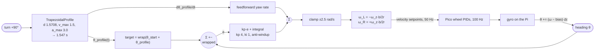

# 08.11 — Rotate exactly 90° — motion profiles and IMU feedback

<!-- glance:start -->
<!-- generated by tools/build.py from curriculum/syllabus.yaml — edit the syllabus, not this block -->

| | |
|---|---|
| **Track** | Main path |
| **Difficulty** | Intermediate |
| **Time** | 1 h |
| **Hardware** | Stage 1 robot: Pi 5, Pico, encoder motors, driver, chassis, battery, distance sensors (stage 1), IMU breakout (stage 2) |
| **Software** | python |
| **Prerequisites** | [08.10 Hold a straight line — cascaded heading control](08.10-straight-line-heading-control.md)<br>[07.05 IMU — accelerometer, gyroscope, magnetometer, bias and drift](../07-sensors/07.05-imu-fundamentals.md) |
| **Skip if** | Your robot turns 90° within ±2° repeatably. |

<!-- glance:end -->

## What you will learn

- Generate a trapezoidal motion profile — bounded speed, bounded acceleration, a known finish time — and feed its velocity forward into the controller.
- Write angle code that survives the ±180° wrap, and explain what breaks without it.
- Close a heading loop on integrated gyro rate, with the bias measured while standing still, and say why the encoders cannot do this job.
- Decide when a turn is *finished*: profile done, inside tolerance, and staying there.
- Measure repeatability over ten trials and report mean, spread and worst case — the numbers that decide whether a square path closes.

## Why it matters

"Turn 90°" is the smallest autonomous behaviour that has to be *exact*. A 2° error per turn is 8° around a square, which after four laps is 32° and a robot facing the wrong wall. Every waypoint mission, every "drive the perimeter", every docking approach, and Project P05's square path are built from turns whose error must not accumulate.

It is also where three ideas from this module meet for the first time. The **profile** is feedforward ([08.09](08.09-feedforward-exact-speed.md)) applied to a trajectory instead of a constant. The **cascade** is the one you built in [08.10](08.10-straight-line-heading-control.md), with a position loop where the heading loop was. And the **sensor choice** is the same honest question: the encoders will tell you confidently that you turned 90° when you turned 86°, and only an independent measurement will say otherwise. After this lesson you own a turn primitive with a number attached to it — "±2°, 10 trials, σ = 0.1°" — which is what you need before building anything on top.

<!-- prereqs:start -->
## Prerequisites

You need these first:

- [08.10 Hold a straight line — cascaded heading control](08.10-straight-line-heading-control.md)
- [07.05 IMU — accelerometer, gyroscope, magnetometer, bias and drift](../07-sensors/07.05-imu-fundamentals.md)

### Optional prerequisite links

None.

Check your readiness: `python course.py why 08.11`
<!-- prereqs:end -->

## Concept

### A step command makes the controller invent a trajectory

Tell a controller "the target is now 90° away" and it will do something. With a low gain it creeps; with a high gain it slams the wheels to their limit, arrives fast and overshoots; the peak speed, the acceleration and the finish time are all *side effects of your gains*, and they change when the battery, the floor or the load changes.

A **motion profile** moves that decision out of the controller: you decide the peak yaw rate and the acceleration, and the profile tells you where the robot should be at every instant between here and there. The controller's job shrinks to "stay on the trajectory", which is a much smaller and much better-conditioned job. Three things you get for free:

- **Bounded acceleration**, so the tyres do not slip — and slip is the one error no amount of feedback can undo, because it happens faster than you can measure it.
- **A known finish time.** 90° at 1.5 rad/s with 3 rad/s² takes 1.547 s, always. You can schedule around that.
- **A feedforward term**: the profile's own velocity. On a perfect robot the feedback contributes nothing at all.

### Angles live on a circle

`target - measured` is wrong for angles. At +179° with a target of −179° it returns −358° and your robot spins almost all the way around to arrive somewhere it was already standing. Every angle difference in robotics goes through a wrap:

$$e = \mathrm{wrap}(\theta_{target} - \theta_{measured}) \in (-\pi,\ \pi]$$

One function, used everywhere, forever. `robotlab.geometry.angle_diff` is it; you will write it once yourself so that the next time you see a robot spin 350° to turn 10° you know exactly which line to look at.

### For a turn, the encoders lie in a new way

In [08.10](08.10-straight-line-heading-control.md) the encoders were wrong about *straightness* because the two wheel radii differ. In a turn they are wrong about *angle* because the true wheelbase differs from the nominal one: the estimator divides by 0.200 m and the wheels are really 0.208 m apart. That is a 4% scale error, and a 4% error on 90° is 3.6°. A gyro does not care about the wheelbase at all — it measures rotation directly — which is exactly why this lesson's hardware list includes the IMU.

> [!TIP]
> **Ask your teacher:** "Draw the trapezoidal profile's position, velocity and acceleration against time, and show me where each one enters the controller."

## Technical explanation

### Level 1 — The trapezoid

Accelerate at $a_{max}$ until the speed reaches $v_{max}$, cruise, then decelerate at $a_{max}$ so that the robot arrives at $d$ with zero speed.

$$v_{peak} = \min\left(v_{max},\ \sqrt{a_{max}\,|d|}\right), \qquad t_{accel} = \frac{v_{peak}}{a_{max}}, \qquad t_{cruise} = \frac{|d| - v_{peak}t_{accel}}{v_{peak}}$$

$$T = 2t_{accel} + t_{cruise}$$

The $\sqrt{a_{max}|d|}$ term is the triangular case: if the move is too short to reach $v_{max}$, half of it is spent accelerating, so $v^2 = 2a(|d|/2)$.

**Numerical example (karmel, $v_{max} = 1.5$ rad/s, $a_{max} = 3.0$ rad/s²).**

| turn | $d$ [rad] | $v_{peak}$ | $t_{accel}$ | $t_{cruise}$ | total |
|---|---|---|---|---|---|
| 5° | 0.0873 | 0.512 (triangular) | 0.171 s | 0 | 0.341 s |
| 10° | 0.1745 | 0.724 (triangular) | 0.241 s | 0 | 0.482 s |
| 45° | 0.7854 | 1.5 | 0.5 s | 0.024 s | 1.024 s |
| **90°** | **1.5708** | **1.5** | **0.5 s** | **0.547 s** | **1.547 s** |
| 180° | 3.1416 | 1.5 | 0.5 s | 1.594 s | 2.594 s |

The position is the exact integral of the velocity — $\tfrac12 a t^2$ on the ramp, linear on the cruise, and $|d| - \tfrac12 a (T-t)^2$ on the way down. If your two functions disagree by even a little, the feedforward and the feedback spend the whole turn fighting; the exercise has a test that integrates `velocity()` numerically and compares it with `position()` at 4000 points, for exactly this reason.

### Level 2 — Choosing $v_{max}$ and $a_{max}$

Three ceilings, take the smallest:

1. **Wheel speed.** A yaw rate $\omega_z$ needs wheel speeds $\pm\,\omega_z b/(2r)$. At $\omega_z = 1.5$ rad/s: $1.5 \times 0.2/0.09 = 3.33$ rad/s per wheel — 20% of the motor's 17 rad/s, so there is plenty of room for the feedback to add on top. Design the profile so the wheels are at 50–70% of their limit at most, or saturation eats your feedback authority.
2. **Configured limits.** `karmel.yaml` says `max_angular_speed_rad_s: 2.5`; `diff_drive_controller` enforces the same ([08.12](08.12-control-in-ros2.md)). Stay under them or something downstream will clip your profile and your position will no longer be its integral.
3. **Traction.** A turn in place scrubs the tyres sideways. Too much $a_{max}$ and they break loose — silently, because the wheels keep turning and the encoders keep counting. On karmel, 3 rad/s² is comfortable on a hard floor and about right on a rug; you will find your own number by making the robot slip on purpose (E3).

### Level 3 — The controller

$$\omega_{z,cmd} = \mathrm{clamp}\Big(\underbrace{\dot\theta_{profile}(t)}_{\text{feedforward}} + \underbrace{k_p\,e + I}_{\text{feedback}},\ \pm\,\omega_{max}\Big), \qquad e = \mathrm{wrap}\big(\theta_{start} + \theta_{profile}(t) - \theta\big)$$

Three details that make the difference between "usually works" and "±2° every time":

- **The profile is relative and the target is absolute.** Keep $\theta_{start}$, add the profile's position to it, and wrap. Starting at +170° and turning +90° must target −100°, not +260°.
- **Anti-windup on the yaw clamp**, as always ([08.05](08.05-integral-control.md)). A turn that is blocked (a wheel against a table leg) must not store push.
- **Finished means three things at once**: the profile has run out, the error is inside tolerance, and it stays there. The one-shot test "error < 1°" fires while the robot is sweeping through the target at full speed.

**Numerical example.** At $t = 0.25$ s into the 90° profile, $\theta_{profile} = \tfrac12 \times 3 \times 0.0625 = 0.094$ rad and $\dot\theta_{profile} = 0.75$ rad/s. If the robot is at 0.089 rad, $e = 0.005$ rad and with $k_p = 4$ the command is $0.75 + 0.02 = 0.77$ rad/s. The feedforward supplied 97% of it.

### Level 4 — Where the error comes from, sensor by sensor

The experiment runs the same profile and the same controller with three heading sources:

| heading from | believed | true | error |
|---|---|---|---|
| gyro, bias removed | 89.73° | 89.81° | **−0.19°** |
| gyro, raw | 89.88° | 88.42° | −1.58° |
| encoder difference | 89.68° | 86.39° | −3.61° |

Both errors are predictable before you run anything:

**Gyro bias.** Measured at +0.0108 rad/s = 0.62 °/s. The turn plus settle takes about 2.35 s, so the integrator invents $0.62 \times 2.35 = 1.45°$ of rotation; the loop "corrects" it, and the robot really turns 88.55°. Measured: 88.42°.

**Encoder wheelbase.** The estimator divides by the nominal $b = 0.200$ m; the true one is 0.208 m (the realistic preset's +4%), and the average wheel radius is 0.15% large. So the encoder estimate reads

$$\frac{0.208}{0.200}\times\frac{1}{1.0015} = 1.0384$$

times the truth. Driving the *estimate* to 90° gives a true $90/1.0384 = 86.7°$. Measured: 86.39°. The 4% scale error is a constant, so it is calibratable ([09.05](../09-odometry/09.05-calibrating-odometry.md) measures exactly this with UMBmark) — but it is *not* removed by any amount of control effort.

**What limits repeatability once the bias is gone.** Ten trials with different noise seeds: errors −0.07, −0.29, −0.23, −0.21, −0.27, −0.12, −0.32, −0.22, −0.22, −0.10 degrees. Mean −0.21°, σ = 0.08°, worst 0.32°. The *mean* is a small systematic offset (the loop stops when the profile ends and the residual error has not quite been integrated away); the *spread* is gyro noise through a 2.3 s integration. On a real robot, add: stiction at the end of the turn (the last few tenths of a degree need more duty than the loop is asking for), the floor, and the bias measurement's own uncertainty. Real karmel numbers of ±1–2° with σ ≈ 0.5° are a good result.

**Why not just use a bigger $k_p$?** Part 1 runs the same turn with no profile and P only: at $k_p = 2$ the robot ends 1.10° short (stiction and the deadband leave a residual), at $k_p = 15$ it overshoots by 4.08° and rings. But the number that matters is the third column: a step target asks the wheels to jump by **5.56 rad/s in one 20 ms period**, every time, because the yaw command goes from 0 to its clamp instantly. The profile's biggest jump is **0.16 rad/s** — 35 times gentler, on a command that arrives at the same place 1.55 s later, predictably.

## Diagram

The profile and the loop around it:



The profile itself, for 90°:

```text
 yaw rate [rad/s]
   1.5 ┤        ┌────────────────┐                a_max = 3 rad/s²
       │       ╱                  ╲               v_peak = 1.5 rad/s
   1.0 ┤      ╱                    ╲              wheels ±3.33 rad/s
       │     ╱                      ╲
   0.5 ┤    ╱                        ╲
       │   ╱                          ╲
     0 ┼──┴────────────────────────────┴──────────►  t [s]
       0     0.5           1.047      1.547
         accelerate   cruise 0.547 s   decelerate

 heading [deg]
    90 ┤                              ╭──────────   position = ∫ velocity
    45 ┤                    ╭────╯
     0 ┼──╌╌╯                                       (flat, then linear, then flat)
       0     0.5           1.047      1.547
```

## Code

### Your profile and turn controller (auto-graded exercise)

Implement `heading_error`, `TrapezoidalProfile` and `TurnController` in
[`labs/exercises/08.11/student.py`](../labs/exercises/08.11/student.py). The wrap and the profile
are the parts worth writing from scratch; reference after trying:

```python
def wrap(angle: float) -> float:
    """Wrap to (-pi, pi]."""
    wrapped = (angle + math.pi) % (2.0 * math.pi) - math.pi
    return math.pi if wrapped == -math.pi else wrapped


@property
def peak_v(self) -> float:
    if self.distance == 0:
        return 0.0
    # the triangular case: accelerate over half the distance, v^2 = 2 * a * (|d| / 2)
    return min(self.v_max, math.sqrt(self.a_max * abs(self.distance)))

def velocity(self, t: float) -> float:
    ta, tc = self.t_accel, self.t_cruise
    if t <= 0.0 or t >= self.duration:
        return 0.0
    if t < ta:
        return self._sign * self.a_max * t
    if t < ta + tc:
        return self._sign * self.peak_v
    return self._sign * self.a_max * (self.duration - t)
```

and the controller's step, which is the 08.09 structure with the profile in the feedforward slot:

```python
def update(self, t: float, measured_rad: float, dt: float) -> float:
    self.error = heading_error(self.target(t), measured_rad)     # wrapped!
    self.feedforward = self.profile.velocity(t)
    others = self.feedforward + self.kp * self.error
    candidate = self.integral + self.ki * self.error * dt
    low, high = -self.max_yaw_rate_rad_s, self.max_yaw_rate_rad_s
    if others + candidate > high and self.error > 0:
        self.integral = max(self.integral, high - others)
    elif others + candidate < low and self.error < 0:
        self.integral = min(self.integral, low - others)
    else:
        self.integral = candidate
    self.integral = min(max(self.integral, low), high)
    self.output = min(max(others + self.integral, low), high)
    return self.output
```

Check it: `python course.py check 08.11`

### The experiment

[`08-control/code/rotate_90.py`](code/rotate_90.py) reuses the heading estimators from
[`straight_line.py`](code/straight_line.py) and adds one 20 ms period of extra latency
(`DELAY_STEPS = 1`), because the outer loop lives on the Pi.

```bash
python 08-control/code/rotate_90.py --solution --plot rotate_90.png
python 08-control/code/rotate_90.py --degrees -45 --trials 20
```

Output:

```text
turn 90 deg = 1.5708 rad, v_max 1.5 rad/s, a_max 3.0 rad/s^2
profile: ramp 0.50 s, cruise 0.55 s, total 1.55 s, peak 1.50 rad/s (wheels +-3.33 rad/s)
gyro bias while standing still: +0.01080 rad/s (+0.62 deg/s)

Part 1 - step target, P only (no profile), 2.3 s per run
  controller                final error  overshoot  biggest wheel jump   wobble
  P only, kp = 2                -1.10 deg     0.00 deg           5.56 rad/s    0.51 deg
  P only, kp = 6                -0.57 deg     0.00 deg           5.56 rad/s    0.00 deg
  P only, kp = 15               +0.37 deg     4.08 deg           5.56 rad/s    0.09 deg

Part 2 - trapezoidal profile + feedforward + PI (kp 4, ki 1)
  final error -0.14 deg, overshoot 0.73 deg, peak yaw 1.58 rad/s, biggest wheel jump 0.16 rad/s, done in 1.55 s

Part 3 - where the heading comes from
  source                         believed       true      error
  gyro, bias removed              89.73 deg    89.81 deg    -0.19 deg
  gyro, raw                       89.88 deg    88.42 deg    -1.58 deg
  encoder difference              89.68 deg    86.39 deg    -3.61 deg

Part 4 - repeatability: 10 turns of 90 deg
  errors [deg]: -0.07 -0.29 -0.23 -0.21 -0.27 -0.12 -0.32 -0.22 -0.22 -0.10
  mean -0.21  std 0.08  worst |error| 0.32  -> PASS the +-2 deg criterion

Part 5 - wrap-around: start at 170 deg, turn +90 deg
  ended at -100.15 deg (wanted -100.00), total sweep +89.85 deg - short way
```


Reading it:

- **The profile is not about accuracy, it is about predictability.** P-only at $k_p = 6$ also lands within 0.6°. But it does so by slamming the wheel setpoints from 0 to 5.56 rad/s (35× the profile's biggest step), with a finish time that depends on the gain, the battery and the floor. The profile finishes in 1.547 s, always, and asks the tyres for nothing they cannot deliver.
- **Feedforward does the work.** Peak commanded yaw is 1.58 rad/s against the profile's 1.50: the feedback contributed 0.08 rad/s, about 5%.
- **The sensor decides the accuracy.** Same controller, same profile: −0.19° with a bias-corrected gyro, −1.58° with a raw one, −3.61° with the encoders. All three *believed* they had turned 89.7–89.9°.
- **Repeatability is a number.** Mean −0.21°, σ 0.08°, worst 0.32°, ten for ten inside ±2°. That is the claim you can build a square path on.
- **The wrap works.** From +170°, a +90° turn ends at −100.15° having swept +89.85° — the short way. Without the wrap it would have swept −270°.

**On the robot:** `python 08-control/code/rotate_90.py --port /dev/ttyACM0` needs the IMU ([07.05](../07-sensors/07.05-imu-fundamentals.md)) and about a metre of clear floor around the robot. Without an IMU, the encoder rows still run, and Part 3 becomes a demonstration of why you want one.

## Exercise

> [!CAUTION]
> **Safety:** the robot spins in place on the floor with both wheels moving in opposite directions at over 3 rad/s. Clear a metre in every direction, keep fingers and cables out of the circle, and keep the power switch or Ctrl-C reachable. Do not hold the robot to "help" it turn — a stalled wheel is exactly the windup case, and it will lurch when released. E3 deliberately makes the tyres slip; do it on a hard floor, not on a table.

### Exercise 08.11-E1 — Profiles by hand `[numerical]`

Hardware: none. $v_{max} = 1.5$ rad/s, $a_{max} = 3.0$ rad/s². Compute $v_{peak}$, $t_{accel}$, $t_{cruise}$ and the total duration for (a) 90°, (b) 30°, (c) 15°, (d) 360°. (e) Which of these are triangular? (f) For (a), what wheel speeds does the cruise phase need on karmel, and what fraction of the motor's top speed is that?

### Exercise 08.11-E2 — Implement the profile and the controller `[coding]`

Hardware: none. Implement `heading_error`, `TrapezoidalProfile` and `TurnController` in `labs/exercises/08.11/student.py`.

Check it: `python course.py check 08.11`

Then run `python 08-control/code/rotate_90.py --plot mine.png` without `--solution` and reproduce Parts 2 and 4.

### Exercise 08.11-E3 — Predict: too much acceleration `[predict]`

Hardware: none (a robot-base version is better if you have a hard floor). Predict what happens to the final error and to the repeatability when you raise $a_{max}$ from 3 to 10 and then to 30 rad/s², keeping $v_{max}$. Write your prediction for each of: peak wheel speed, whether the encoders and the gyro still agree, and the spread over 10 trials. Then run `--trials 10` with each value (edit `A_MAX` in `rotate_90.py`) and explain any difference between the two sensors' stories.

### Exercise 08.11-E4 — Repeatability with the wrong sensor `[simulation]`

Hardware: none. Run Part 4 with the encoder heading instead of the gyro (pass `source="encoder"` in the repeatability loop) over 10 trials. Report mean, σ and worst. Which of the three numbers changes most compared with the gyro, and what does that tell you about the difference between *precision* and *accuracy*? Then apply a 1/1.0384 correction to the estimator and re-run.

### Exercise 08.11-E5 — Ten turns on your floor `[hardware]`

Hardware: `robot-base`, `imu`. Simulation alternative: Part 4 of the script.
Print or draw a protractor on A3 paper, tape it to the floor, and stand the robot on it with a strip of tape marking its forward axis. Run ten 90° turns, reading the final angle each time. Report mean, spread and worst. Then run ten more without re-measuring the gyro bias between them and compare. Finally, do four turns in a row (a full square of turns, no driving) and measure the total: how far from 360°?

### Exercise 08.11-E6 — The wrap bug `[debugging]`

Hardware: none. A teammate writes `error = target - measured` with no wrap. (a) Starting at +170°, what does their robot do when told to turn +90°? Give the number their controller computes. (b) Why does their code pass every test they wrote (all of which start at 0°)? (c) Which test in `labs/exercises/08.11/test_exercise.py` catches it? (d) They then "fix" it with `if error > pi: error -= 2*pi` and nothing else. Give an input that still breaks.

### Exercise 08.11-E7 — S-curves `[design]`

Hardware: none. A trapezoid has infinite jerk: the acceleration jumps from 0 to $a_{max}$ instantly at $t = 0$. Design (do not implement) a jerk-limited profile with a maximum jerk $j_{max}$: sketch the acceleration, velocity and position against time, say how many phases it has, and compute the extra time it costs for the 90° turn with $j_{max} = 20$ rad/s³. Then name two places on this robot where the extra time is worth paying and one where it is not.

## Expected result

**08.11-E1:** (a) 1.5708 rad: $v_{peak}$ 1.5, $t_{accel}$ 0.500 s, $t_{cruise}$ 0.547 s, total **1.547 s**. (b) 0.5236 rad: $\sqrt{3 \times 0.5236} = 1.253 < 1.5$ → triangular, $v_{peak}$ **1.253**, $t_{accel}$ 0.418 s, $t_{cruise}$ 0, total **0.835 s**. (c) 0.2618 rad: $v_{peak} = 0.886$, total **0.591 s**, triangular. (d) 6.2832 rad: $v_{peak}$ 1.5, $t_{accel}$ 0.5, $t_{cruise}$ 3.689 s, total **4.689 s**. (e) 30° and 15°. (f) $\pm 1.5 \times 0.2/(2 \times 0.045) = \pm 3.33$ rad/s, which is **20%** of the 17 rad/s top speed — comfortable, with lots of headroom for the feedback term.

**08.11-E2:** All 15 checks pass in about five seconds; Part 4 reproduces mean −0.21°, σ 0.08°, worst 0.32°.

**08.11-E3:** $a_{max} = 10$: the profile shortens to about 1.20 s, peak wheel speed unchanged (it is set by $v_{max}$), and the final error and spread barely move — the simulator's motors keep up. $a_{max} = 30$: the ramp is 50 ms, which the wheel-speed loop (τ ≈ 80 ms) cannot follow, so the robot falls behind its own profile at the start and the feedback has to make it up; the error grows and the spread roughly doubles. The deep point: **the profile is a promise about what the actuator can do.** A profile more aggressive than the inner loop's bandwidth is not a plan, it is a wish. On a real robot the gyro and the encoders also start to disagree, because the tyres scrub — and only the gyro is telling the truth.

**08.11-E4:** Mean around −3.6°, σ around 0.1°, worst around 3.7°. The **spread barely changes** while the **mean moves by 3.4°**: the encoder estimate is just as *precise* and much less *accurate*. Precision is what repeatability measures; accuracy needs a correct model or a better sensor. With the 1/1.0384 correction the mean comes back to a few tenths of a degree and the σ is unchanged — which is exactly what calibration buys and what it does not.

**08.11-E5:** A typical karmel with a BNO055 gets mean within ±1°, spread ±1–2°, on a hard floor; on a rug expect 2–4° and more spread. Without re-measuring the bias between runs the mean drifts over the session (the chip warms up), typically by a degree or two over ten minutes. Four turns in a row should total 360° ± 4°; if your single-turn error is systematic (always −1°), four turns show it as −4° and you have just measured a scale factor worth correcting.

**08.11-E6:** (a) $e = 260° - 170° = 90°$... no: the target is $170 + 90 = 260°$, which their code stores as 260 while the gyro reports wrapped angles in (−180, 180]. Once the robot passes +180° the measurement flips to −180° and the error becomes $260 - (-180) = 440°$, so the controller commands full speed *forwards* and the robot keeps spinning — it will chase a target that does not exist, stopping only when the profile runs out, several hundred degrees late. (b) Starting at 0°, a ±90° or even ±170° turn never crosses the wrap, so every test passes. (c) `test_the_target_starts_from_the_current_heading`, which starts at +170°, and `test_heading_error_takes_the_short_way`. (d) `error = -350°` (target −179°, measured +171°): their single subtraction only fixes errors above +π, so a large *negative* error stays negative. The correct form handles both signs at once: `((e + pi) % (2 pi)) - pi`.

**08.11-E7:** Seven phases (jerk up, constant accel, jerk down, cruise, jerk down, constant decel, jerk up), with the trapezoid's corners rounded over $a_{max}/j_{max} = 3/20 = 0.15$ s each. The extra time is one jerk time per corner pair, $a_{max}/j_{max} = 0.15$ s, so about **1.70 s** instead of 1.547 s — a 10% cost. Worth paying on the arm (module 14), where jerk shakes the whole robot and blurs a wrist camera, and on any turn carrying an open container. Not worth paying on a 90° turn between waypoints, where 0.15 s per turn buys nothing you can measure.

## Troubleshooting

### Symptom: the robot turns the long way round
A missing or one-sided wrap (E6). Print the computed error at the moment it goes wrong; if it is above 180° in magnitude, that is your bug. Check both the error *and* the target computation — `target = start + distance` must itself be wrapped.

### Symptom: consistently 3–4% short (or long) on every turn
A scale error in the heading estimate. If you are using the encoders, it is the wheelbase; measure it with UMBmark ([09.05](../09-odometry/09.05-calibrating-odometry.md)) or fit the correction from ten turns. If you are using the gyro and it still scales, check the chip's units (the BNO055 reports degrees per second by default — [07.05](../07-sensors/07.05-imu-fundamentals.md)) and your axis mapping.

### Symptom: it drifts a little further after "finished"
Your finish test fired too early, or the motors did not brake. Require the profile to be over **and** the error to be inside tolerance for several consecutive samples, then send an explicit stop. If the robot coasts, remember that the watchdog only stops commands; a stop command actively brakes.

### Symptom: the last degree takes forever
Stiction: below the deadband duty the wheels do not move at all, so a small error produces a command the motors ignore. Options, in order: accept a larger tolerance; let the integral build until it crosses the deadband (it will, slowly — this is what $k_i$ is for); or add the deadband compensation inside the wheel loop ([08.09](08.09-feedforward-exact-speed.md)) so that any non-zero command moves the wheel.

### Symptom: the turn overshoots although there is a profile
Check in order: is the feedforward actually connected (log it — a disconnected feedforward makes the profile a very slow step target)? Is `position()` the true integral of `velocity()` (run the exercise's test)? Is $a_{max}$ beyond what the wheel loop can track (E3)? Is the extra latency larger than you think — a busy Pi turns 20 ms into 60 ms and the phase margin with it ([08.07](08.07-pid-mathematics.md))?

### Symptom: repeatability is fine on the bench and bad on the floor
Tyre scrub. Lower $a_{max}$ and $v_{max}$, and re-measure. A turn in place is the single most slip-prone motion a differential-drive robot makes; a two-wheel arc ([12.05](../12-navigation/12.05-local-planning-obstacle-avoidance.md)) is gentler when you have the space.

## Common mistakes

- **Subtracting angles without wrapping.** The bug that makes robots spin. One function, used everywhere.
- **`position()` that is not the integral of `velocity()`.** The feedforward and the feedback then disagree by a constant, and the loop spends the turn correcting its own plan.
- **Choosing $a_{max}$ from the profile's aesthetics rather than the inner loop's bandwidth.** If the wheels cannot follow the ramp, you are commanding a step with extra arithmetic.
- **A one-shot finish test.** "error < 1°" is true for one sample while sweeping through at 1.5 rad/s.
- **Not re-measuring the gyro bias.** It moves with temperature. Measure it every time the robot is known to be stopped.
- **Trusting the encoders for angle.** They are precise, cheap and 4% wrong until you calibrate the wheelbase.
- **Leaving the integral running after the turn.** Reset the controller when the behaviour ends, or the next one starts with stored push.

## Knowledge check

1. A 60° turn with $v_{max} = 1.0$ rad/s and $a_{max} = 2.0$ rad/s². Trapezoidal or triangular, and how long?
   <details><summary>Answer</summary>

   $d = 1.047$ rad, $\sqrt{2 \times 1.047} = 1.447 > 1.0$, so **trapezoidal**. $t_{accel} = 0.5$ s, ramps cover 0.5 rad, cruise 0.547/1.0 = 0.547 s, total **1.547 s**.
   </details>

2. Your robot is at −175° and you command a turn to +170°. What should the wrapped error be, and which way does the robot go?
   <details><summary>Answer</summary>

   $\mathrm{wrap}(170 - (-175)) = \mathrm{wrap}(345°) = -15°$: it turns 15° clockwise, not 345° anticlockwise.
   </details>

3. Why does the encoder heading estimate scale the *whole* turn, while the gyro bias adds a fixed amount?
   <details><summary>Answer</summary>

   The encoder error is a wrong divisor (the wheelbase), so it multiplies every increment — a 4% error on 90° is 3.6° and on 360° is 14°. The gyro bias is an offset integrated over *time*, so it depends on how long the turn took, not how far it went.
   </details>

4. Predict: you double $v_{max}$ and keep $a_{max}$. What happens to the total time, the peak wheel speed, and the slip risk?
   <details><summary>Answer</summary>

   Time drops (the cruise is faster and shorter, though the ramps lengthen); peak wheel speed doubles; slip risk during the *ramps* is unchanged (that is $a_{max}$'s business) but the scrub while cruising and the energy to dissipate at the end both grow. Acceleration causes slip; speed causes consequences.
   </details>

5. With a perfect model and a perfect sensor, what does the feedback term of a profiled turn contribute?
   <details><summary>Answer</summary>

   Nothing — the feedforward alone follows the profile exactly. Measured here it contributed 0.08 of 1.58 rad/s, about 5%, which is a direct measure of how good the model and the inner loop are.
   </details>

6. Debugging: the turn is accurate on the simulator and 5° long on the robot, every time, in both directions. Where do you look first?
   <details><summary>Answer</summary>

   A scale error in the heading source, since it is symmetric and repeatable: the gyro's units/axis mapping, or the wheelbase if you are using encoders. A *bias* would make one direction long and the other short; a symmetric error in both directions is a scale factor (or a finish test that stops late).
   </details>

7. Why is "the error is under 1°" a bad test for "the turn is finished"?
   <details><summary>Answer</summary>

   It is true for one sample while the robot sweeps through the target at speed. The test must be: the profile has finished, the error is inside tolerance, and it has stayed there for several consecutive samples.
   </details>

8. You need ±0.5° instead of ±2°. Name three things you would change, cheapest first.
   <details><summary>Answer</summary>

   Re-measure the gyro bias immediately before the turn and average for longer; add a slow final approach (a second, small profile, or let the integral finish the job with a longer settle window and a tighter tolerance); and improve the sensor or the reference — a better IMU, or an absolute reference such as a wall, a marker or a map ([13.07](../13-computer-vision/13.07-fiducial-markers.md), module 10). Raising the gains is not on the list.
   </details>

## Practical challenge

**A turn primitive with a data sheet.**

Write `turn_by(base, degrees, tolerance_deg=1.0) -> TurnResult` as a reusable function (put it in your own file next to the lesson's code, not in `robotlab`): it measures the gyro bias, builds the profile, runs the loop, applies the three-part finish test, stops the motors, and returns the measured angle, the elapsed time, the peak yaw rate and whether it met the tolerance. It must handle negative turns, turns across the ±180° wrap, and a blocked robot (return failure after a timeout instead of pushing forever).

Then characterise it on your real robot: 20 turns of +90°, 20 of −90°, 10 of +45° and 10 of +180°, and produce a one-page data sheet — mean, σ and worst error for each, the measured duration against the profile's prediction, and the conditions (floor, battery, IMU warm-up time).

**Acceptance criteria:** the function passes a unit test for each of the three edge cases (negative, wrap, blocked) on the simulator; on the real robot the +90° and −90° means differ by less than your σ (no directional bias, or you have found and corrected one); worst case within ±2° over all 60 trials; measured durations within 10% of the profile's prediction; and the data sheet names the largest remaining error source with evidence, not a guess. Then use it: four turns and four 0.5 m drives, and measure how far the robot is from its start pose.

## You can skip this if…

You answer knowledge-check questions 2, 3 and 7 correctly without looking, your robot turns 90° within ±2° repeatably with a motion profile and an IMU, and you can write the wrap function and the trapezoid's three phase durations from memory (`python course.py check 08.11`).

`python course.py skip 08.11 --reason "I have a profiled, wrap-safe, IMU-based turn primitive with measured repeatability"`

## Go deeper

- Åström & Murray, *Feedback Systems* (2nd ed.): https://www.cds.caltech.edu/~murray/FBS/Second_Edition.html — chapter 12 on trajectory generation and two-degrees-of-freedom design, which is what a profile plus feedforward is.
- ros2_controllers, `joint_trajectory_controller`: https://control.ros.org/jazzy/doc/ros2_controllers/joint_trajectory_controller/doc/userdoc.html — the ROS 2 component that does exactly this for arm joints, including how it interpolates between waypoints.
- Nav2 Rotation Shim Controller: https://docs.nav2.org/jazzy/configuration_and_development/configuration_guide/controller_plugins/configuring_rotation_shim_controller/ — how a real navigation stack does an in-place rotation before following a path (`rotate_to_heading_angular_vel` 1.8 rad/s, `max_angular_accel` 3.2 rad/s² by default: the same two numbers your profile takes).
- [07.05 IMU — accelerometer, gyroscope, magnetometer, bias and drift](../07-sensors/07.05-imu-fundamentals.md) — the bias you are subtracting and why it moves.
- [09.05 Calibrating odometry — wheel radius, wheelbase and UMBmark](../09-odometry/09.05-calibrating-odometry.md) — measuring the 4% that makes the encoder turn wrong.

## Progress checkpoint

- [ ] I can compute a trapezoidal profile's peak speed, phase times and duration for any turn.
- [ ] Every angle difference in my code goes through one wrap function, and I know what breaks without it.
- [ ] My turn controller feeds the profile's velocity forward and lets the PI correct the rest.
- [ ] My robot turns 90° within ±2°, ten times, and I can state the mean and the spread.

`python course.py complete 08.11` (exercises done) · `python course.py master 08.11` (challenge done) · `python course.py struggle 08.11 "what was hard"`

Next: [08.12 — Control in ROS 2: where loops run, rates, limits and ros2_control](08.12-control-in-ros2.md).
