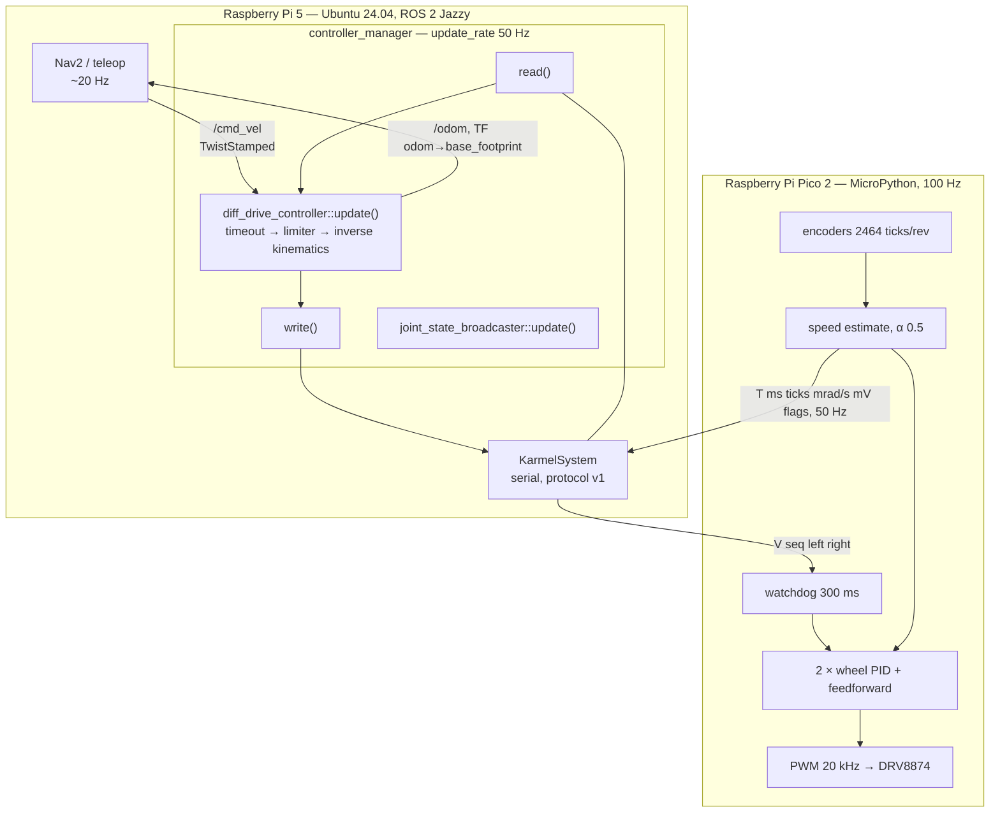

# 08.12 — Control in ROS 2 — where loops run, rates, limits and ros2_control

<!-- glance:start -->
<!-- generated by tools/build.py from curriculum/syllabus.yaml — edit the syllabus, not this block -->

| | |
|---|---|
| **Track** | Main path |
| **Difficulty** | Advanced |
| **Time** | 1 h |
| **Hardware** | Stage 1 robot: Pi 5, Pico, encoder motors, driver, chassis, battery, distance sensors (stage 1) |
| **Software** | ros2, ros2-control |
| **Prerequisites** | [08.09 Feedforward + PID: drive at exactly 0.5 m/s](08.09-feedforward-exact-speed.md)<br>[06.06 ros2_control — the same controllers in simulation and on the real robot](../06-simulation/06.06-ros2-control.md) |
| **Optional prerequisites** | [FC.07 Real-time concepts: determinism, latency, jitter and watchdogs](../optional-foundations/cpp-and-embedded/FC.07-real-time-concepts.md) |
| **Skip if** | You know which loops belong on the microcontroller and which in ROS 2. |

<!-- glance:end -->

## What you will learn

- Decide which control loop belongs on the microcontroller, which on the Pi and which in a ROS 2 node, using a latency budget instead of an opinion.
- Read the `controller_manager` cycle — read → update → write — and say what `update_rate` actually controls.
- Follow karmel's C++ `SystemInterface` (`read()` / `write()`) line by line and explain each of its failure modes.
- Configure `diff_drive_controller`: velocity and acceleration limits, `cmd_vel_timeout`, the odometry source and the calibration multipliers.
- Name the two independent watchdogs between a dead publisher and a moving robot, and say which one you trust.

## Why it matters

Everything you built in this module was a Python loop on the Pi, because that is where you can see it. That is not where a finished robot runs it. A ROS 2 node talking to a robot over serial has 80 ms of dead time before the motor moves; the same loop on the Pico has 10 ms. The wheel-speed loop you tuned to a 50 ms closed-loop time constant is *stable* in one place and *an oscillator* in the other, and the maths for which is which is [08.07](08.07-pid-mathematics.md)'s phase margin.

This lesson is also where your robot stops being a script and becomes a ROS 2 robot. From here on, `cmd_vel` in and `odom` out is the interface: [09.07](../09-odometry/09.07-odometry-in-ros2.md) publishes the odometry, [12.07](../12-navigation/12.07-nav2-in-simulation.md) has Nav2 driving it, and the same YAML runs in Gazebo and on the real chassis. Knowing what is between `cmd_vel` and the PWM — and which of those layers will silently clip, delay or stop your command — is the difference between debugging a robot and guessing at one.

<!-- prereqs:start -->
## Prerequisites

You need these first:

- [08.09 Feedforward + PID: drive at exactly 0.5 m/s](08.09-feedforward-exact-speed.md)
- [06.06 ros2_control — the same controllers in simulation and on the real robot](../06-simulation/06.06-ros2-control.md)

### Optional prerequisite links

New to any of these? Take the foundation lesson first; skip it if you already know it.

- [FC.07 Real-time concepts: determinism, latency, jitter and watchdogs](../optional-foundations/cpp-and-embedded/FC.07-real-time-concepts.md)

Check your readiness: `python course.py why 08.12`
<!-- prereqs:end -->

## Concept

### Every layer you add costs latency, and latency is a stability budget

There are three places a loop can live on karmel:

| Where | Period | Total dead time θ | Good for |
|---|---|---|---|
| Pico (MicroPython, bare loop) | 10 ms | ≈10 ms | wheel speed, current, anything that must not ring |
| Pi (Python, reading telemetry) | 20 ms | ≈25 ms | heading, turns, behaviours |
| ROS 2 node (over the same serial link) | 50 ms | ≈80 ms | path following, planning, anything at human speed |

The numbers are not preferences. A loop is only stable if its closed-loop time constant is comfortably larger than its own dead time — keep 45° of phase margin and you need $\tau_{cl} > 1.3\,\theta$ ([08.07](08.07-pid-mathematics.md)). The Pico can close a 50 ms loop with margin to spare; a ROS 2 node cannot, and the experiment shows it doing exactly what the formula predicts.

So: **the fast loop goes as close to the motor as it can get, and everything above it sends setpoints.** ROS 2 is not slow because ROS 2 is bad; it is slow because it is four layers up, and those four layers buy you a map, a planner, logging, replay and a community. Put the right job on each.

### The ros2_control cycle

`ros2_control` is the standard answer to "who talks to the motors". One real-time-ish loop, run by the `controller_manager` at `update_rate`, does three things per cycle:

```text
   read()          update()                     write()
   ───────►        ────────►                    ───────►
 hardware      every active controller       hardware
 → state       reads state interfaces        ← command
 interfaces    writes command interfaces     interfaces
```

Your hardware component (`KarmelSystem`) implements `read()` and `write()`. The controllers (`diff_drive_controller`, `joint_state_broadcaster`) implement `update()`. Neither knows about the other: they meet only at named interfaces — `left_wheel_joint/position`, `left_wheel_joint/velocity`. Swap the hardware plugin for Gazebo's and every line above it is unchanged; that is the whole point, and it is why [06.06](../06-simulation/06.06-ros2-control.md)'s simulation and your robot share one YAML file.

For a .NET reader: `SystemInterface` is a driver behind an interface, the `controller_manager` is the host that owns the loop and calls it, and the controllers are plug-ins resolved by name from a config file. The unusual part is only that the loop is periodic and must not block.

### Limits are part of the controller, not part of your node

`diff_drive_controller` will clamp the speed and the acceleration of every `cmd_vel` it receives, and will stop the robot if commands stop arriving. That is not a nuisance to work around: it is the last line of defence between a planner with a bug and a robot going through a wall. Configure it deliberately.

> [!TIP]
> **Ask your teacher:** "Walk me through one controller_manager cycle on karmel, naming every buffer the data passes through from cmd_vel to PWM."

## Technical explanation

> [!IMPORTANT]
> **Version-sensitive** (verified 2026-09 against ROS 2 Jazzy, `ros2_control` 4.48.x, `ros2_controllers` 4.42.x — see [`curriculum/versions.yaml`](../curriculum/versions.yaml)).
> Three things changed recently and break older tutorials: `diff_drive_controller` subscribes to **`geometry_msgs/TwistStamped`** on `~/cmd_vel`, not `Twist`; `has_velocity_limits` / `has_acceleration_limits` / `has_jerk_limits` are **deprecated** (set the limit itself to `.nan` to disable it); and `linear.x.min_acceleration` is **deprecated in favour of `linear.x.max_deceleration`** (still a negative number). Check the current parameter list before copying any YAML: https://control.ros.org/jazzy/doc/ros2_controllers/diff_drive_controller/doc/userdoc.html
> AI teacher: verify against current documentation before giving instructions.

### Level 1 — The stack, from `cmd_vel` to PWM

```text
 Nav2 / teleop  ──► /cmd_vel (TwistStamped, ~20 Hz)
                     │
 diff_drive_controller::update()        ← runs inside the controller_manager cycle
   • is the command newer than cmd_vel_timeout?  no → command 0
   • SpeedLimiter: clamp velocity, acceleration (and jerk)
   • inverse kinematics: ω_L,R = (v ∓ ω_z b/2) / r
   • write left/right_wheel_joint/velocity command interfaces
   • read back position/velocity state interfaces → integrate → publish /odom and TF
                     │
 KarmelSystem::write()  ──► "V <seq> <left mrad/s> <right mrad/s>\n" over USB serial
                     │
 Pico main loop (100 Hz)
   • watchdog: no command for 300 ms → stop
   • WheelSpeedEstimator: ticks → rad/s, low-pass α = 0.5
   • PID + feedforward per wheel  ← the loop you tuned in 08.04–08.09
   • PWM 20 kHz to the DRV8874s
                     │
 telemetry "T <ms> <lticks> <rticks> <lmrad/s> <rmrad/s> <mV> <flags>" at 50 Hz
                     │
 KarmelSystem::read() ──► position/velocity state interfaces
```

### Level 2 — The latency budget, term by term

| Stage | Contribution |
|---|---|
| Nav2 controller period (20 Hz) | 50.00 ms |
| `controller_manager` cycle (`update_rate` 50 Hz) | 20.00 ms |
| serial frame, 115200 baud, ~40 bytes | 3.50 ms |
| Pico control period (100 Hz) | 10.00 ms |
| PWM period (20 kHz) | 0.05 ms |
| **command out** | **83.55 ms** |
| motor time constant (63%) | 80.00 ms |
| speed estimate filter (α = 0.5 at 100 Hz) | 10.00 ms |
| telemetry period (50 Hz) | 20.00 ms |
| **until the Pi can see the result** | **193.55 ms** |

**Numerical example.** A wheel-speed loop closed at the top of that stack has θ ≈ 80 ms, so the fastest stable design is $\tau_{cl} \approx 100$ ms: two and a half times slower than the 40 ms the Pico manages, and that is *before* Linux scheduling jitter. Meanwhile a path-following loop wants $\tau_{cl}$ of half a second; 80 ms of dead time is 6° of phase at its crossover, which is nothing. Same stack, same numbers, opposite conclusions — because the requirement differs by an order of magnitude.

Serial arithmetic, since people guess it wrong: 115200 baud with 8N1 framing is 11520 bytes/s, so a 40-byte line takes 3.5 ms. At 50 Hz, commands plus telemetry use about 35% of the link. Doubling the telemetry rate is cheap; putting a 1 kHz control loop over it is not.

### Level 3 — `KarmelSystem`: the twenty lines that matter

The whole component is [`labs/ros2_ws/src/karmel_hardware/src/karmel_system.cpp`](../labs/ros2_ws/src/karmel_hardware/src/karmel_system.cpp). Its `read()` and `write()` are short on purpose — they run every cycle and must never block.

```cpp
// read — telemetry lines → state interfaces.
KarmelSystem::return_type KarmelSystem::read(const rclcpp::Time &, const rclcpp::Duration &)
{
  if (!poll_serial()) {                       // non-blocking: drain whatever arrived
    RCLCPP_ERROR(get_logger(), "Serial read failed: %s", port_.error().c_str());
    return return_type::ERROR;
  }

  // Stale data is worse than no data: a controller integrating old velocities drives blind.
  if ((steady_now() - last_telemetry_time_).seconds() > telemetry_timeout_s_) {
    RCLCPP_ERROR(get_logger(), "No telemetry from the Pico for %.2f s", telemetry_timeout_s_);
    return return_type::ERROR;
  }

  const double rad_per_tick = 2.0 * M_PI / ticks_per_rev_;
  for (size_t i = 0; i < 2; ++i) {
    set_state(joint_names_[i] + "/" + HW_IF_POSITION,
              static_cast<double>(tick_offset_[i] + last_ticks_[i]) * rad_per_tick);
    set_state(joint_names_[i] + "/" + HW_IF_VELOCITY, velocity_rad_s_[i]);
  }
  return return_type::OK;
}

// write — velocity command interfaces → one "V" line per cycle (which also feeds the Pico watchdog).
KarmelSystem::return_type KarmelSystem::write(const rclcpp::Time &, const rclcpp::Duration &)
{
  std::array<int32_t, 2> mrad_s{0, 0};
  for (size_t i = 0; i < 2; ++i) {
    const double command = get_command(joint_names_[i] + "/" + HW_IF_VELOCITY);
    // NaN means "no command yet" in ros2_control; send 0 rather than garbage.
    mrad_s[i] = std::isfinite(command) ? static_cast<int32_t>(std::lround(command * 1000.0)) : 0;
  }
  if (!port_.write(protocol::encode_velocity(next_seq(), mrad_s[kLeft], mrad_s[kRight]))) {
    RCLCPP_ERROR(get_logger(), "Serial write failed: %s", port_.error().c_str());
    return return_type::ERROR;
  }
  return return_type::OK;
}
```

Eight decisions hide in there, and each of them is a bug someone else has already shipped:

1. **`read()` never blocks.** It drains the serial buffer and uses the most recent complete line. A blocking read inside a 20 ms cycle turns a control loop into a jitter generator.
2. **Stale telemetry is an error, not a value.** After `telemetry_timeout_ms` (500 ms here) `read()` returns `ERROR`, the `controller_manager` deactivates the component, and the robot stops. A controller that keeps integrating the last known velocity is a robot that drives blind.
3. **A steady clock for timeouts.** The ROS clock can be simulated or can jump; `RCL_STEADY_TIME` cannot.
4. **Position is accumulated ticks, not a delta.** `diff_drive_controller` with `position_feedback: true` differentiates it itself, which is more accurate than differentiating twice.
5. **The Pico restarting does not teleport the robot.** `handle_line()` notices the Pico's millisecond clock going backwards and adds a `tick_offset_`, so the joint position stays continuous and odometry does not jump by a metre.
6. **NaN means "no command".** `ros2_control` initialises command interfaces to NaN; `std::lround(NaN)` is undefined behaviour and, on ARM, a very large number. Sending 0 instead is the difference between a stationary robot and a sprint.
7. **`write()` runs every cycle even if nothing changed.** That is what feeds the Pico's 300 ms watchdog. A "send only on change" optimisation would make the robot stop every time it was asked to hold a constant speed for 300 ms.
8. **`on_init` touches no hardware.** It runs whenever the description is loaded, including on a laptop with no robot attached.

The full `SystemInterface` contract — lifecycle states, exports, chainable controllers — is in the ros2_control documentation; [FC.07](../optional-foundations/cpp-and-embedded/FC.07-real-time-concepts.md) covers the real-time vocabulary (determinism, jitter, watchdog) that the design above assumes.

### Level 4 — `controllers.yaml`, parameter by parameter

From [`labs/ros2_ws/src/karmel_bringup/config/controllers.yaml`](../labs/ros2_ws/src/karmel_bringup/config/controllers.yaml):

```yaml
controller_manager:
  ros__parameters:
    update_rate: 50  # Hz. The Pico sends telemetry at 50 Hz; faster buys nothing on the real robot.

diff_drive_controller:
  ros__parameters:
    wheel_separation: 0.200
    wheel_radius: 0.045
    wheel_separation_multiplier: 1.0          # calibration knobs (09.05), instead of editing the geometry
    left_wheel_radius_multiplier: 1.0
    right_wheel_radius_multiplier: 1.0

    publish_rate: 50.0
    open_loop: false          # integrate measured wheel motion, not the commands
    position_feedback: true   # use wheel position state (encoder ticks), not velocity
    enable_odom_tf: true      # false once robot_localization publishes odom -> base_footprint

    cmd_vel_timeout: 0.5      # s without a command -> stop
    linear.x.max_velocity: 0.5
    linear.x.max_acceleration: 1.0
    angular.z.max_velocity: 2.5
    angular.z.max_acceleration: 5.0
```

- **`update_rate`** is the period of the whole read/update/write cycle, and therefore the sample period of every controller. 50 Hz matches the Pico's telemetry: running at 200 Hz would call `read()` four times per new sample, which adds CPU and no information. The default is 100 Hz.
- **`publish_rate`** is only how often `/odom` and TF go out. Decoupling it from `update_rate` lets you compute odometry fast and publish it slowly.
- **`open_loop: false` + `position_feedback: true`** means odometry integrates the *measured* wheel positions. `open_loop: true` integrates the commands, which is the classic way to produce odometry that looks perfect and is fiction ([09.06](../09-odometry/09.06-accumulated-error.md)).
- **The three multipliers** are the calibration you measured in [08.10](08.10-straight-line-heading-control.md) and will measure properly in [09.05](../09-odometry/09.05-calibrating-odometry.md), exposed as parameters so you never have to lie in the URDF.
- **`cmd_vel_timeout`** and the **limits** are the safety layer. On Jazzy, leaving a limit unset (`.nan`) disables it, and the deceleration limits are `max_deceleration` / `max_deceleration_reverse`, both normally negative.

**Numerical example (limits).** `linear.x.max_acceleration: 1.0` at `update_rate: 50` means the command may change by $1.0 \times 0.02 = 0.020$ m/s per cycle. A `cmd_vel` step from 0 to 0.5 m/s therefore becomes a ramp that takes 0.5 s, and the wheels are asked for +0.44 rad/s per cycle instead of a single jump to 11.11 rad/s. That one parameter is the difference between a robot that pulls away and a robot that slips its tyres, drops its LiDAR's registration and wakes the neighbours.

**The two watchdogs.** They are independent on purpose:

| | Where | Timeout | Stops what |
|---|---|---|---|
| `cmd_vel_timeout` | `diff_drive_controller`, on the Pi | 0.5 s | the controller commands zero wheel speed |
| firmware watchdog | the Pico | 0.3 s | the motors, in hardware, whatever the Pi is doing |

The Pico's is shorter and lower, and it is the one that saves you: it fires if the Pi freezes, if the USB cable is pulled, or if `ros2_control_node` is killed — none of which `cmd_vel_timeout` can notice, because it is running on the machine that just died. Measured on the simulator, `FLAG_WATCHDOG` is set 0.30 s after the last command, the wheel is below half speed at 0.35 s and effectively stopped at 0.53 s. At 0.4 m/s that is about 12 cm of travel after the last command: plan your test lane accordingly.

## Diagram



One cycle on a timeline:

```text
   t = 0 ms        20 ms          40 ms          60 ms
   ├───────────────┼──────────────┼──────────────┤   controller_manager, 50 Hz
   │read write     │read write    │read write    │
   │  │      │     │
   │  │      └──── serial "V" (3.5 ms) ──► Pico
   │  │                                     │
   │  │                                     └─► next Pico cycle (≤10 ms) ─► PWM
   │  └── newest telemetry line: up to 20 ms old already
   └─ a cmd_vel that arrived 1 ms ago waits here; one that arrives 1 ms later waits 20 ms more
```

## Code

### Reproducing the three effects without ROS 2

[`08-control/code/control_in_ros2.py`](code/control_in_ros2.py) runs the three behaviours above on the
course simulator, so you can see them before you have a ROS 2 machine in front of you. The
`SpeedLimiter` is a faithful reimplementation of the one inside `diff_drive_controller`:

```python
@dataclass
class SpeedLimiter:
    """Field names mirror the Jazzy parameters linear.x.* / angular.z.*; as in the C++ header,
    max_deceleration is normally NEGATIVE (m/s^2)."""

    max_velocity: float
    min_velocity: float
    max_acceleration: float   # >= 0
    max_deceleration: float   # <= 0
    previous: float = 0.0

    def limit(self, command: float, dt: float) -> float:
        wanted = min(max(command, self.min_velocity), self.max_velocity)
        change = wanted - self.previous
        self.previous += min(max(change, self.max_deceleration * dt), self.max_acceleration * dt)
        return self.previous
```

```bash
python 08-control/code/control_in_ros2.py --plot control_in_ros2.png
```

```text
Part 1 - the same wheel-speed step, closed in three different places
  where the loop runs                 settled  to 95 %  overshoot  settling  wobble
  Pico, 100 Hz (velocity mode)           7.99    100ms      25.4%     0.58s    0.04
  Pi, 50 Hz                              8.00     80ms       2.9%     0.08s    0.05
  ROS 2 node, 20 Hz + 30 ms latency      7.16    150ms      60.5%      infs    4.92
  (the Pico row's overshoot is its feedforward, which does not know the battery voltage —
   lesson 08.09, Part 2. Row 3 is the point of this lesson: same design, wrong place.)

Part 3 - diff_drive_controller limits: cmd_vel jumps 0 -> 0.5 m/s at 50 Hz
  max_acceleration 1.0 m/s^2 -> the command may change by 0.020 m/s per 20 ms cycle
  limited:   0.02 0.04 0.06 0.08 0.10 0.12 0.14 0.16 0.18 0.20 0.22 0.24 ...
  unlimited: 0.50 0.50 0.50 0.50 0.50 0.50 0.50 0.50 0.50 0.50 0.50 0.50 ...
  reaching 0.5 m/s takes 0.50 s; without the limit the wheels are asked to jump to 11.11 rad/s in one cycle

Part 4 - the publisher dies after 1 s: two timeouts, and which one saves you
  Pico watchdog (firmware)                   stops the wheels at t = 1.30 s
  cmd_vel_timeout (diff_drive_controller)    stops the wheels at t = 1.50 s
  measured on the simulator: FLAG_WATCHDOG at 0.30 s after the last command, below half speed at 0.35 s, effectively stopped at 0.53 s
```


Row 3 is the lesson: the *same PI design* that is calm on the Pi (2.9% overshoot) oscillates without bound when it is moved up one layer. Nothing was mistuned. The dead time went from 25 ms to about 80 ms, the phase margin went negative, and [08.07](08.07-pid-mathematics.md) told you it would.

### Running the real stack

On the robot (or in Gazebo — the same commands):

```bash
ros2 launch karmel_bringup robot.launch.py            # real robot: ros2_control_node + KarmelSystem
ros2 launch karmel_bringup robot.launch.py use_sim:=true   # Gazebo: GazeboSimSystem, same YAML

ros2 control list_hardware_components                 # KarmelSystem: active?
ros2 control list_hardware_interfaces                 # the six interfaces, and who claimed them
ros2 control list_controllers                         # diff_drive_controller: active, 50 Hz
ros2 topic hz /odom                                   # should sit at publish_rate
ros2 topic hz /joint_states

# Jazzy: cmd_vel is TwistStamped, so -1 (one message) needs a header
ros2 topic pub --once /cmd_vel geometry_msgs/msg/TwistStamped \
  "{header: {frame_id: base_link}, twist: {linear: {x: 0.2}, angular: {z: 0.0}}}"
```

> [!CAUTION]
> **Safety:** the moment `diff_drive_controller` is active, a single `ros2 topic pub` moves the robot. Put it on a stand for the first bring-up, keep `cmd_vel_timeout` short while you experiment, and remember `--once` sends one message: after `cmd_vel_timeout` the robot stops by itself, which is the behaviour you should verify *before* you trust it.

## Exercise

### Exercise 08.12-E1 — Your latency budget `[numerical]`

Hardware: none. Your setup: Nav2 at 10 Hz, `update_rate` 100 Hz, 115200 baud with 48-byte frames, Pico at 200 Hz, telemetry at 100 Hz, motor τ = 0.08 s, estimator filter 5 ms. (a) Compute the command-path dead time and the full round trip. (b) What is the fastest closed-loop time constant that keeps 45° of phase margin for a loop closed in the ROS 2 node? (c) Same question for a loop closed on the Pico. (d) At 115200 baud, what is the highest telemetry rate you can sustain if commands take 30% of the link?

### Exercise 08.12-E2 — Watch it go unstable `[simulation]`

Hardware: none. Run `control_in_ros2.py`, then change Part 1's third row to 50 Hz with 30 ms of latency, and to 20 Hz with no extra latency. Which of the two changes rescues the loop, and does the phase-margin formula agree? Then find, by bisection, the largest extra latency at which the 20 Hz loop is still stable, and compare with the prediction.

### Exercise 08.12-E3 — Predict: turn the knobs `[predict]`

Hardware: none. Predict the effect of each of these on karmel, before testing: (a) `update_rate: 200` with the Pico's telemetry still at 50 Hz; (b) `cmd_vel_timeout: 5.0`; (c) `linear.x.max_acceleration: 10.0`; (d) `open_loop: true`; (e) deleting the `linear.x.max_velocity` line entirely on Jazzy. For each, say what gets better, what gets worse, and what does not change at all.

### Exercise 08.12-E4 — Bring the stack up `[hardware]`

Hardware: `robot-base`. Simulation alternative: `use_sim:=true` (Gazebo) or `control_in_ros2.py`.
Robot on a stand. Launch the stack, then: (a) `ros2 control list_hardware_interfaces` — which six interfaces exist and which are claimed? (b) `ros2 topic hz /joint_states` and `/odom` — do they match `publish_rate`? (c) Publish a `cmd_vel` of 0.2 m/s once and time how long until the wheels stop; compare with `cmd_vel_timeout`. (d) Pull the USB cable while the wheels are turning and time how long until they stop; which watchdog was that? (e) `ros2 control set_hardware_component_state KarmelSystem inactive` — what happens to the wheels, and what does `list_controllers` say?

### Exercise 08.12-E5 — Modernise the YAML `[coding]`

Hardware: none. `controllers.yaml` uses `linear.x.min_acceleration: -1.0` and `angular.z.min_acceleration: -5.0`. On Jazzy those are deprecated in favour of `max_deceleration` (also negative). Update the file, keep `labs/ros2_ws/src/karmel_bringup/test/test_config.py` passing, add an assertion to that test for the deceleration limits, and check the parameter names against the current documentation before you commit. Write down, in the commit message, the date you checked.

### Exercise 08.12-E6 — The message-type trap `[debugging]`

Hardware: none. A tutorial from 2023 tells you to publish `geometry_msgs/msg/Twist` on `/cmd_vel`. You do, and nothing moves — no error, no warning, the robot just sits there. (a) Why is there no error? (b) Which two commands diagnose it in under a minute? (c) Give the correct `ros2 topic pub` line. (d) Your teleop package only publishes `Twist`; name two ways to bridge it, and say which one you would put in a launch file.

### Exercise 08.12-E7 — Where does the new loop go? `[design]`

Hardware: none. For each of these, decide Pico / Pi node / ROS 2 node, and justify it with a dead time and a required bandwidth: (a) a current limit that must cut the motor within 5 ms of a stall; (b) a wall-following loop using the front ToF sensor at 20 Hz; (c) a battery-voltage cutoff; (d) the 90° turn primitive from [08.11](08.11-rotate-exactly-90.md); (e) a visual servo that centres the robot on an ArUco marker seen by a 30 Hz camera. For any you put in ROS 2, name the topic and the message type.

## Expected result

**08.12-E1:** (a) Command path: $100 + 10 + 48/11520 \times 1000 + 5 + 0.05 = 100 + 10 + 4.17 + 5 + 0.05 = $ **119.2 ms**. Round trip adds the motor (80 ms), the filter (5 ms) and the telemetry period (10 ms): **214.2 ms**. (b) 45° of phase margin needs $\theta/\tau_{cl} \le 0.785$ rad, so $\tau_{cl} \ge 119.2/0.785 = $ **152 ms**. (c) On the Pico θ ≈ 5 ms (half period) + 5 ms (filter) = 10 ms → $\tau_{cl} \ge$ **13 ms**, twelve times faster. (d) 11520 bytes/s, 70% available = 8064 bytes/s; a 48-byte telemetry line gives **168 Hz**. Note that the Nav2 period dominates (a): halving `update_rate` would change almost nothing, while running Nav2 at 20 Hz would save 50 ms.

**08.12-E2:** 50 Hz with 30 ms latency: θ ≈ 10 + 30 + 15 = 55 ms — the loop rings but survives (overshoot ~50%, wobble under 1). 20 Hz with no extra latency: θ ≈ 25 + 15 = 40 ms — calm, roughly 15% overshoot. So the *latency*, not the rate, is what kills it here, which is the general result: a slow loop with little delay beats a fast loop with a lot. The λ = 50 ms design's predicted limit is θ = 78.5 ms; at 20 Hz (25 ms of intrinsic dead time) that leaves about 50 ms of extra latency, and bisection should find the transition between 40 and 60 ms.

**08.12-E3:** (a) **Nothing improves.** `read()` is called four times per new telemetry sample, so three of every four cycles carry stale data; CPU load doubles, odometry does not get better, and the controller's `period` argument no longer matches the data's real age. (b) The robot keeps executing the last command for five seconds after the publisher dies — and the only thing that saves you is the Pico's 300 ms watchdog. `cmd_vel_timeout` is a *behaviour* parameter, not a safety one. (c) The acceleration limit stops protecting you: the wheels get near-steps again, tyres slip, odometry degrades, and the LiDAR's motion distortion gets worse. Nothing about *steady* speed changes. (d) Odometry becomes a copy of the commands: perfectly smooth, blind to slip, stalls and a blocked wheel — the robot would report driving through a wall. (e) On Jazzy an unset limit means `.nan` = **no limit**: the robot will accept any speed Nav2 asks for, up to what the wheels can do. The parameter is the guard rail; deleting it removes the rail, not the cliff.

**08.12-E4:** (a) Six: `left_wheel_joint/position`, `left_wheel_joint/velocity`, the same two for the right wheel (state interfaces), and `left_wheel_joint/velocity`, `right_wheel_joint/velocity` (command interfaces). The command interfaces are claimed by `diff_drive_controller`; the state interfaces are read by both controllers. (b) Both should sit within a few per cent of 50 Hz. If `/joint_states` is at 50 and `/odom` is not, check `publish_rate`; if both are ragged, the Pi is overloaded or telemetry is being dropped. (c) About 0.5 s — `cmd_vel_timeout`. (d) Well under a second: `read()` fails, and independently the Pico's 300 ms watchdog stops the motors. That is the firmware watchdog, and it is the only one that works when the Pi is the thing that failed. (e) The wheels stop (`on_deactivate` sends `S`), and `list_controllers` shows `diff_drive_controller` as inactive or erroring because its command interfaces are gone.

**08.12-E5:** The diff is four lines. `test_config.py` keeps passing because it only asserts the velocity and acceleration limits; your new assertions should check that `linear.x.max_deceleration == -drive['max_linear_accel_m_s2']` and the angular equivalent. If you find that the current documentation has changed the names again, follow the documentation and note the date — that is the whole point of the exercise and of `curriculum/versions.yaml`.

**08.12-E6:** (a) DDS matches publishers and subscribers by topic *and type*; a `Twist` publisher and a `TwistStamped` subscriber simply never connect. There is no error because nothing went wrong — they are two different topics that happen to share a name. (b) `ros2 topic info /cmd_vel --verbose` (shows both endpoints and their types, and a publisher count of 1 with a subscriber count of 0 on the same name), and `ros2 param get /diff_drive_controller use_stamped_vel` where available, or simply `ros2 interface show` on what the controller documents. (c) `ros2 topic pub --once /cmd_vel geometry_msgs/msg/TwistStamped "{header: {frame_id: base_link}, twist: {linear: {x: 0.2}}}"`. (d) Either use a teleop that publishes stamped messages (`teleop_twist_keyboard` has a `stamped` parameter in recent releases), or run a tiny relay node that subscribes to `Twist` and republishes `TwistStamped` with `now()` as the stamp. The relay goes in the launch file, because it is configuration, not code you want to remember to start by hand.

**08.12-E7:** (a) **Pico.** 5 ms is below one `controller_manager` cycle; anything above the firmware is physically incapable. (Better still: the DRV8874's own current limit, in hardware.) (b) **Pi node or ROS 2 node.** The sensor is 20 Hz, so the loop cannot be faster than 50 ms anyway; θ ≈ 80 ms in ROS 2 against a required $\tau_{cl}$ of ~0.5 s is comfortable. ROS 2 if you want it composable with Nav2; a Pi script if it is a lab exercise. (c) **Pico**, plus a ROS 2 diagnostic. The cutoff must work when Linux is not running; the Pi only needs to *report* it. (d) **Pi or ROS 2 node**: it needs 50 Hz and the IMU, both of which live on the Pi. As a ROS 2 node it becomes an action server, which is how Nav2 would call it. (e) **ROS 2 node**, publishing `geometry_msgs/msg/TwistStamped` on `/cmd_vel`: the camera, the detector and the transform tree are all there, and a 30 Hz camera with detection latency means $\tau_{cl}$ of half a second at best. Anything else is asking a microcontroller to do computer vision.

## Troubleshooting

### Symptom: the robot does not move and nothing is logged
Work down the stack. 1) `ros2 topic info /cmd_vel --verbose` — right type (`TwistStamped` on Jazzy), right endpoints? 2) `ros2 control list_controllers` — is `diff_drive_controller` *active*? 3) `ros2 control list_hardware_components` — is `KarmelSystem` *active*? 4) `ros2 topic echo /joint_states` — is telemetry arriving at all? 5) Only then look at the Pico (its LED, `FLAG_VELOCITY_MODE`, the serial port permissions).

### Symptom: it moves, then stops after half a second, repeatedly
`cmd_vel_timeout`. Your publisher is sending single messages or publishing more slowly than the timeout. Publish continuously (`ros2 topic pub -r 10 ...`), or raise the timeout — but remember E3(b): a long timeout is a long time for a runaway robot.

### Symptom: `read()` errors with "No telemetry from the Pico"
The Pico stopped sending. Check, cheapest first: the USB cable and `dmesg` for disconnects; whether the firmware is actually running (its status LED); the port permissions (`dialout` group); and whether another process has the port open (`fuser /dev/ttyACM0`). A `ros2 control set_hardware_component_state KarmelSystem active` after fixing it brings the component back without restarting the stack.

### Symptom: odometry is smooth and wrong
`open_loop: true`, or `position_feedback` mismatched with what the hardware exports. Smooth-and-wrong is the signature of integrating commands instead of measurements. Check against ground truth in Gazebo, or against a tape measure on the floor ([09.05](../09-odometry/09.05-calibrating-odometry.md)).

### Symptom: the loop rate jitters and `/odom` timestamps bunch up
The Pi is overloaded, or something in the cycle blocks. Check the CPU, check that nothing in `read()` or `write()` waits on I/O, and consider lowering `update_rate` — 50 Hz done on time beats 200 Hz done whenever. [FC.07](../optional-foundations/cpp-and-embedded/FC.07-real-time-concepts.md) and [03.04](../03-robot-software/03.04-timing-and-concurrency.md) cover measuring jitter properly.

### Symptom: the robot lurches when a controller is activated
A stale command interface. `on_activate` must zero the commands (`KarmelSystem` does), and `write()` must treat NaN as zero. If you wrote your own component and skipped either, this is the bug.

## Common mistakes

- **Closing a fast loop in a ROS 2 node because that is where your code already is.** Measure the dead time first; the phase-margin arithmetic decides, not convenience.
- **Publishing `Twist` on Jazzy.** Silent, because a type mismatch is not an error in DDS. Check with `ros2 topic info --verbose`.
- **Raising `update_rate` above the data rate.** More cycles over the same samples: more CPU, no information, and a `period` that lies about the data's age.
- **Treating `cmd_vel_timeout` as a safety feature.** It runs on the machine that is most likely to be the thing that failed. The hardware watchdog is the safety feature.
- **Disabling the acceleration limits to "make it more responsive".** You will get slip, worse odometry, motion-distorted LiDAR scans and a heavier current draw, in exchange for tenths of a second.
- **Blocking inside `read()` or `write()`.** One blocking call turns a control loop into a jitter source and every controller downstream into a liar.
- **Assuming NaN command interfaces are zero.** They are not, and `lround(NaN)` is undefined behaviour.

## Knowledge check

1. What exactly does `controller_manager`'s `update_rate` control, and what does it *not* control?
   <details><summary>Answer</summary>

   It is the period of the whole read → update → write cycle, so it sets the sample period of every controller. It does not control how fast `/odom` is published (`publish_rate`), how fast the hardware actually produces data (the Pico's telemetry rate), or the rate of whatever publishes `cmd_vel`.
   </details>

2. Why does `write()` send a command every cycle even when nothing changed?
   <details><summary>Answer</summary>

   Because the Pico's watchdog uses command arrival as its heartbeat. Skipping identical commands would let the watchdog fire during any constant-speed motion longer than 300 ms.
   </details>

3. Your Nav2 loop runs at 10 Hz and the serial link adds 4 ms. Where should a wheel-speed loop with a 40 ms time constant live, and why?
   <details><summary>Answer</summary>

   On the Pico. A 40 ms closed-loop time constant needs θ below about 31 ms for 45° of phase margin; anywhere in ROS 2 the dead time is already 80–120 ms. Only the microcontroller, at ≈10 ms, has the budget.
   </details>

4. `linear.x.max_acceleration: 2.0` and `update_rate: 100`. How much may the commanded speed change per cycle, and how long does a 0 → 0.5 m/s step take?
   <details><summary>Answer</summary>

   $2.0 \times 0.01 = 0.020$ m/s per cycle; 0.5 m/s takes 25 cycles = **0.25 s**.
   </details>

5. Predict: you set `open_loop: true` and drive the robot into a wall. What does `/odom` say?
   <details><summary>Answer</summary>

   That the robot is still moving forward at the commanded speed, straight through the wall, because it is integrating the commands rather than the measured wheel motion. With `open_loop: false` the stalled wheels report zero and odometry stays put.
   </details>

6. Name the two watchdogs between a dead `cmd_vel` publisher and a moving robot, and say which one protects you if the Pi kernel panics.
   <details><summary>Answer</summary>

   `cmd_vel_timeout` inside `diff_drive_controller` (0.5 s, on the Pi) and the firmware watchdog on the Pico (0.3 s, in the motor's own processor). Only the Pico's survives a dead Pi.
   </details>

7. Debugging: `ros2 topic hz /odom` shows 50 Hz, `ros2 topic echo /joint_states` shows positions that never change, and the wheels are turning. Where is the fault?
   <details><summary>Answer</summary>

   Between the telemetry and the state interfaces: `read()` is returning OK but the parsed ticks are not reaching `set_state` — a mis-parsed telemetry line, joint names that do not match the URDF, or a hardware component that is publishing stale values. The controllers are fine; they are faithfully reporting what the hardware component told them.
   </details>

8. Why is swapping `karmel_hardware/KarmelSystem` for `gz_ros2_control/GazeboSimSystem` enough to run the same robot in simulation?
   <details><summary>Answer</summary>

   Because everything above the hardware component talks only to named interfaces (`left_wheel_joint/velocity`, …). The controllers, their YAML, the topics and the TF tree do not know or care what is behind those names. That is the entire value proposition of `ros2_control`, and it is why [06.09](../06-simulation/06.09-same-code-sim-and-real.md) works.
   </details>

## Practical challenge

**Measure your robot's real control latency, end to end, and place one loop with the number.**

1. Instrument the path: log a timestamp when your node publishes `cmd_vel`, and use the Pico's telemetry `ms` field plus the wheel-speed estimate to find when the wheel actually started moving. A step from 0 to 5 rad/s is enough; do it 20 times.
2. Report the distribution, not the mean: median, 95th percentile and worst case of the command latency, and separately of the *round trip* (command out to observable change in telemetry).
3. Repeat with `update_rate` at 20, 50 and 100 Hz, and with the Pi deliberately loaded (`stress-ng` or a camera pipeline). Plot latency against load.
4. Using your measured 95th-percentile θ, compute the fastest closed-loop time constant that keeps 45° of phase margin for a loop in a ROS 2 node, and for one on the Pico.
5. Then implement **one** loop in the right place based on that number — the obvious candidate is the 08.11 turn primitive, as a ROS 2 action server if your number allows it, or as a Pi-side node if it does not — and show it meeting its acceptance criteria while Nav2-like load is running.

**Acceptance criteria:** a latency table with percentiles under three loads and three `update_rate` values; a stated θ with the percentile you chose and a sentence on why; the computed $\tau_{cl}$ limits; a working loop in the place your number justifies, with the same ±2°/±5 cm acceptance criteria it had in 08.10/08.11, measured **under load**; and one paragraph on what you would move if you had to add a camera pipeline to the same Pi.

## You can skip this if…

You answer knowledge-check questions 1, 3 and 6 correctly without looking, and you can look at a new control loop, estimate its dead time from the stack it would sit in, and say — with the arithmetic — whether it belongs in firmware, in a host process or in a ROS 2 node.

`python course.py skip 08.12 --reason "I place control loops by latency budget and I know the ros2_control cycle"`

## Go deeper

- ros2_control documentation (Jazzy): https://control.ros.org/jazzy/index.html — the architecture, the lifecycle and the `SystemInterface` contract. Start with "Writing a Hardware Component": https://control.ros.org/jazzy/doc/ros2_control/hardware_interface/doc/writing_new_hardware_component.html
- `controller_manager` parameters and CLI: https://control.ros.org/jazzy/doc/ros2_control/controller_manager/doc/userdoc.html — `update_rate`, the spawner, and the `ros2 control` verbs (`list_controllers`, `list_hardware_interfaces`, `switch_controllers`, `set_hardware_component_state`).
- `diff_drive_controller` parameters: https://control.ros.org/jazzy/doc/ros2_controllers/diff_drive_controller/doc/userdoc.html — the authoritative list of limits, timeouts and odometry options. Re-read it whenever you upgrade a distro.
- `ros2_control_demos`: https://control.ros.org/jazzy/doc/ros2_control_demos/doc/index.html — small, complete hardware components to compare with `KarmelSystem`.
- [FC.07 Real-time concepts: determinism, latency, jitter and watchdogs](../optional-foundations/cpp-and-embedded/FC.07-real-time-concepts.md) — the vocabulary this lesson uses and the reason the Pico exists.
- [FC.08 micro-ROS](../optional-foundations/cpp-and-embedded/FC.08-micro-ros.md) — the other answer to "where does the loop live": put ROS 2 itself on the microcontroller.

## Progress checkpoint

- [ ] I can compute a latency budget for my stack and use it to place a loop.
- [ ] I can explain the read → update → write cycle and what `update_rate` does and does not set.
- [ ] I can read `KarmelSystem`'s `read()`/`write()` and name what each guard protects against.
- [ ] I know which `diff_drive_controller` parameters limit my robot, and which watchdog actually saves it.

`python course.py complete 08.12` (exercises done) · `python course.py master 08.12` (challenge done) · `python course.py struggle 08.12 "what was hard"`

Next: module [09 — Odometry](../09-odometry/09.01-diff-drive-kinematics.md), where the wheel motion you can now command precisely becomes a pose.
