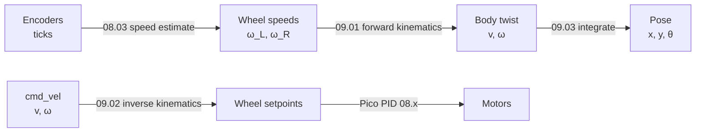

# 09.01 — Differential-drive kinematics: wheel speeds to robot motion

<!-- glance:start -->
<!-- generated by tools/build.py from curriculum/syllabus.yaml — edit the syllabus, not this block -->

| | |
|---|---|
| **Track** | Main path |
| **Difficulty** | Intermediate |
| **Time** | 1 h |
| **Hardware** | none |
| **Software** | python |
| **Prerequisites** | [05.02 Position, orientation and pose in 2D (x, y, θ)](../05-frames-and-transforms/05.02-pose-in-2d.md)<br>[01.12 Use encoders to drive exact distances and angles — drive a square](../01-first-robot/01.12-encoder-distance-and-square.md) |
| **Optional prerequisites** | [FM.03 Trigonometry: sin, cos, tan and atan2](../optional-foundations/mathematics/FM.03-trigonometry.md)<br>[FP.01 Units, position, velocity and acceleration](../optional-foundations/physics/FP.01-kinematics-units.md) |
| **Skip if** | You can derive v and ω from left/right wheel speeds. |

<!-- glance:end -->

## What you will learn

- Derive the robot's forward speed `v` and turn rate `ω` from the left and right wheel speeds, from first principles.
- Find the instantaneous center of curvature (ICC) and the turning radius for any pair of wheel speeds.
- Predict the motion of karmel for a wheel command before you send it: straight, arc, pivot or spin in place.
- Explain why a differential drive cannot move sideways, and what that means for planners.
- Estimate how an error in wheel radius or wheelbase turns into an error in `v` and `ω`.

## Why it matters

karmel has no speedometer and no compass that tell it how it moves. It has two wheel encoders. Every
higher layer of the robot talks in body motion. The joystick sends "forward at 0.3 m/s, turn at
1 rad/s". Nav2 sends the same kind of `cmd_vel`. The odometry you build in [09.04](09.04-odometry-from-scratch.md)
reports "I moved 12 cm and turned 5°". The translation between wheel speeds and body motion is
two lines of algebra. Every mobile-robot stack in the world contains those two lines. Get them
right and you can reason about any wheeled robot. Get a sign or a factor of two wrong and your
robot turns left when the planner said right.

This lesson derives the translation in one direction: wheels to body. [09.02](09.02-inverse-kinematics-cmd-vel.md)
does the other direction, body to wheels. [09.03](09.03-dead-reckoning-integration.md) turns
body velocities into a pose over time.

<!-- prereqs:start -->
## Prerequisites

You need these first:

- [05.02 Position, orientation and pose in 2D (x, y, θ)](../05-frames-and-transforms/05.02-pose-in-2d.md)
- [01.12 Use encoders to drive exact distances and angles — drive a square](../01-first-robot/01.12-encoder-distance-and-square.md)

### Optional prerequisite links

New to any of these? Take the foundation lesson first; skip it if you already know it.

- [FM.03 Trigonometry: sin, cos, tan and atan2](../optional-foundations/mathematics/FM.03-trigonometry.md)
- [FP.01 Units, position, velocity and acceleration](../optional-foundations/physics/FP.01-kinematics-units.md)

Check your readiness: `python course.py why 09.01`
<!-- prereqs:end -->

## Concept

Picture karmel from above. Two drive wheels sit on one axle line, 20 cm apart, and a ball caster
at the back just follows. Each wheel can only do one thing: roll forward or backward along the
direction it points. It cannot slide sideways (if it does, that's slip, and odometry is already
lying).

Now look at what the two wheels can do together:

- **Same speed, same direction:** the robot drives straight.
- **Same speed, opposite directions:** the robot spins in place around the midpoint of the axle.
- **Right wheel faster than left:** the robot curves left. The faster the right wheel is compared
  with the left, the tighter the curve.
- **One wheel stopped:** the robot pivots around that stopped wheel.

All four cases are one idea. **At any instant a rigid robot on two wheels rotates around some point
on the axle line.** That point is the *instantaneous center of curvature* (ICC). For a straight
line it's infinitely far away. For a spin in place it's the middle of the axle. For a pivot it's
the stopped wheel. Each wheel moves on a circle around the ICC, so a wheel far from the ICC moves
faster than a wheel close to it. It's like a marching band turning a corner: the person on the
inside of the turn takes tiny steps, the person on the outside takes big ones, and the row stays
straight.

This is why a differential drive is called **non-holonomic**. It has three degrees of freedom on
the floor (x, y, heading) but only two controls (two wheel speeds). It can reach any pose, but
not in any direction right now. To move sideways it must turn, drive, turn back, like
parallel parking. Planners in [module 12](../12-navigation/12.05-local-planning-obstacle-avoidance.md)
must respect this.

> [!TIP]
> **Ask your teacher:** "Draw me (in ASCII) karmel driving an arc with the ICC marked, then ask me where the ICC moves if I slow the inner wheel down."

## Technical explanation

### Level 1 — Intuition: rim speeds

A wheel of radius $r$ turning at angular speed $\omega_w$ (rad/s) moves its contact point over
the floor at the **rim speed** $v_w = r\,\omega_w$. Everything below uses rim speeds $v_L$ and
$v_R$ in m/s, because the geometry is about distances on the floor. Wheel angular speeds only enter
through $v = r\,\omega_w$.

> [!NOTE]
> New to speed, units and radians per second? → [FP.01 Units, position, velocity and acceleration](../optional-foundations/physics/FP.01-kinematics-units.md). New to sin/cos? → [FM.03 Trigonometry](../optional-foundations/mathematics/FM.03-trigonometry.md). Skip them if you already know them.

karmel numbers (from [`labs/config/karmel.yaml`](../labs/config/karmel.yaml)): $r = 0.045$ m,
wheel separation (track width) $L = 0.200$ m, encoder 2464 ticks per wheel revolution. One tick is
$2\pi \cdot 0.045 / 2464 = 0.1147$ mm of rim travel.

### Level 2 — Practical: the two formulas

$$v = \frac{v_R + v_L}{2} \qquad\qquad \omega = \frac{v_R - v_L}{L}$$

- $v$ is the forward speed of **base_link**, the midpoint between the wheels (m/s).
- $\omega$ is the yaw rate (rad/s), **positive counter-clockwise** (turning left), as REP-103 requires.
- The turning radius, measured from base_link to the ICC along the robot's $+y$ (left) axis:
  $R = v/\omega$. Positive $R$ means the ICC is on the left.

Worked examples with karmel's $r = 0.045$ m and $L = 0.2$ m, computed by
[`code/diff_drive_numbers.py`](code/diff_drive_numbers.py):

| Wheels L, R (rad/s) | Rim speeds (m/s) | $v$ (m/s) | $\omega$ (rad/s) | ICC $R$ | Motion |
|---|---|---|---|---|---|
| 6, 6 | 0.270, 0.270 | 0.270 | 0 | ∞ | straight |
| 4, 8 | 0.180, 0.360 | 0.270 | +0.900 | +0.300 m | arc left |
| 8, 4 | 0.360, 0.180 | 0.270 | −0.900 | −0.300 m | arc right |
| −5, 5 | −0.225, 0.225 | 0 | +2.250 | 0 | spin left in place |
| 0, 8 | 0, 0.360 | 0.180 | +1.800 | +0.100 m | pivot on the left wheel |
| −6, −6 | −0.270, −0.270 | −0.270 | 0 | ∞ | straight backward |

Check the second row by hand: $v = (0.36 + 0.18)/2 = 0.27$ m/s, $\omega = (0.36 - 0.18)/0.2 = 0.9$
rad/s (51.6°/s), $R = 0.27/0.9 = 0.3$ m. In 7 s the robot completes $0.9 \cdot 7 / 2\pi = 1.003$
turns of a circle with a 60 cm diameter.

The pivot row shows why $R$ is measured to base_link. The left wheel is stopped, so the ICC is at
the left wheel, which is $L/2 = 0.1$ m to the left of base_link.

### Level 3 — Mathematics: deriving it

Put the ICC at signed distance $R$ from base_link along the robot's left axis. The robot is a
rigid body rotating about the ICC with angular speed $\omega$. Every point moves at speed
$\omega \times$ (its distance to the ICC). The left wheel is at distance $R - L/2$ and the right
wheel at $R + L/2$:

$$v_L = \omega\left(R - \frac{L}{2}\right) \qquad v_R = \omega\left(R + \frac{L}{2}\right)$$

Subtract the first from the second: $v_R - v_L = \omega L$, so $\omega = (v_R - v_L)/L$.
Add them: $v_R + v_L = 2\omega R$. base_link is at distance $R$, so its speed is
$v = \omega R = (v_R + v_L)/2$. Solve for the radius:

$$R = \frac{L}{2}\cdot\frac{v_R + v_L}{v_R - v_L}$$

Numerically for wheels (4, 8) rad/s: $R = 0.1 \cdot (0.54/0.18) = 0.3$ m, as in the table.
When $v_R = v_L$ the denominator is zero, $R \to \infty$, and the robot drives straight. Code must
treat that case separately (you'll do it in [09.04](09.04-odometry-from-scratch.md)).

**Matrix form.** Both formulas together are a linear map from wheel angular speeds to body twist:

$$\begin{bmatrix} v \\ \omega \end{bmatrix} =
\begin{bmatrix} r/2 & r/2 \\ -r/L & r/L \end{bmatrix}
\begin{bmatrix} \omega_L \\ \omega_R \end{bmatrix}$$

For karmel the matrix is $\begin{bmatrix} 0.0225 & 0.0225 \\ -0.225 & 0.225 \end{bmatrix}$, and
$(4, 8)$ maps to $(0.0225 \cdot 12,\; 0.225 \cdot 4) = (0.27, 0.9)$. Its determinant
$r^2/L = 0.010125 \neq 0$, so the map is invertible. That's why [09.02](09.02-inverse-kinematics-cmd-vel.md)
can go back from any $(v, \omega)$ to exactly one pair of wheel speeds.

**From body to world.** $v$ and $\omega$ are in the robot's own frame. With heading $\theta$ in the
world (see [05.02](../05-frames-and-transforms/05.02-pose-in-2d.md)):

$$\dot x = v\cos\theta \qquad \dot y = v\sin\theta \qquad \dot\theta = \omega$$

At $\theta = 30°$ and $v = 0.27$ m/s: $\dot x = 0.234$ m/s, $\dot y = 0.135$ m/s. Integrating these
three equations over time is dead reckoning, the whole of [09.03](09.03-dead-reckoning-integration.md).

**ICC in world coordinates.** The ICC is $R$ to the left of the robot:
$\text{ICC} = (x - R\sin\theta,\; y + R\cos\theta)$. Robot at $(1, 2)$ facing $\theta = 90°$
(along +y) with $R = 0.3$: ICC $= (1 - 0.3, 2 + 0) = (0.7, 2)$, which is 30 cm to its left. ✓

**The non-holonomic constraint.** The body never moves along its own $y$ axis. In world
coordinates, the velocity has no component perpendicular to the heading:

$$\dot x \sin\theta - \dot y\cos\theta = 0$$

Check with the numbers above: $0.234 \cdot 0.5 - 0.135 \cdot 0.866 = 0.117 - 0.117 = 0$.

**How parameter errors propagate.** Everything scales with $r$, and $\omega$ also divides by $L$.
For small relative errors:

$$\frac{\delta v}{v} = \frac{\delta r}{r} \qquad \frac{\delta \omega}{\omega} = \frac{\delta r}{r} - \frac{\delta L}{L}$$

Suppose the effective wheelbase is really 208 mm and you use 200 mm, a 4 % error. Then every
computed turn is 4 % too large. After the robot really turns 360° in place, odometry reports
374.4°. A 14° heading error after one spin is huge, as [09.06](09.06-accumulated-error.md) shows.
The *effective* wheelbase is not the distance between wheel centers you measure with a ruler. It
depends on where the tyres actually grip, which is why [09.05](09.05-calibrating-odometry.md)
measures it from driving.

### Level 4 — Implementation

karmel's base driver already contains these formulas. `wheels_to_twist()` in
[`labs/ros2_ws/src/karmel_base/karmel_base/kinematics.py`](../labs/ros2_ws/src/karmel_base/karmel_base/kinematics.py)
converts the Pico's reported wheel speeds into the twist it publishes on `/odom`:

```python
def wheels_to_twist(left: float, right: float, wheel_radius: float, wheel_separation: float) -> tuple[float, float]:
    """Wheel speeds (rad/s) -> body twist (m/s, rad/s)."""
    v = wheel_radius * (right + left) / 2.0
    w = wheel_radius * (right - left) / wheel_separation
    return v, w
```

Two sign conventions matter in practice:

1. **Wheel direction.** "Positive wheel speed" must mean "rolls the robot forward" for *both*
   wheels. The motors are mirror images, so one of them turns the other way electrically. The
   firmware or the URDF joint axis flips it ([01.09](../01-first-robot/01.09-reading-encoders.md)).
   If you skip this, the formulas turn "straight" into "spin".
2. **Left is +y.** REP-103: x forward, y left, counter-clockwise positive. A right wheel faster than
   the left gives positive $\omega$.

## Diagram

Geometry of an arc to the left (top view, x forward):

```text
                        ICC  ●  (on the axle line, R to the left of base_link)
                             |
                             |  R - L/2   left wheel circle radius
                             |
        y ▲             ┌────┴────┐
          │             │  L wheel│  v_L = ω (R - L/2)
          │             │    ▣    │
          │   caster    │    │    │
          │     o ──────┼────●────┼───▶ x (forward)      ● base_link, v = ω R
          │             │    │    │
          │             │    ▣    │  v_R = ω (R + L/2)
          │             │  R wheel│
          └─────▶ x     └─────────┘
                        |<-- L = 0.200 m between the wheel contact points -->|

   v = (v_R + v_L) / 2          ω = (v_R - v_L) / L          R = v / ω
```

Where these formulas sit in the data flow of the robot:



## Code

[`09-odometry/code/diff_drive_numbers.py`](code/diff_drive_numbers.py) prints the worked examples
for your robot's config (it reads `labs/config/karmel.yaml`) and can plot the wheel paths around the
ICC:

```python
def forward_kinematics(left_rad_s: float, right_rad_s: float, r: float, separation: float) -> BodyMotion:
    """Wheel angular speeds -> body motion and instantaneous center of curvature."""
    v_l, v_r = r * left_rad_s, r * right_rad_s
    v = (v_r + v_l) / 2.0
    omega = (v_r - v_l) / separation
    radius = math.inf if abs(omega) < 1e-12 else v / omega
    return BodyMotion(v, omega, radius, v_l, v_r)
```

Run it from the repository root:

```bash
python 09-odometry/code/diff_drive_numbers.py
python 09-odometry/code/diff_drive_numbers.py 4.0 8.0 --plot icc.png
```

Output (first lines):

```text
karmel: r = 0.045 m, L = 0.2 m, 2464 ticks/rev -> 0.1147 mm/tick
wheels L= +6.00 R= +6.00 rad/s | rims +0.270 +0.270 m/s | v=+0.270 m/s  omega=+0.000 rad/s (  +0.0 deg/s) | ICC straight
wheels L= +4.00 R= +8.00 rad/s | rims +0.180 +0.360 m/s | v=+0.270 m/s  omega=+0.900 rad/s ( +51.6 deg/s) | ICC +0.300 m
wheels L= -5.00 R= +5.00 rad/s | rims -0.225 +0.225 m/s | v=+0.000 m/s  omega=+2.250 rad/s (+128.9 deg/s) | ICC +0.000 m
at 0.3 m/s one wheel makes 52.3 ticks per 20 ms telemetry period
```

The script's tests run with `python -m pytest 09-odometry/code`.

## Exercise

### Exercise 09.01-E1 — Wheel speeds by hand `[numerical]`

Hardware: none. For karmel ($r = 0.045$ m, $L = 0.2$ m), compute $v$, $\omega$ (rad/s and °/s)
and the ICC radius $R$ with a calculator, before running the script:

1. Left 10 rad/s, right 10 rad/s.
2. Left 3 rad/s, right 9 rad/s.
3. Left 9 rad/s, right −3 rad/s.
4. Left −2 rad/s, right 2 rad/s.

Then check with `python 09-odometry/code/diff_drive_numbers.py <left> <right>`.

### Exercise 09.01-E2 — Where is the ICC? `[predict]`

Hardware: none. Predict, *without computing*, where the ICC is (left/right of base_link, inside or
outside the wheels, or at infinity) for: (a) left 5, right 5.5 rad/s; (b) left 0, right −6 rad/s;
(c) left 6, right −2 rad/s; (d) left −4, right −8 rad/s. Write your four answers down, then verify
with the script.

### Exercise 09.01-E3 — Drive a known circle `[simulation]`

Hardware: none (simulation). Hardware variant: `robot-base` on the floor.

Command wheels (4, 8) rad/s for 14 s in the course simulator, record the true path and measure its
diameter. Predict the diameter and the time for one full circle first.

```python
import math
from robotlab.config import load_config
from robotlab.sim import DiffDriveParams, DiffDriveSim, SensorParams, SimBase, World

cfg = load_config()
for name, params in (("ideal", DiffDriveParams.ideal(cfg)), ("realistic", DiffDriveParams.realistic(cfg))):
    base = SimBase(DiffDriveSim(World(), params, SensorParams.ideal(cfg), seed=0))
    xs, ys = [], []
    for i in range(700):                       # 14 s at 50 Hz
        base.set_wheel_velocity(4.0, 8.0)      # every cycle: the watchdog is 0.3 s
        base.read()
        if i > 50:                             # skip the first second (motors spinning up)
            xs.append(base.sim.pose.x)
            ys.append(base.sim.pose.y)
    print(f"{name:9s} diameter x {max(xs) - min(xs):.3f} m, y {max(ys) - min(ys):.3f} m")
```

Save it as `circle.py` and run `python circle.py` from the repository root. Then explain the
difference between the two presets using the parameter-error formula from Level 3. The realistic
preset has left/right radii scaled by 0.995/1.008 and a wheelbase 4 % larger.

> [!CAUTION]
> **Safety (hardware variant):** the robot will drive in circles on its own. Clear a 1 m × 1 m area, keep pets and feet out, and keep the power switch within reach. The Pico watchdog stops the motors 0.3 s after your script stops sending commands.

Hardware variant: tape a pen or a strip of masking tape under the chassis at base_link, or mark
the floor under base_link every half turn. Drive (4, 8) rad/s with `SerialBase` for 14 s using the
same loop, and measure the diameter with a tape measure.

### Exercise 09.01-E4 — Error sensitivity `[numerical]`

Hardware: none. Your wheels are really 44.5 mm in radius (you configured 45.0 mm) and the effective
wheelbase is 206 mm (you configured 200 mm). The robot spins in place exactly 10 full turns. What
heading change does odometry report? What if only the radius were wrong? Only the wheelbase?

## Expected result

**09.01-E1:** (1) $v = 0.45$ m/s, $\omega = 0$, straight. (2) $v = 0.27$ m/s, $\omega = 1.35$
rad/s (77.3°/s), $R = +0.2$ m. (3) $v = 0.135$ m/s, $\omega = -2.7$ rad/s (−154.7°/s),
$R = -0.05$ m: the ICC is between base_link and the right wheel, a tight turn right. (4) $v = 0$,
$\omega = +0.9$ rad/s (51.6°/s), $R = 0$: a spin left in place.

**09.01-E2:** (a) far to the left, outside the wheels ($R = +2.1$ m). (b) exactly at the left wheel:
the robot pivots clockwise around it, driving backward. (c) to the right, *between* the wheels
(wheels turn opposite ways, so the ICC lies between them): $R = -0.05$ m. (d) to the *left*,
outside the wheels: $v = -0.27$ m/s and $\omega = -0.9$ rad/s give $R = v/\omega = +0.3$ m. Backing up with
the right wheel faster swings the nose right (clockwise) around a center on the left.
The ICC is always on the side of the wheel whose speed has the smaller magnitude (here left: |−4| < |−8|).

**09.01-E3:** Prediction: $R = 0.3$ m, so the diameter is 0.600 m; $\omega = 0.9$ rad/s gives a period
of $2\pi/0.9 = 6.98$ s, so 14 s is two full circles. The script prints:

```text
ideal     diameter x 0.600 m, y 0.600 m
realistic diameter x 0.614 m, y 0.613 m
```

The realistic robot draws a circle about 1.3 cm wider. Its true radii give $v = 0.270$ m/s. Its
wider effective wheelbase (208 mm) plus the slightly larger right wheel give
$\omega = (0.3629 - 0.1791)/0.208 = 0.884$ rad/s, so $R = 0.307$ m and the diameter is 0.613 m.
On real hardware expect 0.58–0.66 m. Anything outside ±10 % points to a sign error, wrong
`wheel_radius_m`, or wheel slip on a smooth floor.

**09.01-E4:** True heading change $= 10 \cdot 360° = 3600°$. The wheels' rims each travel
$\theta_{true}\cdot L_{true}/2$, but odometry computes with $r = 45$ mm (1.1 % too large) and
$L = 200$ mm (2.9 % too small). The reported heading is $3600° \cdot (45/44.5) \cdot (206/200) = 3749.6°$,
about 150° too much. Radius only: $3600 \cdot 45/44.5 = 3640.4°$ (+40°). Wheelbase only:
$3600 \cdot 206/200 = 3708°$ (+108°). In a spin, the wheelbase error dominates.

## Troubleshooting

### Symptom: "straight" commands make the robot spin

1. Lift the robot (wheels in the air). Command (3, 3) rad/s. Do both wheels roll the robot forward?
2. If one wheel turns backward, the motor polarity or the firmware's direction flag for that side
   is wrong. Fix it in the firmware config ([01.09](../01-first-robot/01.09-reading-encoders.md)),
   not in the kinematics.
3. If both turn forward but the encoder of one side counts down, flip that encoder's sign
   (A/B swapped). Check by printing ticks while turning each wheel by hand.

### Symptom: the robot turns right when ω is positive

1. Print $\omega$ for wheels (0, 5). It must be positive (left turn).
2. If it's negative, your formula has $v_L - v_R$ or your "left" and "right" are swapped in the
   wiring or the config. Swap the labels in one place only, then re-test (0, 5) and (5, 0).

### Symptom: circle diameter is consistently off by several percent

1. Compare with the prediction $2R = L\,(v_R+v_L)/(v_R-v_L)$.
2. Measure straight-line distance for a known tick count. If distance is wrong too, the wheel
   radius is wrong (tyre compression, wrong wheel model).
3. If straight distance is right but circles are off, the effective wheelbase differs from the
   ruler value. That's normal: calibrate it in [09.05](09.05-calibrating-odometry.md).
4. If the error changes run to run by more than a few percent, look for slip: dusty floor, low
   tyre grip, too high acceleration.

## Common mistakes

- **Using wheel angular speeds as if they were m/s.** Multiply by $r$ first. A factor of 22 error
  (1/0.045) is the typical symptom.
- **Dividing by $L/2$ instead of $L$ for $\omega$.** The difference of the rim speeds is spread over
  the full separation. Check with a spin: wheels ±5 rad/s must give 2.25 rad/s, not 4.5.
- **Computing $R$ with a division by zero.** $v_R = v_L$ is the most common command there is.
  Handle $\omega \approx 0$ explicitly.
- **Measuring $L$ between the wheel outer edges.** Use the center of the tyre contact patches, then
  calibrate. Wide or soft tyres make the effective value differ from any ruler measurement.
- **Mixing degrees and radians.** $\omega$ in rad/s everywhere in code. Convert to °/s only for printing.

## Knowledge check

1. Write the forward kinematics for $v$ and $\omega$ of a differential drive and say which point of the robot $v$ refers to.
   <details><summary>Answer</summary>

   $v = (v_R + v_L)/2$ and $\omega = (v_R - v_L)/L$, with rim speeds $v_{L,R} = r\,\omega_{L,R}$.
   $v$ is the speed of base_link, the midpoint between the two wheel contact points. Any other
   point on the robot moves at a different speed when it turns.
   </details>

2. karmel's wheels turn at left 2 rad/s and right 6 rad/s. Compute $v$, $\omega$ and $R$.
   <details><summary>Answer</summary>

   Rim speeds 0.09 and 0.27 m/s. $v = 0.18$ m/s, $\omega = 0.18/0.2 = 0.9$ rad/s,
   $R = 0.18/0.9 = 0.2$ m to the left.
   </details>

3. Predict: the left wheel is blocked by a cable and doesn't turn, while the right wheel keeps turning forward. What does the robot do, and where is the ICC?
   <details><summary>Answer</summary>

   It pivots counter-clockwise around the blocked left wheel. The ICC is at the left wheel,
   $R = +L/2 = 0.1$ m from base_link, and base_link drives a 0.1 m radius circle. If the left
   *encoder* still counted (the wheel slipped instead of stopping), odometry would believe
   something completely different.
   </details>

4. Why can't karmel move 10 cm straight to its left, and how does it get there anyway?
   <details><summary>Answer</summary>

   Its wheels can only roll along their own direction. The velocity of base_link always points
   along the robot's x axis (non-holonomic constraint $\dot x\sin\theta - \dot y\cos\theta = 0$).
   It has to turn 90°, drive 10 cm and turn back, or follow a smooth S-curve. It can reach the
   pose, just not in a straight line from its current heading.
   </details>

5. Your odometry uses $L = 0.200$ m but the effective wheelbase is 0.190 m. The robot really turns 90°. What heading change does odometry report?
   <details><summary>Answer</summary>

   Rim travel difference $= \Delta\theta_{true} \cdot L_{true} = (\pi/2)(0.19)$. Odometry divides by
   0.2: $\Delta\theta = 90° \cdot 0.19/0.2 = 85.5°$. It under-reports turns by 5 %.
   </details>

6. Debugging: wheels (5, 5) rad/s give $v = 0.225$ m/s and $\omega = 0$ as expected, but wheels (−5, 5) give $v = 0$ and $\omega = 4.5$ rad/s. What is wrong?
   <details><summary>Answer</summary>

   $\omega$ should be $0.045 \cdot 10 / 0.2 = 2.25$ rad/s. The factor of two means the code divides
   by $L/2$ (or uses $L = 0.1$). A straight-line test cannot catch this because $v_R - v_L = 0$
   there. Always test a spin too.
   </details>

7. What is the determinant of the wheel-to-twist matrix for karmel, and why does it matter that it is not zero?
   <details><summary>Answer</summary>

   $\det = (r/2)(r/L) - (r/2)(-r/L) = r^2/L = 0.045^2/0.2 = 0.010125$. Non-zero means the map is
   invertible: every body twist $(v, \omega)$ corresponds to exactly one pair of wheel speeds.
   [09.02](09.02-inverse-kinematics-cmd-vel.md) uses the inverse.
   </details>

## Practical challenge

**Measure karmel's effective wheelbase from circles.** Drive the robot (or the realistic simulator
preset, where you can't read the true parameters until the end) on circles for three commands:
wheels (3, 9), (4, 8) and (5, 7) rad/s. Measure each circle's diameter. From the formula
$2R = L\,(v_R+v_L)/(v_R-v_L)$ with your measured straight-line wheel radius, solve for $L$ for
each circle and report the mean and spread.

Acceptance criteria:

- A table with command, measured diameter, computed $L$ for the three circles.
- The three $L$ values agree within ±3 %.
- In simulation: your mean is within 2 % of `DiffDriveParams.realistic().true_wheel_separation_m`
  (0.208 m). On hardware: driving 5 full turns in place with your $L$ in the odometry reports
  1800° ± 20°.
- One sentence on why the circle method mixes wheelbase and wheel-radius-ratio errors (hint: the
  two wheels' radii enter differently for each command).

## You can skip this if…

You answer knowledge-check questions 2, 5 and 6 correctly without looking. You can also write the
ICC radius formula from memory and explain why a spin test catches bugs a straight-line test
misses. Then:

`python course.py skip 09.01 --reason "I can derive v, ω and the ICC from wheel speeds"`

## Go deeper

- Modern Robotics (Lynch & Park), chapter 13 "Wheeled Mobile Robots", free PDF: https://hades.mech.northwestern.edu/images/2/25/MR-v2.pdf. Treats diff drive as a special case of general wheeled kinematics; read 13.3 after this lesson.
- Modern Robotics book home with the videos: https://hades.mech.northwestern.edu/index.php/Modern_Robotics. The short lecture videos for chapter 13 are the fastest way in.
- Introduction to Autonomous Mobile Robots, 2nd ed. (Siegwart, Nourbakhsh, Scaramuzza): https://mitpress.mit.edu/9780262015356/introduction-to-autonomous-mobile-robots/. Chapter 3 derives wheel kinematic constraints for many wheel types. The standard course text.
- REP-103 Standard Units and Coordinate Conventions: https://www.ros.org/reps/rep-0103.html. Why x is forward, y left, and yaw counter-clockwise positive.
- diff_drive_controller documentation (ros2_controllers, Jazzy): https://control.ros.org/jazzy/doc/ros2_controllers/diff_drive_controller/doc/userdoc.html. The same two formulas as a production ROS 2 controller, with its parameter names.
- QUT Robot Academy (Peter Corke): https://robotacademy.net.au/. Short university-level video lessons on mobile robot kinematics.

## Progress checkpoint

- [ ] I can derive $v = (v_R+v_L)/2$ and $\omega = (v_R-v_L)/L$ from the rotation about the ICC.
- [ ] I can find the ICC and turning radius for any wheel command, including pivots and spins.
- [ ] I can predict the motion of karmel for a wheel command before sending it.
- [ ] I can explain the non-holonomic constraint and what it means for planning.
- [ ] I can estimate how wheel radius and wheelbase errors change $v$ and $\omega$.

`python course.py complete 09.01` (exercises done) · `python course.py master 09.01` (challenge done) · `python course.py struggle 09.01 "what was hard"`

Next: [09.02 — The other way: cmd_vel to wheel speeds (with saturation)](09.02-inverse-kinematics-cmd-vel.md).
