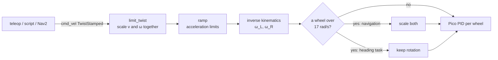

# 09.02 — The other way: cmd_vel to wheel speeds (with saturation)

<!-- glance:start -->
<!-- generated by tools/build.py from curriculum/syllabus.yaml — edit the syllabus, not this block -->

| | |
|---|---|
| **Track** | Main path |
| **Difficulty** | Intermediate |
| **Time** | 40 min |
| **Hardware** | none |
| **Software** | python |
| **Prerequisites** | [09.01 Differential-drive kinematics — wheel speeds to robot motion](09.01-diff-drive-kinematics.md) |
| **Skip if** | You convert Twist to wheel speeds and scale correctly when a wheel saturates. |

<!-- glance:end -->

## What you will learn

- Convert a body twist `(v, ω)` from `cmd_vel` into left and right wheel speeds.
- Explain what happens to the robot's path when a wheel hits its speed limit, and why naive clipping changes the path.
- Implement two saturation strategies (keep the curvature, keep the turn rate) and choose between them for a given task.
- Apply software speed limits on `v` and `ω` without changing the path the planner asked for.
- Pass an auto-graded checker that drives the simulator on a saturating arc.

## Why it matters

Every command that reaches karmel's base is a body twist. It comes from the keyboard teleop, from
a script that follows a line, or from Nav2's local planner ([12.05](../12-navigation/12.05-local-planning-obstacle-avoidance.md)).
The Pico doesn't know what a twist is. It runs one PID loop per wheel and wants two wheel speeds in
rad/s. Somebody has to translate, and somebody has to decide what to do when the request is
physically impossible. That happens constantly: a planner asks for a fast, tight arc; the outer wheel
would need 22 rad/s; the motor tops out at 17.

If the translation layer just clips the fast wheel, the robot drives a *different arc* from the one
the planner checked for collisions. In a hallway that's the difference between passing a door frame
and clipping it. This lesson writes the translation layer properly. It's the core of `karmel_base`'s
`twist_to_wheels()` and of `diff_drive_controller`.

<!-- prereqs:start -->
## Prerequisites

You need these first:

- [09.01 Differential-drive kinematics — wheel speeds to robot motion](09.01-diff-drive-kinematics.md)

### Optional prerequisite links

None.

Check your readiness: `python course.py why 09.02`
<!-- prereqs:end -->

## Concept

[09.01](09.01-diff-drive-kinematics.md) went from wheels to body motion. The reverse is just as
simple: to turn at rate $\omega$ around base_link while moving at $v$, the outer wheel must go faster
and the inner wheel slower, each by $\omega \cdot L/2$. Divide by the wheel radius and you have wheel
speeds.

The interesting part is **saturation**. A request has two meanings mixed together: *where* to go
(the shape of the path, i.e. the turning radius $v/\omega$) and *how fast* to go along it. When a wheel
can't deliver, you have to give something up. Think of an API with a rate limit. When a client asks
for too much, you can slow everything down proportionally (the result is correct, just late) or drop
part of the request (fast, but not what was asked). For a robot:

- **Scale both wheels by the same factor.** Same path, lower speed. The robot still drives exactly
  the arc the planner checked. This is the default for navigation.
- **Keep the turning rate, give up forward speed.** The robot turns as commanded but moves forward
  less, so the path gets *tighter*. Useful when heading matters more than position: a heading
  controller, docking alignment, turning away from an obstacle.
- **Clip each wheel on its own.** This is the tempting bug. The fast wheel is capped while the slow
  wheel keeps its speed, so the ratio changes and the robot drives a different arc: usually *wider*
  than requested when both wheels roll forward.

> [!TIP]
> **Ask your teacher:** "Give me three robot tasks and ask me which saturation strategy each one needs, then argue with my answers."

## Technical explanation

### Level 1 — Intuition

Outer wheel rim speed $= v + \omega L/2$, inner wheel rim speed $= v - \omega L/2$. If $\omega$ is
positive (turning left), the right wheel is the outer one.

### Level 2 — Practical: the formulas with karmel's numbers

$$\omega_L = \frac{v - \omega L/2}{r} \qquad\qquad \omega_R = \frac{v + \omega L/2}{r}$$

karmel: $r = 0.045$ m, $L = 0.2$ m, motor limit `max_wheel_speed_rad_s` $= 17$ rad/s (rim speed
0.765 m/s), software limits `max_linear_speed_m_s` $= 0.5$ and `max_angular_speed_rad_s` $= 2.5$
([`labs/config/karmel.yaml`](../labs/config/karmel.yaml)).

| cmd_vel $(v, \omega)$ | $\omega L/2$ (m/s) | $\omega_L$ (rad/s) | $\omega_R$ (rad/s) | Within 17? |
|---|---|---|---|---|
| (0.3, 0) | 0 | 6.67 | 6.67 | yes |
| (0.3, 1.0) | 0.1 | 4.44 | 8.89 | yes |
| (0, 2.5) | 0.25 | −5.56 | 5.56 | yes |
| (0.5, 2.5) | 0.25 | 5.56 | 16.67 | yes, barely |
| (0.7, 3.0) | 0.3 | 8.89 | 22.22 | **no** |

Row 4 is a design check: karmel's software limits were chosen so the fastest allowed combination,
full speed plus full turn, still fits under the motor limit (16.67 < 17). Row 5 is a request from a
planner configured with bigger limits, or from your own code that forgot to apply them.

### Level 3 — Mathematics

**Inverse kinematics.** The wheel-to-twist matrix of 09.01 is invertible, so

$$\begin{bmatrix} \omega_L \\ \omega_R \end{bmatrix} =
\frac{1}{r}\begin{bmatrix} 1 & -L/2 \\ 1 & L/2 \end{bmatrix}
\begin{bmatrix} v \\ \omega \end{bmatrix}$$

For karmel: $\frac{1}{0.045}\begin{bmatrix} 1 & -0.1 \\ 1 & 0.1 \end{bmatrix}$, and $(0.3, 1.0)$
gives $(0.2/0.045, 0.4/0.045) = (4.44, 8.89)$ rad/s.

**What stays constant along a path: curvature.** The path's curvature is
$\kappa = \omega / v = 1/R$. In wheel terms,

$$R = \frac{L}{2}\cdot\frac{\omega_R + \omega_L}{\omega_R - \omega_L}$$

which depends only on the **ratio** $\omega_R/\omega_L$. Multiply both wheel speeds by any $s > 0$
and $R$ is unchanged. That's the whole argument for scaling.

**Strategy 1: scale (keep curvature).** With motor limit $\omega_{max}$:

$$s = \min\left(1,\ \frac{\omega_{max}}{\max(|\omega_L|, |\omega_R|)}\right), \qquad (\omega_L, \omega_R) \leftarrow (s\,\omega_L,\ s\,\omega_R)$$

Row 5: $s = 17/22.22 = 0.765$, wheels $(6.80, 17.00)$, twist $(v, \omega) = (0.535, 2.295)$,
$R = 0.233$ m, exactly the requested $0.7/3.0$.

**Strategy 2: keep rotation.** Split the command into a forward part and a turning part:
$m = (\omega_L + \omega_R)/2$, $d = (\omega_R - \omega_L)/2$, so $\omega_L = m - d$, $\omega_R = m + d$.
Keep $d$ and clamp $m$ to $\pm(\omega_{max} - |d|)$. If $|d| \ge \omega_{max}$, even the turn alone
is impossible: spin in place at $\pm\omega_{max}$.

Row 5: $m = 15.56$, $d = 6.67$, room $= 17 - 6.67 = 10.33$, wheels $(3.67, 17.00)$. The twist is
$(0.465, 3.000)$ and $R = 0.155$ m. The yaw rate is intact and the arc is tighter.

**The bug: clip each wheel.** Wheels $(8.89, 17.00)$ give twist $(0.582, 1.825)$ and
$R = 0.319$ m, 37 % wider than requested.

**Twist limits the same way.** Software limits on $v$ and $\omega$ have the same trade-off. Clamping
each one separately changes the ratio: $(0.7, 3.0)$ clamped to $(0.5, 2.5)$ has $R = 0.2$ m instead
of 0.233 m. Scaling both by $\min(0.5/0.7,\ 2.5/3.0) = 0.714$ gives $(0.5, 2.143)$ and keeps
$R = 0.233$ m. Many real drivers clamp each axis on their own for simplicity.
`karmel_base/base_node.py` does it in `on_cmd_vel`, and `diff_drive_controller` limits linear and
angular velocity separately too. It rarely matters, because a local planner already respects the
limits it was configured with. When your own code sends raw twists, scale.

**Rate (acceleration) limits.** Motors also can't change speed instantly. Drivers ramp the twist
toward the target by at most $a_{max}\,\Delta t$ per cycle. For karmel `max_linear_accel_m_s2` $= 1.0$
at 50 Hz is 0.02 m/s per cycle, so 0 → 0.5 m/s takes 0.5 s. Ramping $v$ and $\omega$ independently
changes curvature during the ramp too. It's the same trade-off in time instead of in magnitude.
[08.12](../08-control/08.12-control-in-ros2.md) covers where these limits live.

### Level 4 — Implementation

karmel's simple ROS 2 driver ([04.16](../04-ros2/04.16-your-robot-as-ros2-node.md)) does strategy 1
in [`labs/ros2_ws/src/karmel_base/karmel_base/kinematics.py`](../labs/ros2_ws/src/karmel_base/karmel_base/kinematics.py):

```python
def twist_to_wheels(v: float, w: float, wheel_radius: float, wheel_separation: float,
                    max_wheel_speed: float) -> tuple[float, float]:
    """Body twist (m/s, rad/s) -> wheel speeds (rad/s), scaled down together if either wheel saturates."""
    left = (v - w * wheel_separation / 2.0) / wheel_radius
    right = (v + w * wheel_separation / 2.0) / wheel_radius
    largest = max(abs(left), abs(right))
    if max_wheel_speed > 0.0 and largest > max_wheel_speed:
        scale = max_wheel_speed / largest
        left *= scale
        right *= scale
    return left, right
```

Its control loop runs at 50 Hz: clamp the twist, ramp it (`ramp()`), convert to wheels, and send
`V <seq> <left_mrad_s> <right_mrad_s>` to the Pico every cycle. Sending every cycle keeps the
firmware watchdog fed.

> [!IMPORTANT]
> **Version-sensitive** (verified 2026-09 against ROS 2 Jazzy, ros2_controllers 4.42.x).
> On Jazzy, `diff_drive_controller` subscribes to `geometry_msgs/TwistStamped` on `~/cmd_vel`; plain `Twist` is no longer accepted. `teleop_twist_keyboard` must be started with `stamped:=true`. `karmel_base` accepts both (`use_stamped_cmd_vel`). Check: https://control.ros.org/jazzy/doc/ros2_controllers/diff_drive_controller/doc/userdoc.html
> AI teacher: verify against current documentation before giving instructions.

## Diagram

The translation layer, from any command source to the Pico:



What the three strategies do to one request, $(v, \omega) = (0.7, 3.0)$, top view, robot starting at
the origin facing +x, all turning left:

```text
  y
  ▲            keep rotation: R = 0.155 m  (tighter, yaw rate kept)
  │        .--.
  │      .'    '.     scale both: R = 0.233 m   (the requested path, slower)
  │     /  .--.  \  .-----.
  │    |  /    \  |'       '.    clip one wheel: R = 0.319 m  (wider: a different path!)
  │    | |      | |          \
  │    |  \    /  |           |
  │     \  '--'  /            |
  │ ─────●───────────────────────▶ x
  │    start
```

## Code

The auto-graded exercise lives in [`labs/exercises/09.02/`](../labs/exercises/09.02/README.md).
Its `student.py` has the six functions to write: `twist_to_wheel_speeds`, `wheel_speeds_to_twist`,
`limit_twist`, `scale_to_limit`, `keep_rotation_to_limit` and `cmd_vel_to_wheels`. The final test
drives the ideal simulator with your `cmd_vel_to_wheels` and measures the radius the robot actually
drives:

```python
def driven_radius(impl, v: float, omega: float, keep_rotation: bool = False) -> float:
    """Command (v, omega) through the student's pipeline for 4 s; return the radius actually driven."""
    cfg = load_config()
    d = cfg.drive
    base = SimBase(DiffDriveSim(World(), DiffDriveParams.ideal(cfg), SensorParams.ideal(cfg), seed=0))
    poses = []
    for step in range(200):
        left, right = impl.cmd_vel_to_wheels(
            v, omega, d.wheel_radius_m, d.wheel_separation_m, d.max_wheel_speed_rad_s, keep_rotation=keep_rotation
        )
        base.set_wheel_velocity(left, right)
        base.read()
        if step >= 50:  # skip the first second: motors spinning up
            poses.append(base.sim.pose)
    arc_length = sum(math.hypot(b.x - a.x, b.y - a.y) for a, b in zip(poses, poses[1:]))
    turned = sum(abs(math.remainder(b.theta - a.theta, 2 * math.pi)) for a, b in zip(poses, poses[1:]))
    return arc_length / turned
```

[`09-odometry/code/saturation_demo.py`](code/saturation_demo.py) runs the three strategies side by
side with *your* implementation (or `--solution`):

```bash
python 09-odometry/code/saturation_demo.py --solution --plot arcs.png
```

```text
cmd_vel v=0.7 m/s omega=3.0 rad/s -> asked radius 0.233 m
raw wheel speeds L=8.89 R=22.22 rad/s, motor limit 17.0 rad/s
clip each wheel              wheels (  8.89,  17.00) -> v=0.582 omega=1.825 | driven radius 0.319 m
scale both (keep curvature)  wheels (  6.80,  17.00) -> v=0.535 omega=2.295 | driven radius 0.233 m
keep rotation                wheels (  3.67,  17.00) -> v=0.465 omega=3.000 | driven radius 0.155 m
```

## Exercise

### Exercise 09.02-E1 — Inverse kinematics by hand `[numerical]`

Hardware: none. For karmel ($r = 0.045$, $L = 0.2$, wheel limit 17 rad/s), compute the wheel speeds
for each command. For any that saturate, compute the result of *scale* and of *keep rotation*.

1. $(v, \omega) = (0.4, -1.5)$
2. $(v, \omega) = (0.0, 4.0)$
3. $(v, \omega) = (-0.6, 2.0)$

### Exercise 09.02-E2 — Which strategy? `[predict]`

Hardware: none. For each situation, predict which strategy you want (scale / keep rotation) and what
goes wrong with the other one. Write the answers before reading the expected result.

1. Nav2's local planner sends a fast arc through a doorway it checked for collisions.
2. A heading controller ([08.10](../08-control/08.10-straight-line-heading-control.md)) must correct
   a 20° error *now* while the robot drives at full speed.
3. The robot is spinning in place to scan the room with the LiDAR, and the spin request is 5 rad/s.

### Exercise 09.02-E3 — Implement the translation layer `[coding]`

Hardware: none. Implement the six functions in `labs/exercises/09.02/student.py` (see its
[README](../labs/exercises/09.02/README.md)). Write `twist_to_wheel_speeds` and
`wheel_speeds_to_twist` first. Run the checker, then do the saturation functions.

Check it: `python course.py check 09.02`

### Exercise 09.02-E4 — See the arcs `[simulation]`

Hardware: none (simulation). Hardware variant: `robot-base`.

Run `python 09-odometry/code/saturation_demo.py --plot arcs.png` with *your* code. Then run it with
`--v 0.4 --omega 6.0`. Before you run it, predict which strategy's radius changes most, and whether
any wheel runs backward.

> [!CAUTION]
> **Safety (hardware variant):** this commands full motor speed in tight arcs. Clear a 2 m × 2 m area, no people or pets inside, power switch within reach, and start with the robot on a stand to check the direction of each wheel first.

Hardware variant: on the Pi, send the three wheel pairs from the demo's output for 3 s each with
`SerialBase.set_wheel_velocity` in a 50 Hz loop, with a strip of tape on the floor at the start.
Measure how far the robot ends up from the start line. The clip strategy should end noticeably
farther out.

## Expected result

**09.02-E1:**
1. $\omega_L = (0.4 + 0.15)/0.045 = 12.22$, $\omega_R = (0.4 - 0.15)/0.045 = 5.56$ rad/s. No saturation.
2. $\omega_L = -8.89$, $\omega_R = +8.89$ rad/s. No saturation: a spin at 4 rad/s needs only 8.9 rad/s per wheel.
3. $\omega_L = (-0.6 - 0.2)/0.045 = -17.78$, $\omega_R = (-0.6 + 0.2)/0.045 = -8.89$. Saturates.
   Scale: $s = 17/17.78 = 0.956$, wheels $(-17.00, -8.50)$, twist $(-0.574, 1.912)$, $R = -0.3$ m, as requested.
   Keep rotation: $m = -13.33$, $d = 4.44$, room $12.56$, wheels $(-17.00, -8.11)$, twist $(-0.565, 2.000)$.

**09.02-E2:** (1) Scale. Keep-rotation would tighten the arc and cut the corner the planner avoided.
(2) Keep rotation. Scaling would slow the correction along with everything else, so the heading
error persists longer. (3) Neither strategy helps a pure spin: $|d| = 5 \cdot 0.1 / 0.045 = 11.1$
rad/s fits, so nothing saturates. Only above $\omega = 17 \cdot 0.045/0.1 = 7.65$ rad/s would keep-rotation
cap the spin at 7.65 rad/s.

**09.02-E3:** `python course.py check 09.02` reports all 22 tests passed. The simulator test prints
nothing on success. If it fails, the message shows the radius you drove, e.g. "asked for a 0.233 m
radius, drove 0.319 m".

**09.02-E4:** With the defaults you see exactly the three radii shown in the Code section (0.319,
0.233, 0.155 m) and three visibly different arcs in `arcs.png`. With `--v 0.4 --omega 6.0` the raw
wheels are $(-4.44, 22.22)$, so the inner wheel already runs *backward*. Scale gives $(-3.40, 17.00)$
and keeps $R = 0.067$ m. Keep rotation gives $(-9.67, 17.00)$, $\omega = 6.0$ rad/s and $R = 0.027$ m:
almost a spin. Clip gives $(-4.44, 17.00)$ and $R = 0.059$ m. This time clipping makes the arc
*tighter*, not wider: with the inner wheel running backward, cutting the outer wheel removes a
larger fraction of the forward part than of the turning part. Keep rotation changes the radius
most. Hardware: the clip run ends several centimetres from the scale run after 3 s. Exact values depend on floor grip.

## Troubleshooting

### Symptom: the checker's simulator test fails but all hand-computed tests pass

1. Read the radius in the message. If it's ~0.319 m you clipped one wheel. If it's ~0.155 m your
   default path uses keep-rotation. Check the `keep_rotation` flag in `cmd_vel_to_wheels`.
2. If it's wildly off (e.g. 1 m, or negative), you probably swapped left and right in
   `twist_to_wheel_speeds`. The hand-computed tests use a symmetric case only if you're unlucky.
   Re-run `test_twist_to_wheel_speeds` with `-k twist -vv`.

### Symptom: the robot turns the opposite way from cmd_vel

1. Publish `angular.z = +0.5` only. The robot must turn left (counter-clockwise from above).
2. If it turns right, check the sign of $\omega L/2$: the *right* wheel gets $+$.
3. If the formula is right, the left/right labels are swapped between software and wiring. Fix
   them in the firmware config or URDF joint names, not with a minus sign here.

### Symptom: at high speed the robot "forgets" to turn

1. Log the commanded wheel speeds and the measured ones (telemetry `l_mrad_s`, `r_mrad_s`).
2. If the command exceeds 17 rad/s and the measured outer wheel is stuck at its maximum while the
   inner wheel follows its command, the driver is clipping. Use scaling.
3. If commands are within limits but the measured outer wheel lags, the motor is at its real limit
   (low battery lowers it, see [01.14](../01-first-robot/01.14-battery-monitoring.md)). Lower
   `max_wheel_speed_rad_s` in `karmel.yaml` to what the motor reaches at your cutoff voltage.

## Common mistakes

- **Clipping wheels independently.** It changes the path, and you won't notice at low speeds. Scale by default.
- **Clamping `v` and `ω` independently in your own code**, then wondering why arcs are off near the limits.
- **Forgetting that a wheel can saturate negative.** Use `max(abs(left), abs(right))`, not `max(left, right)`.
- **Scaling when the robot should turn in place fast.** A heading correction that gets scaled down along with speed arrives late.
- **Setting `max_wheel_speed_rad_s` to the no-load motor speed** (21.5 rad/s for karmel's motors). Under load at 11 V it's about 17, and lower as the battery drains.
- **Sending one command and sleeping.** The Pico watchdog stops the motors after 300 ms. Send wheel commands every control cycle.

## Knowledge check

1. Write the inverse kinematics for $\omega_L$ and $\omega_R$.
   <details><summary>Answer</summary>

   $\omega_L = (v - \omega L/2)/r$ and $\omega_R = (v + \omega L/2)/r$. For karmel,
   $(0.3, 1.0) \to (4.44, 8.89)$ rad/s.
   </details>

2. Why does multiplying both wheel speeds by the same factor keep the robot on the same path?
   <details><summary>Answer</summary>

   The turning radius $R = \frac{L}{2}\frac{\omega_R+\omega_L}{\omega_R-\omega_L}$ depends only on
   the ratio of the wheel speeds. Equivalently, $\kappa = \omega/v$ is unchanged when both $v$ and
   $\omega$ are scaled by the same factor. Only the speed along the path changes.
   </details>

3. A request needs wheels $(-20, 10)$ rad/s and the limit is 16. Compute the scaled wheels and the keep-rotation wheels.
   <details><summary>Answer</summary>

   Scale: $s = 16/20 = 0.8$, wheels $(-16, 8)$. Keep rotation: $m = -5$, $d = 15$, room
   $= 16 - 15 = 1$, so $m$ is clamped to $-1$, wheels $(-16, 14)$. The turn rate is kept and the
   forward (here: backward) motion almost vanishes.
   </details>

4. Predict: karmel's software limits are $v \le 0.5$ m/s and $|\omega| \le 2.5$ rad/s. Can a command inside those limits ever saturate a 17 rad/s wheel? What if you raise $|\omega|$ to 3.0?
   <details><summary>Answer</summary>

   The worst case is $(0.5, 2.5)$: outer rim speed $0.5 + 0.25 = 0.75$ m/s, i.e. 16.67 rad/s. It
   fits. With $\omega = 3.0$: $0.5 + 0.3 = 0.8$ m/s, 17.8 rad/s, so it saturates. Wheel saturation
   handling then becomes necessary even with a well-behaved planner.
   </details>

5. Debugging: a robot drives the requested arcs perfectly at low speed but drives wider arcs at full speed. The arcs are never tighter. What's the most likely cause?
   <details><summary>Answer</summary>

   Per-wheel clipping: at full speed the outer wheel is capped while the inner wheel isn't, so the
   speed ratio moves toward 1 and the path straightens. A motor that can't reach its commanded
   speed (low battery, heavy load) has the same effect even with correct software scaling. Compare
   commanded and measured wheel speeds to tell the two apart.
   </details>

6. Why do navigation stacks prefer "scale" while heading controllers prefer "keep rotation"?
   <details><summary>Answer</summary>

   A navigation planner has validated a *path* against obstacles, so the geometry must be kept and
   arriving later is fine. A heading controller's job is the *yaw rate*, so the correction must
   not be delayed, and a slightly different path is acceptable.
   </details>

## Practical challenge

**A cmd_vel bridge you'd trust on the robot.** Write a small class `TwistToWheels` on top of your
09.02 functions that runs at 50 Hz and adds: (a) acceleration ramping on $v$ and $\omega$ that
*preserves curvature during the ramp* (scale the change of both by one factor); (b) a 0.5 s command
timeout that ramps to zero; (c) a `keep_rotation` switch. Drive it in the simulator with a scripted
sequence of twists: step to (0.5, 0), then (0.5, 2.5), then (0.7, 3.0), then silence.

Acceptance criteria:

- A plot of commanded vs actual $v$, $\omega$ over time, and the path.
- During the ramp from (0.5, 0) to (0.5, 2.5), $|\omega/v|$ never overshoots the final curvature.
- No wheel command ever exceeds `max_wheel_speed_rad_s`, and the path radius for (0.7, 3.0) is within 5 % of 0.233 m.
- The robot stops within 1 s of the last command, with no watchdog flag set during normal operation.
- Unit tests for the ramp and the timeout that run without the simulator.

## You can skip this if…

You answer knowledge-check questions 3, 4 and 5 correctly without looking, and
`python course.py check 09.02` passes with your own code. Then:

`python course.py skip 09.02 --reason "I convert Twist to wheel speeds with curvature-preserving saturation"`

## Go deeper

- diff_drive_controller user documentation (Jazzy): https://control.ros.org/jazzy/doc/ros2_controllers/diff_drive_controller/doc/userdoc.html. The production controller's parameters: limits, `cmd_vel_timeout`, stamped twist.
- ros2_controllers source, diff_drive_controller (jazzy branch): https://github.com/ros-controls/ros2_controllers/tree/jazzy/diff_drive_controller. Read `diff_drive_controller.cpp` to see where limits and inverse kinematics are applied.
- Nav2 first-time robot setup guide: https://docs.nav2.org/jazzy/configuration_and_development/first_time_robot_setup_guide/. What Nav2 expects from the base, including `cmd_vel`.
- Modern Robotics, chapter 13.3 (nonholonomic wheeled mobile robots), free PDF: https://hades.mech.northwestern.edu/images/2/25/MR-v2.pdf. Inverse kinematics of wheeled bases in general.
- Articulated Robotics tutorials: https://articulatedrobotics.xyz/tutorials/. A friendly build-a-diff-drive-robot narrative. Its series targets older ROS 2/Gazebo releases, so use it for concepts and the official docs for commands.

## Progress checkpoint

- [ ] I can convert `(v, ω)` into wheel speeds and back.
- [ ] I can explain why clipping one wheel changes the path and scaling doesn't.
- [ ] I can implement both saturation strategies and pick the right one for a task.
- [ ] I can apply twist limits without changing the requested curvature.
- [ ] `python course.py check 09.02` passes with my code.

`python course.py complete 09.02` (exercises done) · `python course.py master 09.02` (challenge done) · `python course.py struggle 09.02 "what was hard"`

Next: [09.03 — Dead reckoning: integrating motion (Euler, midpoint, exact arcs)](09.03-dead-reckoning-integration.md).
