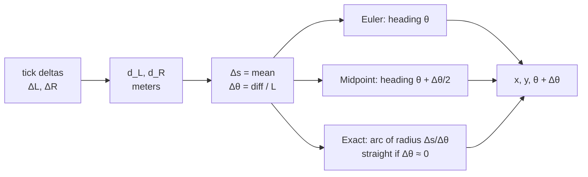

# 09.03 — Dead reckoning: integrating motion (Euler, midpoint, exact arcs)

<!-- glance:start -->
<!-- generated by tools/build.py from curriculum/syllabus.yaml — edit the syllabus, not this block -->

| | |
|---|---|
| **Track** | Main path |
| **Difficulty** | Intermediate |
| **Time** | 1 h |
| **Hardware** | none |
| **Software** | python, numpy |
| **Prerequisites** | [09.01 Differential-drive kinematics — wheel speeds to robot motion](09.01-diff-drive-kinematics.md) |
| **Optional prerequisites** | [FM.18 Integrals and numerical integration (how simulators move time forward)](../optional-foundations/mathematics/FM.18-integrals-numerical-integration.md) |
| **Skip if** | You know how integration method and time step affect pose error. |

<!-- glance:end -->

## What you will learn

- Turn a stream of body velocities (or wheel distances) into a pose `(x, y, θ)` by numerical integration.
- Implement three update rules (forward Euler, midpoint/RK2 and the exact arc) and explain where each one's error comes from.
- Measure how the error of each method shrinks when you shorten the time step, and recognize first- and second-order convergence.
- Choose an integration method and sample rate for karmel's odometry, and justify the choice with numbers.
- Write the exact-arc update so it stays numerically stable when the robot drives straight.

## Why it matters

[09.01](09.01-diff-drive-kinematics.md) gave you $v$ and $\omega$ at an instant. The robot needs *where
it is*: the sum of thousands of tiny motions since it started. Sailors called this **dead reckoning**:
known speed, known heading, elapsed time, so you know your position. Every odometry system and every
simulator does it, and so does the prediction step of every Kalman filter ([10.06](../10-localization/10.06-extended-kalman-filter.md)).

The robot can't integrate continuously. karmel's Pico reports encoder counts 50 times a second,
and between two samples you have to *assume* something about how the robot moved. A naive assumption
adds error on every sample. The error is small per step but it accumulates, on top of the physical
errors that [09.06](09.06-accumulated-error.md) studies. The good news: for a differential drive
there is an exact answer that costs almost nothing. This lesson shows why, with an experiment
rather than faith.

<!-- prereqs:start -->
## Prerequisites

You need these first:

- [09.01 Differential-drive kinematics — wheel speeds to robot motion](09.01-diff-drive-kinematics.md)

### Optional prerequisite links

New to any of these? Take the foundation lesson first; skip it if you already know it.

- [FM.18 Integrals and numerical integration (how simulators move time forward)](../optional-foundations/mathematics/FM.18-integrals-numerical-integration.md)

Check your readiness: `python course.py why 09.03`
<!-- prereqs:end -->

## Concept

Imagine walking blindfolded with a step counter and a compass that you can only read once per
second. Each second you read "1.2 m, compass now says 40°, a second ago it said 30°". Where did you go?

- **Euler (start heading):** "I walked 1.2 m at 30°." It's simple, and it's wrong whenever you were
  turning, because you spent the whole second at a heading you only had at the start.
- **Midpoint:** "I walked 1.2 m at 35°", the average heading. Much better: the errors of the first
  half and the second half of the second largely cancel.
- **Exact arc:** "I turned smoothly from 30° to 40° while walking 1.2 m, so I walked along a circular
  arc." For a robot whose wheel speeds stay constant during the sample, that's not an approximation
  at all. A constant pair of wheel speeds *is* a circle ([09.01](09.01-diff-drive-kinematics.md)).

The finer you sample, the less it matters which you pick. Euler's error halves when you halve the
step. The midpoint error drops to a quarter. The exact arc has no integration error at all, only
the error of assuming nothing changed within the sample.

> [!NOTE]
> New to integrals and numerical integration (Euler's method, step size)? → [FM.18 Integrals and numerical integration](../optional-foundations/mathematics/FM.18-integrals-numerical-integration.md). Skip it if you already know them.

> [!TIP]
> **Ask your teacher:** "Walk me through why Euler's error is proportional to the step size but its error per step is proportional to the step size squared."

## Technical explanation

### Level 1 — Intuition: the continuous model

The robot's motion in the world ([09.01](09.01-diff-drive-kinematics.md), Level 3) is three
differential equations:

$$\dot x = v\cos\theta \qquad \dot y = v\sin\theta \qquad \dot\theta = \omega$$

Integrating $\dot\theta$ is trivial ($\theta$ just adds up). The hard part is $x$ and $y$: they depend
on $\theta$, which changes *during* the step.

### Level 2 — Practical: three update rules

For one step of length $\Delta t$ with constant $v$, $\omega$, write $\Delta s = v\,\Delta t$ (distance)
and $\Delta\theta = \omega\,\Delta t$ (heading change). With encoders you measure $\Delta s$ and
$\Delta\theta$ directly from tick deltas, so no $\Delta t$ is needed at all:
$\Delta s = (d_R + d_L)/2$ and $\Delta\theta = (d_R - d_L)/L$.

| Method | $x$ update | $y$ update |
|---|---|---|
| Euler | $\Delta s\cos\theta$ | $\Delta s\sin\theta$ |
| Midpoint (RK2) | $\Delta s\cos(\theta + \Delta\theta/2)$ | $\Delta s\sin(\theta + \Delta\theta/2)$ |
| Exact arc | $R\,[\sin(\theta+\Delta\theta) - \sin\theta]$ | $-R\,[\cos(\theta+\Delta\theta) - \cos\theta]$ |

with $R = \Delta s/\Delta\theta$ and, in every case, $\theta \leftarrow \theta + \Delta\theta$.

**One big step, to see the difference.** Start at the origin facing +x. Drive $v = 1$ m/s, $\omega = \pi/2$
rad/s for $\Delta t = 1$ s: a quarter circle of radius $R = 2/\pi = 0.637$ m.

- Euler: $(1.000, 0.000)$. It drove 1 m along the *old* heading. Error 0.748 m.
- Midpoint: $(0.707, 0.707)$. It drove 1 m along the 45° heading. Error 0.099 m.
- Exact: $(0.637, 0.637)$, the true end of the quarter circle.

**karmel-sized numbers.** karmel at $v = 0.25$ m/s turning at $\omega = 1.5$ rad/s, with one sample every
0.5 s (too slow on purpose): Euler lands 46.1 mm from the true arc end, midpoint 2.9 mm. Split the
same 0.5 s into 25 samples of 20 ms (karmel's telemetry rate): Euler 1.8 mm, midpoint 0.005 mm,
exact 0.

**The time-step experiment.** Drive 5 s at $v = 0.5$ m/s, $\omega = 2$ rad/s (a 0.25 m circle, 1.6
turns, 2.5 m of path) and compare with the exact end point:

| $\Delta t$ (s) | rate | Euler error | Midpoint error | Exact error |
|---|---|---|---|---|
| 0.50 | 2 Hz | 243.2 mm | 20.58 mm | 0 |
| 0.20 | 5 Hz | 96.1 mm | 3.21 mm | 0 |
| 0.10 | 10 Hz | 48.0 mm | 0.80 mm | 0 |
| 0.05 | 20 Hz | 24.0 mm | 0.20 mm | 0 |
| 0.02 | 50 Hz | 9.6 mm | 0.032 mm | 0 |
| 0.01 | 100 Hz | 4.8 mm | 0.008 mm | 0 |

Halving $\Delta t$ halves Euler's error (**first order**) and quarters the midpoint error (**second
order**). The exact column is at the level of floating-point rounding ($10^{-12}$ m).

**Conclusion for karmel:** use the exact arc. It costs two extra `sin`/`cos` calls and removes integration
error completely. Midpoint at 50 Hz is also fine (0.03 mm per 2.5 m). Euler at 50 Hz adds about 1 cm
per 2.5 m of tight turning. That's not a disaster, but it's a free error you'd have to calibrate around.

### Level 3 — Mathematics

**Euler's error.** Taylor-expand the true $x$ over one step, with $\dot x = v\cos\theta$ and
$\ddot x = -v\omega\sin\theta$:

$$x(t+\Delta t) = x + v\cos\theta\,\Delta t - \tfrac12 v\omega\sin\theta\,\Delta t^2 + O(\Delta t^3)$$

Euler keeps only the first two terms, so each step errs by about $\tfrac12 v\omega\,\Delta t^2$. Over
a fixed duration $T$ there are $T/\Delta t$ steps, so the accumulated error is proportional to
$\tfrac12 v\omega T\,\Delta t$, **linear in $\Delta t$**. Check against the table: at $\Delta t = 0.1$ the
per-step bound is $\tfrac12 \cdot 0.5 \cdot 2 \cdot 0.01 = 5$ mm, and 50 steps don't simply add
because the error direction rotates with the robot. The measured 48 mm is the same order.

**Midpoint's error.** Evaluating the heading at $\theta + \Delta\theta/2$ cancels the $\Delta t^2$ term,
leaving an $O(\Delta t^3)$ error per step and $O(\Delta t^2)$ overall. That's second-order
Runge–Kutta (RK2). ros2_controllers calls it `integrateRungeKutta2`.

**The exact arc.** With constant $v$ and $\omega$, $\theta(\tau) = \theta_0 + \omega\tau$ and

$$x(\Delta t) - x_0 = \int_0^{\Delta t} v\cos(\theta_0 + \omega\tau)\,d\tau = \frac{v}{\omega}\left[\sin(\theta_0 + \Delta\theta) - \sin\theta_0\right] = R\left[\sin(\theta_0 + \Delta\theta) - \sin\theta_0\right]$$

and similarly $y(\Delta t) - y_0 = -R[\cos(\theta_0+\Delta\theta) - \cos\theta_0]$.

**Why midpoint is so good: exact = midpoint × a correction.** Apply
$\sin a - \sin b = 2\cos\frac{a+b}{2}\sin\frac{a-b}{2}$ to the exact formula:

$$\Delta x_{exact} = \Delta s\,\cos\!\left(\theta + \frac{\Delta\theta}{2}\right)\cdot\frac{\sin(\Delta\theta/2)}{\Delta\theta/2}$$

The midpoint rule points in exactly the right direction, along the chord of the arc. It only uses the
arc length $\Delta s$ instead of the shorter chord length. The factor $\frac{\sin u}{u} \approx 1 - u^2/6$ is
the whole difference. For the quarter circle, $u = \pi/4$ and $\frac{\sin u}{u} = 0.9003$, and indeed
$0.707 \cdot 0.9003 = 0.637$. For karmel at 50 Hz turning at 2 rad/s, $u = 0.02$ and the factor is
$1 - 6.7\cdot10^{-5}$.

**Numerical stability.** The textbook form $R[\sin(\theta+\Delta\theta) - \sin\theta]$ divides by
$\Delta\theta$, which is exactly zero when driving straight and tiny when almost straight. Then $R$ is
huge and the bracket is a difference of two nearly equal numbers, so you lose all precision. Two fixes:

1. Branch: if $|\Delta\theta| < 10^{-9}$, use the straight-line update (what the 09.03 and 09.04
   exercises do; `diff_drive_controller` switches to RK2 below $|\omega| < 10^{-6}$).
2. Use the "sinc" form above. $\frac{\sin u}{u}$ is well-behaved near zero if you evaluate it as
   $1 - u^2/6$ for tiny $u$. No branch on $R$ needed.

**What the exact arc still assumes.** Constant wheel speeds *during the sample*. If the robot changes
its command mid-sample, or the motors are still accelerating, the true path isn't a single arc. That
error shrinks with the sample period, whatever method you use. In the checker for this lesson, encoder
twists from the simulator integrated with exact arcs match truth within 0.1 mm at 50 Hz and 1.5 mm
at 10 Hz, while Euler at 10 Hz is 40 mm off.

### Level 4 — Implementation

- **Integrate distances, not velocities.** Encoder tick deltas give $\Delta s$ and $\Delta\theta$ directly.
  Multiplying a velocity estimate by a jittery $\Delta t$ adds noise you don't need. Use $\Delta t$ only
  to *report* velocity.
- **Wrap the heading** to $(-\pi, \pi]$ after every step (`math.atan2(sin, cos)`), or keep an unwrapped
  copy if you need total rotation (e.g. "spin exactly two turns").
- **Production code agrees.** `integrate_odometry()` in
  [`labs/ros2_ws/src/karmel_base/karmel_base/kinematics.py`](../labs/ros2_ws/src/karmel_base/karmel_base/kinematics.py)
  and `Odometry::integrateExact` in ros2_controllers' `diff_drive_controller` both use the exact arc with
  a straight-line/RK2 fallback.

## Diagram

The three rules for the one-big-step example (quarter circle, $R = 0.637$ m, top view):

```text
  y ▲
    │
0.71┤              ● midpoint (0.707, 0.707): right direction (the chord), too long
0.64┤          ● exact (0.637, 0.637): end of the true arc
    │        .'
    │      .'   true arc of radius 0.637 m
    │    .'
    │  .'
0.00●─'───────────────────────────● Euler (1.000, 0.000): drove along the OLD heading
    └──────────────┬───────┬──────┴──▶ x
                 0.64    0.71   1.00
```

How each method uses one encoder sample:



## Code

The auto-graded exercise is [`labs/exercises/09.03/`](../labs/exercises/09.03/README.md):
implement `euler_step`, `midpoint_step`, `exact_step`, `integrate` and `constant_twist_error`
in `student.py`. The reference `exact_step` is the formula from Level 2 with the straight-line branch:

```python
def exact_step(pose: Pose, v: float, omega: float, dt: float) -> Pose:
    """Move along the exact circular arc driven at constant (v, omega)."""
    x, y, theta = pose
    dtheta = omega * dt
    if abs(dtheta) < 1e-9:
        return (x + v * dt * math.cos(theta), y + v * dt * math.sin(theta), wrap(theta + dtheta))
    radius = v / omega
    return (
        x + radius * (math.sin(theta + dtheta) - math.sin(theta)),
        y - radius * (math.cos(theta + dtheta) - math.cos(theta)),
        wrap(theta + dtheta),
    )
```

(Don't look at `solution.py` before trying. This one is shown because you need the formula anyway.)

[`09-odometry/code/integration_experiment.py`](code/integration_experiment.py) prints the time-step
table from Level 2 using *your* implementation:

```bash
python 09-odometry/code/integration_experiment.py              # your student.py
python 09-odometry/code/integration_experiment.py --solution --plot steps.png
```

```text
  dt (s) rate (Hz)   Euler (mm)  midpoint (mm)  exact (mm)
    0.50         2      243.151        20.5760     1.1e-13
    0.20         5       96.106         3.2114     3.7e-13
    0.10        10       47.973         0.8000     7.3e-13
    0.05        20       23.976         0.1998     1.4e-12
    0.02        50        9.589         0.0320     1.8e-12
    0.01       100        4.795         0.0080     1.5e-12
euler: halving dt from 0.1 to 0.05 s divides the error by 2.00
midpoint: halving dt from 0.1 to 0.05 s divides the error by 4.00
```

## Exercise

### Exercise 09.03-E1 — One step by hand `[numerical]`

Hardware: none. karmel starts at $(0, 0, 0)$ and drives $v = 0.25$ m/s, $\omega = 1.5$ rad/s for
$\Delta t = 0.5$ s. Compute the end pose with Euler, midpoint and exact arc on a calculator. Then
compute how far Euler and midpoint are from the exact point, in millimetres.

### Exercise 09.03-E2 — Predict the convergence `[predict]`

Hardware: none. Euler's error for some motion at $\Delta t = 0.04$ s is 12 mm and midpoint's is
0.4 mm. Predict both errors at $\Delta t = 0.01$ s, and the rate (Hz) at which Euler would reach
the midpoint's 0.4 mm. Write your numbers down, then verify the pattern with the experiment script.

### Exercise 09.03-E3 — Implement the three integrators `[coding]`

Hardware: none. Implement the five functions in `labs/exercises/09.03/student.py`. The checker
includes an end-to-end test: encoder ticks from the course simulator, converted to twists at 50 Hz
and at 10 Hz, integrated with your functions and compared with ground truth.

Check it: `python course.py check 09.03`

### Exercise 09.03-E4 — Which Euler is this? `[debugging]`

Hardware: none. A teammate's odometry updates the heading *first* and then moves:

```python
theta = theta + omega * dt
x = x + v * dt * math.cos(theta)
y = y + v * dt * math.sin(theta)
```

For the one-big-step example ($v = 1$, $\omega = \pi/2$, $\Delta t = 1$) predict where it lands. Is
it more accurate than forward Euler? Add it as a fourth method to `integration_experiment.py` and
measure its order of convergence. Then fix it with a one-line change.

### Exercise 09.03-E5 — Sample rate on a real trajectory `[simulation]`

Hardware: none (simulation). In `labs/exercises/09.03/test_exercise.py`, the function
`twists_from_simulator(every)` drives a plan with arcs and spins and returns encoder-derived twists
every `every` telemetry samples. Call it with `every` = 1, 5, 10 and 25 (50, 10, 5 and 2 Hz) and
integrate each with all three methods (import the test module with `importlib`, or copy the
function). Tabulate the position error against `base.sim.pose`. Before running, predict at which rate
even the exact method becomes centimetre-bad, and why.

## Expected result

**09.03-E1:** $\Delta s = 0.125$ m, $\Delta\theta = 0.75$ rad, $R = 0.1667$ m. Euler $(0.12500, 0.00000, 0.75)$.
Midpoint: heading 0.375 rad, $(0.11631, 0.04578, 0.75)$. Exact $(0.11361, 0.04472, 0.75)$. Euler is
46.1 mm from exact, midpoint 2.9 mm. Check: midpoint × $\frac{\sin 0.375}{0.375} = 0.9767$ gives the exact
point.

**09.03-E2:** $\Delta t$ divided by 4 → Euler error / 4 = 3 mm, midpoint error / 16 = 0.025 mm. To go from
12 mm to 0.4 mm Euler needs a 30× smaller step: $\Delta t = 0.04/30 = 1.3$ ms, i.e. 750 Hz. That's
why nobody fixes Euler with a faster loop.

**09.03-E3:** `python course.py check 09.03` reports 18 passed. The simulator tests pass when the exact
integration is within 5 mm at 50 Hz and Euler is more than 3× worse than midpoint at 10 Hz.

**09.03-E4:** It lands at $(0, 1)$: it drove 1 m along the *new* heading (+y). The error vs exact
$(0.637, 0.637)$ is 0.748 m, the same size as forward Euler, mirrored. This is still first order: the
experiment shows 48.0 mm at 0.1 s and 24.0 mm at 0.05 s (ratio 2). The fix: compute
`mid = theta + omega * dt / 2`, move along `mid`, then update `theta`. That's the midpoint method.

**09.03-E5:** Typical results (position error in mm):

| rate | Euler | Midpoint | Exact |
|---|---|---|---|
| 50 Hz | 7.8 | 0.1 | 0.0 |
| 10 Hz | 39.6 | 1.8 | 1.5 |
| 5 Hz | 111.7 | 37.8 | 36.0 |
| 2 Hz | 187.7 | 22.0 | 12.8 |

At 5 Hz and below even the exact method is off by centimetres. The integrator isn't the problem
there. The commands change *within* a sample (plan segments end mid-sample, and the motors take
~0.1–0.2 s to reach speed), so one sample no longer covers one arc. The 2 Hz row is lucky rather
than better: errors of opposite sign cancel. Higher sample rates fix this. Better integrators can't.

## Troubleshooting

### Symptom: the checker's 'exact' tests fail with NaN or huge numbers

1. Run `exact_step((0,0,0), 1.0, 0.0, 1.0)`. If it raises `ZeroDivisionError` or returns `nan`,
   the straight-line branch is missing.
2. Run it with `omega = 1e-13`. If the result isn't $(1, 0, 0)$ within $10^{-9}$, the threshold
   is compared against the wrong quantity. Compare $|\omega\,\Delta t|$ (the heading change), not $R$.

### Symptom: Euler's convergence ratio is 1.0 instead of 2.0

1. Print `constant_twist_error` for $\Delta t$ = 0.1 and 0.05. If the two are equal, you probably
   integrate a fixed *number* of steps instead of `round(duration / dt)` steps.
2. If they differ but the ratio is ~1, check that the truth is one `exact_step` over the full
   `n * dt`, not something computed with the method under test.

### Symptom: odometry is fine driving straight but drifts in curves, and faster loops help

1. Log $\Delta\theta$ per sample during a curve. Values above ~0.05 rad per sample mean big steps.
2. Check which rule the code uses. A faster loop helping is the signature of Euler (first order).
3. Switch to the exact arc. If the drift remains at the same size after the switch, it's not
   integration error. Continue with [09.05](09.05-calibrating-odometry.md) (calibration).

## Common mistakes

- **Moving along the old (or new) heading for the whole step.** Use the mid-step heading or the exact arc.
- **Dividing by $\Delta\theta$ without a straight-line branch.** Most commands are exactly straight.
- **Computing velocities from ticks, then multiplying by a measured $\Delta t$ to integrate.** Integrate the tick distances directly.
- **Comparing radians with a threshold meant for $R$.** Threshold the heading change, e.g. $|\Delta\theta| < 10^{-9}$.
- **Forgetting to wrap $\theta$**, then comparing headings of 6.28 and 0.0 as "different".
- **Believing a faster loop fixes drift.** It only fixes integration error, which the exact arc already removes. Systematic and random errors ([09.06](09.06-accumulated-error.md)) don't care about the loop rate.

## Knowledge check

1. Write the midpoint (RK2) update for $x$ and $y$.
   <details><summary>Answer</summary>

   $x \mathrel{+}= \Delta s\cos(\theta + \Delta\theta/2)$ and $y \mathrel{+}= \Delta s\sin(\theta + \Delta\theta/2)$,
   then $\theta \mathrel{+}= \Delta\theta$.
   </details>

2. Why does halving the time step halve Euler's error over a fixed trajectory, when each step's error is proportional to $\Delta t^2$?
   <details><summary>Answer</summary>

   Per-step error $\propto \Delta t^2$, but the number of steps over a fixed duration is $T/\Delta t$.
   Adding them up gives $\propto \Delta t^2 \cdot T/\Delta t = T\,\Delta t$: first order overall.
   </details>

3. A robot drives $\Delta s = 0.2$ m with $\Delta\theta = 1.0$ rad in one sample, starting at $\theta = 0$. How much shorter is the exact displacement than the midpoint displacement?
   <details><summary>Answer</summary>

   Same direction (0.5 rad). Length factor $\sin(0.5)/0.5 = 0.9589$, so exact moves
   $0.2 \cdot 0.9589 = 0.1918$ m instead of 0.2 m: 8.2 mm shorter.
   </details>

4. Predict: you switch karmel's odometry from Euler to the exact arc. The robot drives a 3 m straight corridor and back. How much does the end-point error change?
   <details><summary>Answer</summary>

   Almost not at all. Driving straight, $\Delta\theta \approx 0$ and all three methods are identical.
   Integration method only matters while turning. Remaining error on straights is calibration and
   slip.
   </details>

5. Why is the exact arc not exact on a real robot at 5 Hz?
   <details><summary>Answer</summary>

   It assumes constant wheel speeds during each sample. At 5 Hz a sample lasts 0.2 s, long enough
   for commands to change and motors to accelerate, so the true path within one sample isn't one
   arc. Sampling faster fixes it; a different integrator doesn't.
   </details>

6. Debugging: `exact_step` returns correct results for turns but `(nan, nan, 0.0)` when driving straight. What is the bug and the fix?
   <details><summary>Answer</summary>

   $R = v/\omega$ divides by zero (or $0/0$). Add a branch: if $|\omega\,\Delta t| < 10^{-9}$, move
   $v\,\Delta t$ along $\theta$. Alternatively use the sinc form, which has no $R$.
   </details>

## Practical challenge

**An integrator benchmark you can defend in a design review.** Using the course simulator (realistic
preset), log 60 s of mixed driving (teleop-like: random arcs, spins and straights changing every
0.5–2 s) as raw encoder counts at 50 Hz. Offline, compute odometry from the log with all three methods
at 50, 25, 10 and 5 Hz (subsample the counts), plus the *nominal-parameter* exact method.

Acceptance criteria:

- A table of final position and heading error for 12 combinations, and a log-log plot of error vs sample period.
- You identify the rate above which the integration method no longer matters compared with the parameter error of the realistic robot.
- A one-paragraph recommendation for karmel (method and minimum telemetry rate) quoting your numbers.
- The analysis is a script that regenerates everything from one seed.

## You can skip this if…

You answer knowledge-check questions 2, 3 and 5 without looking, and `python course.py check 09.03`
passes with your own code. Then:

`python course.py skip 09.03 --reason "I know how integration method and time step affect pose error"`

## Go deeper

- ros2_controllers `diff_drive_controller` odometry implementation (jazzy): https://github.com/ros-controls/ros2_controllers/blob/jazzy/diff_drive_controller/src/odometry.cpp. `integrateExact` and `integrateRungeKutta2` in about 30 lines of production C++.
- Probabilistic Robotics (Thrun, Burgard, Fox), MIT Press: https://mitpress.mit.edu/9780262201629/probabilistic-robotics/. Chapter 5 derives the velocity motion model with exactly this arc geometry, then adds noise.
- Modern Robotics, free PDF: https://hades.mech.northwestern.edu/images/2/25/MR-v2.pdf. Chapter 13.4 on odometry uses the same constant-twist-per-step idea for general wheeled bases.
- Introduction to Autonomous Mobile Robots (Siegwart et al.), MIT Press: https://mitpress.mit.edu/9780262015356/introduction-to-autonomous-mobile-robots/. Section 5.2 on odometric position estimation.

## Progress checkpoint

- [ ] I can integrate $(v, \omega)$ or wheel distances into a pose with Euler, midpoint and exact arcs.
- [ ] I can explain where each method's error comes from.
- [ ] I can measure and recognize first- and second-order convergence.
- [ ] I can choose a method and sample rate for karmel and justify it with numbers.
- [ ] My exact-arc update is stable when driving straight, and `python course.py check 09.03` passes.

`python course.py complete 09.03` (exercises done) · `python course.py master 09.03` (challenge done) · `python course.py struggle 09.03 "what was hard"`

Next: [09.04 — Build an odometry system from scratch](09.04-odometry-from-scratch.md).
